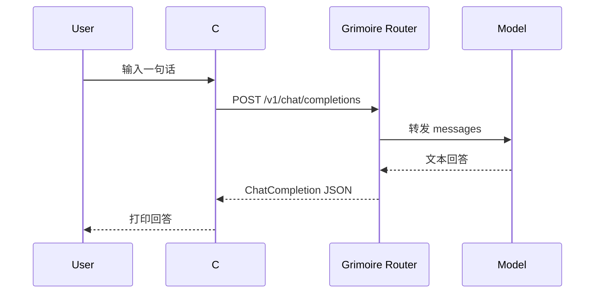

# 第 1 章：第一次模型调用

[下一章：角色与配置](02-profile-and-api.md)

## 本章起点与终点

| 项目 | 内容 |
|---|---|
| 起点 | 一个空目录，安装了 .NET SDK |
| 终点 | C# 控制台能够调用 `POST /v1/chat/completions` |
| 外部依赖 | Grimoire Router 与有效 API Key |
| 本地验收 | 项目编译通过，0 warning、0 error |

## 1.1 先分清 LLM 与 Agent

这一章只做模型调用，还没有 Agent。



这里没有工具、循环、记忆、状态机或工作流。程序发送一次请求，模型返回一次文本。

Agent 会在后面增加“观察结果后继续行动”的循环：

```text
LLM 调用 = messages -> model -> text
Agent     = LLM 调用 + 工具 + 状态 + 循环 + 控制规则
```

## 1.2 curl 请求与 C# 对照

Router 的请求形式：

```bash
curl --location 'https://router.hddev.top/v1/chat/completions' \
  --header 'Authorization: Bearer xxxxxxxxx' \
  --header 'Content-Type: application/json' \
  --data '{
    "model": "gpt-5.4",
    "messages": [
      { "role": "user", "content": "你好，用一句话介绍你自己。" }
    ],
    "stream": false
  }'
```

四个关键输入：

| curl | C# 中对应内容 |
|---|---|
| URL | `OpenAIClientOptions.Endpoint` + SDK 路径 |
| Bearer Key | `ApiKeyCredential` |
| `model` | `ChatClient` 构造参数 |
| `messages` | `CompleteChatAsync` 参数 |

## 1.3 创建项目

新建空目录后创建下面结构：

```text
src/
└── AgentLearning.App/
    ├── AgentLearning.App.csproj
    └── Program.cs
.gitignore
```

完整项目文件：

```xml
<Project Sdk="Microsoft.NET.Sdk">

  <ItemGroup>
    <PackageReference Include="OpenAI" Version="2.12.0" />
  </ItemGroup>

  <PropertyGroup>
    <OutputType>Exe</OutputType>
    <TargetFramework>net8.0</TargetFramework>
    <ImplicitUsings>enable</ImplicitUsings>
    <Nullable>enable</Nullable>
  </PropertyGroup>

</Project>
```

`OpenAI` 包负责把 C# 对象序列化为 OpenAI-compatible JSON，并解析服务端响应。`net8.0` 是目标框架，不等于本机 SDK 必须刚好是 8.0。

## 1.4 完整 Program.cs

```csharp
using OpenAI;
using OpenAI.Chat;
using System.ClientModel;

const string model = "gpt-5.4";
const string baseUrl = "https://router.hddev.top/v1";
const string apiKeyEnvironmentVariable = "GRIMOIRE_API_KEY";

string? apiKey = Environment.GetEnvironmentVariable(apiKeyEnvironmentVariable);
if (string.IsNullOrWhiteSpace(apiKey))
{
    Console.WriteLine($"Set {apiKeyEnvironmentVariable} before running this lesson.");
    return 1;
}

ChatClient client = new(
    model: model,
    credential: new ApiKeyCredential(apiKey),
    options: new OpenAIClientOptions
    {
        Endpoint = new Uri(baseUrl)
    });

Console.Write("You> ");
string? input = Console.ReadLine();
if (string.IsNullOrWhiteSpace(input))
{
    Console.WriteLine("A message is required.");
    return 1;
}

ChatCompletion completion = await client.CompleteChatAsync([
    new UserChatMessage(input)
]);

string reply = completion.Content.Count > 0
    ? completion.Content[0].Text
    : string.Empty;

Console.WriteLine($"Grimoire Router> {reply}");
return 0;
```

逐块理解：

1. `Environment.GetEnvironmentVariable` 取得密钥，避免写进源码。
2. `ChatClient` 保存模型、认证和 Endpoint。
3. `UserChatMessage` 变成请求体里的 `messages[0]`。
4. `CompleteChatAsync` 就是这一章真正发网络请求的语句。
5. `completion.Content[0].Text` 取得模型文本。

最关键的一句是：

```csharp
ChatCompletion completion = await client.CompleteChatAsync(messages);
```

后面即使加入 AgentRunner，所有主模型请求最终仍会经过同类调用。

## 1.5 SDK 实际构造的请求

概念上的 HTTP Body：

```json
{
  "model": "gpt-5.4",
  "messages": [
    {
      "role": "user",
      "content": "你好，用一句话介绍你自己。"
    }
  ],
  "stream": false
}
```

`Authorization` 不在 JSON Body 中，而在 HTTP Header：

```http
Authorization: Bearer <GRIMOIRE_API_KEY>
Content-Type: application/json
```

## 1.6 编译与运行

编译：

```bash
dotnet build src/AgentLearning.App/AgentLearning.App.csproj
```

真实构建结果：


设置密钥后运行：

```bash
export GRIMOIRE_API_KEY="你的密钥"
dotnet run --project src/AgentLearning.App/AgentLearning.App.csproj
```

有效 Router 的预期交互：

```text
You> 你好，用一句话介绍你自己。
Grimoire Router> 我是一个可以通过 C# 程序调用的 AI 助手。
```

模型措辞不是固定值，不应该写测试断言某一句具体回答。

## 1.7 常见错误

### 没有密钥

```text
Set GRIMOIRE_API_KEY before running this lesson.
```

说明代码尚未发请求。

### 401 Unauthorized

说明请求已经到 Router，但密钥无效、过期或没有对应权限。不要用重试掩盖 401，先修复凭据。

### SSL connection could not be established

说明 HTTPS 握手阶段失败，请检查证书链、代理、系统时间和网络。它发生在模型处理请求之前。

### 返回内容为空

SDK 的 `Content` 是集合，因为响应可能有多种内容部件。当前课程只读取第一个文本部件，后面会增加更严格的完成原因检查。

<!-- BEGIN SELF-CONTAINED CODE -->
## 本章完整文件代码

这一节是本章的**完整代码依据**。前面的代码用于解释概念；真正动手时，请从上一章完成后的目录继续，并按下表逐项操作。`新建` 表示创建此前不存在的文件，`完整覆盖` 表示把旧文件全部替换成这里的内容。不要只复制局部片段。

> 下面已经包含本章所需的全部新增和变更文件，不需要再查找其他代码文件。

先在项目根目录执行下面的命令，确保本章需要的目录存在：

```bash
mkdir -p src/AgentLearning.App
```

### 文件操作清单

| 操作 | 文件 |
|---|---|
| 新建 | `.gitignore` |
| 新建 | `src/AgentLearning.App/AgentLearning.App.csproj` |
| 新建 | `src/AgentLearning.App/Program.cs` |

<!-- FILE: ADD .gitignore -->
<details>
<summary><strong>新建</strong> <code>.gitignore</code></summary>

`````gitignore
bin/
obj/
agent.local.json
`````

</details>
<!-- END FILE -->

<!-- FILE: ADD src/AgentLearning.App/AgentLearning.App.csproj -->
<details>
<summary><strong>新建</strong> <code>src/AgentLearning.App/AgentLearning.App.csproj</code></summary>

`````xml
<Project Sdk="Microsoft.NET.Sdk">

  <ItemGroup>
    <PackageReference Include="OpenAI" Version="2.12.0" />
  </ItemGroup>

  <PropertyGroup>
    <OutputType>Exe</OutputType>
    <TargetFramework>net8.0</TargetFramework>
    <ImplicitUsings>enable</ImplicitUsings>
    <Nullable>enable</Nullable>
  </PropertyGroup>

</Project>
`````

</details>
<!-- END FILE -->

<!-- FILE: ADD src/AgentLearning.App/Program.cs -->
<details>
<summary><strong>新建</strong> <code>src/AgentLearning.App/Program.cs</code></summary>

`````csharp
using OpenAI;
using OpenAI.Chat;
using System.ClientModel;

const string model = "gpt-5.4";
const string baseUrl = "https://router.hddev.top/v1";
const string apiKeyEnvironmentVariable = "GRIMOIRE_API_KEY";

string? apiKey = Environment.GetEnvironmentVariable(apiKeyEnvironmentVariable);
if (string.IsNullOrWhiteSpace(apiKey))
{
    Console.WriteLine($"Set {apiKeyEnvironmentVariable} before running this lesson.");
    return 1;
}

ChatClient client = new(
    model: model,
    credential: new ApiKeyCredential(apiKey),
    options: new OpenAIClientOptions
    {
        Endpoint = new Uri(baseUrl)
    });

Console.Write("You> ");
string? input = Console.ReadLine();
if (string.IsNullOrWhiteSpace(input))
{
    Console.WriteLine("A message is required.");
    return 1;
}

ChatCompletion completion = await client.CompleteChatAsync([
    new UserChatMessage(input)
]);

string reply = completion.Content.Count > 0
    ? completion.Content[0].Text
    : string.Empty;

Console.WriteLine($"Grimoire Router> {reply}");
return 0;
`````

</details>
<!-- END FILE -->

### 编译与自动化验收

在项目根目录执行：

```bash
dotnet build src/AgentLearning.App/AgentLearning.App.csproj
```

应看到的关键结果：

```text
Build succeeded.
    0 Warning(s)
    0 Error(s)
```

<!-- END SELF-CONTAINED CODE -->

## 本章验收

- [ ] 能解释 `ChatClient`、`UserChatMessage`、`CompleteChatAsync` 的职责。
- [ ] 知道 API Key 在 Header，不在请求体。
- [ ] 能构建项目并得到 0 error。
- [ ] 有有效密钥时，能完成一次真实对话。
- [ ] 知道当前程序还不是 Agent，因为它没有工具与行动循环。

## 本章小结

我们只完成了最小模型调用。下一章将连接地址、模型、角色和密钥从 `Program.cs` 拆到配置中，并用 System Message 让模型拥有稳定角色。

[下一章：角色设定、配置与 System Message](02-profile-and-api.md)
