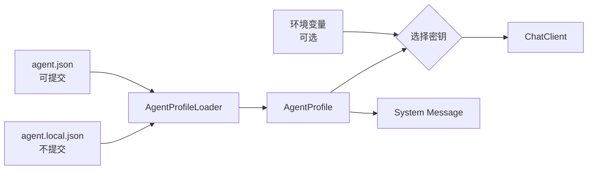
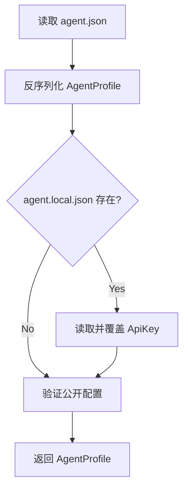

# 第 2 章：角色设定、配置与 System Message

[上一章：第一次模型调用](01-from-llm-to-agent.md) | [下一章：Skill 与 Tool Calling](03-skills-and-tool-calling.md)

## 本章起点与终点

| 项目 | 内容 |
|---|---|
| 起点 | 第 1 章把模型、URL、密钥变量名写在 `Program.cs` |
| 终点 | Profile 管理角色与接线，本地文件管理密钥 |
| 新项目 | `AgentLearning.Core` 与测试项目 |
| 自动化验收 | 2 tests |

## 2.1 为什么需要 Profile

第 1 章的代码能跑，但所有配置与流程混在一起。以后修改模型或角色就必须改源码。

Profile 把两类配置分开：



- `agent.json`：名称、模型、URL、角色、行为开关。
- `agent.local.json`：本机私有 API Key。
- 环境变量：没有本地 Key 时的备用来源。

## 2.2 角色设定到底做什么

配置中的两个字段：

```json
{
  "description": "A patient C# agent teacher for a beginner learning how agents work.",
  "instructions": "Teach one concept at a time. Prefer small examples. Explain why each piece exists before adding the next piece."
}
```

它们不是 C# 业务逻辑，也不会自动赋予模型工具。

- `description` 是“这个 Agent 是做什么的”。
- `instructions` 是“回答时遵守什么方式和边界”。

程序把它们组合成 System Message：

```csharp
string systemInstructions = $"""
    You are {profile.Name}.
    Description: {profile.Description}
    Instructions: {profile.Instructions}
    """;
```

模型收到的消息顺序：

```json
[
  {
    "role": "system",
    "content": "You are Grimoire Router..."
  },
  {
    "role": "user",
    "content": "请解释 async/await"
  }
]
```

System Message 是上下文中的高优先级说明，不是绝对安全边界。工具权限仍然必须由 C# 代码控制。

## 2.3 创建 Core 项目

第 2 章结构：

```text
src/
├── AgentLearning.App/
│   ├── AgentLearning.App.csproj
│   ├── Program.cs
│   └── agent.json
└── AgentLearning.Core/
    ├── AgentLearning.Core.csproj
    ├── AgentProfile.cs
    └── AgentProfileLoader.cs
tests/
└── AgentLearning.Core.Tests/
    └── AgentProfileLoaderTests.cs
```

App 引用 Core：

```xml
<ItemGroup>
  <ProjectReference Include="..\AgentLearning.Core\AgentLearning.Core.csproj" />
</ItemGroup>
```

## 2.4 AgentProfile 完整数据模型

```csharp
using System.Text.Json.Serialization;

namespace AgentLearning.Core;

public sealed record AgentProfile(
    string Name,
    string Model,
    [property: JsonPropertyName("base_url")] string BaseUrl,
    [property: JsonPropertyName("env_key")] string EnvKey,
    [property: JsonPropertyName("wire_api")] string WireApi,
    [property: JsonPropertyName("stream")] bool Stream,
    [property: JsonPropertyName("api_key")] string? ApiKey,
    string Description,
    string Instructions);
```

为什么使用 `record`：

- 主要承载数据。
- 构造参数明确要求必填字段。
- `with` 可以在不修改原对象的情况下合并本地 Key。

`JsonPropertyName` 把 C# 的 `BaseUrl` 映射到 JSON 的 `base_url`。

## 2.5 主配置与私有配置

`agent.json` 完整内容：

```json
{
  "name": "Grimoire Router",
  "model": "gpt-5.4",
  "base_url": "https://router.hddev.top/v1",
  "env_key": "GRIMOIRE_API_KEY",
  "wire_api": "chat_completions",
  "stream": false,
  "description": "A patient C# agent teacher for a beginner learning how agents work.",
  "instructions": "Teach one concept at a time. Prefer small examples. Explain why each piece exists before adding the next piece."
}
```

本机创建 `agent.local.json`：

```json
{
  "api_key": "你的真实密钥"
}
```

`.gitignore` 必须有：

```gitignore
agent.local.json
```

## 2.6 为什么配置要复制到输出目录

程序运行目录不是源码目录，而是类似：

```text
bin/Debug/net8.0/
```

所以 App 项目加入：

```xml
<ItemGroup>
  <None Update="agent.json">
    <CopyToOutputDirectory>PreserveNewest</CopyToOutputDirectory>
  </None>
  <None Update="agent.local.json">
    <CopyToOutputDirectory>PreserveNewest</CopyToOutputDirectory>
  </None>
</ItemGroup>
```

运行时再用：

```csharp
string profilePath = Path.Combine(AppContext.BaseDirectory, "agent.json");
```

## 2.7 ProfileLoader 的核心流程



核心代码：

```csharp
await using FileStream stream = File.OpenRead(filePath);
AgentProfile? profile = await JsonSerializer.DeserializeAsync<AgentProfile>(
    stream,
    JsonOptions,
    cancellationToken);

if (profile is null)
{
    throw new InvalidOperationException("Agent profile file is empty or invalid.");
}

profile = await MergeLocalProfileAsync(profile, localFilePath, cancellationToken);
Validate(profile);
return profile;
```

合并密钥：

```csharp
return string.IsNullOrWhiteSpace(localProfile?.ApiKey)
    ? profile
    : profile with { ApiKey = localProfile.ApiKey.Trim() };
```

校验原则是“配置错就明确失败”，而不是偷偷使用默认 URL：

```csharp
if (!Uri.TryCreate(profile.BaseUrl, UriKind.Absolute, out _))
{
    throw new InvalidOperationException(
        "Agent profile field 'base_url' must be an absolute URL.");
}

if (!profile.WireApi.Equals("chat_completions", StringComparison.OrdinalIgnoreCase))
{
    throw new InvalidOperationException(
        "Only wire_api = 'chat_completions' is supported.");
}
```

本章末尾的‘完整文件代码’包含 Loader 的可直接编译版本。

## 2.8 密钥选择顺序

```csharp
string? apiKey = profile.ApiKey
    ?? Environment.GetEnvironmentVariable(profile.EnvKey);
```

优先级：

1. `agent.local.json` 的 `api_key`。
2. `GRIMOIRE_API_KEY` 环境变量。
3. 都没有则退出，不发请求。

注意：`env_key` 保存的是环境变量名称，不是密钥本身。

## 2.9 App 发出的完整消息

```csharp
ChatCompletion completion = await client.CompleteChatAsync([
    new SystemChatMessage(systemInstructions),
    new UserChatMessage(input)
]);
```

这一句仍然是实际调用模型的位置。Profile 只是帮它准备参数，并没有代替模型请求。

## 2.10 测试为什么重要

这一章先测试最容易出错、又不需要真实网络的配置逻辑：

```csharp
[Fact]
public async Task LoadFromFileAsync_MergesApiKeyFromLocalProfile()
{
    // Arrange: write public and private JSON files.
    // Act: load the merged profile.
    // Assert: local api_key wins.
}

[Fact]
public async Task LoadFromFileAsync_RejectsUnsupportedWireApi()
{
    // The lesson supports chat_completions only.
}
```

本章末尾的‘完整文件代码’包含完整测试文件。

运行：

```bash
dotnet test tests/AgentLearning.Core.Tests/AgentLearning.Core.Tests.csproj
```

实际结果：


## 2.11 常见错误

### 源码目录有配置，运行目录没有

检查 `CopyToOutputDirectory`，再确认：

```bash
ls src/AgentLearning.App/bin/Debug/net8.0/agent*.json
```

### 把 `wire_api` 写成 `responses`

用户最初给的配置写过 `responses`，但 curl 和当前 SDK 路径使用的是 `chat_completions`。本项目当前按真实 curl 实现，Loader 会直接拒绝不支持值。

### 把 API Key 放进 agent.json

技术上能反序列化，但会被提交。只放在 `agent.local.json`。

<!-- BEGIN SELF-CONTAINED CODE -->
## 本章完整文件代码

这一节是本章的**完整代码依据**。前面的代码用于解释概念；真正动手时，请从上一章完成后的目录继续，并按下表逐项操作。`新建` 表示创建此前不存在的文件，`完整覆盖` 表示把旧文件全部替换成这里的内容。不要只复制局部片段。

> 下面已经包含本章所需的全部新增和变更文件，不需要再查找其他代码文件。

先在项目根目录执行下面的命令，确保本章需要的目录存在：

```bash
mkdir -p src/AgentLearning.App src/AgentLearning.Core tests/AgentLearning.Core.Tests
```

### 文件操作清单

| 操作 | 文件 |
|---|---|
| 新建 | `src/AgentLearning.App/agent.json` |
| 新建 | `src/AgentLearning.Core/AgentLearning.Core.csproj` |
| 新建 | `src/AgentLearning.Core/AgentProfile.cs` |
| 新建 | `src/AgentLearning.Core/AgentProfileLoader.cs` |
| 新建 | `tests/AgentLearning.Core.Tests/AgentLearning.Core.Tests.csproj` |
| 新建 | `tests/AgentLearning.Core.Tests/AgentProfileLoaderTests.cs` |
| 完整覆盖 | `src/AgentLearning.App/AgentLearning.App.csproj` |
| 完整覆盖 | `src/AgentLearning.App/Program.cs` |

<!-- FILE: ADD src/AgentLearning.App/agent.json -->
<details>
<summary><strong>新建</strong> <code>src/AgentLearning.App/agent.json</code></summary>

`````json
{
  "name": "Grimoire Router",
  "model": "gpt-5.4",
  "base_url": "https://router.hddev.top/v1",
  "env_key": "GRIMOIRE_API_KEY",
  "wire_api": "chat_completions",
  "stream": false,
  "description": "A patient C# agent teacher for a beginner learning how agents work.",
  "instructions": "Teach one concept at a time. Prefer small examples. Explain why each piece exists before adding the next piece."
}
`````

</details>
<!-- END FILE -->

<!-- FILE: ADD src/AgentLearning.Core/AgentLearning.Core.csproj -->
<details>
<summary><strong>新建</strong> <code>src/AgentLearning.Core/AgentLearning.Core.csproj</code></summary>

`````xml
<Project Sdk="Microsoft.NET.Sdk">

  <PropertyGroup>
    <TargetFramework>net8.0</TargetFramework>
    <ImplicitUsings>enable</ImplicitUsings>
    <Nullable>enable</Nullable>
  </PropertyGroup>

</Project>
`````

</details>
<!-- END FILE -->

<!-- FILE: ADD src/AgentLearning.Core/AgentProfile.cs -->
<details>
<summary><strong>新建</strong> <code>src/AgentLearning.Core/AgentProfile.cs</code></summary>

`````csharp
using System.Text.Json.Serialization;

namespace AgentLearning.Core;

public sealed record AgentProfile(
    string Name,
    string Model,
    [property: JsonPropertyName("base_url")] string BaseUrl,
    [property: JsonPropertyName("env_key")] string EnvKey,
    [property: JsonPropertyName("wire_api")] string WireApi,
    [property: JsonPropertyName("stream")] bool Stream,
    [property: JsonPropertyName("api_key")] string? ApiKey,
    string Description,
    string Instructions);
`````

</details>
<!-- END FILE -->

<!-- FILE: ADD src/AgentLearning.Core/AgentProfileLoader.cs -->
<details>
<summary><strong>新建</strong> <code>src/AgentLearning.Core/AgentProfileLoader.cs</code></summary>

`````csharp
using System.Text.Json;
using System.Text.Json.Serialization;

namespace AgentLearning.Core;

public static class AgentProfileLoader
{
    private static readonly JsonSerializerOptions JsonOptions = new()
    {
        PropertyNameCaseInsensitive = true
    };

    public static async Task<AgentProfile> LoadFromFileAsync(
        string filePath,
        string? localFilePath = null,
        CancellationToken cancellationToken = default)
    {
        if (!File.Exists(filePath))
        {
            throw new FileNotFoundException("Agent profile file was not found.", filePath);
        }

        await using FileStream stream = File.OpenRead(filePath);
        AgentProfile? profile = await JsonSerializer.DeserializeAsync<AgentProfile>(
            stream,
            JsonOptions,
            cancellationToken);

        if (profile is null)
        {
            throw new InvalidOperationException("Agent profile file is empty or invalid.");
        }

        profile = await MergeLocalProfileAsync(profile, localFilePath, cancellationToken);
        Validate(profile);
        return profile;
    }

    private static async Task<AgentProfile> MergeLocalProfileAsync(
        AgentProfile profile,
        string? localFilePath,
        CancellationToken cancellationToken)
    {
        if (string.IsNullOrWhiteSpace(localFilePath) || !File.Exists(localFilePath))
        {
            return profile;
        }

        await using FileStream stream = File.OpenRead(localFilePath);
        AgentLocalProfile? localProfile = await JsonSerializer.DeserializeAsync<AgentLocalProfile>(
            stream,
            JsonOptions,
            cancellationToken);

        return string.IsNullOrWhiteSpace(localProfile?.ApiKey)
            ? profile
            : profile with { ApiKey = localProfile.ApiKey.Trim() };
    }

    private static void Validate(AgentProfile profile)
    {
        RequireValue(profile.Name, "name");
        RequireValue(profile.Model, "model");
        RequireValue(profile.BaseUrl, "base_url");
        RequireValue(profile.EnvKey, "env_key");
        RequireValue(profile.WireApi, "wire_api");
        RequireValue(profile.Description, "description");
        RequireValue(profile.Instructions, "instructions");

        if (!Uri.TryCreate(profile.BaseUrl, UriKind.Absolute, out _))
        {
            throw new InvalidOperationException("Agent profile field 'base_url' must be an absolute URL.");
        }

        if (!profile.WireApi.Equals("chat_completions", StringComparison.OrdinalIgnoreCase))
        {
            throw new InvalidOperationException("Only wire_api = 'chat_completions' is supported.");
        }
    }

    private static void RequireValue(string? value, string fieldName)
    {
        if (string.IsNullOrWhiteSpace(value))
        {
            throw new InvalidOperationException($"Agent profile field '{fieldName}' is required.");
        }
    }

    private sealed record AgentLocalProfile(
        [property: JsonPropertyName("api_key")] string? ApiKey);
}
`````

</details>
<!-- END FILE -->

<!-- FILE: ADD tests/AgentLearning.Core.Tests/AgentLearning.Core.Tests.csproj -->
<details>
<summary><strong>新建</strong> <code>tests/AgentLearning.Core.Tests/AgentLearning.Core.Tests.csproj</code></summary>

`````xml
<Project Sdk="Microsoft.NET.Sdk">

  <ItemGroup>
    <PackageReference Include="Microsoft.NET.Test.Sdk" Version="17.14.1" />
    <PackageReference Include="xunit.v3" Version="3.0.1" />
    <PackageReference Include="xunit.runner.visualstudio" Version="3.1.1" />
  </ItemGroup>

  <ItemGroup>
    <ProjectReference Include="..\..\src\AgentLearning.Core\AgentLearning.Core.csproj" />
  </ItemGroup>

  <ItemGroup>
    <Using Include="Xunit" />
  </ItemGroup>

  <PropertyGroup>
    <TargetFramework>net8.0</TargetFramework>
    <ImplicitUsings>enable</ImplicitUsings>
    <Nullable>enable</Nullable>
    <IsPackable>false</IsPackable>
    <IsTestProject>true</IsTestProject>
  </PropertyGroup>

</Project>
`````

</details>
<!-- END FILE -->

<!-- FILE: ADD tests/AgentLearning.Core.Tests/AgentProfileLoaderTests.cs -->
<details>
<summary><strong>新建</strong> <code>tests/AgentLearning.Core.Tests/AgentProfileLoaderTests.cs</code></summary>

`````csharp
using AgentLearning.Core;

namespace AgentLearning.Core.Tests;

public sealed class AgentProfileLoaderTests
{
    [Fact]
    public async Task LoadFromFileAsync_MergesApiKeyFromLocalProfile()
    {
        CancellationToken cancellationToken = TestContext.Current.CancellationToken;
        string directory = Path.Combine(Path.GetTempPath(), $"agent-profile-{Guid.NewGuid():N}");
        Directory.CreateDirectory(directory);
        string profilePath = Path.Combine(directory, "agent.json");
        string localProfilePath = Path.Combine(directory, "agent.local.json");

        try
        {
            await File.WriteAllTextAsync(profilePath, """
                {
                  "name": "Teacher",
                  "model": "gpt-5.4",
                  "base_url": "https://example.test/v1",
                  "env_key": "TEST_API_KEY",
                  "wire_api": "chat_completions",
                  "stream": false,
                  "description": "C# teacher",
                  "instructions": "Teach one step at a time."
                }
                """, cancellationToken);
            await File.WriteAllTextAsync(localProfilePath, """
                { "api_key": "local-secret" }
                """, cancellationToken);

            AgentProfile profile = await AgentProfileLoader.LoadFromFileAsync(
                profilePath,
                localProfilePath,
                cancellationToken);

            Assert.Equal("Teacher", profile.Name);
            Assert.Equal("local-secret", profile.ApiKey);
        }
        finally
        {
            Directory.Delete(directory, recursive: true);
        }
    }

    [Fact]
    public async Task LoadFromFileAsync_RejectsUnsupportedWireApi()
    {
        CancellationToken cancellationToken = TestContext.Current.CancellationToken;
        string filePath = Path.GetTempFileName();
        try
        {
            await File.WriteAllTextAsync(filePath, """
                {
                  "name": "Teacher",
                  "model": "gpt-5.4",
                  "base_url": "https://example.test/v1",
                  "env_key": "TEST_API_KEY",
                  "wire_api": "responses",
                  "stream": false,
                  "description": "C# teacher",
                  "instructions": "Teach one step at a time."
                }
                """, cancellationToken);

            InvalidOperationException exception = await Assert.ThrowsAsync<InvalidOperationException>(
                () => AgentProfileLoader.LoadFromFileAsync(
                    filePath,
                    cancellationToken: cancellationToken));

            Assert.Contains("chat_completions", exception.Message);
        }
        finally
        {
            File.Delete(filePath);
        }
    }
}
`````

</details>
<!-- END FILE -->

<!-- FILE: REPLACE src/AgentLearning.App/AgentLearning.App.csproj -->
<details>
<summary><strong>完整覆盖</strong> <code>src/AgentLearning.App/AgentLearning.App.csproj</code></summary>

`````xml
<Project Sdk="Microsoft.NET.Sdk">

  <ItemGroup>
    <ProjectReference Include="..\AgentLearning.Core\AgentLearning.Core.csproj" />
  </ItemGroup>

  <ItemGroup>
    <PackageReference Include="OpenAI" Version="2.12.0" />
  </ItemGroup>

  <ItemGroup>
    <None Update="agent.json">
      <CopyToOutputDirectory>PreserveNewest</CopyToOutputDirectory>
    </None>
    <None Update="agent.local.json">
      <CopyToOutputDirectory>PreserveNewest</CopyToOutputDirectory>
    </None>
  </ItemGroup>

  <PropertyGroup>
    <OutputType>Exe</OutputType>
    <TargetFramework>net8.0</TargetFramework>
    <ImplicitUsings>enable</ImplicitUsings>
    <Nullable>enable</Nullable>
  </PropertyGroup>

</Project>
`````

</details>
<!-- END FILE -->

<!-- FILE: REPLACE src/AgentLearning.App/Program.cs -->
<details>
<summary><strong>完整覆盖</strong> <code>src/AgentLearning.App/Program.cs</code></summary>

`````csharp
using AgentLearning.Core;
using OpenAI;
using OpenAI.Chat;
using System.ClientModel;

string profilePath = Path.Combine(AppContext.BaseDirectory, "agent.json");
string localProfilePath = Path.Combine(AppContext.BaseDirectory, "agent.local.json");
AgentProfile profile = await AgentProfileLoader.LoadFromFileAsync(profilePath, localProfilePath);

string? apiKey = profile.ApiKey ?? Environment.GetEnvironmentVariable(profile.EnvKey);
if (string.IsNullOrWhiteSpace(apiKey))
{
    Console.WriteLine($"No API key was found in agent.local.json or {profile.EnvKey}.");
    return 1;
}

ChatClient client = new(
    model: profile.Model,
    credential: new ApiKeyCredential(apiKey),
    options: new OpenAIClientOptions
    {
        Endpoint = new Uri(profile.BaseUrl)
    });

Console.Write("You> ");
string? input = Console.ReadLine();
if (string.IsNullOrWhiteSpace(input))
{
    Console.WriteLine("A message is required.");
    return 1;
}

string systemInstructions = $"""
    You are {profile.Name}.
    Description: {profile.Description}
    Instructions: {profile.Instructions}
    """;

ChatCompletion completion = await client.CompleteChatAsync([
    new SystemChatMessage(systemInstructions),
    new UserChatMessage(input)
]);

string reply = completion.Content.Count > 0
    ? completion.Content[0].Text
    : string.Empty;

Console.WriteLine($"{profile.Name}> {reply}");
return 0;
`````

</details>
<!-- END FILE -->

### 编译与自动化验收

在项目根目录执行：

```bash
dotnet test tests/AgentLearning.Core.Tests/AgentLearning.Core.Tests.csproj
```

应看到的关键结果（耗时会因电脑而不同）：

```text
Passed! - Failed: 0, Passed: 2, Skipped: 0, Total: 2
```

<!-- END SELF-CONTAINED CODE -->

## 本章验收

- [ ] 能解释 `description` 与 `instructions` 的区别。
- [ ] 能说出 System Message 在请求消息中的位置。
- [ ] 明白密钥选择顺序。
- [ ] 能解释为什么配置要复制到输出目录。
- [ ] 两个 Profile 测试全部通过。

## 本章小结

现在程序拥有稳定角色与可验证配置，但仍然只能生成文字。下一章给它注册真正的 C# Skill，并让模型通过 Native Tool Calling 自主决定是否调用。

[下一章：Skill 与原生 Tool Calling](03-skills-and-tool-calling.md)
