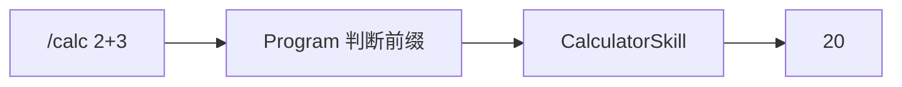
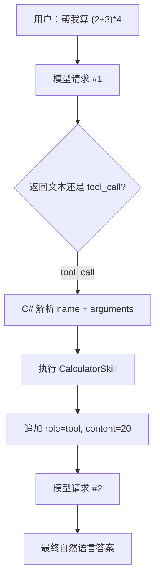

# 第 3 章：Skill 与原生 Tool Calling

[上一章：角色与配置](02-profile-and-api.md) | [下一章：Memory 与上下文](04-memory-and-context.md)

## 本章起点与终点

| 项目 | 内容 |
|---|---|
| 起点 | 模型只能返回文本 |
| 终点 | 模型能自主请求 `get_current_time` 或 `calculate`，C# 执行后把结果送回模型 |
| 自动化验收 | 13 tests |

## 3.1 `/calc` 与 Tool Calling 不是一回事

最早为了单独验证计算器，我们保留本地命令：

```text
You> /calc (2 + 3) * 4
Grimoire Router> 20
```

这条路径是用户明确选择工具：



理想的 Native Tool Calling 是模型选择：



`/calc` 是调试入口，Tool Calling 才是 Agent 行为入口。

## 3.2 模型不会真的执行函数

模型可能返回：

```json
{
  "id": "call_123",
  "type": "function",
  "function": {
    "name": "calculate",
    "arguments": "{\"expression\":\"(2+3)*4\"}"
  }
}
```

它的含义是：“客户端可以调用这个函数。”真正执行的是可信 C#：

```csharp
string result = await skillRegistry.ExecuteAsync(
    toolCall.FunctionName,
    toolCall.FunctionArguments.ToString());
```

因此权限、审批、超时和幂等都能由客户端掌握。模型不直接获得操作系统权限。

## 3.3 统一 Skill 契约

新增 `IAgentSkill`：

```csharp
namespace AgentLearning.Core.Skills;

public interface IAgentSkill
{
    string Name { get; }

    string Description { get; }

    string ParametersJson { get; }

    Task<string> ExecuteAsync(
        string argumentsJson,
        CancellationToken cancellationToken = default);
}
```

四个成员分别回答：

| 成员 | 给谁看 | 作用 |
|---|---|---|
| `Name` | 模型和 Registry | 工具唯一函数名 |
| `Description` | 模型 | 什么时候适合调用 |
| `ParametersJson` | 模型和服务端 | 参数 JSON Schema |
| `ExecuteAsync` | Harness | 真正执行动作 |

这就是项目内 Skill 配置，不是 Prompt 文件，也不是 `/calc` 路由规则。

## 3.4 实现计算器 Skill

工具元数据：

```csharp
public sealed class CalculatorSkill : IAgentSkill
{
    public string Name => "calculate";

    public string Description =>
        "Calculate a basic math expression with numbers, parentheses, +, -, *, and /.";

    public string ParametersJson => """
        {
          "type": "object",
          "properties": {
            "expression": {
              "type": "string",
              "description": "A basic math expression, for example: (2 + 3) * 4"
            }
          },
          "required": ["expression"],
          "additionalProperties": false
        }
        """;
}
```

执行入口：

```csharp
public Task<string> ExecuteAsync(
    string argumentsJson,
    CancellationToken cancellationToken = default)
{
    string expression = ReadExpression(argumentsJson);
    double result = new ExpressionParser(expression).Parse();
    return Task.FromResult(FormatNumber(result));
}
```

这里使用受限表达式解析器，只允许数字、括号和四则运算。不要用动态 C# 编译或脚本执行用户表达式，那会把“计算器”变成任意代码执行入口。

完整实现包括优先级、括号、负数和除零检查，都在本章末尾的“完整文件代码”中。

## 3.5 Skill Registry

当 Skill 增多时，不应该在 `Program.cs` 写：

```csharp
if (name == "calculate") { ... }
else if (name == "get_current_time") { ... }
```

Registry 建立名称到实现的映射：

```csharp
public sealed class AgentSkillRegistry
{
    private readonly Dictionary<string, IAgentSkill> _skills;

    public AgentSkillRegistry(IEnumerable<IAgentSkill> skills)
    {
        _skills = skills.ToDictionary(
            skill => skill.Name,
            StringComparer.Ordinal);
    }

    public IReadOnlyCollection<IAgentSkill> Skills => _skills.Values;

    public async Task<string> ExecuteAsync(
        string skillName,
        string argumentsJson,
        CancellationToken cancellationToken = default)
    {
        if (!_skills.TryGetValue(skillName, out IAgentSkill? skill))
        {
            throw new InvalidOperationException($"Unknown skill: {skillName}");
        }

        return await skill.ExecuteAsync(argumentsJson, cancellationToken);
    }
}
```

注册：

```csharp
AgentSkillRegistry skillRegistry = new([
    new TimeSkill(),
    new CalculatorSkill()
]);
```

## 3.6 把 Skill 声明为模型工具

`native_tool_calling = true` 时：

```csharp
static ChatCompletionOptions BuildChatOptions(
    AgentSkillRegistry skillRegistry)
{
    ChatCompletionOptions options = new();

    foreach (IAgentSkill skill in skillRegistry.Skills)
    {
        options.Tools.Add(ChatTool.CreateFunctionTool(
            functionName: skill.Name,
            functionDescription: skill.Description,
            functionParameters: BinaryData.FromString(skill.ParametersJson)));
    }

    return options;
}
```

概念请求体变成：

```json
{
  "model": "gpt-5.4",
  "messages": [
    { "role": "system", "content": "..." },
    { "role": "user", "content": "帮我算 (2+3)*4" }
  ],
  "tools": [
    {
      "type": "function",
      "function": {
        "name": "calculate",
        "description": "Calculate a basic math expression...",
        "parameters": {
          "type": "object",
          "properties": {
            "expression": { "type": "string" }
          },
          "required": ["expression"],
          "additionalProperties": false
        }
      }
    }
  ],
  "stream": false
}
```

工具描述和 Schema 都会占用模型上下文 Token，这也是后面需要 Tool Router 的原因。

## 3.7 完成 Tool Calling 循环

第一跳调用模型：

```csharp
ChatCompletion completion = await client.CompleteChatAsync(messages, options);
```

如果存在 Tool Calls：

```csharp
if (completion.ToolCalls.Count > 0)
{
    messages.Add(new AssistantChatMessage(completion));

    foreach (ChatToolCall toolCall in completion.ToolCalls)
    {
        string result = await skillRegistry.ExecuteAsync(
            toolCall.FunctionName,
            toolCall.FunctionArguments.ToString());

        messages.Add(new ToolChatMessage(toolCall.Id, result));
    }

    continue;
}
```

为什么必须追加两类消息：

1. `AssistantChatMessage(completion)` 保存模型原始的 Tool Call 和 `call_id`。
2. `ToolChatMessage(call_id, result)` 把执行结果与那次请求关联。

之后 `continue` 再问模型，模型才能根据 `20` 组织最终回答。

## 3.8 为什么可能循环

模型可以：

- 一次请求多个工具。
- 根据第一个结果继续请求第二个工具。
- 因为判断错误重复请求同一工具。

所以代码用 `while (true)`，但此时还没有最大次数限制。第 6 章会补 Guardrails。

## 3.9 流式模式限制

这一阶段只实现非流式 Tool Calling：

```csharp
if (profile.Stream && profile.NativeToolCalling)
{
    Console.WriteLine(
        "Native tool calling is only implemented for non-streaming mode in this lesson.");
    return 1;
}
```

流式 Tool Call 参数可能分片到达，需要累积并按调用 ID 拼接，初学阶段先明确拒绝没有实现的组合。

## 3.10 运行效果

先单独验证本地 Skill：

```bash
dotnet run --project src/AgentLearning.App/AgentLearning.App.csproj
```


Native Tool Calling 的预期消息链：

```text
You> 帮我算 (2 + 3) * 4
[Request #1] tools: calculate, get_current_time
[Response #1] tool_call: calculate {"expression":"(2 + 3) * 4"}
[Tool result] call_id=... content=20
[Request #2] messages include assistant tool_call and tool result
Grimoire Router> 计算结果是 20。
```

## 3.11 测试

```bash
dotnet test AgentLearning.sln
```

本章 13 个测试覆盖：

- Profile 读取和校验。
- Memory 基础顺序。
- Skill 注册和未知工具。
- 时间工具。
- 计算优先级、括号、负数、除零和非法字符。
- 调试请求预览。

<!-- BEGIN SELF-CONTAINED CODE -->
## 本章完整文件代码

这一节是本章的**完整代码依据**。前面的代码用于解释概念；真正动手时，请从上一章完成后的目录继续，并按下表逐项操作。`新建` 表示创建此前不存在的文件，`完整覆盖` 表示把旧文件全部替换成这里的内容。不要只复制局部片段。

> 下面已经包含本章所需的全部新增和变更文件，不需要再查找其他代码文件。

先在项目根目录执行下面的命令，确保本章需要的目录存在：

```bash
mkdir -p src/AgentLearning.App src/AgentLearning.Core src/AgentLearning.Core/Diagnostics src/AgentLearning.Core/Skills tests/AgentLearning.Core.Tests
```

### 文件操作清单

| 操作 | 文件 |
|---|---|
| 新建 | `AgentLearning.sln` |
| 新建 | `src/AgentLearning.Core/ChatMemory.cs` |
| 新建 | `src/AgentLearning.Core/ChatRole.cs` |
| 新建 | `src/AgentLearning.Core/ChatTurn.cs` |
| 新建 | `src/AgentLearning.Core/Diagnostics/AgentDebugMessage.cs` |
| 新建 | `src/AgentLearning.Core/Diagnostics/AgentDebugPreviewBuilder.cs` |
| 新建 | `src/AgentLearning.Core/Diagnostics/AgentDebugToolCall.cs` |
| 新建 | `src/AgentLearning.Core/Skills/AgentSkillRegistry.cs` |
| 新建 | `src/AgentLearning.Core/Skills/CalculatorSkill.cs` |
| 新建 | `src/AgentLearning.Core/Skills/IAgentSkill.cs` |
| 新建 | `src/AgentLearning.Core/Skills/TimeSkill.cs` |
| 新建 | `tests/AgentLearning.Core.Tests/AgentDebugPreviewBuilderTests.cs` |
| 新建 | `tests/AgentLearning.Core.Tests/AgentSkillRegistryTests.cs` |
| 新建 | `tests/AgentLearning.Core.Tests/CalculatorSkillTests.cs` |
| 新建 | `tests/AgentLearning.Core.Tests/ChatMemoryTests.cs` |
| 新建 | `tests/AgentLearning.Core.Tests/TimeSkillTests.cs` |
| 完整覆盖 | `.gitignore` |
| 完整覆盖 | `src/AgentLearning.App/Program.cs` |
| 完整覆盖 | `src/AgentLearning.App/agent.json` |
| 完整覆盖 | `src/AgentLearning.Core/AgentProfile.cs` |
| 完整覆盖 | `src/AgentLearning.Core/AgentProfileLoader.cs` |
| 完整覆盖 | `tests/AgentLearning.Core.Tests/AgentLearning.Core.Tests.csproj` |
| 完整覆盖 | `tests/AgentLearning.Core.Tests/AgentProfileLoaderTests.cs` |

<!-- FILE: ADD AgentLearning.sln -->
<details>
<summary><strong>新建</strong> <code>AgentLearning.sln</code></summary>

`````text

Microsoft Visual Studio Solution File, Format Version 12.00
# Visual Studio Version 17
VisualStudioVersion = 17.0.31903.59
MinimumVisualStudioVersion = 10.0.40219.1
Project("{2150E333-8FDC-42A3-9474-1A3956D46DE8}") = "src", "src", "{827E0CD3-B72D-47B6-A68D-7590B98EB39B}"
EndProject
Project("{FAE04EC0-301F-11D3-BF4B-00C04F79EFBC}") = "AgentLearning.App", "src\AgentLearning.App\AgentLearning.App.csproj", "{2879E30F-C422-4DDE-BF83-5E485002EC3B}"
EndProject
Project("{2150E333-8FDC-42A3-9474-1A3956D46DE8}") = "tests", "tests", "{0AB3BF05-4346-4AA6-1389-037BE0695223}"
EndProject
Project("{FAE04EC0-301F-11D3-BF4B-00C04F79EFBC}") = "AgentLearning.Core.Tests", "tests\AgentLearning.Core.Tests\AgentLearning.Core.Tests.csproj", "{36E36975-E72D-4819-B439-D6B61B749D83}"
EndProject
Project("{FAE04EC0-301F-11D3-BF4B-00C04F79EFBC}") = "AgentLearning.Core", "src\AgentLearning.Core\AgentLearning.Core.csproj", "{C4A85CBC-FD8B-4CF8-814F-1C7F511110EF}"
EndProject
Global
	GlobalSection(SolutionConfigurationPlatforms) = preSolution
		Debug|Any CPU = Debug|Any CPU
		Debug|x64 = Debug|x64
		Debug|x86 = Debug|x86
		Release|Any CPU = Release|Any CPU
		Release|x64 = Release|x64
		Release|x86 = Release|x86
	EndGlobalSection
	GlobalSection(ProjectConfigurationPlatforms) = postSolution
		{2879E30F-C422-4DDE-BF83-5E485002EC3B}.Debug|Any CPU.ActiveCfg = Debug|Any CPU
		{2879E30F-C422-4DDE-BF83-5E485002EC3B}.Debug|Any CPU.Build.0 = Debug|Any CPU
		{2879E30F-C422-4DDE-BF83-5E485002EC3B}.Debug|x64.ActiveCfg = Debug|Any CPU
		{2879E30F-C422-4DDE-BF83-5E485002EC3B}.Debug|x64.Build.0 = Debug|Any CPU
		{2879E30F-C422-4DDE-BF83-5E485002EC3B}.Debug|x86.ActiveCfg = Debug|Any CPU
		{2879E30F-C422-4DDE-BF83-5E485002EC3B}.Debug|x86.Build.0 = Debug|Any CPU
		{2879E30F-C422-4DDE-BF83-5E485002EC3B}.Release|Any CPU.ActiveCfg = Release|Any CPU
		{2879E30F-C422-4DDE-BF83-5E485002EC3B}.Release|Any CPU.Build.0 = Release|Any CPU
		{2879E30F-C422-4DDE-BF83-5E485002EC3B}.Release|x64.ActiveCfg = Release|Any CPU
		{2879E30F-C422-4DDE-BF83-5E485002EC3B}.Release|x64.Build.0 = Release|Any CPU
		{2879E30F-C422-4DDE-BF83-5E485002EC3B}.Release|x86.ActiveCfg = Release|Any CPU
		{2879E30F-C422-4DDE-BF83-5E485002EC3B}.Release|x86.Build.0 = Release|Any CPU
		{36E36975-E72D-4819-B439-D6B61B749D83}.Debug|Any CPU.ActiveCfg = Debug|Any CPU
		{36E36975-E72D-4819-B439-D6B61B749D83}.Debug|Any CPU.Build.0 = Debug|Any CPU
		{36E36975-E72D-4819-B439-D6B61B749D83}.Debug|x64.ActiveCfg = Debug|Any CPU
		{36E36975-E72D-4819-B439-D6B61B749D83}.Debug|x64.Build.0 = Debug|Any CPU
		{36E36975-E72D-4819-B439-D6B61B749D83}.Debug|x86.ActiveCfg = Debug|Any CPU
		{36E36975-E72D-4819-B439-D6B61B749D83}.Debug|x86.Build.0 = Debug|Any CPU
		{36E36975-E72D-4819-B439-D6B61B749D83}.Release|Any CPU.ActiveCfg = Release|Any CPU
		{36E36975-E72D-4819-B439-D6B61B749D83}.Release|Any CPU.Build.0 = Release|Any CPU
		{36E36975-E72D-4819-B439-D6B61B749D83}.Release|x64.ActiveCfg = Release|Any CPU
		{36E36975-E72D-4819-B439-D6B61B749D83}.Release|x64.Build.0 = Release|Any CPU
		{36E36975-E72D-4819-B439-D6B61B749D83}.Release|x86.ActiveCfg = Release|Any CPU
		{36E36975-E72D-4819-B439-D6B61B749D83}.Release|x86.Build.0 = Release|Any CPU
		{C4A85CBC-FD8B-4CF8-814F-1C7F511110EF}.Debug|Any CPU.ActiveCfg = Debug|Any CPU
		{C4A85CBC-FD8B-4CF8-814F-1C7F511110EF}.Debug|Any CPU.Build.0 = Debug|Any CPU
		{C4A85CBC-FD8B-4CF8-814F-1C7F511110EF}.Debug|x64.ActiveCfg = Debug|Any CPU
		{C4A85CBC-FD8B-4CF8-814F-1C7F511110EF}.Debug|x64.Build.0 = Debug|Any CPU
		{C4A85CBC-FD8B-4CF8-814F-1C7F511110EF}.Debug|x86.ActiveCfg = Debug|Any CPU
		{C4A85CBC-FD8B-4CF8-814F-1C7F511110EF}.Debug|x86.Build.0 = Debug|Any CPU
		{C4A85CBC-FD8B-4CF8-814F-1C7F511110EF}.Release|Any CPU.ActiveCfg = Release|Any CPU
		{C4A85CBC-FD8B-4CF8-814F-1C7F511110EF}.Release|Any CPU.Build.0 = Release|Any CPU
		{C4A85CBC-FD8B-4CF8-814F-1C7F511110EF}.Release|x64.ActiveCfg = Release|Any CPU
		{C4A85CBC-FD8B-4CF8-814F-1C7F511110EF}.Release|x64.Build.0 = Release|Any CPU
		{C4A85CBC-FD8B-4CF8-814F-1C7F511110EF}.Release|x86.ActiveCfg = Release|Any CPU
		{C4A85CBC-FD8B-4CF8-814F-1C7F511110EF}.Release|x86.Build.0 = Release|Any CPU
	EndGlobalSection
	GlobalSection(SolutionProperties) = preSolution
		HideSolutionNode = FALSE
	EndGlobalSection
	GlobalSection(NestedProjects) = preSolution
		{2879E30F-C422-4DDE-BF83-5E485002EC3B} = {827E0CD3-B72D-47B6-A68D-7590B98EB39B}
		{36E36975-E72D-4819-B439-D6B61B749D83} = {0AB3BF05-4346-4AA6-1389-037BE0695223}
		{C4A85CBC-FD8B-4CF8-814F-1C7F511110EF} = {827E0CD3-B72D-47B6-A68D-7590B98EB39B}
	EndGlobalSection
EndGlobal
`````

</details>
<!-- END FILE -->

<!-- FILE: ADD src/AgentLearning.Core/ChatMemory.cs -->
<details>
<summary><strong>新建</strong> <code>src/AgentLearning.Core/ChatMemory.cs</code></summary>

`````csharp
namespace AgentLearning.Core;

/// <summary>
/// 第一版短期记忆：只保存当前程序运行期间的对话。
/// 程序退出后记忆会消失，后面课程再升级成 JSON 或 SQLite 持久化。
/// </summary>
public sealed class ChatMemory
{
    // 内部用 List 保存，因为对话会一轮一轮追加。
    private readonly List<ChatTurn> _turns = [];

    // 对外只暴露只读视图，避免外部代码随便改乱记忆顺序。
    public IReadOnlyList<ChatTurn> Turns => _turns;

    /// <summary>
    /// 保存用户说的话。
    /// </summary>
    public void AddUserMessage(string content)
    {
        Add(ChatRole.User, content);
    }

    /// <summary>
    /// 保存 Agent 回复的话。
    /// </summary>
    public void AddAssistantMessage(string content)
    {
        Add(ChatRole.Assistant, content);
    }

    // 统一入口负责校验和去掉首尾空格。
    private void Add(ChatRole role, string content)
    {
        if (string.IsNullOrWhiteSpace(content))
        {
            throw new ArgumentException("Message content cannot be empty.", nameof(content));
        }

        _turns.Add(new ChatTurn(role, content.Trim()));
    }
}
`````

</details>
<!-- END FILE -->

<!-- FILE: ADD src/AgentLearning.Core/ChatRole.cs -->
<details>
<summary><strong>新建</strong> <code>src/AgentLearning.Core/ChatRole.cs</code></summary>

`````csharp
namespace AgentLearning.Core;

/// <summary>
/// 对话消息的角色。
/// Agent 至少要区分“用户说的”和“助手回答的”，模型才知道上下文是谁说的。
/// </summary>
public enum ChatRole
{
    /// <summary>用户输入。</summary>
    User,

    /// <summary>Agent 回复。</summary>
    Assistant
}
`````

</details>
<!-- END FILE -->

<!-- FILE: ADD src/AgentLearning.Core/ChatTurn.cs -->
<details>
<summary><strong>新建</strong> <code>src/AgentLearning.Core/ChatTurn.cs</code></summary>

`````csharp
namespace AgentLearning.Core;

/// <summary>
/// 一条对话记忆。
/// Role 说明是谁说的，Content 是具体文本。
/// </summary>
public sealed record ChatTurn(ChatRole Role, string Content);
`````

</details>
<!-- END FILE -->

<!-- FILE: ADD src/AgentLearning.Core/Diagnostics/AgentDebugMessage.cs -->
<details>
<summary><strong>新建</strong> <code>src/AgentLearning.Core/Diagnostics/AgentDebugMessage.cs</code></summary>

`````csharp
namespace AgentLearning.Core.Diagnostics;

/// <summary>
/// 调试视图里的 Chat Completions message。
/// 这里不用 OpenAI SDK 类型，是为了让核心逻辑更容易测试。
/// </summary>
public sealed record AgentDebugMessage
{
    /// <summary>消息角色，例如 system、user、assistant、tool。</summary>
    public required string Role { get; init; }

    /// <summary>普通文本内容；工具调用消息可以为空。</summary>
    public string? Content { get; init; }

    /// <summary>assistant 要求调用的工具列表。</summary>
    public IReadOnlyList<AgentDebugToolCall> ToolCalls { get; init; } = [];

    /// <summary>tool 消息对应的 tool_call_id。</summary>
    public string? ToolCallId { get; init; }
}
`````

</details>
<!-- END FILE -->

<!-- FILE: ADD src/AgentLearning.Core/Diagnostics/AgentDebugPreviewBuilder.cs -->
<details>
<summary><strong>新建</strong> <code>src/AgentLearning.Core/Diagnostics/AgentDebugPreviewBuilder.cs</code></summary>

`````csharp
using AgentLearning.Core.Skills;
using System.Text.Encodings.Web;
using System.Text.Json;
using System.Text.Json.Serialization;
using System.Text.RegularExpressions;

namespace AgentLearning.Core.Diagnostics;

/// <summary>
/// 构建给学习和排查问题用的请求体预览。
/// 注意：OpenAI SDK 会自己生成真实 HTTP 请求，这里打印的是等价的教学视图。
/// </summary>
public static class AgentDebugPreviewBuilder
{
    private static readonly JsonSerializerOptions JsonOptions = new()
    {
        WriteIndented = true,
        Encoder = JavaScriptEncoder.UnsafeRelaxedJsonEscaping,
        DefaultIgnoreCondition = JsonIgnoreCondition.WhenWritingNull
    };

    /// <summary>
    /// 构建一次 Chat Completions 请求体预览。
    /// </summary>
    public static string BuildChatCompletionsRequestPreview(
        string model,
        bool stream,
        IEnumerable<AgentDebugMessage> messages,
        IEnumerable<IAgentSkill> skills,
        bool includeTools)
    {
        Dictionary<string, object?> request = new()
        {
            ["model"] = model,
            ["messages"] = messages.Select(ToMessageShape).ToArray(),
            ["stream"] = stream
        };

        if (includeTools)
        {
            request["tools"] = skills.Select(ToToolShape).ToArray();
        }

        string json = JsonSerializer.Serialize(request, JsonOptions);
        return RedactSensitiveValues(json);
    }

    /// <summary>
    /// 隐藏常见敏感值，避免调试输出把密钥打印到屏幕上。
    /// </summary>
    public static string RedactSensitiveValues(string text)
    {
        string redacted = Regex.Replace(
            text,
            """(?i)("(?:api_key|authorization)"\s*:\s*"Bearer\s+)[^"]+(")""",
            "$1[redacted]$2");

        redacted = Regex.Replace(
            redacted,
            """(?i)("(?:api_key)"\s*:\s*")[^"]+(")""",
            "$1[redacted]$2");

        redacted = Regex.Replace(
            redacted,
            """(?i)(Authorization\s*:\s*Bearer\s+)[^\s"]+""",
            "$1[redacted]");

        return redacted;
    }

    private static Dictionary<string, object?> ToMessageShape(AgentDebugMessage message)
    {
        Dictionary<string, object?> shape = new()
        {
            ["role"] = message.Role
        };

        if (message.ToolCalls.Count > 0)
        {
            shape["content"] = message.Content;
            shape["tool_calls"] = message.ToolCalls.Select(ToToolCallShape).ToArray();
            return shape;
        }

        if (message.Role.Equals("tool", StringComparison.Ordinal))
        {
            shape["tool_call_id"] = message.ToolCallId;
            shape["content"] = message.Content;
            return shape;
        }

        shape["content"] = message.Content;
        return shape;
    }

    private static Dictionary<string, object?> ToToolCallShape(AgentDebugToolCall toolCall)
    {
        return new Dictionary<string, object?>
        {
            ["id"] = toolCall.Id,
            ["type"] = "function",
            ["function"] = new Dictionary<string, object?>
            {
                ["name"] = toolCall.Name,
                ["arguments"] = toolCall.ArgumentsJson
            }
        };
    }

    private static Dictionary<string, object?> ToToolShape(IAgentSkill skill)
    {
        return new Dictionary<string, object?>
        {
            ["type"] = "function",
            ["function"] = new Dictionary<string, object?>
            {
                ["name"] = skill.Name,
                ["description"] = skill.Description,
                ["parameters"] = ParseJsonObject(skill.ParametersJson)
            }
        };
    }

    private static JsonElement ParseJsonObject(string json)
    {
        using JsonDocument document = JsonDocument.Parse(json);
        return document.RootElement.Clone();
    }
}
`````

</details>
<!-- END FILE -->

<!-- FILE: ADD src/AgentLearning.Core/Diagnostics/AgentDebugToolCall.cs -->
<details>
<summary><strong>新建</strong> <code>src/AgentLearning.Core/Diagnostics/AgentDebugToolCall.cs</code></summary>

`````csharp
namespace AgentLearning.Core.Diagnostics;

/// <summary>
/// 调试视图里的工具调用。
/// 它只用于打印给人看，不负责真正调用工具。
/// </summary>
public sealed record AgentDebugToolCall(
    string Id,
    string Name,
    string ArgumentsJson);
`````

</details>
<!-- END FILE -->

<!-- FILE: ADD src/AgentLearning.Core/Skills/AgentSkillRegistry.cs -->
<details>
<summary><strong>新建</strong> <code>src/AgentLearning.Core/Skills/AgentSkillRegistry.cs</code></summary>

`````csharp
namespace AgentLearning.Core.Skills;

/// <summary>
/// 技能注册表。
/// 它负责按名字找到技能并执行，避免 Program.cs 里写一大堆 switch。
/// </summary>
public sealed class AgentSkillRegistry
{
    private readonly Dictionary<string, IAgentSkill> _skills;

    public AgentSkillRegistry(IEnumerable<IAgentSkill> skills)
    {
        _skills = skills.ToDictionary(skill => skill.Name, StringComparer.Ordinal);
    }

    /// <summary>所有可用技能。</summary>
    public IReadOnlyCollection<IAgentSkill> Skills => _skills.Values;

    /// <summary>按函数名执行技能。</summary>
    public async Task<string> ExecuteAsync(
        string skillName,
        string argumentsJson,
        CancellationToken cancellationToken = default)
    {
        if (!_skills.TryGetValue(skillName, out IAgentSkill? skill))
        {
            throw new InvalidOperationException($"Unknown skill: {skillName}");
        }

        return await skill.ExecuteAsync(argumentsJson, cancellationToken);
    }
}
`````

</details>
<!-- END FILE -->

<!-- FILE: ADD src/AgentLearning.Core/Skills/CalculatorSkill.cs -->
<details>
<summary><strong>新建</strong> <code>src/AgentLearning.Core/Skills/CalculatorSkill.cs</code></summary>

`````csharp
using System.Globalization;
using System.Text.Json;

namespace AgentLearning.Core.Skills;

/// <summary>
/// 简单计算器技能。
/// 第一版只支持数字、括号、加减乘除，避免执行任意代码带来安全风险。
/// </summary>
public sealed class CalculatorSkill : IAgentSkill
{
    public string Name => "calculate";

    public string Description => "Calculate a basic math expression with numbers, parentheses, +, -, *, and /.";

    public string ParametersJson => """
        {
          "type": "object",
          "properties": {
            "expression": {
              "type": "string",
              "description": "A basic math expression, for example: (2 + 3) * 4"
            }
          },
          "required": ["expression"],
          "additionalProperties": false
        }
        """;

    public Task<string> ExecuteAsync(string argumentsJson, CancellationToken cancellationToken = default)
    {
        string expression = ReadExpression(argumentsJson);
        double result = new ExpressionParser(expression).Parse();
        return Task.FromResult(FormatNumber(result));
    }

    private static string ReadExpression(string argumentsJson)
    {
        using JsonDocument document = JsonDocument.Parse(argumentsJson);

        if (!document.RootElement.TryGetProperty("expression", out JsonElement expressionElement))
        {
            throw new InvalidOperationException("Calculator skill requires a non-empty 'expression' argument.");
        }

        string? expression = expressionElement.GetString();
        if (string.IsNullOrWhiteSpace(expression))
        {
            throw new InvalidOperationException("Calculator skill requires a non-empty 'expression' argument.");
        }

        return expression;
    }

    private static string FormatNumber(double value)
    {
        return value.ToString("0.###############", CultureInfo.InvariantCulture);
    }

    private sealed class ExpressionParser
    {
        private readonly string _expression;
        private int _position;

        public ExpressionParser(string expression)
        {
            _expression = expression;
        }

        public double Parse()
        {
            double value = ParseExpression();
            SkipWhitespace();

            if (_position != _expression.Length)
            {
                throw new InvalidOperationException($"Unexpected character '{_expression[_position]}' in expression.");
            }

            return value;
        }

        private double ParseExpression()
        {
            double value = ParseTerm();

            while (true)
            {
                SkipWhitespace();

                if (Match('+'))
                {
                    value += ParseTerm();
                }
                else if (Match('-'))
                {
                    value -= ParseTerm();
                }
                else
                {
                    return value;
                }
            }
        }

        private double ParseTerm()
        {
            double value = ParseFactor();

            while (true)
            {
                SkipWhitespace();

                if (Match('*'))
                {
                    value *= ParseFactor();
                }
                else if (Match('/'))
                {
                    double divisor = ParseFactor();
                    if (divisor == 0)
                    {
                        throw new InvalidOperationException("Division by zero is not allowed.");
                    }

                    value /= divisor;
                }
                else
                {
                    return value;
                }
            }
        }

        private double ParseFactor()
        {
            SkipWhitespace();

            if (Match('('))
            {
                double value = ParseExpression();
                SkipWhitespace();

                if (!Match(')'))
                {
                    throw new InvalidOperationException("Missing closing parenthesis in expression.");
                }

                return value;
            }

            if (Match('-'))
            {
                return -ParseFactor();
            }

            return ParseNumber();
        }

        private double ParseNumber()
        {
            SkipWhitespace();
            int start = _position;

            while (_position < _expression.Length &&
                   (char.IsDigit(_expression[_position]) || _expression[_position] == '.'))
            {
                _position++;
            }

            if (start == _position)
            {
                throw new InvalidOperationException("Expected a number in expression.");
            }

            string token = _expression[start.._position];
            if (!double.TryParse(token, NumberStyles.Float, CultureInfo.InvariantCulture, out double value))
            {
                throw new InvalidOperationException($"Invalid number '{token}' in expression.");
            }

            return value;
        }

        private bool Match(char expected)
        {
            if (_position >= _expression.Length || _expression[_position] != expected)
            {
                return false;
            }

            _position++;
            return true;
        }

        private void SkipWhitespace()
        {
            while (_position < _expression.Length && char.IsWhiteSpace(_expression[_position]))
            {
                _position++;
            }
        }
    }
}
`````

</details>
<!-- END FILE -->

<!-- FILE: ADD src/AgentLearning.Core/Skills/IAgentSkill.cs -->
<details>
<summary><strong>新建</strong> <code>src/AgentLearning.Core/Skills/IAgentSkill.cs</code></summary>

`````csharp
namespace AgentLearning.Core.Skills;

/// <summary>
/// Agent 可以调用的一个技能。
/// 模型只负责“决定要不要调用”，真正执行动作的是这里的 C# 代码。
/// </summary>
public interface IAgentSkill
{
    /// <summary>模型调用工具时使用的函数名。</summary>
    string Name { get; }

    /// <summary>给模型看的技能说明，帮助模型判断什么时候该调用它。</summary>
    string Description { get; }

    /// <summary>给模型看的 JSON Schema，描述这个技能需要哪些参数。</summary>
    string ParametersJson { get; }

    /// <summary>
    /// 执行技能。
    /// argumentsJson 是模型按 ParametersJson 生成的参数 JSON。
    /// </summary>
    Task<string> ExecuteAsync(string argumentsJson, CancellationToken cancellationToken = default);
}
`````

</details>
<!-- END FILE -->

<!-- FILE: ADD src/AgentLearning.Core/Skills/TimeSkill.cs -->
<details>
<summary><strong>新建</strong> <code>src/AgentLearning.Core/Skills/TimeSkill.cs</code></summary>

`````csharp
namespace AgentLearning.Core.Skills;

/// <summary>
/// 返回当前时间的技能。
/// 这是最容易理解的 Tool Calling 示例：模型问时间，C# 代码提供真实时间。
/// </summary>
public sealed class TimeSkill : IAgentSkill
{
    private readonly Func<DateTimeOffset> _clock;

    public TimeSkill()
        : this(() => DateTimeOffset.Now)
    {
    }

    public TimeSkill(Func<DateTimeOffset> clock)
    {
        _clock = clock;
    }

    public string Name => "get_current_time";

    public string Description => "Get the current local date and time.";

    public string ParametersJson => """
        {
          "type": "object",
          "properties": {},
          "additionalProperties": false
        }
        """;

    public Task<string> ExecuteAsync(string argumentsJson, CancellationToken cancellationToken = default)
    {
        return Task.FromResult(_clock().ToString("O"));
    }
}
`````

</details>
<!-- END FILE -->

<!-- FILE: ADD tests/AgentLearning.Core.Tests/AgentDebugPreviewBuilderTests.cs -->
<details>
<summary><strong>新建</strong> <code>tests/AgentLearning.Core.Tests/AgentDebugPreviewBuilderTests.cs</code></summary>

`````csharp
using AgentLearning.Core.Diagnostics;
using AgentLearning.Core.Skills;
using System.Text.Json;

namespace AgentLearning.Core.Tests;

public sealed class AgentDebugPreviewBuilderTests
{
    [Fact]
    public void BuildChatCompletionsRequestPreview_includes_messages_and_tools()
    {
        AgentDebugMessage[] messages =
        [
            new()
            {
                Role = "system",
                Content = "You are Grimoire Router."
            },
            new()
            {
                Role = "user",
                Content = "帮我算一下 (2 + 3) * 4"
            }
        ];

        string preview = AgentDebugPreviewBuilder.BuildChatCompletionsRequestPreview(
            model: "gpt-5.4",
            stream: false,
            messages: messages,
            skills: [new CalculatorSkill()],
            includeTools: true);

        using JsonDocument document = JsonDocument.Parse(preview);
        JsonElement root = document.RootElement;

        Assert.Equal("gpt-5.4", root.GetProperty("model").GetString());
        Assert.False(root.GetProperty("stream").GetBoolean());
        Assert.Equal("system", root.GetProperty("messages")[0].GetProperty("role").GetString());
        Assert.Equal("user", root.GetProperty("messages")[1].GetProperty("role").GetString());
        Assert.Equal("function", root.GetProperty("tools")[0].GetProperty("type").GetString());
        Assert.Equal("calculate", root.GetProperty("tools")[0].GetProperty("function").GetProperty("name").GetString());
        Assert.Equal("object", root.GetProperty("tools")[0].GetProperty("function").GetProperty("parameters").GetProperty("type").GetString());
        Assert.Contains("帮我算一下 (2 + 3) * 4", preview);
    }

    [Fact]
    public void BuildChatCompletionsRequestPreview_includes_assistant_tool_call_and_tool_result()
    {
        AgentDebugMessage[] messages =
        [
            new()
            {
                Role = "assistant",
                ToolCalls =
                [
                    new AgentDebugToolCall(
                        Id: "call_123",
                        Name: "calculate",
                        ArgumentsJson: """{"expression":"(2 + 3) * 4"}""")
                ]
            },
            new()
            {
                Role = "tool",
                ToolCallId = "call_123",
                Content = "20"
            }
        ];

        string preview = AgentDebugPreviewBuilder.BuildChatCompletionsRequestPreview(
            model: "gpt-5.4",
            stream: false,
            messages: messages,
            skills: [],
            includeTools: false);

        using JsonDocument document = JsonDocument.Parse(preview);
        JsonElement root = document.RootElement;

        JsonElement assistantMessage = root.GetProperty("messages")[0];
        Assert.Equal("assistant", assistantMessage.GetProperty("role").GetString());
        Assert.Equal("call_123", assistantMessage.GetProperty("tool_calls")[0].GetProperty("id").GetString());
        Assert.Equal("calculate", assistantMessage.GetProperty("tool_calls")[0].GetProperty("function").GetProperty("name").GetString());
        Assert.Equal("""{"expression":"(2 + 3) * 4"}""", assistantMessage.GetProperty("tool_calls")[0].GetProperty("function").GetProperty("arguments").GetString());

        JsonElement toolMessage = root.GetProperty("messages")[1];
        Assert.Equal("tool", toolMessage.GetProperty("role").GetString());
        Assert.Equal("call_123", toolMessage.GetProperty("tool_call_id").GetString());
        Assert.Equal("20", toolMessage.GetProperty("content").GetString());
    }

    [Fact]
    public void RedactSensitiveValues_masks_api_keys_and_authorization_tokens()
    {
        string text = """
            {
              "api_key": "secret-api-key",
              "Authorization": "Bearer secret-bearer-token",
              "content": "normal text"
            }
            """;

        string redacted = AgentDebugPreviewBuilder.RedactSensitiveValues(text);

        Assert.DoesNotContain("secret-api-key", redacted);
        Assert.DoesNotContain("secret-bearer-token", redacted);
        Assert.Contains("\"api_key\": \"[redacted]\"", redacted);
        Assert.Contains("\"Authorization\": \"Bearer [redacted]\"", redacted);
        Assert.Contains("normal text", redacted);
    }
}
`````

</details>
<!-- END FILE -->

<!-- FILE: ADD tests/AgentLearning.Core.Tests/AgentSkillRegistryTests.cs -->
<details>
<summary><strong>新建</strong> <code>tests/AgentLearning.Core.Tests/AgentSkillRegistryTests.cs</code></summary>

`````csharp
using AgentLearning.Core.Skills;

namespace AgentLearning.Core.Tests;

public sealed class AgentSkillRegistryTests
{
    [Fact]
    public async Task ExecuteAsync_runs_registered_skill_by_name()
    {
        AgentSkillRegistry registry = new([
            new CalculatorSkill()
        ]);

        string result = await registry.ExecuteAsync("calculate", """{"expression":"6 * 7"}""");

        Assert.Equal("42", result);
    }

    [Fact]
    public async Task ExecuteAsync_rejects_unknown_skill_name()
    {
        AgentSkillRegistry registry = new([
            new CalculatorSkill()
        ]);

        InvalidOperationException exception = await Assert.ThrowsAsync<InvalidOperationException>(
            () => registry.ExecuteAsync("missing_skill", "{}"));

        Assert.Equal("Unknown skill: missing_skill", exception.Message);
    }
}
`````

</details>
<!-- END FILE -->

<!-- FILE: ADD tests/AgentLearning.Core.Tests/CalculatorSkillTests.cs -->
<details>
<summary><strong>新建</strong> <code>tests/AgentLearning.Core.Tests/CalculatorSkillTests.cs</code></summary>

`````csharp
using AgentLearning.Core.Skills;

namespace AgentLearning.Core.Tests;

public sealed class CalculatorSkillTests
{
    [Theory]
    [InlineData("""{"expression":"2 + 3 * 4"}""", "14")]
    [InlineData("""{"expression":"(2 + 3) * 4"}""", "20")]
    [InlineData("""{"expression":"10 / 4"}""", "2.5")]
    public async Task ExecuteAsync_calculates_basic_math_expressions(string argumentsJson, string expected)
    {
        CalculatorSkill skill = new();

        string result = await skill.ExecuteAsync(argumentsJson);

        Assert.Equal(expected, result);
    }

    [Fact]
    public async Task ExecuteAsync_rejects_missing_expression()
    {
        CalculatorSkill skill = new();

        InvalidOperationException exception = await Assert.ThrowsAsync<InvalidOperationException>(
            () => skill.ExecuteAsync("""{}"""));

        Assert.Equal("Calculator skill requires a non-empty 'expression' argument.", exception.Message);
    }
}
`````

</details>
<!-- END FILE -->

<!-- FILE: ADD tests/AgentLearning.Core.Tests/ChatMemoryTests.cs -->
<details>
<summary><strong>新建</strong> <code>tests/AgentLearning.Core.Tests/ChatMemoryTests.cs</code></summary>

`````csharp
using AgentLearning.Core;

namespace AgentLearning.Core.Tests;

public sealed class ChatMemoryTests
{
    [Fact]
    public void AddUserMessage_and_AddAssistantMessage_preserve_conversation_order()
    {
        ChatMemory memory = new();

        memory.AddUserMessage("What is an Agent?");
        memory.AddAssistantMessage("An Agent combines instructions, memory, tools, and a model.");

        IReadOnlyList<ChatTurn> turns = memory.Turns;

        Assert.Collection(
            turns,
            first =>
            {
                Assert.Equal(ChatRole.User, first.Role);
                Assert.Equal("What is an Agent?", first.Content);
            },
            second =>
            {
                Assert.Equal(ChatRole.Assistant, second.Role);
                Assert.Equal("An Agent combines instructions, memory, tools, and a model.", second.Content);
            });
    }
}
`````

</details>
<!-- END FILE -->

<!-- FILE: ADD tests/AgentLearning.Core.Tests/TimeSkillTests.cs -->
<details>
<summary><strong>新建</strong> <code>tests/AgentLearning.Core.Tests/TimeSkillTests.cs</code></summary>

`````csharp
using AgentLearning.Core.Skills;

namespace AgentLearning.Core.Tests;

public sealed class TimeSkillTests
{
    [Fact]
    public async Task ExecuteAsync_returns_current_time_from_clock()
    {
        DateTimeOffset fixedTime = new(2026, 7, 6, 9, 30, 0, TimeSpan.FromHours(8));
        TimeSkill skill = new(() => fixedTime);

        string result = await skill.ExecuteAsync("{}");

        Assert.Equal("2026-07-06T09:30:00.0000000+08:00", result);
    }
}
`````

</details>
<!-- END FILE -->

<!-- FILE: REPLACE .gitignore -->
<details>
<summary><strong>完整覆盖</strong> <code>.gitignore</code></summary>

`````gitignore
bin/
obj/
.vs/
.idea/
.vscode/
*.user
*.suo
src/AgentLearning.App/agent.local.json
`````

</details>
<!-- END FILE -->

<!-- FILE: REPLACE src/AgentLearning.App/Program.cs -->
<details>
<summary><strong>完整覆盖</strong> <code>src/AgentLearning.App/Program.cs</code></summary>

`````csharp
using AgentLearning.Core;
using AgentLearning.Core.Diagnostics;
using AgentLearning.Core.Skills;
using OpenAI;
using OpenAI.Chat;
using System.ClientModel;
using System.Text;
using System.Text.Json;

// AppContext.BaseDirectory 指向编译后的运行目录。
// csproj 已经配置了复制 agent.json 和 agent.local.json，所以运行时能在这里找到配置文件。
string profilePath = Path.Combine(AppContext.BaseDirectory, "agent.json");
string localProfilePath = Path.Combine(AppContext.BaseDirectory, "agent.local.json");

// 读取 Agent 的角色设定、API 接线配置，以及本地私有密钥配置。
AgentProfile profile = await AgentProfileLoader.LoadFromFileAsync(profilePath, localProfilePath);

// 优先使用 agent.local.json 里的 api_key。
// 如果你临时不想写本地文件，也仍然可以用环境变量兜底。
string? apiKey = profile.ApiKey ?? Environment.GetEnvironmentVariable(profile.EnvKey);
if (string.IsNullOrWhiteSpace(apiKey))
{
    Console.WriteLine($"No API key was found in agent.local.json or {profile.EnvKey}.");
    Console.WriteLine("Set one of them, then run this app again:");
    Console.WriteLine("  agent.local.json: { \"api_key\": \"sk-...\" }");
    Console.WriteLine($"  export {profile.EnvKey}=\"sk-...\"");
    return 1;
}

// ChatClient 对应你给的 curl 路径：POST /v1/chat/completions。
// Endpoint 使用 https://router.hddev.top/v1，SDK 会在它后面拼接 /chat/completions。
ChatClient client = new(
    model: profile.Model,
    credential: new ApiKeyCredential(apiKey),
    options: new OpenAIClientOptions
    {
        Endpoint = new Uri(profile.BaseUrl)
    });

// 第一版记忆只存在内存里：程序关掉后会消失。
ChatMemory memory = new();

// 注册当前 Agent 可以使用的技能。
// 这一步只是把 C# 函数准备好，真正什么时候调用由模型决定。
AgentSkillRegistry skillRegistry = new([
    new TimeSkill(),
    new CalculatorSkill()
]);

Console.WriteLine($"Loaded agent: {profile.Name}");
Console.WriteLine($"Wire API: {profile.WireApi}");
Console.WriteLine($"Base URL: {profile.BaseUrl}");
Console.WriteLine($"Stream: {profile.Stream}");
Console.WriteLine($"Native tool calling: {profile.NativeToolCalling}");
Console.WriteLine($"Show debug requests: {profile.ShowDebugRequests}");
Console.WriteLine($"Skills: {string.Join(", ", skillRegistry.Skills.Select(skill => skill.Name))}");
Console.WriteLine("Type a message and press Enter. Type 'exit' to quit.");
Console.WriteLine("Local skill commands: /time, /calc <expression>");
Console.WriteLine();

if (profile.Stream && profile.NativeToolCalling)
{
    Console.WriteLine("Native tool calling is only implemented for non-streaming mode in this lesson.");
    return 1;
}

while (true)
{
    Console.Write("You> ");
    string? input = Console.ReadLine();

    // 输入 exit 就退出；这就是当前最简单的交互方式。
    if (input is null || input.Equals("exit", StringComparison.OrdinalIgnoreCase))
    {
        break;
    }

    // 空输入不调用模型，避免浪费一次请求。
    if (string.IsNullOrWhiteSpace(input))
    {
        continue;
    }

    if (await TryRunLocalSkillCommandAsync(input, profile, memory, skillRegistry))
    {
        Console.WriteLine();
        continue;
    }

    // 先把用户消息写进记忆，再把完整记忆发给模型。
    memory.AddUserMessage(input);

    try
    {
        List<ChatMessage> messages = BuildMessages(profile, memory);
        List<AgentDebugMessage> debugMessages = BuildDebugMessages(profile, memory);
        string assistantReply = profile.Stream
            ? await CompleteStreamingAsync(client, profile, messages)
            : await CompleteOnceAsync(client, profile, messages, debugMessages, skillRegistry);

        if (string.IsNullOrWhiteSpace(assistantReply))
        {
            throw new InvalidOperationException("The model returned no text content.");
        }

        // 把 Agent 的回复也写进记忆，这样下一轮提问时模型能看到上下文。
        memory.AddAssistantMessage(assistantReply);

        if (!profile.Stream)
        {
            Console.WriteLine($"{profile.Name}> {assistantReply}");
        }

        Console.WriteLine();
    }
    catch (Exception exception)
    {
        Console.WriteLine($"Agent call failed: {exception.Message}");
        return 1;
    }
}

return 0;

static async Task<string> CompleteOnceAsync(
    ChatClient client,
    AgentProfile profile,
    List<ChatMessage> messages,
    List<AgentDebugMessage> debugMessages,
    AgentSkillRegistry skillRegistry)
{
    // 这对应 curl 里的 "stream": false。
    // native_tool_calling 打开时，会把本地技能声明成 tools 发给模型。
    ChatCompletionOptions? options = profile.NativeToolCalling
        ? BuildChatOptions(skillRegistry)
        : null;

    int requestNumber = 1;
    while (true)
    {
        PrintChatRequestPreview(profile, debugMessages, skillRegistry, requestNumber);
        ChatCompletion completion = await client.CompleteChatAsync(messages, options);
        PrintChatResponsePreview(profile, completion);

        // 有些 OpenAI-compatible Router 会返回 tool_calls，但 finish_reason 仍然是 stop。
        // 所以这里优先看 ToolCalls 本身，避免漏掉真正的工具调用请求。
        if (completion.ToolCalls.Count > 0)
        {
            if (!profile.NativeToolCalling)
            {
                throw new InvalidOperationException("The model returned tool calls, but native tool calling is disabled.");
            }

            await ResolveToolCallsAsync(messages, debugMessages, completion, skillRegistry, profile);
            requestNumber++;
            continue;
        }

        switch (completion.FinishReason)
        {
            case ChatFinishReason.Stop:
                return completion.Content.Count > 0
                    ? completion.Content[0].Text
                    : string.Empty;

            case ChatFinishReason.ToolCalls:
                await ResolveToolCallsAsync(messages, debugMessages, completion, skillRegistry, profile);
                requestNumber++;
                break;

            case ChatFinishReason.Length:
                throw new InvalidOperationException("Model output was cut off because it reached the token limit.");

            case ChatFinishReason.ContentFilter:
                throw new InvalidOperationException("Model output was blocked by the content filter.");

            case ChatFinishReason.FunctionCall:
                throw new InvalidOperationException("Deprecated function_call was returned. Use tool_calls instead.");

            default:
                throw new InvalidOperationException($"Unsupported finish reason: {completion.FinishReason}");
        }
    }
}

static async Task<bool> TryRunLocalSkillCommandAsync(
    string input,
    AgentProfile profile,
    ChatMemory memory,
    AgentSkillRegistry skillRegistry)
{
    if (input.Equals("/time", StringComparison.OrdinalIgnoreCase))
    {
        string result = await skillRegistry.ExecuteAsync("get_current_time", "{}");
        memory.AddUserMessage(input);
        memory.AddAssistantMessage(result);
        Console.WriteLine($"{profile.Name}> {result}");
        return true;
    }

    const string calculatorPrefix = "/calc ";
    if (input.StartsWith(calculatorPrefix, StringComparison.OrdinalIgnoreCase))
    {
        string expression = input[calculatorPrefix.Length..].Trim();
        string argumentsJson = JsonSerializer.Serialize(new { expression });
        string result = await skillRegistry.ExecuteAsync("calculate", argumentsJson);

        memory.AddUserMessage(input);
        memory.AddAssistantMessage(result);
        Console.WriteLine($"{profile.Name}> {result}");
        return true;
    }

    return false;
}

static async Task<string> CompleteStreamingAsync(
    ChatClient client,
    AgentProfile profile,
    List<ChatMessage> messages)
{
    // 这对应 curl 里的 "stream": true。
    // 模型会一小段一小段返回文本，所以我们边收到边打印。
    StringBuilder fullReply = new();
    Console.Write($"{profile.Name}> ");

    await foreach (StreamingChatCompletionUpdate update in client.CompleteChatStreamingAsync(messages))
    {
        if (update.ContentUpdate.Count == 0)
        {
            continue;
        }

        string text = update.ContentUpdate[0].Text;
        fullReply.Append(text);
        Console.Write(text);
    }

    Console.WriteLine();
    return fullReply.ToString();
}

static List<ChatMessage> BuildMessages(AgentProfile profile, ChatMemory memory)
{
    List<ChatMessage> messages =
    [
        // system message 是角色设定：它告诉模型“你是谁、该怎么回答”。
        new SystemChatMessage(BuildSystemInstructions(profile))
    ];

    // 把当前会话的短期记忆按顺序交给模型。
    // 顺序非常重要：模型是按上下文从前往后理解对话的。
    foreach (ChatTurn turn in memory.Turns)
    {
        messages.Add(turn.Role switch
        {
            ChatRole.User => new UserChatMessage(turn.Content),
            ChatRole.Assistant => new AssistantChatMessage(turn.Content),
            _ => throw new InvalidOperationException($"Unsupported chat role: {turn.Role}")
        });
    }

    return messages;
}

static List<AgentDebugMessage> BuildDebugMessages(AgentProfile profile, ChatMemory memory)
{
    List<AgentDebugMessage> messages =
    [
        // 这是调试视图里的 system message，内容和真正发给模型的系统指令保持一致。
        new()
        {
            Role = "system",
            Content = BuildSystemInstructions(profile)
        }
    ];

    foreach (ChatTurn turn in memory.Turns)
    {
        messages.Add(turn.Role switch
        {
            ChatRole.User => new AgentDebugMessage
            {
                Role = "user",
                Content = turn.Content
            },
            ChatRole.Assistant => new AgentDebugMessage
            {
                Role = "assistant",
                Content = turn.Content
            },
            _ => throw new InvalidOperationException($"Unsupported chat role: {turn.Role}")
        });
    }

    return messages;
}

static ChatCompletionOptions BuildChatOptions(AgentSkillRegistry skillRegistry)
{
    ChatCompletionOptions options = new();

    foreach (IAgentSkill skill in skillRegistry.Skills)
    {
        options.Tools.Add(ChatTool.CreateFunctionTool(
            functionName: skill.Name,
            functionDescription: skill.Description,
            functionParameters: BinaryData.FromString(skill.ParametersJson)));
    }

    return options;
}

static async Task ResolveToolCallsAsync(
    List<ChatMessage> messages,
    List<AgentDebugMessage> debugMessages,
    ChatCompletion completion,
    AgentSkillRegistry skillRegistry,
    AgentProfile profile)
{
    // 先把“模型要求调用工具”这条 assistant 消息加入上下文。
    // SDK 会保留 tool_call_id，下一条 ToolChatMessage 才能和它对上。
    messages.Add(new AssistantChatMessage(completion));
    debugMessages.Add(new AgentDebugMessage
    {
        Role = "assistant",
        ToolCalls = completion.ToolCalls
            .Select(toolCall => new AgentDebugToolCall(
                toolCall.Id,
                toolCall.FunctionName,
                toolCall.FunctionArguments.ToString()))
            .ToArray()
    });

    foreach (ChatToolCall toolCall in completion.ToolCalls)
    {
        string result = await skillRegistry.ExecuteAsync(
            toolCall.FunctionName,
            toolCall.FunctionArguments.ToString());

        PrintToolResultPreview(profile, toolCall, result);

        // 这条消息相当于告诉模型：你刚才要的工具结果在这里。
        messages.Add(new ToolChatMessage(toolCall.Id, result));
        debugMessages.Add(new AgentDebugMessage
        {
            Role = "tool",
            ToolCallId = toolCall.Id,
            Content = result
        });
    }
}

static void PrintChatRequestPreview(
    AgentProfile profile,
    List<AgentDebugMessage> debugMessages,
    AgentSkillRegistry skillRegistry,
    int requestNumber)
{
    if (!profile.ShowDebugRequests)
    {
        return;
    }

    Console.WriteLine();
    Console.WriteLine($"--- Debug request body preview #{requestNumber} ---");
    Console.WriteLine(AgentDebugPreviewBuilder.BuildChatCompletionsRequestPreview(
        model: profile.Model,
        stream: profile.Stream,
        messages: debugMessages,
        skills: skillRegistry.Skills,
        includeTools: profile.NativeToolCalling));
    Console.WriteLine("--- End debug request body preview ---");
    Console.WriteLine();
}

static void PrintChatResponsePreview(AgentProfile profile, ChatCompletion completion)
{
    if (!profile.ShowDebugRequests)
    {
        return;
    }

    Console.WriteLine("--- Debug model response preview ---");
    Console.WriteLine($"finish_reason: {completion.FinishReason}");

    if (completion.ToolCalls.Count > 0)
    {
        foreach (ChatToolCall toolCall in completion.ToolCalls)
        {
            Console.WriteLine($"tool_call_id: {toolCall.Id}");
            Console.WriteLine($"tool_name: {toolCall.FunctionName}");
            Console.WriteLine($"tool_arguments: {AgentDebugPreviewBuilder.RedactSensitiveValues(toolCall.FunctionArguments.ToString())}");
        }
    }
    else if (completion.Content.Count > 0)
    {
        Console.WriteLine($"content: {AgentDebugPreviewBuilder.RedactSensitiveValues(string.Concat(completion.Content.Select(part => part.Text)))}");
    }
    else
    {
        Console.WriteLine("content: <empty>");
    }

    Console.WriteLine("--- End debug model response preview ---");
    Console.WriteLine();
}

static void PrintToolResultPreview(AgentProfile profile, ChatToolCall toolCall, string result)
{
    if (!profile.ShowDebugRequests)
    {
        return;
    }

    Console.WriteLine("--- Debug local tool result ---");
    Console.WriteLine($"tool_call_id: {toolCall.Id}");
    Console.WriteLine($"tool_name: {toolCall.FunctionName}");
    Console.WriteLine($"result: {AgentDebugPreviewBuilder.RedactSensitiveValues(result)}");
    Console.WriteLine("--- End debug local tool result ---");
    Console.WriteLine();
}

static string BuildSystemInstructions(AgentProfile profile)
{
    // 这里把 agent.json 里的 description 和 instructions 组合成真正发给模型的系统指令。
    return $"""
    You are {profile.Name}.

    Description:
    {profile.Description}

    Instructions:
    {profile.Instructions}
    """;
}
`````

</details>
<!-- END FILE -->

<!-- FILE: REPLACE src/AgentLearning.App/agent.json -->
<details>
<summary><strong>完整覆盖</strong> <code>src/AgentLearning.App/agent.json</code></summary>

`````json
{
  "name": "Grimoire Router",
  "model": "gpt-5.4",
  "base_url": "https://router.hddev.top/v1",
  "env_key": "GRIMOIRE_API_KEY",
  "wire_api": "chat_completions",
  "stream": false,
  "native_tool_calling": true,
  "show_debug_requests": true,
  "description": "A patient C# agent teacher for a beginner learning how agents work.",
  "instructions": "Teach one concept at a time. Prefer small examples. Explain why each piece exists before adding the next piece."
}
`````

</details>
<!-- END FILE -->

<!-- FILE: REPLACE src/AgentLearning.Core/AgentProfile.cs -->
<details>
<summary><strong>完整覆盖</strong> <code>src/AgentLearning.Core/AgentProfile.cs</code></summary>

`````csharp
using System.Text.Json.Serialization;

namespace AgentLearning.Core;

/// <summary>
/// Agent 的角色与调用配置。
/// 你可以把它理解成这个 Agent 的“身份证 + 接线方式”。
/// </summary>
public sealed record AgentProfile(
    /// <summary>Agent 的显示名称。</summary>
    string Name,

    /// <summary>要调用的模型名称，由当前 Router/服务端决定可用值。</summary>
    string Model,

    /// <summary>OpenAI 兼容服务的基础地址，例如 https://router.hddev.top/v1。</summary>
    [property: JsonPropertyName("base_url")]
    string BaseUrl,

    /// <summary>保存 API Key 的环境变量名，代码不会把密钥写死在文件里。</summary>
    [property: JsonPropertyName("env_key")]
    string EnvKey,

    /// <summary>底层调用协议。你的 curl 示例使用 chat_completions。</summary>
    [property: JsonPropertyName("wire_api")]
    string WireApi,

    /// <summary>是否使用流式返回。false 对应 curl 里的 "stream": false。</summary>
    [property: JsonPropertyName("stream")]
    bool Stream,

    /// <summary>是否把技能声明为 Chat Completions 原生 tools，让模型自动选择要不要调用技能。</summary>
    [property: JsonPropertyName("native_tool_calling")]
    bool NativeToolCalling,

    /// <summary>是否在控制台打印请求体预览，方便学习和排查 Tool Calling。</summary>
    [property: JsonPropertyName("show_debug_requests")]
    bool ShowDebugRequests,

    /// <summary>本地 API Key。建议只放在 agent.local.json，不要放在主配置里。</summary>
    [property: JsonPropertyName("api_key")]
    string? ApiKey,

    /// <summary>Agent 的一句话说明，方便人理解它的用途。</summary>
    string Description,

    /// <summary>Agent 的系统指令，决定它回答问题时的角色、语气和边界。</summary>
    string Instructions);
`````

</details>
<!-- END FILE -->

<!-- FILE: REPLACE src/AgentLearning.Core/AgentProfileLoader.cs -->
<details>
<summary><strong>完整覆盖</strong> <code>src/AgentLearning.Core/AgentProfileLoader.cs</code></summary>

`````csharp
using System.Text.Json;

namespace AgentLearning.Core;

/// <summary>
/// 负责从 JSON 文件读取 Agent 配置，并做最基本的校验。
/// 单独拆出来是为了让“配置读取”可以被测试，而不是藏在 Program.cs 里。
/// </summary>
public static class AgentProfileLoader
{
    // 允许 JSON 里的 name/model 等字段大小写不敏感。
    // base_url/env_key/wire_api 这种下划线字段通过 AgentProfile 上的 JsonPropertyName 映射。
    private static readonly JsonSerializerOptions JsonOptions = new()
    {
        PropertyNameCaseInsensitive = true
    };

    /// <summary>
    /// 从指定路径读取 Agent 配置。
    /// </summary>
    public static async Task<AgentProfile> LoadFromFileAsync(
        string filePath,
        CancellationToken cancellationToken = default)
    {
        return await LoadFromFileAsync(filePath, localFilePath: null, cancellationToken);
    }

    /// <summary>
    /// 从主配置和本地私有配置读取 Agent 配置。
    /// 主配置放公开信息，本地配置只放 api_key。
    /// </summary>
    public static async Task<AgentProfile> LoadFromFileAsync(
        string filePath,
        string? localFilePath,
        CancellationToken cancellationToken = default)
    {
        if (!File.Exists(filePath))
        {
            throw new FileNotFoundException("Agent profile file was not found.", filePath);
        }

        await using FileStream stream = File.OpenRead(filePath);
        AgentProfile? profile = await JsonSerializer.DeserializeAsync<AgentProfile>(
            stream,
            JsonOptions,
            cancellationToken);

        if (profile is null)
        {
            throw new InvalidOperationException("Agent profile file is empty or invalid.");
        }

        AgentProfile mergedProfile = await MergeLocalProfileAsync(profile, localFilePath, cancellationToken);

        Validate(mergedProfile);
        return mergedProfile;
    }

    private static async Task<AgentProfile> MergeLocalProfileAsync(
        AgentProfile profile,
        string? localFilePath,
        CancellationToken cancellationToken)
    {
        if (string.IsNullOrWhiteSpace(localFilePath) || !File.Exists(localFilePath))
        {
            return NormalizeApiKey(profile);
        }

        await using FileStream stream = File.OpenRead(localFilePath);
        AgentLocalProfile? localProfile = await JsonSerializer.DeserializeAsync<AgentLocalProfile>(
            stream,
            JsonOptions,
            cancellationToken);

        if (localProfile is null || string.IsNullOrWhiteSpace(localProfile.ApiKey))
        {
            return NormalizeApiKey(profile);
        }

        return profile with { ApiKey = localProfile.ApiKey.Trim() };
    }

    private static AgentProfile NormalizeApiKey(AgentProfile profile)
    {
        return string.IsNullOrWhiteSpace(profile.ApiKey)
            ? profile with { ApiKey = null }
            : profile with { ApiKey = profile.ApiKey.Trim() };
    }

    // 配置缺失时直接抛出清晰错误，不用默认值偷偷掩盖问题。
    private static void Validate(AgentProfile profile)
    {
        RequireValue(profile.Name, "name");
        RequireValue(profile.Model, "model");
        RequireValue(profile.BaseUrl, "base_url");
        RequireValue(profile.EnvKey, "env_key");
        RequireValue(profile.WireApi, "wire_api");
        RequireValue(profile.Description, "description");
        RequireValue(profile.Instructions, "instructions");

        if (!Uri.TryCreate(profile.BaseUrl, UriKind.Absolute, out _))
        {
            throw new InvalidOperationException("Agent profile field 'base_url' must be an absolute URL.");
        }

        if (!profile.WireApi.Equals("chat_completions", StringComparison.OrdinalIgnoreCase))
        {
            throw new InvalidOperationException("Only wire_api = 'chat_completions' is supported in this lesson.");
        }
    }

    private static void RequireValue(string? value, string fieldName)
    {
        if (string.IsNullOrWhiteSpace(value))
        {
            throw new InvalidOperationException($"Agent profile field '{fieldName}' is required.");
        }
    }

    private sealed record AgentLocalProfile(
        [property: System.Text.Json.Serialization.JsonPropertyName("api_key")]
        string? ApiKey);
}
`````

</details>
<!-- END FILE -->

<!-- FILE: REPLACE tests/AgentLearning.Core.Tests/AgentLearning.Core.Tests.csproj -->
<details>
<summary><strong>完整覆盖</strong> <code>tests/AgentLearning.Core.Tests/AgentLearning.Core.Tests.csproj</code></summary>

`````xml
<Project Sdk="Microsoft.NET.Sdk">

  <PropertyGroup>
    <TargetFramework>net8.0</TargetFramework>
    <ImplicitUsings>enable</ImplicitUsings>
    <Nullable>enable</Nullable>

    <IsPackable>false</IsPackable>
    <IsTestProject>true</IsTestProject>
  </PropertyGroup>

  <ItemGroup>
    <PackageReference Include="coverlet.collector" Version="6.0.0" />
    <PackageReference Include="Microsoft.NET.Test.Sdk" Version="17.8.0" />
    <PackageReference Include="xunit" Version="2.5.3" />
    <PackageReference Include="xunit.runner.visualstudio" Version="2.5.3" />
  </ItemGroup>

  <ItemGroup>
    <Using Include="Xunit" />
  </ItemGroup>

  <ItemGroup>
    <ProjectReference Include="..\..\src\AgentLearning.Core\AgentLearning.Core.csproj" />
  </ItemGroup>

</Project>
`````

</details>
<!-- END FILE -->

<!-- FILE: REPLACE tests/AgentLearning.Core.Tests/AgentProfileLoaderTests.cs -->
<details>
<summary><strong>完整覆盖</strong> <code>tests/AgentLearning.Core.Tests/AgentProfileLoaderTests.cs</code></summary>

`````csharp
using AgentLearning.Core;

namespace AgentLearning.Core.Tests;

public sealed class AgentProfileLoaderTests
{
    [Fact]
    public async Task LoadFromFileAsync_reads_agent_role_settings()
    {
        string tempFile = Path.Combine(Path.GetTempPath(), $"agent-{Guid.NewGuid():N}.json");
        await File.WriteAllTextAsync(
            tempFile,
            """
            {
              "name": "Grimoire Tutor",
              "model": "gpt-5.4",
              "base_url": "https://router.hddev.top/v1",
              "env_key": "GRIMOIRE_API_KEY",
              "wire_api": "chat_completions",
              "stream": false,
              "native_tool_calling": false,
              "show_debug_requests": true,
              "api_key": null,
              "description": "A patient C# agent teacher.",
              "instructions": "Teach one concept at a time."
            }
            """);

        try
        {
            AgentProfile profile = await AgentProfileLoader.LoadFromFileAsync(tempFile);

            Assert.Equal("Grimoire Tutor", profile.Name);
            Assert.Equal("gpt-5.4", profile.Model);
            Assert.Equal("https://router.hddev.top/v1", profile.BaseUrl);
            Assert.Equal("GRIMOIRE_API_KEY", profile.EnvKey);
            Assert.Equal("chat_completions", profile.WireApi);
            Assert.False(profile.Stream);
            Assert.False(profile.NativeToolCalling);
            Assert.True(profile.ShowDebugRequests);
            Assert.Null(profile.ApiKey);
            Assert.Equal("A patient C# agent teacher.", profile.Description);
            Assert.Equal("Teach one concept at a time.", profile.Instructions);
        }
        finally
        {
            File.Delete(tempFile);
        }
    }

    [Fact]
    public async Task LoadFromFileAsync_reads_api_key_from_local_profile_file()
    {
        string profileFile = Path.Combine(Path.GetTempPath(), $"agent-{Guid.NewGuid():N}.json");
        string localFile = Path.Combine(Path.GetTempPath(), $"agent-local-{Guid.NewGuid():N}.json");

        await File.WriteAllTextAsync(
            profileFile,
            """
            {
              "name": "Grimoire Tutor",
              "model": "gpt-5.4",
              "base_url": "https://router.hddev.top/v1",
              "env_key": "GRIMOIRE_API_KEY",
              "wire_api": "chat_completions",
              "stream": false,
              "description": "A patient C# agent teacher.",
              "instructions": "Teach one concept at a time."
            }
            """);

        await File.WriteAllTextAsync(
            localFile,
            """
            {
              "api_key": "test-local-key"
            }
            """);

        try
        {
            AgentProfile profile = await AgentProfileLoader.LoadFromFileAsync(profileFile, localFile);

            Assert.Equal("test-local-key", profile.ApiKey);
        }
        finally
        {
            File.Delete(profileFile);
            File.Delete(localFile);
        }
    }
}
`````

</details>
<!-- END FILE -->

### 编译与自动化验收

在项目根目录执行：

```bash
dotnet test AgentLearning.sln
```

应看到的关键结果（耗时会因电脑而不同）：

```text
Passed! - Failed: 0, Passed: 13, Skipped: 0, Total: 13
```

<!-- END SELF-CONTAINED CODE -->

## 本章验收

- [ ] 能解释 `/calc` 与 Native Tool Calling 的区别。
- [ ] 明白模型只建议 Tool Call，C# 才执行工具。
- [ ] 能说出 `Name`、`Description`、`ParametersJson`、`ExecuteAsync` 的作用。
- [ ] 能画出模型请求、工具执行、模型二次请求的消息链。
- [ ] 13 个测试全部通过。

## 本章小结

Agent 已经能行动，但对话只存在内存里，程序重启后会消失；随着消息增长，请求 Token 也会不断增加。下一章处理持久化 Memory 和上下文窗口。

[下一章：Memory、上下文窗口与 Workflow](04-memory-and-context.md)
