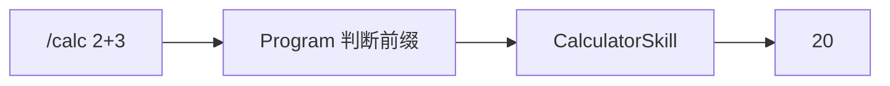
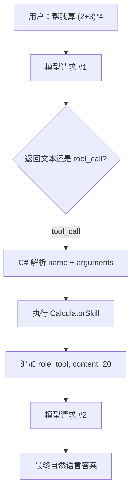

# 第 3 章：Skill 与原生 Tool Calling

[上一章：角色与配置](02-profile-and-api.md) | [下一章：Memory 与上下文](04-memory-and-context.md)

## 本章起点与终点

| 项目 | 内容 |
|---|---|
| 起点 | 模型只能返回文本 |
| 终点 | 模型能自主请求 `get_current_time` 或 `calculate`，C# 执行后把结果送回模型 |
| 自动化验收 | 13 tests |

## 3.1 `/calc` 与 Tool Calling 不是一回事

最早为了单独验证计算器，我们保留本地命令：

```text
You> /calc (2 + 3) * 4
Grimoire Router> 20
```

这条路径是用户明确选择工具：



理想的 Native Tool Calling 是模型选择：



`/calc` 是调试入口，Tool Calling 才是 Agent 行为入口。

## 3.2 模型不会真的执行函数

模型可能返回：

```json
{
  "id": "call_123",
  "type": "function",
  "function": {
    "name": "calculate",
    "arguments": "{\"expression\":\"(2+3)*4\"}"
  }
}
```

它的含义是：“客户端可以调用这个函数。”真正执行的是可信 C#：

```csharp
string result = await skillRegistry.ExecuteAsync(
    toolCall.FunctionName,
    toolCall.FunctionArguments.ToString());
```

因此权限、审批、超时和幂等都能由客户端掌握。模型不直接获得操作系统权限。

## 3.3 统一 Skill 契约

新增 `IAgentSkill`：

```csharp
namespace AgentLearning.Core.Skills;

public interface IAgentSkill
{
    string Name { get; }

    string Description { get; }

    string ParametersJson { get; }

    Task<string> ExecuteAsync(
        string argumentsJson,
        CancellationToken cancellationToken = default);
}
```

四个成员分别回答：

| 成员 | 给谁看 | 作用 |
|---|---|---|
| `Name` | 模型和 Registry | 工具唯一函数名 |
| `Description` | 模型 | 什么时候适合调用 |
| `ParametersJson` | 模型和服务端 | 参数 JSON Schema |
| `ExecuteAsync` | Harness | 真正执行动作 |

这就是项目内 Skill 配置，不是 Prompt 文件，也不是 `/calc` 路由规则。

## 3.4 实现计算器 Skill

工具元数据：

```csharp
public sealed class CalculatorSkill : IAgentSkill
{
    public string Name => "calculate";

    public string Description =>
        "Calculate a basic math expression with numbers, parentheses, +, -, *, and /.";

    public string ParametersJson => """
        {
          "type": "object",
          "properties": {
            "expression": {
              "type": "string",
              "description": "A basic math expression, for example: (2 + 3) * 4"
            }
          },
          "required": ["expression"],
          "additionalProperties": false
        }
        """;
}
```

执行入口：

```csharp
public Task<string> ExecuteAsync(
    string argumentsJson,
    CancellationToken cancellationToken = default)
{
    string expression = ReadExpression(argumentsJson);
    double result = new ExpressionParser(expression).Parse();
    return Task.FromResult(FormatNumber(result));
}
```

这里使用受限表达式解析器，只允许数字、括号和四则运算。不要用动态 C# 编译或脚本执行用户表达式，那会把“计算器”变成任意代码执行入口。

完整实现包括优先级、括号、负数和除零检查，都在本章末尾的“完整文件代码”中。

## 3.5 Skill Registry

当 Skill 增多时，不应该在 `Program.cs` 写：

```csharp
if (name == "calculate") { ... }
else if (name == "get_current_time") { ... }
```

Registry 建立名称到实现的映射：

```csharp
public sealed class AgentSkillRegistry
{
    private readonly Dictionary<string, IAgentSkill> _skills;

    public AgentSkillRegistry(IEnumerable<IAgentSkill> skills)
    {
        _skills = skills.ToDictionary(
            skill => skill.Name,
            StringComparer.Ordinal);
    }

    public IReadOnlyCollection<IAgentSkill> Skills => _skills.Values;

    public async Task<string> ExecuteAsync(
        string skillName,
        string argumentsJson,
        CancellationToken cancellationToken = default)
    {
        if (!_skills.TryGetValue(skillName, out IAgentSkill? skill))
        {
            throw new InvalidOperationException($"Unknown skill: {skillName}");
        }

        return await skill.ExecuteAsync(argumentsJson, cancellationToken);
    }
}
```

注册：

```csharp
AgentSkillRegistry skillRegistry = new([
    new TimeSkill(),
    new CalculatorSkill()
]);
```

## 3.6 把 Skill 声明为模型工具

`native_tool_calling = true` 时：

```csharp
static ChatCompletionOptions BuildChatOptions(
    AgentSkillRegistry skillRegistry)
{
    ChatCompletionOptions options = new();

    foreach (IAgentSkill skill in skillRegistry.Skills)
    {
        options.Tools.Add(ChatTool.CreateFunctionTool(
            functionName: skill.Name,
            functionDescription: skill.Description,
            functionParameters: BinaryData.FromString(skill.ParametersJson)));
    }

    return options;
}
```

概念请求体变成：

```json
{
  "model": "gpt-5.4",
  "messages": [
    { "role": "system", "content": "..." },
    { "role": "user", "content": "帮我算 (2+3)*4" }
  ],
  "tools": [
    {
      "type": "function",
      "function": {
        "name": "calculate",
        "description": "Calculate a basic math expression...",
        "parameters": {
          "type": "object",
          "properties": {
            "expression": { "type": "string" }
          },
          "required": ["expression"],
          "additionalProperties": false
        }
      }
    }
  ],
  "stream": false
}
```

工具描述和 Schema 都会占用模型上下文 Token，这也是后面需要 Tool Router 的原因。

## 3.7 完成 Tool Calling 循环

第一跳调用模型：

```csharp
ChatCompletion completion = await client.CompleteChatAsync(messages, options);
```

如果存在 Tool Calls：

```csharp
if (completion.ToolCalls.Count > 0)
{
    messages.Add(new AssistantChatMessage(completion));

    foreach (ChatToolCall toolCall in completion.ToolCalls)
    {
        string result = await skillRegistry.ExecuteAsync(
            toolCall.FunctionName,
            toolCall.FunctionArguments.ToString());

        messages.Add(new ToolChatMessage(toolCall.Id, result));
    }

    continue;
}
```

为什么必须追加两类消息：

1. `AssistantChatMessage(completion)` 保存模型原始的 Tool Call 和 `call_id`。
2. `ToolChatMessage(call_id, result)` 把执行结果与那次请求关联。

之后 `continue` 再问模型，模型才能根据 `20` 组织最终回答。

## 3.8 为什么可能循环

模型可以：

- 一次请求多个工具。
- 根据第一个结果继续请求第二个工具。
- 因为判断错误重复请求同一工具。

所以代码用 `while (true)`，但此时还没有最大次数限制。第 6 章会补 Guardrails。

## 3.9 流式模式限制

这一阶段只实现非流式 Tool Calling：

```csharp
if (profile.Stream && profile.NativeToolCalling)
{
    Console.WriteLine(
        "Native tool calling is only implemented for non-streaming mode in this lesson.");
    return 1;
}
```

流式 Tool Call 参数可能分片到达，需要累积并按调用 ID 拼接，初学阶段先明确拒绝没有实现的组合。

## 3.10 运行效果

先单独验证本地 Skill：

```bash
dotnet run --project src/AgentLearning.App/AgentLearning.App.csproj
```

输入本地命令时不会访问 Router：

```text
You> /calc (2 + 3) * 4
Grimoire Router> 20
```

Native Tool Calling 的预期消息链：

```text
You> 帮我算 (2 + 3) * 4
[Request #1] tools: calculate, get_current_time
[Response #1] tool_call: calculate {"expression":"(2 + 3) * 4"}
[Tool result] call_id=... content=20
[Request #2] messages include assistant tool_call and tool result
Grimoire Router> 计算结果是 20。
```

## 3.11 测试

```bash
dotnet test AgentLearning.sln
```

本章 13 个测试覆盖：

- Profile 读取和校验。
- Memory 基础顺序。
- Skill 注册和未知工具。
- 时间工具。
- 计算优先级、括号、负数、除零和非法字符。
- 调试请求预览。

<!-- BEGIN INLINE RUNTIME IMAGE -->
## 本章实际运行效果图

下图直接嵌入当前 Markdown，不依赖外部图片文件；如果阅读器不显示 Data URI，请以图后的纯文本运行结果为准。

<img alt="第 3 章实际运行效果" src="data:image/png;base64,iVBORw0KGgoAAAANSUhEUgAABQAAAALQCAIAAABAH0oBAAAQAElEQVR4nOzdBUDb6hoG4ODuY0M2XDamDObu7u7ubmfu7u7u7u7u7sxgwMaQocP1fm0gCzVaZNul73O5PWmSpmmSdnnzJX/UwyKjGQAAAAAAAID8TpUBAAAAAAAAUAIIwAAAAAAAAKAUEIABAAAAAABAKSAAAwAAAAAAgFJAAAYAAAAAAAClgAAMAAAAAAAASgEBGAAAAAAAAJQCAjAAAAAAAAAoBQRgAAAAAAAAUAoIwAAAAAAAAKAUEIABAAAAAABAKSAAAwAAAAAAgFJAAAYAAAAAAAClgAAMAAAAAAAASgEBGAAAAAAAAJQCAjAAAAAAAAAoBQRgAAAAAAAAUAoIwAAAAAAAAKAUEIABAAAAAABAKSAAAwAAAAAAgFJAAAYAAAAAAAClgAAMAAAAAAAASgEBGAAAAAAAAJQCAjAAAAAAAAAoBQRgAAAAAAAAUAoIwAAAAAAAAKAUEIABAAAAAABAKSAAAwAAAAAAgFJAAAYAAAAAAAClgAAMAAAAAAAASgEBGAAAAAAAAJQCAjAAAAAAAAAoBQRgAAAAAAAAUAoIwAAAAAAAAKAUEIABAAAAAABAKSAAAwAAAAAAgFJAAAYAAAAAAAClgAAMAAAAAAAASgEBGAAAAAAAAJQCAjAAAAAAAAAoBQRgAAAAAAAAUAoIwAAAAAAAAKAUEIDhb4pPSGT+krS0NIX6566Y2Ng/80YAAAAAAMBRZ+DP+uLju2bLbhdH+0G9u3A9j5w6f/Peo46tm1Yp78EfOepX9JmL17Kcpr1tkUrl3KkjPDLqzdsPksexK1LYyoLtfvj05dY9hyqXL9uzUxvxMR8/f3X45PmUlJSlsydJnFRoWHhIaDh1fPb+euLcZXrrKhU86WlBczNf/+/rt+1tWLt662YNGJmCf4bOWrQqMSl53eKZ6upybYfRMTH3n7wQ76+qolqneiVGQZdv3D1+9mKtqpXat2zM9Xz11ovWjrQlkysSk5LGTJ0XFxc/YeRAJ3tbBgAAAAAA/pR/IgAnJyd/9vbz9vW1tCjkZG9joK8vPs73gKDUtFRry0KqqqrfvgemMWnWVhaqKioSJxgTExseERX086eVZSHLgubMvyQ6JvZXdMxPYYDkhPwMo0SUmJgoNnLMtdv3s5xmmfAINgB//Oyz8+AxieO0bFxPhVEJj4y0LWKVlJSUmppK6Zr6x8XH+3//wR8zNi4uLDyCEeZkE2ND/iAjQ4NC5gWu33lw4eotruf9x8/pjzraNGvo4+tPU37w9MWP4GB2qE1hq2YN6tAqvnDtlsgsseXfPYdPFjAz4fd3dbR3drTfffDE7QeP+f3r1Kh8+fodRhJFAzCl0NMXryYlJV+5effh0/RQTTHe69MXmv87D57ce/SMG7l/946e7iXFJxIfn+D3PYCWnrGRoY21lXkBU4nvlZCY+N/0hfw+tK7pcenaLZoamlxPVVWVRTMnaKjjmBQAAAAAQF75y3vbsbFxG7bve/fxM7+ni5PDoF6d+DGYksb0hSuoY82imdQ9Y9FK6t6wdLaqlLRw6OQ5ijVs98p5U/X0dJk/ggq5VDgtYm1FJURp41DNkx41NDLNeYIw+qqpqvF7UhL76ve9bs0q/J4Pn7yg/FyubCnKolxPfT3dgB9BlPapBkuDEhISqZJJ/Uu6FdXW0oiIijY2MqDce+rClacv3wzp240/Qcpvi1Ztkjirm3cdEOlDq+a/Yf08ypRMSEhITWV+BId8/OxtZVHQ2cFeVZWxsyl8/OwlGo3yMxuhSUREFAVg+tQnzl6W+C6UNkX61KtZhQJwYlIiLYFMCyQlhREuujIl3dJ7paU9fv6aUdyWXQfZFEpvERn1i+15+cbtJOHaoYMs7FtrawkCqqqahCsFbt17tOvgcX6fos4OA3p2knj4ho4ysO/FPqXp02NKSmpMUiy/j8jnBQAAAACA3PU3A3BYROT85evDIyKp28TYyM7GOvhnKFV6KVP9N2PhwunjDQ3Ss4Tft+/0SHVCCiSv331gu6WdN0sp4tGzl9zTxy9e1axSkfkj2LpoMRdHmQFYkHVFAjCbirW0tER6btt7WOJEHj97JdInMvJXl3Yt7G0KD+jR6dCJcxSAbQtbD+rdeeGKjUEhIYN6jaOFeefBU0YKCmAUXxnpon794qrW9C5zl67lBgUEBtMfdXh98qaFr6erO2XMkKCfoSvWb3OwsxkxoAf/Xdo2b8gIV72psZGgVxpDRWk1NXVDAz169u7D5zfvP7Ij9+7Srlfntlv3HKJCdIdWTanG+/1H0NVb9wuYmnRt2+LwqfMUvOvXqvb4+URGQQGBQS/evKeO8cP7f/sRuPfwKTqasHD6f/OWr/f7FtCySb0alcvTFkhheHDvbm5FncSn8OT5azb9Fra2cHN1/vkz7Bkt8U/em3YeGDOkr8jI0dExcyaPpo67D56evXydll6/Hh3ZQXsOnqCjP1UrejauV5Oe/voVo2WmyQAAAAAAQN74mwH46KkLbPqt4FGmX/cObM/LN+8ePHaGsgdV2Jo2qP3gyYsHT56zoYgC2IoN2/ndtapWLF2imMhkKYiwdTwKJ9++B96+94QfgKncd+7y9Wev3iUmJrmXcqO33i1MMh1bNy1VvCh1/IqOPnv5xtv3H4NCQu2KWJcqUbRxvVrsudYLV22KjIxycrAt6eZ6+sLVwOCfpiZGlM3cS7o9f/3u8Ilz7Ft8+OwzafaSKhU9mtSrJf6pE4Tn/erq6PB7xgsrhLo6WuLjU+b3dC8VHi5YUFpamqFhEb7fvteqWiE4JIwdQV9fjzuJl1Ap+NL129TRo1NrTQ0NE2NDGn/Nlt2TRg1ipLO0MB89qHdiUpK0ET55f12/bS+/D+VPysz3Hj0rU6JYVHSM91e/H0EhjLB5p8s37tBipO7mjepSHuZeQvNPkfXmvYdXbtylpd22WcMCBUwHj52mo6O9esF0GkFFVZULwCpC9F9GeHowhWcVJv2M9/iERKobswGYUZyVRaHFsyYuW7flwZOXbEtU2lpa+46ctilsFRxCW1bEibNXqJBLH+Huo6dFCluIF3Vv3H3ACI/azPhvBNtn6dot7z9+oT/xt5sybxm7QbJ8/L7R5sEfgT4LWwanz7hp+VwGAAAAAADyxt8MwD6+/oxwp797x1ZczzrVKj1++jIuPv57YBA9vf/k+duMRETeZO6uXrm8+GTZk59NTYzr1ay6fe8Rin8UetkThlNSUpet30pFZnZMSh3PX72jwMYIm5tihJeGLl69ma1nEm9ff/oLDgmlaiQ99f/2naIX1UK5C0QpLa3dsnvt4plRUb+ofM32pCoodYf8DGMkCRWeG2xslOnaWoq19PgtIKikW1GR8ak6mpKSwp5Dm5SSoqurTR0GBvq+/gHsCCYmRr+XidenzTsF5y1ThfnA8bPCNCdIzpRO2cwmTlVIS0OTIhxlM0aK9i2b0Ghc4Zq6ucIvW00l/bp31NTU2LRzP3vdMuXDEkWd2UE62lqjB/dRVxec421sSNVoPaqY0l/nts357+JRqoRloYIFpVxMm4uMDPRDQ8O5LSEo5Cf9sd237/2+8JiOLDRrWFs8AI8d2o//ND4+gV0UlMnF36tt80a0jYlc9S3OzMREV0+HAQAAAACAPPPXAjCbEqmjkLmZlia/KSDVSaMHc0+rVvAo7uJ06KSguNqlXXN9Pf2NO/ZRt0fpEo52Ni6OdiKTTUpOfvbqrXCE4qWLp4fJB4+fN6hTnTqu3rrHZh4qOdavVTUw6Ce/dsoIitLn2SRTp3rlcu4lL16/TQmZ4q57qeLuGdedUga2tylMlefrdx6wl49Szbl4UZe+3Tps2X2QnhYsYEaVT6tCBSV+8JAQwafmB+DUtDQ2hD9+/qpR3Rpcf6r9zhg/QkVVZcO2vT/D0uOTiZEg7n7x9vMPSG+5qlrl8rWrVjIw1Bf292UnRSXHj5+9KWe6ODno6+rQMjl+5nJRZwfx+XGyt2WrjnsPn0yRfg0qLU9aYtzToX27nTh32e9begh3sLNpWKd66eLFPnzyNjczZZch1dipjF+xnDsVoqmW6+bqFBsXP276grKl3OhzPXr26ta9hzbWloLVoa3NTocq6qYZeZ7meef+Y2zyP3Lq/KnzV7kzh3PF5DFDUlN+34jo+eu39IncXJyopM/2mb9iXZZ3adq293B0TCyVx+Pi4mnT7SU8UCKCtqVv3wPZC9dlmDhqEG3SDAAAAAAA5Jm/FoCDMuqlhcwLyBitnHspKq9RAKbIWqtqJepm+/fr3kHiNcAvXr9jWxKiyKqvp0cVOQpjdx4+YQPwZ++v7GjjhvazKWzFCHJ4Cr8VpTfvPzHCOl6nNs0Ywe2FbIaOn05h0uvjZy4AU84ZN7w/hTpXJ/uFwuajXr55X7ZU8QJmJmwANjM1ruhZRtonCg4VfHAKz7WqVtTWFpzzzJ7ezAgudQ6Ijomh2eZGZm9c1Kppg8DgkMvX7/yKjmGPGrz9IJjPGlUqONgVKebilH49LR0vqOhpZVmQqt8FTE0oMfp/D+jeoaVFQfMjpy7UrVFl/9FT4vNDi4uSKiNsw5mRiRa+mrqahrr6jv1H2VN26UAAFY0p8FOFed3WPbaFrX2FV2vr6epaWRb69MVn18HjJ89fWTJrovBkZkFFnQ4ZXL11//qdh03q1Zo9afT1O4JasW0RK/G3o7o3G+YZYZ4X/qWfoc1eRy2xbSq+zz6+x85ccnW0b9G4LiPm2JmL/BMKUlIEm827j5/nLFvD9uGftywNv7HoHp1a2xWxljEy1c9rVpVwOTotTLZFLgAAAAAAyFN/LQCzlUwSHhElbZxf0dFen3y8hNdVpqWmUtaiTMUOev76vamxoaPYbVTvZDT+TDGV4paRoQEF4B9BISE/w8wLmPp9F1QsKYew6ZcR5mQuAFMEYs+DpZf0HZGpaaXP3n5ct6WFOaVfRlD2TH93+dNLQmJiwA9BdTQsPGLNll1jhvSlZPie1wj285fvqlUuxz2lCuSbdx8ePntBhWhG2PSXibFxswa17z9+dv/x85t3H372+RoTHUufgr0HD2VvPV2dVOF1rR+/eAs/eKihgUHjejV1dbQlztLz1+9ELu6VwcTYaPHMCVR+9/Hz796+VVhE5IFjZ2pVr1TEytLr0xdHuyLnr96uWaV8MRdH+lwBP4JOnL9aq2oFlYy7VZUo6rxsziSqRd+895Dt8+GTYIUWsZYQgOnYB/1t3nWQqvR0PIKto7KDgoVV9IJmZrLnds/hE/QSqoRTMZ8CucjQ9x8+U8SlIjl7JCWO1mJCIm02/AMQjFjLZCKaNqgdExPz+v3Hn6Hh2/ceOXvx+qyJI6U1z0ZvJ+02TgAAAAAA8Af8tQCsraVJ6ZTqgZTRRAZR4ImNi6McQoFk5/6jbE/q5rc8vHHHvkrl3EUCMJUouQuGF6zYwB9ElToqA7LBla31sdjiJysp+XfFj7vJEHv9sD7vRkrqvR3JnwAAEABJREFUqukLTS2rCqQ4tkBNCZx4ffI+dOJsh1ZNb917xL4jvdej5y+5AEzVy3OXr7PdFH2b1K9tWbDAotWbl63b2qF109rVKx89dV4wkZPn6E/YINNwPT3dyXOXcvf1ISs37mQ71i+dLXGWdLS1qWLMPWVvX0RTo9QaERnFtuqspZV+jrqFsFxf0s313qOn8zOW8MFjZ/gTpMDJf9qtfQtGeGfmCbMX8/tfvnH7yq277LGDMxevXb7xOxlWLufeqU1zRjr2FGtz8ywCsKmxMZuZDQz0RAZF/YpmT2/mrkym4yCnzl8pUcylXYtG/DHTZN6aqGXjemwH2wgW1edfvH4v8abBjPQK8O17j7I81xoAAAAAAHLubzaCZVvE+tVbL9r1v3rrfp3qldie3wICqejHCGqzbm6uTpaFzNm2hYlId4liriITfPJC6i1h7zx8QgHYzqYwZScKdU9fvqEyJlVKqYjKjcNlcvZut0x2JadIjUzsmcPVK5UrW7rE4tWbL9+4a2Rg4C1sDGzM4D6zl66hEOX3LYAtUFcq706zV7ZM8bfvP0VHxxw8dprJuFUsZc70W9QKbizUiEYrVdyVvd2xvU1hdimx1Wz6RNrCGiZXhhVBC3nRjPFsN8XC0VPm0jSpzEtP5y1f7/3Vb0CPTuK3AnJzcaYpUvFZVU1VR1hbfvriDc1bqeJFubTMYtu7TklNTeBlPHqLxKRk/m1v+UPFF6D3V//PPvtLFnMdMaAnlbJ3CA+LXLx6i6q4owf1SUlNYSTp173Dk2ev7W2LiLdixS5zMnPRKn5/tmkufh/bwtZTxw3l90lOSZm5cGVqalrpksXat2jM9qR5Y5uAjvz1i5ECFWAAAAAAgL/rbwbg6pXLs2Hj4PEzcXFxlJ0Cg0N2HTjGDq1WsRz1qVW10pip8yiUThw5kOq9g8ZOpRQxecwQe0k3rWXjJVkxbwp3IuvmXQcePn0ZHhEZ8CPIvVRx9qLN9dv2FnV2+BkWLtI2r6OdzbNXb6mG+fz1O/eSblQ/XL5hW0JCAiXWLu1aMFmhXEeh7quf/6cvPlYWhfR4dWPyPSCIzUhVK5YrYm1Zp3rle4+fsVfzUp63sixE5UEKSBu275szeTRNyrKg+cr5U2no/qOnKYjyJ5WYnMS25kXF2/q1qmZqnqpfd7Zj+sIVNM7Anp2cHe0zZk9F9vw/eCJoEqyIlaXEoSfOXaZqcLWKntraWlSmpr/+oyZraqivWTSTho76OOdXdAwF9STevZQG9eqiqysIwFRE59/gJyExcc+hE/cfP2cXWqM6NRrUqS5ykjYt/HcfPn0UnvTOtlVW1MmBis8fPntzx0GSk5MpnEdE/qIO8ROPqbjNP5+cT19Xh72FUkpKyvU7D7goTsvTs0x6/Zbe5fU7Ly1t0VOg1dXUNDQ06DjFpWu3qSRepqQbbbdnL99gh9IBBZHx09LSTEwMmzeqw/V5/faDj9+3wtYWZUsV53pS1Z3GlHacAgAAAAAAcu5vBuAyJYq1alr/+JlLFD8oXNEfN8jNxalEMRdGeFYze0JvYWtL6mDbJSpiLSGhRcfEfPbxZYRNWPEv46RaKwVgRnh5cPuWjWtUrsBegOr1SXCmroOdDT9btm/ZhEIXFaXXbtnNplm2f6XyZRk5FDI3o9REM7lw1aaqFT17dmrDDaKEtnLTDkZ4MjM7/+1aNra2LLRLeBfiOjUq02Pd6lUoAAf/DL1w9WZj3j2EO7Vp5v/9x5I1WyjseZQqoaKqsuvAcXYB9u2eRcPIVDv18fv+xcfX1dmhX49Ofbp1UFNVvZtxpTQfRc0jp85TR61qmU7TTWXSm0p+9vIN1c/pTbW1JVwWSxVRhldZZcUnJLAB+PdoaWnvvD5t3XOI0jI9Le7q/P7Tl7OXr5+/erNeraqN69bg7ht88fotNiFTrZtWYnmPMsWcHWn6S9duZTKvuLOXrt2892jkwF7i4VMaJwc7O9siL169O3TyHK1lWtceZUo8fvbK1cmeNhJ2nGOnL1IA1teVcGuiJvVrsRdO0+pj1yCLSveWmVv//hEcMnXuMonzQAmfu6qZnDp/lR5nTx5NBz4YAAAAAADIA38zAJMm9WpRCe7Og6fspadMxnWS7Vs0Zkth34Q3+6HimJam5sfPgmJgwQJmVIITnxR3/jOFJX5/ilhsx/3HzyjbdGnfolJ59xev3yUmJpUqUYxy6ZrNuxhhHZIRptPxIwZu33eE6nts+qW37tGpjYNtEepWEY4jo47at1uHnQeOsTcHUss8k1TlZj8jFUXZPtHRsfuFZzXTxCmWM8ImrBrWqX7h6q1jZy6Vcy9tzrsd7qt3XnHx8ZTQ6I/tU8zFcUjfbiIFQwqx7z98Ed6FOPRHoKBMeliYaRnhHYbi4+K/fPWlJflIeERAVfha+pjvPny+ff/x05dv6Km1VaEqFTzYl+gIz50+fvpiTAzVdZMDg38Kp2McLJh4+q2SE5OSXwrvA5ySIjg20aNjayr2cvNDuZ1exeZSWixUor/36Cl7vSst2OH9e9CxADpyceHq7UvXb1+8eovyf62qFZs2qGWgr1/B051qwuXLlqasK7wg+dfuQ8fZIj8d46BVuWDFBpo4Va1fvHlPn0JTU4ORT0xM7JEzFx48fs4eT6GpDezZ+av/d3bZ3n30dPveI9zIEm9N5FG6xOjBfTbu2M+1U03bT0XPMt07tBIZU1dbm2txjRMaFkEv1NHRNjcTveOxloa8nwIAAAAAABSlEhYZzfwDfkVH+377UaiAGT/15brHz18/fCIoKjZpUNvepjClplWbdrL3wlkw7T9Kv9yYySkpwSE/jQ0NdSUVALOUkpIq0kTW3sMnrt952KZZQ+5OvxQIZy1eTeXN+dPGcRepUiAfN30BFU7nTBpDeZg/BcqNT56/unXvEVdlpQxJs81/o9MXr548d4V7amRoUNjSonBhyyJWli6OdjRXE3ktUVGGrF+rGlVfqQjP9innXrJn57bcbZmv3rq3/+hp/jxYFjKfPWn0qQtXT52/wshty8r5FPnGz1zIPjXQ16tZpWLj+jU1eCctx8bGUTGWzbdO9rYTRg4Umch/MxayRxBqVKlAi1FTQ33wuOlciZ7y56r50ySWpsXRqybMWkxTo+XTnA45VC5PAfveo2fb9h6uVM69VZP60xeuTEulNahORxmojC9jsjTbAYFBhoYGFGXlP3v51IUrVO+tU72S7La+AAAAAAAgd/0rAfjP+B4YNH3+Crab4m5YeCSboKjsOXP8SCYvpaalXbhyg39iMyO8tNXEyNDFyYHfk6q4VD2WWHhkhUdG3X3w5Oa9R1UreIrc4fZHUPCDxy8KW1taWxYsZG4u3k41ZTy24WtnR7sq5T0o2lHknrNsrb1tkTpVKxe2tuCPTIH5+au3Hz5/EZ7dzNCsVqnoSY+fvb+yN0yWh6qaKoVMRthm1Y/gkGqVysn4aH7+AVRC79OtnZWF2F2LPn45d/l6l3YtLDLOEKbkSVXrhIQkHR0t9xJu4jc6ksHX/zstxtLFi3Kp9fW7DweOnalS0aNx3ZpMHnvy/DWV3MuVLVW1oicDAAAAAAB/inIFYPLO6/PWvYe4GwVpaKiXL1uaYpUmTj0FAAAAAADI15QuALNiY+N+hoYbGhoYGxkwAAAAAAAAoASUNAADAAAAAACAslFlAAAAAAAAAJQAAjAAAAAAAAAoBQRgAAAAAAAAUAoIwAAAAAAAAKAUEIABAAAAAABAKSAAAwAAAAAAgFJAAAYAAAAAAAClgAAMAAAAAAAASgEBGAAAAAAAAJQCAjAAAAAAAAAoBQRgAAAAAAAAUAoIwAAAAAAAAKAUEIABAAAAAABAKSAAAwAAAAAAgFJAAAYAAAAAAAClgAAMAAAAAAAASgEBGAAAAAAAAJQCAjAAAAAAAAAoBXUGctuTp89HjptYqFBBE2OT/0YNc3FxYgD+z124dPXO/QcfP35+/fbdtfOnLC0LMf+Si5evFSls7VbMlclL795/uP/wUasWTU1NTJhcdfbCpfsPHn389MX769cTB/cULmwtcbTBI8ZGREa5FXV2L1O6ScP6DAAAAAAoCAE493318w8NC6c/6k4bNZQB+P8XHBJy9PgptvvS1Ws9unaS/7WnzpzftG2HtKFq6uonD+31+vApPDyCkYO2tibFP36fLdt3LV25ljrWrVxSq0Y1/qCExMQbN+8kJyfLMWFGS0uzbu2a0obGxsWNmTDlq6/fkhVrenTrNGxgfz093W/fA2JjYhn5GBgaWFpIPnAQFRV19MRptvvk2fNDBvQVHyctLe3Rk6cxMbHPX7z08/8uTwCmj9+t14DYOHnnUKIzxw4yAAAAAPmF0gXgDx8/WVlaGBgYMHmGogLXbWZmxsD/v8TEpA+fPhVzdVFXz59fmcjIqK/+/jJGsLez5bqPnTpTpkwpGSOrMCquLk5amprsUz//b1TZZGSaPGM21VcZOdjZ2pw/eZh7evDIMTb9MsIC6eQJY7t2bMcNjY6OHjluIiOfQoUKygjAq9ZtpPTLdp85e2H44AHUMX/x8ms3bjHyKWxtffnsMYmD2rRssW3nvm/fv1P3/oNHBvTpKb6lBQYFx2SE7eJuxRg5JCUmUcWeAQAAAIAM/9DePO3ePX3+IiT4Z1h4uKmJiYuzk6OjfaGC5hJH/hkaFhoayj11dLDPMpnQXvjgEWPYHfExI4b07dWd7R8c8jM8PJwbzcnRQU1NjTp8/fzj4+PZnlpaWrTbzcgnOPgn121ibMTkth+BQVQvUugl2tratjZFmLyXkpLy+Ys399TY2FjaGpQoNTX19bv3AQE/ggKDqYRuZGRQ0NycVm5xt6JM7pG2ZqX1v3HrzpQZc2h+zExNFs2dVblSeSbfef7y1aDhY+Qc+ePHzx279pY9zp5tGz3KlmHyXu2aNQ4dPcGF57kLlsTHxXHf7tzy+Omznbv3c08pZuvq6DAKSkpO4rqpdNy19wD+0KCgYLaDtrSa9Zuqa2hwgzzLllkyf7aPjy/Xx8XZkQEAAAAAxf0TAfjh46fLVq179fqN+CA9Pd16tWtRsUXkmsPN23bu2nuAe3r62AEnB3vZ77L34BGuDEUlo3atWxoZGVL3mvWbDx87wY12+ezxwtZW1NGj32Bul5RKQzcunmbkE/DjB9ddwqMyoyAXF6eTh/bKGGHeomVXrt1gFCFSNMs7QUEhLdt35Z62adV8zvTJ8ryQKpBHjp88cPg4WwQTQaWzLh3b0Z+GRi5ssdLWrMT+aWlpS1asZk9op8eV6zbmywD8xwzq14ftWL95K9tRsrgbowhNLU2Gx7yA2a4tG8ZMmHLz9l22D327NTQ02JO0tTS16LBFfEICIwcdbW2J/enIyKhxk7inlSuWb1ivDpMzdKiI29jEsdsb55PwoNLrt2+5PtpaWjRXIq9SVVEpUqSwlEkKZpt+9Ph9Fixdwc4DLaIpE8bxB504fbkpfs4AABAASURBVJZbngAAAAD5yV8OwJQu5i9atnv/IWkjxMTE0q4Y/W1ev7JqpYpMDvhmnL7ICg4OYQNwruMH4Gz4/j2AUTIfPn4aMGy0jDxAqXjh0hXHT59ZtnCOo7098wclJSXzT9/94u1NZWpVVTSfnk3Dh/RnhNem7tq3nz2ht32bFvS4ftWypKQkeaagr6cn0ocOk61ZvmjqzHn0Q8H2WbBkBR04s7Ky0NfXu3PtApMDL9+87TNgKHfuMR0ZWTRvpoqKCvt05NBBLZo2knNS2lICtpxu33vAdQ8eMVbiOCcO7XF1cZY4yNOjTMP6mXL75u072S8dfSiRQS/fvEEABgAAgHzpLwfg1es2y0i/fP0GjTh+cE9RV2cmu9q1bsHt0lHRyTnPziHM8nJH4Hv4+GnPfoPlGfPjx889+gw6sHsbW6L/MzQ1Nbp37bRrT/rpr107tv8X0u+nz97bd+2JiY3zcC/duUPb3L0yeev61a4ZTZcHBgVTOlLJPEJKaioduqIOWhSqKr8HvnrzVlowE3H/wSMuUtavW5seC5oXYHKAlsDs6ZMio6Ku37xNT5cvmkfpl8mxG7fuiJwZvm7FEjNTU+6ps5MD/TGKo2TeXXpDYsFBwfoGBrq66WdZFyxgFh0d8/TZCyYrdLxG2qCtO/bcvvuQ34c7b5w6Ovfszx/k5+fHAAAAAORHfzMAfw/4wZ0GyalWpZKjo/2vX9EvXr4SSZLLVq3dtHYFk121a1bfs23jpWs3bAoXbtoor+4gQvupXLd7mdJ1alZjFKStncW1hVS4ppIXv0+MWDu0IiOYmZky/6TIyKgx4yWcI+1WzNW8QAGvj59EysKhYeEDh406cWjvn2yMavTwwWVKlXj85FnF8p41qyu8QnMdlaApZ7Lnil+6cs3YyKi53EVIeRQwM2U3GIrZbTv3oKNFo0cMrVjegxth1LhJFy5fZYTfVv5X0sjw9ykVKioqMt7izPmLbEer5k0MDXPnRAzaJJYsmD1s1H8d27WuV6cWk2PnL10Z/V+mjXP7xrW0ZZ4+e6FUyeI5vKieUvTEsSPZ7vFTZoSGhg/q14u9atrP/1v3voPoKM+6FYu5hXPrzj0mZ9jmo6UNlTEIAAAAID/5mwH43IXL/Kd2tjarly/iLuWlEtPhoyemz1nAjXD77v3wiAgTY2MmW2iPnPYv87phnp+8prlq16jap2c3JrfNmT5Z5MLaU2fO0z4093TIgL5DB/Vj/h8sXLpC5HLHKpUqTp04lksXQcEhU2fOpVXPjUCHRWjLyd3IJ5uWpmaj+nXpj/k3vHz1mn+l9KFjJ/JiaVAtccLUGYzg0tN3vfoPpvUycujAEsUzNT4cGfVL2svZErFEYeHhZ89fYrtbtWjK5B5dHZ2tG1az3YmJSZevXU9ISGQUV692TQMD/R8/Avk99+3YRIe0KBX/N3k6PW3SqP6APr2yV/7le/HqNX1/qePu/QdUE+7dvUvnHn3pS0GHfrr1HbRz8zo6wEFDT509z71k9vTJ7Hngh4+duPfgESM84DVn+hTqKCLlBsIAAAAAwPqbAdjn61f+0369e/AbsqK82r5tq0dPn3H7yuTzF+9yHmVlT5b2vLft3BPCC6Jurq6UEGjP9WVGO1s08aED+omUSXMF/x5IBc0VaAD5z/D68Onk2XMfP3728/+elJxkZWnpYGfToF6dShXKyaipBgYFU9Xr+ctXfv7+ERGR9CorK4vqVavUr1NLX1+PyS46nHH81Fl+HzoIsnzRXMoeXJ9CBc3XrVzCv7yT7Nl/SDzyPX767N37Dx8+fnrr9SE2Jo4qdcVcnV1dnCtXqsDdjyd7NmzeFpHR7La5mRl7UONHYNDOvb+bBa5euXLlSuWfPH1++PhJKlyH/gylaOTi4tKpXWuJ7YdTvLx09RoleV8/v+iY2OLFinq6l+nYoY2OtrbEt+MzMTHhPy2UG5sZbastmzVhu9mbhP0IDIyNjeNGoHhGfw3r1Rk5bJC0iRQubE0VXTb5mphKPVB18tS59PGtrT3cyyxevlr+OwlxBvbr1aJpYxkjxMXFjZ0wlckWD/fStBFWq1qZ5o2dzzXLF9K2xB6OYceh3yWLQoX426qcaDnzm0ZfsmIN112tSkWaoLW1NXtUiL6nA4aO3r5pTWJiIvczSBt221bN2e4nz56xAbh0yRIiF/GKo3XXqEGmgziTps9mTx4pVKjgpHGj+IOOnTyDa4ABAAAgX/qbATguLp7/NDVFwtVrwwb1r1DOk3tqUyTr0w7Xb962et0m7iml3AO7t1HH7Tv3+HGrZ9fOeRGAQ37+Dt7mBXJ0WWPuioiMnDRtNnuFJIeqTM9fvDx64jS3iy/yquTk5HUbt4mcqU5751QVvHj52uTps5ctmpvt0ui1G7dF+qxatlA8UVAyp4I2PwDTu8fGxXH3oYmOjpm9YDFbRuNQjfTSlWvUUapkiVVLFyh0NyYRlLe5MjUtKDaR0pEO/n1xqCJHeX7sxN+JK/TR0wePnu7as3/OjCltWjbjT5ByVP+hIyne/O4TFEwhkGq5a1culvh2fJSoG9SrTcuffdqtSwcmxyhWzZ89jd/HpkjhM8cOXLl2c93mrdysXrh8VSRE8RU0LzBv1jRGJtqidu5Lb7+9Q9uWqqqqQcHBX30VvuI0MjL9GMG9+4/4p12wnBwdrK0smZxxdnSg5V/U1XnujMmGhoZ0ZI3SL3e5AZXE6fPOX7ycUVCVihW4rfHq9Zvclb0Vy3uw7fxtWL20c49+7DJ59frN6P8mVyxfjnt5VFQ0102HsdgOB95dmqVxcXFkL7fmbNy6g70M2MzURGTQ81evEYABAAAgX/qbAdjDw529kpC1YOlKIyOjOrVq8BsZsrUpotC1dlTm5adfsmHVsizvkJSLgoN+V4CXr163fbdi9wEeN3o47XYzuS00LKxNpx6ym1lu2b7rzi3rynv+vtQzNTV1xNiJsqtztHceEPAje2d6i0y5S8e20j47hZk2rZrf4KX3kJCf7IYRGhrWtfcAGQmKIkSbjt02rV1JGY/JM/cePF67YYvEQVNmzClTugTXeDVF9669Bki82xN9ilH/TZbnnj0rFs+nowA+Pr61alTLRhFSNj//b6P+m9S5Q7sWTRtR0q5bu8b+w8fmLljCCC+kp6S0a99BdkwjQwNGQXfuPeC2w6aNGzI59t/kaSJn0ZPB/fv07tGVybH1q5c62tux1zMfPnqCfyr+zKkTrt28zeQAHQfhX7kwZsQwtsPE2HjL+lUduvZiPxcFUX4WpS3H68MntjlAn6/pm72dnV2Wb7d1x55jJzKdcMFthBSD6zVpLXEQAAAAQD7zNwOwp3umy3GptDJ8zASqRdSrU7tsmVJFXV3s7WwUauvopbBawu+zdOEcTw935g8K5J0CTRGFUdCQPLh2V1i5micj/XJo6Z0+doC7ynrXngPynJu6ZMUaWl/uZUozCvoWkOmGT67Ospr4lnY/4dPnLmZZP6QgMWfh0n07NjF5RnYbQqvWblq5ZD7bvW3nHhnpgl8Wlq1kcTdF76Arj5SUlEnTZ1Mioty+ZfuuEUMG1q9bq2vHdtWrVFq+at0E4YmyX7/6siO7ODsxCjp38feV/+xdnStVKG9iJHqcyMfX/+799Lv+UK3V3lb0KJiHexYX8+vp6b55eo9/KfL9h4/7D0lvd2rS+DGd2rWW9lruZ4c7dkZfBH57BDOnTMhhhTkpKZkOdnD15GZNGvKvr6aJb92wuksvQcvMFcp5inwNL1+9TgGYDpRwG5KtbeEs35HeS7y1PA4SLwAAACiJvxmAnZ0caNeW281lUVY5cPgo/THCXVjaOaYCFBWddLK6hWZAQOCQzLdgGTdqWOMG9Zg/KygoiMkBDbXcXyNPnj0XOfOZCrbtWregyuGNW3cnT5/N9aeFv+/gkSED+jLC3eWFy1byX1WjWpVB/Xs7OzrSBGfPX8LfY166at2ebRsZBYnc8djJMTuF+iPHT3DdtMGsX7W0dMmSCQnxl67eoAjHDaKASrXiPG0Nm96dNjl6959hoYuXr+ZHWW4jT05O3rF7n8ir+vXqXt6zrK//t30HjmTjoEnuunXnHndSrrAiPYkq56OGD65aqeLyxfOoZ1x8PFdxdbC3YxTUqH7d02fTb8xLR1hoysLzw5uJjHb+0hVuoY0ePlhG9d7AwICrmYsEPDU1Nf7T3RmFa1rmLZs2ppRLq+Pp85dXrl5X19QYP3qEtLfYe+DInAWLuae0stq2Fty7mCI0dzmuiE+fvamEy3ZPHDeqXZuW3CD2ivQVa9ZzB03oqN9E3iW43l+/Tpkxr0vHtpvXrtDS0u7ed6DIxE+dvTBscP9Hj59yfYpYo+0rAAAAALn8zQBMu6drViwaN3HalWs3JI5Au7M0iP5mz19MwUZG81fR0dFjJkzhnwlJu4+5cg6koqpWrmRibKLQS569fMmFJfXMu+y54vTZi/ynDerVHjtyKNvdukVTyoqz5v3euT987OTg/n1UVFRu3LrDf1WhQgUXzZ3B3pSletXKVM9s06k7N5Qi07dv3wsr0gJtYmKSSFxxsFc4AP/6FW1masrdl7VT+7bsRqKpqUGx6tDRE68ymj1jhE155WkAppJd6ZIlhJ3OBc0KtGjfhRtEnzQyMsrIyPDV67cin3rJ/Nk1q1dlhDfNqlW9Gr1Knlp93qlVo9rurRs2bNnB5U+qBvcbNGLuzKmthS02f/j4iRvZwT7rS0/Fp88d9tq0bWf3Lh25lbL/0JFCBQsWdysmfsG2r5//pSvXT54526Jpk369u/MHnT95mOumbZK7t60I+opxJzB3ateWPW/83IXL3EnIFGUdxbZAqocvW7WOivb8np5l3dnLNNSFJL6dNq/dNSp0ix+/09LU4roXz5t99fotKgKz2fj4ibOUjemPgvHJI/sG9evNNpRF30F222DPgr509To3BWnlaB0dbRknPvQbMpLdGu1sbebNnMIAAAAAKIG/GYCJtpbWsoVz9x44fPz0GRknf9JeWvc+gygDs1FB3NCR4/jpt3bN6hPGjmL+BtqNllYUkubs+Utc40lqGrkfgG/dzXQH0VHDBvOfdmzXZu2GLdzSoz3sgB+BtD/9kFdfIsMHD+Dfr5Uqcq2aN+E3Kvb85WuFArCqquh9YqmOp9gF04Lqn/7OLetFelK0jo6hQyIx+pkbOUuW1MpabqH4mpF+BVxcnLi4wgoND6MA/PmLN/9VdDCCv0nTCNMmjhsychzzV3l6uG/xcH/x6jWV0Nl7cRe2tuYaGb5x8/eREXtbhQMwGT92RPM26el65579o0cMoQ5//2/cgRgK25Tc+C+Zv3g5ex3smQsXRQKwnDZt38l1d+7Qlu2oV7fWomUr2Y1/09adC+fM4L+Eat2Tps7it1OQi4YP6V/Ow33cpKmdOrQ9e/HS0eOnjp08s3rZAn19/f2Hj7DjUHGbDu7QgTxK9e+8PhwPXt2UAAAQAElEQVTYtbVO4xZsZKUfjQuXrrCj1a9bWzyHJySm3//Jza2YtHmwtrZif3U1tTRljMZNKoetqQMAAAD8C/5yAGaE5ZGe3TrR36fP3peuXrtPwSvjDEwRg4aPuXb+lKVlIfFBIq3gLJ43S6GLh/8ufjBTz+1ToNPS0kQqioWtrfhPqdhborgbv5WdkJ8/KQDz7+dEHB3sRKbs4pTp+k+R8bNEK4gKXPwV9+WLT/baaqbEe+vO3UePn957+IgNbH9eqZKil+NWq1L5yLETIj3DwjNtqOIX8RZzzcOWumSgZRgfH8fv42Bnu3Pz+k3bd+3as3/8mOHJSUlRSUnU/+KV9Nan9fR0VVSYqIw7Nomg8Ma2HSXO2dGhbeuW7MLZd+jIqOGDaczb9363L+XhXpryHv8ldWvXZDdRCmzfA34oev0tBUjuNkItmzXhfkOoMNuvd48FS1YwwptpD+jb04HXmtTDR0/yKP2yKlUsd/H0sd37DlD6ZYRn6bfp1KN182bcOQKd2rdhhN/Q2dMnBwYH0fGRNq1a0Oqgnlt27OKmI9LGOCP81pcpX42RGy1VecZ/9/yBtHUKAAAA8P/iH0qJzk4O9DdkQN/k5OTPX3wePHy89+ARkaZZnr182cSyfpaTOn/pivhO4T8rKel3ANbUyOUaS1TUL/5TyrFqYmdZ29nZ8ANweHgEI4zB/HFEYjOxscnU7k6Y8FUKoRopPwB/+vKlcqXy0kamVEAVOe6pqYkxexqqn/+3sROm/vVLZ/X1RO+HrK2pIT5adObzn22KiLZdZGFRkJEDfUfuPXgUFxfvVtSlSJGsG0DK0uWr1/n3cBIxbPR48Z60RipUl3qN/ZIFs5s0lPpVrVjegw3ANBHvr18d7e2v3UgvLNvZ2tjaFBEJwLV4dfLbd+91bNeGUcTSlb/vtTtsUH/+oLatWqxev4nNnBu37OAXgfntbDWsVycvwjAdRCjq6sI9pWNV/FuOcQtQV1eHTeZtmjdlAzCHjiJVrlieAQAAAAD5/ItlUqoNFnV1pr+undvTTjl3v1NGeK2pjL1qzpQZc8p7uOdKMJDH9Zu3T5w+xyhoxNAB7E4tP9fl+i1ttDOfShoRESk+Tnjm7Kqjoyt81OH3jIyK4i61TX9V5knRPjqjICdHB/4Vm7JD7IBho/inBpw6vM/Z2fHHj6AGzRTLQn9XYetMpUvxG9hGSimoiuB/Lw7t3Z4XzUHnUHy8rJs5leCdcPv8xeuCBQpwlxzXrVVTfHwzM1PKzA8eCU7Lv3LtlkIB+NjJM3SwgO0ePqS/lZUF2x0UHPLuvdebt++5MakI/N+o4dw1yfRlrFGtCh0bmjpxLL1jHlWDa1avum/HJu5yXA5FbvFL1l1cnGhd878pnTq0/T862wUAAADgr/tre07hEREr1/xuN7hCeY9G9euKjEM7dp3at+UHYF8/f0Y+46fO2rVl3Z/ZNaQi5KUr1xR9VfMmDdkAzD+JVF9fj8lVWpqaVGXi9q2p4hoRGWmc+a4zIhemmpkJGvGyKJSpFOnr6++Q+V6jPhn3wmGZm5kxCmpQtzZFDu7p2fOXmjZqIPEyb9rjFzkx3kZ4X5xbd+/ye1I2aN+2VcVyHqamphTIV67duGHzNuZfInLe+MdP3iIjeMtxCve37wH8L8W+A0fmz57G/F8pwrtcnFKoHu9q7RrVKkt8SaP69dgATFGZvjL8K9JlePnmLb+dc00NzXkLl37x+frh4yfxuweTsxcude/SkXvavXPHwQP6lirhxr+dUq5zL1N6/66tvfoN5s+SW7GiEkdu17oFPwC3aNpYfBwVFZVdW9dHR8eIDwoOCZkxZyEj3aypEwsUkPxdxvnPAAAAkA/8tQCsqqJ68Mgx7umZ8xeqVqpgYGAgMtrbd+/5Ty0tLSRObezIoR5ly3Tq3pfr8/zFyx279/XtlZ32cv6wiIwCrJmpYs1Hy6l4saKPnjzjnl67cZttzpfl/fWrSMO51paCKqXIRb+XrlyvVeP3VYJUtb56/SZ/BFtbG0ZBlcRO3aTC5rEDu0VODA4NC5u/eAW/T3nPsmx7PNdvZmqqevH8WbY2v28Y++y55IvJ/yJHh0ztDJ8+d75nt07cPKekpGzYsj3LiQT8+MF/6p35SET2lHUvvX7VUhkjvHz9ln80wa2YK325ZNycTCTqc168ek2vunf/EddHX09v975DbDcl4dKlSkp8YU3a/DLuxHvvwWOuUS4Zvn373rFrb34ftjllGfYfOsoPwDLOyc9ddjY2dna2/AC8bNVa+uaKzEBycvL1zM2zp6amSpygxDbzvwf8WLRsFdtNX/CEhCT2GhM7WxsTExP2tkzbdu3dvG6l+CUPAAAAAPnDXwvARkaGha2tuUt8qUTZtc/A6RP/ox1xtg/t2B0+dmLx8tX8V7m6OEucWo3qVZ0c7IcO6rdm/Wau59KVa6tWrlTUVfJLcpFFoUJVKlVkFGRqYsx2+Pp/YzvMCihcRJUHlVX5AZgKYmVKl+DOvh43MVPxsGG9OuzJzPXq1F619vcNVE6cPlu1csUmjQTnn1M1bOmK1V99/bihFN09Mlac/CgIDR/Sn/8utBn0GTh8zIghtWpWo4gbFh7+6vXbGXMXirTjxR3XCMtcxPv1K5rrvnbjFv9T/yNos+e3Dk2fd/jYCbOmTSpRrGhwyM8de/Zzt+qRwcO9DH8i7Xn3mM02S4tC9Cdt6J37D0Rq6XTQZOrMuX0FN5RuqdDNpfhHqVh+375xd8StX6eWhobkH6WC5gVcXJzYVouv37otTwC2sCjEP/1BItp0K1YoZ2hgQNGXEd76mCJ6GSkhPI/QF2rmvIXijf/1GTRs345NVB9mhGi0OQuWitzTe/CIMQd3b9fL3OC5RBcuXZ0ycw67NGj8DauXjxg7gRH+ANNXfvmiuU1ataehtARatu8yc+pEeS42AQAAAPi/8zcvHuvVvdPs+Uu4p7Rr26VXf9ozc3F2TkiIl3g/z+aNG8qYYP/ePW/euss/P3DsxClH9u/S1tJi8lKDerXpj8mud++92A57xYuo8qhXt9bCZSv5MaBJyw6U2HV0tO8/fCQSDzp1SL+6kg4ocFddsqg8u23XHqphUrAUSaSdO7bL3tnmfXv2uH7jDn+V0TGRUf9NYoT76BKjS7UqleiP7a5UoRz/tUNH/9esUUNLy4JUruSfXP1P6dS+zYrVv2/dRJu9SJUyS2pqaru2rD989OSHT59atWgq8aLZ3BIVFbVu87adu/eLD6K1s3LtRvqjDNytU3tnZ0d5Jli5YnnuilxGuJYDAgK5p927dJLx2uqVK7MB+Or1m0lJySJRmXpyPxofP3+hcjptkzWqVjl38TL/7YrSUTRHRwcHO3s7G+pgGx6nqZ06e57d3k6cOveHA/C6TVvZhqDF9RsycteWDVRvp+6Vazbwz5phffH+OnnG7OWL5sk4PzkwKHj56nX8b8SW9atEary0HPZu30S/wLQQ6G/shKmUtMeMGCrjsAgAAADA/yNV5u9p26olV9zg0L4XlYMkpt8Fc6ZTAU369AR3VFowdzq/D+0drl63ifmH8a9FLOqSJ8VqYyOjRXNnivS8e//BlWs3RBJm966dynt6cE/nzJgqUlmi9XL67AWR9FuyuFvfntk81ZxW2eL5swpbS7iBsMT0S0lg6YI53NNKFSvwh9KMbdmxi46q/LPpl/To2okqmdKGFiokVyvQNkUKjxk5ZNPaFY3q15VWMs2h2Li4w0dP1G7Ugp9+aU2NHTlU5PT4w8dONG/XecjIcZ+9fbKcbMN66ZVb2rS6dmw3b+bvFrxrVKsi+3yNChXSN07Br8TLl/xBew8cGTrqP+4pbdtjJkyhj9CjW2cqsG9ev/LU0f2Pbl95cvf6nm0bp0/+jxJ71UoVudtu0TJs2awxrRf6CjSom/2DWYqi4L1q7Sb+eSt01Ono/l3c944+qY+vb1x8/NIVazdu3cGNxv/lvHj5GmVjiedCR0ZG0dGWWg2acd8ImjJVlSUmfDoysH/XVu5CjLPnL9Vu2HzNhs0SryUGAAAA+D/1NwOwpqbGpjXLaa83yzFpt/vIvp0Sm3sR4WBnN3PKBH6fbTv3PHrylPkn+fl/m8RrocfF2YnJG7VrVp87c6rscbp0bDtm+BB+H2sry60b18i+MtmjbJk1KxZrSrrlj5xsbYoc2beDK+rK0LJZk20b1vAbyqa0MHLYIIkjU5Ls0LY18+/R1tLatXm9xFvXULDctHp5Hl0KLj9fP/8lK9ZUr9t42uz5/MMQtK4P7tnap2e3U0f2r1+1VOTo1bUbt5q17jhr3qKfoWEyJt6kcYOzJw4+vX+DsujkCWOv3rjFDerbsxvXLTHOuZcqxXXfvH2P675z/8GcBYtFRqZY2Kv/0ISE+FbNm1DWdXZ0EG9igG/KhHEnD+2dOHZkpYrlmBxLY7JuNMv769cuPfvx73tEG8CKxQvoKM+mNekXvQ8b3L+geYHWHbrxb/xLBxF2bVk3e9pErg9l4xFjJ/769fueZ1Qqp2VSsUY9fmymL8XBPdvEDztyaCnt3bGZf4Bj7YYtNRs0pYgeHPKTAQAAAPj/95fvn6Gvr7dh9TLafz1+4sw7rw/8y0pZtMfWpGH9gX17iuy8ipxwq867t227Ni2v3bzNv7Ht5OlzL505qpr5/rfsXWSFk8rUn7tNrob671DH786Ge/cfXb95y9TMxNBA0PxyXFws1Srfen3kLn1k8e87qhC1zB9BVU3CcY3WLZpSqXbXvoPs/Vf56BhE5w5tq1eV0Ppu6RLFqXS278CRA4ePirSaS+WyTu1at23Vgr8uROZEXU2uDYwK+7QZPHr8jGZO4s1mmjSq37ZVS4q74oMG9OlpWajQ3oNHXr1+w/WkMD94QF+R80XVVLNYs9K61TV43RkfkJta+lOxZa4quon+fkqfd+uG1U+fvaANlQ6CJCQk2NvblSrhRrVHFRUV/nIW2TjzTlpa2sdPn2/cunPp6nWJ51+MGzWsa6cO7JEO+u7UrF6V/ugjbN6+i/9d23/oKP2NGj64a6f2ujoS7oxFPfnNiffp3tXHx5eKwJTKPD3cHz99pq2traOjc/nqdfHXUvWyvGfZR0+eUYddRsthlLdHjv0dBYcM6Eu/JOyFsrRJdO8ziEamgywWhQoZGhjQ9qmqQr8Eaioq9CkE5wynpgoaeKb/J6ckx8fHx8bGRf36RV+Hxg2k3uJYIkqz799/1NXV0dXV1dRQP3nmguzxjxw/NXXmXH4fOvCxcc0K9iSXsu6lVy9bePnajeDgn/QR+KPRwaxF82bRl65t65av3rw/nPF1pqK314dP61YucXZy2LJ919KVa0XesUG92tMnjzcxNpY9Y7SsDu3dMW/RMu6sbDoIsnbjFvqj4n8f3kEKAAAAgP9HKmGR0cw/IyEx0c/v24/AwJSUFGMjwwJmZn/sXr556tadewOGjpI9Du1Z0v4lT4rI4AAAEABJREFUk/di4+ICKX8Hh9IRACNDQwoGsk8sZyUnJwcGBoX8/JmQkKSnr1vQ3Jw7fTTXZy84OITeig4TaGlqFTAzLVzEWmKUEhGfkOD/7buGunpha6t/9s6otIXvP3iUybinjrW1Zb06tfgjUALkBx46NkGHBpi8t3j56m0790gcRBXUEUMHyVjdDx8/nTFngcjRK0qqO7ekX+pM9UOKT2z3+xcPRV5OmxYdlnFxdvYsW7qkp4TzQa5fPM3dlOvcxcvx8QmNGtTlGqAeOGw0l8B79+hKQT0xMWnqrLk5OQ1+45rlIseDKCG7uac3dDe4fx8qzIq85PDRE1Qwlzi1pQvniMfp+YuX79p7gHtqZ2uzaulCyq78cbbu2C3SbDWF2IVzZ7JNoDPCbb7voOH81rM6tG09Y8r4H4FBtRs253rSIYBpE/9r3rSRyDy06dSdPdhBNeej+3eJDKUFOGv+Iv4pACcO7XHNm8s0AAAAAP6Yfysn0I4d7QKK7AXmA+U8y8oYSrun/fv07NOjK/NHsCU4kZv6ZokiZeHC1oULWzN5jGaPwoCd4u2BaWtpOTv+61uOupoa1aX5WXFQvz5Nm9S3s7FJTU29//Dx1Fnz+OOXl7nl5KLuXTrSjPHTDm2WPbt2btOqeZbNIFUo53Hy8L49+w/y22zv1b0LIx/atLg7D4k0kcUIzwouaF6AeyqeJAtbW7IdtM0MHdSPEV5bMX/WtDKlSqzdsEXizX6zVLpkCUZBJUsUV2hqI4YMvHbjNtsMPh1imDx+rHhLzp3at929/xB3yf3cmVP5NzBjhNv8lvWrZs1dePzUWUZYQx45bCAjbNN70vgx8xYK7mvVvWunAX16mJoofF49BeYqlSssX72eLQUvmT8b6RcAAADygX+0UJbPULWKqrtv3r6PiY2lCiflfF1dXSNDAwd7OxcXp3IeZbmSDuRvampqlHzYZq5Z6zdv5V8FykeJqF3rFswfQQXeieNGT5kxh0JU/bq1a9WoVr6ch/ybJWVOqr42ql9v4bIVFy9fa9Kofs3qVRnFlXUvzQ/AHmXLTJ88nrtaQSKKjvp6+hu37pg8YQxXFqaXUHps07LF5y/e/t+++3/7FhgURKXjxKSklOSUlNQU+n8qe/azGKo2yz4nQkVVQnvLTo724j0pk48fM8LaylJ8kK6uzuL5M6l+O33S+GZNJDduT+NMn/Tf4BFj6TgIpV+J9+alDDxv1jRnR8dFy1dRh7GREdu/U7vWEeERLZo1tsnBSTRmpqZzpk9u06LpW6+P7C3QAAAAAP7f/VunQAPke5S9Zs9fIn4/GxFuxVxXLJr3Jy8BYC8DdnZylB04s/Tg0VNnR3v+zYG/B/wIDhaUMVVUVWXfYSgxMSkhIZ4RXppL+V/+U9kfPHxSsYInk5foABbbYWtTWGJ7WhGRkZSuuae6erpcIJeGDodleXr/7bv3qTCuppbF1eB+/t8UzboBAYFJyUmM8Ip3KysLBgAAAEAJIAAD/AVPn72YMnOueKtvrO5dOo4eMQTnBQAAAAAA5C4EYIC/g0rBP34EfvX39/X9FhgYpK2j5ers5OToUKSwdZblPgAAAAAAyAYEYAAAAAAAAFAKObrYDwAAAAAAAOD/BQIwAAAAAAAAKAUEYAAAAAAAAFAKCMAAAAAAAACgFBCAAQAAAAAAQCmoM/lCWloaAwAAAAAAAHlDRUWF+f/3/xSAkXIBAAAAAAD+Chlx7P8oG/+7ARhxFwAAAAAA4N8nnt3+2Uj8DwVgJF4AAAAAAIB8QCTc/Tt5+C8HYIReAAAAAACA/I2f+/5uGP47Afgv5l5EbgAAAAAAANafj6NcIvsrSfiPBuA8Cp/ItAAAAAAAANmgUJjK3cj6V5LwHwrAuZVRkXUBAAAAAAD+ColxLOfxlZ3sn4nBeRuAc55XkXgBAAAAAAD+WbnV3tWfKQjnVQDOSXDNu9CLOA0AAAAAAMCXRyc2Z3vKeVoQzpMAnI2cmcNoimQLAAAAAACQDXKGqWwk0pyEYXptXmTgXA7AigbRPx+VAQAAAAAAQFE5vAA4G2c450UpONcCcN5F31xPvIjQAAAAAAAAudV+lUITVDTW5m4Mzp0AnOtpFpVhAAAAAACAPCV/hpIzf8p/zrOiBeHcOiM6FwJwLmbav1gWBgAAAAAAAInE81eWcVTOiCt/gTdXMnCOAnBuRd/czcY5fxUAAAAAAIByykaxV/ar5EnCcsbgnJ8Onf0AnCupVfYIeXa+9J+4wzIAAAAAAMC/TUKSkhGv5Em5MkbLMr7KH4OznYGzGYBzmH5zkntlDpXrLHOJqxkAAAAAAEA5ZZUn0wOUnCdCyy75ZlkQliffZjsDZycA56Sum6uDVMTGQbIFAAAAAABQTJYRTyxtSojE4olUniSs6CD+ONnIwAoH4FxPv4qMr5J5UG63FI0zowEAAAAAIP+RHYPkvneR9FelMTLjruxB2S4FZyMDKxaAs51+FYq+mfurZDm+hBGkLQREXAAAAAAAUDYyc1CatHzMpSuZZzKLjZCWZRIW6S+7FJy7GViBAJy9S3Plj74Sc2/W9WEV8RdJHxkAAAAAAADESIiRGT0yJeQ0CSNLCcNSk7BCMVieprPkz8DyBuDcSr9yRl9ZE1ThjyhtIrkGyRkAAAAAAP5fZLt5ZNnB5/dkhf/9HYnTpIbhjP6/z46WMwZnoxQsfwaWKwBnI/3K2ZPXR0XWOJJCb06uRgYAAAAAAMh/ciUEybiIV3QEFalhWCzfpsmZeGWUgnOegbN/H2DubeTpmWX0lZV7VaRORMb0ZZA4Mq4OBgAAAACA/ErybXVk3rBXxsiS8zAXhnlJWLwgLJ5v5S8Fpyne6pWIrANwzlt1FukjHn3j4+M3b9v19PkLXz//2Lg4BgAAAAAAAP7/6ero2NnaeLiX7t+np6ampuwYnMMMLE88VgmLjJYxOIfpN8voS49nzl+cu2BJQmKCqoqqqpoq/Z8BAAAAAACA/3+pqSn0P6KppTVt4rjGDeszmS8PZsRqv7KfyuiZ5SBGdgBW9NLfbKTfrTt2b9+9NyEhUU0NuRcAAAAAACB/SklJ0dLW7N+rZ/cuHZkcZ+AsUq70oapMtmQ3/dJ8qKSlpde7T5+7sH3nnuTkFKRfAAAAAACAfIxCX3JSyqatOy5eucaw50ALUqGKxDahZD9lFGwEik9qBVihk59lzB+/8MvvHx8fX6th8+TkZKRfAAAAAAAAZUB1YAqAt6+c09DQYPvIKAXnpA4sbZDkCnBep1/q3r5nf2oK0i8AAAAAAICyEATAtNQdu/dx8ZBXCk5/yo2ckzqwtEGKnQKdrfSrIpp+Ba1iM8+ev0hOTmEAAAAAAABAaSQnJT9+9jzTDYTTw6OE06Fz/VxoCQFY/knIl36ZTOE+40N++eKD8i8AAAAAAIBSUVVT+/zZm+1OY9L4aVH4X4UzsDQSx1SgAix/o9DS0i9b1mZr3DGxsaoIwAAAAAAAAMqEYiCFQa5pZEEpWMEMLEKhIrBqtl8sbYayTL8MAAAAAAAAKL3sZeCcFIHlrQDLWXeWM/0iBgMAAAAAACgt0WwoRwaW+HKJT2WQKwBno+KM9AsAAAAAAADSyJGBJY8ve2qyqWbjNVme/Iz0CwAAAAAAALJllYFz4URokdGyrgArevJzlulX2BQ0YjAAAAAAAICyymgES9EMLDINGU8lUlVobGnvxz9L+3cfKelXhQEAAAAAAAClpsIvkQqJZ+CMEXN0TjH/JaryjyrPoN89ZaZfFIABAAAAAACUVkbUlZqBMz0Vfa1iKZVPgfsAZ/X2vJOfGQmfAekXAAAAAAAAWLIzMBsqmaxOhFa0IKwq/8tkXnCsIq0kzT3lp99slK0BAAAAAAAgf8gIvYJulcw9GbGnXAZmJI2pUJhVl2ckxcbhnfz8eyjv4+VW+m1a0KyWuUlJQ33qfh0VfT0k/ExwqJyvbeShVaOkZgk7Dep+8zXp5uvE808T5HytWaUipu6W+g6m1B3tHRb2/EfofX/m31alSpUaNWrMmzePUZCnh0fVqlVXrFzJ/MMMDAwLFjT/8uULAwAAAAAA/ycE5wirqAgajxJWgYX/4XoKHhkVyS+RZ7LShqqERUYz8lWTJdZ42Swu0vKz6Ji/w7AKF4yr1W2c5axLY6WlOcXVvrKpkUj/e2GRcz74BCQkynitpYnqhPYGFYtqivR/4JW44NCvH+GpMl6raapj38PduEQhkf4Rb4J8dj5PDItjsuW/cePq1Kkj3n/79h0HDh5gcsPKFSuKFi3auUuX0FB5jxGwhg8b1rhx44aNGjHZdfLECTVV1Y6dO0dHR7N9SpcpvWjBwnnz5t+8dZOGamtr88e/cePG1WvXZs+aJT6pd+/ejRo9mt+nRPESM6ZPNzA0oO7U1NSrV68uWbqUAQAAAACAfxjlwdtXzrF5UPiYEVl/92HSO9IyP2UyhdvMgxjx/uI91ZlsV3olJmQV0aHspb8i6ZfJmbnFHN2NDcT7UySe4+bY+/l7Ga+d2dWwtIOGeH+KxDO6GgxYHSnjtY79yxk6m4n3p0js2N/z/YLbTLZs27794uVL1FGlUpUWLZqvX7fex+8rPfXx9mFyCeVGExMTRdNvbtHQ1Fy8ePGgQYPYp6qZrzz3/+a/es0a7umPgIBfv379N2G84IVq6nPnzr3/4MHxE8fpaUhwCP+FtAXPXzA/Jjp65KhRQYGBHTt2oqXn5+d36PBhBgAAAAAA/m38Yq/4Y/pIKqIVXYkFXvkrw+oyBsvuL972lfjJz2m/b3qUazc/am5RQGL6ZZU1MqARTgX+lDi0aXktiemXVcZBk0Y480jyudAFqtpITL8sQ+cCNMLPO36M4n4KUUcRK2t69Prg5fXhAzuICrA1a9bS1dUJDg5eunzZyxcvqeemjRvj4uKMjY0LFSq0ecvmIoWLVKla5fWr1xUqVKShR44ejouN79K1i4a6ekjIz6HDhkZGRg4cMLBu3bqt27SuWKHClClTz5w93bBBQyq9RkRETJ4y9cuXz/RC9zLu48f/R5NNTk7x8fEeM2ZsYlIikxvi4+Md7O3bt2snMZrGRMewn4uP7aOqKojKwUHB4iMQHR0dTQ2Na48evX8vOOSxafNGCsC2tnYMAAAAAAD8n1FhMl8MLH4idEbKTePirrTcKyMPy9UKdLZLxOINX+W8CNzQ3DTbI9Qro8XIJGMEM8/CjExZjqCoXr16NmnSxN/f79Sp04aGhnNmzzE1MaH+hgYGRYsW1dDQOHfu3IsXr4yMjAwNDEuWKkll0l9RkR07dOzRo/u1q1dv3b5dsKD5+PGCUiqNoqMjONNYR1dHQ0O9RfMWN2/devrsGcXd/v36McKoOWv2LIrEJ06eePHiuYuLy8SJE5hc8uXLFy8vr169ehW2tpY4ggoPI7fY2Fhvb+86teu0bdOmcqVKq1etZgT5/wgDAAAAAAD/NvF4mJ4Rs9HYvwgAABAASURBVNvUs5wZUz1nbUlnXf4VP/lZ5ExpRbnq62Z7BBdrWY1+yR5Bz8ZI5kuzHkFRzZs39/P1GzFyJHWfPnNqy+YtlId379lDTxMTErp265aa+vuK5SFDhgQHh9y+fXvVypXXr19fvmIFI7hEtritjY34lA8fPrxt+3bqWL9+fXG3YtShrqZOL3z1+nVQUBA93b9vH2VgJvdMmjzp4P4DCxct6tKli8ggCvMXzp/nns6YOeP+/QdyTnbmrNmbN27oJ8zw5PTp0z4+uXbeOAAAAAAA5BWVLE6Bll0EznLy0s6UVmcUIbEdLEZKphU5+TlT+s3xZcD5nqaGpq6Oro2tzZYtm7mexYsXZzuCgoL56Tc5OSVYeH1scHAwPVJdlO0fEx1jYKAvPvFHjx6zHe/fvXOwt6eOxKRErw9ePXv0tLO10dXVNTU1TUqUev5zq1at+/bpwz09feb0hg0bGJliYmKXLFs6ccLEUSNH3rhxkz8oNDT09Okz3NMPXh8Y+RgYGFL6peL1sWPH6OPXb1C/WbNm4RERe/fuZQAAAAAA4F8mbPZZ7KLfTCdCZx5d8pXA8lz9y5d1AJZeDZan/JtpCvxGobPtQ3RsZS1N2SNIG/Txe3JFQzXpLxWMIG1QjF+kcUltGa+lEZjcoyn8jIlJSaEh6S1X0Xp9/vw52y3hAIQiEhLTr3NOzXihlZXVpo2bqMPXz+/7jx8WlpZJKVIXxYcPH+7c+d3i14uMuZKNcm+jBo0aNmwYHJKpLauQkJD9B/YzimvatImmltakSZOePntGT4+fOH5g376WLVsgAAMAAAAA/B/IOFlYJdMNkARNQWevCCxPGFagAiyt/CuR1JafhbOaloMMfDgguLKZsewRpA06di++YjFZlwHTCNIGBd/wMS5ZSMZraQQm90RHR1MN9uPHT+MzrsV1dnIKCw9n8kaDBvVVVVVHjhrFNih1+PChtFSp6+jdu7f0xyhu2ozphw4e7N6tG5MbdLV16DHq1y+uT1JyipaONgMAAAAAAP+237E27ffTNPFWoLOcgoJFYFWJE2IUIeny5fQGokVHy42Tn6+HRtwLjZA69Gf4delDb75JfPA+QdrQW68TaARpQ8Nf/Ih4HSR16PMAGoHJVU+ePStRovjo0aPKly8/fdq0NWvW1K5Vi8kb378LZr5rly6enp5z58wxNDBksktLS+vYsWNzZs8WH5SQkDB//nyRngUKFGjfrh335+rqysjnzLmz9Lho0cKmjRvTIqLZLljQ/MWLVwwAAAAAAPxfEIZEsQSaHmsZyTFT/mlLGF89G68RHST16l+xGc3WfItb/Nn3oImhpqpoeo9JSVnwyVf2a5efiN7tpKmpITrTsQmpi49Gy36t74FXhkVrq2qInkSdHJ/kszcXchd7QjK3dGbOnLli+fL69eo3qN+AFtrNW7cOHznCiBX7xZdnGm8Utis1VUr1PuPptWtXWjRv5ikU/Ss6KDhYU0Pq/aJkowCso61dwNxc7E0EHjx8eP/Bg0oVK3J9KAD34V1RfOPGjfkLFjBSPg5fUFDQrNmz/xs3btjw4cJ3SXv27Pns2bMYAAAAAAD456VXboUnDjMitz6SeCVwprOgZU5TOpXQiF/ir5HRLXL73zReZJd49W9a5ravuBauazZoptDFyuKaFjSrZW5S0lDQyNPrqOjrIeFngkPlfG0jD60aJTVL2Aky3puvSTdfJ55/miDna80qFTF1t9R3ENxsKdo7LOz5j9D7/kyeoaVkbWUV8OMHv9WrPKKrq2tgYMA2BJ0T6upqyckpzJ9iaGhoamL61fcrAwAAAAAA/zxKhTcunmbjoPBEaIqUTHruzbg3qrDf757pj2n8PmlM5hFY0rrT+4gEYGmtK4l1ZARgRqwknRFxxarV6R3sWDkPwAAAAAAAAPB/hw3AjDDlcu0/i2RdrjcjEoMZCQFYYofEp6pMdqhk+Xn4HWkZN0n63V+OGzcBAAAAAABAvsRFwvSQqCJ6/awcV85mp54qKwBneQGwhJOlJTV/xeuf8zawAAAAAAAAID/4HQ8lBEUVrr/0K3MlTlNW5lSsAiw6LRUJPSUEd5R/AQAAAAAAgEdaEZiRknK50ST0lJtcAVjahcFSRlMRHU2s/KvoXAIAAAAAAEC+kSZ+jrCEk59VmKzjp+Sn0mTjGmCxfCu76SyUfwEAAAAAAEBMlkXg32NKjp8KXwacvUawJM+HShZjSngJAAAAAAAAKKE0+RqKUpH0kmxTlTgHEkm8AFhkqIS8zk/qjOQ0DwAAAAAAAMpD8jnCUu7CK08UzfKNWKpyjpeljHlQkXH+M9eN+/8CAAAAAAAoLTYSSjixWfQs6OxkRxlhNutToLM891pWVJZU1Eb5FwAAAAAAQMlljpbiXb/x07I8bVHJoOg1wLLyt7TrldN7ZpS2VZCBAQAAAAAAlBhFQi5bSmwpWXa65FGsRJzNRrDkSrBSzn8GAAAAAAAAYKScBa3QqxSimiuTE7kDMCOtnC3sjxgMAAAAAACg5ESyofTLZmXdDVjGxCX2V81yDMlUJD9LyzzXvzsZWc12AQAAAAAAgBIRacmZkRIk09Ikja5YouSnVHlPgRaPx1LveyRzChmXLzMAAAAAAACgnPgnO8uZJRnpzTDLX81VlfOdmN+zp8B9lrLRKhcAAAAAAAAoiSzvOiTHC1XkfAlRZ3Iwc5mJnRWdxr5EbAqCQYKRjU1MGQAAAAAAAFAm4WGhgsSoIrwGWIUfXzOeyX3Gs6A1aRUFzodWLADLKT3limFDMReJfb98ZAAAAAAAAECZGJqYMWzclR5tFU22csrWbZAUnA3x2zrhXGgAAAAAAAClJeE6XkbBkJitdJzN+wDzSW4HC1f/AgAAAAAAgBzSxC6dFR+UK6EyRwFY/tawGCnXKAMAAAAAAIBSktzKskIxU1G5UAHmx9ms5xXhFwAAAAAAABhBmJQ/7uZKlMyFAMyI514Vrj8DAAAAAAAAIA9p5w3n1kW1cgXgXHmzjHsc43pgAAAAAAAAZZeWlpvRUM5p5U4FWMYbK9yWFwAAAAAAACgNrtYrEh7zonSqKv+kZY6j2PnYKAIDAAAAAAAoLcUjoUpOJsWNo3AFWNrUkWkBAAAAAAAg1+ViCM3mKdAKvVNa7p7cDQAAAAAAAPmIopkx2wFTNRenxZ+E5P4qDG4CDAAAAAAAAEIqUgNijmOpxGCb00awUNoFAAAAAACAPyDn8VM1T6cuMjWEZQAAAAAAAODk+o1yZU8t92+DBAAAAAAAAPAPkj8AK3yjI9R7AQAAAAAAQCHZqgnLG1f/UAUYLV8BAAAAAACARH8sMKozisrZrOGWSAAAAAAAAMAGQ5WcBEzFX5v9CjByLAAAAAAAAPxhOYmiileAM8O5zQAAAAAAAPAH5Dx+5uY1wKgJAwAAAAAAQC7K3ZiZB41goSgMAAAAAAAAOZQH0TJvW4FOY1ATBgAAAAAAALnkdYT8Q7dBEoGTpQEAAAAAAJTW34qEfycAAwAAAAAAAPxhCMAAAAAAAACgFBCAAQAAAAAAQCkgAAMAAAAAAIBSQAAGAAAAAAAApYAADAAAAAAAAEoBARgAAAAAAACUAgIwAAAAAAAAKAWlCMCdl0wzd7BlcqzNzLG91i9gVFQYUErtZv/Xa918BlgSvwjU85/9gvz/fHObTxjaZdkMFdW/9/v8J9cjNqQ8o1wb0v8t/MsCAPCHqTNKwKa0m1HBAiHevkzO2HuU0tTRVlVVTU1JkfMlWro6rWeMCfX/fmn1diZvlG/X1LFcmetb9gV+9GYgL9l5lNLQ0mTyRpNxg/TNTA5OmMf8Pxh9aru2nt6BCfO8H7/gejb5b3DpBjWp48KKzc9OX2b+ONsyxSt3bvX+xv0X566KDGo5baRbjco+z17vHzeb+ee5VC0v+KlRV09JTGT+uMF71xhbFKSOZa16x0dFM3lJ4obk4Fm648LJ1PHl8Yu/8o3AhpQr/voPwv+LPP2XBQAAxOXzCrCahka5Nk1UVFQqdWpZtXs7c7sizJ+lZWhAsdmtVlUmzxSrWYnewsLJnoE8FuztGxkUwuSNYjUr04EM5v9B2eb1KLT8CovghxbiVD59/ksK93r/vCKl3Oi74FKtgvggFeFvncr/STEqxNefFm+a3AfachEds2PTL/Fo0ZDJS9I2JI8WDdiOIiWLMX8DNqRc8dd/EP5f5Om/LAAAIC4/V4BbTh1ZtHpFVeHZX0VKuNJf9R7tlrfpGxcRxQAobufQyQwwTPUeHejx5tb9/J4G5qZ6JsZJCYnqmhoWzjgckyM7h/y1Lc29WT16jI+JoWhavHbVu7uPMHlG4oZEbNyLC+YhNlZbV9fazfn7u08MZMtf3JDwgyA//MsCAPCH5dsA7Fy5nFvNyslJSUemLGw7Z/yJOSuoZ4V2zVITk+SfSPl2Tat2aaNtoJcYn/Du+l3xESp1blWxXTMaIS0tLTYi6uKqrR9uP2QHdV4yrZCjnYq6IH7rGOqPOr6N7f/o2Dl2n7KArXW3FbMDP/v8/OpfskEN2t2kfYU7e47e33ecmz5VsFtPG0W7g1o6OilJyWHfAw9OXhAVGEyDCpcs2m7Wf9Shpa9Lj/WG9qrVrwt1JCUmrukwkJFb5a6tK7Rp+uDwaX0TI9rf1TU2pDeiD3t64Vqaw67LZ/34+IU7C9GhXJnmE4dRuebU/NVyfoS8NuzQxtTk5LfX7nq0bEBLiXaan524eCPzLrWMz0hDVVRVW08fzZ7fTv3DfwQfmbow7NsP7uWtpo22cy+R8Sxteas+IvMgYzVxitetVrt/V11DAzUNddosaZ/+2KxldCymRq8OZZsL6l2a2lr0yG0ntNgPjJ/LyIedAXvP0rSvSZsirQX/1+9Fzh0demB9WmraoUnzW0waZmZTWFVdLTYi8sCEeUGfv7IjFHS0azFpuLFlQQ0tzZTk5IgfwWeXbvj22kvkvahSTQswLir61YXr/P7lWjehx29vvEwLWxkVKuBarfyH24/4I7SaNsqpogdNnF57e/eRKp1bhn4L3DNyGjdC9R7ty7ZoQF8W+ggxEVHnlqz/8vA5O6hC+2aVO7V6dupi4RJFrd1c6GPGRf06NnOZ74u37AjDD29SU1fXEC5D+7IluMVIH/DHh8+MfJwquDcY0U/fzJgmRQnwydHzt3Ye4obSl71s07r6ZiY0lNZybNSvK+t2vr9xjz+FDgsmWbk6HZo8v3qvjtbFnGmLSoyLv7Zx97PTl+X5spSsX6N2/y5sd1oas6bjIP7VFu1m/0cfn35kqvdqb2xZiIqQtJXuHT0jOiyCG0fwk9WtDU2cfrLeXLlFM0MzvLrDwLTUVEY+JepWo8dbOw7XG9zDrIglbVopSem/mVZFnTvMn/j9/SfahouULErLgTahs4vXf85YTdV6tPNs2ejlhesuVTxpDqlP+PfA/f/NiQr+Kf5G0jYk2g7pe0T9vzx6TjNHb3CGAAAQAElEQVTj2brJ93cr+CPkZEPKci3kyoZkZGHebtY40yLWtKHS9GkrPTp9CbcYlWRDkvGDkLsbkgzSfnXZodV7dvBs04g2NloC7O/2gQlzfoWEsUPl+ZdFxmqioQYFTDvMm2BqY62uoUGL8fu7j4enLkyO/30uepb/sgAAQB7Jt6dAOwpPvvJ7+Y79NzU5PsHr5gM6zpoQGyfnFCp2aF53YHcKt2Hff8RHx5RpVJv+eeOP0GBE31p9OtFuFkWFXyGh+qbGbWaMKd2oFjs0NjIq7tevhF8xjGAXJI262T/umjptfX16Lf37V651Y1VVteTEJNqlowkWcrJjR6Bdz+GHNjpX9qR/fQXnR6kw5naFB+1YoWNsKPhEiYnsBNk9m6S4ePZprIL1bRMrC5qN8q0b0Wxo6Gj/Cg2nnk4Vy7JzqGtkUMDGmhuZ9oEEfWwLy/kR/gBa7EaFzCt3akmr+KdfAC2ryp1b1R7QjZHvM5L+25a5Vi1Pe0ghX78lxScUsLHqv305lS+4l7Orkv5oY9AxNBCZAdmridV4zIAWE4cZmJnERERS4KR9INvSblaujjQoLjqGnThtJIKnGdtJbHgkI7eGo/rRDKioqtASCP7iSxsc5XmRcWhvzLCgWbfVs80dbOlbEP8rmuozlq5O7NCiNSr22biQ5jwlMSnw89fYyF9mRazcG9cRf686AwXL9s4e0cJgsRoV6fH15VtfHgu+ce5N6/GH0vGgYjUqsQtZRU2l/pCe9O7mGRsSO0LV7m1p64qL/JWckGhgatxh3sSiwmkSY4tCtAYrd2ltW6Z4YmxcamoqrYgO8ydx7euw64heSN2pKancYkxOSGDkU6ljy/bzJtKeekpyCiUB2vWn+Wk2fgg3gmerRrSlxUZF0/JJSkygtdlq6kjKCfyJ0EKj+Ww7a5x92ZKpaak0HYpSdDCOke/LQnvh1J/+dI2NaMNWUVPjT9xUOPEWk4ebWlvS15z22unt2tNCyECHCQQ/WXp64QFBcZFRZZvWo8qbYDpyn6+rqqZWQHidyKtz18IDAumFpRvV5IbqGgk+Ah0moE9HUSQqOJRWIi00m9LF2RFMLAWrqWL7ZhRaQv2/J8bH0xwO3LlSTVPC9Y3SNqTybQTByf/N++fC628dMm/JOdyQslwLOd+QLFwdBu1eTTGejjHRDwJNn5bYwJ2/M7wybEiMzB+E3N2QpJHxq8sIj3ZRwqcfbXr3AK/P8dHR9OtnYmXJvVyef1lkrCYtXZ1BewSbAR1MpG1VVU2Vxhm8ew3/5bL/ZQEAgLyTbyvAtPdGj4WLu2a7/eeq3drS49WNux8eOs0Ij5pTxuCGaunpujetSx0n5qxki8P1hvYs16pxnQHdX54XFDROzBbs8RhaFBy6d038r5gN3UdIfBfapXh09NyVdTuoe+CulbRHQmVqtr7aZMwA+seVosiWvmPoX1baN+22chYdZm41ZeS+sbMCP3iz0+yxdq51UWc6Mi3eXov8aP/j6alLF1duYYQV0aLVK8r/Whkf4Y+hYgJ7FhmVlWhv0rNVwxtb9om0VSbxM9LOCu3E0D7Khh4jIgMFV2H127qM9oQo+ewbm97IDfsSMu7cHvGmSmSvJhqBtsDSjWpTx/HZK7g6D+3v0nET6nh0+Az9UcfYs7upCCxtO5GtRB3BRea7hk/jilTcriSfitCm3qND/b7TU0q/CTEx7NJoMm4QDXpz+dapBWu4KRiYGYtMwaFcGUNzM6pyPD56jt+fvg60s0gZ/t21uyE+frTHTCUmbijVrGh/nYZuHzSB9kTp7YbsW0vT4UagtcCOsHPolAAvwfmuVAKq1r0d7cLScSv+/O8ePcP/5TtNbe1RJ7ZRec2pQtnPD57SoC19x9Jj1e7tqvdo5/vy3aGJirWcpG2oT9Uw6ri+ed/9AyfYhdNz7dwS9apTEZjdMG5t2+/9+OWvn+kFIqos0TGySh2as6uPj7Y0bl3TcRD+9fmyvyz0S8L+mIw9s0vkcBuHwsDm3mMoNtCxgC5Lpxdy/P37RkuMHm9s239vr6AY2HLqSLealRlFUMVMVVU1MugnvcvHu08ogZRsUPPZKdHmi25sP3BvzzFGWIylONpgeJ/NfUZzQ8VXdO3+nS+v2cGfgrQNiREmE3p8ef4GrWiq2tGXiw5gsb/nubghSVsLOdyQSJvpY2gZ0msPjJ9LVV/aAAbtWknfDs/WjZ8cE3xYZdiQZP8gcHK+IUkj+1eX1B7Ygx6fnDjPTdDCxYHqzCLTkfNfFvHVRMfHqfAbFRK6rstQGp/6D923jkI1Hf54cvw8+0LZ/7IAAEDeybcB+MnxC3Tslo6q9tu8mJ7W6N3J2MriyYkLjLDOliXTwpa030C7X2z6JeeWbhzBC8D2nqVoL4diD3dq9JV1uzxaNBQcyhUWHxi53di2j+348ui5aStLKtOxT52qCN7O/9V7e8/SbJ+vT19RsrIs6sjktpjwCO4f47TUVJHz8bIk7SPIRkcHKrVvLm3oi3NX9IyN2KPpEl3ZsItr2vTCis1sB815o5H9aC3Q/pbfy7f88SV+xuJ1q9Cjz7M3bMghl9du77x4qoWrvAs5y9Xk2bIh7a1SkYG/VMV3dnMiKSFBTV3duWJZLgCLfHbOpVXb2PRLuJGLlCxG9Y3E+IRTwnPCZUyBjvIwkma+bLP6jPCoE+3q0Q5rUkIihXk6/PTt7QfqX7y2IJ+HePuyp1vTwr+370TDEb/P9yvfVlD0o31xMxsr+qPuiMAQKvNSDYp2GbkzM2kNUihihPvuYd8D6TgFjcwG4Bwq1aAmez5qdFh4yfo1BL1UVGLCI+nd3WpUvn/wJCOIZIIDW2Y21gVsC2vr61JZiRHs6OuJT+3TvSfcuo6LiPJ58pI/NHtfFo7v8zfsiaC+L97SDFMtlNJ7fFQ095PFhhZyYeUWRXNLGWHN31s4w89PX6YALN66Hr0pG1oEb7FqK+UWdpVxQr76cyv6wcFT9Yf2cizvfpnZwR9H2oZkWLCArrEhrfpP95/Q0+AvvlZFncq3bXpxleCbm1sbEpPjtSANrQsKftTx8e4jt1rCha+iEvTpK4VMOuLGBmBl2JBk/yCwcmVDkibLX93o0LACNlZ0nIuqyuy/IxJvoyDPvywSV5Ot8NzmO7uOsGmZ+r+9dqdMo9pFq1fgAjAAAPwt+TYA06H3Ve0H0m6WcyVPAzOTQk529M8nFXm29B8vcnGmRIWEu31xvFuA0G4Ku5fAPi1oLzhezr8kif6RToiOocht6ezgnXlPRQbap+cuCgr6LLhRk6aODvtUS9jhWq08/fFfQuUvJrcFfvrKZJeMjyCblauDR4v60ob+Cgsr6GBD8UPaCPf2H+Ou1+IuZBW8MDScdlPotSK7KRI/o4mlheDlH79wffyFV71qyfcRGDlWE9v2uN+r90yeeXXhZvk2jat2b1u5a2taJm8u37y187DEq/Xe3bgv3tO6uAs9RlCRTebhIdp/NStslZyYdFusYaTidQXJ5POD9Ev4KFrblHLzbN2I3d8tYCtYAj/9A7jxAz5kataIbXaYkgP/lGOWhYsjF3GpGsP1jwwMogCsrafL5AZLYSM99O0WnwFzBxu2w61WlUZj+otsGKrqauJT+/TgGSNFtr8sHK9bD7nuhJhYiou6hgaUWyycHRjBSZW/D71RT/5PljzYE0SfnxGUfCm9sM1QuVarwDVtIHiLX79/FWm3nn0L2trpqATbM9Tv94r+9k6wAegaGvLfRcaGVK51Y8EU/L+zm+L7m/cpADtX8WQDcG5tSDlfC9IUKZHebHW9wT1FBhkVLMB2KMOGJPsHgZXzDUmGLH917+w+audeorCby3/ndtMB668v3lxctVX8yLU8/7JIXE3a+nrCGXjH9Ql4/5kCsGHGZgAAAH9Rfm4FmjLwheWb6W/C5QOvL910KO8uuB5s7gT+SVbSsP/Yi0SINOZ3PFDX1BC8RXIyfwT2WK+aIucyJUtrlEt4tir999DkhSJDUjO/aa74FRomz2jqkvaBkhVpV4zv6/M3Z5eslzbU5+lrLV0dn8dSDyXEhKVfJZuWObalpQnWmoaWlsj4Ej+jmnC/Mzn59yltKQotXjlWU/qmkpf34byybof3o+c1+3UpYGNtVKhAla5tPFo3Wtasp8hoVAqTOBuawi02NSWL5m3YUhulI5HvheDCUeFFmBTCPVsJbpzDNr1uXzbj6k3hlYMywjX7dXt68hLVskQG+fP2IBNj5L2AX1Hqwq0l8JPPrR2HRAaFfPVjhIczmo4frK6hQTWlr89ef3vjpa6t1Xqa5F+SiB9B0t4o218WTnyU5LNL0i/PlO8MF4kcK7izK6Ln2vTzftn1WLZZPX4AlnhPHQ1tLS63pPI2jzThRiWS7qRtSITqY/RobluEfrSZjLsNGRYwTT+tJpc2pJyvBWk0tQVfpfiYmFPz1ogMig4PZ5RjQ8r6B4F9hxxvSDJk+atLIXZ9t+ENRvSxKuZE4Z9K3FSC3jZwPD/xyvkvi8TVpKIqWI781cS2gqaqJu9HAACAvJOfAzDfh1sPnp++0nPtXBPrQvKMH/RFcEydbWCZpaapSXst3NMQ32+MoJ0ME/6rtIQHfdnXphP+E87+86+YtLTE+ARNbS2qw3DnrEoZUzh7vHnLDkm7OzQDjKAxj98LgTvLN1dQYYE9G1CGkK/+TFZoL9mggCl3TZ2ukaHkF0r6jJFBPws62BYo8rvtE7ZBnaQE+fKqHKsp1O+bhbM9FaDkmR53Pp6ivJ+8ZM87cK5SrvXUUVS4K167yttrd+V5bcAHwbl/lJxljGPuYCto0CUp+drmfSKDStavTls4HTiICg7lehpbFtQx1DctbBn27UeosGRnVvj3QrZwcuBPITI4RN/UOCE2NofnM7M7rGrqCu9i0nfWtWp52pKkzUC1nu3p609by44h6W0FlWvTWNrU5G8pNxcFffnKZGz8LC09XfGqXSEnuzYzxrDde0bP5J/Dwt71NyEuLjY8vSE92lmnrULk6k1tA32um3526C2EjS3/brPN2MKc62ab0OOfSiNjQ2IvHGUExefficLA3JSWfLmWjW7tPPTvb0j+wjs2qWtoKvOGlOUPAtsnhxsSI7w4mT1nwefZm/PLNvIHyfOrSz/abEv7tEF2mD/RwMykare2R6cv4UaQ818WiauJjtapG2sUcrLnlkwBO8G/LHIeawYAgDyVb1uBLkYHdDNftmRbRtAsUGJsvDwv//nVn/791tLR4RoTqtatDX8E3+dvGGFmKGCb3khyiXrV1QW3DEnmn2IdLWxwWNtAj4qZjIKChUG6wfBMt0agAgJ7cheHbfbZsXxuRlNW2HfB7qZg5vXTr0+zKVWM+SfV6N2J7aDVQXvAtCPl/8ZLnhd+ff6aEbadwx2Yr9GnIyMIxlmfJ8/KcjW9vSa4PMzesxTtAnIj0Hzym4lmhA2VM4KrHKswijPi7Sl+uvv4Dpr4JgAAEABJREFU10/BfqeckZv4vXhDW7uOoUGZJnW5nrTF8tuVbTSqHz2+uXZHPJ+XbiS4cPTLw+fruw3j/thWi8oJW/RlczhNzTQjulTq2II/hY93BRd8lm1aL1N5REXFqqgzowh2X7OQ4u3eed0UrKNCjrZmvDbPibVb+gyoqgl+KpPifzcFzDax8+/46RfA3nPVs1Ujtk+dQd3FR6O9fGPLQuwfBRL+IPbbfWHFFm4lru0yhKpwGlqaRXgZmA73OJQrw3ZXFK7H2IhMLZZT8OB+7jyFpzQHffHhhsrYkMq2ENwPLDosgr8hvbp4g3oWE15P++9vSPTjnxgXT2uB3fI59A3VMzZilGNDyvIHgZXDDYlYF3NmZ4D7nnKy/NXl/2YGf/nKnjJgYm0hMp1s/8vC5uTKnVtyfUrWEzQu8P0tbmoNAPD35d/7AFcsS4m00Zj+VJejo9HNJgxlbzNwR+yqM4nomO7bq3dLNajRaeFk2uvSNtB1ydwaE+0h+b16Z1PKrffGRe+u3dPQ1mRbFX525hJ/tNSUlLioX/TWww5tDPD6nBgb9/LiDYoo8szDsRlLhh7cYOdeYsi+tV8ev2AEVyo6WLg4fHn8kt826af7T50reThWKDtw18qfvt8o4edWC8zJ8Ymxkb90jQyGHVjv99rLtrTbP9tSJa0pfTPjqJBQtpkcn6evEqJj5Hnh46PnqCZD9dKhB9Z/uP3I3MHGpqRgX//Css2MfLJcTVQL+vHR29LFYcCOFbRTGBkUQgUHChuHJi/gbk/KCG786+1YvgzFA48WDX6FhAZ8/MK1EJOlIXvX0mf3e/mO1hdNmfYIKdDe3SfvyxNi4+7vP1m1W5vGo/vTtybwo7expTntm76/fo+9VTLtRBZ2c6EsdGXtDvGX00ejx5cXbvB7sm0Iu1Qpd3HllhBv3+/vP9Hear8tSwM+fDG2KmRgmql96fv7jnu2bEi71KNPbv949zF9ZQrYFaHQRVliRWsF7o359ekr2kPVNTYcfnhT4Cef1OTky+t2cM2bkcIlXGk18V8SEx5JtbifNIM37xerUanf1qW0UqjSaGJVqEjJYrTxz6sjaB36/Y375Vo3pp3gXusXfHvrZe9RpkDmBntygYpKi4lDGRVBQGILbs0mDE5LEZQi6Vcri9NAGEHV8t7+EzV6tq8/tFepBjUpaBVUJL9ZuDpo6mjT0qOVzp8mHQqk6Xi0bsjf72835z8aTU1Tkz1j+fauw/xJqamrD9m37t2Ne5RUaaXTNC+u2soOkr0hlRBeOOorPCbFeXbqMgVaSrz0dv/+hkQdVIpsMXlEvcE93GpV/v7uE21C1m4utDmdW7rxxbmr+X5DYuT4QeB6ZntDylKWv7o918xV09L0e/E2zP8H/VzblHajnje27BeZTrb/ZaHVPWj3Kprt3hsWfn/30aliWcrPyUlJ1zfvZQAA4G/LtxXgB4fPCE5CS0mzFNbBtA30f4WGn5y7Uv4GGM8sXuf95CXtQNA/gZR+aZ+YPSWYuy5o//h5/q/fU9WXRqBdZxUVlVcXb4rfpOHgxAUhX79paGtRRqJ//l0ympIWv+SSPZOKmz5VQrb2G0f/9BoVMqddQPqzdHWkY/Nfn73iv+rF2SuvL92kyrOptSXNp5uCJcSMN5U89MyidRSlaM/YqXwZOo7w7PRl/hxm+RH+DNqfpn0dB8/SZRrVpoj+48OXw1MWMRLmSvLLtw+Y8CssgvZOPFrUp/RLn5f2XeQ8zM/It5p2Dp387uY9qkrRBkC7v3QoISEujrshB+vk/FU+zwS7/rTTRqOVaViLkRvt6Buam5WoW618m8ZUNqHdrIsrt8ZnPl1Q9kq5tePg1Y27aSuiJUAToQ1JhVFh2wMjjUYPoEc6QJAQEyvyQnvP0vQd4Zrt5Tw7dZERlonYGs6u4VOp2K6iplqkhKuWjvbdPUcZwfbz+3LrTT1H+r58R1safQpaRPZlS6qoqvi+eJMx8ykiHyEtNY0RW6e/foZdXLUtPiZGz8TIqYI7LUbTwunpIo0RbAP0baXVxP8rmHH3l+Ozlj8S3pKHDifRnrpr1fJU1wr7nn665re3Hx4cOk0zQGunXKvGZkUs6SOkip/6mCZhrlhZflno+1W8TrXitavQH+36Ux+3GpXZpxbCUnz6R870bqlcf3J39xGaq+TEJNoGzIpYv7l8iz2TP9O1lPxZSv39zKO5oPrKNtvLn0mv24/o0d69JNeHfkiT4hLoQEmxGhXpR+/x8XMi90miI32aejplm9WjvX/6Nh2buYxrrE7GhsQI7qoqKL8/P3uN35Oqc/TDS29Usl51Jscbkpw/WTnZkOiA6Yk5K2me6ePTV4lmg9JvTHhEsLfgYvJ8vyHJ+YPA5GxDkri4RMj+1WVv7Us/dBU7NKd/mmkGXl64LnLiepb/sshYTfRVOjpjKf0U0zKkY5q0hcRFRdPWy14JDAAAf5dKaISgJYxMe5YZ3Zk7VNinbENQaULsMPaB6yMYIS39GTcyN5jrbNCsTVR4KPNHTLh84Oj0pZ/uyVV3FaGlr0f//gV4feIf/s80gq6OTZkSSfHxlBby6N82LT1dm9LF6Uh80GcfkdT0B6hra9qVLh4fHctvwPPfMfHKQdqcFtTraFDAVHCDihdvYzKfRycnejlV/CjwSLwZBiO8HnL8RcEdIBc26CxxhKxXk4qKlauTSWGL4M9f5bm2WSE6RgZ0rIf210N8/YM+fc321YNUarMs6hQVGEKlNjYL0aGBYYcE19etats/e8uWj5YShR9XiuozxgZ7+27pN44/lBaydQlXCvNUeBRcS/9nj6SwzB1sCznaRv4I/vHZm2tol0W/BlQpSoyJpYj1V+ZNTuxCVlFVnXBpPyWHRQ27MLmBomD7eRNDvwVs7DGS6mlGFubej1/yz2RuPmEo5Rk6THZh5RYHj1JJSUn+r95zC0rZNiTDggUKF3eNj4758fGLSPPC2JBysiEpRvqvLlWeLV0dTCwLRQb9DPzwhWt8i5Vb/7KY2xUp6GDj/+6TtNtPZPkvCwBAfmVoYnbx9FGVdIKWLoX/SW9fViXjGZM+kOHGZJj0NhtVeCMz6W1npmWMwYh3cN3K0ghWtvNAQnSM7JviJsTGZS9aKzAPMbF5/RYyUAb4/PA588+joo2ity8WeTl3S2eJqnVvS98ZKuZLGyHr1ZSWRkdS6I/JA7SH7S08ATuHwr794FqpYTmUd48MDP7y+GVOQottmeKpaWn+L9/RUqIdylr9BHvSvi9EbzVMe4HsnX7/ohBvX/qTOIh+DeS8fuGvoAXrUK70yws3aCHTzn3TcYNoiw3/HsTkASrMBgtbS5IsLU38VnDKtiFFBf98x2saig8bEicbG5JipP/qUuT+9trr2+ssTvbJ4b8slLplH+7M8l8WAADIdUoRgIM++USHhTMAimswvE+phrVUVVXZq+leX7rBKJlXF67TH5MzJerXKN2gZmJ8QmJsnL7wus342NirG3YzkHuo1tRk7KCGI/rFRv3SMzGijZZKWKcXrmH+DdiQ/l/84xtS/oB/WQAA/iKlCMDbB09kIJ+KCg5NS01h8gzVQJLiBKfGxUVHv75867HwMlFQ1Ieb9y2d7Q0LFdDW14sOi/jh9fnk3FWpKXm44pTQT7/v/q/fF7AtrGOgnxgTFx4QSKHlp29WjR7JLSbiV2xEVKj0Cf78FkAjcBdO5wVsSH+AMmxIWcK/LAAA+ZhSXAMMAAAAAAAA/4i/eA1wvm0FGgAAAAAAAIAPARgAAAAAAACUAgIwAAAAAAAAKAUEYAAAAAAAAFAKCMAAAAAAAACgFBCAAQAAAAAAQCkgAAMAAAAAAIBSQAAGAAAAAAAApYAADAAAAAAAAEoBARgAAAAAAACUAgIwAAAAAAAAKAUEYAAAAAAAAFAKCMAAAAAAAACgFBCAAQAAAAAAQCkgAAMAAAAAAIBSQAAGAAAAAAAApYAADAAAAAAAAEoBARgAAAAAAACUAgIwAAAAAAAAKAUEYAAAAAAAAFAKCMAAAAAAAACgFBCAAQAAAAAAQCkgAAMAAAAAAIBSQAAGAAAAAAAApYAADAAAAAAAAEoBARgAAAAAAACUAgIwAAAAAAAAKAUEYAAAAAAAAFAKCMAAAAAAAACgFBCAAQAAAAAAQCkgAAMAAAAAAIBSQAAGAAAAAAAApYAADAAAAAAAAEoBARgAAAAAAACUAgIwAAAAAAAAKAUEYAAAAAAAAFAKCMAAAAAAAACgFPJzAFYRYv4UPT29nbv2zJozl8muylWq0BS6duvGgBgNTU1aPlWrVjMwMGCyxcPTc8PGTe07dGLyzIwZs9Zt2Kiq+qe/VioZGAAAAAAAkE6dyadq16k7b/6CX1G/6tWtxfwRurq6rkWLWlpaMdnl4uJKU4iIjNizezfz/4OS//wFi3x9vy5dspjJA8YmJpu3bC1SxIbr88HLa8jggdHR0YwiiruVKONeNikp+dDB/UzeqF6rpq6Orrq6RmJiAvOn0EET2my4p4kJid7eX2bOmObj48Pkqs5dulSsWHnd2tVeXl4MAAAAAMD/oXxbAVZVEXw0FVXUxPKcgZFR+QoV6tVvwOQBCyurkyfPUPqNi497IhQTG0N5r5CFJaOggICA0NDQL95fmDzj4+398+fP1NQU5g9iC7+0WPz9/aJjYjS1NIsWK7Z7735adEyuqlO3Hq1o16LFGAAAAACA/0/5tgIM+cOUKdO0tLVCQkI6tG0dGxfHCPPe5KnTfkVFMgq6cuUS/TF5qU+vnsxfcuH8hcUL51OHvb09pV91dfX//psweuRwBgAAAAAAMih1AC5XrvzU6TNMTU3V1NRiYmJOnji+etVKbmiVKlUHDRliU8SWSmppaWlRUVEXzp9bvmwpNwIlsTlz51etWo0SWlRk1N69Es5b7t9/QOu27YyMjGgKYWFh8+bOvnf3LjfUyNh47dp1tnb2FFeCgoIePXrIKCLLOWSEp6327tNPX1+fKqgXzp1zcytewNy8WZNGqamp3ETGjZ9QoEABmofo6OhDB/Zv2rSRHURRauOmrR8+eHl7f2nStBlNJCE+Ydu2LTt3bGdHWLNug4uzi6q6muCzGBldunyN7X/g4P5tWzZz89CseYuhwwRJ7Mnjx5MnTWDkZmpq5uHhQR0zpk9l0y+hTzpn1kz+aD179+ncqQstf1qVDRo0NDYxSUpKunLp0syZ09kRdu3eW8C8ANt9+dIl/iI6fvJ0Wmqqrp4ezb+fny8N7dGzFy2Ki+fPz5gxjR3H3Nx8+YqVNrZ2mpqatBjfvHo9buzo+Ph4biKNmzQdOmxYxuwxLZo1SU5O5s8hlWRXrVr75u2bK5cv9e3X39LSkj6F71ffTh3bZbkWFOXj4/PixQtPT09afVxP2R+hY6fOPXv1PnToILfWhg0fQWt8/bq19KUoXcZ98WLBEtM30KfH0aPHDhki+LDxiQnNmzTi3iLLj1YOZRMAABAASURBVJDlagIAAAAAyGvK2wp05SpVVq9dV7BgwfDwcEo+enp6Xbp2W7hoCTcCBQAnJ2cKCZ8/f/r58ycFpA4dO61es44bYe36DXXq1tXQ1PD29lbTUBs0eIjIW1A+7N23n7GxcWRERHxCPGWDZctX1q5Tlx1K+fnosRNOzi7JKclfvL/Q0ObNWzCKyHIOu3TtOnzEKAqu3799iwyPaNW6jWvRomZmZlwrTd2791y6fIWFhUVSclJoaCiNSTM8fXp6vDQwMDQ0MvQsV44mq6qmmpiQSFGfPqaLqys7QkREWGRURHRUFCPMpdTN/kVFZirPWlpYGAnZ2tsxiihb1oOWEgW2p0+eyBitcOHCNJ8dOnak+dTR0aVyMfWsXLUqN0JCYiLNvKaWNiVqBwdH/mspGVpZW6traKSkpNja2lE6/fUrit60YePGhkZGjPAK56PHT9JqokXk4+2jpqpWrnx56sOfSHKSYPr0Z2JiKly8aiJzaGxkTHNYukzpqdOm0yZHi5q2B3sHe/bsZdlrIRvMTM0Y4Snf7NMsP0KRIja0ldoULsL1sbOzoz40S4KllxDPrlY21cfFxbJPI8LCuPHl+QhZriYAAAAAgLymvBXg/8ZPpMdrV69OmjieOsp6eKxbv7F6jRoWVlaBwuRw6tTJvXt2v337hh2fUh8VEik5aGtrU+ak8hrFM0p93Tp3ovhKVa8Tp85QiOWmX616DarC0Qh9e/diJ0Lhiv4mTZ5y7eoVetqjV2/KCb+ifjVr2ogmaGVlfeTYcYUaEJY9h9SnT7/+9Lhh/bod27dRx5x58+rWrc+9nAJe/4EDqWPdmjW7du2gDqoPb92+g7Lfps0bf2TEJwppBw7sXyGsmh4+eozCUufOXakkS0+nTJrECC/TPXHiFNWf27VpzeQqRydBWI3+JVdjVxRujx49yp4GTIuxdu263KB+fXoxwpA2eOhQ8RfSOqpXu2a79h1HjxlDqYzK40uWLqtarXqlihUvXrw47r8JVDUNDg5u3bI5JUCqW548eYZSbvv2HQ8dOsBO4ZIQdVy7eUtXR1faHOrp6n3+8rlvr57s2qlfvz69tZxrIUvqaqoampqOjo6t27SlaE19Dh5Ib+tLno8gg9f79+yapbkqXrzE+vXrqCzMH0GhjyBjNQEAAAAA5DXlrQCz1a358+awT589fRrw/TuFvTq1a7N9Hty/R9mygJlZxUqVmzVv4epalEp81N/SUtD8Uv0GDenxy+dPbKNKlCv27N7Fn36nzp3pMTAw0NbOrnGTpvT348eP1NRUCr00TRpUq6ageeoTJ4+zcSgg4Pvz588ZRcieQxsbGwpjVPtk0y9ZtHAh/+VNmzal3J6UlPQz9Cc7h/YODmFhYbQQ6tapxx9zw7q1bMf9e/eEi64Qo4iXL18+eviQ/q5cUuwSXLZJ7ZiYWPZplSpVL1y6wv5NmjJVZOSwsFA2VhFazvJf7kvFWAqifr5fBRMJDaXHoKBgejQR1lE9PD3pceuWzWz9MyI8/OKlC4ygmfHajILoXYYOHsSdeMxmZvnXgmwtWra6fefejp27mzdvQR9/29Ytt27eYAfl4keQSKGPkO3VBAAAAACQc0paAS4sPNuT4uKvX7+4nr5+flbW1vYZp8g6OjkvXbaczcl8xiamjI+PjY0tdX/19eX6v3r5kj8aVXQZYRadNn2GyBSKFnO7c+e2qTAGv3/3jutPcZq95FVOsuewqPDWOBG8s5GjIiMppWhoaLBPXV0FzfnSU/E5dHRy4ropsXCZ7ePHj/SoI73IKdHDhw/oj1FccHAQPerqpb8dvS+hrEWVQ1tbO5GRP3z4yGRLSorgcuiYGEGdOT5BcPuiOOH1xnSogh4NDQzp8fmzp9z47968oZBZsJAFoyAqklP4FOkp51rIeuKRUUFBgRYWlgaGgvsk//wZwg3KxY8gkUIfIdurCQAAAAAg55Q0AGtpa9NjSlqm29UkJyfRo6amJvt046bNFIGCQ0Lu3r716NHDuLj4eQsWUE1VVXhrJQ1NQYykmh738oTERP7U2Jx59MiR+/fuirz78+fP6FFNTVB+598yJzExiVGE7Dlkry9leHMoQlu4ED54eW0Wa2+Jf68gtqr8V9ARAUYQRPXYp2wzzoOHDO3eo6f4yCEhwUz2CBdRamoak7FC05jfC429k1Yib+UmJglWE+VwRkExkm5cLOdayNLlK5fZymr7Dp1Gjxkzdtz4a9eusXk7Gx9BTZFPp9BHyP5qAgAAAADIMSUNwD7C/XJtLW2qJXLtIVsKS6m+wqIulYgpW9KgTu3bxsTEUJ8CZmb8yzv9fP0YQRNKBbk+zs7O/LcIDPxhZmZGdUUq9kqch7CwMFNTsyKFbbg+NrY2jNyynEO2WmtsZMz1ofG58q9ghE8fa9SsSTlZ2hzKS7gA1cRafuLY29vXqVuPnSXuvFx5sOeE04eiaraXl1cWY0uP+jkRGxNDx0ScXVwDAwPZPvYODky2glyapDnMtbWQ4dDB/W3atqEK+YyZs0YOFzTXnOVHiI8XVLzNeFewOzu7MBLmX/DI34Sy8xHyZjUBAAAAAMhDSa8BptwYHRNDu+zde/Zi+1AWdXQSJNgHwstc2Tu+pKSkxGXcfadLt+78Kdy9e4ceixcvrqujw/bp1Kkzf4RbN2/SY6tWbfh1NnrH4sVLsN2vXr2mx+Yt01t+1tDULFe+PCO3LOfw69evCfEJmlqa7dt3ZPsMHzmKP8K1K5fp0dnFxdbOjt+/ZMmSjCJ+/vxJjwaGBnp6ehJHqFevPtsAGNtUkvyCg4NfvxYspZmz52Sj4porvnh702OPjO2ENG7chB7ZGcu53FoLfPPmCK5sr1ChooWV4CLqLD8C2160q2tR9qmRsbGZ8Px8ERHhgmafK1WqxOT9RwAAAAAAyAv5vAJMkez4ydMiPQcN6EelsO1bNw8bPnLgwEEUYsPDwurWr0/p1Mfbh21U+YOXV2JiItXNjp04dffOHVtbW89y5fgTef7s6Y8fPywtLY+fOnPlypUSxYu7Fi3KH2Hnju1t27U3Nze/dPXarRs3IyMjHBwcS5cuExsX27C+oOXbtatXNm/evEgRmz37D7x88bJmzZo62jqM3LKcQ6o37ty1o3//AaPHjm3StKmaupqTU6YatY+Pz9UrV+rUrbv/wKF7d+9Q6ZuqyqXLlDE2Nq5Y3lPuGRE0ABYZGWlkZHT63Pl3b99RvfHMmdMKVXplmDN75p69+6meef7C5Zcvnycnp1SuXIWRUk2VqEGDBlWqVacOB0fB1d1UqJ81Zy4jPEDAv1mxNPPnzjly7HiJEiV27trz5s3rKlWqUjikJb92zWp2BNpsZsyczZ5mrKkhOH9+2owZ7GkFW7ds9v36Vfb0c2st8L18+cLPz9fGxnbKlGlDBw/M8iPcvH5t7Lj/DI0MT5055+fnV7ZsWYmTvXP7dtVq1StXqXr46DGa7diYWLYx8Lz4CAAAAAAAeSHfVoBT0wQJhMKJpRg9fUErQXv37Nm7ZzflqGrVqjdv0VJXR/fz50/9+/VmX079p02dTCHBwsKiTdu2lC1fvHgR8P07w4tevXp2pxIlBb82bQT3170rPP+Tf/lox/Ztnz17SlNu2KhRh46dqMCrqqbK3dI2JiZm+LAhiQmJTo5ONAVTU9NnwmaK2ItRsyTPHFLA275tK70FzR5lyAvnzlFNmBHWjdkRJk+acEB4sxwKNl26dqtRsyZ9HH9/P3YoOxp/bthcJx4+R48cQccOKMB7enpWr1GjWvXqmddFGjfTjIIoQLZr0yrwxw+qMNNM1qxVi2ra7969nSK8eZXsuWI1bNy0fv0G9EfLmRG0EGbCPm3Tpm36TPGu/mWEm00aO0Hh0G/f/CdO+I+WMy3DNm3bWVhaRkVG9e/bOynjklo1NbUGDRuy02TL1HXr1mOfFs24YTK7JNltUpzstZAl/pxzli0R3NGaVgcdgsnyI/wMDaWvA3UULFiQXhIVGflEuJWKLNITJ46fP3s2KTGJjtpUr16jfoMGCn0E2asJAAAAAOAPUAmNEDSDzN8r5bozd6jw2wdKE2KHsQ9cH8EIaenPuJG5wVxng2ZtosJDmb9NVVW1dBl3Y2OjJ48f81uEZmloapYsWdLQ0PDB/ftcS8giLK2siruVePDgXnS05NvVUigqWap0wUIFfby9P338KB4AihcvYWJicu/eXe5qZPnJM4eM8Opfmj36sHfvP0xKSqpetbLICI5OVBl1/hEQ8OGDl4zp/EWamlrly5enmX/+/HliYgLzxzk60EJyevn6daDc9+ZV+C3yeC3I/gh0aMDToxwdXAgI+M5k17+/IQEAAADAX2doYnbx9FGVdIwK24Iv+4S6M54x6QMZbkxG+ITrw47MpDcAnJYxBiPewXUrewDO36j6V7FS5TOnT9ECpwA5Zdo0KktSqbZTx3YMAAAAAADA3/AXA7CStgKtJBwdnSZPmfrf+AkRERFmZmZUAaYkPHPGVAYAAAAAAED5KGkr0Eri61efly+ex8bGGhkaxUTHvH/3rnPH9lnfTwgAAAAAACA/QgU4PwsMDBzQvx8DAAAAAAAAqAADAAAAAACAkkAABgAAAAAAAKWAAAwAAAAAAABKAQEYAAAAAAAAlAICMAAAAAAAACgFBGAAAAAAAABQCgjAAAAAAAAAoBQQgAEAAAAAAEApIAADAAAAAACAUlBn8jtHJ2dXV9egoECv9+9jYmK4/h6ensOHj3z48MG6tWtkT0FbW3vFylV+/v7z5szm9+/Zq3ejxo3Z7vi4+B7du4q8cNHipbZ2tmz3uzdvZ86czgBIR9tkv379r127fujgfiZ/yfLLknMHDh1VUUljuw8dPHj0yGEGAAAAACCz/ByA23foNHTYME1NTa5PYGBgy+ZN2W5HR2fXokVVVFSyDMC6unpl3MvS+CIBuHCRIlZW1tShoaGRlpYm/kJKvzQCvYW6urqGhibz/0lPT2/+gkW+vl+XLlnMKCuKpj169Lp69crJE8eZbOncpUvFipXXrV3t5eUlbZzibiVoS0tKSs5/ATjLL0vOWVlZst81eizm5sZky+Sp08zNzUcOH8YAAAAAQH6Ub0+Brlu3/ugxYyj9RkVG3bt379WrV3HxcRYWFoziEhMTQkNDv3h/Eek/Z9bMalUq0V9qaqrEF3Zo15aGDhs6hPl/ZmBkVL5ChXr1GzBKjHIpLYQaNWsx2VWnbj2agmvRYjLGCQgIkLil5QNZfllyrnrVyjT9E8ePMTlQt169ihUrMQAAAACQT+XbCvCQYYIazv3790eN+F3MaduuPaO46OjoJo2UOv7Bn3HlyiX6YwAAAAAAIG/k2wBsZmpGjwf37+P3PHL4kLTxNTQ1N27aXNi6yL17d2dMn8r2nDx1WpUqVdjub9++9+/bm8lV9Kbz5i+oUL6ippZmWlpafEL8yxcvRE6/bNa8xdBhw6njyePHkyfBABiJAAAQAElEQVRNYBTUuUuX3n366evrUwH8wrlzbm7FC5ibN2vSiCvEValSddz4CQUKFFBXV6eof+jA/k2bNrKD1qzb4OLsoqquRt1GRkaXLl9j+x84uH/bls1yzwLj7OI6a9YcKysrLW2t5OTk79+/zZs79+WL5zSoY6fOPXv1PnToIDfBYcNHNGnabP26tdzJxkWLFVu1au2bt2+uXL7Ut19/S0tLWla+X307dWzHjtCzd5/Onbrs3bvb1NS0QYOGxiYmSUlJVy5d4i66lvEZ7e3tN27a+uGDl7f3F3pfWlAJ8Qnbtm3ZuWM7O8LZ8xc11DW0tbWpu3z58txCGDli2Lt3b7P87KXLuC9evJQ69A306XH06LFDhgjWb3xiQvMmjbjRdu3eW8C8ANt9+dKl5cuWcoOWLF1WurR7UHCgo6NTTEzMiuXLRo8dq6uj6+Pt0717l6TERHa0/v0HtG7bjlYTLZywsLB5c2ffu3uXyVUNGjUaOnS4sbGxhoZGYmLimzevJ02cEBEeToN69OzVqlVr2rRoCdPCj4iIWLl8uaJhnhb+/AWL3EoU19PVYz/Fzu3bDx06wMi3nchG28CgIUNsitiy37WoqKgL589xy3nAwEFt2gg2Jx1tHXrk1vJ7r3cjhg3lT0TahgQAAAAA/xfybQCOj4+nPd1effo+evQwy7Mu9fT09u4/aGFh4ev7de7c3xf6JiYk0p+aurq5ubmGeu5fxDt+wsRq1apTJvz61TcpMcG6SOHy5SuIjGNpYUGphjps7e0YBXXp2nXY8JHU8f3bNzU1tVat27D9VVVV2WXSvXvPwUMF+/cUjyMjI83MzHr37WdpacVGx4iIsMioCIp/+nqCQELd7MujIiPlngWmdp26c+fNV1FR+RX1ixaviampra1dyxYt2QBcpIgNBSqbwkW48e3s7KgP/2R1YyNjQyPD0mVKV6pUKSUlJTQ0VFdP197BnqbJXk1auHBhGqFDx46mpmYUX0NCQmgKlatWZV8u+zMaGBjSaz3LlStXvnxsXCytbkrpgwYPuX//3scPH2iE8IhwLU1NFRUT2pxSklO4hZAQHy/Px09IiGdfoq2jrampGRcX+yv6l2BmYuMyjZYo2NL0DQ1pUTs4OPIHFbGxMTA0oJfT/FNEnDJ1Gs0nhUxaAs2aNTt29CgjPFTh6elJHRRHNbW1KKEtW76S0um1q1eYXDJp8pTmLVpSR3BwcGREhIWFZdmyHm5ubmzMbte+A73pz58/w0JDrayt6fsyZ968goXM9+3dK+f0ad2dOHmaFjItic9fPutq61hYWnbq0oUNwPJsJ7JRWnZyco6KjPLz9zUyMqY57NCxEy3qYUMH09Bfv6LY1USLmrYrbi2Hh4ZxU5C9IQEAAADA/4V8G4BPnDjevUeP0qVL37pz7+tXn3t37+3bt4etVomgguGBA4fokQp6fXr15LfQs3jRgsXCXfNzFy4yeaBhQ0ENsH/fPlwtsayHB5N7+vTrT48b1q/bsX0bdVAmqVu3PjfU0Mio/8CB1LFuzZpdu3ZQB9WHt27f0bBx402bN/4ICJgyaRL1tLCyOnHiFFXM2rVpzSiIkvbkqVMpUVDxecaMaWxP+ozmBQooOCWGqoKUi/r26hkvTJ7169cXaUuJVtPRo0cXL5zPvm/t2nXl+Yzsa2kODxzYv0JYDzx89BjFrc6du7InAnTt1JERLsl+/fo/ffZ09MjhjCK83r9nlxu9afHiJdavXyexYtmvTy+GF7HETfhv3KtXLy9fvU6fun6d2g0aNpo6bXqFCpUoAFerXoPSL/Xv27vX27dvaGSqk9MfRdbcCsCOTs7NmregDtokuLpu5y5dvn//znZv3LD+wf17dOiBfTp02Iiu3bp17dZd/gC8cPESSr90pKZL547sKi5YsGDjJk2ZXHLq1Mm9e3azy4e4uLpS1Z2OelBtn96O5pOd1eu3blMRWHxTl3NDAgAAAIB/XL4NwOvWro5PiKe9cF0dXar80B/l4bNnz8yeOYM/mr6BwZFjJ6js9uDB/T/f9CvteVNNr2rVqlwAfvb0qcg4L1++fPTwoWDQs6eMImxsbOizUz2NTb9k0cKF/ADctGlT9oTVn6E/2aRBOTAsLIxKW3Xr1Nu9eyeTY2Xc3Sm4UsWMXyUT/4zyoIA3dPCg+Iy666VLoqfXhoWFsumXUH2bzWnyf8YN69ayHffv3SvSwcbCohDzL/n06eOvX79oISQlJiUnJ/v7+THCrZceO3XuzAhbOLe1s6M/6v7x4wctAdq0CpiZ/QwNZXKsffv2tNxoK+Wf1cwPt6dPnWQEzZ7bOTg46OsbhIcL3lRfz4CRW/HixRnBKeIjuVVMpWZu0805yuf0SAvEycWVyr+M8PwOityWlpY+Pj5ZvvwPfFkAAAAA4A/Iz7dB2rZlM/0VLVasWbPmDRo1ppTbpEnTL58/8Xfcrays2I7ICAVO680tZ86c7tixU+++/Xr27kO7++fPnd28aaPICdsPHz6gP0ZxRYsWpccI3unKUZGRtAevoaHBPnV1FbRITE+nTZ8h8lpHJycmN5QsWYoRnoCd8zvfUAlaYgGf8+HDR/Gecn5GCs9c7vr4UTAdHR1d5l8SGxtLjykpKcmpydQRI3yqoyO4Mpm9vRAFOfHPWLSY2507t5kcsxeelf382TNpI1BBfvykyXSwg99TXUPenxdKpFS0p4M1vl+/MnmDithLly0XP2Xa2MSUkSMA/4EvCwAAAAD8Afk5ALO83r+nv8WLFm7eur1kyZLNm7cSOS3zypXLderUbdCw4e1bt/5wG7wrli19cO/e4CFD7ezsade8V+8+7Tp0rFurBpMbqEIl+I/05Mk27PTBy2uzWEM+uXUnHvYtUpJT5H+JmrrkbTImOlrm65iQkGBGygxk+RmpGMj821JT0pdh+qEE3lES9ojG0SNH7t8TbfXq+fNnTG7QEt5MOzFR8lLS1dGZMm2GpqYmlYgfP3r06uVLLW3tefMXMHLT0RE0PcUocpBE2nYizcZNm6kkHhwScvf2rUePHsbFxc9bsEBXR1dVVUWel/+BLwsAAAAA/AH5PwBzbt64RgHYwDDTaZmfP3+aMmmi/0A/Cp/TZ8589eoFVWIZBVFdjkKIhqZmkqSEEBMjSG7a2loSX/vgwX36o47qNWrOnTefytQNGjS4ePH3Jcf29vZ16tZjhJXJWzdvMHJjK5nGRsZcHwoAXPlXMMKnjzVq1qScnEWRUJi11FTVGMW9e/eOHi0sLaWNEB8vaAvKjHdJsLOzi8Qxs64hSxpB3s+YFfbdNdSz/31h546//HNLYOAPMzMz2sxkf8YCZmaNGgvO3f3x44eiB3q+fv3qWrQo1ZMlDu03YCCl38DAwN49e7B9OnbqLG1SEr8sfn5+tIQ1tTQNDAx+/fol/ir5txO2km9oaMjvWbhwEdr4U1NTO7VvGxMTwwiXhq70Ir+mplZiYgK/T25tSAAAAADwd6ky+dSAgYNcXF35fdg2bGnvn98zNUWQ7jZuWP/500faLd+0JTvXHPp4ezOC5o7rSBz68cMHKjCamJiyRSQ+y4wTsAmF2xBh9haJGfXq1WfbNGLb4JEfhZaE+AQKFe3bd2T7DB85ij/CtSuXGcE9ilzYC0c5dJiA//Tnz5+MsHVcPT09RkHPnj5JTk42MjJq2bIV15Omw62aAGHrQa6uRdmnRsbGlOWY3CPnZ8xSUGCgYDrOzkx2RYQL2hOuVKkSk9tu3bxJj61atVHn5XOKasWLl+CPVtbDY8iwYfQ3euwYRkGXLwmOyFSoUIE93ZpFh2aMTUwYYZNj9Bgf97tZ7KbNm0ublLQvS6BwCc+cPZffs3QZd7ZD/u3k1MkTjOCK4kyfnb0HFWXvuLj0xre7dOsu8eUJwk9Rv4Hofb9za0MCAAAAgL8r31aAmzVvQUVdirveXz5TvcmtRAl9YX7j7u8qYuCA/mfPXbSwsJg1Z+60KZMZ4UWDPXr2ZDLOftTW0aZB1JGSlCxy45Nz585SopsxY1a3rt2ovnT40GGRCtvrN689PDwuX73u5eWVmpI8fcb0QOEO/fETp6jg/Ozp04jICPcy7lbW1hQXt+dSwz9UUtu5a0f//gNGjx3bpGlTNXU1J6dM+c3Hx+fqlSt16tbdf+DQvbt3fH19qVBWukwZY2PjiuU9udFoliIjIynEnj53/t3bd7ExMWfOnJazFk1LY9fOHb379J0waXLDxk28vN5bWVlVrFjp6uXL7DK8ef3a2HH/GRoZnjpzjsqAZcuWZXKVnJ8xS48ePqDlSXnv7PmLH7y8aJksX75UobZ/79y+XbVa9cpVqh4+eozmKjYmlrvdNNX8q1SrTh0OjoJLbSlms1saHcKQ537LtEm3bdfe3Nz80tVrt27cjIyMcHBwLF26TGxcbMP6dZncQGVPr/fvixYrdujI0Xt37/74EUBR0N297JjRI+kpLeEOHTvZ2dvt2Ln71auX5StUsrOzlTYpaV+WyRMnbNuxs3LlyrR8Hj18REdJKlasGBcf36pFM0aR7YSWbXRMDMXjK9dufPn8KerXr3FjRtMqS0xMpDL1sROn7t65Y2tr61munMSXv/fyooMUEyZOatu2HX03371/t2PbVib3NiQAAAAA+LvybQWYdlKp7mppaVmlarXyFSpQ+qVy6LKlS2/fupk+hvCcVO7E2ujo6PH/jWUEzfk0qFZdcBVuyRIlqJv+qgufUn2YfdqoSROR9zpy+NCDB/epvuTk7EI1K/ey7iIjzJ4908/Plwp0VC+iEcwzilcULAsWLNiwUaOOHTu5Fi1K++iLFy0UuctuKndmr+LtSFF82r5tKy0Hmritrd2Fc+doITDCUhg7wuRJEw4c2E8dlM26dO1Wo2ZNCrr+/n4i0xk9coSPt4+Oto6np2f1GjWqVa8u9ywwmzZuWL1qRVJSUpkyZehj0sKk4uSLly/YoT9DQ/fu2cMI73lDE6fP/uTJEybzCc/s3KamSb2ZM9tsmLRzpGV/RnbiaVlNLSQkZMniRbSRmJqaVq5ShRaCTREbRhEnThw/f/ZsUmJSkSI2tBD4NcaGjZuym5aTo6A5JYrZ7NM2bdqKTCQtLeMS4LRMM9mxfdtnz57q6ujStkRZtFz58qpqqk+FS5LjImzGibAtSCuqb59eV65cVlNTo89Ob1G2rEdMbCx7GyQKvXv37KaZoYTcvkNHW1sb2uqk3Xxb2pfl3bu3gwcNiIqMouXTpm1b+iBU5n35/Dk7VJ7thDNtyiT6Zunr69P0K1WqzI42bepk+n7RES6aOKXfFy9eBAhnXmQK06dNefzoESM4EaMYfdLmzX6XsuX8sgAAAADAv0wlNEJwxR1/L5Drztyhwj5NY9JzY/rQ9Bj5u49ghLT0Z9zI3GCus0GzNlHhuXCDFtlsbGyoqqaupvHxo5e/v3/O2yLOdbSXX6yYG8Uqb+8vHz98kBYbcojCAIU3VVXVpoKwLwAAEABJREFUu/cfUhatXrWyyAhU7iZU0vzwwYtrDzl30booVrx4YMCPt2/fUAWVP4gin6dHOYpAAQHfmTzzBz7j3yU4wlKqdMFCBX28vT99/Ciyte/Zt589BaB1yxbZXs508MLNrXhhmyKfP3wUafzJwMDAnVJxTPSzp09z8kVjN4bomOg3r19FZ275LIfbiYamJh2BMjQ0fHD/fk42gHy/IQEAAADkNUMTs4unj6qkY1TYFnzZJ9Sd8YxJH8hwYzLCJ1wfdmQmvQHgtIwxGPEOrjufB2AlZ25uXrFS5TOnTwlaGNLUmjJtGtUVqZbbqWM7JsfmzJtnairret0pkyaFheXnVUx5THZbx2FhYVMmTWT+Dbfv3tfQ0Hjy+PHQIYMYAAAAAIC/5y8GYCVqBVoJOTo6TZ4y9b/xEyIiIszMzKgCTEl45oypTG6oXr2mpvDuONKYmJrm7wBsYmxctqyHjBGk3Tfoz7Oysqb6cGpq6qzMl68DAAAAACgVBOD87OtXn5cvntvZOxgZGsVEx3z75k/5x8fHh8kNgwb019bRljGC79fceaN/lr+//5DBsprm5jeM/HcFBHyvVKEcAwAAAACg3BCA87PAwMAB/fsxeePt2zeMcktOThZpaAoAAAAAAP5l+bYVaAAAAAAAAAA+BGAAAAAAAABQCgjAAAAAAAAAoBQQgAEAAAAAAEApIAADAAAAAACAUkAABgAAAAAAAKWAAAwAAAAAAABKAQEYAAAAAAAAlAICMAAAAAAAACgFBGAAAAAAAABQCgjAAAAAAAAAoBQQgAEAAAAAAEApIAADAAAAAACAUkAABgAAAAAAAKWAAAwAAAAAAABKAQEYAAAAAAAAlAICMAAAAAAAACgFBGAAAAAAAABQCgjAAAAAAAAAoBQQgAEAAAAAAEApIAADAAAAAACAUkAABgAAAAAAAKWAAAwAAAAAAABKAQEYAAAAAAAAlAICMAAAAAAAACgFBGAAAAAAAABQCgjAAAAAAAAAoBQQgAEAAAAAAEApIAADAAAAAACAUkAABgAAAAAAAKWAAAwAAAAAAABKAQEYAAAAAAAAlAICMAAAAAAAACgFBGAAAAAAAABQCgjAAAAAAAAAoBQQgCHXzJg5e+Kkycz/oREjRy1YuFhFRYUBAAAAAID8S53Jj9gkk5aWJnGQxP7/CBlzng3uZT0mTJzIPZ00fvwX7y9M3mjQqFHDRo2ePHkiPsjCysqtmFtiQsLLly9+/frF/HH6+vrFi5cwK1DA+8vnjx8/pqamioxgXrBgzVq1unbtvnv3TuZvy91tAAAAAAAAOPkzAG/bvrOYm9unjx+7de3M9aRccfnqdcpCp0+fmjt7FvPv6dCx86jRo3/8+NGqRTMmN5iYmFhZWVOHhoYGI4x5eReAhw4dTo8rVyzn9+zTr3/nLl30dPW4Pu/fvRszelRYWCjzRwhW+rUb+nq/ZyApKWnrls07tm/jj7ZqxfK6dev16NXr7wZgmtsLl64YGRnFxcfVql6NAQAAAACAXJU/T4GeNGkCFdCcXVwqV6nC9Rw4aDCl34T4hEULFzD/pN59+tDj+rWrmVxy7eqValUq0Z+/vx+Tl6pVr2Fubh7w/funjx/4/Rs3akzpNyIi4tWrVwEBAdSHDkxs276D+YMo/UZFRr1584aq09ExMXQsgLaEps2a88cJDg7+4OVFm0frNm2Yv2fipMmUfhnB1xLXJgAAAAAA5L78uZ/9IyDgzJnT1DFl6jS2j56eXucuXalj2bIlSYmJzL+nSdNmFH4iwsMvXbrE/L8ZOmwYPW7btlWk/6VLF4cNGdywft3+fXu3btl87OhR1NPC0rJkyZKMgooWK0bp1FCYD+VHx0EaN2xQv17tvr17Dh08sG6tGp8/faT+Xbp0Exlz/bq1jOAYRD8mu0qXLrNm3YbChYsw2eLs4tqseYvo6GgGAAAAAADyRr4tNC2cPy82LtbU1KxLV0HunTptBpX+qBB68sRxbpxy5cqfOnPuzr0H9x8+vnLtxrDhIzJNYdGSC5euFC9eguuzYdMW6kOlTuo+c+4CpR33sh5MLhk0eAg9btq0QaQ/5aL9Bw7fvHX3waMnNKsHDx8pXcadHVSlStU9+/bfun2PBtFHuHj56qjRYxjFjRk7jl5LU6HpXL1xc3LGUQP5sSdaX7ksGt03blj/+PEj7umdO7epAk8dJUuVYhTUf8Cg/8ZPLFGihKIvFDnd+v6DB/RoYGggMtqDB/cpLZuZmTHZRcVtT0/PwkWyGYCXLV8heFy6hAEAAAAAgLyRbwNwcnLykkWLqGPAgMGODo41atakeDNh3DhuhMpVqqxeu65gwYLh4eF+fr5UIu7StRuFXm4EO3s7Y6HffWxt6amOjg51a2lqUdpZv2HjpcvXKEAa8UbLhuo1ahYoUCA6JubY0aP8/rXr1N21e4+9g31iYuLHDx9oVm1t7Vq2aMkOpaKxk5NzfHz858+ffv78SQXkDh07rV6zjlHE4aPH2rXvYGho+P37Nx9vHw01jaZNFbsCmT47HVygOaQ5kT2mqqqqppYmdTx+/IT5Gyiot2guWHr37t4RHxoTG6uiouLi6srIjQ5P0HEQOs4i0p/qwBs3bxXvL83QYSPowMrpUye/f/vGAAAAAABA3sifjWCxzp09071HLzs725179lKwuXrlCr8JKConMoKrZK9OmjieOsp6eKxbv7F6jRoWVlaBwqtVZWvUsF7r1m1bt21H06cA2bZde5r4vj176E0ZxY0cNZoed+/cwe9JcXHy1KmChpHOnZsxI70qS/NpXqAA233q1Mm9e3a/ffuGfUrJbdfuveXKl9fW1s4yi7J69updpIhNYkJit26dfb9+pT7q6upDhg5jFFHOszw9RkVFZTnmrDlz6eNERESIXCqc12xsbDZs2qyto6Oro0tPAwMD1wlPeBYR+jNEX0+vbFkPOtYg34TpGERTOg5y5tz5o0cOBwb+oD6ampr0MevVq0+ftG69+ocO7s9yIpSWu3TtSoc/FsyfV7KkwrVxAAAAAACQU34OwGTi+LH7DhyiUEcZb+aM6fxBFhYW9Dh/3hz26bOnTwO+f7eytq5Tu/bePXuynDJVmA8dOkB/VP/s2bNXg4YNnRydpk2fMWHCpAMH9q9TpCEryrRWVlZx8XG7MgfgMu7uerp61H/mzN9zTvPJdT+4f48eC5iZObm4sidm08ekEqulpaWPj48c7yzIb/S4a9cONv2yn0ukJecsObs402N4WJjs0erWrV+3bj2qww8fNoSRT7XqNZq3aMF2u7m50WP//gNbtU5vp2rWjOly3lRJQ1PL0NBITU2NfXr3zp3IiAjx0UJCflKB3dHJiZHbimVLr16+NGXadDoIwt64aOEiwf2Evd6/nzljmpxrYeWq1fSSmdOnid+fCQAAAAAAclE+D8CUQL58/uTk7HL5yqXExASuP9tSEcVFfoLy9fOjAGzv4MgogqIUJca1a1aPGDmKUhDlz7p16yoUgMeNm0CPhw8eErn1K1sM/P7tm7Rbwjo6OS9dtpxN8nzGJqaMfNHLTFhMvnnzJpMD3j7e9GhkYiJjnHLlys+eO5c6li9bJn99tXLlytWqVef3KVqsWFGmGNttamYmZwCmbaBq5YpUGG/eolX/AQPatG1raWU1euRwkdEKmAmWht9XX0YRr1+/7tCu7aDBQ3r07MUIb2W0aOF8kVPZZaBXWRcu/ObNm9u3crQWAAAAAAAgS/k8ADOCkmaK4DEpid9TS1ubHlPSUjKPKRhHU1NT2qRUVCVcMk1Vyi5du5UqVUpVOJTy6qbNGxm5UaJjL/HdtHG9yCBtdiaTU6S9duOmzfr6+sEhIXdv33r06GFcXPy8BQt0dXRVVVUY+airCjaAhPg4JgeePhI0c2UsvX3mkiVLLl+5ipLhti2b5TklmLN50yauTezhw0cUc3PbsH7dy5cv2T7+ford2yk+Pp7ePSoqcsbMWZ4enuIjFDAXBOBnz54qMlWmePESU6fPtLOzpeMU9Bnp8b/xE5s1azFr5nR5KsBt2rWnx0KFCh0+eowRrHTBFeZ0GIWe3rt7d/mypQwAAAAAAOSS/B+AJfIRXgysraVNqZU779RSWEr19U0vACYJM7O1dWH2qaamlhEv4zm7uPbp07dSpcpa2lr0NDYu9vq1a5s3bggMDGQUMWHCJHo8c+ZMcnKyyKB3794xwpsGSXwhFbEp/dLMd2rfNiYmhhGeC81e4youQXjnJ2OxIm1YeBgVkMuW9fDzy/6Ngn+GhtLM04EDDU1N8VtMFS1adN2GTerq6vv37d20SYFDA4ywAWeuDedw4UnLHz9+eK5gQBXxSpifKWEWLFgwODiYP0hPT48RLPa3ck+MobJ/p85daC0cOnggKChw2PCR4/8bV7ceqb//4OFlS5dmGfiTEhIoMxfIuK6bIjT7SOvX2cWFAQAAAACA3JNvW4GWjRJLdEwMxYzuwtNWiampmaOT4FrWB/fusX0ofNFj1WrV2KdNmzXlT2HLlm01a9WiHPX27ZtxY8fUrlF99swZiqZfWzs7qgBTelyzUsJlt8+ePqFBlLpbtmzF9aSQxjZTrG+gT48pKSlxcen12y7dukt7o3t3BI0e165dR6T/c+EVxf0HDtTg1b2zcW8nNknWqF5TpL+jg+OmLds0NDSOHjmi6KXFuYLWKXuLJs6oMYI7RdEGEBISwu9fuow720CXtBPOJTp37tyTx4+bNm60bOmSlBTBkRQq5k+bMrldm9YvXrwQvy+UuDatW1aqUI77G9CvLyOoySdQ9+CBAxgAAAAAAMg9SloBJtu3bqZ63cCBg4oXLx4eFla3vqDZXh9vH65R5atXr5SvUIH+du3eq6qm6iSMxxyvD14UUHfv3BEbl/3zh8dPELREffXKFYkTobrurp07evfpO2HS5IaNm3h5vbeysqpYsdLVy5dnzpz+wcuLshbVXY+dOHX3zh1bW1vPcuWkvdGhA/u79+hZvUaN4ydPBwcFvnz5ct3aNdR/3vy5NevUpvB//sKl2zdvxiUkuJdxt7WzrVyxPKOIDevWzJozr9+A/leuZIp8K9espTmkSFm5ShV6a67//r17Dx06wCgiNjaGppOUmKTQq9q0bde6dWvK51Tipip0saLF2Io9rVyRoMveBXrP7p2MIj59/DB0yCDx/t+++Q/s35cBAAAAAIB/Sf4PwKlpgrpcSqpoWW/vnj0U/Dp36co1s/T586dBA/pzI5w8cbxFy5ZubsXZiiuFRlsbG2MTk1ThpAb068PkjIWFhbt7WYphS5culjbOpo0bYmKiBw4aUkaIEZ6Y/eLlC+qgF06bOnnW7Lk0nTZt21IfKjkWNDe3srYWr2H+DA3dsnlTt249LIWMjE3ZAJyUmNi+TeuVq9c6ODg0atKEHdnX9yujoEuXLo0YNcbW1s7e3p5/4aumhqCwTEcWLDOfyO3opFhLY2TKpCpmsPUAABAASURBVIlTmIkKvoj5/OlDYkJiQSG2D9V+z5w5PW/ObP5oBczM6DhITGzMnt27mex6//79kydPvvn7MzmQmiq45DuVQXPQAAAAAAC5TyU0QtCOLj8ycd2ZO1TYp2lMGtsnfSjbM+13H8EIaenPuJG5wVxng2ZtosJDmb9NVVW1dBl3Y2OjJ48fS2xS2NbOztnJ5eHD+3I2OCy/ZctXUl30zu1bY8eMznJkGxubYsWLBwb8oAI1/2phDU3NkiVLGhoaPrh/X857/0qkra1dpoy7rp7em9evRK6MlVPjJk2nTZ/x+NGjYUMHM/8YCysrB3t7Q0Mjb+8vnz99Er/b0Oy58+rVq79+3dqdO7YzAAAAAACQlwxNzC6ePqqSjlFhm8Jhn1B3xjMmfSDDjckIn3B92JGZ9JZ00jLGYMQ7uG7lPQWaRVlIdqNKvl+/cvfIzV3GJsYB378vXDBfnpH9hMT7UwmXf2fgbKPw/ODBfSYHzp094+HpmZCQyPx7AgMC6E/GCMFBQVevXBG5DzMAAAAAAOQzyl4BBgAAAAAAgD/pL1aAlbQVaAAAAAAAAFA2CMAAAAAAAACgFBCAAQAAAAAAQCkgAAMAAAAAAIBSQAAGAAAAAAAApYAADAAAAAAAAEoBARgAAAAAAACUAgIwAAAAAAAAKAUEYAAAAAAAAFAKCMAAAAAAAACgFBCAAQAAAAAAQCkoRQB2cytev359CwsLJlu0tbU3bNw0acpUJs907daN3qJUqdLMn6XCwygxQyOjipUqy95IDAwMPDw9NTW1GAAAAAAA+P+kzuRfFOoWL1lapWo1Lt39/Plz4vhxr1+/VmQyjK6uXhn3so6OzvPmzGbyRrXqNUuXLu3i6vrq1UvmTxkwcFCv3n24p8nJybR8Vq5Ydv3aNSZXUW7s0aPX1atXTp44zvxjqlSpOn7S5ILm5lyf0NDQSRMnvPwfe3ceJ0dZJ378aTIJ5IAESBAQExBQ8MUdFgSU+1JBlBs5RMCL3yrHgvDz4FIBAQFRXF1cBGUFCceycsixinigCAhyCyqEQBAMBAgkJCS9NVPTNdXV1T3dkwmQed7vVxyrq6uvif7xyfep6nv+lO0Zt+yyP7rkJ9kxjzz88KGHHJz8ugIAALBYGcoT4CuuvPp979+yWq0+9OCDv/3Nr5997rnx48dvtfW2oUNz576WRNFf//bXsMg89thjyUv84x//CG+gYcOGhZ7uffLJqcmrd3V1JfPP004/Y+cPfDAMquSfDzbZdNOttt4mvPVstfXWSdm+Nue1vzzySPJnwYIFyy+//HfO/+6EXBJPmXJVcsysWbPuvPPOua/Nffdaa1108Y8CAACwuBmyE+C999nv7ausMm/evGRYl4RNunOPPfd65ZVXQoeS8vnQB3YKi9KZ3zgt+RPeDE89NW2fvfZMNsaOG/fjZM65wgpHHnX0z2+4PsThrrvveuyxv17+00vTm0sttdQvbr1t+PDhB3/ikDPP+EayZ9cP77b0MkvPnjN7t10/lPyPJ5lmn//d762x5rsmrbrqE48/HgAAgMXHkA3gQw87LPl5w/XXZfWbuPKKKflj1lp77fPOO//+B+6/5eabDvvkp1ZaaaVkXPzE40/st+9e6QFf+soJW2yxRbo9bdpTnzrskOyxZ33z7PXX3/Afzz6z+uprJF107jlnH33MMaNGjvr73/5+0EH7z5s7NzlmiSWWSAaq/7LpJsn+JMWfeurpLxxz1NSpU7MnGbfssj+59LLs5mmnnvrr235V+CD/c+31yVjy34484uSvfnXSqqslc9oXXnj+yCM+n36ulVZe+cwzz5o4cdURS45Ixph33XXncccdm756p16cOfO/LrnkqKOPHjt2bLaz9UdYbbXV/v37Fzz88ENHfv5z6Z73brb5SSef8vvbbz/pxO5Tpq+74cbhXcOTqky2N9lkk5tu7l1cfeQRn3vwwQfS7eEjRpx62ukbTZ48etTo5CWmPTntqKOPeObpp0Mbf03XXv/zxx9//D9/cMGf7r4rDMiNN9yQvzlnzpzkF5u84mrvfGe6Z599901+/vq229J/OjnmmOPS/YccctiJJ3w5AAAAi48hG8BpxV34wwtbHDNu7Lhlxi6z/gbrb7bZZvPnz58xY8ao0aNWe+dqlUolSazkgLmvzU3+DOvqmjBhwvCuEfnHvmPixGQwuNTIpZLZ4JgxY778lRNenf1q0m/Jw3fddderrrwyOebSn14+adKqr7/+elLF48ePX3XVSZddfsVHPrzLs88+mz5J8irJ8ycbyy2//IgRI972trc1vsl0Le73//PC0aNGvfjii8l7W2655d+z9nvSTrvwhxcnjZoU8vTp05My3HyLLS6fcuVHd9s1DMjb375y8vOVV1/N9rT+CEsvvcy4ceNWnbRqdnxyTLInCeP05gszX1hyxIhKZdmkz+e/Pv/Fl2am+1+bMyfdSOr3uut+nvwtJNvPTJ8+fsKE5Bc4ZcqVu+7ywZkvvNDvX9OSI5bcuMdLL7504403/OAHFyQZHxZOMglPfj704IO1T9T9+7/t1u5/mNh7732T101+G8k/Q0yaNCkAAACLlaF5DvDEiRPTjfwgsZlk8PjXv/11+2233uWDO2+71ZYnfPmLaf0mzjzj9I/stuvHDzyg2WOP/8Kxu+3yodCTsjtut+3pp52abG+66Wah+7pWW6XpuNeeuyezyh223yZpyCRWTzjx5OzhSa0lz5/8eeihh1q8w/Qizfvus9fOO26/0w7bHXLwx+/uGXiefvoZyRMm21tt+b4kenfeaYdZs2YlGbz3PvuFtiXPkFToiiuu+OnPfHa33T6a7Pndb3+T3tXOR2jtgORhe+x+Wc8C47vuvivZTv9kJ1R/6YtfTuJ25syZu3xgp+T3sPWW77v//vuHDx/+ta8XF4SX/jV9YOcdzj7rrMcffyJ5kr323ufnN958yaWXffBDu4SB2mmnnZJfYPIPClfUFgsko+/k5/TpTy8zduznjjhi7ty5P7r4omTPuJ5OBgAAFiNDcwI8cWL3dC5/nd6f33RLuvHcs88eeMDH8gcnHfWvh392Tm0medNNN4W2PfroX15++eXkGebNndd9NametcFjll46+bnTzjsnP++4447ptQg/+5tnfvv87671nveEzn3zzDOzM07TxcNJj6240krJxm2/+tUOO+wYejr5kUcemTx58rbbbZed1Nqvd7xj4q9/87vs5u9++9uvnXJKuj24H6HU+7baKvl5z5/+tMl7N0v3/PGOP6yzzjprv2ftwpGlf03J7/zyyy9L/iRj24MP/kTyhtdYfY0TTjzp+OO/eNlll373/G+HTqy48spf+sqJycb3v/fv2UfuGt79/5EXXnjh7HO+lZT5V085OfkngGTPyFGjAgAAsFgZmgH81FPTkp9dXb2fLinDUaNGJd2S7Bmx5IjCwS+99FK22rZTr/asFp4/f/7rC7pjO108PHJk9ymvq7x9ldD9lTl9o9177r0ndE8yBxJOt9x8c2HP+utvkG4cedTRhbs6+sbjZKT5+N//Pm655dKv+Xl19itz576W3jW4H6FU+lRbb7NN8ie/P5275rX+a0pm6d8695zzv/PtI448KhkFJ3/L22+/fUcBPG7ZZS/5r0tHjBhx++23X3zRD7P9SWMnOz+6xx5Jlj/wwP3XXfuzj+2/f7J/9uzZAQAAWKwMzQB+vDYsXW655Z9/fkYyPNzyfZuvttpql/50SuPBr8yaFQZqwfz56UbvqukFC7K70snhvNwU+vV588KALFiwIIvSzKiezJ41a9ZJJ3ylcNc/Z/wztG369KcPOrC76NZ817sv/tGPt99+x1t/cestt9w0sI8wYvjw0LZKurY7hGOOPqpwV+O37Lb+a3r/llvtf8CB6623XjqefWratP+44PuhbWPGjLnsp1PGjB59//33H3XE5/J3zZk9JwngAw88aN68eUcdeUSyZ/nlxyc/X3rxxQAAACxWhmYAJzmalGFSNfsfcMC3z/tWvweHReCZ6dPXWGPNSRP7LpX0ztW6Lyw857U5YTDce999oTs4R/zmN78Og+HRvzxy9VVX7bHnnsced1wawP1+hNk9C5JHjx6THbBpbSVzXvobHt7V1bh/9pzZI5ca+eS0J/v9SqHSv6Yk2g899LDNNtt8yaWWDN3j61d/+YtfXPD97z3zzDOhbaNGjrzs8ivGjRv32KN/+eShnyjcO2PGjPQaXed886w0eidP3jh0XxV8WgAAABYrQ/MiWIlLfvyj5Oeee+690sorhzfDnXfemfx8/1ZbZiuxP3344cnP6U9PD4PhmaefTnpvxJIj9tm37pTm5PMmc+8wIOeee/bcuXPHjh275157hzY+wpNTn0h+Lr3M0kv3nPac2GDDDRuf9h89Obrmmms23vXoXx5Nfh77hePzO5MiXf2dq4c2/OAHF269zTbJL+GBB+4/9ph/23arLb968kkd1e+IEUteNuXK8ePHd39/1YEHNGb21VdfFXom0tdff12yscIKK7zr3e9ONi666MIAAAAsVobs1yBdfNEP99hzrwkTJlw+5cr77vvzc88+t/G//EvoZN67+hprfvzgg5ON9Gtslxq51Clf+3qyMX/e6yeffGK/D7/s0p8c9qlPjxk9+pqfXXfrL3+5+hprbLBB91m73+i5UnTqU5/69Co9F6xeddVVk5+77faR9dZfP9lIjv/F/97S70t849Svn/zVrx919NE77Ljj/fffN27suHXXXfftq6xy2qlfv+a/rw6dmzd37rXXXrv77rt/5rOHXzHl8n4/wpw5c2bOnJnMTq+59rp7/nTP5I0mp5PYgjv+8Pvk1z5u2WWvu+HGRx5+OInJc875ZnqVqS8ed+z/XHfDxhtvfPU1P/v97d3X4lprrbXXWnvt22+//egjP9/vG374kYfvvuvOH1980asDPSP3pJNPSZo29Jy5feXV12T7/3zvvenX/F4x5aefOfyzo0aO+u9rfnb33Xdvutl7l1hiiSefnJr/fmkAAGCxMGQDOCmuj+6267nnfWfy5MkbbTQ53TljxowvHn9cdsz8njN4F1QXlD7Duuuss+OOO2U3hw8fnt0sBHC1WjsFuOepssY++MADvvcfFyTTxT323DP0TBHPPOMb9/ZcRyq1x157p99XnFrzXe9K/iQbS45YMgvgFsV+4403Jvf+/y9/ZZ0e6c7nn5/x2KOPhjakH79areR3nnfu2R/+8IfHjBmTDIGTBu73I3ztlJNPP+PMpA8333zzefPmXXXVVUk/F97zc889d9aZZ3z28P+33HLLbb7FFsmeK6+YkgbwP2fMOPBj+51z3rdXWmmlj+6+R3r87Dmz7/zjHwrvs/Sv6dOfPDQsnNFjRqcb6SW1M6+/3nu284IFCz62374XX/zjJOC33W67ZM/UqU8cdMD+AQAAWNxUZsx8OdRXVrZdv1FJb1ZDNfQmXzW9L/3pz9ziAAAQAElEQVSR7ek+oNp7Kzs4uzvb3GnXPV56YUZY9CqVyrrrrjd+woQ77/zjm3LhomQKveGGG06dOvXhhx8Oi8aKK6643nrrvfTyrIceevDFmTPDYGv9EZIJ+eTJG7/88st//vO9YaCS5N5wo8ldXcMeefiRp59+Krz1JL/kddZZ744//sHlrwAAYGEss+zyN/7sykqvUOmptlC7RG6ldiv03hmyI0PPjZC7nm52QNKatSNC40a2PfQDGAAAgLeONzGAh+xFsAAAACBPAAMAABAFAQwAAEAUBDAAAABREMAAAABEQQADAAAQBQEMAABAFAQwAAAAURDAAAAAREEAAwAAEAUBDAAAQBQEMAAAAFEQwAAAAERBAAMAABAFAQwAAEAUBDAAAABREMAAAABEQQADAAAQBQEMAABAFAQwAAAAURDAAAAAREEAAwAAEAUBDAAAQBQEMAAAAFEQwAAAAERBAAMAABAFAQwAAEAUBDAAAABREMAAAABEQQADAAAQBQEMAABAFAQwAAAAURDAAAAAREEAAwAAEAUBDAAAQBQEMAAAAFEQwAAAAERBAAMAABAFAQwAAEAUBDAAAABREMAAAABEQQADAAAQBQEMAABAFAQwAAAAURDAAAAAREEAAwAAEAUBDAAAQBQEMAAAAFEQwAAAAERBAAMAABAFAQwAAEAUBDAAAABREMAAAABEQQADAAAQBQEMAABAFAQwAAAAURDAAAAAREEAAwAAEAUBDAAAQBQEMAAAAFEQwAAAAERBAAMAABAFAQwAAEAUBDAAAABREMAAAABEQQADAAAQBQEMAABAFAQwAAAAURDAAAAAREEAAwAAEAUBDAAAQBQEMAAAAFEQwAAAAERBAAMAABAFAQwAAEAUBDAAAABREMAAAABEQQADAAAQBQEMAABAFAQwAAAAURDAAAAAREEAAwAAEAUBDAAAQBQEMAAAAFEQwAAAAERBAAMAABAFAQwAAEAUBDAAAABREMAAAABEQQADAAAQBQEMAABAFAQwAAAAURDAAAAAREEAAwAAEAUBDAAAQBQEMAAAAFEQwAAAAERBAAMEAABiIIABAACIggAGAAAgCgIYAACAKAhgAAAAoiCAAQAAiIIABgAAIAoCGAAAgCgIYAAAAKIggAEAAIiCAAYAACAKAhgAAIAoCGAAAACiIIABAACIggAGAAAgCgIYAACAKAhgAAAAoiCAAQAAiIIABgAAIAoCGAAAgCgIYAAAAKIggAEAAIiCAAYAACAKAhgAAIAoCGAAAACiIIABAACIggAGAAAgCgIYAACAKAhgAAAAoiCAAQAAiIIABgAAIAoCGAAAgCgIYAAAAKIggAEAAIiCAAYAACAKAhgAAIAoCGAAAACiIIABAACIggAGAAAgCgIYAACAKAhgAAAAoiCAAQAAiIIABgAAIAoCGAAAgCgIYAAAAKIggAEAAIiCAAYAACAKAhgAAIAoCGAAAACiIIABAACIggAGAAAgCgIYAACAKAhgAAAAoiCAAQAAiIIABgAAIAoCGAAAgCgIYAAAAKIggAEAAIiCAAYAACAKAhgAAIAoCGAAAACiIIABAACIggAGAAAgCgIYAACAKAhgAAAAoiCAAQAAiIIABgAAIAoCGAAAgCgIYAAAAKIggAEAAIiCAAYAACAKAhgAAIAoCGAAAACiIIABAACIggAGAAAgCgIYAACAKAhgAAAAoiCAAQAAiIIABgAAIAoCGAAAgCgIYAAAAKIggAEAAIiCAAYAACAKAhgAAIAoCGAAAACiIIABAACIggAGAAAgCgIYAACAKAhgAAAAoiCAAQAAiIIABgAAIAoCGAAAgCgIYAAAAKIggAEAAIiCAAYAACAKAhgAAIAoCGAAAACiIIABAACIggAGAAAgCgIYAACAKAhgAAAAoiCAAQAAiIIABgAAIAoCGAAAgCgIYAAAAKIggAEAAIiCAAYAACAKAhgAAIAoCGAAAACiIIABAACIggAGAAAgCgIYAACAKAhgAAAAoiCAAQAAiIIABgAAIAoCGAAAgCgIYAAAAKIggAEAAIiCAAYAACAKAhgAAIAoCGAAAACiIIABAACIggAGAAAgCgIYAACAKAhgAAAAoiCAAQAAiIIABgAAIAoCGAAAgCgIYAAAAKIggAEAAIiCAAYAACAKAhgAAIAoCGAAAACiIIABAACIggAGAAAgCgIYAACAKAhgAAAAoiCAAQAAiIIABgAAIAoCGAAAgCgIYAAAAKIggAEAAIiCAAYAACAKAhgAAIAoCGAAAACiIIABAACIggAGAAAgCgIYAACAKAhgAAAAoiCAAQAAiIIABgAAIAoCGAAAgCgIYAAAAKIggAEAAIiCAAYAACAKXeHNUKlUAgAAAFF6s5Jw0U6AK0HoAgAA0JZFnZCLIICrAQAAABbKIkjLwQxgC5sBAAAYRIObmQMP4PR9GPcCAADwBkjzc2GS2FWgAQAAiELnAbxwM99KjwAAAEDEBqENO4/TN2gCbKU0AAAApd6wYGw/gDt7Swa9AAAAdCoJyc5jst1cfUPPAZbEAAAAZN7gSGwVwIM7wzURBgAAoOCNDM+FnQDLWgAAAN4AC5+fSyyKJ206xq4G18MCAACgR7VpIC50lpaG7QAnwB1Fsq8+AgAAoJlOm3HAgdlxADd7JYkLAADAoBvECF2i/Ue2PKbjL0kKAAAARGkQv+ioo5gd/K9BKrx8JfTedO4vAAAABVkqZvHYe3MRzE3bCuBBfOEBfakxAAAAQ8rgXiqqzecahAlwtfHFqtmbCAAAANCOvoSsFvZXBmVN8SAvgW6d3d33WgkNAABA6K7c/hNyUC1UAHf0XivNWh4AAIDo9IZh83IssZBJPAgT4Owd1L2VTj4DAAAA0SoGY+5meW8O1IACuMMJbuFaXkEPAwAARKwxCRuzsR8DWlg8+F+DFJr3bbX33gAAAEDM0jCsNr13kXRjPwHcyWrsaumthlF2eh0spwEDAABEq9p4Bazml41q2o8dnT8cOpwAl5+j3OIdFLatfAYAACBT6MRm26UPrG12MF5tN4BLlmj37El/VtueUGeroEeOHKmHAQAAopJk4KjuGOzebrNcsy8Bzkdo4YDQniUG8JhuTd5pswtB509oTldBT5q4yhLDugIAAADRGDasa9KkdxTWP9ddAaudIXAn59Tmn2SJfo/o5BmrDXvS7cYjwwbrrzts2LAAAABANJYYNmyjDdZPt/vNxh7VMPBEbXj1MCBtvXy1eGR++6D99x01ekwAAAAgGkuNGn3Q/vtkN0uCsY3p7oBPp+00gKvtvInSd5MNtdMThpccPvyYo/51wgpvCwAAAERg/IQVjj/myK5hw7LTekMo/wbg1nWZ09kXDPUfwC2uK124Dlbpg+v/u+4Zdtx+2/322XPUmGUCAAAAQ9ropcceeMB+22+7VXqzfP1zWe42uwJWi1ZtpjJj5st9z1uty9jsZrpRu1npvRmq+bsSld6blfRm7d7sgL6H9Nzo/Trgm//31jPOPm/2K7MWzE+8XngPAAAALKaSKB02rCv5z8hRo5PZb1K/fYPd2hcgVXrStZavlSx0ezaq6ay47+DaQ2rbfWcINxsa1zVzPoBDfQMXAjjk+rZ3u1Lfxr3bdVUcKrWt9JCQbWX7KnPnzr34kkvvufe+qdOmzZ49JwAAALD4Gzly5MR3vH3D9dc7+MCPdXV1dQdt6O3d0Bu76UZtZ7WudbMoDvnKreaLt9rYva2mxAsZwCFXsrUhcHkAh/SuUJwYV3vDue55suNDLbMr9QfU3k/Pz9wsOntLpZ+o8Wb2e2h5LwAAwGIpV4DVlvcWb+YvSVU/d607IO3Vai1NaxPcQsfWKrf2pb6F8W8ITQO4Wv9C6VsacAAP4Jt4q9kTVfPb1Z4Xrlazm+UbofdR2cEtj6+GbOpdrebfeu2wNJC7n7P3VORq3wQ8v914M78z96ECAADAEFLXvZVKqytO1d2s1t3VWL9ZhWaNGnrXJFeaRGm1uDNUCq/YrGabNG3H88u2Ajjr0tKbDaqhtiC7NpXNwjjUdlTSYW6awfl8bdzoeba+Bs6XcM92upVeiKtwV//pW5G8AABAZPrJ4DREs9ZtMvgNhfqthVvD4LfSO6rNjq/r276Xb/gm3d60bP4RqvU3+9fZBLiYvtXeiXXfmuTeYzobAlcqofTg1g1cX8u9o+Da26gv4foLa7eZvpZDAwAAi6M2a7DusGpuANv7Iz90rTu+nfqtf4lqlqvtj3+zWi4clo+7TiearQK4xaS3r0LLV0E3lHrLIXBp9DaUc18Dp89SOLLvXyualHDI0rf8i6b6Dsg+UQAAAFicNe2aan2R1s97a48tPk8lNwhurN/CkbmHVNO+7Xf8W//+ijld8jba/7w9BnAOcGg9iQ61IXDId3LzIXCWzdVQLY3h3pdMGzjr3tB7da3Ghc2lJRwaYrj+mWvvvO4fEwIAAMDip1q+XRdEdZt18VMpG7HmN6p189iS2W/9o3KLn/sb/za+XHsfsl3FAG429W06DW5o4WxH8SFNhsCVbH+uUUuXOofav1DkR8GVpmcOh3wJh4a/1GrDGdgAAABDQaXf+0uOqBRX8Zanb93gt1LNxr0hFE8Pzuo3/zz9jn/z9Vd8l03WPzdrusb9HU+AK9n1mbObjVeoqp2UG5oMgdPfQ/bAam5/tdq0gXPPU7cEulkG9/6KcjPh3M7my6ABAACGutJmLBRj0/TNDX5DQ/eGfP1WQuPi57qvPgql49/Q7Glrb22AF2zqJ4Ar/Z0G3PvSLYfAlfrLQRcWQjfkbiisgi6/8FXP0zVmcEHpGunQ5C8bAAAgKo0VVWk44bYkfWuD39AqU+vrt1LJ6rfuhSp1F39uZ/ybpnVo7+MUdJU+pqMLIDcbAhfecyV3/apQWwjdeDJwz0Wbe3+TzV6xWQaH+hJucoZwP78RF38GAACGhn7zJzRv4Gqo/0rfttO3ZPZbf+pvYfFzwxuoNltTHTpRenwHS6Arzb/ZqFHh+5DqxsV1C557r8ncMOZttQS6sNS5dmJwaCzhkMvo1vWbfZBOf60AAABvca0zJx+5obR7uw8qpm/opH57nrCvfvvmyWXPU20+Di28dOiw4PoP4OaVm3tX1ZB9IXCl4UzgYjDnFkJXyk4VzubAJYPl7LVLL3yVBW/pyue+f3Wo31/7mAEAAGBIq6uq3EalfnyY797aub5N0zcU6jeU1G/tsNx7qB//1o4sPnlu6XXjG2/60Zrp7CJYzWa/ldwXAuffVP6d1o2C6xs4f0GssgYO2WdtOgQuzn5DLs5733Djx8lXMQAAwJBXvyC5/o6QW51c372h+eg1n76hds3nxvotXvgqV7+5WKumL9wYaYWgG9j4N9FVOuCttHsacP3a5vIhcHEhdGMDh9B3QazivLenZkuHwG3Khur1e3tf1KWgAQCAiFQbWjdVKVwtuJCmrdYeV+qXPYdsEXX9qb+hktxPPQAABF9JREFUef22/tnO5a8KSssx2dnWBLidHi4dAoeGhdClDdz7GdJ/LMi9z9JRcL/j39KV0nm1EXHdGw0AAABDWd/Vk9Kb9a1UPlNto4GrjcueK7nBb2i+8rn+Z+8zhgbtzEHbnJV2tXh8afQ2rIJuNQQODQuh61RD4/nArUbBLTM4tF2/AxgjAwAALObabcu2G7huzXPIn0vcsn7L1C1+bj3+bezw1u8/ryu0P+Dtb6V0ba5bd7NSl7glV3Lut4FD/Sg4lGVwUL8AAACdG1AD96VvCHWD39De7DfUnzzcOBDuVW31TlrvLD2ms4tgZY+sj+Fq3Vg4PxOuPaD0ZODao8vnwD0P7Lk/V61Z7PbcyF6isijqt72zoAEAAN5aOh37td3AafRVs2+3DfUz2Xz6hpaz35LiLQvdhoFz07fXplYBPMDJcNlC6BYnA4eyOXAIdaPg0OR7j2q/jL4SDgtXv4WBdgAAAFictdk1LRu4rnuLV7qqf3h+8Bv6n/0WT/0tXfzc+k02ec/lurKDOmrdfofAjY9K33xjA/cdU8muiRUKo+AWGRzqS7j+i41qdd3fb8G3AQMAAENbJ/XY9w3BfZPXXMG2SN9QGPyG/uu3cOpvw5vpZ/zbURUP8HuAy3aWf6dRdkB2Em+hgUPuFN/eX1rZKDiUZXCoTY8rte36X1hp0tcd0k4eAwAADA0N7VMIy2pxX27e23eNq/qnKqRvKCx7rpauZ87Vb+m9oVi/LWfU7eongFtMhiutL4uVWwgdWjZw/t5Qvxw61EbBoSyDQ/MS7tsTyq49XXvCEILyBQAAYpL7vt9q6Z11XVWtn/cW7m2avqF88Bvaq9/6Kz8XtYjefnu4K39op5d9qjR8JVLIZXp6ReiWDdw4AQ6No+BQlsGheQlne0LuHyeKdwXf/AsAAMSqIXRzu/u6NOS6qbR7Q/P0bbbsObvmc4v6LUw2S47pRP4h/S+BrpR+11HTwxrP7C2f9IbcsufG5dChN1PLMzg0L+HavU0veVU4SzgoYQAAIA7VhpuV5nHUmFSl3RvaSN/QUL+h8RTihvptvfi5cX87bVx5/sVZ+dulcdu4M7+nbLsvkqvVbMlxtXh8357iUxU3KrmDiq8Yiu+t2Tcr+1ojAACABk0Ls2FcWN69oZa+oUX6hvwq6vJj+qvfZtvN9jTubOsiWK1XR7c+GbjZHDg9KL8cOhsFFx4e8tPg0DcQDvUz4ZCd1hsa5/it/tkAAACASmg2aC3crBTvqxbXLTcb/FZbFHK1n3XOrYOuzdxr9yrQnS6ELqnZsgbOL4cOIWTXsapfCJ3P4JCtiw71H7IQw7Wd2QM61mySDAAA8FY2sALqfWyldGel5LhqybnETQa/lcJxbdTvIC9+TnU1PlGbS4UrTb4WuP0GDn0rnPtGwaEsgxu3a7/B3tuh7DOXJnGp0k+8MP+jAQAAeEtpf0Vs057M5r2h6cg3FNO39xGl093267f14ufQ9gf5PwAAAP//STQV9AAAAAZJREFUAwABcuXnRMzARwAAAABJRU5ErkJggg==" width="960">
<!-- END INLINE RUNTIME IMAGE -->

<!-- BEGIN SELF-CONTAINED CODE -->
## 本章完整文件代码

这一节是本章的**完整代码依据**。请从上一章完成后的目录继续操作。`新建` 表示创建文件，`完整覆盖` 表示先清空旧内容再粘贴完整文件，`删除` 表示移除文件。

> 本节包含本章所需的全部文件变化；API Key 使用占位符，必须替换成自己的有效密钥。

先确保目录存在：

```bash
mkdir -p src/AgentLearning.App src/AgentLearning.Core src/AgentLearning.Core/Diagnostics src/AgentLearning.Core/Skills tests/AgentLearning.Core.Tests
```

### 文件操作清单

| 操作 | 文件 |
|---|---|
| 新建 | `AgentLearning.sln` |
| 新建 | `src/AgentLearning.Core/ChatMemory.cs` |
| 新建 | `src/AgentLearning.Core/ChatRole.cs` |
| 新建 | `src/AgentLearning.Core/ChatTurn.cs` |
| 新建 | `src/AgentLearning.Core/Diagnostics/AgentDebugMessage.cs` |
| 新建 | `src/AgentLearning.Core/Diagnostics/AgentDebugPreviewBuilder.cs` |
| 新建 | `src/AgentLearning.Core/Diagnostics/AgentDebugToolCall.cs` |
| 新建 | `src/AgentLearning.Core/Skills/AgentSkillRegistry.cs` |
| 新建 | `src/AgentLearning.Core/Skills/CalculatorSkill.cs` |
| 新建 | `src/AgentLearning.Core/Skills/IAgentSkill.cs` |
| 新建 | `src/AgentLearning.Core/Skills/TimeSkill.cs` |
| 新建 | `tests/AgentLearning.Core.Tests/AgentDebugPreviewBuilderTests.cs` |
| 新建 | `tests/AgentLearning.Core.Tests/AgentSkillRegistryTests.cs` |
| 新建 | `tests/AgentLearning.Core.Tests/CalculatorSkillTests.cs` |
| 新建 | `tests/AgentLearning.Core.Tests/ChatMemoryTests.cs` |
| 新建 | `tests/AgentLearning.Core.Tests/TimeSkillTests.cs` |
| 完整覆盖 | `.gitignore` |
| 完整覆盖 | `src/AgentLearning.App/Program.cs` |
| 完整覆盖 | `src/AgentLearning.App/agent.json` |
| 完整覆盖 | `src/AgentLearning.Core/AgentProfile.cs` |
| 完整覆盖 | `src/AgentLearning.Core/AgentProfileLoader.cs` |
| 完整覆盖 | `tests/AgentLearning.Core.Tests/AgentLearning.Core.Tests.csproj` |
| 完整覆盖 | `tests/AgentLearning.Core.Tests/AgentProfileLoaderTests.cs` |

<!-- FILE: ADD AgentLearning.sln -->
<details>
<summary><strong>新建</strong> <code>AgentLearning.sln</code></summary>

`````text

Microsoft Visual Studio Solution File, Format Version 12.00
# Visual Studio Version 17
VisualStudioVersion = 17.0.31903.59
MinimumVisualStudioVersion = 10.0.40219.1
Project("{2150E333-8FDC-42A3-9474-1A3956D46DE8}") = "src", "src", "{827E0CD3-B72D-47B6-A68D-7590B98EB39B}"
EndProject
Project("{FAE04EC0-301F-11D3-BF4B-00C04F79EFBC}") = "AgentLearning.App", "src\AgentLearning.App\AgentLearning.App.csproj", "{2879E30F-C422-4DDE-BF83-5E485002EC3B}"
EndProject
Project("{2150E333-8FDC-42A3-9474-1A3956D46DE8}") = "tests", "tests", "{0AB3BF05-4346-4AA6-1389-037BE0695223}"
EndProject
Project("{FAE04EC0-301F-11D3-BF4B-00C04F79EFBC}") = "AgentLearning.Core.Tests", "tests\AgentLearning.Core.Tests\AgentLearning.Core.Tests.csproj", "{36E36975-E72D-4819-B439-D6B61B749D83}"
EndProject
Project("{FAE04EC0-301F-11D3-BF4B-00C04F79EFBC}") = "AgentLearning.Core", "src\AgentLearning.Core\AgentLearning.Core.csproj", "{C4A85CBC-FD8B-4CF8-814F-1C7F511110EF}"
EndProject
Global
	GlobalSection(SolutionConfigurationPlatforms) = preSolution
		Debug|Any CPU = Debug|Any CPU
		Debug|x64 = Debug|x64
		Debug|x86 = Debug|x86
		Release|Any CPU = Release|Any CPU
		Release|x64 = Release|x64
		Release|x86 = Release|x86
	EndGlobalSection
	GlobalSection(ProjectConfigurationPlatforms) = postSolution
		{2879E30F-C422-4DDE-BF83-5E485002EC3B}.Debug|Any CPU.ActiveCfg = Debug|Any CPU
		{2879E30F-C422-4DDE-BF83-5E485002EC3B}.Debug|Any CPU.Build.0 = Debug|Any CPU
		{2879E30F-C422-4DDE-BF83-5E485002EC3B}.Debug|x64.ActiveCfg = Debug|Any CPU
		{2879E30F-C422-4DDE-BF83-5E485002EC3B}.Debug|x64.Build.0 = Debug|Any CPU
		{2879E30F-C422-4DDE-BF83-5E485002EC3B}.Debug|x86.ActiveCfg = Debug|Any CPU
		{2879E30F-C422-4DDE-BF83-5E485002EC3B}.Debug|x86.Build.0 = Debug|Any CPU
		{2879E30F-C422-4DDE-BF83-5E485002EC3B}.Release|Any CPU.ActiveCfg = Release|Any CPU
		{2879E30F-C422-4DDE-BF83-5E485002EC3B}.Release|Any CPU.Build.0 = Release|Any CPU
		{2879E30F-C422-4DDE-BF83-5E485002EC3B}.Release|x64.ActiveCfg = Release|Any CPU
		{2879E30F-C422-4DDE-BF83-5E485002EC3B}.Release|x64.Build.0 = Release|Any CPU
		{2879E30F-C422-4DDE-BF83-5E485002EC3B}.Release|x86.ActiveCfg = Release|Any CPU
		{2879E30F-C422-4DDE-BF83-5E485002EC3B}.Release|x86.Build.0 = Release|Any CPU
		{36E36975-E72D-4819-B439-D6B61B749D83}.Debug|Any CPU.ActiveCfg = Debug|Any CPU
		{36E36975-E72D-4819-B439-D6B61B749D83}.Debug|Any CPU.Build.0 = Debug|Any CPU
		{36E36975-E72D-4819-B439-D6B61B749D83}.Debug|x64.ActiveCfg = Debug|Any CPU
		{36E36975-E72D-4819-B439-D6B61B749D83}.Debug|x64.Build.0 = Debug|Any CPU
		{36E36975-E72D-4819-B439-D6B61B749D83}.Debug|x86.ActiveCfg = Debug|Any CPU
		{36E36975-E72D-4819-B439-D6B61B749D83}.Debug|x86.Build.0 = Debug|Any CPU
		{36E36975-E72D-4819-B439-D6B61B749D83}.Release|Any CPU.ActiveCfg = Release|Any CPU
		{36E36975-E72D-4819-B439-D6B61B749D83}.Release|Any CPU.Build.0 = Release|Any CPU
		{36E36975-E72D-4819-B439-D6B61B749D83}.Release|x64.ActiveCfg = Release|Any CPU
		{36E36975-E72D-4819-B439-D6B61B749D83}.Release|x64.Build.0 = Release|Any CPU
		{36E36975-E72D-4819-B439-D6B61B749D83}.Release|x86.ActiveCfg = Release|Any CPU
		{36E36975-E72D-4819-B439-D6B61B749D83}.Release|x86.Build.0 = Release|Any CPU
		{C4A85CBC-FD8B-4CF8-814F-1C7F511110EF}.Debug|Any CPU.ActiveCfg = Debug|Any CPU
		{C4A85CBC-FD8B-4CF8-814F-1C7F511110EF}.Debug|Any CPU.Build.0 = Debug|Any CPU
		{C4A85CBC-FD8B-4CF8-814F-1C7F511110EF}.Debug|x64.ActiveCfg = Debug|Any CPU
		{C4A85CBC-FD8B-4CF8-814F-1C7F511110EF}.Debug|x64.Build.0 = Debug|Any CPU
		{C4A85CBC-FD8B-4CF8-814F-1C7F511110EF}.Debug|x86.ActiveCfg = Debug|Any CPU
		{C4A85CBC-FD8B-4CF8-814F-1C7F511110EF}.Debug|x86.Build.0 = Debug|Any CPU
		{C4A85CBC-FD8B-4CF8-814F-1C7F511110EF}.Release|Any CPU.ActiveCfg = Release|Any CPU
		{C4A85CBC-FD8B-4CF8-814F-1C7F511110EF}.Release|Any CPU.Build.0 = Release|Any CPU
		{C4A85CBC-FD8B-4CF8-814F-1C7F511110EF}.Release|x64.ActiveCfg = Release|Any CPU
		{C4A85CBC-FD8B-4CF8-814F-1C7F511110EF}.Release|x64.Build.0 = Release|Any CPU
		{C4A85CBC-FD8B-4CF8-814F-1C7F511110EF}.Release|x86.ActiveCfg = Release|Any CPU
		{C4A85CBC-FD8B-4CF8-814F-1C7F511110EF}.Release|x86.Build.0 = Release|Any CPU
	EndGlobalSection
	GlobalSection(SolutionProperties) = preSolution
		HideSolutionNode = FALSE
	EndGlobalSection
	GlobalSection(NestedProjects) = preSolution
		{2879E30F-C422-4DDE-BF83-5E485002EC3B} = {827E0CD3-B72D-47B6-A68D-7590B98EB39B}
		{36E36975-E72D-4819-B439-D6B61B749D83} = {0AB3BF05-4346-4AA6-1389-037BE0695223}
		{C4A85CBC-FD8B-4CF8-814F-1C7F511110EF} = {827E0CD3-B72D-47B6-A68D-7590B98EB39B}
	EndGlobalSection
EndGlobal
`````

</details>
<!-- END FILE -->

<!-- FILE: ADD src/AgentLearning.Core/ChatMemory.cs -->
<details>
<summary><strong>新建</strong> <code>src/AgentLearning.Core/ChatMemory.cs</code></summary>

`````csharp
namespace AgentLearning.Core;

/// <summary>
/// First short-term memory version for the current process only.
/// Memory disappears on exit and will later be upgraded to durable storage.
/// </summary>
public sealed class ChatMemory
{
    // A list is appropriate because turns are appended in sequence.
    private readonly List<ChatTurn> _turns = [];

    // Expose a read-only view so callers cannot corrupt the message order.
    public IReadOnlyList<ChatTurn> Turns => _turns;

    /// <summary>
    /// Stores a message written by the user.
    /// </summary>
    public void AddUserMessage(string content)
    {
        Add(ChatRole.User, content);
    }

    /// <summary>
    /// Stores a reply written by the agent.
    /// </summary>
    public void AddAssistantMessage(string content)
    {
        Add(ChatRole.Assistant, content);
    }

    // Keep validation and whitespace normalization in one entry point.
    private void Add(ChatRole role, string content)
    {
        if (string.IsNullOrWhiteSpace(content))
        {
            throw new ArgumentException("Message content cannot be empty.", nameof(content));
        }

        _turns.Add(new ChatTurn(role, content.Trim()));
    }
}
`````

</details>
<!-- END FILE -->

<!-- FILE: ADD src/AgentLearning.Core/ChatRole.cs -->
<details>
<summary><strong>新建</strong> <code>src/AgentLearning.Core/ChatRole.cs</code></summary>

`````csharp
namespace AgentLearning.Core;

/// <summary>
/// Identifies the role of a chat message.
/// The agent distinguishes user input from assistant replies to preserve context.
/// </summary>
public enum ChatRole
{
    /// <summary>A message written by the user.</summary>
    User,

    /// <summary>A reply written by the agent.</summary>
    Assistant
}
`````

</details>
<!-- END FILE -->

<!-- FILE: ADD src/AgentLearning.Core/ChatTurn.cs -->
<details>
<summary><strong>新建</strong> <code>src/AgentLearning.Core/ChatTurn.cs</code></summary>

`````csharp
namespace AgentLearning.Core;

/// <summary>
/// Represents one remembered conversation turn.
/// Role identifies the speaker, and Content stores the message text.
/// </summary>
public sealed record ChatTurn(ChatRole Role, string Content);
`````

</details>
<!-- END FILE -->

<!-- FILE: ADD src/AgentLearning.Core/Diagnostics/AgentDebugMessage.cs -->
<details>
<summary><strong>新建</strong> <code>src/AgentLearning.Core/Diagnostics/AgentDebugMessage.cs</code></summary>

`````csharp
namespace AgentLearning.Core.Diagnostics;

/// <summary>
/// Represents a Chat Completions message in the diagnostic view.
/// It avoids SDK types so the core logic remains easy to test.
/// </summary>
public sealed record AgentDebugMessage
{
    /// <summary>The message role, such as system, user, assistant, or tool.</summary>
    public required string Role { get; init; }

    /// <summary>Plain text content; tool-call messages may leave it empty.</summary>
    public string? Content { get; init; }

    /// <summary>Tools requested by the assistant.</summary>
    public IReadOnlyList<AgentDebugToolCall> ToolCalls { get; init; } = [];

    /// <summary>The tool_call_id associated with a tool message.</summary>
    public string? ToolCallId { get; init; }
}
`````

</details>
<!-- END FILE -->

<!-- FILE: ADD src/AgentLearning.Core/Diagnostics/AgentDebugPreviewBuilder.cs -->
<details>
<summary><strong>新建</strong> <code>src/AgentLearning.Core/Diagnostics/AgentDebugPreviewBuilder.cs</code></summary>

`````csharp
using AgentLearning.Core.Skills;
using System.Text.Encodings.Web;
using System.Text.Json;
using System.Text.Json.Serialization;
using System.Text.RegularExpressions;

namespace AgentLearning.Core.Diagnostics;

/// <summary>
/// Builds request previews for learning and troubleshooting.
/// The OpenAI SDK creates the real HTTP request; this is an equivalent teaching view.
/// </summary>
public static class AgentDebugPreviewBuilder
{
    private static readonly JsonSerializerOptions JsonOptions = new()
    {
        WriteIndented = true,
        Encoder = JavaScriptEncoder.UnsafeRelaxedJsonEscaping,
        DefaultIgnoreCondition = JsonIgnoreCondition.WhenWritingNull
    };

    /// <summary>
    /// Builds a preview of one Chat Completions request body.
    /// </summary>
    public static string BuildChatCompletionsRequestPreview(
        string model,
        bool stream,
        IEnumerable<AgentDebugMessage> messages,
        IEnumerable<IAgentSkill> skills,
        bool includeTools)
    {
        Dictionary<string, object?> request = new()
        {
            ["model"] = model,
            ["messages"] = messages.Select(ToMessageShape).ToArray(),
            ["stream"] = stream
        };

        if (includeTools)
        {
            request["tools"] = skills.Select(ToToolShape).ToArray();
        }

        string json = JsonSerializer.Serialize(request, JsonOptions);
        return RedactSensitiveValues(json);
    }

    /// <summary>
    /// Redacts common secrets so diagnostics do not print credentials.
    /// </summary>
    public static string RedactSensitiveValues(string text)
    {
        string redacted = Regex.Replace(
            text,
            """(?i)("(?:api_key|authorization)"\s*:\s*"Bearer\s+)[^"]+(")""",
            "$1[redacted]$2");

        redacted = Regex.Replace(
            redacted,
            """(?i)("(?:api_key)"\s*:\s*")[^"]+(")""",
            "$1[redacted]$2");

        redacted = Regex.Replace(
            redacted,
            """(?i)(Authorization\s*:\s*Bearer\s+)[^\s"]+""",
            "$1[redacted]");

        return redacted;
    }

    private static Dictionary<string, object?> ToMessageShape(AgentDebugMessage message)
    {
        Dictionary<string, object?> shape = new()
        {
            ["role"] = message.Role
        };

        if (message.ToolCalls.Count > 0)
        {
            shape["content"] = message.Content;
            shape["tool_calls"] = message.ToolCalls.Select(ToToolCallShape).ToArray();
            return shape;
        }

        if (message.Role.Equals("tool", StringComparison.Ordinal))
        {
            shape["tool_call_id"] = message.ToolCallId;
            shape["content"] = message.Content;
            return shape;
        }

        shape["content"] = message.Content;
        return shape;
    }

    private static Dictionary<string, object?> ToToolCallShape(AgentDebugToolCall toolCall)
    {
        return new Dictionary<string, object?>
        {
            ["id"] = toolCall.Id,
            ["type"] = "function",
            ["function"] = new Dictionary<string, object?>
            {
                ["name"] = toolCall.Name,
                ["arguments"] = toolCall.ArgumentsJson
            }
        };
    }

    private static Dictionary<string, object?> ToToolShape(IAgentSkill skill)
    {
        return new Dictionary<string, object?>
        {
            ["type"] = "function",
            ["function"] = new Dictionary<string, object?>
            {
                ["name"] = skill.Name,
                ["description"] = skill.Description,
                ["parameters"] = ParseJsonObject(skill.ParametersJson)
            }
        };
    }

    private static JsonElement ParseJsonObject(string json)
    {
        using JsonDocument document = JsonDocument.Parse(json);
        return document.RootElement.Clone();
    }
}
`````

</details>
<!-- END FILE -->

<!-- FILE: ADD src/AgentLearning.Core/Diagnostics/AgentDebugToolCall.cs -->
<details>
<summary><strong>新建</strong> <code>src/AgentLearning.Core/Diagnostics/AgentDebugToolCall.cs</code></summary>

`````csharp
namespace AgentLearning.Core.Diagnostics;

/// <summary>
/// Represents a tool call in the diagnostic view.
/// It exists for human-readable output and does not execute the tool.
/// </summary>
public sealed record AgentDebugToolCall(
    string Id,
    string Name,
    string ArgumentsJson);
`````

</details>
<!-- END FILE -->

<!-- FILE: ADD src/AgentLearning.Core/Skills/AgentSkillRegistry.cs -->
<details>
<summary><strong>新建</strong> <code>src/AgentLearning.Core/Skills/AgentSkillRegistry.cs</code></summary>

`````csharp
namespace AgentLearning.Core.Skills;

/// <summary>
/// Registry for all skills available to the agent.
/// It resolves and executes skills by name so Program.cs does not need a large switch.
/// </summary>
public sealed class AgentSkillRegistry
{
    private readonly Dictionary<string, IAgentSkill> _skills;

    public AgentSkillRegistry(IEnumerable<IAgentSkill> skills)
    {
        _skills = skills.ToDictionary(skill => skill.Name, StringComparer.Ordinal);
    }

    /// <summary>All registered skills.</summary>
    public IReadOnlyCollection<IAgentSkill> Skills => _skills.Values;

    /// <summary>Executes a skill by function name.</summary>
    public async Task<string> ExecuteAsync(
        string skillName,
        string argumentsJson,
        CancellationToken cancellationToken = default)
    {
        if (!_skills.TryGetValue(skillName, out IAgentSkill? skill))
        {
            throw new InvalidOperationException($"Unknown skill: {skillName}");
        }

        return await skill.ExecuteAsync(argumentsJson, cancellationToken);
    }
}
`````

</details>
<!-- END FILE -->

<!-- FILE: ADD src/AgentLearning.Core/Skills/CalculatorSkill.cs -->
<details>
<summary><strong>新建</strong> <code>src/AgentLearning.Core/Skills/CalculatorSkill.cs</code></summary>

`````csharp
using System.Globalization;
using System.Text.Json;

namespace AgentLearning.Core.Skills;

/// <summary>
/// Provides a small calculator skill.
/// It supports numbers, parentheses, and basic arithmetic without executing arbitrary code.
/// </summary>
public sealed class CalculatorSkill : IAgentSkill
{
    public string Name => "calculate";

    public string Description => "Calculate a basic math expression with numbers, parentheses, +, -, *, and /.";

    public string ParametersJson => """
        {
          "type": "object",
          "properties": {
            "expression": {
              "type": "string",
              "description": "A basic math expression, for example: (2 + 3) * 4"
            }
          },
          "required": ["expression"],
          "additionalProperties": false
        }
        """;

    public Task<string> ExecuteAsync(string argumentsJson, CancellationToken cancellationToken = default)
    {
        string expression = ReadExpression(argumentsJson);
        double result = new ExpressionParser(expression).Parse();
        return Task.FromResult(FormatNumber(result));
    }

    private static string ReadExpression(string argumentsJson)
    {
        using JsonDocument document = JsonDocument.Parse(argumentsJson);

        if (!document.RootElement.TryGetProperty("expression", out JsonElement expressionElement))
        {
            throw new InvalidOperationException("Calculator skill requires a non-empty 'expression' argument.");
        }

        string? expression = expressionElement.GetString();
        if (string.IsNullOrWhiteSpace(expression))
        {
            throw new InvalidOperationException("Calculator skill requires a non-empty 'expression' argument.");
        }

        return expression;
    }

    private static string FormatNumber(double value)
    {
        return value.ToString("0.###############", CultureInfo.InvariantCulture);
    }

    private sealed class ExpressionParser
    {
        private readonly string _expression;
        private int _position;

        public ExpressionParser(string expression)
        {
            _expression = expression;
        }

        public double Parse()
        {
            double value = ParseExpression();
            SkipWhitespace();

            if (_position != _expression.Length)
            {
                throw new InvalidOperationException($"Unexpected character '{_expression[_position]}' in expression.");
            }

            return value;
        }

        private double ParseExpression()
        {
            double value = ParseTerm();

            while (true)
            {
                SkipWhitespace();

                if (Match('+'))
                {
                    value += ParseTerm();
                }
                else if (Match('-'))
                {
                    value -= ParseTerm();
                }
                else
                {
                    return value;
                }
            }
        }

        private double ParseTerm()
        {
            double value = ParseFactor();

            while (true)
            {
                SkipWhitespace();

                if (Match('*'))
                {
                    value *= ParseFactor();
                }
                else if (Match('/'))
                {
                    double divisor = ParseFactor();
                    if (divisor == 0)
                    {
                        throw new InvalidOperationException("Division by zero is not allowed.");
                    }

                    value /= divisor;
                }
                else
                {
                    return value;
                }
            }
        }

        private double ParseFactor()
        {
            SkipWhitespace();

            if (Match('('))
            {
                double value = ParseExpression();
                SkipWhitespace();

                if (!Match(')'))
                {
                    throw new InvalidOperationException("Missing closing parenthesis in expression.");
                }

                return value;
            }

            if (Match('-'))
            {
                return -ParseFactor();
            }

            return ParseNumber();
        }

        private double ParseNumber()
        {
            SkipWhitespace();
            int start = _position;

            while (_position < _expression.Length &&
                   (char.IsDigit(_expression[_position]) || _expression[_position] == '.'))
            {
                _position++;
            }

            if (start == _position)
            {
                throw new InvalidOperationException("Expected a number in expression.");
            }

            string token = _expression[start.._position];
            if (!double.TryParse(token, NumberStyles.Float, CultureInfo.InvariantCulture, out double value))
            {
                throw new InvalidOperationException($"Invalid number '{token}' in expression.");
            }

            return value;
        }

        private bool Match(char expected)
        {
            if (_position >= _expression.Length || _expression[_position] != expected)
            {
                return false;
            }

            _position++;
            return true;
        }

        private void SkipWhitespace()
        {
            while (_position < _expression.Length && char.IsWhiteSpace(_expression[_position]))
            {
                _position++;
            }
        }
    }
}
`````

</details>
<!-- END FILE -->

<!-- FILE: ADD src/AgentLearning.Core/Skills/IAgentSkill.cs -->
<details>
<summary><strong>新建</strong> <code>src/AgentLearning.Core/Skills/IAgentSkill.cs</code></summary>

`````csharp
namespace AgentLearning.Core.Skills;

/// <summary>
/// Defines one skill that the agent can call.
/// The model requests the action; this C# code performs it.
/// </summary>
public interface IAgentSkill
{
    /// <summary>The function name used by the model when calling the tool.</summary>
    string Name { get; }

    /// <summary>A description that helps the model decide when to call the skill.</summary>
    string Description { get; }

    /// <summary>The JSON Schema that describes the skill arguments to the model.</summary>
    string ParametersJson { get; }

    /// <summary>
    /// Executes the skill.
    /// argumentsJson contains model-generated arguments matching ParametersJson.
    /// </summary>
    Task<string> ExecuteAsync(string argumentsJson, CancellationToken cancellationToken = default);
}
`````

</details>
<!-- END FILE -->

<!-- FILE: ADD src/AgentLearning.Core/Skills/TimeSkill.cs -->
<details>
<summary><strong>新建</strong> <code>src/AgentLearning.Core/Skills/TimeSkill.cs</code></summary>

`````csharp
namespace AgentLearning.Core.Skills;

/// <summary>
/// Returns the current time.
/// This is a simple tool-calling example: the model asks, and C# supplies real data.
/// </summary>
public sealed class TimeSkill : IAgentSkill
{
    private readonly Func<DateTimeOffset> _clock;

    public TimeSkill()
        : this(() => DateTimeOffset.Now)
    {
    }

    public TimeSkill(Func<DateTimeOffset> clock)
    {
        _clock = clock;
    }

    public string Name => "get_current_time";

    public string Description => "Get the current local date and time.";

    public string ParametersJson => """
        {
          "type": "object",
          "properties": {},
          "additionalProperties": false
        }
        """;

    public Task<string> ExecuteAsync(string argumentsJson, CancellationToken cancellationToken = default)
    {
        return Task.FromResult(_clock().ToString("O"));
    }
}
`````

</details>
<!-- END FILE -->

<!-- FILE: ADD tests/AgentLearning.Core.Tests/AgentDebugPreviewBuilderTests.cs -->
<details>
<summary><strong>新建</strong> <code>tests/AgentLearning.Core.Tests/AgentDebugPreviewBuilderTests.cs</code></summary>

`````csharp
using AgentLearning.Core.Diagnostics;
using AgentLearning.Core.Skills;
using System.Text.Json;

namespace AgentLearning.Core.Tests;

public sealed class AgentDebugPreviewBuilderTests
{
    [Fact]
    public void BuildChatCompletionsRequestPreview_includes_messages_and_tools()
    {
        AgentDebugMessage[] messages =
        [
            new()
            {
                Role = "system",
                Content = "You are Grimoire Router."
            },
            new()
            {
                Role = "user",
                Content = "帮我算一下 (2 + 3) * 4"
            }
        ];

        string preview = AgentDebugPreviewBuilder.BuildChatCompletionsRequestPreview(
            model: "gpt-5.4",
            stream: false,
            messages: messages,
            skills: [new CalculatorSkill()],
            includeTools: true);

        using JsonDocument document = JsonDocument.Parse(preview);
        JsonElement root = document.RootElement;

        Assert.Equal("gpt-5.4", root.GetProperty("model").GetString());
        Assert.False(root.GetProperty("stream").GetBoolean());
        Assert.Equal("system", root.GetProperty("messages")[0].GetProperty("role").GetString());
        Assert.Equal("user", root.GetProperty("messages")[1].GetProperty("role").GetString());
        Assert.Equal("function", root.GetProperty("tools")[0].GetProperty("type").GetString());
        Assert.Equal("calculate", root.GetProperty("tools")[0].GetProperty("function").GetProperty("name").GetString());
        Assert.Equal("object", root.GetProperty("tools")[0].GetProperty("function").GetProperty("parameters").GetProperty("type").GetString());
        Assert.Contains("帮我算一下 (2 + 3) * 4", preview);
    }

    [Fact]
    public void BuildChatCompletionsRequestPreview_includes_assistant_tool_call_and_tool_result()
    {
        AgentDebugMessage[] messages =
        [
            new()
            {
                Role = "assistant",
                ToolCalls =
                [
                    new AgentDebugToolCall(
                        Id: "call_123",
                        Name: "calculate",
                        ArgumentsJson: """{"expression":"(2 + 3) * 4"}""")
                ]
            },
            new()
            {
                Role = "tool",
                ToolCallId = "call_123",
                Content = "20"
            }
        ];

        string preview = AgentDebugPreviewBuilder.BuildChatCompletionsRequestPreview(
            model: "gpt-5.4",
            stream: false,
            messages: messages,
            skills: [],
            includeTools: false);

        using JsonDocument document = JsonDocument.Parse(preview);
        JsonElement root = document.RootElement;

        JsonElement assistantMessage = root.GetProperty("messages")[0];
        Assert.Equal("assistant", assistantMessage.GetProperty("role").GetString());
        Assert.Equal("call_123", assistantMessage.GetProperty("tool_calls")[0].GetProperty("id").GetString());
        Assert.Equal("calculate", assistantMessage.GetProperty("tool_calls")[0].GetProperty("function").GetProperty("name").GetString());
        Assert.Equal("""{"expression":"(2 + 3) * 4"}""", assistantMessage.GetProperty("tool_calls")[0].GetProperty("function").GetProperty("arguments").GetString());

        JsonElement toolMessage = root.GetProperty("messages")[1];
        Assert.Equal("tool", toolMessage.GetProperty("role").GetString());
        Assert.Equal("call_123", toolMessage.GetProperty("tool_call_id").GetString());
        Assert.Equal("20", toolMessage.GetProperty("content").GetString());
    }

    [Fact]
    public void RedactSensitiveValues_masks_api_keys_and_authorization_tokens()
    {
        string text = """
            {
              "api_key": "secret-api-key",
              "Authorization": "Bearer secret-bearer-token",
              "content": "normal text"
            }
            """;

        string redacted = AgentDebugPreviewBuilder.RedactSensitiveValues(text);

        Assert.DoesNotContain("secret-api-key", redacted);
        Assert.DoesNotContain("secret-bearer-token", redacted);
        Assert.Contains("\"api_key\": \"[redacted]\"", redacted);
        Assert.Contains("\"Authorization\": \"Bearer [redacted]\"", redacted);
        Assert.Contains("normal text", redacted);
    }
}
`````

</details>
<!-- END FILE -->

<!-- FILE: ADD tests/AgentLearning.Core.Tests/AgentSkillRegistryTests.cs -->
<details>
<summary><strong>新建</strong> <code>tests/AgentLearning.Core.Tests/AgentSkillRegistryTests.cs</code></summary>

`````csharp
using AgentLearning.Core.Skills;

namespace AgentLearning.Core.Tests;

public sealed class AgentSkillRegistryTests
{
    [Fact]
    public async Task ExecuteAsync_runs_registered_skill_by_name()
    {
        AgentSkillRegistry registry = new([
            new CalculatorSkill()
        ]);

        string result = await registry.ExecuteAsync("calculate", """{"expression":"6 * 7"}""");

        Assert.Equal("42", result);
    }

    [Fact]
    public async Task ExecuteAsync_rejects_unknown_skill_name()
    {
        AgentSkillRegistry registry = new([
            new CalculatorSkill()
        ]);

        InvalidOperationException exception = await Assert.ThrowsAsync<InvalidOperationException>(
            () => registry.ExecuteAsync("missing_skill", "{}"));

        Assert.Equal("Unknown skill: missing_skill", exception.Message);
    }
}
`````

</details>
<!-- END FILE -->

<!-- FILE: ADD tests/AgentLearning.Core.Tests/CalculatorSkillTests.cs -->
<details>
<summary><strong>新建</strong> <code>tests/AgentLearning.Core.Tests/CalculatorSkillTests.cs</code></summary>

`````csharp
using AgentLearning.Core.Skills;

namespace AgentLearning.Core.Tests;

public sealed class CalculatorSkillTests
{
    [Theory]
    [InlineData("""{"expression":"2 + 3 * 4"}""", "14")]
    [InlineData("""{"expression":"(2 + 3) * 4"}""", "20")]
    [InlineData("""{"expression":"10 / 4"}""", "2.5")]
    public async Task ExecuteAsync_calculates_basic_math_expressions(string argumentsJson, string expected)
    {
        CalculatorSkill skill = new();

        string result = await skill.ExecuteAsync(argumentsJson);

        Assert.Equal(expected, result);
    }

    [Fact]
    public async Task ExecuteAsync_rejects_missing_expression()
    {
        CalculatorSkill skill = new();

        InvalidOperationException exception = await Assert.ThrowsAsync<InvalidOperationException>(
            () => skill.ExecuteAsync("""{}"""));

        Assert.Equal("Calculator skill requires a non-empty 'expression' argument.", exception.Message);
    }
}
`````

</details>
<!-- END FILE -->

<!-- FILE: ADD tests/AgentLearning.Core.Tests/ChatMemoryTests.cs -->
<details>
<summary><strong>新建</strong> <code>tests/AgentLearning.Core.Tests/ChatMemoryTests.cs</code></summary>

`````csharp
using AgentLearning.Core;

namespace AgentLearning.Core.Tests;

public sealed class ChatMemoryTests
{
    [Fact]
    public void AddUserMessage_and_AddAssistantMessage_preserve_conversation_order()
    {
        ChatMemory memory = new();

        memory.AddUserMessage("What is an Agent?");
        memory.AddAssistantMessage("An Agent combines instructions, memory, tools, and a model.");

        IReadOnlyList<ChatTurn> turns = memory.Turns;

        Assert.Collection(
            turns,
            first =>
            {
                Assert.Equal(ChatRole.User, first.Role);
                Assert.Equal("What is an Agent?", first.Content);
            },
            second =>
            {
                Assert.Equal(ChatRole.Assistant, second.Role);
                Assert.Equal("An Agent combines instructions, memory, tools, and a model.", second.Content);
            });
    }
}
`````

</details>
<!-- END FILE -->

<!-- FILE: ADD tests/AgentLearning.Core.Tests/TimeSkillTests.cs -->
<details>
<summary><strong>新建</strong> <code>tests/AgentLearning.Core.Tests/TimeSkillTests.cs</code></summary>

`````csharp
using AgentLearning.Core.Skills;

namespace AgentLearning.Core.Tests;

public sealed class TimeSkillTests
{
    [Fact]
    public async Task ExecuteAsync_returns_current_time_from_clock()
    {
        DateTimeOffset fixedTime = new(2026, 7, 6, 9, 30, 0, TimeSpan.FromHours(8));
        TimeSkill skill = new(() => fixedTime);

        string result = await skill.ExecuteAsync("{}");

        Assert.Equal("2026-07-06T09:30:00.0000000+08:00", result);
    }
}
`````

</details>
<!-- END FILE -->

<!-- FILE: REPLACE .gitignore -->
<details>
<summary><strong>完整覆盖</strong> <code>.gitignore</code></summary>

`````gitignore
bin/
obj/
.vs/
.idea/
.vscode/
*.user
*.suo
src/AgentLearning.App/agent.local.json
`````

</details>
<!-- END FILE -->

<!-- FILE: REPLACE src/AgentLearning.App/Program.cs -->
<details>
<summary><strong>完整覆盖</strong> <code>src/AgentLearning.App/Program.cs</code></summary>

`````csharp
using AgentLearning.Core;
using AgentLearning.Core.Diagnostics;
using AgentLearning.Core.Skills;
using OpenAI;
using OpenAI.Chat;
using System.ClientModel;
using System.Text;
using System.Text.Json;

// AppContext.BaseDirectory points to the compiled application directory.
// The project copies agent.json and agent.local.json there for runtime loading.
string profilePath = Path.Combine(AppContext.BaseDirectory, "agent.json");
string localProfilePath = Path.Combine(AppContext.BaseDirectory, "agent.local.json");

// Load the agent role, API connection, and private local credentials.
AgentProfile profile = await AgentProfileLoader.LoadFromFileAsync(profilePath, localProfilePath);

// Prefer api_key from agent.local.json.
// An environment variable remains available for temporary local use.
string? apiKey = profile.ApiKey ?? Environment.GetEnvironmentVariable(profile.EnvKey);
if (string.IsNullOrWhiteSpace(apiKey))
{
    Console.WriteLine($"No API key was found in agent.local.json or {profile.EnvKey}.");
    Console.WriteLine("Set one of them, then run this app again:");
    Console.WriteLine("  agent.local.json: { \"api_key\": \"sk-...\" }");
    Console.WriteLine($"  export {profile.EnvKey}=\"sk-...\"");
    return 1;
}

// ChatClient maps to the supplied curl route: POST /v1/chat/completions.
// The SDK appends /chat/completions to the configured endpoint.
ChatClient client = new(
    model: profile.Model,
    credential: new ApiKeyCredential(apiKey),
    options: new OpenAIClientOptions
    {
        Endpoint = new Uri(profile.BaseUrl)
    });

// The first memory implementation is in-process and disappears on exit.
ChatMemory memory = new();

// Register the skills available to this agent.
// Registration prepares C# functions; the model decides when to request them.
AgentSkillRegistry skillRegistry = new([
    new TimeSkill(),
    new CalculatorSkill()
]);

Console.WriteLine($"Loaded agent: {profile.Name}");
Console.WriteLine($"Wire API: {profile.WireApi}");
Console.WriteLine($"Base URL: {profile.BaseUrl}");
Console.WriteLine($"Stream: {profile.Stream}");
Console.WriteLine($"Native tool calling: {profile.NativeToolCalling}");
Console.WriteLine($"Show debug requests: {profile.ShowDebugRequests}");
Console.WriteLine($"Skills: {string.Join(", ", skillRegistry.Skills.Select(skill => skill.Name))}");
Console.WriteLine("Type a message and press Enter. Type 'exit' to quit.");
Console.WriteLine("Local skill commands: /time, /calc <expression>");
Console.WriteLine();

if (profile.Stream && profile.NativeToolCalling)
{
    Console.WriteLine("Native tool calling is only implemented for non-streaming mode in this lesson.");
    return 1;
}

while (true)
{
    Console.Write("You> ");
    string? input = Console.ReadLine();

    // Exit on the simplest supported console command.
    if (input is null || input.Equals("exit", StringComparison.OrdinalIgnoreCase))
    {
        break;
    }

    // Skip empty input so it does not consume a model request.
    if (string.IsNullOrWhiteSpace(input))
    {
        continue;
    }

    if (await TryRunLocalSkillCommandAsync(input, profile, memory, skillRegistry))
    {
        Console.WriteLine();
        continue;
    }

    // Store the user message before sending the complete memory to the model.
    memory.AddUserMessage(input);

    try
    {
        List<ChatMessage> messages = BuildMessages(profile, memory);
        List<AgentDebugMessage> debugMessages = BuildDebugMessages(profile, memory);
        string assistantReply = profile.Stream
            ? await CompleteStreamingAsync(client, profile, messages)
            : await CompleteOnceAsync(client, profile, messages, debugMessages, skillRegistry);

        if (string.IsNullOrWhiteSpace(assistantReply))
        {
            throw new InvalidOperationException("The model returned no text content.");
        }

        // Store the agent reply so the next turn can use it as context.
        memory.AddAssistantMessage(assistantReply);

        if (!profile.Stream)
        {
            Console.WriteLine($"{profile.Name}> {assistantReply}");
        }

        Console.WriteLine();
    }
    catch (Exception exception)
    {
        Console.WriteLine($"Agent call failed: {exception.Message}");
        return 1;
    }
}

return 0;

static async Task<string> CompleteOnceAsync(
    ChatClient client,
    AgentProfile profile,
    List<ChatMessage> messages,
    List<AgentDebugMessage> debugMessages,
    AgentSkillRegistry skillRegistry)
{
    // This matches "stream": false in the curl request.
    // When native tool calling is enabled, expose local skills as model tools.
    ChatCompletionOptions? options = profile.NativeToolCalling
        ? BuildChatOptions(skillRegistry)
        : null;

    int requestNumber = 1;
    while (true)
    {
        PrintChatRequestPreview(profile, debugMessages, skillRegistry, requestNumber);
        ChatCompletion completion = await client.CompleteChatAsync(messages, options);
        PrintChatResponsePreview(profile, completion);

        // Some compatible routers return tool_calls while finish_reason remains stop.
        // Inspect ToolCalls directly so genuine requests are not missed.
        if (completion.ToolCalls.Count > 0)
        {
            if (!profile.NativeToolCalling)
            {
                throw new InvalidOperationException("The model returned tool calls, but native tool calling is disabled.");
            }

            await ResolveToolCallsAsync(messages, debugMessages, completion, skillRegistry, profile);
            requestNumber++;
            continue;
        }

        switch (completion.FinishReason)
        {
            case ChatFinishReason.Stop:
                return completion.Content.Count > 0
                    ? completion.Content[0].Text
                    : string.Empty;

            case ChatFinishReason.ToolCalls:
                await ResolveToolCallsAsync(messages, debugMessages, completion, skillRegistry, profile);
                requestNumber++;
                break;

            case ChatFinishReason.Length:
                throw new InvalidOperationException("Model output was cut off because it reached the token limit.");

            case ChatFinishReason.ContentFilter:
                throw new InvalidOperationException("Model output was blocked by the content filter.");

            case ChatFinishReason.FunctionCall:
                throw new InvalidOperationException("Deprecated function_call was returned. Use tool_calls instead.");

            default:
                throw new InvalidOperationException($"Unsupported finish reason: {completion.FinishReason}");
        }
    }
}

static async Task<bool> TryRunLocalSkillCommandAsync(
    string input,
    AgentProfile profile,
    ChatMemory memory,
    AgentSkillRegistry skillRegistry)
{
    if (input.Equals("/time", StringComparison.OrdinalIgnoreCase))
    {
        string result = await skillRegistry.ExecuteAsync("get_current_time", "{}");
        memory.AddUserMessage(input);
        memory.AddAssistantMessage(result);
        Console.WriteLine($"{profile.Name}> {result}");
        return true;
    }

    const string calculatorPrefix = "/calc ";
    if (input.StartsWith(calculatorPrefix, StringComparison.OrdinalIgnoreCase))
    {
        string expression = input[calculatorPrefix.Length..].Trim();
        string argumentsJson = JsonSerializer.Serialize(new { expression });
        string result = await skillRegistry.ExecuteAsync("calculate", argumentsJson);

        memory.AddUserMessage(input);
        memory.AddAssistantMessage(result);
        Console.WriteLine($"{profile.Name}> {result}");
        return true;
    }

    return false;
}

static async Task<string> CompleteStreamingAsync(
    ChatClient client,
    AgentProfile profile,
    List<ChatMessage> messages)
{
    // This matches "stream": true in the curl request.
    // Print each text fragment as the streaming response arrives.
    StringBuilder fullReply = new();
    Console.Write($"{profile.Name}> ");

    await foreach (StreamingChatCompletionUpdate update in client.CompleteChatStreamingAsync(messages))
    {
        if (update.ContentUpdate.Count == 0)
        {
            continue;
        }

        string text = update.ContentUpdate[0].Text;
        fullReply.Append(text);
        Console.Write(text);
    }

    Console.WriteLine();
    return fullReply.ToString();
}

static List<ChatMessage> BuildMessages(AgentProfile profile, ChatMemory memory)
{
    List<ChatMessage> messages =
    [
        // The system message defines who the agent is and how it should respond.
        new SystemChatMessage(BuildSystemInstructions(profile))
    ];

    // Send short-term memory to the model in chronological order.
    // Order matters because the model reads context from first to last.
    foreach (ChatTurn turn in memory.Turns)
    {
        messages.Add(turn.Role switch
        {
            ChatRole.User => new UserChatMessage(turn.Content),
            ChatRole.Assistant => new AssistantChatMessage(turn.Content),
            _ => throw new InvalidOperationException($"Unsupported chat role: {turn.Role}")
        });
    }

    return messages;
}

static List<AgentDebugMessage> BuildDebugMessages(AgentProfile profile, ChatMemory memory)
{
    List<AgentDebugMessage> messages =
    [
        // Keep the diagnostic system message identical to the real model instruction.
        new()
        {
            Role = "system",
            Content = BuildSystemInstructions(profile)
        }
    ];

    foreach (ChatTurn turn in memory.Turns)
    {
        messages.Add(turn.Role switch
        {
            ChatRole.User => new AgentDebugMessage
            {
                Role = "user",
                Content = turn.Content
            },
            ChatRole.Assistant => new AgentDebugMessage
            {
                Role = "assistant",
                Content = turn.Content
            },
            _ => throw new InvalidOperationException($"Unsupported chat role: {turn.Role}")
        });
    }

    return messages;
}

static ChatCompletionOptions BuildChatOptions(AgentSkillRegistry skillRegistry)
{
    ChatCompletionOptions options = new();

    foreach (IAgentSkill skill in skillRegistry.Skills)
    {
        options.Tools.Add(ChatTool.CreateFunctionTool(
            functionName: skill.Name,
            functionDescription: skill.Description,
            functionParameters: BinaryData.FromString(skill.ParametersJson)));
    }

    return options;
}

static async Task ResolveToolCallsAsync(
    List<ChatMessage> messages,
    List<AgentDebugMessage> debugMessages,
    ChatCompletion completion,
    AgentSkillRegistry skillRegistry,
    AgentProfile profile)
{
    // Add the assistant's tool request to context before the observation.
    // The SDK preserves tool_call_id so the following ToolChatMessage can match it.
    messages.Add(new AssistantChatMessage(completion));
    debugMessages.Add(new AgentDebugMessage
    {
        Role = "assistant",
        ToolCalls = completion.ToolCalls
            .Select(toolCall => new AgentDebugToolCall(
                toolCall.Id,
                toolCall.FunctionName,
                toolCall.FunctionArguments.ToString()))
            .ToArray()
    });

    foreach (ChatToolCall toolCall in completion.ToolCalls)
    {
        string result = await skillRegistry.ExecuteAsync(
            toolCall.FunctionName,
            toolCall.FunctionArguments.ToString());

        PrintToolResultPreview(profile, toolCall, result);

        // This message tells the model that the requested tool result is available.
        messages.Add(new ToolChatMessage(toolCall.Id, result));
        debugMessages.Add(new AgentDebugMessage
        {
            Role = "tool",
            ToolCallId = toolCall.Id,
            Content = result
        });
    }
}

static void PrintChatRequestPreview(
    AgentProfile profile,
    List<AgentDebugMessage> debugMessages,
    AgentSkillRegistry skillRegistry,
    int requestNumber)
{
    if (!profile.ShowDebugRequests)
    {
        return;
    }

    Console.WriteLine();
    Console.WriteLine($"--- Debug request body preview #{requestNumber} ---");
    Console.WriteLine(AgentDebugPreviewBuilder.BuildChatCompletionsRequestPreview(
        model: profile.Model,
        stream: profile.Stream,
        messages: debugMessages,
        skills: skillRegistry.Skills,
        includeTools: profile.NativeToolCalling));
    Console.WriteLine("--- End debug request body preview ---");
    Console.WriteLine();
}

static void PrintChatResponsePreview(AgentProfile profile, ChatCompletion completion)
{
    if (!profile.ShowDebugRequests)
    {
        return;
    }

    Console.WriteLine("--- Debug model response preview ---");
    Console.WriteLine($"finish_reason: {completion.FinishReason}");

    if (completion.ToolCalls.Count > 0)
    {
        foreach (ChatToolCall toolCall in completion.ToolCalls)
        {
            Console.WriteLine($"tool_call_id: {toolCall.Id}");
            Console.WriteLine($"tool_name: {toolCall.FunctionName}");
            Console.WriteLine($"tool_arguments: {AgentDebugPreviewBuilder.RedactSensitiveValues(toolCall.FunctionArguments.ToString())}");
        }
    }
    else if (completion.Content.Count > 0)
    {
        Console.WriteLine($"content: {AgentDebugPreviewBuilder.RedactSensitiveValues(string.Concat(completion.Content.Select(part => part.Text)))}");
    }
    else
    {
        Console.WriteLine("content: <empty>");
    }

    Console.WriteLine("--- End debug model response preview ---");
    Console.WriteLine();
}

static void PrintToolResultPreview(AgentProfile profile, ChatToolCall toolCall, string result)
{
    if (!profile.ShowDebugRequests)
    {
        return;
    }

    Console.WriteLine("--- Debug local tool result ---");
    Console.WriteLine($"tool_call_id: {toolCall.Id}");
    Console.WriteLine($"tool_name: {toolCall.FunctionName}");
    Console.WriteLine($"result: {AgentDebugPreviewBuilder.RedactSensitiveValues(result)}");
    Console.WriteLine("--- End debug local tool result ---");
    Console.WriteLine();
}

static string BuildSystemInstructions(AgentProfile profile)
{
    // Combine description and instructions into the system message sent to the model.
    return $"""
    You are {profile.Name}.

    Description:
    {profile.Description}

    Instructions:
    {profile.Instructions}
    """;
}
`````

</details>
<!-- END FILE -->

<!-- FILE: REPLACE src/AgentLearning.App/agent.json -->
<details>
<summary><strong>完整覆盖</strong> <code>src/AgentLearning.App/agent.json</code></summary>

`````json
{
  "name": "Grimoire Router",
  "model": "gpt-5.4",
  "base_url": "https://router.hddev.top/v1",
  "env_key": "GRIMOIRE_API_KEY",
  "wire_api": "chat_completions",
  "stream": false,
  "native_tool_calling": true,
  "show_debug_requests": true,
  "description": "A patient C# agent teacher for a beginner learning how agents work.",
  "instructions": "Teach one concept at a time. Prefer small examples. Explain why each piece exists before adding the next piece."
}
`````

</details>
<!-- END FILE -->

<!-- FILE: REPLACE src/AgentLearning.Core/AgentProfile.cs -->
<details>
<summary><strong>完整覆盖</strong> <code>src/AgentLearning.Core/AgentProfile.cs</code></summary>

`````csharp
using System.Text.Json.Serialization;

namespace AgentLearning.Core;

/// <summary>
/// Defines the agent role and model connection.
/// Think of it as the agent identity plus its model connection settings.
/// </summary>
public sealed record AgentProfile(
    /// <summary>The agent display name.</summary>
    string Name,

    /// <summary>The model name supported by the configured router or server.</summary>
    string Model,

    /// <summary>The OpenAI-compatible base URL, such as https://router.hddev.top/v1.</summary>
    [property: JsonPropertyName("base_url")]
    string BaseUrl,

    /// <summary>The environment variable that may provide the API key.</summary>
    [property: JsonPropertyName("env_key")]
    string EnvKey,

    /// <summary>The wire protocol; the supplied curl example uses chat_completions.</summary>
    [property: JsonPropertyName("wire_api")]
    string WireApi,

    /// <summary>Whether to stream responses; false matches "stream": false in curl.</summary>
    [property: JsonPropertyName("stream")]
    bool Stream,

    /// <summary>Whether to expose skills as native Chat Completions tools.</summary>
    [property: JsonPropertyName("native_tool_calling")]
    bool NativeToolCalling,

    /// <summary>Whether to print request previews for learning and troubleshooting.</summary>
    [property: JsonPropertyName("show_debug_requests")]
    bool ShowDebugRequests,

    /// <summary>The local API key, which belongs in agent.local.json rather than shared configuration.</summary>
    [property: JsonPropertyName("api_key")]
    string? ApiKey,

    /// <summary>A one-line description of the agent's purpose.</summary>
    string Description,

    /// <summary>System instructions that define role, tone, and boundaries.</summary>
    string Instructions);
`````

</details>
<!-- END FILE -->

<!-- FILE: REPLACE src/AgentLearning.Core/AgentProfileLoader.cs -->
<details>
<summary><strong>完整覆盖</strong> <code>src/AgentLearning.Core/AgentProfileLoader.cs</code></summary>

`````csharp
using System.Text.Json;

namespace AgentLearning.Core;

/// <summary>
/// Loads agent configuration from JSON and performs basic validation.
/// Keeping loading separate makes configuration testable outside Program.cs.
/// </summary>
public static class AgentProfileLoader
{
    // Allow case-insensitive property names such as name and model.
    // JsonPropertyName maps underscore-separated fields such as base_url and env_key.
    private static readonly JsonSerializerOptions JsonOptions = new()
    {
        PropertyNameCaseInsensitive = true
    };

    /// <summary>
    /// Loads agent configuration from the specified path.
    /// </summary>
    public static async Task<AgentProfile> LoadFromFileAsync(
        string filePath,
        CancellationToken cancellationToken = default)
    {
        return await LoadFromFileAsync(filePath, localFilePath: null, cancellationToken);
    }

    /// <summary>
    /// Loads agent configuration from shared and private local files.
    /// Shared settings belong in the main file; only api_key belongs in the local file.
    /// </summary>
    public static async Task<AgentProfile> LoadFromFileAsync(
        string filePath,
        string? localFilePath,
        CancellationToken cancellationToken = default)
    {
        if (!File.Exists(filePath))
        {
            throw new FileNotFoundException("Agent profile file was not found.", filePath);
        }

        await using FileStream stream = File.OpenRead(filePath);
        AgentProfile? profile = await JsonSerializer.DeserializeAsync<AgentProfile>(
            stream,
            JsonOptions,
            cancellationToken);

        if (profile is null)
        {
            throw new InvalidOperationException("Agent profile file is empty or invalid.");
        }

        AgentProfile mergedProfile = await MergeLocalProfileAsync(profile, localFilePath, cancellationToken);

        Validate(mergedProfile);
        return mergedProfile;
    }

    private static async Task<AgentProfile> MergeLocalProfileAsync(
        AgentProfile profile,
        string? localFilePath,
        CancellationToken cancellationToken)
    {
        if (string.IsNullOrWhiteSpace(localFilePath) || !File.Exists(localFilePath))
        {
            return NormalizeApiKey(profile);
        }

        await using FileStream stream = File.OpenRead(localFilePath);
        AgentLocalProfile? localProfile = await JsonSerializer.DeserializeAsync<AgentLocalProfile>(
            stream,
            JsonOptions,
            cancellationToken);

        if (localProfile is null || string.IsNullOrWhiteSpace(localProfile.ApiKey))
        {
            return NormalizeApiKey(profile);
        }

        return profile with { ApiKey = localProfile.ApiKey.Trim() };
    }

    private static AgentProfile NormalizeApiKey(AgentProfile profile)
    {
        return string.IsNullOrWhiteSpace(profile.ApiKey)
            ? profile with { ApiKey = null }
            : profile with { ApiKey = profile.ApiKey.Trim() };
    }

    // Missing required settings produce clear errors instead of hidden defaults.
    private static void Validate(AgentProfile profile)
    {
        RequireValue(profile.Name, "name");
        RequireValue(profile.Model, "model");
        RequireValue(profile.BaseUrl, "base_url");
        RequireValue(profile.EnvKey, "env_key");
        RequireValue(profile.WireApi, "wire_api");
        RequireValue(profile.Description, "description");
        RequireValue(profile.Instructions, "instructions");

        if (!Uri.TryCreate(profile.BaseUrl, UriKind.Absolute, out _))
        {
            throw new InvalidOperationException("Agent profile field 'base_url' must be an absolute URL.");
        }

        if (!profile.WireApi.Equals("chat_completions", StringComparison.OrdinalIgnoreCase))
        {
            throw new InvalidOperationException("Only wire_api = 'chat_completions' is supported in this lesson.");
        }
    }

    private static void RequireValue(string? value, string fieldName)
    {
        if (string.IsNullOrWhiteSpace(value))
        {
            throw new InvalidOperationException($"Agent profile field '{fieldName}' is required.");
        }
    }

    private sealed record AgentLocalProfile(
        [property: System.Text.Json.Serialization.JsonPropertyName("api_key")]
        string? ApiKey);
}
`````

</details>
<!-- END FILE -->

<!-- FILE: REPLACE tests/AgentLearning.Core.Tests/AgentLearning.Core.Tests.csproj -->
<details>
<summary><strong>完整覆盖</strong> <code>tests/AgentLearning.Core.Tests/AgentLearning.Core.Tests.csproj</code></summary>

`````xml
<Project Sdk="Microsoft.NET.Sdk">

  <PropertyGroup>
    <TargetFramework>net8.0</TargetFramework>
    <ImplicitUsings>enable</ImplicitUsings>
    <Nullable>enable</Nullable>

    <IsPackable>false</IsPackable>
    <IsTestProject>true</IsTestProject>
  </PropertyGroup>

  <ItemGroup>
    <PackageReference Include="coverlet.collector" Version="6.0.0" />
    <PackageReference Include="Microsoft.NET.Test.Sdk" Version="17.8.0" />
    <PackageReference Include="xunit" Version="2.5.3" />
    <PackageReference Include="xunit.runner.visualstudio" Version="2.5.3" />
  </ItemGroup>

  <ItemGroup>
    <Using Include="Xunit" />
  </ItemGroup>

  <ItemGroup>
    <ProjectReference Include="..\..\src\AgentLearning.Core\AgentLearning.Core.csproj" />
  </ItemGroup>

</Project>
`````

</details>
<!-- END FILE -->

<!-- FILE: REPLACE tests/AgentLearning.Core.Tests/AgentProfileLoaderTests.cs -->
<details>
<summary><strong>完整覆盖</strong> <code>tests/AgentLearning.Core.Tests/AgentProfileLoaderTests.cs</code></summary>

`````csharp
using AgentLearning.Core;

namespace AgentLearning.Core.Tests;

public sealed class AgentProfileLoaderTests
{
    [Fact]
    public async Task LoadFromFileAsync_reads_agent_role_settings()
    {
        string tempFile = Path.Combine(Path.GetTempPath(), $"agent-{Guid.NewGuid():N}.json");
        await File.WriteAllTextAsync(
            tempFile,
            """
            {
              "name": "Grimoire Tutor",
              "model": "gpt-5.4",
              "base_url": "https://router.hddev.top/v1",
              "env_key": "GRIMOIRE_API_KEY",
              "wire_api": "chat_completions",
              "stream": false,
              "native_tool_calling": false,
              "show_debug_requests": true,
              "api_key": null,
              "description": "A patient C# agent teacher.",
              "instructions": "Teach one concept at a time."
            }
            """);

        try
        {
            AgentProfile profile = await AgentProfileLoader.LoadFromFileAsync(tempFile);

            Assert.Equal("Grimoire Tutor", profile.Name);
            Assert.Equal("gpt-5.4", profile.Model);
            Assert.Equal("https://router.hddev.top/v1", profile.BaseUrl);
            Assert.Equal("GRIMOIRE_API_KEY", profile.EnvKey);
            Assert.Equal("chat_completions", profile.WireApi);
            Assert.False(profile.Stream);
            Assert.False(profile.NativeToolCalling);
            Assert.True(profile.ShowDebugRequests);
            Assert.Null(profile.ApiKey);
            Assert.Equal("A patient C# agent teacher.", profile.Description);
            Assert.Equal("Teach one concept at a time.", profile.Instructions);
        }
        finally
        {
            File.Delete(tempFile);
        }
    }

    [Fact]
    public async Task LoadFromFileAsync_reads_api_key_from_local_profile_file()
    {
        string profileFile = Path.Combine(Path.GetTempPath(), $"agent-{Guid.NewGuid():N}.json");
        string localFile = Path.Combine(Path.GetTempPath(), $"agent-local-{Guid.NewGuid():N}.json");

        await File.WriteAllTextAsync(
            profileFile,
            """
            {
              "name": "Grimoire Tutor",
              "model": "gpt-5.4",
              "base_url": "https://router.hddev.top/v1",
              "env_key": "GRIMOIRE_API_KEY",
              "wire_api": "chat_completions",
              "stream": false,
              "description": "A patient C# agent teacher.",
              "instructions": "Teach one concept at a time."
            }
            """);

        await File.WriteAllTextAsync(
            localFile,
            """
            {
              "api_key": "test-local-key"
            }
            """);

        try
        {
            AgentProfile profile = await AgentProfileLoader.LoadFromFileAsync(profileFile, localFile);

            Assert.Equal("test-local-key", profile.ApiKey);
        }
        finally
        {
            File.Delete(profileFile);
            File.Delete(localFile);
        }
    }
}
`````

</details>
<!-- END FILE -->

### 编译与自动化验收

```bash
dotnet test AgentLearning.sln
```

```text
Passed! - Failed: 0, Passed: 13, Skipped: 0, Total: 13
```

<!-- END SELF-CONTAINED CODE -->

## 本章验收

- [ ] 能解释 `/calc` 与 Native Tool Calling 的区别。
- [ ] 明白模型只建议 Tool Call，C# 才执行工具。
- [ ] 能说出 `Name`、`Description`、`ParametersJson`、`ExecuteAsync` 的作用。
- [ ] 能画出模型请求、工具执行、模型二次请求的消息链。
- [ ] 13 个测试全部通过。

## 本章小结

Agent 已经能行动，但对话只存在内存里，程序重启后会消失；随着消息增长，请求 Token 也会不断增加。下一章处理持久化 Memory 和上下文窗口。

[下一章：Memory、上下文窗口与 Workflow](04-memory-and-context.md)
