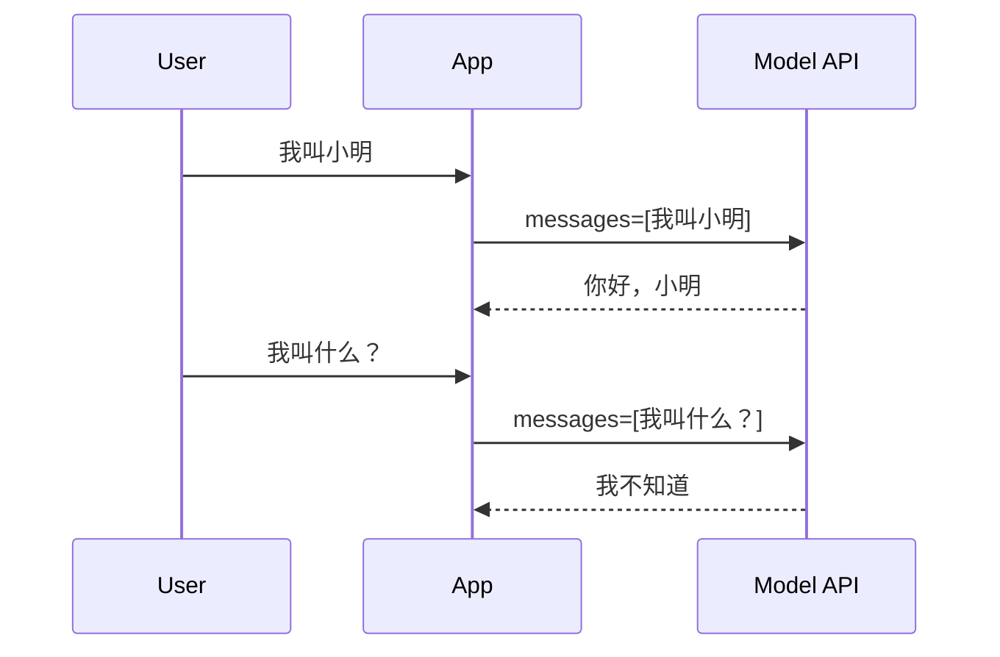
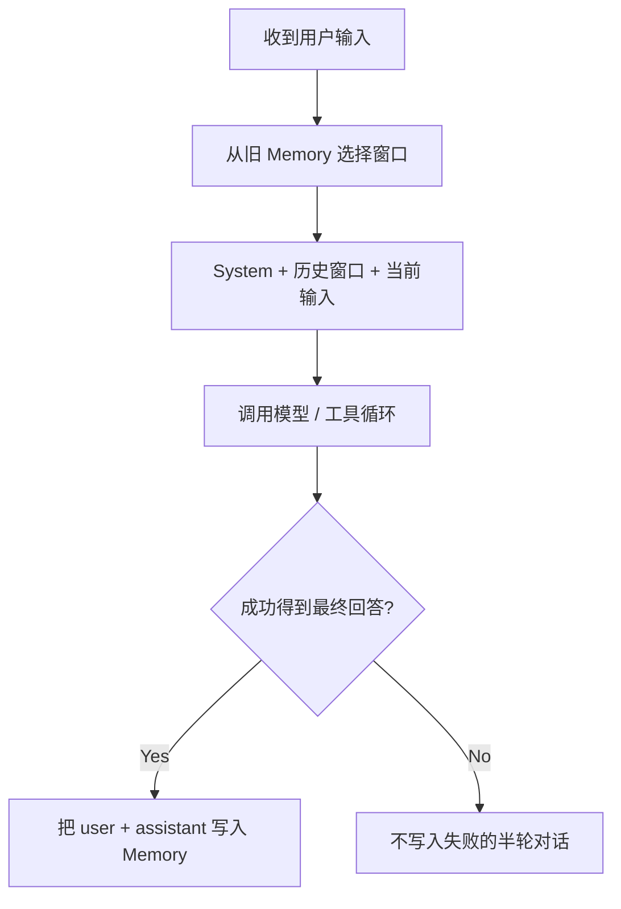

# 第 4 章：Memory、上下文窗口与 Workflow

[上一章：Skill 与 Tool Calling](03-skills-and-tool-calling.md) | [下一章：Agent Harness](05-harness-react-state.md)

## 本章起点与终点

| 项目 | 内容 |
|---|---|
| 起点 | 对话只保存在进程内，发送全部历史 |
| 终点 | JSON 持久化、最近消息窗口、可观察 Workflow |
| 自动化验收 | 24 tests |

## 4.1 Memory 的作用

模型 API 本身是无状态的。两次请求之间，服务端不会自动记得上一轮：



客户端必须在第二次请求中重新发送历史：

```json
[
  { "role": "user", "content": "我叫小明" },
  { "role": "assistant", "content": "你好，小明" },
  { "role": "user", "content": "我叫什么？" }
]
```

所以 Memory 的本质是：**保存可在以后重新送给模型的信息**。

它不是模型参数里的永久记忆，也不是 RAG 知识库。

## 4.2 三种数据不要混淆

| 类型 | 示例 | 生命周期 | 发送方式 |
|---|---|---|---|
| 对话 Memory | 用户与 Agent 的历史消息 | 跨轮次，可跨重启 | 选取窗口后放进 `messages` |
| Checkpoint | 等待审批的 Tool Call 与现场 | 一次未完成任务 | Resume 时恢复 |
| Knowledge | Agent 教程 Markdown 文档 | 长期文档 | RAG 检索后作为证据 |

## 4.3 ChatMemory 只负责顺序

```csharp
public sealed class ChatMemory
{
    private readonly List<ChatTurn> _turns = [];

    public IReadOnlyList<ChatTurn> Turns => _turns;

    public void AddUserMessage(string content)
    {
        _turns.Add(new ChatTurn(ChatRole.User, content));
    }

    public void AddAssistantMessage(string content)
    {
        _turns.Add(new ChatTurn(ChatRole.Assistant, content));
    }
}
```

`ChatMemory` 不读文件、不调用模型，也不判断内容是否值得长期保存。职责越单纯，测试越容易。

## 4.4 持久化 ChatMemoryStore

读取流程：

```csharp
public static async Task<ChatMemory> LoadAsync(
    string filePath,
    CancellationToken cancellationToken = default)
{
    if (!File.Exists(filePath))
    {
        return new ChatMemory();
    }

    await using FileStream stream = File.OpenRead(filePath);
    StoredMemory? storedMemory = await JsonSerializer.DeserializeAsync<StoredMemory>(
        stream,
        JsonOptions,
        cancellationToken);

    if (storedMemory is null)
    {
        throw new InvalidOperationException("Memory file is empty or invalid.");
    }

    ChatMemory memory = new();
    foreach (StoredTurn turn in storedMemory.Turns)
    {
        AddStoredTurn(memory, turn);
    }

    return memory;
}
```

文件不存在返回空 Memory；文件存在但损坏则明确报错。损坏数据不能悄悄被当作“没有记忆”。

保存流程：

```csharp
public static async Task SaveAsync(
    string filePath,
    ChatMemory memory,
    CancellationToken cancellationToken = default)
{
    string? directory = Path.GetDirectoryName(filePath);
    if (!string.IsNullOrWhiteSpace(directory))
    {
        Directory.CreateDirectory(directory);
    }

    StoredMemory storedMemory = new(
        memory.Turns
            .Select(turn => new StoredTurn(ToStoredRole(turn.Role), turn.Content))
            .ToArray());

    await using FileStream stream = File.Create(filePath);
    await JsonSerializer.SerializeAsync(
        stream,
        storedMemory,
        JsonOptions,
        cancellationToken);
}
```

运行后 `memory/chat-memory.json` 类似：

```json
{
  "turns": [
    { "role": "user", "content": "我正在学习 C# Agent" },
    { "role": "assistant", "content": "好的，我们一次学习一个概念。" }
  ]
}
```

## 4.5 完整历史不等于全部发送

假设已经保存 1000 条消息，每次全部发送会造成：

- Token 和费用持续增长。
- 请求越来越慢。
- 超过模型上下文上限。
- 旧内容干扰当前任务。

所以分成两个概念：

```text
ChatMemory       = 完整本地历史
ChatMemoryWindow = 本次发送给模型的最近历史
```

## 4.6 Context Window 筛选算法

```csharp
public static IReadOnlyList<ChatTurn> GetRecentTurns(
    ChatMemory memory,
    int maxTurns)
{
    if (maxTurns <= 0)
    {
        throw new ArgumentOutOfRangeException(nameof(maxTurns));
    }

    IReadOnlyList<ChatTurn> turns = memory.Turns;
    if (turns.Count <= maxTurns)
    {
        return turns;
    }

    ChatTurn[] window = turns
        .Skip(turns.Count - maxTurns)
        .ToArray();

    if (window.Length > 0 && window[0].Role == ChatRole.Assistant)
    {
        return window.Skip(1).ToArray();
    }

    return window;
}
```

为什么丢弃开头孤立的 Assistant：

```text
完整历史:
user Q1 -> assistant A1 -> user Q2 -> assistant A2

如果 maxTurns=3:
assistant A1 -> user Q2 -> assistant A2
```

`A1` 对应的 `Q1` 已经不在窗口中，模型看到半截上下文可能误解，所以删掉 `A1`。

## 4.7 当前消息何时加入

正确顺序：



这样当前输入不会在“历史窗口”和“当前消息”里重复出现。

## 4.8 Memory 写入时机

这一阶段在模型成功返回最终文本后：

```csharp
memory.AddUserMessage(input);
memory.AddAssistantMessage(assistantReply);
await ChatMemoryStore.SaveAsync(memoryPath, memory);
```

以后会增加 `AgentMemoryWritePolicy`，避免命令、超长内容或失败结果进入长期记忆。

## 4.9 Workflow 是可观察事件，不是隐藏思维

`AgentWorkflowTrace` 记录外部可观察步骤：

```csharp
public sealed class AgentWorkflowTrace
{
    private readonly List<AgentWorkflowStep> _steps = [];

    public IReadOnlyList<AgentWorkflowStep> Steps => _steps;

    public AgentWorkflowStep Add(
        AgentWorkflowStepKind kind,
        string title,
        string detail)
    {
        AgentWorkflowStep step = new(
            Number: _steps.Count + 1,
            Kind: kind,
            Title: title.Trim(),
            Detail: detail.Trim());

        _steps.Add(step);
        return step;
    }
}
```

步骤类型：

```csharp
public enum AgentWorkflowStepKind
{
    ReceiveInput,
    BuildContext,
    AskModel,
    ToolRequested,
    ToolExecuted,
    Finish
}
```

它记录“发了请求、请求了工具、执行了工具”，不记录模型私有 Chain of Thought。

## 4.10 为什么此时看起来只是日志

你的观察是对的：这一阶段 Workflow 主要是日志结构。它的价值是先把执行过程表示成稳定事件，下一章 AgentRunner 才能围绕这些事件统一编排；第 12 章再把它持久化到 Trace。

```text
第 4 章：Workflow = 可观察步骤数据
第 5 章：Harness  = 产生并控制这些步骤的执行器
第 12 章：Trace   = 把步骤、耗时、Token 持久化
```

## 4.11 运行与测试

```bash
dotnet test AgentLearning.sln
```

```text
Passed! - Failed: 0, Passed: 24, Skipped: 0, Total: 24
```

24 个测试包含：

- Memory JSON 不存在、保存、恢复、损坏文件。
- Window 数量限制与孤立 Assistant 处理。
- Workflow 编号、顺序、格式化。
- 前面章节的 Profile、Skill 和 Tool Calling 基础。

<!-- BEGIN INLINE RUNTIME IMAGE -->
## 本章实际运行效果图

下图直接嵌入当前 Markdown，不依赖外部图片文件；如果阅读器不显示 Data URI，请以图后的纯文本运行结果为准。

<img alt="第 4 章实际运行效果" src="data:image/png;base64,iVBORw0KGgoAAAANSUhEUgAABQAAAALQCAIAAABAH0oBAAAQAElEQVR4nOzdBVjb7BoG4OAug8EGbMMZY8wZG3N3d3d3d3d3d3ff/rm7M2UMmMAEd/fztoEQ2lKKbOPQ5z6c/mnyNU3SdFefvMkX5ZDwKAYAAAAAAACgsFNkAAAAAAAAAOQAAjAAAAAAAADIBQRgAAAAAAAAkAsIwAAAAAAAACAXEIABAAAAAABALiAAAwAAAAAAgFxAAAYAAAAAAAC5gAAMAAAAAAAAcgEBGAAAAAAAAOQCAjAAAAAAAADIBQRgAAAAAAAAkAsIwAAAAAAAACAXEIABAAAAAABALiAAAwAAAAAAgFxAAAYAAAAAAAC5gAAMAAAAAAAAcgEBGAAAAAAAAOQCAjAAAAAAAADIBQRgAAAAAAAAkAsIwAAAAAAAACAXEIABAAAAAABALiAAAwAAAAAAgFxAAAYAAAAAAAC5gAAMAAAAAAAAcgEBGAAAAAAAAOQCAjAAAAAAAADIBQRgAAAAAAAAkAsIwAAAAAAAACAXEIABAAAAAABALiAAAwAAAAAAgFxAAAYAAAAAAAC5gAAMAAAAAAAAcgEBGAAAAAAAAOQCAjAAAAAAAADIBQRgAAAAAAAAkAsIwAAAAAAAACAXEIABAAAAAABALiAAAwAAAAAAgFxAAAYAAAAAAAC5gAAMAAAAAAAAcgEBGAAAAAAAAOQCAjAAAAAAAADIBQRg+Jfi4hOYfyQ1NTVH4/NXfEIC/TEAAAAAAPAXKTPwd3355r1p10E7a8vhA3pyI09duHLv8fNuHVrVdK7CbxwRGXXp2u1s52lpXtKlaiUaCA2P+PDxs+Q2FiVLmBZnh5+9erv70IkazpX7de8o3vKF67uT568kJyevXjhD4qyCQ0IDg0NpwOvr93OXb9Bb16zmRE+NjQy9f/zauudwswZ1OrRuykgVEBS8YMWGhMSkLSvnKyvLtB9GRUc/eflGfLyigmLDOi5MDt24++jsf9fq13Lp0q4FN/LdR3f6dLLaMvll7ZY9Hz97tmnesE2zRgwAAAAAAPwtBSIAJyUleX31+ertbVK8mI1lKR1tbfE2v377p6SmmJkUU1RU/PnLL5VJNTMtrqigIHGG0dExoWER/kFBpibFTIyNmIIkKjomMio6SBggOYFBIbGxcQliJUGKfLcfPMl2nhVDw9gA7OH1bf/xMxLbtGvRWIFRCA0PNy9pmpiYmJKSQumaxsfGxf345ctvGRMbGxIaxghzchF9Xf4kPV2dYkZF7zx8evXWfW7kkxeu9EcDHVs3++b9g+b89NUb34AAdmqpEqatmzakj/jq7fsii8SWfw+dPF/UsAh/fGlrS1try4PHzz14+oI/vmHdGjfuPGQkyWkATkhMvHjtVmJi0s17j569SgvVFOPdPb/Q8j98+vLx89dc4yF9ujlVKpfVrMIjIiMjo9nhokUN1NVUxdus3rzL52fGRqZtTo+Xrt25dS/ThztyUC86MsIAAAAAAMCf8Y8DcExM7La9R9w8vPgj7Wyshvfvzo/BcXHxc5evo4FNK+bT8LwV62l42+qFillUDk+cv0yxhh1ev2S2lpYm81dQIZcKpyXNTKmEmFUbqnnSo4pKpiVnz4ZVUlTij6Qk9t3nV6N6Nfkjn718Q/m5auXylEW5kdpamr99/SntUw2WJsXHJ1Alk8aXc7BXV1MJi4jS19Oh3Hvh6s1Xbz+MHNSbP0NKvys27JC4qDsPHBMZQx/NlNGDq1QsFx8fn5LC+AYEenh9NS1ubGtlqajIWJQqcfa/69SM8jMboUlYWAQFYFrrc//dkPgulDZFxjSuV5MCcEJiAm2BTBskOZkRbrqK5RzSRqWmvnB9z+TcrgPH6YgDI9zIlGDZkTfuPkgUfjp0kIV9azbNKipleaUA7cCzlqxhZ0UmjBjoUNpGUrM4Cr3c6igK0UB0TAw3hh7j43FSNAAAAADAH/QvA3BIWPjStVtDw8JpuIi+nkUps4CgYKr0UqaaMm/58rlTdXXSMrDPz1/0SHVCCiTv3T6zw1mdN0sx4/nrt9zTF2/e1atZnfkr2LpoGTtrqQFYEHJEAjCbitXU1ERG7jl8UuJMXrx+JzImPDyyZ+e2lqVKDO3b/cS5yxSAzUuYDR/QY/m67f6BgcP7T6aN+fDpKyYLFMAovjJZozInV7Wmd1m8ejM36bdfAP3RgLvnV9r4WpqasyaO9A8KXrd1j5VFqbFD+/LfpVObZozwozfQ1xOMSmWoKK2kpKyro0XP3D57ffjkwTYe0LNz/x6ddh86QYXoru1bUY33l6//rftPihoU6dWp7ckLVyh4N6lf+4XrdCaHfvv5v/nwiQamjhny09fv8MkLdDRh+dwpS9Zu9fn5u13LxnVrONMeSGF4xIDeDvY2Uma1fd9RLv1mJTwyamj/7ozg1PEwKgXTRpg/fZySMPE+f/X23OUbVFQfO6wf2zgpOVlZSYkBAAAAAIA/4F8G4NMXrrLpt1qVioP7dGVH3rj36PiZS5Q97j9+3qppg6cv3zx96cqGIgpg67bt5Q/Xr1W9gmMZkdl+dPdk63glzIr//OX34PFLfgCmct/lG3dev3NLSEisVN6B3vrg8bM0vluHVuXL2tNAZFTUfzfufvzk4R8YbFHSrLyjfYvG9dlzrZdv2BEeHmFjZV7OofTFq7f8AoIMiuhRNqtUzsH1vdvJc5fZt/js9W3GwlU1q1dp2bi++FqzVT5NDQ3+yDjhObGaGmri7SnzO1UqHxoq2FBqaqoUorx//qpfq1pAYAjbQFtbizuJl1Ap+PqdBzTQt3sHVRWVIvq61H7TroMzxg9nsmZS3GjC8AEJiYlZNfD8+n3rnsP8MZQ/KTM/fv66omOZiKjor999fP0DGWFV88bdh7QZabhN80aUh7mX0PJTZL33+NnNu49oa3dq3axoUYMRk+ZoaKhvXDaXGigoKnIBWEGI/ssIkjNNUVRg0s54j4tPoLoxG4CZnDMtXmzlgulrtux6+vIt2+WVuprakVMXS5UwDQikPSvs3H83dbS1aRUePX9VskRxiefkE9rOHz97MsLTyynHZvV2ew+f5FaKER6gmb14Db+Bf2AQ7TDs8LwpY2m/ZQAAAAAA4A/4lwH4m/cPRlgV7NOtPTeyYW2XF6/exsbF/fLzp6dPXrp+5IWHD5mH69RwFp8te/KzQRH9xvVq7T18iuIfhV72hOHk5JQ1W3dTkZltSSHK9Z0bexoqe0EsJcCVG3ey9Uzy1fsH/QUEBlM1kp7++PmLohfVQrkLRCktbd51cPPK+RERkVS+ZkdSwqHhwKAQRpJg4bnB+nqZrq2lWEuPP3/7l3OwF2lP1dHk5GT2qtHE5GRNTXUa0NHR9v7xm21QpIhexjZx99y5X3DeMlWYj539T5jmBMmZ0undR08lLg97Oq6aiioVJ7/5/GSy0KVdS2rGFa5pmCv8stVUMrhPN1VVlR37j7LXLVNV39Help2koa42YcRAZWVBbVNfl6rRWlSjpr8endrw36VKeUeTYsbGRQ2YP0xPRzs4OJTbEyiC0h87/OBxxoXHdGShdbMGEgMwxeNTF64ywsuPS5qZSHmvujWr2VlbBASFiJzRLYIOZGhraujpaTMAAAAAAPBn/LMAzKZEGihmZKimmtFvECWrGRNGcE9rVatS1s7mxHlBcbVn5zaUEbbvO0LDVSo4WluUolwhMtvEpKTX7z4KG5StUDYtTD594dq0YR0auHX/MZt5qOTYpH4tP/8gfu2UERSlr7ChrmGdGlUrlbt25wElZIq7lcqXrZR+3SllYMtSJajyfOfhU/byUao5l7W3G9S7666Dx+mpcVFDqnyaFjNmJAkMFKw1PwCnpKayIfyF67vmjepy46n2O2/qWAVFhW17DgeFpJ1+XERPEHe/fPX58TutU6XaNZwb1HLR0dUWjvdmZ0U1cA+vr5Qz7WysKFbRNjl76Ya9rZX48thYmu9Yu5gGDp88n5x1QqPtSVuMezpqUG+qefr8TAvhVhalmjWsU6Fsmc+eX40MDdhtSDV2KuNXr1qJCtFUy3UobRMTGzd57rLK5R1ovZ6/fnf/8bNSwuiooa7Ozocq6gbpeZ6Wef/RM2zyP3XhyoUrtwb37cbkn5kTR6YkZ9zxyPX9R1ojBzsbKumzY5au2yLlLk0nzl2mfZg+o/Ytm372+spkjfYc+hsyfqb0ANy2RaMWkk4ZAAAAAACA/PLPArB/er20mFFRKc2qViofFxdPAZgia/1aLjTMjh/cp6vEa4DfvHdjYwZFVm0tLdPixhTGHj57yQZgr6/f2WaTRw0uVcKUEeTwZH4vSh8+Cc5opVd179iaEdxeqNSoqXMpTLp7eHEBmCL65DFDKNSVtrFcLuw+6u2HT5XLly1qWIQNwIYG+tWdKma1RgHBghWn8Fy/VnV1dcE5z+zpzYzgUuffUdHRtNhcY/bGRe1bNfULCLxx52FkVDR71IA985ZKi1YWJcvY2aRdT0vHC6o7mZoYU/W7qEERSow/fv3u07VdcWMjqlU2qlvz6OkL4stDm4uSKiPsw5mRija+krKSirLyvqOn2Z6r6EAAFY0p8FOFecvuQ+YlzLyFV2traWqamhTz/PLtwPGz56/cXLVguvBkZkFFnQ4Z3Lr/5M7DZy0b1184Y8Kdh4JasXlJU/G3o7o310cUfQTCv7QztNnrqKX0TcXy+uZ95tL10taWlC0ZMWcuXeOfUJCcLNht3Dy8Fq3ZxI5hT6SX6JefP9vxddd2rdgPUUZULlYUu8T3k4fXz19+DAAAAAAA/GH/LACzlUwSGhaRVZvIqCh3z2/uHl9oODUlhbIWZSp2kuv7Twb6utaW5iIveZje+TPFVIpbero6FIB9/QMDg0KMihr4/BJULFVUlNn0ywhzMheAKQKx58HSSwaNzdS1ktdXH27YpLgRpV9GUPZMe/dsu0HixCck/PYVVEdDQsM27TowceQgSoafeJ1gu751q12jKveUKpAf3D4/e/2GCtGMsOuvIvr6rZs2ePLiNQWwe4+eeX37Hh0VQ2thJDxtmLK3lqZGivC6Vo8vX4UrHqyro9OicT1NDXWJi+T63k3k4l4piujrrZw/jcrv33x+9OnSPiQs/NiZS/XruJQ0NXH3/GJtUfLKrQf1ajqXsbOm9frt63/uyq36taoppN+tytHeds2iGVSLvvf4GTvms6fgAy1pJiEA07EP+tt54DhV6el4BNXkuZQYIKyiGxsaSl/aQyfP0UuoEk7FfArkIlM/ffaiiEtFcvZISix9ivEJtNvwD0AwYj2TsQ6fFBxKoAMNtVycmJyg8M8AAAAAAMA/8s8CsLqaKqVTqgdSRhOZRIEnJjaWcggFkv1HT7MjaZjf8/D2fUdcqlYSCcBUouQuGF62bht/0uPnr6kMyAZXttbHYoufrMSkjIofd5Mh9vphbd6NlJQV0zaaUnYVSHFsgZoSOHH3/Hri3H9d27e6//g5+470Xs9d33IBmKqXl2/cYYcpCJWuSAAAEABJREFU+rZs0sDEuOiKjTvXbNndtUOrBnVqnL5wRTCT85fpj6LpvCljtLQ0Zy5ezd3Xh6zfvp8d2Lp6ocRF0lBXpyDHPWVvX0Rzo9QaFh7B9uqsln5v2+LCcn05h9KPn79amr6Fj5+5xJ+hR+bzgXt3acsI78w8beFK/vgbdx/cvP+IPXZw6drtG3czbvBbo2ql7h3bMFljT7E2MsomABvo67OZWUdHS2RSRGQUe3ozd2UyHQe5cOWmYxm7zm2b81umip237OsfwK6jno72MeG6+/mn7cM0B/pEOrRqwmRBYgWYjnH4+gcyAAAAAADwh/3LTrDMS5q9++hOOYTKYhQM2JE/f/tR0Y8R1GYdHErbmBQz4rKByLBjmdIiM3z5Jstbwj589pICsEWpEpSdKNS9evuByphUKaUiKteGy+Ts3W6Z3EpKzvJST/bM4TouVStXcFy5ceeNu4/0dHS+CjsDmzhi4MLVmz55fPH5+ZstULs4V6LFq1yx7MdPnlFR0cfPXGSEZywzwsyZdotawY2FmlOz8mVLs7c7tixVgt1KbDWb1khdWMPkyrAiaCOvmDeVHaZYOGHWYponlXnp6ZK1W79+9xnat7v4rYAc7GxpjlR8VlRS1BDWll+9+UDLVr6sPZeWWWx/18kpKfyb3NJbJCQm8a+J5U8V34Bfv//w+na0XJnSY4f2o1L2PuFhkWu37lMVd8LwgckpyYwkg/t0ffn6vaV5SfFerNhtTuav2MAfz3bNxR9jXsJs9uRR/DGx6efhf/P5KdJtmNc3b6qKSwnAqAADAAAAAPxD/zIA16nhzIaN42cvxcbGUnbyCwg8cOwMO7V29ao0pn4tl4mzl1AonT5uGNV7h0+anZiYNHPiSEtJN61l4yVZt2QWdyLrzgPHnr16GxoW/tvXv1L5smwHzlv3HLa3tQoKCeXubcuytij1+t1Hqu+5vnerVM6B6odrt+2Jj4+nxNqzc1smO5TrKNR99/nh+eWbafFiWry6Mfn12/+T8HTuWtWrljQzaVinxuMXr9mreSnPm5oUq1er+o07D7ftPbJo5gSalYmx0fqls2nq0dMXKYjyZ5WQlMj25kXF2yb1a2XqnmpwH3Zg7vJ11GZYv+621pbpi6cgffmfvhR0CVbSVHKfxucu36BqcO3qTurqalSmpr8h42eqqihvWjGfpo73WBQZFU1BPZF3L6Xh/XtqagoCMBXR2a62WPEJCYdOnGMvo6U1bd6wbtOGdURO0qaN7/bZ00N40jvbV5m9jRUVnz97feWOgyQlJVE4DwuPpAHxa8KpuM0/n5xPW1ODvYVScnLynYdPuShO29OpYjl2mN7lvZu7mtglvrScIrtfWEQk29s2FeptrSxE2rN3WurctkVsXCw7xj8gmNaIDmE0aZBxG6cydjbUMqvjFAAAAAAAkHf/MgBXdCzTvlWTs5euU/ygcMW/k6qDnY1jGTtGeFYze0JvCTMTGmD7JZJ415mo6GiqvzHCLqz4l3FSrZUCMCO8PLhLuxZ1a1RjL0B19xScxWplUYqfLbu0a0mhi4rSm3cdZNMsO97FuTIjg2JGhpSaaCGXb9hRq7pTv+4duUmU0Nbv2McIMxK7/J3btTAzKXZAeBfihnVr0GOjOjUpAAcEBV+9dY/fIXD3jq1//PJdtWkXhb0q5R0VFBUOHDvLbsBBfbLpGJlqp998fn355l3a1mpw3+4De3dVUlR8lH6lNB9FzVMXrtBA/drV+eNTmLSukl+//UD1c3pTid0+paQImnGVVVZcfDwbgDOapaa6uXvuPnSC0jI9LVva9pPnl/9u3Lly617j+rVaNKrL3Tf42p37bEKmoEgfonOVimVsrWn+qzfvZjJ/cP9dv33v8fNxw/pTNZuRjY2VhYV5yTfv3E6cF3TmTJ91lYqOL16/K21jSTsJ2+bMxWsUgLUzLz8pbmxEh2D4Y+jAAdv/WZ+uHcSXYfTUeRJ7k6aRF67c4p6yw907tuHOhgAAAAAAgPz1LwMwadm4PpXgHj59xV56ygh7qKJCaJe2LdhS2E/hzX6K6Oupqap6eAmKgcZFDZXFrqJkeOc/U1jij6eIxQ48efGask3PLm1dnCu9ee+WkJBY3rEM5dJNOw8wwjokI0ynU8cO23vklM/P32z6pbfu272jlXlJGlYQtpFSRx3Uu+v+Y2fYmwMpZV5IqnKz60hFUXZMVFTMUeFZzTRziuWMsAurZg3rXL11/8yl61UrVTDi3Q73nZt7bFwcJTT6Y8eUsbMeOai3SMGQQuynz1+EdyEO9vUTlElPCjMtI7zDUFxs3Jfv3rQlnwuPCCgKX0ur6fbZ68GTF6/efqCnZqbFalarwr5EQ3ju9NmL16Kjqa6b5BcQJJyPfoBg5mm3Sk5ITHorvA9wcrLg2ETfbh2o2MstD+V2ehWbCWmzUIn+8fNXbBqkDTtmSF86FkBHLq7eenD9zoNrt+5T/q9fq3qrpvV1tLWrOVWiWqtz5QqUdYUXJEcePHGWLfLTMQ76KJet20Yzp/D55sMnWgtVVRVGNtHRMacuXX36wpU9nkJzG9avx/cfv9ht++j5q72HT3GNrS1KZTtD7kNQVJBwWbittVV4RKae3mJiY4OCQ2mXY3v55jPg3dUZAAAAAADyl0JIeBRTAERGRXn/9C1W1JCf+vLdC9f3z14KiootmzawLFWCUtOGHfvZe+EsmzOF0i/XMik5OSAwSF9XV1OsACiL5OQUkS6yDp88d+fhs46tm3F3+qVAuGDlRipvLp0zmbtIlQL55LnLqHC6aMZEysP8OVBufOn67v7j51yVlTIkLTb/jS5eu3X+8k3uqZ6uTgmT4iVKmJQ0NbGztqClms7riYoyZJP6tan6SkV4dkzVSuX69ejE3Zb51v3HR09f5C+DSTGjhTMmXLh668KVm4zMdq1fGhwSNnX+cvapjrZWvZrVWzSpp8I7aTkmJpaKsWy+tbE0nzZumMhMpsxbzh5BqFuzGm1GVRXlEZPnciV6CpMbls6R8Y5E9KppC1bS3Gj7tKFDDjWcKWA/fv56z+GTLlUrtW/ZZO7y9akp9Akq01EGKuPn6EZHsvD65k3pvZhR0cWzJjIAAAAAAPC3FJQA/Hf88vOfu3QdO0xxNyQ0nE1QVPacP3Uc8yelpKZevXmXf2IzI7y0tYierp2NFX8kVXGpeiyl8BgaHvHo6ct7j5/XquYkcodbX/+Apy/elDAzMTMxLmZkJN5PNWU8tuNrW2uLms5VKNpR5F60ZrOlecmGtWqUMMtUkKTA7Pru42evL8Kzmxla1JrVnejR6+t39obJslBUUqSQyQj7rPINCKztUlXKqvn8+E0l9IG9O5sWF7trkceXyzfu9OzctrixETvmt58/Va3j4xM1NNQqOTqI3+hICu8fv2gzVihrz5XQ37t9PnbmUs3qVVo0qsf8YX4BgUdPXTQ1Me7avhUDAAAAAAB/i3wFYOLm7rX78AnuRkEqKsrOlStQrGLvkAQAAAAAAACFldwFYFZMjOAiTF1dHX09HQYAAAAAAADkgJwGYAAAAAAAAJA3igwAAAAAAACAHEAABgAAAAAAALmAAAwAAAAAAAByAQEYAAAAAAAA5AICMAAAAAAAAMgFBGAAAAAAAACQCwjAAAAAAAAAIBcQgAEAAAAAAEAuIAADAAAAAACAXEAABgAAAAAAALmAAAwAAAAAAAByAQEYAAAAAAAA5AICMAAAAAAAAMgFBGAAAAAAAACQCwjAAAAAAAAAIBcQgAEAAAAAAEAuIAADAAAAAACAXEAABgAAAAAAALmgzIDc273v4MGjJ4yLEsMNq5cpK2OvgL8kODjkwOFjnl++url/rle71rxZU5mCJCg45PrNW106tv/TX4pdew842Nu7VK+qoKDA5B//gMDDR094eH1x9/BsXL/uzGmTJDZ78er1jDmLyjqUtrO1adOyeQkzUwYAAACgkELUAYZ+H/v7B9AfDSP9wt+kqaV5+PjJ6OgYGr505er0KePVVFVlfG1SUlLP/kOjo6OyajCgb+/GDep9+PiJkY2trXVRQwPuqa+v/4Bho757+9x/+GTV0oXa2lr8xh4eXpTbZZsxU87RoVTJEllNPXfxv9XrN9OAQ5nSk8aOphgcExv788cvRmaWlhYqKhK+uTo62mfOXwwOCaXhQ8dOjhk5jMaIN/Pw/Prz1y/6u3bjdo3qzrIE4DPnL+3Zf5DJg769enTu0JYBAAAA+LuQdoDx8/NnByzMSzEA+YqCYmxCvJQGLtWcb96+SwMUg0+dueDoWEZKYwM9vZLpSTIxKend+w9SGoeHhb9yfTN8zERGNutWLm3auAE7TBG0e79B7FGhew8e9RwwZPvGtcWLGXONT1+4dODQURnnvHzRvKwC8O/ffouWrWKH3T59/ub9nQLwt2/enXr0ZWS2atnCls2aiI/X1NCYMHbUzLkL2adXb9ySmDk9vb5wwzZWVowMvL19vnz9zuRBeHg4AwAAAPDX/csATL93qebAH2NqYiKxQMHn6+cfERHBPVVUUKS6DQN58Ns3LQCbmhRn/gCvr9+Sk5K4p9ZWluJ15h8/flLkYId1tHVMTUWXJD4h4ft3b+6piqqKlYUF82f4/PgZm74wOX0jWgsfn5/fKB/4/GAUFPT1dNu0aqGhrh4VFf3r92+umSy7euEwfe4CynUyNl60bKX0BtWdq+zdsYX58yg6jhg8YO6iZexTivG9Bww7uGcbPwPnXUpKyuwFi9kCOCP4alh06dieybmU5BRueOmqdddu3OKeJiUmcsNzFizZvH0X/4UbVi8v7+jw6bMH+5QOgYkUugEAAAAKmX8ZgO8/ejxhykz+mKED+40bPVzKS1JTUwcMFZyUyB/58tEdLS1NBnKFfoJzhyEeP31epmI1Jof69Oo+fdK4rKbSR9at9wDuJz45ffSAQ5nSIs269x3EnqhJ7Oxszp84LNLg9eu3A4aN4p7SL/Ur508yf8aIsRO56hbtWrSDyfjC+w8fT5g6k7+ypF6d2hSAqYo4afpsbiSVBNu0as5APqFgXKlCRRr45fv7wqUr7Ehra0vavRmZqaqq8J926dTe2NiIKyDT16T/kJEHdm8zKmpIT4saGMj+z46SspL4SPpqbNi8nb503Jh5M6fl/RqEiPAItnAtkcik4ODg2Lg4rpBepEgRbzpwI6YIHcjR1c1iloL6s5Jixgp+dHPfte8AO9ynZ7dKFcpzk6JjYmbNW8QAAAAA/DsF6xToQ8dOjBg6SORnKJ/rm3ci6RfyKDQsjMkb+g0tZaqCgkK9OrX+u3KdG/Pho5tIAKbf3Fz6ZYTVtpDQUIMiRfht3n3IdLJr7RrVmQLm/Ue3oaPGM/Av1K1Vq1+fHjRw4PAxNgAbGhSpUd05ITHx5uVzMs7EpHgxkTG06x4/tHfA0JHsQQ36x2fL9t1zZ06h4cED+tAfk1tJSUnzFi8/ffYCN2bSuFFOVRbgXVMAABAASURBVCqxw3a2NhvXLJc9vZd1KMPk1rv3H7lh1zdvm7XpJN6mSaMG61ctzWoOTRs14Od2dXW1XfvShl2qVaVtyE0KCw+fNY8BAAAA+IcKVgCmX5n3Hz5q1KBeVg1OnT3PQL4KCgpm/jCXas78APzm3XuqrfEbvHjlKvKS165vRXYD17fv+U+rV6vKFDAvX7qKjyxWzFhi70QFE6Wyw8dOvn7zTktTo3/fXrbWMl0OKiOKoysWz2eHqeoYnxCvr6vHb5DKMMnJyeywslKmkunYydNfvX7DyOD8pcvsQLfOHZWFNDU0mDwo7+iwdcPqPgMFZ6ZUqlhh4tiRTJ7FxMROmDrz3oNH3JgWTRsP6NuLe0r7jJR/BqWjzKmrl2W11tvbx5x3qb+Zicm1m7eZ7CTyzqMW16PvYGWVjKOWoaEZB7MmTZ9tZ2vLPU2SOh8AAACAv6DA/TQ/cfpcVr/8wsMjzl74j4F8FRAYxA23b9PS2sqSySErSwvpDZzT61qsF69Ek8zT5y9ExlAk5u8GVAp7+TpTvKxSqSJTwLz78JH/dNG8Wa1bNJNyOkMBdO3G7WWr1rHD9DFdvXBSSUmJySc6OtqG6X0sT501j+q0wwcP7Nurm156WvP0/NKmcw92+OiBXRXLl+Ney3UNragobXm8vn7jrjdu3bIZk0+qVqm8YfWy46fOURU071dbxMTG9hs84v1HN25Mg3p1Fi+Y7e3z47OHFw3n8YhJm1bN2bPrP3t4Dhw2unfPbt07d2BPYF6/eTul7jWtWzRv0ohrP33uAiZv+Osigo5pUlWZAQAAACgwClwAfvDoya/fvmamJuKTrly/wUB+4wdgKszyU0d+KVmyBBVCuYsPf/76FRwcwmUhCrd37z8Uecn9h4+nT844nfi7jw//wtpyZR30sq5x/Ss+P39yw4YGRdq1bpGP6fHvOHP+IjdMHxNl4OrOVZj8duvOPfYs5a07dx84cnTEkIHdunQUqdPGRMdKfG1KSrKUOV+4mFb+dXaqbF6qJJN/GjesT3/sMAXLjzJ368VXsoQpZWnaK/iJkWq/yxbNS0lNoSq3h4cXfVOGDOiTL3ceXr1+c3BI6LqNW3fu2X/u+KFLV65t27mHxk+YIrhMvVP7NjT85VvGIYPaNV06tG3NCErxqVzvDL27d6lcqaKxUVEGAAAAoFAoiCdnnrv438ihg8THHz15hpFNQkLi3fsPrt+64+Pz87evr76+XqmSJZ2rVKaikCHvPp+sNes3JySlnZhnXrJE9y6d6BfhoaPHqaAXFR1DWatWjWqdO7RTVFRkhH0RU4365StXamMgvMiQZutSXfLpuElJSU9fvLx67ebX7z60GCrKKqVKmtnZ2bRu3ky8F6hTZy94fU27raiykvK4UcMePn568Mhx+rWto6Nz/ODuy9dufOf1T9Ogbm1np0zhhCpLG7Zs556qqaiOHzOCyY5/QEanOEUNDZk/g5b26InT3FMKANyVgV++fhfpNYoRXmzpHxBYzNiIffrhQ6ZbudIvdf7T/N3OUjr7IRERETv3HExMzjiTs0nD+nfuPqQx/N6DKHisXLeRBpQUlUaPGKKupsbIwP2z5/n/LlMK8vnxKzEp0dTExMqiVNPGDV2qVeXHIQqQL3j18L49upuYZFy8unvfwcD0q7L1dHWoyspNCgkN3bFnP/e0mlOV+nVr8xegaNFMOwDFeCbP6tWuZWdjQwNly6Zdp+ru4clNpY9+5dqNe/YfGjtyWPlyZbOaSZNG9Y2NBDuDpaV5Vm1o/z9y4hQ7TAHS58fPXFySrampcfroAeltLl6+RhuZybl2rVtSAKZqNoVe+jrTmMH9+4wZOZQ+XIqp9Lkzwk6q9h44mpJKWyY6RzMvVbIEv6779NlLOpjIDltbWZmZmfJP7pg9f7GujnaTRg3OX7jMjezRtRP7reQfFGvetFGlihWkv/WaFYuVhP88sh4/fXH8VNq/1UMG9C3rYM9Non9RuXsyAQAAAPwTBTEAHz1+aujAfiIFkHcf3NgfiNmicDV6wlR+Z6eURihl3bn3YPma9bOmTe7ZLVMvLzv3ZvzepZ96ZexLd++TEb9pPjdv37115/7GtSt8ff1GjZ/M9Q9MJbJ37z9QUWXc6OG0wCKLQUtLJR2RLrvoJY+fPt934Ejd2jWXLpxTRF+fm3T95m3uByup5VKd636Wlj8pOfnXL7/9BzPuOxoUFCwSgN+9+8hvUKWyTCcJBwRk/NgVPzqQX6o7O/ED8IePn7gA/PL1a4kveeX6hnICOyzSA5Zz1YwVz/ftzGSNkvaEqbMfPXnKjaGAPXzQgJ79hog35j4LygDZBuCw8PAZcxbSLsofSfue65u3p89dLGFmtmnt8tJ2addS+vkH8j9oOkbT0iTtHrAUAlet28SfCR3Q0ddLu9SWNjv/hZZit32mCMR1oUzpyNYmH64BpvwvMoYOb7Vv3Wr/kWPcfXRpy+8/fHTV0iz7B+7aqQP9MVLRJ8seSdHS0qxfr/ZvX7+8dJgXHBzy6Mkz8fEtmjVm8qxB/Tr3Hj5auWQBewCCPuXtu/dxU5cvmtuz/5AczpKhWXEBmHbUles2cJMmjxuloKBAFezZ0yctXJp2z+Gxk6bv3LqeO2TACLtoZgfoKBI3skSJEkx2Gjeox//nWlVVlQvAlSqWF+kEiwEAAAD4pwpiAKZfw5Re6tSqwR955txFWV775OkL/s1yxC1attLXz2/SOMltAgODRo2bLD6eItO5C5fOnP+PS798VL2hUlu3zh25Ma9ev+k1YCiTtXsPHrXv2vvUkf1Fs8ici5aL3hCVSjHczUXI3fsPk5OT+SfZilxJ21K2X+p+/v7c8NiJ05gc2rF5nSzNnDJfBvzKNaOA+fT5K4kvef7iNReAX2TuAIkrFf6J7SzFkhVr+Om3WDHjbRvX5v2i0OCQkI7d+0q5dQ3l+XZdeu3ftYU95OHsVJk/lY74tGyWFoA/un0See279x+5r9LHT5mminwopEI5x+cPqMD8gAqtlKuZ/LZm/ebffn6jhg22MC81fdK4Hl06zpy3iO3daunCueG8+3trauW45yoq47MD7Vq3yGPHV+Tew8cSa5WNGtbT0srrzKkqfvHUMbZuT6F9ysz53KQ+vbpXrlSByZutO/ZwJzZTMOY+6B5dOwcGhbAnQpPBw8fyX3X1+i12R/r1OyMAGxXN/qyQ5m278J/Gxmac0EFHl+jwjcRJAAAAAP9EAQrA9EONq4CdPHOeH4CjoqK5koJISz4qL0yeMVtkJP384u5zy9q972D1ak5U+hOfg0hLvnmLljNZO3T0BBeAw8Mjxk7KPklS4Jk1b9GW9asUeWcPcsSTNhUbKTZwRS363ez+2ZN/euGdB5mupG1Qry4jA/4q80uj+cugSBFafu5HOYVeKlJR1Yge+ZGyY/s23I1h7gpWZyoNREZG8Yv/NV2qa6irM39sO2fl0LGT/CI25d7d2zZQPKBVYPIgNTV19vwlUtIvZ8KUmRfPHKNqto21paFBEe7GUe/eZ1xQ+vrNO5FXUbzkvkrveWeS0xysLSV0eKajo/2HblD8+Mlz9myL/65cp3LusMH9zUuV3L9zC3212WsNzpy/xDW2NDfP0cw9vLy4vUtNTbB76Oro9OrWWbzl2Yv/cafcizcoIsNZ38MGDRjcvy9/TI++g9nLemmvuH/jclY9n1EZlh2gZuxxE9q3x0+ZyX0H6R+rsSOGMnlz/+HjLTt2c0/Hj850HcSYEUMCAwNPn7tI/4o+f/mKf/XBzdt3IyMjdXR0uH9kZDwIIuWfzWynAgAAAPxlBSgAd+7Qlou19FOMfwko/0Yd9MOxSaP6EgPw4WMn+beTpV9v61cvMyleLD4h4dSZC1T75SZt2LRdYgBm5z9jysTStjZv37/nThfkVHeuMrB/Hy0NDYro/C6pKUdRHmN7ZjpyItNiMMIOgevXrUU/dmkx+FVcqk8+f+maVT9DtPwtmjWxtrIICAzS0tKiMe3atKRqM9fg2YuXXAAODg7hp0QqEnJbTzo/GaJXvqAN7sbrOujL12+l7Ww9PL/wf4KPHDKIC8CUCX/++l3CzNTNPVOHQzWrO7MDf247i6NQsXhZpp1h+8a1bICkGP/oztWUlNR+g4fz4/SDW4JziSnxSO+v6+VrV5GdeWC/3vRdoCB69/4jfhGSVvbI8VMjhw6iHEWZltv9XN+8ZY8m0PALsVsxPX2RUWCnwMMN18t89e9fsHztem6YQi/9DerXZ0C/nlSWZEf+Ti88UjjPaSdn1laW3BGWPfsPDejb09io6Mxpk8RbPnzyLDpaEPAa1KsjsQFLRVmZq+2LXKNO259/xu+bd++5Tq0G9++jqSmoD9M/X3fu3b95+/70KeMkHmhg2wwZNY7/tV04dyb78tdP7zFZmDJjLv3zyAj/pWL3MZaSsH9sKt5OmDqTGzl5/Gj+eey0DysqK/ft3cPZqUpkVLT4v6L3Hz2hIvC9+2n3Z6JDLQwAAABA4VKAAnCVShX4Fc4Ll64MHtCHHT7O6/6qV7cuqun3ROGjSto5Xocu9Otw8/pV7Pl7aqqqPbt1+vb92+FjaRe80Q9WeiMLsWsgyaa1q9ikRNkyLi5+5dqN3CThpZir2J/F5cs5fvnm/e59xrWpn9w9qLBMi3HmXKZ7Nc2aNrljO0HfqlQFnThuJNVDrt64xU29dOWqxGBWqWKFXVvWs7+GOc2bNOIH4EdPnnH3Dn3+KtOVtNw5sdLR0nbv3Ckqh93tXLx8hbvYUvZXVavqxO+B6d0HNwrAL3iLXbd2TROTYhRHuTjxyvUNBeB37zPdXoi9APiPbmcRnp5fRLpTWrNiMf8Sa3pHRlB4zHShb1HZLqi++N81/tOmjRtw5+d3aNsqPj5uwZKMAzd02GXEkIEUwFyqOfOPv3z9+t3OziYxMVM5nUW7aExMLK2gr68/P8i5/PUbKR/YufXYqTM79+znFoMOUpy9cJFSHFsaffMu7dvkUMaeySGKf7OmTuyRfjH2/oNHJ6TfsJcS5qs3b8qVLWtnayNSm6VDY4+fPKP95NHjp9cvneXvBq1bNuNupHT3/kPuQnFx+w4e4YY7dWjLDnTtPYCt6u/YvX/5onnir6Kdqv/QkSJHcMqXS6u4suc4SF5TpYwTGcSbxSfEF9Evwm7hmi7VK1eqQPmc7do9NCzs0LGTNHDg0NFxo4d3at9m5979tJDst5h9ydXrtyo4luW+gBYWWdbhO3dsV69OTYmT7j96yp1lTTtz5YrlJTYrXrw4AwAAAPDXFaAATD+Ce3bvwtXZDh8/ObBfL0VFxc8envy7hrRv2+rjJ3fxl9Pve/65dtra2iFC3BgzE1N+e6origdg+i1YrWrGBZZVM19sWbe2Cxf5lJSUXJyd+AE4Lj5OfDGoltWja0f+TOinJz+YPXwsmlhYQwb0EU9lpUqWoODNvenjp89jYmPZyx0fP810AXBcYLaSAAAQAElEQVT9enUYGdA2p6zI5FBycvLJM+eYHKpYMdMNlt6+/0B1zifPMha7lrBv5zq1a3Af97PnL9u2akG/4Lk2tP3tSwv6gvqj25mPgsHgUeP4Y6aMH8PvbjeP7j96zH8qcsJqt84dN2/bxcUkiiu/ff3MTE1E9ky3z58pALt7eHBjnJ0qP3+ZdnCBjjVQ+P/0OVMh3amy6AXAfxoVdYdSdbt7V6rQbt6+ix05dtRwNv1GRERw6Z2SKpNzdCyDIuvF/64ywp7t+vbqznbqduDocfa0AtpJHt6+yn/JZw+vEWPTisDPXrysn/OquNfXb9dupJ2f0r1LR0ODtKMeg/v3ZU85oQN5Qwb2FSkCP332ctSEyeKdn+edlYXFuROHlq5ae/X6zX59ug8aPobeZdmiufQ9unTlOtfMvGRJWtTNa1d26tF31rRJYaHhy9cI6vNUWy5tl7Hx62buiIERdq+VnJJCA0ZGRY2yuDcSP9Wblyrp4FCGyQIdgGAEBy8U837PJwAAAAAZFayfHS2bNeYCMP3Wf/b8lUv1qvwrA2tUd6ZfVBIDcGBIMP8pvbxdl15M1gJ5t/rg2NnactfpkSLp3eeySphl6hDVyMgo28WgWhZ/hsKZmIosZ0pKivjlqfal7RhJ2rZqxk/db968r+EiOCX4zt2McyYp7cjSdU2ucfdilfHuPiwK6rRgXJdX9OEmJCTee/CIa1BN2MOTi3NVinzsmPsPH9PGoWTCtaldw4Xt9+tPb2eR1/Kf9u/bk8knVMcWmbnIYtNKOZZ14G+lwKAgCsDFixnzT5f4+PFTu9YtuQoqI7jUcyjXPZjrW8HtfPnnn1tbWch4hnzeRUZGpaam8Mf06dmVAvzUWfMoEjdpWD9C2PfV3fsZ61jU0DCC1yEWn4qqqpTq6NiRw9gAzAhvFtWlU3sKbBQF2TG1a4rGOUcHe+5q6tv3HuYiAK/dsIUb7tUjoy+o9m1brt24mY244kXgles2/In0y6KDRIvmzhzQt2efAcPYd5k2a/6XL9+uXL/FNahXV9Azc1kH+9NHD5Sxt6MtwAZgwn37ypV14Doe5+w5cJi/ytkaPWFqtm3GjxkxZEBfBgAAAOCvUGQKkiL6+vQ7nnt66ux5qnCePneBG9OlY/usXhua+WTCbIWHRzI5lDlhybQYlpYWIg0ov9nZZSpwUUIQn4++vh4jSeOGDfhP2Qrql2/f+FWXFs2aMn9SYnq3TxoaOesAuUb1jOuuqX778HFGn1uUQ9gLDss5ZtwMllaKsh8/KtRwqcYO/OntLIWn11cmn0REZNoJKZfyu/VmWVhkOk8hNDSMHahTO+ME1LfCs8Rfvkq7AJhWvErlitxdfJ8LLwN+9yHjTPJamW+kzOfz4yeVNB88epLHzr04rTt1r1anschfv8EjKPl7eHhVr5s2hvIw95Llq9eJv4T9a9Oxh5T3okMDXJ/D7EUB7z985PafOrVFAzAdEGnZIu085yvXridLvQmWuNeub2/fvc8O9+7ehaqv3CQ63DN88AB2mIrAX79/57+wfp20pE1ZtHw5R+YPKG5cjH8mOZXEuTMmunbqwB26cihTmg6yFDU0aNq4gcgcOndsxwAAAAAUOgXuxLNO7ducu5h2cePlazccHcpwv18Ft/fMukSjri56Iqv4Fao0K26khkaWdaS80Mh8/5WwsDDxNsFBmaqXauo5qKNSabd2TReuu+b7jx9PHDfy+YtMdxJqkF0ha/vuffx6oCzU1dXmz57O/m6Oikq7ZrhIDtOjc+arcLft3MsN169Xly3hqqqqNGpQj+3mhxHe0CXTHNJP/f3T21mKSTNmnzy0L6uefnNEPfNOGBYm4S6pXOJlcQcdXJyduPvovv/oFhsXx51CXEPYTxjXURZV3ePi41+/ecvNpHpVJ0aSDx8/de7Zjx1u0qjB+lVLmQIm2/voVK1SkU16T4XHhu4/yjj1vUY1Z/H2TRrUYzcj/eNAm5G9XFYWMTGxM+el3biY/lUZMSzt5uEJCYkenl4fP33i98h98sz5qRMy7jlEBy82b99F0Xft8sWXrl7jn9ORXzQ1NTatXTl7wWLuxs6cdq1aiLfv1KEtdy43q1njhgwAAABAoVPgAnDlzF1hrVi7gZsk7P4qy9RRtGimPof69Oo+fdI45q8TWQx3D0+RBuHhEfxqLf10ztGJxKRV86ZcAKYaWkBg0MPHz7ipNV2qG2bX/dLbdx8kdqMt3dSJY9lF5e7XaiDDPWP4ytqXpvXljmjwL+2uUT2jT6ZaNapxAZjfplgxY/NSJdnhv7Cds0LbfOvOPWNH5vV2NYywezb+BqEFDgsP18984r3Xl0wFZ0PDtG0u0rfQ9Zu3ufk4VxEcJqjm7MR1lHX9xm1+Ib1KFneaPX76HH+G3j4/uA3+/8LK0oIdoI3p5x/Anf9c3bmKxJ6lK1Yox50FfffeQxkDMKXc+UuWc/9MUe33yPFTX7999/zyld+rM+fk6XPjRg1XS++9z9HBfsr4MT27d8mXwyhZoZkvXTCnqKHhnv2H+OPNSpiKN6ZjIvx7a3Xq0E5HR1u8WYe2rW2trSS+3e79h15lvl93pvk7V+nTs7vESebm/2f7GAAAAPxfK3ABmMqAPbp1XrJ8tfik9m1bSXmhaeY+RV1d36ampvKvCxXpI9exrIOM/fTmiEnmxaBfw15fv9lYZXSBczfz3XpluQZVhEgZ/OHjp9x5mKR503zrnykrwcFpXYsZFNHPyesEdwyifH795m3xSdWqZhSHqztL7qC4Xu1a3PBf2M6cm5fP3bh5h7tIkhHUrvfUqVm9UsUKTJ6VLWPP9VZFbt990IG3n3/9/l2kVm9mYsIO6Orq0gK4ptd1d/J62K4sXLAqlTL6qd6xZx83TK/S0dFhJPHx8eE//fHrV94D8NL5c+IT4rOampSUJHKZ6LjRw0tn3QmWqoqqxPHeP366f/akavn1m3e4kXSgh8uo9etK7hZOSUmpWZOGbP/w127epndnZLBkxRp+ZZUO0/CP1Iijow+UrrnTjBUVFfPxSnIp6I1q16whEoDHTZq+ce0Ktcx96X/85B4sw1Uk9G+mxNNwdu45wKXfBvXqcP8icXf2fvr8VY3q1Qf1760gy5UkAAAAAH9MQex7s1XzJuIBmO3+SsqrNDU1mjVuyHX8S79HqUw3YshArsH2XXu5vmfJkX07/kQA1tTQaNm8yX+8DlcnTpt1dP8utq9mKqlNmzWf3751ixxfr0uVmRZNG1++doN9umb9Jv7U+nVrZTuHMqXtqITF5JCKsKfW5ORkLlQUKZKzCjAjrPSKB+ByZR0MeLOiD5qKvf5iNyiuxjuD+i9sZ46ZqUnvnl3v3H/AT6pTZs4/e/ygtrYWkzdUz+fPdubchRUrOLJXk8bGxU2ePoffmPZwfp/VNV2cuQDM3YLYoUxpttRZwsyU24z8GxRTgT2rhaFjTNzC0GuzOlM6R1yqZ3m/pZjYWJEVJOs2bq1d06Vfrx70QtnD0rGTp+mPP4ZK60eOn+Se1q1dM6vX0kEZNgDTjp3V3dFEWFmaZ9uGDjRUqVjh5p277Pfl9LkL4tfZ/ml0YGjUeNF7HT949GTqzLmrli7k+l729Po6cNhofptTZ845Va7QVtLJ0iJCQkPnLlzGnbIxqF+fKpUrcAG4Uf26xY2N2X9412zY7Pr23cI5Mwz/wD+8AAAAADIqiAG4iL5+m1bNRS5d69wh+x5ZunXpyL/zzcYtO968fe/iXFVZVeXuvQePnz7nJtFv3IoVyjN/RtdO7fnBjH6D1mnUwqWac3x8PHfqMot+ozdplJvfxK1aNOUCML9uQ8nBQIZQOnrEECa3fv325YZLmJkwOeRURcLdd+qI3W2lUf063E2bOVWrZLr3z1/Yzkz6leRUJ1y6YG6bzt25E4l//vq1Ys2GBXOmM3nTuFF9qi3zz09u2a4rRTINDfUnz56L9BXcPfOtnmjf3rR1p8gMa1TLyLdUMz9+6oxIA7a3bYlaNmuqpqZ29vyl0ra2nTu2/aM3p3ny9MWCpSu4gyl89PHRn7WVxYC+vZs3bSSl22cO5Vt+X9mkYvny3BkfjRrUk3L4rDKvkn//4WORABwZGXXoaEaQ/vbNu6yDvUt10cuJ6VV2tjY2VpY0QA80xJZYixcvxt4Pidbo928/U9O/d/NbXz//AcNGSexu+tqN23SoaNG8WVQi/vnzV/8hI8Sb0SEkWhE6OJXV/FNSUqhmvnjZKu6fIPqWjRs9TOTbN2LoQGrAHp64c+9B2849pk+Z0LxJI/Eu2QEAAAD+ggL6E6Rz+7b8p4Lur+plf4eSalWr9OzWiT+GfoqtWLuB6sn89EsWz5v1587Eo5zWt3emq93oxyVVSER+F5JlC+dS2mdyjn5/i3fxxQj6f27M/GEPeL0K2VpbMzlEtU1DsSuHXapVFRsjGjDs7GxEKvZ/YTvzUXSZPytT3D155lwuLqUWoa+nt2LxfJGRlNxoRUQySZ9e3Z0zZ9eyZSXcYbWqU8YhBueqlcUbODpmGWlUVJQpmezYvG7iuJGlSpZg/ozPHp7jJk+nbMZPv906d+zeJVO8p6o11cNrN2xOhdzExGy6pK5apRK3X1FmW7tiibJyRn/agwb0kfJaKphzXTHfunOPP8k/ILDXwKH8Syc69ej7+MlzW2urWdMmr1mx+OiBXbevXnj/8tGV8yfXr1pKh5Zat2xGCZk7wbhh/Tr0VW1Qr86MqRM1NP9Ix3sSuX/2HDB0FP/oGH2stJG5p+8+fExMSnr3wa3/0NH8ZvzEO3z0BG+fHxLn//TZy849+02YMpN7LR21XLlkgXg35hR058yYTHsv+5TaT5o2u1vvga9d3zIAAAAAf10BDcBVKlfk12F6du0scsVaViZPGNu1UwfpbejHceVK+XD1phQTRo/s3b2L9DZUfqHCFJMr6mpqrZo3Ex9fr0725z/nxdPnr9Zu3Mw9tba2ZHKIjjvUE7uGkH/rI5ZTZdFCcZ0aNcRm9se3s4iWzZu0aJrpEMPkGXO4K6JzjdLR4vmzpbehIzsTx4wUGUlfCvELMitVyOjGiX8ZMIsqpTJ+lfJdfELCles3e/Qb0q5LL5EOh5cvmjd35pQ5M6bcu/GfyC1h6SjAwqWrWrTrIhJNRSgpKh07sJte/vH1kxOH99rZWXMF4erOVSrwdrCkJAn3OqpdI+0GXc9fvg5N71E8KSlp/JSZ4p1aDRw+es/+Q40a1KWDBRXLlzMpXkxKqbx4MeOXj+5sXreSdtS8H4WRRXJy8u59B9t37cU/vrBgzozaNV1mTp3AfhfoYMG6VcvWbtzStVd/7vZIjPDCkN3bNnL/9lJY7di9D/8oT0xs7Jnzl2hk/6Ej+VenD+7fZ+mCOVn16UXf+umTxk3g7cDvP7r17D+EKs/svb4ZAAAAgL/lX54CrZL5V6OiYkbpQKQrrA7tWvNbKilmKjIoKGbUcunH/bxZUc5SmQAAEABJREFUU+vWrnH42Cl+3YZFBZDhQwYYGxVlslykTHNWUsq0hMrKKpmnZqohK6tkNKYfglTwqVXT5cjxUyJnZjLCjmH69uhma2udeeaZ3ivbAnWThvVFzm6lbCPSgXCu0db78eunYREDbW3N5JTU6KgoKgS5vn3P/0ldqWKFXJavq1Vl+8VhUfwT/91MRTl+D0+kWjUJJ+7+oe2sxGsj0nc0hbRnL15yVS+KZ+s2b18oPBGav3uI1+cVlRQzv0WmPa1D21ZUeTtAq3HmnMgL6WPt0bWT+FnirBou1fj5hGbC7+CqmLERv091UrNGdebvioyMfPz0xe179ynBip9nS4e6Zk+bVNrOln1K383xY0YM6NvrxOlz23fv5Z9wPmr8FGo8ZcLY8llUsEuUMOOGS5qVoPms3bCFEWSzfr5+/jQHfT19/8AAft7jUKl883bBAKVE7vL4HXv2c3ugtZUFfQoUxdmnK9dupL8SZmamJsWMjIqqqqgoKasoUa1TUUEx/Z+j5ORUQukuKSkxOiaW1oWe7dyyPken/tIcrt64RXPV0tbU0tAIj4h8+PiplPYBgUETps4U6Y152OABnTsIzqmhnX/54nnTZy8oV7bMoOFjRC6z379rC9uv26Z1K1q178aOpMUeMXbSiCEDRwwdGBsbV69pK5EPkXZ1ir6NG9ZnsjN4QJ8K5cvyi8Z0QI3+aBfdt3ML7asMAAAAwJ+nEBIexRRSYeHh9AsvPCJCWUm5ZMkSRQ0N/kkHpOHhEX7+/rQYVOcwNjYsXqyYpoYGk2ebt+8Suf5z1bKFLZs1YfLDmvWbd+49IL3N1g2r/3TBOUf+0Hb+y6jCRmsREBBMKUlPV5fWQuLNe/5fBAYF12kkuSOlYsWMJ48fTRX1rL6VkZFRW3bu3nfgiMh4ymnsqeCxcXGVq9dlR06dMLZfnx4iLb9+/3781LlpE8fuP3iU34k3iw6HUdmZHY6Lj6e03KldG+5wyZt377v3Sbu1L2W8CyePmpoWpzw8eOQ4iVfVysKhTOnTR0W/VhSz2aBOXj25K7LTUgCuWquBxHek+H3jP9ELvH/99m3UIlN3CZR+x4wYwt/ItI/Rh8KfJ63gxtUr+N2V3b57f+S4yfz53Lh0hg4xLFu9jjYmN7J+3drzZk0TOaR49/7D4WMmssPi/0rQLjF34VL+UZvWLZuJXwUAAAAA8IcUxE6w8guVQ/OrIpoXFGDyK8NERERcu3Gb6pNunz6J9BFFP2Hz60RfRngqtZQATL+8p08eV6DSL5Ov2/kfovxjZWHB9gJdCBgVNRzcv4/IvlTTpXqv7p2p1ip+vSifjo42xdr2rVouWLaSK2lSiVv8vO6s0GZkbwZOhUfxqdWdM/q4pjr/9Mnj+VO1NLW4WzTPmjaJ7byKCqSnjuxfv2kbv7M92fH7J5MRBVeXas5cH8t8dWu7iI+kkvSCOTPmLFjCCM9zXrF4QQ0X0cvpaR+bNG7U/MUr2Kf0cSyaN7N4MWN+mwb16hzcvW3YmAnsFpg4diRbYB81dPCl/65SCZdK4lSNz+rEBClol9iyfhUF7AVLV9KhHjs7G4rQDAAAAMDfUpgDcOHj6+c/Z+FSiZNmTJmYj9d2li9XtmP7NlSCo5+/cfFx6mrq2tqaBkWK2NpYOTiUKV/WATfzBBkNGzLgyvVbP3/9cnaq3LhRg7o1XUrmpHstCkiUxC7+d3XB0hW0Ny6aO1N6bJaodOa7QFOyHdSvd5NG0s7apV2dsm6/ISNNTUz4dwOyMC+1duWSaQGB3755//z10+fHr4jIqNi42GSSlJzKpCYnp9CgxHk2qJfNMSOJXyvBvZTEAjB9PceOHCZxJp3at7l1515SUvKyRXOzutNb5w7tzpy79P6jG9XAu3bqIPF9napUOnfi8Mjxk+lYQL/eadV1bW0tCtV+AQFtWjbLSyfhFLCrO1c9eORYi6aN/x/P1AAAAID/X4X5FOjC57OHZ7suvcTHDx88cMzI3N/ZCOCP8vX1V9dQy2MXUOHhEe/d3Gq5ZFzDnJKS8vbde3bYxMREpIYpgo7mMEyqcFCBasuMbOiQU0JCgvQ7kOeRf0BgYGAQDWhoqltbSuhVLi4+PjoqmnuqpKykp6sr/QgUvURVRUX6xcZs987ZrprgEFhcXI7u3BsTExsYFMQOGxUtyr9zNQAAAMA/hwD8/0Q8AFN9bP6saRXLl2MAAAAAAABAKgTg/yfxCQmf3D9HREQqKykbFzMyMzXRUP97dxYFAAAAAAD4v4YADAAAAAAAAHIhB3ekBAAAAAAAAPj/hQAMAAAAAAAAcgEBGAAAAAAAAOQCAjAAAAAAAADIBQRgAAAAAAAAkAvKTKGQmprKAAAAAAAAwJ+hoKDA/P/7fwrASLkAAAAAAAD/hJQ49n+UjQtuAEbcBQAAAAAAKPjEs1uBjcQFKAAj8QIAAAAAABQCIuGu4OThfxyAEXoBAAAAAAAKN37u+7dh+N8E4H+YexG5AQAAAAAAWH8/jnKJ7J8k4b8agP9Q+ESmBQAAAAAAyIUchan8jaz/JAn/pQCcXxkVWRcAAAAAAOCfkBjH8h5f2dn+nRj8ZwNw3vMqEi8AAAAAAECBlV/9Xf2dgvCfCsB5Ca5/LvQiTgMAAAAAAPD9oRObcz3nP1oQ/iMBOBc5M4/RFMkWAAAAAAAgF2QMU7lIpHkJw/TaP5GB8zkA5zSI/v2oDAAAAAAAADmVxwuAc3GG858oBedbAP5z0TffEy8iNAAAAAAAQH71X5WjGeY01uZvDM6fAJzvaRaVYQAAAAAAgD9K9gwlY/6U/ZznnBaE8+uM6HwIwPmYaf9hWRgAAAAAAAAkEs9f2cZRGSOu7AXefMnAeQrA+RV98zcb5/1VAAAAAAAA8ikXxV7pr5IlCcsYg/N+OnTuA3C+pFbpDf7Y+dJ/4w7LAAAAAAAABZuEJCUlXsmScqU0yza+yh6Dc52BcxmA85h+85J7pU6V6SxziR8zAAAAAACAfMouT6YFKBlPhJZe8s22ICxLvs11Bs5NAM5LXTdfJymItUGyBQAAAAAAyJlsI55Y2pQQicUTqSxJOKeT+G1ykYFzHIDzPf3mpL1C5kn53VM0zowGAAAAAIDCR3oMkvneRVm/KpWRGnelT8p1KTgXGThnATjX6TdH0TfzeIVs20tokNVGQMQFAAAAAAB5IzUHpWaVj7l0JfVMZrEGqdkmYZHx0kvB+ZuBcxCAc3dpruzRV2Luzb4+rCD+oqwbAwAAAAAAgBgJMTJ9RKaEnCqhcRZhOMsknKMYLEvXWbJnYFkDcH6lXxmjr7QZKvAbZjWTfIPkDAAAAAAA/y9y3T2y9OCTMVvhfzMicWqWYTh9fMbZ0TLG4FyUgmXPwDIF4FykXxlH8sYoSGsjKfTm5WpkAAAAAACAwidfQpCUi3hFGyhkGYbF8m2qjIlXSik47xk49/cB5t5GlpHZRl9puVchy5lImb8UEhvj6mAAAAAAACisJN9WR+oNe6U0lpyHuTDMS8LiBWHxfCt7KTg1571eicg+AOe9V2eRMeLRNy4ubueeA69c33j7/IiJjWUAAAAAAADg/5+mhoaFeakqlSoMGdhPVVVVegzOYwaWJR4rhIRHSZmcx/SbbfSlx0tXri1etio+IV5RQVFRSZH+zwAAAAAAAMD/v5SUZPofUVVTmzN9cotmTZjMlwczYrVf6U+ljMx2EiM9AOf00t9cpN/d+w7uPXg4Pj5BSQm5FwAAAAAAoHBKTk5WU1cd0r9fn57dmDxn4GxSbtZTFZlcyW36peVQSE1Nq3dfvHx17/5DSUnJSL8AAAAAAACFGIW+pMTkHbv3Xbt5m2HPgRakQgWJfUJJf8rksBMoviwrwDk6+VnK8vELv/zxcXFx9Zu1SUpKQvoFAAAAAACQB1QHpgD44OZlFRUVdoyUUnBe6sBZTZJcAf7T6ZeG9x46mpKM9AsAAAAAACAvBAEwNWXfwSNcPOSVgtOeco3zUgfOalLOToHOVfpVEE2/gl6xmdeub5KSkhkAAAAAAACQG0mJSS9eu2a6gXBaeJRwOnS+nwstIQDLPgvZ0i+TKdynr+SXL99Q/gUAAAAAAJArikpKXl5f2eFUJpWfFoX/zXEGzorEljmoAMveKXRW6Zcta7M17uiYGEUEYAAAAAAAAHlCMZDCINc1sqAUnMMMLCJHRWDFXL84qwXKNv0yAAAAAAAAIPdyl4HzUgSWtQIsY91ZxvSLGAwAAAAAACC3RLOhDBlY4sslPpVCpgCci4oz0i8AAAAAAABkRYYMLLm99LlJp5iL12R78jPSLwAAAAAAAEiXXQbOhxOhRZplXwHO6cnP2aZfYVfQiMEAAAAAAADyKr0TrJxmYJF5SHkqkWKOWmf1fvyztDPGZJF+FRgAAAAAAACQawr8EqmQeAZOb5inc4r5L1GUvakskzJGSk2/KAADAAAAAADIrfSom2UGzvRU9LU5S6l8ObgPcHZvzzv5mZGwDki/AAAAAAAAwJKegdlQyWR3InROC8KKsr9M6gXHClmVpLmn/PSbi7I1AAAAAAAAFA7poVcwrJB5JCP2lMvAjKSWOQqzyrI0ylkb3snPGVN5q5df6beVsWF9oyLldLVp+H1E1J3A0EsBwTK+tnkVtbrlVB0tVGj4w/fEe+8TrryKl/G1hi4lDSqZaFsZ0HDU15AQV9/gJz+Ygq1mzZp169ZdsmQJk0NOVarUqlVr3fr1TAGmo6NrbGz05csXBgAAAAAA/k8IzhFWUBB0HiWsAgv/w40UPDIKkl8iy2yzmqoQEh7FyFZNlljjZbO4SM/Poi0zwrACF4xrN2qR7aJnxVRNdVZpyxoGeiLjH4eEL/r87Xd8gpTXmhRRnNZFp7q9qsj4p+4Jy05E+oamSHmtqoGGZd9K+o7FRMaHffD/tt81ISSWyZUpkyc3bNhQfPzevfuOHT/G5If169bZ29v36NkzOFjWYwSsMaNHt2jRolnz5kxunT93TklRsVuPHlFRUeyYChUrrFi2fMmSpffu36Op6urq/PZ37969dfv2wgULxGfl5uY2fsIE/hjHso7z5s7V0dWh4ZSUlFu3bq1avZoBAAAAAIACjPLgg5uX2TwofEyPrBljmLSB1MxPmUzhNvMkRny8+EhlJteVXokJWUF0Knvpr0j6ZfJmcRnrSvo64uMpEi9ysB7g+knKa+f30q1gpSI+niLxvF46QzeGS3mt9ZCquraG4uMpElsPcfq07AGTK3v27r124zoN1HSp2bZtm61btn7z+U5Pv339xuQTyo1FihTJafrNLyqqqitXrhw+fDj7VDHzlec/fv7YuGkT99T39+/IyMgp06YKXqikvHjx4idPn549d5aeBgYE8l9Ie/DSZUujo6LGjR/v7+fXrVt32no+Pj4nTp5kAAAAAACgYOMXe8Uf0xopiFZ0JRZ4Za8MK0uZLH28eN9X4ic/p2bc9Cjfbn7UpnhRiYCb9uUAABAASURBVOmXVVlPhxpc8AuSOLWVs5rE9MuqaKVKDS49l3wudNFapSSmX5aubVFqEPTQh8m5ICEaKGlqRo/un93dP39mJ1EBtl69+pqaGgEBAavXrnn75i2N3LF9e2xsrL6+frFixXbu2lmyRMmatWq+f/e+WrXqNPXU6ZOxMXE9e/VUUVYODAwaNXpUeHj4sKHDGjVq1KFjh+rVqs2aNfvSfxebNW1GpdewsLCZs2Z/+eJFL6xUsdLUqVNotklJyd++fZ04cVJCYgKTH+Li4qwsLbt07iwxmkZHRbPrxceOUVQUROUA/wDxBkRDQ0NVReX28+efPgkOeezYuZ0CsLm5BQMAAAAAAP9nFJjMFwOLnwidnnJTubibVe6Vkodl6gU61yVi8Y6v8l4EbmZkkOsGjSuqMVJJaWDoVIKRKtsGOdW/f7+WLVv++OFz4cJFXV3dRQsXGRQpQuN1dXTs7e1VVFQuX7785s07PT09XR3dcuXLUZk0MiK8W9duffv2uX3r1v0HD4yNjaZOFZRSqYmGhuBMYw1NDRUV5bZt2t67f//V69cUd4cMHswIo+aChQsoEp87f+7NG1c7O7vp06cx+eTLly/u7u79+/cvYWYmsYECDyOzmJiYr1+/NmzQsFPHjjVcXDZu2MgI8v8pBgAAAAAACjbxeJiWEXPb1bOMGVM5b31JZ1/+FT/5WeRM6Zwqra2Z6wZ2ZtI6/ZLeQKuUntSXZt8gp9q0aePj7TN23Dgavnjpwq6duygPHzx0iJ4mxMf36t07JSXjiuWRI0cGBAQ+ePBgw/r1d+7cWbtuHSO4RLasealS4nM+efLknr17aWDr1q1lHcrQgLKSMr3w3fv3/v7+9PTokSOUgZn8M2PmjONHjy1fsaJnz54ikyjMX71yhXs6b/68J0+eyjjb+QsW7ty+bbAww5OLFy9++5Zv540DAAAAAMCfopDNKdDSi8DZzj6rM6WVmZyQ2A8Wk0WmFTn5OVP6zfNlwIWeqoqqpoZmKfNSu3bt5EaWLVuWHfD3D+Cn36Sk5ADh9bEBAQH0SHVRdnx0VLSOjrb4zJ8/f8EOfHJzs7K0pIGExAT3z+79+vazMC+lqalpYGCQmJDl+c/t23cYNHAg9/TipYvbtm1jpIqOjlm1ZvX0adPHjxt39+49/qTg4OCLFy9xTz+7f2Zko6OjS+mXitdnzpyh1W/StEnr1q1Dw8IOHz7MAAAAAABAQSbs9lnsot9MJ0Jnbi75SmBZrv7lyz4AZ10NlqX8m2kO/E6hc+1zVEwNNVXpDbKa5PErqbquUtYvFTTIalK0T7h+OXUpr6UGTP5RFa5jQmJicGBaz1X0ubq6urLDEg5A5ER8Qtp1zinpLzQ1Nd2xfQcNePv4/PL1LW5ikpic5ab4/Pnzw4cZPX69SV8q6Sj3Nm/avFmzZgGBmfqyCgwMPHrsKJNzrVq1VFVTmzFjxqvXr+np2XNnjx050q5dWwRgAAAAAID/A+knCytkugGSoCvo3BWBZQnDOagAZ1X+lSjLnp+Fi5qahwx88ndADUN96Q2ymnTmcVz1MtIuA6YGWU0KuPtNv1wxKa+lBkz+iYqKohqsh4fn1PRrcW1tbEJCQ5k/o2nTJoqKiuPGj2c7lDp58kRqSpafkZvbR/pjcm7OvLknjh/v07s3kx801TXoMSIykhuTmJSspqHOAAAAAABAwZYRa1MznqaK9wKd7RxyWARWlDgjJickXb6c1kG0aLP8OPn5TnDY4+CwLKcGhd7Jeuq9DwlPP8VnNfX++3hqkNXU0De+Ye/9s5zq+psaMPnq5evXjo5lJ0wY7+zsPHfOnE2bNjWoX5/5M379Eix8r549nZycFi9apKujy+SWmpramTNnFi1cKD4pPj5+6dKlIiOLFi3apXNn7q906dKMbC5d/o8eV6xY3qpFC9pEtNjGxkZv3rxjAAAAAADg/4IwJIol0LRYy0iOmbLPW0J75Vy8RnRSllf/ii1orpZb3Eov7+NFdFUVRdN7dHLyMk9v6a9dey7qoI2qqoroQsfEp6w8HSX9td7H3unaN1BUET2JOiku8dvhfMhd7AnJ3NaZP3/+urVrmzRu0rRJU9po9+7fP3nqFCNW7Bffnqm8JuxQSkoW1fv0p7dv32zbprWTUFRklH9AgKpKlveLko4CsIa6elEjI7E3EXj67NmTp09dqlfnxlAAHsi7ovju3btLly1jslgdPn9//wULF06ZPHn0mDHCd0l9/dp14cIFDAAAAAAAFHhplVvhicOMyK2PJF4JnOksaKnzzJpCcFik+GukDIvc/jeVF9klXv2bmrnvK66H63pNW+foYmVxrYwN6xsVKacr6OTpfUTUncDQSwHBMr62eRW1uuVUHS0EGe/D98R77xOuvIqX8bWGLiUNKploWwluthT1NSTE1Tf4yQ/mj6GtZGZq+tvXl9/r1R+iqampo6PDdgSdF8rKSklJyczfoqura1DE4Lv3dwYAAAAAAAo8SoV3r11k46DwRGiKlExa7k2/N6pwXMbItMdU/phUJnMDVlbDaWNEAnBWvSuJDaQHYEasJJ0eccWq1WkDbKu8B2AAAAAAAAD4v8MGYEaYcrn+n0WyLjeaEYnBjIQALHFA4lNFJjcUsl0f/kBq+k2SMsbLcOMmAAAAAAAAKJS4SJgWEhVEr5+V4crZ3NRTpQXgbC8AlnCytKTur3jj894HFgAAAAAAABQGGfFQQlBU4MZnfWWuxHlKy5w5qwCLzktBwkgJwR3lXwAAAAAAAODJqgjMZJFyuWYSRspMpgCc1YXBWTRTEG0mVv7N6VICAAAAAABAoZEqfo6whJOfFZjs46fkp1nJxTXAYvlWetdZKP8CAAAAAACAmGyLwBktJcfPHF8GnLtOsCQvh0I2LSW8BAAAAAAAAORQqmwdRSlIekmuKUpcAokkXgAsMlVCXucndUZymgcAAAAAAAD5Ifkc4SzuwitLFM32jViKMrbLVvoyKEg5/5kbxv1/AQAAAAAA5BYbCSWc2Cx6FnRusqOUMJv9KdDZnnstLSpLKmqj/AsAAAAAACDnMkdL8aEM/LQsS19UUuT0GmBp+Tur65XTRqaXthWQgQEAAAAAAOQYRUIuW0rsKVl6uuTJWYk4l51gyZRgszj/GQAAAAAAAIDJ4izoHL0qRxTzZXYidwBmsipnC8cjBgMAAAAAAMg5kWyY9WWz0u4GLGXmEscrZttCMgXJz1IzL3XGICOt2y4AAAAAAACQIyI9OTNZBMnUVEnNc5Yo+SlV1lOgxeNxlvc9kjqH9MuXGQAAAAAAAJBP/JOdZcySTNbdMMtezVWU8Z2YjMXLwX2WctErFwAAAAAAAMiJbO86JMMLFWR8CVFm8rBwmYmdFZ3KvkRsDoJJgsb6RQwYAAAAAAAAkCehIcGCxKggvAZYgR9f05/JfMazoDdphRycD52zACyjtJQrhg3FXCT2/uLBAAAAAAAAgDzRLWLIsHE362ib02Qro1zdBimHiyF+WyecCw0AAAAAACC3JFzHy+QwJOYqHefyPsB8kvvBwtW/AAAAAAAAIINUsUtnxSflS6jMUwCWvTcsJotrlAEAAAAAAEAuSe5lOUcxM6fyoQLMj7PZLyvCLwAAAAAAADCCMCl73M2XKJkPAZgRz70K3HgGAAAAAAAAQBZZnTecXxfVyhSA8+XN0u9xjOuBAQAAAAAA5F1qan5GQxnnlT8VYClvnOO+vAAAAAAAAEBucLVekfD4J0qnirLPWmqbnJ2PjSIwAAAAAACA3Mp5JFTIy6y4NjmuAGc1d2RaAAAAAAAAyHf5GEJzeQp0jt4pNX9P7gYAAAAAAIBCJKeZMdcBUzEf58WfheTxCgxuAgwAAAAAAABCClkGxDzHUonBNq+dYKG0CwAAAAAAAH9B3uOn4h+du8jcEJYBAAAAAACAk+83ypU+t/y/DRIAAAAAAABAASR7AM7xjY5Q7wUAAAAAAIAcyVVNWNa4+pcqwOj5CgAAAAAAACT6a4FRmcmpvC0abokEAAAAAAAAbDBUyEvAzPlrc18BRo4FAAAAAACAvywvUTTnFeDMcG4zAAAAAAAA/AV5j5/5eQ0wasIAAAAAAACQj/I3Zv6BTrBQFAYAAAAAAIA8+gPR8s/2Ap3KoCYMAAAAAAAAMvnTEfIv3QZJBE6WBgAAAAAAkFv/KhL+mwAMAAAAAAAA8JchAAMAAAAAAIBcQAAGAAAAAAAAuYAADAAAAAAAAHIBARgAAAAAAADkAgIwAAAAAAAAyAUEYAAAAAAAAJALCMAAAAAAAAAgF5QZOdBj1ZwbW/YHfvVm8qbj/Em6xkX3jpjO/KO7Nss1BQXBY8Hc8gV52TJrM22UjnHRI5MWpKakMAVJpwWTDUuZscO/P3leXL6ZAQAAAADIb3IRgEtVcNAzLpr3AGxZpbyqhrqiomJKcrKML1HT1Ogwb2Lwj1/XN+5l/gznzq2sq1a8s+uIn8dXJldaTh6ubVjk+LQlzJ9hXrFsjR7tP9198ubyLSZXrJwqdFs+kwa+vHjz55ZTCimrYF+3eoc5E+Iio9e0688UeHa1nAX7sLJyckICU5BQ+tUvbswoMErKykoqcvHvEgAAAAD8fYX8FGglFZWqHVsqKCi4dG9Xq09nI4uSzN+lpqtDsdmhfi3mjylTz4XeoriNJZNbZerVoAjN/DElyzvQEtrVrsbkVpW2TdNmVa4M8y9IWQUFBeGX6P/kmxTo/SMyJCxV5iM4f832fuOWN+txZMoiBgAAAADgjynMlZZ2s8fZ16lOBVsaLulYmv7q9O28tuOg2LAIBv6vlKpUlh7jYmLUNTXNHGx/uXkykCv7R85kAAAAAADkVaENwLY1qjrUq5GUmHhq1vJOi6aeW7SORlbr3DolIVH2mTh3blWrZ0d1Ha2EuHi3O4/EG7j0aF+9c2tqkJqaGhMWcW3D7s8PnrGTeqyaU8zaQkFZEL81dLXHn93Djn9+5vKjg6dooKi5We91C/28vgV9/1GuaV11La3E+ISHh04/OXKWmz9VsDvMGU/xT01DIzkxKeSX3/GZyyL8AmhSiXL2nRdMoQE1bU16bDyqf/3BPWkgMSFhU9dhjAzq9u9auY2gsqqqrkaP3BL6enw5NnUx16xO3y6V2zalVaB1jA6LuLxq65dnriJLaOlUQVlVhRrQKvx4/4k7S3nMyR1KysoqwvlbVnbk3uLYtCW+n70Y2RhbW9Dqx0ZEfXnu6tiotlOHlr/c1vEbtJ8z3qZ6FRU1VWrz4OCpmj3aBf/0OzRuDtfAplqlpmMHaxvq08LERUe/PH3l/v4T7KRsP4V8WQW94kadF0w2KGlGW4nm7/3m4+m5q5IT03ZF2osqt2qkbViE3og+5ZiIyJtb9n+6+5g/hxq9OlTr2OrpyYvaRfTKNqilqa9LLWmfvLh8syw7UrkmdRsM6ckOp6Yym7oN55/GX61L6xrd27++cK2Eo72Zgx1tqfFsAAAQAElEQVQtZGxE5Jn5a2g5uTaC70LvjjRz+i58uHnftLQNLfDGrsNkv5a4Tr+uTh2b00epoKDA7szHpi2KDAyR5bWyLCEAAAAAQLYK7SnQ1s6Cc3p93rp5CdNaUly8+72n+0fNjI+JlXEO1bu2aTSsD4XbkF++cVHRFZs3UNVQ5zdoOnZQ/YHdKRmG+QZEBgZrG+h3nDexQvP67NSY8IjYyMj4yGhGEDlSaZj9i4uIYhuoa2vTay0qOVbt0EJRUSkpIZEiHM2wmI0F24Cy5ZgT221rOFFmCPcPZBQYI4sSw/et09DXFaxRQgI7QzbJJMbGsU9jZK5vx0ZFsy9JFfbexC1hTGg414ZifK0+nTT1dGLDI5PiE3QM9LsumW5ftzrXoNn4wbSECooKQT6/A75406paVinPTWU3Ar2QhlOSU7i3SIqPZ2Tm3LElPf748MlVeP2tFW/+7BKWqeuipKIc+P2ngpJCk5H9tIroG5mX4Bq4dGvXZcl0vWJFk5OSo0LCKMLRGrWeOpKdmu2nkPdVKF7aavjBjRTjFZWV6HOk+VMgH7Y/I8M7tW+uV8woJiLKz+t7YkK8jmGR9rPHUeDkz6SIaXFaTucOzWk5VTTUI4NDaaRN9cqyrAKhwEnj6U9TX492VAUlJf7M9YsXoznU6NnBvGLZhJjYlJQUDV2drktnpHXuJcyfgu+Cllbob//Y8IjKrRoXt7UUzCe9QbZolSk/054cERD8290rLiqKduYipiYyvjzbJQQAAAAAkEWhrQCH/vajxxJlSxtZmTO5Uqt3J3q8tf3gsxMXaaDzwimU9LipalqalVo1ooFzi9azxeHGo/pVbd+i4dA+b6/cEYxfKEg4usWNRx3eFBcZva3PWInvQhHi+enLN7fso+FhB9YbmJlQmfrC0o30tOXEofSjPyY8ctegiZTcFJWUeq9fYFbGtv2scUcmLfD7/JWdZ9/Ni83sbe/uPprTLqaen7xEfzQw6b+DVAQWX0KqolOsoni8f9Ss3+6Cs45r9+1cu0/nFhOH0tEEto1jQ8HlzQfGzOHKoaUqlOXmsGvQJMGW7NO5Tt/O3m/dTkzPTf9VlJ3o8e2Vuz/eulFJn7YJpUH286XiJ7uEe4dP8/f6rqCoOPLIZl0jQ+616rradfp3oYE7O488OXaOBkxK2/TbvNixcR0qAof7BbLNpHwKeV+FjnMnKioq0muprk5VXzp+MfzAekq8Th1avDxzmRrc33P064u3kUFptdAGQ3rRwReXrm3YT4ePsv2rC9evrd8lWGZFRfs6GUcipKwCoV2U3UsnXTogchyHP4eDE+bRRlZVVx9/bg9VWW2qVfZ6+oom0YdOj3f3HH18WFBVbjd7nEO9GkxONBjWlx5fnrtyY9M+dkxxO6vQX345momUJQQAAAAAkEWhrQC/PHs1NiKSfusP3rmS4kfdAd2pziZ7vcighAm9luIWm37J5dXb+Q0sncrTbCmdcqdG39xygApTVDHW0NNhcuLuniPswJfngmK1rnFafrOpKcjbP959snSqUK5J3bINa31/9Y7GmNhbM3+FcydB6TUiIMiwlCktAP2F+QUK1lFLi6p/bJtEYSHUVliKZPm8zc+zUnWNi2rq69Kbej55SU8FRWbBgqVVR8s2EMTvwK/elH5pIDUl5fGRc/yXl29ajz2vOCoklF2FohYlokPDKUo51M0U4bL6FPKIEjhlXRrwePTcoX4NWgDKbP6e32kMF1/piAmlX8NSZqVrV6vQvH50mKACr6alJT636NAwNv2yKytymnQeV4FmTtmSBhLi4kKE0ZQ+d4b3XWDTL7mavgyyiwoWxHs6+qCkqsqO8fP4Gh8dk5N5ZLmEAAAAAAAyKrQVYCq1begyjKqyti5OOoZFitlYNBnVn4qBu4ZMZa+hla6YsFPl2PTTlQnFEspR3A1ajC0FhWUKh1wDCiTxUdEaujomtlZfX75lZEO/6ZPi0m5I4+8lSHeqGhrsUzXhQOnazvTHfwmVv5i/QnBbGoah/MadMMwpbmfNVt7eXb3n3LFFrT6davTqEBkY8uHGvfv7T+bjPWardmhBj8E/frF32f1074mpvY1tTadrGwQZrKi5oFvvoB+/ufa/P2fqH8vEVvA50qcmvgpGVqW4YSmfQh6VdEzrtrrxiH4ik/SMi7IDDvVrNp84RC3zOyoqK4nPzU+YnCXK+yr8+pSx6cL9/I0sSqhrCS4vL25rxQhOBY/kpsZFRPG/C7J4ePA01epLONhNuXwwNjzy+5sP1zbsjuXNMy9LCAAAAAAgo8LcCzRl4Ktrd9LftBvH3l+/Z+VcSXAJ6+JpOwdOyPa17I97kSCXyqRyw8qqKoK3SEriN2Avx1VSU2VklpRVp1wKCuwFlidmLheZkpL5Tf8cdiO8On+drSjy/Xjnxg7c3LLv63PXeoN7Fi1lplesaM1eHat0aL6mdT8mn9jXEdx5yMi8JH2IjHCr0KNuUQMN4WXJjLCin5qa5cuV1QSdV/l5fru/74TIpMDvPtxwUk66RssRVXXBzhAXHX1hySaRSVGhocIG6q2mjlBWUfnt7vX99fufH9yV1dU6zJG8i0YGZ9llVN5XISFa8uXxaadNSNnKMvB5+3Fr7zFNxw40LWNDJX2HejXK1HXZM2wqW7rP4xICAAAAAMioMAdgvs/3n7pevNlv8+IiZsVkae8vPNWW7WCZpaSqSimFexro/ZMetQ2K8F+lpq3FvTaNMEKzt2LKmdTUhLh4VXW10N9+wT6/pLYULh5v2XKHVjA5IYE/JjwgUNtAPz4mRvplllTuZivetjWrdpg9Xl1Ts2yDmh9vZ3SazXaypSSppCmdmpYme/5w6G9/bqSOkQF9EFXbNb+//0SwsPZrWCKjL6XiNlb8OdBnUbqWM2W4PF4pmutV+CG8Y5OyimpWC1C7XxdanXD/oH0jZ7BjqnZswWS9HMxf5//lOz1q6ulyY+hzES//FrOx6DhvIjt8aMJ8/skRLNqT2d7Fja0tui6drmNYpFbvTqfnruK3SRCeFK2Sk0NIAAAAAACyK7TXAJehElPmfnrMKwo6Z0qIiZPl5UHff1B1V01Dg+vSqXbvjvwG3q4fGMHpwUWLmpuxYxwb16Ekk5yYxD/FOkrYW6+6jpaaZo5PqWWvd206ZiB/JBUMjSxK8sew3T5bO1dgcispTnAdL6VWkfEejwSX3VZu1ViR32mwgoKpvS33TK+4ETfs+ehFZFAwIzxBmj8fNgsVy3lvZJXbCu7SFBUStrX3aO7v3bW7NLJMfcGHy8Zsil4G6RnYpVtb/hzc7wmuki1mbW5Yyow/3szBlsmJXK8C7QwJsXHKqipVhX1Zc2i7aenr0YCikuA7mBiX0ad0heYNmIIkyOd3YnwCrYLgKnqhhsP7iDejQKtvUoz909DVFpnK308CvnxnzykoYlZcpBkVhNmuqpXVkYEBAAAAIP8V3vsAV69MibT5xCFUPqUCbOtpozR0BX1TPRTegzdbqSkpH289Kt+0bvflMyllqeto2tWoym9AicjnnVup8g4Dtq9wu/1YRV2V7dPo9aXr/GYpycmxEZH01qNPbP/t7pUQE/v22l0KirIsw5l5q0Yd32ZRyXHkkc1fXrxhBFe0WhW3s/ry4i2/L2LPJ69sXapYV6s87MD6IO+flPC5vn9l5Ovx1dq5YvPxg6u0bRoZGPzb48vjQ2do/JMjZ53aNaNgM+H8Xo9HL2hFilqULOloT4luXYe0WD7y8OaIwGCft24x4ZGlypeh8EMHDh4dOcOf//dX76iCqqmvO+bkDj/PbylJSTe27ON6YJbCsZGgjytv1/f8ka8v3KBMTomXStaBX71/ffI0K2M7eNfq35+/6JsW00nvnYsVRNPvPSlT12Xw7tVfnrlSxbiIabGS5cpo6uksadiFkVm2q6CmqUkfk8irDo6bS/vJlTXb284c23hEX4f6NX65edJbmznY0WJcXr39zeVbn+4+qdqhBR1G6b912c+P7pZVKhbN946dFBTaTh/FKAiSNlu5bT1tRGqyoJhMX4dszi9gBGXnx0fP1e3Xpcmo/uWb1qPEbpzzAwH9Ni1WUlP1efMx5Icv7cOlKjjQyLu7joq3/OXmQceqJp7b5+v5NTU5+fyyzbJctA8AAAAAIItCWwF+evKS4KTT5FQTYTVSXUc7Mjj0/OL1L89ekXEOl1Zu+fryLQUGisGUfik7JQjLdKnpp6Eenbrkx/tPVPWlBhSxFBQU3l27x93lhXN8+rLA7z9V1NUoytrVrGqXfi+llGTRnqLYS465+VPlc/fgyRQv9YoZUeSjP5PS1lSL+/76Hf9Vb/67+f76Pao8G5iZ0HI6iBVys3V+6YZvrwUh08TOipawYrP63KQd/cZ5v3VT1VB3bFSbcppl5XIKigrebz5wDSgV6xoZ0lTnji2K21omJSZeW787jtd5GIkMCrm2YU9cdLRWET2bapXoLQxKyJTxDEsKyrau/93mj6T6IX0QtLXLNa7DCO7ANPu763sFJcWSjqXVNNQfHTrNCLZtxmXSZxesfX5acLchOkxQvUvr0rWcqT4Z8suXnZrtp5DtKqSmCtrT8tDHJPLHnhJPB1DOLVpPy0xBnbYSbStKv9GhYQFfBRch//z4+emJi/R2tPGrtm9hWNKEViElJaulYsRluwp0AKhsw9pU4ac/JWVBAHaoW4N9Wlx4r+DU1GSRVU5NSeW/3aODp2ipqDZLHzF9KB9u3E9kb4zMW07+oqWkiC4olZHVNDRo/6zetQ19EWhzvb16R+Jp4RdXbg3++VtRWamEgx0dqtAx0JNlCQEAAAAAZKEQHCboiDXTL8v04cwDCuxTtiOoVCF2GvvAjRE0SE17xjXmJnODTVt3jAgNZv6KaTeOnZ672vOxTHVXEZRhrJwq/Hb3zKpiqaapUaqiY2Jc3I/37smJf6QvJTUtzVIVylLlzd/rW5jvP6iGKSopmTmWpqAb9P2H4ArnzLFDQ0+HjjJQMgz0/uHv+T0fu4DOEdpK8dExpSmJz5sU8NV71+DJIg2MrMyLWZuH+wb4en3lOkz+m3SNi5YoWzouKtrX44tIB8i0m1FRNCE6hg43FORUx25kBUXFadePUql/RbOesr+WKvYmpa2KmBQL9w/y+/wlIU6mixEAAAAAoPDRLWJ47eJphTSCnm2F/0nrBlgh/RmTNpHhWjJMWh+tCrzGTFpfuanpLRjxAW5YXjrBynUqi4+KFrnbqmiDmNjcRescLEN0zJ9+C+lSkpPZ+69KRFnuq/AM7X/CvGLZlNRUWjzaSjpFDeoPFkQy7zcS7kUc+NWb/ph/JyIgyE2saygW7WYynhj/T9CGtapa4e3Vu7SRKce2mjyc/vkI/eWfo5kkJyT8fO9OfwwAAAAAwD8iFwHY3/NbVEgoA4WRY5O6FZrWS4iLT4iJ1RZeABwXE3Nr20EG8o+RRcmWk4Y3Gzs4JiKSSv2Kioqp05Yl5AAAEABJREFUqakXl29iAAAAAAD+r8hFAN47YjoDhdTne09MbC11ixVV19aKCgnzdfc6v3gDe0NmyC9BPr9+vP9U1LyEho52QnRs6G8/Sr9B3tn1ngUAAAAAUMDIyynQUFh5PXOlPwb+pIiAoIPj5jIAAAAAAP/nCm0v0AAAAAAAAAB8CMAAAAAAAAAgFxCAAQAAAAAAQC4gAAMAAAAAAIBcQAAGAAAAAAAAuYAADAAAAAAAAHIBARgAAAAAAADkAgIwAAAAAAAAyAUEYAAAAAAAAJALCMAAAAAAAAAgFxCAAQAAAAAAQC4gAAMAAAAAAIBcQAAGAAAAAAAAuYAADAAAAAAAAHIBARgAAAAAAADkAgIwAAAAAAAAyAUEYAAAAAAAAJALCMAAAAAAAAAgFxCAAQAAAAAAQC4gAAMAAAAAAIBcQAAGAAAAAAAAuYAADAAAAAAAAHIBARgAAAAAAADkAgIwAAAAAAAAyAUEYAAAAAAAAJALCMAAAAAAAAAgFxCAAQAAAAAAQC4gAAMAAAAAAIBcQAAGAAAAAAAAuYAADAAAAAAAAHIBARgAAAAAAADkAgIwAAAAAAAAyAUEYAAAAAAAAJALCMAAAAAAAAAgFxCAAQAAAAAAQC4gAAMAAAAAAIBcQAAGAAAAAAAAuSAXAbh48eJNmzevULGSiqoqN3LchIn7DxyytLRkIDu0AZs0aVKrVu2ihoZMQaIgFQOFyP/dJ1ujZk36F6ZX794MAAAAABQYykyh1q5d+wkTJ6uqpeXelJSUfXt279ixnYZdXFzMzS1MTc2+ffvG5MHM2XOMjIzGjRnNH7luw8bq1V1oYPq0KXdu32ZHXr1+U19fPzU11aVaVeb/BB01WLpsmYFBRu6NjIicOGHcu3dvuTFaWlpLl63w9v6+etVK5i+qWbPW6rXrpDSoV6dWXFwckx+qODn17dv/1q2b58+dZeCvGztufPcePbmnSUlJERHhe3bvPnXyBFNQ2dmVLm1vHxYedujgQQYAAAAACobCHIBHjR7Lll9+/PD59vWbiYmJja1thUqVmXzVqHFjDXUNkZEqKmmRu2u3HmwAti9ThtIvIyxkMf8nTExNN2/ZqqysHB8X7+7ulpCQaG1jTWHY3MKCH4B19PScq1WjX/t/OQAHhwT7+fmxw7SQRYsWpQFuDJOampySwuSTipUq0zomJScjAP8TCoqCc1USExP9/HzV1DWMjYxoP5w0eYqxcbEtmzcyAAAAAACyKbQBWFdPr0dPQclo29Yt+/buYUcWNzV1dHBk/hYq9jo6OioqKlLluX//gcz/myGDh1KwDA8Pb9q4ITeyRs2av379YgoA90+f2rVpxQ4bGxtfuHSZNjg3Bgofb+/vvXp0pwEdHZ0tW7fb2tnRdxwBGAAAAABkV2gD8ITxEyl5hoQEc+mX+P3+TX/8ZsVNTE6ePmNmVoIKsz4+3iOHDQ0KDmYn1axZa/jIkaVKmquqqVKyioiIuHrl8to1q9mpQ4cN79ixMw2w5d/rN9LOc/7k7jZ29Ch22NPDg+qiLVu1vnjhvHP1asHBwbq6uioqKvwFGDJkaIdOnfX09OgtQkJClixe+PjRIxpvbWW9dfvOgEB/WgBlFeVbt27Sa52dqyUlJS1buuS/SxfZl1et6jx77jwDAwMlJaXo6GiqT27csJ4/f6o8b9iw+cPHDzdvXB80eAiVwemNvL97d+/WedGSJc5Vq+/fv+fwoUNc+3bt2o8YOfrduzeTJk6wLW1HYx48uM+fIbt4rE1bttnZ2ikqK9EwrQK3EY4dP7pn10522MjIaO269aXMLVRVVWPjYj+8ez950gSRM5Mpu9Ixgonjxs5fuNDcwpJSd2hoyLixYzw+f2aEheiVK1eVKmVBHwTVol+9ejl16uTEhARGZvRRTp46jUrENOeoqKgTx46yp8GzVFRVlyxdVs25OvtBx8XHvX3zhjun/b8r11SUVdTV1WnY2dmZW8dxY0e7uX1khy0tLRcuWkxLTh8uzSEqMurUqRPbt21l4M+IjIxctWrl9h076QMtXrw4lf1pJ5k9Zy7t7fR9pO9ydEz0p49ukyaO5+9p9Rs0mDBxsqGhIXtMKigoaNXKFffv3eUaDBk6rEu37lqamjQHqjb//PFz7JiRAQEBXAPpO5Kevv7mzVvYHdjf3//582cMAAAAABQwhbYTLHuHsvR49+496c0mTZ5SsmSp0NBQ+slrbm6xZt0GbhIFVxsbW/oB7eXlSb+VKeB17dZ946Yt7NTIyIjwiDD6o8BDT9lh+gsNDuHmcO/+PZraqVPn6i416Hc5RVCRd6cAOWDQYH19/fCwMMpd9MN6zdr1DRo2oknaOjq6erq0AJFRkfR7vXHjJtWqVaeETBFr7Njx7MupGLtx8xYqftLyU3rX0tLq2av38hWr+G+hr6dP86lQsQLFA2pJIZzeyNLKktb39ctXNKlHz0yd9PTp159Gvn//noaDhccC6tSuq1+kiMStFxYWQqscFRHBCMvd3EaICA9nG9AinT573sbWLjEp8dvXb0qKSlWdnWmMyHwoJBcrVmz77j3WNrYU4+lYg4GBoUMZB0YY4E+fOUdzoKMAvr6+aupqtNYnTp5mZNanT7/Va9dRTKJloDXS1tambT537nyuwdRp02vXrqOopPj9u7eXpyetCB1o4KaGhoXSGsXHx9NwclIyt47xvGS1a+8+dh0psXt7+2hoajRq3JiBP0lbS4sdSEpMpMeyDo6VK1dRUlCiLwL90dfNqWrVCxcvc1cc0K61ZOly2tNo56QjFxRQabhmzZrcDCncDhg4iNIvTaIG9AWnr0mJkiW5BtJ3JHojdkdNSk768vULfZfbtGnLAAAAAEABU2grwAbCzObj/V16s5jYmJ7dulIFqYqT0+Yt22zt7LhJFy6cP3zo4MePH9inVMs9cPAw5TcqBlIqPnL4MP3R+Dv3H9Cv7c4dO4jPPDE+gRIRvbB///709OD+fR06duKm1q5T18nJieLWoAH92XehCi39zZg56/atm2wbP1/fdm1bU06mljdv3pg1Y/rVaze4ODpl6nR6vH3r1ozpU2mgcpUqW7Zur1O3bnFTU5FCt5amltcXr0H9+7EFsSZNmtD7nj17Ztz4iVQQo5Dp/ukTjTc1NTM1NaUiM604Pd29cyelbsrDV65ep01EddHDhw95enzmZjtrxgxGeGL5uXMXKLWKb4TJU6ZR4ZdqaB3ataHZ0pKfP3+J3rFLl24nThzjt2Q79+3WtbP39+/01MGhbFRUJA0sW7aC8v/r16/GjhlNVV+aw6nTZ6mO3aVr9xPHjzLZ0dXTGzJsGA1s2bTpwIF97Jx3793XrEWLHTu3+wq3UrNmzelxyKCBXEWXtiQ3h17du9HjwMFDBg8e8ur1qwnjxoi8hb29PW3ehISEJg0b0DoywguSy5b9e2fayyEquU+cNJkGaLOzp2zQZzd37uxrV66wDWhnuvfgEe26zVu0vPzfJRrTuk0bGklHYbp368y2oYMsenq63DxHC48rnTxxfM3qtENI9Mn+/PmTHc52R+rbfwBF4siIyNatmtO3jL5Kp86cVVTEfeYAAAAACpZC+/tMXUNwzmpQYJD0Zq9evmS7TaKBxMRE+olMv3TZSU+fPKZcWtTQkOq3rdu0LV3aPiFecNotpS9GZidOHKd5VqhYiaqX3MnVrO49ejDCTpvMLSxatGxFf9QmJSWFfkZzdxtiX+Ln50uPP3x8GEGpWVBcpTaM8O5E9Lh0ySK28etXr37/+kVv17BBA5HFoLg7asRw7nTQ69evsyPv3b9LA8OGj2DHDx02nB5fvnzBBrl3794O7N+PMgPNk9a6WfPmBw8dPnTkKPvusqDDCvS4e9dOdoZhoaHXrl+lgQYNG4g3Xr1yJZt+GWGe8fHxoc+iuHBr3793j2rgtImoTPdZeF50g4YNZVmAVq1aURylTzYoOIjdyJZWVlRIpzVq1DCtSMtullq1anGvoi3JyIytk1Nlngu9tLJv375hIL9ZWVlfvX7z1t17R4+fNDUzYwRX+G9mJ/3+/YvSr5aWFn3XWrZq3ap1m0DhqcsWFhZsA9/fgi8RHXwxNjZmx4SEBPN7gA8KCqTHMg5lVVXV2DHu7u5RUVHscLY7Uv169enx3Pmz7O5Ey+Pq6soAAAAAQAFTaCvA8XHxVHs0FPYMLAWVT7nh6KgoKjDq6+mxZ/Ba29iuXrOWDZl8+kUMGJnvnETVp+kzZtJPZ+6qXQ7ViBhhnJ4zd57IJPsyDpGRgvone+Yte7ZtbEwsI+wIlx51dHX19QV1YMrkbEuWt48PBQNLK2uRGVJ5lsKn+OJt3ryJgqWTU1VaQoptderVpZFbNm/iGtAhAKqY0aI2adasXdt2FEdtbGxXrFo9YthQRga6OoIKm+vrjDzp9uFDmzZtjYsVF29888YNkTEVKlRkB8aNnyAySfxzkah06TKMMJ2Kb2RrGxt24NKli926dR8waHC/AQOpWH3l8n87d2xPkbkH6cDAQC8vT9os23fuooLkr5+/9u7ZyR5igPxFaVNTU5MGwsPDAwP8N27Y8OzZU3aSiqrqlq3by5UrJ/ISHR0dduD0qRMjR46imvCFS5ejoqO9PD3XrF7JXmTO2rN7p5OTE83h3oOH4WFhL1+9WLliBQ2wU7PdkQyEB60+ublx4794eVbhnUoAAAAAAAVBoQ3AoWEhOro6pUqVlN4sUnj9qkTbd+ykUmdAYOCjB/efP38WGxu3ZNkyTQ1NRcUc3MeIqqybNm4o6+h49MhhkUlsb1inT5168viRyCRX19cUqNiXM8LbF3PDDPvIMGrCbpmSU5P5L0xKEsRjSv4iM4xOL2SJ8Pv929v7u7m5RZeuXQP8AzXUNSjO8VMBi8pZ+/bspr9+/QdQubh8+QqMbBSE2yqB12FVgjDAU94WaUnrmJAQLzJSU1jGpyrcvDmzRSZRIY6RAdt51Wd39528zopYX75+YQfWrVn99PHjESNHWVhYUq7uP2Bg567dGtWvy8isV4/uVBLs07c/7W+WVpYLFi3p2Knz0CGDGchXX754sb1Ai1u7bgNl19i42EcPHz55/JjK8hR3be3slJSU2AZ0fKdhw3qDBg2mT8rIyKhixYoHDh7etm0r7dVsAyr7d+rQfvLUqVTJpwNhjRo1adiwcd8+vdivQ7Y7kpKS4GyalJSM72NCQiIDAAAAAAVMoQ3AHh4epUqZ16lbb+WK5UzOlShRktIvpbLuXTpFR0fTmKKGhpR+s2qvqqomnt9Yx44ekTjez8/X0NAwOjrq4cMHTM59E/7sVldTZ7u0ZUeaCOui3t7eIo1T02OzuP379lFRq3OXbuyxgFMnTzBZO3fuLAVg0fgqfHclRSXx9jHR0ZTGbe1Kc7fntbSyYgRV0wBGBm+FfXGpqqjmbhMRD0+PuvXqUeVQ+hyePn1CfzRAO8ziJUu1tbSaNm167do1rgG7AS+pSBsAABAASURBVFWUs/y+UKmf/mjL9OnXf8iQoeUrVNTS0mL3HFnYlS69bNkKdnjE8KEZdzOWuUG37j26dOnKCHvtGti/n/hbLFqyxKGMoGe4Fy+eL12yOBcNDh09pins83z37l3iZzTkfRXyopyjoPY7Z9asB/fT+r1btGSpSJvEhIStWzbTH+XbBQsWOVer1rlzFy4Ak58/f7BduNMeu2btOsrJAwcOnjplEiPDjhQSEmJgYFiyRCluTCnzUgwAAAAAFDCF9hrgNatWUWihn7Bdu/XgRtIvVEo4srxcW0dwmWtycnJsbCw7pmfvPhJbxscKu5Vq2pTJofv3BL/U27fvyM+T9Atbxv6TKPRGRUdTe0pc7BhaO2th3ZjqmYzMKLbFx8WbmJhQPqF5st1fsVq1bkN1MH7jIUMFFwmz10JzgoIExViqt2uld8zL+fL1Kz32TV9C0qJFS3pke5nOFhWoY2JjVNVU+R8iI7wxEq2sLHO4fVNwWjVVAs3TrwVl8c+Vpblxw/fv3WWvHbUX9kHN8RemNVtbW/G3oAMl3HXjVGY8eGA/PdLnUtTIiJGZUVEjUzMz9o+bW44a2Je2Z6fa2ZWW+BaOZcuxDcqKnScsYwNrK2u2gU362eP5uwp5oSgswIaFpvXBbm9vr515bzQ2Nua6pAoLDd23T3B3NB1tHa4Bfzfw9Pj85IngS2RWsgQ7Jtsd6d07wS7dpl1az88qqqpVnZ0ZAAAAAChgCm0FOCQk+MyZMx07dhw/YUK7du29vniamJg6ODi4urry7/yZlc/u7gkJCVS9PHPuwqOHD83NzZ2qVpXY8pO7u4uLy7TpMzp16hwQEOD2yY1fU5Ji/769nTp3oYh+/dbt+3fvhYeHWVlZV6hQkSJfsyaNZJnD3t07R48ZN2zY8LJly4aGhDRq0oTt55bruVpGN2/daNmyFSM8C5TtrYpVo0bNBg0bTp461dPTMyoyslz58obCCx1v377Ffzm9JDw8XE9P7+LlK24f3ajqe+nSRXYjL1286NSZs46OjvsPHPrw4X3NmrVoDrRhN2/ayMhm+ZLF8xcupg+xcZMmNAd9PX2KHGYlSlCJ8vy5s9m+/Nu3b7du3mzYqNHRYyceP3pItXGq7VeoWFFfX7+6sxPb5uy5C/TB0bqHhYdVqliJ4hmt0V7e7aPJ82dP6XgKVQ7/u3KN9g1qsHbtarYT6Vq168ydN//LF6/3795RxHKpWYuOaNCHyHXoBX+Bt4+3jbXN+k2b79+5q6is1KCBaB9pk6ZMpf357du3np4exkbG1Wu40Ej3z+5cg9179qqqqb9+9dLH28e+TJnKlSvTyG2b0zrZynZH2rxxfZs2bUqWLEV18rdv3tarV4+9QzgAAAAAFCiFNgCTlcuX+nh7jxw1ytLKkv4YYdX0XXr3vKnCs4ZTmYxzg1OEo1JSBGMo7cyZPXPBwsXFixfv2Elw76I3b94YGwlKWCKnE8+dM2vx4qWVKlemH830R8UxCsBp1+5mvkBXXLcunVauXlO5cpVmzZuzYyhZvXr5ksl8xS9/bmmLJ2x8+NAhKoT26Nmrdu067Mu9vDyHDx3CfwsqYnOrlpVtWzazAXj7ti388c+ePa1a1ZmSrZNTWlakDXj92rV5c0WvyJ0wbuys2XMtLC3YluER4WwA/vnzx/RpU+YvWFTaniqU9jQmIjxizOgRiQmZashSztC+du0aTZ0+a7ajEDuSjm54eXqKz0HifGbOmBYYNLFLl66UVGvVTmv844cP14DSO5UHuY+A8vnqVSu5WxmzAgMDV61cMXzESAMDgxrCm8eePnWSDcABAf5UErexsWUv22aEBcYJ48cxOcHfD5OTU3LTIH3ds9qYqbymuWuQ1yXMroEUqexJ/lkv2KTx4/bs209fh2YtWjDCPeT9u/d169XjtgbtMLVq1a4ilDbGy3Pc6JHcHL5//16pUuU6ddKu/aYXXrx4gX/Cs/QdKTo6eszokevWbaQcTn806fXrV/TVZr+wAAAAAFBAKASHCfoQ5v9oFv8lLRxQSMsYTFrSyJzQMsYIGqSmPeMac5O5waatO0aEBjN/BYXYCpUq+fn6ubl9FIle0qmoqlK9UVdX9+mTJ9w9hPIdFQzLla9gXMz429evnh4eqak5+8VMVccKFSvp6+u9fPGC3yO07Fq2aj17zlyKbc2aNhafSqHCzs6Oip/fv3+jFMEvEcvO2sqaEuLb9+9FblAsO/oQy5cvHxEZ9emTG9c3b86WwcaWUGr9/Nld5NPU09cvU8aBwu3Xr188Pn+WvQtojqmpmV1pO2UlFU8vD9R+/xW70qUtLSzoEJLILcc49vb25ubm0dEx7p/cxNuoqqqVcXAwMzPz8/N1d3OLSb/8QYSUHYmULetYpEiRx48f5WIvAgAAAJATukUMr108rZCGURBeCsqwT2g4/RmTNpHhWjLCJ9wYtjH7lLJmegtGfIAblosADFJQsj12/KS+vv7ePbu3b9vKAAAAAAAA/En/MAAX5lOgIVu37t7T0hT0FRQZEbl7104GAAAAAACg8Cq0vUCDLOJi44KCgp48edK1S6fcndsMAAAAAADw/wIVYLnWsnmO794EAAAAAADwfwoVYAAAAAAAAJALCMAAAAAAAAAgFxCAAQAAAAAAQC4gAAMAAAAAAIBcQAAGAAAAAAAAuYAADAAAAAAAAHIBARgAAAAAAADkAgIwAAAAAAAAyAUEYAAAAAAAAJALchGAixcv3rR58woVK6moqnIjx02YuP/AIUtLSwYkURCSfVKv3r23bd9RvnwFJm8GDR5Cnwt9WEx+UJCKgf8f/3cfXI2aNWlPpu8FAwAAAAAFhjJTqLVr137CxMmqamm5NyUlZd+e3Tt2bKdhFxcXc3MLU1Ozb9++MXkwc/YcIyOjcWNG80eu27CxenUXGpg+bcqd27fZkVev39TX109NTXWpVpUp8G7cvqutpTV08KC3b9+ITLp1956mhuaAfn3d3D5yI2vXqVehQgW70qXfvXvL5EG16i6l7e2tra3evnFl8qZmzVqr166T0qBenVpxcXFMfqji5NS3b/9bt26eP3eWgfw2dtz47j16ck+TkpIiIsL37N596uQJpqCyoy+DvX1YeNihgwcZAAAAACgYCnMAHjV6LFt++fHD59vXbyYmJja2thUqVWbyVaPGjTXUNURGqqikRe6u3XqwAdi+TBlKv4ywkMX8PwgNCaYATFtMPACz6+vp5ckf6eXlVaJECX9/f6bACA4J9vPzY4eVlZWLFi1KA9wYJjU1OSWFyScVK1V2rlYtKTkZAfhPUFAUnKuSmJjo5+erpq5hbGRkYGA4afIUY+NiWzZvZAAAAAAAZFNoA7Cunl6PnoKS0batW/bt3cOOLG5q6ujgyPwtVOx1dHRUVFSkynP//gOZ/ys/fvwsWbKUlZWVyHj9IkUow8fHxScmJPDHr1y+lP6YgsT906d2bVqxw8bGxhcuXaZPhBsD/3e8vb/36tGdBnR0dLZs3W5rZ0ffcQRgAAAAAJBdoQ3AE8ZPpOQZEhLMpV/i9/s3/fGbFTcxOXn6jJlZCQp1Pj7eI4cNDQoOZifVrFlr+MiRpUqaq6qpUnCKiIi4euXy2jWr2alDhw3v2LEzk14OvX4j7TznT+5uY0ePYoc9PTzsSpdu2ar1xQvnnatXCw4O1tXVVVFR4S/AkCFDO3TqrKenR28REhKyZPHCx48e0XhrK+ut23cGBPrTAiirKN+6dZNe6+xcLSkpadnSJf9dusi+vGpV59lz5xkYGCgpKUVHR1P5ceOG9fz5U+V5w4bNHz5+uHnj+qDBQ6gMTm/k/d27e7fOi5Ysca5aff/+PYcPHeLat2vXfsTI0e/evfHy9KhRo4ZZiRI0slat2k2bN//h7b1jx3b70vY0JjQ0hG1PefjI0WPcy5cuWfLg/j3uac9evfr2HXD69MnyFSqWcyxHWzI8PHzG9KmvXr7k2lSoUHHRkqVUnk1OTv782V1RQfS69KzWccas2fXq1l+1ctn169dFXjJi5Kh27Trs27f7yOHDjAyy+hRYlpaWCxctNrewpM+OGkRFRp06dWL7tq3s1P+uXFNRVlFXV6dhZ2dnbk8YN3Y0d4p4/QYNJkycbGhoyB4NCQoKWrVyxf17dxnIlcjIyFWrVm7fsZMK+8WLF6eqvomp6ew5c2lvp+8jfZejY6I/fXSbNHE8/xT3bD+FIUOHdenWXUtTk+ZA1eafP36OHTMyICCAa0D/JkyeOo32VXrfqKioE8eOstdTsPT09Tdv3kL7CU319/d//vwZAwAAAAAFTKHtBMveoSw93r17T3qzSZOnUJ0zNDSUfvKam1usWbeBm0TB1cbGln5Ae3l50m9lSkddu3XfuGkLOzUyMiI8Ioz+KBHRU3aY/kKDQ7g53Lt/j6Z26tS5uksN+l1OEVTk3Tdt2TZg0GB9ff3wsLC4+Dj6Yb1m7foGDRvRJG0dHV09XVqAyKhI+r3euHGTatWqUzajDDZ27Hj25TVq1ty4eQvVNmn5Kb1raWn17NV7+YpV/LfQ19On+VSoWIHiAbWkEE5vZGllSev7+uUrmtSjZ6ZOevr0608j379//+HDB3pazLg4PQ4YNIgWoN8AQRHb2saaHn/++sW2pxVMiE+gP21tHQMDw2LFivHnZmpagubWr/+AKlWqxMREU+qgzbh27QbuPHDK+dt27DQyMqJV+/Xrp4ND2TIODvw5SFnHsNBQmnnjps0YMfXq16dJlPMZGUj5FFi79u6zsbVLTEr0+PzZ29tHQ1OjUePG3NTQsFD63OPj42k4OSmZ2xPi06OXtY3tkqXLaR0jwsMpElM0ouGaNWsykAfaWlrsQFJiIj2WdXCsXLmKkoIS7ST0R183p6pVL1y8nLGnZfcpULgdMHAQpV+aRA3oC05fkxIlS3IN+vTpt3rtOsrbtCfQ90hbW5t2m7lz57NT6Y1OnzlH+0lSctKXr19oL2rTpi0DAAAAAAVMoa0AGxQpQo8+3t+lN4uJjenZrStVkKo4OW3ess3Wzo6bdOHC+cOHDn78+IF9SrXcAwcPV3V2plofpWIqLbLVxTv3H9Cv7c4dO4jPPDE+gSITvbB///709OD+fR06duKm1q5T18nJiQLkoAH92XehCi39zZg56/atm2wbP1/fdm1bU0Kjljdv3pg1Y/rVazf0hatGpkydTo+3b92imioNVK5SZcvW7XXq1i1uaipS6NbS1PL64jWofz+2INakSRN637Nnz4wbP5EKYlQ3c//0iRHkVTNTU1MqMtOKa2lr05giBoL3MrewoEfK4fb29lTgouGvX7zYOVNopCWkge07d1eoILkLaMoGw4cNdX39SlND49rN21QHprDx8OEDmjR91mya+sb19bChQ+hpi5at5sydx3+tlHW8duVKn7797O3LiL+jiYkpreCTJ4+Z7GT7KdAq09ZLSEho0rABbRlGeDlx2bIZJ9IIlA9IAAAQAElEQVT36t6NHgcOHjJ48JBXr19NGDdG5C1at2lD6/jt6zequrNj6EiBnp4uA7lFNfmJkybTAH0u7CkbFFnnzp1NuwTbgDb4vQeP6CBI8xYtL/93iZHhUxgtPK508sTxNavTDiHRR//z5092WFdPb8iwYTSwZdOmAwf20QAdrNm9d1+zFi127Nzu+/t33/4DKBJHRkS2btWcvmX0VTp15qyiIu4zBwAAAFCwFNrfZ+oaglNSgwKDpDd79fIl2ysSDSQmJtJPZPqly056+uQxJaKihoZUv23dpm3p0vZU52QE4cqEkdmJE8dpnhUqVvL19eVOrmZ179GDEfbJRPGSgh/9URuqkdLPaHpTtg37Ej8/X3r84ePDCErN4fSoLUynVIxiBGcdL2Ibv3716vevX/R2DRs0EFkMCnijRgznTgdlzxmmkffu36WBYcNHsOOHDhtOjy9fvqCkR8mWHqniSu9FCZA9EbRuvfpmZoKToj/y+n/OVkhIMKVfRnC4IfbnD0GiMLcwZyfZ2QqOOKxcvpx9SlklKjqa/1op60h1Nso/VGqjp3r6+k+fv7x3/5Fw5hZUJw8MCkqRoY+rbD+FYOFHQDPkQi9tFvGOwaTw/S34+OhAA9WxuQ2Sx77H5ZOVlfXV6zdv3b139PhJUzMzRnCF/2Z20u/fvyj90u5K37WWrVq3at0mULjHWgiP3TAyfApBQYH0WMahrKqqGjvG3d09KiqKHW7VqhUd+KB/IoKCg9j9xNLKKiQkhPa9Rg0FpwPUr1efHs+dP8t+y2h5XF3z2o05AAAAAOS7QlsBjo+LV1VVNRR2/CsFlRa54eioKCqu6uvpRYQLQqa1je3qNWvZAManX8SAkTm9UKKbPmMm/XTmrtrlUI2IEcZpkZonI7hw1yEyMlKwFsITa9mTaWNjYhlhR7j0qKOrq68vqM1SJmdbsrx9fCgYWFpZi8wwIiIiLDRUfPE2b97UuHETJ6eqtISU6+rUq0sjt2zelP6qcKqS1W/QkIaPHT08esw4p6rO+vqCAwRv3+bgXkfs2dSs379/WlpZamvrsE/ZO1RRlOUaBPoHaFul3Zy5RImS0tfx189fNLeKlSqXcyxHT9XU1SimUpWeht/LtoTSPwUqUwcGBnp5edrY2G7fuYvyNr3j3j07xa86luL0qRMjR46iauSFS5cp3nt5eq5ZvdLj82cGcojSpqamJg2Eh4cHBvhv3LDh2bOn7CQVVdUtW7eXK1dO5CU6Oml7Wrafwp7dO52cnGgO9x48pKM/L1+9WLliBQ2wU0uXFpxoQMdBxPcTaxsbejQQHi755ObGjf/i5VmlShUGAAAAAAqSQhuAQ8NCdHR1SpUqKb1ZZEREVpO279hJZcCAwMBHD+4/f/4sNjZuybJlmhqaioo5uI8RVVk3bdxQ1tHx6BHR3pjY3rBOnzr15PEjkUmurq8pcbEvZ4S3L+aGGfZREPYEJe7k1GT+C5OSBPGYkr/IDKPTC1ki/H7/9vb+bm5u0aVr1wD/QA11Dcp7XCrw9/OnANy2XXsavnrlao+evS0tLVNTUml5RE6xli4mKlriePb6zNT0NWIlpyRxw9mu48uXzykA161Xr1LFSjGxMbT87Tt2NDExpUn37t5mZCD9U2AHevXoThW/Pn370+5Eb7dg0ZKOnToPHTKYkQ0dWWjYsN6gQYNpJkZGRhUrVjxw8PC2bVv37dnNQE58+eLF9gItbu26DZRdY+NiHz18+OTxY6rbU9y1tbNTUlJiG2T7Kbx+9apTh/aTp06lYyh0IKxRoyYNGzbu26cX+3VgOzn77O6+k9frVdpSCQ/fKCkJzqZJScnYVxMSEhkAAAAAKGAKbQD28PAoVcq8Tt16K1csZ3KOao+Ufinpde/SKVp4Um5RQ0NKv1m1V1VVS0iIlzjp2NEjEsf7+fkaGhpGR0exV8Pm1Dfhz251NXW2S1t2pImwXu3tLdr5k0jI5Nu/bx8VtTp36cYeCzh18gQ36fu3b2UcBChbhoQEu338WKduXZpVZEQkkx8EHWglJFCUpbzBFagNDAwYmdfx5o0bnbt0rVypsqWV1Yvnzy0sLKpVq85m42z7P2PJ+ClQJZ/+qE7ep1//IUOGlq9QUUtLK5p3tja7hVWUJX+hEhMStm7ZTH+0pgsWLHKuVq1z5y45CsB2pUsvW7aCHR4xfGjG3YzTdeveo0uXroywU66B/fuJz2HRkiUOZQQ9w7148XzpksW5aHDo6DFNYZ/nu3fvEj+jIdslzLZBXrCnAMyZNYvrhHzREtGbcmX7Kfz8+YPtwt3WrvSatesoJw8cOHjqlEk0xsPTg46z0CGbrPaTkJAQOlpUskQpbkwp81IMAAAAABQwhfYa4DWrVlEmoZ+wXbv14EbSL1SKxLK8XFtHcJFtcnJybGwsO6Zn7z4SW8bHCruVatqUyaH79wS/1Nu376jMS030C5vfwZIUFAijoqOpPUUydgytnbWwbvz0cfadP3Eo18XHxZuYmFA+oXkePnSQm/TJ3Z0R9n31XXjK931htKB3DAj0Z/IJe3nz0KHD2KcUPGgtuKnZruPbt2+oDS05FXLPnTt7585t+sT19PQoTmd1PEJEtp8CHQfhLgunKuLBA/vpkRoUNTLiz8dfGOdsbW3F38LY2JjrDIkWbN8+wX25dNJPApeRUVEjUzMz9o9bHj770vbsVDu70hLn4Fi2HNugrNh5wjI2sLayZhvYCE/6zekSZtsgLxSFBdiw9Ltz2dvbc91Es7L9FExMTblhT4/PbA9qZiVLsGNu37zBCPZPO/P0i4pZ3EnX7969p8c27dJ6flZRVWVPxQcAAACAAqXQVoCpYnnmzJmOHTuOnzChXbv2Xl88TUxMqZjp6uoqy/1XP7u7s8XJM+cuPHr40Nzc3KlqVYktKSW6uLhMmz6jU6fOAQEBbp/cZKzs7d+3t1PnLhTYrt+6ff/uvfDwMCsr6woVKlK5tVmTRrLMYe/unaPHjBs2bHjZsmVDQ0IaNWnC9nPL9Vwto5u3brRs2YoRngXKdnTMevcurasnKq7S453bt2bNnkMD/NsLUTm0RClBpYvtbaht23blhX1B36Uwmt6XtRTr165dvXZd+w4dixUrHhwS3FTsnkbZrqPv799mJUrQYlPpz9PTo2cvwV2d3ISdWssi20+hVu06c+fN//LF6/27d5SgXGrWoqhMU72/f+fP5/mzp3TAhUqL/125RjsPLQ+tma/wRPFJU6bWqFHz7du3tHjGRsbVa7jQSPfP7gzkH28fbxtrm/WbNt+/c1dRWamB8MJ1vmw/hd179qqqqb9+9dLH28e+TJnKlSvTyG2b0zrZ+vbt262bNxs2anT02InHjx56e3uXKFGyQsWK+vr61Z2dqMHmjevbtGlTsmQpqpO/ffO2Xr167B3CAQAAAKBAKbQBmBH0LbzUx9t75KhRllaWlsJ+laha+C69/95U4Rm1qUzGucEpwlEpKYIxFGbmzJ65YOHi4sWLd+wkuHfRmzdvjI0EJSyR04nnzpm1ePHSSpUr049m+qPiGAXgtGt3M1+8Kq5bl04rV6+pXLlKs+bN2TEUnF69fMlkvuKXP7e0xRM2PnzoEFVEe/TsVbt2HfblXl6ew4X3E+JQEZtbtaxs27KZDcDbt23hj+cuBmb7fIqOjo6MiNTR1fHwyOg6qGPnLnq8ah6VyNhbSampqlEAZi+J5G+xFN4akUePHm7bumXosOE1hHdkjY2L9fHxLlXKPCU5bYGzXUfXN64UgL99/UrzpMAZER6hq6f78L7o+c+pmd+XT8qnQAIC/BPiE2xsbNmrshlh/XDC+HEiMwkMDFy1csXwESMNDAzYdTl96iQbgL08PWvVql1FiFuFcaNHMjnB31GTkyV8mtyqZXW6eyqvae4aZLMA2S5hdg2kSGVPgM96wSaNH7dn337aVZq1aMEIj3+9f/e+br163NbI9lP4/v17pUqV69Spm/aOqakXL17gn/A8c8a0wKCJXbp0pWMitWqntfnxw4edSt+OMaNHrlu3kXI4/dGk169f0U7FfmEBAAAAoIBQCA4TXM/J/9Es/ktaOKCQFiGYtCCROaFljBE0SE17xjXmJnODTVt3jAgNZv4KCrEVKlXy8/Vzc/uYmJAg+wtVVFXLlSunq6v79MkT7h5C+Y4qiuXKVzAuZkwpztPDIzU1Z7+YqSxZoWIlfX29ly9e8HtLll3LVq1nz5lLua5Z08bMv0BboFq16mFhYVnVrvO+jrIsg5RPwdTUzK60nbKSiqeXh0jtV0aCWyibm0dHx7h/chO5IRbkF7vSpS0tLOjgRVZbWPqnoKqqVsbBwczMzM/P193NLSb98gcR1ja2hI5ufP7sLv7PQtmyjkWKFHn8+JEsd+ECAAAAkE+6RQyvXTytkIZRYPvHZZ/QcPozJm0iw7VkhE+4MWxjJq173dT0Foz4ADcsFwEYpNAvUuTY8ZP6+vp79+zevm0rAwAAAAAA8Cf9wwBcmE+BhmzduntPS1PQV1BkROTuXTsZAAAAAACAwqvQ9gINsoiLjQsKCnry5EnXLp343V8BAAAAAAAUPqgAy7WWzXN89yYAAAAAAID/U6gAAwAAAAAAgFxAAAYAAAAAAAC5gAAMAAAAAAAAcgEBGAAAAAAAAOQCAjAAAAAAAADIBQRgAAAAAAAAkAsIwAAAAAAAACAXEIABAAAAAABALiAAAwAAAAAAgFxQZgo7BQUFdiA1NZUpMNilkrhIUiblVBUnpzFjxj179nTL5k3SWyoqKg4fOaqco6OGhmZcfPzQwQPZ8StWrja3MGeH3T58nD9/LpOvuE9HXAH5vAr+EsoJ/gfxf7Hla9SsOXTo8Bs3rh06eJABAAAAgIKhkAdgynUPHz+lx/Dw8KaNGzJ/nZaW1tJlK7y9v69etZI//sbtu9paWkMHD3r79o3IS27dvaepoTmgX183t49M3lhb25a2t6fkkG0APnnqjFmJEuwwP11Q+jU1NaM5KCsrq6ioMvnq3PmLxU1Mspr64vnz0aNGMP/U31zCmbPnGBkZjRszmgExY8eN796jJ/c0KSkpIiJ8z+7dp06eYAoqO7vS9O0LCw9DAAYAAAAoOAp5AG7WvAWlXxrQ09OjIPf79y/m79LR03OuVo1+CYsE4NCQYArANra24gFYQ12DHj29PJm/xdauNKXfxMTEyZMmPn3ymD+pa+dO9FipcpWt27Yz+c3d3Z1JL+sZGhqqqKjExsWGh4WzYz5//sz8a39zCRs1bsx+9CBOQfgtpl3Uz89XTV3D2MjIwMBw0uQpxsbFtmzeyAAAAAAAyKaQB+C2bdvSY1RUlLa2ds9evVauWM4UDD9+/CxZspSVlZXIeP0iRajcGh8Xn5iQwPwtdnZ29EhlapH0+6dNmzqZG961Z5+jo+OtmzcXLZjPFBgFfwnlCu2ivXp0pwEdHZ0tW7fb2tn16NkTARgAAAAAZFfIA3AZFH94wQAAEABJREFUh7L0uGb1qjlz59WuU1ckANOv5wEDB1M2prLe1cuXHRzKFjUyat2yeUpKCtvAxNR05cpVpUpZqKqpUih99erl1KmTuWh69vxFZWXl9WvXjpswgcqDSUlJz589pSIq+/JNW7bZ2dopKisxwvrz9Ru32VcdO350z66dXp4eNWrUYM86rlWrdtPmzX94e+/Ysd2+tD2NCQ0NYRsbGRmtXbe+lLmFqqoqLeSHd+8nT5oQFxfHrYJ9mTIbNmz+8PHDzRvXBw0eYmJikpqa6v3du3u3zuJbQ0VVdfuOnSXMSj5+/Gje3NnsKmhpaqmpqdGwlZU1u5AJiQmtWjRjZEMF9qXLVlSt5qypoUkFul+/fk+ZNN7Hx0dLS+vsuYsBAX69evYQf9V/V67Fx8d3aNdGlreQvo59+/Vv374DfXD0WdAChIWF0Sdy8+Z1kZlMnDS5SdNmFJxogaNjom/furV44QJu6pAhQzt06kwfE805JCRkyeKFjx89YmRGG3bJ0mWVq1ShjUnL8PPHz/ETxvr9/s01qN+gwYSJk2knoXen3SMoKGjVyhX3792lSUOHDe/YUbAibPmX208+ubuNHT0qYwmHDuvSrbuWpiYdH2HfYuyYkQEBAYxcioyMXLVqJe3M9KEXL17cz8+Pvqqz58ylXYU2I20i+og/fXSbNHE8/8si5VNgZbuRa9asNXnqtKJFi9L70mG1E8eO0neWm6qnr7958xZzC0ua6u/v//z5MwYAAAAACpjC3At0dZcalBtDQoKvXP6Pfu8aGxvr6ulxU6kgPGbseEq/v37+DA8Na9+hY2l7e/bHMduAfkyfPnPOxtZOWUXZ19dXTV2tRs2aJ06e5uZgJLRw8WJ9ff3IiEgVFZWatWoPG552UWhYWEh4RFhURAQjvKqWhtm/iHDBCbQfPnygx2LGxelxwKBBjRs36TdA0O+UtY01Pf78JThVmzLk6bPnaQESkxK/ff2mpKhU1dmZxvDXUV9PX1dPt0LFCvTrn1YwODg4Lj7O0spSvOsmmtvJU2co5IeGhSxevJAdSRuHFomiNSO8rpJdwrCwUEZmR4+fqFuvnqqKKi1hXGychYX5sROnaEmio6PV1dVp4VVV1UReUqFiJcF2zrpzKRHS17Fzl67FTUxooT0+f6ZQTZ/IoiVL6NAGfw4nT5+hZrq6ur9+/aTlVFFSadWqNTeVDlUMGDSYPsTwsDCaM8WbNWvXN2jYSMbFo/T7339Xa9euQ+nXz9eXloqW7eTJ01TMZxtY29guWbqcFow+eje3jxSNaLhmzZrs1MjICHazs5dec/tJaHAI9xaUuwYMHETBjF5Lc6CX0FuUKFmSkWPaWlrsQFJiIj2WdXCsXLmKkoKSj483/VEMdqpa9cLFy9wXQfqnwMiwkfv06bd67TrK2/R9pJ2Q/umg3Wbu3LTTAeiN2H8ukpKTvnz9QntRmzZtGQAAAAAoYApzBbhTJ8H1qy+ev6Bo8fXrFxsbW0pBu3fuYKcOHDyEHrdt3bJv7x4aoNTUqFET/suXLVtBYfj161djx4ymqi/lmVOnz1L5sUvX7ieOH+WaeXp4DBo4ICEhfsbMWW3atqMyI9vj1KwZM+ixuKnpuXMXIiIiOnfswJ85e+lvEQNBRjK3sGCEpVR7e3sqH9Hw1y9e9Dh5yjQK8FSAokoppVNagPPnL1F07NKl24kTx/hzo+jl9cVrUP9+bL2rSZMmIt3k0muPHTtBj/TLfmD/ftxUGqbHDh07Tpk6/fPnz4MH9mdygorq5uYWtGydO3XwFRY8jx47SbFhztz5o0YO9/H5TnmgVu3at2/d5L+KCnHCLfCWyYms1nH7tq1PnzwODAxkm40aPbZX7969evc5cvgwO6Zf/wElS5ZKiE/o3buH9/fvNIYKdCNHjeZWwcnJiWY1aED/jx8FRyWoyEx/9GmKLHZWZs6YRfmcEniv7l2DgoNp5tt27HJ0dFy0eOmoEcOoQes2bSgdUfDmyvIGBoZ6errsMC0nu6h37j+g2Cayn7BGjx1PjydPHF+zehU7hnaVnz9/MvLK0tKSSvo0kJCQQNucBmjHnjt39rUrV9gGtMHvPXhEn0vzFi0v/3eJye5TYLLbyHTsbMgwwae5ZdOmAwf20QAdS9q9d1+zFi127NxOO3/f/gMoEtOBsNatmtMuampqdurMWe5oGgAAAAAUEIX591llJyd6PH/+LD3evXOHEaYmdlKpUqU0NTTp1zObfsmK5ZnOjqbfu2z3v/fv3aPybIuWrahAxHZ61KBhpt6kjxw5TOmXBs6dFbyRto4OIwMqNlJupKos/WimaMeeZlm3Xn0zM8FJ0R+F/T9XES7/7l07qSUNhIWGXrt+VbgADUTmRvlt1Ijh3Nme169nOgGYFunUmXOUfp8+fTKgX998vIVM02aCM6WfP3/um36675rVgr6+7B0c6PHZM8EpoLVr1abHDRs3P33+cuiw4TRcqWIlerx79zaTE1mt48UL5yn90kEEytWt27QNDRXEIW2tjE+hZatW9EihhU2/jLDWvX7dWna4ew/BGdp+fn40B/qU6Y+q/SkpKfS5FDU0lGG5mFp169LjG1dX5+ou9HI6AvJCeO5rGYcybAPf376MsA8tKl+zY6jw/u3bN0ZmQUGBwhmW5crp7u7uUVFRjJyxsrK+ev3mrbv3jh4/aWpmxggOYG1mJ/3+/YvSL32hKlSs1LJV61at2wQKv1MWwqNLjAyfgvSN3KpVK/Yc+6DgIHY/sbSyCgkJoVDdqGFjalC/Xn1G0G34WXYXpeVxdXVlAAAAAKCAKbQVYKresFelvn71ip6eO3OaynqlSpnTr1vKqzSVRoaFh3PtI8LDqbGKigr7tEKFiuzAuPETROZcvHhx/tNb6XVC9q5FqsoqjGwiIsKpBlW/gSBOHzt6ePSYcU5VnfX1BSdps9VRXR1Becr19SvuJW4fPrRp09a4WHGxWUVQPM7qjUxNTdkBrvvi/FJCGNc/u3/ixrwRVra1NDXp8caN6z179XYsX46G2cf69RtSwbakeSlKsw/u32dyIqt1pIMaU2fMpIMI/JHKKhk7tmHRovR47949ibOlSh09UmF/ztx5IpPsyzg8fPiAyQ67svXqUwKqzx9Pux87cPrUiZEjR1E18sKly1HR0V6ennSYwCMnPUjv2b2TytTlypW79+AhHTp5+erFyhUraICRM5Q2NYVbOzw8PDDAf+OGDc+ePWUnqaiqbtm6nTaRyEt00g9IZfspSN/IpUsLDmfQvw/i+4m1jQ09GggPl3xyc+PGf/HyrFKlCgMAAAAABUmhDcBduwp6i6UfrI+fPudG0g/o1m3anD51Mu3KwKxroZoa6oyw++h5c2aLTKISEDdMQS7X3TX7+/lTAG7brj0NX71ytUfP3paWlqkpqVR+ZPtPUlAULGQCb/4JwssdqRIlMqvo7IqBN2/eaNiwERVsKXaKdxCVa2zOTBQWqFnsBZks90+fqNZavLgJrRelQQotpcxL0SrTcFBQUBLvVbKQuI6aGhqz5sxTVVWlow8vnj9/9/atmrr6kqXLMi2komAh44XXOYtjD3mcPnXqyWPRXq9cXV8z2VEQooFJE8aLTOJWkAYaNqw3aNBgKhsaGRlVrFjxwMHD27Zt3bdnNyMbOojTqUP7yVOnli3rSJX8Ro2aNGzYuG+fXh4F4E5Rf9OXL15sL9Di1q7bQNk1Ni720cOHTx4/Dg4Oprhra2enpKTENsj2U5C+kdXVBf8gfHZ337lD9H5gX75+oUclJcHZNCkpydz4hIREBgAAAAAKmEIbgF2E3dtQ0IpPP2lWT19fW1u7VavWFIA9PDwYYe9KXHuaxJV/ydv37+lRVUVVlhqgNMIeoZUUlcSnfP/2rYyDQExsTEhIsNvHj3Xq1qVEHRkRyTaIiY6maGdrV9rPz48dYym8bVJgoGjfv9LPavby8pw1Y/qPYT79BwycO3/+u3dvctp7cHS0IHyqq4t2Z+Xn62tjY2teypwbY2UpWMK4+LRt/uvXT3Nzi+EjBL0ZL12yaNnylVOmTmPSq+U5InEdBw8dRpuIts+Afn3ZMd26i3Y6HRIaQkX7ypWr+Pj4iM/Bz8/X0NCQVjB3HzQtFYUuDXWNHz9/cKdYi6OjJFu3bKY/SlYLFixyrlatc+cuEgMwe4aC+PifP3+wnULT/rBm7TqKcAMHDp46ZRIjs0VLljiUEXSK/uLF86VLFueiwaGjxzSFXVXv3r3rv0sXRabalS69bNkKdnjE8KHcTit7g7wo5yio/c6ZNevB/bRS/6IlS0XaZPspSNnIHp4edevVo4MdWe0nISEhdHCnZIlS3Bg63MMAAAAAQAFTOK8BLm5qqq+vT+GkU4d2HdP/Jk+ayAh+2trRr9jv37/Hx8Wrqql26dKNfcmYcZkqeFSDpVxKDbp2yxSoTExN6WcuIzNK4PSoo6ujpaUlMumTuzsj7Pvqu/BCxPvCH+60bAGB/myDL1+/MsLb/HAvadGiJT2+F4Zz2aUkC0L49m1bvTw9KOTv2LWHySEqgiXEJxQpYsDWwTgvX76kx9p163BF6aEjBJ1gs9dbMsKqGj1SsKfIfffOHapms+cJ37t7l8kPbCdDcbEZt7pp1Ub01kquwmUYMmyYiqoqN7JS5bRzU+8LT41u374jv65OnwKVARnZeHp4MsIey/gjqTRtbWXNDhsbG3OdIYWFhu7bJ9j+Otqi14rHC9eiSdOm4m9hkn4Su/DtPj8R3q7ZrGQJJiccy5YzNTOjv7Ji5wnL2IDWiG1gIzzpV4RRUSN2Kv3xu1uXvUFeKAoLsGHp9w+zt7fXzvyNy/ZTkL6Rb9+8wQj/9TBPv6iYxZ10/e6d4FvZpl1az8+0s1V1dmYAAAAAoIApnBXgbt0E50n6+/vz7wLq+voVBTAqGNZv0PD2rZv7D+wbMmTohEmTWrZqpaSsRJVMkZksX7J4/sLF4ydMaNykyYcP76lcTD92zUqUoOLY+XNnZVwSwb2FwsP19PQuXr7i9tGNirqXLl1kbz1KlVi2zYvngpO079y+NWv2HBrw/u7Njl+6eNGpM2cdHR33HzhEC1CzZi2qVdIqbN60kcmVYUOH/Hf5GpVDFyxaPGfWzBy99v2H91WqVLlx6467u3tKctLceXPpGMGxo0cGDRlKSeP8xf8o31rb2FSsKLh2evnSJeyrbt680b5DRxp4+PAhPVLhnVZHsLKydbCcrVs3b3bt1t3C0mLf/oPv3r11ruZiYWEu0mbJ0sX1GjagwxZXrl5/cO9ebHx8pYqVzC3Ma1QX5JP9+/Z26tyFan3Xb92+f/deeHiYlZV1hQoV6fBHsyYy3QlpxtTJF/674uTkdPb8xafC1GRvX8a+TJknT55MGDeGnk6aMrVGjZpv37719PQwNjKuXsOFRrp/dheZDx0QcXFxmTZ9RqdOnel4gdsnN644uXvPXlU19devXvp4+9CcK7ryNVkAABAASURBVFeuTCO3bd7MQDpvH28ba5v1mzbfv3NXUVmpQYOGIg2y/RSkb+Rv377RztawUaOjx048fvTQ29u7RImSFSpWpANt1Z0FndVt3ri+TZs2JUuWojr52zdv69Wrx97YGQAAAAAKlMJZAa5Tuw49Pnv6RGQ8/fZlBDdEEVRp9uzauXfPbipslra3Nze3uHr5MtWEaXxyctpVfNeuXZsza0ZsXCxlNkrUzZo3p/QbEhLs5ekp5a3Fz9SdMG7st6/fBDcmdXKiWmjtOnXY8dwFnGyHxtHR0ezJzx4eaeN//vwxfdoUSry0hB07dS5uYhIRHjFk0AD+Vcfs0qakpmS1NPxFioqKYs/nbNKkae06dblWbIk4JSWLmQgtXDjfx8ebyqR0FKBCxUpG6T0k9+vdi6rclMw7dupE6ZcCPx0gYG/yxAgrwOxsT584To9XLv/HCHswiomNlbjdJJ7nLGUdKfQePnSQXkWJpUvXbubmpegzFVkR2lxdOnb4+vWrtrZ285YtO3ToYGll+eNHxunQ3bp0ev36laaGJn3EFKepcEflxFfC4rYsSxgUHNy7R3eKrCYmJpT26a+Mg0NcfNzLF8/YBrTDUO2RDh/QXtSgYUN6Iy8vz3GjR4rMZ+6cWeyhEFoX2k/atM4oZX///l1LU7NOnbq9evemvYgK1BcvXsjpOdupvDXJXQNOcnKKpJen5rGBFKnsZ5r1gk0aP46+m4IPsUUL2r0jIsLZswy4zyvbTyHbjTxzxrRjxwT3P6tVu07PXr3r1qtHB7a4HYm+v2NGj6R/TyiHd+zY0cDA4LWw+7qUlHzrdB0AAAAA8k4hOEwQuvg/67nhzAMKaQGASYsBaVPTUkHGGEGD1LRnXGNuMjfYtHXHCOEda/45ykWUDOnH8aMnzxITE+vUqiHSgEqm5cuXj4iM+vTJ7Z90vWttZW1ja/P2/Xu/9LsNFTRUQa1UqZKPj4+7uzvz1+no6FSqXCU6OorytpTLodXV1StWrKSppfXh/Tvxq6AF2b58BeNixt++fvX08MjFzaJoR6LFUFZW+uz++ffvXyJTBTd5NjePjo5x/+TG3ro2R1RV1ShXm5mZ+fn5uru5iR9BAEZ4mbGlhQUdvMhqC0v/FGTcyPRtJL6/f3/+7M4/x4RVtqxjkSJFHj9+JP2IEgAAAIA80y1ieO3iaYU0jILwIkQmvX9ZhfRnTNpEhmvJCJ8wvM5ouQaUNdNbMOID3LD8BmDKbNVdaly6eIEWhn74zpozhwpHVKrt3q0zAwAAAAAAAH/GPwzAhbYX6GxZW9vMnDV7ytRpYWFhhoaGVAGmJDx/3mwGAAAAAAAACqPCeQ2wLL5///b2jWtMTIyerl50VPQnN7ce3br8kzN4AQAAAAAA4C+Q3wqwn5/f0CGDGQAAAAAAAJAP8lsBBgAAAAAAALmCAAwAAAAAAAByAQEYAAAAAAAA5AICMAAAAAAAAMgFBGAAAAAAAACQCwjAAAAAAAAAIBcQgAEAAAAAAEAuIAADAAAAAACAXEAABgAAAAAAALmAAAwAAAAAAAByAQEYAAAAAAAA5AICMAAAAAAAAMgFBGAAAAAAAACQCwjAAPA/9u4DTory7gP4rBy9SpEqxSiKoqj4iti7RhONFRv2mGjs0ZjYS+y9m2jsxoK9JLEkscUSSxS7IAIqgo1eBGTfZ2/u9rZegQOV+X4/5DI7++zs7GxxfvN/5hkAAEgEARgAAIBEEIABAABIBAEYAACARBCAAQAASAQBGAAAgEQQgAEAAEgEARgAAIBEEIABAABIBAEYAACARBCAAQAASAQBGAAAgEQQgAEAAEgEARgAAIBEEIABAABIBAEYAACARBCAAQAASAQBGAAAgEQQgAEAAEgEARgAAIBEEIABAABIBAEYAACARBCAAQAASISKaCmWyplORz98q22w0s9/vcWrT7z11G3/Kbwv9f28hFQqVXJ+Ot3gtTn99DOX69b18MMOXbBgQe78u+65L5WqWto9d999370jokXQunXra67907jx4049+aSoUbVt27b/yiu/NfKtuXO/jRpV7kZeiA37vTj/gou6du16wP77NuIKt2vfftVVV2vXts3IkSMnTpxYS8t4iy2ObRXe5UGD1mzRouWo0R+OGzs296799j9g8823uOmmvzz973/XvpB9hg/fcMONrrn66pEj34y+V4vjbQoqKirWGDRozJgxUyZPjhpPuV+b2BL7ajTuL1JJzZo1X2WVVXr07Dlq1KgxH42u5aUtvo86ACTWUhuAdz56my32Xj9787v5382cNvvvNzzz7Ij/Rj9Uvfp3W36V7jOmzCwIwFvtu+Evjtjq68+nnLrDpdGS9dS/n27dqnXx/P333ef999+PGmLjzTZt1bJVRUXTggDZo0f3sJMXdqnD3wGrrhotmlatWq28yirdu/eIGk+HZZe99fa/LtelS3zzg/ffP+jA/efPnx81kmeff6Fp06bZm9/O+fb999895eSTvvjii+iH6v+GrBvezSZNmjTKdthggw1POPGk7BYOvv766xP/8Ps33/hfceNddt3t+N+dECauv/7Pf7n+z1Ej6dyp00WXXLbKgAHZOXO/nXvD9X++9dab45v/t+6Q8NEKEb3OALzRxpsOGjQoHC753gNw475Nsauv/dPaa68dB7MpU6YcuP9+EyZ8FjWGF176by0Z+KILL7h3xD1RPYSjYOeed8G4cWMvvujCqOEa9xepQJcuXS69/Iqf/GTF7CsNH7OrrrzinnvuKm7cq9fyI+67P7R85523Dzpg/wgAaAxLbRfoZZbJvLT58+Z/8cnXU76Y1qSiSbuObYb9bvsdDt8q+rGJd5VqrY4s3qcOu7kT802bNj1qoI/HjPnqq68WLPiuYP7GG66/0QZDH3zg/uiHasSI+0M2mzFjxquvvhr2VkMKuvmWW6PGFuLuJ5+MD+m3eYvmg9Zc6+5772vVsmWUDJtsumnYwuG1f/jBB+HfggULOnXqdNXV13TJicSxUCU++phj4+lG/EKEz/lNt94e0m946tEfjX7+uWfDe9GsebM111orarjRo0eHAD9p0qRoqXPV1dcOHjw4xOnXX38tlH87dOhw5133tGjRImoM48ePy/7CxDXP3F+ezydMiOqnbfv26w4ZstXW20QLZbH+IvXu02fFFVcKry7k8zfeeCP8noSP2bHHHbflllsXN778iiurf/y/j19/AFhKLdVdoKNo0rivztnz2jDRsm2Lo687IJRYt9x76MNXPRnREGedcfp//vN8tGh+pBWMn++wY9t2bWfPmb3jz7efOXPm4HXWufqa61ZcqX+fvn0LusguomOOPuqj0aPCxHpD17/s8itatmj5myOOvPCC86MEeO3110aP/uieu++Mb4ZA9a+nnw1V8f0POLBgC1x8yWVh/qzZs0JhM2o8Q9dfP4TtEEt22P6nX339dTyzd+/eyy/fO2q4C88/N/yLljrtO3QIn/8wcfhhh7755huhRvrs8y+E4zX7DN/3hsYoxQ/bbdfs9L+ffS58BU4/9ZSXXnoxWopMmjjpvnvvvfrKy2fNnh3PefDhR7t163bwIb966qkncluGD3/PXr3Ccbc2bdpEAEDjWcoDcNbs6XPuufCxY68/KJSCO3Zr/83EqQM3WGmHw7dcbvnOTZtXhB3fWdNm//fvb9578T9yH7Xm5gN2O277dp1ah3pyKA1N/WrGPRc8NvKZmq6/P/v15pvuMaRFq+bhCH2oNn/5yeSrjrg1FJyzDbb/1WYb77pu6/Ytw1NM/2bmHX986J3/jMre27pDq6Ou2a9r385hrSZPmvr+f8dEPzZ/POecddZZt127dmEThWrGhAkT/vD74z/++ONsg+22/9nhRxwRT4eiToiRDe2N2b1HjwsvvKh3776hVBKKhK+99uoJJxw/b+7c+N6w5f949rkbbrhR2BGfNnXaHXfcVnIhd941omOnjmHigP32bVCPzWF77BH+PvfssyH9honjjjshnn/ggQefdurJ0WLw0osvhFJY7959Vl6lqjvufvsfsNNOO3fu0iVEjnnz5oWy2OWXXpq7u9y0WbNzzj1vyLrrhU0UPmlzvp3z5htvHH3kEdkG/fr1O+uPZ/fp2y+kx9BgxvQZ9957z5+uu7ZgCWsPHty6VevwFJ9+8ukxxx41Mafmttfeex9wwMHxsYAnn3ii5Jov9EZ+/O9/z705Z86cUAcO9dh+K6yQO3/rrbdeffXVX33llS7LdenTp2/UeAYPzuS6zz//PJt+o0xBMqPcQ3r1Wv6a6/7UonmLq6++8qEHH4gqu8r/9c6ajqznnnPOc88+k7252moDL73sirfffiu8BYPWXDP8nTz5m7PPOit7aOngXx6y++57PPLIQxtvsknPnr3CnFCFPuqIw3NPh679uxAt5rdp+PD9wtftiy++COk33DziyKPijjY/+/kONzReX/Q6ha/D3nsPD68xfJInT5580YXn//tf/4rvuuqa6/qv1H+ZiiZhun379k88WTX/rrvvvPGG6+PpOn+y6uP0M84KB03CxF+uv75k7+VyPv30kwsvOC93zt8ee/TAgw7u3KVz7sxwOOaQX/16+rTpTz715M477xwBAI0nQaNAt2zdPJ6YPz/TC3e9n6/Vc8Vuc+fM+2z0xJBsW7dvtdkeQ4+4et9s+x4rdj34vGEdurSdNXX22Hc/nTxpWpgeuGH/bIMQoX960CYh/YbsGhrMmj6n+wpduizfMdvgyGv33+7gTdt0aDVzyqy5385v37ntYZfts9aWq1XdnYpOf+Conit1++67BRM++iLcu/4Oa0c/SF27dQ27+9l/7dq3z9615ZZbh13JSZMmja6sXvbt1/eOO+/+yYorZRvMD7vn32b+Lbtsx06dOi2zTJOoIUIKuu/+B0PFtaJpRcgnIeWuv8EG94y4L9vg6muv22LLLZs2azpmzJgmTZscethvSi6nR48e7Su1aduwckrnzpleuM8+nUkyIZ/0W6FfHOD79OkTLTbNmjYLf5tWVB2f2m33Yd26dw+5N8TCb7/9Nuwch534EHWy7U/4/R822mjjZZosM3bsuNGjRoVgsO66Q3IXeMNNN4dtOG/+vLCEcePGt2zVcsutas4FCOn3scf+EZYQ0u/Ezz8PISe8zBEj7guJLm6wz/DhRx51TIgcIZJNnz5jhx12LFmAXeiNXCwUG8Pf9959NzsnlIVPOvm0EM5/f8LxUWP77LNPw9/u3buHmFqf9qussspf77p7ueWWe+bZp+P0G1WOVBR/1Nu0aduxY6euXbvmPqRDhw7t2rcLn97/W3fdSaEOOGlSaHPxpZeFgw5xg149e4UGe+8zPKTfsWPHhgphCPn3jLi/WbOqH646vwuL+21a4Sc/CX/fGjky/O3Tt+/uw/aIvwvLdlg2WlKOP+EP4TseNtSEzz77YtKk8JNy7nkX/HyHHeN7p0z5Zuq0KTOmZQ6uskiYAAAQAElEQVRBhrcjTMf/pk2dml1CnT9Z9RG+/vE27N6je7RounfLLGHi53kdvC+9/IqQz0855STDXwFAo0tKBbjbCl12O377MDF/7vxpX80IEy889PpTt70w9p1P4wa9Vu72h9sPXWXdnzRrUTF3TmavLsTRkAQ+H/PlH4ddFbdp27FN6w41p2XudPS24e8z97w84qKq+tXyA7p/9UnVsKirb7zKyuv0C7svFx1wQ/ws2x2y2fa/3HSvk3b431PvhJvbHrBxqzYtQuX5pO0vCs/Yqeeyp99/ZFxRKe372xH63Ql/yL2ZOyLLlVdcNuKeEdlxrW7/650rrrjSrw899PjfVp2o+USlMPGvZ55diG6r5513Qdgmr7/+2lFHHhGidIhk9973QAgquw/b85677wyFzbXXHhw28vC99vxozEehQPrgw4927tw5ajzxOn/++YQQ+4846qi5c+feftutoWLToTKhNbrwEnbeedcQd8N0eNXxzFCqDWXhL7/8Mr55+BFHhaizz/B9/3rHHfGcbbf9afh7yMEHvfvuO/GcbKyKKtNaSLZhzbfeYvM4sYRnyU16J514ckgUIWDvs+ewUAIN91735xsGDhwYSuuHH/br0ODAg38ZVb7Xd9x+e5i48OJLQlqOFpttttkmvMULFiy4N2cA3vMuuDBEvrAOM2bMiBrb3x577Kijjg3L/8tNN0+ZPPndd999+OEHyw12FbbtFVdeHbbSrbfccs3VV2bnT50y5Rc7/jxM/On6vwwaNKjcc1133bU33/iXMHH2OeeFYzfHH//7PffYLXtv+DDvv9/wcJwifOzDhzlk7MOPOOKSiy+K6vouRIv/berUMXN075tvMkXySy+9PPw8nnn6qWf+8ZxQjo6WiDZt2uy0005h4tSTT4x/VY797XEhhx955NGPPPxQuHnyiSeGv9169HjwwYenTZu22y4laqd1/mQtSeH93WqbzLnKI+6pGd9r5112Cav0xv9eD9/6jTbeJAIAGtVSHoC7r7Dc+U+eUNGsSajTxnMevuapeOLdF0eHv+06t+m1Urf2XdqG6Xnfzm/avKJjj2Unjskkja8/n5Jp0KlNh+Xaxb2ap38zI/zLLnzqV9O79e3ce9WeFc0qQq4Ocz557/PsvVvsPTT8/Wbi1K79Ood/8QLDPn0IveFJQwhfc7PM+KL/eei1OG9//dnk0f8b139wv+JXMXvGnMzqzW1Yz+H11htay87T5ZddWv/L+YwbN3bq1Jp+3S+8UDNIddjVDkkgRKxQEmnWvMVnn34Wdt26Ltc1agwhc8ZR8Nlnntlqq8wgMWGf+4MPPhg8ePDmW2wRdvq33iZzDOKj0aNC+o0ytf35IZ1mB0nK9dQ/n+xSWcv96suvooYI1bbwd/LkyZdcennTpk3POvOM+CBFy1aNeQ5qlElNN8yfNy/umRluhph37TXXxHfFO/eh5rbCCiuE6uLkyZkE0qZ12+xj58yZE7LBhhtumA3Ar7/2Wvberyu79YaVD6E37rwaNlQ8Edtwk8zn5I3//W/d9YbGc17578shAA9YNdMHu3fv3uEoQMjPcawKzj377I3+USJZLfRGzhXSy0mnnBZVxv7suEeh1Bk+z6HsmV2HxhU24E6/2OHkU04duv76IViGpwv/pk+bfsThhxaMdh6SbTj0EN6jbM5skFDBjtNvcOGF54cA3KdvXleC8EkO6TdMhN+K22+99djjjst0tb247u/CEnib2rbNfOSmT5u2/4EH9ejZ87nnng0pNATgsCbxSSLRYrbukPXCE4UjNU9U9+6+7NJLdt1t91D0bt+hQzgAUZ+FNMpP1j//+eT06ZmBAF995ZVoYYXXEo6VhJUZOXJkth9B2MjHHHtc+Ib+7neN39MBAIiW+gAc9sxatMpUJ2ZOnRVC7AOXP/Heyx/Fd/VYseuhl+7VsVthHa9Nh9ZRlAnAz4x4ecffbNm6fcuzH/vt7JlzPhs1acRFf/v0g5rz8f5+w9OhxrvC6stf9vzJM6fM+uDVMXdf8LcwEd/bqUdmyZ26d9j3tJ0KnqL3gJ5vP/dB206Z/ofj3q3p+TZh9KSSAXhyZfyeNX1O1BA/22GHLbcsO+T1LTffWP+r7Fxx2WXlBsE65tjf7rLrbhUVeR+klq0aZ/jiQYPWjCeKM223bt2iTDbLhIex48Zl5498s/SFZ8464/RooYQ90WbNmu20yy4hEIbS92OPPhL3PZ5dPYZNY2nRvPmCpk2/nfttyF0vvfTiJRddmD1CsfXWW59w4kkF16OKk3ns0Ucf2WOPPUMBMCST8Lb+/W+PXf/nP2UDSSgdjx49Kuzlh4wdAlLY47/pxuufyDlBtHVlmN90s83Cv9yniKvf/fuvEv5OzelEGmqAIcjlXropttAbOSuEz9vvuDNs8BdffPGWm2+qeqUVFSFlhYnfHX9ctNiEF3XsMUeF+LHFFlv+fMcdV111tRCrrrr2T1ttvmluN9RBa1aNCz1p4sJcpCp3M4ZSc7wZW7VsmR0SafzYnA/zW5kPc4f2mQ7GdX4XlsDbNGtW5jT45fv0CZto1uxZJ/7h93EkDttnCaTfYMUVV4wyW77mRzg8bwii7du3H7DKgHoOl9UoP1m333Zb+BctmhtvuiUU8MPxqSMPPyw78+LKA23XXXdtbrdtAKARLeUBeMJHk+JRoIsdc/2BoRgbUvFbz3/w/ssfzZ0976Dzh7Vo2WyZZaouOLFg/oLjNj93u4M3GfKztTp0abvimn3+cPuhj1z7z3/c+GzcYNRrY0/b6fI9Tti+z8BebZZtPXir1dfecuB5w6+LQ3KcT54d8d93KkvNuUa/Pjb8XaZJ5okWfFez4zhv7nclV3X8e5+9+sTb7744KmqIm2644eWXXip37zfffBMtssHrrDNsjz3DPujLL7/08ksvjhnzcag577LLLsukGufc8lYtM5dXCbXQ0089peCur77OFK+aNsvs3Ofmk29zBgRqFHNmzwl5bPjwfUOWOOboo8KcTp0y9fxG3z3db9/h8SjQBUI6OvnU08M6hOruK//9b0j4zVu0OOfcvHF0Lrvk4pdeeOGw3xzet2+/EIcOOPCg3YbtseVmNfX/ffbac7vtf7bvfgf07r18vxX6hTwZMsCvDsn0mE1VChPHHXtMwVNX9Zeu/CQXnIu4OE5NDEXsu+4e0aZ167fffvuYo2pG8Npo443DzPAxO+fcqqGV4+s8Dxu25zbbbnvwQQfWs/RXHyFNPfjgA+FfKKjec+/94XlDEg4HPrINwjZ54YX/bLzxJqedccbIkW809FrNJYNii5atsgH4u5zrhMWNmzTNnDZf53dhCbxNX3/zTQigcf35lBNPnDd3bvi8RZkfrnnREhGfDj0vfxS9777L3GzWvHl9lrC4f7Lq76prrltlwIBwtGvPPXafM6fm4OYaa6wR/m5fKUx07NQpyiT/lUbcd/+frr2uYKRoAGAhJOUc4AKde3UM6TfsBp21+1VzZmbqbO06twnpt6DZ/LnzH77mn+Ffm2Vb7X/WrgOG/GST3YdkA3Dw1affXHVEpg7Qs3+3wy7bJ+Tk7Q7e9M/HZwYF/XrilHad2oSFh2JvyXWY/s2Mdh3bLLd8p+ycrr07lmw57asZN500Imqgj8Z8FHcMXnyO+W2mIvfE44+fflrVTvnwffeLFkq8C9iuXbvcmW++9VZUOSLU888/V/JR48dlBunt0mW57JyVVio9mE3Ie8tWDul051/viMdzrqdQn2nXPrNWl158URx64xGDP/3009xmnTt1+ul2P4sqRxJu3J3UX/7q1yH9Tpw48cD9q7btHnvuVdwslL/iCtjGm2x69jnnhuS2zTbbPP7449kGf3vs0fAvFL723f+AQw751RqD1mzdunXYFCEjzZ4zu2WLlp98+knJCzuNGpWJ5a3b1NSfQw4Jq1TccqE3clSZ8++6594OHTqMHvXhLw86IPeukK/CSoaU3qvX8vGcOLGHCm2btm1atmiRPRTRiO/C+PHjZ86aGaru/VZYITcA33XnnVddefktt96+8iqr/PmGG3+xw88atNiwztnpps2axYNyx2fVxuJsH+vXt2+UOdSS6QBS53dhCbxN4eMxZMh6UeWHLe4Ssllll4Fp06flNlt834WPP86Mk19wkn+bNplN+uGoD2tmxQcOSo23V/+frJK/SFkbbLDhgFUz57A888wzoz4s/Qtfi0suu2KdddYJH7A9h+1acCgtHGFp0qRJwUc9vI9hTo8ePSIAYJElaBToXK3aZsopofr67eyqguGW+2xQ0KbDcu1S1dXgGZNnPX5TJve2bNMi2yDu5Bz77MOJcYU2ROt4Tny1pA13XmeZipyNnIr6rtYrnhzzZiZBrf+LqpGfK5pVrDzkJ1Epg7caOOx32+989DbRD0yTVGYXc3r17m8IV6uvvnq0UB5+6MGo8lIxuTMnTpgwa/assBs/bI+8yNe9R4+OHTMHDuK98NVWWy3Ep/iuPUuFw+DII48++JeHhH89e/WKGuKBB+6PKvdK//a3x6LKQWv6r7xymLj55htzm609ePBvjjgi/Dv2uN9GjSo+JTgUorNzfrbDDgVtuufsGT/7zNNfVpYlVxmwajwnVFazA3eHF3LbrbeEv2HHunOXLvHMUR9mPrrH/+73ucsMm/QnK2Q+kB+P+Si0D1EwO7DWQQcfHJWy0Bs5RLW7RtwXgs3HYz7ed/g+BXXLEPmGDvm/3H/jxo0N82+4/s9hOvcqQQv9LqzUf+VDfvXr3CHo4itChYl33n4rt+WCygrtYYf+Khw1CMX2M/94dtQQ4UDDekPXj6fj6DV5cl5fjMyIZa2rQuxuw/YMfz+szFd1fheWwNsUPjnxxK233BxVZrMddvxFmPhH/lWsFt934bVXMyfchs3er1/VqSLb/nS7EA7nzZuXe8mur77KlMTDsYbslsyq/09WyV+krHgDhn/bbbdd1EDnnX/h+uuvH97NvfcYlnvZrdiG66+X+1G/777MKN/vvvtOmL711psjAGCRJbQCPP79CaG6GzLnmQ8d/fZzH3bt23nl/1uhoM2w32232gb9P3pz/GcfTuqwXNsB62dKi598UDPM1XE3/bJp84pRr348afw3vQf0WGntzPmooVwc3/vETc9tstuQUBO+8F9/GPn0ezOnzuq+wnI/GdQnRO4Ttjo/NHjwyifW33GtUAE+8c7DPnpj/JqbDWjeovRgqpvtNbTfwF4hFdx/2ePRD8lLL73Qb4V+oaDUa/neodqz1ZZbFVScwi7y6WecFR9HiC/tc+rpp8cdO/9yw/W59caPP/54xsyZnTp1eupfT380etS06dPjQVnPP+fsM846+5hjj91q663ffvutDu07hB3WsON+7jlnP/TgA/97/bXwvN27d3/g4UefeuqpgautFupyUaO6d8Tdvz7s0FYtWz340COvv/76kKGZYXg++WR8PFLREvDPp54atseeffv1oPaNkQAAEABJREFUvfmW20aOfHPdIUP79i28AtMDDz78xRdfvP7aa1OmTllrzbV69OwZstBNN1VF9A032vi008/46KPRb40cGVZ+6AYbhv3+sP+d3f4nnnD8w4/9PZSkHnjokZdefCHKxLABqwwY8OKLLx579JHh/Xr88X9sv/3PLr/iqieeeLxt27YbN/bItKefcWY4shAmWrZscd8DD2Xnj3zzzcV0seUCfXr3OfCgg/cZvu+HH374+ecTQgqNS3AhXZe8QmwonB537DFXX3Pd1ltv8/yzz8QnVIe6eq/evcNE38rK7Y47/mKNyrGgn/73v//1z6eyj73o4kueeuKJZs2bb7b55lFljM9dcmYk84ceffKpJ/v37z9w4MDMMPIXnB/fVft3YQm8TV9++eXbb78d1uqyy64MReCV+vcPxyxC+LzpxhuiJSK8HW/87/U111r7ltvuePLJJ1o0b7H5FluE+Q/cf19us/Dhnzp1avv27R/529/ffefdWTNnPvroI+HAUFSPn6yscr9Ii2jrrbeOz7SfN3fetX+6Pjt/5swZ++y1ZwQALH5LbQCuOteu3Blw6ejGk+898I+7duzWYePd1g0zRr8xrkOXdp17LputPn02+ouBG63cf3C/7MBUn42eeNXht2aXMWnsVyuu1WeNTQZULTKdfvHh13M7PJ+125W/vmSvldbuu+5Pq66J8t387z58tWp/es7Mb688/NbfXD6854pdw7/w8FGvjw2NFxSt8/d4Kcj4qdNltuMVl182cPU1wl740KGZ0YPnzp174w3XH3jwLxekq050bNKkyTbbbpv7kOy4XP957tmCDrennnziaaefGXZbB6251vzq0/wef/zxsA5/OPmUgZXimd988/XoUVWnyx6w/7633nZHiE+77LJLZrHPP7fBhhuly18z6rvvGjZaT/gg7bXnHrfccluHZZeN97bHjx+37z57FzTrv3LVx+CT8eOjhVNmGKEQeu+4/ba99t4nJNLwL2yNm278y37753USDrv7YQts+9OfxjfDG3HxRRdmu1Z+8cWkud/OXXHFlVasvtjplMmTjz3m6OzDQxlq+F57XnrFleFQwk477xLPDBXOV195OZ7+45lnhKgzZMh6IV9FlaOCL9e1ayhmlhv6qKEbOdtxNx7oOGv+/NInl6bTmUMqxe/xQr8LoXwawlUoLeZ+zELZ7bhjj8191ijz0qrO0X3t1VdH3HP3brsPO+W0M156+eWwtXfZbff2OZfIDvkw/AsTzZs1zwbgkCFDbNu2umx4z9133X9fXngLTxqOPuy8886VL3/+KSefmD3NuM7vwuJ+m6LMpbYOvOnmW8Nhpo0rRw6fOWvmIQcfXNCPuhG+C9lfnqKfviOPOOLKq64KPxHxawwee+zR+DJRuY49+qiTTzktHDYKh3XCzanTpsYBuM6frFwlf5GqVq/609fQbdimbVUf+Pgywtn5ZUcRq1wxVwMGgEaU+npK5loOuf99zU7nT6Rys1C6Unxf/Cc7J9MgXXUr2zh7d3Zym5/vMm3y19H3KlSA+63eq1W7lu+9OCq+FlGx5Qd079a78+xZc8e/91l8AeGCJfRZtUfnXh2/+XzK+HcnZDtU51qmYpkV1ui9bNd2n4/54tMPJxbvtvddrVebjq3f+c+H6QU/yr2cbj16rDFw4EejF+8pxyGcrLHGGtOmz3jvvXeLBz3q3qPHaqsODOWdxXGR2OwKDBy4xn9febnk8Ffx1UTDxM6/2HHChM+ixhYKemutPTiUiUKZt+TecPsOHQYMWLVjx45jKq+jU7w/3aNHz/4r969o0nTU6A9LnusbVXaWDs9SUdHkg/c/KH4VYR2GDBn6zrtvf57T3fQHZRHfhdatW4eHh5rqxImff/D++w09jbl2G2yw4cWXXhaOnuy+6y4r9V85HGt46cUXcy9FdvrpZ4ZgfP/99194/rkhxH47d26odpZ8r2v/LiyBtylsqKFDN3j//fc+/fST4nsX93chXoG1B68zZ/bsN958Y17Dx71bMj9ZAEAt2i3b6fFH7ktViVLxyBfVg7Omqm9FVXdG2ZZR5Y0oZyTXbIOQNatbRMUT2elEB2BoLM/958WmTZu++sorh//m0IjvyQ/5XcgNwCUbZAPwBeedE/2Y+S4AAHX6HgNwQs8BhkYUiqsVFRWh6HrmGadFfE+8Cz8E3gUA4AdOAIZFNWHCZ0OH/F/E9+oH/i5Mnjx5yuTJYz8eW67B2PHjQoNPPxkX/Zj5LgAAP3C6QAMAALDkfI9doBN6HWAAAACSRgAGAAAgEQRgAAAAEkEABgAAIBEEYAAAABJBAAYAACARBGAAAAASQQAGAAAgEQRgAAAAEkEABgAAIBEEYAAAABJBAAYAACARBGAAAAASQQAGAAAgEQRgAAAAEkEABgAAIBEEYAAAABJBAAYAACARBGAAAAASQQAGAAAgEQRgAAAAEkEABgAAIBEEYAAAABJBAAYAACARBGAAAAASQQAGAAAgEQRgAAAAEkEABgAAIBEEYAAAABJBAAYAACARBGAAAAASQQAGAAAgEQRgAAAAEkEABgAAIBEEYAAAABJBAAYAACARBGAAAAASQQAGAAAgEQRgAAAAEkEABgAAIBEEYAAAABJBAAYAACARBGAAAAASQQAGAAAgEQRgAAAAEkEABgAAIBEEYAAAABJBAAYAACARBGAAAAASQQAGAAAgEQRgAAAAEkEABgAAIBEEYAAAABJBAAYAACARBGAAAAASQQAGAAAgEQRgAAAAEkEABgAAIBEEYAAAABJBAAYAACARBGAAAAASQQAGAAAgEQRgAAAAEkEABgAAIBEEYAAAABJBAAYAACARBGAAAAASQQAGAAAgEQRgAAAAEkEABgAAIBEEYAAAABJBAAYAACARBGAAAAASQQAGAAAgEQRgAAAAEkEABgAAIBEEYAAAABJBAAYAACARBGAAAAASQQAGAAAgEQRgAAAAEkEABgAAIBEEYAAAABJBAAYAACARBGAAAAASQQAGAAAgEQRgAAAAEkEABgAAIBEEYAAAABJBAAYAACARBGAAAAASQQAGAAAgEQRgAAAAEkEABgAAIBEEYIAIAIAkEIABAABIBAEYAACARBCAAQAASAQBGAAAgEQQgAEAAEgEARgAAIBEEIABAABIBAEYAACARBCAAQAASAQBGAAAgEQQgAEAAEgEARgAAIBEEIABAABIBAEYAACARBCAAQAASAQBGAAAgEQQgAEAAEgEARgAAIBEEIABAABIBAEYAACARBCAAQAASAQBGAAAgEQQgAEAAEgEARgAAIBEEIABAABIBAEYAACARBCAAQAASAQBGAAAgEQQgAEAAEgEARgAAIBEEIABAABIBAEYAACARBCAAQAASAQBGAAAgEQQgAEAAEgEARgAAIBEEIABAABIBAEYAACARBCAAQAASAQBGAAAgEQQgAEAAEgEARgAAIBEEIABAABIBAEYAACARBCAAQAASAQBGAAAgEQQgAEAAEgEARgAAIBEEIABAABIBAEYAACARBCAAQAASAQBGAAAgEQQgAEAAEgEARgAAIBEEIABAABIBAEYAACARBCAAQAASAQBGAAAgEQQgAEAAEgEARgAAIBEEIABAABIBAEYAACARBCAAQAASAQBGAAAgEQQgAEAAEgEARgAAIBEEIABAABIBAEYAACARBCAAQAASAQBGAAAgEQQgAEAAEgEARgAAIBEEIABAABIBAEYAACARBCAAQAASAQBGAAAgEQQgAEAAEgEARgAAIBEEIABAABIBAEYAACARBCAAQAASAQBGAAAgEQQgAEAAEgEARgAAIBEEIABAABIBAEYAACARBCAAQAASAQBGAAAgEQQgAEAAEgEARgAAIBEEIABAABIBAEYAACARBCAAQAASAQBGAAAgEQQgAEAAEgEARgAAIBEEIABAABIBAEYAACARBCAAQAASAQBGAAAgEQQgAEAAEgEARgAAIBEEIABAABIBAEYAACARBCAAQAASAQBGAAAgEQQgAEAAEgEARgAAIBEEIABAABIBAEYAACARBCAAQAASAQBGAAAgEQQgAEAAEgEARgAAIBEEIABAABIBAEYAACARBCAAQAASAQBGAAAgEQQgAEAAEgEARgAAIBEEIABAABIBAEYAACARBCAAQAASAQBGAAAgEQQgAEAAEgEARgAAIBEEIABAABIBAEYAACARBCAAQAASAQBGAAAgEQQgAEAAEgEARgAAIBEEIABAABIBAEYAACARBCAAQAASAQBGAAAgEQQgAEAAEgEARgAAIBEEIABAABIBAEYAACARBCAAQAASAQBGAAAgEQQgAEAAEgEARgAAIBEEIABAABIBAEYAACARBCAAQAASAQBGAAAgEQQgAEAAEgEARgAAIBEEIABAABIBAEYAACARBCAAQAASAQBGAAAgESoiL4PqVQqAgAAIJG+r0i4eCvAqUjQBQAAoF4Wd4RcDAE4HQEAAMAiWQzRsjEDsI7NAAAANKLGjZkLH4Dj9VDuBQAAYAmI4+eiRGKjQAMAAJAIDQ/Ai1bzTVWKAAAASLBGyIYND6dLqAKspzQAAAAlLbHAWP8A3LBVUugFAACgoUKQbHiYrG9cXaLnAIvEAAAAZC3hkFhbAG7cGq6KMAAAAAWWZPBc1AqwWAsAAMASsOjxc5nFsdCyZex0ZDwsAAAAKqXLBsRFjqUlg+1CVoAbFJJd+ggAAIByGpoZFzpgNjgAl3smERcAAIBG14ghdJn6P7LWNg2+SFIEAABAIjXihY4aFGYb/zJIBU+fiqpuOvcXAACAAtmomA2PVTcXQ920XgG4EZ94oS5qDAAAwFKlcYeKqueyGqECnC5+snR2JSIAAACoj5oImS6Yn2qUPsWN3AW69tiduVdPaAAAAKJMyq07QjaqRQrADVrXVLksDwAAQOJUBcPyybGERYzEjVABzq5B3qo05DUAAACQWIWBMedm6by5sBYqADewglswllckDwMAACRYcSQsjo11WKiOxY1/GaSofL5NV90bAQAAkGRxMEyXvXex5MY6AnBDemOnS94qKmXH42A5DRgAACCx0sUjYJUfNqpsfmzQ+cNRAyvApc9RrmUNCqb1fAYAACCrICeWmy75wOrJBpRX6xuAS3TRrpwT/03Xu0Kd7QXdsmVLeRgAACBRQgxslQmDmel6JtfsRYBzQ2hBg6h+llmIx2SUWdNyA0HnntAc94Lu07vXMk0qIgAAABKjSZOKPn2WL+j/nDcCVn2KwA05pzZ3IcvU2aIhS0wXzYmni1tGaw5avUmTJhEAAACJsUyTJmuvOSierjM2VkpHCx9Ri549Wij1evp0Ycvc6X333qNV6zYRAAAAidGiVet99x6WvVkiMNajurvQp9M2NACn67MSJdcmW9SOTxhu3rTpcccc3mW5rhEAAAAJ0LnLcr8/7uiKJk2yp/VGUekrANeeLnM07AJDdQfgWs58xyIAAArZSURBVMaVLhgHq+SD8/8/bwlbb7n5nsN2bdWmXQQAAMBSrXXb9sP32XPLzTeJb5bu/1wq7pYbAauWrFpO6usp02uWm86Lsdmb8UT1zVTVzSide1eQqrqZim9W35ttUPOQyhtVlwN+8p9PX3DJFbNnzljwXTC/YB0AAAD4kQqhtEmTivC/lq1ah9pvSL81hd3qCyClKqNrdXxNZYNu5UQ6rhXXNK5+SPV0zRnC5YrGeZk5NwBH+Rm4IABHOfm2ajqVn42rpvNScZSqnoqbRNmp7LzU3Llzb7n9zjfefGv8p5/Onj0nAgAA4MevZcuWvZfvudagNfYfvldFRUUm0EZVeTeqCrvxRPXMdF7WzYbiKDflpnMTb7o499ZWJV7EABzlJNnqInDpABzFd0WFFeN0VXDOW062fVQds1P5DarXp/JvTi06u0olX1Hxzex2qPVeAACAH6WcBJiu9d7Cm7lDUuXXXfMaxHk1XR1Nqyu4BTm2OuVWX9S3oPwbRWUDcDr/ieJVWugAvBBX4k1nF5TOnU5XPnE6nb1ZeiKqelS2ca3t01G26p1O5656dbM4IGeWWXUqcrqmAp47XXwzd2bOi4oAAACWInm5N5WqbcSpvJvpvLuK0282hWYzalTVJzlVJpSmC2dGqYJnLJdmy2TaBtcv6xWAs7m05M0i6ai6Q3Z1VTYbjKPqGam4mBvH4Nz4WjxRubSaDJybhCun46l4IK6Cu+qOvimRFwAASJg6YnAcRLNZt0zhNypIv9XBrajwm6oq1Wbb5+XbmqcvupJuVbQs/xLS+Tfr1rAKcGH0TVdVrGv6JFe1aVgROJWKSjauPQPnp+WqUnD1auQn4fyBtesZfXWHBgAAfozqmQbzmqVzCrBVf3KLrnnt65N+858inY2r9S//ZtNyQbPccNfQimZtAbiWSm9NCi3dC7ooqddaBC4ZeouSc00GjpdS0LLmaEWZJBxlo2/pC03VNMi+oggAAODHrGyuSecn0vx6b/VjC5eTyikEF6ffgpY5D0nH+bbO8m/++hXG6RKrUf/XW2khzgGOaq9ER9VF4Cg3J5cvAmdjczpKlwzDVU8ZZ+Bs7o2qRtcq7thcMglHRWE4f8nVa553MCECAAD48UmXns4LRHmTeeEnVarEmjuRzqvHlqj95j8qp/NzXeXf4qer34usr8IAXK7qW7YaXJSFszMKH1KmCJzKzs/JqCW7OkfVRyhyS8GpsmcOR7lJOCp6U9NFZ2ADAAAsDVJ13l+iRaqwF2/p6JtX+E2ls+XeKCo8PTibfnOXU2f5Nzf9Fa5lmf7P5TJd8fwGV4BT2fGZszeLR6iqPik3KlMEjrdD9oHpnPnpdNkMnLOcvC7Q5WJw1SbKqQnnzCzfDRoAAGBpVzIzFiTGstE3p/AbFeXeKDf9pqLizs95lz6KSpZ/o3KLrV61hRywqY4AnKrrNOCqp661CJzKHw66oCN0UdyNCnpBlx74qnJxxTG4QMk+0lGZNxsAACBRilNUquiE2xLRt7rwG9UWU/PTbyqVTb95T5TKG/y5PuXfOFpH9Xs5BSpKPqZBAyCXKwIXrHMqZ/yqqLojdPHJwJWDNldtyXLPWC4GR/lJuMwZwnVsEYM/AwAAS4c6409UPgOno/xL+tY7+pao/eaf+lvQ+bloBdLl+lRHDVGyfQO6QKfKX9moWMH1kPLKxXkdnqvGZC4q89bWBbqgq3P1icFRcRKOcmJ07ek3+0IaulkBAAB+4GqPObkhNyqZezONCqNv1JD0W7nAmvRbU08utZx0+XJowVNHDUxwdQfg8ik3Z63SUfaCwKmiM4ELA3NOR+hUqVOFs3XgEoXl7HOXHPgqG3hL9nyuOeqQP7/6ZUYAAABLtbxUlTORyi8f5ube6nN9y0bfqCD9RiXSb3WznHXIL/9WtyxceE7X6+IVL/vSymnYIFjlar+pnAsC565U7prmlYLzM3DugFilMnCUfa1li8CFtd8oJ5xXrXDxy8lNxQAAAEu9/A7J+XdEOb2T83NvVL70mht9o+oxn4vTb+HAVznpNyespeMnLg5pBYFu4cq/QUXJAm+qvqcB5/dtLl0ELuwIXZyBo6hmQKzCem9lmi1ZBK6nbFE9f27VkxoKGgAASJB0UdaNpQpGCy6IprX1PU7ld3uOsp2o80/9jcqn39r/1mf4qwIlk2OYWa8KcH3ycMkicFTUEbpkBq56DfHBgpz1LFkKrrP8W7KndK7qEnHeikYAAABLs5rRk+Kb+VmpdE21Hhk4XdztOZVT+I3K93zO/1u1xKhIfeqg9ayVVtTy+JKht6gXdG1F4KioI3SedFR8PnBtpeBaY3BU7/S7EGVkAACAH7n6Zst6Z+C8Ps9R7rnEtabfUvI6P9de/i3O4bWvf66KqP4F3rp6SlfXdfNupvIibomRnOvMwFF+KTgqFYMj6RcAAKDhFioD10TfKMor/Eb1q/1G+ScPFxeEq6RrW5PaZ5Zs07BBsLKPzA/D6byycG5NuPoBJU8Grn506Tpw5QMr789JrdmwW3kj+xSpxZF+63cWNAAAwA9LQ8t+9c7AcehLZ69uG+XXZHOjb1Rr7bdE4i0VdIsKzmVXr55qC8ALWRku1RG6lpOBo1J14CjKKwVHZa57VL0xapJwtGjpt6CgHQEAAPyY1TPX1JqB83Jv4UhX+Q/PLfxGddd+C0/9Ldn5ufaVLLPOpVVkGzUo69ZZBC5+VLzyxRm4pk0qOyZWVFAKriUGR/lJOP/CRtXpuq6t4GrAAADA0q0h6bHmCsE1ldecBFtL9I0KCr9R3em34NTfopWpo/zboFS8kNcBLjWz9DWNsg2yJ/EWZOAo5xTfqo1WqhQclYrBUXX1OFU9nb/BSkb6vCb1iccAAABLh6LsUxAs04Xzcuq9NWNc5S+qIPpGBd2e0yX7M+ek35L3RoXpt9YadX3VEYBrqQynah8WK6cjdFRrBs69N8rvDh1Vl4KjUjE4Kp+Ea+ZEpcaerl5gFEWSLwAAkCQ51/tNl7wzL1el8+u9BfeWjb5R6cJvVL/0mz/yc6FaQm+debgit2lDh31KFV0SKcqJ6fGI0LVm4OIKcFRcCo5KxeCofBLOzolyDk4U3hW58i8AAJBURUE3Z3ZNLo1yclPJ3BuVj77luj1nx3yuJf0WVDZLtGmI3IfU3QU6VfJaR2WbFZ/ZW7rSG+V0ey7uDh1VxdTSMTgqn4Sr7y075FXBWcKRJAwAACRDuuhmqnw4Ko5UJXNvVI/oGxWl36j4FOKi9Ft75+fi+fXJxqlvps7IvV0y3BbPzJ1TaromJKfT2S7H6cL2NXMKF1U4kcppVPiMUeG6lbuysssaAQAAFCmbMIvKhaVzb1QdfaNaom+U24u6dJu60m+56XJzimfWaxCs2ntH134ycLk6cNwotzt0thRc8PAotxoc1RSEo/yacJQ9rTcqruPXdtgAAACAVFSu0FpwM1V4X7qw33K5wm+6loScrqOfc+2Brp5xr76jQDe0I3SJNFsqA+d2h46iKDuOVX5H6NwYHGX7RUf5L7IgDFfPzD6gwcpVkgEAAH7IFi4BVT02VXJmqkS7dIlzicsUflMF7eqRfhu583OsonhB9ewqnCpzWeD6Z+CopodzTSk4KhWDi6ert2DV7ajUay4ZiUsq+YoX5UMDAADwg1L/HrFl82S23huVLflGhdG36hElq7v1T7+1d36O6v1C/h8AAP//6uEtAAAAAAZJREFUAwCxW+PaYBAYJQAAAABJRU5ErkJggg==" width="960">
<!-- END INLINE RUNTIME IMAGE -->

<!-- BEGIN SELF-CONTAINED CODE -->
## 本章完整文件代码

这一节是本章的**完整代码依据**。请从上一章完成后的目录继续操作。`新建` 表示创建文件，`完整覆盖` 表示先清空旧内容再粘贴完整文件，`删除` 表示移除文件。

> 本节包含本章所需的全部文件变化；API Key 使用占位符，必须替换成自己的有效密钥。

先确保目录存在：

```bash
mkdir -p src/AgentLearning.App src/AgentLearning.Core src/AgentLearning.Core/Workflow tests/AgentLearning.Core.Tests
```

### 文件操作清单

| 操作 | 文件 |
|---|---|
| 新建 | `src/AgentLearning.Core/AgentPathResolver.cs` |
| 新建 | `src/AgentLearning.Core/ChatMemoryStore.cs` |
| 新建 | `src/AgentLearning.Core/ChatMemoryWindow.cs` |
| 新建 | `src/AgentLearning.Core/Workflow/AgentWorkflowStep.cs` |
| 新建 | `src/AgentLearning.Core/Workflow/AgentWorkflowStepFormatter.cs` |
| 新建 | `src/AgentLearning.Core/Workflow/AgentWorkflowStepKind.cs` |
| 新建 | `src/AgentLearning.Core/Workflow/AgentWorkflowTrace.cs` |
| 新建 | `tests/AgentLearning.Core.Tests/AgentPathResolverTests.cs` |
| 新建 | `tests/AgentLearning.Core.Tests/AgentWorkflowTraceTests.cs` |
| 新建 | `tests/AgentLearning.Core.Tests/ChatMemoryStoreTests.cs` |
| 新建 | `tests/AgentLearning.Core.Tests/ChatMemoryWindowTests.cs` |
| 完整覆盖 | `src/AgentLearning.App/Program.cs` |
| 完整覆盖 | `src/AgentLearning.App/agent.json` |
| 完整覆盖 | `src/AgentLearning.Core/AgentProfile.cs` |
| 完整覆盖 | `src/AgentLearning.Core/AgentProfileLoader.cs` |
| 完整覆盖 | `src/AgentLearning.Core/ChatMemory.cs` |
| 完整覆盖 | `tests/AgentLearning.Core.Tests/AgentProfileLoaderTests.cs` |

<!-- FILE: ADD src/AgentLearning.Core/AgentPathResolver.cs -->
<details>
<summary><strong>新建</strong> <code>src/AgentLearning.Core/AgentPathResolver.cs</code></summary>

`````csharp
namespace AgentLearning.Core;

/// <summary>
/// Resolves file paths from configuration.
/// Relative paths use the process working directory; absolute paths remain unchanged.
/// </summary>
public static class AgentPathResolver
{
    public static string ResolveRuntimePath(string baseDirectory, string configuredPath)
    {
        if (string.IsNullOrWhiteSpace(baseDirectory))
        {
            throw new ArgumentException("Base directory cannot be empty.", nameof(baseDirectory));
        }

        if (string.IsNullOrWhiteSpace(configuredPath))
        {
            throw new ArgumentException("Configured path cannot be empty.", nameof(configuredPath));
        }

        return Path.IsPathFullyQualified(configuredPath)
            ? configuredPath
            : Path.Combine(baseDirectory, configuredPath);
    }
}
`````

</details>
<!-- END FILE -->

<!-- FILE: ADD src/AgentLearning.Core/ChatMemoryStore.cs -->
<details>
<summary><strong>新建</strong> <code>src/AgentLearning.Core/ChatMemoryStore.cs</code></summary>

`````csharp
using System.Text.Json;
using System.Text.Encodings.Web;
using System.Text.Json.Serialization;

namespace AgentLearning.Core;

/// <summary>
/// Persists chat memory in a local JSON file.
/// This layer only performs file I/O; it does not decide what is worth remembering.
/// </summary>
public static class ChatMemoryStore
{
    private static readonly JsonSerializerOptions JsonOptions = new()
    {
        WriteIndented = true,
        Encoder = JavaScriptEncoder.UnsafeRelaxedJsonEscaping,
        PropertyNameCaseInsensitive = true
    };

    /// <summary>
    /// Loads memory from JSON, returning empty memory when the file does not exist.
    /// </summary>
    public static async Task<ChatMemory> LoadAsync(
        string filePath,
        CancellationToken cancellationToken = default)
    {
        if (!File.Exists(filePath))
        {
            return new ChatMemory();
        }

        await using FileStream stream = File.OpenRead(filePath);
        StoredMemory? storedMemory = await JsonSerializer.DeserializeAsync<StoredMemory>(
            stream,
            JsonOptions,
            cancellationToken);

        if (storedMemory is null)
        {
            throw new InvalidOperationException("Memory file is empty or invalid.");
        }

        ChatMemory memory = new();
        foreach (StoredTurn turn in storedMemory.Turns)
        {
            AddStoredTurn(memory, turn);
        }

        return memory;
    }

    /// <summary>
    /// Saves the current memory to a JSON file.
    /// </summary>
    public static async Task SaveAsync(
        string filePath,
        ChatMemory memory,
        CancellationToken cancellationToken = default)
    {
        string? directory = Path.GetDirectoryName(filePath);
        if (!string.IsNullOrWhiteSpace(directory))
        {
            Directory.CreateDirectory(directory);
        }

        StoredMemory storedMemory = new(
            memory.Turns
                .Select(turn => new StoredTurn(ToStoredRole(turn.Role), turn.Content))
                .ToArray());

        await using FileStream stream = File.Create(filePath);
        await JsonSerializer.SerializeAsync(stream, storedMemory, JsonOptions, cancellationToken);
    }

    private static void AddStoredTurn(ChatMemory memory, StoredTurn turn)
    {
        if (turn.Role.Equals("user", StringComparison.OrdinalIgnoreCase))
        {
            memory.AddUserMessage(turn.Content);
            return;
        }

        if (turn.Role.Equals("assistant", StringComparison.OrdinalIgnoreCase))
        {
            memory.AddAssistantMessage(turn.Content);
            return;
        }

        throw new InvalidOperationException($"Unsupported memory role: {turn.Role}");
    }

    private static string ToStoredRole(ChatRole role)
    {
        return role switch
        {
            ChatRole.User => "user",
            ChatRole.Assistant => "assistant",
            _ => throw new InvalidOperationException($"Unsupported chat role: {role}")
        };
    }

    private sealed record StoredMemory(
        [property: JsonPropertyName("turns")]
        IReadOnlyList<StoredTurn> Turns);

    private sealed record StoredTurn(
        [property: JsonPropertyName("role")]
        string Role,

        [property: JsonPropertyName("content")]
        string Content);
}
`````

</details>
<!-- END FILE -->

<!-- FILE: ADD src/AgentLearning.Core/ChatMemoryWindow.cs -->
<details>
<summary><strong>新建</strong> <code>src/AgentLearning.Core/ChatMemoryWindow.cs</code></summary>

`````csharp
namespace AgentLearning.Core;

/// <summary>
/// Selects the context window to send from the complete chat memory.
/// ChatMemory retains the full history; this class only limits each request.
/// </summary>
public static class ChatMemoryWindow
{
    public static IReadOnlyList<ChatTurn> GetRecentTurns(ChatMemory memory, int maxTurns)
    {
        if (maxTurns <= 0)
        {
            throw new ArgumentOutOfRangeException(nameof(maxTurns), "Max turns must be greater than zero.");
        }

        IReadOnlyList<ChatTurn> turns = memory.Turns;
        if (turns.Count <= maxTurns)
        {
            return turns;
        }

        ChatTurn[] window = turns
            .Skip(turns.Count - maxTurns)
            .ToArray();

        // If the window starts with an old assistant reply, its user prompt was trimmed.
        // Remove the orphaned reply so the model does not receive half a conversation.
        if (window.Length > 0 && window[0].Role == ChatRole.Assistant)
        {
            return window.Skip(1).ToArray();
        }

        return window;
    }
}
`````

</details>
<!-- END FILE -->

<!-- FILE: ADD src/AgentLearning.Core/Workflow/AgentWorkflowStep.cs -->
<details>
<summary><strong>新建</strong> <code>src/AgentLearning.Core/Workflow/AgentWorkflowStep.cs</code></summary>

`````csharp
namespace AgentLearning.Core.Workflow;

/// <summary>
/// Represents one step in an agent workflow.
/// Number preserves order, and Kind identifies the action category.
/// </summary>
public sealed record AgentWorkflowStep(
    int Number,
    AgentWorkflowStepKind Kind,
    string Title,
    string Detail);
`````

</details>
<!-- END FILE -->

<!-- FILE: ADD src/AgentLearning.Core/Workflow/AgentWorkflowStepFormatter.cs -->
<details>
<summary><strong>新建</strong> <code>src/AgentLearning.Core/Workflow/AgentWorkflowStepFormatter.cs</code></summary>

`````csharp
namespace AgentLearning.Core.Workflow;

/// <summary>
/// Formats a workflow step as a readable console line.
/// </summary>
public static class AgentWorkflowStepFormatter
{
    public static string Format(AgentWorkflowStep step)
    {
        return $"[Workflow {step.Number}] {step.Kind} - {step.Title}: {step.Detail}";
    }
}
`````

</details>
<!-- END FILE -->

<!-- FILE: ADD src/AgentLearning.Core/Workflow/AgentWorkflowStepKind.cs -->
<details>
<summary><strong>新建</strong> <code>src/AgentLearning.Core/Workflow/AgentWorkflowStepKind.cs</code></summary>

`````csharp
namespace AgentLearning.Core.Workflow;

/// <summary>
/// Identifies observable step types in an agent workflow.
/// These steps record external behavior, never hidden model reasoning.
/// </summary>
public enum AgentWorkflowStepKind
{
    ReceiveInput,
    BuildContext,
    AskModel,
    ToolRequested,
    ToolExecuted,
    Finish
}
`````

</details>
<!-- END FILE -->

<!-- FILE: ADD src/AgentLearning.Core/Workflow/AgentWorkflowTrace.cs -->
<details>
<summary><strong>新建</strong> <code>src/AgentLearning.Core/Workflow/AgentWorkflowTrace.cs</code></summary>

`````csharp
namespace AgentLearning.Core.Workflow;

/// <summary>
/// Represents the workflow trace for one user request.
/// It reveals the observable steps the agent actually performed.
/// </summary>
public sealed class AgentWorkflowTrace
{
    private readonly List<AgentWorkflowStep> _steps = [];

    public IReadOnlyList<AgentWorkflowStep> Steps => _steps;

    public AgentWorkflowStep Add(AgentWorkflowStepKind kind, string title, string detail)
    {
        if (string.IsNullOrWhiteSpace(title))
        {
            throw new ArgumentException("Workflow step title cannot be empty.", nameof(title));
        }

        AgentWorkflowStep step = new(
            Number: _steps.Count + 1,
            Kind: kind,
            Title: title.Trim(),
            Detail: detail.Trim());

        _steps.Add(step);
        return step;
    }
}
`````

</details>
<!-- END FILE -->

<!-- FILE: ADD tests/AgentLearning.Core.Tests/AgentPathResolverTests.cs -->
<details>
<summary><strong>新建</strong> <code>tests/AgentLearning.Core.Tests/AgentPathResolverTests.cs</code></summary>

`````csharp
using AgentLearning.Core;

namespace AgentLearning.Core.Tests;

public sealed class AgentPathResolverTests
{
    [Fact]
    public void ResolveRuntimePath_combines_relative_path_with_base_directory()
    {
        string result = AgentPathResolver.ResolveRuntimePath(
            baseDirectory: "/app/bin",
            configuredPath: "memory/chat-memory.json");

        Assert.Equal(Path.Combine("/app/bin", "memory/chat-memory.json"), result);
    }

    [Fact]
    public void ResolveRuntimePath_keeps_absolute_path()
    {
        string absolutePath = Path.Combine(Path.GetTempPath(), "chat-memory.json");

        string result = AgentPathResolver.ResolveRuntimePath(
            baseDirectory: "/app/bin",
            configuredPath: absolutePath);

        Assert.Equal(absolutePath, result);
    }
}
`````

</details>
<!-- END FILE -->

<!-- FILE: ADD tests/AgentLearning.Core.Tests/AgentWorkflowTraceTests.cs -->
<details>
<summary><strong>新建</strong> <code>tests/AgentLearning.Core.Tests/AgentWorkflowTraceTests.cs</code></summary>

`````csharp
using AgentLearning.Core.Workflow;

namespace AgentLearning.Core.Tests;

public sealed class AgentWorkflowTraceTests
{
    [Fact]
    public void Add_records_steps_with_incrementing_numbers()
    {
        AgentWorkflowTrace trace = new();

        AgentWorkflowStep first = trace.Add(
            AgentWorkflowStepKind.ReceiveInput,
            "Receive user input",
            "User asked a question.");

        AgentWorkflowStep second = trace.Add(
            AgentWorkflowStepKind.AskModel,
            "Ask model",
            "Send messages and tools to the model.");

        Assert.Equal(1, first.Number);
        Assert.Equal(2, second.Number);
        Assert.Collection(
            trace.Steps,
            step =>
            {
                Assert.Equal(AgentWorkflowStepKind.ReceiveInput, step.Kind);
                Assert.Equal("Receive user input", step.Title);
                Assert.Equal("User asked a question.", step.Detail);
            },
            step =>
            {
                Assert.Equal(AgentWorkflowStepKind.AskModel, step.Kind);
                Assert.Equal("Ask model", step.Title);
                Assert.Equal("Send messages and tools to the model.", step.Detail);
            });
    }

    [Fact]
    public void Add_rejects_empty_title()
    {
        AgentWorkflowTrace trace = new();

        ArgumentException exception = Assert.Throws<ArgumentException>(
            () => trace.Add(AgentWorkflowStepKind.BuildContext, " ", "detail"));

        Assert.Equal("title", exception.ParamName);
    }

    [Fact]
    public void Format_returns_human_readable_step_line()
    {
        AgentWorkflowStep step = new(
            Number: 3,
            Kind: AgentWorkflowStepKind.ToolExecuted,
            Title: "Observe tool result",
            Detail: "calculate returned 20.");

        string line = AgentWorkflowStepFormatter.Format(step);

        Assert.Equal("[Workflow 3] ToolExecuted - Observe tool result: calculate returned 20.", line);
    }
}
`````

</details>
<!-- END FILE -->

<!-- FILE: ADD tests/AgentLearning.Core.Tests/ChatMemoryStoreTests.cs -->
<details>
<summary><strong>新建</strong> <code>tests/AgentLearning.Core.Tests/ChatMemoryStoreTests.cs</code></summary>

`````csharp
using AgentLearning.Core;

namespace AgentLearning.Core.Tests;

public sealed class ChatMemoryStoreTests
{
    [Fact]
    public async Task LoadAsync_returns_empty_memory_when_file_does_not_exist()
    {
        string tempDirectory = CreateTempDirectory();
        string memoryFile = Path.Combine(tempDirectory, "memory", "chat-memory.json");

        try
        {
            ChatMemory memory = await ChatMemoryStore.LoadAsync(memoryFile);

            Assert.Empty(memory.Turns);
        }
        finally
        {
            Directory.Delete(tempDirectory, recursive: true);
        }
    }

    [Fact]
    public async Task SaveAsync_and_LoadAsync_round_trip_chat_turns()
    {
        string tempDirectory = CreateTempDirectory();
        string memoryFile = Path.Combine(tempDirectory, "memory", "chat-memory.json");
        ChatMemory memory = new();
        memory.AddUserMessage("  What is memory + persistence?  ");
        memory.AddAssistantMessage("Memory lets the agent keep useful context.");

        try
        {
            await ChatMemoryStore.SaveAsync(memoryFile, memory);

            Assert.True(File.Exists(memoryFile));
            string savedJson = await File.ReadAllTextAsync(memoryFile);
            Assert.Contains("What is memory + persistence?", savedJson);

            ChatMemory loaded = await ChatMemoryStore.LoadAsync(memoryFile);

            Assert.Collection(
                loaded.Turns,
                first =>
                {
                    Assert.Equal(ChatRole.User, first.Role);
                    Assert.Equal("What is memory + persistence?", first.Content);
                },
                second =>
                {
                    Assert.Equal(ChatRole.Assistant, second.Role);
                    Assert.Equal("Memory lets the agent keep useful context.", second.Content);
                });
        }
        finally
        {
            Directory.Delete(tempDirectory, recursive: true);
        }
    }

    private static string CreateTempDirectory()
    {
        string tempDirectory = Path.Combine(Path.GetTempPath(), $"agent-memory-{Guid.NewGuid():N}");
        Directory.CreateDirectory(tempDirectory);
        return tempDirectory;
    }
}
`````

</details>
<!-- END FILE -->

<!-- FILE: ADD tests/AgentLearning.Core.Tests/ChatMemoryWindowTests.cs -->
<details>
<summary><strong>新建</strong> <code>tests/AgentLearning.Core.Tests/ChatMemoryWindowTests.cs</code></summary>

`````csharp
using AgentLearning.Core;

namespace AgentLearning.Core.Tests;

public sealed class ChatMemoryWindowTests
{
    [Fact]
    public void GetRecentTurns_returns_all_turns_when_memory_is_within_limit()
    {
        ChatMemory memory = new();
        memory.AddUserMessage("u1");
        memory.AddAssistantMessage("a1");

        IReadOnlyList<ChatTurn> turns = ChatMemoryWindow.GetRecentTurns(memory, maxTurns: 4);

        Assert.Collection(
            turns,
            first => Assert.Equal("u1", first.Content),
            second => Assert.Equal("a1", second.Content));
    }

    [Fact]
    public void GetRecentTurns_returns_recent_turns_and_preserves_order()
    {
        ChatMemory memory = new();
        memory.AddUserMessage("u1");
        memory.AddAssistantMessage("a1");
        memory.AddUserMessage("u2");
        memory.AddAssistantMessage("a2");
        memory.AddUserMessage("u3");
        memory.AddAssistantMessage("a3");

        IReadOnlyList<ChatTurn> turns = ChatMemoryWindow.GetRecentTurns(memory, maxTurns: 4);

        Assert.Collection(
            turns,
            first => Assert.Equal("u2", first.Content),
            second => Assert.Equal("a2", second.Content),
            third => Assert.Equal("u3", third.Content),
            fourth => Assert.Equal("a3", fourth.Content));
    }

    [Fact]
    public void GetRecentTurns_drops_orphaned_assistant_at_start()
    {
        ChatMemory memory = new();
        memory.AddUserMessage("u1");
        memory.AddAssistantMessage("a1");
        memory.AddUserMessage("u2");
        memory.AddAssistantMessage("a2");
        memory.AddUserMessage("u3");
        memory.AddAssistantMessage("a3");
        memory.AddUserMessage("u4");

        IReadOnlyList<ChatTurn> turns = ChatMemoryWindow.GetRecentTurns(memory, maxTurns: 6);

        Assert.Collection(
            turns,
            first =>
            {
                Assert.Equal(ChatRole.User, first.Role);
                Assert.Equal("u2", first.Content);
            },
            second => Assert.Equal("a2", second.Content),
            third => Assert.Equal("u3", third.Content),
            fourth => Assert.Equal("a3", fourth.Content),
            fifth => Assert.Equal("u4", fifth.Content));
    }

    [Fact]
    public void GetRecentTurns_rejects_non_positive_limit()
    {
        ChatMemory memory = new();

        ArgumentOutOfRangeException exception = Assert.Throws<ArgumentOutOfRangeException>(
            () => ChatMemoryWindow.GetRecentTurns(memory, maxTurns: 0));

        Assert.Equal("maxTurns", exception.ParamName);
    }
}
`````

</details>
<!-- END FILE -->

<!-- FILE: REPLACE src/AgentLearning.App/Program.cs -->
<details>
<summary><strong>完整覆盖</strong> <code>src/AgentLearning.App/Program.cs</code></summary>

`````csharp
using AgentLearning.Core;
using AgentLearning.Core.Diagnostics;
using AgentLearning.Core.Skills;
using AgentLearning.Core.Workflow;
using OpenAI;
using OpenAI.Chat;
using System.ClientModel;
using System.Text;
using System.Text.Json;

// AppContext.BaseDirectory points to the compiled application directory.
// The project copies agent.json and agent.local.json there for runtime loading.
string profilePath = Path.Combine(AppContext.BaseDirectory, "agent.json");
string localProfilePath = Path.Combine(AppContext.BaseDirectory, "agent.local.json");

// Load the agent role, API connection, and private local credentials.
AgentProfile profile = await AgentProfileLoader.LoadFromFileAsync(profilePath, localProfilePath);

// Prefer api_key from agent.local.json.
// An environment variable remains available for temporary local use.
string? apiKey = profile.ApiKey ?? Environment.GetEnvironmentVariable(profile.EnvKey);
if (string.IsNullOrWhiteSpace(apiKey))
{
    Console.WriteLine($"No API key was found in agent.local.json or {profile.EnvKey}.");
    Console.WriteLine("Set one of them, then run this app again:");
    Console.WriteLine("  agent.local.json: { \"api_key\": \"sk-...\" }");
    Console.WriteLine($"  export {profile.EnvKey}=\"sk-...\"");
    return 1;
}

// ChatClient maps to the supplied curl route: POST /v1/chat/completions.
// The SDK appends /chat/completions to the configured endpoint.
ChatClient client = new(
    model: profile.Model,
    credential: new ApiKeyCredential(apiKey),
    options: new OpenAIClientOptions
    {
        Endpoint = new Uri(profile.BaseUrl)
    });

// Resolve a relative memory_file into the actual runtime path.
string memoryPath = AgentPathResolver.ResolveRuntimePath(AppContext.BaseDirectory, profile.MemoryFile);

// Restore memory from local JSON, or start empty when the file is absent.
ChatMemory memory = await ChatMemoryStore.LoadAsync(memoryPath);

// Register the skills available to this agent.
// Registration prepares C# functions; the model decides when to request them.
AgentSkillRegistry skillRegistry = new([
    new TimeSkill(),
    new CalculatorSkill()
]);

Console.WriteLine($"Loaded agent: {profile.Name}");
Console.WriteLine($"Wire API: {profile.WireApi}");
Console.WriteLine($"Base URL: {profile.BaseUrl}");
Console.WriteLine($"Stream: {profile.Stream}");
Console.WriteLine($"Native tool calling: {profile.NativeToolCalling}");
Console.WriteLine($"Show debug requests: {profile.ShowDebugRequests}");
Console.WriteLine($"Show workflow trace: {profile.ShowWorkflowTrace}");
Console.WriteLine($"Memory file: {memoryPath}");
Console.WriteLine($"Loaded memory turns: {memory.Turns.Count}");
Console.WriteLine($"Max memory turns sent: {profile.MaxMemoryTurns}");
Console.WriteLine($"Skills: {string.Join(", ", skillRegistry.Skills.Select(skill => skill.Name))}");
Console.WriteLine("Type a message and press Enter. Type 'exit' to quit.");
Console.WriteLine("Local skill commands: /time, /calc <expression>");
Console.WriteLine();

if (profile.Stream && profile.NativeToolCalling)
{
    Console.WriteLine("Native tool calling is only implemented for non-streaming mode in this lesson.");
    return 1;
}

while (true)
{
    Console.Write("You> ");
    string? input = Console.ReadLine();

    // Exit on the simplest supported console command.
    if (input is null || input.Equals("exit", StringComparison.OrdinalIgnoreCase))
    {
        break;
    }

    // Skip empty input so it does not consume a model request.
    if (string.IsNullOrWhiteSpace(input))
    {
        continue;
    }

    if (await TryRunLocalSkillCommandAsync(input, profile, memory, skillRegistry))
    {
        await ChatMemoryStore.SaveAsync(memoryPath, memory);
        Console.WriteLine();
        continue;
    }

    // Store the user message before sending the complete memory to the model.
    memory.AddUserMessage(input);
    AgentWorkflowTrace workflowTrace = new();
    PrintWorkflowStep(profile, workflowTrace.Add(
        AgentWorkflowStepKind.ReceiveInput,
        "Receive user input",
        "User message was saved to memory."));

    try
    {
        // Keep complete memory, but send only the latest N turns in this request.
        IReadOnlyList<ChatTurn> contextTurns = ChatMemoryWindow.GetRecentTurns(memory, profile.MaxMemoryTurns);
        PrintWorkflowStep(profile, workflowTrace.Add(
            AgentWorkflowStepKind.BuildContext,
            "Build context window",
            $"Sending {contextTurns.Count} of {memory.Turns.Count} memory turns."));

        List<ChatMessage> messages = BuildMessages(profile, contextTurns);
        List<AgentDebugMessage> debugMessages = BuildDebugMessages(profile, contextTurns);
        string assistantReply = profile.Stream
            ? await CompleteStreamingAsync(client, profile, messages)
            : await CompleteOnceAsync(client, profile, messages, debugMessages, skillRegistry, workflowTrace);

        if (string.IsNullOrWhiteSpace(assistantReply))
        {
            throw new InvalidOperationException("The model returned no text content.");
        }

        PrintWorkflowStep(profile, workflowTrace.Add(
            AgentWorkflowStepKind.Finish,
            "Finish",
            "Final answer was produced."));

        // Store the agent reply so the next turn can use it as context.
        memory.AddAssistantMessage(assistantReply);
        await ChatMemoryStore.SaveAsync(memoryPath, memory);

        if (!profile.Stream)
        {
            Console.WriteLine($"{profile.Name}> {assistantReply}");
        }

        Console.WriteLine();
    }
    catch (Exception exception)
    {
        Console.WriteLine($"Agent call failed: {exception.Message}");
        return 1;
    }
}

return 0;

static async Task<string> CompleteOnceAsync(
    ChatClient client,
    AgentProfile profile,
    List<ChatMessage> messages,
    List<AgentDebugMessage> debugMessages,
    AgentSkillRegistry skillRegistry,
    AgentWorkflowTrace workflowTrace)
{
    // This matches "stream": false in the curl request.
    // When native tool calling is enabled, expose local skills as model tools.
    ChatCompletionOptions? options = profile.NativeToolCalling
        ? BuildChatOptions(skillRegistry)
        : null;

    int requestNumber = 1;
    while (true)
    {
        PrintWorkflowStep(profile, workflowTrace.Add(
            AgentWorkflowStepKind.AskModel,
            "Ask model",
            $"Request #{requestNumber} sent to the model."));

        PrintChatRequestPreview(profile, debugMessages, skillRegistry, requestNumber);
        ChatCompletion completion = await client.CompleteChatAsync(messages, options);
        PrintChatResponsePreview(profile, completion);

        // Some compatible routers return tool_calls while finish_reason remains stop.
        // Inspect ToolCalls directly so genuine requests are not missed.
        if (completion.ToolCalls.Count > 0)
        {
            if (!profile.NativeToolCalling)
            {
                throw new InvalidOperationException("The model returned tool calls, but native tool calling is disabled.");
            }

            await ResolveToolCallsAsync(messages, debugMessages, completion, skillRegistry, profile, workflowTrace);
            requestNumber++;
            continue;
        }

        switch (completion.FinishReason)
        {
            case ChatFinishReason.Stop:
                return completion.Content.Count > 0
                    ? completion.Content[0].Text
                    : string.Empty;

            case ChatFinishReason.ToolCalls:
                await ResolveToolCallsAsync(messages, debugMessages, completion, skillRegistry, profile, workflowTrace);
                requestNumber++;
                break;

            case ChatFinishReason.Length:
                throw new InvalidOperationException("Model output was cut off because it reached the token limit.");

            case ChatFinishReason.ContentFilter:
                throw new InvalidOperationException("Model output was blocked by the content filter.");

            case ChatFinishReason.FunctionCall:
                throw new InvalidOperationException("Deprecated function_call was returned. Use tool_calls instead.");

            default:
                throw new InvalidOperationException($"Unsupported finish reason: {completion.FinishReason}");
        }
    }
}

static async Task<bool> TryRunLocalSkillCommandAsync(
    string input,
    AgentProfile profile,
    ChatMemory memory,
    AgentSkillRegistry skillRegistry)
{
    if (input.Equals("/time", StringComparison.OrdinalIgnoreCase))
    {
        string result = await skillRegistry.ExecuteAsync("get_current_time", "{}");
        memory.AddUserMessage(input);
        memory.AddAssistantMessage(result);
        Console.WriteLine($"{profile.Name}> {result}");
        return true;
    }

    const string calculatorPrefix = "/calc ";
    if (input.StartsWith(calculatorPrefix, StringComparison.OrdinalIgnoreCase))
    {
        string expression = input[calculatorPrefix.Length..].Trim();
        string argumentsJson = JsonSerializer.Serialize(new { expression });
        string result = await skillRegistry.ExecuteAsync("calculate", argumentsJson);

        memory.AddUserMessage(input);
        memory.AddAssistantMessage(result);
        Console.WriteLine($"{profile.Name}> {result}");
        return true;
    }

    return false;
}

static async Task<string> CompleteStreamingAsync(
    ChatClient client,
    AgentProfile profile,
    List<ChatMessage> messages)
{
    // This matches "stream": true in the curl request.
    // Print each text fragment as the streaming response arrives.
    StringBuilder fullReply = new();
    Console.Write($"{profile.Name}> ");

    await foreach (StreamingChatCompletionUpdate update in client.CompleteChatStreamingAsync(messages))
    {
        if (update.ContentUpdate.Count == 0)
        {
            continue;
        }

        string text = update.ContentUpdate[0].Text;
        fullReply.Append(text);
        Console.Write(text);
    }

    Console.WriteLine();
    return fullReply.ToString();
}

static List<ChatMessage> BuildMessages(AgentProfile profile, IReadOnlyList<ChatTurn> contextTurns)
{
    List<ChatMessage> messages =
    [
        // The system message defines who the agent is and how it should respond.
        new SystemChatMessage(BuildSystemInstructions(profile))
    ];

    // Send short-term memory to the model in chronological order.
    // Order matters because the model reads context from first to last.
    foreach (ChatTurn turn in contextTurns)
    {
        messages.Add(turn.Role switch
        {
            ChatRole.User => new UserChatMessage(turn.Content),
            ChatRole.Assistant => new AssistantChatMessage(turn.Content),
            _ => throw new InvalidOperationException($"Unsupported chat role: {turn.Role}")
        });
    }

    return messages;
}

static List<AgentDebugMessage> BuildDebugMessages(AgentProfile profile, IReadOnlyList<ChatTurn> contextTurns)
{
    List<AgentDebugMessage> messages =
    [
        // Keep the diagnostic system message identical to the real model instruction.
        new()
        {
            Role = "system",
            Content = BuildSystemInstructions(profile)
        }
    ];

    foreach (ChatTurn turn in contextTurns)
    {
        messages.Add(turn.Role switch
        {
            ChatRole.User => new AgentDebugMessage
            {
                Role = "user",
                Content = turn.Content
            },
            ChatRole.Assistant => new AgentDebugMessage
            {
                Role = "assistant",
                Content = turn.Content
            },
            _ => throw new InvalidOperationException($"Unsupported chat role: {turn.Role}")
        });
    }

    return messages;
}

static ChatCompletionOptions BuildChatOptions(AgentSkillRegistry skillRegistry)
{
    ChatCompletionOptions options = new();

    foreach (IAgentSkill skill in skillRegistry.Skills)
    {
        options.Tools.Add(ChatTool.CreateFunctionTool(
            functionName: skill.Name,
            functionDescription: skill.Description,
            functionParameters: BinaryData.FromString(skill.ParametersJson)));
    }

    return options;
}

static async Task ResolveToolCallsAsync(
    List<ChatMessage> messages,
    List<AgentDebugMessage> debugMessages,
    ChatCompletion completion,
    AgentSkillRegistry skillRegistry,
    AgentProfile profile,
    AgentWorkflowTrace workflowTrace)
{
    // Add the assistant's tool request to context before the observation.
    // The SDK preserves tool_call_id so the following ToolChatMessage can match it.
    messages.Add(new AssistantChatMessage(completion));
    debugMessages.Add(new AgentDebugMessage
    {
        Role = "assistant",
        ToolCalls = completion.ToolCalls
            .Select(toolCall => new AgentDebugToolCall(
                toolCall.Id,
                toolCall.FunctionName,
                toolCall.FunctionArguments.ToString()))
            .ToArray()
    });

    foreach (ChatToolCall toolCall in completion.ToolCalls)
    {
        PrintWorkflowStep(profile, workflowTrace.Add(
            AgentWorkflowStepKind.ToolRequested,
            "Act",
            $"Model requested tool '{toolCall.FunctionName}'."));

        string result = await skillRegistry.ExecuteAsync(
            toolCall.FunctionName,
            toolCall.FunctionArguments.ToString());

        PrintWorkflowStep(profile, workflowTrace.Add(
            AgentWorkflowStepKind.ToolExecuted,
            "Observe",
            $"Tool '{toolCall.FunctionName}' returned: {result}"));

        PrintToolResultPreview(profile, toolCall, result);

        // This message tells the model that the requested tool result is available.
        messages.Add(new ToolChatMessage(toolCall.Id, result));
        debugMessages.Add(new AgentDebugMessage
        {
            Role = "tool",
            ToolCallId = toolCall.Id,
            Content = result
        });
    }
}

static void PrintWorkflowStep(AgentProfile profile, AgentWorkflowStep step)
{
    if (!profile.ShowWorkflowTrace)
    {
        return;
    }

    Console.WriteLine(AgentWorkflowStepFormatter.Format(step));
}

static void PrintChatRequestPreview(
    AgentProfile profile,
    List<AgentDebugMessage> debugMessages,
    AgentSkillRegistry skillRegistry,
    int requestNumber)
{
    if (!profile.ShowDebugRequests)
    {
        return;
    }

    Console.WriteLine();
    Console.WriteLine($"--- Debug request body preview #{requestNumber} ---");
    Console.WriteLine(AgentDebugPreviewBuilder.BuildChatCompletionsRequestPreview(
        model: profile.Model,
        stream: profile.Stream,
        messages: debugMessages,
        skills: skillRegistry.Skills,
        includeTools: profile.NativeToolCalling));
    Console.WriteLine("--- End debug request body preview ---");
    Console.WriteLine();
}

static void PrintChatResponsePreview(AgentProfile profile, ChatCompletion completion)
{
    if (!profile.ShowDebugRequests)
    {
        return;
    }

    Console.WriteLine("--- Debug model response preview ---");
    Console.WriteLine($"finish_reason: {completion.FinishReason}");

    if (completion.ToolCalls.Count > 0)
    {
        foreach (ChatToolCall toolCall in completion.ToolCalls)
        {
            Console.WriteLine($"tool_call_id: {toolCall.Id}");
            Console.WriteLine($"tool_name: {toolCall.FunctionName}");
            Console.WriteLine($"tool_arguments: {AgentDebugPreviewBuilder.RedactSensitiveValues(toolCall.FunctionArguments.ToString())}");
        }
    }
    else if (completion.Content.Count > 0)
    {
        Console.WriteLine($"content: {AgentDebugPreviewBuilder.RedactSensitiveValues(string.Concat(completion.Content.Select(part => part.Text)))}");
    }
    else
    {
        Console.WriteLine("content: <empty>");
    }

    Console.WriteLine("--- End debug model response preview ---");
    Console.WriteLine();
}

static void PrintToolResultPreview(AgentProfile profile, ChatToolCall toolCall, string result)
{
    if (!profile.ShowDebugRequests)
    {
        return;
    }

    Console.WriteLine("--- Debug local tool result ---");
    Console.WriteLine($"tool_call_id: {toolCall.Id}");
    Console.WriteLine($"tool_name: {toolCall.FunctionName}");
    Console.WriteLine($"result: {AgentDebugPreviewBuilder.RedactSensitiveValues(result)}");
    Console.WriteLine("--- End debug local tool result ---");
    Console.WriteLine();
}

static string BuildSystemInstructions(AgentProfile profile)
{
    // Combine description and instructions into the system message sent to the model.
    return $"""
    You are {profile.Name}.

    Description:
    {profile.Description}

    Instructions:
    {profile.Instructions}
    """;
}
`````

</details>
<!-- END FILE -->

<!-- FILE: REPLACE src/AgentLearning.App/agent.json -->
<details>
<summary><strong>完整覆盖</strong> <code>src/AgentLearning.App/agent.json</code></summary>

`````json
{
  "name": "Grimoire Router",
  "model": "gpt-5.4",
  "base_url": "https://router.hddev.top/v1",
  "env_key": "GRIMOIRE_API_KEY",
  "wire_api": "chat_completions",
  "stream": false,
  "native_tool_calling": true,
  "show_debug_requests": true,
  "show_workflow_trace": true,
  "memory_file": "memory/chat-memory.json",
  "max_memory_turns": 6,
  "description": "A patient C# agent teacher for a beginner learning how agents work.",
  "instructions": "Teach one concept at a time. Prefer small examples. Explain why each piece exists before adding the next piece."
}
`````

</details>
<!-- END FILE -->

<!-- FILE: REPLACE src/AgentLearning.Core/AgentProfile.cs -->
<details>
<summary><strong>完整覆盖</strong> <code>src/AgentLearning.Core/AgentProfile.cs</code></summary>

`````csharp
using System.Text.Json.Serialization;

namespace AgentLearning.Core;

/// <summary>
/// Defines the agent role and model connection.
/// Think of it as the agent identity plus its model connection settings.
/// </summary>
public sealed record AgentProfile(
    /// <summary>The agent display name.</summary>
    string Name,

    /// <summary>The model name supported by the configured router or server.</summary>
    string Model,

    /// <summary>The OpenAI-compatible base URL, such as https://router.hddev.top/v1.</summary>
    [property: JsonPropertyName("base_url")]
    string BaseUrl,

    /// <summary>The environment variable that may provide the API key.</summary>
    [property: JsonPropertyName("env_key")]
    string EnvKey,

    /// <summary>The wire protocol; the supplied curl example uses chat_completions.</summary>
    [property: JsonPropertyName("wire_api")]
    string WireApi,

    /// <summary>Whether to stream responses; false matches "stream": false in curl.</summary>
    [property: JsonPropertyName("stream")]
    bool Stream,

    /// <summary>Whether to expose skills as native Chat Completions tools.</summary>
    [property: JsonPropertyName("native_tool_calling")]
    bool NativeToolCalling,

    /// <summary>Whether to print request previews for learning and troubleshooting.</summary>
    [property: JsonPropertyName("show_debug_requests")]
    bool ShowDebugRequests,

    /// <summary>Whether to print workflow steps that expose the ReAct loop.</summary>
    [property: JsonPropertyName("show_workflow_trace")]
    bool ShowWorkflowTrace,

    /// <summary>Where chat memory is stored; relative paths use the working directory.</summary>
    [property: JsonPropertyName("memory_file")]
    string MemoryFile,

    /// <summary>The maximum historical messages sent in one request.</summary>
    [property: JsonPropertyName("max_memory_turns")]
    int MaxMemoryTurns,

    /// <summary>The local API key, which belongs in agent.local.json rather than shared configuration.</summary>
    [property: JsonPropertyName("api_key")]
    string? ApiKey,

    /// <summary>A one-line description of the agent's purpose.</summary>
    string Description,

    /// <summary>System instructions that define role, tone, and boundaries.</summary>
    string Instructions);
`````

</details>
<!-- END FILE -->

<!-- FILE: REPLACE src/AgentLearning.Core/AgentProfileLoader.cs -->
<details>
<summary><strong>完整覆盖</strong> <code>src/AgentLearning.Core/AgentProfileLoader.cs</code></summary>

`````csharp
using System.Text.Json;

namespace AgentLearning.Core;

/// <summary>
/// Loads agent configuration from JSON and performs basic validation.
/// Keeping loading separate makes configuration testable outside Program.cs.
/// </summary>
public static class AgentProfileLoader
{
    // Allow case-insensitive property names such as name and model.
    // JsonPropertyName maps underscore-separated fields such as base_url and env_key.
    private static readonly JsonSerializerOptions JsonOptions = new()
    {
        PropertyNameCaseInsensitive = true
    };

    /// <summary>
    /// Loads agent configuration from the specified path.
    /// </summary>
    public static async Task<AgentProfile> LoadFromFileAsync(
        string filePath,
        CancellationToken cancellationToken = default)
    {
        return await LoadFromFileAsync(filePath, localFilePath: null, cancellationToken);
    }

    /// <summary>
    /// Loads agent configuration from shared and private local files.
    /// Shared settings belong in the main file; only api_key belongs in the local file.
    /// </summary>
    public static async Task<AgentProfile> LoadFromFileAsync(
        string filePath,
        string? localFilePath,
        CancellationToken cancellationToken = default)
    {
        if (!File.Exists(filePath))
        {
            throw new FileNotFoundException("Agent profile file was not found.", filePath);
        }

        await using FileStream stream = File.OpenRead(filePath);
        AgentProfile? profile = await JsonSerializer.DeserializeAsync<AgentProfile>(
            stream,
            JsonOptions,
            cancellationToken);

        if (profile is null)
        {
            throw new InvalidOperationException("Agent profile file is empty or invalid.");
        }

        AgentProfile mergedProfile = await MergeLocalProfileAsync(profile, localFilePath, cancellationToken);

        Validate(mergedProfile);
        return mergedProfile;
    }

    private static async Task<AgentProfile> MergeLocalProfileAsync(
        AgentProfile profile,
        string? localFilePath,
        CancellationToken cancellationToken)
    {
        if (string.IsNullOrWhiteSpace(localFilePath) || !File.Exists(localFilePath))
        {
            return NormalizeApiKey(profile);
        }

        await using FileStream stream = File.OpenRead(localFilePath);
        AgentLocalProfile? localProfile = await JsonSerializer.DeserializeAsync<AgentLocalProfile>(
            stream,
            JsonOptions,
            cancellationToken);

        if (localProfile is null || string.IsNullOrWhiteSpace(localProfile.ApiKey))
        {
            return NormalizeApiKey(profile);
        }

        return profile with { ApiKey = localProfile.ApiKey.Trim() };
    }

    private static AgentProfile NormalizeApiKey(AgentProfile profile)
    {
        return string.IsNullOrWhiteSpace(profile.ApiKey)
            ? profile with { ApiKey = null }
            : profile with { ApiKey = profile.ApiKey.Trim() };
    }

    // Missing required settings produce clear errors instead of hidden defaults.
    private static void Validate(AgentProfile profile)
    {
        RequireValue(profile.Name, "name");
        RequireValue(profile.Model, "model");
        RequireValue(profile.BaseUrl, "base_url");
        RequireValue(profile.EnvKey, "env_key");
        RequireValue(profile.WireApi, "wire_api");
        RequireValue(profile.MemoryFile, "memory_file");
        RequireValue(profile.Description, "description");
        RequireValue(profile.Instructions, "instructions");

        if (!Uri.TryCreate(profile.BaseUrl, UriKind.Absolute, out _))
        {
            throw new InvalidOperationException("Agent profile field 'base_url' must be an absolute URL.");
        }

        if (profile.MaxMemoryTurns <= 0)
        {
            throw new InvalidOperationException("Agent profile field 'max_memory_turns' must be greater than zero.");
        }

        if (!profile.WireApi.Equals("chat_completions", StringComparison.OrdinalIgnoreCase))
        {
            throw new InvalidOperationException("Only wire_api = 'chat_completions' is supported in this lesson.");
        }
    }

    private static void RequireValue(string? value, string fieldName)
    {
        if (string.IsNullOrWhiteSpace(value))
        {
            throw new InvalidOperationException($"Agent profile field '{fieldName}' is required.");
        }
    }

    private sealed record AgentLocalProfile(
        [property: System.Text.Json.Serialization.JsonPropertyName("api_key")]
        string? ApiKey);
}
`````

</details>
<!-- END FILE -->

<!-- FILE: REPLACE src/AgentLearning.Core/ChatMemory.cs -->
<details>
<summary><strong>完整覆盖</strong> <code>src/AgentLearning.Core/ChatMemory.cs</code></summary>

`````csharp
namespace AgentLearning.Core;

/// <summary>
/// Stores conversation memory for the current session.
/// It maintains in-memory order; ChatMemoryStore handles file persistence.
/// </summary>
public sealed class ChatMemory
{
    // A list is appropriate because turns are appended in sequence.
    private readonly List<ChatTurn> _turns = [];

    // Expose a read-only view so callers cannot corrupt the message order.
    public IReadOnlyList<ChatTurn> Turns => _turns;

    /// <summary>
    /// Stores a message written by the user.
    /// </summary>
    public void AddUserMessage(string content)
    {
        Add(ChatRole.User, content);
    }

    /// <summary>
    /// Stores a reply written by the agent.
    /// </summary>
    public void AddAssistantMessage(string content)
    {
        Add(ChatRole.Assistant, content);
    }

    // Keep validation and whitespace normalization in one entry point.
    private void Add(ChatRole role, string content)
    {
        if (string.IsNullOrWhiteSpace(content))
        {
            throw new ArgumentException("Message content cannot be empty.", nameof(content));
        }

        _turns.Add(new ChatTurn(role, content.Trim()));
    }
}
`````

</details>
<!-- END FILE -->

<!-- FILE: REPLACE tests/AgentLearning.Core.Tests/AgentProfileLoaderTests.cs -->
<details>
<summary><strong>完整覆盖</strong> <code>tests/AgentLearning.Core.Tests/AgentProfileLoaderTests.cs</code></summary>

`````csharp
using AgentLearning.Core;

namespace AgentLearning.Core.Tests;

public sealed class AgentProfileLoaderTests
{
    [Fact]
    public async Task LoadFromFileAsync_reads_agent_role_settings()
    {
        string tempFile = Path.Combine(Path.GetTempPath(), $"agent-{Guid.NewGuid():N}.json");
        await File.WriteAllTextAsync(
            tempFile,
            """
            {
              "name": "Grimoire Tutor",
              "model": "gpt-5.4",
              "base_url": "https://router.hddev.top/v1",
              "env_key": "GRIMOIRE_API_KEY",
              "wire_api": "chat_completions",
              "stream": false,
              "native_tool_calling": false,
              "show_debug_requests": true,
              "show_workflow_trace": true,
              "memory_file": "memory/chat-memory.json",
              "max_memory_turns": 6,
              "api_key": null,
              "description": "A patient C# agent teacher.",
              "instructions": "Teach one concept at a time."
            }
            """);

        try
        {
            AgentProfile profile = await AgentProfileLoader.LoadFromFileAsync(tempFile);

            Assert.Equal("Grimoire Tutor", profile.Name);
            Assert.Equal("gpt-5.4", profile.Model);
            Assert.Equal("https://router.hddev.top/v1", profile.BaseUrl);
            Assert.Equal("GRIMOIRE_API_KEY", profile.EnvKey);
            Assert.Equal("chat_completions", profile.WireApi);
            Assert.False(profile.Stream);
            Assert.False(profile.NativeToolCalling);
            Assert.True(profile.ShowDebugRequests);
            Assert.True(profile.ShowWorkflowTrace);
            Assert.Equal("memory/chat-memory.json", profile.MemoryFile);
            Assert.Equal(6, profile.MaxMemoryTurns);
            Assert.Null(profile.ApiKey);
            Assert.Equal("A patient C# agent teacher.", profile.Description);
            Assert.Equal("Teach one concept at a time.", profile.Instructions);
        }
        finally
        {
            File.Delete(tempFile);
        }
    }

    [Fact]
    public async Task LoadFromFileAsync_reads_api_key_from_local_profile_file()
    {
        string profileFile = Path.Combine(Path.GetTempPath(), $"agent-{Guid.NewGuid():N}.json");
        string localFile = Path.Combine(Path.GetTempPath(), $"agent-local-{Guid.NewGuid():N}.json");

        await File.WriteAllTextAsync(
            profileFile,
            """
            {
              "name": "Grimoire Tutor",
              "model": "gpt-5.4",
              "base_url": "https://router.hddev.top/v1",
              "env_key": "GRIMOIRE_API_KEY",
              "wire_api": "chat_completions",
              "stream": false,
              "native_tool_calling": false,
              "show_debug_requests": false,
              "show_workflow_trace": false,
              "memory_file": "memory/chat-memory.json",
              "max_memory_turns": 6,
              "description": "A patient C# agent teacher.",
              "instructions": "Teach one concept at a time."
            }
            """);

        await File.WriteAllTextAsync(
            localFile,
            """
            {
              "api_key": "test-local-key"
            }
            """);

        try
        {
            AgentProfile profile = await AgentProfileLoader.LoadFromFileAsync(profileFile, localFile);

            Assert.Equal("test-local-key", profile.ApiKey);
        }
        finally
        {
            File.Delete(profileFile);
            File.Delete(localFile);
        }
    }
}
`````

</details>
<!-- END FILE -->

### 编译与自动化验收

```bash
dotnet test AgentLearning.sln
```

```text
Passed! - Failed: 0, Passed: 24, Skipped: 0, Total: 24
```

<!-- END SELF-CONTAINED CODE -->

## 本章验收

- [ ] 能解释 API 为什么不会自动记住上一轮。
- [ ] 能区分完整 Memory 与本次 Context Window。
- [ ] 能解释为什么删除窗口开头孤立的 Assistant。
- [ ] 重启程序后能从 JSON 恢复消息。
- [ ] 能解释 Workflow 与模型隐藏思维的边界。
- [ ] 24 个测试全部通过。

## 本章小结

现在 Memory、工具循环和 Workflow 都能工作，但主要控制逻辑仍散落在 `Program.cs`。下一章把一次 Agent 运行封装成真正的 `AgentRunner / Harness`。

[下一章：Agent Harness、ReAct 与状态](05-harness-react-state.md)
