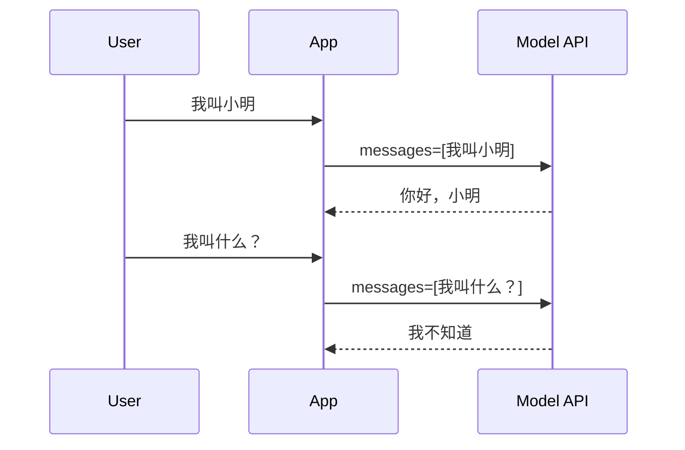
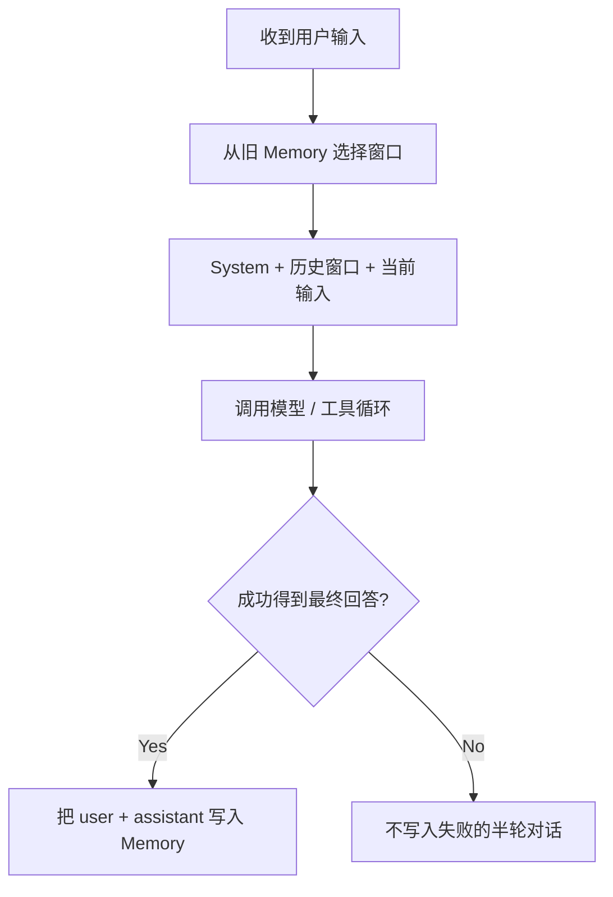

# 第 4 章：Memory、上下文窗口与 Workflow

[上一章：Skill 与 Tool Calling](03-skills-and-tool-calling.md) | [下一章：Agent Harness](05-harness-react-state.md)

## 本章起点与终点

| 项目 | 内容 |
|---|---|
| 起点 | 对话只保存在进程内，发送全部历史 |
| 终点 | JSON 持久化、最近消息窗口、可观察 Workflow |
| 自动化验收 | 24 tests |

## 4.1 Memory 的作用

模型 API 本身是无状态的。两次请求之间，服务端不会自动记得上一轮：



客户端必须在第二次请求中重新发送历史：

```json
[
  { "role": "user", "content": "我叫小明" },
  { "role": "assistant", "content": "你好，小明" },
  { "role": "user", "content": "我叫什么？" }
]
```

所以 Memory 的本质是：**保存可在以后重新送给模型的信息**。

它不是模型参数里的永久记忆，也不是 RAG 知识库。

## 4.2 三种数据不要混淆

| 类型 | 示例 | 生命周期 | 发送方式 |
|---|---|---|---|
| 对话 Memory | 用户与 Agent 的历史消息 | 跨轮次，可跨重启 | 选取窗口后放进 `messages` |
| Checkpoint | 等待审批的 Tool Call 与现场 | 一次未完成任务 | Resume 时恢复 |
| Knowledge | Agent 教程 Markdown 文档 | 长期文档 | RAG 检索后作为证据 |

## 4.3 ChatMemory 只负责顺序

```csharp
public sealed class ChatMemory
{
    private readonly List<ChatTurn> _turns = [];

    public IReadOnlyList<ChatTurn> Turns => _turns;

    public void AddUserMessage(string content)
    {
        _turns.Add(new ChatTurn(ChatRole.User, content));
    }

    public void AddAssistantMessage(string content)
    {
        _turns.Add(new ChatTurn(ChatRole.Assistant, content));
    }
}
```

`ChatMemory` 不读文件、不调用模型，也不判断内容是否值得长期保存。职责越单纯，测试越容易。

## 4.4 持久化 ChatMemoryStore

读取流程：

```csharp
public static async Task<ChatMemory> LoadAsync(
    string filePath,
    CancellationToken cancellationToken = default)
{
    if (!File.Exists(filePath))
    {
        return new ChatMemory();
    }

    await using FileStream stream = File.OpenRead(filePath);
    StoredMemory? storedMemory = await JsonSerializer.DeserializeAsync<StoredMemory>(
        stream,
        JsonOptions,
        cancellationToken);

    if (storedMemory is null)
    {
        throw new InvalidOperationException("Memory file is empty or invalid.");
    }

    ChatMemory memory = new();
    foreach (StoredTurn turn in storedMemory.Turns)
    {
        AddStoredTurn(memory, turn);
    }

    return memory;
}
```

文件不存在返回空 Memory；文件存在但损坏则明确报错。损坏数据不能悄悄被当作“没有记忆”。

保存流程：

```csharp
public static async Task SaveAsync(
    string filePath,
    ChatMemory memory,
    CancellationToken cancellationToken = default)
{
    string? directory = Path.GetDirectoryName(filePath);
    if (!string.IsNullOrWhiteSpace(directory))
    {
        Directory.CreateDirectory(directory);
    }

    StoredMemory storedMemory = new(
        memory.Turns
            .Select(turn => new StoredTurn(ToStoredRole(turn.Role), turn.Content))
            .ToArray());

    await using FileStream stream = File.Create(filePath);
    await JsonSerializer.SerializeAsync(
        stream,
        storedMemory,
        JsonOptions,
        cancellationToken);
}
```

运行后 `memory/chat-memory.json` 类似：

```json
{
  "turns": [
    { "role": "user", "content": "我正在学习 C# Agent" },
    { "role": "assistant", "content": "好的，我们一次学习一个概念。" }
  ]
}
```

## 4.5 完整历史不等于全部发送

假设已经保存 1000 条消息，每次全部发送会造成：

- Token 和费用持续增长。
- 请求越来越慢。
- 超过模型上下文上限。
- 旧内容干扰当前任务。

所以分成两个概念：

```text
ChatMemory       = 完整本地历史
ChatMemoryWindow = 本次发送给模型的最近历史
```

## 4.6 Context Window 筛选算法

```csharp
public static IReadOnlyList<ChatTurn> GetRecentTurns(
    ChatMemory memory,
    int maxTurns)
{
    if (maxTurns <= 0)
    {
        throw new ArgumentOutOfRangeException(nameof(maxTurns));
    }

    IReadOnlyList<ChatTurn> turns = memory.Turns;
    if (turns.Count <= maxTurns)
    {
        return turns;
    }

    ChatTurn[] window = turns
        .Skip(turns.Count - maxTurns)
        .ToArray();

    if (window.Length > 0 && window[0].Role == ChatRole.Assistant)
    {
        return window.Skip(1).ToArray();
    }

    return window;
}
```

为什么丢弃开头孤立的 Assistant：

```text
完整历史:
user Q1 -> assistant A1 -> user Q2 -> assistant A2

如果 maxTurns=3:
assistant A1 -> user Q2 -> assistant A2
```

`A1` 对应的 `Q1` 已经不在窗口中，模型看到半截上下文可能误解，所以删掉 `A1`。

## 4.7 当前消息何时加入

正确顺序：



这样当前输入不会在“历史窗口”和“当前消息”里重复出现。

## 4.8 Memory 写入时机

这一阶段在模型成功返回最终文本后：

```csharp
memory.AddUserMessage(input);
memory.AddAssistantMessage(assistantReply);
await ChatMemoryStore.SaveAsync(memoryPath, memory);
```

以后会增加 `AgentMemoryWritePolicy`，避免命令、超长内容或失败结果进入长期记忆。

## 4.9 Workflow 是可观察事件，不是隐藏思维

`AgentWorkflowTrace` 记录外部可观察步骤：

```csharp
public sealed class AgentWorkflowTrace
{
    private readonly List<AgentWorkflowStep> _steps = [];

    public IReadOnlyList<AgentWorkflowStep> Steps => _steps;

    public AgentWorkflowStep Add(
        AgentWorkflowStepKind kind,
        string title,
        string detail)
    {
        AgentWorkflowStep step = new(
            Number: _steps.Count + 1,
            Kind: kind,
            Title: title.Trim(),
            Detail: detail.Trim());

        _steps.Add(step);
        return step;
    }
}
```

步骤类型：

```csharp
public enum AgentWorkflowStepKind
{
    ReceiveInput,
    BuildContext,
    AskModel,
    ToolRequested,
    ToolExecuted,
    Finish
}
```

它记录“发了请求、请求了工具、执行了工具”，不记录模型私有 Chain of Thought。

## 4.10 为什么此时看起来只是日志

你的观察是对的：这一阶段 Workflow 主要是日志结构。它的价值是先把执行过程表示成稳定事件，下一章 AgentRunner 才能围绕这些事件统一编排；第 12 章再把它持久化到 Trace。

```text
第 4 章：Workflow = 可观察步骤数据
第 5 章：Harness  = 产生并控制这些步骤的执行器
第 12 章：Trace   = 把步骤、耗时、Token 持久化
```

## 4.11 运行与测试

```bash
dotnet test AgentLearning.sln
```


24 个测试包含：

- Memory JSON 不存在、保存、恢复、损坏文件。
- Window 数量限制与孤立 Assistant 处理。
- Workflow 编号、顺序、格式化。
- 前面章节的 Profile、Skill 和 Tool Calling 基础。

<!-- BEGIN SELF-CONTAINED CODE -->
## 本章完整文件代码

这一节是本章的**完整代码依据**。前面的代码用于解释概念；真正动手时，请从上一章完成后的目录继续，并按下表逐项操作。`新建` 表示创建此前不存在的文件，`完整覆盖` 表示把旧文件全部替换成这里的内容。不要只复制局部片段。

> 下面已经包含本章所需的全部新增和变更文件，不需要再查找其他代码文件。

先在项目根目录执行下面的命令，确保本章需要的目录存在：

```bash
mkdir -p src/AgentLearning.App src/AgentLearning.Core src/AgentLearning.Core/Workflow tests/AgentLearning.Core.Tests
```

### 文件操作清单

| 操作 | 文件 |
|---|---|
| 新建 | `src/AgentLearning.Core/AgentPathResolver.cs` |
| 新建 | `src/AgentLearning.Core/ChatMemoryStore.cs` |
| 新建 | `src/AgentLearning.Core/ChatMemoryWindow.cs` |
| 新建 | `src/AgentLearning.Core/Workflow/AgentWorkflowStep.cs` |
| 新建 | `src/AgentLearning.Core/Workflow/AgentWorkflowStepFormatter.cs` |
| 新建 | `src/AgentLearning.Core/Workflow/AgentWorkflowStepKind.cs` |
| 新建 | `src/AgentLearning.Core/Workflow/AgentWorkflowTrace.cs` |
| 新建 | `tests/AgentLearning.Core.Tests/AgentPathResolverTests.cs` |
| 新建 | `tests/AgentLearning.Core.Tests/AgentWorkflowTraceTests.cs` |
| 新建 | `tests/AgentLearning.Core.Tests/ChatMemoryStoreTests.cs` |
| 新建 | `tests/AgentLearning.Core.Tests/ChatMemoryWindowTests.cs` |
| 完整覆盖 | `src/AgentLearning.App/Program.cs` |
| 完整覆盖 | `src/AgentLearning.App/agent.json` |
| 完整覆盖 | `src/AgentLearning.Core/AgentProfile.cs` |
| 完整覆盖 | `src/AgentLearning.Core/AgentProfileLoader.cs` |
| 完整覆盖 | `src/AgentLearning.Core/ChatMemory.cs` |
| 完整覆盖 | `tests/AgentLearning.Core.Tests/AgentProfileLoaderTests.cs` |

<!-- FILE: ADD src/AgentLearning.Core/AgentPathResolver.cs -->
<details>
<summary><strong>新建</strong> <code>src/AgentLearning.Core/AgentPathResolver.cs</code></summary>

`````csharp
namespace AgentLearning.Core;

/// <summary>
/// 解析配置里的文件路径。
/// 相对路径基于程序运行目录，绝对路径保持原样。
/// </summary>
public static class AgentPathResolver
{
    public static string ResolveRuntimePath(string baseDirectory, string configuredPath)
    {
        if (string.IsNullOrWhiteSpace(baseDirectory))
        {
            throw new ArgumentException("Base directory cannot be empty.", nameof(baseDirectory));
        }

        if (string.IsNullOrWhiteSpace(configuredPath))
        {
            throw new ArgumentException("Configured path cannot be empty.", nameof(configuredPath));
        }

        return Path.IsPathFullyQualified(configuredPath)
            ? configuredPath
            : Path.Combine(baseDirectory, configuredPath);
    }
}
`````

</details>
<!-- END FILE -->

<!-- FILE: ADD src/AgentLearning.Core/ChatMemoryStore.cs -->
<details>
<summary><strong>新建</strong> <code>src/AgentLearning.Core/ChatMemoryStore.cs</code></summary>

`````csharp
using System.Text.Json;
using System.Text.Encodings.Web;
using System.Text.Json.Serialization;

namespace AgentLearning.Core;

/// <summary>
/// 把聊天记忆保存到本地 JSON 文件。
/// 这一层只负责读写文件，不负责决定什么内容值得记住。
/// </summary>
public static class ChatMemoryStore
{
    private static readonly JsonSerializerOptions JsonOptions = new()
    {
        WriteIndented = true,
        Encoder = JavaScriptEncoder.UnsafeRelaxedJsonEscaping,
        PropertyNameCaseInsensitive = true
    };

    /// <summary>
    /// 从 JSON 文件加载记忆；文件不存在时返回空记忆。
    /// </summary>
    public static async Task<ChatMemory> LoadAsync(
        string filePath,
        CancellationToken cancellationToken = default)
    {
        if (!File.Exists(filePath))
        {
            return new ChatMemory();
        }

        await using FileStream stream = File.OpenRead(filePath);
        StoredMemory? storedMemory = await JsonSerializer.DeserializeAsync<StoredMemory>(
            stream,
            JsonOptions,
            cancellationToken);

        if (storedMemory is null)
        {
            throw new InvalidOperationException("Memory file is empty or invalid.");
        }

        ChatMemory memory = new();
        foreach (StoredTurn turn in storedMemory.Turns)
        {
            AddStoredTurn(memory, turn);
        }

        return memory;
    }

    /// <summary>
    /// 把当前记忆保存到 JSON 文件。
    /// </summary>
    public static async Task SaveAsync(
        string filePath,
        ChatMemory memory,
        CancellationToken cancellationToken = default)
    {
        string? directory = Path.GetDirectoryName(filePath);
        if (!string.IsNullOrWhiteSpace(directory))
        {
            Directory.CreateDirectory(directory);
        }

        StoredMemory storedMemory = new(
            memory.Turns
                .Select(turn => new StoredTurn(ToStoredRole(turn.Role), turn.Content))
                .ToArray());

        await using FileStream stream = File.Create(filePath);
        await JsonSerializer.SerializeAsync(stream, storedMemory, JsonOptions, cancellationToken);
    }

    private static void AddStoredTurn(ChatMemory memory, StoredTurn turn)
    {
        if (turn.Role.Equals("user", StringComparison.OrdinalIgnoreCase))
        {
            memory.AddUserMessage(turn.Content);
            return;
        }

        if (turn.Role.Equals("assistant", StringComparison.OrdinalIgnoreCase))
        {
            memory.AddAssistantMessage(turn.Content);
            return;
        }

        throw new InvalidOperationException($"Unsupported memory role: {turn.Role}");
    }

    private static string ToStoredRole(ChatRole role)
    {
        return role switch
        {
            ChatRole.User => "user",
            ChatRole.Assistant => "assistant",
            _ => throw new InvalidOperationException($"Unsupported chat role: {role}")
        };
    }

    private sealed record StoredMemory(
        [property: JsonPropertyName("turns")]
        IReadOnlyList<StoredTurn> Turns);

    private sealed record StoredTurn(
        [property: JsonPropertyName("role")]
        string Role,

        [property: JsonPropertyName("content")]
        string Content);
}
`````

</details>
<!-- END FILE -->

<!-- FILE: ADD src/AgentLearning.Core/ChatMemoryWindow.cs -->
<details>
<summary><strong>新建</strong> <code>src/AgentLearning.Core/ChatMemoryWindow.cs</code></summary>

`````csharp
namespace AgentLearning.Core;

/// <summary>
/// 从完整聊天记忆里选择本次要发给模型的上下文窗口。
/// 完整历史仍然保存在 ChatMemory 里，这里只控制“发多少给模型”。
/// </summary>
public static class ChatMemoryWindow
{
    public static IReadOnlyList<ChatTurn> GetRecentTurns(ChatMemory memory, int maxTurns)
    {
        if (maxTurns <= 0)
        {
            throw new ArgumentOutOfRangeException(nameof(maxTurns), "Max turns must be greater than zero.");
        }

        IReadOnlyList<ChatTurn> turns = memory.Turns;
        if (turns.Count <= maxTurns)
        {
            return turns;
        }

        ChatTurn[] window = turns
            .Skip(turns.Count - maxTurns)
            .ToArray();

        // 如果窗口从旧的 assistant 回复开始，说明它前面的 user 问题已经被裁掉了。
        // 丢掉这条孤立回复，避免模型看到没有上下文的半截对话。
        if (window.Length > 0 && window[0].Role == ChatRole.Assistant)
        {
            return window.Skip(1).ToArray();
        }

        return window;
    }
}
`````

</details>
<!-- END FILE -->

<!-- FILE: ADD src/AgentLearning.Core/Workflow/AgentWorkflowStep.cs -->
<details>
<summary><strong>新建</strong> <code>src/AgentLearning.Core/Workflow/AgentWorkflowStep.cs</code></summary>

`````csharp
namespace AgentLearning.Core.Workflow;

/// <summary>
/// Agent 工作流中的一步。
/// Number 用来显示顺序，Kind 用来表达这一步属于哪类动作。
/// </summary>
public sealed record AgentWorkflowStep(
    int Number,
    AgentWorkflowStepKind Kind,
    string Title,
    string Detail);
`````

</details>
<!-- END FILE -->

<!-- FILE: ADD src/AgentLearning.Core/Workflow/AgentWorkflowStepFormatter.cs -->
<details>
<summary><strong>新建</strong> <code>src/AgentLearning.Core/Workflow/AgentWorkflowStepFormatter.cs</code></summary>

`````csharp
namespace AgentLearning.Core.Workflow;

/// <summary>
/// 把工作流步骤格式化成控制台里容易读的一行文字。
/// </summary>
public static class AgentWorkflowStepFormatter
{
    public static string Format(AgentWorkflowStep step)
    {
        return $"[Workflow {step.Number}] {step.Kind} - {step.Title}: {step.Detail}";
    }
}
`````

</details>
<!-- END FILE -->

<!-- FILE: ADD src/AgentLearning.Core/Workflow/AgentWorkflowStepKind.cs -->
<details>
<summary><strong>新建</strong> <code>src/AgentLearning.Core/Workflow/AgentWorkflowStepKind.cs</code></summary>

`````csharp
namespace AgentLearning.Core.Workflow;

/// <summary>
/// Agent 工作流里可以被观察到的步骤类型。
/// 这里记录的是外部行为，不记录模型隐藏思考。
/// </summary>
public enum AgentWorkflowStepKind
{
    ReceiveInput,
    BuildContext,
    AskModel,
    ToolRequested,
    ToolExecuted,
    Finish
}
`````

</details>
<!-- END FILE -->

<!-- FILE: ADD src/AgentLearning.Core/Workflow/AgentWorkflowTrace.cs -->
<details>
<summary><strong>新建</strong> <code>src/AgentLearning.Core/Workflow/AgentWorkflowTrace.cs</code></summary>

`````csharp
namespace AgentLearning.Core.Workflow;

/// <summary>
/// 一次用户请求对应的一条 Agent 工作流轨迹。
/// 它帮助我们学习 Agent 实际经历了哪些可观察步骤。
/// </summary>
public sealed class AgentWorkflowTrace
{
    private readonly List<AgentWorkflowStep> _steps = [];

    public IReadOnlyList<AgentWorkflowStep> Steps => _steps;

    public AgentWorkflowStep Add(AgentWorkflowStepKind kind, string title, string detail)
    {
        if (string.IsNullOrWhiteSpace(title))
        {
            throw new ArgumentException("Workflow step title cannot be empty.", nameof(title));
        }

        AgentWorkflowStep step = new(
            Number: _steps.Count + 1,
            Kind: kind,
            Title: title.Trim(),
            Detail: detail.Trim());

        _steps.Add(step);
        return step;
    }
}
`````

</details>
<!-- END FILE -->

<!-- FILE: ADD tests/AgentLearning.Core.Tests/AgentPathResolverTests.cs -->
<details>
<summary><strong>新建</strong> <code>tests/AgentLearning.Core.Tests/AgentPathResolverTests.cs</code></summary>

`````csharp
using AgentLearning.Core;

namespace AgentLearning.Core.Tests;

public sealed class AgentPathResolverTests
{
    [Fact]
    public void ResolveRuntimePath_combines_relative_path_with_base_directory()
    {
        string result = AgentPathResolver.ResolveRuntimePath(
            baseDirectory: "/app/bin",
            configuredPath: "memory/chat-memory.json");

        Assert.Equal(Path.Combine("/app/bin", "memory/chat-memory.json"), result);
    }

    [Fact]
    public void ResolveRuntimePath_keeps_absolute_path()
    {
        string absolutePath = Path.Combine(Path.GetTempPath(), "chat-memory.json");

        string result = AgentPathResolver.ResolveRuntimePath(
            baseDirectory: "/app/bin",
            configuredPath: absolutePath);

        Assert.Equal(absolutePath, result);
    }
}
`````

</details>
<!-- END FILE -->

<!-- FILE: ADD tests/AgentLearning.Core.Tests/AgentWorkflowTraceTests.cs -->
<details>
<summary><strong>新建</strong> <code>tests/AgentLearning.Core.Tests/AgentWorkflowTraceTests.cs</code></summary>

`````csharp
using AgentLearning.Core.Workflow;

namespace AgentLearning.Core.Tests;

public sealed class AgentWorkflowTraceTests
{
    [Fact]
    public void Add_records_steps_with_incrementing_numbers()
    {
        AgentWorkflowTrace trace = new();

        AgentWorkflowStep first = trace.Add(
            AgentWorkflowStepKind.ReceiveInput,
            "Receive user input",
            "User asked a question.");

        AgentWorkflowStep second = trace.Add(
            AgentWorkflowStepKind.AskModel,
            "Ask model",
            "Send messages and tools to the model.");

        Assert.Equal(1, first.Number);
        Assert.Equal(2, second.Number);
        Assert.Collection(
            trace.Steps,
            step =>
            {
                Assert.Equal(AgentWorkflowStepKind.ReceiveInput, step.Kind);
                Assert.Equal("Receive user input", step.Title);
                Assert.Equal("User asked a question.", step.Detail);
            },
            step =>
            {
                Assert.Equal(AgentWorkflowStepKind.AskModel, step.Kind);
                Assert.Equal("Ask model", step.Title);
                Assert.Equal("Send messages and tools to the model.", step.Detail);
            });
    }

    [Fact]
    public void Add_rejects_empty_title()
    {
        AgentWorkflowTrace trace = new();

        ArgumentException exception = Assert.Throws<ArgumentException>(
            () => trace.Add(AgentWorkflowStepKind.BuildContext, " ", "detail"));

        Assert.Equal("title", exception.ParamName);
    }

    [Fact]
    public void Format_returns_human_readable_step_line()
    {
        AgentWorkflowStep step = new(
            Number: 3,
            Kind: AgentWorkflowStepKind.ToolExecuted,
            Title: "Observe tool result",
            Detail: "calculate returned 20.");

        string line = AgentWorkflowStepFormatter.Format(step);

        Assert.Equal("[Workflow 3] ToolExecuted - Observe tool result: calculate returned 20.", line);
    }
}
`````

</details>
<!-- END FILE -->

<!-- FILE: ADD tests/AgentLearning.Core.Tests/ChatMemoryStoreTests.cs -->
<details>
<summary><strong>新建</strong> <code>tests/AgentLearning.Core.Tests/ChatMemoryStoreTests.cs</code></summary>

`````csharp
using AgentLearning.Core;

namespace AgentLearning.Core.Tests;

public sealed class ChatMemoryStoreTests
{
    [Fact]
    public async Task LoadAsync_returns_empty_memory_when_file_does_not_exist()
    {
        string tempDirectory = CreateTempDirectory();
        string memoryFile = Path.Combine(tempDirectory, "memory", "chat-memory.json");

        try
        {
            ChatMemory memory = await ChatMemoryStore.LoadAsync(memoryFile);

            Assert.Empty(memory.Turns);
        }
        finally
        {
            Directory.Delete(tempDirectory, recursive: true);
        }
    }

    [Fact]
    public async Task SaveAsync_and_LoadAsync_round_trip_chat_turns()
    {
        string tempDirectory = CreateTempDirectory();
        string memoryFile = Path.Combine(tempDirectory, "memory", "chat-memory.json");
        ChatMemory memory = new();
        memory.AddUserMessage("  What is memory + persistence?  ");
        memory.AddAssistantMessage("Memory lets the agent keep useful context.");

        try
        {
            await ChatMemoryStore.SaveAsync(memoryFile, memory);

            Assert.True(File.Exists(memoryFile));
            string savedJson = await File.ReadAllTextAsync(memoryFile);
            Assert.Contains("What is memory + persistence?", savedJson);

            ChatMemory loaded = await ChatMemoryStore.LoadAsync(memoryFile);

            Assert.Collection(
                loaded.Turns,
                first =>
                {
                    Assert.Equal(ChatRole.User, first.Role);
                    Assert.Equal("What is memory + persistence?", first.Content);
                },
                second =>
                {
                    Assert.Equal(ChatRole.Assistant, second.Role);
                    Assert.Equal("Memory lets the agent keep useful context.", second.Content);
                });
        }
        finally
        {
            Directory.Delete(tempDirectory, recursive: true);
        }
    }

    private static string CreateTempDirectory()
    {
        string tempDirectory = Path.Combine(Path.GetTempPath(), $"agent-memory-{Guid.NewGuid():N}");
        Directory.CreateDirectory(tempDirectory);
        return tempDirectory;
    }
}
`````

</details>
<!-- END FILE -->

<!-- FILE: ADD tests/AgentLearning.Core.Tests/ChatMemoryWindowTests.cs -->
<details>
<summary><strong>新建</strong> <code>tests/AgentLearning.Core.Tests/ChatMemoryWindowTests.cs</code></summary>

`````csharp
using AgentLearning.Core;

namespace AgentLearning.Core.Tests;

public sealed class ChatMemoryWindowTests
{
    [Fact]
    public void GetRecentTurns_returns_all_turns_when_memory_is_within_limit()
    {
        ChatMemory memory = new();
        memory.AddUserMessage("u1");
        memory.AddAssistantMessage("a1");

        IReadOnlyList<ChatTurn> turns = ChatMemoryWindow.GetRecentTurns(memory, maxTurns: 4);

        Assert.Collection(
            turns,
            first => Assert.Equal("u1", first.Content),
            second => Assert.Equal("a1", second.Content));
    }

    [Fact]
    public void GetRecentTurns_returns_recent_turns_and_preserves_order()
    {
        ChatMemory memory = new();
        memory.AddUserMessage("u1");
        memory.AddAssistantMessage("a1");
        memory.AddUserMessage("u2");
        memory.AddAssistantMessage("a2");
        memory.AddUserMessage("u3");
        memory.AddAssistantMessage("a3");

        IReadOnlyList<ChatTurn> turns = ChatMemoryWindow.GetRecentTurns(memory, maxTurns: 4);

        Assert.Collection(
            turns,
            first => Assert.Equal("u2", first.Content),
            second => Assert.Equal("a2", second.Content),
            third => Assert.Equal("u3", third.Content),
            fourth => Assert.Equal("a3", fourth.Content));
    }

    [Fact]
    public void GetRecentTurns_drops_orphaned_assistant_at_start()
    {
        ChatMemory memory = new();
        memory.AddUserMessage("u1");
        memory.AddAssistantMessage("a1");
        memory.AddUserMessage("u2");
        memory.AddAssistantMessage("a2");
        memory.AddUserMessage("u3");
        memory.AddAssistantMessage("a3");
        memory.AddUserMessage("u4");

        IReadOnlyList<ChatTurn> turns = ChatMemoryWindow.GetRecentTurns(memory, maxTurns: 6);

        Assert.Collection(
            turns,
            first =>
            {
                Assert.Equal(ChatRole.User, first.Role);
                Assert.Equal("u2", first.Content);
            },
            second => Assert.Equal("a2", second.Content),
            third => Assert.Equal("u3", third.Content),
            fourth => Assert.Equal("a3", fourth.Content),
            fifth => Assert.Equal("u4", fifth.Content));
    }

    [Fact]
    public void GetRecentTurns_rejects_non_positive_limit()
    {
        ChatMemory memory = new();

        ArgumentOutOfRangeException exception = Assert.Throws<ArgumentOutOfRangeException>(
            () => ChatMemoryWindow.GetRecentTurns(memory, maxTurns: 0));

        Assert.Equal("maxTurns", exception.ParamName);
    }
}
`````

</details>
<!-- END FILE -->

<!-- FILE: REPLACE src/AgentLearning.App/Program.cs -->
<details>
<summary><strong>完整覆盖</strong> <code>src/AgentLearning.App/Program.cs</code></summary>

`````csharp
using AgentLearning.Core;
using AgentLearning.Core.Diagnostics;
using AgentLearning.Core.Skills;
using AgentLearning.Core.Workflow;
using OpenAI;
using OpenAI.Chat;
using System.ClientModel;
using System.Text;
using System.Text.Json;

// AppContext.BaseDirectory 指向编译后的运行目录。
// csproj 已经配置了复制 agent.json 和 agent.local.json，所以运行时能在这里找到配置文件。
string profilePath = Path.Combine(AppContext.BaseDirectory, "agent.json");
string localProfilePath = Path.Combine(AppContext.BaseDirectory, "agent.local.json");

// 读取 Agent 的角色设定、API 接线配置，以及本地私有密钥配置。
AgentProfile profile = await AgentProfileLoader.LoadFromFileAsync(profilePath, localProfilePath);

// 优先使用 agent.local.json 里的 api_key。
// 如果你临时不想写本地文件，也仍然可以用环境变量兜底。
string? apiKey = profile.ApiKey ?? Environment.GetEnvironmentVariable(profile.EnvKey);
if (string.IsNullOrWhiteSpace(apiKey))
{
    Console.WriteLine($"No API key was found in agent.local.json or {profile.EnvKey}.");
    Console.WriteLine("Set one of them, then run this app again:");
    Console.WriteLine("  agent.local.json: { \"api_key\": \"sk-...\" }");
    Console.WriteLine($"  export {profile.EnvKey}=\"sk-...\"");
    return 1;
}

// ChatClient 对应你给的 curl 路径：POST /v1/chat/completions。
// Endpoint 使用 https://router.hddev.top/v1，SDK 会在它后面拼接 /chat/completions。
ChatClient client = new(
    model: profile.Model,
    credential: new ApiKeyCredential(apiKey),
    options: new OpenAIClientOptions
    {
        Endpoint = new Uri(profile.BaseUrl)
    });

// memory_file 可以写相对路径；这里把它解析成真正使用的文件路径。
string memoryPath = AgentPathResolver.ResolveRuntimePath(AppContext.BaseDirectory, profile.MemoryFile);

// 现在记忆会从本地 JSON 文件恢复；文件不存在时得到一个空记忆。
ChatMemory memory = await ChatMemoryStore.LoadAsync(memoryPath);

// 注册当前 Agent 可以使用的技能。
// 这一步只是把 C# 函数准备好，真正什么时候调用由模型决定。
AgentSkillRegistry skillRegistry = new([
    new TimeSkill(),
    new CalculatorSkill()
]);

Console.WriteLine($"Loaded agent: {profile.Name}");
Console.WriteLine($"Wire API: {profile.WireApi}");
Console.WriteLine($"Base URL: {profile.BaseUrl}");
Console.WriteLine($"Stream: {profile.Stream}");
Console.WriteLine($"Native tool calling: {profile.NativeToolCalling}");
Console.WriteLine($"Show debug requests: {profile.ShowDebugRequests}");
Console.WriteLine($"Show workflow trace: {profile.ShowWorkflowTrace}");
Console.WriteLine($"Memory file: {memoryPath}");
Console.WriteLine($"Loaded memory turns: {memory.Turns.Count}");
Console.WriteLine($"Max memory turns sent: {profile.MaxMemoryTurns}");
Console.WriteLine($"Skills: {string.Join(", ", skillRegistry.Skills.Select(skill => skill.Name))}");
Console.WriteLine("Type a message and press Enter. Type 'exit' to quit.");
Console.WriteLine("Local skill commands: /time, /calc <expression>");
Console.WriteLine();

if (profile.Stream && profile.NativeToolCalling)
{
    Console.WriteLine("Native tool calling is only implemented for non-streaming mode in this lesson.");
    return 1;
}

while (true)
{
    Console.Write("You> ");
    string? input = Console.ReadLine();

    // 输入 exit 就退出；这就是当前最简单的交互方式。
    if (input is null || input.Equals("exit", StringComparison.OrdinalIgnoreCase))
    {
        break;
    }

    // 空输入不调用模型，避免浪费一次请求。
    if (string.IsNullOrWhiteSpace(input))
    {
        continue;
    }

    if (await TryRunLocalSkillCommandAsync(input, profile, memory, skillRegistry))
    {
        await ChatMemoryStore.SaveAsync(memoryPath, memory);
        Console.WriteLine();
        continue;
    }

    // 先把用户消息写进记忆，再把完整记忆发给模型。
    memory.AddUserMessage(input);
    AgentWorkflowTrace workflowTrace = new();
    PrintWorkflowStep(profile, workflowTrace.Add(
        AgentWorkflowStepKind.ReceiveInput,
        "Receive user input",
        "User message was saved to memory."));

    try
    {
        // 完整记忆仍然保存在 memory 里；这里取最近 N 条作为本次请求上下文。
        IReadOnlyList<ChatTurn> contextTurns = ChatMemoryWindow.GetRecentTurns(memory, profile.MaxMemoryTurns);
        PrintWorkflowStep(profile, workflowTrace.Add(
            AgentWorkflowStepKind.BuildContext,
            "Build context window",
            $"Sending {contextTurns.Count} of {memory.Turns.Count} memory turns."));

        List<ChatMessage> messages = BuildMessages(profile, contextTurns);
        List<AgentDebugMessage> debugMessages = BuildDebugMessages(profile, contextTurns);
        string assistantReply = profile.Stream
            ? await CompleteStreamingAsync(client, profile, messages)
            : await CompleteOnceAsync(client, profile, messages, debugMessages, skillRegistry, workflowTrace);

        if (string.IsNullOrWhiteSpace(assistantReply))
        {
            throw new InvalidOperationException("The model returned no text content.");
        }

        PrintWorkflowStep(profile, workflowTrace.Add(
            AgentWorkflowStepKind.Finish,
            "Finish",
            "Final answer was produced."));

        // 把 Agent 的回复也写进记忆，这样下一轮提问时模型能看到上下文。
        memory.AddAssistantMessage(assistantReply);
        await ChatMemoryStore.SaveAsync(memoryPath, memory);

        if (!profile.Stream)
        {
            Console.WriteLine($"{profile.Name}> {assistantReply}");
        }

        Console.WriteLine();
    }
    catch (Exception exception)
    {
        Console.WriteLine($"Agent call failed: {exception.Message}");
        return 1;
    }
}

return 0;

static async Task<string> CompleteOnceAsync(
    ChatClient client,
    AgentProfile profile,
    List<ChatMessage> messages,
    List<AgentDebugMessage> debugMessages,
    AgentSkillRegistry skillRegistry,
    AgentWorkflowTrace workflowTrace)
{
    // 这对应 curl 里的 "stream": false。
    // native_tool_calling 打开时，会把本地技能声明成 tools 发给模型。
    ChatCompletionOptions? options = profile.NativeToolCalling
        ? BuildChatOptions(skillRegistry)
        : null;

    int requestNumber = 1;
    while (true)
    {
        PrintWorkflowStep(profile, workflowTrace.Add(
            AgentWorkflowStepKind.AskModel,
            "Ask model",
            $"Request #{requestNumber} sent to the model."));

        PrintChatRequestPreview(profile, debugMessages, skillRegistry, requestNumber);
        ChatCompletion completion = await client.CompleteChatAsync(messages, options);
        PrintChatResponsePreview(profile, completion);

        // 有些 OpenAI-compatible Router 会返回 tool_calls，但 finish_reason 仍然是 stop。
        // 所以这里优先看 ToolCalls 本身，避免漏掉真正的工具调用请求。
        if (completion.ToolCalls.Count > 0)
        {
            if (!profile.NativeToolCalling)
            {
                throw new InvalidOperationException("The model returned tool calls, but native tool calling is disabled.");
            }

            await ResolveToolCallsAsync(messages, debugMessages, completion, skillRegistry, profile, workflowTrace);
            requestNumber++;
            continue;
        }

        switch (completion.FinishReason)
        {
            case ChatFinishReason.Stop:
                return completion.Content.Count > 0
                    ? completion.Content[0].Text
                    : string.Empty;

            case ChatFinishReason.ToolCalls:
                await ResolveToolCallsAsync(messages, debugMessages, completion, skillRegistry, profile, workflowTrace);
                requestNumber++;
                break;

            case ChatFinishReason.Length:
                throw new InvalidOperationException("Model output was cut off because it reached the token limit.");

            case ChatFinishReason.ContentFilter:
                throw new InvalidOperationException("Model output was blocked by the content filter.");

            case ChatFinishReason.FunctionCall:
                throw new InvalidOperationException("Deprecated function_call was returned. Use tool_calls instead.");

            default:
                throw new InvalidOperationException($"Unsupported finish reason: {completion.FinishReason}");
        }
    }
}

static async Task<bool> TryRunLocalSkillCommandAsync(
    string input,
    AgentProfile profile,
    ChatMemory memory,
    AgentSkillRegistry skillRegistry)
{
    if (input.Equals("/time", StringComparison.OrdinalIgnoreCase))
    {
        string result = await skillRegistry.ExecuteAsync("get_current_time", "{}");
        memory.AddUserMessage(input);
        memory.AddAssistantMessage(result);
        Console.WriteLine($"{profile.Name}> {result}");
        return true;
    }

    const string calculatorPrefix = "/calc ";
    if (input.StartsWith(calculatorPrefix, StringComparison.OrdinalIgnoreCase))
    {
        string expression = input[calculatorPrefix.Length..].Trim();
        string argumentsJson = JsonSerializer.Serialize(new { expression });
        string result = await skillRegistry.ExecuteAsync("calculate", argumentsJson);

        memory.AddUserMessage(input);
        memory.AddAssistantMessage(result);
        Console.WriteLine($"{profile.Name}> {result}");
        return true;
    }

    return false;
}

static async Task<string> CompleteStreamingAsync(
    ChatClient client,
    AgentProfile profile,
    List<ChatMessage> messages)
{
    // 这对应 curl 里的 "stream": true。
    // 模型会一小段一小段返回文本，所以我们边收到边打印。
    StringBuilder fullReply = new();
    Console.Write($"{profile.Name}> ");

    await foreach (StreamingChatCompletionUpdate update in client.CompleteChatStreamingAsync(messages))
    {
        if (update.ContentUpdate.Count == 0)
        {
            continue;
        }

        string text = update.ContentUpdate[0].Text;
        fullReply.Append(text);
        Console.Write(text);
    }

    Console.WriteLine();
    return fullReply.ToString();
}

static List<ChatMessage> BuildMessages(AgentProfile profile, IReadOnlyList<ChatTurn> contextTurns)
{
    List<ChatMessage> messages =
    [
        // system message 是角色设定：它告诉模型“你是谁、该怎么回答”。
        new SystemChatMessage(BuildSystemInstructions(profile))
    ];

    // 把当前会话的短期记忆按顺序交给模型。
    // 顺序非常重要：模型是按上下文从前往后理解对话的。
    foreach (ChatTurn turn in contextTurns)
    {
        messages.Add(turn.Role switch
        {
            ChatRole.User => new UserChatMessage(turn.Content),
            ChatRole.Assistant => new AssistantChatMessage(turn.Content),
            _ => throw new InvalidOperationException($"Unsupported chat role: {turn.Role}")
        });
    }

    return messages;
}

static List<AgentDebugMessage> BuildDebugMessages(AgentProfile profile, IReadOnlyList<ChatTurn> contextTurns)
{
    List<AgentDebugMessage> messages =
    [
        // 这是调试视图里的 system message，内容和真正发给模型的系统指令保持一致。
        new()
        {
            Role = "system",
            Content = BuildSystemInstructions(profile)
        }
    ];

    foreach (ChatTurn turn in contextTurns)
    {
        messages.Add(turn.Role switch
        {
            ChatRole.User => new AgentDebugMessage
            {
                Role = "user",
                Content = turn.Content
            },
            ChatRole.Assistant => new AgentDebugMessage
            {
                Role = "assistant",
                Content = turn.Content
            },
            _ => throw new InvalidOperationException($"Unsupported chat role: {turn.Role}")
        });
    }

    return messages;
}

static ChatCompletionOptions BuildChatOptions(AgentSkillRegistry skillRegistry)
{
    ChatCompletionOptions options = new();

    foreach (IAgentSkill skill in skillRegistry.Skills)
    {
        options.Tools.Add(ChatTool.CreateFunctionTool(
            functionName: skill.Name,
            functionDescription: skill.Description,
            functionParameters: BinaryData.FromString(skill.ParametersJson)));
    }

    return options;
}

static async Task ResolveToolCallsAsync(
    List<ChatMessage> messages,
    List<AgentDebugMessage> debugMessages,
    ChatCompletion completion,
    AgentSkillRegistry skillRegistry,
    AgentProfile profile,
    AgentWorkflowTrace workflowTrace)
{
    // 先把“模型要求调用工具”这条 assistant 消息加入上下文。
    // SDK 会保留 tool_call_id，下一条 ToolChatMessage 才能和它对上。
    messages.Add(new AssistantChatMessage(completion));
    debugMessages.Add(new AgentDebugMessage
    {
        Role = "assistant",
        ToolCalls = completion.ToolCalls
            .Select(toolCall => new AgentDebugToolCall(
                toolCall.Id,
                toolCall.FunctionName,
                toolCall.FunctionArguments.ToString()))
            .ToArray()
    });

    foreach (ChatToolCall toolCall in completion.ToolCalls)
    {
        PrintWorkflowStep(profile, workflowTrace.Add(
            AgentWorkflowStepKind.ToolRequested,
            "Act",
            $"Model requested tool '{toolCall.FunctionName}'."));

        string result = await skillRegistry.ExecuteAsync(
            toolCall.FunctionName,
            toolCall.FunctionArguments.ToString());

        PrintWorkflowStep(profile, workflowTrace.Add(
            AgentWorkflowStepKind.ToolExecuted,
            "Observe",
            $"Tool '{toolCall.FunctionName}' returned: {result}"));

        PrintToolResultPreview(profile, toolCall, result);

        // 这条消息相当于告诉模型：你刚才要的工具结果在这里。
        messages.Add(new ToolChatMessage(toolCall.Id, result));
        debugMessages.Add(new AgentDebugMessage
        {
            Role = "tool",
            ToolCallId = toolCall.Id,
            Content = result
        });
    }
}

static void PrintWorkflowStep(AgentProfile profile, AgentWorkflowStep step)
{
    if (!profile.ShowWorkflowTrace)
    {
        return;
    }

    Console.WriteLine(AgentWorkflowStepFormatter.Format(step));
}

static void PrintChatRequestPreview(
    AgentProfile profile,
    List<AgentDebugMessage> debugMessages,
    AgentSkillRegistry skillRegistry,
    int requestNumber)
{
    if (!profile.ShowDebugRequests)
    {
        return;
    }

    Console.WriteLine();
    Console.WriteLine($"--- Debug request body preview #{requestNumber} ---");
    Console.WriteLine(AgentDebugPreviewBuilder.BuildChatCompletionsRequestPreview(
        model: profile.Model,
        stream: profile.Stream,
        messages: debugMessages,
        skills: skillRegistry.Skills,
        includeTools: profile.NativeToolCalling));
    Console.WriteLine("--- End debug request body preview ---");
    Console.WriteLine();
}

static void PrintChatResponsePreview(AgentProfile profile, ChatCompletion completion)
{
    if (!profile.ShowDebugRequests)
    {
        return;
    }

    Console.WriteLine("--- Debug model response preview ---");
    Console.WriteLine($"finish_reason: {completion.FinishReason}");

    if (completion.ToolCalls.Count > 0)
    {
        foreach (ChatToolCall toolCall in completion.ToolCalls)
        {
            Console.WriteLine($"tool_call_id: {toolCall.Id}");
            Console.WriteLine($"tool_name: {toolCall.FunctionName}");
            Console.WriteLine($"tool_arguments: {AgentDebugPreviewBuilder.RedactSensitiveValues(toolCall.FunctionArguments.ToString())}");
        }
    }
    else if (completion.Content.Count > 0)
    {
        Console.WriteLine($"content: {AgentDebugPreviewBuilder.RedactSensitiveValues(string.Concat(completion.Content.Select(part => part.Text)))}");
    }
    else
    {
        Console.WriteLine("content: <empty>");
    }

    Console.WriteLine("--- End debug model response preview ---");
    Console.WriteLine();
}

static void PrintToolResultPreview(AgentProfile profile, ChatToolCall toolCall, string result)
{
    if (!profile.ShowDebugRequests)
    {
        return;
    }

    Console.WriteLine("--- Debug local tool result ---");
    Console.WriteLine($"tool_call_id: {toolCall.Id}");
    Console.WriteLine($"tool_name: {toolCall.FunctionName}");
    Console.WriteLine($"result: {AgentDebugPreviewBuilder.RedactSensitiveValues(result)}");
    Console.WriteLine("--- End debug local tool result ---");
    Console.WriteLine();
}

static string BuildSystemInstructions(AgentProfile profile)
{
    // 这里把 agent.json 里的 description 和 instructions 组合成真正发给模型的系统指令。
    return $"""
    You are {profile.Name}.

    Description:
    {profile.Description}

    Instructions:
    {profile.Instructions}
    """;
}
`````

</details>
<!-- END FILE -->

<!-- FILE: REPLACE src/AgentLearning.App/agent.json -->
<details>
<summary><strong>完整覆盖</strong> <code>src/AgentLearning.App/agent.json</code></summary>

`````json
{
  "name": "Grimoire Router",
  "model": "gpt-5.4",
  "base_url": "https://router.hddev.top/v1",
  "env_key": "GRIMOIRE_API_KEY",
  "wire_api": "chat_completions",
  "stream": false,
  "native_tool_calling": true,
  "show_debug_requests": true,
  "show_workflow_trace": true,
  "memory_file": "memory/chat-memory.json",
  "max_memory_turns": 6,
  "description": "A patient C# agent teacher for a beginner learning how agents work.",
  "instructions": "Teach one concept at a time. Prefer small examples. Explain why each piece exists before adding the next piece."
}
`````

</details>
<!-- END FILE -->

<!-- FILE: REPLACE src/AgentLearning.Core/AgentProfile.cs -->
<details>
<summary><strong>完整覆盖</strong> <code>src/AgentLearning.Core/AgentProfile.cs</code></summary>

`````csharp
using System.Text.Json.Serialization;

namespace AgentLearning.Core;

/// <summary>
/// Agent 的角色与调用配置。
/// 你可以把它理解成这个 Agent 的“身份证 + 接线方式”。
/// </summary>
public sealed record AgentProfile(
    /// <summary>Agent 的显示名称。</summary>
    string Name,

    /// <summary>要调用的模型名称，由当前 Router/服务端决定可用值。</summary>
    string Model,

    /// <summary>OpenAI 兼容服务的基础地址，例如 https://router.hddev.top/v1。</summary>
    [property: JsonPropertyName("base_url")]
    string BaseUrl,

    /// <summary>保存 API Key 的环境变量名，代码不会把密钥写死在文件里。</summary>
    [property: JsonPropertyName("env_key")]
    string EnvKey,

    /// <summary>底层调用协议。你的 curl 示例使用 chat_completions。</summary>
    [property: JsonPropertyName("wire_api")]
    string WireApi,

    /// <summary>是否使用流式返回。false 对应 curl 里的 "stream": false。</summary>
    [property: JsonPropertyName("stream")]
    bool Stream,

    /// <summary>是否把技能声明为 Chat Completions 原生 tools，让模型自动选择要不要调用技能。</summary>
    [property: JsonPropertyName("native_tool_calling")]
    bool NativeToolCalling,

    /// <summary>是否在控制台打印请求体预览，方便学习和排查 Tool Calling。</summary>
    [property: JsonPropertyName("show_debug_requests")]
    bool ShowDebugRequests,

    /// <summary>是否打印 Agent 工作流步骤，方便观察 ReAct 循环。</summary>
    [property: JsonPropertyName("show_workflow_trace")]
    bool ShowWorkflowTrace,

    /// <summary>聊天记忆保存到哪里。相对路径会基于程序运行目录计算。</summary>
    [property: JsonPropertyName("memory_file")]
    string MemoryFile,

    /// <summary>每次请求最多发送多少条历史消息给模型，用来控制上下文大小。</summary>
    [property: JsonPropertyName("max_memory_turns")]
    int MaxMemoryTurns,

    /// <summary>本地 API Key。建议只放在 agent.local.json，不要放在主配置里。</summary>
    [property: JsonPropertyName("api_key")]
    string? ApiKey,

    /// <summary>Agent 的一句话说明，方便人理解它的用途。</summary>
    string Description,

    /// <summary>Agent 的系统指令，决定它回答问题时的角色、语气和边界。</summary>
    string Instructions);
`````

</details>
<!-- END FILE -->

<!-- FILE: REPLACE src/AgentLearning.Core/AgentProfileLoader.cs -->
<details>
<summary><strong>完整覆盖</strong> <code>src/AgentLearning.Core/AgentProfileLoader.cs</code></summary>

`````csharp
using System.Text.Json;

namespace AgentLearning.Core;

/// <summary>
/// 负责从 JSON 文件读取 Agent 配置，并做最基本的校验。
/// 单独拆出来是为了让“配置读取”可以被测试，而不是藏在 Program.cs 里。
/// </summary>
public static class AgentProfileLoader
{
    // 允许 JSON 里的 name/model 等字段大小写不敏感。
    // base_url/env_key/wire_api 这种下划线字段通过 AgentProfile 上的 JsonPropertyName 映射。
    private static readonly JsonSerializerOptions JsonOptions = new()
    {
        PropertyNameCaseInsensitive = true
    };

    /// <summary>
    /// 从指定路径读取 Agent 配置。
    /// </summary>
    public static async Task<AgentProfile> LoadFromFileAsync(
        string filePath,
        CancellationToken cancellationToken = default)
    {
        return await LoadFromFileAsync(filePath, localFilePath: null, cancellationToken);
    }

    /// <summary>
    /// 从主配置和本地私有配置读取 Agent 配置。
    /// 主配置放公开信息，本地配置只放 api_key。
    /// </summary>
    public static async Task<AgentProfile> LoadFromFileAsync(
        string filePath,
        string? localFilePath,
        CancellationToken cancellationToken = default)
    {
        if (!File.Exists(filePath))
        {
            throw new FileNotFoundException("Agent profile file was not found.", filePath);
        }

        await using FileStream stream = File.OpenRead(filePath);
        AgentProfile? profile = await JsonSerializer.DeserializeAsync<AgentProfile>(
            stream,
            JsonOptions,
            cancellationToken);

        if (profile is null)
        {
            throw new InvalidOperationException("Agent profile file is empty or invalid.");
        }

        AgentProfile mergedProfile = await MergeLocalProfileAsync(profile, localFilePath, cancellationToken);

        Validate(mergedProfile);
        return mergedProfile;
    }

    private static async Task<AgentProfile> MergeLocalProfileAsync(
        AgentProfile profile,
        string? localFilePath,
        CancellationToken cancellationToken)
    {
        if (string.IsNullOrWhiteSpace(localFilePath) || !File.Exists(localFilePath))
        {
            return NormalizeApiKey(profile);
        }

        await using FileStream stream = File.OpenRead(localFilePath);
        AgentLocalProfile? localProfile = await JsonSerializer.DeserializeAsync<AgentLocalProfile>(
            stream,
            JsonOptions,
            cancellationToken);

        if (localProfile is null || string.IsNullOrWhiteSpace(localProfile.ApiKey))
        {
            return NormalizeApiKey(profile);
        }

        return profile with { ApiKey = localProfile.ApiKey.Trim() };
    }

    private static AgentProfile NormalizeApiKey(AgentProfile profile)
    {
        return string.IsNullOrWhiteSpace(profile.ApiKey)
            ? profile with { ApiKey = null }
            : profile with { ApiKey = profile.ApiKey.Trim() };
    }

    // 配置缺失时直接抛出清晰错误，不用默认值偷偷掩盖问题。
    private static void Validate(AgentProfile profile)
    {
        RequireValue(profile.Name, "name");
        RequireValue(profile.Model, "model");
        RequireValue(profile.BaseUrl, "base_url");
        RequireValue(profile.EnvKey, "env_key");
        RequireValue(profile.WireApi, "wire_api");
        RequireValue(profile.MemoryFile, "memory_file");
        RequireValue(profile.Description, "description");
        RequireValue(profile.Instructions, "instructions");

        if (!Uri.TryCreate(profile.BaseUrl, UriKind.Absolute, out _))
        {
            throw new InvalidOperationException("Agent profile field 'base_url' must be an absolute URL.");
        }

        if (profile.MaxMemoryTurns <= 0)
        {
            throw new InvalidOperationException("Agent profile field 'max_memory_turns' must be greater than zero.");
        }

        if (!profile.WireApi.Equals("chat_completions", StringComparison.OrdinalIgnoreCase))
        {
            throw new InvalidOperationException("Only wire_api = 'chat_completions' is supported in this lesson.");
        }
    }

    private static void RequireValue(string? value, string fieldName)
    {
        if (string.IsNullOrWhiteSpace(value))
        {
            throw new InvalidOperationException($"Agent profile field '{fieldName}' is required.");
        }
    }

    private sealed record AgentLocalProfile(
        [property: System.Text.Json.Serialization.JsonPropertyName("api_key")]
        string? ApiKey);
}
`````

</details>
<!-- END FILE -->

<!-- FILE: REPLACE src/AgentLearning.Core/ChatMemory.cs -->
<details>
<summary><strong>完整覆盖</strong> <code>src/AgentLearning.Core/ChatMemory.cs</code></summary>

`````csharp
namespace AgentLearning.Core;

/// <summary>
/// 当前会话里的对话记忆。
/// 它只负责在内存中维护顺序；是否保存到文件由 ChatMemoryStore 负责。
/// </summary>
public sealed class ChatMemory
{
    // 内部用 List 保存，因为对话会一轮一轮追加。
    private readonly List<ChatTurn> _turns = [];

    // 对外只暴露只读视图，避免外部代码随便改乱记忆顺序。
    public IReadOnlyList<ChatTurn> Turns => _turns;

    /// <summary>
    /// 保存用户说的话。
    /// </summary>
    public void AddUserMessage(string content)
    {
        Add(ChatRole.User, content);
    }

    /// <summary>
    /// 保存 Agent 回复的话。
    /// </summary>
    public void AddAssistantMessage(string content)
    {
        Add(ChatRole.Assistant, content);
    }

    // 统一入口负责校验和去掉首尾空格。
    private void Add(ChatRole role, string content)
    {
        if (string.IsNullOrWhiteSpace(content))
        {
            throw new ArgumentException("Message content cannot be empty.", nameof(content));
        }

        _turns.Add(new ChatTurn(role, content.Trim()));
    }
}
`````

</details>
<!-- END FILE -->

<!-- FILE: REPLACE tests/AgentLearning.Core.Tests/AgentProfileLoaderTests.cs -->
<details>
<summary><strong>完整覆盖</strong> <code>tests/AgentLearning.Core.Tests/AgentProfileLoaderTests.cs</code></summary>

`````csharp
using AgentLearning.Core;

namespace AgentLearning.Core.Tests;

public sealed class AgentProfileLoaderTests
{
    [Fact]
    public async Task LoadFromFileAsync_reads_agent_role_settings()
    {
        string tempFile = Path.Combine(Path.GetTempPath(), $"agent-{Guid.NewGuid():N}.json");
        await File.WriteAllTextAsync(
            tempFile,
            """
            {
              "name": "Grimoire Tutor",
              "model": "gpt-5.4",
              "base_url": "https://router.hddev.top/v1",
              "env_key": "GRIMOIRE_API_KEY",
              "wire_api": "chat_completions",
              "stream": false,
              "native_tool_calling": false,
              "show_debug_requests": true,
              "show_workflow_trace": true,
              "memory_file": "memory/chat-memory.json",
              "max_memory_turns": 6,
              "api_key": null,
              "description": "A patient C# agent teacher.",
              "instructions": "Teach one concept at a time."
            }
            """);

        try
        {
            AgentProfile profile = await AgentProfileLoader.LoadFromFileAsync(tempFile);

            Assert.Equal("Grimoire Tutor", profile.Name);
            Assert.Equal("gpt-5.4", profile.Model);
            Assert.Equal("https://router.hddev.top/v1", profile.BaseUrl);
            Assert.Equal("GRIMOIRE_API_KEY", profile.EnvKey);
            Assert.Equal("chat_completions", profile.WireApi);
            Assert.False(profile.Stream);
            Assert.False(profile.NativeToolCalling);
            Assert.True(profile.ShowDebugRequests);
            Assert.True(profile.ShowWorkflowTrace);
            Assert.Equal("memory/chat-memory.json", profile.MemoryFile);
            Assert.Equal(6, profile.MaxMemoryTurns);
            Assert.Null(profile.ApiKey);
            Assert.Equal("A patient C# agent teacher.", profile.Description);
            Assert.Equal("Teach one concept at a time.", profile.Instructions);
        }
        finally
        {
            File.Delete(tempFile);
        }
    }

    [Fact]
    public async Task LoadFromFileAsync_reads_api_key_from_local_profile_file()
    {
        string profileFile = Path.Combine(Path.GetTempPath(), $"agent-{Guid.NewGuid():N}.json");
        string localFile = Path.Combine(Path.GetTempPath(), $"agent-local-{Guid.NewGuid():N}.json");

        await File.WriteAllTextAsync(
            profileFile,
            """
            {
              "name": "Grimoire Tutor",
              "model": "gpt-5.4",
              "base_url": "https://router.hddev.top/v1",
              "env_key": "GRIMOIRE_API_KEY",
              "wire_api": "chat_completions",
              "stream": false,
              "native_tool_calling": false,
              "show_debug_requests": false,
              "show_workflow_trace": false,
              "memory_file": "memory/chat-memory.json",
              "max_memory_turns": 6,
              "description": "A patient C# agent teacher.",
              "instructions": "Teach one concept at a time."
            }
            """);

        await File.WriteAllTextAsync(
            localFile,
            """
            {
              "api_key": "test-local-key"
            }
            """);

        try
        {
            AgentProfile profile = await AgentProfileLoader.LoadFromFileAsync(profileFile, localFile);

            Assert.Equal("test-local-key", profile.ApiKey);
        }
        finally
        {
            File.Delete(profileFile);
            File.Delete(localFile);
        }
    }
}
`````

</details>
<!-- END FILE -->

### 编译与自动化验收

在项目根目录执行：

```bash
dotnet test AgentLearning.sln
```

应看到的关键结果（耗时会因电脑而不同）：

```text
Passed! - Failed: 0, Passed: 24, Skipped: 0, Total: 24
```

<!-- END SELF-CONTAINED CODE -->

## 本章验收

- [ ] 能解释 API 为什么不会自动记住上一轮。
- [ ] 能区分完整 Memory 与本次 Context Window。
- [ ] 能解释为什么删除窗口开头孤立的 Assistant。
- [ ] 重启程序后能从 JSON 恢复消息。
- [ ] 能解释 Workflow 与模型隐藏思维的边界。
- [ ] 24 个测试全部通过。

## 本章小结

现在 Memory、工具循环和 Workflow 都能工作，但主要控制逻辑仍散落在 `Program.cs`。下一章把一次 Agent 运行封装成真正的 `AgentRunner / Harness`。

[下一章：Agent Harness、ReAct 与状态](05-harness-react-state.md)
