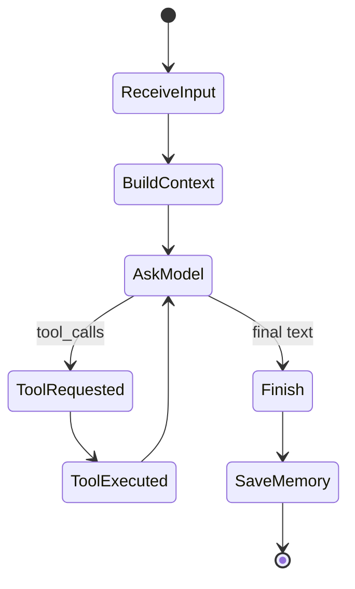

# 第 5 章：Agent Harness 与 ReAct 循环

[上一章：Memory 与上下文](04-memory-and-context.md) | [下一章：Guardrails](06-guardrails.md)

## 本章起点与终点

| 项目 | 内容 |
|---|---|
| 起点 | Profile、Memory、Tool Calling、Workflow 都由 `Program.cs` 手动拼接 |
| 终点 | `AgentRunner` 统一控制一次 Agent 运行 |
| 自动化验收 | 24 tests |

## 5.1 为什么叫 Harness

Harness 原意是“把多个部件固定并连接起来、让它们受控工作的装置”。在软件里，Test Harness 会统一准备输入、调用对象和收集结果；Agent Harness 做类似事情：

```text
模型负责建议下一步
Harness 负责决定这一步如何被执行、能执行几次、结果如何进入下一轮
```

它不只是把业务代码挪进一个类。真正的价值是取得控制权：

| 决策 | 模型 | Harness |
|---|---:|---:|
| 是否建议调用工具 | 是 | 否 |
| 工具名与参数建议 | 是 | 校验 |
| 是否允许执行 | 否 | 是 |
| 真正执行函数 | 否 | 是 |
| 是否暂停审批 | 否 | 是 |
| 最大循环次数 | 否 | 是 |
| 何时保存 Memory | 否 | 是 |
| 何时结束或失败 | 建议 | 最终决定 |

## 5.2 如果只有封装，会是什么样

普通业务封装可能只是：

```csharp
public Task<string> AskAsync(string input)
{
    return _client.AskAsync(input);
}
```

`AgentRunner` 则拥有一个跨多次模型请求和工具执行的运行周期：



后面会在这个控制点上增加审批、暂停、恢复、超时、Trace。没有统一 Harness，这些规则只能散落在 UI 和工具实现里。

## 5.3 ReAct 是什么

课程使用的是工程化 ReAct：

```text
Reason -> 模型根据可见上下文决定回答还是请求工具
Act    -> Harness 执行模型请求的工具
Observe-> Harness 把工具结果作为 tool message 放回上下文
Repeat -> 再调用模型，直到最终回答或保护规则终止
```

这里不会保存或打印模型隐藏 Chain of Thought。我们只观察 API 返回的 Tool Call 与外部执行结果。

## 5.4 AgentRunner 的依赖

```csharp
public sealed class AgentRunner
{
    private readonly AgentProfile _profile;
    private readonly ChatClient _client;
    private readonly ChatMemory _memory;
    private readonly string _memoryPath;
    private readonly AgentSkillRegistry _skillRegistry;

    public AgentRunner(
        AgentProfile profile,
        ChatClient client,
        ChatMemory memory,
        string memoryPath,
        AgentSkillRegistry skillRegistry)
    {
        _profile = profile;
        _client = client;
        _memory = memory;
        _memoryPath = memoryPath;
        _skillRegistry = skillRegistry;
    }
}
```

依赖分别代表：配置、模型、历史、持久化位置、动作集合。Runner 不负责从控制台读取输入，也不负责创建 API Key。

## 5.5 Program.cs 现在只做装配

```csharp
AgentRunner agentRunner = new(
    profile,
    client,
    memory,
    memoryPath,
    skillRegistry);

agentRunner.WorkflowStepCreated += step =>
{
    if (profile.ShowWorkflowTrace)
    {
        Console.WriteLine(AgentWorkflowStepFormatter.Format(step));
    }
};

agentRunner.DebugMessageCreated += Console.Write;
```

控制台循环只需：

```csharp
AgentRunResult result = await agentRunner.RunAsync(input);
Console.WriteLine($"{profile.Name}> {result.Reply}");
```

UI 不需要理解 Tool Call 消息如何关联，也不需要决定 Memory 保存时机。

## 5.6 RunAsync 的完整外层流程

```csharp
public async Task<AgentRunResult> RunAsync(string userInput)
{
    if (string.IsNullOrWhiteSpace(userInput))
    {
        throw new ArgumentException(
            "User input cannot be empty.",
            nameof(userInput));
    }

    AgentWorkflowTrace workflowTrace = new();

    _memory.AddUserMessage(userInput);
    AddWorkflowStep(
        workflowTrace,
        AgentWorkflowStepKind.ReceiveInput,
        "Receive user input",
        "User message was saved to memory.");

    IReadOnlyList<ChatTurn> contextTurns =
        ChatMemoryWindow.GetRecentTurns(_memory, _profile.MaxMemoryTurns);

    AddWorkflowStep(
        workflowTrace,
        AgentWorkflowStepKind.BuildContext,
        "Build context window",
        $"Sending {contextTurns.Count} of {_memory.Turns.Count} memory turns.");

    List<ChatMessage> messages = BuildMessages(contextTurns);
    string assistantReply = _profile.Stream
        ? await CompleteStreamingAsync(messages)
        : await CompleteOnceAsync(messages, debugMessages, workflowTrace);

    if (string.IsNullOrWhiteSpace(assistantReply))
    {
        throw new InvalidOperationException("The model returned no text content.");
    }

    AddWorkflowStep(workflowTrace, AgentWorkflowStepKind.Finish, "Finish",
        "Final answer was produced.");

    _memory.AddAssistantMessage(assistantReply);
    await ChatMemoryStore.SaveAsync(_memoryPath, _memory);

    return new AgentRunResult(assistantReply, workflowTrace);
}
```

这个版本在一开始就把 User 写进 Memory。后面的可恢复版本会调整写入时机，避免暂停或失败时留下半轮对话。

## 5.7 核心模型循环

```csharp
int requestNumber = 1;
while (true)
{
    AddWorkflowStep(
        workflowTrace,
        AgentWorkflowStepKind.AskModel,
        "Ask model",
        $"Request #{requestNumber} sent to the model.");

    ChatCompletion completion = await _client.CompleteChatAsync(
        messages,
        options);

    if (completion.ToolCalls.Count > 0)
    {
        await ResolveToolCallsAsync(
            messages,
            debugMessages,
            completion,
            workflowTrace);

        requestNumber++;
        continue;
    }

    if (completion.FinishReason == ChatFinishReason.Stop)
    {
        return completion.Content.Count > 0
            ? completion.Content[0].Text
            : string.Empty;
    }

    // Other finish reasons are handled explicitly.
}
```

注意优先检查 `ToolCalls.Count`，因为某些兼容 Router 可能返回 Tool Calls，但 `finish_reason` 仍然是 `stop`。

## 5.8 Act 与 Observe

```csharp
messages.Add(new AssistantChatMessage(completion));

foreach (ChatToolCall toolCall in completion.ToolCalls)
{
    AddWorkflowStep(
        workflowTrace,
        AgentWorkflowStepKind.ToolRequested,
        "Act",
        $"Model requested tool '{toolCall.FunctionName}'.");

    string result = await _skillRegistry.ExecuteAsync(
        toolCall.FunctionName,
        toolCall.FunctionArguments.ToString());

    AddWorkflowStep(
        workflowTrace,
        AgentWorkflowStepKind.ToolExecuted,
        "Observe",
        $"Tool '{toolCall.FunctionName}' returned: {result}");

    messages.Add(new ToolChatMessage(toolCall.Id, result));
}
```

Tool Call 的 `Id` 是一轮消息里的关联键：

```text
assistant.tool_call.id = call_abc
tool.tool_call_id       = call_abc
```

它告诉模型“这个结果对应你刚才哪一个工具请求”，不是整个 Agent 任务的唯一 ID。任务级唯一 ID 要到第 8 章的 `RunId`。

## 5.9 事件为什么比 Console.WriteLine 更好

Runner 发布事件：

```csharp
public event Action<AgentWorkflowStep>? WorkflowStepCreated;
public event Action<string>? DebugMessageCreated;
```

Runner 不依赖控制台，因此未来可以：

- 控制台打印。
- Web UI 推送。
- 单元测试收集。
- Trace Store 持久化。

这仍然是轻量设计，没有为一个简单需求引入消息总线。

## 5.10 运行真正的 AgentRunner

确认 `src/AgentLearning.App/agent.local.json` 已配置有效密钥，然后运行：

```bash
dotnet run --project src/AgentLearning.App/AgentLearning.App.csproj
```

输入“请计算 `(2 + 3) * 4`”。模型的措辞可能不同，但你应看到相同的行为结构：Harness 接收输入、构造上下文、请求模型、执行 `calculate`，再把结果交给模型生成最终回答。

```text
Loaded agent: Grimoire Router
Skills: get_current_time, calculate
You> 请计算 (2 + 3) * 4
[Workflow 1] ReceiveInput - Receive user input: User message was saved to memory.
[Workflow 2] BuildContext - Build context window: Sending 1 of 1 memory turns.
[Workflow 3] AskModel - Ask model: Request #1 sent to the model.
[Workflow 4] ToolRequested - Act: Model requested tool 'calculate'.
[Workflow 5] ToolExecuted - Observe: Tool 'calculate' returned: 20
[Workflow 6] AskModel - Ask model: Request #2 sent to the model.
[Workflow 7] Finish - Finish: Final answer was produced.
Grimoire Router> 计算结果是 20。
```

如果模型第一轮直接回答而没有请求工具，先确认 `agent.json` 中的 `native_tool_calling` 为 `true`，再查看第 3 章介绍的请求体预览是否包含 `tools`。

## 5.11 为什么状态机还没完整出现

此时 Workflow 记录路径，但没有一个对象限制合法状态转移。真正的 `AgentRunState` 会在第 8 章与审批、暂停和恢复一起加入：

```text
Workflow Trace = 发生过什么
Run State      = 当前处于什么状态，下一步是否合法
Harness        = 驱动状态并执行动作
```

<!-- BEGIN SELF-CONTAINED CODE -->
## 本章完整文件代码

这一节是本章的**完整代码依据**。前面的代码用于解释概念；真正动手时，请从上一章完成后的目录继续，并按下表逐项操作。`新建` 表示创建此前不存在的文件，`完整覆盖` 表示把旧文件全部替换成这里的内容。不要只复制局部片段。

> 下面已经包含本章所需的全部新增和变更文件，不需要再查找其他代码文件。

先在项目根目录执行下面的命令，确保本章需要的目录存在：

```bash
mkdir -p src/AgentLearning.App
```

### 文件操作清单

| 操作 | 文件 |
|---|---|
| 新建 | `src/AgentLearning.App/AgentRunResult.cs` |
| 新建 | `src/AgentLearning.App/AgentRunner.cs` |
| 完整覆盖 | `src/AgentLearning.App/Program.cs` |

<!-- FILE: ADD src/AgentLearning.App/AgentRunResult.cs -->
<details>
<summary><strong>新建</strong> <code>src/AgentLearning.App/AgentRunResult.cs</code></summary>

`````csharp
using AgentLearning.Core.Workflow;

namespace AgentLearning.App;

/// <summary>
/// 一次 Agent 运行的结果。
/// Program.cs 拿到它之后，只需要负责把最终回答打印给用户。
/// </summary>
public sealed record AgentRunResult(
    string AssistantReply,
    AgentWorkflowTrace WorkflowTrace);
`````

</details>
<!-- END FILE -->

<!-- FILE: ADD src/AgentLearning.App/AgentRunner.cs -->
<details>
<summary><strong>新建</strong> <code>src/AgentLearning.App/AgentRunner.cs</code></summary>

`````csharp
using AgentLearning.Core;
using AgentLearning.Core.Diagnostics;
using AgentLearning.Core.Skills;
using AgentLearning.Core.Workflow;
using OpenAI.Chat;
using System.Text;

namespace AgentLearning.App;

/// <summary>
/// Agent 的运行骨架。
/// 它把“记忆、上下文、模型调用、工具调用、工具观察、最终回答”放进一个可控循环里。
/// </summary>
public sealed class AgentRunner
{
    private readonly AgentProfile _profile;
    private readonly ChatClient _client;
    private readonly ChatMemory _memory;
    private readonly string _memoryPath;
    private readonly AgentSkillRegistry _skillRegistry;

    public AgentRunner(
        AgentProfile profile,
        ChatClient client,
        ChatMemory memory,
        string memoryPath,
        AgentSkillRegistry skillRegistry)
    {
        _profile = profile;
        _client = client;
        _memory = memory;
        _memoryPath = memoryPath;
        _skillRegistry = skillRegistry;
    }

    /// <summary>创建工作流步骤时触发，Program.cs 可以选择打印到控制台。</summary>
    public event Action<AgentWorkflowStep>? WorkflowStepCreated;

    /// <summary>创建调试文本时触发，Program.cs 可以选择打印到控制台。</summary>
    public event Action<string>? DebugMessageCreated;

    /// <summary>
    /// 运行一轮 Agent。
    /// 这里是 Harness 的核心：模型可以决定调用工具，但循环边界和记忆保存由代码控制。
    /// </summary>
    public async Task<AgentRunResult> RunAsync(string userInput)
    {
        if (string.IsNullOrWhiteSpace(userInput))
        {
            throw new ArgumentException("User input cannot be empty.", nameof(userInput));
        }

        AgentWorkflowTrace workflowTrace = new();

        _memory.AddUserMessage(userInput);
        AddWorkflowStep(
            workflowTrace,
            AgentWorkflowStepKind.ReceiveInput,
            "Receive user input",
            "User message was saved to memory.");

        IReadOnlyList<ChatTurn> contextTurns = ChatMemoryWindow.GetRecentTurns(_memory, _profile.MaxMemoryTurns);
        AddWorkflowStep(
            workflowTrace,
            AgentWorkflowStepKind.BuildContext,
            "Build context window",
            $"Sending {contextTurns.Count} of {_memory.Turns.Count} memory turns.");

        List<ChatMessage> messages = BuildMessages(contextTurns);
        List<AgentDebugMessage> debugMessages = BuildDebugMessages(contextTurns);
        string assistantReply = _profile.Stream
            ? await CompleteStreamingAsync(messages)
            : await CompleteOnceAsync(messages, debugMessages, workflowTrace);

        if (string.IsNullOrWhiteSpace(assistantReply))
        {
            throw new InvalidOperationException("The model returned no text content.");
        }

        AddWorkflowStep(
            workflowTrace,
            AgentWorkflowStepKind.Finish,
            "Finish",
            "Final answer was produced.");

        _memory.AddAssistantMessage(assistantReply);
        await ChatMemoryStore.SaveAsync(_memoryPath, _memory);

        return new AgentRunResult(assistantReply, workflowTrace);
    }

    private async Task<string> CompleteOnceAsync(
        List<ChatMessage> messages,
        List<AgentDebugMessage> debugMessages,
        AgentWorkflowTrace workflowTrace)
    {
        // native_tool_calling 打开时，会把本地技能声明成 tools 发给模型。
        ChatCompletionOptions? options = _profile.NativeToolCalling
            ? BuildChatOptions()
            : null;

        int requestNumber = 1;
        while (true)
        {
            AddWorkflowStep(
                workflowTrace,
                AgentWorkflowStepKind.AskModel,
                "Ask model",
                $"Request #{requestNumber} sent to the model.");

            EmitChatRequestPreview(debugMessages, requestNumber);
            ChatCompletion completion = await _client.CompleteChatAsync(messages, options);
            EmitChatResponsePreview(completion);

            // 有些 OpenAI-compatible Router 会返回 tool_calls，但 finish_reason 仍然是 stop。
            // 所以这里优先看 ToolCalls 本身，避免漏掉真正的工具调用请求。
            if (completion.ToolCalls.Count > 0)
            {
                if (!_profile.NativeToolCalling)
                {
                    throw new InvalidOperationException("The model returned tool calls, but native tool calling is disabled.");
                }

                await ResolveToolCallsAsync(messages, debugMessages, completion, workflowTrace);
                requestNumber++;
                continue;
            }

            switch (completion.FinishReason)
            {
                case ChatFinishReason.Stop:
                    return completion.Content.Count > 0
                        ? completion.Content[0].Text
                        : string.Empty;

                case ChatFinishReason.ToolCalls:
                    await ResolveToolCallsAsync(messages, debugMessages, completion, workflowTrace);
                    requestNumber++;
                    break;

                case ChatFinishReason.Length:
                    throw new InvalidOperationException("Model output was cut off because it reached the token limit.");

                case ChatFinishReason.ContentFilter:
                    throw new InvalidOperationException("Model output was blocked by the content filter.");

                case ChatFinishReason.FunctionCall:
                    throw new InvalidOperationException("Deprecated function_call was returned. Use tool_calls instead.");

                default:
                    throw new InvalidOperationException($"Unsupported finish reason: {completion.FinishReason}");
            }
        }
    }

    private async Task<string> CompleteStreamingAsync(List<ChatMessage> messages)
    {
        StringBuilder fullReply = new();

        await foreach (StreamingChatCompletionUpdate update in _client.CompleteChatStreamingAsync(messages))
        {
            if (update.ContentUpdate.Count == 0)
            {
                continue;
            }

            fullReply.Append(update.ContentUpdate[0].Text);
        }

        return fullReply.ToString();
    }

    private async Task ResolveToolCallsAsync(
        List<ChatMessage> messages,
        List<AgentDebugMessage> debugMessages,
        ChatCompletion completion,
        AgentWorkflowTrace workflowTrace)
    {
        // 先把“模型要求调用工具”这条 assistant 消息加入上下文。
        // SDK 会保留 tool_call_id，下一条 ToolChatMessage 才能和它对上。
        messages.Add(new AssistantChatMessage(completion));
        debugMessages.Add(new AgentDebugMessage
        {
            Role = "assistant",
            ToolCalls = completion.ToolCalls
                .Select(toolCall => new AgentDebugToolCall(
                    toolCall.Id,
                    toolCall.FunctionName,
                    toolCall.FunctionArguments.ToString()))
                .ToArray()
        });

        foreach (ChatToolCall toolCall in completion.ToolCalls)
        {
            AddWorkflowStep(
                workflowTrace,
                AgentWorkflowStepKind.ToolRequested,
                "Act",
                $"Model requested tool '{toolCall.FunctionName}'.");

            string result = await _skillRegistry.ExecuteAsync(
                toolCall.FunctionName,
                toolCall.FunctionArguments.ToString());

            AddWorkflowStep(
                workflowTrace,
                AgentWorkflowStepKind.ToolExecuted,
                "Observe",
                $"Tool '{toolCall.FunctionName}' returned: {result}");

            EmitToolResultPreview(toolCall, result);

            // 这条消息相当于告诉模型：你刚才要的工具结果在这里。
            messages.Add(new ToolChatMessage(toolCall.Id, result));
            debugMessages.Add(new AgentDebugMessage
            {
                Role = "tool",
                ToolCallId = toolCall.Id,
                Content = result
            });
        }
    }

    private List<ChatMessage> BuildMessages(IReadOnlyList<ChatTurn> contextTurns)
    {
        List<ChatMessage> messages =
        [
            // system message 是角色设定：它告诉模型“你是谁、该怎么回答”。
            new SystemChatMessage(BuildSystemInstructions())
        ];

        foreach (ChatTurn turn in contextTurns)
        {
            messages.Add(turn.Role switch
            {
                ChatRole.User => new UserChatMessage(turn.Content),
                ChatRole.Assistant => new AssistantChatMessage(turn.Content),
                _ => throw new InvalidOperationException($"Unsupported chat role: {turn.Role}")
            });
        }

        return messages;
    }

    private List<AgentDebugMessage> BuildDebugMessages(IReadOnlyList<ChatTurn> contextTurns)
    {
        List<AgentDebugMessage> messages =
        [
            new()
            {
                Role = "system",
                Content = BuildSystemInstructions()
            }
        ];

        foreach (ChatTurn turn in contextTurns)
        {
            messages.Add(turn.Role switch
            {
                ChatRole.User => new AgentDebugMessage
                {
                    Role = "user",
                    Content = turn.Content
                },
                ChatRole.Assistant => new AgentDebugMessage
                {
                    Role = "assistant",
                    Content = turn.Content
                },
                _ => throw new InvalidOperationException($"Unsupported chat role: {turn.Role}")
            });
        }

        return messages;
    }

    private ChatCompletionOptions BuildChatOptions()
    {
        ChatCompletionOptions options = new();

        foreach (IAgentSkill skill in _skillRegistry.Skills)
        {
            options.Tools.Add(ChatTool.CreateFunctionTool(
                functionName: skill.Name,
                functionDescription: skill.Description,
                functionParameters: BinaryData.FromString(skill.ParametersJson)));
        }

        return options;
    }

    private void AddWorkflowStep(
        AgentWorkflowTrace workflowTrace,
        AgentWorkflowStepKind kind,
        string title,
        string detail)
    {
        AgentWorkflowStep step = workflowTrace.Add(kind, title, detail);
        WorkflowStepCreated?.Invoke(step);
    }

    private void EmitChatRequestPreview(List<AgentDebugMessage> debugMessages, int requestNumber)
    {
        if (!_profile.ShowDebugRequests)
        {
            return;
        }

        StringBuilder builder = new();
        builder.AppendLine();
        builder.AppendLine($"--- Debug request body preview #{requestNumber} ---");
        builder.AppendLine(AgentDebugPreviewBuilder.BuildChatCompletionsRequestPreview(
            model: _profile.Model,
            stream: _profile.Stream,
            messages: debugMessages,
            skills: _skillRegistry.Skills,
            includeTools: _profile.NativeToolCalling));
        builder.AppendLine("--- End debug request body preview ---");

        DebugMessageCreated?.Invoke(builder.ToString());
    }

    private void EmitChatResponsePreview(ChatCompletion completion)
    {
        if (!_profile.ShowDebugRequests)
        {
            return;
        }

        StringBuilder builder = new();
        builder.AppendLine("--- Debug model response preview ---");
        builder.AppendLine($"finish_reason: {completion.FinishReason}");

        if (completion.ToolCalls.Count > 0)
        {
            foreach (ChatToolCall toolCall in completion.ToolCalls)
            {
                builder.AppendLine($"tool_call_id: {toolCall.Id}");
                builder.AppendLine($"tool_name: {toolCall.FunctionName}");
                builder.AppendLine($"tool_arguments: {AgentDebugPreviewBuilder.RedactSensitiveValues(toolCall.FunctionArguments.ToString())}");
            }
        }
        else if (completion.Content.Count > 0)
        {
            builder.AppendLine($"content: {AgentDebugPreviewBuilder.RedactSensitiveValues(string.Concat(completion.Content.Select(part => part.Text)))}");
        }
        else
        {
            builder.AppendLine("content: <empty>");
        }

        builder.AppendLine("--- End debug model response preview ---");
        DebugMessageCreated?.Invoke(builder.ToString());
    }

    private void EmitToolResultPreview(ChatToolCall toolCall, string result)
    {
        if (!_profile.ShowDebugRequests)
        {
            return;
        }

        StringBuilder builder = new();
        builder.AppendLine("--- Debug local tool result ---");
        builder.AppendLine($"tool_call_id: {toolCall.Id}");
        builder.AppendLine($"tool_name: {toolCall.FunctionName}");
        builder.AppendLine($"result: {AgentDebugPreviewBuilder.RedactSensitiveValues(result)}");
        builder.AppendLine("--- End debug local tool result ---");
        DebugMessageCreated?.Invoke(builder.ToString());
    }

    private string BuildSystemInstructions()
    {
        return $"""
        You are {_profile.Name}.

        Description:
        {_profile.Description}

        Instructions:
        {_profile.Instructions}
        """;
    }
}
`````

</details>
<!-- END FILE -->

<!-- FILE: REPLACE src/AgentLearning.App/Program.cs -->
<details>
<summary><strong>完整覆盖</strong> <code>src/AgentLearning.App/Program.cs</code></summary>

`````csharp
using AgentLearning.App;
using AgentLearning.Core;
using AgentLearning.Core.Skills;
using AgentLearning.Core.Workflow;
using OpenAI;
using OpenAI.Chat;
using System.ClientModel;
using System.Text.Json;

// AppContext.BaseDirectory 指向编译后的运行目录。
// csproj 已经配置了复制 agent.json 和 agent.local.json，所以运行时能在这里找到配置文件。
string profilePath = Path.Combine(AppContext.BaseDirectory, "agent.json");
string localProfilePath = Path.Combine(AppContext.BaseDirectory, "agent.local.json");

// 读取 Agent 的角色设定、API 接线配置，以及本地私有密钥配置。
AgentProfile profile = await AgentProfileLoader.LoadFromFileAsync(profilePath, localProfilePath);

// 优先使用 agent.local.json 里的 api_key。
// 如果你临时不想写本地文件，也仍然可以用环境变量兜底。
string? apiKey = profile.ApiKey ?? Environment.GetEnvironmentVariable(profile.EnvKey);
if (string.IsNullOrWhiteSpace(apiKey))
{
    Console.WriteLine($"No API key was found in agent.local.json or {profile.EnvKey}.");
    Console.WriteLine("Set one of them, then run this app again:");
    Console.WriteLine("  agent.local.json: { \"api_key\": \"sk-...\" }");
    Console.WriteLine($"  export {profile.EnvKey}=\"sk-...\"");
    return 1;
}

// ChatClient 对应你给的 curl 路径：POST /v1/chat/completions。
// Endpoint 使用 https://router.hddev.top/v1，SDK 会在它后面拼接 /chat/completions。
ChatClient client = new(
    model: profile.Model,
    credential: new ApiKeyCredential(apiKey),
    options: new OpenAIClientOptions
    {
        Endpoint = new Uri(profile.BaseUrl)
    });

// memory_file 可以写相对路径；这里把它解析成真正使用的文件路径。
string memoryPath = AgentPathResolver.ResolveRuntimePath(AppContext.BaseDirectory, profile.MemoryFile);

// 现在记忆会从本地 JSON 文件恢复；文件不存在时得到一个空记忆。
ChatMemory memory = await ChatMemoryStore.LoadAsync(memoryPath);

// 注册当前 Agent 可以使用的技能。
// 这一步只是把 C# 函数准备好，真正什么时候调用由模型决定。
AgentSkillRegistry skillRegistry = new([
    new TimeSkill(),
    new CalculatorSkill()
]);

AgentRunner agentRunner = new(profile, client, memory, memoryPath, skillRegistry);
agentRunner.WorkflowStepCreated += step =>
{
    if (profile.ShowWorkflowTrace)
    {
        Console.WriteLine(AgentWorkflowStepFormatter.Format(step));
    }
};
agentRunner.DebugMessageCreated += Console.Write;

Console.WriteLine($"Loaded agent: {profile.Name}");
Console.WriteLine($"Wire API: {profile.WireApi}");
Console.WriteLine($"Base URL: {profile.BaseUrl}");
Console.WriteLine($"Stream: {profile.Stream}");
Console.WriteLine($"Native tool calling: {profile.NativeToolCalling}");
Console.WriteLine($"Show debug requests: {profile.ShowDebugRequests}");
Console.WriteLine($"Show workflow trace: {profile.ShowWorkflowTrace}");
Console.WriteLine($"Memory file: {memoryPath}");
Console.WriteLine($"Loaded memory turns: {memory.Turns.Count}");
Console.WriteLine($"Max memory turns sent: {profile.MaxMemoryTurns}");
Console.WriteLine($"Skills: {string.Join(", ", skillRegistry.Skills.Select(skill => skill.Name))}");
Console.WriteLine("Type a message and press Enter. Type 'exit' to quit.");
Console.WriteLine("Local skill commands: /time, /calc <expression>");
Console.WriteLine();

if (profile.Stream && profile.NativeToolCalling)
{
    Console.WriteLine("Native tool calling is only implemented for non-streaming mode in this lesson.");
    return 1;
}

while (true)
{
    Console.Write("You> ");
    string? input = Console.ReadLine();

    // 输入 exit 就退出；这就是当前最简单的交互方式。
    if (input is null || input.Equals("exit", StringComparison.OrdinalIgnoreCase))
    {
        break;
    }

    // 空输入不调用模型，避免浪费一次请求。
    if (string.IsNullOrWhiteSpace(input))
    {
        continue;
    }

    if (await TryRunLocalSkillCommandAsync(input, profile, memory, memoryPath, skillRegistry))
    {
        Console.WriteLine();
        continue;
    }

    try
    {
        AgentRunResult result = await agentRunner.RunAsync(input);

        if (!profile.Stream)
        {
            Console.WriteLine($"{profile.Name}> {result.AssistantReply}");
        }

        Console.WriteLine();
    }
    catch (Exception exception)
    {
        Console.WriteLine($"Agent call failed: {exception.Message}");
        return 1;
    }
}

return 0;

static async Task<bool> TryRunLocalSkillCommandAsync(
    string input,
    AgentProfile profile,
    ChatMemory memory,
    string memoryPath,
    AgentSkillRegistry skillRegistry)
{
    if (input.Equals("/time", StringComparison.OrdinalIgnoreCase))
    {
        string result = await skillRegistry.ExecuteAsync("get_current_time", "{}");
        memory.AddUserMessage(input);
        memory.AddAssistantMessage(result);
        await ChatMemoryStore.SaveAsync(memoryPath, memory);
        Console.WriteLine($"{profile.Name}> {result}");
        return true;
    }

    const string calculatorPrefix = "/calc ";
    if (input.StartsWith(calculatorPrefix, StringComparison.OrdinalIgnoreCase))
    {
        string expression = input[calculatorPrefix.Length..].Trim();
        string argumentsJson = JsonSerializer.Serialize(new { expression });
        string result = await skillRegistry.ExecuteAsync("calculate", argumentsJson);

        memory.AddUserMessage(input);
        memory.AddAssistantMessage(result);
        await ChatMemoryStore.SaveAsync(memoryPath, memory);
        Console.WriteLine($"{profile.Name}> {result}");
        return true;
    }

    return false;
}
`````

</details>
<!-- END FILE -->

### 编译与自动化验收

在项目根目录执行：

```bash
dotnet test AgentLearning.sln
```

应看到的关键结果（耗时会因电脑而不同）：

```text
Passed! - Failed: 0, Passed: 24, Skipped: 0, Total: 24
```

<!-- END SELF-CONTAINED CODE -->

## 本章验收

- [ ] 能解释 Harness 掌握了哪些模型之外的控制权。
- [ ] 能沿代码指出 Reason、Act、Observe、Repeat。
- [ ] 明白 Tool Call ID 只关联工具请求与结果。
- [ ] 能说明为什么 Program 只负责装配和 UI。
- [ ] 能通过真实 Router 运行 AgentRunner，并观察一次完整 Tool Calling 循环。
- [ ] 24 个测试全部通过。

## 本章小结

统一 Runner 让规则有了清晰落点，但当前 `while (true)` 可能无限运行，工具可能卡住、返回海量文本或抛异常。下一章给 Harness 增加系统化保护。

[下一章：循环、超时、异常与结果保护](06-guardrails.md)
