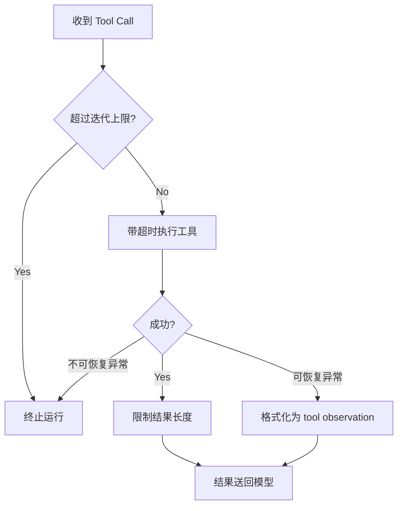

# 第 6 章：循环、超时、异常与结果保护

[上一章：Agent Harness](05-harness-react-state.md) | [下一章：AI Tool Router](07-tool-router.md)

## 本章起点与终点

| 项目 | 内容 |
|---|---|
| 起点 | Harness 可以循环调用工具，但没有资源边界 |
| 终点 | 迭代、超时、结果长度、异常、Memory 写入都有明确规则 |
| 自动化验收 | 51 tests |

## 6.1 `try/catch` 只解决其中一件事

工具异常处理确实需要 `try/catch`，但 Guardrails 处理的是五类不同风险：

| 风险 | 只靠 try/catch 能解决吗 | 对应规则 |
|---|---:|---|
| 模型一直请求工具 | 不能 | 迭代上限 |
| 工具永远不返回 | 不能 | 超时与取消 |
| 工具返回 10 MB 文本 | 不能 | 结果截断 |
| 参数错误 | 部分 | 可恢复错误观察 |
| 密钥或超长内容进入 Memory | 不能 | Memory 写入策略 |



## 6.2 配置边界

`agent.json` 新增：

```json
{
  "max_tool_iterations": 3,
  "max_tool_result_chars": 1200,
  "tool_timeout_seconds": 5,
  "max_memory_content_chars": 2000
}
```

这些值不是 Prompt 建议，而是 C# 强制执行的运行预算。

## 6.3 防止无限 Tool Loop

```csharp
public sealed class AgentToolIterationGuard
{
    private readonly int _maxToolIterations;

    public AgentToolIterationGuard(int maxToolIterations)
    {
        if (maxToolIterations <= 0)
        {
            throw new ArgumentOutOfRangeException(nameof(maxToolIterations));
        }

        _maxToolIterations = maxToolIterations;
    }

    public int UsedIterations { get; private set; }

    public void RecordToolIteration()
    {
        if (UsedIterations >= _maxToolIterations)
        {
            throw new InvalidOperationException(
                $"Tool iteration limit reached after {_maxToolIterations} iteration(s).");
        }

        UsedIterations++;
    }
}
```

一次 iteration 指一批模型返回的 Tool Calls。即使这一批有两个工具，也先视为模型的一次工具决策轮。

在 Runner 中，每次解析 Tool Calls 前调用：

```csharp
iterationGuard.RecordToolIteration();
```

上限为 3 时，允许三轮，第四轮在执行任何新工具前失败。

## 6.4 工具超时

```csharp
public sealed class AgentToolTimeoutRunner
{
    private readonly int _toolTimeoutSeconds;
    private readonly TimeSpan _timeout;

    public AgentToolTimeoutRunner(int toolTimeoutSeconds)
    {
        _toolTimeoutSeconds = toolTimeoutSeconds;
        _timeout = TimeSpan.FromSeconds(toolTimeoutSeconds);
    }

    public async Task<string> RunAsync(
        string toolName,
        Func<CancellationToken, Task<string>> runToolAsync)
    {
        using CancellationTokenSource timeout = new(_timeout);

        try
        {
            return await runToolAsync(timeout.Token).WaitAsync(timeout.Token);
        }
        catch (OperationCanceledException) when (timeout.IsCancellationRequested)
        {
            throw new TimeoutException(
                $"Tool '{toolName}' timed out after {_toolTimeoutSeconds} second(s).");
        }
    }
}
```

两层配合：

- 把 `CancellationToken` 传给工具，让合作型工具主动停止。
- `WaitAsync` 保证即使工具忽略 Token，Harness 也不会无限等。

底层任务可能仍在后台结束，因此有外部副作用的工具还需要幂等机制，第 8 章实现。

## 6.5 限制工具结果

```csharp
public string Limit(string result)
{
    if (result.Length <= _maxToolResultChars)
    {
        return result;
    }

    string keptContent = result[.._maxToolResultChars];
    return $"""
        {keptContent}

        [工具结果过长，已截断。原始长度：{result.Length} 字符，只保留前 {_maxToolResultChars} 字符。]
        """;
}
```

截断通知也送给模型，模型知道证据不完整，不会误以为这是工具完整输出。

字符数不是 Token 数，但实现简单、稳定，足以作为第一层防护。

## 6.6 可恢复异常变成 Observation

错误分类：

```csharp
public static bool IsRecoverable(Exception exception)
{
    return exception switch
    {
        AgentUnknownSkillException => false,
        TimeoutException => true,
        JsonException => true,
        ArgumentException => true,
        InvalidOperationException => true,
        FormatException => true,
        _ => false
    };
}
```

可恢复错误格式：

```csharp
public static string FormatRecoverableError(
    string toolName,
    Exception exception)
{
    return $"""
        [工具执行失败]
        工具名称：{toolName}
        错误类型：{exception.GetType().Name}
        错误信息：{exception.Message}

        你可以解释失败原因，或者修正参数后再次调用工具。
        """;
}
```

Runner 中：

```csharp
try
{
    result = await timeoutRunner.RunAsync(
        toolCall.FunctionName,
        token => _skillRegistry.ExecuteAsync(
            toolCall.FunctionName,
            argumentsJson,
            token));
}
catch (Exception exception)
    when (AgentToolErrorFormatter.IsRecoverable(exception))
{
    result = AgentToolErrorFormatter.FormatRecoverableError(
        toolCall.FunctionName,
        exception);
}
```

这确实使用了 `try/catch`，但关键不是“拿到异常”，而是把可信分类后的错误作为 Observation 放回循环。未知工具属于协议或路由错误，直接失败，不让模型靠猜测继续。

## 6.7 Memory 写入策略

```csharp
public bool ShouldWrite(string? content)
{
    if (string.IsNullOrWhiteSpace(content))
    {
        return false;
    }

    if (content.Length > _maxMemoryContentChars)
    {
        return false;
    }

    return !SensitiveMarkers.Any(marker =>
        content.Contains(marker, StringComparison.OrdinalIgnoreCase));
}
```

第一版拒绝包含这些标记的内容：

```text
api_key
password
token
"bearer "
sk-
```

它只是基础规则，不是完整 DLP 系统。重点是明确 Memory 写入需要策略，不能把所有输入原样永久保存。

## 6.8 Runner 中的执行顺序

```csharp
iterationGuard.RecordToolIteration();

string result;
try
{
    result = await timeoutRunner.RunAsync(...);
}
catch (Exception exception) when (IsRecoverable(exception))
{
    result = FormatRecoverableError(...);
}

string limitedResult = resultLimiter.Limit(result);
messages.Add(new ToolChatMessage(toolCall.Id, limitedResult));
```

顺序不能随便换：

1. 先扣迭代预算，避免失败重试绕过限制。
2. 再带超时执行。
3. 将可恢复错误转成结果。
4. 成功或错误文本都限制长度。
5. 最后送回模型。

## 6.9 哪些规则还没做

这一章之后仍然需要：

- 工具风险等级与人工审批。
- 每个 Tool Call 的唯一幂等键。
- Checkpoint 与恢复。
- 主模型请求超时、全局 Run Deadline。
- 并发数量限制。
- 网络重试只针对明确可重试错误。
- 敏感字段结构化脱敏。

后续章节会继续补其中关键部分。

## 6.10 运行与测试

```bash
dotnet test AgentLearning.sln
```


51 个测试覆盖正常边界和失败边界，例如：

```csharp
[Fact]
public void RecordToolIteration_Throws_after_limit()

[Fact]
public async Task RunAsync_Throws_timeout_for_slow_tool()

[Fact]
public void Limit_Adds_truncation_notice()

[Fact]
public void ShouldWrite_Rejects_sensitive_content()
```

<!-- BEGIN SELF-CONTAINED CODE -->
## 本章完整文件代码

这一节是本章的**完整代码依据**。前面的代码用于解释概念；真正动手时，请从上一章完成后的目录继续，并按下表逐项操作。`新建` 表示创建此前不存在的文件，`完整覆盖` 表示把旧文件全部替换成这里的内容。不要只复制局部片段。

> 下面已经包含本章所需的全部新增和变更文件，不需要再查找其他代码文件。

先在项目根目录执行下面的命令，确保本章需要的目录存在：

```bash
mkdir -p src/AgentLearning.App src/AgentLearning.Core src/AgentLearning.Core/Skills src/AgentLearning.Core/Workflow tests/AgentLearning.Core.Tests
```

### 文件操作清单

| 操作 | 文件 |
|---|---|
| 新建 | `src/AgentLearning.Core/AgentMemoryWritePolicy.cs` |
| 新建 | `src/AgentLearning.Core/AgentToolErrorFormatter.cs` |
| 新建 | `src/AgentLearning.Core/AgentToolIterationGuard.cs` |
| 新建 | `src/AgentLearning.Core/AgentToolResultLimiter.cs` |
| 新建 | `src/AgentLearning.Core/AgentToolTimeoutRunner.cs` |
| 新建 | `src/AgentLearning.Core/Skills/AgentUnknownSkillException.cs` |
| 新建 | `tests/AgentLearning.Core.Tests/AgentMemoryWritePolicyTests.cs` |
| 新建 | `tests/AgentLearning.Core.Tests/AgentToolErrorFormatterTests.cs` |
| 新建 | `tests/AgentLearning.Core.Tests/AgentToolIterationGuardTests.cs` |
| 新建 | `tests/AgentLearning.Core.Tests/AgentToolResultLimiterTests.cs` |
| 新建 | `tests/AgentLearning.Core.Tests/AgentToolTimeoutRunnerTests.cs` |
| 完整覆盖 | `src/AgentLearning.App/AgentRunner.cs` |
| 完整覆盖 | `src/AgentLearning.App/Program.cs` |
| 完整覆盖 | `src/AgentLearning.App/agent.json` |
| 完整覆盖 | `src/AgentLearning.Core/AgentProfile.cs` |
| 完整覆盖 | `src/AgentLearning.Core/AgentProfileLoader.cs` |
| 完整覆盖 | `src/AgentLearning.Core/ChatMemory.cs` |
| 完整覆盖 | `src/AgentLearning.Core/ChatRole.cs` |
| 完整覆盖 | `src/AgentLearning.Core/ChatTurn.cs` |
| 完整覆盖 | `src/AgentLearning.Core/Skills/AgentSkillRegistry.cs` |
| 完整覆盖 | `src/AgentLearning.Core/Workflow/AgentWorkflowStepKind.cs` |
| 完整覆盖 | `tests/AgentLearning.Core.Tests/AgentProfileLoaderTests.cs` |
| 完整覆盖 | `tests/AgentLearning.Core.Tests/AgentSkillRegistryTests.cs` |
| 完整覆盖 | `tests/AgentLearning.Core.Tests/AgentWorkflowTraceTests.cs` |

<!-- FILE: ADD src/AgentLearning.Core/AgentMemoryWritePolicy.cs -->
<details>
<summary><strong>新建</strong> <code>src/AgentLearning.Core/AgentMemoryWritePolicy.cs</code></summary>

`````csharp
namespace AgentLearning.Core;

/// <summary>
/// 判断一段内容是否适合写入长期记忆。
/// 当前用户输入仍然会参与本轮模型调用；这里只控制“要不要保存到下一轮还能看到的记忆里”。
/// </summary>
public sealed class AgentMemoryWritePolicy
{
    private static readonly string[] SensitiveMarkers =
    [
        "api_key",
        "password",
        "token",
        "bearer ",
        "sk-"
    ];

    private readonly int _maxMemoryContentChars;

    public AgentMemoryWritePolicy(int maxMemoryContentChars)
    {
        if (maxMemoryContentChars <= 0)
        {
            throw new ArgumentOutOfRangeException(
                nameof(maxMemoryContentChars),
                "Maximum memory content characters must be greater than zero.");
        }

        _maxMemoryContentChars = maxMemoryContentChars;
    }

    public bool ShouldWrite(string? content)
    {
        if (string.IsNullOrWhiteSpace(content))
        {
            return false;
        }

        if (content.Length > _maxMemoryContentChars)
        {
            return false;
        }

        return !SensitiveMarkers.Any(marker =>
            content.Contains(marker, StringComparison.OrdinalIgnoreCase));
    }
}
`````

</details>
<!-- END FILE -->

<!-- FILE: ADD src/AgentLearning.Core/AgentToolErrorFormatter.cs -->
<details>
<summary><strong>新建</strong> <code>src/AgentLearning.Core/AgentToolErrorFormatter.cs</code></summary>

`````csharp
using AgentLearning.Core.Skills;
using System.Text.Json;

namespace AgentLearning.Core;

/// <summary>
/// 把可恢复的工具异常转换成模型可以观察到的 tool result。
/// 这样模型可以基于错误向用户解释，或修正参数后再次调用工具。
/// </summary>
public static class AgentToolErrorFormatter
{
    public static bool IsRecoverable(Exception exception)
    {
        return exception switch
        {
            AgentUnknownSkillException => false,
            TimeoutException => true,
            JsonException => true,
            ArgumentException => true,
            InvalidOperationException => true,
            FormatException => true,
            _ => false
        };
    }

    public static string FormatRecoverableError(string toolName, Exception exception)
    {
        ArgumentException.ThrowIfNullOrWhiteSpace(toolName);
        ArgumentNullException.ThrowIfNull(exception);

        return $"""
            [工具执行失败]
            工具名称：{toolName}
            错误类型：{exception.GetType().Name}
            错误信息：{exception.Message}

            你可以根据这个错误向用户解释失败原因，或者在修正参数后再次调用工具。
            """;
    }
}
`````

</details>
<!-- END FILE -->

<!-- FILE: ADD src/AgentLearning.Core/AgentToolIterationGuard.cs -->
<details>
<summary><strong>新建</strong> <code>src/AgentLearning.Core/AgentToolIterationGuard.cs</code></summary>

`````csharp
namespace AgentLearning.Core;

/// <summary>
/// 记录一次 Agent 运行里已经发生了几轮工具调用，用来防止工具循环失控。
/// </summary>
public sealed class AgentToolIterationGuard
{
    private readonly int _maxToolIterations;

    public AgentToolIterationGuard(int maxToolIterations)
    {
        if (maxToolIterations <= 0)
        {
            throw new ArgumentOutOfRangeException(
                nameof(maxToolIterations),
                "Maximum tool iterations must be greater than zero.");
        }

        _maxToolIterations = maxToolIterations;
    }

    public int UsedIterations { get; private set; }

    public void RecordToolIteration()
    {
        if (UsedIterations >= _maxToolIterations)
        {
            throw new InvalidOperationException(
                $"Tool iteration limit reached after {_maxToolIterations} iteration(s).");
        }

        UsedIterations++;
    }
}
`````

</details>
<!-- END FILE -->

<!-- FILE: ADD src/AgentLearning.Core/AgentToolResultLimiter.cs -->
<details>
<summary><strong>新建</strong> <code>src/AgentLearning.Core/AgentToolResultLimiter.cs</code></summary>

`````csharp
namespace AgentLearning.Core;

/// <summary>
/// 限制工具结果正文长度，避免一次工具调用把太多内容塞回模型上下文。
/// </summary>
public sealed class AgentToolResultLimiter
{
    private readonly int _maxToolResultChars;

    public AgentToolResultLimiter(int maxToolResultChars)
    {
        if (maxToolResultChars <= 0)
        {
            throw new ArgumentOutOfRangeException(
                nameof(maxToolResultChars),
                "Maximum tool result characters must be greater than zero.");
        }

        _maxToolResultChars = maxToolResultChars;
    }

    public string Limit(string result)
    {
        ArgumentNullException.ThrowIfNull(result);

        if (result.Length <= _maxToolResultChars)
        {
            return result;
        }

        string keptContent = result[.._maxToolResultChars];
        return $"""
            {keptContent}

            [工具结果过长，已截断。原始长度：{result.Length} 字符，只保留前 {_maxToolResultChars} 字符。]
            """;
    }
}
`````

</details>
<!-- END FILE -->

<!-- FILE: ADD src/AgentLearning.Core/AgentToolTimeoutRunner.cs -->
<details>
<summary><strong>新建</strong> <code>src/AgentLearning.Core/AgentToolTimeoutRunner.cs</code></summary>

`````csharp
namespace AgentLearning.Core;

/// <summary>
/// 在限定时间内执行工具，避免某个工具卡住后让 Agent 一直等待。
/// </summary>
public sealed class AgentToolTimeoutRunner
{
    private readonly int _toolTimeoutSeconds;
    private readonly TimeSpan _timeout;

    public AgentToolTimeoutRunner(int toolTimeoutSeconds)
    {
        if (toolTimeoutSeconds <= 0)
        {
            throw new ArgumentOutOfRangeException(
                nameof(toolTimeoutSeconds),
                "Tool timeout seconds must be greater than zero.");
        }

        _toolTimeoutSeconds = toolTimeoutSeconds;
        _timeout = TimeSpan.FromSeconds(toolTimeoutSeconds);
    }

    public async Task<string> RunAsync(
        string toolName,
        Func<CancellationToken, Task<string>> runToolAsync)
    {
        ArgumentException.ThrowIfNullOrWhiteSpace(toolName);
        ArgumentNullException.ThrowIfNull(runToolAsync);

        using CancellationTokenSource timeout = new(_timeout);

        try
        {
            return await runToolAsync(timeout.Token).WaitAsync(timeout.Token);
        }
        catch (OperationCanceledException) when (timeout.IsCancellationRequested)
        {
            throw new TimeoutException(
                $"Tool '{toolName}' timed out after {_toolTimeoutSeconds} second(s).");
        }
    }
}
`````

</details>
<!-- END FILE -->

<!-- FILE: ADD src/AgentLearning.Core/Skills/AgentUnknownSkillException.cs -->
<details>
<summary><strong>新建</strong> <code>src/AgentLearning.Core/Skills/AgentUnknownSkillException.cs</code></summary>

`````csharp
namespace AgentLearning.Core.Skills;

/// <summary>
/// 表示模型请求了本地不存在的技能。
/// 这类错误通常说明工具声明或模型协议出了问题，不应该交给模型自行解释。
/// </summary>
public sealed class AgentUnknownSkillException : InvalidOperationException
{
    public AgentUnknownSkillException(string skillName)
        : base($"Unknown skill: {skillName}")
    {
        SkillName = skillName;
    }

    public string SkillName { get; }
}
`````

</details>
<!-- END FILE -->

<!-- FILE: ADD tests/AgentLearning.Core.Tests/AgentMemoryWritePolicyTests.cs -->
<details>
<summary><strong>新建</strong> <code>tests/AgentLearning.Core.Tests/AgentMemoryWritePolicyTests.cs</code></summary>

`````csharp
using AgentLearning.Core;

namespace AgentLearning.Core.Tests;

public sealed class AgentMemoryWritePolicyTests
{
    [Fact]
    public void ShouldWrite_allows_normal_content()
    {
        AgentMemoryWritePolicy policy = new(maxMemoryContentChars: 100);

        Assert.True(policy.ShouldWrite("请继续讲 Agent 的记忆机制"));
    }

    [Theory]
    [InlineData("")]
    [InlineData("   ")]
    public void ShouldWrite_rejects_empty_content(string content)
    {
        AgentMemoryWritePolicy policy = new(maxMemoryContentChars: 100);

        Assert.False(policy.ShouldWrite(content));
    }

    [Theory]
    [InlineData("my password is 123456")]
    [InlineData("api_key = secret")]
    [InlineData("Authorization: Bearer abc")]
    [InlineData("token: abc")]
    [InlineData("sk-test-secret")]
    public void ShouldWrite_rejects_obvious_secret_content(string content)
    {
        AgentMemoryWritePolicy policy = new(maxMemoryContentChars: 100);

        Assert.False(policy.ShouldWrite(content));
    }

    [Fact]
    public void ShouldWrite_rejects_content_over_the_configured_limit()
    {
        AgentMemoryWritePolicy policy = new(maxMemoryContentChars: 5);

        Assert.False(policy.ShouldWrite("123456"));
    }

    [Fact]
    public void Constructor_rejects_non_positive_limits()
    {
        ArgumentOutOfRangeException error = Assert.Throws<ArgumentOutOfRangeException>(
            () => new AgentMemoryWritePolicy(maxMemoryContentChars: 0));

        Assert.Equal("maxMemoryContentChars", error.ParamName);
    }
}
`````

</details>
<!-- END FILE -->

<!-- FILE: ADD tests/AgentLearning.Core.Tests/AgentToolErrorFormatterTests.cs -->
<details>
<summary><strong>新建</strong> <code>tests/AgentLearning.Core.Tests/AgentToolErrorFormatterTests.cs</code></summary>

`````csharp
using AgentLearning.Core;
using AgentLearning.Core.Skills;

namespace AgentLearning.Core.Tests;

public sealed class AgentToolErrorFormatterTests
{
    [Fact]
    public void IsRecoverable_returns_true_for_tool_runtime_errors()
    {
        Assert.True(AgentToolErrorFormatter.IsRecoverable(
            new InvalidOperationException("Division by zero is not allowed.")));
        Assert.True(AgentToolErrorFormatter.IsRecoverable(
            new TimeoutException("Tool timed out.")));
    }

    [Fact]
    public void IsRecoverable_returns_false_for_unknown_tools()
    {
        Assert.False(AgentToolErrorFormatter.IsRecoverable(
            new AgentUnknownSkillException("missing_skill")));
    }

    [Fact]
    public void IsRecoverable_returns_false_for_unexpected_system_errors()
    {
        Assert.False(AgentToolErrorFormatter.IsRecoverable(
            new NullReferenceException("Unexpected bug.")));
    }

    [Fact]
    public void FormatRecoverableError_returns_model_visible_tool_observation()
    {
        string result = AgentToolErrorFormatter.FormatRecoverableError(
            "calculate",
            new InvalidOperationException("Division by zero is not allowed."));

        Assert.Contains("工具执行失败", result);
        Assert.Contains("工具名称：calculate", result);
        Assert.Contains("错误类型：InvalidOperationException", result);
        Assert.Contains("Division by zero is not allowed.", result);
        Assert.Contains("可以根据这个错误", result);
    }
}
`````

</details>
<!-- END FILE -->

<!-- FILE: ADD tests/AgentLearning.Core.Tests/AgentToolIterationGuardTests.cs -->
<details>
<summary><strong>新建</strong> <code>tests/AgentLearning.Core.Tests/AgentToolIterationGuardTests.cs</code></summary>

`````csharp
using AgentLearning.Core;

namespace AgentLearning.Core.Tests;

public sealed class AgentToolIterationGuardTests
{
    [Fact]
    public void RecordToolIteration_allows_iterations_up_to_the_configured_limit()
    {
        AgentToolIterationGuard guard = new(maxToolIterations: 2);

        guard.RecordToolIteration();
        guard.RecordToolIteration();

        Assert.Equal(2, guard.UsedIterations);
    }

    [Fact]
    public void RecordToolIteration_rejects_iterations_after_the_configured_limit()
    {
        AgentToolIterationGuard guard = new(maxToolIterations: 1);

        guard.RecordToolIteration();
        InvalidOperationException error = Assert.Throws<InvalidOperationException>(
            guard.RecordToolIteration);

        Assert.Contains("Tool iteration limit reached", error.Message);
        Assert.Equal(1, guard.UsedIterations);
    }

    [Fact]
    public void Constructor_rejects_non_positive_limits()
    {
        ArgumentOutOfRangeException error = Assert.Throws<ArgumentOutOfRangeException>(
            () => new AgentToolIterationGuard(maxToolIterations: 0));

        Assert.Equal("maxToolIterations", error.ParamName);
    }
}
`````

</details>
<!-- END FILE -->

<!-- FILE: ADD tests/AgentLearning.Core.Tests/AgentToolResultLimiterTests.cs -->
<details>
<summary><strong>新建</strong> <code>tests/AgentLearning.Core.Tests/AgentToolResultLimiterTests.cs</code></summary>

`````csharp
using AgentLearning.Core;

namespace AgentLearning.Core.Tests;

public sealed class AgentToolResultLimiterTests
{
    [Fact]
    public void Limit_keeps_short_tool_results_unchanged()
    {
        AgentToolResultLimiter limiter = new(maxToolResultChars: 20);

        string result = limiter.Limit("short result");

        Assert.Equal("short result", result);
    }

    [Fact]
    public void Limit_truncates_long_tool_results_with_a_clear_notice()
    {
        AgentToolResultLimiter limiter = new(maxToolResultChars: 8);

        string result = limiter.Limit("abcdefghijklmnop");

        Assert.StartsWith("abcdefgh", result);
        Assert.DoesNotContain("ijklmnop", result);
        Assert.Contains("工具结果过长，已截断", result);
        Assert.Contains("原始长度：16", result);
        Assert.Contains("只保留前 8", result);
    }

    [Fact]
    public void Constructor_rejects_non_positive_limits()
    {
        ArgumentOutOfRangeException error = Assert.Throws<ArgumentOutOfRangeException>(
            () => new AgentToolResultLimiter(maxToolResultChars: 0));

        Assert.Equal("maxToolResultChars", error.ParamName);
    }
}
`````

</details>
<!-- END FILE -->

<!-- FILE: ADD tests/AgentLearning.Core.Tests/AgentToolTimeoutRunnerTests.cs -->
<details>
<summary><strong>新建</strong> <code>tests/AgentLearning.Core.Tests/AgentToolTimeoutRunnerTests.cs</code></summary>

`````csharp
using AgentLearning.Core;

namespace AgentLearning.Core.Tests;

public sealed class AgentToolTimeoutRunnerTests
{
    [Fact]
    public async Task RunAsync_returns_tool_result_before_timeout()
    {
        AgentToolTimeoutRunner runner = new(toolTimeoutSeconds: 1);

        string result = await runner.RunAsync(
            "fast_tool",
            _ => Task.FromResult("ok"));

        Assert.Equal("ok", result);
    }

    [Fact]
    public async Task RunAsync_rejects_tool_that_exceeds_timeout()
    {
        AgentToolTimeoutRunner runner = new(toolTimeoutSeconds: 1);

        TimeoutException error = await Assert.ThrowsAsync<TimeoutException>(
            () => runner.RunAsync(
                "slow_tool",
                async cancellationToken =>
                {
                    await Task.Delay(TimeSpan.FromSeconds(10), cancellationToken);
                    return "late";
                }));

        Assert.Contains("slow_tool", error.Message);
        Assert.Contains("1 second", error.Message);
    }

    [Fact]
    public void Constructor_rejects_non_positive_timeout()
    {
        ArgumentOutOfRangeException error = Assert.Throws<ArgumentOutOfRangeException>(
            () => new AgentToolTimeoutRunner(toolTimeoutSeconds: 0));

        Assert.Equal("toolTimeoutSeconds", error.ParamName);
    }
}
`````

</details>
<!-- END FILE -->

<!-- FILE: REPLACE src/AgentLearning.App/AgentRunner.cs -->
<details>
<summary><strong>完整覆盖</strong> <code>src/AgentLearning.App/AgentRunner.cs</code></summary>

`````csharp
using AgentLearning.Core;
using AgentLearning.Core.Diagnostics;
using AgentLearning.Core.Skills;
using AgentLearning.Core.Workflow;
using OpenAI.Chat;
using System.Text;

namespace AgentLearning.App;

/// <summary>
/// Agent 的运行骨架。
/// 它把“记忆、上下文、模型调用、工具调用、工具观察、最终回答”放进一个可控循环里。
/// </summary>
public sealed class AgentRunner
{
    private readonly AgentProfile _profile;
    private readonly ChatClient _client;
    private readonly ChatMemory _memory;
    private readonly string _memoryPath;
    private readonly AgentSkillRegistry _skillRegistry;

    public AgentRunner(
        AgentProfile profile,
        ChatClient client,
        ChatMemory memory,
        string memoryPath,
        AgentSkillRegistry skillRegistry)
    {
        _profile = profile;
        _client = client;
        _memory = memory;
        _memoryPath = memoryPath;
        _skillRegistry = skillRegistry;
    }

    /// <summary>创建工作流步骤时触发，Program.cs 可以选择打印到控制台。</summary>
    public event Action<AgentWorkflowStep>? WorkflowStepCreated;

    /// <summary>创建调试文本时触发，Program.cs 可以选择打印到控制台。</summary>
    public event Action<string>? DebugMessageCreated;

    /// <summary>
    /// 运行一轮 Agent。
    /// 这里是 Harness 的核心：模型可以决定调用工具，但循环边界和记忆保存由代码控制。
    /// </summary>
    public async Task<AgentRunResult> RunAsync(string userInput)
    {
        if (string.IsNullOrWhiteSpace(userInput))
        {
            throw new ArgumentException("User input cannot be empty.", nameof(userInput));
        }

        AgentWorkflowTrace workflowTrace = new();

        AgentMemoryWritePolicy memoryWritePolicy = new(_profile.MaxMemoryContentChars);
        bool shouldSaveUserInput = memoryWritePolicy.ShouldWrite(userInput);

        AddWorkflowStep(
            workflowTrace,
            AgentWorkflowStepKind.ReceiveInput,
            "Receive user input",
            shouldSaveUserInput
                ? "User message is eligible for memory."
                : "User message will only be used in this turn.");

        IReadOnlyList<ChatTurn> contextTurns = ChatMemoryWindow.GetRecentTurns(_memory, _profile.MaxMemoryTurns);
        AddWorkflowStep(
            workflowTrace,
            AgentWorkflowStepKind.BuildContext,
            "Build context window",
            $"Sending {contextTurns.Count} of {_memory.Turns.Count} saved memory turns plus current input.");

        List<ChatMessage> messages = BuildMessages(contextTurns);
        List<AgentDebugMessage> debugMessages = BuildDebugMessages(contextTurns);
        AddCurrentUserInput(messages, debugMessages, userInput);

        string assistantReply = _profile.Stream
            ? await CompleteStreamingAsync(messages)
            : await CompleteOnceAsync(messages, debugMessages, workflowTrace);

        if (string.IsNullOrWhiteSpace(assistantReply))
        {
            throw new InvalidOperationException("The model returned no text content.");
        }

        AddWorkflowStep(
            workflowTrace,
            AgentWorkflowStepKind.Finish,
            "Finish",
            "Final answer was produced.");

        bool shouldSaveAssistantReply = memoryWritePolicy.ShouldWrite(assistantReply);
        if (shouldSaveUserInput && shouldSaveAssistantReply)
        {
            _memory.AddUserMessage(userInput);
            _memory.AddAssistantMessage(assistantReply);
            await ChatMemoryStore.SaveAsync(_memoryPath, _memory);
        }

        return new AgentRunResult(assistantReply, workflowTrace);
    }

    private async Task<string> CompleteOnceAsync(
        List<ChatMessage> messages,
        List<AgentDebugMessage> debugMessages,
        AgentWorkflowTrace workflowTrace)
    {
        // native_tool_calling 打开时，会把本地技能声明成 tools 发给模型。
        ChatCompletionOptions? options = _profile.NativeToolCalling
            ? BuildChatOptions()
            : null;

        AgentToolIterationGuard toolIterationGuard = new(_profile.MaxToolIterations);
        AgentToolResultLimiter toolResultLimiter = new(_profile.MaxToolResultChars);
        AgentToolTimeoutRunner toolTimeoutRunner = new(_profile.ToolTimeoutSeconds);
        int requestNumber = 1;
        while (true)
        {
            AddWorkflowStep(
                workflowTrace,
                AgentWorkflowStepKind.AskModel,
                "Ask model",
                $"Request #{requestNumber} sent to the model.");

            EmitChatRequestPreview(debugMessages, requestNumber);
            ChatCompletion completion = await _client.CompleteChatAsync(messages, options);
            EmitChatResponsePreview(completion);

            // 有些 OpenAI-compatible Router 会返回 tool_calls，但 finish_reason 仍然是 stop。
            // 所以这里优先看 ToolCalls 本身，避免漏掉真正的工具调用请求。
            if (completion.ToolCalls.Count > 0)
            {
                if (!_profile.NativeToolCalling)
                {
                    throw new InvalidOperationException("The model returned tool calls, but native tool calling is disabled.");
                }

                toolIterationGuard.RecordToolIteration();
                await ResolveToolCallsAsync(messages, debugMessages, completion, workflowTrace, toolResultLimiter, toolTimeoutRunner);
                requestNumber++;
                continue;
            }

            switch (completion.FinishReason)
            {
                case ChatFinishReason.Stop:
                    return completion.Content.Count > 0
                        ? completion.Content[0].Text
                        : string.Empty;

                case ChatFinishReason.ToolCalls:
                    toolIterationGuard.RecordToolIteration();
                    await ResolveToolCallsAsync(messages, debugMessages, completion, workflowTrace, toolResultLimiter, toolTimeoutRunner);
                    requestNumber++;
                    break;

                case ChatFinishReason.Length:
                    throw new InvalidOperationException("Model output was cut off because it reached the token limit.");

                case ChatFinishReason.ContentFilter:
                    throw new InvalidOperationException("Model output was blocked by the content filter.");

                case ChatFinishReason.FunctionCall:
                    throw new InvalidOperationException("Deprecated function_call was returned. Use tool_calls instead.");

                default:
                    throw new InvalidOperationException($"Unsupported finish reason: {completion.FinishReason}");
            }
        }
    }

    private async Task<string> CompleteStreamingAsync(List<ChatMessage> messages)
    {
        StringBuilder fullReply = new();

        await foreach (StreamingChatCompletionUpdate update in _client.CompleteChatStreamingAsync(messages))
        {
            if (update.ContentUpdate.Count == 0)
            {
                continue;
            }

            fullReply.Append(update.ContentUpdate[0].Text);
        }

        return fullReply.ToString();
    }

    private async Task ResolveToolCallsAsync(
        List<ChatMessage> messages,
        List<AgentDebugMessage> debugMessages,
        ChatCompletion completion,
        AgentWorkflowTrace workflowTrace,
        AgentToolResultLimiter toolResultLimiter,
        AgentToolTimeoutRunner toolTimeoutRunner)
    {
        // 先把“模型要求调用工具”这条 assistant 消息加入上下文。
        // SDK 会保留 tool_call_id，下一条 ToolChatMessage 才能和它对上。
        messages.Add(new AssistantChatMessage(completion));
        debugMessages.Add(new AgentDebugMessage
        {
            Role = "assistant",
            ToolCalls = completion.ToolCalls
                .Select(toolCall => new AgentDebugToolCall(
                    toolCall.Id,
                    toolCall.FunctionName,
                    toolCall.FunctionArguments.ToString()))
                .ToArray()
        });

        foreach (ChatToolCall toolCall in completion.ToolCalls)
        {
            AddWorkflowStep(
                workflowTrace,
                AgentWorkflowStepKind.ToolRequested,
                "Act",
                $"Model requested tool '{toolCall.FunctionName}'.");

            string rawResult;
            bool toolFailed = false;
            try
            {
                rawResult = await toolTimeoutRunner.RunAsync(
                    toolCall.FunctionName,
                    cancellationToken => _skillRegistry.ExecuteAsync(
                        toolCall.FunctionName,
                        toolCall.FunctionArguments.ToString(),
                        cancellationToken));
            }
            catch (Exception exception) when (AgentToolErrorFormatter.IsRecoverable(exception))
            {
                toolFailed = true;
                rawResult = AgentToolErrorFormatter.FormatRecoverableError(
                    toolCall.FunctionName,
                    exception);

                AddWorkflowStep(
                    workflowTrace,
                    AgentWorkflowStepKind.ToolFailed,
                    "Observe tool error",
                    $"Tool '{toolCall.FunctionName}' failed: {exception.Message}");
            }

            string result = toolResultLimiter.Limit(rawResult);

            if (!toolFailed)
            {
                AddWorkflowStep(
                    workflowTrace,
                    AgentWorkflowStepKind.ToolExecuted,
                    "Observe",
                    $"Tool '{toolCall.FunctionName}' returned: {result}");
            }

            EmitToolResultPreview(toolCall, result);

            // 这条消息相当于告诉模型：你刚才要的工具结果在这里。
            messages.Add(new ToolChatMessage(toolCall.Id, result));
            debugMessages.Add(new AgentDebugMessage
            {
                Role = "tool",
                ToolCallId = toolCall.Id,
                Content = result
            });
        }
    }

    private List<ChatMessage> BuildMessages(IReadOnlyList<ChatTurn> contextTurns)
    {
        List<ChatMessage> messages =
        [
            // system message 是角色设定：它告诉模型“你是谁、该怎么回答”。
            new SystemChatMessage(BuildSystemInstructions())
        ];

        foreach (ChatTurn turn in contextTurns)
        {
            messages.Add(turn.Role switch
            {
                ChatRole.User => new UserChatMessage(turn.Content),
                ChatRole.Assistant => new AssistantChatMessage(turn.Content),
                _ => throw new InvalidOperationException($"Unsupported chat role: {turn.Role}")
            });
        }

        return messages;
    }

    private static void AddCurrentUserInput(
        List<ChatMessage> messages,
        List<AgentDebugMessage> debugMessages,
        string userInput)
    {
        messages.Add(new UserChatMessage(userInput));
        debugMessages.Add(new AgentDebugMessage
        {
            Role = "user",
            Content = userInput
        });
    }

    private List<AgentDebugMessage> BuildDebugMessages(IReadOnlyList<ChatTurn> contextTurns)
    {
        List<AgentDebugMessage> messages =
        [
            new()
            {
                Role = "system",
                Content = BuildSystemInstructions()
            }
        ];

        foreach (ChatTurn turn in contextTurns)
        {
            messages.Add(turn.Role switch
            {
                ChatRole.User => new AgentDebugMessage
                {
                    Role = "user",
                    Content = turn.Content
                },
                ChatRole.Assistant => new AgentDebugMessage
                {
                    Role = "assistant",
                    Content = turn.Content
                },
                _ => throw new InvalidOperationException($"Unsupported chat role: {turn.Role}")
            });
        }

        return messages;
    }

    private ChatCompletionOptions BuildChatOptions()
    {
        ChatCompletionOptions options = new();

        foreach (IAgentSkill skill in _skillRegistry.Skills)
        {
            options.Tools.Add(ChatTool.CreateFunctionTool(
                functionName: skill.Name,
                functionDescription: skill.Description,
                functionParameters: BinaryData.FromString(skill.ParametersJson)));
        }

        return options;
    }

    private void AddWorkflowStep(
        AgentWorkflowTrace workflowTrace,
        AgentWorkflowStepKind kind,
        string title,
        string detail)
    {
        AgentWorkflowStep step = workflowTrace.Add(kind, title, detail);
        WorkflowStepCreated?.Invoke(step);
    }

    private void EmitChatRequestPreview(List<AgentDebugMessage> debugMessages, int requestNumber)
    {
        if (!_profile.ShowDebugRequests)
        {
            return;
        }

        StringBuilder builder = new();
        builder.AppendLine();
        builder.AppendLine($"--- Debug request body preview #{requestNumber} ---");
        builder.AppendLine(AgentDebugPreviewBuilder.BuildChatCompletionsRequestPreview(
            model: _profile.Model,
            stream: _profile.Stream,
            messages: debugMessages,
            skills: _skillRegistry.Skills,
            includeTools: _profile.NativeToolCalling));
        builder.AppendLine("--- End debug request body preview ---");

        DebugMessageCreated?.Invoke(builder.ToString());
    }

    private void EmitChatResponsePreview(ChatCompletion completion)
    {
        if (!_profile.ShowDebugRequests)
        {
            return;
        }

        StringBuilder builder = new();
        builder.AppendLine("--- Debug model response preview ---");
        builder.AppendLine($"finish_reason: {completion.FinishReason}");

        if (completion.ToolCalls.Count > 0)
        {
            foreach (ChatToolCall toolCall in completion.ToolCalls)
            {
                builder.AppendLine($"tool_call_id: {toolCall.Id}");
                builder.AppendLine($"tool_name: {toolCall.FunctionName}");
                builder.AppendLine($"tool_arguments: {AgentDebugPreviewBuilder.RedactSensitiveValues(toolCall.FunctionArguments.ToString())}");
            }
        }
        else if (completion.Content.Count > 0)
        {
            builder.AppendLine($"content: {AgentDebugPreviewBuilder.RedactSensitiveValues(string.Concat(completion.Content.Select(part => part.Text)))}");
        }
        else
        {
            builder.AppendLine("content: <empty>");
        }

        builder.AppendLine("--- End debug model response preview ---");
        DebugMessageCreated?.Invoke(builder.ToString());
    }

    private void EmitToolResultPreview(ChatToolCall toolCall, string result)
    {
        if (!_profile.ShowDebugRequests)
        {
            return;
        }

        StringBuilder builder = new();
        builder.AppendLine("--- Debug local tool result ---");
        builder.AppendLine($"tool_call_id: {toolCall.Id}");
        builder.AppendLine($"tool_name: {toolCall.FunctionName}");
        builder.AppendLine($"result: {AgentDebugPreviewBuilder.RedactSensitiveValues(result)}");
        builder.AppendLine("--- End debug local tool result ---");
        DebugMessageCreated?.Invoke(builder.ToString());
    }

    private string BuildSystemInstructions()
    {
        return $"""
        You are {_profile.Name}.

        Description:
        {_profile.Description}

        Instructions:
        {_profile.Instructions}
        """;
    }
}
`````

</details>
<!-- END FILE -->

<!-- FILE: REPLACE src/AgentLearning.App/Program.cs -->
<details>
<summary><strong>完整覆盖</strong> <code>src/AgentLearning.App/Program.cs</code></summary>

`````csharp
using AgentLearning.App;
using AgentLearning.Core;
using AgentLearning.Core.Skills;
using AgentLearning.Core.Workflow;
using OpenAI;
using OpenAI.Chat;
using System.ClientModel;
using System.Text.Json;

// AppContext.BaseDirectory 指向编译后的运行目录。
// csproj 已经配置了复制 agent.json 和 agent.local.json，所以运行时能在这里找到配置文件。
string profilePath = Path.Combine(AppContext.BaseDirectory, "agent.json");
string localProfilePath = Path.Combine(AppContext.BaseDirectory, "agent.local.json");

// 读取 Agent 的角色设定、API 接线配置，以及本地私有密钥配置。
AgentProfile profile = await AgentProfileLoader.LoadFromFileAsync(profilePath, localProfilePath);

// 优先使用 agent.local.json 里的 api_key。
// 如果你临时不想写本地文件，也仍然可以用环境变量兜底。
string? apiKey = profile.ApiKey ?? Environment.GetEnvironmentVariable(profile.EnvKey);
if (string.IsNullOrWhiteSpace(apiKey))
{
    Console.WriteLine($"No API key was found in agent.local.json or {profile.EnvKey}.");
    Console.WriteLine("Set one of them, then run this app again:");
    Console.WriteLine("  agent.local.json: { \"api_key\": \"sk-...\" }");
    Console.WriteLine($"  export {profile.EnvKey}=\"sk-...\"");
    return 1;
}

// ChatClient 对应你给的 curl 路径：POST /v1/chat/completions。
// Endpoint 使用 https://router.hddev.top/v1，SDK 会在它后面拼接 /chat/completions。
ChatClient client = new(
    model: profile.Model,
    credential: new ApiKeyCredential(apiKey),
    options: new OpenAIClientOptions
    {
        Endpoint = new Uri(profile.BaseUrl)
    });

// memory_file 可以写相对路径；这里把它解析成真正使用的文件路径。
string memoryPath = AgentPathResolver.ResolveRuntimePath(AppContext.BaseDirectory, profile.MemoryFile);

// 现在记忆会从本地 JSON 文件恢复；文件不存在时得到一个空记忆。
ChatMemory memory = await ChatMemoryStore.LoadAsync(memoryPath);

// 注册当前 Agent 可以使用的技能。
// 这一步只是把 C# 函数准备好，真正什么时候调用由模型决定。
AgentSkillRegistry skillRegistry = new([
    new TimeSkill(),
    new CalculatorSkill()
]);

AgentRunner agentRunner = new(profile, client, memory, memoryPath, skillRegistry);
agentRunner.WorkflowStepCreated += step =>
{
    if (profile.ShowWorkflowTrace)
    {
        Console.WriteLine(AgentWorkflowStepFormatter.Format(step));
    }
};
agentRunner.DebugMessageCreated += Console.Write;

Console.WriteLine($"Loaded agent: {profile.Name}");
Console.WriteLine($"Wire API: {profile.WireApi}");
Console.WriteLine($"Base URL: {profile.BaseUrl}");
Console.WriteLine($"Stream: {profile.Stream}");
Console.WriteLine($"Native tool calling: {profile.NativeToolCalling}");
Console.WriteLine($"Show debug requests: {profile.ShowDebugRequests}");
Console.WriteLine($"Show workflow trace: {profile.ShowWorkflowTrace}");
Console.WriteLine($"Memory file: {memoryPath}");
Console.WriteLine($"Loaded memory turns: {memory.Turns.Count}");
Console.WriteLine($"Max memory turns sent: {profile.MaxMemoryTurns}");
Console.WriteLine($"Max memory content chars: {profile.MaxMemoryContentChars}");
Console.WriteLine($"Max tool iterations: {profile.MaxToolIterations}");
Console.WriteLine($"Max tool result chars: {profile.MaxToolResultChars}");
Console.WriteLine($"Tool timeout seconds: {profile.ToolTimeoutSeconds}");
Console.WriteLine($"Skills: {string.Join(", ", skillRegistry.Skills.Select(skill => skill.Name))}");
Console.WriteLine("Type a message and press Enter. Type 'exit' to quit.");
Console.WriteLine("Local skill commands: /time, /calc <expression>");
Console.WriteLine();

if (profile.Stream && profile.NativeToolCalling)
{
    Console.WriteLine("Native tool calling is only implemented for non-streaming mode in this lesson.");
    return 1;
}

while (true)
{
    Console.Write("You> ");
    string? input = Console.ReadLine();

    // 输入 exit 就退出；这就是当前最简单的交互方式。
    if (input is null || input.Equals("exit", StringComparison.OrdinalIgnoreCase))
    {
        break;
    }

    // 空输入不调用模型，避免浪费一次请求。
    if (string.IsNullOrWhiteSpace(input))
    {
        continue;
    }

    if (await TryRunLocalSkillCommandAsync(input, profile, memory, memoryPath, skillRegistry))
    {
        Console.WriteLine();
        continue;
    }

    try
    {
        AgentRunResult result = await agentRunner.RunAsync(input);

        if (!profile.Stream)
        {
            Console.WriteLine($"{profile.Name}> {result.AssistantReply}");
        }

        Console.WriteLine();
    }
    catch (Exception exception)
    {
        Console.WriteLine($"Agent call failed: {exception.Message}");
        return 1;
    }
}

return 0;

static async Task<bool> TryRunLocalSkillCommandAsync(
    string input,
    AgentProfile profile,
    ChatMemory memory,
    string memoryPath,
    AgentSkillRegistry skillRegistry)
{
    if (input.Equals("/time", StringComparison.OrdinalIgnoreCase))
    {
        string result = await skillRegistry.ExecuteAsync("get_current_time", "{}");
        await TrySaveLocalSkillMemoryAsync(profile, memory, memoryPath, input, result);
        Console.WriteLine($"{profile.Name}> {result}");
        return true;
    }

    const string calculatorPrefix = "/calc ";
    if (input.StartsWith(calculatorPrefix, StringComparison.OrdinalIgnoreCase))
    {
        string expression = input[calculatorPrefix.Length..].Trim();
        string argumentsJson = JsonSerializer.Serialize(new { expression });
        string result = await skillRegistry.ExecuteAsync("calculate", argumentsJson);

        await TrySaveLocalSkillMemoryAsync(profile, memory, memoryPath, input, result);
        Console.WriteLine($"{profile.Name}> {result}");
        return true;
    }

    return false;
}

static async Task TrySaveLocalSkillMemoryAsync(
    AgentProfile profile,
    ChatMemory memory,
    string memoryPath,
    string userInput,
    string assistantReply)
{
    AgentMemoryWritePolicy memoryWritePolicy = new(profile.MaxMemoryContentChars);
    if (!memoryWritePolicy.ShouldWrite(userInput) || !memoryWritePolicy.ShouldWrite(assistantReply))
    {
        return;
    }

    memory.AddUserMessage(userInput);
    memory.AddAssistantMessage(assistantReply);
    await ChatMemoryStore.SaveAsync(memoryPath, memory);
}
`````

</details>
<!-- END FILE -->

<!-- FILE: REPLACE src/AgentLearning.App/agent.json -->
<details>
<summary><strong>完整覆盖</strong> <code>src/AgentLearning.App/agent.json</code></summary>

`````json
{
  "name": "Grimoire Router",
  "model": "gpt-5.4",
  "base_url": "https://router.hddev.top/v1",
  "env_key": "GRIMOIRE_API_KEY",
  "wire_api": "chat_completions",
  "stream": false,
  "native_tool_calling": true,
  "show_debug_requests": true,
  "show_workflow_trace": true,
  "memory_file": "memory/chat-memory.json",
  "max_memory_turns": 6,
  "max_memory_content_chars": 2000,
  "max_tool_iterations": 3,
  "max_tool_result_chars": 1200,
  "tool_timeout_seconds": 5,
  "description": "A patient C# agent teacher for a beginner learning how agents work.",
  "instructions": "Teach one concept at a time. Prefer small examples. Explain why each piece exists before adding the next piece."
}
`````

</details>
<!-- END FILE -->

<!-- FILE: REPLACE src/AgentLearning.Core/AgentProfile.cs -->
<details>
<summary><strong>完整覆盖</strong> <code>src/AgentLearning.Core/AgentProfile.cs</code></summary>

`````csharp
using System.Text.Json.Serialization;

namespace AgentLearning.Core;

/// <summary>
/// Agent 的角色、模型接线配置，以及运行保护规则。
/// </summary>
public sealed record AgentProfile(
    /// <summary>Agent 的显示名称。</summary>
    string Name,

    /// <summary>要调用的模型名称，由当前 Router/服务端决定可用值。</summary>
    string Model,

    /// <summary>OpenAI 兼容服务的基础地址，例如 https://router.hddev.top/v1。</summary>
    [property: JsonPropertyName("base_url")]
    string BaseUrl,

    /// <summary>保存 API Key 的环境变量名，代码不会把密钥写死在文件里。</summary>
    [property: JsonPropertyName("env_key")]
    string EnvKey,

    /// <summary>底层调用协议。你的 curl 示例使用 chat_completions。</summary>
    [property: JsonPropertyName("wire_api")]
    string WireApi,

    /// <summary>是否使用流式返回。false 对应 curl 里的 "stream": false。</summary>
    [property: JsonPropertyName("stream")]
    bool Stream,

    /// <summary>是否把技能声明为 Chat Completions 原生 tools，让模型自动选择要不要调用技能。</summary>
    [property: JsonPropertyName("native_tool_calling")]
    bool NativeToolCalling,

    /// <summary>是否在控制台打印请求体预览，方便学习和排查 Tool Calling。</summary>
    [property: JsonPropertyName("show_debug_requests")]
    bool ShowDebugRequests,

    /// <summary>是否打印 Agent 工作流步骤，方便观察 ReAct 循环。</summary>
    [property: JsonPropertyName("show_workflow_trace")]
    bool ShowWorkflowTrace,

    /// <summary>聊天记忆保存到哪里。相对路径会基于程序运行目录计算。</summary>
    [property: JsonPropertyName("memory_file")]
    string MemoryFile,

    /// <summary>每次请求最多发送多少条历史消息给模型，用来控制上下文大小。</summary>
    [property: JsonPropertyName("max_memory_turns")]
    int MaxMemoryTurns,

    /// <summary>单条记忆最多允许保存多少字符，用来避免大段文本污染长期记忆。</summary>
    [property: JsonPropertyName("max_memory_content_chars")]
    int MaxMemoryContentChars,

    /// <summary>一次用户请求里最多允许几轮工具调用，用来防止工具循环失控。</summary>
    [property: JsonPropertyName("max_tool_iterations")]
    int MaxToolIterations,

    /// <summary>工具结果最多保留多少字符发回模型，用来控制上下文大小。</summary>
    [property: JsonPropertyName("max_tool_result_chars")]
    int MaxToolResultChars,

    /// <summary>每个工具最多允许执行多少秒，用来防止工具卡住后 Agent 一直等待。</summary>
    [property: JsonPropertyName("tool_timeout_seconds")]
    int ToolTimeoutSeconds,

    /// <summary>本地 API Key。建议只放在 agent.local.json，不要放在主配置里。</summary>
    [property: JsonPropertyName("api_key")]
    string? ApiKey,

    /// <summary>Agent 的一句话说明，方便人理解它的用途。</summary>
    string Description,

    /// <summary>Agent 的系统指令，决定它回答问题时的角色、语气和边界。</summary>
    string Instructions);
`````

</details>
<!-- END FILE -->

<!-- FILE: REPLACE src/AgentLearning.Core/AgentProfileLoader.cs -->
<details>
<summary><strong>完整覆盖</strong> <code>src/AgentLearning.Core/AgentProfileLoader.cs</code></summary>

`````csharp
using System.Text.Json;

namespace AgentLearning.Core;

/// <summary>
/// 负责从 JSON 文件读取 Agent 配置，并做最基本的校验。
/// </summary>
public static class AgentProfileLoader
{
    // 允许 JSON 里的 name/model 等字段大小写不敏感。
    // base_url/env_key/wire_api 这种下划线字段通过 AgentProfile 上的 JsonPropertyName 映射。
    private static readonly JsonSerializerOptions JsonOptions = new()
    {
        PropertyNameCaseInsensitive = true
    };

    /// <summary>
    /// 从指定路径读取 Agent 配置。
    /// </summary>
    public static async Task<AgentProfile> LoadFromFileAsync(
        string filePath,
        CancellationToken cancellationToken = default)
    {
        return await LoadFromFileAsync(filePath, localFilePath: null, cancellationToken);
    }

    /// <summary>
    /// 从主配置和本地私有配置读取 Agent 配置。
    /// 主配置放公开信息，本地配置只放 api_key。
    /// </summary>
    public static async Task<AgentProfile> LoadFromFileAsync(
        string filePath,
        string? localFilePath,
        CancellationToken cancellationToken = default)
    {
        if (!File.Exists(filePath))
        {
            throw new FileNotFoundException("Agent profile file was not found.", filePath);
        }

        await using FileStream stream = File.OpenRead(filePath);
        AgentProfile? profile = await JsonSerializer.DeserializeAsync<AgentProfile>(
            stream,
            JsonOptions,
            cancellationToken);

        if (profile is null)
        {
            throw new InvalidOperationException("Agent profile file is empty or invalid.");
        }

        AgentProfile mergedProfile = await MergeLocalProfileAsync(profile, localFilePath, cancellationToken);

        Validate(mergedProfile);
        return mergedProfile;
    }

    private static async Task<AgentProfile> MergeLocalProfileAsync(
        AgentProfile profile,
        string? localFilePath,
        CancellationToken cancellationToken)
    {
        if (string.IsNullOrWhiteSpace(localFilePath) || !File.Exists(localFilePath))
        {
            return NormalizeApiKey(profile);
        }

        await using FileStream stream = File.OpenRead(localFilePath);
        AgentLocalProfile? localProfile = await JsonSerializer.DeserializeAsync<AgentLocalProfile>(
            stream,
            JsonOptions,
            cancellationToken);

        if (localProfile is null || string.IsNullOrWhiteSpace(localProfile.ApiKey))
        {
            return NormalizeApiKey(profile);
        }

        return profile with { ApiKey = localProfile.ApiKey.Trim() };
    }

    private static AgentProfile NormalizeApiKey(AgentProfile profile)
    {
        return string.IsNullOrWhiteSpace(profile.ApiKey)
            ? profile with { ApiKey = null }
            : profile with { ApiKey = profile.ApiKey.Trim() };
    }

    // 配置缺失时直接抛出清晰错误，不用默认值偷偷掩盖问题。
    private static void Validate(AgentProfile profile)
    {
        RequireValue(profile.Name, "name");
        RequireValue(profile.Model, "model");
        RequireValue(profile.BaseUrl, "base_url");
        RequireValue(profile.EnvKey, "env_key");
        RequireValue(profile.WireApi, "wire_api");
        RequireValue(profile.MemoryFile, "memory_file");
        RequireValue(profile.Description, "description");
        RequireValue(profile.Instructions, "instructions");

        if (!Uri.TryCreate(profile.BaseUrl, UriKind.Absolute, out _))
        {
            throw new InvalidOperationException("Agent profile field 'base_url' must be an absolute URL.");
        }

        if (profile.MaxMemoryTurns <= 0)
        {
            throw new InvalidOperationException("Agent profile field 'max_memory_turns' must be greater than zero.");
        }

        if (profile.MaxMemoryContentChars <= 0)
        {
            throw new InvalidOperationException("Agent profile field 'max_memory_content_chars' must be greater than zero.");
        }

        if (profile.MaxToolIterations <= 0)
        {
            throw new InvalidOperationException("Agent profile field 'max_tool_iterations' must be greater than zero.");
        }

        if (profile.MaxToolResultChars <= 0)
        {
            throw new InvalidOperationException("Agent profile field 'max_tool_result_chars' must be greater than zero.");
        }

        if (profile.ToolTimeoutSeconds <= 0)
        {
            throw new InvalidOperationException("Agent profile field 'tool_timeout_seconds' must be greater than zero.");
        }

        if (!profile.WireApi.Equals("chat_completions", StringComparison.OrdinalIgnoreCase))
        {
            throw new InvalidOperationException("Only wire_api = 'chat_completions' is supported in this lesson.");
        }
    }

    private static void RequireValue(string? value, string fieldName)
    {
        if (string.IsNullOrWhiteSpace(value))
        {
            throw new InvalidOperationException($"Agent profile field '{fieldName}' is required.");
        }
    }

    private sealed record AgentLocalProfile(
        [property: System.Text.Json.Serialization.JsonPropertyName("api_key")]
        string? ApiKey);
}
`````

</details>
<!-- END FILE -->

<!-- FILE: REPLACE src/AgentLearning.Core/ChatMemory.cs -->
<details>
<summary><strong>完整覆盖</strong> <code>src/AgentLearning.Core/ChatMemory.cs</code></summary>

`````csharp
namespace AgentLearning.Core;

/// <summary>
/// 当前会话里的聊天记忆。
/// 这个类只负责在内存中维护顺序，保存到文件由 ChatMemoryStore 负责。
/// </summary>
public sealed class ChatMemory
{
    // 内部用 List 保存，因为对话会一轮一轮追加。
    private readonly List<ChatTurn> _turns = [];

    // 对外只暴露只读视图，避免外部代码随便改乱记忆顺序。
    public IReadOnlyList<ChatTurn> Turns => _turns;

    /// <summary>
    /// 保存用户说的话。
    /// </summary>
    public void AddUserMessage(string content)
    {
        Add(ChatRole.User, content);
    }

    /// <summary>
    /// 保存 Agent 回复的话。
    /// </summary>
    public void AddAssistantMessage(string content)
    {
        Add(ChatRole.Assistant, content);
    }

    // 统一入口负责校验和去掉首尾空格。
    private void Add(ChatRole role, string content)
    {
        if (string.IsNullOrWhiteSpace(content))
        {
            throw new ArgumentException("Message content cannot be empty.", nameof(content));
        }

        _turns.Add(new ChatTurn(role, content.Trim()));
    }
}
`````

</details>
<!-- END FILE -->

<!-- FILE: REPLACE src/AgentLearning.Core/ChatRole.cs -->
<details>
<summary><strong>完整覆盖</strong> <code>src/AgentLearning.Core/ChatRole.cs</code></summary>

`````csharp
namespace AgentLearning.Core;

/// <summary>
/// 对话消息的角色。
/// 模型需要靠这个区分“用户说的话”和“助手说的话”。
/// </summary>
public enum ChatRole
{
    /// <summary>用户输入。</summary>
    User,

    /// <summary>Agent 回复。</summary>
    Assistant
}
`````

</details>
<!-- END FILE -->

<!-- FILE: REPLACE src/AgentLearning.Core/ChatTurn.cs -->
<details>
<summary><strong>完整覆盖</strong> <code>src/AgentLearning.Core/ChatTurn.cs</code></summary>

`````csharp
namespace AgentLearning.Core;

/// <summary>
/// 一条被保存的对话记忆。
/// Role 表示是谁说的，Content 保存具体文本。
/// </summary>
public sealed record ChatTurn(ChatRole Role, string Content);
`````

</details>
<!-- END FILE -->

<!-- FILE: REPLACE src/AgentLearning.Core/Skills/AgentSkillRegistry.cs -->
<details>
<summary><strong>完整覆盖</strong> <code>src/AgentLearning.Core/Skills/AgentSkillRegistry.cs</code></summary>

`````csharp
namespace AgentLearning.Core.Skills;

/// <summary>
/// 技能注册表。
/// 它负责按名字找到技能并执行，避免 Program.cs 里写一大堆 switch。
/// </summary>
public sealed class AgentSkillRegistry
{
    private readonly Dictionary<string, IAgentSkill> _skills;

    public AgentSkillRegistry(IEnumerable<IAgentSkill> skills)
    {
        _skills = skills.ToDictionary(skill => skill.Name, StringComparer.Ordinal);
    }

    /// <summary>所有可用技能。</summary>
    public IReadOnlyCollection<IAgentSkill> Skills => _skills.Values;

    /// <summary>按函数名执行技能。</summary>
    public async Task<string> ExecuteAsync(
        string skillName,
        string argumentsJson,
        CancellationToken cancellationToken = default)
    {
        if (!_skills.TryGetValue(skillName, out IAgentSkill? skill))
        {
            throw new AgentUnknownSkillException(skillName);
        }

        return await skill.ExecuteAsync(argumentsJson, cancellationToken);
    }
}
`````

</details>
<!-- END FILE -->

<!-- FILE: REPLACE src/AgentLearning.Core/Workflow/AgentWorkflowStepKind.cs -->
<details>
<summary><strong>完整覆盖</strong> <code>src/AgentLearning.Core/Workflow/AgentWorkflowStepKind.cs</code></summary>

`````csharp
namespace AgentLearning.Core.Workflow;

/// <summary>
/// Agent 工作流里可以被观察到的步骤类型。
/// 这里记录的是外部行为，不记录模型隐藏思考。
/// </summary>
public enum AgentWorkflowStepKind
{
    ReceiveInput,
    BuildContext,
    AskModel,
    ToolRequested,
    ToolFailed,
    ToolExecuted,
    Finish
}
`````

</details>
<!-- END FILE -->

<!-- FILE: REPLACE tests/AgentLearning.Core.Tests/AgentProfileLoaderTests.cs -->
<details>
<summary><strong>完整覆盖</strong> <code>tests/AgentLearning.Core.Tests/AgentProfileLoaderTests.cs</code></summary>

`````csharp
using AgentLearning.Core;

namespace AgentLearning.Core.Tests;

public sealed class AgentProfileLoaderTests
{
    [Fact]
    public async Task LoadFromFileAsync_reads_agent_role_settings()
    {
        string tempFile = Path.Combine(Path.GetTempPath(), $"agent-{Guid.NewGuid():N}.json");
        await File.WriteAllTextAsync(
            tempFile,
            """
            {
              "name": "Grimoire Tutor",
              "model": "gpt-5.4",
              "base_url": "https://router.hddev.top/v1",
              "env_key": "GRIMOIRE_API_KEY",
              "wire_api": "chat_completions",
              "stream": false,
              "native_tool_calling": false,
              "show_debug_requests": true,
              "show_workflow_trace": true,
              "memory_file": "memory/chat-memory.json",
              "max_memory_turns": 6,
              "max_memory_content_chars": 2000,
              "max_tool_iterations": 3,
              "max_tool_result_chars": 1200,
              "tool_timeout_seconds": 5,
              "api_key": null,
              "description": "A patient C# agent teacher.",
              "instructions": "Teach one concept at a time."
            }
            """);

        try
        {
            AgentProfile profile = await AgentProfileLoader.LoadFromFileAsync(tempFile);

            Assert.Equal("Grimoire Tutor", profile.Name);
            Assert.Equal("gpt-5.4", profile.Model);
            Assert.Equal("https://router.hddev.top/v1", profile.BaseUrl);
            Assert.Equal("GRIMOIRE_API_KEY", profile.EnvKey);
            Assert.Equal("chat_completions", profile.WireApi);
            Assert.False(profile.Stream);
            Assert.False(profile.NativeToolCalling);
            Assert.True(profile.ShowDebugRequests);
            Assert.True(profile.ShowWorkflowTrace);
            Assert.Equal("memory/chat-memory.json", profile.MemoryFile);
            Assert.Equal(6, profile.MaxMemoryTurns);
            Assert.Equal(2000, profile.MaxMemoryContentChars);
            Assert.Equal(3, profile.MaxToolIterations);
            Assert.Equal(1200, profile.MaxToolResultChars);
            Assert.Equal(5, profile.ToolTimeoutSeconds);
            Assert.Null(profile.ApiKey);
            Assert.Equal("A patient C# agent teacher.", profile.Description);
            Assert.Equal("Teach one concept at a time.", profile.Instructions);
        }
        finally
        {
            File.Delete(tempFile);
        }
    }

    [Fact]
    public async Task LoadFromFileAsync_reads_api_key_from_local_profile_file()
    {
        string profileFile = Path.Combine(Path.GetTempPath(), $"agent-{Guid.NewGuid():N}.json");
        string localFile = Path.Combine(Path.GetTempPath(), $"agent-local-{Guid.NewGuid():N}.json");

        await File.WriteAllTextAsync(
            profileFile,
            """
            {
              "name": "Grimoire Tutor",
              "model": "gpt-5.4",
              "base_url": "https://router.hddev.top/v1",
              "env_key": "GRIMOIRE_API_KEY",
              "wire_api": "chat_completions",
              "stream": false,
              "native_tool_calling": false,
              "show_debug_requests": false,
              "show_workflow_trace": false,
              "memory_file": "memory/chat-memory.json",
              "max_memory_turns": 6,
              "max_memory_content_chars": 2000,
              "max_tool_iterations": 3,
              "max_tool_result_chars": 1200,
              "tool_timeout_seconds": 5,
              "description": "A patient C# agent teacher.",
              "instructions": "Teach one concept at a time."
            }
            """);

        await File.WriteAllTextAsync(
            localFile,
            """
            {
              "api_key": "test-local-key"
            }
            """);

        try
        {
            AgentProfile profile = await AgentProfileLoader.LoadFromFileAsync(profileFile, localFile);

            Assert.Equal("test-local-key", profile.ApiKey);
        }
        finally
        {
            File.Delete(profileFile);
            File.Delete(localFile);
        }
    }

    [Fact]
    public async Task LoadFromFileAsync_rejects_non_positive_max_tool_iterations()
    {
        string tempFile = Path.Combine(Path.GetTempPath(), $"agent-{Guid.NewGuid():N}.json");
        await File.WriteAllTextAsync(
            tempFile,
            """
            {
              "name": "Grimoire Tutor",
              "model": "gpt-5.4",
              "base_url": "https://router.hddev.top/v1",
              "env_key": "GRIMOIRE_API_KEY",
              "wire_api": "chat_completions",
              "stream": false,
              "native_tool_calling": false,
              "show_debug_requests": false,
              "show_workflow_trace": false,
              "memory_file": "memory/chat-memory.json",
              "max_memory_turns": 6,
              "max_memory_content_chars": 2000,
              "max_tool_iterations": 0,
              "max_tool_result_chars": 1200,
              "tool_timeout_seconds": 5,
              "description": "A patient C# agent teacher.",
              "instructions": "Teach one concept at a time."
            }
            """);

        try
        {
            InvalidOperationException error = await Assert.ThrowsAsync<InvalidOperationException>(
                () => AgentProfileLoader.LoadFromFileAsync(tempFile));

            Assert.Contains("max_tool_iterations", error.Message);
        }
        finally
        {
            File.Delete(tempFile);
        }
    }

    [Fact]
    public async Task LoadFromFileAsync_rejects_non_positive_max_tool_result_chars()
    {
        string tempFile = Path.Combine(Path.GetTempPath(), $"agent-{Guid.NewGuid():N}.json");
        await File.WriteAllTextAsync(
            tempFile,
            """
            {
              "name": "Grimoire Tutor",
              "model": "gpt-5.4",
              "base_url": "https://router.hddev.top/v1",
              "env_key": "GRIMOIRE_API_KEY",
              "wire_api": "chat_completions",
              "stream": false,
              "native_tool_calling": false,
              "show_debug_requests": false,
              "show_workflow_trace": false,
              "memory_file": "memory/chat-memory.json",
              "max_memory_turns": 6,
              "max_memory_content_chars": 2000,
              "max_tool_iterations": 3,
              "max_tool_result_chars": 0,
              "tool_timeout_seconds": 5,
              "description": "A patient C# agent teacher.",
              "instructions": "Teach one concept at a time."
            }
            """);

        try
        {
            InvalidOperationException error = await Assert.ThrowsAsync<InvalidOperationException>(
                () => AgentProfileLoader.LoadFromFileAsync(tempFile));

            Assert.Contains("max_tool_result_chars", error.Message);
        }
        finally
        {
            File.Delete(tempFile);
        }
    }

    [Fact]
    public async Task LoadFromFileAsync_rejects_non_positive_tool_timeout_seconds()
    {
        string tempFile = Path.Combine(Path.GetTempPath(), $"agent-{Guid.NewGuid():N}.json");
        await File.WriteAllTextAsync(
            tempFile,
            """
            {
              "name": "Grimoire Tutor",
              "model": "gpt-5.4",
              "base_url": "https://router.hddev.top/v1",
              "env_key": "GRIMOIRE_API_KEY",
              "wire_api": "chat_completions",
              "stream": false,
              "native_tool_calling": false,
              "show_debug_requests": false,
              "show_workflow_trace": false,
              "memory_file": "memory/chat-memory.json",
              "max_memory_turns": 6,
              "max_memory_content_chars": 2000,
              "max_tool_iterations": 3,
              "max_tool_result_chars": 1200,
              "tool_timeout_seconds": 0,
              "description": "A patient C# agent teacher.",
              "instructions": "Teach one concept at a time."
            }
            """);

        try
        {
            InvalidOperationException error = await Assert.ThrowsAsync<InvalidOperationException>(
                () => AgentProfileLoader.LoadFromFileAsync(tempFile));

            Assert.Contains("tool_timeout_seconds", error.Message);
        }
        finally
        {
            File.Delete(tempFile);
        }
    }

    [Fact]
    public async Task LoadFromFileAsync_rejects_non_positive_max_memory_content_chars()
    {
        string tempFile = Path.Combine(Path.GetTempPath(), $"agent-{Guid.NewGuid():N}.json");
        await File.WriteAllTextAsync(
            tempFile,
            """
            {
              "name": "Grimoire Tutor",
              "model": "gpt-5.4",
              "base_url": "https://router.hddev.top/v1",
              "env_key": "GRIMOIRE_API_KEY",
              "wire_api": "chat_completions",
              "stream": false,
              "native_tool_calling": false,
              "show_debug_requests": false,
              "show_workflow_trace": false,
              "memory_file": "memory/chat-memory.json",
              "max_memory_turns": 6,
              "max_memory_content_chars": 0,
              "max_tool_iterations": 3,
              "max_tool_result_chars": 1200,
              "tool_timeout_seconds": 5,
              "description": "A patient C# agent teacher.",
              "instructions": "Teach one concept at a time."
            }
            """);

        try
        {
            InvalidOperationException error = await Assert.ThrowsAsync<InvalidOperationException>(
                () => AgentProfileLoader.LoadFromFileAsync(tempFile));

            Assert.Contains("max_memory_content_chars", error.Message);
        }
        finally
        {
            File.Delete(tempFile);
        }
    }
}
`````

</details>
<!-- END FILE -->

<!-- FILE: REPLACE tests/AgentLearning.Core.Tests/AgentSkillRegistryTests.cs -->
<details>
<summary><strong>完整覆盖</strong> <code>tests/AgentLearning.Core.Tests/AgentSkillRegistryTests.cs</code></summary>

`````csharp
using AgentLearning.Core.Skills;

namespace AgentLearning.Core.Tests;

public sealed class AgentSkillRegistryTests
{
    [Fact]
    public async Task ExecuteAsync_runs_registered_skill_by_name()
    {
        AgentSkillRegistry registry = new([
            new CalculatorSkill()
        ]);

        string result = await registry.ExecuteAsync("calculate", """{"expression":"6 * 7"}""");

        Assert.Equal("42", result);
    }

    [Fact]
    public async Task ExecuteAsync_rejects_unknown_skill_name()
    {
        AgentSkillRegistry registry = new([
            new CalculatorSkill()
        ]);

        AgentUnknownSkillException exception = await Assert.ThrowsAsync<AgentUnknownSkillException>(
            () => registry.ExecuteAsync("missing_skill", "{}"));

        Assert.Equal("Unknown skill: missing_skill", exception.Message);
    }
}
`````

</details>
<!-- END FILE -->

<!-- FILE: REPLACE tests/AgentLearning.Core.Tests/AgentWorkflowTraceTests.cs -->
<details>
<summary><strong>完整覆盖</strong> <code>tests/AgentLearning.Core.Tests/AgentWorkflowTraceTests.cs</code></summary>

`````csharp
using AgentLearning.Core.Workflow;

namespace AgentLearning.Core.Tests;

public sealed class AgentWorkflowTraceTests
{
    [Fact]
    public void Add_records_steps_with_incrementing_numbers()
    {
        AgentWorkflowTrace trace = new();

        AgentWorkflowStep first = trace.Add(
            AgentWorkflowStepKind.ReceiveInput,
            "Receive user input",
            "User asked a question.");

        AgentWorkflowStep second = trace.Add(
            AgentWorkflowStepKind.AskModel,
            "Ask model",
            "Send messages and tools to the model.");

        Assert.Equal(1, first.Number);
        Assert.Equal(2, second.Number);
        Assert.Collection(
            trace.Steps,
            step =>
            {
                Assert.Equal(AgentWorkflowStepKind.ReceiveInput, step.Kind);
                Assert.Equal("Receive user input", step.Title);
                Assert.Equal("User asked a question.", step.Detail);
            },
            step =>
            {
                Assert.Equal(AgentWorkflowStepKind.AskModel, step.Kind);
                Assert.Equal("Ask model", step.Title);
                Assert.Equal("Send messages and tools to the model.", step.Detail);
            });
    }

    [Fact]
    public void Add_rejects_empty_title()
    {
        AgentWorkflowTrace trace = new();

        ArgumentException exception = Assert.Throws<ArgumentException>(
            () => trace.Add(AgentWorkflowStepKind.BuildContext, " ", "detail"));

        Assert.Equal("title", exception.ParamName);
    }

    [Fact]
    public void Format_returns_human_readable_step_line()
    {
        AgentWorkflowStep step = new(
            Number: 3,
            Kind: AgentWorkflowStepKind.ToolFailed,
            Title: "Observe tool result",
            Detail: "calculate failed.");

        string line = AgentWorkflowStepFormatter.Format(step);

        Assert.Equal("[Workflow 3] ToolFailed - Observe tool result: calculate failed.", line);
    }
}
`````

</details>
<!-- END FILE -->

### 编译与自动化验收

在项目根目录执行：

```bash
dotnet test AgentLearning.sln
```

应看到的关键结果（耗时会因电脑而不同）：

```text
Passed! - Failed: 0, Passed: 51, Skipped: 0, Total: 51
```

<!-- END SELF-CONTAINED CODE -->

## 本章验收

- [ ] 能说出 `try/catch` 不能解决的四类风险。
- [ ] 能解释迭代限制在哪里扣减。
- [ ] 能解释 `CancellationToken` 与 `WaitAsync` 的不同作用。
- [ ] 知道哪些错误可作为 Observation，哪些应直接失败。
- [ ] 能看到截断通知出现在工具结果末尾。
- [ ] 51 个测试全部通过。

## 本章小结

Harness 现在有了基本资源边界。下一问题是工具越来越多时，每个请求都发送完整 Schema，会增加 Token 和模型选择难度。第 7 章使用轻量 AI Tool Router 先筛选候选工具。

[下一章：AI Tool Router 与工具筛选](07-tool-router.md)
