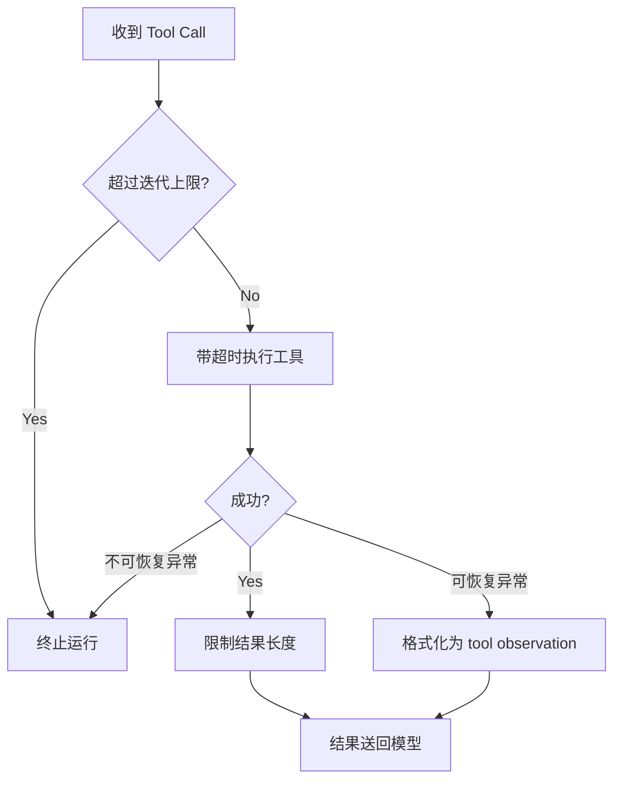

# 第 6 章：循环、超时、异常与结果保护

[上一章：Agent Harness](05-harness-react-state.md) | [下一章：AI Tool Router](07-tool-router.md)

## 本章起点与终点

| 项目 | 内容 |
|---|---|
| 起点 | Harness 可以循环调用工具，但没有资源边界 |
| 终点 | 迭代、超时、结果长度、异常、Memory 写入都有明确规则 |
| 自动化验收 | 52 tests |

## 6.1 `try/catch` 只解决其中一件事

工具异常处理确实需要 `try/catch`，但 Guardrails 处理的是五类不同风险：

| 风险 | 只靠 try/catch 能解决吗 | 对应规则 |
|---|---:|---|
| 模型一直请求工具 | 不能 | 迭代上限 |
| 工具永远不返回 | 不能 | 超时与取消 |
| 工具返回 10 MB 文本 | 不能 | 结果截断 |
| 参数错误 | 部分 | 可恢复错误观察 |
| 密钥或超长内容进入 Memory | 不能 | Memory 写入策略 |



## 6.2 配置边界

`agent.json` 新增：

```json
{
  "max_tool_iterations": 3,
  "max_tool_result_chars": 1200,
  "tool_timeout_seconds": 5,
  "max_memory_content_chars": 2000
}
```

这些值不是 Prompt 建议，而是 C# 强制执行的运行预算。

## 6.3 防止无限 Tool Loop

```csharp
public sealed class AgentToolIterationGuard
{
    private readonly int _maxToolIterations;

    public AgentToolIterationGuard(int maxToolIterations)
    {
        if (maxToolIterations <= 0)
        {
            throw new ArgumentOutOfRangeException(nameof(maxToolIterations));
        }

        _maxToolIterations = maxToolIterations;
    }

    public int UsedIterations { get; private set; }

    public void RecordToolIteration()
    {
        if (UsedIterations >= _maxToolIterations)
        {
            throw new InvalidOperationException(
                $"Tool iteration limit reached after {_maxToolIterations} iteration(s).");
        }

        UsedIterations++;
    }
}
```

一次 iteration 指一批模型返回的 Tool Calls。即使这一批有两个工具，也先视为模型的一次工具决策轮。

在 Runner 中，每次解析 Tool Calls 前调用：

```csharp
iterationGuard.RecordToolIteration();
```

上限为 3 时，允许三轮，第四轮在执行任何新工具前失败。

## 6.4 工具超时

```csharp
public sealed class AgentToolTimeoutRunner
{
    private readonly int _toolTimeoutSeconds;
    private readonly TimeSpan _timeout;

    public AgentToolTimeoutRunner(int toolTimeoutSeconds)
    {
        _toolTimeoutSeconds = toolTimeoutSeconds;
        _timeout = TimeSpan.FromSeconds(toolTimeoutSeconds);
    }

    public async Task<string> RunAsync(
        string toolName,
        Func<CancellationToken, Task<string>> runToolAsync)
    {
        using CancellationTokenSource timeout = new(_timeout);

        try
        {
            return await runToolAsync(timeout.Token).WaitAsync(timeout.Token);
        }
        catch (OperationCanceledException) when (timeout.IsCancellationRequested)
        {
            throw new TimeoutException(
                $"Tool '{toolName}' timed out after {_toolTimeoutSeconds} second(s).");
        }
    }
}
```

两层配合：

- 把 `CancellationToken` 传给工具，让合作型工具主动停止。
- `WaitAsync` 保证即使工具忽略 Token，Harness 也不会无限等。

底层任务可能仍在后台结束，因此有外部副作用的工具还需要幂等机制，第 8 章实现。

## 6.5 限制工具结果

```csharp
public string Limit(string result)
{
    if (result.Length <= _maxToolResultChars)
    {
        return result;
    }

    string keptContent = result[.._maxToolResultChars];
    return $"""
        {keptContent}

        [工具结果过长，已截断。原始长度：{result.Length} 字符，只保留前 {_maxToolResultChars} 字符。]
        """;
}
```

截断通知也送给模型，模型知道证据不完整，不会误以为这是工具完整输出。

字符数不是 Token 数，但实现简单、稳定，足以作为第一层防护。

## 6.6 可恢复异常变成 Observation

错误分类：

```csharp
public static bool IsRecoverable(Exception exception)
{
    return exception switch
    {
        AgentUnknownSkillException => false,
        TimeoutException => true,
        JsonException => true,
        ArgumentException => true,
        InvalidOperationException => true,
        FormatException => true,
        _ => false
    };
}
```

可恢复错误格式：

```csharp
public static string FormatRecoverableError(
    string toolName,
    Exception exception)
{
    return $"""
        [工具执行失败]
        工具名称：{toolName}
        错误类型：{exception.GetType().Name}
        错误信息：{exception.Message}

        你可以解释失败原因，或者修正参数后再次调用工具。
        """;
}
```

Runner 中：

```csharp
try
{
    result = await timeoutRunner.RunAsync(
        toolCall.FunctionName,
        token => _skillRegistry.ExecuteAsync(
            toolCall.FunctionName,
            argumentsJson,
            token));
}
catch (Exception exception)
    when (AgentToolErrorFormatter.IsRecoverable(exception))
{
    result = AgentToolErrorFormatter.FormatRecoverableError(
        toolCall.FunctionName,
        exception);
}
```

这确实使用了 `try/catch`，但关键不是“拿到异常”，而是把可信分类后的错误作为 Observation 放回循环。未知工具属于协议或路由错误，直接失败，不让模型靠猜测继续。

## 6.7 Memory 写入策略

```csharp
public bool ShouldWrite(string? content)
{
    if (string.IsNullOrWhiteSpace(content))
    {
        return false;
    }

    if (content.Length > _maxMemoryContentChars)
    {
        return false;
    }

    return !SensitiveMarkers.Any(marker =>
        content.Contains(marker, StringComparison.OrdinalIgnoreCase));
}
```

第一版拒绝包含这些标记的内容：

```text
api_key
password
token
"bearer "
sk-
```

它只是基础规则，不是完整 DLP 系统。重点是明确 Memory 写入需要策略，不能把所有输入原样永久保存。

## 6.8 Runner 中的执行顺序

```csharp
iterationGuard.RecordToolIteration();

string result;
try
{
    result = await timeoutRunner.RunAsync(...);
}
catch (Exception exception) when (IsRecoverable(exception))
{
    result = FormatRecoverableError(...);
}

string limitedResult = resultLimiter.Limit(result);
messages.Add(new ToolChatMessage(toolCall.Id, limitedResult));
```

顺序不能随便换：

1. 先扣迭代预算，避免失败重试绕过限制。
2. 再带超时执行。
3. 将可恢复错误转成结果。
4. 成功或错误文本都限制长度。
5. 最后送回模型。

## 6.9 哪些规则还没做

这一章之后仍然需要：

- 工具风险等级与人工审批。
- 每个 Tool Call 的唯一幂等键。
- Checkpoint 与恢复。
- 主模型请求超时、全局 Run Deadline。
- 并发数量限制。
- 网络重试只针对明确可重试错误。
- 敏感字段结构化脱敏。

后续章节会继续补其中关键部分。

## 6.10 运行与测试

```bash
dotnet test AgentLearning.sln
```

```text
Passed! - Failed: 0, Passed: 52, Skipped: 0, Total: 52
```

52 个测试覆盖正常边界和失败边界，例如：

```csharp
[Fact]
public void RecordToolIteration_Throws_after_limit()

[Fact]
public async Task RunAsync_Throws_timeout_for_slow_tool()

[Fact]
public void Limit_Adds_truncation_notice()

[Fact]
public void ShouldWrite_Rejects_sensitive_content()
```

<!-- BEGIN INLINE RUNTIME IMAGE -->
## 本章实际运行效果图

下图直接嵌入当前 Markdown，不依赖外部图片文件；如果阅读器不显示 Data URI，请以图后的纯文本运行结果为准。

<img alt="第 6 章实际运行效果" src="data:image/png;base64,iVBORw0KGgoAAAANSUhEUgAABQAAAALQCAIAAABAH0oBAAAQAElEQVR4nOzdBUDb6hoG4ODuNmQMGDC2MWXu7u7K3N3O3N3d3d3d3d2YwBiyMWQMd7tfG5aFtpQWyra7vs/lctIkTZM0ZX3z/fmj/iMqlgEAAAAAAAD416kyAAAAAAAAAEoAARgAAAAAAACUAgIwAAAAAAAAKAUEYAAAAAAAAFAKCMAAAAAAAACgFBCAAQAAAAAAQCkgAAMAAAAAAIBSQAAGAAAAAAAApYAADAAAAAAAAEoBARgAAAAAAACUAgIwAAAAAAAAKAUEYAAAAAAAAFAKCMAAAAAAAACgFBCAAQAAAAAAQCkgAAMAAAAAAIBSQAAGAAAAAAAApYAADAAAAAAAAEoBARgAAAAAAACUAgIwAAAAAAAAKAUEYAAAAAAAAFAKCMAAAAAAAACgFBCAAQAAAAAAQCkgAAMAAAAAAIBSQAAGAAAAAAAApYAADAAAAAAAAEoBARgAAAAAAACUAgIwAAAAAAAAKAUEYAAAAAAAAFAKCMAAAAAAAACgFBCAAQAAAAAAQCkgAAMAAAAAAIBSQAAGAAAAAAAApYAADAAAAAAAAEoBARgAAAAAAACUAgIwAAAAAAAAKAUEYAAAAAAAAFAKCMAAAAAAAACgFBCAAQAAAAAAQCkgAAMAAAAAAIBSQAAGAAAAAAAApYAADAAAAAAAAEoBARgAAAAAAACUAgIw/EmJScnMH5KRkSHXeMVKSk6mHwYAAAAAAH4jdQZ+r0+f/dds2e1a2HFQ767cyCOnzt+896hTm2ZVK3jwZ46OiT1z8VqOy3QsVLBy+TI0EBEV/ebtB8nzOBS0synADj98+nLrnkNVKpTt2bmt+JyPn786fPJ8Wlra0tmTJC4q/EdEWHgEDfj4+p04d5leumrFcvTQ0sLMP/Dr+m17G9Wp0aZ5Q0aq0O/hsxatSk5JXbd4prq6TMdhbFzc/ScvxMerqqjWrVGZkdPlG3ePn71Yu1rlDq2acCNfvX1P7052e0ZRlq/b9vaDd4vGdVs0qscAAAAAAMDv8lcE4NTUVB/fAF9/f+sCVs6O9gb6+uLzfA0KSc9It7W2UlVV/fI1OIPJsLUpoKqiInGBcXHxEZHRId+/21hbWVtaMH+T2Lj4mNi478IAyQn7/iMhITFZrCRIke/a7fs5LrN0RCQbgD/6fN558JjEeVo1qa/CqERERRUqaJOSkpKenk7pmsYnJCYGfv3GnzM+IeFHRCQjzMkmxob8SUaGBlYW5tfvPLhw9RY38v7j5/RDA22bN/rsH0hLfvD0xbfQUHaqvZ1N84Z16S2+cO2WyCqx5d89h0+am5nwxxcp7OhS2HH3wRO3Hzzmj69bs8rl63cYSeQNwMkpKacvXk1JSb1y8+7Dp5mhmmL8e+9PtP53Hjy59+gZN3N/z07lypSQuBzahy/fvk9OTnFyKGhva6OmJrlJxdK1WwK+/NrJtM/p95mL16/ezPLmDunbjc6MMAAAAAAAkD/+cACOj0/YsH2f10cf/khXZ6dBvTrzY3BiYtL0hStoYM2imTQ8Y9FKGt6wdLZqNpXDQyfPUaxhh1fOm6qnp8v8FlTIpcJpQVsbKiFmNw/VPOm3hkaWNWdbw6qpqvFHUhLzC/har1ZV/siHT15Qfi5ftiRlUW6kvp5u0LcQSvtUg6VJSUnJVMmk8SWKuWlraURGxxobGVDuPXXhytOXb4b07c5fIKXfRas2SVzVzbsOiIyht+a/Yf08SpdISkpKT2e+hYZ99PG1KWDp4uSoqso42NsdP3uJZqP8zEZoEhkZTQGYtvrE2csSX4XSpsiY+rWqUgBOTkmmPZBlh6SlMcJdV7pEscxRGRmPn79m5Ldl10E648AId3JUdAw78vKN2ynCd4dOsrAvra2lKXgoKdb+iIxasX5bUHAoN8bUxHh4/x5cmZ0vPj6RQi+3OapCNBAXH8+Nod9JSWgUDQAAAACQj/5kAKYIMX/5+ojIKBo2MTZysLcN/R5OlV7KVP/NWLhw+nhDg8wMHPDlK/2mOiEFktdeH9jh7NrNUsx49Owl9/Dxi1e1qlZifgu2LlrUtbDUACwIOSIBmE3FWlpaIiO37T0scSGPn70SGRMVFdO1fUtHe7sBPTofOnGOAnAhO9tBvbssXLExJCxsUK9xtDPvPHjKZIMCGMVXJnvRMTFc1ZpeZe7StdwkCoFsDnzv7Us7X09Xd8qYISHfwykfOjnYjxjQg/8q7Vo0YoRvvamxkWBUBkNFaTU1dUMDPXrk9cHnzbuP7My9u7bv1aXd1j2HqBDdsXUzqvF+/RZy9dZ9c1OTbu1aHj51noJ3g9rVHz+fyMgpKDjkxZt3NDB+eP8v34L3Hj5FZxMWTv9v3vL1AV+CWjWtX7NKBToCKQwP7t29mJuz+BIio2JmL15NZyJoi0q5u9EmUxmZMv+sxauXzp4o0oQhKiZ2QK/OjKDpeCSVgukpMyeOVBMm3kdPX544d5mK6iMG9mRnTk1LU1dTYwAAAAAAIB/8yQB89NQFNv1W9Cjdz7MjO/LyzbsHj52h7HHr3qNmDes8ePLiwZPnbCiiALZiw3b+cO1qlUq5FxVZ7Nv33mwdz862wJevwbfvPeEHYCr3nbt8/dkrr+TklDIli9FL7z54nMZ3atOsZHE3GoiJjT17+cbbdx9DwsIdCtqWdHdrUr8229Z64apNUVHRzk6FShQrcvrC1eDQ76YmRpTNypQo9vy11+ET59iX+ODzedLsJVUreTStX1t8q9kqn66ODn9korBNrK6Olvj8lPnLlSkZESHYUVpamhSi/L98rV2tYmjYD3YGfX09rhEvoVLwpeu3aaBH5zaaGhomxoY0/5otuyeNGsRkz7qAxehBvZNTUrKbwdvXb/22vfwxlD8pM9979Ky0e9Ho2Dhfv4BvIWGMsKp5+cYd2o003KJxPQqH3FNo/Smy3rz38MqNu7S32zVvZG5uOnjsNB0d7dULptMMKqqqXABWEaL/MoLkTFNUVZjMFu+JSclUN2YDMCM/mwJWi2dNXLZuy4MnL9kur7S1tPYdOW1vZxMaRkdW5ImzVyjE0ibcffS0oF0B8Tb5Zy9do/RLA0P6dGOPQDoU2Tbe/oFB7kVd+TNv33uY2yhGeIJm6txl/BlCwr7TAcMOz/hvBB23DAAAAAAA5IM/GYA/+wcywqqgZ6fW3Mi61Ss/fvoyITHxa3AIPbz/5PlbXnh4k3W4RpUK4otlGz+bmhjXr1Vt+94jFP8o9LINhtPS0pet30pFZnZOClHPX3mxzVDZC2IpAS5evZlr1+rrH0g/oWHhVI2kh4FfvlL0olood4EopaW1W3avXTwzOjqGytfsSEo4NBz2/QcjSbiwbbCxUZZraynW0u8vQSElirmJzE/V0bS0NPaq0ZS0NF1dbRowMNCnoMXOYGJi9GufvPfevFPQbpkqzAeOnxWmOUFypnR64+4DievDNsfV0tCk4uTngC9MNjq0akqzcYVrGuYKv2w1lfTz7KSpqbFp5372umWq6ru7ubCTdLS1Rg/uo64uqG0aG1I1Wo9q1PTTpV0L/qt4lHS3trK0NDdl8pmRgX54eAR3JFAEpR92+Pa9Xxce05mF5o3qiAdg/y+CnU/HGJ0Koa2gMrJtAaseHdtoa0s4hVGzakXXwg6h33+ItOgWQScy9HV1jIz0GQAAAAAAyB9/LACzKZEGrCzMtDQ1ufGUrCaNHsw9rFbRo7ir86GTguJq1/YtKCNs3LGPhj1KuRd2sKdcIbLYlNTUZ6/eCmcoXqp4Zph88Ph5w7o1aODqrXts5qGSY4Pa1YJDvvNrp4ygKH2eDXV1a1QpX6bExeu3KSFT3C1TsniZn9edUgZ2tLejut/1Ow/Yy0ep5lzczbVv945bdh+kh5bmZlT5tLGyZCQJCxNsNT8Ap2dksCH88fNXjevV5MZT7XfG+BEqqiobtu39/iOz+bGJkSDufvINCAzK7FSpepUKdapVNjDUF473ZxdFNfCPPr6UM12dnShW0T45fuaym4uT+Po4OxbatHwuDew9fDIt+4RG+5P2GPdwaN/uJ85dDviSGcKdHOwb1a1RqnjRD96+Fmam7D6kGjuV8SuVL0OFaKrlFiviHJ+QOG76grIli9F2PXr26ta9h/a21oK3Q1ubXQ5V1E1/5nla5537j7HJ/8ip86fOX+3XoxOjOJPHDElP+3XHo+ev39IWFXN1ppI+O2b+inXZ3aXpW4hgA83NTKfOW84lZ0IhnzZTZGY6cuin/6jJ0gNwyyb1mkhqMgAAAAAAAIryxwJwyM96qZWFuZTZypcpmZiYRAGYImvtapVpmB3fz7OjxGuAX7z2YmMGRVZ9PT2bApYUxu48fMIGYB9fP3a2cUP72dvZMIIcnsbvRenNO29G2Li3c9vmjOD2QvZDx0+nMPn+ow8XgCmijxven0JdEWfHhcLuo16+eVe2ZHFzMxM2AJuZGlcqVzq7LQoNF2w4hefa1SqxBUO2eTMjuNQ5KDYujlabm5ntUal1s4bBoWGXr9+JiY1jzxq8/SBYTyotOjkULOrqnHk9LZ0vqFTOxtqSKpPmpiaUGAO/Bnl2bFXA0uLIqQv1albdf/SU+PrQ7qKkygj7cGakop2vpq6moa6+Y/9RtucqOhFARWMK/FRhXrd1TyE7W3/h1dp6uro21lbenz7vOnj85PkrS2ZNFDZmFlTU6ZTB1Vv3r9952LR+7dmTRl+/I6gVFypoI/5yVPfm+oiit0D4k9lCm72OWlUth7tY+3z2P3bmUpHCjpQtGTHHzlzkNyhISxMcNl4ffeYsW8OOYRvSi0tKTmY70KJTDIywZ2zah2yL6BUbts+dPMYi+wp23RqVVcUu8X330efL12AGAAAAAADy2R8LwGwlk0RERmc3T0xs7Hvvz+8/fqLhjPR0ylqUqdhJz1+/MzU2LOxYSOQpd352/kwxleIWhRMKwN9CwsK+/6BYEvBVULHU0FBn0y8jzMlcAKYIxFbz6Cl9R2TpWsnHN4Abti5gQemXEZQ9M1+djUOyoOwU9E1QPPwREblmy64xQ/pSMnzH6wT7+Uuv6lXKcw+pAvnG68PDZy+oEM0Iu/4yMTZu3rDO/cfP7j9+fvPuQ5/PfnGx8bQVbOii7K2nq5MuvK714ydf4YaHGxoYNKlfS1dHW+IqPX/tJXJxrxQmxkaLZ06g8vvngEDPDq1/REYdOHamdo3KBW2s33t/KuxQ8PzV27WqVijqWpi2K+hbyInzV2tXq6jy825V7m4uy+ZMolr0zXsP2TEfvAVvaEFbCQGYzn3Qz+ZdB6lKT+cjqCbPpcRQYRXd0sxM+truOXyCnkIxlYr5FMhFpr774EMRl4rk7JmUBHoXk5LpsOGfgGDEeiZjBMePBjfcqkn9Zg3r0MCB42eu3LhLSfiV13ta1WzWiKHwzwAAAAAAwB/yxwKwtpYmpVOqB1JGE5lEgSc+IYFyCAWSnfuPsiNpmN/z8MYd+yqXLyMSgKlEGoFXTAAAEABJREFUyV0wvGDFBv6ke4+eURmQDa5srY/FFj9ZKam/Kn7cTYbY64f1eTdSUlfN3GlqOVUgxbEFakrg5L2376ETZzu2bnbr3iP2Fem1Hj1/yQVgql6eu3ydHabo27RBHWtL80WrNy9bt7Vjm2Z1alQ5euq8YCEnz9EPRdMZ/w3X09OdPHcpd18fsnLjTnZg/dLZEldJR1ubKsbcQ/b2RbQ0Sq2RUdFsr85aWplt1AsIy/UlihW59+jp/J97+OCxM/wFsnVRTvcOLRnhnZknzF7MH3/5xu0rt+6y5w7OXLx2+cavG/xWKV+mc9sWTPbYJtYWFjkEYFNjYzYzGxjoiUyKjollmzdzVybTeZBT56+4F3Vt37Ixf84MsXbLqioqdECwJd9GwpYFhM5KUACmAe9PflICsMQKMJ3jYPsPAwAAAACAfPUnO8EqVND21dv3lEOoLEbBgB35JSiYin6MoDZbrFgRZ2srCy4biAy7Fy0issAnL7K9Jeydh08oADvY21F2olD39OUbKmNSpZSKqNw8XCZn73bL5FZqWraXerIth2tULl+2lPvi1Zsv37hrZGDgK+wMbMzgPrOXrnn38VPAlyC2QF25QhlavbKli7995x0bG3fw2GlG2GKZEWbOzFvUCm4s1JhmK1m8CHu7Y0d7O3YvsdVs2iJtYQ2TK8OKoJ28aMZ4dphi4egpc2mZVOalh/OWr/f1CxjQo7P4rYCKubrQEqn4rKqmqiOsLT998YbWrWRxNy4ts9j+rtPS0/k3uaWXSE5J5V8Ty58qvgN9/QJ9Pu8vUbTIiAE9qZS9Q3ha5OLVW1TFHT2oT1p6GiNJP8+OT569dixUULwXK3afk5mLVvHHs11z8ccUsrOdOm6oyNMtzM3YAJyQmMguPDYus7U2v08ycagAAwAAAAD8QX8yANeoUoENGwePn0lISKDsFBwatuvAMXZq9UrlaUztapXHTJ1HoXTiyIFU7x00dmpKSurkMUMcJd20lo2XZMW8KVxD1s27Djx8+jIiMiroW0iZksXZDpzXb9vr5uL0/UcEd29bVmEH+2ev3lIN8/lrrzIlilH9cPmGbUlJSZRYu7ZvyeSEch2FOr+AQO9Pn20KWOnx6sbka1DIO2Fz7mqVyhe0taY64b3Hz9ireSnP21hb1apW6fL1Oxu275szeTQtytrSYuX8qTR1/9HTFET5i0pOTWF786LibYPa1bJ0T9XPkx2YvnAFzTOwZ2eXwo4/V09F+vo/eCLoEqygjbXEqSfOXaZqcPVK5bS1tahMTT/9R03W1FBfs2gmTR31cQ5lQgrqKbx7KQ3q1VVXVxCAqYjOdrXFSkpO3nPoxP3Hz9md1rhuzYZ1a4g00qad7/XB+6Ow0TvbV5mbsxMVnz/4+HLnQVJTUymcR0bF0ID4NeFU3Oa3J+fT19Vhb6GUlpZ2/c4DLorT/ixXugQ7TK/y2uu9lqSOnRvXq7l2y24aWLtlz8BeXdPT09Zvz2xGXtzNVWRm9k5L7Vs2SUhMYMeEhIbTFtEpjAZ1ft3GqairM82Z3XkKAAAAAADIuz8ZgEu7F23drMHxM5coflC4oh9uUjFXZ/ZmqomJSWyDXjtbaxpg+yUqaCshocXGxfl89meEXVjxL+OkWisFYEZ4eXCHVk1qVqnIXoD63lvQUtfJwZ6fLTu0akqhi4rSFG/YNMuOr1yhLCMDKwszSk20kgtXbapWqVzPzm25SZTQVm7awQgbM7Pr375VE1trq13CuxDXrSloNFuvRlUKwKHfwy9cvcnvELhz2+aBX78tWbOFwp5HSXcVVZVdB46zO7CvZw4dI1Pt9HPA10+f/Yu4OPXr0blP945qqqp3f14pzUdR88ip8zRQu3ol/vh0JrOr5Gcv31D9nF5U4s1+0tMFs3GVVVZiUhIbgH/NlpHh9d57655DbAW1eBGXd96fzl6+fv7qzfq1qzWpV5O7b/DF67fYhExBkd7ECh6li7oUpuUvXbuVyfrGnb107ea9RyMH9hLvgTk7zk4ODoUKvnjldejkOXqX6b32KO3++NmrIs6OdJCw8xw7fZECsH7W9WfRyRH2LtN0yI2dNo8bT+dl3JwdRWYeNn6GxN6kaeSp81e5h+xw57YtuNYQAAAAAACgWH8yAJOm9WtTCe7Og6fspaeMsIcqKoR2aNmELYV9Ed7sx8TYSEtT86OPoBhoaW6mLnYVJcNr/0xhiT+eIhY7cP/xM8o2XTu0rFyhzIvXXsnJKSXdi1IuXbN5FyOsQzLCdDp+xMDt+44EfAli0y+9dI/ObZ0KFaRhFeE8Uuqofbt33HngGHtzILWsK0lVbnYbqSjKjomNjd8vbNVMC6dYzgi7sGpUt8aFq7eOnblUvkwpfmfCr7zeJyQmUkKjH3ZMUdfCQ/p2FykYUoh99+GT8C7E4d+CBWXSw8JMywjvMJSYkPjJz5/25CPhGQFV4XNpM70++Ny+//jpyzf00NbGqmpFD/YpOsK208dPX4yLo7puanDod+FyjEMFC8+8VXJySupL4X2A09IE5yZ6dGpDxV5ufSi307PYXEq7hUr09x49ZdMg7djh/XvQuQA6c3Hh6u1L129fvHqL8n/tapWaNaxtoK9fsVwZqglXKFuKsq7wguSY3YeOs0V+OsdBb+WCFRto4VS1fvHmHW2FpqYGI5u4uPgjZy48ePycPZ9CSxvYs4tf4Fd239599HT73iPczIUd7CUuZMKIQTv3H+F3IV6yuNug3l3FC9EuhZ2iorP09BafkPA9PIIOObaXbz5TqS2oAQAAAAAgL1R+RMUyf4GY2Fj/L9+szM2k3EIm7yiuPHwiKCo2bViHinWUmlZt2sneC2fBtP8o/XJzpqalhYZ9NzY01JVUAMxRWlq6SBdZew+fuH7nYdvmjbg7/VIgnLV4NZU3508bx12kSoF83PQFVDidM2kM5WH+Eig3Pnn+6ta9R1yVlTIkrTb/hU5fvHry3BXuoZGhgZ11ATs764I21q6FHWitJvJ6oqIM2aB2daq+UhGeHVO+TImeXdpxt2W+euve/qOn+etgbWUxe9LoUxeunjp/hZHZlpXzw39Ejp+5kH1ooK9Xq2qlJg1qafCyYnx8AhVj2Xzr7FhowsiBIgv5b8ZC9gxCzaoVaTdqaqgPHjedK9FTmFw1f5rE0rQ4etaEWYtpabR/WtAphyoVKGDfe/Rs297DlcuXad20wfSFKzPS6R1Up7MMVMaXslg6K0Ehn052FCpoK/G8jERUN6b0bmVhPnfKGAYAAAAAAH6XvyUA/x5fg0Omz1/BDlPc/RERxSYoKnvOHD+SyU/pGRkXrtzgN2xmhJe2mhgZujo78UdSFZcCVXaFRxIRFX33wZOb9x5Vq1hO5A6330JCHzx+YWdrbWttaWVhId5PNWU8tuNrl8IOVSt4ULSjyD1n2VrHQgXrVqtiZ5ulIEmB+fmrtx98PglbNzO0qlUrlaPfPr5+7A2TZaGqpkohkxH2WfUtNKx65fJSNi0gMIhK6H26t7cpIHbXoo+fzl2+3rV9ywKWFuyYoOAQqlonJaXo6GiVcS8mfqMjKfwDv9JuLFXcjSuhv/b6cODYmaqVPJrUq8Xks+DQsP1HTttYW3Zs3YwBAAAAAIDfRbkCMPF677N17yHuRkEaGuoVypaiWKWpIWsDWgAAAAAAAPh/pHQBmBUfL7gI09DQwNjIgAEAAAAAAAAloKQBGAAAAAAAAJSNKgMAAAAAAACgBBCAAQAAAAAAQCkgAAMAAAAAAIBSQAAGAAAAAAAApYAADAAAAAAAAEoBARgAAAAAAACUAgIwAAAAAAAAKAUEYAAAAAAAAFAKCMAAAAAAAACgFBCAAQAAAAAAQCkgAAMAAAAAAIBSQAAGAAAAAAAApYAADAAAAAAAAEoBARgAAAAAAACUAgIwAAAAAAAAKAUEYAAAAAAAAFAKCMAAAAAAAACgFBCAAQAAAAAAQCmoMwD/ny5cunrn/oOPH31ev/W6dv6UtbUV8ze5ePlaQTvbYkWLMPnJ692H+w8ftW7ZzNTEhFGosxcu3X/w6KP3J18/vxMH99jZ2UqcbfCIsZFR0cXcXMqULtW0UQMGAAAAAOAvhgAM/69Cw8KOHj/FDl+6eq1Ht86yP/fUmfObtu3IbqqauvrJQ3vff/COiIhkZKCtrUnxjz9my/ZdS1eupYF1K5fUrlmdPykpOfnGzTupqakyLJjR0tKsV6dWdlPjExLGTJji5x+wZMWaHt07DxvYX09P98vXoPi4eEY2BoYG1gUknziIjo4+euI0O3zy7PkhA/qKz5ORkfHoydO4uPjnL14GBH6VJQDT5nfvNSA+QdY1lOjMsYMMAAAAAID8EID/cRSHVFVUbWwKMP9voqKi/QIDpczg6FCIGz526kzp0iWlzKzCqBRxddbS1GQfBgR+ocomI9XkGbOpvsrIwKGQ/fmTh7mHB48cY9MvIyyQTp4wtlun9tzU2NjYkeMmMrKxsrKUEoBXrdtI6ZcdPnP2wvDBA2hg/uLl127cYmRjZ2t7+ewxiZPatmq5bee+L1+/0vD+g0cG9Ompri765yI4JDTuZ9guXqwoI4OU5BSq2DMAAAAAAH/C3xWA09PTX3u9Cwr6FhIcGv4jQt9Az8Lc3MmxUInixdTU1Jj/fxRXkpKS2GFtbe1C9gWZfEM1xqGj/rt5+y4NU4hauWS+qqrgku/QsO8RERHcbM6Fnf7Offv85atBw8fIOPPHjz6duvWWPs+ebRs9ypZm8l+dWjUPHT3Bhee5C5YkJiT07eXJKNTjp8927t7PPaSYraujw8gpJTWFG6ZzJd16D+BPDQkJZQfow1irQTN1DQ1uUrmypZfMn/35sz83xtWlMAMAAAAA8Hf7WwIwlfsOHzux58Bh7js3n5mpSfcuHSlC/L/H4J79h3AbSMW9GxdPM/nmxq07bPolV67dePDwSZXKFWh4zfrNtKu52S6fPW5na8MosUH9+rAD6zdvZQfohAsjD00tTf5DC3OzXVs2jJkwhdv/VBDW0NBgG2lraWrR8Zz48zyIdDra2hLH+wcEjho3iXtYpVKFRvXrMnmTlpYm8dPHogzMf+j9yZd+v377lhujraVFayXyLFUVlYIF7bJZpGC127dpxR+zYOkKdh1oF02ZMI4/6cTps9z+BAAAAADInb8iAFOtbPDIsdK/fK9Ys+Hx0xeL5s1QeGc//6ovX4L4DyOiZLqcVQkNH9KfEV6bumvffrZBb4e2Len3+lXLUlJSZFmCvp6eyBg9Pd01yxdNnTnvxOmz7JgFS1bUr1PbxqaAvr7enWsXmDx4+eZtnwFDubbHdCZl0byZKioq7MORQwe1bNZYxkVpZxOwZXT73gNuePCIsRLnOXFoTxFXF4mTynmUbtQgS27fvH0n+3eANkpk0ss3bxCAAQAAACCP/nwAvv/gce+BQ2WZ8+79B206ea5etlDeAp1yatqk4cJlK7mHVStXZExCN4MAABAASURBVPKTt4/v9l174uITPMqU6tKxnfj1onmxdf3qIq7O7HBwSCilI5WsM6Slp2dkZNCAKlH5NfHVm7fZBTMR9x884iJlg3p16LelhTmTB7QHZk+fFBUdff3mbXq4fNE8hVyJTYV9kZbh61YsMTM15R66ODvRDyM/Suae2XckFhoSqm9goKub2cra0twsNjbu6bMXTE5SUrLt7mvrjj237z7kj+HajdNAl579+ZMCAgIYAAAAAIC8+cMBOCIyctykqeLjKeJSyAkN+/7q9Rv+eKoO9eo/5Oq5k0ZGhgxIZWFudv7k4TPnLjIqTIumjY2NjJh8k56eTjmT7TDp0pVr9FotZC5CysLczNTMTJDxKGa369KDDo/RI4ZWquDBzTBq3KQLl6/SQPWqlTetXcGNNzL8dZyoqKhIeYkz5y+yA61bNDU0VMzRRRl4yYLZw0b916l9m/p1azN5dv7SldH/TeaP2b5xbbGiRU6fvVCyRPE8XlJOKXri2JHs8PgpM8LDIwb168VeNR0Q+MWz7yA7W5t1KxZzO+fWnXtM3rDdR2c3VcokAAAAAIDc+cMBeMGSFSLXFlLx7b/Rw21trNmH4T9+rF63+eCRXx3V0pfmdZu3cd/UQQqHQvZDB/Vj8t/LV6/Z9Ms6dOyEYgMwi2qJE6bOYASXnnr16j+4auVKI4cOdC+epfPhqOiY7J7Ologl+hERcfb8JXa4dctmjOLo6uhs3bCaHU5OTrl87XpSUjIjv/p1ahkY6H/7FswfuW/HpjKlS1Eq/m/ydHrYtHGDAX165a78y/fi1etTZ84zwjYXVBPu7dm1S4++9Dml00/d+w7auXkdezLl1Nnz3FNmT5/MtgM/fOzEvQePGGEj8DnTp9BAwWxuIAwAAAAA8Pv9yQBM4Zb9ns2hWtaCOdP5Hf9QVWrKhDGf/fwePXnGjTx6/OS4kUPZRrZ7Dhzmopeuti57PSeHgs2mbTu5hxXLeYjflPXuvQcfvX3ef/R+6/VBS0ujpHtxtyKuxYu6ifQY/C04ZOfeX53u1qhSpWhR1w1bdty9dz8yMqpvT8+enl3YSZTTLl29du7CZd/PfgmJibSo8mXLdOrYVltLi5FE9iWT7+E/Hj568uGjN63wR59PNtbWxdxciri6li1TsrCjI3+xb96+O3PhIvewdfOm2V2KyZeamkqVvQ/e3h8++tCPmppqieK0Ba70U96jbHbPMsl6YbaVhQWTZ5YWFq2aN2WHDQwMGMGOCo6PT+BmoHhGP43q1x05bFB2C7Gzs6WKLpt8TUyNs5vt5KlzmfPb2nqUKb14+WrZ7yTEGdivV8tmTaTMkJCQMHbCVCZXPMqUogBcvVoVWjd2PdcsX0hvaEho2NSZc9l5KMMXsLKi2Rg50X62svz1li1ZsYYbrl61Ei3Q1taWPVH18aPPgKGjt29ak5yczJ0yoI9tu9Yt2OEnz56xAbhUCXeRi3jF0XvXuGE9/phJ02ezDdGtrCwnjRvFn3Ts5BlcAwwAAAAAefQnA/C161kyBpWMVi9dJN7tLQXdRfNmNW3dgbtEkwbeffjIXgl8/ORp/s1aRQIwfWvn3yqGghA/APsHBI4eP1nkXq/C28MKOi5q36bVpPGjudQaGhbGXxTVu7bt2ksBjH34LTSzB6+w7+F9Bw+nnMDNSXUzSlMHjx5fu3IxI4mMSyZ37j8YOXYitx/YhXMtRWdOmdChXWtuEsVj/mIpkOQYgAMDv4yfOkuk6SntELYnJ4pJ0yb/J7FfYio1N6xf5+Lla+zD7l07MnlGsWr+7Gn8MfYF7c4cO3Dl2s11m7dye/jC5asiIYrP0sJ83qxpjFSU+XfuO8AOd2zXSlVVNSQ0lLu/ruyioqLZgXv3H30PDxeZ6lzYiWvXkGsuhZ0o+roVcZk7Y7KhoSHVtCn9cscDlcRpe+cvXs7IqWqlilwAvnr9Jndlb6UKHtUqV6KBDauXdunRj90nr16/Gf3f5EoVynNPj46O5YYDAjPPRjnx7tKcHVfXwuzl1pyNW3ewn0czUxORSc9fvUYABgAAAIA8+pMB+PqtO/yHndq3za6XIPp2fuHU0bi4OG6MdYG89if07PnLrr36S5nh8LET7z983LxupcTrjS9cuiKMyllQvdezz0CJ2YlGjvpvcmxsLJMTiUsmu/YekJ5tps9Z8Nrr/expE5lc8fbxbdGus5QZKAZ/9PHZsWktW48VsWLx/NdvvT5/9qdTDLkoQkoXEPhl1H+TunRs37JZY0ra9erU3H/42NwFSxjBTXdrUFLate8gO6eRoYG8C79z7wHXA3mzJo2YPPtv8jSRhv1kcP8+vXt0Y/Js/eqlhR0d2OuZDx89cfvufW7SzKkTrgk73Mo1qiePnzKDezhmxDB2wMTYeMv6VR279WK3i4IoP4t++fr1/QdviuU0/Nkv8+B3cHDI8eW27thz7MRZ/hiuNQfF4PpN20icBAAAAACQa38yAAcEZrlrqPRrF83NTM3NTBnF2bJjd47zUKLbve+gxMtoJWZUmllK5ZBfFpZC4pITk5JWrdvI5OTIsRON69dl7/crr3Ubt/AfUgmuUsXyQd9C+AVhiiXXb97J7vpeqsnnRwfdaWlpk6bPppeeMmPOlu27RgwZ2KBe7W6d2teoWnn5qnUThA1l/fz82ZldXZwZOZ27eJkb1tAQfCIqV6xgItZn2Gf/QK4sT7VWx0KiPU55lCnNSKWnp/vm6T3+pcj3Hz7uPyTzavZJ48d0bt8mu+dyvWo7O2U2dL924xad8uBmmDllQh4rzCkpqXSOhqsnN2/aiH99NS1864bV7DmjiuXLiTQRv3z1OgVgOkq5mFqokF2Or0ivxW/OIAKJFwAAAAAU7k8G4OCsN/4VuYSVckJScrbdBWmoq6upqTG5FRr2/TqvVlayhPuc6ZOdCzvSKm3fuWf3/kPcpAuXr0jpR8qza6fSpUpoamhQiYxy2qatO/hTKfD06+VZoVxZX7+AfQcPi7S1lo6/ZHp46/ZdflSgavmAvj0LWFl++Og9b9Ey/gXSN+/czV0Avn3vVy2R0u+Z4wfZvo6o+tqweVtu0oXLV/Ojgyspbt25xzXKFRbSJxUrWmTU8MHVKldavngeIyy8cxVXJ0cHRk6NG9Q7fTbzxry79hygJbdt1ZwCoMhs5y9d4QLw6OGDaR2yWyBVyCkKssMiAU/koN39s3BNh0qrZk0o5aampj59/vLK1evqmhrjR4/I7iX2HjgyZ8GvFvV0jLVrI7h3MUVo7nJcEVThpxIuOzxx3Kj2bVtxk7Q0Nen3ijXruZMddABM5F2C6+vnN2XGvK6d2m1eu0JLS9uz70CRhZ86e2HY4P6PHj/lxhS0Rd9XAAAAAPDX+WMBmMKtSDZwzHrR4JNnzz37ZNu5EaWU/r17MLn15ctXygzcw5lTJzoUsmcELauthgzsxw/AEuuxrFVLF/DvbUPlYpEtWjxvFnvJcZnSpWrVqNqyXRfxlrGyLJkR9H0Vzq2woaHh+LEj2IuTi7i69OvTgx+Av3wNYuSXnp7OX3ljYyM9XT122L6g3bRJ427fzcx+xr/9BlS0D3dv3SDoFexn/qRTCf0GjZg7c2obYY/NdBaAm9nJMedLT8WXTxVdduGbtu2kUw9mP9sa7D90xMrSsnixovw+olj+AYGXrlw/eeZsy2ZN+/X25E86f/IwN9y2s2d2Jz4+fvThGjB3bt+ObTd+7sJlrhEyRVmRs0KMsB6+bNW6bTv38EeWK1tGVVWVERaKs7sDs7Yw5bKo0C1+LbeW5q9O2hbPm331+i0qArPZ+PiJs5SN6YeC8ckj+wb16812lGVlZcm2HmdbQV+6ep1bQnblaB0d7X07NjHZ6DdkJHsc0udx3swpDAAAAACAQv2xAKwh9jU9JTWF/zAtLUPK0zPS05k8KFum1M4t60VGxick0JfvmNgYWZZABUCRjEoBgP+wQb06/A63zExNp078b+S4nC/QFV8y6dKxPf3wx1CFnNY2Ni7OKOtNa1NSUhj5UXzyKFuaK7RS7O/k2bt9m5YeZco4Oth37tCOfpg/p5xHmS0eZV68ej1lxhz2lISdrS3XyfCNm78uJncsJHcAJnRCoUXbzHS9c8/+0SOGMMIuwWbNy6yyUtim5MZ/yvzFy9nrYM9cuCgSgGW0afuv/sm7dMzcvfXr1V60bCV7omTT1p0L58zgP4Vq3ZOmzmLveKxww4f0L+9RZtykqZ07tjt78dLR46eOnTyzetkCfX39/YePsPNQcZuO5N49ulGq93r/4cCurXWbtGQj69nzly5cusLORge/eA7nGnQUK1Y0u3WwtbVhrxTQ1NKUMhu3KC1eqgcAAAAAyNEfC8CUuCjp8YtjQUHBxmIXXuarHxERN27dffj4ycPHT0OytsfOUUl3d5ExEZGR/IfuYl/fRe5YK/uSOb5+frfv3Ke1ffX6jYzFZNnVql6VC8CMsMo6c+4idrhSBY86tWs1qFtbvBCaf5KTUxITE/hjnBwK7dy8ftP2Xbv27B8/ZnhqSkq0MO1fvJLZ+7Senq6KChMdHS1xgRTe2L6jxLkUdmrXptWRYydoeN+hI6OGD6Y5+W3CPcqUorzHf0q9OrXYAEyB7WvQN3mvv6Xdy91GqFXzptbWVuwwFWb79e6xYMkKGj515vyAvj2deL1JPXz0JJ/SL6typfIXTx/bve8ApV96SCXftp17tGnRnGsd0LmDoDE87ZzZ0ycHh4YYGRm2bd2S3g5GcFH9Lm45wjbkWdD5mtIVqjMyo70qy/xezx9k954CAAAAAIj7k9cAF3Zy5AfgL1+/8q+rNDM14VdQP/v58/uXsrKyZPLm3v1HEnvrlZGZmYnIGO4uOCwHsU6SbKxl6rlafMmMsIny7n0H2VyUT3p5dvULCGSTj4gHj57Sz7yFSzu2azNlwhiJjWxTU1PvPXiUkJBYzM21YMGcO0DK0eWr18dOzPauucNGjxcfSTmtYo362T1lyYLZTRs1yG4qhXw2ANNC6ERDYUfHazcyC8sOhewL2RcUCcC1a1Tjhm/fvdepfVtGHktX/rrX7rBBWXojb9e65er1m9jMuXHLDn4RmN/PVqP6dfMjDNNJBLcirtxDOjG0fvNW7iG3A3V1ddhk3rZFMzYAc+iTW6VSbq5CBwAAAADIb6rMn+PoYM9/eCRr9HJxdlq3cgn30yBrq2BHB9laumbTjPrajVt9Bg1TbBHVwsyM/zAyMkpkhtjYOCa3Fq9Yna/plxH2zzRzyoRFc2dKSS8HjxwbN1HybXUprA4YOmrkuIkNmrd9/daL+fskJiZJmcqv2D9/8TomJoa75Lhe7Vri85uZmVJmZoevXLvFyOPYyTN0soAdHj6kP3f3r5DQsOs3b/Ov76UicHj4D+6hgYF+zepVaWDqxLFLF85h8ketGtX27dhESVhkPEVuM7Ge2F1dnUW6/u7csV121yEDAAAAAPxZf/J7qpNDlg4DuUw5AAAQAElEQVR+bt+9/+LV69IlS0icmd+/DnGwt5c4W3BIaAFecTgkTHLDZq7XX1bD+nWaN2lUsoQ7BQxtLa2O3fu8ev2GkZOzS5bbOHn7fBKZgeqKTK6kpaUdPnqCP6ZPz+61qlctXNjRQF8/OTnFo0otRhEoAzdv2oh+aDc+f/nqzdt3Dx49FunDiaqOk8N/iNyS6svXoIuXr3EP9x04Mn/2NOb/SkG7X70We717z49/NatXkfiUxg3qU2GcBigqR0dHGxrK1D3YyzdvJ0+fzT3U1NCk0vqnz34fPnpLPCNz9sIlz66duIeeXToNHtC3pHsx/u2UFK5M6VL7d23t1W8wf5WKFXWTOHP7Ni35pzxaNmsiPo+KisqureslngMKDQubMWchk71ZUyeam5tJnIT2zwAAAAAglz8ZgGvVrGZna8u/2+fEqbPWr1rKdsjMSU9PX7V2I7/9s5mpidHPvohFLhumFN1eeD+Ynw8fiL8uJUZ+21ErK8sl82dzNav4hIRcpF9SOGueP3fxcv++vfhBce+Bw0yuvH33gd9Fc4tmjceOHMo9pKTK5BmVGflNfIsVLdK4QT36oWFv70/Dx07g7/83b71q8RoAk6Bv3/gPfX/elTcvypYpRQeDlBlevn67YfM2hrfOfXt5induzHF1lnyLYDrtQs+6d/8RN0ZfT2/3vsyewCkJl8rmpEytmtWZn3fivffgMdcplxRfvnzt1K03fwzbnbIU+w8d5Qfg3N3jKhfoHJODQyF+AF62am3xom4iK5Camnr91h3+mPRsOqgr71FWfOTXoG+Llq1ihws7OSQlpbB/EOiPgImJCXtbpm279m5et9LO1oYBAAAAAMibPxmAtTQ1J48fPWj4GG4Mpax2XXpMHDe6gkcZOztbqhdRWYxyo8i1jiOG/LoNKX0j51qTEqqU1q1dw9REcBnt+UtXRK5OZCUlJfIfxsbGJqeksAGYqmrrN25jcqVAAUsKS1xSpeQwfvL0hXNnUgZOTErau/+QSNlZdpFZu9eKiYnlD6/buIXJMx/fz/2HjOQe1qtTa/WyzKKci0vhOrVq8Nvlsnfc4fMoU5q7Iw7pwLvHbK5ZF7Cin+ym3rn/gJ9+GWG3UlNnzu3bs3v7Nq3EW+pK0dmzr8iYgC9fuDviNqhbW0ND8sfE0sLc1dWZ7bX4+q3bsgTgAgWs+AeJRHR+p1LF8oYGBhR9GeGHQkrLiHxCH4SZ8xbyO0Vj9Rk0bN+OTVQf5mabs2Ap/5baZPCIMQd3bxdvQS3uwqWrU2bOYfcGzb9h9fIRYycwwhNiuro6yxfNbdq6A02lPdCqQ9eZUydKuYQbAAAAAEAWf/hSPSok1qxele1Nl0Xfd6fMkHZxI335btu6BfewKK/fLEZ4M94Gzdq4FXENCQnj15b5DAwMShQvxjXapFfs2Xdwvbq11NXUbt+9xzZqzQUVFZWqlStduvKrJTAtq3rdxiJV7lwoUypL+KG8MWz0+EoVykdERJy9cIlfm8218nTGgbeeV67doHehetUqVlYWL1+9EbnrrLOTk8jT1dTUdm1Zf/joyQ/e3q1bNpN40ayiREdHr9u8beduCac26K1cuXYj/VAG7t65A0V3WRZYpVIF/jkUSmJBQcHcQ8+unaU8t0aVKmwAvnr9ZkpKqkhUppFcA/KPPp/S0tLoPEvNalXPXbzMfzk6XF0KF3ZycnB0sKcBtqttWtqps+fZcHji1LnfHIDXbdoqsTs0Rnir3l1bNrD91a1cs+HgkWMiM3zy9Zs8Y/byRfOktE8ODgldvnrdqTPnuTFb1q8SqfHSfti7fVPXXv1pJ9DP2AlT6cgfM2KolNMiAAAAAADS/fm+aqZMGPstJIRNEbKYOXUCvwJZplRJkRnou7J45UpEzRpV+Vct0rBC+m0aMXQAPwCz8ph+GWFi59+klxEGVPphFId2aecObRYvX82NOXriNP2Iz9m6RVOu0yY++4J2Y0YOYfJTfELC2XMXFy5bya+gUm7v1L718VNn2PsDsw4fO0E/VLgeNXyws5Oj9MU2ql+XDcCURVs3b1q+XNkRYzNv10xnZ9yKuEh5bsWKHuztf2iVnr98WaGcBzdp74EjcxYs5h7S+zVmwpR5s6b16N6FCrzW1lQytyxgaUFvrsQlU5Zu1bzJ42cv6ExHrWpVmd+Fgvf6Tdv4PT9XquAxbtQIz74D2d1Ovz/7+zs6Flq3YSv/1kd0Zoorm1+8fI2y8fAhA8QbC0RFRW/ftXfj1h3cGNrtm9eukJjw6cwA/1Lks+cv0c+QgX17duuir6/HAAAAAADI6U/2As2iss/hPTvoS22Oc1IauXzmmEvhLOXHAlaWOzavy+4pkyeMlTi+l2dXSkcSJ9WrU6tkiWzvxCudk4PDorkzs5v636jhub5704LZ00UujeaMHDqQUYQe3TqPHp5DgvXs1nnqpP+Y384/IHDJijU16jWZNns+P/3SeYGDe7b26dn91JH961ct5Zrmsq7duNW8TadZ8xZ953WkLK5pk4ZnTxx8ev/Gk7vX6YC5euNXl859e3bnhiVe2lqm5K/zLzdv3+OG79x/wE+/LIqFvfoPTUpKpJMI1SpXoiM5u/TLmjJh3MlDeyeOHVm5UnkmzzKYnDvN8vXz69qzHz/9FnZyWLF4AdV7N63J7IR82OD+lhbmbTp256dfOomwa8u62dMmcmMo4tJ5hJiYGG4MneSifVKpZn1++qVPxME920TeOD7aS3t3bKbV4Mas3bClVsNma9ZvDg37zgAAAAAAyOOvuFuJpqbG0IH9alWvtmPPvrde70Xa9FKByNXFpUfXTg3r15H49IrlPSj8bNmxm18jdXV1njVtkkHWMpG6mho7oKujs3LJ/HUbt52/dJl7OXqhEUMHdWzbut/g4eKvoqaqluWhmuRzB82bNrK0tFi5diNXDWOEV3XOnDqxbu2a+4RXdbK47ppkWTKdJtizfeOiZavu3nvA9UtEkXj8mBGVK1VYsWbDr2382ZsXt7E/X0X15wwiL6fGDfTr7Vm+XJk167e8ePWKnzNpz5QoXrRPL0+KbczvkpGR8dHb58atO5euXhfpiZo1btSwbp070sHDCCvYtWpUox86BjZv38VvVL//0FH6oVJwt84d6H0XXw6NZG9py+rj2e3zZ//Xb70olZXzKPP46TNtbW0dHZ3LWfshZ9GeqVCu7KMnz2jAwT7zzs+Ut0eO/RUFhwzo6/X+A3uh7KvXbzz7DKKZC9kXLGBlZWhgoKaupqqiSjtfRYW2QtBmOD1d0MEz/T81LTUxMTE+PiE6JqZLx3ZNGmZ7i2OJKM2+e/dRV1dHV1dXU0P95JkcLkE/cvzU1Jlz+WPouN24ZgXb4VzZMqVWL1t4+dqN0NDvtAn82ehc0qJ5s+jAa9em1as37w4fy+yxnIre7z94r1u5xMXZacv2XUtXrhV5RfpET5883sTYmJGK9tWhvTvmLVrGtcqmg3Ptxi30M3bk0D68kxQAAAAAANKp/IiKZf4yCYmJ/v6BwSEhwpxgT+UmGZ8Yn5Dg/ck3NTnF3r6gRTb3TREXFRVNr2VoaEjFZAXeVeVbcEhQ0DeKMTbWxEqxS46OjqaYnWNyyAtKcb6fP6urqdva2rBXpf5mi5evFrn2mEMVVDpVIWWtHj5+OmPOApEzKZRUd25Zzw5T/XDtz87D3r14KPL01NTUfQeP0GmXcmVLlSgnofnx9Yunubttnbt4OTExqXHDetwZjYHDRnMJvHePbhTUk5NTps6ay7/kVV4b1yyvUS3L3Zjo0CpWJvN8xOD+fagwK/KUw0dPUMFc4tKWLpwjHqfnL16+a+8B7iGdXlm1dCFlV/48W3fsFum2mkLswrkztTQ12YeJSUl9Bw3nn4rq2K7NjCnj6aCt0+jXpfv00Z428b8WzRqLrEPbzp7syQ6qOR/dv0tkKu3AWfMX8U/NnDi0p4irtDbqAAAAAAB8f0UFWAQFCbciLtKvvZSISnml3IszcqICF3dTJQWS3onx37lkPnMzU3N5+lJWOM+unQ4eOSZSiO7ZrUvb1i1y3PyK5T1OHt63Z/9B/lXNvTy7MrKhYiZ35yGRLrIYYatg/kkZ8SRpZ2vNDlCGHDqoHyNs4zB/1rTSJd3Xbtgi8Wa/OSolf7P8Etl/FiQubcSQgddu3GYvWadTDJPHjxXvyblzh3a79x/iuvueO3Nqm5bN+DNoa2ltWb9q1tyFx0+dZYQ15JHDBE306S2bNH7MvIWC+1p5dus8oE8Ptqt2uVBgrlql4vLV69lS8JL5s5F+AQAAAEAuf2MABmCEnQBPHDd6yow5FKIa1KtTu2b1CuU9uEpjjihzUvW1cYP6C5etuHj5WtPGDUTuXSyjsmVK8QOwR9nS0yePF+/biY+io76e/satOyZPGMOVhYXdjLVr26qlzyffwC9fA798CQ4JodJxckpKWmpaWnoa/T+dbf0shqrN0s/RqKhKaF/gXFhC719ss3lbG2vxSbq6Oovnz6T67fRJ45s3bcRIQvNMn/Tf4BFjqZxO6VfivXkpA8+bNc2lcOFFy1fRAHen7s7t20RGRLZs3sS+oB2TW2ampnOmT27bstnb9x/pPWUAAAAAAOTxNzaBBmCxlwG7OBeWHjhz9ODRU5fCjvybA38N+hYaKihjqqiqSr/DUHJyCnvjaAqnVBHlLrHO+UUfPqlUsRyTn968fccOFLK3k9ifVmRUFKVr7qGuni4XyLMTn5Ag8Uppvtt371NhXC3rRebiAgK/yJt1g4KCU1JTaEBDXUNiZ+MAAAAAAHmBAAwAAAAAAABK4c/fBgkAAAAAAADgN0AABgAAAAAAAKWAAAwAAAAAAABKAQEYAAAAAAAAlAICMAAAAAAAACgFBGAAAAAAAABQCgjAAAAAAAAAoBTUmX9CRkYGAwAAAAAAAPlDRUWF+f/3/xSAkXIBAAAAAAD+CClx7P8oG/+9ARhxFwAAAAAA4O8nnt3+2kj8FwVgJF4AAAAAAIB/gEi4+3vy8B8OwAi9AAAAAAAA/zZ+7vuzYfjPBOA/mHsRuQEAAAAAAFi/P45yieyPJOHfGoDzKXwi0wIAAAAAAOSCXGFKsZH1jyTh3xSAFZVRkXUBAAAAAAD+CIlxLO/xlV3s74nB+RuA855XkXgBAAAAAAD+Worq7+r3FITzKwDnJbjmX+hFnAYAAAAAAODLp4bNuV5yvhaE8yUA5yJn5jGaItkCAAAAAADkgoxhKheJNC9hmJ6bHxlYwQFY3iD6+6MyAAAAAAAAyCuPFwDnooVzfpSCFRaA8y/6KjzxIkIDAAAAAAAoqv8quRYob6xVbAxWTABWeJpFZRgAAAAAACBfyZ6hZMyfsrd5lrcgrKgW0QoIwArMtH+wLAwAAAAAAAASieevHOOojBFX9gKvQjJwngKwoqKvYrNx3p8FAAAAAACgnHJR7JX+LFmSsIwxOO/NoXMfgBWSWqXPkG/tpX/HdRZD0wAAEABJREFUHZYBAAAAAAD+bhKSlJR4JUvKlTJbjvFV9hic6wycywCcx/Sbl9wrdapMrcwlvs0AAAAAAADKKac8mRmgZGwILb3km2NBWJZ8m+sMnJsAnJe6rkInqYjNg2QLAAAAAAAgnxwjnljalBCJxROpLElY3kn8eXKRgeUOwApPv/LMr5J1kqJ7ikbLaAAAAAAA+PdIj0Ey37so+2dlMFLjrvRJuS4F5yIDyxeAc51+5Yq+Wcer5Di/hBmy2wmIuAAAAAAAoGyk5qCM7PIxl66ktmQWmyEjxyQsMl56KVixGViOAJy7S3Nlj74Sc2/O9WEV8SdlPzMAAAAAAACIkRAjf47IkpAzJMycTRjONgnLFYNl6TpL9gwsawBWVPqVMfpKW6AKf8bsFqIwSM4AAAAAAPD/ItfdI0sPPr8WK/zvr0ickW0Y/jn+V+toGWNwLkrBsmdgmQJwLtKvjCN5Y1SkzSMp9OblamQAAAAAAIB/j0JCkJSLeEVnUMk2DIvl2wwZE6+UUnDeM3Du7wPMvYwsI3OMvtJyr0q2C5GyfCkkzoyrgwEAAAAA4F8l+bY6Um/YK2VmyXmYC8O8JCxeEBbPt7KXgjPk7/VKRM4BOO+9OouMEY++iYmJm7ftevr8hX9AYHxCAgMAAAAAAAD//3R1dBwK2XuUKdW/T09NTU3pMTiPGViWeKzyIypWyuQ8pt8coy/9PnP+4twFS5KSk1RVVFXVVOn/DAAAAAAAAPz/S09Po/8RTS2taRPHNWnUgMl6eTAjVvuV/lDKyBwnMdIDsLyX/uYi/W7dsXv77r1JSclqasi9AAAAAAAA/6a0tDQtbc3+vXp6du3E5DkD55Bys5+qyuRKbtMvrYdKRkZmvfv0uQvbd+5JTU1D+gUAAAAAAPiHUehLTUnbtHXHxSvXGLYNtCAVqkjsE0r6Q0bOTqD4sq0Ay9X4Wcr68Qu//PGJiYm1G7VITU1F+gUAAAAAAFAGVAemAHj7yjkNDQ12jJRScF7qwNlNklwBzu/0S8Pb9+xPT0P6BQAAAAAAUBaCAJiRvmP3Pi4e8krBmQ+5mfNSB85uknxNoHOVflVE06+gV2zm2fMXqalpDAAAAAAAACiN1JTUx8+eZ7mBcGZ4lNAcWuFtoSUEYNkXIVv6ZbKE+58b+enTZ5R/AQAAAAAAlIqqmpqPjy87nMFk8NOi8L9yZ+DsSJxTjgqw7J1CZ5d+2bI2W+OOi49XRQAGAAAAAABQJhQDKQxyXSMLSsFyZmARchWBVXP95OxWKMf0ywAAAAAAAIDSy10GzksRWNYKsIx1ZxnTL2IwAAAAAACA0hLNhjJkYIlPl/hQCpkCcC4qzki/AAAAAAAAkB0ZMrDk+aUvTTrVXDwnx8bPSL8AAAAAAAAgXU4ZWAENoUVmy7kCLG/j5xzTr7AraMRgAAAAAAAAZfWzEyx5M7DIMqQ8lEhVrrmzez1+K+1fY7JJvyoMAAAAAAAAKDUVfolUSDwD/5wxT22K+U9RlX1WWSb9Gik1/aIADAAAAAAAoLR+Rt1sM3CWh6LPlS+l8slxH+CcXp7X+JmRsA1IvwAAAAAAAMCSnoHZUMnk1BBa3oKwquxPk3rBsUp2JWnuIT/95qJsDQAAAAAAAP+Gn6FXMKySdSQj9pDLwIykOeUKs+qyzCTfPLzGz7+m8jZPUem3maVZbQuTEob6NPw6OvZ6WMSZ0HAZn9vYQ6tmCU13Bw0afuOXcvN18vmnSTI+16xyQdMy1vpOpjQc6/vjx/Nv4fcDmb9b1apVa9asOW/ePEZO5Tw8qlWrtmLlSuYvZmBgaGlp8enTJwYAAAAAAP5PCNoIq6gIOo8SVoGF/+FGCn4zKpKfIstis5uq8iMqlpGtmiyxxstmcZGen0Xn/BWGVbhgXL1ekxxXPTs2WppTijhWMTUSGX/vR9ScD5+DkpKlPNfaRHVCB4NKbpoi4x+8T15wKOZbRLqU52qa6jj2KGPsbiUyPvJNyOedz5N/JDC58t+4cXXr1hUfv337jgMHDzCKsHLFCjc3ty5du4aHy3qOgDV82LAmTZo0atyYya2TJ06oqap26tIlNjaWHVOqdKlFCxbOmzf/5q2bNFVbW5s//40bN65euzZ71izxRXl5eY0aPZo/xr24+4zp0w0MDWg4PT396tWrS5YuZQAAAAAA4C9GefD2lXNsHhT+/hlZf41hMgcysj5ksoTbrJMY8fHiI9WZXFd6JSZkFdGp7KW/IumXyZu5RQuXMTYQH0+ReE6xwr2fv5Py3JndDEs5aYiPp0g8o5vBgNVRUp5buH95Qxcz8fEUiQv3L/duwW0mV7Zt337x8iUaqFq5asuWLdavW/85wI8efvb9zCgI5UYTExN506+iaGhqLl68eNCgQexD1axXngd+CVy9Zg338FtQUExMzH8TxgueqKY+d+7c+w8eHD9xnB6GhYbxn0hH8PwF8+NiY0eOGhUSHNypU2faewEBAYcOH2YAAAAAAODvxi/2iv/OnElFtKIrscAre2VYXcpk6ePF+74Sb/yc8eumRwq7+VGLAuYS0y+rrJEBzXAq+LvEqc0qaElMv6zSTpo0w5lHkttCm1ezl5h+WYYu5jTD9zsBjPy+C9FAQRtb+v3+w/v3Hz6wk6gAW6tWbV1dndDQ0KXLl7188ZJGbtq4MSEhwdjY2MrKavOWzQXtClatVvX1q9cVK1aiqUeOHk6IT+zarauGunpY2Pehw4ZGRUUNHDCwXr16bdq2qVSx4pQpU8+cPd2oYSMqvUZGRk6eMvXTJx96YpnSZcaP/48Wm5qa9vmz75gxY5NTkhlFSExMdHJ07NC+vcRoGhcbx24XHztGVVUQlUNDQsVnIDo6OpoaGtcePXr3TnDKY9PmjRSACxVyYAAAAAAA4P+MCpP1YmDxhtA/U24GF3ezy71S8rBMvUDnukQs3vFV3ovAjSxMcz1D/dJajFRSZjArZ8dIleMM8urVq2fTpk0DAwNOnTptaGg4Z/YcUxMTGm9oYODm5qahoXHu3LkXL14ZGRkZGhiWKFmCyqQx0VGdOnbq0cPz2tWrt27ftrS0GD9eUEqlWXR0BC2NdXR1NDTUW7ZoefPWrafPnlHc7d+vHyOMmrNmz6JIfOLkiRcvnru6uk6cOIFRkE+fPr1//75Xr152trYSZ1DhYWQWHx/v6+tbt07ddm3bVqlcefWq1Ywg/x9hAAAAAADg7yYeDzMzYm67epYxY6rnrS/pnMu/4o2fRVpKy6uIvm6uZ3C1ldbpl/QZ9OyNpD415xnk1aJFiwD/gBEjR9Lw6TOntmzeQnl495499DA5Kalb9+7p6b+uWB4yZEhoaNjt27dXrVx5/fr15StWMIJLZIsXsrcXX/Lhw4e3bd9OA+vXry9erCgNqKup0xNfvX4dEhJCD/fv20cZmFGcSZMnHdx/YOGiRV27dhWZRGH+wvnz3MMZM2fcv/9AxsXOnDV788YN/YQZnpw+ffrzZ4W1GwcAAAAAgPyikkMTaOlF4BwXn11LaXVGHhL7wWKyybQijZ+zpN88Xwb8z9PU0NTV0bUvZL9ly2ZuZPHixdmBkJBQfvpNTU0LFV4fGxoaSr+pLsqOj4uNMzDQF1/4o0eP2YF3Xl5Ojo40kJyS/P7D+549ejoUstfV1TU1NU1Jzrb9c+vWbfr26cM9PH3m9IYNGxip4uLilyxbOnHCxFEjR964cZM/KTw8/PTpM9zDD+8/MLIxMDCk9EvF62PHjtHmN2jYoHnz5hGRkXv37mUAAAAAAOBvJuz2Weyi3ywNobPOLvlKYFmu/uXLOQBnXw2WpfybZQn8TqFz7UNsfBUtTekzZDfp49fUSoZq2T9VMEN2k+ICooxLaEt5Ls3AKI6mcBuTU1LCwzJ7rqL39fnz5+ywhBMQ8khKzrzOOf3nE21sbDZt3EQD/gEBX799K2BtnZKW7a748OHDnTu/evx68XOtpKPc27hh40aNGoWGZenLKiwsbP+B/Yz8mjVrqqmlNWnSpKfPntHD4yeOH9i3r1WrlgjAAAAAAAD/B342FlbJcgMkQVfQuSsCyxKG5agAZ1f+lSjbnp+Fq5qRhwx8OCi0ipmx9Bmym3TsXmKlotIuA6YZspsUeuOzcQkrKc+lGRjFiY2NpRrsx4/e439ei+vi7PwjIoLJHw0bNlBVVR05ahTbodThw4cy0rN9j7y83tIPI79pM6YfOnjQs3t3RhF0tXXod3RMDDcmJTVNS0ebAQAAAACAv9uvWJvx62GGeC/QOS5BziKwqsQFMfKQdPlyZgfRorMpovHz9fDIe+GR2U79HnE9+6k33yQ/eJeU3dRbr5NohuymRrz4Fvk6JNupz4NoBkahnjx75u5efPToURUqVJg+bdqaNWvq1K7N5I+vXwUr361r13Llys2dM8fQwJDJLS0trWPHjs2ZPVt8UlJS0vz580VGmpubd2jfnvspUqQII5sz587S70WLFjZr0oR2Ea22paXFixevGAAAAAAA+L8gDIliCTQz1jKSY6bsy5Ywv3ouniM6Kdurf8VWNFfrLW6xj/9BE0NNVdH0HpeWtsDbX/pzl5+I3e2sqakhutLxSemLj8ZKf67/gVeGbnVUNUQbUacmpnzeq4DcxTZI5vbOzJkzVyxf3qB+g4YNGtJOu3nr1uEjRxixYr/4/szgzcIOpadnU73/+fDatSstWzQvJxQbExsSGqqpke39oqSjAKyjrW1uYSH2IgIPHj68/+BB5UqVuDEUgPvwrii+cePG/AULmGw2hy8kJGTW7Nn/jRs3bPhw4atkPHv2fPbsWQwAAAAAAPz1Miu3wobDjMitjyReCZylFbTUZWZPJTwyRvw5UoZFbv+bwYvsEq/+zcja9xXXw3Wths3lulhZXDNLs9oWJiUMBZ08vY6OvR4WcSY0XMbnNvbQqllC091BkPHe+KXcfJ18/mmSjM81q1zQtIy1vpPgZkuxvj9+PP8Wfj+QyTe0l2xtbIK+feP3epVPdHV1DQwM2I6g80JdXS01NY35XQwNDU1NTP38/RgAAAAAAPjrUSq8cfE0GweFDaEpUjKZuffnvVGF436NzPydwR+TwWSdgZXdcOYYkQCcXe9KYgM/AzAjVpL+GXHFqtWZA+xceQ/AAAAAAAAA8H+HDcCMMOVy/T+LZF1uNCMSgxkJAVjigMSHqkxuqOS4PfyBjJ83Sfo1XoYbNwEAAAAAAMA/iYuEmSFRRfT6WRmunM1NPVVaAM7xAmAJjaUldX/FG5/3PrAAAAAAAADgX/ArHkoIiirc+OyvzJW4TGmZU74KsOiyVCSMlBDcUf4FAAAAAAAAnuyKwEw2KZebTcJImckUgLO7MDib2VREZxMr/8q7lgAAAAAAAPDPyBBvIyyh8bMKk3P8lPwwO7m4Blgs30rvOgvlXwAAAAAAABCTYxH415yS46fclwHnrhMsyeuhksOcEp4CAAAAAAAASihDto6iVCQ9JR4OulwAABAASURBVNdUJa6BRBIvABaZKiGv85M6IznNAwAAAAAAgPKQ3EY4m7vwyhJFc3whlqqM8+Xo5zqoSGn/zA3j/r8AAAAAAABKi42EEho2i7aCzk12lBJmc24CnWPba2lRWVJRG+VfAAAAAAAAJZc1WooP/cJPy7L0RSWFvNcAS8vf2V2vnDnyZ2lbBRkYAAAAAABAiVEk5LKlxJ6SpadLHvlKxLnsBEumBJtN+2cAAAAAAAAAJptW0HI9Sy6qClmcyB2AmezK2cLxiMEAAAAAAABKTiQbZn/ZrLS7AUtZuMTxqjnOIZmK5EcZWdf61yAjrdsuAAAAAAAAUCIiPTkz2QTJjAxJs8uXKPkpVdYm0OLxONv7Hkldws/LlxkAAAAAAABQTvzGzjJmSSb7bphlr+aqyvhKzK/Vk+M+S7nolQsAAAAAAACURI53HZLhiSoyPoWoM3lYuazEWkVnsE8RW4JgkmBmYxNTBgAAAAAAAJRJxI9wQWJUEV4DrMKPrz8fydziWdCbtIoc7aHlC8Ayyky5YthQzEVi/08fGQAAAAAAAFAmhiZmDBt3s4+28iZbGeXqNkhyrob4bZ3QFhoAAAAAAEBpSbiOl5EzJOYqHefyPsB8kvvBwtW/AAAAAAAAIIMMsUtnxScpJFTmKQDL3hsWk801ygAAAAAAAKCUJPeyLFfMlJcCKsD8OJvzuiL8AgAAAAAAACMIk7LHXYVESQUEYEY896pw4xkAAAAAAAAAWWTXblhRF9XKFIAV8mI/73GM64EBAAAAAACUXUaGIqOhjMtSTAVYygvL3ZcXAAAAAAAAKA2u1isSHvOjdKoq+6KlziNfe2wUgQEAAAAAAJSW/JFQJS+L4uaRuwKc3dKRaQEAAAAAAEDhFBhCc9kEWq5XylBs424AAAAAAAD4h8ibGXMdMFUVuCz+IiSPV2FwE2AAAAAAAAAQUsk2IOY5lkoMtnntBAulXQAAAAAAAPgN8h4/VfN16SJLQ1gGAAAAAAAAjsJvlCt9aYq/DRIAAAAAAADAX0j2ACz3jY5Q7wUAAAAAAAC55KomLGtc/U0VYPR8BQAAAAAAABL9tsCozsgrb6uGWyIBAAAAAAAAGwxV8hIw5X9u7ivAyLEAAAAAAADwm+UlispfAc4KbZsBAAAAAADgN8h7/FTkNcCoCQMAAAAAAIACKTZm5kMnWCgKAwAAAAAAQB7lQ7TM316gMxjUhAEAAAAAAEAm+R0hf9NtkESgsTQAAAAAAIDS+lOR8M8EYAAAAAAAAIDfDAEYAAAAAAAAlAICMAAAAAAAACgFBGAAAAAAAABQCgjAAAAAAAAAoBQQgAEAAAAAAEApIAADAAAAAACAUkAABgAAAAAAAKWgziiBLkumXV63M8zXn8mbtjPHGlqabx88kflDd21Waioqgt9/557/m9ctqxYThhpYmu8bOysjPZ35m7SbNc7M3pYdDnrnfXrhWgYAAAAAQNGUIgDblypmZGme9wDs6FFSU0dbVVU1PS1Nxqdo6eq0mTEmPPDrpdXbmfxRoX2zwuVLX9+yL/ijL5MrTccN0jczOThhHpM/CpUuXqVL63c37r84d5XJFadypTotnEwDnx6/yL/1lELKJrjVrNRm2ujEmLhlrXoxfz3XahUEx7C6elpyMvM3ofRrXMCSUWHU1NXVNJTi7xIAAAAA/H7/eBNoNQ2N8m2bqqioVO7cqppnewuHgszvpWVoQLG5WO1qTL4pWqsyvUQBZ0cmt4rWqkIRmsk3BUsWozV0rV6RyS2Plg0zF1WiKPMnSNkEFRXhh+j/5JMU5h8Y8yMyQ+YzOL/Nxp4jFzbqsu+/OQwAAAAAQL75lystraaOdKtRiQq2NFzQvQj91OjRfnnbvgmR0Qz8X7EvU5x+J8bHa+vq2hZz+erlzUCu7BwymQEAAAAAUFb/bAB2qVK+WK0qqSkpR6YsbDdn/Ik5K2hkxfbN05NTZF9IhfbNqnVtq22gl5yY5HX9rvgMlbu0rtS+Oc2QkZERHxl9cdXWD7cfspO6LJlmVdhBRV0Qv3UM9Ucd38aOf3Ts3N3dR2jAvJBt9xWzg30+f/cLLNGwpraeXkpS8p09R+/vO84tnyrYbaaNovinpaOTlpL642vwwckLooNDaZJdCbf2s/6jAS19Xfpdf2iv2v260kBKcvKajgMZGdTs1bFsC0FlVVNbi35za/jt46cD4+dys9Xo0aFsy4a0CbSNcZHR55as//TwucgaOpYrpa6pQTPQJgS+fse1Uh5+eJOaurqGcPmOZd25lzgwYd63Dz6MbCwLO9DmJ0THfnr03L1e9XJtmn71WsGfofW0Uc6VPDS0NGme27uPVO3SKvxL8J6R07gZnCuWaTiin76ZMa1MYlzck6Pnb+08xE7K8V1QyCYYFbBoP2ucaUFb2ku0fP8Xb49OX5KWknko0lFUtlk9fTMTeiF6l+OjY66s2/nuxj3+Eqp0a1OxbbMHh0/rmxgVr1NN19iQ5qRj8vTCtbIcSCUa1KzTvys7nJHBrOk0iN+Mv2KH5lU6t3526qKdu5ttMVdayYTomGMzl9F6cvMIPgvd29LC6bPw5sotmyLOtMKrOw6U/VriGj07lmvbmN5KFRUV9mA+MGFOTNgPWZ4ryxoCAAAAAOTon20CXbiCoE1vwEsvH2FaS01Men/zwc6hk5PiE2RcQqWOLeoN9KRw++Prt8TYuNKN62jqaPNnaDiib+0+nSkZRn4LjQkL1zc1bjtjTKnGtdmp8VHRCTExSTFxjCByZNAw+5MYHcvOoK2vT891KONevk0TVVW11OQUinC0QCtnB3YGypbDD210qVKOMkNUSBijwlg42A3asULH2FCwRcnJ7ALZJJOSkMg+jJe5vp0QG8c+JUPYexO3hvERUdw8FOOrebbTNTJIiIpJTUo2MDXuOG+iW81K3AyNRvWjNVRRVfkeEBT6yZ821dGjJDeV3Qn0RBpOT0vnXiI1KYmRWYW2Tel34Jt3z4XX3zrxls+uYdGaldU01MP8vqioqTQY0lPPxNiikB03Q+VOrTrMm2hkZZ6Wmhb7I5IiHG1R8/FD2Kk5vgt534QCRZwG7V5NMV5VXY3eR1o+BfKBO39l+HKtGxtZWcRHxwb7+KUkJxmYmbSeOpICJ38hJjYFaD0rtGlM66mhox0THkEjnSuVlWUTCAVOGk8/usZGdKCqqKnxF25cwIqWUKVrm0KliyfHJ6Snp+sYGnScPymzcy9h/hR8FvT0IoJCEqKiyzarX8DFUbCcnzPkiDaZ8jMdydGh4UHvfRJjY+lgNrGxlvHpOa4hAAAAAIAs/tkKcERQMP22K17EwqkQkyvVurej31c37n546DQNtJ/9HyU9bqqWnm6ZZvVo4MSclWxxuP7QnuVbN6k7wPPl+euC8bMFCcewgOXQvWsSY+I2eI6Q+CoUIR4dPXdl3Q4aHrhrpamtNZWpT81fTQ+bjhlAX/rjo2K29B1DyU1VTa37ylm2RV1aTxm5b+ys4A++7DJ7rJ1r6+ZyY+t+ebuYenT4DP3QwNizu6kILL6GVEWnWEXxeOfQKUHvBa2Oq/doX92zfZMxA+hsAjuPe13B5c27hk/jyqH2pYpzS9jSd6xgT3q2r9Gjvf9Lr0MTc9N/FWUn+v3y/I3Al15U0qd9QmmQfX+p+Mmu4fZBE0J8/FRUVYfsW2toYcY9V9tQv0avDjRwffO++wdO0IB1Eeeea+e6169BReCo4DB2NinvQt43oe30MaqqqvRcqqtT1ZfOXwzatZISb7k2TZ4cO0cz3Nq23/fxy5jvmbXQOv270cmXyh1bsO8OH2X7p6cuXVy5RbDOqqpuNX6diZCyCYQOUfYoHXtml8h5HP4Sdo+eQTtZU1t71IltVGV1rljW58FTmkRvOv2+sW3/vb2CqnKrqSOL1arCyKPOwB70+8mJ85fX7GDHFHB1ivgaLNdCpKwhAAAAAIAs/tkK8JPjFxKiY+i7fr/Niyl+1OzdmepssteLTO2s6bkUt9j0S84t3cifwbFcSVospVOuafSVdbuoMEUVYx0jA0YeN7btYwc+PRIUqw0tM/Obc1VB3g589c6xXKkSDWoWr1vN7+krGmPtVpj5LSq0E5Reo0O/m9nb0ArQT2RwmGAb9fSo+sfOkyIshLoIS5GsgJeKbJVqaGmua2xIL+p9/wk9FBSZBSuWWR0tXkcQv8N8/Sn90kBGevq9fSf4Ty/ZsBbbrjj2RwS7CeYOdnERURSlitXMEuGyexfyiBI4ZV0a+Hj3UbHaVWgFKLOFePvRGC6+0hkTSr9m9rZFqlcs1bh2XKSgAq+lpye+tLiISDb9shsr0kw6j5tAC6dsSQPJiYk/hNGU3neG91lg0y+58HMdZBcbLoj3dPZBTVOTHRP80TcpLl6eZWS7hgAAAAAAMvpnK8BUalvVYSBVZV0qlzMwM7FydmgwtBcVA7f0H89eQyudlbBT5YSfzZUJxRLKUdwNWiwdBYVlCofcDBRIkmLjdAwNrF2cfJ+8ZGRD3+lTEzNvSBPiI0h3mjo67EMt4UCR6hXoh/8UKn8xv4XgtjQMQ/mNazDMKeBamK28vbpws0LbJtU821Xp1iYm7Mebyzdv7TyswHvMlm/ThH6HB35l77L77uZ9Gzdnl6rlLq4SZDDzQoJuvb8HBnHzB33I0j+WtYvgfaR3TXwTLJzsuWEp70IeFXTP7La6/uCeIpOMLM3ZgWK1qzYe018r6yuqqquJLy1YmJwlyvsmfH33a9dFBYdYONhp6wkuLy/g4sQImoLHcFMTo2P5nwVZ3Nl9lGr1dsVc/zu3OyEqxu/Fm4urtibwlpmXNQQAAAAAkNG/3As0ZeALyzfTz4TLB15fuulUoYzgEta5Ezb3GZ3jc9kv9yJBLoPJ4IbVNTUEL5Gayp+BvRxXTUuTkVlqdp1yqaiwF1gemrxQZEp61hfNP+xOeHryEltR5At85cUOXFm3w/fR81r9uprb2xpZmVft1tajTeNlzXsyCuJWQ3DnIYtCBelNZIR7hX4bmpvqCC9LZoQV/YyMbJ+uriXovCrY+/OtHYdEJoX5BXDDqfJ0jSYXTW3BwZAYF3dq3hqRSbEREcIZtJuNH6yuoRH03sfv2esvb96ra2u1mSb5EI0Jz7bLqLxvQnKc5MvjM5tNSNnLMgh4+XZ99+ENR/SxKepMJf1itaoUrVl528DxbOk+j2sIAAAAACCjfzkA83249eD56Ss91841sbWSZf4QYVNbtoNllpqmJqUU7mGY/xf6rW9qwn+Wlr4e99xMwgjN3opJPhkZyYlJmtpaEUHB4QFfpc4pXD3euuUObWBacjJ/TFRomL6pcVJ8vPTLLKnczVa8XaqWbzN1lLaubvE6Vd9e+9VpNtvJlpqkkqZ0Wnq6bPvhiKAQbqSBhSm9EeVbNb6181C4sPZrZverL6UCzk78JdB7UaRaBcpwebxSNNebECi8Y5O6hmZ2K1C9ZwfhATi8AAAQAElEQVTanKiQ7zuGTGLHlG/bhMl+PZjfLuSTH/3WNTLkxtD7Il7+tXJ2aDtjDDu8Z/RMfuMIFh3JbO/iloUdOs6faGBmUq17u6PTl/DnSRY2itaQ5xQSAAAAAIDs/tlrgItSiSlrPz2FSgs6Z0qOT5Tl6d/9Aqm6q6Wjw3XpVL17W/4M/s/fMILmwebmhWzZMe71a1CSSUtJ5TexjhX21qttoKelK3eTWvZ614bD+/BHUsHQwqEgfwzb7XPhCqWY3EpNFFzHS6lVZPzHu4LLbss2q6/K7zRYRcXGzYV7ZFTAghv2vvs45ns4I2wgzV8Om4Ws5O+NrGxLwV2aYn9Eru8+jPt5dfEGjSxaW/DmsjGbopfpzwxcuVNL/hLe3xRcJWtVuJCZvS1/vG0xF0Yeud4EOhiSExLVNTXKC/uy5tB+0zM2ogFVNcFnMCXxV5/SpRrXYf4m3wOCUpKSaRMEV9EL1R3kKT4bBVpjayv2R8dQX2Qq/zgJ/eTHtikwsS0gMhsVhNmuqtW1kYEBAAAAQPH+3fsAVypLibTxmP5UPqUCbPMJQ3UMBX1T3RHegzdHGenpb6/eLdmwZueFkyllaRvoulYpz5+BElHAKy/7ksV6b1zkde2ehrYm26fRszOX+LOlp6UlRMfQSw87tDHovU9yfMLLizcoKMqyDsdmLBl6cINDGfch+9Z+evyCEVzR6lTA1enT45f8voi97z91qexRuGLZgbtWfvf/Qgmf6/tXRt8++hauULrxqH4eLRvGhIUHffx0b88xGn9/3/FyrRpRsBl9cvvHu49pQ8wdChZ0d6NEt6JNZiwfsndtdFh4wEuv+KgY+5JFKfzQiYO7+47xl+/39BVVUHWNDYcf3hTs/Tk9NfXyuh1cD8xSuNcT9HHl//w1f+SzU5cpk1PipZJ1mK//13fetkVd+m1ZGvThk7GNlcHP3rlY32n6zftFa1but3Xpp4fPqWJsYmNVsERRXSODeXU7MDLLcRO0dHXpbRJ51u6R0+k4Ob9sY8vJI+oP7lGsdpWvXt700rbFXGk1zi3d+OLc1Xc37pdv04ROo/Rav+DL2/eOHqXNFd6xk4pKy4lDGRVB0mYrt80nDM5IExST6eOQQ/sCRlB2vrf/RM2eHRoM7VWyYS1K7JbynwjouWaumpZmwIu3PwK/0TFsX6oYjbyxZb/4nF+9PtK5qjEndnzz9s1ISzu5YK0sF+0DAAAAAMjin60APzh8RtDoNC3DWliN1DbQjwmPODl35ZPj52VcwpnF63yfvKTAQDGY0i9lp2RhmS7jZzPU/ePnBb5+R1VfmoEiloqKyquLN7m7vHAOTlwQ5vdFQ1uLoqxr1fKuP++llJ4m2lMUe8kxt3yqfG7tN47ipZGVBUU++rEuUphqcX7PXvGf9eLsldeXblLl2dTWmtazmFghN0cn56/6/EwQMq1dnWgNSzeqzU3a1HOk/0svTR1t93rVKac5li2hoqri/+INNwOlYkMLM5paoW2TAi6OqSkpF1duTeR1HkZivv+4uGpbYlycnomRc8Uy9BKmdjJlPLOCgrLt87PX+COpfkhvBO3tEvVrMII7ME31e/5aRU21oHsRLR3tu3uOMoJ9++sy6eOzlj86KrjbEJ0mqNSheZFqFag++ePrN3Zqju9CjpuQkSGYn9aH3iaRH7ZJPJ1AOTFnJa0zBXXaS7SvKP3GRUSG+gouQv7y9sODQ6fp5Wjnl2/dxKygNW1Cenp2a8WIy3ET6ARQ8brVqcJPP2rqggBcrGYV9mEB4b2CMzLSRDY5Iz2D/3J3dx+htaLaLL3F9Ka8uXwrhb0xMm89+auWni66olRG1tLRoeOzUscW9EGg3fXywnWJzcJPL14f/iVIVV3NrpgrnaowMDWSZQ0BAAAAAGShEh4p6Ig1yzfLn8NZB1TYh2xHUBlC7DT2FzdGMENG5iNuZm4yN9iwedvoiHDmt5hw+cDR6Uu978lUdxVBGcapXKmg997ZVSy1dHXsS7unJCYGvn6flpIvfSlp6enalypOlbcQn8+R3/5ANUxVTc3WvQgF3e9+gYIrnLPGDh0jAzrLQMkwzD8wxNtPgV1Ay4X2UlJcfBFK4jPGhvr6b+k3TmQGC6dCVoULRX0L/ebjy3WY/DsZWprbFS+SGBv37eMnkQ6Q6TCjomhyXDydbvibUx27k1VUVSdc2k+l/kWNusr+XKrYWxdxMrG2igr5HvzhU3KiTBcjAAAAAMC/x9DE7OLpoyqZBD3bCv+T2Q2wys9HTOZEhpuTYTL7aFXhzcxk9pWb8XMORnyAG1aWTrByncqSYuNE7rYqOkN8Qu6itRzrEBef3y8hXXpaGnv/VYkoy/kKW2j/EYVKF0/PyKDVo71kYG5au58gkvm/kHAv4jBff/ph/pzo0O9eYl1Dsegwk7Fh/B9BO9apfKmXF27QTqYc22zcIPrzEfE1RK6FpCUnf3n9nn4YAAAAAIA/RCkCcIj359gfEQz8i9wb1CzVsFZyYlJyfIK+8ALgxPj4qxt2M6A4Fg4Fm44d1GhEv/joGCr1q6qqZmRknF64hgEAAAAA+L+iFAF4++CJDPyjPty8b+3iaGhlrq2vF/sj8tt7n5NzV7E3ZAZF+R7wNfD1O/NCdjoG+slxCRFBwZR+v/vn1HsWAAAAAMBfRlmaQMO/yufhc/phID9Fh37fPXI6AwAAAADwf+6f7QUaAAAAAAAAgA8BGAAAAAAAAJQCAjAAAAAAAAAoBQRgAAAAAAAAUAoIwAAAAAAAAKAUEIABAAAAAABAKSAAAwAAAAAAgFJAAAYAAAAAAAClgAAMAAAAAAAASgEBGAAAAAAAAJQCAjAAAAAAAAAoBQRgAAAAAAAAUAoIwAAAAAAAAKAUEIABAAAAAABAKSAAAwAAAAAAgFJAAAYAAAAAAAClgAAMAAAAAAAASgEBGAAAAAAAAJQCAjAAAAAAAAAoBQRgAAAAAAAAUAoIwAAAAAAAAKAUEIABAAAAAABAKSAAAwAAAAAAgFJAAAYAAAAAAAClgAAMAAAAAAAASgEBGAAAAAAAAJQCAjAAAAAAAAAoBQRgAAAAAAAAUAoIwAAAAAAAAKAUEIABAAAAAABAKSAAAwAAAAAAgFJAAAYAAAAAAAClgAAMAAAAAAAASgEBGAAAAAAAAJQCAjAAAAAAAAAoBQRgAAAAAAAAUAoIwAAAAAAAAKAU1Jl/lIqKSnaTMjIyGEXo2at34yZN2OHEhMQent2Y3OrWvXu1atXXrV376tVL5v8TNgHyYtHipYUcCrHDXm/ezpw5nVGoMmU9JkycyD2cNH78J99PEuf0KFeuX7/+165dP3RwP5Mr/y8Hkp6e3rr1G/0D/KdNmcyAgvzOI+3vl+M2mpuZDRk6vGChQhrq6u/fv5s/b67IDDNmzLIsYDV08KD09HQmDxYuWmJlZdWrp6eivgAAAMD/r38zAJ84ebqAtXV2Ux8/ejRs6GAmz+wKFrSxsaUBDQ2NPP6bWr1GrVKlSrkWKSL+jZm+QPTo0evq1SsnTxxn/gT6ljx/wSJ/f7+lSxZLmU3KJvwNJk+dZmFhMXL4MCnz/AOb8P+L0i99mui8lbq6uoaGpsR58vJZMDEx4T6t9NvC0jK7WFK8mHvpMmVTUlJzHUukHEgyfpp+D11d3SJubtbWNgwozu880v5+0rfR0Mjo+Kkz7I4iRsbG4vPUqF1LV0eX/iokJycxeVC+YgVajpqaWmpqKgMAAMrt32wC/f79++CfUlJSaExCYgI35sOHD4wizJk1s3rVyvSTxzPTxMfHJzw8PCQkRHwSfXuoULFizVq1mT/EwMiIVqB+g4bSZ5OyCX+DevXrV6pUWfo8/8Am/P/q2L4dfZSGDR0iZZ68fBauXb3CfloDAwOkzxkUFESHQXahRRZSDiQZP03w/+t3Hml/P+nb6OnZk9JvaGho104dK1Uo16pFM/F5Pvv6fv/+PT09jQEAAFCQf7MCPGH8OG54y7Yd7u7uV69cobzK/K0WL5xPP8z/M2wC/BuuXLlEP0we4EACWeT9SPv7Sd9GB+FVD5cuXpRyFqBPr54MAACAQv2z1wDLonz5ClOnzzA1NVVTU4uLizt54vjqVSvlmiGPjE1M9u0/wD2cP2/e7Vs3uYdnz1/UUNfQ1tam4QoVKly6fI0dP3LEMC+vt+ywtY3N4sVL7O0dNLU0kxKTnj59Mn78uJTkZG4hbkWLrlq19s3bN1cuX+rbr7+1tXVGRoa/n3/nTu1pao+evVq3bmNuYaGurk6l8sjIyJXLl3PfV9as2+Dq4qqqrkbDRkZG3AocOLh/25bNsmwCsbCwWL5ipX0hB01NTarDv3n1etzY0YmJiezUrt269ejR++jRwyVLlS7hXoK2IioqatLE8U+fPGEUYcDAQW3bCrZUR1uHfnOb8O6914hhQ3PchMJOhddv3BwaFmJfsJC6hvrVq1cMDQ0rVKiYmpq6YP68s2dOs7NpaGrOm7+grIeHnq4e7cYvgV9GjR4RHBTELVP6gXT02AlaQotmTbgxFy5ejoiIZN8jWTZBIU6dOZeenj5m5IiZs2cXcnCkQyIi4sfIEcM/CltM5Hik9R8wsEOnznq6uioqKuxOGDF8CNV2ZNnGHMnyWci7Xbv3mluYs8OXL11avmwpN2nJ0mWlSpUJCQ0uXNiZ3sEVy5eNHjtWV0f3s+9nT8+u7H6Q/lmQ5dMkXdWq1QYNGUKHIr0F9CmOjo6+cP4cfyUX00qWLL1k8YJ+Awba2trRGxEQ4D9k4IDv4eHsDDRmztz51apV19LWio6K3rt3NyOP4ydPZ6Sn6+rp0frTkmkX0R8QOk4unj8/Y8Y0dh4pn4Vu3bt7evaiT5OTU2H6BG3auL5d+44FChSIiY7p27eXv58fu4Qc/+r27N2nS+eutPI0T8OGjWi30wtduXRp5szpBw8fMTE2HdC/z+fPn7n5Z82ZW6li5V27tu/ZnfP20h/JDh06nT59skbNmrQPaQwVcumDFhwczM2T938XpBxpLH19/fkLFhVzL067kd7rHz9+7Ny+/dAhwdGVx21k/+TevHVj7uxZ3EiPcuXmz1/k+9l3YP++7JgcP+9S3oUct9HR0XHjpq00oKunS787dOjYokVLGvjo/XHo4IHsPE2aNhs6LPNyj4wMpmXzpiJNl3P8q9ula9devfoaGBrQvzu0AgwAAMBPytsLdJWqVVevXWdpaRkREUFf5vT09Lp2675w0RLZZ8g7+maTnJRMP/r6BqamZlZWVvypEZERUdGRSUmCC5/SUtNomP1J+pkeKdxSrnB2caVs9u3bN/pSS+t86PBR/kKMjYwNjQxLlS41ddp02pbw8PDEpERHJ0e2k7D2HToWsLam3Eshh16IwuqcefPoewP73MjIH/RysdHR7KpyKxAdFSXjJtBOO3r8JK1hSmoKRQU1VbXyFSrQGG4GGxs7Wr2evXp7eHjEx8dRAKPv1suXflkbWAAAEABJREFUr5LSh5lcYmKi2XVmL9LmNiEi/Icsm6BvYECr5+zsEhMbo6qqWr9+g4oVK9GXUQ0NjREjRrHz0Pews2cvVK9eg76HBX/7RmtOu/fw4aP0jZCdIccDyapAAdrz/NWm59ra2sq+CQpB60DbvnHrtsLOLvS1nvIV7Y1iRYsxMhxplM169+lL6TckJIQSKa0z7QS7ggVl3MYc5fhZUAg6Cugw0NTSpg2nkMafVNDenr5JFyrkQF+mKZxMmSrIe/S1mzazefPm7DzSPwuyfJqka9qsOR2KdPLIx8f7+/fv9Enp2Knz6jXruBns7e3pcJ05e27BgvZ0sNGhSCu8bMUqboa16zfUrVdPQ1PD19dXTUNt0OAhjDzoHbSxtVXX0EhLS6MlU1akN5pepVGTJoZGRkxOnwVr4YedNiEyMoJOhw0dNsLc3Dw2Lo527OgxY9mXkOWvrp2dYDkdO3WizdfR0Q0LCxM8sVo1+k0HJ00aNPjXiSFapXr16tPIa1evybKNdraChdOLUvr18/OLT0igLT10+Jimppbsa5gjKUcaoZHnzl+iP5V00sfnk8+3oCATE5POP/8s53Eb7929S3NSZOWP7NW7L4388iWQfSjLvyxS3oUctzElJZU9+OmzTA/pkM78mxbx629aakoy+2kyMTE1MzNTVVXjLyHHv7p0tmX4iFF0aNH5i5iYWArYdLqKAQAAEFLeCvB/4wUddV67epXqjTRAJ5LXrd9IZ/0L2NiwZ5FznCHvoiIjW7UUfHveuHlrqVKlRKZ269yJfvfp179fv/5Pnz0dPXK4yAwLFiyiVPbs2dMRw4fRtwX6t//I0eNU4+3QsbNIjyP0LYG+SPXt1ZMtvTZo0IBNUxs3rH9w/x773YXQV1L63tCtu+e+vXvp4ZRJk+g3be+JE6coDrVv20beTRj33wT6pktlwDatWtD5e1rDkyfP0LcZqrGw1QwWfX0ZNHDA82dPdXV0Ll65RjUHClR37txm8ow2hN2W67duUwU1F5tA6AsWzUAVvHLlyl25cnnKpIlUveS+aU2eNIW+CNJJhG6dO1KpjQpiGzZtcXd3p1IbW83I44EkyyYoiooA06lje7YcV6xY8djYGEaGI22Y8HTA4UMHly3NTAJubm5fvnxhFCTHz4JC9OvTixFelzh4qOTS+oT/xr169fLy1ev08WlQt07DRo3pvFLFipWPHRVkA+kHkiyfJulOnTq5d8/ut2/fsA9dixShIhvFJCqMJ/JOBMQnxHft1JEqllTWW7tug4urKzueym5ly3rQmnfv0vmT7yc6UE+cOkMRlJEHPb1+nVrtO3QaPWYM/d1o3rQx1carVa9RuVKlixcv5vhZIBfOnaNy8ZVrN+g8wrSpU+7cvn3rzl1KxexU2T8sFKuOHj3KNjWng7NOnXo0sHbNmkqVKleqXJmOY/ZPXOdOXWjq1y9fgoK+MjKj5/bs0Z1OC9JzaS9R3KVqJHtsK+TfBelH2sLFS+hvIK1z1y6d2HeWVoAqouzUPG4j1Y3p7Am97/SvwCVhXZSWwx6uW3+2RJD9XxaJ70KO20hJmz3+V65eQ6cU9+3bs2P7NpF5LgnRwLWbt8Sza45HWu++/ej36lUr9u7ZwwgbR1BaZgAAAISUtwJcoEABRtBMcQ778NnTp0Ffv9JXgbp16sg4w59FJRe2p+tbN29SZZK+HlFoZPv3qlO3rsjM9D1p6OBB3LfkSz/bg50+dZK+xRZycKhdp07zFi0jIgRNJfX1DBgFoa/gjPB7Fdt6jc7wX7x0QbiGWfbhjx/hlH4ZwXf3hC+BgtTE3RHnb8C2IA0O/ka/AwMEHdtERQuqdvQNnn5Xq1mTfr94/rxCpcr0LjRo2Ojxo4c0pmixouzT//IDScTSxYu5xqhUyw0ICJDlSPv+XXAOpWix4lyh7P3797Gxscy/xdv7Y0xMDH2aUpJT6JBmDwZ9A4V9XqSjc1WUfs3NzCpVrkKf1iJF3Kg+RuOts/Z4//TJE7a9Lg1QjZqONLY820BY9Pvk481eb0nrv2f3LkZOiUmJtPkB/n40/EP4uQgJEbRypyodI8NngfgF+NPvaGEl3Mf7I9X4aE20hI3bGXk+LPRHg7vQOj09nb1ww/vjBzrdRifdWrfOPL/Qpl07+k0nDhh50C5iW/7TkvfsEuylylWqyLuGuVa8eHH6PXr0SO4vNm0UFxHzvo3nzp6l3x07d2EfNm3WXENDg46Zb8IAL9e/LBLfhd9A+pFmb29PmZkq0Gz6JfPnzmUAAAB+UtIKsJ2doHEmfX2kr7PcSP+AABtbW0dhY60cZ/jjSpUqzQ6MHDVaZBL7FY2Pvm5S+BRfCBUBxk+aTPVh/kh1DYUdFYYGhvSbDbcsrzdvWrRoaWmVZQ3fvHnDDQcFfXF0ctTX/02hQhZsy1u2tW1CfAIjbPtKvw0MDSnj6ekKqhO1atemH/6z2KrF338gibhy+bLIGFmOtG1bN1N5vESJEjdv36FC6JOnjxcvWkQDzL8lPj6efqelpaWmC07oxAkf6uhoM79FYWeXpcuWi3+6jU1MGd7loFSc5IbjYmOpfGdsZBQdFWVvLzip5Ofvz0199VLu232lpQl6vI+LE5zaSBR+LhISBJ8I9mSQ9M8CK1E4f3Ky4BMUGxvHCIOThprgb45cH5YPHz4ykhw8sG/Y8JGdunQ5duwondqj3UVB6PjxY4w8Avx4e+m1YC8ZG5kwv+XjbGFhQaVUWmfuPJS4PG7j7l07unt6Fi1aTENTkwq8HTsKmlecPn2KnSrXvyzZvQv5TfqR5urqRr+jeBcXUFCnP9rc/ZYAAEDJKWkAZgsOaRlZ7qyQmir4TkZn1mWZ4Y/TFX7tpgA2Y9pUkUnfw7+LjImTVIvT1dGZMm0GbQ4V+h4/ekTfhmmr581fwCiOiqrgUt5kXtcpycLoqK6e5cCLF34P/mux7QzZm11l3vD5522fVdhGwwwzdvQokWexRe9cHEgiO+d3om0Uv9mmLEca1cHatWk9bvz44sXdKXHVq9egbt36PTy7fczmlmN/cBvzIj0t833MPAzyfP8zuWzctJlyZmhY2N3btx49epiQkDhvwQL6xq+qmuWC+RhhcVWchqbg2z//juVJvA+mrDI/CxncojIYWT8LLPa5mcvJyLID5fqwhIWFMpLs37dv4KAhlPYprfXvL2gNe+vWTXnv057Gu+kO+8FX01Bjfsu/Czo6gr7uGKnrm8dtpPT++fNnJyen9u3bnzh2zNnFhZ67/2cBWa5/WbJ7F/JVjkcaew5XZIfIewwAAMA/TEkD8GdhI0BtLW06187dxddaeHrbX1ghyXEGPqoI0all9mw6o2jsP9saYoHh5evX9FtTQ1OWa2Ul/tvfb8BA+tIWHBzcu2cPdkynn43ismC//2Xtg0RG8XFx9BIurkW4PlQdnZwY+b82UWmxdOmyNPDy5YtXr+QuW3E0NbXEA15e0I5NSEzQ0dYJ/BIosWIjy4FE4ykQGhgYsGWlumLtDGXcBHr7NNQ10tJT2WuGFUXGI+3Ll0C2V2p6u5ctX0GFrD59+o3/L7NzIxm3kS0tamtrSZya3WdBLkk/e2xm/ojcfpqo9kjpl3Zj5w7t4uIEJ4zMzczk6tcnwF/QYNvCwpIb4+LiwihOjp+FHMn1V5fJJs/QEx88uF+9eo2BAwezl32uW7OGkZO1tQ037OjgQL+jo6LlXcPcHWkBAQG0JzW1NLkPi7i8b+ORQwf/mzCxZavWmlraFCY/vH8fL6zMM3L+y8L8iVSZ45Hm7e1Nv/X0f7Vsoj+b4mcoXIsUWbBgETs8eNAAfkffAADwb1PSa4DpC0RsXBz9w+/Zsxc7xtTUrLCwI5YH9+7JMgPfZ19fRtL1UQoRIvxXWfyranBQUHxCPP2z3rFTltRqbWNjKrweL0f0HY4RtEj81X1OsxYtxGf7/l1w1t/A0EBPT4+R0yfhnunxcx+SJk2a0u/Xwu9YsuvazXPIsGH0083Tk8mVJOFmNmjYkFE074+CL1vj/pvAH0nV9cLCJpGyHEiJmeuW2S9rk2bNmVxtwshRo2kXDR8xilEoWY40GubGe3/8cP++YNNsC9pxI2XcRqoYs/2+amtLaFec3WdBLvfu3KHfderky6c1R7n+NOkbCNoY07m2hJ9BpWt3+T4Ld+8KNrx48eK6bI2RYTpLPOGVB9I/CzmS66+uFOvWrKbfjZo0oYM26OtXubq/Yrm5uXFvUPuOnen3x48f5F3DXB9pbBKbOTvLZaulSpfhP8zjNp44cZyKpYUKObRrJ7gP2b79v06Z5f1flt9A+pFG5ylo6/R09cp6eLCT+vTtK74QC3NBr+bsD3udPAAAKAnl7QV6+9bNw4aPHDhwEH0jjPjxo16DBvS15rPvZ66T1Rxn4Jw7d5bOJc+YMat7t+5UnDl86LCMfYH07z/Azt6eBhyERYaWLVuVFPbGeeP69WtXr7DzPHr4gE54Uxnh7PmLdJ6e/l1fvnwp21vJwnlz6UvSqNGj6zdo8ObNa2MjY6qU2trZzZ839+SJ4zm++tUrVzp26uzg6LBj524qq1aoWNlBUtdT9IpRUVFGRkanz533eutFRd0zZ07funlDlk2YP3fOkWPH3d3dd+7aQ2tYtWo1MzOz5OTktcJvb7/Tu/fvK1euPGHiJPrCFxoa6vXOa8e2rTluQvj37zkuedL4cafOni9Xrtzxk6cfCIOfm1tRt6JF79+/z3ZWnOOB9ObtmypVqowaPaZ27ToOjo7ZdcwrZRPyW45H2tZt26mU9OzpEyoz0raXLSso129Yu5ZbgozbSF6/ee3h4XH56vX379+np6VOnzGd61xXymdBdocO7Pfs0bNGzZr0foWGBL98+XLdWkH1rGHDhlWFxTSnwoLv0BSzZ80RJBA/Pz8Z79Mry8dZ+qdJCtpe+uBQFevYiVN379wpVKhQufLlGXk8f/b027dv1tbWx0+duXLlinvx4kXc3BiFyvGzkCPZ/+pK8fnzZ3ZLafjA/v2M/ARdZJ88c/nKZVdXV/rzRUfdkkUL5V3DXB9pkydO2LZjJ31eDh899ujhI4rilSpVSkhMbN2yuaK2kZL8i+fP6RCiTyIdVxfPn+dPzeO/LEyeP020S2fMnM1eQUO1aPo9bcYMtuS+dctmqvpKP9JozosXLzRt2mzlqjWXLl2kWnqNGjUZAACAn/79AJx5oZpYS629e/bQ+ewuXbtxd0fw8fEeNKC/7DNwjhw+VKly5XLlyju7uApn85ExALdt38GId+LZxdWVvWeJlqYW9405LCxsyeJFgwYPMTU1rVK1Ko05euQw+6X/4sWLtF0Tp0x1F2Ln//Ej3EfYAIyVJrxqUeRaOxaF3r17dtMG0vcG+qFFbd+2lV+t5YweOWLK1OkUlcsJe3WOio7ivrJL34QvXwInTvhv5qw59FWb/bYdHRU9fNhgrq14uvBaO/67ky7p/bL7WUt89SKugzIAABAASURBVPIFkyvTp02ZO3d+mbJl2Y11dnbm0qOUTcjsWJW3SunCy/8yr4EUzv89PLx7l87LV62mL6Ot27RlF5KQmPDk8UN2OMcDaf7c2Xv3HTQ0MqTvo+y70Kt3H/EjVsomMMIektiBuPhcXlAt5Rq5HI80+l5bpkxZ7lsmzXz69Cl+E0oZt5HMnj1z1arVBQva03duemhhZsYFYCmfBdnR+7Vl86bu3XtYCxkZm7KxpFGTZnR+gZuNYnaDBoJie3h4uMhX9oyMn5cAZ/AuC5ft48xI/TRJQa8yberkWbPnFihQoK2w198XL15YCm/My60A+ynPYPifJsGozMtuGaZXT89du/daWlq2bSs4UO/euV21WvUMRo5WrBm8q3/Z18tgr40XTs3hs8C7fj7Ln+UMJp3J/AMly1/dLFfjZ+P40aODhw5NSUk5cuQQIz8vr7cUqNq0EXSzTOcspk6ZRKecZF9DVq6PNHr1wYMGLFiwmD4F9MNu7IOsGTXv27h9+1b2HMqTx49FJsnyL4v0d0HGTxN7ZKanif7zpKam1rBRljsV16tXnx24e/sWBeAc/+rOmTWTsn3FipWaCm8f5e/vZ2llpaOtk867bp9/5Kel/dbr+QEA4M9SCY8UXGXE/2fs19epLAMq/C5PMrjvgJnfY36NEcyQkfmIm5mbzA02bN42WnjTnT9LVVW1VOkyxsZG9CVA4gVXOc7wN6DvxCVLloyOiX33zkvernfp7HiZsh5xcbHPnj7Nv25CCjtRQHN++fp17m6hfOvOPap9xcbF1av9957I19fXpz2prq724f0H8RaJ0g8kqniUKFHSyNj4/r27/B6DZDds+Iiu3brTwKqVyxV7DTCflCNNU1OraLFitra2wcHf3nt5cZcUcvK+jaChqUnnBQwNDR/cv8+/969crG1sihdzf/DgXv7dp0r6ZyFHef+ry96dmBL+mNHyXREwY8asRk2aHDt2bPHC+RSfkpKTXzx/Jv6H8ff8u0C5sZxH+di42DevX4m/WbneRtnl5V+W30P6kUb/ulWsWPmt15tvufp3BwAA8pWhidnF00dVMjEqwu+KzM+eDlV+PmIyJzLcnIzwAcPrFpGbgbLmzzkY8QFuWNkDMPz9XIsUobIVDSxbsuTQoQMMSLJn/wHnws4x0TH169VmAJRYsWLFt2zbThm1a5fOn3y85XouF4AXLZjH/MXyso0AAAB/gz8YgJX3GmD4f0FVDjpjEhHxA+lXCmtra9pL69fJ3eEtwD+jWrXqc+ct0BL2Iv706dN/MhkqwzYCAADkKwRg+Ntt27JZxl6IlFndWujlBZRdSkpKQkL8j4gfjx4+mD9vbi6W4BfgHxkR8SXQn/lb5X0bAQAAlByaQAMAAAAAAMDv8webQCvpfYABAAAAAABA2SAAAwAAAAAAgFJAAAYAAAAAAAClgAAMAAAAAAAASgEBGAAAAAAAAJQCAjAAAAAAAAAoBQRgAAAAAAAAUAoIwAAAAAAAAKAUEIABAAAAAABAKSAAAwAAAAAAgFJAAAYAAAAAAAClgAAMAAAAAAAASgEBGAAAAAAAAJQCAjAAAAAAAAAoBQRgAAAAAAAAUAoIwAAAAAAAAKAUEIABAAAAAABAKSAAAwAAAAAAgFJAAAYAAAAAAAClgAAMAAAAAAAASgEBGAAAAAAAAJQCAjAAAAAAAAAoBQRgAAAAAAAAUAoIwAAAAAAAAKAUEIABAAAAAABAKSAAAwAAAAAAgFJAAAYAAAAAAAClgAAMAAAAAAAASgEBGAAAAAAAAJQCAjAAAAAAAAAoBQRgAAAAAAAAUAoIwAAAAAAAAKAUEIABAAAAAABAKSAAAwAAAAAAgFJAAAYAAAAAAAClgAAMAAAAAAAASgEBGAAAAAAAAJSCOvMPU+ENZzB/v+JVXZoPrPvk0usru++KTlP5M5ugoqIicXxGhtxrM2PGLMsCVkMHD0pPT+ePP3DoqIpK5tIOHTx49MhhJg/09PTWrd/oH+A/bcpkRqEMDAxcixR5/ep1cnISo1D8nZyLHftHLFy0xMrKqldPT0WtsMQjTWThBWxsihUtlpyU9PLli5iYGCYf0LtcqlRpbW0db5+P/n5+/Ek9evaqU6fu9u1bb1y/Ln0h3bp3r1at+rq1a1+9esn8UQp/m1jq6uolS5Xy9fWNjIhgFCe7vzas3/bRUOxfJHGyHOqGRkbFihU3NNB/9epVcHAwAwAAAIrzzwbgNiMb1u1ahXuYlpoWF51wfsvNW4cfMX8rO9cCBd2sYyPjRAJwfc9qrYbVD/8WOa3Fcub3unL9hp6unvj4np7d3r9/z8ijRu1aujq66uoaIgHSxsaavhHSV2r6XbRYMSZvdHV1i7i5WVvbMIpjbGKya88+SwsL9uGH9+/79O6ZmprKKMitO/c0NDS4h0mJSe/fe02dMjk0NJT5W5WvWIHeTTU1NYXsBzptcfX6TZGR8QnxdWrWYIf79OvfpWtX/qH4zstrzOhRP36EMwpibma2ZNkKt6JFuTHJSclbNm/atWsH+7B8hYp0aFEsyTEAV69Rq1SpUnS65I8HYMW+Tay16zeWLVuWTXGRkZG9e/YICvrKKMK9B4+kZOAlixcdOXyIkQEdTvMXLPL391u6ZDEjP8X+RRJ3+ep1fX19kZHNmzYOCwujgapVq42fNJn7a0PCw8MnTZzw8sVzBgAAABThn20Craoq2LTUlNTQwPDI0Gg1dTVDU/2O/zVtMbQ+8/+G/VIotTqSvy9NX3ODs4qOlrv+9tnX9/v37+npaSLja1SrUr1q5RPHjzF/q8OHj9H30djY2CdPnlAoohS0Y+cuRtEo7gYGBlD61dLWKlW6zMEjR3V1dBjlwB5mVATjH2M+3j7cDE0aN6H0S8chFcSCgoJoDCWTbdt3MApCK7B91x5Kv+np6T6ffO7cvkXvhaaWZukyZRj5+fj4UGgJCQlh/jlr1q738PCgOP3s2VMq/xobG+8/cEhbW5tRhIAAf+7dZyui/L8834TvuywMjIwqVKxYv0FDJlfy/S+S8GgPDQvjH+2JiYnsxJq1atFfG/o78PHDB/qhA9LMzGzN2nUWvEgMAAAAefFPN4FmmBD/7/M6r6cBHQPtkRt6UYm1XtfKp9ZcZkAes2fOuHv3DpM3fXr1ZP4PNW/R0sDQICExoWXzpnFxcR7lyq1dt8HZxbWQg4NIE9k8GjVyxCcfbxqoVLnKipWrdLR1hgwbvnjRQkZpxMXHt2rRTOKkS5cuPnv69PHjzOYb1apVX7JseQFr6xIlSrx+/ZrJs8pVqlDAoNDVomnj7+GZVWV7e/uCBe0Z+S1eOJ9+mH+OkbExHf80MHTwoJcvX1CN9Nade3S+plt3TyqVM3nWsX07bvj6rdv0EZgxbeqDB/eZf1HXTh0kNuN/+uypj8+nQwf3sw/p5MK1G7c0NDR69uqtVH8NAAAA8s8/HoA5CTGJhxafHb25D5WCTQsY/QiOcq/q0mJoPcuC5hpa6vTFNz464dH5l0eWXuA/q3Sdou3HNjU006N6Mp2Jj/oee2jR2Vc3fzX9bTawTq1OFbV1taiCRNXmsMCINcN2UcGZm6HpgNo12lXQM9Khl4j5Ebd3zsm3d725qXrGuiPW9bByMKe1igiJev/Il/l/M2fevHLlKhgaGtIuouooVecmThj3+fNnboYmTZsNHTaMHaaiDsVIeVtjWtvYLF68xN7egSpyVBh5+vTJ+PHjUpKT2am05+fMnU+JiL6IR0dF7927W+JC9h84bGpmSgO9enjK1WKzY6dO9Pv2rVuUfmlg7Njx7PjevftOnzaFyQcP7t+jUpi9faEibpnNcXv07NW6dRtzCwuKHCkpKVQWW7l8+ZUrl7inaGhqzpu/oGKFSrSL6EhLTEp8+eLFyOHDuBkcHR1nz5lbyMGRvknTDLExsUeOHNq4Yb3IEsp6eFChlV7iS+CXUaNHBPNqbl26du3Vqy97LuDypUsS1zzXOzlH/FUld+7cZkvlJUqWVEgA9vAQ5Lpv375x6ZcRFCQFsnuKnV3BdRs2amtpr127+uSJ44ywqfy+/Qe4GebPm3f71q923cWLuy9fserNm9f0FpQqXZp+R0T8mDt7NndqqW+//h06dDp9+mSNmjVtbe1oDFWhRwwbyr8EVPpngcnnt6l79x70cQsNDaX0Sw+HDR/BNrRp1ryFQgKwjOjj0LVrd9pGOpIjIiKWLF54/do1dtKadRtcXVxV1dVo2MjI6NLlzPEHDu7ftmUzO5zjnyxZzJg5m06a0MDWzZsPHTrAKM7F8+f5D6kyTHVgt6JFHZ2cGAAAAFAEJeoFWkdPix1ITRW0wq3UvIytc4HkxJSvPsGUbPWMdGt3qjxsrSc3v42zVd8FHY0tDOKjEvy8vkSERNOwezVXbgaK0I371KT0S9mVZoiPSbR2srAoaMrNMHx9zyZ9a+kb68ZFxicnpRqZGwxe0a1MveKZk1WYGcdH2LoUSEtLD/oUSlOrtCjL/JWsCljR133ux9DIiJtUr14D+ioZEhLiI6xeOjg67N1/sLCzCzdDKn09TxL8mJiYmpmZqaqqMfKgb35Hj52giqu6hjrlE8o8VapWPXT4KDfD2vUb6tarp6Gp4evrq6ahNmjwEInLsbGxMRLSN9CXawXMzQUtD2/dECQZyieOTo5sgC9UqBCTbzQ1NOm3hnrm+an2HTpStZNyL30VTkpKololfYmnqMPNP37CxOrVa6iqqfr5+ft4e1MwqFChIn+BW7bvoH2YkppCS/D3D9DR1alX/9e1AJR+z569QEug9Bv87RuFHNrMw4ePUqJjZ+jWvfvwEaMoclAki4mJbdGipa6Orvhq53ons3R1dLZs27Fz155Zc+aWKlVaypwUXSgB0sDjx08YRfj69Qv9tra2ppgqy/xubm77Dhy0tLS8eesGm34ZYRNu9lDX1zcwNTWzsrLiP8XY2NjQyJCO3vIVKoSEBNNHhuZZunwFnXRgZ7CztaMZunbrTunXz88vPiGhUCGHQ4ePaWpm/uHK8bOQ32+TU+HC9Pv1q1f0u5CDQ4eOndjPgomxCfO7jBs/kT7jtKOCvn4NDQmhPynzFyxq3qIlOzUy8kdUdGRstOAUJL0dNMz+REdFcUvI8U+WLOjjz+5DaxtrJleWLl+5Z9/+xUuX0ekD6XNS4Z0RXvTOAAAAgCIoSwW4gJNF+3FNaSA1OTX6eywN3Dv57Mrue35vv7Az2BUpMHHPILcKhTW11ZMTBd/qKI5SEvjmGzan4xp2HgNTfT3jX5dlth7ZiH7fPPTw8JLMc/YFi1p/D8zsFrVEDbci5RzpS9iSXlvYV2nSv3bTfrW6TG7x/MpbetioVw1dfW2qPE9uuoRe0czWZMax4WxFRbI/1z3wf+Mn8h++ffuGa8+8etWKw4cOc/1a0Vc6Z2eXgYMGjRszmh1zSYgGrt28JfHruHQLFiyiffLs2dMRw4dRlKaO1czOAAAQAElEQVRIduTocQoqHTp2PnRwPxU2y5b1oJ3cvUvnT76fqEB64tQZc3NzRnHYdf72LYhi/7ARI5KTk/fs3tW7T19j4bdShaNNaNOmHcVdGqatZkdS/ZPKwmwfOWTosBEUdbp199y3dy87plGjxvS7f98+Xl5v2TFcrGKEaY2SLa15g7p12MRCr8JPepMnTaFEQQG7W+eOVAKlqRs2bXF3d6fS+tDBA2mG3n37McL3eu+ePTRA39opLTOKRm80vSgNFHFza9Cg4dmzZ2bPnCFxTkrI9NmkFfb++IFRhHNnz44YMZoi5dbtOyIjIry8vE6dOpFdZ1e0b1etXkt7adfOnevWrubGR0VGtmrZnAY2bt5aqlSp7F5rw4b1O7ZtpYG58xbQuZtx4yZ07tSem0oHc88e3ek8Be0NOpgpYw8dNmzZ0iVMTp8FJv/fJjNTwdk9tuOx5ctX0lswa8a0WXPmsScjfgN9ff3WrVvTwLQpk9i/KqPHjKUcPnz4yNOnTtLDKZMmMcLewk+cOBUdHd2+bRvxheT4J+v3KFmyJP2ml6b3qFv3Hl06tRfpHp/VsGFDeotp0hFFd0YNAACgtP7xAGztZLnw8nh1TTWq07JjTq27wg543Rd0sWNorm/nUsDIwoCGU5JSNbTUTW1Mgn0FSSP8W6RgBjN9Y0tDtlVzzI9Y+uEWHvU9poCDuX0xW3VNdcrVNCbw3Tduat2ulen3j+AoK0dz+mEXSN9jKPTSi1IIL11b0L/o3ZNP2bwd/jXC57m/q4ej+FYkxAr6R0lJlq/lcKVKlavXqJnd1JUrlst+Ox9/f7+oqF/tuu/d+9VJNX3VpiRAEYtKIppa2l+/fKWvdFaWVowiUOZko+Ctmzfr12/ACBs8f/jwwcPDo07duvSlv0FDwTmITz7elH4ZQW0/ldLpyFESvsheuXrZQljL/R72nZEHVdvod0RExLLlKzU0NGbPmsmepNDRlTvMS7dx85bUlBS2ZSY9jI2NXb9uHTuJ/XJPNTcnJyeqLkZECBKIvp4B99zExETKBtWqVeMC8LOnT7mp4cJmvbTyFHrZxqu0o9gBVrWaguPkxfPnFSpVZsc8fvSQsmjRYoI22Pb29nQWgPIzG6vI/Llzq1+QkKxyvZOTk1MePnxw9MgRb++PdevWbdq0BZWgmzZtdvPGjVs3b4jMTBW8evXqU1AcPmwIoyC0A1u3ajFl6rTKVapQsKTKKv3ERMcMGzpIpLdzSrZ06oHeIy5nyiUlJYVNv2Tx4oUUgAs5ZGlKQEcypV8aoL8Ve3btGj12rKCp7dKcPwu/4W0yMBAccjHR0T1797Gxtb19+xalUArAtCbsRSJMPqtQsRK9EJ34uPSzdfeK5cvate9ARW8qk9IJCFkWopA/WVevXmav4H3y+DEjpzs3b756/fLRw0dubkXbd2hfslRpB4dC06bNmDFjmsiclOQnT53OCE+Byd4HGAAAAEj3jwdg+mamrSuoTsRFxVOIPb7y0ruHn9hJNs5Wg5Z3MS0gWsfTN9ZjGEEAvnn4Ycsh9fSMdOaeHZMQl/jVO+TwknNfPvy6Hu/8lhtU43UqUXDFnSlxkfEfnvgeXHSOBtipZjaCJZtZG3tOby3yEvZFbd/c/mBgJmh/6O/162tNkE+IxAAcIYzf8TGJjDyatWhBOSG7qTt3bJP9LjurVqzIrhOsUaPHtG3XXl09y4Gko6uY7ou5drDimbZAgQKMIJsJwoOfvz83/tVLyTeeya6WmCPKipqamq3btqVASKXvs2dOs22PExISGIXS1tJK19BISk6i3PXgwf1lSxZzZygaNGgwftJkkftRscmcdebM6U6dOlMBkJIJva3nz53dvGkjF0iodOzj403f8iljU0Cib/zbt22+xLtAVE8Y5mvVrk0//Jdgq9+urm70O4rXiJRqgBTk+LduYuV6J9OWjhg2lB3es3s3/ezavde1SJGuXbuKBODy5SvMnjuXBpYvW8YGRUWhjRo9agRlvLp16zVv2bJYseIUq9as31i/Ti3+PVpLlc7sFzokODc3qeLvRio1s7tRV0cn/ufhFODHO5hfCw5mYyNBA+McPwu/4W2KjxdcBl+wUCHaRfEJ8ZMmTmAjMe2f35B+GUG91JkR7Plff4TpdSmIGhkZFXUrKmN3WQr5k8UepUyucEH3y5fAK1cuDR4y1LNHz+q1RE9W0omYPXv30x+f+/fv79yxnQEAAAAF+ccDcNCnELYXaHGjNvemYiyl4td3Prx/+Ck5IaXPwo7aOpqqqpm3G0pPTR9bZ36TvjUrNitjbGHgXLrQxD2DTq+/emHbLXYG76d+01uv7DS+aSF3O30TPY/6JcrWc1/QfQMbktl8cuvwo7f3fURe2ueZH/1WVRO8UHrary+OKclpElc14N3XJ5feeN33ZuSxfcuWhw8eZDf1x48fTJ55lCvXsVNn+g5K5buHD+77+n6mmnPbtm1VVRRzbbmujuD2KlQLnTFtqsik7+GC4pWGpuDLPT+fJPE6BFKIxIRE+g7avbsnZYlRI0fQGDMzQT2ff1WhQvTw7M72Ai2C0tGUaTNoHai6+/jRI0r4Wtra8+Yv4M+zYtnSB/fu0TdpBwdHikO9evdp37FTvdq/vlJ369K5SdNmnj162dsXpOIqVe0oAwzoL2gxqyJEA2NHjxJ56cz20sIjmb+TxR8q3K1bNykA2wj7guKUKFFi+cpVtLbbtmzmuslVLEpTJ04cpx8qqB46ckxfT4+SMJ344GagfXLv3t0aNWpOnznz1asX8t6rWWJQ1NbR5QJwGu8+YezMahqCy+Zz/Cz8hrcp/McPCqBs/XnqpEkpycl0vDGCP1wpzG/BXg6dkrUXvbQ0wUNNLS1ZlpDff7Jy4djxYxSARU5v6evrHzh4mA6/N2/ejBoxjAEAAADFUZZrgEWY25lS+qWvQbM7rEmME9TZDM31Kf2KzJaanHpq3VX60TfR7Tm7XdGKhWt2qMgFYPL9y481wwR1AFvXAoNXdKOc3KRvrU3jBJ2ChgdHGprp08Kp2CtxHWJ+xBqa6lsWNOPGWNmbSpwz+nvs9slyXwD2yfcT2zA4/4waM5Z+X7p4ccb0zC/l3T17MLnC3gbT0NCQP/KlsINfTQ3NO3duS3xWgL+gk14LC0tujIuL5M5sKO+ZCLt02r9vL9ufs4zCw8MNjQRrtXzpEjb0sj0Gf/nyhT+buZlZ4yaCW/h8+/aN3z9z3vUbMJDSb3BwcO+emfu2U+cu4rNR+YutgNWoWWvuvPn01blhw4YXL17kZjh39gz9UOHLs2ev/v0HlCxVWk9Pj3YFZaSExAQdbZ3AL4ESb+zk7S2I5Xr6v76gUw6hVRKfM9c7WVw54e12kpN+tdJ3c3Nbt2ETrT8tfNOmjRKfpcB3ISAgIC4+jmKJo5MTPwAf2L9/zeqVO3ftKeLmtmnLtuzu25Qdqipzwxqammyn3OxVtSxraxtu2NHBgRGcahE0AMnxs/Ab3iY6PCpWrMQIDza2SUhtYZOB6Jho/mz591n4/FnQT77IRf76+oJd+tH7469R7IkDSf3tyf4nS+JfJE7VqtWKFhNcw3Lz5s08Xohet04dJuuZETrndeDQEWNjYx/vj/369GIAAABAoZSoF2g+XQNBOYWqr0kJmQXDet2qisxjbGmo8rMaHBsRf3G7IPfq6GtzM7CNnFlfPwazFVqK1uwY9m5J1dqUU1Xn7WQVxqF4ZlHL96UgQVVpldnzs7qmepGKhRlJPOq7d/yvaZuRDZm/jJqK4CtmzM+vvxROqEbH5MqpkycY4a1i+CODg4LiE+Lpa3zHTlkin7WNjamp4MQB+y28ePHi9JWRndRZUjgkw4eP7NuvP/3Y2tkx8jh+/BgjrPudO3eWBiwtLakySQM7dmzjz1bWw2PIsGH0M3rsGEah2EuCqRDNjWnWQrTbWNoh3PCtmzfChGVJt6LF2DFUTeI67qYN2b1rJ/2mOqq5hQU70vuj4NAd998E/jJplxZ2EhyQn30/0fwUBbmOtfr07ctIkuudTOFWgxfV6M0tKWzx+/bnJc20JpQ2KS4ePXJk5Yrl2S0n1++Ci2uR/gMG8rugY+8IJViHN1lus5QurNAOHjSAzhpQsX3WnLmMPOhEQ6XKVdhhNnpFRGRpiyHosUwvM8S279iZfn8U5qscPwu/4W2iI4cd2LVzByNsO9CiZSsauJD1zj3591l4+kRwwS3tdkfHzEtFGjVuQiE/JSWFf8uu798FJXE618DtSY7sf7Ik/kXisDuQfpo0acLIg94vOkHAPaTDvn2HTtw6M8LTFgcOH6WQ/9n3s2f3bvnd1AIAAEAJKWkFOOB9EFV3KXPOOjnyze2PVg7mRcqL3mWx439Nild1/fQy4OvHEGNLg6JVBKXFwA+/urkau72fhpa695PPIQE/7IvauJQVXI9K5WJ26qXtt2u2r0g14cXXJr668S4uKt7aybJwqUIUucfXX0gznFh9qUrLMlQBnrR/8KcXAaVrF9XSltyZau0ulR3d7eib0LEVF5m/yYMH9xydHKmgZFfQnqo99evVF6k40VfkGTNns+cR2Fv7TJsxg611bN2ymV9v/Pz5c2xcnJmZ2ZVrNz75eEfHxLCdsi6cN3fm7LmjRo+u36DBmzevjY2M6QsrfXGfP2/uyRPHnz97Sq9rbW19/NSZK1euuBcvTnU5RqGOHD44cPAgXR3dEydPP3v2rGJlQTc8gYEBir0AVYqrV6507NTZwdFhx87dr169rFCxsoOD6B2Yjp84FRoa+uzp08ioyDKly9jY2lIW2r49M6JXq15j+oyZnz75vH71ila+ctVq9L2f0hS3/yeNH3fq7Hkquh4/efrB/XuMIIYVdSta9P79+6NHDqf36+LFC02bNlu5as2lSxcNDAxqZN+5Wu5MmjzV2cXF1/dTSHBwYWcX9qLW5KTkxQszW3qvXLOWDi36CFSpWpVWknvi/r17FXIX1kL2hXr36dutu+fHjx+/fQuiFGpnV5DGU+Fd4h1iqXA6dvSotes2NGjQ8M6tm+wF1VRXt7O3pwEHYeW2ZctWJYV9Qd+4fv3a1Svcc5csXXbl0iVNLa3awtKfyB10BT2Znzxz+cplV1dXd3d3QTfyixayk6R/Fn7D2xQWFvbmzRtaqxUrVlMR2MXVlXIahc/t27YwvwW9HS+ePytdpuzO3XsvX76kraVdp25dGn/82FH+bHTwR0VFGRkZnT533uutV3xc3Jkzp9mLyXP8k8XJ7i9SHrVu3cazR8+gr18DAgNo7xUu7MxegDBvzmx2hhkzZ9FZNhrQ0dE+evwk98RXL1/m043HAQAAlM0/G4AzW5Rld/Y8g9k25UjvOe1MCxjXaF+BRvi88De2MDS3NeHOuH/1CXWvXsTVw5HrmOqrT/Caobu4ZYT4fXcuU6hkzaKZi8zIuH/qGb/B8+z2qwcu6+JS1qFC48x7oqSlpn18kvl9OjEulxIjCgAAEABJREFUafXQXUNWdrd1tqIferr3Mz+aOV1snf9gEYB96Yxs9uOqlSvcS5Skb+GVKwt6D05OTt62ZXPvvv3SMzKb86mpqTVs1Ij/FK5frru3b4k0uJ02ZdL0GbPoa2up0mVSf17md/HiRVqHiVOmuguxI3/8CPfxzrxctldPz12799JXxrZt2woWe+d21WrVM7K/Z1Ramny99dCB1KVzp507dxubmLDftgMC/D27dRWZzbVI5mEQGBDA5E423QhR6N27Z3eXrt0okdIP7Y3t27b26JmlYSR93ac90KhxY/YhvRFLlyzmrlIODQ2hMOns7OL882ankRERo0eN5J7+PTy8e5fOy1etplMJrdu0ZUdShfPJ44fs8JxZM+nLesWKlShfMcJewS2trKiYmV3XR/Lu5MDAQKqr89eQEgLlDbajXebn2ROKCtbWWW67Wtg5S6OJXL8LVD6lcEXBm3+YeXm9HTual3mEn4W0tMxrdJ8+eXL40MH2HTpOnT7zwcOHtLfbtu9gxLtFNuVD+qEBLU0tLgBThqTY1uhn2fDQwQPHjmYJb/SidPahTRvB/XvoUzB1yiTuMuMcPwv5/TYxgltt9d6+YxedZqoh7Dk8Lj6uf9++Iu2oFfBZ4P7yiP3pGz5s2Oo1a+hPBLuN5OzZM+xtovhGjxwxZep0Om3EtqWPio5iA3COf7L4JP5Fyly9n39h5N2HdGDT20GnqOiHHUP7cP6cuVwPXlwj9gJZD/XU1N90oTUAAMA/TyU8UvAVk/89gxvOOqDCz0IZQuw09hc3RjBDRuYjbmZuMjfYsHnb6Ihw5o+iCrBjCTtdQ513973ZexGJK1jUuoC9eUJ8csC7r+wNhEWWUKiYjbmd6Y9vkQFeQVyDaj5VdVWnkvYmVobffEO/fAwWj2YOxe30TfXe3v2Ykf5/2dqtgI1NSXf3Tz75e8kxhZOSJUtGx8S+e+clfr8Taxub4sXcqbwTGxvL5A9hOir56PFDid1fsXcTpYE2rVoGBX1lFI0KemXKesTFxVKZV+IJESNj46JFi5mamvoK76MjnnlsbGxdi7iqq2l4+3yUeK0vI2wsTa+irq724f0H8a2gdahYsfJbrzf5cUcWXR2d4u4lrAoUoHD+8uULLvrKJY/vgp6eHj2daqrBwd8+vH+fx8uYRVStWm3p8hV09qRDu7YurkUoyT+4f59/K7IZM2ZRMD527NjihfMpxCYlJ1O1U+J7Lf2zkK9vE4t2VOXKVd+/f/flS6D41Pz+LLArUNajXGJCwouXL1Lk7/fu9/zJyg6dx6HzFzZ2dhlpaa9evQrmdWoNAACgPAxNzC6ePqqSiVER/hPJ/OycVeXnIyZzIsPNyQgfMLyeXLkZKGv+nIMRH+CGlToAAyjK7bv3NTQ0njx+PHTIIAb+kL/5XeAHYIkzcAF40YJ5zP8zfBYAAAAgR38wACvpNcAACkTFVXV1dSq6zpo5nYE/BO/C3wDvAgAAAPzlEIAB8ioo6GvliuUZ+KP+8nchIiIiMiLC77NfdjP4BfjTDF8C/Zn/Z/gsAAAAwF8OTaABAAAAAADg9/mDTaCV9D7AAAAAAAAAoGwQgAEAAAAAAEApIAADAAAAAACAUkAABgAAAAAAAKWAAAwAAAAAAABKAQEYAAAAAAAAlAICMAAAAAAAACgFBGAAAAAAAABQCgjAAAAAAAAAoBQQgAEAAAAAAEApIAADAAAAAACAUkAABgAAAAAAAKWAAAwAAAAAAABKAQEYAAAAAAAAlAICMAAAAAAAACgFBGAAAAAAAABQCgjAAAAAAAAAoBQQgAEAAAAAAEApIAADAAAAAACAUkAABgAAAAAAAKWAAAwAAAAAAABKAQEYAAAAAAAAlAICMAAAAAAAACgFBGAAAAAAAABQCgjAAAAAAAAAoBQQgAEAAAAAAEApIAADAAAAAACAUkAABgAAAAAAAKWAAAwAAAAAAABKAQEYAAAAAAAAlAICMAAAAAAAACgFBGAAAAAAAABQCgjAAAAAAAAAoBQQgAEAAAAAAEApIAADAAAAAACAUkAABgAAAAAAAKWAAAwAAAAAAABKAQEYAAAAAAAAlAICMAAAAAAAACgFBGAAAAAAAABQCgjAAAAAAAAAoBQQgAEAAAAAAEApIAADAAAAAACAUkAABgAAAAAAAKWAAAwAAAAAAABKAQEYAAAAAAAAlAICMAAAAAAAACgFBGAAAAAAAABQCgjAAAAAAAAAoBQQgAEAAAAAAEApIAADAAAAAACAUkAABgAAAAAAAKWAAAwAAAAAAABKAQEYAAAAAAAAlAICMAAAAAAAACgFBGAAAAAAAABQCgjAAAAAAAAAoBQQgAEAAAAAAEApIAADAAAAAACAUkAABgAAAAAAAKWAAAwAAAAAAABKAQEYAAAAAAAAlAICMAAAAAAAACgFBGAAAAAAAABQCgjAAAAAAAAAoBQQgAEAAAAAAEApIAADAAAAAACAUkAABgAAAAAAAKWAAAwAAAAAAABKAQEYAAAAAAAAlAICMAAAAAAAACgFBGAAAAAAAABQCgjAAAAAAAAAoBQQgAEAAAAAAEApIAADAAAAAACAUkAABgAAAAAAAKWAAAwAAAAAAABKAQEYAAAAAAAAlAICMAAAAAAAACgFBGAAAAAAAABQCgjAAAAAAAAAoBQQgAEAAAAAAEApIAADAAAAAACAUkAABgAAAAAAAKWAAAwAAAAAAABKAQEYAAAAAAAAlAICMAAAAAAAACgFBGAAAAAAAABQCgjAAAAAAAAAoBQQgAEAAAAAAEApIAADAAAAAACAUkAABgAAAAAAAKWAAAwAAAAAAABKAQEYAAAAAAAAlAICMAAAAAAAACgFBGAAAAAAAABQCgjAAAAAAAAAoBQQgAEAAAAAAEApIAADAAAAAACAUkAABgAAAAAAAKWAAAwAAAAAAABKAQEYAAAAAAAAlAICMAAAAAAAACgFBGAAAAAAAABQCgjAAAAAAAAAoBQQgAEAAAAAAEApIAADAAAAAACAUkAABgAAAAAAAKWAAAwAAAAAAABKAQEYAAAAAAAAlAICMAAAAAAAACgFBGAAAAAAAABQCgjAAAAAAAAAoBQQgAEAAAAAAEApIAADAAAAAACAUkAABgAAAAAAgP+xdwe5smNnAcc/v3sjeN0BJiQMIOkVQAc2gBRFrAAphJCIBTAAKQPWwIABO0BCYhEIiSWA2AHKFAQiqFELMPdVlV3nHB+77Lr3vfS73+8n0VS5XFWuC5P/+47tFAQwAAAAKQhgAAAAUhDAAAAApCCAAQAASEEAAwAAkIIABgAAIAUBDAAAQAoCGAAAgBQEMAAAACkIYAAAAFIQwAAAAKQggAEAAEhBAAMAAJCCAAYAACAFAQwAAEAKAhgAAIAUBDAAAAApCGAAAABSEMAAAACkIIABAABIQQADAACQggAGAAAgBQEMAABACgIYAACAFAQwAAAAKQhgAAAAUhDAAAAApCCAAQAASEEAAwAAkIIABgAAIAUBDAAAQAoCGAAAgBQEMAAAACkIYIAAACADAQwAAEAKAhgAAIAUBDAAAAApCGAAAABSEMAAAACkIIABAABIQQADAACQggAGAAAgBQEMAABACgIYAACAFAQwAAAAKQhgAAAAUhDAAAAApCCAAQAASEEAAwAAkIIABgAAIAUBDAAAQAoCGAAAgBQEMAAAACkIYAAAAFIQwAAAAKQggAEAAEhBAAMAAJCCAAYAACAFAQwAAEAKAhgAAIAUBDAAAAApCGAAAABSEMAAAACkIIABAABIQQADAACQggAGAAAgBQEMAABACgIYAACAFAQwAAAAKQhgAAAAUhDAAAAApCCAAQAASEEAAwAAkIIABgAAIAUBDAAAQAoCGAAAgBQEMAAAACkIYAAAAFIQwAAAAKQggAEAAEhBAAMAAJCCAAYAACAFAQwAAEAKAhgAAIAUBDAAAAApCGAAAABSEMAAAACkIIABAABIQQADAACQggAGAAAgBQEMAABACgIYAACAFAQwAAAAKQhgAAAAUhDAAAAApCCAAQAASEEAAwAAkIIABgAAIAUBDAAAQAoCGAAAgBQEMAAAACkIYAAAAFIQwAAAAKQggAEAAEhBAAMAAJCCAAYAACAFAQwAAEAKAhgAAIAUBDAAAAApCGAAAABSEMAAAACkIIABAABIQQADAACQggAGAAAgBQEMAABACgIYAACAFAQwAAAAKQhgAAAAUhDAAAAApCCAAQAASEEAAwAAkIIABgAAIAUBDAAAQAoCGAAAgBQEMAAAACkIYAAAAFIQwAAAAKQggAEAAEhBAAMAAJCCAAYAACAFAQwAAEAKAhgAAIAUBDAAAAApCGAAAABSEMAAAACkIIABAABIQQADAACQggAGAAAgBQEMAABACgIYAACAFAQwAAAAKQhgAAAAUhDAAAAApCCAAQAASEEAAwAAkIIABgAAIAUBDAAAQAoCGAAAgBQEMAAAACkIYAAAAFIQwAAAAKQggAEAAEhBAAMAAJCCAAYAACAFAQwAAEAKAhgAAIAUBDAAAAApCGAAAABSEMAAAACkIIABAABIQQADAACQggAGAAAgBQEMAABACgIYAACAFAQwAAAAKQhgAAAAUhDAAAAApCCAAQAASEEAAwAAkIIABgAAIAUBDAAAQAoCGAAAgBQEMAAAACkIYAAAAFIQwAAAAKQggAEAAEhBAAMAAJCCAAYAACAFAQwAAEAKAhgAAIAUBDAAAAApCGAAAABSEMAAAACkIIABAABIQQADAACQggAGAAAgBQEMAABACgIYAACAFB7j52EYhgAAACCln1cSvt8J8BBCFwAAgF3ed0K+hwAeAwAAAJ7lPaTlSwawhc0AAAC8oJfNzPsD+Hwcxr0AAAB8AOf8fE4Suwo0AAAAKRwP4OfNfIeTAAAAILEXaMPjcfqBJsBWSgMAAND1wYJxfwAfOySDXgAAAI56CsnjMbk3Vz/oOcCSGAAAgNkHjsStAH7ZGa6JMAAAAI0PGZ7PnQDLWgAAAD6A5+fnm/fxoatj7DFcDwsAAICTcTUQn52l3bC9cwJ8KJLd+ggAAIA1R5vx7sA8HMBr3yRxAQAAeHEvGKFv9r9zc5/DN0kKAAAAUnrBGx0ditmXvw1S8/VDXJ469xcAAIDGnIpzPF6evoe56a4AfsEvvuumxgAAALwqL3upqJ2f9QIT4HH5ZeN8EAEAAAB7XBNybLYPL7Km+IWXQG9n97tXrYQGAAAg3lXu7YR8Uc8K4EPHOqy1PAAAAOlcwnC9HDuemcQvMAGej6A6lCO/AQAAgLTaYCye9nvzXncF8MEJbnMtr9DDAAAAiS2TcJmNN9y1sPjlb4MU6307Xl4NAAAAMjuH4bj66nvpxhsBfGQ19th9thhln6+D5TRgAACAtMblFbDWLxu12o+Hzh+OgxPg/jnKG0fQPLbyGQAAgFnTiWuPu2+cHh4Yr+4N4M4S7TjXi+cAAAr3SURBVNOW83/H3RPqeRX027dv9TAAAEAqTxn4ybsYfPd4Z7nONwEuI7TZIfZ5c8d73lk50rULQZcnNJ9XQX/27d948/AYAAAApPHw8PjZZ99q1j9XV8DaMwQ+ck5t+SFvbu5x5BPHxZbz4+We8Z3Pf/Ph4SEAAABI483Dw+985/Pz45vZeDLG/Ym6+Pa4y66vH9s9y8c//uEffPLp1wMAAIA0fvGTT3/8w+/PTzvBuGO6e/fptEcDeNxzEN2jmYfa5xOGf+FrX/vJn/3JN775awEAAEACv/qNb/75T/708eFhPq03on8H4O26LBy7wdDtAN64rnRzHazum+v/XX3C733vuz/4/u9/8vVfDgAAAF61T3/pV370Rz/43nd/9/y0v/65l7trV8DaaNU1w7/++39eP3esMnZ+en4wPR0uT2MsX3oyXJ4O56fTq/MO17ecnlxuB/x3f/8Pf/GXf/XFf/3s//73yf80xwAAAMBH6ilKHx4en/7n7SefPs1+n+r3OtidboA0nNJ1ytdhDt3Tg/E8K77uPL1lenw9Q3htaFw1cxnAUTdwE8BR9O3l8VC38eVxVcUxTI/Ou8T8aN42fPnll3/9N3/7j//0z//y059+8cV/BwAAAB+/t2/ffvtbv/7bn//WH//oDx8fH98FbVx6Ny6xe34wbRyr1p2jOMrKHcviHZfduzUlfmYAR1Gy0xC4H8BxfinaifF4Cefqc+b9Y8rsod5hOp7Tf4tZ9HxI3V+0fDr/HTZfBQAA+CgVBThuvto+LS9JVc9dqx3OvTpOaTpNcJuOnSp3uqlvM/6NWA3gsf6i8yHdHcB33Il3nD9oLB+Ppy8ex/lp/0Fc3jXvvLn/GPPUexzLQ592Owfyu8+8nIo8Xifg5ePl03Jj8aMCAADgFam6dxi2rjhVPR2rl5b1O1fo3KhxWZM8rETp2G6MofnGtZpdadrD88tdATx3affpwhjTguxpKjuHcUwbhvMw95zBZb4uH5w+7drAZQmfHp8fnS/E1bx0O30HyQsAACRzI4PPITq37srgN5r6ncJtMfgdLqPaef+qb69fv7iT7iUt13/CWD+97dgEuE3f8TKxvq5JvuxzbAg8DNHdebuB61q+jIKnw6hLuL6w9s70tRwaAAD4GO2swWq3sRjAXv5TDl2r/ffUb/0V45yr+8e/cy03u5Vxd3SiuRXAG5Pea4X2V0EvSn1zCNyN3kU5Xxv4/CnNntd/rVgp4ZjTt3+jqesO8y8KAACAj9lq14x1kdbz3um97ecMxSB4Wb/NnsVbxnPf3hz/1sfX5nTnMPb/3pM7zgGO7Ul0TEPgKDt5fQg8Z/MYYzeGL195buC5e+Nyda3lwuZuCccihutPno68+seEAAAA+PiM/cdVEFUPq/gZeiPW8sFYzWM7s9/6XcXi51vj3+XX7fuRe7UBvDb1XZ0GL1p43tC+ZWUIPMzbi0btLnWO6V8oylHwsHrmcJQlHIv/o46LM7ABAABeg+Hm6509hnYVbz99q8HvMM7j3oj29OC5fsvPuTn+LeuvPcqV9c9rTbfcfngCPMzXZ56fLq9QNZ2UGytD4PPfYX7jWGwfx9UGLj6nWgK9lsGXP1ExEy42ri+DBgAAeO26zdgU42r6FoPfWHRvlPU7xHLxc3Xro+iOf2PtY6dDu/OCTTcCeLh1GvDlqzeHwEN9OehmIfQid6NZBd2/8NXp45YZ3OiukY6V/2MDAACksqyoYXHCbSd9p8FvbGVqXb/DMNdv9UVDdfHnPePfc1rHvp/TeOy+59AFkNeGwM0xD8X1q2JaCL08Gfh00ebLX3LtG9cyOOoSXjlD+MZfxMWfAQCA1+Fm/sR6A49R39J3d/p2Zr/1qb/N4ufFAYxra6rjiO7+B5ZAD+t3Nlpq7odUjYurBc+XazIvxrxbS6Cbpc7TicGxLOEoMnq7fucfcvTPCgAA8BW3nTll5Ea3e9/t1KZvHKnf0wde6/c6T+59zrg+Dm2+Og4W3O0AXq/c4qjGmG8IPCzOBG6DuVgIPfROFZ7nwJ3B8vzd3QtfzcHbXfl8/VeHevv0MwMAAOBVq6qqeDDU48Oye6dzfVfTN5r6jU79TrsVx1CPf6c92w8vll4vD3z1p605dhGstdnvUNwQuDyo8kirUXDdwOUFsXoNHPNvXR0Ct7PfKOL8csDLn1NWMQAAwKtXL0iuX4hidXLdvbE+ei3TN6ZrPi/rt73wVVG/RayN5y9eRloTdPeNf588dge8w97TgOu1zf0hcLsQetnAEdcLYrXz3lPNdofAO81D9Xrr5UtdChoAAEhkXLTu2dBcLbhJ0621x0O97DnmRdT1qb+xXr/b/91z+atGtxyfNu6aAO/p4e4QOBYLobsNfPkN538sKI6zOwq+Of7trpQuTSPi6kADAADgNbtePen8tG6l/kx1RwOPy2XPQzH4jfWVz/V/L58YC3vmoDtnpY8b7+9G72IV9NYQOBYLoStjLM8H3hoFb2Zw7K7fO8bIAAAAH7m9bbm7gas1z1GeS7xZvz3V4uft8e+yw7ePv/QY+we8t1ZKT3Pd6ulQJW7nSs43GzjqUXD0MjjULwAAwHF3NfA1fSOqwW/sm/1GffLwciB8MW4dyfbG7j7HLoI1v7OO4bEaC5cz4ekN3ZOBp3f358CnN55eL6p1jt3Tk/krhvdRv/vOggYAAPhqOTr2293A5+gb57vbRj2TLdM3Nme/neLthe5i4Lx6eDttBfCdk+HeQuiNk4GjNweOqEbBsXLfo+mPcS3heF79NgPtAAAA+Jjt7JrNBq66t73SVf32cvAbt2e/7am/3cXP2we5csx9j/NOh1r35hB4+a7zwS8b+LrPMF8TK5pR8EYGR13C9Y2Nprq+9VdwN2AAAOB1O1KP1zsEXyevRcFupG80g9+4Xb/Nqb+Lg7kx/j1UxXfeB7i3sX9Po3mH+STepoGjOMX38kfrjYKjl8ExTY+H6XH9B+smfbXLnjwGAAB4HRbt04Tl2G4r5r3Xa1zVH9WkbzTLnsfueuaifruvRlu/mzPqvW4E8MZkeNi+LFaxEDo2G7h8Nerl0DGNgqOXwbFewtct0bv29PSBEaF8AQCATIr7/Y7dF6uuGut5b/PqavpGf/Ab++q3vvJzayN6b/bwY7nr0cs+DYtbIkWR6ecrQm828HICHMtRcPQyONZLeN4SxT9OtC+FO/8CAABZLUK32Hzt0ii6qdu9sZ6+a8ue52s+b9RvM9ns7HNE+ZbbS6CH7r2OVndbntnbn/RGsex5uRw6Lpnaz+BYL+Hp1dVLXjVnCYcSBgAAchgXT4f1OFomVbd7Y0f6xqJ+Y3kK8aJ+txc/L7fvaePh3/7jZ+XzbtwuN5Zbeo+vkTyO85Ljsd3/uqX9qPbBUOzUfmO0x7Z2Z2W3NQIAAFhYLczFuLDfvTGlb2ykb5SrqPv73KrftcdrW5Ybd10Ea3t19PbJwGtz4PNO5XLoeRTcvD3KaXBcB8JRz4RjPq03lnP8rX82AAAAYIi1QWvzdGhfG9t1y2uD33GjkMcb65y3g25n7u29CvTRhdCdmu01cLkcOiLm61jVC6HLDI55XXTUP7KJ4Wnj/IbD1ibJAAAAX2X3FdDlvUN349DZb+ycS7wy+B2a/XbU7wsvfj57XH7QzqXCw8ptgfc3cFxXOF9HwdHL4OXj6S94eR6939xN4q7uL37O/9MAAAB8pexfEbvak/O8N1ZHvtGm7+Ud3enu/vrdXvwcu3/I/wMAAP//tRNE+gAAAAZJREFUAwBtx6K5xUIRNgAAAABJRU5ErkJggg==" width="960">
<!-- END INLINE RUNTIME IMAGE -->

<!-- BEGIN SELF-CONTAINED CODE -->
## 本章完整文件代码

这一节是本章的**完整代码依据**。请从上一章完成后的目录继续操作。`新建` 表示创建文件，`完整覆盖` 表示先清空旧内容再粘贴完整文件，`删除` 表示移除文件。

> 本节包含本章所需的全部文件变化；API Key 使用占位符，必须替换成自己的有效密钥。

先确保目录存在：

```bash
mkdir -p src/AgentLearning.App src/AgentLearning.Core src/AgentLearning.Core/Skills src/AgentLearning.Core/Workflow tests/AgentLearning.Core.Tests
```

### 文件操作清单

| 操作 | 文件 |
|---|---|
| 新建 | `src/AgentLearning.Core/AgentMemoryWritePolicy.cs` |
| 新建 | `src/AgentLearning.Core/AgentToolErrorFormatter.cs` |
| 新建 | `src/AgentLearning.Core/AgentToolIterationGuard.cs` |
| 新建 | `src/AgentLearning.Core/AgentToolResultLimiter.cs` |
| 新建 | `src/AgentLearning.Core/AgentToolTimeoutRunner.cs` |
| 新建 | `src/AgentLearning.Core/Skills/AgentUnknownSkillException.cs` |
| 新建 | `tests/AgentLearning.Core.Tests/AgentMemoryWritePolicyTests.cs` |
| 新建 | `tests/AgentLearning.Core.Tests/AgentToolErrorFormatterTests.cs` |
| 新建 | `tests/AgentLearning.Core.Tests/AgentToolIterationGuardTests.cs` |
| 新建 | `tests/AgentLearning.Core.Tests/AgentToolResultLimiterTests.cs` |
| 新建 | `tests/AgentLearning.Core.Tests/AgentToolTimeoutRunnerTests.cs` |
| 完整覆盖 | `src/AgentLearning.App/AgentRunner.cs` |
| 完整覆盖 | `src/AgentLearning.App/Program.cs` |
| 完整覆盖 | `src/AgentLearning.App/agent.json` |
| 完整覆盖 | `src/AgentLearning.Core/AgentProfile.cs` |
| 完整覆盖 | `src/AgentLearning.Core/AgentProfileLoader.cs` |
| 完整覆盖 | `src/AgentLearning.Core/ChatMemory.cs` |
| 完整覆盖 | `src/AgentLearning.Core/ChatRole.cs` |
| 完整覆盖 | `src/AgentLearning.Core/ChatTurn.cs` |
| 完整覆盖 | `src/AgentLearning.Core/Skills/AgentSkillRegistry.cs` |
| 完整覆盖 | `src/AgentLearning.Core/Workflow/AgentWorkflowStepKind.cs` |
| 完整覆盖 | `tests/AgentLearning.Core.Tests/AgentProfileLoaderTests.cs` |
| 完整覆盖 | `tests/AgentLearning.Core.Tests/AgentRunnerTests.cs` |
| 完整覆盖 | `tests/AgentLearning.Core.Tests/AgentSkillRegistryTests.cs` |
| 完整覆盖 | `tests/AgentLearning.Core.Tests/AgentWorkflowTraceTests.cs` |

<!-- FILE: ADD src/AgentLearning.Core/AgentMemoryWritePolicy.cs -->
<details>
<summary><strong>新建</strong> <code>src/AgentLearning.Core/AgentMemoryWritePolicy.cs</code></summary>

`````csharp
namespace AgentLearning.Core;

/// <summary>
/// Decides whether content is suitable for long-term memory.
/// The current input still reaches the model; this policy only controls future retention.
/// </summary>
public sealed class AgentMemoryWritePolicy
{
    private static readonly string[] SensitiveMarkers =
    [
        "api_key",
        "password",
        "token",
        "bearer ",
        "sk-"
    ];

    private readonly int _maxMemoryContentChars;

    public AgentMemoryWritePolicy(int maxMemoryContentChars)
    {
        if (maxMemoryContentChars <= 0)
        {
            throw new ArgumentOutOfRangeException(
                nameof(maxMemoryContentChars),
                "Maximum memory content characters must be greater than zero.");
        }

        _maxMemoryContentChars = maxMemoryContentChars;
    }

    public bool ShouldWrite(string? content)
    {
        if (string.IsNullOrWhiteSpace(content))
        {
            return false;
        }

        if (content.Length > _maxMemoryContentChars)
        {
            return false;
        }

        return !SensitiveMarkers.Any(marker =>
            content.Contains(marker, StringComparison.OrdinalIgnoreCase));
    }
}
`````

</details>
<!-- END FILE -->

<!-- FILE: ADD src/AgentLearning.Core/AgentToolErrorFormatter.cs -->
<details>
<summary><strong>新建</strong> <code>src/AgentLearning.Core/AgentToolErrorFormatter.cs</code></summary>

`````csharp
using AgentLearning.Core.Skills;
using System.Text.Json;

namespace AgentLearning.Core;

/// <summary>
/// Converts recoverable tool exceptions into tool results the model can observe.
/// The model can then explain the error or retry with corrected arguments.
/// </summary>
public static class AgentToolErrorFormatter
{
    public static bool IsRecoverable(Exception exception)
    {
        return exception switch
        {
            AgentUnknownSkillException => false,
            TimeoutException => true,
            JsonException => true,
            ArgumentException => true,
            InvalidOperationException => true,
            FormatException => true,
            _ => false
        };
    }

    public static string FormatRecoverableError(string toolName, Exception exception)
    {
        ArgumentException.ThrowIfNullOrWhiteSpace(toolName);
        ArgumentNullException.ThrowIfNull(exception);

        return $"""
            [工具执行失败]
            工具名称：{toolName}
            错误类型：{exception.GetType().Name}
            错误信息：{exception.Message}

            你可以根据这个错误向用户解释失败原因，或者在修正参数后再次调用工具。
            """;
    }
}
`````

</details>
<!-- END FILE -->

<!-- FILE: ADD src/AgentLearning.Core/AgentToolIterationGuard.cs -->
<details>
<summary><strong>新建</strong> <code>src/AgentLearning.Core/AgentToolIterationGuard.cs</code></summary>

`````csharp
namespace AgentLearning.Core;

/// <summary>
/// Counts tool-call rounds in one agent run to prevent uncontrolled loops.
/// </summary>
public sealed class AgentToolIterationGuard
{
    private readonly int _maxToolIterations;

    public AgentToolIterationGuard(int maxToolIterations)
    {
        if (maxToolIterations <= 0)
        {
            throw new ArgumentOutOfRangeException(
                nameof(maxToolIterations),
                "Maximum tool iterations must be greater than zero.");
        }

        _maxToolIterations = maxToolIterations;
    }

    public int UsedIterations { get; private set; }

    public void RecordToolIteration()
    {
        if (UsedIterations >= _maxToolIterations)
        {
            throw new InvalidOperationException(
                $"Tool iteration limit reached after {_maxToolIterations} iteration(s).");
        }

        UsedIterations++;
    }
}
`````

</details>
<!-- END FILE -->

<!-- FILE: ADD src/AgentLearning.Core/AgentToolResultLimiter.cs -->
<details>
<summary><strong>新建</strong> <code>src/AgentLearning.Core/AgentToolResultLimiter.cs</code></summary>

`````csharp
namespace AgentLearning.Core;

/// <summary>
/// Limits tool-result text so one call cannot flood the model context.
/// </summary>
public sealed class AgentToolResultLimiter
{
    private readonly int _maxToolResultChars;

    public AgentToolResultLimiter(int maxToolResultChars)
    {
        if (maxToolResultChars <= 0)
        {
            throw new ArgumentOutOfRangeException(
                nameof(maxToolResultChars),
                "Maximum tool result characters must be greater than zero.");
        }

        _maxToolResultChars = maxToolResultChars;
    }

    public string Limit(string result)
    {
        ArgumentNullException.ThrowIfNull(result);

        if (result.Length <= _maxToolResultChars)
        {
            return result;
        }

        string keptContent = result[.._maxToolResultChars];
        return $"""
            {keptContent}

            [工具结果过长，已截断。原始长度：{result.Length} 字符，只保留前 {_maxToolResultChars} 字符。]
            """;
    }
}
`````

</details>
<!-- END FILE -->

<!-- FILE: ADD src/AgentLearning.Core/AgentToolTimeoutRunner.cs -->
<details>
<summary><strong>新建</strong> <code>src/AgentLearning.Core/AgentToolTimeoutRunner.cs</code></summary>

`````csharp
namespace AgentLearning.Core;

/// <summary>
/// Runs a tool within a time limit so a stalled tool cannot block the agent forever.
/// </summary>
public sealed class AgentToolTimeoutRunner
{
    private readonly int _toolTimeoutSeconds;
    private readonly TimeSpan _timeout;

    public AgentToolTimeoutRunner(int toolTimeoutSeconds)
    {
        if (toolTimeoutSeconds <= 0)
        {
            throw new ArgumentOutOfRangeException(
                nameof(toolTimeoutSeconds),
                "Tool timeout seconds must be greater than zero.");
        }

        _toolTimeoutSeconds = toolTimeoutSeconds;
        _timeout = TimeSpan.FromSeconds(toolTimeoutSeconds);
    }

    public async Task<string> RunAsync(
        string toolName,
        Func<CancellationToken, Task<string>> runToolAsync)
    {
        ArgumentException.ThrowIfNullOrWhiteSpace(toolName);
        ArgumentNullException.ThrowIfNull(runToolAsync);

        using CancellationTokenSource timeout = new(_timeout);

        try
        {
            return await runToolAsync(timeout.Token).WaitAsync(timeout.Token);
        }
        catch (OperationCanceledException) when (timeout.IsCancellationRequested)
        {
            throw new TimeoutException(
                $"Tool '{toolName}' timed out after {_toolTimeoutSeconds} second(s).");
        }
    }
}
`````

</details>
<!-- END FILE -->

<!-- FILE: ADD src/AgentLearning.Core/Skills/AgentUnknownSkillException.cs -->
<details>
<summary><strong>新建</strong> <code>src/AgentLearning.Core/Skills/AgentUnknownSkillException.cs</code></summary>

`````csharp
namespace AgentLearning.Core.Skills;

/// <summary>
/// Indicates that the model requested a skill that is not registered locally.
/// This usually means the tool declaration or protocol is invalid and needs host handling.
/// </summary>
public sealed class AgentUnknownSkillException : InvalidOperationException
{
    public AgentUnknownSkillException(string skillName)
        : base($"Unknown skill: {skillName}")
    {
        SkillName = skillName;
    }

    public string SkillName { get; }
}
`````

</details>
<!-- END FILE -->

<!-- FILE: ADD tests/AgentLearning.Core.Tests/AgentMemoryWritePolicyTests.cs -->
<details>
<summary><strong>新建</strong> <code>tests/AgentLearning.Core.Tests/AgentMemoryWritePolicyTests.cs</code></summary>

`````csharp
using AgentLearning.Core;

namespace AgentLearning.Core.Tests;

public sealed class AgentMemoryWritePolicyTests
{
    [Fact]
    public void ShouldWrite_allows_normal_content()
    {
        AgentMemoryWritePolicy policy = new(maxMemoryContentChars: 100);

        Assert.True(policy.ShouldWrite("请继续讲 Agent 的记忆机制"));
    }

    [Theory]
    [InlineData("")]
    [InlineData("   ")]
    public void ShouldWrite_rejects_empty_content(string content)
    {
        AgentMemoryWritePolicy policy = new(maxMemoryContentChars: 100);

        Assert.False(policy.ShouldWrite(content));
    }

    [Theory]
    [InlineData("my password is 123456")]
    [InlineData("api_key = secret")]
    [InlineData("Authorization: Bearer abc")]
    [InlineData("token: abc")]
    [InlineData("sk-test-secret")]
    public void ShouldWrite_rejects_obvious_secret_content(string content)
    {
        AgentMemoryWritePolicy policy = new(maxMemoryContentChars: 100);

        Assert.False(policy.ShouldWrite(content));
    }

    [Fact]
    public void ShouldWrite_rejects_content_over_the_configured_limit()
    {
        AgentMemoryWritePolicy policy = new(maxMemoryContentChars: 5);

        Assert.False(policy.ShouldWrite("123456"));
    }

    [Fact]
    public void Constructor_rejects_non_positive_limits()
    {
        ArgumentOutOfRangeException error = Assert.Throws<ArgumentOutOfRangeException>(
            () => new AgentMemoryWritePolicy(maxMemoryContentChars: 0));

        Assert.Equal("maxMemoryContentChars", error.ParamName);
    }
}
`````

</details>
<!-- END FILE -->

<!-- FILE: ADD tests/AgentLearning.Core.Tests/AgentToolErrorFormatterTests.cs -->
<details>
<summary><strong>新建</strong> <code>tests/AgentLearning.Core.Tests/AgentToolErrorFormatterTests.cs</code></summary>

`````csharp
using AgentLearning.Core;
using AgentLearning.Core.Skills;

namespace AgentLearning.Core.Tests;

public sealed class AgentToolErrorFormatterTests
{
    [Fact]
    public void IsRecoverable_returns_true_for_tool_runtime_errors()
    {
        Assert.True(AgentToolErrorFormatter.IsRecoverable(
            new InvalidOperationException("Division by zero is not allowed.")));
        Assert.True(AgentToolErrorFormatter.IsRecoverable(
            new TimeoutException("Tool timed out.")));
    }

    [Fact]
    public void IsRecoverable_returns_false_for_unknown_tools()
    {
        Assert.False(AgentToolErrorFormatter.IsRecoverable(
            new AgentUnknownSkillException("missing_skill")));
    }

    [Fact]
    public void IsRecoverable_returns_false_for_unexpected_system_errors()
    {
        Assert.False(AgentToolErrorFormatter.IsRecoverable(
            new NullReferenceException("Unexpected bug.")));
    }

    [Fact]
    public void FormatRecoverableError_returns_model_visible_tool_observation()
    {
        string result = AgentToolErrorFormatter.FormatRecoverableError(
            "calculate",
            new InvalidOperationException("Division by zero is not allowed."));

        Assert.Contains("工具执行失败", result);
        Assert.Contains("工具名称：calculate", result);
        Assert.Contains("错误类型：InvalidOperationException", result);
        Assert.Contains("Division by zero is not allowed.", result);
        Assert.Contains("可以根据这个错误", result);
    }
}
`````

</details>
<!-- END FILE -->

<!-- FILE: ADD tests/AgentLearning.Core.Tests/AgentToolIterationGuardTests.cs -->
<details>
<summary><strong>新建</strong> <code>tests/AgentLearning.Core.Tests/AgentToolIterationGuardTests.cs</code></summary>

`````csharp
using AgentLearning.Core;

namespace AgentLearning.Core.Tests;

public sealed class AgentToolIterationGuardTests
{
    [Fact]
    public void RecordToolIteration_allows_iterations_up_to_the_configured_limit()
    {
        AgentToolIterationGuard guard = new(maxToolIterations: 2);

        guard.RecordToolIteration();
        guard.RecordToolIteration();

        Assert.Equal(2, guard.UsedIterations);
    }

    [Fact]
    public void RecordToolIteration_rejects_iterations_after_the_configured_limit()
    {
        AgentToolIterationGuard guard = new(maxToolIterations: 1);

        guard.RecordToolIteration();
        InvalidOperationException error = Assert.Throws<InvalidOperationException>(
            guard.RecordToolIteration);

        Assert.Contains("Tool iteration limit reached", error.Message);
        Assert.Equal(1, guard.UsedIterations);
    }

    [Fact]
    public void Constructor_rejects_non_positive_limits()
    {
        ArgumentOutOfRangeException error = Assert.Throws<ArgumentOutOfRangeException>(
            () => new AgentToolIterationGuard(maxToolIterations: 0));

        Assert.Equal("maxToolIterations", error.ParamName);
    }
}
`````

</details>
<!-- END FILE -->

<!-- FILE: ADD tests/AgentLearning.Core.Tests/AgentToolResultLimiterTests.cs -->
<details>
<summary><strong>新建</strong> <code>tests/AgentLearning.Core.Tests/AgentToolResultLimiterTests.cs</code></summary>

`````csharp
using AgentLearning.Core;

namespace AgentLearning.Core.Tests;

public sealed class AgentToolResultLimiterTests
{
    [Fact]
    public void Limit_keeps_short_tool_results_unchanged()
    {
        AgentToolResultLimiter limiter = new(maxToolResultChars: 20);

        string result = limiter.Limit("short result");

        Assert.Equal("short result", result);
    }

    [Fact]
    public void Limit_truncates_long_tool_results_with_a_clear_notice()
    {
        AgentToolResultLimiter limiter = new(maxToolResultChars: 8);

        string result = limiter.Limit("abcdefghijklmnop");

        Assert.StartsWith("abcdefgh", result);
        Assert.DoesNotContain("ijklmnop", result);
        Assert.Contains("工具结果过长，已截断", result);
        Assert.Contains("原始长度：16", result);
        Assert.Contains("只保留前 8", result);
    }

    [Fact]
    public void Constructor_rejects_non_positive_limits()
    {
        ArgumentOutOfRangeException error = Assert.Throws<ArgumentOutOfRangeException>(
            () => new AgentToolResultLimiter(maxToolResultChars: 0));

        Assert.Equal("maxToolResultChars", error.ParamName);
    }
}
`````

</details>
<!-- END FILE -->

<!-- FILE: ADD tests/AgentLearning.Core.Tests/AgentToolTimeoutRunnerTests.cs -->
<details>
<summary><strong>新建</strong> <code>tests/AgentLearning.Core.Tests/AgentToolTimeoutRunnerTests.cs</code></summary>

`````csharp
using AgentLearning.Core;

namespace AgentLearning.Core.Tests;

public sealed class AgentToolTimeoutRunnerTests
{
    [Fact]
    public async Task RunAsync_returns_tool_result_before_timeout()
    {
        AgentToolTimeoutRunner runner = new(toolTimeoutSeconds: 1);

        string result = await runner.RunAsync(
            "fast_tool",
            _ => Task.FromResult("ok"));

        Assert.Equal("ok", result);
    }

    [Fact]
    public async Task RunAsync_rejects_tool_that_exceeds_timeout()
    {
        AgentToolTimeoutRunner runner = new(toolTimeoutSeconds: 1);

        TimeoutException error = await Assert.ThrowsAsync<TimeoutException>(
            () => runner.RunAsync(
                "slow_tool",
                async cancellationToken =>
                {
                    await Task.Delay(TimeSpan.FromSeconds(10), cancellationToken);
                    return "late";
                }));

        Assert.Contains("slow_tool", error.Message);
        Assert.Contains("1 second", error.Message);
    }

    [Fact]
    public void Constructor_rejects_non_positive_timeout()
    {
        ArgumentOutOfRangeException error = Assert.Throws<ArgumentOutOfRangeException>(
            () => new AgentToolTimeoutRunner(toolTimeoutSeconds: 0));

        Assert.Equal("toolTimeoutSeconds", error.ParamName);
    }
}
`````

</details>
<!-- END FILE -->

<!-- FILE: REPLACE src/AgentLearning.App/AgentRunner.cs -->
<details>
<summary><strong>完整覆盖</strong> <code>src/AgentLearning.App/AgentRunner.cs</code></summary>

`````csharp
using AgentLearning.Core;
using AgentLearning.Core.Diagnostics;
using AgentLearning.Core.Skills;
using AgentLearning.Core.Workflow;
using OpenAI.Chat;
using System.Text;

namespace AgentLearning.App;

/// <summary>
/// Implements the agent runtime harness.
/// It controls memory, context, model calls, tools, observations, and the final answer.
/// </summary>
public sealed class AgentRunner
{
    private readonly AgentProfile _profile;
    private readonly ChatClient _client;
    private readonly ChatMemory _memory;
    private readonly string _memoryPath;
    private readonly AgentSkillRegistry _skillRegistry;

    public AgentRunner(
        AgentProfile profile,
        ChatClient client,
        ChatMemory memory,
        string memoryPath,
        AgentSkillRegistry skillRegistry)
    {
        _profile = profile;
        _client = client;
        _memory = memory;
        _memoryPath = memoryPath;
        _skillRegistry = skillRegistry;
    }

    /// <summary>Raised for each workflow step so Program.cs can display it.</summary>
    public event Action<AgentWorkflowStep>? WorkflowStepCreated;

    /// <summary>Raised for diagnostic text so Program.cs can display it.</summary>
    public event Action<string>? DebugMessageCreated;

    /// <summary>
    /// Runs one agent turn.
    /// The model chooses tools, while the harness controls loop boundaries and persistence.
    /// </summary>
    public async Task<AgentRunResult> RunAsync(string userInput)
    {
        if (string.IsNullOrWhiteSpace(userInput))
        {
            throw new ArgumentException("User input cannot be empty.", nameof(userInput));
        }

        AgentWorkflowTrace workflowTrace = new();

        AgentMemoryWritePolicy memoryWritePolicy = new(_profile.MaxMemoryContentChars);
        bool shouldSaveUserInput = memoryWritePolicy.ShouldWrite(userInput);

        AddWorkflowStep(
            workflowTrace,
            AgentWorkflowStepKind.ReceiveInput,
            "Receive user input",
            shouldSaveUserInput
                ? "User message is eligible for memory."
                : "User message will only be used in this turn.");

        IReadOnlyList<ChatTurn> contextTurns = ChatMemoryWindow.GetRecentTurns(_memory, _profile.MaxMemoryTurns);
        AddWorkflowStep(
            workflowTrace,
            AgentWorkflowStepKind.BuildContext,
            "Build context window",
            $"Sending {contextTurns.Count} of {_memory.Turns.Count} saved memory turns plus current input.");

        List<ChatMessage> messages = BuildMessages(contextTurns);
        List<AgentDebugMessage> debugMessages = BuildDebugMessages(contextTurns);
        AddCurrentUserInput(messages, debugMessages, userInput);

        string assistantReply = _profile.Stream
            ? await CompleteStreamingAsync(messages)
            : await CompleteOnceAsync(messages, debugMessages, workflowTrace);

        if (string.IsNullOrWhiteSpace(assistantReply))
        {
            throw new InvalidOperationException("The model returned no text content.");
        }

        AddWorkflowStep(
            workflowTrace,
            AgentWorkflowStepKind.Finish,
            "Finish",
            "Final answer was produced.");

        bool shouldSaveAssistantReply = memoryWritePolicy.ShouldWrite(assistantReply);
        if (shouldSaveUserInput && shouldSaveAssistantReply)
        {
            _memory.AddUserMessage(userInput);
            _memory.AddAssistantMessage(assistantReply);
            await ChatMemoryStore.SaveAsync(_memoryPath, _memory);
        }

        return new AgentRunResult(assistantReply, workflowTrace);
    }

    private async Task<string> CompleteOnceAsync(
        List<ChatMessage> messages,
        List<AgentDebugMessage> debugMessages,
        AgentWorkflowTrace workflowTrace)
    {
        // When native tool calling is enabled, expose local skills as model tools.
        ChatCompletionOptions? options = _profile.NativeToolCalling
            ? BuildChatOptions()
            : null;

        AgentToolIterationGuard toolIterationGuard = new(_profile.MaxToolIterations);
        AgentToolResultLimiter toolResultLimiter = new(_profile.MaxToolResultChars);
        AgentToolTimeoutRunner toolTimeoutRunner = new(_profile.ToolTimeoutSeconds);
        int requestNumber = 1;
        while (true)
        {
            AddWorkflowStep(
                workflowTrace,
                AgentWorkflowStepKind.AskModel,
                "Ask model",
                $"Request #{requestNumber} sent to the model.");

            EmitChatRequestPreview(debugMessages, requestNumber);
            ChatCompletion completion = await _client.CompleteChatAsync(messages, options);
            EmitChatResponsePreview(completion);

            // Some compatible routers return tool_calls while finish_reason remains stop.
            // Inspect ToolCalls directly so genuine requests are not missed.
            if (completion.ToolCalls.Count > 0)
            {
                if (!_profile.NativeToolCalling)
                {
                    throw new InvalidOperationException("The model returned tool calls, but native tool calling is disabled.");
                }

                toolIterationGuard.RecordToolIteration();
                await ResolveToolCallsAsync(messages, debugMessages, completion, workflowTrace, toolResultLimiter, toolTimeoutRunner);
                requestNumber++;
                continue;
            }

            switch (completion.FinishReason)
            {
                case ChatFinishReason.Stop:
                    return completion.Content.Count > 0
                        ? completion.Content[0].Text
                        : string.Empty;

                case ChatFinishReason.ToolCalls:
                    toolIterationGuard.RecordToolIteration();
                    await ResolveToolCallsAsync(messages, debugMessages, completion, workflowTrace, toolResultLimiter, toolTimeoutRunner);
                    requestNumber++;
                    break;

                case ChatFinishReason.Length:
                    throw new InvalidOperationException("Model output was cut off because it reached the token limit.");

                case ChatFinishReason.ContentFilter:
                    throw new InvalidOperationException("Model output was blocked by the content filter.");

                case ChatFinishReason.FunctionCall:
                    throw new InvalidOperationException("Deprecated function_call was returned. Use tool_calls instead.");

                default:
                    throw new InvalidOperationException($"Unsupported finish reason: {completion.FinishReason}");
            }
        }
    }

    private async Task<string> CompleteStreamingAsync(List<ChatMessage> messages)
    {
        StringBuilder fullReply = new();

        await foreach (StreamingChatCompletionUpdate update in _client.CompleteChatStreamingAsync(messages))
        {
            if (update.ContentUpdate.Count == 0)
            {
                continue;
            }

            fullReply.Append(update.ContentUpdate[0].Text);
        }

        return fullReply.ToString();
    }

    private async Task ResolveToolCallsAsync(
        List<ChatMessage> messages,
        List<AgentDebugMessage> debugMessages,
        ChatCompletion completion,
        AgentWorkflowTrace workflowTrace,
        AgentToolResultLimiter toolResultLimiter,
        AgentToolTimeoutRunner toolTimeoutRunner)
    {
        // Add the assistant's tool request to context before the observation.
        // The SDK preserves tool_call_id so the following ToolChatMessage can match it.
        messages.Add(new AssistantChatMessage(completion));
        debugMessages.Add(new AgentDebugMessage
        {
            Role = "assistant",
            ToolCalls = completion.ToolCalls
                .Select(toolCall => new AgentDebugToolCall(
                    toolCall.Id,
                    toolCall.FunctionName,
                    toolCall.FunctionArguments.ToString()))
                .ToArray()
        });

        foreach (ChatToolCall toolCall in completion.ToolCalls)
        {
            AddWorkflowStep(
                workflowTrace,
                AgentWorkflowStepKind.ToolRequested,
                "Act",
                $"Model requested tool '{toolCall.FunctionName}'.");

            string rawResult;
            bool toolFailed = false;
            try
            {
                rawResult = await toolTimeoutRunner.RunAsync(
                    toolCall.FunctionName,
                    cancellationToken => _skillRegistry.ExecuteAsync(
                        toolCall.FunctionName,
                        toolCall.FunctionArguments.ToString(),
                        cancellationToken));
            }
            catch (Exception exception) when (AgentToolErrorFormatter.IsRecoverable(exception))
            {
                toolFailed = true;
                rawResult = AgentToolErrorFormatter.FormatRecoverableError(
                    toolCall.FunctionName,
                    exception);

                AddWorkflowStep(
                    workflowTrace,
                    AgentWorkflowStepKind.ToolFailed,
                    "Observe tool error",
                    $"Tool '{toolCall.FunctionName}' failed: {exception.Message}");
            }

            string result = toolResultLimiter.Limit(rawResult);

            if (!toolFailed)
            {
                AddWorkflowStep(
                    workflowTrace,
                    AgentWorkflowStepKind.ToolExecuted,
                    "Observe",
                    $"Tool '{toolCall.FunctionName}' returned: {result}");
            }

            EmitToolResultPreview(toolCall, result);

            // This message tells the model that the requested tool result is available.
            messages.Add(new ToolChatMessage(toolCall.Id, result));
            debugMessages.Add(new AgentDebugMessage
            {
                Role = "tool",
                ToolCallId = toolCall.Id,
                Content = result
            });
        }
    }

    private List<ChatMessage> BuildMessages(IReadOnlyList<ChatTurn> contextTurns)
    {
        List<ChatMessage> messages =
        [
            // The system message defines who the agent is and how it should respond.
            new SystemChatMessage(BuildSystemInstructions())
        ];

        foreach (ChatTurn turn in contextTurns)
        {
            messages.Add(turn.Role switch
            {
                ChatRole.User => new UserChatMessage(turn.Content),
                ChatRole.Assistant => new AssistantChatMessage(turn.Content),
                _ => throw new InvalidOperationException($"Unsupported chat role: {turn.Role}")
            });
        }

        return messages;
    }

    private static void AddCurrentUserInput(
        List<ChatMessage> messages,
        List<AgentDebugMessage> debugMessages,
        string userInput)
    {
        messages.Add(new UserChatMessage(userInput));
        debugMessages.Add(new AgentDebugMessage
        {
            Role = "user",
            Content = userInput
        });
    }

    private List<AgentDebugMessage> BuildDebugMessages(IReadOnlyList<ChatTurn> contextTurns)
    {
        List<AgentDebugMessage> messages =
        [
            new()
            {
                Role = "system",
                Content = BuildSystemInstructions()
            }
        ];

        foreach (ChatTurn turn in contextTurns)
        {
            messages.Add(turn.Role switch
            {
                ChatRole.User => new AgentDebugMessage
                {
                    Role = "user",
                    Content = turn.Content
                },
                ChatRole.Assistant => new AgentDebugMessage
                {
                    Role = "assistant",
                    Content = turn.Content
                },
                _ => throw new InvalidOperationException($"Unsupported chat role: {turn.Role}")
            });
        }

        return messages;
    }

    private ChatCompletionOptions BuildChatOptions()
    {
        ChatCompletionOptions options = new();

        foreach (IAgentSkill skill in _skillRegistry.Skills)
        {
            options.Tools.Add(ChatTool.CreateFunctionTool(
                functionName: skill.Name,
                functionDescription: skill.Description,
                functionParameters: BinaryData.FromString(skill.ParametersJson)));
        }

        return options;
    }

    private void AddWorkflowStep(
        AgentWorkflowTrace workflowTrace,
        AgentWorkflowStepKind kind,
        string title,
        string detail)
    {
        AgentWorkflowStep step = workflowTrace.Add(kind, title, detail);
        WorkflowStepCreated?.Invoke(step);
    }

    private void EmitChatRequestPreview(List<AgentDebugMessage> debugMessages, int requestNumber)
    {
        if (!_profile.ShowDebugRequests)
        {
            return;
        }

        StringBuilder builder = new();
        builder.AppendLine();
        builder.AppendLine($"--- Debug request body preview #{requestNumber} ---");
        builder.AppendLine(AgentDebugPreviewBuilder.BuildChatCompletionsRequestPreview(
            model: _profile.Model,
            stream: _profile.Stream,
            messages: debugMessages,
            skills: _skillRegistry.Skills,
            includeTools: _profile.NativeToolCalling));
        builder.AppendLine("--- End debug request body preview ---");

        DebugMessageCreated?.Invoke(builder.ToString());
    }

    private void EmitChatResponsePreview(ChatCompletion completion)
    {
        if (!_profile.ShowDebugRequests)
        {
            return;
        }

        StringBuilder builder = new();
        builder.AppendLine("--- Debug model response preview ---");
        builder.AppendLine($"finish_reason: {completion.FinishReason}");

        if (completion.ToolCalls.Count > 0)
        {
            foreach (ChatToolCall toolCall in completion.ToolCalls)
            {
                builder.AppendLine($"tool_call_id: {toolCall.Id}");
                builder.AppendLine($"tool_name: {toolCall.FunctionName}");
                builder.AppendLine($"tool_arguments: {AgentDebugPreviewBuilder.RedactSensitiveValues(toolCall.FunctionArguments.ToString())}");
            }
        }
        else if (completion.Content.Count > 0)
        {
            builder.AppendLine($"content: {AgentDebugPreviewBuilder.RedactSensitiveValues(string.Concat(completion.Content.Select(part => part.Text)))}");
        }
        else
        {
            builder.AppendLine("content: <empty>");
        }

        builder.AppendLine("--- End debug model response preview ---");
        DebugMessageCreated?.Invoke(builder.ToString());
    }

    private void EmitToolResultPreview(ChatToolCall toolCall, string result)
    {
        if (!_profile.ShowDebugRequests)
        {
            return;
        }

        StringBuilder builder = new();
        builder.AppendLine("--- Debug local tool result ---");
        builder.AppendLine($"tool_call_id: {toolCall.Id}");
        builder.AppendLine($"tool_name: {toolCall.FunctionName}");
        builder.AppendLine($"result: {AgentDebugPreviewBuilder.RedactSensitiveValues(result)}");
        builder.AppendLine("--- End debug local tool result ---");
        DebugMessageCreated?.Invoke(builder.ToString());
    }

    private string BuildSystemInstructions()
    {
        return $"""
        You are {_profile.Name}.

        Description:
        {_profile.Description}

        Instructions:
        {_profile.Instructions}
        """;
    }
}
`````

</details>
<!-- END FILE -->

<!-- FILE: REPLACE src/AgentLearning.App/Program.cs -->
<details>
<summary><strong>完整覆盖</strong> <code>src/AgentLearning.App/Program.cs</code></summary>

`````csharp
using AgentLearning.App;
using AgentLearning.Core;
using AgentLearning.Core.Skills;
using AgentLearning.Core.Workflow;
using OpenAI;
using OpenAI.Chat;
using System.ClientModel;
using System.Text.Json;

// AppContext.BaseDirectory points to the compiled application directory.
// The project copies agent.json and agent.local.json there for runtime loading.
string profilePath = Path.Combine(AppContext.BaseDirectory, "agent.json");
string localProfilePath = Path.Combine(AppContext.BaseDirectory, "agent.local.json");

// Load the agent role, API connection, and private local credentials.
AgentProfile profile = await AgentProfileLoader.LoadFromFileAsync(profilePath, localProfilePath);

// Prefer api_key from agent.local.json.
// An environment variable remains available for temporary local use.
string? apiKey = profile.ApiKey ?? Environment.GetEnvironmentVariable(profile.EnvKey);
if (string.IsNullOrWhiteSpace(apiKey))
{
    Console.WriteLine($"No API key was found in agent.local.json or {profile.EnvKey}.");
    Console.WriteLine("Set one of them, then run this app again:");
    Console.WriteLine("  agent.local.json: { \"api_key\": \"sk-...\" }");
    Console.WriteLine($"  export {profile.EnvKey}=\"sk-...\"");
    return 1;
}

// ChatClient maps to the supplied curl route: POST /v1/chat/completions.
// The SDK appends /chat/completions to the configured endpoint.
ChatClient client = new(
    model: profile.Model,
    credential: new ApiKeyCredential(apiKey),
    options: new OpenAIClientOptions
    {
        Endpoint = new Uri(profile.BaseUrl)
    });

// Resolve a relative memory_file into the actual runtime path.
string memoryPath = AgentPathResolver.ResolveRuntimePath(AppContext.BaseDirectory, profile.MemoryFile);

// Restore memory from local JSON, or start empty when the file is absent.
ChatMemory memory = await ChatMemoryStore.LoadAsync(memoryPath);

// Register the skills available to this agent.
// Registration prepares C# functions; the model decides when to request them.
AgentSkillRegistry skillRegistry = new([
    new TimeSkill(),
    new CalculatorSkill()
]);

AgentRunner agentRunner = new(profile, client, memory, memoryPath, skillRegistry);
agentRunner.WorkflowStepCreated += step =>
{
    if (profile.ShowWorkflowTrace)
    {
        Console.WriteLine(AgentWorkflowStepFormatter.Format(step));
    }
};
agentRunner.DebugMessageCreated += Console.Write;

Console.WriteLine($"Loaded agent: {profile.Name}");
Console.WriteLine($"Wire API: {profile.WireApi}");
Console.WriteLine($"Base URL: {profile.BaseUrl}");
Console.WriteLine($"Stream: {profile.Stream}");
Console.WriteLine($"Native tool calling: {profile.NativeToolCalling}");
Console.WriteLine($"Show debug requests: {profile.ShowDebugRequests}");
Console.WriteLine($"Show workflow trace: {profile.ShowWorkflowTrace}");
Console.WriteLine($"Memory file: {memoryPath}");
Console.WriteLine($"Loaded memory turns: {memory.Turns.Count}");
Console.WriteLine($"Max memory turns sent: {profile.MaxMemoryTurns}");
Console.WriteLine($"Max memory content chars: {profile.MaxMemoryContentChars}");
Console.WriteLine($"Max tool iterations: {profile.MaxToolIterations}");
Console.WriteLine($"Max tool result chars: {profile.MaxToolResultChars}");
Console.WriteLine($"Tool timeout seconds: {profile.ToolTimeoutSeconds}");
Console.WriteLine($"Skills: {string.Join(", ", skillRegistry.Skills.Select(skill => skill.Name))}");
Console.WriteLine("Type a message and press Enter. Type 'exit' to quit.");
Console.WriteLine("Local skill commands: /time, /calc <expression>");
Console.WriteLine();

if (profile.Stream && profile.NativeToolCalling)
{
    Console.WriteLine("Native tool calling is only implemented for non-streaming mode in this lesson.");
    return 1;
}

while (true)
{
    Console.Write("You> ");
    string? input = Console.ReadLine();

    // Exit on the simplest supported console command.
    if (input is null || input.Equals("exit", StringComparison.OrdinalIgnoreCase))
    {
        break;
    }

    // Skip empty input so it does not consume a model request.
    if (string.IsNullOrWhiteSpace(input))
    {
        continue;
    }

    if (await TryRunLocalSkillCommandAsync(input, profile, memory, memoryPath, skillRegistry))
    {
        Console.WriteLine();
        continue;
    }

    try
    {
        AgentRunResult result = await agentRunner.RunAsync(input);

        if (!profile.Stream)
        {
            Console.WriteLine($"{profile.Name}> {result.AssistantReply}");
        }

        Console.WriteLine();
    }
    catch (Exception exception)
    {
        Console.WriteLine($"Agent call failed: {exception.Message}");
        return 1;
    }
}

return 0;

static async Task<bool> TryRunLocalSkillCommandAsync(
    string input,
    AgentProfile profile,
    ChatMemory memory,
    string memoryPath,
    AgentSkillRegistry skillRegistry)
{
    if (input.Equals("/time", StringComparison.OrdinalIgnoreCase))
    {
        string result = await skillRegistry.ExecuteAsync("get_current_time", "{}");
        await TrySaveLocalSkillMemoryAsync(profile, memory, memoryPath, input, result);
        Console.WriteLine($"{profile.Name}> {result}");
        return true;
    }

    const string calculatorPrefix = "/calc ";
    if (input.StartsWith(calculatorPrefix, StringComparison.OrdinalIgnoreCase))
    {
        string expression = input[calculatorPrefix.Length..].Trim();
        string argumentsJson = JsonSerializer.Serialize(new { expression });
        string result = await skillRegistry.ExecuteAsync("calculate", argumentsJson);

        await TrySaveLocalSkillMemoryAsync(profile, memory, memoryPath, input, result);
        Console.WriteLine($"{profile.Name}> {result}");
        return true;
    }

    return false;
}

static async Task TrySaveLocalSkillMemoryAsync(
    AgentProfile profile,
    ChatMemory memory,
    string memoryPath,
    string userInput,
    string assistantReply)
{
    AgentMemoryWritePolicy memoryWritePolicy = new(profile.MaxMemoryContentChars);
    if (!memoryWritePolicy.ShouldWrite(userInput) || !memoryWritePolicy.ShouldWrite(assistantReply))
    {
        return;
    }

    memory.AddUserMessage(userInput);
    memory.AddAssistantMessage(assistantReply);
    await ChatMemoryStore.SaveAsync(memoryPath, memory);
}
`````

</details>
<!-- END FILE -->

<!-- FILE: REPLACE src/AgentLearning.App/agent.json -->
<details>
<summary><strong>完整覆盖</strong> <code>src/AgentLearning.App/agent.json</code></summary>

`````json
{
  "name": "Grimoire Router",
  "model": "gpt-5.4",
  "base_url": "https://router.hddev.top/v1",
  "env_key": "GRIMOIRE_API_KEY",
  "wire_api": "chat_completions",
  "stream": false,
  "native_tool_calling": true,
  "show_debug_requests": true,
  "show_workflow_trace": true,
  "memory_file": "memory/chat-memory.json",
  "max_memory_turns": 6,
  "max_memory_content_chars": 2000,
  "max_tool_iterations": 3,
  "max_tool_result_chars": 1200,
  "tool_timeout_seconds": 5,
  "description": "A patient C# agent teacher for a beginner learning how agents work.",
  "instructions": "Teach one concept at a time. Prefer small examples. Explain why each piece exists before adding the next piece."
}
`````

</details>
<!-- END FILE -->

<!-- FILE: REPLACE src/AgentLearning.Core/AgentProfile.cs -->
<details>
<summary><strong>完整覆盖</strong> <code>src/AgentLearning.Core/AgentProfile.cs</code></summary>

`````csharp
using System.Text.Json.Serialization;

namespace AgentLearning.Core;

/// <summary>
/// Defines the agent role, model connection, and runtime safeguards.
/// </summary>
public sealed record AgentProfile(
    /// <summary>The agent display name.</summary>
    string Name,

    /// <summary>The model name supported by the configured router or server.</summary>
    string Model,

    /// <summary>The OpenAI-compatible base URL, such as https://router.hddev.top/v1.</summary>
    [property: JsonPropertyName("base_url")]
    string BaseUrl,

    /// <summary>The environment variable that may provide the API key.</summary>
    [property: JsonPropertyName("env_key")]
    string EnvKey,

    /// <summary>The wire protocol; the supplied curl example uses chat_completions.</summary>
    [property: JsonPropertyName("wire_api")]
    string WireApi,

    /// <summary>Whether to stream responses; false matches "stream": false in curl.</summary>
    [property: JsonPropertyName("stream")]
    bool Stream,

    /// <summary>Whether to expose skills as native Chat Completions tools.</summary>
    [property: JsonPropertyName("native_tool_calling")]
    bool NativeToolCalling,

    /// <summary>Whether to print request previews for learning and troubleshooting.</summary>
    [property: JsonPropertyName("show_debug_requests")]
    bool ShowDebugRequests,

    /// <summary>Whether to print workflow steps that expose the ReAct loop.</summary>
    [property: JsonPropertyName("show_workflow_trace")]
    bool ShowWorkflowTrace,

    /// <summary>Where chat memory is stored; relative paths use the working directory.</summary>
    [property: JsonPropertyName("memory_file")]
    string MemoryFile,

    /// <summary>The maximum historical messages sent in one request.</summary>
    [property: JsonPropertyName("max_memory_turns")]
    int MaxMemoryTurns,

    /// <summary>The maximum characters retained in one long-term memory entry.</summary>
    [property: JsonPropertyName("max_memory_content_chars")]
    int MaxMemoryContentChars,

    /// <summary>The maximum tool-call rounds allowed for one user request.</summary>
    [property: JsonPropertyName("max_tool_iterations")]
    int MaxToolIterations,

    /// <summary>The maximum tool-result characters returned to the model.</summary>
    [property: JsonPropertyName("max_tool_result_chars")]
    int MaxToolResultChars,

    /// <summary>The maximum execution time in seconds for each tool.</summary>
    [property: JsonPropertyName("tool_timeout_seconds")]
    int ToolTimeoutSeconds,

    /// <summary>The local API key, which belongs in agent.local.json rather than shared configuration.</summary>
    [property: JsonPropertyName("api_key")]
    string? ApiKey,

    /// <summary>A one-line description of the agent's purpose.</summary>
    string Description,

    /// <summary>System instructions that define role, tone, and boundaries.</summary>
    string Instructions);
`````

</details>
<!-- END FILE -->

<!-- FILE: REPLACE src/AgentLearning.Core/AgentProfileLoader.cs -->
<details>
<summary><strong>完整覆盖</strong> <code>src/AgentLearning.Core/AgentProfileLoader.cs</code></summary>

`````csharp
using System.Text.Json;

namespace AgentLearning.Core;

/// <summary>
/// Loads agent configuration from JSON and performs basic validation.
/// </summary>
public static class AgentProfileLoader
{
    // Allow case-insensitive property names such as name and model.
    // JsonPropertyName maps underscore-separated fields such as base_url and env_key.
    private static readonly JsonSerializerOptions JsonOptions = new()
    {
        PropertyNameCaseInsensitive = true
    };

    /// <summary>
    /// Loads agent configuration from the specified path.
    /// </summary>
    public static async Task<AgentProfile> LoadFromFileAsync(
        string filePath,
        CancellationToken cancellationToken = default)
    {
        return await LoadFromFileAsync(filePath, localFilePath: null, cancellationToken);
    }

    /// <summary>
    /// Loads agent configuration from shared and private local files.
    /// Shared settings belong in the main file; only api_key belongs in the local file.
    /// </summary>
    public static async Task<AgentProfile> LoadFromFileAsync(
        string filePath,
        string? localFilePath,
        CancellationToken cancellationToken = default)
    {
        if (!File.Exists(filePath))
        {
            throw new FileNotFoundException("Agent profile file was not found.", filePath);
        }

        await using FileStream stream = File.OpenRead(filePath);
        AgentProfile? profile = await JsonSerializer.DeserializeAsync<AgentProfile>(
            stream,
            JsonOptions,
            cancellationToken);

        if (profile is null)
        {
            throw new InvalidOperationException("Agent profile file is empty or invalid.");
        }

        AgentProfile mergedProfile = await MergeLocalProfileAsync(profile, localFilePath, cancellationToken);

        Validate(mergedProfile);
        return mergedProfile;
    }

    private static async Task<AgentProfile> MergeLocalProfileAsync(
        AgentProfile profile,
        string? localFilePath,
        CancellationToken cancellationToken)
    {
        if (string.IsNullOrWhiteSpace(localFilePath) || !File.Exists(localFilePath))
        {
            return NormalizeApiKey(profile);
        }

        await using FileStream stream = File.OpenRead(localFilePath);
        AgentLocalProfile? localProfile = await JsonSerializer.DeserializeAsync<AgentLocalProfile>(
            stream,
            JsonOptions,
            cancellationToken);

        if (localProfile is null || string.IsNullOrWhiteSpace(localProfile.ApiKey))
        {
            return NormalizeApiKey(profile);
        }

        return profile with { ApiKey = localProfile.ApiKey.Trim() };
    }

    private static AgentProfile NormalizeApiKey(AgentProfile profile)
    {
        return string.IsNullOrWhiteSpace(profile.ApiKey)
            ? profile with { ApiKey = null }
            : profile with { ApiKey = profile.ApiKey.Trim() };
    }

    // Missing required settings produce clear errors instead of hidden defaults.
    private static void Validate(AgentProfile profile)
    {
        RequireValue(profile.Name, "name");
        RequireValue(profile.Model, "model");
        RequireValue(profile.BaseUrl, "base_url");
        RequireValue(profile.EnvKey, "env_key");
        RequireValue(profile.WireApi, "wire_api");
        RequireValue(profile.MemoryFile, "memory_file");
        RequireValue(profile.Description, "description");
        RequireValue(profile.Instructions, "instructions");

        if (!Uri.TryCreate(profile.BaseUrl, UriKind.Absolute, out _))
        {
            throw new InvalidOperationException("Agent profile field 'base_url' must be an absolute URL.");
        }

        if (profile.MaxMemoryTurns <= 0)
        {
            throw new InvalidOperationException("Agent profile field 'max_memory_turns' must be greater than zero.");
        }

        if (profile.MaxMemoryContentChars <= 0)
        {
            throw new InvalidOperationException("Agent profile field 'max_memory_content_chars' must be greater than zero.");
        }

        if (profile.MaxToolIterations <= 0)
        {
            throw new InvalidOperationException("Agent profile field 'max_tool_iterations' must be greater than zero.");
        }

        if (profile.MaxToolResultChars <= 0)
        {
            throw new InvalidOperationException("Agent profile field 'max_tool_result_chars' must be greater than zero.");
        }

        if (profile.ToolTimeoutSeconds <= 0)
        {
            throw new InvalidOperationException("Agent profile field 'tool_timeout_seconds' must be greater than zero.");
        }

        if (!profile.WireApi.Equals("chat_completions", StringComparison.OrdinalIgnoreCase))
        {
            throw new InvalidOperationException("Only wire_api = 'chat_completions' is supported in this lesson.");
        }
    }

    private static void RequireValue(string? value, string fieldName)
    {
        if (string.IsNullOrWhiteSpace(value))
        {
            throw new InvalidOperationException($"Agent profile field '{fieldName}' is required.");
        }
    }

    private sealed record AgentLocalProfile(
        [property: System.Text.Json.Serialization.JsonPropertyName("api_key")]
        string? ApiKey);
}
`````

</details>
<!-- END FILE -->

<!-- FILE: REPLACE src/AgentLearning.Core/ChatMemory.cs -->
<details>
<summary><strong>完整覆盖</strong> <code>src/AgentLearning.Core/ChatMemory.cs</code></summary>

`````csharp
namespace AgentLearning.Core;

/// <summary>
/// Stores the chat memory for the current conversation.
/// This class maintains in-memory order; ChatMemoryStore handles persistence.
/// </summary>
public sealed class ChatMemory
{
    // A list is appropriate because turns are appended in sequence.
    private readonly List<ChatTurn> _turns = [];

    // Expose a read-only view so callers cannot corrupt the message order.
    public IReadOnlyList<ChatTurn> Turns => _turns;

    /// <summary>
    /// Stores a message written by the user.
    /// </summary>
    public void AddUserMessage(string content)
    {
        Add(ChatRole.User, content);
    }

    /// <summary>
    /// Stores a reply written by the agent.
    /// </summary>
    public void AddAssistantMessage(string content)
    {
        Add(ChatRole.Assistant, content);
    }

    // Keep validation and whitespace normalization in one entry point.
    private void Add(ChatRole role, string content)
    {
        if (string.IsNullOrWhiteSpace(content))
        {
            throw new ArgumentException("Message content cannot be empty.", nameof(content));
        }

        _turns.Add(new ChatTurn(role, content.Trim()));
    }
}
`````

</details>
<!-- END FILE -->

<!-- FILE: REPLACE src/AgentLearning.Core/ChatRole.cs -->
<details>
<summary><strong>完整覆盖</strong> <code>src/AgentLearning.Core/ChatRole.cs</code></summary>

`````csharp
namespace AgentLearning.Core;

/// <summary>
/// Identifies the role of a chat message.
/// The model uses this value to distinguish user input from assistant replies.
/// </summary>
public enum ChatRole
{
    /// <summary>A message written by the user.</summary>
    User,

    /// <summary>A reply written by the agent.</summary>
    Assistant
}
`````

</details>
<!-- END FILE -->

<!-- FILE: REPLACE src/AgentLearning.Core/ChatTurn.cs -->
<details>
<summary><strong>完整覆盖</strong> <code>src/AgentLearning.Core/ChatTurn.cs</code></summary>

`````csharp
namespace AgentLearning.Core;

/// <summary>
/// Represents one persisted turn in the conversation.
/// Role identifies the speaker, and Content stores the message text.
/// </summary>
public sealed record ChatTurn(ChatRole Role, string Content);
`````

</details>
<!-- END FILE -->

<!-- FILE: REPLACE src/AgentLearning.Core/Skills/AgentSkillRegistry.cs -->
<details>
<summary><strong>完整覆盖</strong> <code>src/AgentLearning.Core/Skills/AgentSkillRegistry.cs</code></summary>

`````csharp
namespace AgentLearning.Core.Skills;

/// <summary>
/// Registry for all skills available to the agent.
/// It resolves and executes skills by name so Program.cs does not need a large switch.
/// </summary>
public sealed class AgentSkillRegistry
{
    private readonly Dictionary<string, IAgentSkill> _skills;

    public AgentSkillRegistry(IEnumerable<IAgentSkill> skills)
    {
        _skills = skills.ToDictionary(skill => skill.Name, StringComparer.Ordinal);
    }

    /// <summary>All registered skills.</summary>
    public IReadOnlyCollection<IAgentSkill> Skills => _skills.Values;

    /// <summary>Executes a skill by function name.</summary>
    public async Task<string> ExecuteAsync(
        string skillName,
        string argumentsJson,
        CancellationToken cancellationToken = default)
    {
        if (!_skills.TryGetValue(skillName, out IAgentSkill? skill))
        {
            throw new AgentUnknownSkillException(skillName);
        }

        return await skill.ExecuteAsync(argumentsJson, cancellationToken);
    }
}
`````

</details>
<!-- END FILE -->

<!-- FILE: REPLACE src/AgentLearning.Core/Workflow/AgentWorkflowStepKind.cs -->
<details>
<summary><strong>完整覆盖</strong> <code>src/AgentLearning.Core/Workflow/AgentWorkflowStepKind.cs</code></summary>

`````csharp
namespace AgentLearning.Core.Workflow;

/// <summary>
/// Identifies observable step types in an agent workflow.
/// These steps record external behavior, never hidden model reasoning.
/// </summary>
public enum AgentWorkflowStepKind
{
    ReceiveInput,
    BuildContext,
    AskModel,
    ToolRequested,
    ToolFailed,
    ToolExecuted,
    Finish
}
`````

</details>
<!-- END FILE -->

<!-- FILE: REPLACE tests/AgentLearning.Core.Tests/AgentProfileLoaderTests.cs -->
<details>
<summary><strong>完整覆盖</strong> <code>tests/AgentLearning.Core.Tests/AgentProfileLoaderTests.cs</code></summary>

`````csharp
using AgentLearning.Core;

namespace AgentLearning.Core.Tests;

public sealed class AgentProfileLoaderTests
{
    [Fact]
    public async Task LoadFromFileAsync_reads_agent_role_settings()
    {
        string tempFile = Path.Combine(Path.GetTempPath(), $"agent-{Guid.NewGuid():N}.json");
        await File.WriteAllTextAsync(
            tempFile,
            """
            {
              "name": "Grimoire Tutor",
              "model": "gpt-5.4",
              "base_url": "https://router.hddev.top/v1",
              "env_key": "GRIMOIRE_API_KEY",
              "wire_api": "chat_completions",
              "stream": false,
              "native_tool_calling": false,
              "show_debug_requests": true,
              "show_workflow_trace": true,
              "memory_file": "memory/chat-memory.json",
              "max_memory_turns": 6,
              "max_memory_content_chars": 2000,
              "max_tool_iterations": 3,
              "max_tool_result_chars": 1200,
              "tool_timeout_seconds": 5,
              "api_key": null,
              "description": "A patient C# agent teacher.",
              "instructions": "Teach one concept at a time."
            }
            """);

        try
        {
            AgentProfile profile = await AgentProfileLoader.LoadFromFileAsync(tempFile);

            Assert.Equal("Grimoire Tutor", profile.Name);
            Assert.Equal("gpt-5.4", profile.Model);
            Assert.Equal("https://router.hddev.top/v1", profile.BaseUrl);
            Assert.Equal("GRIMOIRE_API_KEY", profile.EnvKey);
            Assert.Equal("chat_completions", profile.WireApi);
            Assert.False(profile.Stream);
            Assert.False(profile.NativeToolCalling);
            Assert.True(profile.ShowDebugRequests);
            Assert.True(profile.ShowWorkflowTrace);
            Assert.Equal("memory/chat-memory.json", profile.MemoryFile);
            Assert.Equal(6, profile.MaxMemoryTurns);
            Assert.Equal(2000, profile.MaxMemoryContentChars);
            Assert.Equal(3, profile.MaxToolIterations);
            Assert.Equal(1200, profile.MaxToolResultChars);
            Assert.Equal(5, profile.ToolTimeoutSeconds);
            Assert.Null(profile.ApiKey);
            Assert.Equal("A patient C# agent teacher.", profile.Description);
            Assert.Equal("Teach one concept at a time.", profile.Instructions);
        }
        finally
        {
            File.Delete(tempFile);
        }
    }

    [Fact]
    public async Task LoadFromFileAsync_reads_api_key_from_local_profile_file()
    {
        string profileFile = Path.Combine(Path.GetTempPath(), $"agent-{Guid.NewGuid():N}.json");
        string localFile = Path.Combine(Path.GetTempPath(), $"agent-local-{Guid.NewGuid():N}.json");

        await File.WriteAllTextAsync(
            profileFile,
            """
            {
              "name": "Grimoire Tutor",
              "model": "gpt-5.4",
              "base_url": "https://router.hddev.top/v1",
              "env_key": "GRIMOIRE_API_KEY",
              "wire_api": "chat_completions",
              "stream": false,
              "native_tool_calling": false,
              "show_debug_requests": false,
              "show_workflow_trace": false,
              "memory_file": "memory/chat-memory.json",
              "max_memory_turns": 6,
              "max_memory_content_chars": 2000,
              "max_tool_iterations": 3,
              "max_tool_result_chars": 1200,
              "tool_timeout_seconds": 5,
              "description": "A patient C# agent teacher.",
              "instructions": "Teach one concept at a time."
            }
            """);

        await File.WriteAllTextAsync(
            localFile,
            """
            {
              "api_key": "test-local-key"
            }
            """);

        try
        {
            AgentProfile profile = await AgentProfileLoader.LoadFromFileAsync(profileFile, localFile);

            Assert.Equal("test-local-key", profile.ApiKey);
        }
        finally
        {
            File.Delete(profileFile);
            File.Delete(localFile);
        }
    }

    [Fact]
    public async Task LoadFromFileAsync_rejects_non_positive_max_tool_iterations()
    {
        string tempFile = Path.Combine(Path.GetTempPath(), $"agent-{Guid.NewGuid():N}.json");
        await File.WriteAllTextAsync(
            tempFile,
            """
            {
              "name": "Grimoire Tutor",
              "model": "gpt-5.4",
              "base_url": "https://router.hddev.top/v1",
              "env_key": "GRIMOIRE_API_KEY",
              "wire_api": "chat_completions",
              "stream": false,
              "native_tool_calling": false,
              "show_debug_requests": false,
              "show_workflow_trace": false,
              "memory_file": "memory/chat-memory.json",
              "max_memory_turns": 6,
              "max_memory_content_chars": 2000,
              "max_tool_iterations": 0,
              "max_tool_result_chars": 1200,
              "tool_timeout_seconds": 5,
              "description": "A patient C# agent teacher.",
              "instructions": "Teach one concept at a time."
            }
            """);

        try
        {
            InvalidOperationException error = await Assert.ThrowsAsync<InvalidOperationException>(
                () => AgentProfileLoader.LoadFromFileAsync(tempFile));

            Assert.Contains("max_tool_iterations", error.Message);
        }
        finally
        {
            File.Delete(tempFile);
        }
    }

    [Fact]
    public async Task LoadFromFileAsync_rejects_non_positive_max_tool_result_chars()
    {
        string tempFile = Path.Combine(Path.GetTempPath(), $"agent-{Guid.NewGuid():N}.json");
        await File.WriteAllTextAsync(
            tempFile,
            """
            {
              "name": "Grimoire Tutor",
              "model": "gpt-5.4",
              "base_url": "https://router.hddev.top/v1",
              "env_key": "GRIMOIRE_API_KEY",
              "wire_api": "chat_completions",
              "stream": false,
              "native_tool_calling": false,
              "show_debug_requests": false,
              "show_workflow_trace": false,
              "memory_file": "memory/chat-memory.json",
              "max_memory_turns": 6,
              "max_memory_content_chars": 2000,
              "max_tool_iterations": 3,
              "max_tool_result_chars": 0,
              "tool_timeout_seconds": 5,
              "description": "A patient C# agent teacher.",
              "instructions": "Teach one concept at a time."
            }
            """);

        try
        {
            InvalidOperationException error = await Assert.ThrowsAsync<InvalidOperationException>(
                () => AgentProfileLoader.LoadFromFileAsync(tempFile));

            Assert.Contains("max_tool_result_chars", error.Message);
        }
        finally
        {
            File.Delete(tempFile);
        }
    }

    [Fact]
    public async Task LoadFromFileAsync_rejects_non_positive_tool_timeout_seconds()
    {
        string tempFile = Path.Combine(Path.GetTempPath(), $"agent-{Guid.NewGuid():N}.json");
        await File.WriteAllTextAsync(
            tempFile,
            """
            {
              "name": "Grimoire Tutor",
              "model": "gpt-5.4",
              "base_url": "https://router.hddev.top/v1",
              "env_key": "GRIMOIRE_API_KEY",
              "wire_api": "chat_completions",
              "stream": false,
              "native_tool_calling": false,
              "show_debug_requests": false,
              "show_workflow_trace": false,
              "memory_file": "memory/chat-memory.json",
              "max_memory_turns": 6,
              "max_memory_content_chars": 2000,
              "max_tool_iterations": 3,
              "max_tool_result_chars": 1200,
              "tool_timeout_seconds": 0,
              "description": "A patient C# agent teacher.",
              "instructions": "Teach one concept at a time."
            }
            """);

        try
        {
            InvalidOperationException error = await Assert.ThrowsAsync<InvalidOperationException>(
                () => AgentProfileLoader.LoadFromFileAsync(tempFile));

            Assert.Contains("tool_timeout_seconds", error.Message);
        }
        finally
        {
            File.Delete(tempFile);
        }
    }

    [Fact]
    public async Task LoadFromFileAsync_rejects_non_positive_max_memory_content_chars()
    {
        string tempFile = Path.Combine(Path.GetTempPath(), $"agent-{Guid.NewGuid():N}.json");
        await File.WriteAllTextAsync(
            tempFile,
            """
            {
              "name": "Grimoire Tutor",
              "model": "gpt-5.4",
              "base_url": "https://router.hddev.top/v1",
              "env_key": "GRIMOIRE_API_KEY",
              "wire_api": "chat_completions",
              "stream": false,
              "native_tool_calling": false,
              "show_debug_requests": false,
              "show_workflow_trace": false,
              "memory_file": "memory/chat-memory.json",
              "max_memory_turns": 6,
              "max_memory_content_chars": 0,
              "max_tool_iterations": 3,
              "max_tool_result_chars": 1200,
              "tool_timeout_seconds": 5,
              "description": "A patient C# agent teacher.",
              "instructions": "Teach one concept at a time."
            }
            """);

        try
        {
            InvalidOperationException error = await Assert.ThrowsAsync<InvalidOperationException>(
                () => AgentProfileLoader.LoadFromFileAsync(tempFile));

            Assert.Contains("max_memory_content_chars", error.Message);
        }
        finally
        {
            File.Delete(tempFile);
        }
    }
}
`````

</details>
<!-- END FILE -->

<!-- FILE: REPLACE tests/AgentLearning.Core.Tests/AgentRunnerTests.cs -->
<details>
<summary><strong>完整覆盖</strong> <code>tests/AgentLearning.Core.Tests/AgentRunnerTests.cs</code></summary>

`````csharp
using AgentLearning.App;
using AgentLearning.Core.Skills;
using AgentLearning.Core.Workflow;
using OpenAI;
using OpenAI.Chat;
using System.ClientModel;
using System.Net;
using System.Net.Sockets;
using System.Text;

namespace AgentLearning.Core.Tests;

public sealed class AgentRunnerTests
{
    [Fact]
    public async Task RunAsync_executes_tool_and_returns_final_answer()
    {
        string tempDirectory = Path.Combine(
            Path.GetTempPath(),
            $"agent-runner-chapter5-{Guid.NewGuid():N}");
        Directory.CreateDirectory(tempDirectory);
        await using FakeChatCompletionServer server = FakeChatCompletionServer.Start();
        ChatClient chatClient = new(
            "test-model",
            new ApiKeyCredential("test-key"),
            new OpenAIClientOptions
            {
                Endpoint = new Uri($"{server.BaseUrl}v1")
            });
        AgentRunner runner = new(
            CreateProfile(),
            chatClient,
            new ChatMemory(),
            Path.Combine(tempDirectory, "memory.json"),
            new AgentSkillRegistry([new CalculatorSkill()]));

        try
        {
            AgentRunResult result = await runner.RunAsync("What is (2 + 3) * 4?");

            Assert.Equal("The result is 20.", result.AssistantReply);
            Assert.Equal(2, result.WorkflowTrace.Steps.Count(
                step => step.Kind == AgentWorkflowStepKind.AskModel));
            Assert.Contains(
                result.WorkflowTrace.Steps,
                step => step.Kind == AgentWorkflowStepKind.ToolRequested);
            Assert.Contains(
                result.WorkflowTrace.Steps,
                step => step.Kind == AgentWorkflowStepKind.ToolExecuted);
        }
        finally
        {
            Directory.Delete(tempDirectory, recursive: true);
        }
    }

    private static AgentProfile CreateProfile()
    {
        return new AgentProfile(
            Name: "Test Agent",
            Model: "test-model",
            BaseUrl: "http://127.0.0.1",
            EnvKey: "TEST_API_KEY",
            WireApi: "chat_completions",
            Stream: false,
            NativeToolCalling: true,
            ShowDebugRequests: false,
            ShowWorkflowTrace: false,
            MemoryFile: "memory.json",
            MaxMemoryTurns: 6,
            MaxMemoryContentChars: 2000,
            MaxToolIterations: 3,
            MaxToolResultChars: 1200,
            ToolTimeoutSeconds: 5,
            ApiKey: "test-key",
            Description: "Test agent.",
            Instructions: "Answer briefly.");
    }

    private sealed class FakeChatCompletionServer : IAsyncDisposable
    {
        private readonly HttpListener _listener;
        private readonly CancellationTokenSource _stopping = new();
        private readonly Task _serverTask;
        private int _requestNumber;

        private FakeChatCompletionServer(int port)
        {
            BaseUrl = $"http://127.0.0.1:{port}/";
            _listener = new HttpListener();
            _listener.Prefixes.Add(BaseUrl);
            _listener.Start();
            _serverTask = RunAsync();
        }

        public string BaseUrl { get; }

        public static FakeChatCompletionServer Start()
        {
            using TcpListener portReservation = new(IPAddress.Loopback, 0);
            portReservation.Start();
            int port = ((IPEndPoint)portReservation.LocalEndpoint).Port;
            portReservation.Stop();
            return new FakeChatCompletionServer(port);
        }

        public async ValueTask DisposeAsync()
        {
            _stopping.Cancel();
            _listener.Stop();

            try
            {
                await _serverTask;
            }
            catch (OperationCanceledException)
            {
            }

            _listener.Close();
            _stopping.Dispose();
        }

        private async Task RunAsync()
        {
            while (!_stopping.IsCancellationRequested)
            {
                HttpListenerContext context;
                try
                {
                    context = await _listener.GetContextAsync().WaitAsync(_stopping.Token);
                }
                catch (HttpListenerException) when (_stopping.IsCancellationRequested)
                {
                    break;
                }

                int requestNumber = Interlocked.Increment(ref _requestNumber);
                string responseJson = requestNumber == 1
                    ? CreateToolCallResponse()
                    : CreateFinalAnswerResponse();
                byte[] responseBytes = Encoding.UTF8.GetBytes(responseJson);
                context.Response.ContentType = "application/json";
                context.Response.ContentLength64 = responseBytes.Length;
                await context.Response.OutputStream.WriteAsync(responseBytes, _stopping.Token);
                context.Response.Close();
            }
        }

        private static string CreateToolCallResponse()
        {
            return """
                {
                  "id": "chatcmpl_tool",
                  "object": "chat.completion",
                  "created": 0,
                  "model": "test-model",
                  "choices": [
                    {
                      "index": 0,
                      "message": {
                        "role": "assistant",
                        "content": null,
                        "tool_calls": [
                          {
                            "id": "call_calculate",
                            "type": "function",
                            "function": {
                              "name": "calculate",
                              "arguments": "{\"expression\":\"(2 + 3) * 4\"}"
                            }
                          }
                        ]
                      },
                      "finish_reason": "tool_calls"
                    }
                  ],
                  "usage": {
                    "prompt_tokens": 8,
                    "completion_tokens": 3,
                    "total_tokens": 11
                  }
                }
                """;
        }

        private static string CreateFinalAnswerResponse()
        {
            return """
                {
                  "id": "chatcmpl_answer",
                  "object": "chat.completion",
                  "created": 0,
                  "model": "test-model",
                  "choices": [
                    {
                      "index": 0,
                      "message": {
                        "role": "assistant",
                        "content": "The result is 20."
                      },
                      "finish_reason": "stop"
                    }
                  ],
                  "usage": {
                    "prompt_tokens": 10,
                    "completion_tokens": 4,
                    "total_tokens": 14
                  }
                }
                """;
        }
    }
}
`````

</details>
<!-- END FILE -->

<!-- FILE: REPLACE tests/AgentLearning.Core.Tests/AgentSkillRegistryTests.cs -->
<details>
<summary><strong>完整覆盖</strong> <code>tests/AgentLearning.Core.Tests/AgentSkillRegistryTests.cs</code></summary>

`````csharp
using AgentLearning.Core.Skills;

namespace AgentLearning.Core.Tests;

public sealed class AgentSkillRegistryTests
{
    [Fact]
    public async Task ExecuteAsync_runs_registered_skill_by_name()
    {
        AgentSkillRegistry registry = new([
            new CalculatorSkill()
        ]);

        string result = await registry.ExecuteAsync("calculate", """{"expression":"6 * 7"}""");

        Assert.Equal("42", result);
    }

    [Fact]
    public async Task ExecuteAsync_rejects_unknown_skill_name()
    {
        AgentSkillRegistry registry = new([
            new CalculatorSkill()
        ]);

        AgentUnknownSkillException exception = await Assert.ThrowsAsync<AgentUnknownSkillException>(
            () => registry.ExecuteAsync("missing_skill", "{}"));

        Assert.Equal("Unknown skill: missing_skill", exception.Message);
    }
}
`````

</details>
<!-- END FILE -->

<!-- FILE: REPLACE tests/AgentLearning.Core.Tests/AgentWorkflowTraceTests.cs -->
<details>
<summary><strong>完整覆盖</strong> <code>tests/AgentLearning.Core.Tests/AgentWorkflowTraceTests.cs</code></summary>

`````csharp
using AgentLearning.Core.Workflow;

namespace AgentLearning.Core.Tests;

public sealed class AgentWorkflowTraceTests
{
    [Fact]
    public void Add_records_steps_with_incrementing_numbers()
    {
        AgentWorkflowTrace trace = new();

        AgentWorkflowStep first = trace.Add(
            AgentWorkflowStepKind.ReceiveInput,
            "Receive user input",
            "User asked a question.");

        AgentWorkflowStep second = trace.Add(
            AgentWorkflowStepKind.AskModel,
            "Ask model",
            "Send messages and tools to the model.");

        Assert.Equal(1, first.Number);
        Assert.Equal(2, second.Number);
        Assert.Collection(
            trace.Steps,
            step =>
            {
                Assert.Equal(AgentWorkflowStepKind.ReceiveInput, step.Kind);
                Assert.Equal("Receive user input", step.Title);
                Assert.Equal("User asked a question.", step.Detail);
            },
            step =>
            {
                Assert.Equal(AgentWorkflowStepKind.AskModel, step.Kind);
                Assert.Equal("Ask model", step.Title);
                Assert.Equal("Send messages and tools to the model.", step.Detail);
            });
    }

    [Fact]
    public void Add_rejects_empty_title()
    {
        AgentWorkflowTrace trace = new();

        ArgumentException exception = Assert.Throws<ArgumentException>(
            () => trace.Add(AgentWorkflowStepKind.BuildContext, " ", "detail"));

        Assert.Equal("title", exception.ParamName);
    }

    [Fact]
    public void Format_returns_human_readable_step_line()
    {
        AgentWorkflowStep step = new(
            Number: 3,
            Kind: AgentWorkflowStepKind.ToolFailed,
            Title: "Observe tool result",
            Detail: "calculate failed.");

        string line = AgentWorkflowStepFormatter.Format(step);

        Assert.Equal("[Workflow 3] ToolFailed - Observe tool result: calculate failed.", line);
    }
}
`````

</details>
<!-- END FILE -->

### 编译与自动化验收

```bash
dotnet test AgentLearning.sln
```

```text
Passed! - Failed: 0, Passed: 52, Skipped: 0, Total: 52
```

<!-- END SELF-CONTAINED CODE -->

## 本章验收

- [ ] 能说出 `try/catch` 不能解决的四类风险。
- [ ] 能解释迭代限制在哪里扣减。
- [ ] 能解释 `CancellationToken` 与 `WaitAsync` 的不同作用。
- [ ] 知道哪些错误可作为 Observation，哪些应直接失败。
- [ ] 能看到截断通知出现在工具结果末尾。
- [ ] 52 个测试全部通过。

## 本章小结

Harness 现在有了基本资源边界。下一问题是工具越来越多时，每个请求都发送完整 Schema，会增加 Token 和模型选择难度。第 7 章使用轻量 AI Tool Router 先筛选候选工具。

[下一章：AI Tool Router 与工具筛选](07-tool-router.md)
