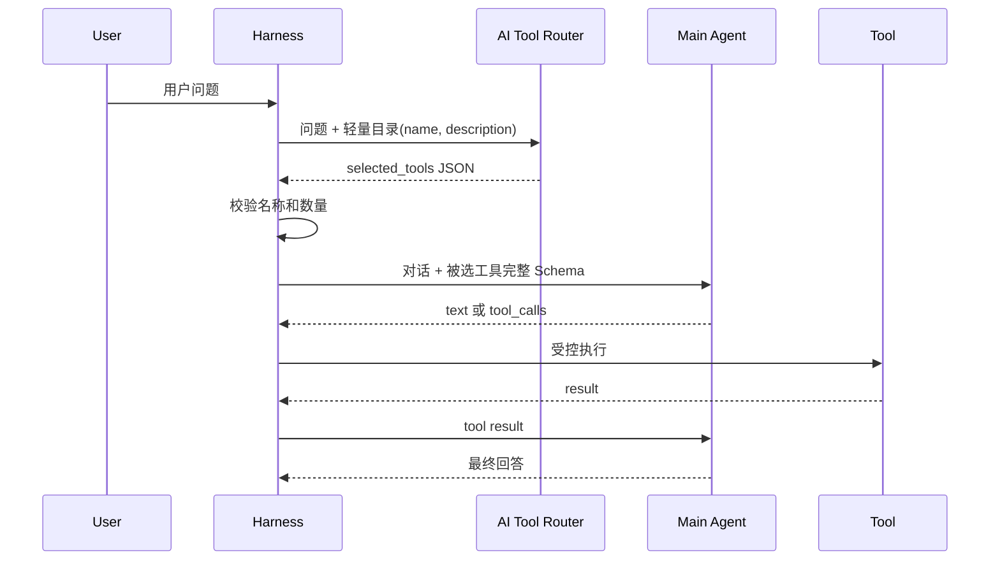

# 第 7 章：AI Tool Router 与工具筛选

[上一章：Guardrails](06-guardrails.md) | [下一章：审批与恢复](08-approval-and-checkpoint.md)

## 本章起点与终点

| 项目 | 内容 |
|---|---|
| 起点 | 每次主模型请求都发送所有工具的完整 JSON Schema |
| 终点 | Router 先读轻量目录，只把少量候选工具交给主模型 |
| 自动化验收 | 59 tests |

## 7.1 工具多时 Token 为什么会变大

每个 Native Tool 都包含：

- 函数名。
- 描述。
- 完整参数 JSON Schema。
- 字段描述、必填项和限制。

如果有 100 个工具，即使用户只说“你好”，这些 Schema 也可能全部进入主模型上下文：

```text
请求 Token = System + Memory + 当前问题 + 所有 Tool Schema
```

后果不仅是费用：

- 模型在相似工具中更容易选错。
- 请求体更大、延迟更高。
- 工具描述占用本该给对话和知识的上下文。

## 7.2 为什么不用手写关键词规则

规则路由：

```csharp
if (input.Contains("时间")) select get_current_time;
if (input.Contains("计算")) select calculate;
```

它无法可靠理解“离下班还有多久”“三的平方再加五”等表达，也会逐渐变成难维护的业务规则集合。

本课程采用你的方案：**把轻量工具目录发给 AI Router，让模型做语义选择；C# 只验证它的输出是否合法。**

## 7.3 两跳架构



Router 与主 Agent 可以使用同一个模型服务，但它们是两次不同请求，Prompt 和职责不同。

## 7.4 轻量工具目录

```csharp
public static class AgentToolCatalogBuilder
{
    public static IReadOnlyList<AgentToolCatalogItem> Build(
        IEnumerable<IAgentSkill> skills)
    {
        return skills
            .Select(skill => new AgentToolCatalogItem(
                skill.Name,
                skill.Description))
            .ToArray();
    }

    public static string BuildJson(IEnumerable<IAgentSkill> skills)
    {
        return JsonSerializer.Serialize(Build(skills), JsonOptions);
    }
}
```

目录示例：

```json
[
  {
    "name": "get_current_time",
    "description": "Get the current local date and time."
  },
  {
    "name": "calculate",
    "description": "Calculate a basic math expression."
  },
  {
    "name": "write_note",
    "description": "Append a note to the learner's note file."
  }
]
```

这里故意没有 `parameters`。Router 只需要判断哪类工具相关，不需要生成参数。

## 7.5 Router Prompt

System Message：

```text
You are an AI Tool Router for an Agent Harness.
Choose which tools should be exposed to the main agent.
Return only valid JSON.

{
  "need_tools": true,
  "selected_tools": ["exact_tool_name"],
  "reason": "short reason"
}

Rules:
- Use exact names from the catalog.
- If no tool is needed, return false and an empty array.
- Choose the smallest useful tool set.
- Do not answer the user.
```

User Message：

```text
Current user message:
帮我算 (2 + 3) * 4

Lightweight tool catalog:
[{"name":"get_current_time",...},{"name":"calculate",...}]
```

可能返回：

```json
{
  "need_tools": true,
  "selected_tools": ["calculate"],
  "reason": "The user asks for arithmetic."
}
```

## 7.6 Router 的调用代码

```csharp
private async Task<IReadOnlyList<IAgentSkill>>
    SelectSkillsForCurrentTurnAsync(
        string userInput,
        AgentWorkflowTrace workflowTrace)
{
    if (!_profile.NativeToolCalling || _skillRegistry.Skills.Count == 0)
    {
        return [];
    }

    if (!_profile.ToolRouterEnabled)
    {
        return _skillRegistry.Skills.ToArray();
    }

    string catalogJson = AgentToolCatalogBuilder.BuildJson(
        _skillRegistry.Skills);

    List<ChatMessage> routerMessages = BuildToolRouterMessages(
        userInput,
        catalogJson);

    ChatCompletion completion = await _client.CompleteChatAsync(
        routerMessages);

    string routerJson = ReadRouterTextContent(completion);
    AgentToolRoutingDecision decision =
        AgentToolRoutingDecisionParser.Parse(
            routerJson,
            _skillRegistry.Skills,
            _profile.MaxToolsPerRequest);

    return ResolveSelectedSkills(decision.SelectedToolNames);
}
```

这就是 Tool Router 第一跳的真实模型请求语句：

```csharp
await _client.CompleteChatAsync(routerMessages);
```

主模型随后还有自己的 `CompleteChatAsync`，所以开启 Router 后一次简单请求至少可能产生两次网络调用。

## 7.7 C# 不能盲信 Router JSON

模型输出属于不可信输入。Parser 验证：

1. 根节点必须是 JSON Object。
2. `need_tools` 必须是 Boolean。
3. `selected_tools` 必须是字符串数组。
4. `reason` 必须是非空字符串。
5. `need_tools` 与数组是否为空必须一致。
6. 不能超过 `max_tools_per_request`。
7. 不能重复选择同一工具。
8. 每个名称必须真的存在。

关键验证：

```csharp
private static void ValidateSelectedToolsExist(
    IReadOnlyList<string> selectedToolNames,
    IEnumerable<IAgentSkill> availableSkills)
{
    HashSet<string> availableToolNames = availableSkills
        .Select(skill => skill.Name)
        .ToHashSet(StringComparer.Ordinal);

    foreach (string toolName in selectedToolNames)
    {
        if (!availableToolNames.Contains(toolName))
        {
            throw new AgentToolRoutingException(
                $"Tool router selected unknown tool '{toolName}'.");
        }
    }
}
```

模型负责语义判断，代码负责工程边界。这比在 C# 自己猜用户意图更合适。

## 7.8 只给主模型选中的完整 Schema

```csharp
IReadOnlyList<IAgentSkill> selectedSkills =
    await SelectSkillsForCurrentTurnAsync(userInput, workflowTrace);

ChatCompletionOptions options = BuildChatOptions(selectedSkills);
```

若 Router 选中 `calculate`，主请求的 `tools` 中只有计算器完整 Schema。

若 `need_tools=false`，主模型仍会收到用户问题，但 `tools` 为空，直接文字回答。

## 7.9 Token 是否一定变少

不一定。Router 增加一次轻量模型调用，因此总成本是：

```text
Router 请求 Token
+ 主模型请求 Token
```

工具只有 2 到 5 个时，Router 可能得不偿失；工具几十或上百时，筛选才更有价值。还可以进一步：

- 按领域先分组工具。
- 缓存常见意图的路由结果。
- 使用更便宜的小模型路由。
- 只在工具数超过阈值时启用。

当前课程固定启用，是为了学习结构。

## 7.10 Router 失败时为什么不自动发全部工具

“Router JSON 错了就回退全部工具”看似稳定，却会隐藏真实问题，并改变成本与权限面。当前实现明确抛出 `AgentToolRoutingException`，通过日志和测试修复。

生产系统若要降级，应该把它设计成显式、可观察、受配置控制的策略，而不是宽泛 `catch`。

## 7.11 SSL 与 401 发生在哪一跳

Workflow 可以判断：

```text
Route tools -> SSL failure
```

说明失败发生在 Tool Router 第一跳，还没进入主模型，更没进入工具审批。

```text
Route tools -> 401 Unauthorized
```

说明 TLS 已成功，Router 拒绝了凭据。SSL 失败与 401 是不同层次的问题。

## 7.12 运行与测试

```bash
dotnet test AgentLearning.sln
```

```text
Passed! - Failed: 0, Passed: 59, Skipped: 0, Total: 59
```

59 个测试中，本章新增 7 个 Router 测试，并保留第 5 章新增的 Harness 测试；覆盖目录、JSON 解析、未知工具、重复工具、数量限制和 Runner 候选工具传递。

<!-- BEGIN INLINE RUNTIME IMAGE -->
## 本章实际运行效果图

下图直接嵌入当前 Markdown，不依赖外部图片文件；如果阅读器不显示 Data URI，请以图后的纯文本运行结果为准。

<img alt="第 7 章实际运行效果" src="data:image/png;base64,iVBORw0KGgoAAAANSUhEUgAABQAAAALQCAIAAABAH0oBAAAQAElEQVR4nOzdBWDTatsG4MzdXZjBBhvD3d3d3f3gdnB3O7i7u7u7u8sENpi7+/Y9bUbIausM9tH7+vvvpOnbNE1avt553rxRDY+KZQAAAAAAAAD+dsoMAAAAAAAAgAJAAAYAAAAAAACFgAAMAAAAAAAACgEBGAAAAAAAABQCAjAAAAAAAAAoBARgAAAAAAAAUAgIwAAAAAAAAKAQEIABAAAAAABAISAAAwAAAAAAgEJAAAYAAAAAAACFgAAMAAAAAAAACgEBGAAAAAAAABQCAjAAAAAAAAAoBARgAAAAAAAAUAgIwAAAAAAAAKAQEIABAAAAAABAISAAAwAAAAAAgEJAAAYAAAAAAACFgAAMAAAAAAAACgEBGAAAAAAAABQCAjAAAAAAAAAoBARgAAAAAAAAUAgIwAAAAAAAAKAQEIABAAAAAABAISAAAwAAAAAAgEJAAAYAAAAAAACFgAAMAAAAAAAACgEBGAAAAAAAABQCAjAAAAAAAAAoBARgAAAAAAAAUAgIwAAAAAAAAKAQEIABAAAAAABAISAAAwAAAAAAgEJAAAYAAAAAAACFgAAMAAAAAAAACgEBGAAAAAAAABQCAjAAAAAAAAAoBARgAAAAAAAAUAgIwAAAAAAAAKAQEIABAAAAAABAISAAAwAAAAAAgEJAAAYAAAAAAACFgAAMf1JiUjLzh2RkZORofj6KjYtjAAAAAADgt1Nl4Pfy+uqzbttel6KOw/r34GYeO3Px9oMnXdu3rFG5Ar9xdEzsucs3sl2mo32RapXK0UREVPS7958lt3EoYmttyU4/fv56+74j1SuX79utg3jLpy/fHD19MS0tbcW8qRIXFRYeERIWQROe3t9OXbhKL12jSkW6a25m4vPdb+OO/U3r127fqgkjU3Bo2Nyla5JTUjcsm6OqKtfnkHLjw2evxOcrKyk3qF2NyaGrt+6fPH+5Xs1qnds252a+ef+J9o60LZN3nl99lq7ZQhMbls9VVVFhAAAAAADgNyoUATg1NdXT29fbx8fK0qKYo52erq54Gz//oPSMdBsrC2Vl5R9+gRlMho21pbKSksQFxsXFR0RGB4WGWltZWJmbMYVJbFx8TGxcqDBAckJCwxMSEpOTk8Uax924+zDbZZaNiGQD8BfPr7sPn5DYpm3zRkqMUkRUlH0R65SUlPT0dErXND8hMfG7XwC/ZXxCQnhEJCPMyUaG+vyHDPT1LMxMb957dOn6HW7mw6cv6UYTHVo1/erznZb86PmrgOBg9lE7W+tWTRrQLr50447IKrHl331HT5uaGPHnFy/q6FzUce/hU3cfPeXPb1Cn+tWb9xhJchqAk1NSzl6+npKSeu32/cfPM0M1xfhPHl60/vcePXvw5AXXeHDvrhXLlfq12olJIWHhEhdraKAn8un9+MVr084D3F36DBOaGDttPuV2br6jve2Yof0YAAAAAAAoSH84AMfHJ1A8+PDFkz/TpZjTsH7d+EGCIsesJatoYt3SOTQ9e+lqmt60Yp6ylMrhkdMXKNaw06sXztDR0WZ+CyrkUuG0iI01lRCltaGaJ/1VU8uy5knC6KuinKUkSEnpm69fw7o1+DMfP3tF+blS+dKURbmZujra/gFBlPapBksPJSUlUyWT5pdyK6GpoRYZHUvBjHLvmUvXnr9+N3xgL/4CKf2yNUlxW/ccEplDu+bfkYMqlC2VlJREOS4gOOSLp7e1pbmzk6OyMuNgZ3vy/BVqRvmZjdAkMjKaAjC961Pnr0p8FUqbInMa1a1BATg5JZnNir82SFoaI9x0ZUu5Zc7KyHj68i2Tc9v2HKYjDoxwI0dFx7Azr966myLcO3SQhX1pTQ11wV2VLGcK0Md1w/Z9EhdL77RN84b8OZT86RAD+0LsHFo4/aV9xJ8TE4NO0QAAAAAABe5PBuDwyKhFKzdGREbRtJGhgYOdTXBoGFV6KVP9O3vJklmT9PUyM7DvDz/6S3VCCiRvP3xmp6X1m6Vc8eTFa+7u01dv6taoyvwWbF3U1aWozAAsyLoiAZhNxRoaGiIzd+w/KnEhT1+8EZkTFRXTo1MbRzvbIX26HTl1gQKwva3NsP7dl6zaHBQSMqzfRNqY9x49Z6SgDEbxlZEuOiaGq1rTqyxYsZ57yD8wmG408cnDmza+jrb29PHDg0LDVm3c4eRgN3pIH/6rdGzdlBHuemNDA8GsDIaK0ioqqvp6OnTvw2fPdx+/sI379+jUr3vH7fuOUCG6S7uWVOP1Cwi6fuehqbFRz45tjp65SMG7cb1aT19OYXLIPzDo1buPNDFp1OAfAYH7j56howlLZv27cOVG3x/+bVs0qlO9Mn0CKQz/07+XW4liIk83NNCnAwH8OeEREezGUVHNEpVT09IszE3nTxtH0zsPHPfw+korXLdmFfbRuUvXUA28X4+Ozk4OdDcqJtZAT5cBAAAAAIAC8ycD8PEzl9j0W6VC2UG9u7Azr96+f/jEOcoedx48admk/qNnrx49e8mGIsoYqzbt5E/Xq1m1jLuryGLff/Jg63i2NpY//ALvPnjGD8BU7rtw9eaLNx+Sk1PKlXajl957+CTN79q+ZemSJWgiJjb2/NVb7z9+CQoJcyhiU9q9RPNG9di+1kvWbImKii7mZF/KrfjZS9cDg0ONjQwom5Ur5fby7Yejpy6wL/HZ8+vUectrVK3QolE98XedJOz3q62lxZ+ZKCwSamtpiLenzF+xXOmICMGG0tBQDwuP9PnhV69mleCQzF64uro6XCdeQqXgKzfv0kSfbu3V1dSMDPWp/bpte6eOHcZIZ2VpNm5Y/+SUFGkNPLy/bdyxnz+H8idl5gdPXpR1d42OjfP+5hsQFELz4+Ljr966R5uRpls3a0h5mHsKrT8lwNsPHl+7dZ+2dsdWTU1Njf+ZMFNLS3Pt4lnUQElZmQvASkL0X0aQnOkRZSUms8c75UaqG7MBmMk5a0uLZXOn/Ldh26Nnr9khrzQ1NA4cO2tnax0cQp+syFPnr+np6tJbuP/keRFbS5FezU72RagMzp+zYv02NgBXr5TlwEdQSOisRav4c2jXsHuHs3P/MXbCzaXYuOEDGAAAAAAAKDB/MgB/9fnOCKuCvbu242Y2qFXt6fPXCYmJfoFBdPfhs5fvfyYi8i7rdO3qlcUXy3Z+NjYybFS3JqULin8UetkOw2lp6f9t3E5FZrYlhaiXbz5QYGOEw00xwlNDl63dytYzibfPd7oFh4RRNZLufv/hR9GLaqHcCaIUe9Zv27t+2Zzo6BgqX7MzqQpK0yGhkk8TDRP2DaYqYpaZ4YKZP/yDSrmVEGlP1dG0tDS2G21KWpq2tiZN6Onp+nz3ZxsYGRn82iafPLbuFvRbpgrzoZPnhWlOkJwpnd66/0ji+igLaaipU4r76vuDkaJz2xbUjCtc0zRX+GWrqWRQ767q6mpbdh9kz1umqr57CWf2IS1NjXH/DFBVFfTxNtSnarQO1ajp1r1ja/6rVCjtbmVhbm5qzBQwqrWGhUVwnwRKqnRjp+8++HXiMR1ZaNW0vsST0jm+3/0/fvFiBMdxytCnTuRV2rdsHJeQGCP8dElDOd/CzMTSwpwBAAAAAICC9McCMJsSaYJ++muoq3PzKVlNHfcPd7dmlQolXYodOS0orvbo1FpXR3fzLsGQQhXKuBd1sHMp6iCy2JTU1Bdv3gsblCxTMjNMPnr6skmD2jRx/c4DNvNQybFxvZqBQaH82ikjKEpfZENdg9rVK5UrdfnmXUrIFHfLlS5Z7ud5p5SBHe1sqfJ8894j9vRRqjmXLOEysFeXbXsP011zUxOqfFpLyTMhIYJ3zQ/A6RkZbAh/+vJNs4Z1uPlU+509abSSstKmHftDwzO7HxsZCOKulzfFrsyRq2pVr1y/ZjU9fV3hfB92UVQD/+LpTTnTpZiTrrYWbZOT566WcHYSX59ijvZbVi6gif1HT6dlPeeWj7YnbTHu7oiBvU5duOr7IzOEOznYNW1Qu0xJ188e3mYmxuw2pBo7lfGrVipHhWjKeG7Fi8UnJE6ctbh8aTd6X09evLnz4LGdjZVgd2hqssuhirrxzzxP67z74Ak2+R87c/HMxeuD+nRl8s+08cPT035d8ejl2/f0jqgMSyV9ds6iVRvkuUrTkdPn2Yk2zRuJPKSro9O8Ub0rN+5evn5H9kK2rV7EAAAAAABAAftjATjoZ73UwsxURrNK5UonJiZRAKbIWq9mNZpm5w/q3UXiOcCv3n5gxxaiyErxw9rSnMLYvcfP2ADs6f2NbTZxxCA7W2tGkMPT+KMovfvowQg793br0IoRjM1rN2LSLAqTn754cgGYIvrEUYMp1BUv5rhEOHzU63cfy5cuaWpixAZgE2PDqhXLSntHwWGCN07huV7Nqpqagj7PbPdmRnCqs39sXBytNteYvXBRu5ZNAoNDrt68FxMbxx41eP9ZsJ51alRxciji6lIs83xaOl5QtaK1lTnVIU2NjSgxfvfz792lraW52bEzlxrWqXHw+Bnx9aHNRUmVEY7hzMhEG19FVUVNVXXXwePsyFV0IICKxhT4qcK8Yfs+e1sbH+HZ2jra2tZWFh5eX/ccPnn64rXlc6cIOzMLKup0yOD6nYc37z1u0ajevKnjbt4T1Irti1iLvxzVvdkwzwjzvPCW2UObPY9aZGwqcZ5ffU6cu1K8qKPIwFSsE+cu8zsUpKUJPjYfvnjO/28dO4ftSC8bvf1PHt40QR8A2g4yWtKjZUq5is+XNq41AAAAAADkuz8WgNlKJomIjJbWJiY29pPH10/C/qUZ6ekUNihTsQ+9fPvR2FC/qKO9yFPu/Rz8mWIqxS0DfT0KwAFBISGh4Wamxr5+goqlmpoqm34ZYU7mAjBFILYfLD1l4OgsQyt5evty01aWZpR+GUHZM/PV2fGE5ZGUnOwfIKiOhkdErtu2Z/zwgZQMP/IGwX75+kOt6pW4u1SBfPfh8+MXr6gQzQiH/jIyNGzVpP7Dpy8ePn15+/5jz6/f4mLj6V2YCbsNU/bW0dZKF57X+sXLW/jGw/T19Jo3qqutpSlxlV6+/SBycq8MRoYGy+ZMpvL7V9/vvTu3C4+MOnTiXL3a1YpYW33y8CrqUOTi9bt1a1R2dSlK78s/IOjUxev1alZR+nm1KvcSzv/Nn0q16NsPHrNzPnsIdmgRGwkBmI590G3rnsNUpafjEVST/+EXyD4ULKyim5uYyF7bfUdP0VOoEk7FfArkIo9+/OxJEZeK5OyRlATai0nJ9LHhH4BgxEYmE3H09EV2ol3LxoxMdOQCWRcAAAAA4M/6YwFYU0Od0inVAymjiTxEgSc+IYFyCAWS3QePszNpmj/y8OZdB6pVKicSgKlEyZ0wvHjVJv5DD568oDIgG1zZWh+LLX6yUlJ/Vfy4iwyx5w/r8i6kpKqcudFUsqtAimML1JTACVUOj5w636VdyzsPnrCvSK/15OVrLgBT9fLC1Zvs5ANvGgAAEABJREFUNEXfFo3rW5mbLl279b8N27u0b1m/dvXjZy4KFnL6At0oms7+d5SOjva0BSu46/qQ1Zt3sxMbV8yTuEpampr8M1fZyxfR0ii1RkZFs6M6a2hk9lG3FJbrS7kVf/Dk+aKfW/jwiXP8BVLg5N/t1bkNI7wy8+R5y/jzr966e+3OffbYwbnLN67e+hUOq1cq161Da0Y6tou1mVk2AdjY0JDNzHp6OiIPRcfEst2buTOT6TjImYvX3F1dOrVpxm+ZIb1bOB2RYd8sPcsquzN4LcxMS7uXEJ+PVAwAAAAA8Nv8yUGw7IvYvHn/iXLI9TsPG9Suxs784R9IRT9GUJt1cytezMrCjB1bmIhMu7sWF1ngs1dSLwl77/EzCsAOdraUnSjUPX/9jsqYVCmlIirXhsvk7NVumdxKTZMamdiew7WrVSpfxn3Z2q1Xb9030NPzFg4GNv6fAfNWrPv4xcv3hz9boK5WuRytXvmyJd9/9IiNjTt84izz83KylDkzL1EruLBQM2pWumRx9nLHjna27FZiq9n0jjSFNUyuDCuCNvLS2ZPYaYqF46YvoGVSmZfuLly50fub75A+3cQvBeTm4kxLpOKzsoqylrC2/PzVO1q30iVLcGmZxY53nZaensQ7n5ZeIjkllX+ZX/6j4hvQ+9t3z68HS7kWHz2kL5WydwkPi1y+foequOOGDUhLT2MkGdS7y7MXbx3ti4iPYsVuczJn6Rr+fHZoLv4ce1ubGRNHSFz+kZ/jfnds1YzJDu0OZF0AAAAAgD/rTwbg2tUrs2Hj8MlzCQkJlJ0Cg0P2HDrBPlqraiWaU69mtfEzFlIonTJmKNV7h02YkZKSOm38cEdJF61l4yVZtXA615F1655Dj5+/joiM8g8IKle6JDuA88Yd+0s4O4WGR3DXtmUVdbB78eY9lfVevv1QrpQb1Q9XbtqRlJREibVHpzZMdijXUaj75vvdw+urtaWFDq9uTPz8g9jhgmtWrVTExqpB7eoPnr5gz+alPG9tZVG3ZlXKSJt2Hpg/bRwtysrcbPWiGfToweNnKYjyF5WcmsKO5kXF28b1amYZnmpQb3Zi1pJV1GZo327ORR1/rp6S7PV/9EwwJFgRayuJj566cJWqwbWqVtTU1KAyNd0Gj52mrqa6bukcenTsl/kxsXEU1FN411Ia1q+HtrYgAFMRnR1qi5WUnLzvyKmHT1+yG61ZgzpNGtQW6aRNG//DZ48vwk7v7FhlJYo5UfH5s6c3dxwkNTWVwnlkVAxNiJ8TTsVtfn9yPl1tLfYSSmlpaTfvPeKiOG3PimVLsdP0Km8/fNLQlNwFmiI02yHf1aWorY0lI0VGRkYJl6KtmzXg5ly//TAuPp5exdoqs2isoqLCXo1J2kEKAAAAAADIF38yAJd1d23XsvHJc1coflC4ohv3kJtLMXdXF0bYq5nt0GtrY0UT7LhERWwkJLTYuDjPrz6McAgr/mmcVGulAMwITw/u3LZ5nepV2BNQ2bGLnBzs+Nmyc9sWFLqoKL1+2142zbLzq1Uuz8jBwsyEUhOt5JI1W2pWrdi3WwfuIUpoq7fsYoSdmdn179S2uY2VxR7hVYgb1KlOfxvWrkEBODg07NL128151xDu1qHVd7+A5eu2UdirUNpdSVlpz6GT7AYc2DubgZGpdvrV18/rq09xZ6dBfboN6NVFRVn5/s8zpfkoah47IzijtV6tqvz56UzmUMkvXr+j+jm9qKakTJieLmjGVVZZiUlJbAD+1Swj48Mnj+37jlBaprslizt/9PA6f/Xmxeu3G9Wr2bxhHe66wZdv3mETMtW6aSdWrlDW1bkoLX/F+u1M1h13/sqN2w+ejBnaj6rZjHyKOTk42Bd59ebDkdMXaC/Tvq5Q1v3pizfFiznSh4Rtc+LsZQrAulnXn3PkZObgz+2lDx52/c5DiQOPMWxvBd4A5PQtoLfJHkoAAAAAAIAC8icDMGnRqB6V4O49es6eesoIR6iiQmjnNs3ZatgP4cV+jAwNNNTVv3gKCm7mpiaqKirii+L6P1NY4s+niMVOPHz6grJNj85tqlUu9+rth+TklNLurpRL123dwwjrkIwwnU4aPXTngWO+P/zZ9Esv3adbByf7IjStJGwjo446sFeX3YdOsBcHUsm6klTlZt8jFUXZObGx8QeFvZpp4RTLGeEQVk0b1L50/c6Jc1cqlStjxrsc7psPnxISEymh0Y2dQ4XH4QN7idQMKcR+/OwlvApxWECgoEx69EzmKE3GRgaJCYle33xoSz4RHhFQFj6X3uaHz553Hz59/vod3bWxtqhRpQL7FC1h3+mTZy/HxVFdNzUwOFS4HMNgwcIzL5WcnJL6Wngd4LQ0wbGJPl3bU7GXWx/K7fQsNpfSZqES/YMnz9mTb2nDjhrch44F0JGLS9fvXrkpuFYQ5f96Nau2bFJPT1e3SsVyVBOuXL4MZV3hCckxe4+cZIv8dIyDduXiVZto4VS1fvXuI70LdXU1Rj5xcfHHzl169PQlezyFlja0b/dv3/3YbXv/yfOd+49xjYs62Ikvwee7H3u0hdZNYmcElrmpETfcGueHfyCtLb19Pd0sZybr6egwAAAAAABQkJTCo2KZQiAmNtbnR4CFqQk/9eW7py/fPn4mKCq2aFKfcgvlkDVbdrPXwlk8819Kv1zL1LS04JBQQ319bSkFQNnS0tJFhsjaf/TUzXuPO7Rqyl3plwLh3GVrqe63aOZE7iRVCuQTZy2mwun8qeMpD/OXQLnx2cs3dx484aqsFKJotfkvdPby9dMXrnF3DfT1bK0sbW2tilhbuRR1oLWawhuJijJk43q1qPpK5Ud2TqVypfp278hdlvn6nQcHj5/lr4OVhdm8qePOXLp+5uI1Rm7bVi8KC4+cNGcJe5eCX90aVZs3rqvG67QcH59AxVg23xZztJ88ZqjIQv6dvYQ9glCnRhXajOpqqv9MnMWV6On4xZpFMzU1NeRZH3rW5LnLaGm0fVrTIYfqlSlgP3jyYsf+o9UqlWvXovGsJasz0mkPqtJRBirjy7lYOS38bwPtwZGDepdxd2UAAAAAAOA3KiwB+PfwCwyatWgVO01xNzwiik1QVPacM2kMU5DSMzIuXbvF79jMCE9tNTLQdynmxJ9JVVyqHkssPLIioqLvP3p2+8GTmlUqilzhNiAo+NHTV7Y2VjZW5hZmZuLjVFPGYwe+di7qUKNyBYp2FLnn/7fe0b5Ig5rVRc5lpcD88s37z55ewt7NDK1qjaoV6a+n9zf2gsnyUFZRppDJCMesCggOqVWtkoy35vvdn0roA3p1srYUu2rRF68LV2/26NTG0tyMneMfGERV66SkFC0tjXLubuIXOpKBSri0GcuULMGV0N9++HzoxLkaVSs0b1iXKUh0kMLTy6d9qyb2RWwYAAAAAAD4jRQrAJMPnzy37z/CXShITU21cvkyFKvYKyQBAAAAAADA30rhAjArPj4hNCxCX1/P0ECPAQAAAAAAAAWgoAEYAAAAAAAAFI0yAwAAAAAAAKAAEIABAAAAAABAISAAAwAAAAAAgEJAAAYAAAAAAACFgAAMAAAAAAAACgEBGAAAAAAAABQCAjAAAAAAAAAoBARgAAAAAAAAUAgIwAAAAAAAAKAQEIABAAAAAABAISAAAwAAAAAAgEJAAAYAAAAAAACFgAAMAAAAAAAACgEBGAAAAAAAABQCAjAAAAAAAAAoBARgAAAAAAAAUAgIwAAAAAAAAKAQEIABAAAAAABAIagyAJCvtuzY/fmzx4dPn2n64umjTGGSmpp6+NipZk0aGBsZMQXpyrUbMbFxLZs30VBXZ/LVxq3bv3zx+vTFQ11D/eShvcrKEo7iJSQmNmvTyaVY0eLOzvXr1ixXtgwDAAAAAIAADJDvXr95d+PWHXb63fuP7iVd5X/ugsXLHz55Ku3RiuXLT588npafnJzCyMHcwrSooyN3NzEpaeKUmddu3Nq198Dm9f85OTjwG4eFhT968oyRj42NVdnSpaQ96un9dfSEKTSxcs36YYMH9ujakaY9PLwyMjIY+VhYmBsY6Et86PMXz8tXb7DTT569rFq5gngbX9/vQUHBdLt7/6Ghob48AfjzF4/xk6czeVC+bNm5M6cwAAAAAFCIIQAD5Iy/f2BIeJiMBqVKunIB+NCxE50y2sporKmuXtzFmbv7/tMXL+9v0hrb2tjEx8f37D+EkU/Prp2mTZ7A3Z0yfQ6lX5r44efXuUe/TWv+q1ihHPfoy9dvJkyZIeeSO7RrLS0Ap6SkTp0xl50OC494+vw5G4Bbd+rOyK1Lx/azp0+S+NCo4UO4AHzi9BmJAZgSODddvLgzI4fgkFAZW14elhaWDAAAAAAUboUrACclJ3/75kMTMTGxP/z9HR3szc3MrCwtpLUPCQ0LDw/n7hYpYqutpSWxZVRUdGBQEJNDzsWKSuxgme98fL8nJiay0xoaGg72dtJapqene3h6SXtUVU3V2MjIQF//96y2Yjp45Pi2XXvkbHz85Bm6yW7z7vkDFRUVpuD16dXt7oOHcXHxNE1/ew0YumvrhiqVKjD5avuuPW/ff+DuThgzksm5tPR0bvrilWtLVqyW2Ozs+UtPnr3gzxnUrw/lbS+vb9wc56JFGQAAAAAAocIVgKk8NWFylhpUUSeHcycOS2u/eduO/YeO/bq7bmXtmtUltjx38cr8xcuYHLpz7YKZqQlT8PoM+icoKJidtrAwv3X5rLSWlPnbdu7JZKdFs8ZtW7eoWa0qA/+fqNjbqnlTdnrj1u3shEuxnGU5VXU1/l2q2R4/uGfgsNFUAWbn9B30z/6dW8qXE/QQNjI01NHRZuSjqSH5zN5bd+6tXr+Zuztm5DBbG2smbxISErlvhziRh/wDAhhBNfsVN4cOLdEBJpFnaWlpmZuZSlkk07tnt3K8+nZ8QsK0WfPY6epVK3dqn6Wkv3jFKhmrBwAAAACFSuEKwFTPEZnj5f3Nw8PL2Rk1nJw5f/EK3Zo3aTRv1jRtbS3mDzl09HhISGZvYVU1lWGDBjAgHzr0M2r4YJp4/+ETF4DbtG6uq6t77cIpORdiZGQoMsfersihPdv6Dxv55YsnO2fS9DlXz5+giQrlyz67f5PJg6MnTs+cu5C7W69OrYF9e3F3qdocFRUl56KsrHLfnZjy6qMnz7m7TVt3lNjs46vH0pbQsF7tShXKc3ejo6OnzcqcditRomnjBvzGG7ftQAAGAAAA+H9RiAJweETE7bv3xedfvnYDATh3Lly+mpae9t+SBX+qR/S+g0f451X+kQB88/bdM+cu0kTrls0okjH56t71i+xEhrAUaWlhLtIgNS2NnVBRUVHizd974PDm7bsYOVy8co2dKFe2DDuilY21FZMHJibGW9ev7tyzH62wibHRxrUrmDzLyMjYsGX7uo1buTlUwV48bya/a3eu+1o7OdpTSVbaoz4+vva8UwbKlSn16p72zVgAABAASURBVNVbJm+mzpxvxqsPp6b8GnJs2649z1+95jfmDiUAAAAAQOFXiALwjZu3Jc4/durM8KEDlZSUmDzQ0tIU797JngzJEW+gqvo7zszMozq1arATCQkJXt5fw8Ij+I9evnrjVot79evWZhSSn3/AP6MzR4G6dPX61XMnbG1tmHxCHxgKk+z08VNnp8+e36JZ45HDBlOVlWtTsUY99mM2cezI/n1+9V3X4pXlZXy2U1NTT505x053bNeaySfmZqa7tqwfP3n6skVzRcaCzp2FS1bsO/Trgk+Ufvds26iqqkabpWG9OtLGc5ZT2dKl2AG3qLTboWvvKpUq9u/Tw66ILSPscb1n38He9naTxo3ijvKsWLWeyZsffn5cL3FxL7MGYAAAAAD4P1KIAvCpcxclzqc61Zt378uUcmfyoH2blnTjz/nh59+oRTvuLpXXDuzawvy/cXMtvmntf/w512/enjR9Nj/bHzl+SmED8PlLV/h3T5+/OHzIQCa/+fsHUvplfvY879qpw9BB/SzMzfhtYmPjpT1dxsWBHjx6wh3RaNygHpN/HOztjh/MHMorNCz8zr0HTM5pamo0b9KIJny+/+BmFnVy2LF5PWXs+YuX7T90jLbMwL69+/XpnvcrDx86cvybjy/dDh87sWrZIgN9/WGjxtN8ysAx0dHzZ0+nDEyHDE6eyTyFnurb0ydPZKdpZdgtWbVyhS4dO6ioYJQ4AAAAAEVUWAJwQEDQ8xe/xq3p3bMb/ajl7l68ci2PATgvAoOCz56/9PL1G9/v3yMjo6ytrKytLWvXrEGBRFdXR9qzKIJevXGTKlSUjvwDAgwNDagsVqFc2ZbNm8gY1zrvGtSrM3PKv5SBuTnPXrwUb/bps8fp8xe+fPH0/e6XkppCb8rJwa5JowbVqlRSVc3yqfD+9o0iNHe3SYN6IldVpcj39kPmqL9UzKQSKE2s3biFcl1g1nMjF69YRX91tXVGDBvEn5+cnHLrzt0r12/6+v5gt5VdkSKVK5Rv1aIpV2JlBQQG7d7/64NRu3p1V1eXTdt23X/wkHYNBa2+vbNca8fEOMvTTbMuLXdKlHBu26oFIxyvm53z2cODqsHcQYdDR4/TbVC/3oP695G2kHJlSrELYWRWgA8czhzjrVP7tvRh6953cEREBJNDa1YscS7mJKPBu/cfuEGecoQSJhuAqcx79/5DmqhVo9qSBbONDA3vPXzEDVC3bdceU1PjxKQkJidUlJUH9uvN3Y2IjNywZTt3t2L5sjGxsdxmP3nmvJ6+/pQJY/iHDNq1bsWdr7t6/SZ2frWqVURO4hVHn0/nor+2WFR0DHduc706tdq2as5vvHDZSpwDDAAAAPD/orAE4CvXb/DvtmnRzMvr6/2Hj9i7585fmjB6hEgw+w2omrRh8w5uCCIW/Yx++/7D5as3KDP8t3RBs8YNxZ8oeHT2PH4Zlp7l5f3t9t37/61ZP2RAX/qFXXBvh+sUzaLViE9I4C4QFRkVNXXmvJu37/Lb0C/4l69eHz91llL6upVL+Fem/fHDf/feX5mTGogE4Bu37ly4fJW7y457tGvPAfEVY5dDoYUfgGljjhw3iR8h2G1Fa7jkv9VUwWOvIssKDgnhr4yujs6OPfu5z0lAsGgOadqoAUVxduEWFuYtmjZh8qxF08Z048+hUHTr8rnjp85s3bGbS19bd+7p0qm9tIVUrliBboxMPr7fubPi27cV9F/44uEh0m9fHsnJyYzww3z52o201DSRR6tUrsjkWa0agtHXRw0fPLh/XxUVFfqMTZ42m3t07Kh/njx7wV0bWX78AEyHObj3Pnr4EDoyQjcqNXfp2Y+dSYfMKJB/+PiJewolZHYiLS2N6sbstH2RItm9LO2d8iKDYHEBuKijY+OG9fmN12/ZjgAMAAAA8P+isATgM+d/9X+moOJawqVRgzpcsKFQ8ez5q6pV8uGXuvzS09NHT5gi+1f7uH+n+fsHDOANdcsIsx8lNxnP2rx916cvHutXLSugq7+KFxS50yPDwsM7dOsj4/f6Dz+/tp177t62Idt4li8ePnraf+gIGQ3mL14WEBg4YYzkNpeuXOMPsiWOwva18yfvPRB8kGpWr5rvBx0uXbl++NjxIQP604ezT89u7du0XLF6w+FjgkGVp0wca2pqwmU2HZ0cj8V97ETmBYQd7O3y3gPCzz9A5BpjrO0b18p/9SNprKwszhw/yFVN5y1cxh0IcHMt3r93D/oqMXnw4OETrksIpdxe3buy06Xd3TavWzlkxFj27so1G/jPOnfx0rRJ49XUVIODQ7mZ/DO0pRk7caqWluRtQtXsS1ev8+fIOFsYAAAAAAqbQhGAvb99+/DxM3e3SaMGSkpKtWtkKWNSjfE3B+A9+w7JU7Navmpd+bKluaLoqzdvZadfFlX2du09IJKc88vdB4/4dykwaAo762ZkZMyYs1CeahUF+7MnDhkZGjIFieqEE6eKRjKqMIskiu279tKul3hNY9npl0Wht27tmkwBCAkNmz5nPkXcR0+eV69aeczIYaVKus2ePqlJw/p0QKd7l46UObnGRZ0cmRw6eDSzC7G2thbbTbpbp46JiQkizR4+ecpth55dO4k8qqyiku2VeKna+fZZlgHY127YsmXHbnb62IHdxV2KMdlh0y99xtZs2MLvEbBwzow8HncICAgaNWESd3f0iGH8xF67ZvUFc2ZMmzWvqJODiqoqf0xm2jVPn72oXq2y749fpyjLc11iYXqX2tUciRcAAADg/1ehCMBURuPfrVdbcK0aqilR7YgLxhcuX5k6aZzmz7MuCxr9dBbJsXVq1Rg2uL9z0aLPXryct2g5/0fwijUb9u3YzE6L1KAozs2YMqFi+XIe3t6bt+7kdzym5NylY3sZZxHnzr2Hj2bNW8SfU7VKJXaC1lyk5zMl8E7t2+jp6d66c59/FigFgAOHj+V6vCgTY+N71y9mUGDrPZC/oe4KLxrEja29/9BR/pjVlB5Xr1hsZWmRlJxMxU+q/XIPrVm3WWIAZvXu0bVsmVLqamoFndhF7NizjyvwPnj0hG5NGtUfMWxwtaqV6MYIB8fiGjs62DM51KlDW7YnOX0L7t5/WKtGtfFjhos3ow3FBeBpkydIWxpFaH5uFOlKzc+o8fEJ+w9nDulctXKFkm4l2Pa0DpevXm9Yv26LZo0lvgTtuJlzF57hjWY3Ytggtjv9yqUL09LTJD7r6PFTi5atZKcP79spcrpycnLKmH+ncmtLX0P+aNj0Wtdv3enVrfOaFYv19PT7Df5HZOFXrt+kAHz/5yEhOhiU7984AAAAAPg/UigC8MnT57lp+o1eoVxmNbVxw/pcAKZfwA8fPcn367hKc+vOPf5dCwvzpQtm6+sLruZCFafVyxd16Pbr7MTnL179+OFna2tDFb8nz17wn7hy6QL3kq40Uca95JL5s9p37cMPhFRhbt2yGZMHtH2GjhzHTqekpHz+4iFyGSTSq3sXduLs+cv8+ZTWuK7F7du0TEpKnLvwV+Y8euL0P4MH5PrqU+zgVRoaavyZ/DGoqFR46swF7i7t9/Wrl5uZmgiepa7eo2vHr9++cqMovX3/4ZuPrwPvcq8cSj6N8nV4ZPmNHzXcrXjxDVu2c+eXXr56g24XTx9lV/X9x49c41xcvHfogH4UDtnsRyXZmtWrsrsjIjLy/KWrVHF1K1GcDl7wn0Jb9fXbd5euXqeDSssWzuGfyGpXxPbZ/ZvsdHR0dJXajaS97ulz57nA2a935qWbFi1fefykoEv2yzdvaYOrq6uJPCsqKnrMxMlUDOfPLFe6NDshbK8m8eXU1H79K6Sprq6lqcl/NDU11UBfj52m+DrqnyFXrt2kjy47Z/f+g/QVuHLtBlXgt6xfRf8+sId46AvL9nQ4d/HS1H/HnblwiW3PP7ldRGn3ktLGgY+KjmGHmyYU/nt06Sixma6uHgMAAAAAhdufvxbI+w+f+JmwUf163A/iulkHcxK5pE2Bevw0y+94+tnNpl8WlabbtW7Bb/Dy9Vv6+0r4l9O2VQs2/bL09PSohsxv8JQ38HWu3b57n73xx7/lUHGMO330zv0sl7oZOzJLuaxrpw4UMLi7lB/8AwKZAhMQEMTf77q6uuHh4RTguZuNVZauqh8+fRZfCO2IP5V+GWHVtFWLpudOHFq6YA5XXKU5XFCnqMZO0HrmohuwgYH+pPFj2Gk6BMAOs0zu3nu4YPHyvoP+qVyrgY/vd/5TUlPTqOq+e+9B2n03slb75ZSYlLR5e2bnZ3ojlLrZ6Z5dO7MTtGT+GfssqnX36DdIJP3mC21trU1r/2Mr27OmTZoya+6YiVPo7VMwpujLHSBzdLBTUVFZPG+mrY0NfTfXrFjCzqckv2P3Xq7bf/26dUSWn56eToVrumlqabq5uUq8uZd049qbmppIa2ZnZ8suKiUllQEAAACAQunPV4BF+j9XKFeaSknsNJVx+A+dv3hl9rTJv6cHY3BICP9uUScHkQYuxYqJtw8OzvIs8WvPFCuaZU5QUBBTkPr06jZxzEh2mmqDImf/ipwMSdVF+qHPDTvMCM5xDc1F3VJOIeFh/Lu0bm0795TVPiRUfGZp9z9wcaz4hITUlBT+nDq1qh/Zv3PB4hV0DGL4kIFUX6WZ4RGRlFrZBtZWVuxMccrKKjI+0lSZ37J9N3uk4PTZC7VrCgZbvnE789R0OmBBdV1+ezp41LplM7YT8sXL1yaNG83kEFX+uc/JoP59uOHTShR35uqr6zZtbd2iGb8IfPDIcXnOx84dWoeeXTu1bt5k3KQZ7Cm++w4d/erznasMM8IrHtFfOkq1c8s6PV1dOnbg4lKMbbx6/WauWfOmomO2v37ztnvfwYzc6OACfxxyiagcvX3TWgYAAAAACp8/HIDT0tJOnjnLnzNj7iK6SWt/+959kSvQFBDKfvy74gPnULWHf5fSDv0Ny3qNVpFwQorYZllOUNaYnb/GjBg6ZGA/7m50dAz/UcGIQWJjUDs42PEDcITwTRWQiPCcXc82KipGfKaJiZEcT4xmr4RcsXw5ykVMni1eturoiVPSHm3aWkL/2Gs3btFN2lNuXDxjZSX50tC0j2pUq8IOK00ffjqKQQXGy1czrxnWtHED8T7qjRvUYwMw5VgPDy9n56KM3Cilr163kZ2mANm6RVP+o4MH9GEDMC357IVLHdq24h6iyLdt1x52uka1qtz47fmIwm1p95LckvkvQavKnqjM8L6qXTu243fpZ4TF+d98ljgAAAAAFDZ/uAv0y1dvwnIShKgIzPwWWlpZLloTJVa+i4iM4t/V1tYSPivL6YuRUaLPiso6h0pVTN5Qjr1/8xJ7Exma6NjJs8nJvwqVmiLrlnX9WSKJV9qVYESkp6czOaepKXpZIB0dbZEbf6bItpUTVWtbtOs8Yuy/dKOJ+PgEpvBJSk6S8WjpUiXZibi4+K8+PmyYZ9WuWUO8fbUu4wFYAAAQAElEQVSqlblpysxMTixatoo7+3f6pPFst23av97fvtFXj0rKXMs9Bw7xn1ihfFnaR1SR3rN94/Ah/ZmCMWr44BlTJIzy1U3S9ZabNxE9UtahbWsGAAAAABTbH64A8y+XIg8qQIVHRBgbZV/3yyPLrL2vfXy+Ozk48Od8/ebDv2tmIhi9ycLMlD/T6+tXkcVyoyWxLMzMmLzR0NDgtsaIoYP4Bwh++PmdOH2ma6cOmS3V1SmicPGGjjtERkUZGhjwl+bp5c2/K7G+6uUl+qb8A3PTkdvU1Jh/t3fPblMmjGHy2/Ubt7kjLDRx6er19m1aMv9XnBx/DR/9+Yvnc14ArlihnHh7OlTQvEkj9pt15drNgf16M/I5cPjoqbO/hqN79+7j6XMXPTy9vby9RYaMJl++eL7/8Imru6qrq02eMLZOrRpmpiYvX71mCkz3Lp1MjE3GTMxyVWHXEsXFW1K1nw4Jcd8IWxubSpI2l3vJkhtWL2ckefL8BTsKt0T0bVo4Z4aamoSRvQzzo6MBAAAAABSEPxmAqT4pMppOqZJu1taWIs24Dp+sGzdvd2zflilgIif9UpDgD0CdkJh4/eZtfgN74bhH9lmHKb51+97IYYO1ecVkkX6wTmKnFueFg71dh3at2aF6Wes2bm3VvBk3PlNJ1xL8Qapv3LrLT4MiV2MmNlaCE4B1dbKcoXr1+g2qwnGnhgYFh7x5+46RT2pqKjcWlLVllh398uXrjIwMfofelJRUfjdX95Ju/EGk5fQ96yVbv//Ihyu4du/SsX5dWaOR7z1w+MGjJ9zdtq1aNG5YT8Z42mampuIzw8Mj3rz7kMFkHDl2kpuZkpzCjYxdv25tbS0tiQts1KAeG4Dfvv8QHBJqbmbKZOf8pSvzFmXJgUtXrpH9lFNnznEBmPCvTlSgypYpxT+UQ0ZPmHJw1zaRbuRh4eHPeIPMaWioJaekiF9HTU1NVeLY8g8fPeXSL21q7pLgDevXffj4Cb063c5furpo3kxpewEAAAAACqE/GYAfPXnK/xVbupT74b3bxZtR1Bwx9l/u7tkLl39DAG7UoP6a9b+uiUKVsZrVq7J9jCmnrVi1ll/LNTE2Yi/dVK5MaZrmSo7UZumKNbOm/cuGn4tXrh0/leWE58YN6jP5aujAfvwATGuy7+Bh7kzgls2a8APwtFnzypZxZyvbFOknTpnJX1TTRg3Yft0iQ3nRMumwBYU6RnDmc8TUmXOlr46gQM2/+/rNuwrly7LTtHB6CSrJsncpqm3cuuOfwQO4xpu37Vy/eRt398CuLbkIwC2aNl674dd+bJO3i06xShR3ppu0Rzdt3cFPv4zww/P2/fv+fXo1a9JQ5Bo/MtAG6dKzn8hMbvgrRvARrSvtuVUqV+Cm795/yD9ZVxoHO7ts29BRoYrlywcGBbEnip88e37s6OG/Of7FxMQOHjFGpCIdFBTce+Cwg3u2cZ8QQbPhY/ijvnl5f5u/ePn8WdOyfQk68rJ5+871mzI/e/SJnT19MheAaUN169RhwDDB2HJXrt344uG5YvF8N9fiDAAAAAD8P/iTAVjkskZNGkq+nk3VypX4dynCBQQGWVlKHjQovxRzcqxauQL/si4TpszYsWdfUSdHWgGR4ZS7d+3EFjbpb89unfmjzh4+duLW3XuVK5b/9s2XGxOYRTPFh4nOI1sb6x5dO3JFQrJq3aZOHdqy3aQbNay35L/V/PDQom2XGtWqamlpskUt/qK6dcnsO62np0e1ZX7gnzJj7uZtu4yMjLLt7Gpna8uvKk+fs6Bdm5YOdkUaNxQk/66dO3ABmBFe6vbV67fVKldSVVe7dfsuP0bSCpQtU5rJOXu7Ivt3bjl8XFBE7dKhncQrCecXH9/vi5at5I8ixqH0RYcbFi5d0b9Pz84d2smT5OnjIXJN6VIl3e49yCyJ03GWJo0aSHuukaEhRTJ2y1NyEwnA6enpO3bv5+56entXr1bZtYSLSFmVXsLNtUTRoo5FHewd7O2LuxSjTwLN//TZg32P1Pjm7bu/Z1A6VnJyypiJU9ixnUX88POjULpn60YDA306mjNq/L8i3RkIHRtyK+HSvUsnGS9BVff5i5ZxX1VbG5s1KxarZh0ujjbXkvmzJ02fzQgPcnXo1nvU8MF9enZHKRgAAACg8PtjATg+PoEdq5ZTp3YNiS3pdzm/CyIj6IV7s3ePrkwBmz97RptO3fmRgH/dUQ7FkoF9f51mOaBv7xu37vKzrmDI3POXRJ5Fb2rBnBlMARjYrw8/AJOtO/ewl8MxNDBYumDO8DET+Y9KHLC3d89ulSv+qiLS9t+xex+/Af3uFzmfWSJn56L8iEtPWblmA713NgBXqVRBJK5TuZK72i3fgtnTZXQhlq18uTLlhfX5ghMUHHLg0NEtO3bzZ1avWpled+ee/dxHiCYo5NOtT69uQwb0lT0isZaWFncKK8Ww7p07xCcmcJ+rAX16yS4m165ZgwvA9F1ji/mMsLw5ZeYc/rniFNqTk5MH9uu9aO7MhIRES0tzC3NiJm35VP2mUrCJsXHlShWKuzgzv0tYePiMOQv5h0X+GTzAyclhwuTM7xEF47CI8MSkpGmz5vMPXfGPZM1btNzayqpu7Zriy6cP5+p1m/gfVxeXYlvWraKDR+KXsGrdspm6uvrYf6eyd9es37L/4NGJ40a1bNZEfHB1AAAAACg8/tgo0CLj09JP/KKOjtIaN6hXh3/39LkLTMGzsbbavnkd1cFktKlQvuy6Vcv4F0RVU1Ndv3o5le9kPIuWuX3TWvFLK+ULSwtzylf8Obv2HPDzD2CnKcpmG7wplI4fNZw/Z8yIYXVqST48QemiqfRSZA/BkEWyNuDEcaO7dGzPyLRy6cKCTrC5k5GR8fzFqwlTZtRt3FIk/fbq1nnzupXDhwy8c+3CrGn/ilzRevfeg41atNu19yClNRnLnzJh7NXzJ988vX/1/Im+vbsfPJx5pICOIHRs/+uE29RUCaNwV67w6xP4+Okzbnr9pq3iQ6mvWL1++uz5DnZ2lOvowAeVzWWn63MnDu/etpHeXTEnRybPaDNm2+bOvQdtOnZnL8LEolUdMWwQ1Z+5ax1v37j2xYtXLdp15h/TmTpp/M4tG1rxruc0bNT4jVu3c0OX08S9h4/oqFCzNp346ZeOX+zbvtnCXOowdU0bN9i6cTV3gn1YeMTk6XNatu969Pip+ITCONg4AAAAADB/sAJ8994D/t0WTRvJaFyrRjX+XSptUc2NfpuqqGYZglVZJQd5XqRQo6YqoW5Txr3kmeMHDxw6dujocZHLNVF1qFun9h3bteFGdeKYmZpQvj1+6syBI8dFumtSGqS816NbJ5GBrNV4b0RNVcK4shyR3piqkhpTeZAiFn/O3oOHJ4/PHGO5fZuWVLXec+DwMbGL2VLK7d6lY+2a1UXmU6r/b8mCRctX3bx1m78dhg0aMLB/rzkLlvAb8zesgYH+to1r5y9Z/pw3HBGfhrr67OmT6tSqTnVg8Vp0104dhg3uzx/DSUVZJetr/YEjOFREffHq9Y3bdy9fvS7SGZ5Q1p0xeQJ3yEZbS4veBX1OLl+9QbnLy/sbO5+qwUtWrNq178Ck8aPpCILE+rYJr6c0NZgzY8qseYto+/fu3k1FVfXho6dGRoaU3+4/fCz+3DJl3NkJqtYa6GcOSvz46fPN23dxbeZMn7x1594fwnHCjp86Szf6fNrZ2ZmbmdBqK6uoqKqo0uuqqGSuW3p6Bt0YQeROEYwCFR8fGxe/cM70nHYsf/r8RUhomK7w2lZp6ennLsoaCj41NXXh0v8OHjnOn0kHmObOnMpuNDo0EBkluKbXhq3bRT5mE8aMoCMRNDF7+uTPHp7cl5EKtm/ffaSKN30+Bw8fK/7BG/nP4MH9+4h/tUXUrFb1zNGDYydN48aBozLyzHmLlvy3eu2KpdWqVmIAAAAAoJBRCo+KZSA79Cs8MDAoJDQ0KSlFR1fb3MxMRmmIj4J6cEhIXGy8hoaamamppaVFtr+qfxuqUwVSgAsOU1ZmKCNZWlgYyHH5lh8UmAICKcDb2dlSfGXkEx4R4enlnZqSls6kGxsaSRw0iGIMrU5UdDTlriJFbE1NjHPd7blAtencQ+JpqBToBvTtKeNc0LS0tBOnzoqchs0I4xY3+lf3voPZM6vpYMSmtf+JLCEqKnrjth0D+/b2DwgUHyLL1saGasXcXcrbpdxL1qhahd2M9FyqjnLHLzasXl6vTq3gkNBBw0dLfDtyenT7qsjHhtaf3gU7TVXZ6tUqizyFaubSLuh98/JZkSuQ0VevS6/+/FMPaMssmT9b5EUHDx8j0nme0u+Avr24u77ff3TvM5B/+Gb54nlUQL5x6w7/pAAK80sXzqEjRPxFRUdHV6mdeYSONv74MVn6RyQnp6zbuGXrzj38hRzZt1NPL69X+QYAAACAfFdYwlghR6nV1taGbkwOUU6WMyr/fpTTnBwcRK5vnK3cbQcKzPyTiiUyNDAQuS5x4TR+1PAhI8by51Dg6d+7R/OmjbkOsRJRbbxTh7b169VeuXYjN1g3PaVDW3kvIESpj63kSwxXdWtlKd1TfZ5/V1lZ2cbGhk2A7Vq3YK/9Q9X1fds3bd6+e/uuvUzO0YEMg5xf87ZcmTISAzBtRvEvC331Fs+d1bpTd/bu5AljenXvwl2FizN+9HAuANOBgGWL5pQtXYrfwK6I7dEDu0eMnchm6Vo1qjVvIsi09evWZocYoB0xduTwTu3b8M9okAe1Hzd6eMtmTWYvXMoevFi3ainSLwAAAEDhhAAMkDO1a1Zv3bLZmXMXizo5NG3UsHatGqVKuspfrDYxNp4/a1rHdq1nzV9MpddJ40bn4hAJ1d4rlC/L7/ErPCd2sIynUCTbsWntqPGTXr99N270CN58PSqWDhnQh0r033/4f/fzCw0NT0pKTE5JyUjPSEununU6kXimbl0pZ4ZzxJMqKeXuJj6zauUK0yZPlLgZnZ2LThw78uCREyuXLnAv6cpIUtzFuX+fnjt27+vRteO4USO4Qb/4rCwt9u7YPHPuwlt37s2bNY17rWn/jqc92KNrJ3aY69xxcSm2b8emsxcu0bEeGcMZAAAAAMCfhS7QADkWExMTGRlVpIgtkwepqak3b99tUK8OPyV+/uIRHy/oIK2rp+dcVNZVsuITEtJSUxnhqbn6+npyJvDEpKSPHz+VK1uAg4rFxcV//ebDCM9bLlHcWXxUZIrTERGRv+4rCXrgyz41gJ5CgVwz62WlRcTGxtHW4y40LQ0leT8//xz1YqBjAD/8/NlpOo4gcgI/AAAAAPwfQQAGAAAAAAAAhfDHLoMEAAAAAAAA8DshAAMAAAAAAIBCQAAGAAAAAAAAhYAADAAAAAAAAAoBARgAAAAAAAAUAgIwAAAAAAAAKAQEYAAAAAAAAFAIqsxfISMjgwEAAAAAAICCoaSkxPz/+38KwEi5EMNzeQAAEABJREFUAAAAAAAAf4SMOPZ/lI0LbwBG3AUAAAAAACj8xLNboY3EhSgAI/ECAAAAAAD8BUTCXeHJw384ACP0AgAAAAAA/N34ue/PhuE/E4D/YO5F5AYAAAAAAGD9/jjKJbI/koR/awAuoPCJTAsAAAAAAJALOQpT+RtZ/0gS/k0BOL8yKrIuAAAAAADAHyExjuU9vrKL/T0xuGADcN7zKhIvAAAAAABAoZVf4139noJwQQXgvATXggu9iNMAAAAAAAB8BdSxOddLLtCCcIEE4FzkzDxGUyRbAAAAAACAXJAzTOUikeYlDNNzCyID53MAzmkQ/f1RGQAAAAAAAHIqjycA56KHc0GUgvMtABdc9M33xIsIDQAAAAAAkF/jV+VogTmNtfkbg/MnAOd7mkVlGAAAAAAAoEDJn6HkzJ/y93nOaUE4v3pE50MAzsdM+wfLwgAAAAAAACCReP7KNo7KGXHlL/DmSwbOUwDOr+ibv9k4788CAAAAAABQTLko9sp+ljxJWM4YnPfu0LkPwPmSWmU3KLD+0r/jCssAAAAAAACFm4QkJSNeyZNyZTTLNr7KH4NznYFzGYDzmH7zkntlPipXL3OJuxkAAAAAAEAxZZcnMwOUnB2hZZd8sy0Iy5Nvc52BcxOA81LXzdeHlMTaINkCAAAAAADkTLYRTyxtSojE4olUniSc04f4bXKRgXMcgPM9/eakvVLWh/J7pGj0jAYAAAAAgL+P7Bgk97WLpD8rg5EZd2U/lOtScC4ycM4CcK7Tb46ib9b5Stm2l9BA2kZAxAUAAAAAAEUjMwdlSMvHXLqS2ZNZrEFGtklYZL7sUnD+ZuAcBODcnZorf/SVmHuzrw8riT9JemMAAAAAAAAQIyFG/pyRJSFnSGgsJQxLTcI5isHyDJ0lfwaWNwDnV/qVM/rKWqASv6G0heQbJGcAAAAAAPh/kevhkWUHn1+LFf73VyTOkBqGf87/1Ttazhici1Kw/BlYrgCci/Qr50zeHCVZbSSF3rycjQwAAAAAAPD3yZcQJOMkXtEGSlLDsFi+zZAz8cooBec9A+f+OsDcy8gzM9voKyv3KkldiIzlyyCxMc4OBgAAAACAv5Xky+rIvGCvjMaS8zAXhnlJWLwgLJ5v5S8FZ+R81CsR2QfgvI/qLDJHPPomJiZu3bHn+ctXPr7f4xMSGAAAAAAAAPj/p62l5WBvV6FcmcED+qqrq8uOwXnMwPLEY6XwqFgZD+cx/WYbfenvuYuXFyxenpScpKykrKyiTP/PAAAAAAAAwP+/9PQ0+j+irqExc8rE5k0bM1lPD2bEar+y78qYme1DjOwAnNNTf3ORfrfv2rtz7/6kpGQVFeReAAAAAACAv1NaWpqGpvrgfn179+jK5DkDZ5NypT+qzORKbtMvrYdSRkZmvfvshUs7d+9LTU1D+gUAAAAAAPiLUehLTUnbsn3X5Ws3GLYPtCAVKkkcE0r2XSaHg0DxSa0A56jzs4z14xd++fMTExPrNW2dmpqK9AsAAAAAAKAIqA5MAfDutQtqamrsHBml4LzUgaU9JLkCXNDpl6Z37juYnob0CwAAAAAAoCgEATAjfdfeA1w85JWCM+9yjfNSB5b2UM66QOcq/SqJpl/BqNjMi5evUlPTGAAAAAAAAFAYqSmpT1+8zHIB4czwKKE7dL73hZYQgOVfhHzpl8kS7n++SS+vryj/AgAAAAAAKBRlFRVPT292OoPJ4KdF4X9znIGlkdgyBxVg+QeFlpZ+2bI2W+OOi49XRgAGAAAAAABQJBQDKQxyQyMLSsE5zMAiclQEVs71k6WtULbplwEAAAAAAACFl7sMnJcisLwVYDnrznKmX8RgAAAAAAAAhSWaDeXIwBKfLvGuDHIF4FxUnJF+AQAAAAAAQBo5MrDk9rKXJptyLp6TbednpF8AAAAAAACQLbsMnA8doUWaZV8Bzmnn52zTr3AoaMRgAAAAAAAARfVzEKycZmCRZci4K5FyjlpLez1+L+1fc6SkXyUGAAAAAAAAFJoSv0QqJJ6BfzbMU59i/lOU5W8qz0O/ZspMvygAAwAAAAAAKKyfUVdqBs5yV/S5OUupfDm4DnB2L8/r/MxIeA9IvwAAAAAAAMCSnYHZUMlk1xE6pwVhZfmfJvOEYyVpJWnuLj/95qJsDQAAAAAAAH+Hn6FXMK2UdSYjdpfLwIykljkKs6ryNMpZG17n51+P8t5efqXfluYm9cyMSunr0vTb6NibIRHngsPkfG6zChp1Sqm7O6jR9LtvKbffJl98niTnc02qFTEuZ6XrZEzTsd7h4S8Dwh5+Zwq3GjVq1KlTZ+HChUwOVaxQoWbNmqtWr2YKMT09fXNzMy8vLwYAAAAAAP5PCPoIKykJBo8SVoGF/+FmCv4ySpKfIs9ipT2qFB4Vy8hXTZZY42WzuMjIz6Itf4VhJS4Y12rYPNtVl8ZaQ316ccfqxgYi8x+ER83//NU/KVnGc62MlCd31qtaQl1k/qNPyYuPxAREpMt4rrqxlmOfcobuFiLzI98Ffd39Mjk8gcmVfydObNCggfj8nTt3HTp8iMkPq1etKlGiRPcePcLC5D1GwBo1cmTz5s2bNmvG5NbpU6dUlJW7du8eGxvLzilTtszSxUsWLlx0+85telRTU5Pf/tatW9dv3Jg3d674oj58+DB23Dj+HPeS7rNnzdLT16Pp9PT069evL1+xggEAAAAAgEKM8uDdaxfYPCj8+zOy/prDZE5kZL3LZAm3WR9ixOeLz1Rlcl3plZiQlUQfZU/9FUm/TN4scC1azlBPfD5F4vluRfu//CjjuXN66pdxUhOfT5F4dk+9IWujZDy36OBK+s4m4vMpEhcdXPHj4rtMruzYufPy1Ss0UaNajTZtWm/csPGr7ze6+9X7K5NPKDcaGRnlNP3mFzV19WXLlg0bNoy9q5z1zPPvP76vXbeOuxvg7x8TE/Pv5EmCJ6qoLliw4OGjRydPnaS7IcEh/CfSJ3jR4kVxsbFjxo4NCgzs2rUbbT1fX98jR48yAAAAAABQuPGLveJ/MxspiVZ0JRZ45a8Mq8p4WPZ88bGvxDs/Z/y66FG+XfyotaWpxPTLKm+gRw3OBIZKfLRlZQ2J6ZdV1kmdGpx7IrkvtGlNO4npl6XvbEoNQu/5MjkXKkQTRaxt6O+nz58+ff7MPkQF2Lp162lrawUHB69Y+d/rV69p5pbNmxMSEgwNDS0sLLZu21rEtkiNmjXevnlbpUpVevTY8aMJ8Yk9evZQU1UNCQkdMXJEVFTU0CFDGzZs2L5D+6pVqkyfPuPc+bNNmzSl0mtkZOS06TO8vDzpieXKlps06V9abGpq2tev3uPHT0hOSWbyQ2JiopOjY+dOnSRG07jYOPZ98bFzlJUFUTk4KFi8AdHS0lJXU7vx5MnHj4JDHlu2bqYAbG/vwAAAAAAAwP8ZJSbrycDiHaF/ptwMLu5Ky70y8rBco0DnukQsPvBV3ovATc2Mc92gUVkNRiYZDUwq2jIyZdsgp/r169uiRYvv333PnDmrr68/f958YyMjmq+vp1eiRAk1NbULFy68evXGwMBAX0+/VOlSVCaNiY7q2qVrnz69b1y/fufuXXNzs0mTBKVUaqKlJehprKWtpaam2qZ1m9t37jx/8YLi7uBBgxhh1Jw7by5F4lOnT7169dLFxWXKlMlMPvHy8vr06VO/fv1sbWwkNlDiYeQWHx/v7e3doH6Djh06VK9Wbe2atYwg/x9jAAAAAACgcBOPh5kZMbdDPcuZMVXzNpZ09uVf8c7PIj2lc6q4rnauG7jYyBr0S3YDHTsDmU/NvkFOtW7d2tfHd/SYMTR99tyZbVu3UR7eu28f3U1OSurZq1d6+q8zlocPHx4cHHL37t01q1ffvHlz5apVjOAU2ZL2dnbiSz569OiOnTtpYuPGjSXdXGlCVUWVnvjm7dugoCC6e/DAAcrATP6ZOm3q4YOHlixd2qNHD5GHKMxfuniRuzt7zuyHDx/Judg5c+dt3bxpkDDDk7Nnz379mm/9xgEAAAAAoKAoZdMFWnYRONvFS+sprcrkhMRxsBgpmVak83OW9Jvn04D/eupq6tpa2nb2dtu2beVmlixZkp0ICgrmp9/U1LRg4fmxwcHB9Jfqouz8uNg4PT1d8YU/efKUnfj44YOToyNNJKckf/r8qW+fvg72dtra2sbGxinJUvs/t2vXfuCAAdzds+fObtq0iZEpLi5++X8rpkyeMnbMmFu3bvMfCgsLO3v2HHf386fPjHz09PQp/VLx+sSJE/T2Gzdp3KpVq4jIyP379zMAAAAAAFCYCYd9FjvpN0tH6KzNJZ8JLM/Zv3zZB2Dp1WB5yr9ZlsAfFDrXPsfGV9dQl91A2kNf/FKr6qtIf6qggbSH4nyjDEtpynguNWDyj7rwPSanpISFZI5cRfv15cuX7LSEAxA5kZSceZ5z+s8nWltbb9m8hSZ8fH39AgIsraxS0qRuis+fP9+792vEr1c/10o2yr3NmjRr2rRpcEiWsaxCQkIOHjrI5FzLli3UNTSmTp36/MULunvy1MlDBw60bdsGARgAAAAA4P/Az87CSlkugCQYCjp3RWB5wnAOKsDSyr8SSR35WbiqGXnIwEf9g6ubGMpuIO2hEw8Sq7rKOg2YGkh7KPjWV8NSFjKeSw2Y/BMbG0s12C9fPCb9PBfXuVix8IgIpmA0adJYWVl5zNix7IBSR48eyUiXuo8+fHhPNybnZs6edeTw4d69ejH5QVtTi/5Gx8Rwc1JS0zS0NBkAAAAAACjcfsXajF93M8RHgc52CTksAitLXBCTE5JOX84cIFq0WX50fr4ZFvkgLFLqo6ERN6U/evtd8qOPSdIevfM2iRpIezTiVUDk2yCpj770pwZMvnr24oW7e8lx48ZWrlx51syZ69atq1+vHlMw/PwEK9+zR4+KFSsumD9fX0+fyS0NDY0TJ07MnzdP/KGkpKRFixaJzDQ1Ne3cqRN3K168OCOfcxfO09+lS5e0bN6cNhGttrm52atXbxgAAAAAAPi/IAyJYgk0M9YykmOm/MuW0F41F88RfUjq2b9iK5qr9Ra3zNPnsJG+urJoeo9LS1vs4SP7uStPxe4tpq6uJrrS8Unpy47Hyn6uz6E3+iXqK6uJdqJOTUz5uj8fchfbIZnbOnPmzFm1cmXjRo2bNG5CG+32nTtHjx1jxIr94tszg9eEnUpPl1K9/3n3xo1rbVq3qigUGxMbFBysrib1elGyUQDW0tQ0NTMTexGBR48fP3z0qFrVqtwcCsADeGcU37p1a9HixYyUt8MXFBQ0d968fydOHDlqlPBVMl68eDlv3lwGAAAAAAAKvczKrbDjMCNy6SOJZwJn6QUtc5nSKYVFxog/R8a0yOV/M3iRXeLZvxlZx77iRriu26RVjk5WFtfS3KSemVEpfcEgT2+jY2+GRJwLDpPzuc0qaNQppe7uIMh4776l3H6bfLqcHlcAABAASURBVPF5kpzPNalWxLicla6T4GJLsd7h4S8Dwh5+ZwoMbSUba2v/gAD+qFcFRFtbW09Pjx0IOi9UVVVSU9OY30VfX9/YyPibzzcGAAAAAAAKPUqFty6fZeOgsCM0RUomM/f+vDaqcN6vmZl/M/hzMpisDVjSpjPniARgaaMriU38DMCMWEn6Z8QVq1ZnTrCt8h6AAQAAAAAA4P8OG4AZYcrlxn8WybrcbEYkBjMSArDECYl3lZncUMr2/fAnMn5eJOnXfDku3AQAAAAAAAB/JS4SZoZEJdHzZ+U4czY39VRZATjbE4AldJaWNPwVb37ex8ACAAAAAACAv8GveCghKCpx86WfmStxmbIyZ84qwKLLUpIwU0JwR/kXAAAAAAAAeKQVgRkpKZdrJmGm3OQKwNJODJbSTEm0mVj5N6drCQAAAAAAAH+NDPE+whI6Pysx2cdPyXelycU5wGL5VvbQWSj/AgAAAAAAgJhsi8C/WkqOnzk+DTh3g2BJXg+lbFpKeAoAAAAAAAAooAz5BopSkvSUXFOWuAYSSTwBWORRCXmdn9QZyWkeAAAAAAAAFIfkPsJSrsIrTxTN9oVYynK2y9bPdVCS0f+Zm8b1fwEAAAAAABQWGwkldGwW7QWdm+woI8xm3wU6277XsqKypKI2yr8AAAAAAAAKLmu0FJ/6hZ+W5RmLSoacngMsK39LO185c+bP0rYSMjAAAAAAAIACo0jIZUuJIyXLTpc8OSsR53IQLLkSrJT+zwAAAAAAAACMlF7QOXpWjijny+JErgDMSCtnC+cjBgMAAAAAACg4kWwo/bRZWVcDlrFwifOVs20hmZLkexlZ1/rXJCNr2C4AAAAAAABQICIjOTNSgmRGhqTmOUuU/JQqbxdo8Xgs9bpHMpfw8/RlBgAAAAAAABQTv7OznFmSkT4Ms/zVXGU5X4n5tXo5uM5SLkblAgAAAAAAAAWR7VWH5HiikpxPIapMHlYuK7Fe0RnsU8SWIHhI0NjQyJgBAAAAAAAARRIRHiZIjErCc4CV+PH15z25ezwLRpNWykF/6JwFYDllplwxbCjmIrGP1xcGAAAAAAAAFIm+kQnDxl3p0TanyVZOuboMUg5XQ/yyTugLDQAAAAAAoLAknMfL5DAk5iod5/I6wHySx8HC2b8AAAAAAAAghwyxU2fFH8qXUJmnACz/aFiMlHOUAQAAAAAAQCFJHmU5RzEzp/KhAsyPs9mvK8IvAAAAAAAAMIIwKX/czZcomQ8BmBHPvUrcfAYAAAAAAABAHtL6DefXSbVyBeB8ebGf1zjG+cAAAAAAAACKLiMjP6OhnMvKnwqwjBfO8VheAAAAAAAAoDC4Wq9IeCyI0qmy/IuW2SZn/bFRBAYAAAAAAFBYOY+ESnlZFNcmxxVgaUtHpgUAAAAAAIB8l48hNJddoHP0Shn527kbAAAAAAAA/iI5zYy5DpjK+bgs/iIkz1dicBFgAAAAAAAAEFKSGhDzHEslBtu8DoKF0i4AAAAAAAD8BnmPn8oFunSRpSEsAwAAAAAAACffL5Qre2n5fxkkAAAAAAAAgEJI/gCc4wsdod4LAAAAAAAAOZKrmrC8cfU3VYAx8hUAAAAAAABI9NsCoyqTU3lbNVwSCQAAAAAAANhgqJSXgJnz5+a+AowcCwAAAAAAAL9ZXqJozivAWaFvMwAAAAAAAPwGeY+f+XkOMGrCAAAAAAAAkI/yN2YWwCBYKAoDAAAAAABAHhVAtCzYUaAzGNSEAQAAAAAAQC4FHSF/02WQRKCzNAAAAAAAgML6U5HwzwRgAAAAAAAAgN8MARgAAAAAAAAUAgIwAAAAAAAAKAQEYAAAAAAAAFAICMAAAAAAAACgEBCAAQAAAAAAQCEgAAMAAAAAAIBCQAAGAAAAAAAAhaDKKIDuy2de3bA7xNuHyZsOcybom5vu/GcK84eu2qzQlJQEfwvnli/M65ZV68kj9MxND0yYm5GezhQmHedONLGzYaf9P3qcXbKeAQAAAADIbwoRgO3KuBmYm+Y9ADtWKK2upamsrJyelibnUzS0tdrPHh/23e/K2p1MwajcqWXRSmVvbjsQ+MWbyZUWE4fpmhgdnryQKRj2ZUtW797u462Hry5cZ3LFqWKZrkum0YTX01cFt54yyHgLJepUbT9zXGJM3H9t+zGFnkvNyoLPsKpqWnIyU5hQ+jW0NGeUGBVVVRU1hfh3CQAAAAB+v7+8C7SKmlqlDi2UlJSqdWtbs3cnM4cizO+loa9HsdmtXk2mwLjWrUYvYVnMkckt17rVKUIzBaZIaTdaQ5daVZjcqtCmSeaiSrkyf4KMt6CkJPwS/Z98k0J8vseER2bIfQTnt9ncd8ySpt0P/DufAQAAAAAoMH9zpaXtjDElalelgi1NF3EvTrfafTqt7DAwITKagf8rduVK0t/E+HhNbW0bN2e/Dx4M5Mru4dMYAAAAAABF9dcGYOfqldzqVk9NSTk2fUnH+ZNOzV9FM6t0apWenCL/Qip3almzRwdNPZ3kxKQPN++LN6jWvV3VTq2oQUZGRnxk9OU12z/ffcw+1H35TIuiDkqqgvitpa879uQOdv6TExfu7z1GE6b2Nr1WzQv0/Br67XupJnU0dXRSkpLv7Tv+8MBJbvlUwW4/cyzFPw0trbSU1HC/wMPTFkcHBtNDtqVKdJr7L01o6GrT30Yj+tUb1IMmUpKT13UZysihTr8u5VsLKqvqmhr0l1vDgC9ehyYt4JrV7tO5fJsm9BboPcZFRl9YvtHr8UuRNXSsWEZVXY0a0Fv4/vYj10t51NEtKqqqasLlO5Z3517i0OSFAZ89GfmYF3Wgt58QHev15KV7w1oV27fw+7CK36DdzLHFqlZQ01CnNnf3HqvRvW3Yj8B9Y2ZyDYpVKddk9CBdE0NamcS4uGfHL97ZfYR9KNu9kC9vwcDSrNPcicZFbGgr0fJ9Xr0/Pmt5WkrmR5E+ReVbNtQ1MaIXor0cHx1zbcPuj7ce8JdQvWf7Kh1aPjp6VtfIoGT9mtqG+tSSPpNnl6yX54NUqnGd+oN7sNMZGcy6rsP43firdG5VvVu7F2cu27qXsHFzoZVMiI45Mec/Wk+ujeC70KsDLZy+C++u3bEuXoxWeG2XofKfS1y7b5eKHZrRrlRSUmI/zIcmz48JCZfnufKsIQAAAABAtv7aLtBFKwv69Pq+/uApTGupiUmfbj/aPWJaUnyCnEuo2qV1w6G9KdyG+wUkxsaVbVZfXUuT36DJ6IH1BnSjZBgZEBwTEqZrbNhh9vgyzeqxj8ZHRSfExCTFxDGCyJFB0+wtMTqWbaCpq0vPdSjnXql9c2VlldTkFIpwtECLYg5sA8qWo45sdq5ekTJDVFAIo8SYOdgO27VKy1Bf8I6Sk9kFskkmJSGRvRsvd307ITaOfUqGcPQmbg3jI6K4NhTja/buqG2glxAVk5qUrGds2GXhlBJ1qnINmo4dRGuopKwU6usf7OVDb9WxQmnuUXYj0BNpOj0tnXuJ1KQkRm6VO7Sgv9/ffXwpPP/Wibd8dg1d61RTUVMN+fZDSUWp8fC+OkaGZva2XINqXdt2XjjFwMI0LTUtNjySIhy9o1aThrOPZrsX8v4WLIs7Ddu7lmK8sqoK7UdaPgXyobt/ZfiK7ZoZWJjFR8cGen5LSU7SMzFqN2MMBU7+QoysLWk9K7dvRuuppqUZExZBM4tVLS/PWyAUOGk+3bQNDeiDqqSiwl+4oaUFLaF6j/b2ZUsmxyekp6dr6et1WTQ1c3AvYf4UfBd0dCL8gxKiosu3bGTp7ChYzs8G2aK3TPmZPsnRwWH+nzwTY2Ppw2xkbSXn07NdQwAAAAAAefy1FeAI/0D6a1uyuJmTPZMrNXt1pL/XN+99fOQsTXSa9y8lPe5RDR3tci0b0sSp+avZ4nCjEX0rtWveYEjv1xdvCubPEyQcfUvzEfvXJcbEbeo9WuKrUIR4cvzCtQ27aHrontXGNlZUpj6zaC3dbTF+CP3oj4+K2TZwPCU3ZRWVXqvn2rg6t5s+5sCEuYGfvdll9lm/wKaE863tB3M6xNSTo+foRhMTzu+lIrD4GlIVnWIVxePdI6b7fxL0Oq7Vp1Ot3p2ajx9CRxPYNu4NBKc37xk1kyuH2pUpyS1h28AJgi3Zu1PtPp18Xn84MiU341dRdqK/ry/e+v76A5X0aZtQGmT3LxU/2TXcOWxykOc3JWXl4QfW65uZcM/V1Net3a8zTdzceuDhoVM0YVW8WN/1C9wb1aYicFRgCNtMxl7I+1voMGu8srIyPZfq6lT1peMXw/aspsRbsX3zZycuUIM7Ow56P30dE5pZC60/uCcdfKnWpTW7d/go2z8/c+Xy6m2CdVZWLlH715EIGW+B0EeU/ZROOLdH5DgOfwl7x82mjayuqTn21A6qsharUt7z0XN6iHY6/b214+CD/YKqctsZY9zqVmdyov7QPvT32amLV9ftYudYujhF+AXmaCEy1hAAAAAAQB5/bQX42clLCdEx9Ft/0NZlFD/q9O9GdTb560XGtlb0XIpbbPolF1Zs5jdwrFiaFkvplOsafW3DHipMUcVYy0CPyYlbOw6wE15PBMVqffPM/FashiBvf3/z0bFimVKN65RsUPPb8zc0x6pEUea3qNxRUHqNDg41sbOmFaBbZGCI4D3q6FD1j22TIiyEOgtLkSzf1/nZK1Xf3FTbUJ9e1OPhM7orKDILViyzOlqyviB+h3j7UPqliYz09AcHTvGfXrpJXbZfcWx4BPsWTB1s4yKiKEq51ckS4aTthTyiBE5Zlya+3H/iVq86rQBltiCPbzSHi690xITSr4mdTfFaVco0qxcXKajAa+joiC8tLiKSTb/smxXpJp3Ht0ALp2xJE8mJieHCaEr7neF9F9j0Sy79XAf5xYYJ4j0dfVBRV2fnBH7xToqLz8kypK4hAAAAAICc/toKMJXa1nQeSlVZ52oV9UyMLIo5NB7Rj4qB2wZPYs+hlc1COKhyws/uyoRiCeUo7gIt5o6CwjKFQ64BBZKk2DgtfT0rZyfvZ68Z+dBv+tTEzAvSBHkK0p26lhZ7V0M4UbxWZbrxn0LlL+a3EFyWhmEov3EdhjmWLkXZytubS7crd2hes3fH6j3bx4SEv7t6+87uo/l4jdlK7ZvT37DvfuxVdj/efmhdophzjYqX1wgymKm9YFjv0O/+XHv/z1nGx7JyFuxH2mvib8HMyY6blrEX8qiIe+aw1Y3+6SvykIG5KTvhVq9Gs/GDNbK+orKqivjSAoXJWaK8vwW/j782XVRgkJmDraaO4PRyS2cnRtAVPIZ7NDE6lv9dkMe9vcepVm/r5vLvhb0JUTHfXr27vGZ7Am+ZeVlDAAAAAAA5/c2jQFMGvrRyK90mXz309sptp8rlBKewLpi8dcC4bJ/L/rgXCXIZTAY3raquJniJ1FR+A/Z0XBUNdUZuqdIG5VJSYk+wPDJticgj6VkLcPrcAAAQAElEQVRftOCwG+H56StsRZHv+5sP7MS1Dbu8n7ysO6iHqZ2NgYVpjZ4dKrRv9l+rvkw+KVFbcOUhM/sitBMZ4Vahv/qmxlrC05IZYUU/I0Pq01U1BINXBXp8vbPriMhDId98uenUnAyNliPqmoIPQ2Jc3JmF60Qeio2IEDbQbDnpH1U1Nf9Pnt9evP3x7pOqpkb7mZI/ojFhUoeMyvtbSI6TfHp8ZrcJGVtZDr6v32/sNarJ6AHWrsWopO9Wt7prnWo7hk5iS/d5XEMAAAAAADn9zQGY7/OdRy/PXuu7foGRjYU87YOEXW3ZAZZZKurqlFK4uyE+P+ivrrER/1kaujrcczMJIzR7KaacychITkxS19SI8A8M8/WT2VK4erx1yx16g2nJyfw5UcEhusaGSfHxsk+zpHI3W/F2rlGp/YyxmtraJevXeH/j16DZ7CBbKpJKmrJp6Giz/Ycj/IO4mXpmxrQjKrVtdmf3kTBh7dfE9tdYSpbFnPhLoH1RvGZlynB5PFM012/hu/CKTapq6tJWoFbfzvR2ooJCdw2fys6p1KE5I309mN8uyOsb/dU20Ofm0H4RL/9aFHPoMHs8O71v3Bx+5wgWfZLZ0cXNizp0WTRFz8SoZq+Ox2ct57dJFnaKVsvJISQAAAAAAPn9tecAu1KJKes4PfZlBYMzJccnyvP00G/fqbqroaXFDelUq1cHfgOfl+8YQfdgU1N7G3aOe6PalGTSUlL5XaxjhaP1aurpaGjnuEste75rk1ED+DOpYGjmUIQ/hx32uWjlMkxupSYKzuOl1Coy/8t9wWm35Vs2UuYPGqykZF3CmbtnYGnGTXvcfxoTGsYIO0jzl8NmIYucj0ZWvo3gKk2x4ZEbe43kbm8u36KZrvUEO5eN2RS9jH9m4Gpd2/CX8Om24CxZi6L2JnY2/Pk2bs5MTuT6LdCHITkhUVVdrZJwLGsObTcdQwOaUFYRfAdTEn+NKV2mWX2mMAn19U9JSqa3IDiLXqjBsN7izSjQGlpZsDctfV2RR/mfk2Cvb2yfAiMbS5FmVBBmh6pW1UQGBgAAAID89/deB7hqeUqkzcYPpvIpFWBbTR6hpS8Ym+qe8Bq82cpIT39//X7pJnW6LZlGKUtTT9uleiV+A0pEvm8+2JV267956YcbD9Q01dkxjV6cu8Jvlp6WlhAdQy898shm/0+eyfEJry/foqAozzqcmL18xOFNDuXchx9Y7/X0FSM4o9XJ0sXJ6+lr/ljEHg+fO1erULRK+aF7Vof6/KCEz439K6eAL95FK5dtNnZQhTZNYkLC/L94Pdh3guY/PHCyYtumFGzGnd755f5TeiOmDkWKuJegRLeqfWYsH75/fXRImO/rD/FRMXalXSn80IGD+wdO8Jf/7fkbqqBqG+qPOrol0ONremrq1Q27uBGYZXBvKBjjyuflW/7MF2euUianxEsl6xBvH7+PHjauzoO2rfD/7GVobaH3c3QuVig9fvuha51qg7av8Hr8kirGRtYWRUq5ahvoLWzQmZFbtm9BQ1ubdpPIs/aOmUWfk4v/bW4zbXSjf/q41avu98GDXtrGzYVW48KKza8uXP9462Gl9s3pMEq/jYt/vP/kWKGsab4P7KSk1GbKCEZJkLTZym2ryf9kpAmKyfR1yKZ/ASMoOz84eKpO386NR/Qr3aQuJXbznB8I6LtugYqGuu+r9+HfA+gzbFfGjWbe2nZQvKXfhy90rGr8qV0BHt4ZaWmnF6+X56R9AAAAAAB5/LUV4EdHzwk6naZlWAmrkZp6ujFhEacXrH528qKcSzi3bIP3s9cUGCgGU/ql7JQsLNNl/OyGenDSwu9vP1LVlxpQxFJSUnpz+TZ3lRfO4SmLQ779UNPUoCjrUqOSy89rKaWniY4UxZ5yzC2fKp/bB02keGlgYUaRj25WxYtSLe7bizf8Z706f+3tldtUeTa2saL1dBMr5Gbr9KI1X18IQqaVixOtYdmm9biHtvQd4/P6g7qWpnvDWpTTHMuXUlJW8nn1jmtAqVjfzIQerdyhuaWzY2pKyuXV2xN5g4eRmNDwy2t2JMbF6RgZFKtSjl7C2FaujGdSRFC2fXn+Bn8m1Q9pR9DWLtWoNiO4AtOMby/fKqkoF3EvrqGleX/fcUawbX+dJn1y7sonxwVXG6LDBFU7typeszLVJ8P9AthHs90L2b6FjAxBe1of2k0iN7ZLPB1AOTV/Na0zBXXaSrStKP3GRUQGewtOQv7x/vOjI2fp5WjjV2rX3KSIFb2F9HRpa8WIy/Yt0AGgkg1qUYWfbiqqggDsVqc6e9dSeK3gjIw0kbeckZ7Bf7n7e4/RWlFtlnYx7ZR3V++ksBdG5q0nf9XS00VXlMrIGlpa9Pms2qU1fRFoc72+dFNit/CzyzaG/fBXVlWxdXOhQxV6xgbyrCEAAAAAgDyUwiIFA7Fm+WX5czrrhBJ7lx0IKkOIfYz9w80RNMjIvMc15h7mJpu06hAdEcb8FpOvHjo+a4XHA7nqriIowzhVLOP/yUNaxVJDW8uurHtKYuL3t5/SUgpkLCUNHW27MiWp8hbk+TUy4A9Uw5RVVGzci1PQDf32XXCGc9bYoWWgR0cZKBmG+HwP8viWj0NA5whtpaS4+OKUxGdPCPb22TZookgDMyd7i6L2UQHBAZ7e3IDJv5O+ualtyeKJsXEBX7xEBkCmjxkVRZPj4ulwQ2FOdexGVlJWnnzlIJX6lzbtIf9zqWJvVdzJyMoiKig08LNXcqJcJyMAAAAAwN9H38jk8tnjSpkEI9sK/5M5DLDSz3tM5oMM15JhMsdoVeI1ZjLHys342YIRn+CmFWUQrFynsqTYOJGrrYo2iE/IXbTOwTrExRf0S8iWnpbGXn9VIspy3sIe2n+EfdmS6RkZtHq0lfRMjesNEkQyn1cSrkUc4u1DN+bPiQ4O/SA2NBSLPmZydoz/I2jDOlUq8/rSLdrIlGNbThxG/3xE+AXlaCFpyck/3n6iGwMAAAAA8IcoRAAO8vgaGx7BwN/IvXGdMk3qJicmJccn6ApPAE6Mj7++aS8D+cfMoUiLCcOajh4UHx1DpX5lZeWMjIyzS9YxAAAAAAD/VxQiAO/8ZwoDf6nPtx9aOTvqW5hq6urEhkcGfPI8vWANe0FmyC+hvn7f3340tbfV0tNNjkuI8A+k9Bvqk93oWQAAAAAAhYyidIGGv5Xn45d0Y6AgRQeH7h0ziwEAAAAA+D/3144CDQAAAAAAAMCHAAwAAAAAAAAKAQEYAAAAAAAAFAICMAAAAAAAACgEBGAAAAAAAABQCAjAAAAAAAAAoBAQgAEAAAAAAEAhIAADAAAAAACAQkAABgAAAAAAAIWAAAwAAAAAAAAKAQEYAAAAAAAAFAICMAAAAAAAACgEBGAAAAAAAABQCAjAAAAAAAAAoBAQgAEAAAAAAEAhIAADAAAAAACAQkAABgAAAAAAAIWAAAwAAAAAAAAKAQEYAAAAAAAAFAICMAAAAAAAACgEBGAAAAAAAABQCAjAAAAAAAAAoBAQgAEAAAAAAEAhIAADAAAAAACAQkAABgAAAAAAAIWAAAwAAAAAAAAKAQEYAAAAAAAAFAICMAAAAAAAACgEBGAAAAAAAABQCAjAAAAAAAAAoBAQgAEAAAAAAEAhIAADAAAAAACAQkAABgAAAAAAAIWAAAwAAAAAAAAKAQEYAAAAAAAAFAICMAAAAAAAACgEBGAAAAAAAABQCKrMX0pJSUnaQxkZGUx+6Nuvf7PmzdnpxITEPr17Mv9v/oK3IEJHR2fDxs0+vj4zp09jQIqBgwbXqlX7v/9WvH71kslXFSpWHDRo8I0bN48cPsjkSs9evWrWrLVh/fo3b14z/1eWLlth72DPTn94937OnFnSWsr5Hgvzbir8st3IpiYmw0eMKmJvr6aq+unTx0ULF4g0mD17rrmlxYh/hqWnpzN5sGTpcgsLi359e+fX//QAAABAXvydAfjU6bOWVlbSHn365MnIEf8weWZbpIi1tQ1NqKmp/cFfNt179KhatfqG9Ws/ffrE5FAheQv5SFtbu3iJElZW1kwhk5fdlO+qVK1GW6loUad8T1Yl3dzLliufkpKa62RVq3bdMmXKuBQv/n8XgCn90reJDr2pqqqqqanLaCnne8zdbpLnk5b33VT4yd7I+gYGJ8+co3/32LsGhobibWrXq6utpU07Mzk5icmDSlUq03JUVFRSU1MZAAAA+NP+zi7Q9Msv8KeUlBSak5CYwM35/Pkzkx/mz51Tq0Y1uuWxPpBHDRo2qlylSvESrkzOFZK3oAjyspv+j/j7+4eFhXl5ezG55enpSUsICgpi/t906dSRvkojRwzPtmWBvkd5Pml5302Fn+yN3Lt3X0q/wcHBPbp2qVq5YtvWLcXbfPX2Dg0NTU9PYwAAAOAv8ndWgCdPmshNb9uxy93d/fq1axT2GAAoSNeuXaEbkwfLliyiG/NX++PvMe+7qfCTvZEdhJ3Vr1y+LOMowIB+fRkAAAD46/y15wDLo1KlyjNmzTY2NlZRUYmLizt96uTaNatz1CDvdHV1Fy1e6uZeUkdbJyMjIzw8fPfOnUeOHKKHrKytZ8ycVcLVVUtTS0lJKS4+7uP7DxPGj01MTKRHy5Qtt2zZCsES9HTp77hxE4YPH0kTiclJrVs0Yxdeo0bNYcOH2xWxV9dQp4VHR0dfunhh5X8r5F89ZWVlWj22Cx/V0v38/P+dMNbX15drYGBouH79BgdHJ9pEVGw5depk586dL1+6tHrVSnmWL/s9kmUr/itTuuzyZYsHDRlqY2NLbXx9fYYPHRIaFsY2oDnzFyyqWbOWhqZGdFT0/v17mZxbtWatm2vJ8eNGDx4yrGQpd3qz8Qnx61avPnHiOD1qZma2ctVqO3sHdXX1hMSEd2/eTpwwjlvDrt269+3X/8iRwzu2bWXnjBw1ukXLVhs3rKcPjDy7iRHuqYmTJpuamqqqqsbGxh45dHDLls38Nezbf0D3bj3o3dGnsUmTpoZGRrQ7rl25IuNEU74yZcrOX7iIlp+Wlvb58ydlJdGuH2rq6gsXLS5foQJ9DmnJP77/GDtudKC/P79Nk2bNRowYZWhoSKWz5OTkd+/eTp0yOTIign10z979pmam7PTVK1fEP2aDhwzt3LWbjrY27TL2JUaPGk4lOPZRekcHDh7iGi9auPDundv8p8veCz169uzTp//x40dLlylbyr0UfeCjoqKmTpn0/NkzRg7sx2zFf8suX7zIzRw+clSb1m3PnDm9bq3gW9+nb7927dqbmpnRPqL1j4yMXL1yZY5iZLbvUfZukv11lvOTJns3yf6+Ozo6bt6ynVbM29uLPuH0b1dSYtKOHdt279rJyIHdR7fv3Fowby43s0LFiosWLfX+6j108EB2Dv2bsGzZcjs7B3qbtPznz59NmjQxJTmZe4rs74Lsjcy+BZrQ1tGmv507d2ndug1NfPH4uYoDxAAAEABJREFUMuKfoWyb5i1ajhg5kp3OyGDatGoh0nU52zXs3qNHv34D9fT16INKG5kBAACAwkRxR4GuXqPG2vUbzM3NIyIiKFPp6Oj06NlrydLl8jfIO2NjkwsXr1SqXFlNVc3TyzPA39/IyKhbjx7soyXd3MuXr6CipEKvTjeKiBUrVTpz9gI7vldSUmJUdCTd2B9nCQnx7N3I8HBu+fQjtVgxZwoJnp4eoaGhBgYGXbp2W7tug9wryBw8fKRO3brqaupfvb8mJiRS2eTQkWO0TdhHaU2OnzhVzNklLTXNy8vTxMRk6NBh9KacihaVc/my3yOxs7PTN9CfM29BkSJ2tCNovr29w3+r1nBLWL9xU4OGDdXU1by9vVXUVIb9k30HVHF2dvb0KkuWLad9kZ6eERYWRmtSq05dRjiq1vGTp+k9pqSm0EZQUVahNjSHey6tGGVCO9si3BwHBweaY2lpyci3m3r37rti5SpqTy9BL025ov/AQbNmZemwYGtrS2vYpWtX2oNaWtohISE0s3rNmowcijoV3bRlKwVIOrzi5/fDza2kq5sbvwGl3/PnL9WqVZvSb2BAAG1kRyfHo0ePU5bg2kydNn3OnHm0ENoLHl++0O9+2nFuvOUkUSZOSlbX0BR8AJxEPwAU3voPGEjpl46SfPjwPiYmml7CtsivjUaJjp5ON11dPVqChYUF/+nZ7gVra8H2oSMRFSpUiI+PS09Pp0/7ypVrZAyGx0fviJ7eq1dv/kyKuzTz2dMn7N1OnbtYWllR7v3y+XNSUhJtivkLF3b/+W2Vh+z3mO1ukv11lueTxmS3m2R/3/X09GmD0DeUXldZRZmWQ0ed6BvnUrw4I4cH9+/T0ymy8mf26z+QZv748Z29S8fC2H9SVNVUAwICaPn07/CRo8f5T5H9XZC9kVNSUtnNQv9k0V3amOzdiIhfWyk1JZldgpGRMf2bpqyswl9CtmvYs1evUaPHUvr9/t03JiaWAjYdTWAAAACg0FDcCvC/k6bQ3xvXr1OZiCao9rVh4+badepYWluzha9sG+QdJS6qIfj9+NGje1e2lkW/Nan+wD5KOWHWrBlcSYp+yt++K/gF2ax5iwvnz336+LFTh/Y0f/vOXSVLum/cuIHqjSLLp+LV/n17379/x96l36lU/6HkoKmpyZXOZKhVuw6lTfo93alj+wDhWz546Cjllpmz5owYPowR1sQorVHFkookVCGnlT9x6gzVxxi5yX6PXDOqx/bo2iUwMJDqRes3bHJ2cWHnUz2HYhj95O3VvZuXtxe99Kkz56iAxuQK/VyePnUqW9Oj7FfcRfCzfuK/k6nkSIXK9m1b06ag+adPn6OfxZ07d2UL9bJlu5v0DQwGDxWUnjasW7dnzy6aoORDjZs2b75l6+aArJ80WsPjx4+zHTupWFe/fkNGDlOmz6AN++rli6FDBjPCAtfMWbP5DaZNnU7bnKJdz25dqLROm3HTlm3u7u5UWmfLYkWLObcSFsq47cMIy1x+fn7cQgYN6McIw/w/I0aIr8PI0WPp79Ejh/9bkXkIqUSJEj9+/OAaREVGtm3TiiY2b91epkwZkafLuRfobQ4bOuTli+faWlqXr92gLxcF73v37jLZoa9Jv/4DihYtRkmbPsk0p1SpUvTZpg/eo0cP2TabN2189PABG7fIiJGjKer07NX7wP79jHxkv8dsd5Psr7M8/yAwMndTtt93Fq3koUMHVwlLx0ePn6ADQN2795w9awaTna9fv1Jup69n48aNrwjrorQodjts/9l7YvHipfTBfvHi+ehRIymH0o4+dvyklZVV5y7dRMbrkvZdkL2RKWmzW2n12nVVqlQ9cGDfrp07RNpcEaKJG7fviGfXbNeQjl7R37VrVu3ft48Rdi6gQ0sMAAAAFBqKWwFmC3SLFs5n7754/tzfz49+kDWoX1/OBnlXsmRJRtBZcQwXR+knPveDzN/fj5Ih/SIvU7YcFX9atmodIuwvSgVGOZdPv9fp57KpiUnVatUpwBQvXoLKGjTfSvoQ2XxNmgpqNU+ePOFi2H8rltHfEj8LU/XqCTbFyZMn2MxAK09bickJOd/j82fPKP2yEykpKbQXKDfS3cbCapKXpwd7Ih/9dt+3dw+TW3fv3uHSHZWEHj9+xAi7aDLCH+hsYY3mX75yiSbqN8ifj0HLli3ZLrWhYaGUeejm6ORENUB6jw0bNBJpHB4exp3WSEVOOfvfujgLjhcsW7KEvUtHFmKF+4tTs04d+vvq5cvKVavRCtBWffrkMc1xdcscSKlz5860PnS0gv+KFPx8vn1j5BMaGiJcYEl1dQ12zqdPn+jQiZxPl3Mv0Pah9MsIjpgk/PguSNfcdYlkow+wp4cHvceu3TMrulRMpr93b9/h2pw9c5rSr72DQ7369enbFBEh6ISvq6PH5JNsd1Mev87Zyvb7ztm0YT078fDBA0bwT6UFI58L58/T3y7durN36SuvpqZGX232FelLzY7ef+f27UaNGtNHkY5fsGMW1m/QQGRRufsu5FG2a2hnZ0eZmarsbPolixYsYAAAAKAwUdAKsK2wwyr9fIyJieFm+vj6WtvYOAq7BWbbIO/MzMyokkA/laSlCDV1dao5UyVKZL6enry/ualwt+K/lWyS5zM0MqZyTLZPt7Wxpb+fP33k5rx6/Yr+6mhnVkVMhLXWDz9LUoygyONduUoVRm5yvkeqw3PTcbGxVHUxNDCIjoqysxPEm28+Ptyjb17n/to59+9KKBXq6+nTXzZWsT68e9e6dRtzC0smPxQvLgiZFANEyn2MYPcVE5nz+fMXJueoEEp/+YP9hAQF6zo5cnfZHVq3Xj268Z/Ilb/Yz/zLFy+Y3NqxfWvFihVpR9++e49qdM+eP122dClNyPl0OffCu3e/Por+/j+oeqmrK++XhaqaM2bOomMw27duYQTn/ws+xtu3beEaUN1y0tRpOto6/GepquXbP6HZ7qY8fp2zle33nUXJkztg9+WL4AOpJXcX3717dvXq3dvV1Y2++FQ+7dKlK808e/YM+2iZMmXZiTFjx4k8Ufxd5+67kEfZrqGLSwn6GxUVxc2nzUWHt7jrLQEAAMAfp6ABWENTk/6mZWS5vkVqquCCSerq6vI0yDstLS3Bf6RffHflqjUUGBISE+7fu0eVlrCwsOHDRzi7uKioqDDy2bxlq66ubnBIyP27d548eZyQkLhw8WJKNcrKcp0Yyf64T+ENAJMqvKYUhz3BMi8XEJbzPcZER0t8upq6msgKJPGGoskpfodejpJwWyXzFpss3Agyenqr5KQTuKbwk/b506etWUe9YrJmIVZISDCTQxL3UVp6Kr8B22bCuLEiz+XG/tEQfuaT87BtXzx/3rF9u4mTJpUs6U7HLxo2bNygQaM+vXt+ke+aZHLuhfjYOCa3qOI6ecpUqu+Zm5u7lypNcZTqvdz4T9paWtNnzqbvPpXBnz55QsdZ6J+IhYsWM/kk293E5PnrnK1sv+8stuycO3Q88evXr05OTp06dTp14kQxZ2d6ywf3ZQ5cp60l+C7ExsbOninaoTo0LFRkTi6+C3mX7Rqy21BkP/4dl1gHAAD4ayhoAP4qjBaaGppUg+UugWslPITvIywnZtuALy0tjQ7wszUNRm7025p+GNHvbKp28uvMnFLugrrozOnTuVFM5y+UcFUP9seVeIWBitj0c5lWvlvnjmwXZVMTE2nDsUh8C4EBAcWKOdvb/epE6uToRH8TkzLrP2GhoSYmJsWLl7h18yY7x87egckJOd+jNL4+gnxiZmbOzXF2dmZyKz1DwsWQ4+PiKPY4uxRn+2AzgnKoYCNwv78TExOYn8Xwn+vgIr4cabvpi8eXOnXrUv6R51RVJue/pAVjAiUn01ug2MmN2GxsbMxvQAcgtDS1vv/4Lq0zwrdv34qXKFHC1Y3Jgx8/vo8eKTjvlDbmfytXmZmZDRgwaNK/E+R5brZ7Ie9oOzx//qxq1Wp9+g0oLhzViX8W+qAhQ2kF6NX79+3Dzun6sx+viLg4Qb9uTU0NJoevLns3yf91lvZJy1a23/d8cezI4X8nT2nTtp26hiZ97OnQT3xCAvvQ67dv6a+6mnoBfRfyLts19PDwoL86ur+6CajTP/Fix0xdihdfvHgpO/3PsCHcpxoAAAB+AwU9B5h+R8bGxdHPr959+7FzjI1NihYTZKdHwrPasm3A99Xbm5F0llq22N89c+ZlOUmsTNly7ISyimDvRP4cnpQCiK6OjvhC2AbVqlUTmc9eDYWSbcLP35c9sg5ym+1beCa8hEytOrW5OtuQf/6hvwH+Aexd9ldg+w4d1YS/8AwMDStUqMDkhJzvUZr79+8xwlOptdlyOsN0kxJLcs1LuGX6/PwYkObNW9Dft8Kfwoygq63g9EU6CsDepY1ABwXElyNtN924dpURZEIX+6ynPYt3C8+1wEDB/hoyJPMqLxQj6cPMb+DxRfCrfeK/k/kzaZMW/dnb/+qVy/S3SpUq1tY2XANHR0f+MNGyWVlb817u88OHgi+RTRFbOZ+e7V7IFzu2baO/jRs1dnNzo0S6d89u7iE6EEZ/ExN+RcGWrVtLXAjVtNkBhNnavvxk7yb5v87SPmnZyvb7ni9OnTqZmppqb+/QsWMnunvg4K8hxAL9/eMT4ikwduma5VtMHx6RT+yfku0a0pFTenc62jrlf/5LOGDgQPHlmJmaWdvYsDd2OAMAAAD4bRR3FOid27eOHDVm6NBhFJ8iwsMbNm5Mcfer91dukNVsG3AuXDhPR/Rnz57bq2cvKs4cPXJUzhFZpk2ZvGPX7urVqx89fuLJ4yc6OjpVq1ZNSExsJxzF1MfXp1jRYqvXrb9z85ayqkr9+pID9r27d2vWql29Rk1ayNevX+Pj4tkRWam0wtaUTpw6c//ePXt7+4qVKklbE4lv4dDBAwMHD6FEevrsearxFi1WrGxZwSlwSxYtZJ+1beuWrt27GxgYXLx0xdPjS3FX15z2D5fzPUrz8sXzgIAAKyurk2fOXbt2zb1kSSpUMvlq0YL5x06cdHd3371n37t3b2vUqEn5ljbs+nVr2Qa3b96YMPFffQP9M+cuUFW/fPnyEpcjbTfR9PVr1xo0bHjw0JEH9+/5+PhQra9M2bKGhoZVK1dk8sPqlStXrFzVrn0HCwvLsPAwkevQkKmTJp45f7FixYonT599JIymVO0t4er68OHDcWNGMcIjHZ8+fqQ5R44df3D/fkCAPyX2cuXKjx83hu5SgyZNmtQQDnXLXgGL6vBz5wsO61DpmL088vYdO6ni9+L5Myra03LYrbRp/XpuHQYPHmJrZ8f8HP+sTZu2pYVD+NIH78b1a9nuhXzx5s3rmOgYPX3BacOenh78MbpoH3Xp2s3B0WHX7r3UrHKVag7Sh9d6++4tHQm6ev3mp0+f0tNSZ82exY4bL/s9yt5N8n+dpX3SmOx2U7bf93xBxxZfvYtiWN8AABAASURBVHxJK29qakrviH/hZcFrLVxABwTHjhvXqHFj2tGGBoZ0JMjG1nbRwgUSB7UWJ3sjZ/t0+kd+9px5bJd7qvTS35mzZ7OdgLZv2+rz7ZvsNaSWly9fatGi5eo1665cuaynp1e7dh0GAAAACpO/PwCz51+Jn4W1f98+OmbfvUdP7hoV9JN3mPACJHI24Bw7eqRqtWoVK1YqJuz76unpKWcA/vDh/T/DhixevKxIETu6sev56Ocvwgljx1A8pnVo2rw5IxxM5e2bt3Xq1hV5L1RRKVOmbIOGjdiF0C8w9vcuNZs5Y9rceQssLS07dOxIc169emVuJqg8iG8NaW+hb6+em7ZspZ+q7BKouLFs6ZLXwqFxGOFv2a6dOm7avJUKIGXLlY+MiLh94yatrfwni2b7HtleyRm8U6XZjsrp6Zlz+vXtvWfvfnNz8w4dOtDd+/fu1qhZK4PJYfdIKR8SRthxd8rkf+fMnU/Rmk3X0VHRo0b+w/UVDw0Lo49Kz169zIVoI3h6eVGYlHM3MYKrEE0OCR3fuXMXyi01a7Grk/H9uy//6exP8NydTEh18k0bNwwZOqx6jRp0NyExwdfXx87OPj0tnXsLvbp3W7lmLR1KoADGzqRmz54+5hYycEC/2XPnNWjQsHadzB/0sXFx3FnTTZu35JccqTLcuHETmggLC2MDMEUsCsxcGKA3cvbsGX4/0g6dOhvwSmEUsNmLXWmoa1BuyXYvpKeniWyfdOn7VIabN6+3btOWJg4fynKNKwq9+/ftpX8NKL3TjRa7c8d2fkWab968OWvWrKW9zJbxzUxM2AAs+z3K3k3yf51lfNKy3U2yv+9Uf2ayjlqQu4/lzp3b2fT+7OlTkYcuX75MS5syfYa7EDuT/lnwFHYtludFZW9k3kIET+e+AhwVFRV2NGxOw4aZg7Hfv3uHAnC2azh/7hzagFWqVG0hvKCdj883cwsLLU0t7lQaJus/aGlpEs68AAAAgIKjFBYpOPuU/2PiV/bIMqGUmSSZzJ+VmY9m/sr8NUfQICPzHteYe5ibbNKqQ7TwOiJ/lrKycpmy5QwNDeinmMQTcbNtkC/ol2jFCpVi42LfvX0jcm0YKsw6Ojg8f/aMUgqTc2rq6vQrXF9f/9HDh/Jc+1ciMzOzcuXKUXmTKloSG9BWotoULX/egoWNGjXet3fvurWrGbnl8T0ywi6IJd3cHz16IP+VdXKqqFPRYs7FXr99K/Eq0OwepCMa/v5+TG7RC5AAf//Pnz/lemdJo6qqSj/KIyMjxbswcHR1dcuVr6CqqvL502eJb4TqY25uJW3tinh+/iI+Rpds6uoarm5uNjY2gYEBnz584M78zBHZe6GgUUGPtk9cXOyL588LaGQj2bspX77O2cr2+/4bUM4vXbp0dEzsx48f5B8t/HeSvYb0UalSpdr7D+8C/sQHFQAAoPDTNzK5fPa4UiZGiR0T9OfgrEo/7zGZDzJcS0Z4h+GN5Mo1oKz5swUjPsFNK3oAhjxq3qLly5cv2B95FI02btqioakxeOAAqpgxAAAAAAAAYv5gAFbcc4AhXwwcNNja2jo6Kpo+T+zJk69fv0b6BQAAAACAQkhBR4GG/HLm9Cl/Pz9VdVX2IjF79+4ZMmgAAwAAAAAAUPigAgx5smvnDroxAAAAAAAAhR4qwAAAAAAAAKAQEIABAAAAAABAISAAAwAAAAAAgEJAAAYAAAAAAACFgAAMAAAAAAAACgEBGAAAAAAAABQCAjAAAAAAAAAoBARgAAAAAAAAUAgIwAAAAAAAAKAQEIABAAAAAABAISAAAwAAAAAAgEJAAAYAAAAAAACFgAAMAAAAAAAACgEBGAAAAAAAABQCAjAAAAAAAAAoBARgAAAAAAAAUAgIwAAAAAAAAKAQEIABAAAAAABAISAAAwAAAAAAgEJAAAYAAAAAAACFgAAMAAAAAAAACgEBGAAAAAAAABQCAjAAAAAAAAAoBARgAAAAAAAAUAgIwAAAAAAAAKAQEIABAAAAAABAISAAAwAAAAAAgEJAAAYAAAAAAACFgAAMAAAAAAAACgEBGAAAAAAAABQCAjAAAAAAAAAoBARgAAAAAAAAUAgIwAAAAAAAAKAQEIABAAAAAABAISAAAwAAAAAAgEJAAAYAAAAAAACFgAAMAAAAAAAACkGV+Ysp8aYzmMKvZA3nVkMbPLvy9tre+6KPKf2Zt6CkpCRxfkZGjtdm9uy55pYWI/4Zlp6ezp9/6MhxJaXMpR05fPj4saNMHujo6GzYuNnH12fm9GlMvtLT03MpXvztm7fJyUlMvuJv5Fxs2D9iydLlFhYW/fr2zq8VlvhJE1m4qqpqqdJlDA0NHj98GJ+QwBQA2stlypTV1NTy8Pzi8+0b/6E+ffvVr99g587tt27elL2Qnr161axZa8P69W/evGb+qHzfTSzaEaXLlPH29o6MiGDyj7R/bVi/7auRv/8iiZPno06KFnMuVtTpxYsXISEhDAAAAOSfvzYAtx/TpEGP6tzdtNS0uOiEi9tu3zn6hCmsbF0si5Swio2MEwnAjXrXbDuyUVhA5MzWK5nf69rNWzraOuLz+/bu+enTJyYnaterq62lraqqJhIgra2t6Bch/aSmv65ubkzeaGtrFy9RwsrKmsk/hkZGe/YdMDczY+9+/vRpQP++qampTD65c++BmpoadzcpMenTpw8zpk8LDg5mCqtKVSrT3lRRUcmX7UCHLa7fvC0yMz4hvn6d2tzd4SNH9ezZiwsPnp4e/fv2zceDEaYmJsv/W1XC1ZWbk5yUvG3rlj17drF3K1WuQh8tN7eS2QbgWrXrlilThg6X/PEAnL+7ibV+4+by5cuzOyIyMrJ/3z7+/n5Mfnjw6ImMDLx82dJjR48wcqCP06LFS318vq1YvozJufz9F0nc1es3dXV1RWa2atGMC7r16tefPXuehqYGezcmOmbgwH4ih2MAAAAg1/7aLtDKyoK3lpqSGvw9LDI4WkVVRd9Yt8u/LVqPaMT8v2F/FMqsjhTsS9PP3MCsoqNjmBz66u0dGhqanp4mMr92zeq1alQ7dfIEU1gdPXqC0m9sbOyzZ88oFFEK2rV7D5PfKO5+/+5L6Zd++JYpW+7wsePaWlqMYmA/ZlQE43/GPD08uQZt27br1as3NaOP0LVrVygbFyvmTEclmHxCS965Zx+l3/T0dE8vz3t379C+UNdQL1uuHJNznp6eYWFhQUFBzF9n3fqNFSpUoDj94sVzKv8aGhoePHREU1OTyQ++vj7c3mcrovx/eQL8/eVcjp6BQeUqVRo1bsLkSoH/iyT8tAeHhPA/7YmJieyDltbWCxctoX8EEhITbly/HhAQoKevt3ffgfzayAAAAPBXd4FmmCCf0IXdNtKElp7mmE39qMTasEe1M+uuMpAT8+bMvn//HpM3A/r1Zf4PtWrdhn6A0o/RNq1axMXFVahYcf2GTcWcXewdHPK3JjN2zGgvTw+aqFqt+qrVa7Q0tajmuWzpEkZhxMXHt23dUuJDg4YMpb93bt/+d+J4RthRmcpoDg72jo6OX79+ZfKsWvXqZmZmFLpat2gWGhbGzrSzsytSxI7JuWVLFtGN+esYGBrS558mRvwz7PXrV1QjvXPvAUW1nr16U6mcybMunTpy0zfv3KWvwOyZMx49esj8jXp07RwTI+Ew4rix4+lwDB1AadEsM8BfunKNDjTk10YGAACAvzwAcxJiEo8sOz9u6wAqBRtbGoQHRrnXcG49oqF5EVM1DVX64RsfnfDk4utjKy7xn1W2vmunCS30TXSonkyloajQ2CNLz7+5/avrb8uh9et2raKprUE/WajaHPI9Yt3IPVRw5hq0GFKvdsfKOgZa9BIx4XH7559+f9+De1THUHv0hj4WDqa0VhFBUZ+eeDP/b+YvXFixYmV9fX3aRFQd9ff3nzJ5Ij+TNG/RcsTIkew0FXUoRua0N6aVtfWyZcvt7ByoIkcF0ufPn02aNDElOZl9lLb8/AWLatasRT/Eo6Oi9+/fK3EhBw8dNTYxpol+fXrnqMdml65d6e/dO3co/dLEhAmT2Pn9+w+cNXM6UwAePXxApTA7O/viJTK74/bp269du/amZmYUOVJSUqgstnrlSiqEck9RU1dfuGhxlcpVaRPRJy0xKfH1q1djRo3kGlBQnDd/gb2Do5qaGjWIjYk9duzI5k0bRZZQvkIFHW0deokf33+MHTc6kFdz696jR79+A9ljAVevXJG45rneyNkyMDCgv+fOnWXvUnKgopmlpWXP3n3o6AyTZxUqCHIdVdu49MsICpIC0p5ia1tkw6bNmhqa69evPX3qJCPsKn/g4CGuwaKFC+/e+dWvu2RJ95Wr1rx795Z2QZmyZelvRET4gnnzuENLAwcN7ty569mzp2vXqWNjY0tzqAo9euQIeqfcQmR/F5gC3k29evWhr1twcDClX7o7ctRotqNNy1atf2c2o69Djx696D3SJzkiImL5siU3b9xgH1q3YZOLs4uyqgoj/MxcuZo5/9Dhgzu2bWWns/0nSx6z58yjgyY0sX3r1iNHDjH5x97Bnv7SnuXmPH70qEnTpi1atkIABgAAyBcKNAq0lk7mKVWpqYJeuFVblbMpZpmcmOLnGUjJVsdAu17XaiPX9+baWxezGLi4i6GZXnxUwrcPPyKComnavaYL14AidLMBdSj9UnalBvExiVZOZmZFjLkGozb2bT6wrq6hdlxkfHJSqoGp3j+repZrWDLzYSVm9snRNs6WaWnp/l7B9Gj11uWZQsnC0oJ+7nM3fWEaYTVs2Jh+SgYFBXkKq5cOjg77Dx4uWsyZa5BKP8+TBDcjI2MTExNlZRUmJ0q4uh4/cYoqrqpqqpRPKOVWr1HjyNHjXIP1Gzc1aNhQTV3N29tbRU1l2D/DJS7H2traQEhXTzdHK2BqKjj1984tQZKhfOLo5MgGeHt7e6bAqKup01811czjU506d7G0sqLc++Xz56SkJKpV0o94ijpc+0mTp9SqVVtZRfnbNx9PDw8KBpUrV+EvcNvOXbQNU1JTaAk+Pr5a2loNG/06F4DS7/nzl2gJlH4DAwIo5NDbPHr0OCU6tkHPXr1GjR5LkYMiWUxMbOvWbbS1tMVXO9cbmaWtpbVtx67de/bNnb+gTJmy/IdUhZvCw+MLN4c9YdLWxobJD35+P+ivlZUVxVR52pcoUeLAocPm5ua379xi0y8j7MLNftR1dfWMjU0sLCz4T6Einr6BPn16K1WuHBQUSF8ZarNi5So66MA2sLWxpQY9evai9Pvt27f4hAR7e4cjR0+oq2f+w5Xtd6Ggd5NT0aL09+2bN4wgpzl07tKV/S4YGRoxv8vESVPoO04byt/PLzgoiP5JWbR4aavWbdhHIyPDo6IjY6MFhyBpd9A0e4uOiuKWkO0/WfKgrz+7Da2srZhcWbFy9b4DB5et+I8OH/DnawnHXPjBO/Ly9at2MTHTAAAQAElEQVTgwCi9ZQYAAADyg6JUgC2dzDpNbEETqcmp0aGxNPHg9Itrex98e/+DbWBb3HLKvmElKhdV11RNThT8qqM4SkkgwDtkfpd1bBs9Y10dw1+nZbYb05T+3j7y+Ojyi+ycIq5Wod8zh0UtVbtE8YqO9CNseb9t7Ks0H1yvxaC63ae1fnntPd1t2q+2tq4mVZ6ntVhOr2hiYzT7xCi2oiLZnxse+N9JU/h3379/x/VnXrtm1dEjR7mxiOgnXbFizkOHDZs4fhw754oQTdy4fUfiz3HZFi9eStvkxYvno0eNpChNkezY8ZMUVDp36Xbk8EEqbJYvX4E2cq/u3by8vSgmnTpzztTUlMk/7DoHBPhT7B85enRycvK+vXv6DxhIeYYpAPQW2rfvSHGXpuldszOpVEtlYW6MnBEjR1PU6dmr94H9+9k5TZs2o7+DBw748OE9O4eLVYwwrVGypTVv3KA+m1joVfhJb9rU6fTzmgJ2z25dqARKj27ass3d3Z1K6yP+EfQ97j9wECPc1/v37aMJ+tVOaZnJb7Sj6UVponiJEo0bNzl//hxX3aV6ppamVvMWLbf/LIJRoY8RVPnyJ3pdOH9+9OhxFCm379wVGRHx4cOHM2dOSRvsirbtmrXraSvt2b17w/q13PyoyMi2bVrRxOat28uUKSPttTZt2rhrx3aaWLBwMR27mThxcreunbhH6cPct08vOk5BW4M+zJSxR4wc+d+K5Ux23wWm4HeTibHg6F54uKBIvnLlavrnce7smXPnL6RyNPNb6OrqtmvXjiZmTp/K/qsybvwEyuGjRo05e+Y03Z0+dSojPI321Kkz0dHRnTq0F19Itv9k/R6lS5emv/TStI969urTvWsndnj8kOAgczOzKtWqbdmymW1Zt249+qvx8zgIAAAA5NFfHoCtnMyXXJ2kqq5CdVp2zpkN19iJDw8FQ+zom+raOlsamOnRdEpSqpqGqrG1UaC3IGmEBUQKGpjoGprrs72aY8Jj6cYtPCo0xtLB1M7NRlVdlXI1zfn+MYB7tEGPavQ3PDDKwtGUbuwC6ScOhV56UQrhZesJxhe9f/o5m7fD/CI8X/q4VHAUfxcJsYLxUVKSc9ZzuGrVarVq15H26OpVK+UfQdfH51tU1K9+3Q8e/Bqkmn5qUxKgiEUlEXUNTb8ffvSTzsLcgskPlDnZKHjn9u1GjRozwg7Pnz9/rlChQv0GDehHf+MmgmMQXp4elH4ZQW0/ldLpmLESfsheu37VTFjLDQ0JZXKCqm30NyIi4r+Vq9XU1ObNncMepNDSznGYl23z1m2pKSlsz0y6Gxsbu3HDBvYh9sc91dycnJyouhgRIUggujp63HMTExMpG9SsWZMLwC+eP+ceDRN266WVp9DLdl6lDcVOsGrWEXxOXr18WblqNXbO0yePKYu6ugn6YNvZ2dFRAMrPbKwiixYsqHVJQrLK9UZOTk55/PjR8WPHqMbboEGDFi1aUwm6RYuWt2/dunP7FjX48P4D7fSuXbp99/n25s2b8RP/ZcfI1dbVYfIDbcB2bVtPnzGzWvXqFCypskq3mOiYkSOGiYx2TsmWDj3QPuJyZo6kpKSw6ZcsW7aEAjDb5ZVDn2RKvzRB/1bs27Nn3IQJgq62K7L/LvyG3aSnJ/jIxURH9+0/wNrG5u7dO5RCKQDTmrAniTAFrHKVqvRCdKTmys/e3atW/texU2cqehsYGtIBCHkWki//ZF2/fpU9g/fZ06dMDt27ffvN29dPHj8pUcK1U+dOpcuUdXCwnzlz9uzZM+nRq1eu0PfU1dVtwKDBhw8e6NtvgEvx4szPThAAAACQd3/5/6bSLzNNbUF1Ii4qnkLsydVXPj72Yh+yLmYxbGV3Y0vROp6uIf2kFgTg20cftxneUMdAa8H58QlxiX4eQUeXX/jx+df5eBe33aIar1OpIqvuTY+LjP/8zPvw0gs0wT5qYi1YsomVYe9Z7URews7V5t3dz3omgv6HPh9+nWbp7xkkMQBHCON3fEwikxMtW7du2FDqkNe7d+2Q/yo7a1atkjYI1thx4zt07CTy40xLO3+GL+b6wYpnWktLS0aQzQTh4ZuPDzf/zWvJF57J9ZmilBXV1dXbdehAgZBK3+fPnWX7Hifk93VoNTU00tXUkpKTKHc9evTwv+XLuCMUjRs3njR1msj1qNhkzjp37mzXrt2oAEjJhHbrxQvnt27ZzAUSKh17enrQr3zK2BSQ6Bf/zh1br/BOENURhvm69erRjf8SbPXbxaUE/Y3idSKlGiAFOf6lm1i53sj0TkePHMFO79u7l2579u6n3/09evRgA/Cs6VOPnjxFOYfiFtuMthLdjY3J8Wjk0tCbGjd2NGW8Bg0atmrTxs2tJC1/3cbNjerX5V+jtUzZzHGhgwJzc5Eq/makUjO7GbW1tLjLGvt+432Y3wo+zIbCKne234XfsJvi4wWnwRext6dNFJ8QP3XKZDYS0/b5DemXEdRLizGCLf/rH2F6XQqiBgYGriVc5RwuK1/+yWI/pUyusEGX/Pjx/dq1K/8MH9G7T99adTMPVh46eKBNm3Z0AGjQoMF0Y35+1GlXMgAAAJAf/vIA7O8VxI4CLW7s1v5UjKVU/Pbe50+PvZITUgYs6aKppa6snHm5ofTU9An1FzUfWKdKy3KGZnrFytpP2Tfs7Mbrl3bcYRt4PP82q93qrpNa2Lvb6hrpVGhUqnxD98W9NrEhmc0nd44+ef/QU+SlPV98o7/KKoIXSk/79cMxJTlN4qr6fvR7duXdh4ceTE7s3Lbt8aNH0h4NDw9n8qxCxYpdunaj36BUvnv86KG391eqOXfo0EFZKX/OLdfWElz5g2qhs2fOEHkoNExQvFJTF/y45+eTJN6AQPkiMSGRAnCvXr3pB+jYMaNpjomJoJ7PP6swX/Tp3YsdBVoEpaPpM2fTOlB19+mTJ5TwNTQ1Fy5azG+z6r8Vjx48oF/SDg6OFIf69R/QqUvXhvV+1f97du/WvEXL3n362dkVod/WFCMpAwwZLOgxqyREExPGjRV56cz+0sJPMn8ji9/Nd3fu3KYAbC0cC4oR7O6wZo0bUXShyhi99P17d9MzMgYOGhwcnM+XGqI0derUSbpRQfXIsRO6OjqUhOnAB9eAtsmDB/dr164za86cN29e5fRazRKDoqaWNheA03jXCWMbq6gJTpvP9rvwG3ZTWHg4BVC2/jxj6tSU5GT6vDGCf7h+UzZjT4dOyTqKXlqa4K66hlw9hAv6n6xcOHHyBAVg/uGtbl079enbr3qNmgYGhi9fPDt39uz2nbvi4+MZAAAAyA8K2qvK1NaY0i/9DJrXeV1inKDOpm+qS+lXpFlqcuqZDdfppmuk3XdeR9cqRet0rsIFYBL6I3zdSEEdwMbF8p9VPSknNx9Yd8tEwaCgYYGR+ia6tHAq9kpch5jwWH1jXfMiJtwcCztjiS2jQ2N3TjvK5JCXtxfbMbjgjB0/gf5euXx59qzMH+W9evdhcoW9DKa+fpaBXl6/fcsIR4S6d++uxGf5+giGijEzM+fmODtLHsyG8p6RcEingwf2s+M5yyksLIwdfmbliuVs6GVHDP7x4we/mamJSbPmgkv4BAQE8MdnzrtBQ4ZS+g0MDOzfN3Pbdu3WXbwZlb/YCljtOnUXLFxEya1JkyaXL1/mGlw4f45uVPjq3bff4MFDSpcpq6OjQ5uCMhJ7hu33H98lXtjJw0MQy3V4nY0ph9AqibfM9UYWV1F4uZ3kpF+99OkTsmjhAu7uoSOCwZ8+Z+2fnI97wdfXNy4+jmKJo5MTPwAfOnhw3drVu/fsK16ixJZtO6Rdt0kaKuVx02rq6uyg3OxZtSwrK2tu2tHBgREcahF0AMn2u/AbdhN9PKpUqcoIP2xsl5B6wi4D0THR/GYF911gh4MSOclfV1ewSb/wBkhj2AMHksbbk/+fLIn/InFq1Kjp6iY4h+X27dseXyT/Cy+nBvXrM2JHRnbv2kk3dnriv4KR5wMDAhgAAADIDwo0CjSftp6gnELV16SEzIJhw541RNoYmusr/awGx0bEX94pyL1auppcA7aTM8vvSyBboaVozc5hr5ZUs31FZVXeRlZiHEpmFrW8XwsSVPW2mSM/q6qrFq9SlJGkQiP3Lv+2aD+mCVPIqCgJfmLG/Pz5S+GqVKlSTK6cOX2KEV4qhj8z0N8/PiGefsZ36Zol8llZWxsbCw4csL/CS5YsSWVS9qFuksIhGTVqDBUM6WZja8vkxMmTJxhh3e/ChfM0YW5uzp6St2vXDn6z8hUqDB85km7jJoxn8hV7SjAVork5LVu3FmlDG4SbvnP7VoiwLFnC1Y2do6uryw3cTW9k757d9JeqvqZmZuxMjy+Cj+7Efyfzl0mbtKiT4AP51duL2lMU5AbWGjBwICNJrjdyiRIl1HhRjXZuaWGP3/c/T2lmsp4D2aZtOwcHe1qrnT/Pp2Xlei84uxQfPGQofwg69opQgnV495bfMl1Yof1n2BA6akDF9rnzFzA5QQcaqlarzk6z0SsiIktfDMGIZTqZIbZTl27094swX2X7XfgNu4k+OezEnt27GGHfgdZt2tLEpYsX+c0K7rvw/JnghFva7I6OmaeKNG3WnEJ+SkoK/5JdoaGCkjgda+C2JEf+f7Ik/ovEYTcg3Zo3b87kBO0vOkDA3aWPfafOXbl15taKm6ZPJjvG9cYN6xkAAADIDwpaAfb95E/VXcqcc0+PeXf3i4WDafFKTiJtuvzbvGQNF6/Xvn5fggzN9VyrC0qL3z//Ogw/YecgNQ1Vj2dfg3zD7VytncsLzkelcjH76JWdd+t0qkI14WU3pry59TEuKt7KybxoGXuK3JMaLaEGp9Zeqd6mHFWApx78x+uVb9l6rhqakgdTrde9mqO7LVWKTqy6zBQmjx49cHRypIKSbRE7qvY0athIpOJEP5Fnz5nHHkdgL+0zc/ZsttaxfdtWfr3x69evsXFxJiYm127c8vL0iI6JYQdlXbJwwZx5C8aOG9eoceN3794aGhjSD1b64U7FwNOnTr588Zxe18rK6uSZc9euXXMvWZLqcky+Onb08NB/hmlraZ86ffbFixdVqgmG4fn+3Zcdqeg3uH7tWpeu3RwcHXbt3vvmzevKVao5OIhegenkqTPBwcEvnj+PjIosV7actY2NIBzuzIzoNWvVnjV7jpeX59s3b2jlq9WoSb+wKU1x23/qpIlnzl+kouvJ02cfPXzACGKYawlX14cPH44bM4r21+XLl1q0aLl6zborVy7r6enVlj64Wu5MnTajmLOzt7dXUGBg0WLO7EmtyUnJy5Zk9vSmNH7tJpXavoSEBNvZ27Pnfp84fowt0+WdvZ19/wEDe/bq/eXLl4AAf0qhtrZFaD4V3iVeIZYKpxPGjV2/YVPjxk3u3bnNnlBNdXVbOzuacBBWbtu0aVtaOBb0rZs3b1y/xj13+Yr/rl25v0+WQgAAEABJREFUoq6hUU9Y+hO5uKtgJPPT565eu+ri4uLu7i4YRn7pEvYh2d+F37CbQkJC3r17R2u1atVaKgI7u7hQMZbC584d25jfgnbHq5cvypYrv3vv/qtXr2hqaNZv0IDmnzxxnN+MPvxRUVEGBgZnL1z88P5DfFzcuXNn2ZPJs/0niyPtX6Q8ateufe8+ff39/Hy/+9LWK1q0GHsCwsL587g25y5ciouNpXK3mZk5bWT6znp7e8t5hjMAAABk668NwJk9yqSdAZfB7Jh+rP/8jsaWhrU7VaYZnq98DM30TW2MuLPm/DyD3WsVd6ngyA1M5ecZuG7EHm4ZQd9Ci5WzL13HNXORGRkPz7zgd3ie12nt0P+6O5d3qNws85ooaalpX55l/p5OjEtaO2LP8NW9bIpZ0I2e7vHiGzVOF1vngj7fUgb2pTOkbMc1q1e5lypNv8KrVROMHpycnLxj29b+AwelZ2R251NRUWnStCn/Kdy4XPfv3hHpcDtz+tRZs+fSz9YyZcul/jzN7/Lly7QOU6bPcBdiZ4aHh3l6ZJ4u269v7z1791NhtkOHDoLF3rtbo2atDOnXjEpLy9loPfRB6t6t6+7dew2NjNhf276+Pr179hBp5lI882PwnXcBz5yRMowQhd79+/Z279GTEindaGtQ2bNP3378NvRzn7ZA02bN2Lu0I1YsX8adpRwcHERhslgx52I/L3YaGRExbuwY7umhYWG9undbuWYtHUpo174DO5MqnM+ePman58+dQz/Wq1SpSvmKEY4Kbm5hQcVMaUMf5XQjf//+nerq/DWkhEB5I+bnGFepafRS6XR0gz3AQR+PrVs2c31EObneC1Q+pXBFwZv/Mfvw4f2EcbzMI/wupKVlnqP7/Nmzo0cOd+rcZcasOY8eP6at3aFTZwPeJbIputCNEV7AhgvAlCEptjX9WTY8cvjQieNZwhu9KB19aN++Pfs2Z0yfyp1mnO13oaB3EyO41Fb/nbv20F6oLRw5PC4+bvDAgSL9qPPhu8D9yyP2T9+okSPXrltH/0Sw75GcP3+OvUwU37gxo6fPmEWHjdi+9FHRUWwAzvafLD6J/yJlrt7Pf2Fyug3pg027gw5RWf+8hDVtw0XzF/DzLRWoixSxY+vzgv9ZER6HYgAAACCfKIVFCn5i8n9ncNNZJ5T4WShDiH2M/cPNETTIyLzHNeYe5iabtOoQHRHG/FFUAXYsZautr/XxoQd7LSJxRVytLO1ME+KTfT/6sRcQFlmCvZu1qa1xeECk7wd/rkM1n7KqslNpOyML/QDv4B9fAsWjmUNJW11jnff3v2Sk/7lL/eaBpbV1aXd3L8+CPeWYwknp0qWjY2I/fvwgfr0TK2vrkm7uVN6JjY1lCoYwHZV+8vSxxOGv2KuJ0kT7tm38/f2Y/EYFvXLlK8TFxVKZV+IBEQNDQ1dXN2NjY2/hdXTEM4+1tY1LcRdVFTUPzy8Sz/VlhJ2l6VVUVVU+f/os/i5oHapUqfb+w7sAXnfT/EI13pLupSwsLSmcv379KkZseGcqlJUqVZpiw+dPHyVWZZk87wUdHR16OgWPwMCAz58+5fE0ZhE1atRcsXIVHT3p3LGDs0txOtbw6OFD/qXIZs+eS8H4xIkTy5YsohCblJxM1U6J+1r2d6FAdxOLNlS1ajU+ffr448d38UcL+rvArkD5ChUTExJevX6VkvNx737PP1nS0CeZjl9Y29pmpKW9efMmkDeoNcfR0dHFxSUwKPjN61d/8AAoAABAwdE3Mrl89rhSJkZJ+D+RzM/BWZV+3mMyH2S4lozwDsMbyZVrQFnzZwtGfIKbVugADJBf7t5/qKam9uzp0xHDhzHwhxTmvcAPwBIbcAF46eKFzP8zfBcAAAAgW38wACvoOcAA+YiKq6qqqlR0nTtnFgN/CPZCYYC9AAAAAIUcAjBAXvn7+1WrUomBP6qQ74WIiIjIiIhvX79Ja/DN14ca/Pjuw/w/w3cBAAAACjl0gQYAAAAAAIDf5w92gVbQ6wADAAAAAACAokEABgAAAAAAAIWAAAwAAAAAAAAKAQEYAAAAAAAAFAICMAAAAAAAACgEBGAAAAAAAABQCAjAAAAAAAAAoBAQgAEAAAAAAEAhIAADAAAAAACAQkAABgAAAAAAAIWAAAwAAAAAAAAKAQEYAAAAAAAAFAICMAAAAAAAACgEBGAAAAAAAABQCAjAAAAAAAAAoBAQgAEAAAAAAEAhIAADAAAAAACAQkAABgAAAAAAAIWAAAwAAAAAAAAKAQEYAAAAAAAAFAICMAAAAAAAACgEBGAAAAAAAABQCAjAAAAAAAAAoBAQgAEAAAAAAEAhIAADAAAAAACAQkAABgAAAAAAAIWAAAwAAAAAAAAKAQEYAAAAAAAAFAICMAAAAAAAACgEBGAAAAAAAABQCAjAAAAAAAAAoBAQgAEAAAAAAEAhIAADAAAAAACAQkAABgAAAAAAAIWAAAwAAAAAAAAKAQEYAAAAAAAAFAICMAAAAAAAACgEBGAAAAAAAABQCAjAAAAAAAAAoBAQgAEAAAAAAEAhIAADAAAAAACAQkAABgAAAAAAAIWAAAwAAAAAAAAKAQEYAAAAAAAAFAICMAAAAAAAACgEBGAAAAAAAABQCAjAAAAAAAAAoBAQgAEAAAAAAEAhIAADAAAAAACAQkAABgAAAAAAAIWAAAwAAAAAAAAKAQEYAAAAAAAAFAICMAAAAAAAACgEBGAAAAAAAABQCAjAAAAAAAAAoBAQgAEAAAAAAEAhIAADAAAAAACAQkAABgAAAAAAAIWAAAwAAAAAAAAKAQEYAAAAAAAAFAICMAAAAAAAACgEBGAAAAAAAABQCAjAAAAAAAAAoBAQgAEAAAAAAEAhIAADAAAAAACAQkAABgAAAAAAAIWAAAwAAAAAAAAKAQEYAAAAAAAAFAICMAAAAAAAACgEBGAAAAAAAABQCAjAAAAAAAAAoBAQgAEAAAAAAEAhIAADAAAAAACAQkAABgAAAAAAAIWAAAwAAAAAAAAKAQEYAAAAAAAAFAICMAAAAAAAACgEBGAAAAAAAABQCAjAAAAAAAAAoBAQgAEAAAAAAEAhIAADAAAAAACAQkAABgAAAAAAAIWAAAwAAAAAAAAKAQEYAAAAAAAAFAICMAAAAAAAACgEBGAAAAAAAABQCAjAAAAAAAAAoBAQgAEAAAAAAEAhIAADAAAAAACAQkAABgAAAAAAAIWAAAwAAAAAAAAKAQEYAAAAAAAAFAICMAAAAAAAACgEBGAAAAAAAABQCAjAAAAAAAAAoBAQgAEAAAAAAEAhIAADAAAAAACAQkAABgAAAAAAAIWAAAwAAAAAAAAKAQEYAAAAAAAAFAICMAAAAAAAACgEBGAAAAAAAABQCAjAAAAAAAAAoBAQgAEAAAAAAEAhIAADAAAAAACAQkAABgAAAAAAAIWAAAwAAADwP/buIFd27Czg+Od3bwSvO8CEhAEkvQLowAaQoogVIIUQErEABiBlwBoYMGAHSEgsAiGxBBA7QJmCQAQ1agHmvqqy65zjY5dd976Xfvf7/SSaKperynVh8n/fsQ1ACgIYAACAFAQwAAAAKQhgAAAAUhDAAAAApCCAAQAASEEAAwAAkIIABgAAIAUBDAAAQAoCGAAAgBQEMAAAACkIYAAAAFIQwAAAAKQggAEAAEhBAAMAAJCCAAYAACAFAQwAAEAKAhgAAIAUBDAAAAApCGAAAABSEMAAAACkIIABAABIQQADAACQggAGAAAgBQEMAABACgIYAACAFAQwAAAAKQhgAAAAUhDAAAAApCCAAQAASEEAAwAAkIIABgAAIAUBDAAAQAoCGAAAgBQEMAAAACkIYAAAAFIQwAAAAKQggAEAAEhBAAMAAJCCAAYAACAFAQwAAEAKAhgAAIAUBDAAAAApCGCAAAAgAwEMAABACgIYAACAFAQwAAAAKQhgAAAAUhDAAAAApCCAAQAASEEAAwAAkIIABgAAIAUBDAAAQAoCGAAAgBQEMAAAACkIYAAAAFIQwAAAAKQggAEAAEhBAAMAAJCCAAYAACAFAQwAAEAKAhgAAIAUBDAAAAApCGAAAABSEMAAAACkIIABAABIQQADAACQggAGAAAgBQEMAABACgIYAACAFAQwAAAAKQhgAAAAUhDAAAAApCCAAQAASEEAAwAAkIIABgAAIAUBDAAAQAoCGAAAgBQEMAAAACkIYAAAAFIQwAAAAKQggAEAAEhBAAMAAJCCAAYAACAFAQwAAEAKAhgAAIAUBDAAAAApCGAAAABSEMAAAACkIIABAABIQQADAACQggAGAAAgBQEMAABACgIYAACAFAQwAAAAKQhgAAAAUhDAAAAApCCAAQAASEEAAwAAkIIABgAAIAUBDAAAQAoCGAAAgBQEMAAAACkIYAAAAFIQwAAAAKQggAEAAEhBAAMAAJCCAAYAACAFAQwAAEAKAhgAAIAUBDAAAAApCGAAAABSEMAAAACkIIABAABIQQADAACQggAGAAAgBQEMAABACgIYAACAFAQwAAAAKQhgAAAAUhDAAAAApCCAAQAASEEAAwAAkIIABgAAIAUBDAAAQAoCGAAAgBQEMAAAACkIYAAAAFIQwAAAAKQggAEAAEhBAAMAAJCCAAYAACAFAQwAAEAKAhgAAIAUBDAAAAApCGAAAABSEMAAAACkIIABAABIQQADAACQggAGAAAgBQEMAABACgIYAACAFAQwAAAAKQhgAAAAUhDAAAAApCCAAQAASEEAAwAAkIIABgAAIAUBDAAAQAoCGAAAgBQEMAAAACkIYAAAAFIQwAAAAKQggAEAAEhBAAMAAJCCAAYAACAFAQwAAEAKAhgAAIAUBDAAAAApCGAAAABSEMAAAACkIIABAABIQQADAACQggAGAAAgBQEMAABACgIYAACAFAQwAAAAKQhgAAAAUhDAAAAApCCAAQAASEEAAwAAkIIABgAAIAUBDAAAQAoCGAAAgBQEMAAAACkIYAAAAFIQwAAAAKQggAEAAEhBAAMAAJCCAAYAACAFAQwAAEAKAhgAAIAUBDAAAAApCGAAAABSEMAAAACkIIABAABIQQADAACQggAGAAAgBQEMAABACgIYAACAFAQwAAAAKQhgAAAAUhDAAAAApCCAAQAASEEAAwAAkIIABgAAIAUBDAAAQAoCGAAAgBQe4+dhGIYAAAAgpZ9XEr7fCfAQQhcAAIBd3ndCvocAHgMAAACe5T2k5UsGsIXNAAAAvKCXzcz7A/h8HMa9AAAAfADn/HxOErsKNAAAACkcD+DnzXyHkwAAACCxF2jD43H6gSbAVkoDAADQ9cGCcX8AHzskg14AAACOegrJ4zG5N1c/6DnAkhgAAIDZB47ErQB+2RmuiTAAAACNDxmez50Ay1oAAAA+gOfn55v38aGrY+wxXA8LAACAk3E1EJ+dpd2wvXMCfCiS3foIAACANUeb8Q/1bdEAAAwbSURBVO7APBzAa98kcQEAAHhxLxihb/a/c3OfwzdJCgAAAFJ6wRsdHYrZl78NUvP1Q1yeOvcXAACAxpyKczxenr6HuemuAH7BL77rpsYAAAC8Ki97qaidn/UCE+Bx+WXjfBABAAAAe1wTcmy2Dy+ypviFl0BvZ/e7V62EBgAAIN5V7u2EfFHPCuBDxzqstTwAAADpXMJwvRw7npnELzABno+gOpQjvwEAAIC02mAsnvZ78153BfDBCW5zLa/QwwAAAIktk3CZjTfctbD45W+DFOt9O15eDQAAADI7h+G4+up76cYbAXxkNfbYfbYYZZ+vg+U0YAAAgLTG5RWw1i8btdqPh84fjoMT4P45yhtH0Dy28hkAAIBZ04lrj7tvnB4eGK/uDeDOEu3TlvN/x90T6nkV9Nu3b/UwAABAKk8Z+Mm7GHz3eGe5zjcBLiO02SH2eXPHe95ZOdK1C0GXJzSfV0F/9u3fePPwGAAAAKTx8PD42WffatY/V1fA2jMEPnJObfkhb27uceQTx8WW8+PlnvGdz3/z4eEhAAAASOPNw8PvfOfz8+Ob2Xgyxv2Juvj2uMuurx/bPcvHP/7hH3zy6dcDAACANH7xk09//MPvz087wbhjunv36bRHA3jccxDdo5mH2ucThn/ha1/7yZ/9yTe++WsBAABAAr/6jW/++U/+9PHhYT6tN6J/B+Dtuiwcu8HQ7QDeuK50cx2s7pvr/119wu9977s/+P7vf/L1Xw4AAABetU9/6Vd+9Ec/+N53f/f8tL/+uZe7a1fA2mjVNcO//vt/Xj93rDJ2fnp+MD0dLk9jLF96MlyeDuen06vzDte3nJ5cbgf8d3//D3/xl3/1xX/97P/+98n/NMcAAADAR+opSh8eHp/+5+0nnz7Nfp/q9zrYnW6ANJzSdcrXYQ7d04PxPCu+7jy9ZXp8PUN4bWhcNXMZwFE3cBPAUfTt5fFQt/HlcVXFMUyPzrvE/GjeNnz55Zd//Td/+4//9M//8tOffvHFfwcAAAAfv7dv3377W7/+25//1h//6A8fHx/fBW1cejcusXt+MG0cq9adozjKyh3L4h2X3bs1JX5mAEdRstMQuB/AcX4p2onxeAnn6nPm/WPK7KHeYTqe03+LWfR8SN1ftHw6/x02XwUAAPgoFQU4br7aPi0vSVXPXasdzr06Tmk6TXCbjp0qd7qpbzP+jVgN4LH+ovMh3R3Ad9yJd5w/aCwfj6cvHsf5af9BXN4177y5/xjz1Hscy0OfdjsH8rvPvJyKPF4n4OXj5dNyY/GjAgAA4BWpuncYtq44VT0dq5eW9TtX6NyocVmTPKxE6dhujKH5xrWaXWnaw/PLXQE8d2n36cIY04LsaSo7h3FMG4bzMPecwWW+Lh+cPu3awGUJnx6fH50vxNW8dDt9B8kLAAAkcyODzyE6t+7K4Dea+p3CbTH4HS6j2nn/qm+vX7+4k+4lLdd/wlg/ve3YBLhN3/Eysb6uSb7sc2wIPAzR3Xm7getavoyCp8OoS7i+sPbO9LUcGgAA+BjtrMFqt7EYwF7+Uw5dq/331G/9FeOcq/vHv3MtN7uVcXd0orkVwBuT3muF9ldBL0p9cwjcjd5FOV8b+PwpzZ7Xf61YKeGY07d/o6nrDvMvCgAAgI/ZateMdZHW897pve3nDMUgeFm/zZ7FW8Zz394c/9bH1+Z05zD2/96TO84Bju1JdExD4Cg7eX0IPGfzGGM3hi9feW7guXvjcnWt5cLmbgnHIobrT56OvPrHhAAAAPj4jP3HVRBVD6v4GXoj1vLBWM1jO7Pf+l3F4udb49/l1+37kXu1Abw29V2dBi9aeN7QvmVlCDzM24tG7S51julfKMpR8LB65nCUJRyL/6OOizOwAQAAXoPh5uudPYZ2FW8/favB7zDO496I9vTguX7Lz7k5/i3rrz3KlfXPa0233H54AjzM12eeny6vUDWdlBsrQ+Dz32F+41hsH8fVBi4+p1oCvZbBlz9RMRMuNq4vgwYAAHjtus3YFONq+haD31h0b5T1O8Ry8XN166Pojn9j7WOnQ7vzgk03Ani4dRrw5as3h8BDfTnoZiH0InejWQXdv/DV6eOWGdzorpGOlf9jAwAApLKsqGFxwm0nfafBb2xlal2/wzDXb/VFQ3Xx5z3j33Nax76f03jsvufQBZDXhsDNMQ/F9atiWgi9PBn4dNHmy19y7RvXMjjqEl45Q/jGX8TFnwEAgNfhZv7EegOPUd/Sd3f6dma/9am/zeLnxQGMa2uq44ju/geWQA/rdzZaau6HVI2LqwXPl2syL8a8W0ugm6XO04nBsSzhKDJ6u37nH3L0zwoAAPAVt505ZeRGt3vf7dSmbxyp39MHXuv3Ok/ufc64Pg5tvjoOFtztAF6v3OKoxphvCDwszgRug7lYCD30ThWe58CdwfL83d0LX83B2135fP1Xh3r79DMDAADgVauqqngw1OPDsnunc31X0zea+o1O/U67FcdQj3+nPdsPL5ZeLw989aetOXYRrLXZ71DcELg8qPJIq1Fw3cDlBbF6DRzzb10dArez3yji/HLAy59TVjEAAMCrVy9Irl+IYnVy3b2xPnot0zemaz4v67e98FVRv0WsjecvXkZaE3T3jX+fPHYHvMPe04Drtc39IXC7EHrZwBHXC2K1895TzXaHwDvNQ/V66+VLXQoaAABIZFy07tnQXC24SdOttcdDvew55kXU9am/sV6/2//dc/mrRrccnzbumgDv6eHuEDgWC6G7DXz5Ded/LCiOszsKvjn+7a6ULk0j4upAAwAA4DW7Xj3p/LRupf5MdUcDj8tlz0Mx+I31lc/1fy+fGAt75qA7Z6WPG+/vRu9iFfTWEDgWC6ErYyzPB94aBW9mcOyu3zvGyAAAAB+5vW25u4GrNc9Rnku8Wb891eLn7fHvssO3j7/0GPsHvLdWSk9z3erpUCVu50rONxs46lFw9DI41C8AAMBxdzXwNX0jqsFv7Jv9Rn3y8HIgfDFuHcn2xu4+xy6CNb+zjuGxGguXM+HpDd2Tgad39+fApzeeXi+qdY7d05P5K4b3Ub/7zoIGAAD4ajk69tvdwOfoG+e720Y9ky3TNzZnv53i7YXuYuC8eng7bQXwnZPh3kLojZOBozcHjqhGwbFy36Ppj3Et4Xhe/TYD7QAAAPiY7eyazQauure90lX99nLwG7dnv+2pv93Fz9sHuXLMfY/zToda9+YQePmu88EvG/i6zzBfEyuaUfBGBkddwvWNjaa6vvVXcDdgAADgdTtSj9c7BF8nr0XBbqRvNIPfuF2/zam/i4O5Mf49VMV33ge4t7F/T6N5h/kk3qaBozjF9/JH642Co5fBMU2Ph+lx/QfrJn21y548BgAAeB0W7dOE5dhuK+a912tc1R/VpG80y57H7nrmon67r0Zbv5sz6r1uBPDGZHjYvixWsRA6Nhu4fDXq5dAxjYKjl8GxXsLXLdG79vT0gRGhfAEAgEyK+/2O3RerrhrreW/z6mr6Rn/wG/vqt77yc2sjem/28GO569HLPg2LWyJFkennK0JvNvByAhzLUXD0MjjWS3jeEsU/TrQvhTv/AgAAWS1Ct9h87dIouqnbvbGevmvLnudrPm/UbzPZ7OxzRPmW20ugh+69jlZ3W57Z25/0RrHsebkcOi6Z2s/gWC/h6dXVS141ZwmHEgYAAHIYF0+H9ThaJlW3e2NH+saifmN5CvGifrcXPy+372nj4d/+42fl827cLjeWW3qPr5E8jvOS47Hd/7ql/aj2wVDs1H5jtMe2dmdltzUCAABYWC3Mxbiw370xpW9spG+Uq6j7+9yq37XHa1uWG3ddBGt7dfT2ycBrc+DzTuVy6HkU3Lw9ymlwXAfCUc+EYz6tN5Zz/K1/NgAAAGCItUFr83RoXxvbdctrg99xo5DHG+uct4NuZ+7tvQr00YXQnZrtNXC5HDoi5utY1QuhywyOeV101D+yieFp4/yGw9YmyQAAAF9l9xXQ5b1Dd+PQ2W/snEu8Mvgdmv121O8LL34+e1x+0M6lwsPKbYH3N3BcVzhfR8HRy+Dl4+kveHkevd/cTeKu7i9+zv/TAAAAfKXsXxG72pPzvDdWR77Rpu/lHd3p7v763V78HLt/yP8DAAD//8RrkZgAAAAGSURBVAMANcfFWUFNKWMAAAAASUVORK5CYII=" width="960">
<!-- END INLINE RUNTIME IMAGE -->

<!-- BEGIN SELF-CONTAINED CODE -->
## 本章完整文件代码

这一节是本章的**完整代码依据**。请从上一章完成后的目录继续操作。`新建` 表示创建文件，`完整覆盖` 表示先清空旧内容再粘贴完整文件，`删除` 表示移除文件。

> 本节包含本章所需的全部文件变化；API Key 使用占位符，必须替换成自己的有效密钥。

先确保目录存在：

```bash
mkdir -p src/AgentLearning.App src/AgentLearning.Core src/AgentLearning.Core/Workflow tests/AgentLearning.Core.Tests
```

### 文件操作清单

| 操作 | 文件 |
|---|---|
| 新建 | `src/AgentLearning.Core/AgentToolCatalogBuilder.cs` |
| 新建 | `src/AgentLearning.Core/AgentToolCatalogItem.cs` |
| 新建 | `src/AgentLearning.Core/AgentToolRoutingDecision.cs` |
| 新建 | `src/AgentLearning.Core/AgentToolRoutingDecisionParser.cs` |
| 新建 | `src/AgentLearning.Core/AgentToolRoutingException.cs` |
| 新建 | `tests/AgentLearning.Core.Tests/AgentToolRouterTests.cs` |
| 完整覆盖 | `src/AgentLearning.App/AgentRunner.cs` |
| 完整覆盖 | `src/AgentLearning.App/Program.cs` |
| 完整覆盖 | `src/AgentLearning.App/agent.json` |
| 完整覆盖 | `src/AgentLearning.Core/AgentProfile.cs` |
| 完整覆盖 | `src/AgentLearning.Core/AgentProfileLoader.cs` |
| 完整覆盖 | `src/AgentLearning.Core/Workflow/AgentWorkflowStepKind.cs` |
| 完整覆盖 | `tests/AgentLearning.Core.Tests/AgentProfileLoaderTests.cs` |
| 完整覆盖 | `tests/AgentLearning.Core.Tests/AgentRunnerTests.cs` |

<!-- FILE: ADD src/AgentLearning.Core/AgentToolCatalogBuilder.cs -->
<details>
<summary><strong>新建</strong> <code>src/AgentLearning.Core/AgentToolCatalogBuilder.cs</code></summary>

`````csharp
using AgentLearning.Core.Skills;
using System.Text.Encodings.Web;
using System.Text.Json;

namespace AgentLearning.Core;

/// <summary>
/// Converts the complete skill list into a lightweight tool catalog.
/// Tool Router needs names and purposes, not every complete parameter schema.
/// </summary>
public static class AgentToolCatalogBuilder
{
    private static readonly JsonSerializerOptions JsonOptions = new()
    {
        WriteIndented = true,
        Encoder = JavaScriptEncoder.UnsafeRelaxedJsonEscaping
    };

    /// <summary>Builds lightweight catalog objects for testing and extension.</summary>
    public static IReadOnlyList<AgentToolCatalogItem> Build(IEnumerable<IAgentSkill> skills)
    {
        return skills
            .Select(skill => new AgentToolCatalogItem(skill.Name, skill.Description))
            .ToArray();
    }

    /// <summary>Builds the lightweight catalog JSON shown to the model.</summary>
    public static string BuildJson(IEnumerable<IAgentSkill> skills)
    {
        return JsonSerializer.Serialize(Build(skills), JsonOptions);
    }
}
`````

</details>
<!-- END FILE -->

<!-- FILE: ADD src/AgentLearning.Core/AgentToolCatalogItem.cs -->
<details>
<summary><strong>新建</strong> <code>src/AgentLearning.Core/AgentToolCatalogItem.cs</code></summary>

`````csharp
using System.Text.Json.Serialization;

namespace AgentLearning.Core;

/// <summary>
/// A lightweight catalog entry sent to Tool Router.
/// It omits full parameter schemas so a growing tool set does not inflate context too quickly.
/// </summary>
public sealed record AgentToolCatalogItem(
    /// <summary>The real function name, which the router must return unchanged.</summary>
    [property: JsonPropertyName("name")]
    string Name,

    /// <summary>A short description that helps the router decide when to select the tool.</summary>
    [property: JsonPropertyName("description")]
    string Description);
`````

</details>
<!-- END FILE -->

<!-- FILE: ADD src/AgentLearning.Core/AgentToolRoutingDecision.cs -->
<details>
<summary><strong>新建</strong> <code>src/AgentLearning.Core/AgentToolRoutingDecision.cs</code></summary>

`````csharp
namespace AgentLearning.Core;

/// <summary>
/// Represents the selection returned by AI Tool Router.
/// The main agent receives full schemas only for the selected tools.
/// </summary>
public sealed record AgentToolRoutingDecision(
    /// <summary>Whether the router believes this turn needs tools.</summary>
    bool NeedTools,

    /// <summary>Tool names selected by the router; each must exist in the local registry.</summary>
    IReadOnlyList<string> SelectedToolNames,

    /// <summary>A short routing reason used for diagnostics and learning.</summary>
    string Reason);
`````

</details>
<!-- END FILE -->

<!-- FILE: ADD src/AgentLearning.Core/AgentToolRoutingDecisionParser.cs -->
<details>
<summary><strong>新建</strong> <code>src/AgentLearning.Core/AgentToolRoutingDecisionParser.cs</code></summary>

`````csharp
using AgentLearning.Core.Skills;
using System.Text.Json;

namespace AgentLearning.Core;

/// <summary>
/// Parses and validates JSON returned by AI Tool Router.
/// The model makes the semantic choice; this code enforces engineering boundaries.
/// </summary>
public static class AgentToolRoutingDecisionParser
{
    /// <summary>
    /// Parses router JSON and validates tool names and the selection limit.
    /// </summary>
    public static AgentToolRoutingDecision Parse(
        string routerJson,
        IEnumerable<IAgentSkill> availableSkills,
        int maxToolsPerRequest)
    {
        if (maxToolsPerRequest <= 0)
        {
            throw new ArgumentOutOfRangeException(nameof(maxToolsPerRequest), "maxToolsPerRequest must be greater than zero.");
        }

        try
        {
            using JsonDocument document = JsonDocument.Parse(routerJson);
            JsonElement root = document.RootElement;

            if (root.ValueKind != JsonValueKind.Object)
            {
                throw new AgentToolRoutingException("Tool router response must be a JSON object.");
            }

            bool needTools = ReadRequiredBoolean(root, "need_tools");
            IReadOnlyList<string> selectedToolNames = ReadRequiredStringArray(root, "selected_tools");
            string reason = ReadRequiredString(root, "reason");

            ValidateSelectionConsistency(needTools, selectedToolNames);
            ValidateSelectionCount(selectedToolNames, maxToolsPerRequest);
            ValidateSelectedToolsExist(selectedToolNames, availableSkills);

            return new AgentToolRoutingDecision(needTools, selectedToolNames, reason);
        }
        catch (JsonException exception)
        {
            throw new AgentToolRoutingException("Tool router response must be valid JSON.", exception);
        }
    }

    private static bool ReadRequiredBoolean(JsonElement root, string propertyName)
    {
        if (!root.TryGetProperty(propertyName, out JsonElement value) ||
            value.ValueKind is not (JsonValueKind.True or JsonValueKind.False))
        {
            throw new AgentToolRoutingException($"Tool router response field '{propertyName}' must be a boolean.");
        }

        return value.GetBoolean();
    }

    private static string ReadRequiredString(JsonElement root, string propertyName)
    {
        if (!root.TryGetProperty(propertyName, out JsonElement value) ||
            value.ValueKind != JsonValueKind.String)
        {
            throw new AgentToolRoutingException($"Tool router response field '{propertyName}' must be a string.");
        }

        string? text = value.GetString();
        if (string.IsNullOrWhiteSpace(text))
        {
            throw new AgentToolRoutingException($"Tool router response field '{propertyName}' cannot be empty.");
        }

        return text;
    }

    private static IReadOnlyList<string> ReadRequiredStringArray(JsonElement root, string propertyName)
    {
        if (!root.TryGetProperty(propertyName, out JsonElement value) ||
            value.ValueKind != JsonValueKind.Array)
        {
            throw new AgentToolRoutingException($"Tool router response field '{propertyName}' must be an array.");
        }

        List<string> items = [];
        foreach (JsonElement item in value.EnumerateArray())
        {
            if (item.ValueKind != JsonValueKind.String)
            {
                throw new AgentToolRoutingException($"Tool router response field '{propertyName}' must only contain strings.");
            }

            string? toolName = item.GetString();
            if (string.IsNullOrWhiteSpace(toolName))
            {
                throw new AgentToolRoutingException($"Tool router response field '{propertyName}' cannot contain empty names.");
            }

            items.Add(toolName);
        }

        return items;
    }

    private static void ValidateSelectionConsistency(bool needTools, IReadOnlyList<string> selectedToolNames)
    {
        if (needTools && selectedToolNames.Count == 0)
        {
            throw new AgentToolRoutingException("Tool router said need_tools=true, but selected_tools is empty.");
        }

        if (!needTools && selectedToolNames.Count > 0)
        {
            throw new AgentToolRoutingException("Tool router said need_tools=false, but selected_tools is not empty.");
        }
    }

    private static void ValidateSelectionCount(IReadOnlyList<string> selectedToolNames, int maxToolsPerRequest)
    {
        if (selectedToolNames.Count > maxToolsPerRequest)
        {
            throw new AgentToolRoutingException(
                $"Tool router selected {selectedToolNames.Count} tools, but max_tools_per_request is {maxToolsPerRequest}.");
        }

        HashSet<string> seenNames = new(StringComparer.Ordinal);
        foreach (string toolName in selectedToolNames)
        {
            if (!seenNames.Add(toolName))
            {
                throw new AgentToolRoutingException($"Tool router selected duplicate tool '{toolName}'.");
            }
        }
    }

    private static void ValidateSelectedToolsExist(
        IReadOnlyList<string> selectedToolNames,
        IEnumerable<IAgentSkill> availableSkills)
    {
        HashSet<string> availableToolNames = availableSkills
            .Select(skill => skill.Name)
            .ToHashSet(StringComparer.Ordinal);

        foreach (string toolName in selectedToolNames)
        {
            if (!availableToolNames.Contains(toolName))
            {
                throw new AgentToolRoutingException($"Tool router selected unknown tool '{toolName}'.");
            }
        }
    }
}
`````

</details>
<!-- END FILE -->

<!-- FILE: ADD src/AgentLearning.Core/AgentToolRoutingException.cs -->
<details>
<summary><strong>新建</strong> <code>src/AgentLearning.Core/AgentToolRoutingException.cs</code></summary>

`````csharp
namespace AgentLearning.Core;

/// <summary>
/// Indicates that Tool Router returned an untrusted selection.
/// The host exposes this error instead of silently falling back to every tool.
/// </summary>
public sealed class AgentToolRoutingException : InvalidOperationException
{
    public AgentToolRoutingException(string message) : base(message)
    {
    }

    public AgentToolRoutingException(string message, Exception innerException) : base(message, innerException)
    {
    }
}
`````

</details>
<!-- END FILE -->

<!-- FILE: ADD tests/AgentLearning.Core.Tests/AgentToolRouterTests.cs -->
<details>
<summary><strong>新建</strong> <code>tests/AgentLearning.Core.Tests/AgentToolRouterTests.cs</code></summary>

`````csharp
using AgentLearning.Core.Skills;

namespace AgentLearning.Core.Tests;

public sealed class AgentToolRouterTests
{
    [Fact]
    public void BuildJson_returns_lightweight_catalog_without_parameter_schemas()
    {
        AgentSkillRegistry registry = new([
            new CalculatorSkill(),
            new TimeSkill()
        ]);

        string catalogJson = AgentToolCatalogBuilder.BuildJson(registry.Skills);

        Assert.Contains("\"name\": \"calculate\"", catalogJson);
        Assert.Contains("\"description\":", catalogJson);
        Assert.DoesNotContain("parameters", catalogJson, StringComparison.OrdinalIgnoreCase);
        Assert.DoesNotContain("properties", catalogJson, StringComparison.OrdinalIgnoreCase);
        Assert.DoesNotContain("required", catalogJson, StringComparison.OrdinalIgnoreCase);
    }

    [Fact]
    public void Parse_returns_selected_tools_from_router_json()
    {
        AgentSkillRegistry registry = new([
            new CalculatorSkill(),
            new TimeSkill()
        ]);

        AgentToolRoutingDecision decision = AgentToolRoutingDecisionParser.Parse(
            """
            {
              "need_tools": true,
              "selected_tools": ["calculate"],
              "reason": "用户需要数学计算。"
            }
            """,
            registry.Skills,
            maxToolsPerRequest: 2);

        Assert.True(decision.NeedTools);
        Assert.Equal(new[] { "calculate" }, decision.SelectedToolNames);
        Assert.Equal("用户需要数学计算。", decision.Reason);
    }

    [Fact]
    public void Parse_returns_empty_selection_when_router_says_no_tool_is_needed()
    {
        AgentSkillRegistry registry = new([
            new CalculatorSkill(),
            new TimeSkill()
        ]);

        AgentToolRoutingDecision decision = AgentToolRoutingDecisionParser.Parse(
            """
            {
              "need_tools": false,
              "selected_tools": [],
              "reason": "普通聊天不需要工具。"
            }
            """,
            registry.Skills,
            maxToolsPerRequest: 2);

        Assert.False(decision.NeedTools);
        Assert.Empty(decision.SelectedToolNames);
    }

    [Fact]
    public void Parse_rejects_unknown_tool_names()
    {
        AgentSkillRegistry registry = new([
            new CalculatorSkill()
        ]);

        AgentToolRoutingException exception = Assert.Throws<AgentToolRoutingException>(
            () => AgentToolRoutingDecisionParser.Parse(
                """
                {
                  "need_tools": true,
                  "selected_tools": ["read_private_file"],
                  "reason": "模型选了一个不存在的工具。"
                }
                """,
                registry.Skills,
                maxToolsPerRequest: 2));

        Assert.Contains("read_private_file", exception.Message);
    }

    [Fact]
    public void Parse_rejects_too_many_selected_tools()
    {
        AgentSkillRegistry registry = new([
            new CalculatorSkill(),
            new TimeSkill()
        ]);

        AgentToolRoutingException exception = Assert.Throws<AgentToolRoutingException>(
            () => AgentToolRoutingDecisionParser.Parse(
                """
                {
                  "need_tools": true,
                  "selected_tools": ["calculate", "get_current_time"],
                  "reason": "模型一次选了过多工具。"
                }
                """,
                registry.Skills,
                maxToolsPerRequest: 1));

        Assert.Contains("max_tools_per_request", exception.Message);
    }

    [Fact]
    public void Parse_rejects_invalid_json()
    {
        AgentSkillRegistry registry = new([
            new CalculatorSkill()
        ]);

        AgentToolRoutingException exception = Assert.Throws<AgentToolRoutingException>(
            () => AgentToolRoutingDecisionParser.Parse(
                "我觉得可以用 calculate。",
                registry.Skills,
                maxToolsPerRequest: 1));

        Assert.Contains("valid JSON", exception.Message);
    }
}
`````

</details>
<!-- END FILE -->

<!-- FILE: REPLACE src/AgentLearning.App/AgentRunner.cs -->
<details>
<summary><strong>完整覆盖</strong> <code>src/AgentLearning.App/AgentRunner.cs</code></summary>

`````csharp
using AgentLearning.Core;
using AgentLearning.Core.Diagnostics;
using AgentLearning.Core.Skills;
using AgentLearning.Core.Workflow;
using OpenAI.Chat;
using System.Text;

namespace AgentLearning.App;

/// <summary>
/// Implements the agent runtime harness.
/// It controls memory, context, model calls, tools, observations, and the final answer.
/// </summary>
public sealed class AgentRunner
{
    private readonly AgentProfile _profile;
    private readonly ChatClient _client;
    private readonly ChatMemory _memory;
    private readonly string _memoryPath;
    private readonly AgentSkillRegistry _skillRegistry;

    public AgentRunner(
        AgentProfile profile,
        ChatClient client,
        ChatMemory memory,
        string memoryPath,
        AgentSkillRegistry skillRegistry)
    {
        _profile = profile;
        _client = client;
        _memory = memory;
        _memoryPath = memoryPath;
        _skillRegistry = skillRegistry;
    }

    /// <summary>Raised for each workflow step so Program.cs can display it.</summary>
    public event Action<AgentWorkflowStep>? WorkflowStepCreated;

    /// <summary>Raised for diagnostic text so Program.cs can display it.</summary>
    public event Action<string>? DebugMessageCreated;

    /// <summary>
    /// Runs one agent turn.
    /// The model chooses tools, while the harness controls loop boundaries and persistence.
    /// </summary>
    public async Task<AgentRunResult> RunAsync(string userInput)
    {
        if (string.IsNullOrWhiteSpace(userInput))
        {
            throw new ArgumentException("User input cannot be empty.", nameof(userInput));
        }

        AgentWorkflowTrace workflowTrace = new();

        AgentMemoryWritePolicy memoryWritePolicy = new(_profile.MaxMemoryContentChars);
        bool shouldSaveUserInput = memoryWritePolicy.ShouldWrite(userInput);

        AddWorkflowStep(
            workflowTrace,
            AgentWorkflowStepKind.ReceiveInput,
            "Receive user input",
            shouldSaveUserInput
                ? "User message is eligible for memory."
                : "User message will only be used in this turn.");

        IReadOnlyList<ChatTurn> contextTurns = ChatMemoryWindow.GetRecentTurns(_memory, _profile.MaxMemoryTurns);
        AddWorkflowStep(
            workflowTrace,
            AgentWorkflowStepKind.BuildContext,
            "Build context window",
            $"Sending {contextTurns.Count} of {_memory.Turns.Count} saved memory turns plus current input.");

        List<ChatMessage> messages = BuildMessages(contextTurns);
        List<AgentDebugMessage> debugMessages = BuildDebugMessages(contextTurns);
        AddCurrentUserInput(messages, debugMessages, userInput);

        string assistantReply = _profile.Stream
            ? await CompleteStreamingAsync(messages)
            : await CompleteOnceAsync(userInput, messages, debugMessages, workflowTrace);

        if (string.IsNullOrWhiteSpace(assistantReply))
        {
            throw new InvalidOperationException("The model returned no text content.");
        }

        AddWorkflowStep(
            workflowTrace,
            AgentWorkflowStepKind.Finish,
            "Finish",
            "Final answer was produced.");

        bool shouldSaveAssistantReply = memoryWritePolicy.ShouldWrite(assistantReply);
        if (shouldSaveUserInput && shouldSaveAssistantReply)
        {
            _memory.AddUserMessage(userInput);
            _memory.AddAssistantMessage(assistantReply);
            await ChatMemoryStore.SaveAsync(_memoryPath, _memory);
        }

        return new AgentRunResult(assistantReply, workflowTrace);
    }

    private async Task<string> CompleteOnceAsync(
        string userInput,
        List<ChatMessage> messages,
        List<AgentDebugMessage> debugMessages,
        AgentWorkflowTrace workflowTrace)
    {
        // When native tool calling is enabled, route over the lightweight catalog first.
        // The main agent receives full schemas only for selected tools.
        IReadOnlyList<IAgentSkill> selectedSkills = await SelectSkillsForCurrentTurnAsync(userInput, workflowTrace);
        ChatCompletionOptions? options = selectedSkills.Count > 0
            ? BuildChatOptions(selectedSkills)
            : null;

        AgentToolIterationGuard toolIterationGuard = new(_profile.MaxToolIterations);
        AgentToolResultLimiter toolResultLimiter = new(_profile.MaxToolResultChars);
        AgentToolTimeoutRunner toolTimeoutRunner = new(_profile.ToolTimeoutSeconds);
        int requestNumber = 1;
        while (true)
        {
            AddWorkflowStep(
                workflowTrace,
                AgentWorkflowStepKind.AskModel,
                "Ask model",
                $"Request #{requestNumber} sent to the model.");

            EmitChatRequestPreview(debugMessages, requestNumber, selectedSkills);
            ChatCompletion completion = await _client.CompleteChatAsync(messages, options);
            EmitChatResponsePreview(completion);

            // Some compatible routers return tool_calls while finish_reason remains stop.
            // Inspect ToolCalls directly so genuine requests are not missed.
            if (completion.ToolCalls.Count > 0)
            {
                if (!_profile.NativeToolCalling)
                {
                    throw new InvalidOperationException("The model returned tool calls, but native tool calling is disabled.");
                }

                toolIterationGuard.RecordToolIteration();
                await ResolveToolCallsAsync(messages, debugMessages, completion, workflowTrace, toolResultLimiter, toolTimeoutRunner);
                requestNumber++;
                continue;
            }

            switch (completion.FinishReason)
            {
                case ChatFinishReason.Stop:
                    return completion.Content.Count > 0
                        ? completion.Content[0].Text
                        : string.Empty;

                case ChatFinishReason.ToolCalls:
                    toolIterationGuard.RecordToolIteration();
                    await ResolveToolCallsAsync(messages, debugMessages, completion, workflowTrace, toolResultLimiter, toolTimeoutRunner);
                    requestNumber++;
                    break;

                case ChatFinishReason.Length:
                    throw new InvalidOperationException("Model output was cut off because it reached the token limit.");

                case ChatFinishReason.ContentFilter:
                    throw new InvalidOperationException("Model output was blocked by the content filter.");

                case ChatFinishReason.FunctionCall:
                    throw new InvalidOperationException("Deprecated function_call was returned. Use tool_calls instead.");

                default:
                    throw new InvalidOperationException($"Unsupported finish reason: {completion.FinishReason}");
            }
        }
    }

    private async Task<IReadOnlyList<IAgentSkill>> SelectSkillsForCurrentTurnAsync(
        string userInput,
        AgentWorkflowTrace workflowTrace)
    {
        if (!_profile.NativeToolCalling || _skillRegistry.Skills.Count == 0)
        {
            return [];
        }

        if (!_profile.ToolRouterEnabled)
        {
            AddWorkflowStep(
                workflowTrace,
                AgentWorkflowStepKind.RouteTools,
                "Route tools",
                $"Tool router is disabled. Sending all {_skillRegistry.Skills.Count} tools to the main agent.");

            return _skillRegistry.Skills.ToArray();
        }

        string catalogJson = AgentToolCatalogBuilder.BuildJson(_skillRegistry.Skills);
        AddWorkflowStep(
            workflowTrace,
            AgentWorkflowStepKind.RouteTools,
            "Route tools",
            $"Sending lightweight catalog with {_skillRegistry.Skills.Count} tools to the AI Tool Router.");

        List<ChatMessage> routerMessages = BuildToolRouterMessages(userInput, catalogJson);
        EmitToolRouterRequestPreview(userInput, catalogJson);

        ChatCompletion completion = await _client.CompleteChatAsync(routerMessages);
        string routerJson = ReadRouterTextContent(completion);
        EmitToolRouterResponsePreview(completion, routerJson);

        AgentToolRoutingDecision decision = AgentToolRoutingDecisionParser.Parse(
            routerJson,
            _skillRegistry.Skills,
            _profile.MaxToolsPerRequest);

        IReadOnlyList<IAgentSkill> selectedSkills = ResolveSelectedSkills(decision.SelectedToolNames);
        string selectedToolText = selectedSkills.Count == 0
            ? "no tools"
            : string.Join(", ", selectedSkills.Select(skill => skill.Name));

        AddWorkflowStep(
            workflowTrace,
            AgentWorkflowStepKind.RouteTools,
            "Route tools result",
            $"Router selected {selectedToolText}. Reason: {decision.Reason}");

        return selectedSkills;
    }

    private static List<ChatMessage> BuildToolRouterMessages(string userInput, string catalogJson)
    {
        return
        [
            new SystemChatMessage(BuildToolRouterSystemInstructions()),
            new UserChatMessage(BuildToolRouterUserMessage(userInput, catalogJson))
        ];
    }

    private static string BuildToolRouterSystemInstructions()
    {
        return """
        You are an AI Tool Router for an Agent Harness.
        Your job is to choose which tools should be exposed to the main agent for the current user message.

        Return only valid JSON. Do not wrap it in Markdown. Do not explain outside JSON.

        JSON shape:
        {
          "need_tools": true,
          "selected_tools": ["exact_tool_name"],
          "reason": "short reason"
        }

        Rules:
        - Use exact tool names from the tool catalog.
        - If no tool is needed, return need_tools=false and selected_tools=[].
        - Choose the smallest useful tool set.
        - You are only routing tools. You are not answering the user.
        """;
    }

    private static string BuildToolRouterUserMessage(string userInput, string catalogJson)
    {
        return $"""
        Current user message:
        {userInput}

        Lightweight tool catalog:
        {catalogJson}
        """;
    }

    private static string ReadRouterTextContent(ChatCompletion completion)
    {
        string text = string.Concat(completion.Content.Select(part => part.Text));
        if (string.IsNullOrWhiteSpace(text))
        {
            throw new AgentToolRoutingException("Tool router returned no JSON content.");
        }

        return text;
    }

    private IReadOnlyList<IAgentSkill> ResolveSelectedSkills(IReadOnlyList<string> selectedToolNames)
    {
        if (selectedToolNames.Count == 0)
        {
            return [];
        }

        Dictionary<string, IAgentSkill> skillsByName = _skillRegistry.Skills.ToDictionary(
            skill => skill.Name,
            StringComparer.Ordinal);

        return selectedToolNames
            .Select(toolName => skillsByName[toolName])
            .ToArray();
    }

    private async Task<string> CompleteStreamingAsync(List<ChatMessage> messages)
    {
        StringBuilder fullReply = new();

        await foreach (StreamingChatCompletionUpdate update in _client.CompleteChatStreamingAsync(messages))
        {
            if (update.ContentUpdate.Count == 0)
            {
                continue;
            }

            fullReply.Append(update.ContentUpdate[0].Text);
        }

        return fullReply.ToString();
    }

    private async Task ResolveToolCallsAsync(
        List<ChatMessage> messages,
        List<AgentDebugMessage> debugMessages,
        ChatCompletion completion,
        AgentWorkflowTrace workflowTrace,
        AgentToolResultLimiter toolResultLimiter,
        AgentToolTimeoutRunner toolTimeoutRunner)
    {
        // Add the assistant's tool request to context before the observation.
        // The SDK preserves tool_call_id so the following ToolChatMessage can match it.
        messages.Add(new AssistantChatMessage(completion));
        debugMessages.Add(new AgentDebugMessage
        {
            Role = "assistant",
            ToolCalls = completion.ToolCalls
                .Select(toolCall => new AgentDebugToolCall(
                    toolCall.Id,
                    toolCall.FunctionName,
                    toolCall.FunctionArguments.ToString()))
                .ToArray()
        });

        foreach (ChatToolCall toolCall in completion.ToolCalls)
        {
            AddWorkflowStep(
                workflowTrace,
                AgentWorkflowStepKind.ToolRequested,
                "Act",
                $"Model requested tool '{toolCall.FunctionName}'.");

            string rawResult;
            bool toolFailed = false;
            try
            {
                rawResult = await toolTimeoutRunner.RunAsync(
                    toolCall.FunctionName,
                    cancellationToken => _skillRegistry.ExecuteAsync(
                        toolCall.FunctionName,
                        toolCall.FunctionArguments.ToString(),
                        cancellationToken));
            }
            catch (Exception exception) when (AgentToolErrorFormatter.IsRecoverable(exception))
            {
                toolFailed = true;
                rawResult = AgentToolErrorFormatter.FormatRecoverableError(
                    toolCall.FunctionName,
                    exception);

                AddWorkflowStep(
                    workflowTrace,
                    AgentWorkflowStepKind.ToolFailed,
                    "Observe tool error",
                    $"Tool '{toolCall.FunctionName}' failed: {exception.Message}");
            }

            string result = toolResultLimiter.Limit(rawResult);

            if (!toolFailed)
            {
                AddWorkflowStep(
                    workflowTrace,
                    AgentWorkflowStepKind.ToolExecuted,
                    "Observe",
                    $"Tool '{toolCall.FunctionName}' returned: {result}");
            }

            EmitToolResultPreview(toolCall, result);

            // This message tells the model that the requested tool result is available.
            messages.Add(new ToolChatMessage(toolCall.Id, result));
            debugMessages.Add(new AgentDebugMessage
            {
                Role = "tool",
                ToolCallId = toolCall.Id,
                Content = result
            });
        }
    }

    private List<ChatMessage> BuildMessages(IReadOnlyList<ChatTurn> contextTurns)
    {
        List<ChatMessage> messages =
        [
            // The system message defines who the agent is and how it should respond.
            new SystemChatMessage(BuildSystemInstructions())
        ];

        foreach (ChatTurn turn in contextTurns)
        {
            messages.Add(turn.Role switch
            {
                ChatRole.User => new UserChatMessage(turn.Content),
                ChatRole.Assistant => new AssistantChatMessage(turn.Content),
                _ => throw new InvalidOperationException($"Unsupported chat role: {turn.Role}")
            });
        }

        return messages;
    }

    private static void AddCurrentUserInput(
        List<ChatMessage> messages,
        List<AgentDebugMessage> debugMessages,
        string userInput)
    {
        messages.Add(new UserChatMessage(userInput));
        debugMessages.Add(new AgentDebugMessage
        {
            Role = "user",
            Content = userInput
        });
    }

    private List<AgentDebugMessage> BuildDebugMessages(IReadOnlyList<ChatTurn> contextTurns)
    {
        List<AgentDebugMessage> messages =
        [
            new()
            {
                Role = "system",
                Content = BuildSystemInstructions()
            }
        ];

        foreach (ChatTurn turn in contextTurns)
        {
            messages.Add(turn.Role switch
            {
                ChatRole.User => new AgentDebugMessage
                {
                    Role = "user",
                    Content = turn.Content
                },
                ChatRole.Assistant => new AgentDebugMessage
                {
                    Role = "assistant",
                    Content = turn.Content
                },
                _ => throw new InvalidOperationException($"Unsupported chat role: {turn.Role}")
            });
        }

        return messages;
    }

    private ChatCompletionOptions BuildChatOptions(IEnumerable<IAgentSkill> selectedSkills)
    {
        ChatCompletionOptions options = new();

        foreach (IAgentSkill skill in selectedSkills)
        {
            options.Tools.Add(ChatTool.CreateFunctionTool(
                functionName: skill.Name,
                functionDescription: skill.Description,
                functionParameters: BinaryData.FromString(skill.ParametersJson)));
        }

        return options;
    }

    private void AddWorkflowStep(
        AgentWorkflowTrace workflowTrace,
        AgentWorkflowStepKind kind,
        string title,
        string detail)
    {
        AgentWorkflowStep step = workflowTrace.Add(kind, title, detail);
        WorkflowStepCreated?.Invoke(step);
    }

    private void EmitChatRequestPreview(
        List<AgentDebugMessage> debugMessages,
        int requestNumber,
        IReadOnlyList<IAgentSkill> selectedSkills)
    {
        if (!_profile.ShowDebugRequests)
        {
            return;
        }

        StringBuilder builder = new();
        builder.AppendLine();
        builder.AppendLine($"--- Debug request body preview #{requestNumber} ---");
        builder.AppendLine(AgentDebugPreviewBuilder.BuildChatCompletionsRequestPreview(
            model: _profile.Model,
            stream: _profile.Stream,
            messages: debugMessages,
            skills: selectedSkills,
            includeTools: selectedSkills.Count > 0));
        builder.AppendLine("--- End debug request body preview ---");

        DebugMessageCreated?.Invoke(builder.ToString());
    }

    private void EmitToolRouterRequestPreview(string userInput, string catalogJson)
    {
        if (!_profile.ShowDebugRequests)
        {
            return;
        }

        AgentDebugMessage[] debugMessages =
        [
            new()
            {
                Role = "system",
                Content = BuildToolRouterSystemInstructions()
            },
            new()
            {
                Role = "user",
                Content = BuildToolRouterUserMessage(userInput, catalogJson)
            }
        ];

        StringBuilder builder = new();
        builder.AppendLine();
        builder.AppendLine("--- Debug tool router request body preview ---");
        builder.AppendLine(AgentDebugPreviewBuilder.BuildChatCompletionsRequestPreview(
            model: _profile.Model,
            stream: false,
            messages: debugMessages,
            skills: [],
            includeTools: false));
        builder.AppendLine("--- End debug tool router request body preview ---");

        DebugMessageCreated?.Invoke(builder.ToString());
    }

    private void EmitToolRouterResponsePreview(ChatCompletion completion, string routerJson)
    {
        if (!_profile.ShowDebugRequests)
        {
            return;
        }

        StringBuilder builder = new();
        builder.AppendLine("--- Debug tool router response preview ---");
        builder.AppendLine($"finish_reason: {completion.FinishReason}");
        builder.AppendLine($"content: {AgentDebugPreviewBuilder.RedactSensitiveValues(routerJson)}");
        builder.AppendLine("--- End debug tool router response preview ---");

        DebugMessageCreated?.Invoke(builder.ToString());
    }

    private void EmitChatResponsePreview(ChatCompletion completion)
    {
        if (!_profile.ShowDebugRequests)
        {
            return;
        }

        StringBuilder builder = new();
        builder.AppendLine("--- Debug model response preview ---");
        builder.AppendLine($"finish_reason: {completion.FinishReason}");

        if (completion.ToolCalls.Count > 0)
        {
            foreach (ChatToolCall toolCall in completion.ToolCalls)
            {
                builder.AppendLine($"tool_call_id: {toolCall.Id}");
                builder.AppendLine($"tool_name: {toolCall.FunctionName}");
                builder.AppendLine($"tool_arguments: {AgentDebugPreviewBuilder.RedactSensitiveValues(toolCall.FunctionArguments.ToString())}");
            }
        }
        else if (completion.Content.Count > 0)
        {
            builder.AppendLine($"content: {AgentDebugPreviewBuilder.RedactSensitiveValues(string.Concat(completion.Content.Select(part => part.Text)))}");
        }
        else
        {
            builder.AppendLine("content: <empty>");
        }

        builder.AppendLine("--- End debug model response preview ---");
        DebugMessageCreated?.Invoke(builder.ToString());
    }

    private void EmitToolResultPreview(ChatToolCall toolCall, string result)
    {
        if (!_profile.ShowDebugRequests)
        {
            return;
        }

        StringBuilder builder = new();
        builder.AppendLine("--- Debug local tool result ---");
        builder.AppendLine($"tool_call_id: {toolCall.Id}");
        builder.AppendLine($"tool_name: {toolCall.FunctionName}");
        builder.AppendLine($"result: {AgentDebugPreviewBuilder.RedactSensitiveValues(result)}");
        builder.AppendLine("--- End debug local tool result ---");
        DebugMessageCreated?.Invoke(builder.ToString());
    }

    private string BuildSystemInstructions()
    {
        return $"""
        You are {_profile.Name}.

        Description:
        {_profile.Description}

        Instructions:
        {_profile.Instructions}
        """;
    }
}
`````

</details>
<!-- END FILE -->

<!-- FILE: REPLACE src/AgentLearning.App/Program.cs -->
<details>
<summary><strong>完整覆盖</strong> <code>src/AgentLearning.App/Program.cs</code></summary>

`````csharp
using AgentLearning.App;
using AgentLearning.Core;
using AgentLearning.Core.Skills;
using AgentLearning.Core.Workflow;
using OpenAI;
using OpenAI.Chat;
using System.ClientModel;
using System.Text.Json;

// AppContext.BaseDirectory points to the compiled application directory.
// The project copies agent.json and agent.local.json there for runtime loading.
string profilePath = Path.Combine(AppContext.BaseDirectory, "agent.json");
string localProfilePath = Path.Combine(AppContext.BaseDirectory, "agent.local.json");

// Load the agent role, API connection, and private local credentials.
AgentProfile profile = await AgentProfileLoader.LoadFromFileAsync(profilePath, localProfilePath);

// Prefer api_key from agent.local.json.
// An environment variable remains available for temporary local use.
string? apiKey = profile.ApiKey ?? Environment.GetEnvironmentVariable(profile.EnvKey);
if (string.IsNullOrWhiteSpace(apiKey))
{
    Console.WriteLine($"No API key was found in agent.local.json or {profile.EnvKey}.");
    Console.WriteLine("Set one of them, then run this app again:");
    Console.WriteLine("  agent.local.json: { \"api_key\": \"sk-...\" }");
    Console.WriteLine($"  export {profile.EnvKey}=\"sk-...\"");
    return 1;
}

// ChatClient maps to the supplied curl route: POST /v1/chat/completions.
// The SDK appends /chat/completions to the configured endpoint.
ChatClient client = new(
    model: profile.Model,
    credential: new ApiKeyCredential(apiKey),
    options: new OpenAIClientOptions
    {
        Endpoint = new Uri(profile.BaseUrl)
    });

// Resolve a relative memory_file into the actual runtime path.
string memoryPath = AgentPathResolver.ResolveRuntimePath(AppContext.BaseDirectory, profile.MemoryFile);

// Restore memory from local JSON, or start empty when the file is absent.
ChatMemory memory = await ChatMemoryStore.LoadAsync(memoryPath);

// Register the skills available to this agent.
// Registration prepares C# functions; the model decides when to request them.
AgentSkillRegistry skillRegistry = new([
    new TimeSkill(),
    new CalculatorSkill()
]);

AgentRunner agentRunner = new(profile, client, memory, memoryPath, skillRegistry);
agentRunner.WorkflowStepCreated += step =>
{
    if (profile.ShowWorkflowTrace)
    {
        Console.WriteLine(AgentWorkflowStepFormatter.Format(step));
    }
};
agentRunner.DebugMessageCreated += Console.Write;

Console.WriteLine($"Loaded agent: {profile.Name}");
Console.WriteLine($"Wire API: {profile.WireApi}");
Console.WriteLine($"Base URL: {profile.BaseUrl}");
Console.WriteLine($"Stream: {profile.Stream}");
Console.WriteLine($"Native tool calling: {profile.NativeToolCalling}");
Console.WriteLine($"Tool router enabled: {profile.ToolRouterEnabled}");
Console.WriteLine($"Max tools per request: {profile.MaxToolsPerRequest}");
Console.WriteLine($"Show debug requests: {profile.ShowDebugRequests}");
Console.WriteLine($"Show workflow trace: {profile.ShowWorkflowTrace}");
Console.WriteLine($"Memory file: {memoryPath}");
Console.WriteLine($"Loaded memory turns: {memory.Turns.Count}");
Console.WriteLine($"Max memory turns sent: {profile.MaxMemoryTurns}");
Console.WriteLine($"Max memory content chars: {profile.MaxMemoryContentChars}");
Console.WriteLine($"Max tool iterations: {profile.MaxToolIterations}");
Console.WriteLine($"Max tool result chars: {profile.MaxToolResultChars}");
Console.WriteLine($"Tool timeout seconds: {profile.ToolTimeoutSeconds}");
Console.WriteLine($"Skills: {string.Join(", ", skillRegistry.Skills.Select(skill => skill.Name))}");
Console.WriteLine("Type a message and press Enter. Type 'exit' to quit.");
Console.WriteLine("Local skill commands: /time, /calc <expression>");
Console.WriteLine();

if (profile.Stream && profile.NativeToolCalling)
{
    Console.WriteLine("Native tool calling is only implemented for non-streaming mode in this lesson.");
    return 1;
}

while (true)
{
    Console.Write("You> ");
    string? input = Console.ReadLine();

    // Exit on the simplest supported console command.
    if (input is null || input.Equals("exit", StringComparison.OrdinalIgnoreCase))
    {
        break;
    }

    // Skip empty input so it does not consume a model request.
    if (string.IsNullOrWhiteSpace(input))
    {
        continue;
    }

    if (await TryRunLocalSkillCommandAsync(input, profile, memory, memoryPath, skillRegistry))
    {
        Console.WriteLine();
        continue;
    }

    try
    {
        AgentRunResult result = await agentRunner.RunAsync(input);

        if (!profile.Stream)
        {
            Console.WriteLine($"{profile.Name}> {result.AssistantReply}");
        }

        Console.WriteLine();
    }
    catch (Exception exception)
    {
        Console.WriteLine($"Agent call failed: {exception.Message}");
        return 1;
    }
}

return 0;

static async Task<bool> TryRunLocalSkillCommandAsync(
    string input,
    AgentProfile profile,
    ChatMemory memory,
    string memoryPath,
    AgentSkillRegistry skillRegistry)
{
    if (input.Equals("/time", StringComparison.OrdinalIgnoreCase))
    {
        string result = await skillRegistry.ExecuteAsync("get_current_time", "{}");
        await TrySaveLocalSkillMemoryAsync(profile, memory, memoryPath, input, result);
        Console.WriteLine($"{profile.Name}> {result}");
        return true;
    }

    const string calculatorPrefix = "/calc ";
    if (input.StartsWith(calculatorPrefix, StringComparison.OrdinalIgnoreCase))
    {
        string expression = input[calculatorPrefix.Length..].Trim();
        string argumentsJson = JsonSerializer.Serialize(new { expression });
        string result = await skillRegistry.ExecuteAsync("calculate", argumentsJson);

        await TrySaveLocalSkillMemoryAsync(profile, memory, memoryPath, input, result);
        Console.WriteLine($"{profile.Name}> {result}");
        return true;
    }

    return false;
}

static async Task TrySaveLocalSkillMemoryAsync(
    AgentProfile profile,
    ChatMemory memory,
    string memoryPath,
    string userInput,
    string assistantReply)
{
    AgentMemoryWritePolicy memoryWritePolicy = new(profile.MaxMemoryContentChars);
    if (!memoryWritePolicy.ShouldWrite(userInput) || !memoryWritePolicy.ShouldWrite(assistantReply))
    {
        return;
    }

    memory.AddUserMessage(userInput);
    memory.AddAssistantMessage(assistantReply);
    await ChatMemoryStore.SaveAsync(memoryPath, memory);
}
`````

</details>
<!-- END FILE -->

<!-- FILE: REPLACE src/AgentLearning.App/agent.json -->
<details>
<summary><strong>完整覆盖</strong> <code>src/AgentLearning.App/agent.json</code></summary>

`````json
{
  "name": "Grimoire Router",
  "model": "gpt-5.4",
  "base_url": "https://router.hddev.top/v1",
  "env_key": "GRIMOIRE_API_KEY",
  "wire_api": "chat_completions",
  "stream": false,
  "native_tool_calling": true,
  "tool_router_enabled": true,
  "max_tools_per_request": 2,
  "show_debug_requests": true,
  "show_workflow_trace": true,
  "memory_file": "memory/chat-memory.json",
  "max_memory_turns": 6,
  "max_memory_content_chars": 2000,
  "max_tool_iterations": 3,
  "max_tool_result_chars": 1200,
  "tool_timeout_seconds": 5,
  "description": "A patient C# agent teacher for a beginner learning how agents work.",
  "instructions": "Teach one concept at a time. Prefer small examples. Explain why each piece exists before adding the next piece."
}
`````

</details>
<!-- END FILE -->

<!-- FILE: REPLACE src/AgentLearning.Core/AgentProfile.cs -->
<details>
<summary><strong>完整覆盖</strong> <code>src/AgentLearning.Core/AgentProfile.cs</code></summary>

`````csharp
using System.Text.Json.Serialization;

namespace AgentLearning.Core;

/// <summary>
/// Defines the agent role, model connection, and runtime safeguards.
/// </summary>
public sealed record AgentProfile(
    /// <summary>The agent display name.</summary>
    string Name,

    /// <summary>The model name supported by the configured router or server.</summary>
    string Model,

    /// <summary>The OpenAI-compatible base URL, such as https://router.hddev.top/v1.</summary>
    [property: JsonPropertyName("base_url")]
    string BaseUrl,

    /// <summary>The environment variable that may provide the API key.</summary>
    [property: JsonPropertyName("env_key")]
    string EnvKey,

    /// <summary>The wire protocol; the supplied curl example uses chat_completions.</summary>
    [property: JsonPropertyName("wire_api")]
    string WireApi,

    /// <summary>Whether to stream responses; false matches "stream": false in curl.</summary>
    [property: JsonPropertyName("stream")]
    bool Stream,

    /// <summary>Whether to expose skills as native Chat Completions tools.</summary>
    [property: JsonPropertyName("native_tool_calling")]
    bool NativeToolCalling,

    /// <summary>Whether AI Tool Router selects tools from a lightweight catalog first.</summary>
    [property: JsonPropertyName("tool_router_enabled")]
    bool ToolRouterEnabled,

    /// <summary>The maximum tools AI Tool Router may select for one turn.</summary>
    [property: JsonPropertyName("max_tools_per_request")]
    int MaxToolsPerRequest,

    /// <summary>Whether to print request previews for learning and troubleshooting.</summary>
    [property: JsonPropertyName("show_debug_requests")]
    bool ShowDebugRequests,

    /// <summary>Whether to print workflow steps that expose the ReAct loop.</summary>
    [property: JsonPropertyName("show_workflow_trace")]
    bool ShowWorkflowTrace,

    /// <summary>Where chat memory is stored; relative paths use the working directory.</summary>
    [property: JsonPropertyName("memory_file")]
    string MemoryFile,

    /// <summary>The maximum historical messages sent in one request.</summary>
    [property: JsonPropertyName("max_memory_turns")]
    int MaxMemoryTurns,

    /// <summary>The maximum characters retained in one long-term memory entry.</summary>
    [property: JsonPropertyName("max_memory_content_chars")]
    int MaxMemoryContentChars,

    /// <summary>The maximum tool-call rounds allowed for one user request.</summary>
    [property: JsonPropertyName("max_tool_iterations")]
    int MaxToolIterations,

    /// <summary>The maximum tool-result characters returned to the model.</summary>
    [property: JsonPropertyName("max_tool_result_chars")]
    int MaxToolResultChars,

    /// <summary>The maximum execution time in seconds for each tool.</summary>
    [property: JsonPropertyName("tool_timeout_seconds")]
    int ToolTimeoutSeconds,

    /// <summary>The local API key, which belongs in agent.local.json rather than shared configuration.</summary>
    [property: JsonPropertyName("api_key")]
    string? ApiKey,

    /// <summary>A one-line description of the agent's purpose.</summary>
    string Description,

    /// <summary>System instructions that define role, tone, and boundaries.</summary>
    string Instructions);
`````

</details>
<!-- END FILE -->

<!-- FILE: REPLACE src/AgentLearning.Core/AgentProfileLoader.cs -->
<details>
<summary><strong>完整覆盖</strong> <code>src/AgentLearning.Core/AgentProfileLoader.cs</code></summary>

`````csharp
using System.Text.Json;

namespace AgentLearning.Core;

/// <summary>
/// Loads agent configuration from JSON and performs basic validation.
/// </summary>
public static class AgentProfileLoader
{
    // Allow case-insensitive property names such as name and model.
    // JsonPropertyName maps underscore-separated fields such as base_url and env_key.
    private static readonly JsonSerializerOptions JsonOptions = new()
    {
        PropertyNameCaseInsensitive = true
    };

    /// <summary>
    /// Loads agent configuration from the specified path.
    /// </summary>
    public static async Task<AgentProfile> LoadFromFileAsync(
        string filePath,
        CancellationToken cancellationToken = default)
    {
        return await LoadFromFileAsync(filePath, localFilePath: null, cancellationToken);
    }

    /// <summary>
    /// Loads agent configuration from shared and private local files.
    /// Shared settings belong in the main file; only api_key belongs in the local file.
    /// </summary>
    public static async Task<AgentProfile> LoadFromFileAsync(
        string filePath,
        string? localFilePath,
        CancellationToken cancellationToken = default)
    {
        if (!File.Exists(filePath))
        {
            throw new FileNotFoundException("Agent profile file was not found.", filePath);
        }

        await using FileStream stream = File.OpenRead(filePath);
        AgentProfile? profile = await JsonSerializer.DeserializeAsync<AgentProfile>(
            stream,
            JsonOptions,
            cancellationToken);

        if (profile is null)
        {
            throw new InvalidOperationException("Agent profile file is empty or invalid.");
        }

        AgentProfile mergedProfile = await MergeLocalProfileAsync(profile, localFilePath, cancellationToken);

        Validate(mergedProfile);
        return mergedProfile;
    }

    private static async Task<AgentProfile> MergeLocalProfileAsync(
        AgentProfile profile,
        string? localFilePath,
        CancellationToken cancellationToken)
    {
        if (string.IsNullOrWhiteSpace(localFilePath) || !File.Exists(localFilePath))
        {
            return NormalizeApiKey(profile);
        }

        await using FileStream stream = File.OpenRead(localFilePath);
        AgentLocalProfile? localProfile = await JsonSerializer.DeserializeAsync<AgentLocalProfile>(
            stream,
            JsonOptions,
            cancellationToken);

        if (localProfile is null || string.IsNullOrWhiteSpace(localProfile.ApiKey))
        {
            return NormalizeApiKey(profile);
        }

        return profile with { ApiKey = localProfile.ApiKey.Trim() };
    }

    private static AgentProfile NormalizeApiKey(AgentProfile profile)
    {
        return string.IsNullOrWhiteSpace(profile.ApiKey)
            ? profile with { ApiKey = null }
            : profile with { ApiKey = profile.ApiKey.Trim() };
    }

    // Missing required settings produce clear errors instead of hidden defaults.
    private static void Validate(AgentProfile profile)
    {
        RequireValue(profile.Name, "name");
        RequireValue(profile.Model, "model");
        RequireValue(profile.BaseUrl, "base_url");
        RequireValue(profile.EnvKey, "env_key");
        RequireValue(profile.WireApi, "wire_api");
        RequireValue(profile.MemoryFile, "memory_file");
        RequireValue(profile.Description, "description");
        RequireValue(profile.Instructions, "instructions");

        if (!Uri.TryCreate(profile.BaseUrl, UriKind.Absolute, out _))
        {
            throw new InvalidOperationException("Agent profile field 'base_url' must be an absolute URL.");
        }

        if (profile.MaxMemoryTurns <= 0)
        {
            throw new InvalidOperationException("Agent profile field 'max_memory_turns' must be greater than zero.");
        }

        if (profile.MaxMemoryContentChars <= 0)
        {
            throw new InvalidOperationException("Agent profile field 'max_memory_content_chars' must be greater than zero.");
        }

        if (profile.MaxToolsPerRequest <= 0)
        {
            throw new InvalidOperationException("Agent profile field 'max_tools_per_request' must be greater than zero.");
        }

        if (profile.MaxToolIterations <= 0)
        {
            throw new InvalidOperationException("Agent profile field 'max_tool_iterations' must be greater than zero.");
        }

        if (profile.MaxToolResultChars <= 0)
        {
            throw new InvalidOperationException("Agent profile field 'max_tool_result_chars' must be greater than zero.");
        }

        if (profile.ToolTimeoutSeconds <= 0)
        {
            throw new InvalidOperationException("Agent profile field 'tool_timeout_seconds' must be greater than zero.");
        }

        if (!profile.WireApi.Equals("chat_completions", StringComparison.OrdinalIgnoreCase))
        {
            throw new InvalidOperationException("Only wire_api = 'chat_completions' is supported in this lesson.");
        }
    }

    private static void RequireValue(string? value, string fieldName)
    {
        if (string.IsNullOrWhiteSpace(value))
        {
            throw new InvalidOperationException($"Agent profile field '{fieldName}' is required.");
        }
    }

    private sealed record AgentLocalProfile(
        [property: System.Text.Json.Serialization.JsonPropertyName("api_key")]
        string? ApiKey);
}
`````

</details>
<!-- END FILE -->

<!-- FILE: REPLACE src/AgentLearning.Core/Workflow/AgentWorkflowStepKind.cs -->
<details>
<summary><strong>完整覆盖</strong> <code>src/AgentLearning.Core/Workflow/AgentWorkflowStepKind.cs</code></summary>

`````csharp
namespace AgentLearning.Core.Workflow;

/// <summary>
/// Identifies observable step types in an agent workflow.
/// These steps record external behavior, never hidden model reasoning.
/// </summary>
public enum AgentWorkflowStepKind
{
    ReceiveInput,
    BuildContext,
    RouteTools,
    AskModel,
    ToolRequested,
    ToolFailed,
    ToolExecuted,
    Finish
}
`````

</details>
<!-- END FILE -->

<!-- FILE: REPLACE tests/AgentLearning.Core.Tests/AgentProfileLoaderTests.cs -->
<details>
<summary><strong>完整覆盖</strong> <code>tests/AgentLearning.Core.Tests/AgentProfileLoaderTests.cs</code></summary>

`````csharp
using AgentLearning.Core;

namespace AgentLearning.Core.Tests;

public sealed class AgentProfileLoaderTests
{
    [Fact]
    public async Task LoadFromFileAsync_reads_agent_role_settings()
    {
        string tempFile = Path.Combine(Path.GetTempPath(), $"agent-{Guid.NewGuid():N}.json");
        await File.WriteAllTextAsync(
            tempFile,
            """
            {
              "name": "Grimoire Tutor",
              "model": "gpt-5.4",
              "base_url": "https://router.hddev.top/v1",
              "env_key": "GRIMOIRE_API_KEY",
              "wire_api": "chat_completions",
              "stream": false,
              "native_tool_calling": false,
              "tool_router_enabled": true,
              "max_tools_per_request": 2,
              "show_debug_requests": true,
              "show_workflow_trace": true,
              "memory_file": "memory/chat-memory.json",
              "max_memory_turns": 6,
              "max_memory_content_chars": 2000,
              "max_tool_iterations": 3,
              "max_tool_result_chars": 1200,
              "tool_timeout_seconds": 5,
              "api_key": null,
              "description": "A patient C# agent teacher.",
              "instructions": "Teach one concept at a time."
            }
            """);

        try
        {
            AgentProfile profile = await AgentProfileLoader.LoadFromFileAsync(tempFile);

            Assert.Equal("Grimoire Tutor", profile.Name);
            Assert.Equal("gpt-5.4", profile.Model);
            Assert.Equal("https://router.hddev.top/v1", profile.BaseUrl);
            Assert.Equal("GRIMOIRE_API_KEY", profile.EnvKey);
            Assert.Equal("chat_completions", profile.WireApi);
            Assert.False(profile.Stream);
            Assert.False(profile.NativeToolCalling);
            Assert.True(profile.ToolRouterEnabled);
            Assert.Equal(2, profile.MaxToolsPerRequest);
            Assert.True(profile.ShowDebugRequests);
            Assert.True(profile.ShowWorkflowTrace);
            Assert.Equal("memory/chat-memory.json", profile.MemoryFile);
            Assert.Equal(6, profile.MaxMemoryTurns);
            Assert.Equal(2000, profile.MaxMemoryContentChars);
            Assert.Equal(3, profile.MaxToolIterations);
            Assert.Equal(1200, profile.MaxToolResultChars);
            Assert.Equal(5, profile.ToolTimeoutSeconds);
            Assert.Null(profile.ApiKey);
            Assert.Equal("A patient C# agent teacher.", profile.Description);
            Assert.Equal("Teach one concept at a time.", profile.Instructions);
        }
        finally
        {
            File.Delete(tempFile);
        }
    }

    [Fact]
    public async Task LoadFromFileAsync_reads_api_key_from_local_profile_file()
    {
        string profileFile = Path.Combine(Path.GetTempPath(), $"agent-{Guid.NewGuid():N}.json");
        string localFile = Path.Combine(Path.GetTempPath(), $"agent-local-{Guid.NewGuid():N}.json");

        await File.WriteAllTextAsync(
            profileFile,
            """
            {
              "name": "Grimoire Tutor",
              "model": "gpt-5.4",
              "base_url": "https://router.hddev.top/v1",
              "env_key": "GRIMOIRE_API_KEY",
              "wire_api": "chat_completions",
              "stream": false,
              "native_tool_calling": false,
              "tool_router_enabled": true,
              "max_tools_per_request": 2,
              "show_debug_requests": false,
              "show_workflow_trace": false,
              "memory_file": "memory/chat-memory.json",
              "max_memory_turns": 6,
              "max_memory_content_chars": 2000,
              "max_tool_iterations": 3,
              "max_tool_result_chars": 1200,
              "tool_timeout_seconds": 5,
              "description": "A patient C# agent teacher.",
              "instructions": "Teach one concept at a time."
            }
            """);

        await File.WriteAllTextAsync(
            localFile,
            """
            {
              "api_key": "test-local-key"
            }
            """);

        try
        {
            AgentProfile profile = await AgentProfileLoader.LoadFromFileAsync(profileFile, localFile);

            Assert.Equal("test-local-key", profile.ApiKey);
        }
        finally
        {
            File.Delete(profileFile);
            File.Delete(localFile);
        }
    }

    [Fact]
    public async Task LoadFromFileAsync_rejects_non_positive_max_tool_iterations()
    {
        string tempFile = Path.Combine(Path.GetTempPath(), $"agent-{Guid.NewGuid():N}.json");
        await File.WriteAllTextAsync(
            tempFile,
            """
            {
              "name": "Grimoire Tutor",
              "model": "gpt-5.4",
              "base_url": "https://router.hddev.top/v1",
              "env_key": "GRIMOIRE_API_KEY",
              "wire_api": "chat_completions",
              "stream": false,
              "native_tool_calling": false,
              "tool_router_enabled": true,
              "max_tools_per_request": 2,
              "show_debug_requests": false,
              "show_workflow_trace": false,
              "memory_file": "memory/chat-memory.json",
              "max_memory_turns": 6,
              "max_memory_content_chars": 2000,
              "max_tool_iterations": 0,
              "max_tool_result_chars": 1200,
              "tool_timeout_seconds": 5,
              "description": "A patient C# agent teacher.",
              "instructions": "Teach one concept at a time."
            }
            """);

        try
        {
            InvalidOperationException error = await Assert.ThrowsAsync<InvalidOperationException>(
                () => AgentProfileLoader.LoadFromFileAsync(tempFile));

            Assert.Contains("max_tool_iterations", error.Message);
        }
        finally
        {
            File.Delete(tempFile);
        }
    }

    [Fact]
    public async Task LoadFromFileAsync_rejects_non_positive_max_tool_result_chars()
    {
        string tempFile = Path.Combine(Path.GetTempPath(), $"agent-{Guid.NewGuid():N}.json");
        await File.WriteAllTextAsync(
            tempFile,
            """
            {
              "name": "Grimoire Tutor",
              "model": "gpt-5.4",
              "base_url": "https://router.hddev.top/v1",
              "env_key": "GRIMOIRE_API_KEY",
              "wire_api": "chat_completions",
              "stream": false,
              "native_tool_calling": false,
              "tool_router_enabled": true,
              "max_tools_per_request": 2,
              "show_debug_requests": false,
              "show_workflow_trace": false,
              "memory_file": "memory/chat-memory.json",
              "max_memory_turns": 6,
              "max_memory_content_chars": 2000,
              "max_tool_iterations": 3,
              "max_tool_result_chars": 0,
              "tool_timeout_seconds": 5,
              "description": "A patient C# agent teacher.",
              "instructions": "Teach one concept at a time."
            }
            """);

        try
        {
            InvalidOperationException error = await Assert.ThrowsAsync<InvalidOperationException>(
                () => AgentProfileLoader.LoadFromFileAsync(tempFile));

            Assert.Contains("max_tool_result_chars", error.Message);
        }
        finally
        {
            File.Delete(tempFile);
        }
    }

    [Fact]
    public async Task LoadFromFileAsync_rejects_non_positive_tool_timeout_seconds()
    {
        string tempFile = Path.Combine(Path.GetTempPath(), $"agent-{Guid.NewGuid():N}.json");
        await File.WriteAllTextAsync(
            tempFile,
            """
            {
              "name": "Grimoire Tutor",
              "model": "gpt-5.4",
              "base_url": "https://router.hddev.top/v1",
              "env_key": "GRIMOIRE_API_KEY",
              "wire_api": "chat_completions",
              "stream": false,
              "native_tool_calling": false,
              "tool_router_enabled": true,
              "max_tools_per_request": 2,
              "show_debug_requests": false,
              "show_workflow_trace": false,
              "memory_file": "memory/chat-memory.json",
              "max_memory_turns": 6,
              "max_memory_content_chars": 2000,
              "max_tool_iterations": 3,
              "max_tool_result_chars": 1200,
              "tool_timeout_seconds": 0,
              "description": "A patient C# agent teacher.",
              "instructions": "Teach one concept at a time."
            }
            """);

        try
        {
            InvalidOperationException error = await Assert.ThrowsAsync<InvalidOperationException>(
                () => AgentProfileLoader.LoadFromFileAsync(tempFile));

            Assert.Contains("tool_timeout_seconds", error.Message);
        }
        finally
        {
            File.Delete(tempFile);
        }
    }

    [Fact]
    public async Task LoadFromFileAsync_rejects_non_positive_max_memory_content_chars()
    {
        string tempFile = Path.Combine(Path.GetTempPath(), $"agent-{Guid.NewGuid():N}.json");
        await File.WriteAllTextAsync(
            tempFile,
            """
            {
              "name": "Grimoire Tutor",
              "model": "gpt-5.4",
              "base_url": "https://router.hddev.top/v1",
              "env_key": "GRIMOIRE_API_KEY",
              "wire_api": "chat_completions",
              "stream": false,
              "native_tool_calling": false,
              "tool_router_enabled": true,
              "max_tools_per_request": 2,
              "show_debug_requests": false,
              "show_workflow_trace": false,
              "memory_file": "memory/chat-memory.json",
              "max_memory_turns": 6,
              "max_memory_content_chars": 0,
              "max_tool_iterations": 3,
              "max_tool_result_chars": 1200,
              "tool_timeout_seconds": 5,
              "description": "A patient C# agent teacher.",
              "instructions": "Teach one concept at a time."
            }
            """);

        try
        {
            InvalidOperationException error = await Assert.ThrowsAsync<InvalidOperationException>(
                () => AgentProfileLoader.LoadFromFileAsync(tempFile));

            Assert.Contains("max_memory_content_chars", error.Message);
        }
        finally
        {
            File.Delete(tempFile);
        }
    }

    [Fact]
    public async Task LoadFromFileAsync_rejects_non_positive_max_tools_per_request()
    {
        string tempFile = Path.Combine(Path.GetTempPath(), $"agent-{Guid.NewGuid():N}.json");
        await File.WriteAllTextAsync(
            tempFile,
            """
            {
              "name": "Grimoire Tutor",
              "model": "gpt-5.4",
              "base_url": "https://router.hddev.top/v1",
              "env_key": "GRIMOIRE_API_KEY",
              "wire_api": "chat_completions",
              "stream": false,
              "native_tool_calling": false,
              "tool_router_enabled": true,
              "max_tools_per_request": 0,
              "show_debug_requests": false,
              "show_workflow_trace": false,
              "memory_file": "memory/chat-memory.json",
              "max_memory_turns": 6,
              "max_memory_content_chars": 2000,
              "max_tool_iterations": 3,
              "max_tool_result_chars": 1200,
              "tool_timeout_seconds": 5,
              "description": "A patient C# agent teacher.",
              "instructions": "Teach one concept at a time."
            }
            """);

        try
        {
            InvalidOperationException error = await Assert.ThrowsAsync<InvalidOperationException>(
                () => AgentProfileLoader.LoadFromFileAsync(tempFile));

            Assert.Contains("max_tools_per_request", error.Message);
        }
        finally
        {
            File.Delete(tempFile);
        }
    }
}
`````

</details>
<!-- END FILE -->

<!-- FILE: REPLACE tests/AgentLearning.Core.Tests/AgentRunnerTests.cs -->
<details>
<summary><strong>完整覆盖</strong> <code>tests/AgentLearning.Core.Tests/AgentRunnerTests.cs</code></summary>

`````csharp
using AgentLearning.App;
using AgentLearning.Core.Skills;
using AgentLearning.Core.Workflow;
using OpenAI;
using OpenAI.Chat;
using System.ClientModel;
using System.Net;
using System.Net.Sockets;
using System.Text;

namespace AgentLearning.Core.Tests;

public sealed class AgentRunnerTests
{
    [Fact]
    public async Task RunAsync_executes_tool_and_returns_final_answer()
    {
        string tempDirectory = Path.Combine(
            Path.GetTempPath(),
            $"agent-runner-chapter5-{Guid.NewGuid():N}");
        Directory.CreateDirectory(tempDirectory);
        await using FakeChatCompletionServer server = FakeChatCompletionServer.Start();
        ChatClient chatClient = new(
            "test-model",
            new ApiKeyCredential("test-key"),
            new OpenAIClientOptions
            {
                Endpoint = new Uri($"{server.BaseUrl}v1")
            });
        AgentRunner runner = new(
            CreateProfile(),
            chatClient,
            new ChatMemory(),
            Path.Combine(tempDirectory, "memory.json"),
            new AgentSkillRegistry([new CalculatorSkill()]));

        try
        {
            AgentRunResult result = await runner.RunAsync("What is (2 + 3) * 4?");

            Assert.Equal("The result is 20.", result.AssistantReply);
            Assert.Equal(2, result.WorkflowTrace.Steps.Count(
                step => step.Kind == AgentWorkflowStepKind.AskModel));
            Assert.Contains(
                result.WorkflowTrace.Steps,
                step => step.Kind == AgentWorkflowStepKind.ToolRequested);
            Assert.Contains(
                result.WorkflowTrace.Steps,
                step => step.Kind == AgentWorkflowStepKind.ToolExecuted);
        }
        finally
        {
            Directory.Delete(tempDirectory, recursive: true);
        }
    }

    private static AgentProfile CreateProfile()
    {
        return new AgentProfile(
            Name: "Test Agent",
            Model: "test-model",
            BaseUrl: "http://127.0.0.1",
            EnvKey: "TEST_API_KEY",
            WireApi: "chat_completions",
            Stream: false,
            NativeToolCalling: true,
            ToolRouterEnabled: false,
            MaxToolsPerRequest: 2,
            ShowDebugRequests: false,
            ShowWorkflowTrace: false,
            MemoryFile: "memory.json",
            MaxMemoryTurns: 6,
            MaxMemoryContentChars: 2000,
            MaxToolIterations: 3,
            MaxToolResultChars: 1200,
            ToolTimeoutSeconds: 5,
            ApiKey: "test-key",
            Description: "Test agent.",
            Instructions: "Answer briefly.");
    }

    private sealed class FakeChatCompletionServer : IAsyncDisposable
    {
        private readonly HttpListener _listener;
        private readonly CancellationTokenSource _stopping = new();
        private readonly Task _serverTask;
        private int _requestNumber;

        private FakeChatCompletionServer(int port)
        {
            BaseUrl = $"http://127.0.0.1:{port}/";
            _listener = new HttpListener();
            _listener.Prefixes.Add(BaseUrl);
            _listener.Start();
            _serverTask = RunAsync();
        }

        public string BaseUrl { get; }

        public static FakeChatCompletionServer Start()
        {
            using TcpListener portReservation = new(IPAddress.Loopback, 0);
            portReservation.Start();
            int port = ((IPEndPoint)portReservation.LocalEndpoint).Port;
            portReservation.Stop();
            return new FakeChatCompletionServer(port);
        }

        public async ValueTask DisposeAsync()
        {
            _stopping.Cancel();
            _listener.Stop();

            try
            {
                await _serverTask;
            }
            catch (OperationCanceledException)
            {
            }

            _listener.Close();
            _stopping.Dispose();
        }

        private async Task RunAsync()
        {
            while (!_stopping.IsCancellationRequested)
            {
                HttpListenerContext context;
                try
                {
                    context = await _listener.GetContextAsync().WaitAsync(_stopping.Token);
                }
                catch (HttpListenerException) when (_stopping.IsCancellationRequested)
                {
                    break;
                }

                int requestNumber = Interlocked.Increment(ref _requestNumber);
                string responseJson = requestNumber == 1
                    ? CreateToolCallResponse()
                    : CreateFinalAnswerResponse();
                byte[] responseBytes = Encoding.UTF8.GetBytes(responseJson);
                context.Response.ContentType = "application/json";
                context.Response.ContentLength64 = responseBytes.Length;
                await context.Response.OutputStream.WriteAsync(responseBytes, _stopping.Token);
                context.Response.Close();
            }
        }

        private static string CreateToolCallResponse()
        {
            return """
                {
                  "id": "chatcmpl_tool",
                  "object": "chat.completion",
                  "created": 0,
                  "model": "test-model",
                  "choices": [
                    {
                      "index": 0,
                      "message": {
                        "role": "assistant",
                        "content": null,
                        "tool_calls": [
                          {
                            "id": "call_calculate",
                            "type": "function",
                            "function": {
                              "name": "calculate",
                              "arguments": "{\"expression\":\"(2 + 3) * 4\"}"
                            }
                          }
                        ]
                      },
                      "finish_reason": "tool_calls"
                    }
                  ],
                  "usage": {
                    "prompt_tokens": 8,
                    "completion_tokens": 3,
                    "total_tokens": 11
                  }
                }
                """;
        }

        private static string CreateFinalAnswerResponse()
        {
            return """
                {
                  "id": "chatcmpl_answer",
                  "object": "chat.completion",
                  "created": 0,
                  "model": "test-model",
                  "choices": [
                    {
                      "index": 0,
                      "message": {
                        "role": "assistant",
                        "content": "The result is 20."
                      },
                      "finish_reason": "stop"
                    }
                  ],
                  "usage": {
                    "prompt_tokens": 10,
                    "completion_tokens": 4,
                    "total_tokens": 14
                  }
                }
                """;
        }
    }
}
`````

</details>
<!-- END FILE -->

### 编译与自动化验收

```bash
dotnet test AgentLearning.sln
```

```text
Passed! - Failed: 0, Passed: 59, Skipped: 0, Total: 59
```

<!-- END SELF-CONTAINED CODE -->

## 本章验收

- [ ] 能解释完整 Tool Schema 为什么增加 Token。
- [ ] 能画出 Router 与 Main Agent 两次模型请求。
- [ ] 明白 Router 只看轻量目录，主模型才看完整 Schema。
- [ ] 能列出 Parser 至少四项验证。
- [ ] 能解释为什么不默认静默回退全部工具。
- [ ] 59 个测试全部通过。

## 本章小结

模型现在能从大量工具中选择少量候选，但写文件等有副作用的工具仍会立刻执行。下一章加入风险等级、人工确认、状态机、Checkpoint、Resume 和幂等。

[下一章：人工确认、Checkpoint 与可恢复 Agent](08-approval-and-checkpoint.md)
