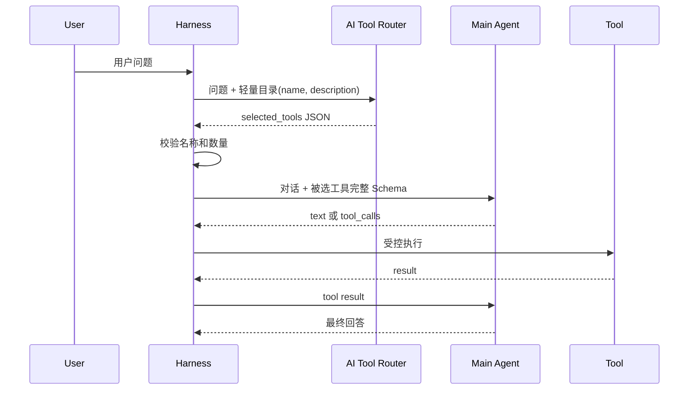

# 第 7 章：AI Tool Router 与工具筛选

[上一章：Guardrails](06-guardrails.md) | [下一章：审批与恢复](08-approval-and-checkpoint.md)

## 本章起点与终点

| 项目 | 内容 |
|---|---|
| 起点 | 每次主模型请求都发送所有工具的完整 JSON Schema |
| 终点 | Router 先读轻量目录，只把少量候选工具交给主模型 |
| 自动化验收 | 58 tests |

## 7.1 工具多时 Token 为什么会变大

每个 Native Tool 都包含：

- 函数名。
- 描述。
- 完整参数 JSON Schema。
- 字段描述、必填项和限制。

如果有 100 个工具，即使用户只说“你好”，这些 Schema 也可能全部进入主模型上下文：

```text
请求 Token = System + Memory + 当前问题 + 所有 Tool Schema
```

后果不仅是费用：

- 模型在相似工具中更容易选错。
- 请求体更大、延迟更高。
- 工具描述占用本该给对话和知识的上下文。

## 7.2 为什么不用手写关键词规则

规则路由：

```csharp
if (input.Contains("时间")) select get_current_time;
if (input.Contains("计算")) select calculate;
```

它无法可靠理解“离下班还有多久”“三的平方再加五”等表达，也会逐渐变成难维护的业务规则集合。

本课程采用你的方案：**把轻量工具目录发给 AI Router，让模型做语义选择；C# 只验证它的输出是否合法。**

## 7.3 两跳架构



Router 与主 Agent 可以使用同一个模型服务，但它们是两次不同请求，Prompt 和职责不同。

## 7.4 轻量工具目录

```csharp
public static class AgentToolCatalogBuilder
{
    public static IReadOnlyList<AgentToolCatalogItem> Build(
        IEnumerable<IAgentSkill> skills)
    {
        return skills
            .Select(skill => new AgentToolCatalogItem(
                skill.Name,
                skill.Description))
            .ToArray();
    }

    public static string BuildJson(IEnumerable<IAgentSkill> skills)
    {
        return JsonSerializer.Serialize(Build(skills), JsonOptions);
    }
}
```

目录示例：

```json
[
  {
    "name": "get_current_time",
    "description": "Get the current local date and time."
  },
  {
    "name": "calculate",
    "description": "Calculate a basic math expression."
  },
  {
    "name": "write_note",
    "description": "Append a note to the learner's note file."
  }
]
```

这里故意没有 `parameters`。Router 只需要判断哪类工具相关，不需要生成参数。

## 7.5 Router Prompt

System Message：

```text
You are an AI Tool Router for an Agent Harness.
Choose which tools should be exposed to the main agent.
Return only valid JSON.

{
  "need_tools": true,
  "selected_tools": ["exact_tool_name"],
  "reason": "short reason"
}

Rules:
- Use exact names from the catalog.
- If no tool is needed, return false and an empty array.
- Choose the smallest useful tool set.
- Do not answer the user.
```

User Message：

```text
Current user message:
帮我算 (2 + 3) * 4

Lightweight tool catalog:
[{"name":"get_current_time",...},{"name":"calculate",...}]
```

可能返回：

```json
{
  "need_tools": true,
  "selected_tools": ["calculate"],
  "reason": "The user asks for arithmetic."
}
```

## 7.6 Router 的调用代码

```csharp
private async Task<IReadOnlyList<IAgentSkill>>
    SelectSkillsForCurrentTurnAsync(
        string userInput,
        AgentWorkflowTrace workflowTrace)
{
    if (!_profile.NativeToolCalling || _skillRegistry.Skills.Count == 0)
    {
        return [];
    }

    if (!_profile.ToolRouterEnabled)
    {
        return _skillRegistry.Skills.ToArray();
    }

    string catalogJson = AgentToolCatalogBuilder.BuildJson(
        _skillRegistry.Skills);

    List<ChatMessage> routerMessages = BuildToolRouterMessages(
        userInput,
        catalogJson);

    ChatCompletion completion = await _client.CompleteChatAsync(
        routerMessages);

    string routerJson = ReadRouterTextContent(completion);
    AgentToolRoutingDecision decision =
        AgentToolRoutingDecisionParser.Parse(
            routerJson,
            _skillRegistry.Skills,
            _profile.MaxToolsPerRequest);

    return ResolveSelectedSkills(decision.SelectedToolNames);
}
```

这就是 Tool Router 第一跳的真实模型请求语句：

```csharp
await _client.CompleteChatAsync(routerMessages);
```

主模型随后还有自己的 `CompleteChatAsync`，所以开启 Router 后一次简单请求至少可能产生两次网络调用。

## 7.7 C# 不能盲信 Router JSON

模型输出属于不可信输入。Parser 验证：

1. 根节点必须是 JSON Object。
2. `need_tools` 必须是 Boolean。
3. `selected_tools` 必须是字符串数组。
4. `reason` 必须是非空字符串。
5. `need_tools` 与数组是否为空必须一致。
6. 不能超过 `max_tools_per_request`。
7. 不能重复选择同一工具。
8. 每个名称必须真的存在。

关键验证：

```csharp
private static void ValidateSelectedToolsExist(
    IReadOnlyList<string> selectedToolNames,
    IEnumerable<IAgentSkill> availableSkills)
{
    HashSet<string> availableToolNames = availableSkills
        .Select(skill => skill.Name)
        .ToHashSet(StringComparer.Ordinal);

    foreach (string toolName in selectedToolNames)
    {
        if (!availableToolNames.Contains(toolName))
        {
            throw new AgentToolRoutingException(
                $"Tool router selected unknown tool '{toolName}'.");
        }
    }
}
```

模型负责语义判断，代码负责工程边界。这比在 C# 自己猜用户意图更合适。

## 7.8 只给主模型选中的完整 Schema

```csharp
IReadOnlyList<IAgentSkill> selectedSkills =
    await SelectSkillsForCurrentTurnAsync(userInput, workflowTrace);

ChatCompletionOptions options = BuildChatOptions(selectedSkills);
```

若 Router 选中 `calculate`，主请求的 `tools` 中只有计算器完整 Schema。

若 `need_tools=false`，主模型仍会收到用户问题，但 `tools` 为空，直接文字回答。

## 7.9 Token 是否一定变少

不一定。Router 增加一次轻量模型调用，因此总成本是：

```text
Router 请求 Token
+ 主模型请求 Token
```

工具只有 2 到 5 个时，Router 可能得不偿失；工具几十或上百时，筛选才更有价值。还可以进一步：

- 按领域先分组工具。
- 缓存常见意图的路由结果。
- 使用更便宜的小模型路由。
- 只在工具数超过阈值时启用。

当前课程固定启用，是为了学习结构。

## 7.10 Router 失败时为什么不自动发全部工具

“Router JSON 错了就回退全部工具”看似稳定，却会隐藏真实问题，并改变成本与权限面。当前实现明确抛出 `AgentToolRoutingException`，通过日志和测试修复。

生产系统若要降级，应该把它设计成显式、可观察、受配置控制的策略，而不是宽泛 `catch`。

## 7.11 SSL 与 401 发生在哪一跳

Workflow 可以判断：

```text
Route tools -> SSL failure
```

说明失败发生在 Tool Router 第一跳，还没进入主模型，更没进入工具审批。

```text
Route tools -> 401 Unauthorized
```

说明 TLS 已成功，Router 拒绝了凭据。SSL 失败与 401 是不同层次的问题。

## 7.12 运行与测试

```bash
dotnet test AgentLearning.sln
```


58 个测试中，本章新增 7 个，覆盖目录、JSON 解析、未知工具、重复工具、数量限制和 Runner 候选工具传递。

<!-- BEGIN SELF-CONTAINED CODE -->
## 本章完整文件代码

这一节是本章的**完整代码依据**。前面的代码用于解释概念；真正动手时，请从上一章完成后的目录继续，并按下表逐项操作。`新建` 表示创建此前不存在的文件，`完整覆盖` 表示把旧文件全部替换成这里的内容。不要只复制局部片段。

> 下面已经包含本章所需的全部新增和变更文件，不需要再查找其他代码文件。

先在项目根目录执行下面的命令，确保本章需要的目录存在：

```bash
mkdir -p src/AgentLearning.App src/AgentLearning.Core src/AgentLearning.Core/Workflow tests/AgentLearning.Core.Tests
```

### 文件操作清单

| 操作 | 文件 |
|---|---|
| 新建 | `src/AgentLearning.Core/AgentToolCatalogBuilder.cs` |
| 新建 | `src/AgentLearning.Core/AgentToolCatalogItem.cs` |
| 新建 | `src/AgentLearning.Core/AgentToolRoutingDecision.cs` |
| 新建 | `src/AgentLearning.Core/AgentToolRoutingDecisionParser.cs` |
| 新建 | `src/AgentLearning.Core/AgentToolRoutingException.cs` |
| 新建 | `tests/AgentLearning.Core.Tests/AgentToolRouterTests.cs` |
| 完整覆盖 | `src/AgentLearning.App/AgentRunner.cs` |
| 完整覆盖 | `src/AgentLearning.App/Program.cs` |
| 完整覆盖 | `src/AgentLearning.App/agent.json` |
| 完整覆盖 | `src/AgentLearning.Core/AgentProfile.cs` |
| 完整覆盖 | `src/AgentLearning.Core/AgentProfileLoader.cs` |
| 完整覆盖 | `src/AgentLearning.Core/Workflow/AgentWorkflowStepKind.cs` |
| 完整覆盖 | `tests/AgentLearning.Core.Tests/AgentProfileLoaderTests.cs` |

<!-- FILE: ADD src/AgentLearning.Core/AgentToolCatalogBuilder.cs -->
<details>
<summary><strong>新建</strong> <code>src/AgentLearning.Core/AgentToolCatalogBuilder.cs</code></summary>

`````csharp
using AgentLearning.Core.Skills;
using System.Text.Encodings.Web;
using System.Text.Json;

namespace AgentLearning.Core;

/// <summary>
/// 把完整技能列表转换成轻量工具目录。
/// Tool Router 只需要知道“有什么工具、分别适合做什么”，不需要看到每个工具的完整参数定义。
/// </summary>
public static class AgentToolCatalogBuilder
{
    private static readonly JsonSerializerOptions JsonOptions = new()
    {
        WriteIndented = true,
        Encoder = JavaScriptEncoder.UnsafeRelaxedJsonEscaping
    };

    /// <summary>构建轻量目录对象，便于测试和后续扩展。</summary>
    public static IReadOnlyList<AgentToolCatalogItem> Build(IEnumerable<IAgentSkill> skills)
    {
        return skills
            .Select(skill => new AgentToolCatalogItem(skill.Name, skill.Description))
            .ToArray();
    }

    /// <summary>构建发给模型看的轻量目录 JSON。</summary>
    public static string BuildJson(IEnumerable<IAgentSkill> skills)
    {
        return JsonSerializer.Serialize(Build(skills), JsonOptions);
    }
}
`````

</details>
<!-- END FILE -->

<!-- FILE: ADD src/AgentLearning.Core/AgentToolCatalogItem.cs -->
<details>
<summary><strong>新建</strong> <code>src/AgentLearning.Core/AgentToolCatalogItem.cs</code></summary>

`````csharp
using System.Text.Json.Serialization;

namespace AgentLearning.Core;

/// <summary>
/// 发给 Tool Router 的轻量工具目录项。
/// 它只包含工具名和短说明，不包含完整参数 Schema，这样工具变多时也不会把上下文撑大。
/// </summary>
public sealed record AgentToolCatalogItem(
    /// <summary>工具的真实函数名，Router 必须原样返回这个名字。</summary>
    [property: JsonPropertyName("name")]
    string Name,

    /// <summary>工具的短说明，帮助 Router 判断什么时候该选择它。</summary>
    [property: JsonPropertyName("description")]
    string Description);
`````

</details>
<!-- END FILE -->

<!-- FILE: ADD src/AgentLearning.Core/AgentToolRoutingDecision.cs -->
<details>
<summary><strong>新建</strong> <code>src/AgentLearning.Core/AgentToolRoutingDecision.cs</code></summary>

`````csharp
namespace AgentLearning.Core;

/// <summary>
/// AI Tool Router 的选择结果。
/// 主 Agent 只会收到这里选中的工具完整 Schema。
/// </summary>
public sealed record AgentToolRoutingDecision(
    /// <summary>Router 是否认为这一轮需要工具。</summary>
    bool NeedTools,

    /// <summary>Router 选择的工具名列表，必须能在本地技能注册表中找到。</summary>
    IReadOnlyList<string> SelectedToolNames,

    /// <summary>Router 给出的简短原因，主要用于调试和学习。</summary>
    string Reason);
`````

</details>
<!-- END FILE -->

<!-- FILE: ADD src/AgentLearning.Core/AgentToolRoutingDecisionParser.cs -->
<details>
<summary><strong>新建</strong> <code>src/AgentLearning.Core/AgentToolRoutingDecisionParser.cs</code></summary>

`````csharp
using AgentLearning.Core.Skills;
using System.Text.Json;

namespace AgentLearning.Core;

/// <summary>
/// 解析并校验 AI Tool Router 返回的 JSON。
/// 模型负责语义选择；这里负责确认结果是否满足工程边界。
/// </summary>
public static class AgentToolRoutingDecisionParser
{
    /// <summary>
    /// 解析 Router JSON，并确认工具名真实存在、数量没有超过限制。
    /// </summary>
    public static AgentToolRoutingDecision Parse(
        string routerJson,
        IEnumerable<IAgentSkill> availableSkills,
        int maxToolsPerRequest)
    {
        if (maxToolsPerRequest <= 0)
        {
            throw new ArgumentOutOfRangeException(nameof(maxToolsPerRequest), "maxToolsPerRequest must be greater than zero.");
        }

        try
        {
            using JsonDocument document = JsonDocument.Parse(routerJson);
            JsonElement root = document.RootElement;

            if (root.ValueKind != JsonValueKind.Object)
            {
                throw new AgentToolRoutingException("Tool router response must be a JSON object.");
            }

            bool needTools = ReadRequiredBoolean(root, "need_tools");
            IReadOnlyList<string> selectedToolNames = ReadRequiredStringArray(root, "selected_tools");
            string reason = ReadRequiredString(root, "reason");

            ValidateSelectionConsistency(needTools, selectedToolNames);
            ValidateSelectionCount(selectedToolNames, maxToolsPerRequest);
            ValidateSelectedToolsExist(selectedToolNames, availableSkills);

            return new AgentToolRoutingDecision(needTools, selectedToolNames, reason);
        }
        catch (JsonException exception)
        {
            throw new AgentToolRoutingException("Tool router response must be valid JSON.", exception);
        }
    }

    private static bool ReadRequiredBoolean(JsonElement root, string propertyName)
    {
        if (!root.TryGetProperty(propertyName, out JsonElement value) ||
            value.ValueKind is not (JsonValueKind.True or JsonValueKind.False))
        {
            throw new AgentToolRoutingException($"Tool router response field '{propertyName}' must be a boolean.");
        }

        return value.GetBoolean();
    }

    private static string ReadRequiredString(JsonElement root, string propertyName)
    {
        if (!root.TryGetProperty(propertyName, out JsonElement value) ||
            value.ValueKind != JsonValueKind.String)
        {
            throw new AgentToolRoutingException($"Tool router response field '{propertyName}' must be a string.");
        }

        string? text = value.GetString();
        if (string.IsNullOrWhiteSpace(text))
        {
            throw new AgentToolRoutingException($"Tool router response field '{propertyName}' cannot be empty.");
        }

        return text;
    }

    private static IReadOnlyList<string> ReadRequiredStringArray(JsonElement root, string propertyName)
    {
        if (!root.TryGetProperty(propertyName, out JsonElement value) ||
            value.ValueKind != JsonValueKind.Array)
        {
            throw new AgentToolRoutingException($"Tool router response field '{propertyName}' must be an array.");
        }

        List<string> items = [];
        foreach (JsonElement item in value.EnumerateArray())
        {
            if (item.ValueKind != JsonValueKind.String)
            {
                throw new AgentToolRoutingException($"Tool router response field '{propertyName}' must only contain strings.");
            }

            string? toolName = item.GetString();
            if (string.IsNullOrWhiteSpace(toolName))
            {
                throw new AgentToolRoutingException($"Tool router response field '{propertyName}' cannot contain empty names.");
            }

            items.Add(toolName);
        }

        return items;
    }

    private static void ValidateSelectionConsistency(bool needTools, IReadOnlyList<string> selectedToolNames)
    {
        if (needTools && selectedToolNames.Count == 0)
        {
            throw new AgentToolRoutingException("Tool router said need_tools=true, but selected_tools is empty.");
        }

        if (!needTools && selectedToolNames.Count > 0)
        {
            throw new AgentToolRoutingException("Tool router said need_tools=false, but selected_tools is not empty.");
        }
    }

    private static void ValidateSelectionCount(IReadOnlyList<string> selectedToolNames, int maxToolsPerRequest)
    {
        if (selectedToolNames.Count > maxToolsPerRequest)
        {
            throw new AgentToolRoutingException(
                $"Tool router selected {selectedToolNames.Count} tools, but max_tools_per_request is {maxToolsPerRequest}.");
        }

        HashSet<string> seenNames = new(StringComparer.Ordinal);
        foreach (string toolName in selectedToolNames)
        {
            if (!seenNames.Add(toolName))
            {
                throw new AgentToolRoutingException($"Tool router selected duplicate tool '{toolName}'.");
            }
        }
    }

    private static void ValidateSelectedToolsExist(
        IReadOnlyList<string> selectedToolNames,
        IEnumerable<IAgentSkill> availableSkills)
    {
        HashSet<string> availableToolNames = availableSkills
            .Select(skill => skill.Name)
            .ToHashSet(StringComparer.Ordinal);

        foreach (string toolName in selectedToolNames)
        {
            if (!availableToolNames.Contains(toolName))
            {
                throw new AgentToolRoutingException($"Tool router selected unknown tool '{toolName}'.");
            }
        }
    }
}
`````

</details>
<!-- END FILE -->

<!-- FILE: ADD src/AgentLearning.Core/AgentToolRoutingException.cs -->
<details>
<summary><strong>新建</strong> <code>src/AgentLearning.Core/AgentToolRoutingException.cs</code></summary>

`````csharp
namespace AgentLearning.Core;

/// <summary>
/// Tool Router 返回了无法信任的选择结果。
/// 这里选择直接暴露错误，而不是偷偷回退到“发送全部工具”。
/// </summary>
public sealed class AgentToolRoutingException : InvalidOperationException
{
    public AgentToolRoutingException(string message) : base(message)
    {
    }

    public AgentToolRoutingException(string message, Exception innerException) : base(message, innerException)
    {
    }
}
`````

</details>
<!-- END FILE -->

<!-- FILE: ADD tests/AgentLearning.Core.Tests/AgentToolRouterTests.cs -->
<details>
<summary><strong>新建</strong> <code>tests/AgentLearning.Core.Tests/AgentToolRouterTests.cs</code></summary>

`````csharp
using AgentLearning.Core.Skills;

namespace AgentLearning.Core.Tests;

public sealed class AgentToolRouterTests
{
    [Fact]
    public void BuildJson_returns_lightweight_catalog_without_parameter_schemas()
    {
        AgentSkillRegistry registry = new([
            new CalculatorSkill(),
            new TimeSkill()
        ]);

        string catalogJson = AgentToolCatalogBuilder.BuildJson(registry.Skills);

        Assert.Contains("\"name\": \"calculate\"", catalogJson);
        Assert.Contains("\"description\":", catalogJson);
        Assert.DoesNotContain("parameters", catalogJson, StringComparison.OrdinalIgnoreCase);
        Assert.DoesNotContain("properties", catalogJson, StringComparison.OrdinalIgnoreCase);
        Assert.DoesNotContain("required", catalogJson, StringComparison.OrdinalIgnoreCase);
    }

    [Fact]
    public void Parse_returns_selected_tools_from_router_json()
    {
        AgentSkillRegistry registry = new([
            new CalculatorSkill(),
            new TimeSkill()
        ]);

        AgentToolRoutingDecision decision = AgentToolRoutingDecisionParser.Parse(
            """
            {
              "need_tools": true,
              "selected_tools": ["calculate"],
              "reason": "用户需要数学计算。"
            }
            """,
            registry.Skills,
            maxToolsPerRequest: 2);

        Assert.True(decision.NeedTools);
        Assert.Equal(new[] { "calculate" }, decision.SelectedToolNames);
        Assert.Equal("用户需要数学计算。", decision.Reason);
    }

    [Fact]
    public void Parse_returns_empty_selection_when_router_says_no_tool_is_needed()
    {
        AgentSkillRegistry registry = new([
            new CalculatorSkill(),
            new TimeSkill()
        ]);

        AgentToolRoutingDecision decision = AgentToolRoutingDecisionParser.Parse(
            """
            {
              "need_tools": false,
              "selected_tools": [],
              "reason": "普通聊天不需要工具。"
            }
            """,
            registry.Skills,
            maxToolsPerRequest: 2);

        Assert.False(decision.NeedTools);
        Assert.Empty(decision.SelectedToolNames);
    }

    [Fact]
    public void Parse_rejects_unknown_tool_names()
    {
        AgentSkillRegistry registry = new([
            new CalculatorSkill()
        ]);

        AgentToolRoutingException exception = Assert.Throws<AgentToolRoutingException>(
            () => AgentToolRoutingDecisionParser.Parse(
                """
                {
                  "need_tools": true,
                  "selected_tools": ["read_private_file"],
                  "reason": "模型选了一个不存在的工具。"
                }
                """,
                registry.Skills,
                maxToolsPerRequest: 2));

        Assert.Contains("read_private_file", exception.Message);
    }

    [Fact]
    public void Parse_rejects_too_many_selected_tools()
    {
        AgentSkillRegistry registry = new([
            new CalculatorSkill(),
            new TimeSkill()
        ]);

        AgentToolRoutingException exception = Assert.Throws<AgentToolRoutingException>(
            () => AgentToolRoutingDecisionParser.Parse(
                """
                {
                  "need_tools": true,
                  "selected_tools": ["calculate", "get_current_time"],
                  "reason": "模型一次选了过多工具。"
                }
                """,
                registry.Skills,
                maxToolsPerRequest: 1));

        Assert.Contains("max_tools_per_request", exception.Message);
    }

    [Fact]
    public void Parse_rejects_invalid_json()
    {
        AgentSkillRegistry registry = new([
            new CalculatorSkill()
        ]);

        AgentToolRoutingException exception = Assert.Throws<AgentToolRoutingException>(
            () => AgentToolRoutingDecisionParser.Parse(
                "我觉得可以用 calculate。",
                registry.Skills,
                maxToolsPerRequest: 1));

        Assert.Contains("valid JSON", exception.Message);
    }
}
`````

</details>
<!-- END FILE -->

<!-- FILE: REPLACE src/AgentLearning.App/AgentRunner.cs -->
<details>
<summary><strong>完整覆盖</strong> <code>src/AgentLearning.App/AgentRunner.cs</code></summary>

`````csharp
using AgentLearning.Core;
using AgentLearning.Core.Diagnostics;
using AgentLearning.Core.Skills;
using AgentLearning.Core.Workflow;
using OpenAI.Chat;
using System.Text;

namespace AgentLearning.App;

/// <summary>
/// Agent 的运行骨架。
/// 它把“记忆、上下文、模型调用、工具调用、工具观察、最终回答”放进一个可控循环里。
/// </summary>
public sealed class AgentRunner
{
    private readonly AgentProfile _profile;
    private readonly ChatClient _client;
    private readonly ChatMemory _memory;
    private readonly string _memoryPath;
    private readonly AgentSkillRegistry _skillRegistry;

    public AgentRunner(
        AgentProfile profile,
        ChatClient client,
        ChatMemory memory,
        string memoryPath,
        AgentSkillRegistry skillRegistry)
    {
        _profile = profile;
        _client = client;
        _memory = memory;
        _memoryPath = memoryPath;
        _skillRegistry = skillRegistry;
    }

    /// <summary>创建工作流步骤时触发，Program.cs 可以选择打印到控制台。</summary>
    public event Action<AgentWorkflowStep>? WorkflowStepCreated;

    /// <summary>创建调试文本时触发，Program.cs 可以选择打印到控制台。</summary>
    public event Action<string>? DebugMessageCreated;

    /// <summary>
    /// 运行一轮 Agent。
    /// 这里是 Harness 的核心：模型可以决定调用工具，但循环边界和记忆保存由代码控制。
    /// </summary>
    public async Task<AgentRunResult> RunAsync(string userInput)
    {
        if (string.IsNullOrWhiteSpace(userInput))
        {
            throw new ArgumentException("User input cannot be empty.", nameof(userInput));
        }

        AgentWorkflowTrace workflowTrace = new();

        AgentMemoryWritePolicy memoryWritePolicy = new(_profile.MaxMemoryContentChars);
        bool shouldSaveUserInput = memoryWritePolicy.ShouldWrite(userInput);

        AddWorkflowStep(
            workflowTrace,
            AgentWorkflowStepKind.ReceiveInput,
            "Receive user input",
            shouldSaveUserInput
                ? "User message is eligible for memory."
                : "User message will only be used in this turn.");

        IReadOnlyList<ChatTurn> contextTurns = ChatMemoryWindow.GetRecentTurns(_memory, _profile.MaxMemoryTurns);
        AddWorkflowStep(
            workflowTrace,
            AgentWorkflowStepKind.BuildContext,
            "Build context window",
            $"Sending {contextTurns.Count} of {_memory.Turns.Count} saved memory turns plus current input.");

        List<ChatMessage> messages = BuildMessages(contextTurns);
        List<AgentDebugMessage> debugMessages = BuildDebugMessages(contextTurns);
        AddCurrentUserInput(messages, debugMessages, userInput);

        string assistantReply = _profile.Stream
            ? await CompleteStreamingAsync(messages)
            : await CompleteOnceAsync(userInput, messages, debugMessages, workflowTrace);

        if (string.IsNullOrWhiteSpace(assistantReply))
        {
            throw new InvalidOperationException("The model returned no text content.");
        }

        AddWorkflowStep(
            workflowTrace,
            AgentWorkflowStepKind.Finish,
            "Finish",
            "Final answer was produced.");

        bool shouldSaveAssistantReply = memoryWritePolicy.ShouldWrite(assistantReply);
        if (shouldSaveUserInput && shouldSaveAssistantReply)
        {
            _memory.AddUserMessage(userInput);
            _memory.AddAssistantMessage(assistantReply);
            await ChatMemoryStore.SaveAsync(_memoryPath, _memory);
        }

        return new AgentRunResult(assistantReply, workflowTrace);
    }

    private async Task<string> CompleteOnceAsync(
        string userInput,
        List<ChatMessage> messages,
        List<AgentDebugMessage> debugMessages,
        AgentWorkflowTrace workflowTrace)
    {
        // native_tool_calling 打开时，先让 AI Tool Router 从轻量目录里选工具。
        // 主 Agent 只会收到被选中的工具完整 Schema。
        IReadOnlyList<IAgentSkill> selectedSkills = await SelectSkillsForCurrentTurnAsync(userInput, workflowTrace);
        ChatCompletionOptions? options = selectedSkills.Count > 0
            ? BuildChatOptions(selectedSkills)
            : null;

        AgentToolIterationGuard toolIterationGuard = new(_profile.MaxToolIterations);
        AgentToolResultLimiter toolResultLimiter = new(_profile.MaxToolResultChars);
        AgentToolTimeoutRunner toolTimeoutRunner = new(_profile.ToolTimeoutSeconds);
        int requestNumber = 1;
        while (true)
        {
            AddWorkflowStep(
                workflowTrace,
                AgentWorkflowStepKind.AskModel,
                "Ask model",
                $"Request #{requestNumber} sent to the model.");

            EmitChatRequestPreview(debugMessages, requestNumber, selectedSkills);
            ChatCompletion completion = await _client.CompleteChatAsync(messages, options);
            EmitChatResponsePreview(completion);

            // 有些 OpenAI-compatible Router 会返回 tool_calls，但 finish_reason 仍然是 stop。
            // 所以这里优先看 ToolCalls 本身，避免漏掉真正的工具调用请求。
            if (completion.ToolCalls.Count > 0)
            {
                if (!_profile.NativeToolCalling)
                {
                    throw new InvalidOperationException("The model returned tool calls, but native tool calling is disabled.");
                }

                toolIterationGuard.RecordToolIteration();
                await ResolveToolCallsAsync(messages, debugMessages, completion, workflowTrace, toolResultLimiter, toolTimeoutRunner);
                requestNumber++;
                continue;
            }

            switch (completion.FinishReason)
            {
                case ChatFinishReason.Stop:
                    return completion.Content.Count > 0
                        ? completion.Content[0].Text
                        : string.Empty;

                case ChatFinishReason.ToolCalls:
                    toolIterationGuard.RecordToolIteration();
                    await ResolveToolCallsAsync(messages, debugMessages, completion, workflowTrace, toolResultLimiter, toolTimeoutRunner);
                    requestNumber++;
                    break;

                case ChatFinishReason.Length:
                    throw new InvalidOperationException("Model output was cut off because it reached the token limit.");

                case ChatFinishReason.ContentFilter:
                    throw new InvalidOperationException("Model output was blocked by the content filter.");

                case ChatFinishReason.FunctionCall:
                    throw new InvalidOperationException("Deprecated function_call was returned. Use tool_calls instead.");

                default:
                    throw new InvalidOperationException($"Unsupported finish reason: {completion.FinishReason}");
            }
        }
    }

    private async Task<IReadOnlyList<IAgentSkill>> SelectSkillsForCurrentTurnAsync(
        string userInput,
        AgentWorkflowTrace workflowTrace)
    {
        if (!_profile.NativeToolCalling || _skillRegistry.Skills.Count == 0)
        {
            return [];
        }

        if (!_profile.ToolRouterEnabled)
        {
            AddWorkflowStep(
                workflowTrace,
                AgentWorkflowStepKind.RouteTools,
                "Route tools",
                $"Tool router is disabled. Sending all {_skillRegistry.Skills.Count} tools to the main agent.");

            return _skillRegistry.Skills.ToArray();
        }

        string catalogJson = AgentToolCatalogBuilder.BuildJson(_skillRegistry.Skills);
        AddWorkflowStep(
            workflowTrace,
            AgentWorkflowStepKind.RouteTools,
            "Route tools",
            $"Sending lightweight catalog with {_skillRegistry.Skills.Count} tools to the AI Tool Router.");

        List<ChatMessage> routerMessages = BuildToolRouterMessages(userInput, catalogJson);
        EmitToolRouterRequestPreview(userInput, catalogJson);

        ChatCompletion completion = await _client.CompleteChatAsync(routerMessages);
        string routerJson = ReadRouterTextContent(completion);
        EmitToolRouterResponsePreview(completion, routerJson);

        AgentToolRoutingDecision decision = AgentToolRoutingDecisionParser.Parse(
            routerJson,
            _skillRegistry.Skills,
            _profile.MaxToolsPerRequest);

        IReadOnlyList<IAgentSkill> selectedSkills = ResolveSelectedSkills(decision.SelectedToolNames);
        string selectedToolText = selectedSkills.Count == 0
            ? "no tools"
            : string.Join(", ", selectedSkills.Select(skill => skill.Name));

        AddWorkflowStep(
            workflowTrace,
            AgentWorkflowStepKind.RouteTools,
            "Route tools result",
            $"Router selected {selectedToolText}. Reason: {decision.Reason}");

        return selectedSkills;
    }

    private static List<ChatMessage> BuildToolRouterMessages(string userInput, string catalogJson)
    {
        return
        [
            new SystemChatMessage(BuildToolRouterSystemInstructions()),
            new UserChatMessage(BuildToolRouterUserMessage(userInput, catalogJson))
        ];
    }

    private static string BuildToolRouterSystemInstructions()
    {
        return """
        You are an AI Tool Router for an Agent Harness.
        Your job is to choose which tools should be exposed to the main agent for the current user message.

        Return only valid JSON. Do not wrap it in Markdown. Do not explain outside JSON.

        JSON shape:
        {
          "need_tools": true,
          "selected_tools": ["exact_tool_name"],
          "reason": "short reason"
        }

        Rules:
        - Use exact tool names from the tool catalog.
        - If no tool is needed, return need_tools=false and selected_tools=[].
        - Choose the smallest useful tool set.
        - You are only routing tools. You are not answering the user.
        """;
    }

    private static string BuildToolRouterUserMessage(string userInput, string catalogJson)
    {
        return $"""
        Current user message:
        {userInput}

        Lightweight tool catalog:
        {catalogJson}
        """;
    }

    private static string ReadRouterTextContent(ChatCompletion completion)
    {
        string text = string.Concat(completion.Content.Select(part => part.Text));
        if (string.IsNullOrWhiteSpace(text))
        {
            throw new AgentToolRoutingException("Tool router returned no JSON content.");
        }

        return text;
    }

    private IReadOnlyList<IAgentSkill> ResolveSelectedSkills(IReadOnlyList<string> selectedToolNames)
    {
        if (selectedToolNames.Count == 0)
        {
            return [];
        }

        Dictionary<string, IAgentSkill> skillsByName = _skillRegistry.Skills.ToDictionary(
            skill => skill.Name,
            StringComparer.Ordinal);

        return selectedToolNames
            .Select(toolName => skillsByName[toolName])
            .ToArray();
    }

    private async Task<string> CompleteStreamingAsync(List<ChatMessage> messages)
    {
        StringBuilder fullReply = new();

        await foreach (StreamingChatCompletionUpdate update in _client.CompleteChatStreamingAsync(messages))
        {
            if (update.ContentUpdate.Count == 0)
            {
                continue;
            }

            fullReply.Append(update.ContentUpdate[0].Text);
        }

        return fullReply.ToString();
    }

    private async Task ResolveToolCallsAsync(
        List<ChatMessage> messages,
        List<AgentDebugMessage> debugMessages,
        ChatCompletion completion,
        AgentWorkflowTrace workflowTrace,
        AgentToolResultLimiter toolResultLimiter,
        AgentToolTimeoutRunner toolTimeoutRunner)
    {
        // 先把“模型要求调用工具”这条 assistant 消息加入上下文。
        // SDK 会保留 tool_call_id，下一条 ToolChatMessage 才能和它对上。
        messages.Add(new AssistantChatMessage(completion));
        debugMessages.Add(new AgentDebugMessage
        {
            Role = "assistant",
            ToolCalls = completion.ToolCalls
                .Select(toolCall => new AgentDebugToolCall(
                    toolCall.Id,
                    toolCall.FunctionName,
                    toolCall.FunctionArguments.ToString()))
                .ToArray()
        });

        foreach (ChatToolCall toolCall in completion.ToolCalls)
        {
            AddWorkflowStep(
                workflowTrace,
                AgentWorkflowStepKind.ToolRequested,
                "Act",
                $"Model requested tool '{toolCall.FunctionName}'.");

            string rawResult;
            bool toolFailed = false;
            try
            {
                rawResult = await toolTimeoutRunner.RunAsync(
                    toolCall.FunctionName,
                    cancellationToken => _skillRegistry.ExecuteAsync(
                        toolCall.FunctionName,
                        toolCall.FunctionArguments.ToString(),
                        cancellationToken));
            }
            catch (Exception exception) when (AgentToolErrorFormatter.IsRecoverable(exception))
            {
                toolFailed = true;
                rawResult = AgentToolErrorFormatter.FormatRecoverableError(
                    toolCall.FunctionName,
                    exception);

                AddWorkflowStep(
                    workflowTrace,
                    AgentWorkflowStepKind.ToolFailed,
                    "Observe tool error",
                    $"Tool '{toolCall.FunctionName}' failed: {exception.Message}");
            }

            string result = toolResultLimiter.Limit(rawResult);

            if (!toolFailed)
            {
                AddWorkflowStep(
                    workflowTrace,
                    AgentWorkflowStepKind.ToolExecuted,
                    "Observe",
                    $"Tool '{toolCall.FunctionName}' returned: {result}");
            }

            EmitToolResultPreview(toolCall, result);

            // 这条消息相当于告诉模型：你刚才要的工具结果在这里。
            messages.Add(new ToolChatMessage(toolCall.Id, result));
            debugMessages.Add(new AgentDebugMessage
            {
                Role = "tool",
                ToolCallId = toolCall.Id,
                Content = result
            });
        }
    }

    private List<ChatMessage> BuildMessages(IReadOnlyList<ChatTurn> contextTurns)
    {
        List<ChatMessage> messages =
        [
            // system message 是角色设定：它告诉模型“你是谁、该怎么回答”。
            new SystemChatMessage(BuildSystemInstructions())
        ];

        foreach (ChatTurn turn in contextTurns)
        {
            messages.Add(turn.Role switch
            {
                ChatRole.User => new UserChatMessage(turn.Content),
                ChatRole.Assistant => new AssistantChatMessage(turn.Content),
                _ => throw new InvalidOperationException($"Unsupported chat role: {turn.Role}")
            });
        }

        return messages;
    }

    private static void AddCurrentUserInput(
        List<ChatMessage> messages,
        List<AgentDebugMessage> debugMessages,
        string userInput)
    {
        messages.Add(new UserChatMessage(userInput));
        debugMessages.Add(new AgentDebugMessage
        {
            Role = "user",
            Content = userInput
        });
    }

    private List<AgentDebugMessage> BuildDebugMessages(IReadOnlyList<ChatTurn> contextTurns)
    {
        List<AgentDebugMessage> messages =
        [
            new()
            {
                Role = "system",
                Content = BuildSystemInstructions()
            }
        ];

        foreach (ChatTurn turn in contextTurns)
        {
            messages.Add(turn.Role switch
            {
                ChatRole.User => new AgentDebugMessage
                {
                    Role = "user",
                    Content = turn.Content
                },
                ChatRole.Assistant => new AgentDebugMessage
                {
                    Role = "assistant",
                    Content = turn.Content
                },
                _ => throw new InvalidOperationException($"Unsupported chat role: {turn.Role}")
            });
        }

        return messages;
    }

    private ChatCompletionOptions BuildChatOptions(IEnumerable<IAgentSkill> selectedSkills)
    {
        ChatCompletionOptions options = new();

        foreach (IAgentSkill skill in selectedSkills)
        {
            options.Tools.Add(ChatTool.CreateFunctionTool(
                functionName: skill.Name,
                functionDescription: skill.Description,
                functionParameters: BinaryData.FromString(skill.ParametersJson)));
        }

        return options;
    }

    private void AddWorkflowStep(
        AgentWorkflowTrace workflowTrace,
        AgentWorkflowStepKind kind,
        string title,
        string detail)
    {
        AgentWorkflowStep step = workflowTrace.Add(kind, title, detail);
        WorkflowStepCreated?.Invoke(step);
    }

    private void EmitChatRequestPreview(
        List<AgentDebugMessage> debugMessages,
        int requestNumber,
        IReadOnlyList<IAgentSkill> selectedSkills)
    {
        if (!_profile.ShowDebugRequests)
        {
            return;
        }

        StringBuilder builder = new();
        builder.AppendLine();
        builder.AppendLine($"--- Debug request body preview #{requestNumber} ---");
        builder.AppendLine(AgentDebugPreviewBuilder.BuildChatCompletionsRequestPreview(
            model: _profile.Model,
            stream: _profile.Stream,
            messages: debugMessages,
            skills: selectedSkills,
            includeTools: selectedSkills.Count > 0));
        builder.AppendLine("--- End debug request body preview ---");

        DebugMessageCreated?.Invoke(builder.ToString());
    }

    private void EmitToolRouterRequestPreview(string userInput, string catalogJson)
    {
        if (!_profile.ShowDebugRequests)
        {
            return;
        }

        AgentDebugMessage[] debugMessages =
        [
            new()
            {
                Role = "system",
                Content = BuildToolRouterSystemInstructions()
            },
            new()
            {
                Role = "user",
                Content = BuildToolRouterUserMessage(userInput, catalogJson)
            }
        ];

        StringBuilder builder = new();
        builder.AppendLine();
        builder.AppendLine("--- Debug tool router request body preview ---");
        builder.AppendLine(AgentDebugPreviewBuilder.BuildChatCompletionsRequestPreview(
            model: _profile.Model,
            stream: false,
            messages: debugMessages,
            skills: [],
            includeTools: false));
        builder.AppendLine("--- End debug tool router request body preview ---");

        DebugMessageCreated?.Invoke(builder.ToString());
    }

    private void EmitToolRouterResponsePreview(ChatCompletion completion, string routerJson)
    {
        if (!_profile.ShowDebugRequests)
        {
            return;
        }

        StringBuilder builder = new();
        builder.AppendLine("--- Debug tool router response preview ---");
        builder.AppendLine($"finish_reason: {completion.FinishReason}");
        builder.AppendLine($"content: {AgentDebugPreviewBuilder.RedactSensitiveValues(routerJson)}");
        builder.AppendLine("--- End debug tool router response preview ---");

        DebugMessageCreated?.Invoke(builder.ToString());
    }

    private void EmitChatResponsePreview(ChatCompletion completion)
    {
        if (!_profile.ShowDebugRequests)
        {
            return;
        }

        StringBuilder builder = new();
        builder.AppendLine("--- Debug model response preview ---");
        builder.AppendLine($"finish_reason: {completion.FinishReason}");

        if (completion.ToolCalls.Count > 0)
        {
            foreach (ChatToolCall toolCall in completion.ToolCalls)
            {
                builder.AppendLine($"tool_call_id: {toolCall.Id}");
                builder.AppendLine($"tool_name: {toolCall.FunctionName}");
                builder.AppendLine($"tool_arguments: {AgentDebugPreviewBuilder.RedactSensitiveValues(toolCall.FunctionArguments.ToString())}");
            }
        }
        else if (completion.Content.Count > 0)
        {
            builder.AppendLine($"content: {AgentDebugPreviewBuilder.RedactSensitiveValues(string.Concat(completion.Content.Select(part => part.Text)))}");
        }
        else
        {
            builder.AppendLine("content: <empty>");
        }

        builder.AppendLine("--- End debug model response preview ---");
        DebugMessageCreated?.Invoke(builder.ToString());
    }

    private void EmitToolResultPreview(ChatToolCall toolCall, string result)
    {
        if (!_profile.ShowDebugRequests)
        {
            return;
        }

        StringBuilder builder = new();
        builder.AppendLine("--- Debug local tool result ---");
        builder.AppendLine($"tool_call_id: {toolCall.Id}");
        builder.AppendLine($"tool_name: {toolCall.FunctionName}");
        builder.AppendLine($"result: {AgentDebugPreviewBuilder.RedactSensitiveValues(result)}");
        builder.AppendLine("--- End debug local tool result ---");
        DebugMessageCreated?.Invoke(builder.ToString());
    }

    private string BuildSystemInstructions()
    {
        return $"""
        You are {_profile.Name}.

        Description:
        {_profile.Description}

        Instructions:
        {_profile.Instructions}
        """;
    }
}
`````

</details>
<!-- END FILE -->

<!-- FILE: REPLACE src/AgentLearning.App/Program.cs -->
<details>
<summary><strong>完整覆盖</strong> <code>src/AgentLearning.App/Program.cs</code></summary>

`````csharp
using AgentLearning.App;
using AgentLearning.Core;
using AgentLearning.Core.Skills;
using AgentLearning.Core.Workflow;
using OpenAI;
using OpenAI.Chat;
using System.ClientModel;
using System.Text.Json;

// AppContext.BaseDirectory 指向编译后的运行目录。
// csproj 已经配置了复制 agent.json 和 agent.local.json，所以运行时能在这里找到配置文件。
string profilePath = Path.Combine(AppContext.BaseDirectory, "agent.json");
string localProfilePath = Path.Combine(AppContext.BaseDirectory, "agent.local.json");

// 读取 Agent 的角色设定、API 接线配置，以及本地私有密钥配置。
AgentProfile profile = await AgentProfileLoader.LoadFromFileAsync(profilePath, localProfilePath);

// 优先使用 agent.local.json 里的 api_key。
// 如果你临时不想写本地文件，也仍然可以用环境变量兜底。
string? apiKey = profile.ApiKey ?? Environment.GetEnvironmentVariable(profile.EnvKey);
if (string.IsNullOrWhiteSpace(apiKey))
{
    Console.WriteLine($"No API key was found in agent.local.json or {profile.EnvKey}.");
    Console.WriteLine("Set one of them, then run this app again:");
    Console.WriteLine("  agent.local.json: { \"api_key\": \"sk-...\" }");
    Console.WriteLine($"  export {profile.EnvKey}=\"sk-...\"");
    return 1;
}

// ChatClient 对应你给的 curl 路径：POST /v1/chat/completions。
// Endpoint 使用 https://router.hddev.top/v1，SDK 会在它后面拼接 /chat/completions。
ChatClient client = new(
    model: profile.Model,
    credential: new ApiKeyCredential(apiKey),
    options: new OpenAIClientOptions
    {
        Endpoint = new Uri(profile.BaseUrl)
    });

// memory_file 可以写相对路径；这里把它解析成真正使用的文件路径。
string memoryPath = AgentPathResolver.ResolveRuntimePath(AppContext.BaseDirectory, profile.MemoryFile);

// 现在记忆会从本地 JSON 文件恢复；文件不存在时得到一个空记忆。
ChatMemory memory = await ChatMemoryStore.LoadAsync(memoryPath);

// 注册当前 Agent 可以使用的技能。
// 这一步只是把 C# 函数准备好，真正什么时候调用由模型决定。
AgentSkillRegistry skillRegistry = new([
    new TimeSkill(),
    new CalculatorSkill()
]);

AgentRunner agentRunner = new(profile, client, memory, memoryPath, skillRegistry);
agentRunner.WorkflowStepCreated += step =>
{
    if (profile.ShowWorkflowTrace)
    {
        Console.WriteLine(AgentWorkflowStepFormatter.Format(step));
    }
};
agentRunner.DebugMessageCreated += Console.Write;

Console.WriteLine($"Loaded agent: {profile.Name}");
Console.WriteLine($"Wire API: {profile.WireApi}");
Console.WriteLine($"Base URL: {profile.BaseUrl}");
Console.WriteLine($"Stream: {profile.Stream}");
Console.WriteLine($"Native tool calling: {profile.NativeToolCalling}");
Console.WriteLine($"Tool router enabled: {profile.ToolRouterEnabled}");
Console.WriteLine($"Max tools per request: {profile.MaxToolsPerRequest}");
Console.WriteLine($"Show debug requests: {profile.ShowDebugRequests}");
Console.WriteLine($"Show workflow trace: {profile.ShowWorkflowTrace}");
Console.WriteLine($"Memory file: {memoryPath}");
Console.WriteLine($"Loaded memory turns: {memory.Turns.Count}");
Console.WriteLine($"Max memory turns sent: {profile.MaxMemoryTurns}");
Console.WriteLine($"Max memory content chars: {profile.MaxMemoryContentChars}");
Console.WriteLine($"Max tool iterations: {profile.MaxToolIterations}");
Console.WriteLine($"Max tool result chars: {profile.MaxToolResultChars}");
Console.WriteLine($"Tool timeout seconds: {profile.ToolTimeoutSeconds}");
Console.WriteLine($"Skills: {string.Join(", ", skillRegistry.Skills.Select(skill => skill.Name))}");
Console.WriteLine("Type a message and press Enter. Type 'exit' to quit.");
Console.WriteLine("Local skill commands: /time, /calc <expression>");
Console.WriteLine();

if (profile.Stream && profile.NativeToolCalling)
{
    Console.WriteLine("Native tool calling is only implemented for non-streaming mode in this lesson.");
    return 1;
}

while (true)
{
    Console.Write("You> ");
    string? input = Console.ReadLine();

    // 输入 exit 就退出；这就是当前最简单的交互方式。
    if (input is null || input.Equals("exit", StringComparison.OrdinalIgnoreCase))
    {
        break;
    }

    // 空输入不调用模型，避免浪费一次请求。
    if (string.IsNullOrWhiteSpace(input))
    {
        continue;
    }

    if (await TryRunLocalSkillCommandAsync(input, profile, memory, memoryPath, skillRegistry))
    {
        Console.WriteLine();
        continue;
    }

    try
    {
        AgentRunResult result = await agentRunner.RunAsync(input);

        if (!profile.Stream)
        {
            Console.WriteLine($"{profile.Name}> {result.AssistantReply}");
        }

        Console.WriteLine();
    }
    catch (Exception exception)
    {
        Console.WriteLine($"Agent call failed: {exception.Message}");
        return 1;
    }
}

return 0;

static async Task<bool> TryRunLocalSkillCommandAsync(
    string input,
    AgentProfile profile,
    ChatMemory memory,
    string memoryPath,
    AgentSkillRegistry skillRegistry)
{
    if (input.Equals("/time", StringComparison.OrdinalIgnoreCase))
    {
        string result = await skillRegistry.ExecuteAsync("get_current_time", "{}");
        await TrySaveLocalSkillMemoryAsync(profile, memory, memoryPath, input, result);
        Console.WriteLine($"{profile.Name}> {result}");
        return true;
    }

    const string calculatorPrefix = "/calc ";
    if (input.StartsWith(calculatorPrefix, StringComparison.OrdinalIgnoreCase))
    {
        string expression = input[calculatorPrefix.Length..].Trim();
        string argumentsJson = JsonSerializer.Serialize(new { expression });
        string result = await skillRegistry.ExecuteAsync("calculate", argumentsJson);

        await TrySaveLocalSkillMemoryAsync(profile, memory, memoryPath, input, result);
        Console.WriteLine($"{profile.Name}> {result}");
        return true;
    }

    return false;
}

static async Task TrySaveLocalSkillMemoryAsync(
    AgentProfile profile,
    ChatMemory memory,
    string memoryPath,
    string userInput,
    string assistantReply)
{
    AgentMemoryWritePolicy memoryWritePolicy = new(profile.MaxMemoryContentChars);
    if (!memoryWritePolicy.ShouldWrite(userInput) || !memoryWritePolicy.ShouldWrite(assistantReply))
    {
        return;
    }

    memory.AddUserMessage(userInput);
    memory.AddAssistantMessage(assistantReply);
    await ChatMemoryStore.SaveAsync(memoryPath, memory);
}
`````

</details>
<!-- END FILE -->

<!-- FILE: REPLACE src/AgentLearning.App/agent.json -->
<details>
<summary><strong>完整覆盖</strong> <code>src/AgentLearning.App/agent.json</code></summary>

`````json
{
  "name": "Grimoire Router",
  "model": "gpt-5.4",
  "base_url": "https://router.hddev.top/v1",
  "env_key": "GRIMOIRE_API_KEY",
  "wire_api": "chat_completions",
  "stream": false,
  "native_tool_calling": true,
  "tool_router_enabled": true,
  "max_tools_per_request": 2,
  "show_debug_requests": true,
  "show_workflow_trace": true,
  "memory_file": "memory/chat-memory.json",
  "max_memory_turns": 6,
  "max_memory_content_chars": 2000,
  "max_tool_iterations": 3,
  "max_tool_result_chars": 1200,
  "tool_timeout_seconds": 5,
  "description": "A patient C# agent teacher for a beginner learning how agents work.",
  "instructions": "Teach one concept at a time. Prefer small examples. Explain why each piece exists before adding the next piece."
}
`````

</details>
<!-- END FILE -->

<!-- FILE: REPLACE src/AgentLearning.Core/AgentProfile.cs -->
<details>
<summary><strong>完整覆盖</strong> <code>src/AgentLearning.Core/AgentProfile.cs</code></summary>

`````csharp
using System.Text.Json.Serialization;

namespace AgentLearning.Core;

/// <summary>
/// Agent 的角色、模型接线配置，以及运行保护规则。
/// </summary>
public sealed record AgentProfile(
    /// <summary>Agent 的显示名称。</summary>
    string Name,

    /// <summary>要调用的模型名称，由当前 Router/服务端决定可用值。</summary>
    string Model,

    /// <summary>OpenAI 兼容服务的基础地址，例如 https://router.hddev.top/v1。</summary>
    [property: JsonPropertyName("base_url")]
    string BaseUrl,

    /// <summary>保存 API Key 的环境变量名，代码不会把密钥写死在文件里。</summary>
    [property: JsonPropertyName("env_key")]
    string EnvKey,

    /// <summary>底层调用协议。你的 curl 示例使用 chat_completions。</summary>
    [property: JsonPropertyName("wire_api")]
    string WireApi,

    /// <summary>是否使用流式返回。false 对应 curl 里的 "stream": false。</summary>
    [property: JsonPropertyName("stream")]
    bool Stream,

    /// <summary>是否把技能声明为 Chat Completions 原生 tools，让模型自动选择要不要调用技能。</summary>
    [property: JsonPropertyName("native_tool_calling")]
    bool NativeToolCalling,

    /// <summary>是否先调用 AI Tool Router，让模型从轻量工具目录里选择本轮需要暴露的工具。</summary>
    [property: JsonPropertyName("tool_router_enabled")]
    bool ToolRouterEnabled,

    /// <summary>AI Tool Router 一次最多可以选择多少个工具，用来避免单轮暴露过多工具。</summary>
    [property: JsonPropertyName("max_tools_per_request")]
    int MaxToolsPerRequest,

    /// <summary>是否在控制台打印请求体预览，方便学习和排查 Tool Calling。</summary>
    [property: JsonPropertyName("show_debug_requests")]
    bool ShowDebugRequests,

    /// <summary>是否打印 Agent 工作流步骤，方便观察 ReAct 循环。</summary>
    [property: JsonPropertyName("show_workflow_trace")]
    bool ShowWorkflowTrace,

    /// <summary>聊天记忆保存到哪里。相对路径会基于程序运行目录计算。</summary>
    [property: JsonPropertyName("memory_file")]
    string MemoryFile,

    /// <summary>每次请求最多发送多少条历史消息给模型，用来控制上下文大小。</summary>
    [property: JsonPropertyName("max_memory_turns")]
    int MaxMemoryTurns,

    /// <summary>单条记忆最多允许保存多少字符，用来避免大段文本污染长期记忆。</summary>
    [property: JsonPropertyName("max_memory_content_chars")]
    int MaxMemoryContentChars,

    /// <summary>一次用户请求里最多允许几轮工具调用，用来防止工具循环失控。</summary>
    [property: JsonPropertyName("max_tool_iterations")]
    int MaxToolIterations,

    /// <summary>工具结果最多保留多少字符发回模型，用来控制上下文大小。</summary>
    [property: JsonPropertyName("max_tool_result_chars")]
    int MaxToolResultChars,

    /// <summary>每个工具最多允许执行多少秒，用来防止工具卡住后 Agent 一直等待。</summary>
    [property: JsonPropertyName("tool_timeout_seconds")]
    int ToolTimeoutSeconds,

    /// <summary>本地 API Key。建议只放在 agent.local.json，不要放在主配置里。</summary>
    [property: JsonPropertyName("api_key")]
    string? ApiKey,

    /// <summary>Agent 的一句话说明，方便人理解它的用途。</summary>
    string Description,

    /// <summary>Agent 的系统指令，决定它回答问题时的角色、语气和边界。</summary>
    string Instructions);
`````

</details>
<!-- END FILE -->

<!-- FILE: REPLACE src/AgentLearning.Core/AgentProfileLoader.cs -->
<details>
<summary><strong>完整覆盖</strong> <code>src/AgentLearning.Core/AgentProfileLoader.cs</code></summary>

`````csharp
using System.Text.Json;

namespace AgentLearning.Core;

/// <summary>
/// 负责从 JSON 文件读取 Agent 配置，并做最基本的校验。
/// </summary>
public static class AgentProfileLoader
{
    // 允许 JSON 里的 name/model 等字段大小写不敏感。
    // base_url/env_key/wire_api 这种下划线字段通过 AgentProfile 上的 JsonPropertyName 映射。
    private static readonly JsonSerializerOptions JsonOptions = new()
    {
        PropertyNameCaseInsensitive = true
    };

    /// <summary>
    /// 从指定路径读取 Agent 配置。
    /// </summary>
    public static async Task<AgentProfile> LoadFromFileAsync(
        string filePath,
        CancellationToken cancellationToken = default)
    {
        return await LoadFromFileAsync(filePath, localFilePath: null, cancellationToken);
    }

    /// <summary>
    /// 从主配置和本地私有配置读取 Agent 配置。
    /// 主配置放公开信息，本地配置只放 api_key。
    /// </summary>
    public static async Task<AgentProfile> LoadFromFileAsync(
        string filePath,
        string? localFilePath,
        CancellationToken cancellationToken = default)
    {
        if (!File.Exists(filePath))
        {
            throw new FileNotFoundException("Agent profile file was not found.", filePath);
        }

        await using FileStream stream = File.OpenRead(filePath);
        AgentProfile? profile = await JsonSerializer.DeserializeAsync<AgentProfile>(
            stream,
            JsonOptions,
            cancellationToken);

        if (profile is null)
        {
            throw new InvalidOperationException("Agent profile file is empty or invalid.");
        }

        AgentProfile mergedProfile = await MergeLocalProfileAsync(profile, localFilePath, cancellationToken);

        Validate(mergedProfile);
        return mergedProfile;
    }

    private static async Task<AgentProfile> MergeLocalProfileAsync(
        AgentProfile profile,
        string? localFilePath,
        CancellationToken cancellationToken)
    {
        if (string.IsNullOrWhiteSpace(localFilePath) || !File.Exists(localFilePath))
        {
            return NormalizeApiKey(profile);
        }

        await using FileStream stream = File.OpenRead(localFilePath);
        AgentLocalProfile? localProfile = await JsonSerializer.DeserializeAsync<AgentLocalProfile>(
            stream,
            JsonOptions,
            cancellationToken);

        if (localProfile is null || string.IsNullOrWhiteSpace(localProfile.ApiKey))
        {
            return NormalizeApiKey(profile);
        }

        return profile with { ApiKey = localProfile.ApiKey.Trim() };
    }

    private static AgentProfile NormalizeApiKey(AgentProfile profile)
    {
        return string.IsNullOrWhiteSpace(profile.ApiKey)
            ? profile with { ApiKey = null }
            : profile with { ApiKey = profile.ApiKey.Trim() };
    }

    // 配置缺失时直接抛出清晰错误，不用默认值偷偷掩盖问题。
    private static void Validate(AgentProfile profile)
    {
        RequireValue(profile.Name, "name");
        RequireValue(profile.Model, "model");
        RequireValue(profile.BaseUrl, "base_url");
        RequireValue(profile.EnvKey, "env_key");
        RequireValue(profile.WireApi, "wire_api");
        RequireValue(profile.MemoryFile, "memory_file");
        RequireValue(profile.Description, "description");
        RequireValue(profile.Instructions, "instructions");

        if (!Uri.TryCreate(profile.BaseUrl, UriKind.Absolute, out _))
        {
            throw new InvalidOperationException("Agent profile field 'base_url' must be an absolute URL.");
        }

        if (profile.MaxMemoryTurns <= 0)
        {
            throw new InvalidOperationException("Agent profile field 'max_memory_turns' must be greater than zero.");
        }

        if (profile.MaxMemoryContentChars <= 0)
        {
            throw new InvalidOperationException("Agent profile field 'max_memory_content_chars' must be greater than zero.");
        }

        if (profile.MaxToolsPerRequest <= 0)
        {
            throw new InvalidOperationException("Agent profile field 'max_tools_per_request' must be greater than zero.");
        }

        if (profile.MaxToolIterations <= 0)
        {
            throw new InvalidOperationException("Agent profile field 'max_tool_iterations' must be greater than zero.");
        }

        if (profile.MaxToolResultChars <= 0)
        {
            throw new InvalidOperationException("Agent profile field 'max_tool_result_chars' must be greater than zero.");
        }

        if (profile.ToolTimeoutSeconds <= 0)
        {
            throw new InvalidOperationException("Agent profile field 'tool_timeout_seconds' must be greater than zero.");
        }

        if (!profile.WireApi.Equals("chat_completions", StringComparison.OrdinalIgnoreCase))
        {
            throw new InvalidOperationException("Only wire_api = 'chat_completions' is supported in this lesson.");
        }
    }

    private static void RequireValue(string? value, string fieldName)
    {
        if (string.IsNullOrWhiteSpace(value))
        {
            throw new InvalidOperationException($"Agent profile field '{fieldName}' is required.");
        }
    }

    private sealed record AgentLocalProfile(
        [property: System.Text.Json.Serialization.JsonPropertyName("api_key")]
        string? ApiKey);
}
`````

</details>
<!-- END FILE -->

<!-- FILE: REPLACE src/AgentLearning.Core/Workflow/AgentWorkflowStepKind.cs -->
<details>
<summary><strong>完整覆盖</strong> <code>src/AgentLearning.Core/Workflow/AgentWorkflowStepKind.cs</code></summary>

`````csharp
namespace AgentLearning.Core.Workflow;

/// <summary>
/// Agent 工作流里可以被观察到的步骤类型。
/// 这里记录的是外部行为，不记录模型隐藏思考。
/// </summary>
public enum AgentWorkflowStepKind
{
    ReceiveInput,
    BuildContext,
    RouteTools,
    AskModel,
    ToolRequested,
    ToolFailed,
    ToolExecuted,
    Finish
}
`````

</details>
<!-- END FILE -->

<!-- FILE: REPLACE tests/AgentLearning.Core.Tests/AgentProfileLoaderTests.cs -->
<details>
<summary><strong>完整覆盖</strong> <code>tests/AgentLearning.Core.Tests/AgentProfileLoaderTests.cs</code></summary>

`````csharp
using AgentLearning.Core;

namespace AgentLearning.Core.Tests;

public sealed class AgentProfileLoaderTests
{
    [Fact]
    public async Task LoadFromFileAsync_reads_agent_role_settings()
    {
        string tempFile = Path.Combine(Path.GetTempPath(), $"agent-{Guid.NewGuid():N}.json");
        await File.WriteAllTextAsync(
            tempFile,
            """
            {
              "name": "Grimoire Tutor",
              "model": "gpt-5.4",
              "base_url": "https://router.hddev.top/v1",
              "env_key": "GRIMOIRE_API_KEY",
              "wire_api": "chat_completions",
              "stream": false,
              "native_tool_calling": false,
              "tool_router_enabled": true,
              "max_tools_per_request": 2,
              "show_debug_requests": true,
              "show_workflow_trace": true,
              "memory_file": "memory/chat-memory.json",
              "max_memory_turns": 6,
              "max_memory_content_chars": 2000,
              "max_tool_iterations": 3,
              "max_tool_result_chars": 1200,
              "tool_timeout_seconds": 5,
              "api_key": null,
              "description": "A patient C# agent teacher.",
              "instructions": "Teach one concept at a time."
            }
            """);

        try
        {
            AgentProfile profile = await AgentProfileLoader.LoadFromFileAsync(tempFile);

            Assert.Equal("Grimoire Tutor", profile.Name);
            Assert.Equal("gpt-5.4", profile.Model);
            Assert.Equal("https://router.hddev.top/v1", profile.BaseUrl);
            Assert.Equal("GRIMOIRE_API_KEY", profile.EnvKey);
            Assert.Equal("chat_completions", profile.WireApi);
            Assert.False(profile.Stream);
            Assert.False(profile.NativeToolCalling);
            Assert.True(profile.ToolRouterEnabled);
            Assert.Equal(2, profile.MaxToolsPerRequest);
            Assert.True(profile.ShowDebugRequests);
            Assert.True(profile.ShowWorkflowTrace);
            Assert.Equal("memory/chat-memory.json", profile.MemoryFile);
            Assert.Equal(6, profile.MaxMemoryTurns);
            Assert.Equal(2000, profile.MaxMemoryContentChars);
            Assert.Equal(3, profile.MaxToolIterations);
            Assert.Equal(1200, profile.MaxToolResultChars);
            Assert.Equal(5, profile.ToolTimeoutSeconds);
            Assert.Null(profile.ApiKey);
            Assert.Equal("A patient C# agent teacher.", profile.Description);
            Assert.Equal("Teach one concept at a time.", profile.Instructions);
        }
        finally
        {
            File.Delete(tempFile);
        }
    }

    [Fact]
    public async Task LoadFromFileAsync_reads_api_key_from_local_profile_file()
    {
        string profileFile = Path.Combine(Path.GetTempPath(), $"agent-{Guid.NewGuid():N}.json");
        string localFile = Path.Combine(Path.GetTempPath(), $"agent-local-{Guid.NewGuid():N}.json");

        await File.WriteAllTextAsync(
            profileFile,
            """
            {
              "name": "Grimoire Tutor",
              "model": "gpt-5.4",
              "base_url": "https://router.hddev.top/v1",
              "env_key": "GRIMOIRE_API_KEY",
              "wire_api": "chat_completions",
              "stream": false,
              "native_tool_calling": false,
              "tool_router_enabled": true,
              "max_tools_per_request": 2,
              "show_debug_requests": false,
              "show_workflow_trace": false,
              "memory_file": "memory/chat-memory.json",
              "max_memory_turns": 6,
              "max_memory_content_chars": 2000,
              "max_tool_iterations": 3,
              "max_tool_result_chars": 1200,
              "tool_timeout_seconds": 5,
              "description": "A patient C# agent teacher.",
              "instructions": "Teach one concept at a time."
            }
            """);

        await File.WriteAllTextAsync(
            localFile,
            """
            {
              "api_key": "test-local-key"
            }
            """);

        try
        {
            AgentProfile profile = await AgentProfileLoader.LoadFromFileAsync(profileFile, localFile);

            Assert.Equal("test-local-key", profile.ApiKey);
        }
        finally
        {
            File.Delete(profileFile);
            File.Delete(localFile);
        }
    }

    [Fact]
    public async Task LoadFromFileAsync_rejects_non_positive_max_tool_iterations()
    {
        string tempFile = Path.Combine(Path.GetTempPath(), $"agent-{Guid.NewGuid():N}.json");
        await File.WriteAllTextAsync(
            tempFile,
            """
            {
              "name": "Grimoire Tutor",
              "model": "gpt-5.4",
              "base_url": "https://router.hddev.top/v1",
              "env_key": "GRIMOIRE_API_KEY",
              "wire_api": "chat_completions",
              "stream": false,
              "native_tool_calling": false,
              "tool_router_enabled": true,
              "max_tools_per_request": 2,
              "show_debug_requests": false,
              "show_workflow_trace": false,
              "memory_file": "memory/chat-memory.json",
              "max_memory_turns": 6,
              "max_memory_content_chars": 2000,
              "max_tool_iterations": 0,
              "max_tool_result_chars": 1200,
              "tool_timeout_seconds": 5,
              "description": "A patient C# agent teacher.",
              "instructions": "Teach one concept at a time."
            }
            """);

        try
        {
            InvalidOperationException error = await Assert.ThrowsAsync<InvalidOperationException>(
                () => AgentProfileLoader.LoadFromFileAsync(tempFile));

            Assert.Contains("max_tool_iterations", error.Message);
        }
        finally
        {
            File.Delete(tempFile);
        }
    }

    [Fact]
    public async Task LoadFromFileAsync_rejects_non_positive_max_tool_result_chars()
    {
        string tempFile = Path.Combine(Path.GetTempPath(), $"agent-{Guid.NewGuid():N}.json");
        await File.WriteAllTextAsync(
            tempFile,
            """
            {
              "name": "Grimoire Tutor",
              "model": "gpt-5.4",
              "base_url": "https://router.hddev.top/v1",
              "env_key": "GRIMOIRE_API_KEY",
              "wire_api": "chat_completions",
              "stream": false,
              "native_tool_calling": false,
              "tool_router_enabled": true,
              "max_tools_per_request": 2,
              "show_debug_requests": false,
              "show_workflow_trace": false,
              "memory_file": "memory/chat-memory.json",
              "max_memory_turns": 6,
              "max_memory_content_chars": 2000,
              "max_tool_iterations": 3,
              "max_tool_result_chars": 0,
              "tool_timeout_seconds": 5,
              "description": "A patient C# agent teacher.",
              "instructions": "Teach one concept at a time."
            }
            """);

        try
        {
            InvalidOperationException error = await Assert.ThrowsAsync<InvalidOperationException>(
                () => AgentProfileLoader.LoadFromFileAsync(tempFile));

            Assert.Contains("max_tool_result_chars", error.Message);
        }
        finally
        {
            File.Delete(tempFile);
        }
    }

    [Fact]
    public async Task LoadFromFileAsync_rejects_non_positive_tool_timeout_seconds()
    {
        string tempFile = Path.Combine(Path.GetTempPath(), $"agent-{Guid.NewGuid():N}.json");
        await File.WriteAllTextAsync(
            tempFile,
            """
            {
              "name": "Grimoire Tutor",
              "model": "gpt-5.4",
              "base_url": "https://router.hddev.top/v1",
              "env_key": "GRIMOIRE_API_KEY",
              "wire_api": "chat_completions",
              "stream": false,
              "native_tool_calling": false,
              "tool_router_enabled": true,
              "max_tools_per_request": 2,
              "show_debug_requests": false,
              "show_workflow_trace": false,
              "memory_file": "memory/chat-memory.json",
              "max_memory_turns": 6,
              "max_memory_content_chars": 2000,
              "max_tool_iterations": 3,
              "max_tool_result_chars": 1200,
              "tool_timeout_seconds": 0,
              "description": "A patient C# agent teacher.",
              "instructions": "Teach one concept at a time."
            }
            """);

        try
        {
            InvalidOperationException error = await Assert.ThrowsAsync<InvalidOperationException>(
                () => AgentProfileLoader.LoadFromFileAsync(tempFile));

            Assert.Contains("tool_timeout_seconds", error.Message);
        }
        finally
        {
            File.Delete(tempFile);
        }
    }

    [Fact]
    public async Task LoadFromFileAsync_rejects_non_positive_max_memory_content_chars()
    {
        string tempFile = Path.Combine(Path.GetTempPath(), $"agent-{Guid.NewGuid():N}.json");
        await File.WriteAllTextAsync(
            tempFile,
            """
            {
              "name": "Grimoire Tutor",
              "model": "gpt-5.4",
              "base_url": "https://router.hddev.top/v1",
              "env_key": "GRIMOIRE_API_KEY",
              "wire_api": "chat_completions",
              "stream": false,
              "native_tool_calling": false,
              "tool_router_enabled": true,
              "max_tools_per_request": 2,
              "show_debug_requests": false,
              "show_workflow_trace": false,
              "memory_file": "memory/chat-memory.json",
              "max_memory_turns": 6,
              "max_memory_content_chars": 0,
              "max_tool_iterations": 3,
              "max_tool_result_chars": 1200,
              "tool_timeout_seconds": 5,
              "description": "A patient C# agent teacher.",
              "instructions": "Teach one concept at a time."
            }
            """);

        try
        {
            InvalidOperationException error = await Assert.ThrowsAsync<InvalidOperationException>(
                () => AgentProfileLoader.LoadFromFileAsync(tempFile));

            Assert.Contains("max_memory_content_chars", error.Message);
        }
        finally
        {
            File.Delete(tempFile);
        }
    }

    [Fact]
    public async Task LoadFromFileAsync_rejects_non_positive_max_tools_per_request()
    {
        string tempFile = Path.Combine(Path.GetTempPath(), $"agent-{Guid.NewGuid():N}.json");
        await File.WriteAllTextAsync(
            tempFile,
            """
            {
              "name": "Grimoire Tutor",
              "model": "gpt-5.4",
              "base_url": "https://router.hddev.top/v1",
              "env_key": "GRIMOIRE_API_KEY",
              "wire_api": "chat_completions",
              "stream": false,
              "native_tool_calling": false,
              "tool_router_enabled": true,
              "max_tools_per_request": 0,
              "show_debug_requests": false,
              "show_workflow_trace": false,
              "memory_file": "memory/chat-memory.json",
              "max_memory_turns": 6,
              "max_memory_content_chars": 2000,
              "max_tool_iterations": 3,
              "max_tool_result_chars": 1200,
              "tool_timeout_seconds": 5,
              "description": "A patient C# agent teacher.",
              "instructions": "Teach one concept at a time."
            }
            """);

        try
        {
            InvalidOperationException error = await Assert.ThrowsAsync<InvalidOperationException>(
                () => AgentProfileLoader.LoadFromFileAsync(tempFile));

            Assert.Contains("max_tools_per_request", error.Message);
        }
        finally
        {
            File.Delete(tempFile);
        }
    }
}
`````

</details>
<!-- END FILE -->

### 编译与自动化验收

在项目根目录执行：

```bash
dotnet test AgentLearning.sln
```

应看到的关键结果（耗时会因电脑而不同）：

```text
Passed! - Failed: 0, Passed: 58, Skipped: 0, Total: 58
```

<!-- END SELF-CONTAINED CODE -->

## 本章验收

- [ ] 能解释完整 Tool Schema 为什么增加 Token。
- [ ] 能画出 Router 与 Main Agent 两次模型请求。
- [ ] 明白 Router 只看轻量目录，主模型才看完整 Schema。
- [ ] 能列出 Parser 至少四项验证。
- [ ] 能解释为什么不默认静默回退全部工具。
- [ ] 58 个测试全部通过。

## 本章小结

模型现在能从大量工具中选择少量候选，但写文件等有副作用的工具仍会立刻执行。下一章加入风险等级、人工确认、状态机、Checkpoint、Resume 和幂等。

[下一章：人工确认、Checkpoint 与可恢复 Agent](08-approval-and-checkpoint.md)
