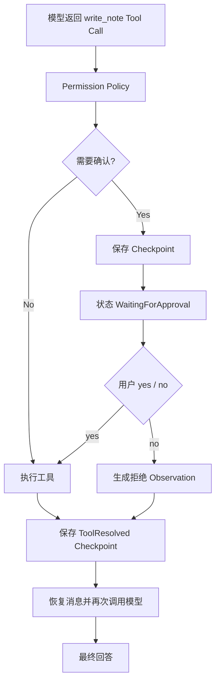
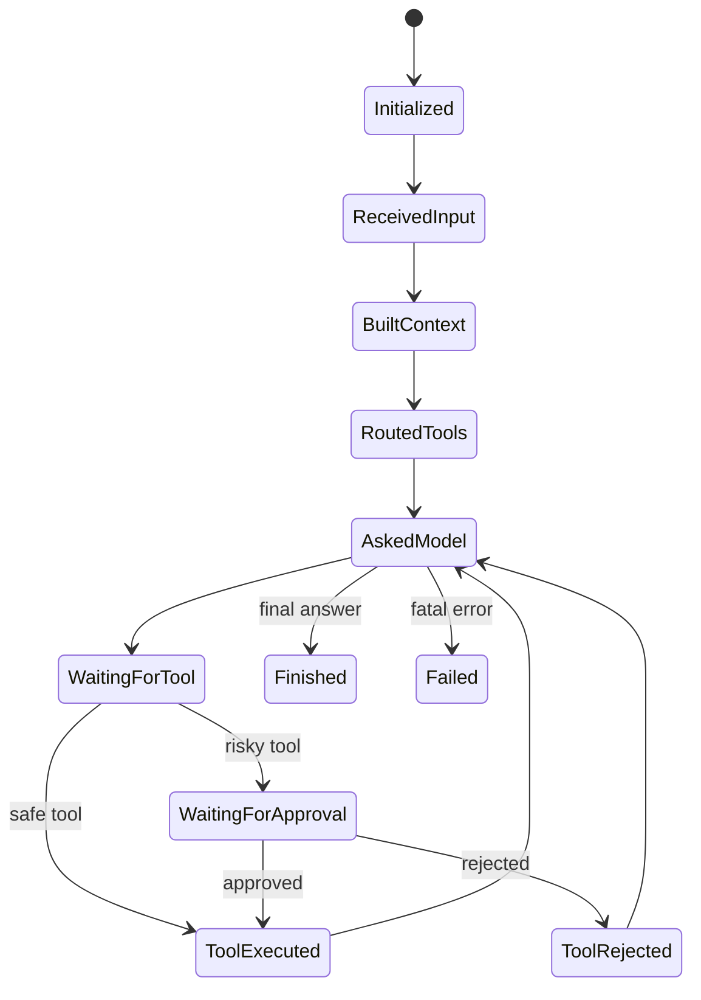
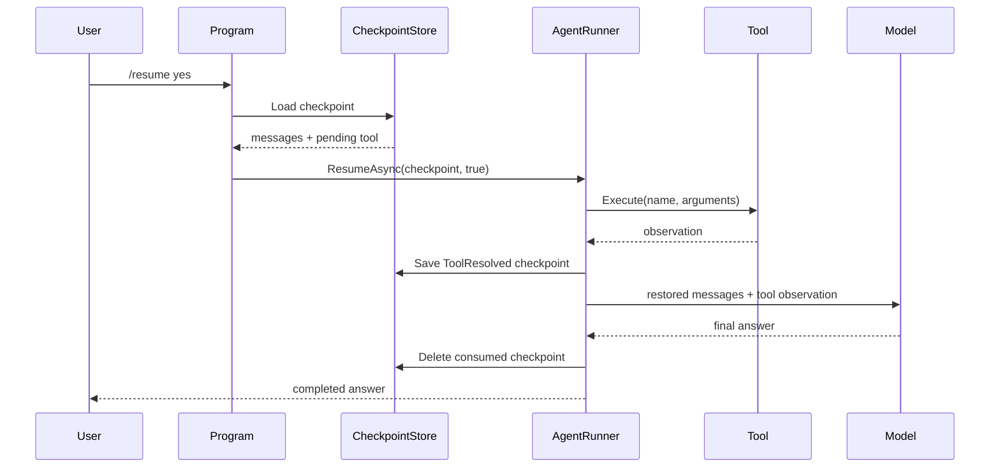

# 第 8 章：人工确认、状态机与可恢复 Agent

[上一章：AI Tool Router](07-tool-router.md) | [下一章：MCP](09-mcp.md)

## 本章起点与终点

| 项目 | 内容 |
|---|---|
| 起点 | 模型请求任何工具后，Harness 都会立即执行 |
| 终点 | 高风险工具暂停、持久化、`yes/no` 恢复且不会重复执行 |
| 自动化验收 | 89 tests |

## 8.1 为什么 Tool Call 之后不能总是立刻执行

读取时间和写文件的风险不同：

| Tool | 副作用 | 风险 | 是否确认 |
|---|---|---|---:|
| `get_current_time` | 无 | Low | 否 |
| `calculate` | 无 | Low | 否 |
| `write_note` | 修改文件 | Medium | 是 |

模型只能建议 `write_note`，不能替用户授权写文件。



## 8.2 风险信息属于 Skill

`IAgentSkill` 在这一阶段增加：

```csharp
AgentSkillRiskLevel RiskLevel { get; }

bool RequiresConfirmation { get; }
```

例如：

```csharp
public AgentSkillRiskLevel RiskLevel => AgentSkillRiskLevel.Medium;

public bool RequiresConfirmation => true;
```

Harness 的 `AgentToolPermissionPolicy` 再做统一判断。不要只把“需要审批”写在 Prompt 里，因为 Prompt 不具备强制力。

## 8.3 状态机解决什么

没有状态对象时，流程只能靠日志猜测。`AgentRunState` 显式保存：

```csharp
public AgentRunStatus Status { get; private set; }
public int ModelRequestCount { get; private set; }
public int ToolCallCount { get; private set; }
public string? LastToolName { get; private set; }
public bool WaitingForApproval { get; private set; }
public string? LastError { get; private set; }
```

状态路径：



Runner 不直接给 `Status` 赋值，而是调用：

```csharp
runState.MarkAskedModel();
runState.MarkToolRequested(toolName);
runState.MarkWaitingForApproval(toolName);
runState.MarkToolExecuted(toolName);
runState.MarkFinished();
```

对外只返回不可变 `AgentRunSnapshot`，避免 UI 修改内部状态。

## 8.4 暂停不是等待 Console.ReadLine

一种简单做法是在工具执行函数中：

```csharp
string answer = Console.ReadLine();
```

这会让 Runner 永远绑死在控制台，进程关闭就丢失现场，也无法由 Web API 在几小时后恢复。

真正可恢复的暂停是：

1. 把恢复所需数据保存到 Checkpoint。
2. 返回 `WaitingForApproval` 结果。
3. 当前调用结束，进程可以关闭。
4. 用户以后提交 `yes/no`，新调用从文件恢复。

## 8.5 PendingApproval 需要保存什么

```csharp
public sealed record PendingToolApproval(
    string ToolCallId,
    string ToolName,
    string Description,
    string ArgumentsJson,
    AgentSkillRiskLevel RiskLevel);
```

字段作用：

- `ToolCallId`：将后续 Tool Result 与模型请求关联。
- `ToolName`：找到执行实现。
- `ArgumentsJson`：恢复时使用模型当时给的原始参数。
- `Description`、`RiskLevel`：给确认 UI 展示。

但这些还不够，因为恢复后模型还需要看到暂停前的完整对话上下文。

## 8.6 Checkpoint 为什么保存全部消息快照

用户之前的理解是对的：Checkpoint 不是只存一个 Message ID，而是存恢复所需的消息内容。

```csharp
public sealed record AgentRunCheckpoint(
    string RunId,
    AgentCheckpointKind Kind,
    DateTimeOffset CreatedAt,
    AgentRunSnapshot State,
    IReadOnlyList<AgentCheckpointMessage> Messages,
    IReadOnlyList<string> SelectedToolNames,
    PendingToolApproval? PendingApproval,
    ResolvedToolCall? ResolvedTool);
```

`Messages` 中会保存：

```text
system: 角色与指令
user:   用户原问题
assistant: 模型返回的 tool_call + tool_call_id
```

恢复后再追加：

```text
tool: 执行结果或拒绝 Observation + 相同 tool_call_id
```

然后把整组消息发给模型。

## 8.7 SDK 类型为什么不能直接进 Checkpoint

OpenAI SDK 的 `ChatMessage` 适合发请求，不适合作为长期存储契约。课程定义自己的 DTO：

```csharp
public sealed record AgentCheckpointMessage(
    string Role,
    string? Content,
    string? ToolCallId,
    IReadOnlyList<AgentCheckpointToolCall> ToolCalls);
```

好处：

- JSON 格式由项目控制。
- 不依赖 SDK 私有序列化细节。
- 将来换 SDK 时 Checkpoint 不必全部失效。
- 测试可以构造简单对象。

## 8.8 Checkpoint JSON 示例

```json
{
  "run_id": "run_8b6f...",
  "kind": "pending_tool_approval",
  "created_at": "2026-07-16T01:00:00+00:00",
  "state": {
    "status": "waiting_for_approval",
    "model_request_count": 1,
    "tool_call_count": 1,
    "last_tool_name": "write_note",
    "waiting_for_approval": true,
    "last_error": null
  },
  "messages": [
    {
      "role": "system",
      "content": "You are Grimoire Router...",
      "tool_calls": []
    },
    {
      "role": "user",
      "content": "帮我记录：今天学会了 Checkpoint",
      "tool_calls": []
    },
    {
      "role": "assistant",
      "content": null,
      "tool_calls": [
        {
          "id": "call_note_1",
          "name": "write_note",
          "arguments_json": "{\"note\":\"今天学会了 Checkpoint\"}"
        }
      ]
    }
  ],
  "selected_tool_names": ["write_note"],
  "pending_approval": {
    "tool_call_id": "call_note_1",
    "tool_name": "write_note",
    "arguments_json": "{\"note\":\"今天学会了 Checkpoint\"}",
    "risk_level": "medium"
  },
  "resolved_tool": null
}
```

## 8.9 持久化 Store

```csharp
public static async Task SaveAsync(
    string filePath,
    AgentRunCheckpoint checkpoint,
    CancellationToken cancellationToken = default)
{
    string? directory = Path.GetDirectoryName(filePath);
    if (!string.IsNullOrWhiteSpace(directory))
    {
        Directory.CreateDirectory(directory);
    }

    await using FileStream stream = File.Create(filePath);
    await JsonSerializer.SerializeAsync(
        stream,
        checkpoint,
        JsonOptions,
        cancellationToken);
}
```

本地教学路径：

```text
memory/pending-approval-checkpoint.json
```

生产系统通常换成数据库或队列，但数据语义相同。

## 8.10 yes/no 到底确认了什么

模型已经把 Tool Call 发给客户端。`yes` 不会让模型重新决定参数，它表示：

> “客户端允许 Harness 按 Checkpoint 中的 `tool_name + arguments_json` 执行这次函数。”

`no` 表示不执行函数，但仍需给模型一条 Observation：

```text
[工具调用已被用户拒绝]
工具名称：write_note
请告诉用户该操作没有执行。
```

模型根据这个结果组织礼貌的最终回答。

## 8.11 Resume 的数据流



Runner 入口：

```csharp
public async Task<AgentRunResult> ResumeAsync(
    AgentRunCheckpoint checkpoint,
    bool approved)
```

`RunAsync` 处理新任务，`ResumeAsync` 处理旧任务的继续执行。两条路径最终进入同一个模型工具循环。

## 8.12 为什么要有 ToolResolved Checkpoint

危险窗口：

```text
write_note 已执行成功
-> 进程崩溃
-> 还没把结果发回模型
```

若只保存 PendingApproval，重启后再 `yes` 会第二次写文件。

所以执行后先保存：

```csharp
public sealed record ResolvedToolCall(
    string ToolCallId,
    string ToolName,
    bool Approved,
    bool ToolExecuted,
    string Observation);
```

恢复时发现 `Kind == ToolResolved`，直接复用 Observation，不再执行工具：

```csharp
if (checkpoint.Kind == AgentCheckpointKind.ToolResolved)
{
    return new AgentCheckpointResumeResult(
        checkpoint.RunId,
        resolvedTool.ToolCallId,
        resolvedTool.ToolName,
        resolvedTool.Approved,
        resolvedTool.ToolExecuted,
        resolvedTool.Observation);
}
```

## 8.13 幂等键解决什么

幂等的目标：同一个逻辑 Tool Call 即使因为重试执行两次，外部副作用仍只发生一次。

课程使用：

```text
IdempotencyKey = RunId + ToolCallId
```

- `RunId`：整个 Agent 任务的唯一 ID。
- `ToolCallId`：模型这一次工具请求的唯一 ID。

只用工具名不够，因为同一任务可能写两条不同笔记；只用参数也可能把用户有意重复的两次操作合并。

Checkpoint 防止 Harness 正常恢复时重复执行，工具内部幂等防止更底层的重试或崩溃窗口。两层不是重复，而是互补。

## 8.14 当前交互命令

初次运行触发确认：

```text
You> 帮我记录：今天理解了 Agent Harness
[State] WaitingForApproval
Tool: write_note
Arguments: {"note":"今天理解了 Agent Harness"}
Use /resume yes or /resume no.
```

稍后恢复：

```text
You> /resume yes
[Workflow] Resume checkpoint
[Workflow] Execute write_note
[Workflow] Ask model
Grimoire Router> 已经帮你记录好了。
```

## 8.15 运行与测试

```bash
dotnet test AgentLearning.sln
```

```text
Passed! - Failed: 0, Passed: 89, Skipped: 0, Total: 89
```

89 个测试覆盖：

- 风险等级与审批策略。
- 状态字段和转移结果。
- Checkpoint 保存、读取、删除。
- SDK 消息到 Checkpoint DTO 的转换。
- `yes` 执行与 `no` 拒绝。
- Pending 到 ToolResolved 的二阶段保存。
- Resume 后继续模型循环。
- 同一 Tool Call 只产生一次副作用。

## 8.16 分四个小检查点完成

不要一次处理 44 个文件。下面的顺序把本章拆成四次可理解、可验证的操作；文件完整内容仍以“本章完整文件代码”为准。

### 检查点 A：风险等级与审批规则

先完成 `AgentSkillRiskLevel`、`IAgentSkill`、`AgentToolPermissionPolicy`、`AgentToolConfirmationRequest`、`WriteNoteSkill` 及相关 Skill 替换，然后运行：

```bash
dotnet build src/AgentLearning.Core/AgentLearning.Core.csproj
```

此时只要求 Core 编译通过，并能解释“模型提出调用”与“Harness 授权执行”的区别。

### 检查点 B：状态机与 Checkpoint 数据

再加入 `AgentRunState`、`AgentRunStatus`、`AgentRunSnapshot`、`AgentRunCheckpoint`、Checkpoint Message/ToolCall、Pending/Resolved DTO、Store 和 Resumer：

```bash
dotnet build src/AgentLearning.Core/AgentLearning.Core.csproj
```

此时应能画出 `Running -> WaitingForApproval -> Finished/Failed`。

### 检查点 C：暂停、确认与恢复循环

加入 `IAgentChatClient`、`OpenAIChatClientAdapter`，完整覆盖 `AgentRunner`、`Program.cs` 和测试项目文件，再加入 Pause/Resume 测试：

```bash
dotnet test AgentLearning.sln --filter "AgentRunnerPauseTests|AgentRunnerResumeTests"
```

### 检查点 D：本章总验收

复制剩余测试文件后运行完整测试，目标是 89 个全部通过。这样每一步只处理一个概念层，而不是把审批、状态、持久化和恢复同时塞进脑子。

<!-- BEGIN INLINE RUNTIME IMAGE -->
## 本章实际运行效果图

下图直接嵌入当前 Markdown，不依赖外部图片文件；如果阅读器不显示 Data URI，请以图后的纯文本运行结果为准。

<img alt="第 8 章实际运行效果" src="data:image/png;base64,iVBORw0KGgoAAAANSUhEUgAABQAAAALQCAIAAABAH0oBAAAQAElEQVR4nOzdBUDb3BoG4OAugzGGDNtg7u7u7ts/d3d3d3d3d3d3dx+yMWHIGMMd7tceFkKNFsq2u77P5e5P0zSkSVry5js50f0RGsEBAAAAAAAA/Ou0OQAAAAAAAAANgAAMAAAAAAAAGgEBGAAAAAAAADQCAjAAAAAAAABoBARgAAAAAAAA0AgIwAAAAAAAAKAREIABAAAAAABAIyAAAwAAAAAAgEZAAAYAAAAAAACNgAAMAAAAAAAAGgEBGAAAAAAAADQCAjAAAAAAAABoBARgAAAAAAAA0AgIwAAAAAAAAKAREIABAAAAAABAIyAAAwAAAAAAgEZAAAYAAAAAAACNgAAMAAAAAAAAGgEBGAAAAAAAADQCAjAAAAAAAABoBARgAAAAAAAA0AgIwAAAAAAAAKAREIABAAAAAABAIyAAAwAAAAAAgEZAAAYAAAAAAACNgAAMAAAAAAAAGgEBGAAAAAAAADQCAjAAAAAAAABoBARgAAAAAAAA0AgIwAAAAAAAAKAREIABAAAAAABAIyAAAwAAAAAAgEZAAAYAAAAAAACNgAAMAAAAAAAAGgEBGAAAAAAAADQCAjAAAAAAAABoBARgAAAAAAAA0AgIwAAAAAAAAKAREIABAAAAAABAIyAAAwAAAAAAgEZAAAYAAAAAAACNgAAMAAAAAAAAGgEBGP6kmNg47g9JTk5Wabx6xcbF0Q8HAAAAAAC/kS4Hv5f3B9+VG3d45Hbt170DP/Lg8TPXbt9v16JRxTIlhROHhUecPHc53Xm6OucqX7o4DYSEhr189U72NC65HO1zsuF7j55t2rm/QpkSXdu3lJ7ywZPnB46dSUxMXDRjvMxZBf8ICQoOoQEvn49HT1+gX12xbCl6mMPG2vfz1zWbd9WrUaVF47qcQoHfg6fPXx4Xn7B6wTRdXaX2w4jIyDsPn0qP19bSrlmlPKeiC1dvHTl1rnql8m2aNeBHPn/1lraOvDWjLktWb371zrNJ/ZpN6tXiAAAAAADgd/krAnBCQoKXzycfX1+7nLZ5XJ3MTE2lp/nqF5CUnORgZ6utrf3lq38yl+xgn1NbS0vmDCMjo0J+hgV8/25vZ2uXw4b7m0RERoVHRH4XB0he0Pcf0dExcVIlQYp8l2/cSXeexUJ+sgD83uvDtn2HZU7TrEFtLU4rJDTUOZd9fHx8UlISpWsaHx0T8/nrN+GUUdHRP0J+cuKcnM3SXPiUhbmZrU32Kzfvnr10nR9558ET+qGBlo3rffD9THO+++jpt8BA9qyTo33jujVpE5+9fF1ikVj5d+eBY9mtswnH583t6p7bdce+ozfuPhCOr1m1woUrNzlZVA3AcfHxJ85dio9PuHjt1r1HKaGaYvxbT29a/pt3H96+/5ifuHfndqWKF5Y5ky9+/p+/+lGAd3F0tMtpQzunzF+3aNXGT19SVzKtc/r35Lkrl66l2bgDenakMyMcAAAAAABkjT8cgKOiotdu2f36vZdwpEcet37d2gtjcExM7JR5S2lg5fxpNDx1/jIaXrtohracyuH+Y6cp1rDhZbMnmZgYc78FFXKpcJrLwZ5KiPKmoZon/aunl2bJWWtYHW0d4UhKYh8/fa1VraJw5L2HTyk/ly5RhLIoP9LUxNjvWwClfarB0lOxsXFUyaTxhQvkMzTQ+xkWYWlhRrn3+NmLj569HNCzk3CGlH7nL18vc1E3bN8rMYY2zehBvUoWKxwbG5uUxH0LDHrv5WOfM4e7mytFPxcnxyOnztNklJ9ZhCY/f4ZRAKZ3ffTUBZm/hdKmxJja1SpSAI6Lj6M1kGaFJCZy4lVXrHCBlFHJyQ+evOBUt3H7PjrjwIlXcmhYOBt54eqNePHWoRzLfrWhgb7ooY6MWHvr/qNtew4Ll9DM1GRAj4553FykJ46KiqHQy0+sLUYDkVFR/Bj6NzYWjaIBAAAAALLQnwzAP36GzlmyJuRnKA1ns7RwcXII/B5MlV7KVKOnzps3ZYy5WUoG/vTlK/1LdUIKJC9ev2PD8trNUsy4//gZ//DB0+fVKpbjfgtWF83vkVthABaFHIkAzFKxgYGBxMjNuw7InMmDx88lxoSGhndo3dTVybFPl/b7j56mAOzs6NCv+3/zlq4LCArq120Urcybdx9xclAAo/jKyRcWHs5Xrem3zFq0in/Kzz+QfmjgracPrXwTY+OJIwYEfA9eumazm4vTkD5dhL+lVZN6nHjTW1laiEYlc1SU1tHRNTczoUev33m9fPOeTdy9Q+tu/7XatHM/FaLbNm9ENd6v3wIuXb+T3Spbx1ZNDxw/Q8G7TvXKD56M41Tk5x/w9OUbGhgzuPeXb/67DhynswnzpoyevWTNpy9+zRrWrlqhDO2BFIb7d+9UIF8e6Tm8fOu5ZddBGrDKZlmtUtm42PiL127SiYm5y9YtmjnBwixNE4bQ8Ig+3dpzoqbjP6kUTCth2rihOuLEe//Rs6OnL1BRfUjfrmzihMREXR0dDgAAAAAAssCfDMCHjp9l6bdsyWK9OrdlIy9cu7Xv8EnKHtdv329Ut8bdh0/vPnzCQhEFsKVrtwiHq1cqV7RQfonZvnrryep4jg45v3z1v3H7oTAAU7nv9IUrj5+/jouLL16kAP3qHfuO0Ph2LRoVKZiPBsIjIk5duPrqzfuAoGCXXA5FCuVrULs6a2s9b/n60NCwPG7OhQvkPXH2kn/gd6tsFpTNihcu8OTF6wNHT7Nf8c7rw/gZCyuWK9mwdnXpd82qfMZGRsKRMeI2scZGBtLTU+YvVbxISIhoRRkY6FOI8v3ytXqlsoFBP9gEpqYmfCNeQqXg81du0ECX9i309fSyWZrT9Cs37hg/rB8nn11Om+H9usfFx8ubwNPn45rNu4RjKH9SZr59/3GxQvnDIiJ9Pn76FhDEiauaF65SGhS1r25SvxblYf4ltPwUWa/dvnfx6i1a260a18ue3ar/yMlGRoYr5k6hCbS0tfkArCVG/+VEyZme0dbiUlq8x8TGUd2YBWBOdfY5bRdMH7d49ca7D5+xLq8MDQx2Hzzh5GgfGER71s+jpy6amZrSW6Ayby7HnNJt8h8+STkBMbRPVyq804B1NkvW+JxOPVQuV0o48ZZdB/g3xYlP0EyatVg4QUDQd9ph2PDU0UNov+UAAAAAACAL/MkA/MH3MyeuCnZu15wfWbNy+QePnkXHxHz1D6CHdx4+eSUIDy/TDlepUEZ6tqzxM5XmalerRGU6in8UelmD4cTEpMVrNlGRmU1JIerJ89esGSq7IJYS4IIVG1g9k/j4fqafwKBgqkbSw89fvlL0oloof4EopaVVG3esWjAtLCycytdsJCUcGg76/oOTJVjcNtjSIs21tRRr6d8vfgGFC+STmJ6qo4mJieyq0fjERGNjQxowMzP1/ezHJsiWzSJ1nbz13LBN1G6ZKsx7j5wSpzlRcqZ0evXWXZnLw5rjGujpU3Hyw6cvnBxtmjWkyfjCNQ3zhV9WTSW9OrfT19dbv20Pu26ZqvqF8rmzp4wMDYb376GrK6ptWppTNdqEgiL9/NeqifC3lCxSyM42R47sVlwWoyJtcHAIvydQBKUfNnzjduqFx3RmoXG9GtIBuESRgqzl9htPHxaA33p5s6eKFMgrMXHVimU9crsEfv8h0aJbAp3IMDU2srAw5QAAAAAAIGv8sQDMUiIN2NpYG+jr8+MpWY0f3p9/WKlsyYIeefYfExVXO7RuQhlh3dbdNFyyaKHcLk6UKyRmG5+Q8Pj5K/EEBYsWTAmTdx88qVuzCg1cun6bZR4qOdapXsk/4LuwdsqJitJnWKirWaVC6eKFz125QQmZ4m7xIgWL/7rulDKwq5MjVZ6v3LzLLh+lmnPBfB49O7XduGMfPcyR3Zoqn/a2OThZgoJE71oYgJOSk1kIf/Dkef1aVfnxVPudOmaIlrbW2s27vv9IaX6czUIUd719Pn32S+lUqXKFMjUqlTczNxWP92Wzohr4ey8fypkeedwoVtE6OXLyQj53N+nlyePqvH7JLBrYdeBYovyERuuT1hj/cGDPTkdPX/j0JSWEu7k41atZpWjB/O88fWysrdg6pBo7lfHLlS5OhWiq5RbImycqOmbUlLklihSg93X/8fPrt+85OdiJNoehIZsPVdStfuV5WuZtew6z5H/w+JnjZy716tKOU58JIwYkJabe8ejJi1f0jgp45KGSPhszZ+lqeXdpKpTfo1Sxwg+fvthz6PjVm3di4+LZNc81q5QXXpvN0J5DP72HTVAcgJs2qNVAVpMBAAAAAABQlz8WgAN+1UttbbIrmKx08SIxMbEUgCmyVq9UnobZ+F6d28q8Bvjpi9csZlBkNTUxsc+Zg8LYzXsPWQD28vnIJhs1sJeToz0nyuGJwl6UXr7x5MSNe9u3bMyJbi/kNHDMFAqTb9978QGYIvqowb0p1OXN4zpP3H3Us5dvqCSY3TobC8DWVpblShWT944Cg0VvnMJz9UrlDA1FbZ5Z82ZOdKmzX0RkJC02PzG7cVHzRnX9A4MuXBFdZcrOGrx6J1pOKi26ueTK75En5XpaOl9QrpS9XQ6qfme3ykaJ8fNXv85tm+XMYXPw+NlaVStSWpNeHlpdlFQ5cR/OnEK08nV0dfR0dbfuOcTqn3QigIrGFPipwrx6005nRwdf8dXaJsbGVBf19P6wfd+RY2cuLpw+TtyYWVRRp1MGl67fuXLzXsPa1WeMH37lpqhW7JzLXvrXUd2b7yOKNoH4J6WFNruOWmbfVEJeH3wPnzyfN7crZUtOyuGT54QNChITRbvN6/deMxevZGNYQ3qZaB8oX7r4m/fetISs4Tcn3m0qly/DKUQJWVvqEt83772+fPXnAAAAAAAgi/2xAMwqmSTkZ5i8acIjIt56fnj7XtS4NDkpibIWZSr21JMXb6wszXO7Oku85Oavzp8polDconIcBWCKKEHff9hkt/r0VVSx1NPTZemXE+dkPgBTBGLtYOklPYek6VrJy+cTP2yX04bSLycqe6b8dtafsDJi4+L8vomqo1QwXLlx+4gBPSkZvhF0gv3k2evKFUrzD6kC+fL1u3uPn1IhmhN3/ZXN0rJx3Rp3Hjy+8+DJtVv3vD58jIyIondhI242TNnbxNgoSXxd63tvH/EbDzY3M2tQu5qxkaHMRXry4rXExb0KZLO0WDBtLJXfP3z63LlN8x8/Q/cePlm9Svlc9nZvPb1zu+Q6c+lGtYpl8nvkpvfl9y3g6JlL1SuV1fp1t6pC+dwXzxxPtehrt++xMe88RRs0l4OMAEznPuhnw/Z9VKWn8xFUk+dTYqC4ip7D2lrx0u48cJReQpVwKuazhspCb955UcSlIjk7kxJNWzE2jnYb4QkITqpnMubuw6fsZAftS6VEfWLHUb2adpvpC1ZMHD7ASVaeZyj8cwAAAAAA8If8sQBsaKBP6ZTqgZTRJJ6iwBMVHU05hALJtj2H2EgaFvY8vG7r0moW/gAAEABJREFUbirBSQRgKlHyFwzPXbpW+NTt+4+pDMiCK6v1Maz4ycQnpFb8+Ias7PphU8GNlHS1U1aaTnoVSGmsQE2pibz19Nl/9FTb5o2u377PfiP9rvtPnvEBmKqXpy9cYcMUfRvWqWGXI/v8FRsWr97UtkWjGlUqHDp+RjSTY6fph6Lp1NGDTUyMJ8xaxN/Xhyxbt40NrFk0Q+YiGRkaUsWYf8ia8tLcKLX+DA1jvTobGKS0Uc8pLtcXLpD39v1Hc36t4X2HTwpnSIFT+LBTm6ac+M7MY2csEI6/cPXGxeu32LmDk+cuX7iaeoPfCqWLt2/ZhJOPNbG2sUknAFtZWrLMbGZmIvFUWHgEa97MX5lM50GOn7lYKL9H66b1hVMmy2q3vO9IylueOX64tZXoJsZ0HmHVxh20uo6euTC4dxdODpkVYDrHwZeRAQAAAAAg6/zJTrCcczk8f/WWcgiVxSgYsJFf/Pyp6MeJarMFCuTNY2drw2cDieFC+SV7G3r4VO4tYW/ee0gB2MXJkbITpZRHz15SGZMqpVRE5afhMzm72y2XUQmJci/1ZC2Hq5QvXaJooQUrNly4esvCzMxH3BnYiP49Zixa+ea996cvfqxAXb5McVq8EsUKvnrjGRERue/wCU7cYpkTZ86UW9SKbixUnyYrUjAvu92xq5MjW0usmk3vyFBcw+TLsBJoJc+fOoYNUywcPnEWzZPKvPRw9pI1Ph8/9enSXvpWQAU83GmOVHzW1tE2EteWHz19SctWpGA+Pi0zrL/rxKQk4U1u6VfExScIr4kVPiu9An0+fvb6sKdw/rxD+nSlUvZW8WmRc5euUxV3eL8eiUmJnCy9Ord9+PiFq3Mu6V6s2Don0+YvF45nXXMJxzg7OkwaNVA4hk6UhEdEcuKW3iz9Eo9ft//9/PUbJx8qwAAAAAAAf9CfDMBVKpRhYYPqadHR0ZSd/AODtu89zJ6tXK40jaleqfyISbMplI4b2pfqvf1GToqPT5gwYoCrrJvWsnhJls6eyDdk3bB9771Hz0J+hvp9CyhepCDrwHnN5l353N2+/wjh723L5HZxevz8FdUwqaBXvHABqh8uWbs5NjaWEmuH1k259FCuo1D38dNnT+8P9jltTQR1Y/LVL+CNuDl3pXKlcznY1axS4faDx+xqXsrz9na21SqVu3Dl5totu2dOGE6zssths2zOJHp2z6ETFESFs4pLiGe9eVHxtk71Smm6p+rVmQ1MmbeUpunbtb17btdfi6elePnvPhR1CZbL3k7ms0dPX6DIV7lcKUNDAypT00/vYRP09XRXzp9Gzw57P5NiIQX1eMG9lPp162BsLArAVERnXW0xsXFxO/cfvfPgCVtp9WtWrVuzikQjbVr5r995vhc3emd9leXL40bF53dePvx5kISEBArnP0PDaUD6mnAqbgvbkwuZGhuxWyglJiZeuXmXj+K0PksVK8yG6be8eP3WwFCyCTTV73Nktw78HhwZFXXj7kNaIXQmhcr17Nn8Hrklpmd3WmrdtEF0TDQbExAYTO+ITmHUqZF6G6f8HnloSnnnKQAAAAAAIPP+ZAAuVih/80Z1jpw8L2o4evoC/fBPFfDIUyi/Bydu1cwa9Do62NEA65col4OMhBYRGen1wZcT90UkvIyTaq0UgDnx5cFtmjWoWqEsuwD1raeopa6bi5MwW7Zp1pBCFxWlV23cwdIsG1++TAlOCbY21pSaaCHnLV9fqVypru1b8k9RQlu2fisnbszMlr91swYOdrbbxXchrlm1Av1bq0pFCsCUrM5euibsELh9y8ZUV1y4ciOFvZJFCmlpa23fe4StwJ6d0+kYmWqnHz599f7gm9fdrVeX9j06tdXR1r7160ppIYqaB4+foYHqlcsJxydxKV0lP372kurn9EsNDWVcFpuUJJqMr6wyMbGxLACnTpac/Pqt56ad+1kRtWBe9zee3qcuXDlz6Vrt6pUa1KrK3zf43JXrLCFTUKSNWKZksfzuuWn+i1Zt4tJuuFPnL1+7fX9o325UzeaUk8fNxcU519Pnr/cfO01bmbZ1yWKFHjx+njePK+0kbJrDJ85RADZNu/xMvZpV2IbbtucQu480v6tI35pr0JipMnuTppHHz1ziH7Lh9i2b8K0hAAAAAABAvf5kACYNa1enEtzNu4/YpaecuFchKoS2adqAlcK+iG/2k83SwkBf/72XqBhIxTddqasoOUH7ZwpLwvEUsdjAnQePKdt0aNO0fJniT1+8jouLL1IoP+XSlRu2c+I6JCdOp2OG9N2y++CnL34s0tCv7tK+pZtzLhrWEk+joI7as1PbbXsPs5sD6aRdSKpys/dIRVE2JiIiao+4VTPNnGI5J+7CipLV2UvXqZxYunhRG8HtcJ+/fhsdE0MJjX7YGKo0DujZSaJgSCH2zTtv8V2Ig7/5i8qkB8SZlhPfYSgmOsb7oy+tyfviMwLa4tfS23z9zuvGnQePnr2khw72thXLlmQvMRK3nT5y4lxkJNV1E/wDv4vnYxkomnnKrZLj4hOeie8DnJgoOjfRpV0LKvbyy0O5nV7FcimtFirR377/iKVBWrGDe3ehcwF05uLspRvnr9w4d+k65f/qlco1qlvdzNS0bKniVBMuU6IoZV3xBcnhO/YfYUV+OsdBm3Lu0rU0c6paP335ht6Fvr4ep5zIyKiDJ8/effCEnU+hufXt+t/Hz1/Zur11/9GWXQf5iXO7OEnPgVKulVW2TTv2UYznoy+V8ft0/Y913C3kntstNCxNT29R0dHfg0Nol5Oe2EpwV2cAAAAAAFAvrR+hEdxfIDwiwvfLN9vs1sLUp3YPnry491BUVGxYt4arkyNFl+Xrt7F74cydPJrSLz9lQmJiYNB3S3NzY1kFwHQlJiZJdJG168DRKzfvtWxcj7/TLwXC6QtWUHlzzuRR/EWqFMhHTZlLhdOZ40dQHhbOgXLjwyfPr9++z1dZKUPSYgt/0Ylzl46dvsg/tDA3c7TL6ehol8veziO3Cy3VOEFPVJQh61SvTNXXI7+a75YuXrjrf6342zJfun57z6ETwmWgjDdj/PDjZy8dP3ORU9rGZXOCf/wcM20ee2hmalKtYrkGdarpCRotR0VFUzGW5ds8rs5jh/aVmMnoqfPYGYSqFcvSatTX0+0/agofPilMLp8zWWZpWhq9auz0BTQ3Wj9N6JRDhTIUsG/ff7x514HypYs3b1hnyrxlyUm0BXXpLAOV8RXMNiYm1i8gkN6IXc4cMs/LyOT1wZfSu61N9lkTR3AAAAAAAPC7/C0B+Pf46h8wZc5SNkxx90dIKEtQVPacNmYol5WSkpPPXrwqbNjMiS9tzWZh7pHHTTiSqrhUPZZZeGRCQsNu3X147fb9SmVLSdzh9ltA4N0HTx0d7Bzsctja2Ej3U00Zj3V87Z7bpWKZkhTtKHLPXLzK1TlXzUoVHB3SFCQpMD95/uqdl7e4dTNHi1qxXCn618vnI7thsjK0dbQpZHLiPqu+BQZVLl9awVv79NmPSug9OrW2zyl116L33qcvXOnQumnOHDZsjJ9/AFWtY2PjjYwMihcqIH2jIwV8P3+l1Vi0YD6+hP7i9bu9h09WLFeyQa1qXBbzDwzac/CEvV2Ots0bcQAAAAAA8LtoVgAmr996bdq1n79RkJ6ebpkSRSlWsTskAQAAAAAAwL9K4wIwExUlugjT3NzM0sKMAwAAAAAAAA2goQEYAAAAAAAANI02BwAAAAAAAKABEIABAAAAAABAIyAAAwAAAAAAgEZAAAYAAAAAAACNgAAMAAAAAAAAGgEBGAAAAAAAADQCAjAAAAAAAABoBARgAAAAAAAA0AgIwAAAAAAAAKAREIABAAAAAABAIyAAAwAAAAAAgEZAAAYAAAAAAACNgAAMAAAAAAAAGgEBGAAAAAAAADQCAjAAAAAAAABoBARgAAAAAAAA0AgIwAAAAAAAAKAREIABAAAAAABAI+hyAAC/16atO3bs2Z8jO7Fevmiuri6+iEAFZ89funnn7vv3Xi9evb585ridnS33Nzl34XIuR4cC+fNyWen1m3d37t1v3rSRVbZsnFqdOnv+zt377z29fT5+PLpvp6Ojg8zJ+g8Z+TM0rEA+9+LFijasV4cDAAD4P4HjTgD43d57eQcEBNIPDSP9gqoCg4IOHTnOhs9futylY3vlX3v85Jn1m7fKe1ZHV/fY/l1v33mGhPzklGBoqE/xTzhm45bti5atooHVyxZWr1pZ+FRsXNzVazcTEhKUmDFnYKBfq0Y1ec9GRUePGDvxo++nhUtXdunUflDf3iYmxl+++kVFRnHKMTM3s8sp+8RBWFjYoaMn2PCxU2cG9OkpPU1ycvL9h48iI6OePH326fNXZQIwvf1O3fpERSu7hDKdPLyPAwAAyBwcegL8++Li4t95eubP6/GXpE1//wA24OLsxAGkFRoa9vHzZwUTuLo488OHj58sVqyIgom1OK28HnkM9PXZw0+fv1Blk1NowtQZVF/llEA78JljB/iH+w4eZumXExdIJ4wd2bFda/7ZiIiIoaPGccqxtc2hIAAvX72O0i8bPnnq7OD+fWhgzoIll69e55Tj6OBw4dRhmU+1bNZ087bdX75+peE9+w726dFV+nvDPyAw8lfYLlggP6eE+Lh4qthzAAAAf9rfFYDpDPHHj740EB4e8cXPj45yctjYyDtLDSoJDPoeEhLCP8yT201HR4f77ahw8fzFayr+UQSi4ydraysbm+xFCxdysLeTOX1ERORXPz/+ob2dnZmZKfc3oePp6OhoNqynr+fm4sL9Za5evzlx6szgHyHWVtnmz5peoXwZ7k/z+5YSgO3tcnJZw/fT55iYGJlPaWvrWFiYZ7O01NPDGcC/0ZNnz/sNHqHkxO/fe7Xr2F3xNDs3rytZohiX9WpUq7r/0FE+PM+auzAmOrpnt86cWj149Hjbjj38Q4rZxkZGnIriE+L5YSodd+zeR/gsa51B6HujWp1Gunp6/FOlShRbOGfGhw++/BgP99wcAADA/4+/6/jv4uWrI8dOEo7J7eaCJk9qsXLNhgOHj/IPL5w64uhgz/1GVK/Yc+DwoSPHImU10iterGjPrh1rVKsiMf7ajVsjx6XuEvNmTm3SqD73N+k/ZARfUDIxMX546wr3N0lOTl64dAUdxXLiY9llq9f98QCclJTEikvk9t37+YuV5VTUuWP7cSOHcgr1HTScL5HJU65MyQb16jZr3BBJWDP169WDDazZsIkNFC5YgFOFvoG+8KFNduvtG9eOGDuRvrjYGCoI6+npsUbaBvoGdBIqJjZWmTkbGRrKHE9ndoaNGs8/rFCuTL3aNbnMSUxM5BOvNPbtwfP09qF/X7x6xY8xNDCgpZJ4lbaWVq5cjnJmKVrs1i2aCcfMXbSULQOtooljRwmfOnriFL8+AQAAMu/vOuw7ceqsxBiKFp6e3u44wfx/7sz5i8NHT2KXu2YAABAASURBVFAwwZOnzwYMfUZHctMnjzMzM+NATeLjE4QNPr19fCh/amtnqvv3m3fuPnnynH/YtnWLHDbZlX95yE+lrq5UIDg4mFOHu/cf0c/eA4cWz5vl7JSLAw0zeEBvTtzyaPvuPezEXJuWTenfNcsXx8fHKzMHUxMTiTF0FmzlkvmTps2m2MbGzF24tHaN6vb2OU1NTW5ePstlwrOXr3r0GcifQ7S1zTF/9jQtLS32cOjAfk2VPj9oKCdgK+nG7bv8cP8hI2VOc3T/zrwe7jKfKlWyWL06aXL7hi3bWACmNyXx1LOXLxGAAQBAjf6iAPwjJETmH7lzFy8jAP9f43uFSdfZC5d+hv5cs2IJlRQ4UAd9fT2ql27fmdJgsmO7NplMv+TGrbv8DEnVKpVUCsDfv6snvqrL6zfvevYbcmD3FksLCw5U5+nls2X7zsio6JLFi/7XtpV6rzPftGZFXo88bNg/IJDSkVbaCRKTkpKTkzlRy3Ztba3UJ5+/fCUvmEm4c/c+Hynr1KpB/6q0P0ujNTBjyvjQsLAr127QwyXzZ1P65TLt6vWbEi3DVy9daG1lxT90z+NGP5zqKJl3lt+RWGBAoKmZmbFxSivrHNmtIyIiHz1+yqWHzr7Je2rT1p03bt0TjuHbjdPAf117C5/69CmdphwAAAAq+YsC8OUr12SOP3j0+IC+PbW0tDj4P/T0+QuZ6bd4saLGRkZPnz+XaBFNFbmFS5ZLNIGDzBg+uH+xIoUePHxcrkypalUqc39aYNB3frh5k4a53Vw5Fbm5unAqKlempIGBqOSVkJDo++kz3waboYdrN24ZO2IoBypKSkqinMnW5/mLl+kkgnovUshubWVtLcp4FLNb/delcMECw4cMpK3JTzBs1Hg6cUYDlSuWX79qKT/ewtycH1b85+PkmXNsgPZGc8GrMoMy8MK5MwYNG92udYvaNatzmSbdiGbLulUF8uc9cepskcIFM9l+gVI0f03BmIlTg4ND+vXqxq6aps9K5579HB3sVy9dwK+c6zdvc5nDuo+W96yCpwAAADLvLwrAR0+ekTk+ICCQzuUXLVyIg/83sXFxo8ZNkRjZvUvH3t27WFiIjqWodPPy9ZvhoycKA8muvQc7/dcOTVLVxUBfv36dWvTD/R2EAbhNq+bFihTmst7yRfOETevfvfccPXHq+/de/JiDh48NHdgPTQ9U9ez5C+GHd//ho1lxlT7VEsdOmsqJLj193a13/4rlyw0d2LdQwTSdD4eGhct7OSsRy/QjJOTUmfNsuHnTRpz60Am+TWtXsOG4uPgLl6/ExsZxqqtdo5qZmem3b/7Ckbu3rqdziJSKR08QfcE2rF+nT49uGSv/CtH5yuPiP8S37tylmnD3zh3+69Iz+EcI/RXu1LPftg2rWSuJ46dS/1jPmDKBtQM/cPjo7bv3OXEj8JlTJtJALjk3EAYAAPiz/pYA/O1bgLBJlbDRJic++S0zAC9etiruV1eWzrkc27dpFR4evn33vmfPX7738qaI5ebs3LRxgyqVKkg0+8zYC7/5B2zblbpUVSpUyJ/fY+3Grbdu3/n5M7Rn185dO//HP+sfEEjn5p88e/7p82d61t7Ozt4+Z5VKFevUrG5qmnrZ2J79B30/f+EfNm/cUOKiqbfvPI+ePMU/pPUgTDIPHj1+/eYdHc2/evsuKjKaCgL587rTHCqUL8vf9uMPunP3vkSpjQ7URg0bxD+kygyVdPbv2typex/hpaqHjhwfPmSAvNlS/eHwsRNe3j6xsfGlSxYrV6Z0ubKl5bVaDA0NO3nm/O279774+QV/D6YN4WBvV6tmtRrVqhjJvwrOz8//2KlTz56/ouWnzWdrm8PJ0ZFeVb1KZb4pYLrCwsI2bN4Rn5h6MWG92jUp72V4v+VR/YSOp69ev0nL6fftm6WlhaODQ8nixRo1qCvda/raDZt/hoWxYRtr6x5dO7Fh6cWg0uju/YeePnvx9etXWlH58nrQAgs7zdq6Y49/YADt8ML5b962I6f4l9JHILu1FZeegMDU7nayW1tzfwJ9RpYtmFO/aeotamiVfvnqlydtOZrKX0ePn6YTcF/9/KJjYmiduLk6N6pfr0yp4jI3TUJCAu2c7zw93733oh8dHe3CBQvmz+dBP6VLlhBO6fPx4/5DqZ3S1a1ZXeJ2spTKXrxOuWcMfUwG9evNevqV3mr0DbBzzz5ayIjIKPo0VapQtnWLZmzx6AwU/ZaHj57QNFZW2SqUK1OmZIny5UpzslBIu3r9xvlLVz59+sJ2KqdcuWj6xg3rWcvfrNmyZRM+tLWx4TIth41Ns8YN2TA7bfHN3z8qKpqfgOIZ/dDOOXRQP3kzcXR0oIouS77ZrCzlTXbs+OmU6cWfoAVLVih/JyFe317dmjZqoGCC6Ohoif4dlVeyeFEKwJUrVaBlY8u5csk82oEDAoMmTZvFpqG9JaetbQZ6yKf1bJsjdZMtXLqSH65csRzN0MHBgXWCRWeL+gwcvmX9yri4OP6UAf3FadW8CRt++PgxC8D0R0riIl5ptO3q101zSm78lBmsNRB92Y4fNUz41OFjJ3ENMAAAqNHfEoDPX7osfNi0YX1v7w90iMMenjx1duSQgdKXlm3Ysp0fpsPHAgXyDxg8gu+ykk5a09/ssxcu0WHfsoVzhbEzYy8MDAoS3nyCTntv3r6LX8hvvw7r6SB49brNfLeiDM2cahfnLlyeMGXG4vmz+BD75es34TwN9Q0kAjAdaggnmDQu5aq2iIjIGXMXHE9bNqe0dv6iaE0WKVxo+aK5wiObP4LOXAgf5nZzmT5pvPRk2Swt+/XuITxAfPhEbhO4bTv3zF2Y2tCR3vKR46esrbLt3b7JUargQEdOtMKFY9iGoI1LL1myYLZELOHEm2/pyrWbtu6QeBVFCHqVi7PTxjXL5d20SWI+w8dM4ncPTnywOKiv6Nq2DO+3jGgvmjpD2HScXkunD+gYcfHyVX16dB3Yr5fww7Jzz35+5nT0zAdgicUoVbJE+849+NmyFUVVnfZtWk4YM4LdNOvgkaPS91Cl5WEDdPpGmQAcGJhaAbZWYvosQpvSwyOPsAgcFPidD8BUclyweNmOPfuFL6FN8+TpMzo7Qzlz6YI5Ehd2fv78Zcyk6RKtN2l1sc6QKGlMnjCaP+fy5Yuf8HNN20UiAFMMO33uAv+wZ9dOLABLbLX8+fK279xTuIQXL1+9dOX6iiXzqWY4cNgofnvRJ+X5i5d0NoRCI+0kXFq0rQcNHyPsCpjtVFeu3Zi3eNnEsaM6tGvFyUKrsW7tGvw+0KlDWy7T6JMyZ8Zk4RinXI4nD++9ePna6g2b+E1GnxGJECVEZ8RmT5/MKUQf0m2797Lhtq1EZw3o7Ey6nYdLo7NsbOD2nfvfpXpoy5PbTZlvDMXcc7vRTpIvr/usqRPMzc2ppk3pl/+0Ukmc3u+cBUs4FVUsV5b/M3HpyjX+NHS5MiUrlS9HA2tXLPqvSy+2Tmj/GT56Ap1w5F8eFhbBD3/6nHKu001wl2Z5PDxys8utees2bWWXAdM3s8RTT56/QAAGAAA1+lsCsLBJFZ0ApoJJ7ZpV+fBAh2IPHz0tV7aUgjmEhIQMGTFW4oYNDJ2WHjB05NYNq2VeCZbhF549f1E6DCQlJQ0ZOU5xDYGOIfz8vrEcUrd2zc3bdvJPXblxU6KmceV6mlnVrF6NE/WC+6Nj9z4KDtToSKVlu07rVy2jQ0nuD6FVIZHPB/btLa98WrtGdYrHVGtlDyOjImVORofj7Ho/CbT5eg0YumvreitBPYqO9ZetWsfJQS/p3KPfqqULhPdeSkxM7D9k5I1bd+S9itZ5247dlFmxs+cvFqZf2qvXrlhiYmIsMZmqu9/W7bspkHDy0XHk2/ee9L5Uus8zVfx69R8i8w5Ve/YfKlggf8tmjTk18Q8I4IfpvXMqEl7nmUm6aVeR1q+iLuWifoNHCDefBIqLTVq3P7pvJ3/OxdPLp0mr9gp+F8Xg915eW9evUmMn50FB3wcOlXG1PO3AR4+fPHzslPQXFFm6Yo2FuVm71i35MXfuPujedyAn38y5C6gGO3Ko7GnoXACtkA8ffKtXraz223RTEX7Y6PH/tW3dtFF9Stq1alTdc+DwrLkLOdFNd6tQUtq+O+U+efSmOBXdvH2Xz/yNGtTjMm30hMnSn+X+vXt079KRy7Q1KxbldnVh3wYHDh0Vfk1NmzT2srjDrQyjevKYiVP5hyOGpLTTobOTdMqPvvTY+6IgKsyidFbl7TtPiuU0/OFjyt8jFyXuhb5p687DR08Jx/BthSgG127YQuZTAAAAavFXBGCfjx/5HiA5cSakv/FVKlYUTkPFEMUBWPFp+/sPH58+e6Fh/TpqfKHMg8vtO/cq04Ju4dKVJYoVoQJO4YL56bw+/weeihtB34Ntsqe0C6WDEuFvobPy7Gz9idPn0i1T0PHKzHmLdm9dz/0hob+a3fLyyL9ETV9fT5kbPstMvwytkF17Dgzqn9J96NPnL6TTL1WrJNbb6AlTTh3Zz9dAtmzfpSD9MqLk3LPv5TPHFPSXs3PvAcqN/EPKvZvWLuc3q8Ric/JJ7H70phSnX4aOULfu2M1XepWh4C6gZM6CxY0a1E23Ub0Wp1RPdcLD2XTXdtb58uWr8GuH2NultB7ftnOPdPqlUxjCtUQnC0ZPnLZ942pWbF+9bqNwYqpilStb2u9bgLAgTL/uyrWbarxEVkEwmDpznvzXiRoF8AH4Z2joqPGSrXOFX0rMpq076BuYVQWlUUlc1TvoKoNOSI2fMoPW28SpMzdu2T5kQN86tap3bNe6SsXyS5avHituKPvxoy+b2MM9D6ciYY2d3Qu6fNky2aQ6A//g+5nfH6jW6uos2T1ByeLFOIXoG+Dlo9vCS5Hv3HvQe0BKv1Pjx4xo37qFvNfyrTn45gn0J2bKzLn8BNMmjs1khTk+PmHY6An8+a/GDesJr6+mmW9au6JDN9FXa9nSpST+wF24dIUCcExsLL/DODs7pvsb6XfJPN3GIPECAECW+isC8NnzaVJNdXFHtXZ2tlRk449QT587P37M8HS7qKGI2KpFsxw22e/cfSjRCPnwsRMyc2wmX9i5QzuKsfp6enSmnP6iS+STqpUr9uvd3T137oePn8yYs1D4d33R8tU7N6+jqE+VjVWCo+f7Dx81rJfy6+4/eCScW4N6ddnAwSOpVw/SodWa5YuKFi4cGxtz/tJVOlLkn6KDb6oV/6lWpt+Df0iMcc6lhn6t6NB8QN8e+fN6ePl8mDN/sbDe8uzFK35YeDEb6dCuFR09U/EtLCxs1vzFfGmaNtnuvQeGDe5Pw+HhERIdVrPN5+bicv3W7fWbt/FtL+lVVF7r2kl2xe/6zdusQsVbt2JJbldFfR0rufvRQT+XdlVMGjeyVIninj4+6zZsuSIoAdHbb9uqhXTzacWoVFW5UnlOdK3vbr5RKyfCPpixAAAQAElEQVR+v5+/fKXj711bNsSLmoivOXTkOP8s7X6FxOGHUp8yv8VfYdj+Peik29gJ04RjaOHt7URNmiMiIiV2nlnTJlH1kc7RfPnq13fQMP6cFH2+KMZUrihaYzcE10XTrE4e2ce6C6ICZt3GqbVWOoOj3j6i6OM/fvSIvO55nr14Qd8wEs/SftWjW2cTI6MDh48dOZ5acKO3EBoaxjqi27X3gPBDRDl22aK5djltY+PiDh4+TrVf/qnlK9fJC8BZhD5KfKNcOlVEpWD6o0CfVlqMJQtm08jomBh+4TPQN3j9OrX4m8/TuUuas7ilg2RjhzPnL/IBePjg/gpaf9A3DEVBNiwR8CRaZOz4VbimLdisUQNKuQkJCY+ePLt46Yquvt6Y4UPk/Ypdew8KN0qZUiVatRDdu5giNH85rgRPLx8q4bLhcaOGtW7ZjH+KndWiTzR/pob23nGCS3DpkzJx6mz6/tywaqmBgSGd+5OY+fFTZ+m0o/BPVS4H9H0FAAB/tb8iAB85lnpkRkcDJYunXAtXp1YNPgDTwcSdu/erV1V0Exc6Llm9fDG7yq50yRI2NlbTZ6ceKDx78VLtL1y+aK7wFhd81yAMlYzmz5rK6oRVKlVYtnBOy/ad+WfpwI5qUI6ODnVr1RAG4Fu37/IB+M69+8IZ1qwuaqxLOc3ayoq//WP7Nq3Yhax0gE5Hb/sPHX0uWGAKG38qAP9I2xTQwyMPq7FkBu0eG9csYx1E5/Vwd3V2Fq7Sp8+fU42FzilI9KlGMWDsyGGskEKbY9qkcV7ePvyudejo8SED+2pra1+9flP4u4Sbj7aIxO969OSpzADs6endZ2CaHlwWz5/Fbigij5K731e/b1QQFr5wyfxZrFBTtFDBeTOntGjXRXiGhQo1KmWtsSOHdvl1L9BFc2fevF1LeAT/RRyAWWQyMUmTq62srLIrvY/RBmrfulVEZCSnihOnz7CFkW5DrqTBI8aw2yAlJSVRmJcuvHfv0pHtIdduprnacGC/Xi1+dQ7s6GC/dvni2o1Si3Unz5yjAEzzFK4rS0sLE+OUVeSUy3Hy+FE3bqXEJ0sL9dxlh7dyyUJ2T6CCBfLFxMSyfpJ+La0DPcvWWJHChbw/+Aq/Gd68fU8VXdocR3/1AsWJV++qZQtZUwWKRhR7Pnz8QImLPfvi1Wtaby7OTtzvQl/4OzatFXU0+Ct/0se2V78hdEqCbZR37z35id1c07/0VHr+VNFlM6czXHQ2k/+23LP/oG2OHAUL5JfuScH30+fzF68cO3mqaaOGvbp3Fj515tgBfpi+LiSaGPDoVBrf9oE+Dqzd+OmzF/hGyBRlpU+ZUT188fLVwktmCJ3/Yh2e6YrJ/HWGgrYb9CUs3fmfgX7qmeUFs2dcunKdisAsGx85eoqyMf1QMD52cHe/Xt3Z6SG+QQRrBX3+0hV+DvLK0UZGhgpaJPUaMJR9iGgHmz1tIgcAAJBl/nwAfvX6rfCovXaN6nxMqla54tIVa/inTp09rzgAT504VvinnZLhwSPHhRE6MOi7zL6CM/ZCyi0SN3i8l7ZgO7h/H2ErWZq+eZOGwjrMk2cvKAC7U4HYzYUvK1HRg46n6ZiG/hUeVdChGrvAlY6Wtm1cI7EwcXHxEZERVLwyTZsQEhITuD9EL+3RWFRkNJdp9WrXFN4eiVYpHdnzh/W0pSjwU/HqcdqOiHI55vL2+SAcY5OdtmbK9qUKEm3fnLY57j96IpxGevN16dT+3bv3v+Ygoz0zLUCvgWnuJTt62OB07z+k5O739NkL4auaNW4obKZIpScqVgt7/Hrw+KlKAVhYF6JqVb06tYRlXul6fsbQ6YkRQweo+io69D9w+CiXCXfvP1LwbPFiRdu3Tenk6V7aKV2cnIQpS8LjJ8/pX/q00jkO/pwLfZbbde7eukXTksWLu7o40QalHy4LUF4tWzq1F7fSpdL06Fa1cnn+fAFt0PJlSgkDcExsDCfufl/49WtqavpDjB/jYGcvnOfrt+9+ZwAmpUoW31iy+NPnLyZOncm+JCnY850MX72WetKKTlFxqhszckiTlinpetvOPazz+c+fv/AnoShsU3ITvmTOgiXsOtiTZ89JBGAlrd+yjR/+79eOV7tW9fmLl7GC9vpN2+bNnCp8CdW6x0+aruAakMwYPKB36ZLFR42fRJ+CU+fO0wf/8LGTKxbPpf1hz4GU0x/0DUNnXek8EX010W6wd/ummg2asshKZ37P/urvkE5bS+fw2LiU+z8VKJBf3jI4ONizJjb6BvoKJuNn9Tfc5gAAAP5P/fkALNH+uWTxInyPmnSOWfgU/ZWdOmGsgladed3dJcYULlhQeA7ex+ejzACcsRcWKSR5Z6bAoCDhQ4q1EhN45Mkjc3qqJCxentL4lg6APL28qbxJ/wrLSg3q1ha+lhLv9Zu37j94dPvefZlXI/9xEpVnOs6OiopW/h5CMlGZS2KMi3Mu4WF9YoIo8AcGptkQlJ0Ux6fv34NzigoaAcKR0ptv7IihXHokLqbt1qVDui9RcveTeFPS9/zMk9st7ZIEcEqj+jzrZJhXtlRJYQD+s5KSEtlAVtynl4qAc2dO4c9BSHyKR45TdPcaPj3S2TphowPafNNmzWfDVKGtUb1anZrV1d4ru4e7u7CDNImLVx0d0lyKaSPrBkVBP9J0WUx7b7M2irprChLcwznr0JdbTEya82VuLs7bNqxZv2X79p17xowYnBAfHxYvuhfUuYspDfUp6tOaCJPqd4Ch8CazI0NO3LtyqxbNDoq/H3bvPzhscH+aUtigvWTxopT3hC+pVaMaC8AU2L76fVP1+lvaN/i2QnQay+7Xlee0B/bq3oV1cX/85Jk+Pbu6CXqTunf/YRalX6Z8udLnThzesXsv+9RTybdl+y4tmjTm/wa1byNqyU8rZ8aUCf6BARYW5i2bN2V3K9y4NbVncune8pKTk4uVqaz0gojWqjLTv35yV942BQAAUOwPB2Aq7Bw5fkI4ZtL0OfQjb/prN2/xzYMlUF1CX19PYiSVX4QPfT9/ku5JK8MvtLaWvOIx6Huao0NHB3uJCZyc0hyS/gj5yQbq1KrOB2BO1PL5IQXgu/cfCieuViW1V7BPn7+MHDvpxavX3F/MKpvkvTd9PnwUFi0l/AwNTUhIyTk6OtrZLGXcupNvWcozMpSRqINDZHSqrEBYWLjoVT/SFDmlN18GeHr5uMvv+otTZfeTeFNOuSR7msnlmGaBA9IGOcWkV6z+31RgiU9IachgZJTBJtDyVChXRqJbaYlPcbqioqPp3EG3zh0+fvos85QBFZ/pZ/a8RW1btZg4doS8dqpqp0w6CPmh2iclNDRcemRCQsLtu/ejo2MK5PPIlSv9DpDSdeHSFQXnHQYNHyM9knJa2Sq15b1k4dwZ8v5wcOIzFCwA00x8Pn7M7ep6+WpKYZk+ns5OuSQCcPUqlfjhG7duC/vTVsaiZalXmA/q11v4VKvmTVesWc8y57qNW4VFYGE/W/Vq18yKMEwnEfLl9eAf0tkQYX8E/Aqkk5gsmbds0ogFYJ61+F7THAAAwN/tDwfgJ0+fB6tyBEYnzuUdx8g8bA35lTAZSwtLNb5QmlHaGlpoWBh/pW7KbH/d5ofhy6F0jFW4YAE+0N68fbdrp/b8dYOcuF0Z3xz327cAYbc6fy1xk7lswu375u07eQGYSjflq6ZuWToUe3jrCpdREk0WOalrRyUuKGUR1DTtpa3Smy8DRo6fdGDnVumIy1N+95N4Uz9DJYtdoWnHmJmq+YY0mcHf5FN5hoYG0yaNYyXfiIiUa4azWVpwGXL2+EF2peXZ8xeFnUVRcqPMIyy1SXyKpa86lth5WBlKR0dn2sSxVDY/euIUzZOTZd/Bw6Ghoaz3pnQlJSVxWc9Q6vyRzPfLj5T+ZHHiIjnfZdr+XVuyojvoTIqJiVXwbCFBg9snT1/kyJ6dv+S4lvi2cxKsra0oM7NG9RcvX1cpAB8+dpLfPQYP6M3fSjogMOj1m7cvX73hp6Qi8Ohhg/l2NLT3Vq1ckSrPk8aNpN+YRdXgalUq7d66nr8cl0eRW7ovCQ+PPMI/W6R921a/7fwOAABAhv3hv1XCu1Ao48q1Gz9CQoT3euWx6z9zpm01/d7LW/gwd25XNb5QmsRMfH0/u6W9I+KHX3fsYGysU68jbdyoPn8kQYdf9DaFN2IRXkd6/VaaTnroEKRNq+blSpe0srKiRL1s1bq1GzZzf4dGDett25FaIpi3eFmF8mVlthg8fCzNPSGLFi7EZUKO7Gnaq69cMr9m9arpvsombSt36c33/OVrf39/NmxhYVG2dMl05/n+vdeaDZuHDOgjbwLldz/btIvn/eGDxKwkOnaytVFzg9vMePb85RXV71M6ZsQQFoD5W2pZKdfRtDSrbJbsBrytWzTfsn2P8MLXFavWC0OpxLY4f/KwzC8caZSBGzesRz+0QZ/QG3715u79BxKxn3LLhOAf0n2GeXtLbk0/fxVasGdY9uxplqRzx/bjRqbfzl/oy1c/YYfhu/cenDNjMvd/JZdjaq/FlEKFpwCqVq4g8yX169RmAZi+penknYI7ogk9e/lKeJW+vp7+7HmLvD98fPfeU+aJ4FNnz3fu0I5/2Pm/dv379CxSqIDwdkpqV7xY0T3bN3Xr1V+4SAXy55M5cesWTYUBuGmjBtLT0Bmi7ZvW8OewhAKDghTfr2v6pHHZZfW2wP068QQAAJABfzIAx8XFHz91RjiGshx/RpwnPLoil69ca9WimcwZ7t1/aOigfvxDL58PEsfc8m7Dk+EXSpC4avT8xSvCXruiY2IuXbmWZraC7mRq16hGB0P8w3WbtgmnrFIp9TjsyrU0nRUvmDNd2C/U4ydPub8G1Q2EAZjC3rBR47dvXitxJSeFhJVr0/QOWqpkMS4TnNPeqPPps5cSATjoe/Cr16nFlkoVylHhgr/NJnPhUprNFx4e0b3PAL4wQoeJMns0vXj66IWLV4R3w6LzEVUqlqPpOTmU3P2c03Y+dPXazUH9egsv3L14+apwAjepa5izSGJCPJfFgn91wSXdrl5Venq6g/r14rvb5cShtPur13zd0tUlTV9KlGOFnz5O3Kz9q58fG6Yye8kSxWjxhK1kC+TPS2es2EkrT0/vwSPHCs9NvHz1mupsEs0NLly6TJU91p0vJ64HPpff+bwa2edM83375Mkz1o86PyY+PkF4Jq5QwQIS6d3v2zfhQ5+05/gypkTxomuWL1IwwbMXr4Sn+WiF9+zWWbpzY55E5wu8p89f0Ktu30mt2NN22bF7PxumJFy0SGGZL6xG3wy/7sR7++4DvlMuBb58+dquY3fhGIm7bUnbs/+QMABXKP+bWhe7ODm5uDgLA/Di5asK5s8nsQAJCQlX0vacL6/ZArtPgYSvft/mL17OhulPZ2xsPDst5eLslC1bNnZbps3bd21YvUwtV6MAAADw/mQAhCLsAQAAEABJREFUpvKIsJ1VkcKF9u3YJD0ZhcaBw0bzD0+cPicvAK/btNXN1aVBvdoUZqguMXTkWOGzCm7Dk+EXSqhds8byVamh6OiJU5Ss2E1c6bBy0dIVwuNga6ts/A2fOHHdqUypEvx9boTXVtEchH1HSdxeiIIZP3z56nWJO+UoKTExcc6Cxc9fvGa3AOXUpEihgnxbQYbKBQOGjBzUvzflDTrcp2MgOryWLgK0adGcy4QSxYrSwSu/d23cur1CuTLly5VmD+lMxNiJU4XtVB/dvkqbvnat6lQ/50ceOX6qIm0+cZN7OtTbsHmbcHctJOdeoFTf7tSh7ZXrN4QbYvSEaUf27ZDXf5uSu1/xokWETcppX5q/aPmUCaNZXDlz/uKho2kup69TswaXNfR107TopneqIN4z+fN60AkvTkWsI3HaOfkPTrZsGawAC9GqprK88MO4eNnKLetT7rFcp0b1lWs28E+Nnzz94J7tfFn4m39At96pxTHarzatXUHnLHoPSC2c1qpRbcXilF3a3T13jWpVhLeuYSlX4spwmiGdDWzWuCEn6hoghH4p91vQF4vwglL6eNKa6d+7Bz/Buo1bhDdpo5M+EgG4ZPFi/B1xSJuWzbhMo68gBd9CN+/clWjkQmfQJk2b1bNrp9Ytmql017f2nXtKjPn05Qt/R9w6NavL++bPYZOdPpis12L6sCsTgHPmtBV+KclEH/ByZUubm5lR9OXEn3GK6MXkhPAsQn+qps2eJ+zRjenRbxBtff6TTpPNnLtI4lRd/yEj9u3Yosy9ys6evzRx2kz+aoK1K5YMoe89cbMM2ieXzJ/VsHkbepbWQLM2HaZNGqfgEm4AAABV/ckAfOpsmrvm1q1VXeZk5cqUFj6ko206BpV3eESFnelz5puamkp0xkvKly3NyZfhFwpRCVEi740cN2nz9p253VxpsSXm/F+71hKXSzVuUFdmfJX420/LI2x1NnD46Mb169nZ5aCqyPGTZ7gMmTh1FsV1Gmj9X5d1K5dKd7acMXSsP3PqpFoN0hwTU/Jk4VPe4eCIIQMyee9iWrHdOncQxpjufQc2aVS/eNHCoWHhR4+fEoafDu1asfMLuV1dKc8Ig/HIsZMoulB4o4QgsajNmjSS/r3syE9HR2fO9ClNWrfnX0KVDap1TJ88jpNDmd2P3lTH9m2EEX3fwcNXb9yk8yYfP36S6BGNRirufCszHBzSlA03bNkeHhHpkUeU9OSFfDrlwWUUnSXhhx0dVOtxVyZak4MH9Bk+egI/hj6zVAZkBS6KrMJ7GlE0bdW+M5VzPTzcP3/+snv/QeGe0Fp8Mq50yeKODg58s2oqxU+cOrNyxQq2tjbPnr+UuHFrHjfRdjEzM6NKl3A/HDdp+rqNW/na12/Trk2aC0pXrF7/9NmL8mVK6+rrXb12Q/hxoAUuVrSIxMtpb9++cc2BQ8feeXo2b9pI5kWz6hIWFraaTkTt2CP9FG0U+mjQD22RTu3b0EZUZoYSn3f6/Pr5+fMPO3dor+C1VSpUYAGYTtFSnVwiKtNIvvX7ey9vOolDe13VShWFV/2wTqdEd8Fzc3F1caIB1k84zY3OhrDd7Ojx0785AK9ev0le9++9BgzdvnFtAfG5v2Ur19L3j8QE3j4fJ0ydsWT+bAXtk/0DApesWC38U7VxzXKJGi+th11b1nfo1ptWAv3Q9zAl7RFDBqrx5CwAAGgybe4PiYqKlkhrVQW9HAvRUQIdWAvHXLikqHsk+nspnSJoJr26pXPDxgy/UIjynsT5bzoMOnHqrMScqf7Zs6vkbKunfZv8ApRP269m+XJlhQ9pzlThnDFnYYbTLylapCAbEB3u/9eFKsmcmlBFVF5rRpnpl45fe3TtxGVaz26dqUQjHEPrZ9qs+UtXrBGmDipe9euVWu+aMXmC9OajyqrEotK2KyCnAszY2+ecNjFN3D1w+Kjii2CV2f16dO0s0cMQvYT2Lon0S6+aNU3RzXsyierVwoe05Ju27qAMzzcMVi9hb3AUEjh1qFurhsTusWj5Sr4B55y0a48+FDv3Hpg8fTZFfeGeQN9LtWqImtbTiZ72bVoIX0L7zNBR46jAyO5qw2vepCF/lUcNqc877Zm/Of2SsqVL0jkg4Zgbt+7MX7J89rxFEr15zZo6UWawccrlOGLogPWrltJpAiUby6gqKjr6wKGjNeo3FaZfOukwcuhAiQtP6IPWpPV/A4aO8vL5kO5sqfrNBugj07Fd69nTUrvWr1q5Yr687gpeW7ZsShcAtEs8eZZmq+3ae1DYaolOiIwYO5HeQpdO/02fPH7DmmXHD+25f+Piw1tXdm5eN2XCaErslcqX4++SReuwWeMGtH927tiedlTud6HgvXzVeuF5Qzqfe2jPdv4rkd7pB1/f6JiYRUtXrdu0lZ9M2ADk3IXLlI1ltoUODQ2jr9/qdRvzf6pozlRVlpnw6czAnu2brH9d83/qzPka9ZqsXLtB5rXEAAAAKvljAfjazTQ9OdGhDNXf5E0scQHnsZOnpaehv8EKgtPShXPk9eib4RfKRHlv07qV1gq76qH60sqlC6R7BqZfREddEiPr1aklccUsHZQILxkVojjXtlULTnXtWrdcPH8W/5AOH1Xtn0yBalUqHdu/izZxulNS7Xfy+FFq6d3EQF9//cqlipvm0uqi4oOw2kzhZPO6VYo334SxI+lwn0tPw/p1JG7dPGr8ZP5aVp5Kux8dGa9atpCqu5x8tPCb1q7I0qvmSpcsUbliee63oNrskhWpdwhTsju6dFFkHdI/Tc9kdKaDv6lsrlyOdFyueDegrTB/1jS+EUeXju2HD05nr6A8M2l8ai4aOrCf9Oedoc84n81+g1HDh6T7vUFlvRLF02nonhV8P31euHRllVoNJs+YIzz7QN+i+3Zuos/O8YN76BSbxCedTuE1btFu+uz536U+cUING9Q9dXTfoztXKYvS5/qS4MRfT8GnUmacK14ktRhOlXJ++OaduzPnLpCYmGJht94DY2Nj6AwIZV333G6sSzZ5Jo4dRd+Z40YO5S/cyIxkLv1Os3w+fuzQtZfwvkd0ZmHpgrl0po++SNmYQf1757DJ3qJtJ+GNf2lH3b5x9QxB8xbKxkNGjgsPT71jFpXKaZ2Uq1pbGJvp63ffzs0KvqJpLe3aukF4gmPV2o3V6jaiiB74W+5HDQAA/6o/1gT6xs3bwocN69VWMLHE0TYdqgYEBvHny3kUnzzy5J4+Z77wOKli+XJDB/ZVcPtZ5V+oo60jfJWOjuzTB0ULFaQT/Lv3Htx74JBE3550Ur996xatmjeVd6+IhvXqXLuR5tSAzKvL+vToamdru2vfQWFPOVTG6d+np0SzNH6ZdXUlFl5HYp5UvbE0t+jedyB7OGLMRArzmeyNmUdv/NjBXZcuX9tz4LB0jYuSRsMG9WjNuKTt54lop13JOrqSi62rm3YCndQVS3vI1vWrDhw+tmf/AW+fjxK/sUeXTu3atpTuOKdIoQLyNh8dq/Xu3rma4C6g4kVK/Y0Spyomjx9978FDfia0d1HhZIZUQ2iV9lub7NaUbw8dPb57/yHWAlP4pijGdGjfWqLXYl291FMtulIrkNGTsWJ15D2kMxRzZkxetHTlkeOnODWhotnnr1+ss1mZmhonJiVHRkRQ8nny7IWwXE/rX+bdoWWS+Hhqa0u+wepVK0vcxGXtxi18d+v0u44e2L1z976DR45J7AZ0RD5kQN9aNaoJz9TQB6pX986lSxVfuWbj0+fPhZuSylyFC+bv0a0zJR/hfOh0xuJ5s+YsXHrl6jXhr+jXq0fP7p2mzZqX9u3I2HB6kh/qNN8qumkv1dbRSXNeSVdQqqWzRVMnjqlauQJtBWGXVwydHevXu3uOtJ2QZ6nk5OT3nl5Xr988f+mKzLtnjRo2qGP7tuwcIp3LoI8k/Tx6/JRK9MLvzz37D9HPsMH9O7ZvY2wk44bhNFLY03uPzh0/fPClXYK2fqmSxR88emxoaGhkZCSzzRFtVtZrAw24/OqGkPL20JGpH/ABfXq+fvuONf2g7+rOPfrRxM5OuXLa2pqbmdG3mbaWNm1Z2o+0tUVbJylJ1MEz/T8hMSEmJiYqKjosPPy/tq0kTqWli9LsmzfvjY2NjI2N9fV0j508q3j6g0eOT5o2SziGvkzWrVxqYSHq3ZpOfKxYPO/C5auBgd/pLQgnq1GtyvzZ0+nPWasWzZ6/fHNAfDtlTlz0fvvOc/Wyhe553DZu2b5o2SqJ31i3do0pE8ak+3GmdbV/19bZ8xfzrbLpk7Vq3Ub6oeK/WtoKAQCABtL6ERrB/d/KXyy1MTDfKy+drf/61c/3yxcTIyMHBweZx20ZfqFKEhIS/P0Dgr5/j42NNzE1zmFjIx3aMykmNvbzl696urpU8VPLDRifPn/BdwxDx0D7d26V7pc7k0JDwwICAgOCgmj9mJqaUAHWydExq+8e6R8QSEWDqMgoMzPTXI72yty2hG0+elVcXLyRiRGdcVBXBlDX7kcLFxgUFBkRZWCgZ5M9e86ctr/5JpxR0dGeXt5RkdF0vG5qYpw/fz6JUwDKW7xsFaUXxdNQoU/i7MNvQLvBt2/+Qd+D4xMSrKyy0QdNQW/DPApCPh8+6OroOjjYK/Op//Ll69dv/nTmwsnJkeIo9+f8DA2lj2doWBgtPFXCs1tb/f77zSxYskLiwmkeVVCHDOynYJXee/Bo6sy5ErcEo6S6beMaNkz1Q75brzdP70m8nDY3nfTwcHcvVaJo4VIy6vNXzp3ge0Q7fe5CTExs/bq1+F2i76DhfALv3qUjBXX69pg0fVZmrk9Zt3KJRD/klJALFE85mdK/dw/pC+wPHDpKBXOZc1s0b6Z0nJ6zYMn2XXv5h3QicvmieRKdCGzaukOi22oKsfNmTeN3V/pj1LPfYGHvWXQ+jk6sfPMPqFGvCT+STgFMHje6SaP6EsvQsn1ndrKDas6H9kh+FdAKlDhFeHT/zrweitqoAwAAyPMP3rOeCgJ03EY/nIoy/EJ5KI04Ojo4Oqbf9DfDKG+451ZnX0fFihSeP2va6AlTOPGlj8PGTJDZNXdmUFWBfiSuwMxqdMwqcX/XdP2GzSeUgd2PYoDaT6mohApo6mojQMlWQQB2dHAYN2ro70+/nHg3yMDXAuXG7Kp05PY79zTFLC0s6If7ozp3aLfv4GGJKnrXjv+1bN4k3W6QypYueYxK93v2UYrmR3br3IFTDm1u/s5DEl1kceLiv/DMlHSS5Dtpoww5sF8vGqAy9Zzpk4sVKbRq7UaZN/tNVwY+YoULFVRpbkMG9L189QbrxY1OMUwYM1K6J+f2bVrt2LOf76dg1rRJLZqm6QiQ/hhtXLN8+qx5rGEInT8dOqgvJ+7Te/yYEewmf507tu/To4uV6n25U2CuWKHskhVrWCl44ZwZSL8AAJBh/2AAhkxq3LDee0/vjVtFfZ+MHjaIA8h6RZb7JdgAABAASURBVAoXpHgTHh5BsScmNsbQwNDU1JgOlKkMVaBA/iIFC/z+OiT8KXRaZ9yo4ROnzqQQVadWjepVK5cpXVL5wjhlTqq+1q9Te97ipecuXG5Yv07GTp2UKF5UGIBLlig2ZcIY/l7NMlF0NDUxXbdp64SxI/iysLiPtFYtmzX18vb5/OXr5y9f/AMCqHQcFx+fmJCYmJRI/09irZ+l0Gk71g5ZHi1tGZ+LPLIuladMPmbEEAd7Gf2oGxsbLZgzjeq3U8aPoe9/ThaaZsr40f2HjKRyOqVfmb0MUAaePX2ye+7cok7Upk/mz6S0b93iZ8jPpo0bOGXi/LK1ldXMKRNaNm306u17dnNBAACAjPkHm0Bn6Qs1REJCwrKV69q2bp6lfSlpLOx+AIqxy4Dd8+RWHDjTdff+I/fcrsKO7r76fQsMFJUxtbS1Fd9hKC4uPjY2hhNfmktnA5W/vuDuvYflypbistLLV2/YgLOTo8z+tH6GhlK65h8amxin23Q/Kjpa5pXSQjdu3aHCuMwr0oU+ff6iatb18/OPTxDdKlxPV0/t190AAAAIoQIMMtChnjIdHQMAZAUq+KuljWu5MiUlxlAJVGYVVBpVkqX76lfql2Zx+iWKu3XkxE3ZORWlm345qQ4p5clApRehFwAAfpv/7wrwvQeP+JPclpYWim/NqpYXAmQedj8AAAAAgD/i/zsAAwAAAAAAACgpU5dXAQAAAAAAAPy/QAAGAAAAAAAAjYAADAAAAAAAABoBARgAAAAAAAA0AgIwAAAAAAAAaIR/5D7AycnJHAAAAAAAAGQNLS0t7v/f/1MARsoFAAAAAAD4IxTEsf+jbPz3BmDEXQAAAAAAgL+fdHb7ayPxXxSAkXgBAAAAAAD+ARLh7u/Jw384ACP0AgAAAAAA/NuEue/PhuE/E4D/YO5F5AYAAAAAAGB+fxzlE9kfScK/NQBnUfhEpgUAAAAAAMgAlcKUeiPrH0nCvykAqyujIusCAAAAAAD8ETLjWObjK5vt74nBWRuAM59XkXgBAAAAAAD+Wurq7+r3FISzKgBnJrhmXehFnAYAAAAAABDKoobNGZ5zlhaEsyQAZyBnZjKaItkCAAAAAABkgJJhKgOJNDNhmF6bFRlYzQFY1SD6+6MyAAAAAAAAqCqTFwBnoIVzVpSC1RaAsy76qj3xIkIDAAAAAACoq/8qlWaoaqxVbwxWTwBWe5pFZRgAAAAAACBLKZ+hlMyfyrd5VrUgrK4W0WoIwGrMtH+wLAwAAAAAAAAySeevdOOokhFX+QKvWjJwpgKwuqKverNx5l8FAAAAAACgmTJQ7FX8KmWSsJIxOPPNoTMegNWSWhVPkGXtpX/HHZYBAAAAAAD+bjKSlIJ4pUzKVTBZuvFV+Ric4QycwQCcyfSbmdyr8FmlWpnL3MwAAAAAAACaKb08mRKglGwIrbjkm25BWJl8m+EMnJEAnJm6rlqf0pKaBskWAAAAAABANelGPKm0KSMSSydSZZKwqk8Jp8lABlY5AKs9/aoyvVbap9TdUzRaRgMAAAAAwL9HcQxS+t5F8l+VzCmMu4qfynApOAMZWLUAnOH0q1L0TTteK93pZUwgbyUg4gIAAAAAgKZRmIOS5eVjPl0pbMksNUFyuklYYrziUrB6M7AKAThjl+YqH31l5t7068Na0i+SPzEAAAAAAABIkREjf41Ik5CTZUwsJwzLTcIqxWBlus5SPgMrG4DVlX6VjL6KZqglnFDeTNQGyRkAAAAAAP5fZLh7ZMXBJ3W24v+mRuJkuWH41/jU1tFKxuAMlIKVz8BKBeAMpF8lRwrGaCmaRlbozczVyAAAAAAAAP8etYQgBRfxSk6gJTcMS+XbZCUTr4JScOYzcMbvA8z/GmVGpht9FeVeLbkzUTB/BWROjKuDAQAAAADgXyX7tjoKb9irYGLZeZgPw4IkLF0Qls63ypeCk1Xv9UpC+gE48706S4yRjr4xMTEbNm9/9OSp76fPUdHRHAAAAAAAAPz/MzYycnF2Klm8aO8eXfX19RXH4ExmYGXisdaP0AgFT2cy/aYbfenfk2fOzZq7MDYuVltLW1tHm/7PAQAAAAAAwP+/pKRE+h/RNzCYPG5Ug3p1uLSXB3NStV/FDxWMTPcpTnEAVvXS3wyk301bd2zZsSs2Nk5HB7kXAAAAAADg35SYmGhgqN+7W9fOHdpxmc7A6aRc+c9qcxmS0fRLy6GVnJxS7z5x+uyWbTsTEhKRfgEAAAAAAP5hFPoS4hPXb9p67uJljrWBFqVCLZl9Qil+yKnYCZSQ3AqwSo2fFSyfsPArHB8TE1O9XpOEhASkXwAAAAAAAE1AdWAKgDcuntbT02NjFJSCM1MHlveU7ApwVqdfGt6yc09SItIvAAAAAACAphAFwOSkrTt28/FQUApOechPnJk6sLynVGsCnaH0qyWZfkW9YnOPnzxNSEjkAAAAAAAAQGMkxCc8ePwkzQ2EU8KjjObQam8LLSMAKz8L5dIvlybc/3qT3t4fUP4FAAAAAADQKNo6Ol5ePmw4mUsWpkXxf1XOwPLInFKFCrDynULLS7+srM1q3JFRUdoIwAAAAAAAAJqEYiCFQb5rZFEpWMUMLEGlIrB2hl8sb4HSTb8cAAAAAAAAaLyMZeDMFIGVrQArWXdWMv0iBgMAAAAAAGgsyWyoRAaW+XKZDxVQKgBnoOKM9AsAAAAAAADyKJGBZU+veG6KaWfgNek2fkb6BQAAAAAAAMXSy8BqaAgtMVn6FWBVGz+nm37FXUEjBgMAAAAAAGiqX51gqZqBJeah4KFM2ipNLe/3CVtpp46Rk361OAAAAAAAANBoWsISqZh0Bv41YabaFAtfoq38pMo8lTpSYfpFARgAAAAAAEBj/Yq6cjNwmoeSr1UtpQqpcB/g9H69oPEzJ+M9IP0CAAAAAAAAozgDs1DJpdcQWtWCsLbyL1N4wbGWvJI0/1CYfjNQtgYAAAAAAIB/w6/QKxrWSjuSk3rIZ2BO1pQqhVldZSZSbRpB4+fUZwVvT13pt1EO6+o22Qqbm9Lwi7CIK0EhJwODlXxt/ZIGVQvrF3LRo+GXH+OvvYg78yhWyddal89lVdzO1M2KhiN8fvx48i34zmfu71axYsWqVavOnj2bU1GpkiUrVaq0dNky7i9mZmaeI4eNt7c3BwAAAAAA/ydEbYS1tESdR4mrwOL/8CNF/3Jasl+izGzlPav1IzSCU66aLLPGy7K4RM/PklOmhmEtPhhXrtUg3UWXx95Af2Je1wpWFhLjb/8Infnug19snILX2mXTHtvGrFw+fYnxd9/Gzd0f/i0kScFr9a2MXLsUtyxkKzH+58uAD9uexP2I5jJk9KhRNWvWlB6/ZcvWvfv2cuqwbOnSfPny/dehQ3CwsucImMGDBjVo0KBe/fpcRh07elRHW7vdf/9FRESwMUWLFZ0/d97s2XOuXb9GzxoaGgqnv3r16qXLl2dMny49q9evXw8bPlw4plDBQlOnTDEzN6PhpKSkS5cuLVy0iAMAAAAAgL8Y5cEbF0+zPCj+91dkTR3DpQwkp33IpQm3aZ/ipMdLj9TlMlzplZmQtSSfZZf+SqRfLnNm5c9d3NJMejxF4pkFcnd/8kbBa6d1NC/qpic9niLx1I5mfVaEKnht7t6lzd2tpcdTJM7du9SbuTe4DNm8Zcu5C+dpoGL5ik2bNlmzes2HTx/p4QefD5yaUG7Mli2bqulXXfT09RcsWNCvXz/2UDvtleefv3xesXIl//Cbn194ePjosWNEL9TRnTVr1p27d48cPUIPgwKDhC+kPXjO3DmRERFDhw0L8Pdv1649rb1Pnz7tP3CAAwAAAACAv5uw2Cv9b8pEWpIVXZkFXuUrw7oKnlY8XrrvK+nGz8mpNz1S282PmuTMLjP9MiUszGiC4/7fZT7bqIyBzPTLFHPTpwlO3pfdFjp7JSeZ6Zcxd89OE3y/+YlT3XcxGshl70D/vn339u27d+wpKsBWq1bd2NgoMDBw0ZLFz54+o5Hr162Ljo62tLS0tbXdsHFDLsdcFStVfPH8Rdmy5ejZg4cOREfFdOjYQU9XNyjo+8BBA0NDQ/v26VurVq0WLVuUK1t24sRJJ0+dqFe3HpVef/78OWHiJG9vL3ph8WLFx4wZTbNNSEj88MFnxIiRcfFxnDrExMS4ubq2ad1aZjSNjIhk70uIjdHWFkXlwIBA6QmIkZGRvp7e5fv337wRnfJYv2EdBWBnZxcOAAAAAAD+z2hxaS8Glm4I/SvlJvNxV17uVZCHleoFOsMlYumOrzJfBK5nY5XhCWoXM+AUUjCBdSlHTqF0J1BVt25dGzZs+Pnzp+PHT5ibm8+cMdMqWzYab25mli9fPj09vdOnTz99+tzCwsLczLxwkcJUJg0PC23Xtl2XLp0vX7p0/caNHDlsxowRlVJpEiMjUUtjI2MjPT3dpk2aXrt+/dHjxxR3e/fqxYmj5vQZ0ykSHz129OnTJx4eHuPGjeXUxNvb++3bt926dXN0cJA5gZYAp7SoqCgfH5+aNWq2atmyQvnyK5av4ET5/yAHAAAAAAB/N+l4mJIRM9rVs5IZUzdzfUmnX/6Vbvws0VJaVXlNjTM8gYeDok6/FE9g4mSh8KXpT6CqJk2afPL9NGToUBo+cfL4xg0bKQ/v2LmTHsbFxnbs1CkpKfWK5QEDBgQGBt24cWP5smVXrlxZsnQpJ7pEtqCzk5P0nA8cOLB5yxYaWLNmTcEC+WlAV0eXXvj8xYuAgAB6uGf3bsrAnPqMnzB+35698+bP79Chg8RTFObPnjnDP5w6beqdO3eVnO206TM2rFvbS5zhyYkTJz58UFu7cQAAAAAAyCpa6TSBVlwETnf28lpK63KqkNkPFicn00o0fk6TfjN9GfA/T19P39jI2MnZaePGDfzIggULsoGAgEBh+k1ISAwUXx8bGBhI/1JdlI2PjIg0MzOVnvn9+w/YwJvXr91cXWkgLj7u7bu3Xbt0dXF2MjY2trKyio+T2/65efMWPXv04B+eOHli7dq1nEKRkVELFy8aN3bcsKFDr169JnwqODj4xImT/MN3b99xyjEzM6f0S8Xrw4cP09uvU7dO48aNQ37+3LVrFwcAAAAAAH8zcbfPUhf9pmkInXZy2VcCK3P1r1D6AVh+NViZ8m+aOQg7hc6wdxFRFQz0FU8g76n3XxPKmevIf6loAnlPRX4KtSxsqOC1NAGnPvri9xgXHx8clNJzFW3XJ0+esGEZJyBUERuXcp1z0q8X2tvbr1+3ngZ8P336+u1bTju7+ES5q+Ldu3c3b6b2+PX011IpRrm3ft369erVCwxK05dVUFDQnr17ONU1atRQ38Bg/Pjxjx4/podHjh7Zu3t3s2ZNEYABAAAAAP4P/GosrJXmBkiirqAzVgRWJgyrUAGWV/6VSW7Pz+JFTc5EBj7gF1jB2lLxBPKeOnw7plx+RZcB0wTyngqsNNs+AAAQAElEQVS8+sGysK2C19IEnPpERERQDfb9e88xv67Fdc+T50dICJc16tato62tPXTYMNah1IED+5OT5G6j169f0Q+nuslTp+zft69zp06cOhgbGtG/YeHh/Jj4hEQDI0MOAAAAAAD+bqmxNjn1YbJ0L9DpzkHFIrC2zBlxqpB1+XJKB9GSk6mj8fOV4J+3g3/KffZ7yBX5z157GXf3Tay8Z6+/iKUJ5D0b8vTbzxcBcp994kcTcGr18PHjQoUKDh8+rEyZMlMmT165cmWN6tW5rPH1q2jhO3boUKpUqVkzZ5qbmXMZZWBgcPjw4ZkzZkg/FRsbO2fOHImR2bNnb9O6Nf+TN29eTjknT5+if+fPn9eoQQNaRbTYOXLYPH36nAMAAAAAgP8L4pAolUBTYi0nO2YqP28Z0+tm4DWST8m9+ldqQTO03NIWePnuy2aury2Z3iMTE+d6+ip+7ZKjETvy6OvrSS50VGzSgkMRil/ru/e5eb4a2nqSjagTYuI/7FJD7mINkvm1M23atKVLltSpXadunbq00q5dv37g4EFOqtgvvT6TBZOwoaQkOdX7Xw8vX77YtEnjUmIR4REBgYH6enLvF6UYBWAjQ8PsNjZSv0Tk7r17d+7eLV+uHD+GAnAPwRXFV69enTN3Lifn7QgFBARMnzFj9KhRgwYPFv+W5MePn8yYMZ0DAAAAAIC/XkrlVtxwmJO49ZHMK4HTtIJWOE/5tIJ/hku/RsGwxO1/kwWRXebVv8lp+77ie7iuVrexShcrS2uUw7q6TbbC5qJOnl6ERVwJCjkZGKzka+uXNKhaWL+QiyjjvfwYf+1F3JlHsUq+1rp8LqvidqZuopstRfj8+PHkW/Cdz1yWobXkYG/v9+2bsNerLGJsbGxmZsY6gs4MXV2dhIRE7ncxNze3ymb10fcjBwAAAAAAfz1KhVfPnWBxUNwQmiIll5J7f90bVTwudWTKv8nCMclc2gkYecMpYyQCsLzelaQGfgVgTqok/SviSlWrUwbYVJkPwAAAAAAAAPB/hwVgTpxy+f6fJbIuP5qTiMGcjAAsc0DmQ20uI7TSfT/CgeRfN0lKHa/EjZsAAAAAAADgn8RHwpSQqCV5/awSV85mpJ6qKACnewGwjMbSsrq/EozPfB9YAAAAAAAA8C9IjYcygqIWP17+lbky56koc6pWAZacl5aMkTKCO8q/AAAAAAAAICCvCMzJSbn8ZDJGKk2pACzvwmA5k2lJTiZV/lV1KQEAAAAAAOCfkSzdRlhG42ctLv34KfuhPBm4Blgq3yruOgvlXwAAAAAAAJCSbhE4dUrZ8VPly4Az1gmW7OXQSmdKGS8BAAAAAAAADZSsXEdRWrJekmHaMpdAJpkXAEs8KyOvC5M6JzvNAwAAAAAAgOaQ3UZYzl14lYmi6f4iRlvJ6dL1axm0FLR/5odx/18AAAAAAACNxSKhjIbNkq2gM5IdFYTZ9JtAp9v2WlFUllXURvkXAAAAAABAw6WNltJDqYRpWZm+qBRQ9RpgRflb3vXKKSN/lba1kIEBAAAAAAA0GEVCPlvK7ClZcboUUK1EnMFOsJRKsHLaPwMAAAAAAABwclpBq/QqlWirZXYSdwDm5JWzxeMRgwEAAAAAADScRDaUf9msorsBK5i5zPHa6U4hm5bsR8lplzp1kFPUbRcAAAAAAABoEImenDk5QTI5WdbkqiVKYUpVtgm0dDyWe98jhXP4dfkyBwAAAAAAAJpJ2NhZySzJye+GWflqrraSv4lLXTwV7rOUgV65AAAAAAAAQEOke9chJV6opeRLiC6XiYVLS6pVdDJ7idQcRE+JJrbMZsUBAAAAAACAJgn5ESxKjFria4C1hPH11yOlWzyLepPWUqE9tGoBWEkpKVcKC8V8JPb1fs8BAAAAAACAJjHPZs2xuCs/2qqabJWUodsgqbgY0rd1QltoAAAAAAAAjSXjOl5OxZCYoXScwfsAC8nuBwtX/wIAAAAAAIASkqUunZV+Si2hMlMBWPnesDg51ygDAAAAAACARpLdy7JKMVNVaqgAC+Ns+suK8AsAAAAAAACcKEwqH3fVEiXVEIA56dyrxY/nAAAAAAAAAJQhr92wui6qVSoAq+WX/brHMa4HBgAAAAAA0HTJyeqMhkrOSz0VYAW/WOW+vAAAAAAAAEBj8LVeifCYFaVTbeVnrXAa1dpjowgMAAAAAACgsVSPhFqZmRU/jcoVYHlzR6YFAAAAAAAAtVNjCM1gE2iVflOyeht3AwAAAAAAwD9E1cyY4YCprcZ5CWche7wWh5sAAwAAAAAAgJiW3ICY6VgqM9hmthMslHYBAAAAAADgN8h8/NTO0rlLzA1hGQAAAAAAAHhqv1Gu4rmp/zZIAAAAAAAAAH8h5QOwyjc6Qr0XAAAAAAAAVJKhmrCycfU3VYDR8xUAAAAAAADI9NsCoy6nqswtGm6JBAAAAAAAACwYamUmYKr+2oxXgJFjAQAAAAAA4DfLTBRVvQKcFto2AwAAAAAAwG+Q+fipzmuAURMGAAAAAAAANVJvzMyCTrBQFAYAAAAAAIBMyoJombW9QCdzqAkDAAAAAACAUrI6Qv6m2yBJQGNpAAAAAAAAjfWnIuGfCcAAAAAAAAAAvxkCMAAAAAAAAGgEBGAAAAAAAADQCAjAAAAAAAAAoBEQgAEAAAAAAEAjIAADAAAAAACARkAABgAAAAAAAI2AAAwAAAAAAAAaQZfTAP8tnHxh9bYgH18uc1pOG2meI/uW/uO4P3TXZo2mpSX69+9c83/zsqXVZOxAsxzZd4+cnpyUxP1NWk0fZe3kwIb93niemLeKAwAAAABQN40IwE5FC1jkyJ75AOxasoi+kaG2tnZSYqKSLzEwNmoxdUTw56/nV2zhskaZ1o1yly52ZeNu//c+XIY0HNXP1DrbvrGzuazhXKxghf+av7l65+npS1yGuJUq2m7eBBrwfvA065ZTAQVvIV/Vci0mD48Jj1zcrBv31/OoVEa0D+vqJsbFcX8TSr+WOXNwWpyOrq6OnkZ8LwEAAADA7/ePN4HW0dMr3bKhlpZW+fbNKnVubeOSi/u9DMzNKDYXqF6JyzL5q5WnX5EzjyuXUfmrVaAIzWWZXEUK0BJ6VC7LZVTJpnVTZlU4P/cnKHgLWlriD9H/yScpyPdz+I+fyUqfwflt1nUdOq/ef7tHz+QAAAAAALLMv1xpaTZpaL4q5ahgS8O5CuWlnypdWi9p2TP6ZxgH/1ecihekf2OiogyNjR0KuH997clBhmwbMIEDAAAAANBU/2wAdq9QukC1Cgnx8Qcnzms1c8zRmUtpZNnWjZPi4pWfSZnWjSp1aGloZhIXE/v6yi3pCcr/17xc68Y0QXJyctTPsHPLN727cY899d/Cyba5XbR0RfHbyNx02JHNbPz9w6dv7ThIA9mdHTotneHv9eH7x8+F61Y1NDGJj427ufPQnd1H+PlTBbvF5GEU/wyMjBLjE3589d83YW6YfyA95Vg4X+vpo2nAwNSY/q09sFv1Xh1oID4ubmXbvpwSqnZrW6KJqLKqb2hA//JL+O29994xs/jJqnRpU6JpXXoL9B4jf4adXrjG+94TiSV0LVVUV1+PJqC38PnFG76V8uAD63V0dfXE83ctUYj/FXvHzv72zotTTo7cLvT2o8MivO8/KVSrcqkWDb++XiqcoPnkYXnKldQz0Kdpbuw4WPG/ZsFf/HcOncxPkKds8bpDeplaW9LCxERGPjx05vq2/eypdLeCWt6CRU6b1tNHWeVyoLVE8/d9+urQlIWJ8Sm7Iu1FJRrVMrXORr+ItnJUWPjF1dveXL0tnEOFji3Ktmx098AJ02wWBWtUMrY0pylpnzwxb5UyO1LhOlVr9O7AhpOTuZXt+gmb8Zdt07hC++aPj59zLJTPoYAHLWR0WPjhaYtpOflpRJ+FTi1p5vRZeHnxun3ePLTAK9r2Vf5a4ipd25ZqWZ82pZaWFtuZ946dGR70Q5nXKrOEAAAAAADp+mebQOcuI2rT++nZay9xWkuIiX177e62gRNio6KVnEO5tk1q9e1M4fbH128xEZHF6tfQNzIUTlB3SM/qPdpTMvz5LTA8KNjUyrLl1BFF61dnz0aFhkWHh8eGR3KiyJFMw+wnJiyCTWBoakqvdSleqHSLBtraOglx8RThaIa2eVzYBJQtB+9f516hFGWG0IAgTouzcXHst3WpkaW56B3FxbEZsiQTHx3DHkYpXd+OjohkL0kW997EL2FUSCg/DcX4Sp1bGVuYRYeGJ8TGmVlZtp09Ll/VcvwE9Yb1oiXU0tb6/skv0NuX3qprySL8s2wl0AtpOCkxif8VCbGxnNLKtGxI/35++eaJ+PpbN8H82RLmr1peR0836OMXLR2tOgO6mmSztHF25Cco365Zm9njLGyzJyYkRvz4SRGO3lHjMQPYs+luhcy/hZx53frtWEExXltXh7YjzZ8Ced9tqRm+VPP6FrY2UWER/l4f4+NizayzNZ80lAKncCbZ7HPScpZpUZ+WU8/IMDw4hEbmKVdCmbdAKHDSePoxtrSgHVVLR0c4c8uctjSHCh1aOBcrGBcVnZSUZGRu1nbO+JTOvcT5U/RZMDEJ8QuIDg0r0ah2TndX0Xx+TZAuesuUn2lPDgsM9nvrFRMRQTtzNns7JV+e7hICAAAAACjjn60Ah/j507+OBfPauDlzGVKpUyv699K6Hff2n6CB1jNGU9LjnzUwMS7eqBYNHJ25jBWHaw/sWrp5g5p9Oj87c0U0foYo4ZjnzDFw18qY8Mi1nYfI/C0UIe4fOn1x9VYa7rt9mZWDHZWpj89ZQQ8bjuhDB/1RoeEbe46g5Kato9Np2XSH/O7NJw7dPXK6/zsfNs8uq2Y55HO/ummPql1M3T9wkn5oYOSpHVQEll5CqqJTrKJ4vG3gRL+3olbHlbu0rty5dYMRfehsApumUE3R5c3bB0/my6FORQvyc9jYc6RoTXZuXaVLa99nr/ePy0j/VZSd6N9nZ65+fvaaSvq0TigNsu1LxU+2hFv6jQ3w+qilrT1g9ypzG2v+tYbmplW6taGBKxt239l7lAbs8ubpumpWodpVqAgc6h/EJlOwFTL/FlpOGaGtrU2vpbo6VX3p/EW/7cso8ZZq0eDh4dM0wfXNe3wePAv/nlILrdG7I518Kd+2Cds6QpTtHx0/f27ZRtEya2vnq5J6JkLBWyC0i7K9dOTJ7RLncYRz2DF8Kq1kfUPDYUc3U5U1T9kSXncf0VO00enfq5v33N4lqio3mzS0QLUKnCpq9O1C/z48eubCyq1sTE4Pt5Cv/irNRMESAgAAAAAo45+tAD88cjY6LJyO9XttWEDxo2r39lRnU75eZOVoR6+luMXSLzm9aJ1wAtdSRWi2lE75ptEXV2+nwhRVjI0szDhVXN28mw143xcVq81zpOS3PBVFefvz8zeupYoWrlO1YM1KHx89pzF2+XJzv0WZrFCgSgAAEABJREFUVqLSa1jgd2sne1oA+vnpHyR6jyYmVP1j08SLC6Hu4lIk8+mZOlulmufIbmxpTr/U885DeigqMosWLKU6WrCGKH4H+fhS+qWB5KSk27uPCl9epG411q444kcIewvZXRwjQ0IpShWomibCydsKmUQJnLIuDby/db9A9Qq0AJTZAjw/0hg+vtIZE0q/1k4OeSuXLVq/euRPUQXewMREem6RIT9Z+mVvVqKZdCbfAs2csiUNxMXE/BBHU9runOCzwNIvOftrGZQXESyK93T2QUdfn43xf+8TGxmlyjzkLiEAAAAAgJL+2QowldqWt+lLVVn38qXMrLPZ5nGpM7AbFQM39h7DrqFVzFbcqXL0r+bKhGIJ5Sj+Bi05XEWFZQqH/AQUSGIjIo3Mzezc3XwePuOUQ8f0CTEpN6QJ8BKlO30jI/bQQDyQt3IZ+hG+hMpf3G8hui0Nx1F+4xsM83J65GaVt+dnr5Vp2aBS51YVOrYID/rx8sK169sOqPEes6VbNKB/gz9/ZXfZfXPtjn2+PO4VS51bLspg2Z1F3Xp//+zHT+/3Lk3/WHbuou1IW036Ldi4OfHDCrZCJuUqlNJtde3+XSWessiRnQ0UqF6x/ojeBml/o7aujvTc/MXJWabMv4Wvb1JXXah/gI2Lo6GJ6PLynO5unKgpeDj/bExYhPCzoIybOw5Rrd6xgMfo0zuiQ8M/Pn15bvmmaME8M7OEAAAAAABK+pd7gaYMfHbJBvoZe2Hvi/PX3MoUF13COmvshh7D030tO7iXCHLJXDI/rKuvJ/oVCQnCCdjluDoG+pzSEuR1yqWlxS6w3D9hnsQzSWl/adZhK+HRsfOsoij0+flrNnBx9Vaf+0+q9eqQ3cnBwjZ7xY4tS7aov7hxV05N8lUR3XnIxjkXbUROvFboX/PsVkbiy5I5cUU/OVnuy3UNRJ1X+Xt+uL51v8RTQR8/8cMJqnSNphJ9Q9HOEBMZeXz2SomnIkJCxBMYNhrTX1dPz++t18fHL768fKtraNBisuxdNDxYbpdRmX8LcZGyL49PaTahYC0r4dOzV2s6Da47pId9/jxU0i9QrUL+quU39x3DSveZXEIAAAAAACX9ywFY6N31u09OXOy6alY2B1tlpg8QN7VlHSwzOvr6lFL4h0G+X+hfU6tswlcZmJrwr00hjtDsVkyqSU6Oi4nVNzQI8fMP/vRV4ZTixRMsW8bQG0yMixOOCQ0MMrWyjI2KUnyZJZW7WcXbvWLpFpOGGRobF6xR8dXl1E6zWSdbOrJKmooZmBiz9sMhfgH8SDMbK9oQpZvVv75tf7C49mvtmNqXUs48bsI50LbIW6kMZbhMXima4bfwWXzHJl09fXkLULlrG3o7oQHftw4Yz8aUbtmAk78c3G8X4P2R/jW2MOfH0HaRLv/a5nFpOXUEG945fJqwcQRDezLrXTxHbpe2c8aZWWer1KnVoSkLhdPEiRtF66lyCgkAAAAAQHn/7DXA+anElLafHudios6Z4qJilHn594+fqbprYGTEd+lUuVNL4QS+T15youbB2bM7O7AxhWpXoSSTGJ8gbGIdIe6t19DMxMBY5Sa17HrXuoN7CEdSwdDGJZdwDOv2OXeZolxGJcSIruOl1Cox/v0t0WW3JRrV1hZ2GqylZZ/PnX9kkdOGH/a89SD8ezAnbiAtnA/LQraq90ZWoqnoLk0RP36u6TSI/3l+7iqNzF9dtHFZzKboZfUrA5dv11Q4h7fXRFfJ2uZ2tnZyEI53KODOqSLDb4F2hrjoGF19vdLivqx5tN5MLC1oQFtH9BmMj0ntU7po/Rrc3+T7J7/42Dh6C6Kr6MVq9ussPRkFWks7W/ZjZG4q8axwPwn0/sjaFGRzyCkxGRWEWVfVuobIwAAAAACgfv/ufYDLlaBEWn9EbyqfUgG28diBRuaivqluiu/Bm67kpKRXl24VqVu1/bwJlLIMzYw9KpQWTkCJ6NPz105FCnRfN//15dt6hvqsT6PHJ88LJ0tKTIwOC6dfPWj/Or+3XnFR0c/OXaWgqMwyHJ66cOC+tS7FCw3Yvcr7wVNOdEWrW04PN+8Hz4R9EXveeeRevmTusiX6bl/23fcLJXy+718lfXvvk7tMsfrDepVsWjc8KNjvvfftnYdp/J3dR0o1q0fBZvixLe9vPaA3kt0lV65C+SjRLW2REssH7FoVFhT86dnrqNBwpyL5KfzQiYNbuw8L5//x0XOqoBpbmg8+sN7f80NSQsKF1Vv5HpgVKFRL1MeV75MXwpGPj1+gTE6Jl0rWQT6+X994OuR377Vxkd87b0t7W7NfvXMx3+n5a3fyVy3fa9Mi73tPqGKczd42V+H8xhZms2u24ZSW7lswMDamzSTxqh1Dp9B+cmbxuqYThtTu36VA9QpfX3vSr3Yo4EGLcXrRuqenL725eqd0iwZ0GqXbmrlfXr11LVksu9o7dtLSajpuIKclStqsctt4bP/kRFExmT4O6bQv4ERl59t7jlbt2qbOwG5F6lajxJ5D9RMBXVfO0jHQ//T01Y/P32gfdipagEZe3bhHesqvr9/TuaoRR7d+8/RJTkw8NneVMhftAwAAAAAo45+tAN89cFLU6DQx2U5cjTQ0Mw0PDjk2a9nDI2eUnMPJBat9Hj6jwEAxmNIvZac4cZku+Vcz1D1jZn9+8YaqvjQBRSwtLa3n567xd3nh7Rs3N+jjFz1DA4qyHhVLe/y6l1JSomRPUeySY37+VPnc1GsUxUsLWxuKfPRjlzc31eI+Pn4ufNXTUxdfnL9GlWcrBztazgJShdx0HZuz/MNjUci083CjJSxWrzr/1PquQ32fvdY3MixUqzLlNNcShbW0tXyfvuQnoFRsbmNNz5Zp2SCnu2tCfPy5ZZtiBJ2HkfDvP84t3xwTGWmSzSJP2eL0K6wclcp41rlEZdsnpy4LR1L9kDYEre3CtatwojswTfr45IWWjnauQnkNjAxv7TzEidZt6mXSR6YvuX9IdLchOk1Qrk3jvJXKUH3yx9dv7Nl0t0K6byE5WTQ9LQ9tJokf1iSeTqAcnbmMlpmCOq0lWleUfiNDfgb6iC5C/vLq3d39J+jX0cov3byBdS47egtJSfKWipOW7lugE0AFa1amCj/96OiKAnCBqhXYw5ziewUnJydKvOXkpGThr7u14yAtFdVmaRPTRnl54Xo8uzGyYDmFi5aUJLmgVEY2MDKi/bNc2yb0QaDV9ezsFZnNwk8sWBP8xU9bV8exgAedqjCzslBmCQEAAAAAlKEV/FPUEWuaI8tfw2kHtNhD1hFUshh7jv3DjxFNkJzyiJ+Yf5ofrNu4ZVhIMPdbjL2w99CURZ63laq7SqAM41aqqN9bT3kVSwNjI6diheJjYj6/eJsYnyV9KRmYGDsVLUiVtwCvDz+//YFqmLaOjkOhvBR0v3/8LLrCOW3sMLIwo7MMlAyDfD8HeH5UYxfQKqG1FBsZlZeS+NSRgT6+G3uNkpjAxs3ZNrdz6LfAb14+fIfJv5N5juyOBfPGRER+e+8t0QEy7WZUFI2LjKLTDX9zqmMrWUtbe+z5PVTqn1+vg/KvpYq9XV63bHa2oQHf/d95x8UodTECAAAAAPx7zLNZnztxSCuFqGdb8X9SugHW+vWIS3mS46fkuJQ+WrUEE3MpfeUm/5qCkx7ghzWlE6wMp7LYiEiJu61KThAVnbForcIyREZl9a9QLCkxkd1/VSbKcj7iFtp/hHOxgknJybR4tJbMsltV7yWKZL5PZdyLOMjHl364Pycs8Ptrqa6hGNrNlGwY/0fQinUrXfTZ2au0kinHNhrVj74+Qr4GqDSTxLi4Ly/e0g8HAAAAAPCHaEQADvD8EPEjhIN/UaE6VYvWrRYXExsXFW0qvgA4Jirq0todHKiPjUuuhiP71RvSKyosnEr92traycnJJ+at5AAAAAAA/q9oRADe0n8cB/+od9fu2Lm7mttmNzQ1ifjx89tbr2OzlrMbMoO6fP/09fOLN9mdHY3MTOMio0P8/Cn9fvdNr/csAAAAAIC/jKY0gYZ/lde9J/TDQVYKC/y+Y+gUDgAAAADg/9w/2ws0AAAAAAAAgBACMAAAAAAAAGgEBGAAAAAAAADQCAjAAAAAAAAAoBEQgAEAAAAAAEAjIAADAAAAAACARkAABgAAAAAAAI2AAAwAAAAAAAAaAQEYAAAAAAAANAICMAAAAAAAAGgEBGAAAAAAAADQCAjAAAAAAAAAoBEQgAEAAAAAAEAjIAADAAAAAACARkAABgAAAAAAAI2AAAwAAAAAAAAaAQEYAAAAAAAANAICMAAAAAAAAGgEBGAAAAAAAADQCAjAAAAAAAAAoBEQgAEAAAAAAEAjIAADAAAAAACARkAABgAAAAAAAI2AAAwAAAAAAAAaAQEYAAAAAAAANAICMAAAAAAAAGgEBGAAAAAAAADQCAjAAAAAAAAAoBEQgAEAAAAAAEAjIAADAAAAAACARkAABgAAAAAAAI2AAAwAAAAAAAAaAQEYAAAAAAAANAICMAAAAAAAAGgEBGAAAAAAAADQCAjAAAAAAAAAoBEQgAEAAAAAAEAj/MsBWEuAg/9PxUuU3HfgIP+T2y039xdbsGjxlq3buT+nY6dOa9etL1KkKPd/Jae9/bbtO0ePHc9lmZKlStGv6D9gIJf1/k+3grQKFSvSSqO3w6lu6tTpq9eu09ZO50/MvPkLt27bga9o+FPom4E+rW3atpc3Ae3DAwYNpmnos7BuwybpCdT1ee/Zqzf9iqLFinMAAJDFdLl/1JChw9r/14F/mJCQEBYWunnTpoMH9nPw/yNbtmz29g40oKenR//a5Mjh7ePN/a3KlC5rYGjAZY0Jkybb2NgMHTxIwTSVq1QrWrSoR968z58/4/5/5MhukzdfPgsLCy7L5M7tTr+CgtbqVSu5LJaZrUCH4126dLt06eKxo0e4P82D3kO+fD9Df+7csYNTUZXq1YyNjHV19eLiYhVMVrpsGZpMR0eHvqK5v8Zv2ArKfJzhNyhYoFCx4iXi4xP279sjc4IDBw87ODqy4eTkZOkJ1PWtW7Zcefq45c7t9uzpEw4AALLSPxuAtcSVh/j4eH//bwaGRjlsbKysrEeOGp0jh+3qVSs4+D9x+dJF+qGBA4cO58rlxP3dPL08ra2tuaxRq3ZtI0MjxdN4eXk5OjoGBARw8OdkZivQsXiZsmUTEhP/hgCcGR98fGxtcyYlJXL/h37DVlDm4wy/gZ+fX3BwsLzzqu4eeSn90oHEqJEj7t65LXMafOsCAPzf+WcDMOPr+7Hjf6KmTWZmZqvXrHP38PivQwcEYMgiPbt35f6oBfPm0A8HfxS2AunRrSsH8Ne7ePE8/ch71sPDgxMfSMhLvxw+7wAA/4f+8QDMCw8PX7hwwbr1G3R1dXPmzOnv71+xYqV+AwY45XLWN9BPTk4OCws7e+b0ksWL+JfMm7+waLFiI4YNffXqJR/0pTwAABAASURBVBuzdv1GFxeXTh3aBwUFsTG9+/Rt0669ibGxlpYWnST+8vnLkMEDAgMD+Zn07t2nRavWFhYW9Ct+/Pgxe9aM27ducWqS7ltYsXJ13rz5tm3b3KlTF8ts2eJi4548fUzviG9teOLUmcSEhPPnz7Vs3drE2CQiMvLQgf1rVq8S/paly1cUyF9wxPAhvfv0K1i4kLGRcVR01Mplyw4fPsSJr4+aM3c+a8dIa+DrV7/RI4d9+vSJnnJ1dV23flNgUAA7B8HQ+j924pSWFteoQf2kpCQ7e/tJk6fky5+fiiG0DiOjIt+8ej1yxLCYmBjuN1L8HvX09WfPmVuiZElaRWwrDxs+xN/Pj3/57DnzSpUqzYaTueS6tWtKzJ/e5oIFC52cXGhLxcbEPnr0cMyYUfFxccJpRowcVaduPTpTQ6uU1sPlS5dmzZhO4/v07deyZWsaYPWi8xcus+nfvH09ZFDKFa20cXfv2cvPas7s2TeuXxPO3MbGZsnSZU7OLvr6+tEx0S+fvxg1cji/kjt07NilS/dDhw4UKVqscKHCtJChoaHjx4159PAhp1by3iNv2PARDRs1NjU1pbW0efPGbVu38E+luxU4cblm+vSZ9vb2BoYGtJN//fpl9qxZMtsT0tzo28DRIdft27emTpnEKfdZ6NK1W4cOnczMzejjFhISsnDBvCuXL/PPKt4K7OPw7t1bHx9vme/x1Jlzerp6hoaGNFymTBl+Qw8dMuj161ecEtL9Qjhy7AR9AJctWTJ0+HBra2taRffv3aXSFn0S2QQWlparVq12dnGlyaiidf/+PU5FDRo2GjgopVlvcjLXtHFDibbNdAqyW7eetA5pP7xwXkbwUPBhWbhocdGixQMC/XPnzhMZGbl0yeLhI0fSp/WDz4fOnTvQNAULFlqydPnLly/09PTo25v+DQn5MWvGjFu3bvLzV/CVxSm3FRR/nBfQQhYptnDB3F59+jo4ONLX2qdPvgP69vkeHMwp93FWRia/sqrXqDF8xCjaB2ht0Nb//v37wgXzr1+7yp5V/Lcv3a3AXkJ746gxY7Nnz077UkRExP69e9avX6fMW1PmD4cy75H+rCxfvurlq5cXL5zv2au3nZ0dfSh8P/q2b9eaTbB9x67sNtnZMO2Kwk8KJ/6w0JwNDESXtLi55WZbKi4+rlGDemyCdL91013CokWLzZw9h1ZRYmIifTNoa6FTUgCA30SDvnBNTUzYQEJ8PP1Lx6B58rhTBvDy8qQ//5RR27ZrT4mRn97F1cVSLHWMszM9NDJKabdGf+C79+hJ6ZeOFOnYKDw8zNXN1TFXLn76lavXdu/Zi14S+vNnTGwM/Z1bvGRZjZq1ODVJ9y3kypXL3MJ80OChRkbGXt5eWtpaZcuW27o99XI+WqScdnadu3SNjYn5+NGX3gsd4g8aPET4W5ycnGkm8xYsLF2mTFJScnBwMB26Va5ajT27Z9/+qtWq6evp09FPTHSMi4vz3v0Hc+TIQU99+PCBjh5oCT3y5uXn1qJlazrqiomJZQcxBQsUKlGipI6WDh0j0g/NuVTp0sdPnP7NneIoeI90EHPq1NnKlavQQYz/t2+0YLSVDxw4REc//MtDfv4MDRP90GG99IWsdBx26PBRWg26errfvn2jbFahYsX9Bw4Jpzlw6HDrNm3Nzc0ps9Ga1NPRa9SoMXuK9is2c3b5GRumn5DgH/zL6Sk6u0E/pqZmVlbWtra2wpmbmJgcOnKMFiA+IZ5mrqOtQ2+TxvAT2Ns70tvv2q17yZIlo6IiadPQu1iyZLl6t4KC98jY5sxJO7C2jja9EVpL/foP4PccZbYCfbK279hJ4+Pi4t6/e0cB1dnZpVnTZtJLQivkwMHDBQoUDPn5Y9asGWxkup+FUWPG0SLRivL7+jUwIIB2Y8pRjZs05SdQvBXMzMzptbR7y3uPIT9DaLPGxoqumE1MSOQ3dKzSJ4PS/UKwEZsxaxZ9KYWHhVM+rFipct9+/dmztFbZjpqQmODt400rpIng3SkpIT6OrYRs2azE+UpH+GzHTp0GDxlGH5PPnz+Fh0fQ/Ck4CSdQ/GHJ5eREr6XNSuGZziBMnDSZE1/nQhu9cWPRvkTvi1YyvYT28IAAf/pmpg2xaMlSCiH8r1DwlcUpsRXS/Tg7OTnRMkybMStXLifaCWmt0gIvXrqcPavMx1kZmfnKyp3Hnc7Z0Z4QFhpKf7loLdFwxYoV+Zkr/tuX7lYgnTt3pdVO55rpO4eWjSajP4VTpkxT5q0p84dDmS8ESwvRzlC0WFE6x0rblxaD/grTZPzXGu2ntKPqGxjSTuIm1b3ijx/BtF3oPXLiPkTYZvr5M4SfQPHnPf2t4JZ77foNtObpzDh9JdLXUf4CBTgAAPgtNKUCTCeVqfpEA/Qnj52JP3782K6dO/gz3PS3ls4H08EEnftXsvw4aMgw+vfA/n2LFy1kY/Lly/flyxc2XLlK1VKlStHfyJ7du7HfQieh6Wf8hInsotbMU/ItUC2rSYN6UdHRdDhykA7d8rgXKVJU2F3Hy5cvWdvdWrXqzJw9m1IKFb4k6jb0B37i+PGsqRj9Cc/rkZe9RzoMoilbt2rxTXxie8/eA/RnfvKUaQMH9KOHd+7crla9evfuPceOGcXm06JlK/r36OHD7CEdfk2ZMuncmTPsIR0lXLtxi45a6jdoePrUSe73kvkeJ4yfSMtDBz4d27elPYcKEVQMKVSo0MxZcwb278teyLd/u3b9lnQnWHPnzqcyy+PHj4YMHkTpgOZ88NARKke0aduedbtCyZOOlelAqlOn/3w/fuTE5Y4BA1PKaLt37aIfGrhy/QYd47Zu2UJ6yekMS7OmokPPdRs2FS0q2RnpqNFjqfAbGBjYolkT2li0AMeOnaSjyTZt2u3fn1rBoJXfr2+fJ48fGRsZnbt4mapbdIrn5s0bnDoofo/8Auzdu2epuA7DLvn+77+OrDyb7lagNTxh0iSaw9nTp6dOncxmSLHHJnt2iSWht7937376l/a9Ht26SvRqI++zQEfwzZs3p/GTJ44/L65bDh8xsk3bdoMHDz1xPOVUguKtkO577Ni+Hf3bo1fvXr16P3r8aPjQwZyKlPxC8Hz/vmeP7nTkTt9FTZo2o5o86xisS7fu9DYpGDduVJ+mt7d3OHj4SLrdOEs4L0YDl69dlwi3hFIQ/bti+dJdO3dy4mIpJQThBOl+WMjY0aPo6+vCpSu07erUrFG3Xn1KOGXLlj98KDWFrl27ZutmUYe9s2bPrVmr1qhRY1ndL92vrHS3gjJLSKge26FdW39//5KlSq1avdZd3JKWU+7jrLyMfWU1btKE9kPK/3wtlOZjYWHOqULBVjC3sOjdV/SLVq9cuX37VhqgdLdpy9Z6DRqs37DuW9pWGzKl+4dDma9lhvInnfzt2a0r+wjUqVOH/8j36tGNE2f1/gNl1N5ZG/4WLVuOHjPu3bt3bGIhxZ/3dJdw3ETR99XTJ4/79unNiZtOTJ4ylQMAgN/iH68A02nds+cvXrp6bc++A/YOos6E165JadN4985tOlLMbm1drnwFKuPkzZuPjs5pPB3KKDnz799FDaHzFyior5+Sed6+fRsREcGG2//3H/1LB0DOLi70t41+qFxAZ6/pEDO7mvpJUvItnDh2lNIvW5inT0TNQRs2aiScYP6v/EYHUnT4S2GpiNSf8xs3rvMXSv0MCbl37y4N1K0nagx2//59/phm8aIF9G++X2eyN23aSP+WLV+OPTQzo7qBE60EygBsjJ/fV0q/VJErWqw41a8aNW4SJG5A7uLiwv12Mt9jpapV6V9ab2XKlaeNSGnhgbhdaP4C+ZWZJx0L5hRvjuvXrtWuXYfmQKmSDqc4UcUypaU02xx0pMiSIScuOCxbuoRTEzoEp383bdzATmrQWzt3/qx4AWoIJ6OKB6VfTnTsHv3ls+g8jrOLM6cmSr7Htb+aHN+5LbriLmfOlKJKuluhWPHidKRL5Zpp06bwc3v86NG5c+eE8zc1M6NzQBQV7t69071rF+k+XeV9FsqULUexhw5nz/9qtbt0yWLak0U1f0GhTBny3mPmKfmFsHv3LtYz89Ejoh6eaJ2w8dWrVReNPHaERQX6bD55os7eaKk0SpGYTkGy9EvmzJolnECZDwvx9HwfHh5O2y4+Lp72os/i1sv8u+DE1UiWfsmCBfM4wZ6c7leWYkouIXn08CF937IBWh6KOuZZ0Ml5xr6yvvl9o3/pFBhf96bPPtVdOVUo2AqNGjWivEfv+nvwd/a3z9XNjeqctBJq1aytzMzT/cOh/NcyLeHA/v34E0Dnz5/nfot0l9DDXXROZMG8eewhnfClU9UcAAD8Fv94BZj+4hobi6oQoaGhQYEBK5YvZ4cInLgZ2KLFS6goKvESy2xWnHKHAps3baAab+HCha/duEkngx8+erBg/nwaYM+ym/fQoaf0ad18+QuopbCm5Ft49TL1AkJvb69SpUs7ODgKp38vPoBjvn//Tsf0eXK7U3gQTnPrhowFdhTP593bN/yYp8+ecqKT7imVH8/37+iwjPIGHSbeunWzU+eutEWo8sbfGUVPX3/1mnW0DiXmbCY4nP1tZL5H9l6oHEE/wvHS1S2ZihYtxgaGDhsu8RS/4azFVcpr165xWcPcTFTbYeGWef3yZZMmTXPYptlzqPjJD/v5faGymKmp2raCMu+RjsL549T379/Tv0a/VnK6W6Fw4SL079cvX2Tep4Rnb2/PBkJ/hsqcQN5nIU+ePDQmQBxpGDocpwBgYWGRP19+itOcchS8x8xT8gvh0q8WKOyiVn1dPfbQSnxi7s3r1/yU3l6eJQWNhzPJwyMfJ/4q5sfQ2qCYxO5wxin3YSFRUVH0b2JiYkKS6IROpPihkZEhP4HwV9D3D/sVxkZGdGYn3a8sxZRcQk7Uff0lfjgyIoK+Ay0tLMJCQzm1ythX1qGD+wcMGEj1yeMnT1Po8vL0pLMAwj1fGQq2Qt68ooxH61z6b19u8ecoXen+4VD+azksLIxmxf126S6hvoE+/SvsfTooINDUzZUDAICs948HYMp7wo40hNat30DF2MCgoFs3rt+/fy86Omb23Ln0x0lbW+51j1ppWwPSYXGrFs1HjRlTsGAh+lNdq1admjVrd+nckR1JsKO6QwcP3rkt2evVkyePOXVQ8i0kJMbzw/wFVPwYicCQmCy6bQnrA0bo69evnBRdPdH+Ey9oLM2urxY6e+5su3btO3TqRMcx9Rs0oDF8/YcsWbqc0i8V7m7dvEkFseDgYDoyc/fw0NHR4X476feoJUYDI4cPk3hKyduWGouPCCMiIqZOniTxFJVH2ICutmg1xoovNssKWuL9IU7Q51aceDNRlUY4WVREFtYflHmPrFwpTZmtwPbYxIT0b7pz8eKFmjVrUSXwxvXrEr2/KvgssFYe8Wk3Oh38i54yUOHOz/Leo1oo84UgLtkrnx3oAAAQAElEQVTJXgYdHdH3m/DGRXFx8Zz6sK8LiZUsfKjMh0W0hImJaV77qwev1AmkxhBDUTdR0cp8ZSmg5BKS8LAwLutl7CuLBmrWrNazZy+qTNrY2BQrVmz7jl18o3GZtKRawivYCuwj8+7t2w1SvV4pfxd3BX84VPpajvzVJut3SncJ2bOSXzhJf9GtsAEA/m2acg2wBEfHXHSkSMdJ7du0ihS3O8pubS1x8jhefGDEF0vpCFi6f6MvXz6zrjvdPfIuXrKUDiZ69Og1ZvRITtTe+Ju1tXVkZES6xd527f/T09WjP37s2jA1vgXGxYVOKl9hw6wuLbwKi/4S02Lz/VpnsxR10eEjdZiSlCzjmNL/27c8edydnVIbyrq5utG/MbGpFxxu2byJjmOKFCnq5OREv4gCgPAS6MKFRLXfyRMn8v1nzpwt+34SseKjdmEfJ0J09oG18zx79jT/XlQl/R7pAIXCuZGh0ecvn/m2uyp59uIF/auvp69gN/gR8oPKRyVKlOS7olWA9kO+DKKkqMhIfX192kX9fxUwXd1EmykoKFCl+dCpimLFStDAs2dPhdeQK0Ol9yhBma3wWly3zJne9QteXp4Tx4/73PdTt+49pkyb9vz5U2Gf7Qo+Cx8++HDijrKEc2MV8vee7zn1YcfEeroqfzMr/4Ugz48fP6ysrHM5pt5t28lZnXfe9vT0pH9NTE34MbQz6wtOxinzYVEG1e35YTrZR+cixZ3wi7p+UOYri5O/FdS1hLwMfJyFMvyVRSdB1qxeRT/0jTp9+swyZcu2bt2GD8DK/O1TgD4RVatVo09TZtaSgj8cKn0tK24SkkXSXUJRB1pxcbTz0/rnC9RWVlbSU+7cs9dY3GH4pk0bT508wQEAgDpoaLf7pmamnLj5VnR0SkmqQ6fOEtP8EHfLWalyZfawUeNGEhPY/WpOyYmbbN0R3yfQIVfKQcN1cWvP5s1bCutsdExA5WKJ+QwdNnzAoEGDh0ieKlZMmbfANG3WnA3QkpQuW4YGJFps9u0/gA24urpSaKe/zc/EzQLT9VB8m5zKVavw77FPf1GPsuwaMyb0509f34+im6+sWCX9q7XFRaefISk9oObLl4/vrFvC7ZuiG5nUqFFT5rNDh4vWIf2U/HU7InXxfC86ah81eqxwpLGRUW6pXkNl8vfzi4qOouP8tu3+E46nnYfCBht+Im5t3rtvX2FlvngJyaansdHiTlzq1uVU5O0jCm9duqZ24tKgQUP694X4aF55HTp2Ziu5Y+fOnIqUfI/ypLsVHj96SKUVOkxv9mtv58S9PQs7kuVEZStRYFi3do2X53vKRes3bpb4RfI+C48ePuDEzVxpPJugXv0GdPxKUcFfiU59lMdaWbu7u3MqUv4LQZ7nz0X7Q5NmKT0/05YqXaYMpz4ffLxpG5kYm/B9Mvfo2VM4gTIfFmVQ8ChXvgIb7tS5C/0b8usbRpmvLE7+VlDXEnKZ+DinK90PS44cOfi+zSh9bd0q+hSYCa53SPdvn2KXL17gRCeFPZzTduUgfamLAor/cGTya/k3SHcJ6RQ5/dunT0qXXXSCUuYuRNPbOzjQTx7lWo8DAIAyNLQC/O7tW3b+9fDR47du3nR2di5VWjI4Xbp0kc6L08/2Hbsop1HdQGKCTZu36BsY0pH3J99P+fLnL1FCVBxbuyqlh5ttW7e0at2GTl2fv3T5+tVroaE/3dxyFy1ajI6f6tVRw52QlHkLDJVG9+47+OjRwypVq1JFKCxUdHdQ4QQNGzai0lZAQEDdOqyHmHvh4eHKLMPePbt79u5DkfXYiVNXr1zJnSdPsWKia+TmzZktnOzQgYPDR45kFdqNG9cLn/L95Jsnd55lK1ddv3JVW1dHXr4l+/fu6dylK72FI8dOBAb4P3v2jHVdm9XGjxl1/NSZUqVK0e+9Kz7HkS9fftrcd+7cUbKf3nmzZ02bMWvY8OG169R5+fKFpYUlHQg6ODrOmT3r2FFRL0Sz58yqVrMGHf2cOXv+xrVr0bGxxYsVd3ZxrlAuTfx48/Zt+fLlx44b36pVa6pbvn7zmq/Y9O7dx9FJVKxjnYc1bdqMdd1EG4XKJnNmzTx4+EihQoW2bd9JC1CxYiWKdrTzrFq5gvtdlHyP8qS7FajmuX3b1u49eo4dP6Feg4Zv376xt7cvV678pQsXhN1i8fr26X3q9DkKtNNnzpo8cQI/Xt5nQdyB3ONixUts27HrwoXzhgaGrNOjI4dTex5WvBU45dy/d5dSN9WFTp05R59xSoxLlixSpuNc5b8Q5Fm1YlmTJk1y5XKiotOzp8+qVavG7lWrPDrBN3XaDNbknsqk9O/kqVNZg+RNGzdQKezcubO0hpctX3n+/DkzM7MqVapKzCHdD4uSFi5afPH8eX0Dg+o1RD29bdyQ8rWj5FeWgq2griVU8HHOpHQ/LCNHj6lQoSJ9hXp6vs9hk6NchfI08u27t/wc0v3bp9iHDx8uXbxYs1atPXv3375109fX19ExV9FixSwtLcuVKaX8fBT84cj813LdunUrinsgd8stSqR0soO+Cmjg48ePmzduUGYOij/v6S7hMtqllixt3qKlrW3O4B/BdevW4wAA4Hf5ZwNwMrskSU7zJzq4mTxpwvQZs+gIuGUr0f0Vnj59msPGhs6z8i2m6GimabNmBQoUZEUkOlxwdnKiQ6KkpJQJ6C9l8eIl+GM4euGJE8eFjb7atWm1YNHiEiVK1qtfn42hA6lH4hIEL/evY4vIKNWuwFTmLTD3792jQxkXVxdO3D1Mty5p6kJ0ePr+3buyZVP623zz+vXIEcMlfhMnvyFZ104d167fQJmBLQO9wQXz50kUkA8fPkgVWtaJrkRXKyOHDd28dRvlonriq7x+/Ah+8fxF1WrVpH/d9+BgOort1KmLnZiFpZUwAJubp9zD46WKVc103yP93k7/tV+yfAX9UjpYYSOjY6IfPrjHKefcuXM053ETJxUSYyPpnXqJW4Ry4uaIbVq2oEKHm5tb/YYN2UiqfkjMZ8rkibNmzSleogQdRdEPFQT4I+aWrdsI2yhS7YXddsVA34AOxb58+Txu7Ohp02fmzZePfmg8nQQZPKg/fy0ou+xT+PaTZK0Qx1+tG54r10BASPF7TBRfTyj8ZSw18QugzFZYv25tZGRE334Diolx4pacT/lFTfuOIiIixoweuXT5ijp16l44f561wFf8WRg8aNCKlStF3ZU3TCmInTp1kr8FGpfeVkj3PTJBQUELF8zv13+AlZVVBfGtWQ8dPKBMAFb+C0H6hWyATiIMHjRg6dIVdE6Kfmj848eP6OuL/8ZLl46ODutmmVerVkqvv7duXKcAPHP6NPquoDXM1iHtADlsbSlm81ftpvthES52ysWnyZKrkdYhnaFgXylk/769wjskKfOVpWArpLuErFVyMif8NIlGSaxGBR9npWTiK4sWtVKlyiXFUsZ4eQ4dNICfQ7p/+wRLIXsrTBg/Nuj7iDZt2laqXKVS5ZQpP39W7fIHBX84lPlCYJ84mRfvkHoNGtEJCP4hvTv6KqCB4OBgYQBmbUZkXlWu+POe7hLeunVz7ZrVffr2YzsYPfXpk6+TkzP7jdIS5YwHAIAM0Ar+KapvCP+O8sNpB7TYQ/Z3PZn/u5fyZzh1jGiC5JRH/MT80/xg3cYtw0KCuT9KT1+fTt5Tdrp75468e/86u7i45/G4d++OzKKovr5B/gIFHBwc/P2/vX39OipaRh8/urq6hYsUzWGb44OPj+f79xKHLIMGD+nQsRMNLF+2RKVrgJV5C0ePnchpZ9endy/Pd2/LVaj4wcdb4l4Xd+49oOWhKhxVqosWLU7Hu+xKOVXRy4sXL/7p06e3b99m4OV0mOXq4kKnBtgtmlXl7pF3x07RqqPl79+3D5c1TE1Ni5coqaur8+7tOz8/WV2C6ereuHWHjroqVSgncw6UTIoUKRIWHvHmzWu+t3AhQ0PDYsWKG5uYvHzxXHhtqrrkdqPzLXmevXiRsVa712/epgJjRGRkrepVuYzK5HtMdytw4tvt5C9Y0N/v26tXL5Xsq4xT+rNgYmJSomSpmOhoitbyepP6g5T5TktXwYKFsmXLdvv2LZnH/ZlHtd+yZcu/ev1SQbBP98MiU8WKlaiqRkGiTauW9LVA2YPWg8yLbDP5lZXhJfydFH9Y8uXL5+zsHBkZ9fbNa5lfvIr/9imJvnEIbeh3795meIdUQJkvhD9L8RLSXw06H0QJn799NwCA5jDPZn3uxCGtFJwW6yPwVz+CWr8ecSlPcvyUnPgBJ+h0kJ+AsuavKTjpAX5YowPw32Dnnr1UbAkPC69dqzqnbnwAfvZU9v08+YN+7v/ZkKHD2v/Xgd5I8+ZN1XtBpkroXH637j2oUtG5Uwfun0MnKbbvEJ1lWLxw4f79e7l/zr/xWdBwwgDMAQAAwF/sDwZgDb0G+O9BNQo67F6z+ndczvqvKlioMK3D27du/pH0O2r0mEaNmmjraLMbX50+fYr7F1WqXIVWckjIj38y/QIAAACAhkAA/sNqVst4a9J0ffj40dDQMEL+HSkDAgL42zn+/+rdszv350RERERHR9FAWHjY6dOn9+7Zzf2LNm/coGTfMP+n/o3PgoYLCQn5GRLy8cNHDgAAAEAONIEGAAAAAACA3+cPNoHW0PsAAwAAAAAAgKZBAAYAAAAAAACNgAAMAAAAAAAAGgEBGAAAAAAAADQCAjAAAAAAAABoBARgAAAAAAAA0AgIwAAAAAAAAKAREIABAAAAAABAIyAAAwAAAAAAgEZAAAYAAAAAAACNgAAMAAAAAAAAGgEBGAAAAAAAADQCAjAAAAAAAABoBARgAAAAAAAA0AgIwAAAAAAAAKAREIABAAAAAABAIyAAAwAAAAAAgEZAAAYAAAAAAACNgAAMAAAAAAAAGgEBGAAAAAAAADQCAjAAAAAAAABoBARgAAAAAAAA0AgIwAAAAAAAAKAREIABAAAAAABAIyAAAwAAAAAAgEZAAAYAAAAAAACNgAAMAAAAAAAAGgEBGAAAAAAAADQCAjAAAAAAAABoBARgAAAAAAAA0AgIwAAAAAAAAKAREIABAAAAAABAIyAAAwAAAAAAgEZAAAYAAAAAAACNgAAMAAAAAAAAGgEBGAAAAAAAADQCAjAAAAAAAABoBF3uH6YlGE7m/n4FK7o37lvz4fkXF3fcknxO68+8BS0tLZnjk5NVXpqpU6fnyGk7sH+/pKQk4fi9+w9paaXMbf++fYcOHuAywcTEZPWadb6ffCdPnMCplZmZmUfevC+ev4iLi+XUSriSM7Bi/4h58xfa2tp269pZvQvs6uqaN1/+b9++vXn9Wno96+rqFi5S1NLS4t6dO1HR0VwWoK1ctGgxQ0MjT6/3vh8/Cp/q0rVbjRo1t2zZdPXKFcUz6dipU6VKlVevWvX8+TPuj8qizUQbokjRoj4+Pj9DQjj1kfdtkNrWzgAAEABJREFUw/y2j4Z6v5HksbGxoZ05Ljb2+YvnYaGh0hPkzuOeJ7fb48ePg4KCOAAAAFCffzYAtxhat2aHCvzDxITEyLDoMxuvXT9wn/tbOXrkzJXPLuJnpEQArt25UrNBtYO//ZzcZAn3e128ctXE2ER6fNfOHd++fcupokr1asZGxrq6ehLBxt7ejg586ZCa/s1foACXOcbGxnnz5bOzs+fUxzJbtu07d+ewsWEP371926N714SEBE5Nrt+8raenxz+MjYl9+/b1pIkTAgMDub9V6bJlaGvq6Oioaz2ULFWK0pqpqSl7SGdJDuzft2TxIn6CAYMGd+zYic9IXl6e3bt2VePJiOzW1gsXL82XPz8/Ji42buOG9du3b2UPS5cpS7tWgQIF0w3AlatUK1q0KJ0u+eMBWO2biaxas65EiRJsQ/z8+bN71y5+fl85dbh9976CDLxwwfyDB/ZzSqCzYHPmzvf1/bho4QJOder9RpJG3yfr1m9wdnbhxzx7+mTgwAHxcXHsYfUaNaZOnWFgaMAehoeF9+zZTeJ0DAAAAGTYP9sEWltb9NYS4hMCPwf/DAzT0dUxtzJtO7phk4G1uf837KBQYXUka381Heb6pxUWFs6p6IOPz/fv35OSEiXGV6lUoXLF8kePHOb+VgcOHKb0GxER8fDhQwpFlIK2btvOqRvF3c+fP1H6pQPfosWK7zt4yNjIiNMYs2bPpfRLK5niJa0H+vy2bde+Ves27NlmzZp36tSZ9kbahS5ePB8VHZUnjzudleDUhOa8ZftOSr8UvL28vW7euE7LoG+gX6x4cU51Xl5ewcHBAQEB3D9n5ao1JUuWpDj9+PEjKv9aWlru2bvf0NCQU4dPn3z5bxhW7xV+83zz81NyPmYWFmXKlq1dpy6XIVn9jTR5yjRKv/Hx8Q/u33/58iXtcvR5X7hoMXs2p7397Dnz6EsgOib68qVL3759MzM327Fzt7pWMgAAAPzTTaA5LsD3++z2a2jAyMxw6NpuVGKt1aH88ZUXOFDFjGlTb926yWVOj25duf9DjZs0pQNQOhht2rhhZGQkFSpXrV6bx93D2cVFvTWZYUOHeHt50kC58hWWLltuZGhENc8F8+dxGoBWMkUpSgL16tRitcqt23ZQHG3WvDkr+vXq05f+vX7t2uhRIzhxQ+ULl664uDi7urp++PCBy7TyFSrY2NhQ6GrSsP734GA20snJKVcuJ051C+bNoR/un2NhaUn7Pw0M7N/v2bOnVCO9fvM2RbWOnTpTqZzLtLatW/HDV67foI/A1MmT7t69w/1DqPxbvnx5Ghg1csTdO7dpoHefvt179CxevASbYPiwEXQ6hk6gNKyfEuDPnr9Inw51rWQAAAD4xwMwLzo8Zv+CU8M39KBSsFVOix/+oYUqujcZWCtHrux6Brp04BsVFn3/zLODi84KX1WsRv7WIxuaW5tQPYqOzkO/R+yff+r5tdSmv4361qjWrqyhsQEdslC1OehzyMpB26ngzE/QsE/1Kq3KmFgY0a8I/xG5a+axV7c8+WdNLI2HrO5i65KdliokIPTtfR/u/83M2bNLlSpjbm5Oq4iqo35+fuPGjhJmkgYNGw0cNIgNU1GHYqSqrTHt7O0XLFjo5ORCFTkqkD569HDMmFF8c0Fa8zNnzalUqTIdiIeFhu3atUPmTPbsPWBlbUUD3bp0VqnFZtt27ejfG9evU/qlgZEjx7Dx3bv3nDJ5IpcF6LCYSmFOTs5586U0x+3StVvz5i2y29hQ5KDCEZXFli1ZQoVQ/iV6+vqz58wtW6YcrSLa02JiY549fTp08CB+AgqKM2bOcnZx1dPTowkiwiMOHty/bu0aiTmUKFnSxNiEfsWXz1+GDR/iL6i5/dehQ7duPdm5gAvnz8tc8gyvZOvs2enfkJAQft+gfEUB2MAgpRWohYUF/Xvy5An2MDw8nEqCOXPm7Ni5C52d4TKtZElRrqNqG59+OVFBUkTeSxwdc61eu87QwHDVqhXHjh7hxNlm9569/ARzZs++cf0a/7BgwUJLli5/+fIFbYKixYrRvyEhP2bNmMGfWurZq3ebNu1OnDhWpWpVBwdHGkNV6CGDBtI75Wei+LPAZfFm6tSpC33cAgMDaevQw0GDh7CGNo0aN/md2Yw+Dh06dKL3SHsy7TMLF8y7cvkye2rl6rUe7h7aujqceJ85fyFl/N59ezZv3MCG0/3KUsbUaTPopAkNbNqwYf/+vcq/0NDIiDWruX/vLhtz/fo1CsD00WYPnV2c6V/asvxL7t29W7devYaNGiMAAwAAqIUG9QJtZJJyMJ2QIGqFW65xcYc8OeNi4r96+VOyNbEwrt6u/KBVnfnp7fPY9pzb1tLGLCo0+uPrLyEBYTRcqJIHPwFF6Po9qlL6pexKE0SFx9i52djksuInGLyma4Oe1UwtjSN/RsXFJlhkN+u/tGPxWgVTntbiph4Z4uCeMzExyc87kJ6t0KQE91eyzWlLh/v8j7k4jTC1atWhQ8mAgAAvcfXSxdVl1559ufO48xMk0OF5rOgnWzYra2trbW0dThWUgg4dPkoVV109XconlHIrVKy4/8AhfoJVa9bWrFVLT1/Px8dHR0+nX/8BMudjb29vIWZqZsqpInt20aW/16+KkgzlE1c3VxbSnJ2duSyjr6dP/+r9OiZu3aZtTjs7yr3v372LjY2lWiUdxFPU4acfM3Zc5cpVtHW0P3709fL0pGBQpkxZ4Qw3btlK6zA+IZ7m4Ov7ycjYqFbt1GsBKP2eOnWW5kDp1//bNzpAp7d54MAhSnRsgo6dOg0eMowiB0Wy8PCIJk2aGhsZSy92hlfywf37aJlp96C9ixP3sVS9Rk0aOHs25YQUiweenu/5l7CegRwdHDh1+Pr1C/1rZ2dHMVWZ6fPly7d7774cOXJcu36VpV9O3EsT29VNTc2srKxtbW2FL6EinrmFOe29pcuUCQjwp48MTbNoyVI66cAmcHRwpAk6dOxE6ffjx49R0dHOzi77DxzW10/54kr3s5DVm8ktd27698Xz55wop7m0aduOfRayWWbjfpdRY8bRZ5xWlN/Xr4EBAbTPzJk7v3GTpuzZnz9/hIb9jAgTnYKkzUHD7EfYy1S6X1nKoI8/W4d29nYqvZBOKrGewyjDszGdO3elf9+8ec0eGon7XPgiOPPy4YPoxCi9ZQ4AAADUQVMqwDndbFqPakgDCXEJYd8jaOD2sccXd9z++OoLm8Axb85xO/vlK5Nb31A3LkZ0VEdxlJLAN5+gmW1XsmnMrExNLFMvy2w+tB79e23/vQMLz7AxufLbff+c0i1q4Sr58pZypYOwhd02st/SoHf1hr2q/TehyZOLr+hhvW5VjE0NqfI8oeFC+o3WDtmmHh7MKiqy/bnugUePGSd8+OrVS74984rlSw/sP8D3RbRz9548edz79us3asRwNua8GA1cvnZd5uG4YnPnzqd18vjxoyGDB1GUpkh28NARCipt2rbfv28PFTZLlChJK7nTf+29fbwpJh09fjK7uJyoLmyZv33zo9g/aMiQuLi4nTu2U8WG8gyXBegttGjRiuIuDdO7ZiOpVEtlYb4z2IGDhlDU6dip8+5du9iYevXq07+9e/Z4/foVG8PHKk6c1ijZ0pLXqVmDJRb6LcKkN2H8RDq8poDdsX1bKoHSs2vXbyxUqBCV1gf2F7U97t6zFyfe1rt27qSBBYsWU1rm1CciImLNqlW9+vQ5ePgILQarzlGK27Uj5VprqmcaGRo1aNho068iGBX6OFGVTz3R6/SpU0OGDKdIuWnLVsonr1+/Pn78qLzOrmjdLl+xitbS9m3bVq9awY8P/fmzWdPGNLBuw6aiRYvK+11r167ZunkTJ77smc7djBo1tn271vyztDN37dKJzlPQGqCdmTL2wEGDFi9ayKX3WeCyfjNZW4nO7v34ISqSL1myjL4ep0+dPH3mbCpHc7+Fqalp8+bNaWDyxPHsW2X4iJGUwwcPHnri+DF6OHH8eE58Ge3Ro8fDwsJat2whPZN0v7Ky2pTJk2bMnD1g0KCuPbrr6ejR2ouKjpo3N6XNfFBgQA4bm7Lly69fv46NqVatOv1r8Os8CAAAAGTSPx6A7dxyzLswRldfh+q0bMzx1RfZwOs7XvSveXZTR/ecFjZmNBwfm6BnoGtln83fR5Q0gr/9FE1gbWqZw5y1ag7/EUE//MxDv4fndMnuVMBBV1+XcjWN+fzmG/9szQ6iC71++IfaumanHzbDpKQkCr30SymEF6su6l/01rFHLG8Hfw3xeuLrUdJV+l1ER8SIFi9OtZbD5cqVr1ylqrxnly1donwPur6+H0NDU9t1376d2kk1HWpTEqCIRSURfQPDr1++0tGkbQ5bTh0oc7IoeP3atdq163DiBs/v3r0rWbJkjZo16aC/Tl3ROQhvL09Kv5yotp9A6XToMBkHshcvXbAR13K/B33nVEHVNk7cOnfxkmV6enozpk9jJymMjFUO84qt27AxIT6eZT+OZcLVq9lT7OCeam5ubm5UXQwJESUQUxMz/rUxMTGUDSpVqsQH4MePHvHPBoub9dLCU+hljVdpRbEBplJV0X7y9MmTMuXKszEP7t+jAJy/gKgNtpOTE50FoPzMYhWZM2tW5bMyklWGVzKJjIpMSkzi9Dh2ZoE+KWfOnKH3xZ59/eo1bfR2bdt/9v34/PnzEaNGsz5yjU1NOHWgX9S8WZOJkyaXr1CBgiVVVuknPCx80MB+Er2dU7KlUw+0jficqZL4+HiWfsmCBfMoALMmrzzakyn9cuI1sHP79uEjR4qa2i5K/7PwGzaTmZlolwsPC+vavYe9g8ONG9cphVIApiVhF4lwWaxM2XL0i+gUyflfrbuXLlncqnUbKnpbWFrSCQhlZqKWr6xLly6Eh4s6Anz44AGnInphrPi7l+9g/86t23zJ98L58/Q5zZ+/QI9evfft2d21Ww+PvHm5X40gAAAAIPP+8b+pdGRmaCyqTkSGRlGIPbLs/Jt73uwp+zy2/Zb8Z5VTso5nakkHJaIAfO3AvaYDaplYGM06NSI6MuarZ8CBhae/vEu9Hu/MxqtU43UrnGvpzYmRP6PePfTZN/80DbBnre1Fc7a2s+w8pbnEr3DK7/Dyxjsza1H7Q9/XqZdZ+nkFyAzAIeL4HRUew6miUZMmtWrJ7fJ629bNyt9lZ/nSpfI6wRo2fETLVq0lDs6MjNXTfXHRosXYgHSmzZkzJyfKZqLw8NHXlx///JnsG89k+EpRyor6+vrNW7akQEil71MnT7C2x9Hqvg+toYFBkp4eHRlT7rp7987ihQv4MxR16tQZM36CxP2oWDJnTp480a5deyoAUjKhzXrm9KkN69fxgYRKx15ennSUTxmbAhId8W/ZvOG84AJRE3GYr1a9Ov0IfwWrfnt45KN/QwWNSKkGSEFOeOsmJsMr2d0j76jRY6j4uX/f3t27dlasVN04ruMAABAASURBVLlf/wG9e/dxcsw1depkmmDKxPEHjhylnENxi72E1hI9jAhXuTdyeehNDR82hDJezZq1GjdtWqBAQZr/yjXrateoJrwDbdFiKf1CB/hn5CZVwtVIpWa2Go2NjPjbGn/6KNiZX4h2ZktxlTvdz8Jv2ExRUaLL4HM5O9MqoqLl+HFjWSSm9fMb0i/JkycPJ1rzqV/C9HspT1pYWOTPl1/J7rLU8pW1c8cO+uEyZO36DfSVQku7dvUqK2vrQYOG0nmQggULsuYDe/fsbtq0uauba69evemH+7Wr06bkAAAAQB3+8QDs5x3AeoGWNmxDdyrGUip+cfPd23vecdHxPea1NTTS19ZOud1QUkLSyBpzGvSsWrZRcUsbszzFnMft7HdizaWzm6+zCTwffZzSfFm7MQ2dCzmaZjMpWbtwiVqF5nZay0IyyyfXD9x/JS41C3k9/kj/auuIfpGo6vVLfFyizEX99Obrw/MvX9/x5FSxZePGe3fvynv2x48fXKaVLFWqbbv2dAx6797de3fv+Ph8oJpzy5YttbXUc225sZHozh9UC506eZLEU9+DRcUrPX3Rwb0wn8QKOgRSi5joGDpa7dSpMx2ADhs6hMZYW4vq+cKrCtWiS+dOrBdoCZSOJk6eSstA1d0H9+9TwjcwNJw9Z65wmqWLF929fbv/gIEuLq4Uh7p179G6bbta1VPr/x3/a9+gYaPOXbo5OeWiY2uKkZQB+vQWtZjVEqOBkcOHSfzqlPbS4j1ZuJKlH2ZSu/btOXEln7X1PXTwgI62DhU/K1SsxCb4Hhxcv05tii5UGaNffevmjaTk5J69egcGqvlWQ5Smjh49Qj9UUN1/8LCpiQklYTrxwU9A6+T27VtVqlSdMm3a8+dPVb1Xs8ygaGhkzAfgRMF9wtjEOnqiy+bT/Sz8hs0U/OMHBVBWf540fnx8XBztb5zoi+s3ZTN2OXR82l70EhNFD/UNlGohnNVfWekqV74CfZbpPBTfR937t29PnjlH5X2+iN2+XesuXbvRzm9hYfnk8cOTJ05s2rI1KiqKAwAAAHXQ0FZV2R2tKP3SYdCMNitjIkV1NvPsppR+JSZLiEs4vvoS/ZhmM+46o1X+srmrtinLB2Dy/cuPlYNEdQAHj5z9l3aknNygZ7X1o0Sdggb7/zS3NqWZU7FX5jKE/4gwtzLNkcuaH2PrZCVzyrDvEVsmHOBU5O3jzRoGZ51hI0bSv+fPnZs6JeWgvFPnLlyGsMau5uZpOnp59uIFJ+4R6ubNGzJf9clX1G7QxiYHP8bdXXZnNpT3som7dNqzexfrz1lJwcHBrPuZJYsWstDLegz+8uWLcLLs1tb1GzTixD0JC/tnzrxeffrSEbO/v3/3rinrtl37/6Qno4ISq4BVqVpt1uw5lNzq1q177tw5foLTp07SDxW+OnftRsXVIkWLmZiY0KqgjMSusP385bPMGzt5eopiuYmgsTHlEFok6SkzvJKLi8uqXp5egrcjukMMrXlDQ0O2b9C/c2bP4ifYu1/U+dO7tO2T1bgVPn36FBkVSVV3Vzc3YQDeu2fPyhXLtm3fmTdfvvUbNzdr0kil2VIpjx/W09dnnXKzq2oZOzt7ftjVxYUTnWoRNQBJ97PwGzYT7R5ly5bjxDsbaxJSXdxkICw8TDhZ1n0WWHdQEhf5m5qKVul7QQdpHDtxIKu/PeW/smR+I/EqVqyUv4DoGpZr1655vpf9DS9TjZqi3t1+CDobp5M7cbFxtK1q1apNp37YyG1bt9APGx41WtTzvP+3bxwAAACogwb1Ai1kbCYqp1D1NTY6pWBYq2NFiWksc5hr/aoGR4REndsiyr1Gpob8BKyRM/P1vT+r0FK0ZmPY3ZIqtSilrStYyVqcS0FHNujzTJSgKjRL6flZV183b9ncnCwlaxdqO7phi6F1ub+MjpboEDP81+EvhavChQtzGXL82FFOfKsY4Uh/P7+o6Cg6NGzbLk3ks7O3t7ISnThgR+EFCxakMil7qr2scEgGDx5KBUP6cXB05FRx5MhhTlz3O336FA3kyJGDXZK3detm4WQlSpYcMGgQ/QwfOYJTK3ZJMBWi+TGNmjSRmIZWCD98/drVIHFZMl/+AmyMqakp33E3vZEd27fRv1T1zW5jw0Z6vhftuqNGjxXOk1ZpbjfRDvnBx5umpyjId6zVo2dPTpYMr2Q/8cF9+Yqpn8GOnUT9sVPVnb8MWNhmtWmz5i4uzrRUW35dT8tkeCu4e+Tt3aevsAs6dkcoGnj18oVwyiRxhbZ/vz501oCK7dNnzuJUQScaqAbIhln0CglJ0xZD1GOZSUqIbd1WVBh/L85X6X4WfsNmoj2HDWzftpUTtx1o0rQZDZw9c0Y4WdZ9Fh49FF1wS6vd1TXlUpF69RtQyKf9RHjLru/fRSVxOtfAr0me8l9ZMr+ReGwF0k+DBg04VXh7iU5KsnovG0NFadaL2JvXr/ml4qenPZP1cb1m9SoOAAAA1EFDK8Cf3vpRdZcy5/RjQ1/eeG/rkj1vaTeJadqOblCwoof3s09f3wdY5jDLX0FUWvz8LvU0/MgtvfQMdD0ffgj49MMpv717CdH1qFQuZs+e33KjauuyVBNecHnc86tvIkOj7Nxy5C7qTJF7TO15NMHRFecrNC1OFeDxe/p7P/1UrHp+A0PZnalW/6+8ayFHqhQdXnqO+5tQmc7VzZUKSo65nKjaU7tWbYmKEx0iT502g51HYLf2mTx1KmvYuWnjBmG98cOHDxGRkdbW1hcvX/X28gwLD2edss6bPWvajFnDhg+vXafOy5cvLC0s6YCVDtypGHjs6JEnjx/R77Wzszty/OTFixcLFSxIdTlOrQ4e2Ne3fz9jI+Ojx048fvy4bPlyrINi1lPRb3Dp4sW27dq7uLps3bbj+fNnZcqWd3GRvAPTkaPHAwMDHz969DP0J1VT7R0cROFwS0pEr1S5ypSp07y9vV48f04LX/5/7N0JsK51XcDx/8M5hICyJUIIXHHgInq5CprEYDY5jctUY4FL4pKZNZWUytBUDuZSU0lpKta0OBouU5riKLgAmntXhBSLTURCZBO8Anqv4E14es67POdZ3+Xcc9ff5zN0e5fn3c6593q/5/d/nueUJxX/wi5qqvz6v+qP/vAjH/34E57whA99+IIvbVgavT7qUcc96rjjNmzYcOYr/qD4fl100Sd+8Rd/6S1vfdvFF1/0kIc85Mn9B1dbmfPe+Y7i1ffff//iu//lSy89Zu0xRxxxZHH7f35xdLi1osY/+eli1HbdnXfeceSaNcN9v8//4AfKPN5Ka45c85LffGlR3dddd91tt91aVOjwhEzF4L3zDLHF4PSsM1/5d3//D0996tO+8LnPDneoLubqhx+59LYfMZjcPvOZv7J+cCzoz3z60//xqU+Wj/2bN77pkxdf/BN77fXzT3lKcbVxctelI5l/+MJLPnnJ2rVr161bt3QY+XPeMLxr8p+F7fBtuvPOO6+88sriXb35zecWQ+Bj1q4thrFFfL7zHW9P20Xx7bjiq1953Aknnvfu915yycUP2utBw4Hqh87/YHWz4jf/PffcU/x2uuBjH7/6qqt/uHnzhRdeUPxgKM3wV1ap72+krfTRCz/ye7/3sr0etNcFF37siq9+dZ+lNfZLP6jauHFjeQS7Cz/2ic2bNhXj7oMPfljxRS7+zN5www0z7uEMAEy12wbwaF+7vj3g8vSOsz/wkj9/1kGHHvDkZz+xuOH6K751wMH7PfThB5Z7zd1y/R3rfvbYtY8/qjww1S3X3/62M95VPsd3bvzu0SesWf9zx42eMs83fOQr1QXPf/bsc3/nTacfc+IjnviM0TlR7v/x/dddPvr39H2bf3TuGe962Vte+PCjDyn+Kx7+ja/cWGz8QOs9r+6OfHMZvnTe83V861vevO749cW/wk8+eenowVu2bHnH2//5JS/9rQfy0Y6OCwsLT3v606sPKY/L9cXPf66x4PZPz37Va177+uKfrY993Ak/Hu/md9FFFxXv4U/OfvW6geGN3/vexuu/Mdpd9jde/KJ3vfu9xWD2tNNOW3raL3z+lCf9bN5/zqj775/vaD3Fb6TTn/dr55337gMOPHD4r+2bbvrWi17w/MZma48d/Tb4duUEnvPpOYxQEb3vfc+7T3/+C4oiLf4rvhrF2PPXX/wb1W2Kf+4XX4GnP+MZw6vFN+KNf/PX5V7Kd9zxnS0/2nL00cccPT7Z6d133XXmK19RPvy7Gze+8PTn/e1bzy1+lPCrp542vLGYcF5+2aXDy3/++tcVqXPSST9T9FUaHBX8YYccUgwz+w59NO8X+bLLvnzOG/7y5S8/sxhWD7/Ixcf83Gc/+8d/9IfDDX58f/FSDxQ/3Rj+gKP47fHP//SP5RrR0oq/C8X4tIirYrRY/W1WBMlZZ1aaZ/Bn4f77R/vo/tfll//7+9/37Oc899Wved2XLr20+Gqf9uzn7F85RXaRLsV/aXACmzKAi4Yssu3p47Hh+9/3b+d/sBZvxYsWP3049dRThx/z1We/qtzNeOqfhW39bUpLp9p6yTv/5V3Fd+HJgyOHb/7h5t9+6Usb66hX4c9C+TdP66++P/j93z/3bW8r/ooYfsbCRz964XDX8aozX/Hys1/9muLHRsUPVoqr93z/nmEAT/0rq6rzb6TR2xv/DTPv13DTpk1nvOx3/uKvzjn44IOfeNLoZN3Xf/P6syp/HosBdfEDoOF8ful/VgY/h0oAwCrJNt69dBjV6r8zysv1C1m1hfKB4X3DX8pbljbIR9fKjcu7y4tP++XTvn/XxrRDFRPgo44/fJ/99r5mwzeG5yJqO+K4nzr0yIfe+8MtN11zy/AEwo1nWPPowx56+EHfu+3um66+tVxQXbXH4h6PXH/kgYfsd9sNd9x83e3tNHvEYw5/8EH7XvXF6/IHdtypfrfCoYcdtn7dum9ev213OS7iZP369d//waZrrrm6fb6TnzrssMc8el0x3in+fZm2jUEdrf/yZZd2Hv5qeDbR4sKpv/LMW2+9Ja22YqB3womP37x5UzHm7fyByP4HHHDccY8+6KCDbhicR6fdPIcd9vC1x65dXNjzG9df17mvbxosli5eZXFx4evXfr39KYr3cNJJJ1919ZW3VZabrqIsyx551COPPnbtHd+545qrr2pMd4t7jz9+fTHc/vq113ROZdNWfxf23Xff4uFFeNx++21fv/baufaPneqUU570xr99c/HTk+c867Rj1h5b/KzhSxs2VE9F9trXvr4I4/PPP/+v3/CXRcT+aMuWYtrZ+b2e/GdhW3+b0uALdfLJp1x77TU33/zt9r3b+s/C8A2c+Pgn3HfvvVd87Yr/m/+4d9vnr6wp7+HQQx/9mHU/uu++K6+6sv1NPOqoo9auXXv7d+74769dsQN/AAoA285+B/7kRRd8MBtJ2eAfe2l8cNZsfC2N7kzllmlwJVXGecS4AAAQAElEQVSO5FpuULTmeIvUvlBeDh3AsFo+/8UNe+655+WXXXbGy343sYPszN+FagB3blAG8Dl/9RdpV+bPAgAw1Q4M4KD7AMMqKoari4uLxdD19a97TWIH8V3YGfguAAA7OQEMW+vWW285+aSfTuxQO/l34a677rr7rrtu/N8b+za48aZvFRvc/O1vpV2ZPwsAwE7OEmgAAAC2nx24BDroeYABAACIRgADAAAQggAGAAAgBAEMAABACAIYAACAEAQwAAAAIQhgAAAAQhDAAAAAhCCAAQAACEEAAwAAEIIABgAAIAQBDAAAQAgCGAAAgBAEMAAAACEIYAAAAEIQwAAAAIQggAEAAAhBAAMAABCCAAYAACAEAQwAAEAIAhgAAIAQBDAAAAAhCGAAAABCEMAAAACEIIABAAAIQQADAAAQggAGAAAgBAEMAABACAIYAACAEAQwAAAAIQhgAAAAQhDAAAAAhCCAAQAACEEAAwAAEIIABgAAIAQBDAAAQAgCGAAAgBAEMAAAACEIYAAAAEIQwAAAAIQggAEAAAhBAAMAABCCAAYAACAEAQwAAEAIAhgAAIAQBDAAAAAhCGAAAABCEMAAAACEIIABAAAIQQADAAAQggAGAAAgBAEMAABACAIYAACAEAQwAAAAIQhgAAAAQhDAAAAAhCCAAQAACEEAAwAAEIIABgAAIAQBDAAAQAgCGAAAgBAEMAAAACEIYAAAAEIQwAAAAIQggAEAAAhBAAMAABCCAAYAACAEAQwAAEAIAhgAAIAQBDAAAAAhCGAAAABCEMAAAACEIIABAAAIQQADAAAQggAGAAAgBAEMAABACAIYAACAEAQwAAAAIQhgAAAAQhDAAAAAhCCAAQAACEEAAwAAEIIABgAAIAQBDAAAQAgCGAAAgBAEMAAAACEIYAAAAEIQwAAAAIQggAEAAAhBAAMAABCCAAYAACAEAQwAAEAIAhgAAIAQBDAAAAAhCGAAAABCEMAAAACEIIABAAAIQQADAAAQggAGAAAgBAEMAABACAIYAACAEAQwAAAAIQhgAAAAQhDAAAAAhCCAAQAACEEAAwAAEIIABgAAIAQBDAAAQAgCGAAAgBAEMAAAACEIYAAAAEIQwAAAAIQggAEAAAhBAAMAABCCAAYAACAEAQwAAEAIAhgAAIAQBDAAAAAhCGAAAABCEMAAAACEIIABAAAIQQADAAAQggAGAAAgBAEMAABACAIYAACAEAQwAAAAIQhgAAAAQhDAAAAAhCCAAQAACEEAAwAAEIIABgAAIAQBDAAAQAgCGAAAgBAEMAAAACEIYAAAAEIQwAAAAIQggAEAAAhBAAMAABCCAAYAACAEAQwAAEAIAhgAAIAQBDAAAAAhCGAAAABCEMAAAACEIIABAAAIQQADAAAQggAGAAAgBAEMAABACAIYAACAEAQwQAIAIAIBDAAAQAgCGAAAgBAEMAAAACEIYAAAAEIQwAAAAIQggAEAAAhBAAMAABCCAAYAACAEAQwAAEAIAhgAAIAQBDAAAAAhCGAAAABCEMAAAACEIIABAAAIQQADAAAQggAGAAAgBAEMAABACAIYAACAEAQwAAAAIQhgAAAAQhDAAAAAhCCAAQAACEEAAwAAEIIABgAAIAQBDAAAQAgCGAAAgBAEMAAAACEIYAAAAEIQwAAAAIQggAEAAAhBAAMAABCCAAYAACAEAQwAAEAIAhgAAIAQBDAAAAAhCGAAAABCEMAAAACEIIABAAAIQQADAAAQggAGAAAgBAEMAABACAIYAACAEAQwAAAAIQhgAAAAQhDAAAAAhCCAAQAACEEAAwAAEIIABgAAIAQBDAAAQAgCGAAAgBAEMAAAACEIYAAAAEIQwAAAAIQggAEAAAhBAAMAABCCAAYAACAEAQwAAEAIAhgAAIAQBDAAAAAhCGAAAABCEMAAAACEIIABAAAIQQADAAAQggAGAAAgBAEMAABACAIYAACAEAQwAAAAIQhgAAAAQhDAAAAAhCCAAQAACEEAAwAAEIIABgAAIAQBDAAAQAgCGAAAgBAEMAAAACEIYAAAAEIQwAAAAIQggAEAAAhBAAMAABCCAAYAACAEAQwAAEAIAhgAAIAQBDAAAAAhCGAAAABCEMAAAACEIIABAAAIQQADAAAQggAGAAAgBAEMAABACAIYAACAEAQwAAAAIQhgAAAAQhDAAAAAhCCAAQAACEEAAwAAEIIABgAAIAQBDAAAQAgCGAAAgBAEMAAAACEIYAAAAEIQwAAAAIQggAEAAAhBAAMAABCCAAYAACAEAQwAAEAIAhgAAIAQBDAAAAAhCGAAAABCEMAAAACEIIABAAAIQQADAAAQggAGAAAgBAEMAABACAIYAACAEAQwAAAAIQhgAAAAQhDAAAAAhCCAAQAACEEAAwAAEIIABgAAIAQBDAAAQAgCGAAAgBAEMAAAACEIYAAAAEIQwAAAAIQggAEAAAhBAAMAABCCAAYAACAEAQwAAEAIAhgAAIAQBDAAAAAhCGAAAABCEMAAAACEIIABAAAIQQADAAAQggAGAAAgBAEMAABACAIYAACAEAQwAAAAIQhgAAAAQhDAAAAAhCCAAQAACEEAAwAAEIIABgAAIAQBDAAAQAgCGAAAgBAEMAAAACEIYAAAAEIQwAAAAIQggAEAAAhBAAMAABCCAAYAACAEAQwAAEAIAhgAAIAQFtOOkGVZAgAAIKQdlYTbdgKcJaELAADATLZ1Qm6DAM4TAAAAbJVtkJarGcAWNgMAALCKVjczVx7Aw/dh3AsAAMB2MMzPrUliR4EGAAAghPkDeOtmvtlAAgAAILBVaMP543Q7TYCtlAYAAKDTdgvG2QN4vrdk0AsAAMC8ipCcPyZnzdXtug+wJAYAAKC0nSNxUgCv7gzXRBgAAICG7RmeWzsBlrUAAABsB1ufn3tsiyftHWPnyfGwAAAAGMh7A3Grs7QzbFc4AZ4rkp36CAAAgD7zNuOKA3PuAO57JYkLAADAqlvFCN1j9kdO3GbukyQlAAAAQlrFEx3NFbOrfxqkxstnaXTVvr8AAAA0lKlYxuPo6jaYm84UwKv4wis6qTEAAAC7ldU9VNSMz7UKE+C8/WJ5+SYSAAAAzGI5IfPG7dmqrCle5SXQk7N76V4roQEAAEhLlTs9IVfVVgXwXO8162t5AAAAwhmFYX85dtjKJF6FCXD5DmpvZZ7PAAAAQFjNYKxc7e7NlVpRAM85wW0cyyvpYQAAgMDaSdjOxilWtLB49U+DlPr7Nh/dmwAAAIhsGIZ5773bpBunBPA8q7HzzmutUfbwOFh2AwYAAAgrbx8Bq/+wUb39ONf+w2nOCXD3PsoT3kHjspXPAAAAlBqd2He584Hji3OMV2cN4I4l2oNbhr/mM0+oy1XQe++9tx4GAAAIpcjAfZZicOnyjOVangS4GqGNDdJs9ljBY5b0vNO+A0FXd2geroJec+TheywsJgAAAMJYWFhcs+aIxvrn2hGwZhkCz7NPbfVJ9pi6xTzPmLduGV5ub5ke99jjFxYWEgAAAGHssbBw4uMeO7w8NRsH8rTyRG29elqRmV4+b25Zvfyi5//aPvs+OAEAABDGg/bZ90XPf255tSMYZ5jurnh32nkDOJ/lTXS+m3KoPdxheK899zzrlWcc/LBDEgAAAAE89OCH/fFZr1hcWCh3602p+wzAk+uyYr4TDE0P4AnHlW4cB6vzwfX/X3uGp/7CU5733Gft8+D9EgAAALu1fR+y/wtf8LxfeMrPDa92r3/uyt2+I2BNaNU+2ca7f7D8vHktY8urwwvjq9noasqrdxWy0dVseHV8b7nB8kMGV0anA77kU585501vvXfzpgfuL/y48R4AAADYRRVRurCwWPzf3vvsW8x+i/pdHuyOT4CUDdJ1nK9ZGbqDC/lwVry88fgh48vLewj3DY1rzVwN4FRv4EYAp0rfji5n9TYeXa5VccrGl4abpPJSeVu2ZcuW897zr1d87X9uuvnme++9LwEAALDr23vvvY884uEnPHb9i194+uLi4lLQplHvplHsDi+Mb8xrrVtGcapWbl4t3rzdvZOmxFsZwKlSsuMhcHcAp+FdqTkxzkfhXHuecvs0zuysvsH4/Qx+rcyiy7fU+YnaV8uvw8R7AQAAdkmVAswn3tu8Wj0kVX3uWttg2Kv5OE3HE9xGx44rd3xS38b4N6XeAM7rLzR8SysO4BWciTcvnyivXs4HL5zn5dXuC2n0qHLjidvnqZx653n1rY83Gwby0nOOdkXOlyfg1cvtq9UbKx8qAQAA7EZq3Ztlk444Vbua1+5q129ZoWWjptGa5KwnSvPmjSlrvGJfzfY07dzzy5kCuOzSzqsteRovyB5PZcswTuMbsuEwd5jB1XxtXxg823IDV0t4cHl4aXggrsZd09M3k7wAAEAwUzJ4GKJl6/YMflOjfsfh1hr8ZqNRbbl9rW+XX751Jt1RWvZ/hLx+dbr5JsDN9M1HE+vlNcmjbeYbAmdZ6tx4cgPXa3k0Ch6/jXoJ1w+sPWP6Wg4NAADsimaswdpmeWUAO/qlOnStbT9L/dZfIi9zdfbxb1nLjc2qcTfvRHNSAE+Y9C5XaPcq6FapTxwCd0Zvq5yXG3j4LI0tl39a0VPCqUzf7hNNLW9QfqIEAACwK+vtmrxepPV57/ixzefJKoPgdv02tqw8JB/27dTxb/39NXO6423M/nkHVrAPcJo8iU7jIXCqdnL/ELjM5jzlnTE8eslhA5fdm0ZH12ovbO4s4dSK4fozj9957YcJCQAAYNeTd1+uBVHtYi1+sq4Ra/VCXpvHdsx+64+qLH6eNv5tv9xsH3JWzQDum/r2ToNbLVze0HxIzxA4K2+vNGrnUuc0/glFdRSc9e45nKolnFrf1Ly1BzYAAMDuIJt6f8cWWXMVb3f61ga/WV6Oe1Nq7h5c1m/1eaaOf6v113yXPeuf+5quffvcE+CsPD5zebV9hKrxTrmpZwg8/DqUD8wrt+d5bwNXnqe2BLovg0dfospMuHJj/zJoAACA3V1nMzaKsTd9K4Pf1OreVK3fLLUXP9dOfZQ6x7+p72nHb22FB2yaEsDZtN2ARy89cQic1Q8H3VgI3crd1FgF3X3gq8HTtTO4oXONdOr5ZgMAAITSrqistcNtR/qOB79pUqbW6zfLyvqtvVBWO/jzLOPfYVqn2T5Ow2LnY+Y6AHLfELjxnrPK8avSeCF0e2fgwUGbR1/Jvlfsy+BUL+GePYSnfEUc/BkAANg9TM2f1N/Aeaqf0nfm9O2Y/dZ3/W0sfm69gbxvTXWaR+f2cyyBzvrPbNTWOB9SbVxcW/A8OiZza8w7aQl0Y6nzeMfg1C7hVMnoyfVbfpB5v6wAAAA7ucmZU43c1Nm9Sxs10zfNU7+DJ1yu3+V5ctfz5P3j0MZLpzkLbnoA91du5V3lqTwhcNbaE7gZzJWF0FnXrsLlHLhjsFy+dueBr8rg7Vz5BtAvjwAABSxJREFUvPxTh/rt44+ZAAAAdmu1qqpcyOrjw2r3jvf17U3f1Kjf1FG/480q76E+/h1v2XzyytLr9hvv/Wh95jsIVt/sN6ucELj6pqrvtDYKrjdw9YBYXQ2cys/aOwRuzn5TJc5Hb7j9capVDAAAsNurL0iu35Eqq5Pr3Zv6R6/V9E3jYz6367d54KtK/VZiLR++cDvSGkG3svFvYbFzwJvNuhtwfW1z9xC4uRC63cApLR8QqznvHdRs5xB4RuVQvX7r6EUdChoAAAgkb7XuUNY4WnAjTSetPc7qy55TuYi6vutv6q/fyb/Ocvirhs5yLG6caQI8Sw93DoFTayF0ZwOPPsPwhwWV99k5Cp46/u1cKV01HhHX3mgCAADYnS0fPWl4td5K3TPVGRo4by97ziqD39S/8rn+6+gZU8ssc9AZZ6WLEx7fGb2tVdCThsCptRC6Jk/t/YEnjYInZnCauX5XMEYGAADYxc3aljM3cG3Nc6ruSzyxfrvUFj9PHv+2O3zy+69aTLMPeKetlB7PdWtXs1ridhzJeWoDp/ooOHVlcFK/AAAA81tRAy+nb0q1wW+abfab6jsPtwfCI/mkdzL5xs5t5jsIVvnIegzntbFwdSY8fkDnzsDjR3fPgQcPHNxfqdYydgdXypfItkX9zrYXNAAAwM5l3rHfzA08jL68PLttqs9kq+mbJs5+O4q3K3RbA+fetzejSQG8wslw10LoCTsDp645cEq1UXDqOe/R+IuxXMJp6+q3MdBOAAAAu7IZu2ZiA9e6t3mkq/rDq4PfNH3229z1t3Px8+Q32fOeuy2WG83VulOHwO1HDd98u4GXt8nKY2Klxih4QganegnXT2w0rutpXwVnAwYAAHZv89Tj8hmClyevlYKdkL6pMfhN0+u3setv681MGf/OVcUrPA9w143d5zQqNyh34m00cKrs4jv6onWNglNXBqfx9DgbX65/wTqTvrbJLHkMAACwe2i1TyMs8+ZtlXnv8jGu6k/VSN/UWPacd65nrtRv572pWb8TZ9SzmhLAEybD2eTDYlUWQqeJDVy9N9WXQ6fxKDh1ZXDqL+HlW1LXsafHT5hSUr4AAEAklfP95p131roqr897G/f2pm/qHvym2eq3fuTnpgnRO7WHF6ubznvYp6x1SqRUyfThEaEnNnB7Apzao+DUlcGpv4TLW1LlhxPNu5Iz/wIAAFG1Qrdy83KXpko3dXZv6k/fvmXP5TGfJ9RvY7LZsc08qg+ZvgQ66zzXUe9m7T17uye9qbLsub0cOo0ytTuDU38Jj+/tPeRVYy/hpIQBAIAY8tbVrD+O2knV2b1phvRNrfpN7V2IW/U7efFz+/ZZ2jj73j2bqtc747Z9Y/WWrsvLkZzn5ZLjvLn98i3Np2peyCobNV8xNd9b35mVndYIAACgpbcwW+PC7u5N4/RNE9I3VVdRd28zrX77Lvfd0r5xpoNgTV4dPXln4L458HCj6nLochTceHiqToPT8kA41WfCqdytN7Xn+JN+bAAAAECW+gatjatZ8768uW65b/CbTyjkfMo658lBN2PuzXoU6HkXQnfUbFcDV5dDp5TK41jVF0JXMziV66JT/UM2Ynh8Y/mAufVNkgEAAHZmKyug0WOzzhuzju3yjn2Jewa/WWO7Gep3lRc/Dy22n2jGpcJZz2mBZ2/gtLzCeXkUnLoyuH15/BUcXU9dn7kziTt1fuKt+U0DAACwU5l9RWxvT5bz3tQ78k3N9B09onO6O3v9Tl78nGb+IP8PAAD//9nG3dIAAAAGSURBVAMAoEUQXktJU+IAAAAASUVORK5CYII=" width="960">
<!-- END INLINE RUNTIME IMAGE -->

<!-- BEGIN SELF-CONTAINED CODE -->
## 本章完整文件代码

这一节是本章的**完整代码依据**。请从上一章完成后的目录继续操作。`新建` 表示创建文件，`完整覆盖` 表示先清空旧内容再粘贴完整文件，`删除` 表示移除文件。

> 本节包含本章所需的全部文件变化；API Key 使用占位符，必须替换成自己的有效密钥。

先确保目录存在：

```bash
mkdir -p src/AgentLearning.App src/AgentLearning.Core src/AgentLearning.Core/Skills src/AgentLearning.Core/Workflow tests/AgentLearning.Core.Tests
```

### 文件操作清单

| 操作 | 文件 |
|---|---|
| 新建 | `src/AgentLearning.App/AgentRunOutcome.cs` |
| 新建 | `src/AgentLearning.App/IAgentChatClient.cs` |
| 新建 | `src/AgentLearning.App/OpenAIChatClientAdapter.cs` |
| 新建 | `src/AgentLearning.Core/AgentCheckpointKind.cs` |
| 新建 | `src/AgentLearning.Core/AgentCheckpointMessage.cs` |
| 新建 | `src/AgentLearning.Core/AgentCheckpointMessageBuilder.cs` |
| 新建 | `src/AgentLearning.Core/AgentCheckpointResumeResult.cs` |
| 新建 | `src/AgentLearning.Core/AgentCheckpointResumer.cs` |
| 新建 | `src/AgentLearning.Core/AgentCheckpointStore.cs` |
| 新建 | `src/AgentLearning.Core/AgentCheckpointToolCall.cs` |
| 新建 | `src/AgentLearning.Core/AgentRunCheckpoint.cs` |
| 新建 | `src/AgentLearning.Core/AgentToolApprovalObservation.cs` |
| 新建 | `src/AgentLearning.Core/AgentToolConfirmationRequest.cs` |
| 新建 | `src/AgentLearning.Core/AgentToolPermissionPolicy.cs` |
| 新建 | `src/AgentLearning.Core/PendingToolApproval.cs` |
| 新建 | `src/AgentLearning.Core/ResolvedToolCall.cs` |
| 新建 | `src/AgentLearning.Core/Skills/AgentSkillRiskLevel.cs` |
| 新建 | `src/AgentLearning.Core/Skills/WriteNoteSkill.cs` |
| 新建 | `src/AgentLearning.Core/Workflow/AgentRunSnapshot.cs` |
| 新建 | `src/AgentLearning.Core/Workflow/AgentRunState.cs` |
| 新建 | `src/AgentLearning.Core/Workflow/AgentRunStatus.cs` |
| 新建 | `tests/AgentLearning.Core.Tests/AgentCheckpointMessageBuilderTests.cs` |
| 新建 | `tests/AgentLearning.Core.Tests/AgentCheckpointResumerTests.cs` |
| 新建 | `tests/AgentLearning.Core.Tests/AgentCheckpointStoreTests.cs` |
| 新建 | `tests/AgentLearning.Core.Tests/AgentRunCheckpointTests.cs` |
| 新建 | `tests/AgentLearning.Core.Tests/AgentRunStateTests.cs` |
| 新建 | `tests/AgentLearning.Core.Tests/AgentRunnerPauseTests.cs` |
| 新建 | `tests/AgentLearning.Core.Tests/AgentRunnerResumeTests.cs` |
| 新建 | `tests/AgentLearning.Core.Tests/AgentToolApprovalObservationTests.cs` |
| 新建 | `tests/AgentLearning.Core.Tests/AgentToolPermissionPolicyTests.cs` |
| 新建 | `tests/AgentLearning.Core.Tests/WriteNoteSkillTests.cs` |
| 完整覆盖 | `src/AgentLearning.App/AgentRunResult.cs` |
| 完整覆盖 | `src/AgentLearning.App/AgentRunner.cs` |
| 完整覆盖 | `src/AgentLearning.App/Program.cs` |
| 完整覆盖 | `src/AgentLearning.Core/AgentToolCatalogBuilder.cs` |
| 完整覆盖 | `src/AgentLearning.Core/AgentToolCatalogItem.cs` |
| 完整覆盖 | `src/AgentLearning.Core/Skills/AgentSkillRegistry.cs` |
| 完整覆盖 | `src/AgentLearning.Core/Skills/CalculatorSkill.cs` |
| 完整覆盖 | `src/AgentLearning.Core/Skills/IAgentSkill.cs` |
| 完整覆盖 | `src/AgentLearning.Core/Skills/TimeSkill.cs` |
| 完整覆盖 | `src/AgentLearning.Core/Workflow/AgentWorkflowStepKind.cs` |
| 完整覆盖 | `tests/AgentLearning.Core.Tests/AgentRunnerTests.cs` |
| 完整覆盖 | `tests/AgentLearning.Core.Tests/AgentSkillRegistryTests.cs` |
| 完整覆盖 | `tests/AgentLearning.Core.Tests/AgentToolRouterTests.cs` |

<!-- FILE: ADD src/AgentLearning.App/AgentRunOutcome.cs -->
<details>
<summary><strong>新建</strong> <code>src/AgentLearning.App/AgentRunOutcome.cs</code></summary>

`````csharp
namespace AgentLearning.App;

/// <summary>
/// Describes whether an agent run completed or paused for human approval.
/// </summary>
public enum AgentRunOutcome
{
    Completed,
    WaitingForApproval
}
`````

</details>
<!-- END FILE -->

<!-- FILE: ADD src/AgentLearning.App/IAgentChatClient.cs -->
<details>
<summary><strong>新建</strong> <code>src/AgentLearning.App/IAgentChatClient.cs</code></summary>

`````csharp
using OpenAI.Chat;

namespace AgentLearning.App;

/// <summary>
/// Defines the model-client operations used by AgentRunner.
/// Production uses an OpenAI SDK adapter, while tests can return deterministic results.
/// </summary>
public interface IAgentChatClient
{
    /// <summary>Sends a non-streaming Chat Completions request.</summary>
    Task<ChatCompletion> CompleteChatAsync(
        IReadOnlyList<ChatMessage> messages,
        ChatCompletionOptions? options = null);

    /// <summary>Sends a streaming Chat Completions request.</summary>
    IAsyncEnumerable<StreamingChatCompletionUpdate> CompleteChatStreamingAsync(
        IReadOnlyList<ChatMessage> messages);
}
`````

</details>
<!-- END FILE -->

<!-- FILE: ADD src/AgentLearning.App/OpenAIChatClientAdapter.cs -->
<details>
<summary><strong>新建</strong> <code>src/AgentLearning.App/OpenAIChatClientAdapter.cs</code></summary>

`````csharp
using OpenAI.Chat;

namespace AgentLearning.App;

/// <summary>
/// Adapts the OpenAI SDK ChatClient to the interface required by AgentRunner.
/// This keeps the runner replaceable and makes model responses controllable in tests.
/// </summary>
public sealed class OpenAIChatClientAdapter : IAgentChatClient
{
    private readonly ChatClient _client;

    public OpenAIChatClientAdapter(ChatClient client)
    {
        _client = client;
    }

    /// <inheritdoc />
    public async Task<ChatCompletion> CompleteChatAsync(
        IReadOnlyList<ChatMessage> messages,
        ChatCompletionOptions? options = null)
    {
        return await _client.CompleteChatAsync(messages, options);
    }

    /// <inheritdoc />
    public async IAsyncEnumerable<StreamingChatCompletionUpdate> CompleteChatStreamingAsync(
        IReadOnlyList<ChatMessage> messages)
    {
        await foreach (StreamingChatCompletionUpdate update in _client.CompleteChatStreamingAsync(messages))
        {
            yield return update;
        }
    }
}
`````

</details>
<!-- END FILE -->

<!-- FILE: ADD src/AgentLearning.Core/AgentCheckpointKind.cs -->
<details>
<summary><strong>新建</strong> <code>src/AgentLearning.Core/AgentCheckpointKind.cs</code></summary>

`````csharp
namespace AgentLearning.Core;

/// <summary>
/// Checkpoint kind.
/// </summary>
public enum AgentCheckpointKind
{
    /// <summary>The agent is paused while waiting for the user to approve a tool call.</summary>
    PendingToolApproval,

    /// <summary>The tool has already been resolved, but the final model answer is not completed yet.</summary>
    ToolResolved
}
`````

</details>
<!-- END FILE -->

<!-- FILE: ADD src/AgentLearning.Core/AgentCheckpointMessage.cs -->
<details>
<summary><strong>新建</strong> <code>src/AgentLearning.Core/AgentCheckpointMessage.cs</code></summary>

`````csharp
using System.Text.Json.Serialization;

namespace AgentLearning.Core;

/// <summary>
/// Represents a chat-message snapshot stored in a checkpoint.
/// Resume logic converts it back into an SDK ChatMessage.
/// </summary>
public sealed record AgentCheckpointMessage(
    /// <summary>The message role, such as system, user, assistant, or tool.</summary>
    [property: JsonPropertyName("role")]
    string Role,

    /// <summary>Plain text content; assistant tool-call messages may leave it empty.</summary>
    [property: JsonPropertyName("content")]
    string? Content,

    /// <summary>The tool_call_id for a tool message; normally empty for other roles.</summary>
    [property: JsonPropertyName("tool_call_id")]
    string? ToolCallId,

    /// <summary>Tool calls carried by an assistant message.</summary>
    [property: JsonPropertyName("tool_calls")]
    IReadOnlyList<AgentCheckpointToolCall> ToolCalls)
{
    /// <summary>Creates a plain text message.</summary>
    public static AgentCheckpointMessage Text(string role, string content)
    {
        ArgumentException.ThrowIfNullOrWhiteSpace(role);
        ArgumentNullException.ThrowIfNull(content);

        return new AgentCheckpointMessage(role.Trim(), content, ToolCallId: null, ToolCalls: []);
    }

    /// <summary>Creates an assistant tool-call message.</summary>
    public static AgentCheckpointMessage AssistantToolCalls(
        IReadOnlyList<AgentCheckpointToolCall> toolCalls)
    {
        ArgumentNullException.ThrowIfNull(toolCalls);
        if (toolCalls.Count == 0)
        {
            throw new ArgumentException("Assistant tool call message requires at least one tool call.", nameof(toolCalls));
        }

        return new AgentCheckpointMessage("assistant", Content: null, ToolCallId: null, ToolCalls: toolCalls);
    }

    /// <summary>Creates a tool-observation message.</summary>
    public static AgentCheckpointMessage Tool(string toolCallId, string content)
    {
        ArgumentException.ThrowIfNullOrWhiteSpace(toolCallId);
        ArgumentNullException.ThrowIfNull(content);

        return new AgentCheckpointMessage("tool", content, toolCallId.Trim(), ToolCalls: []);
    }
}
`````

</details>
<!-- END FILE -->

<!-- FILE: ADD src/AgentLearning.Core/AgentCheckpointMessageBuilder.cs -->
<details>
<summary><strong>新建</strong> <code>src/AgentLearning.Core/AgentCheckpointMessageBuilder.cs</code></summary>

`````csharp
using AgentLearning.Core.Diagnostics;

namespace AgentLearning.Core;

/// <summary>
/// Converts diagnostic messages into persistable checkpoint messages.
/// Diagnostic messages target human preview; checkpoint messages target resumed execution.
/// </summary>
public static class AgentCheckpointMessageBuilder
{
    /// <summary>Creates checkpoint messages from the current request snapshot.</summary>
    public static IReadOnlyList<AgentCheckpointMessage> FromDebugMessages(
        IReadOnlyList<AgentDebugMessage> debugMessages)
    {
        ArgumentNullException.ThrowIfNull(debugMessages);

        List<AgentCheckpointMessage> checkpointMessages = [];
        foreach (AgentDebugMessage message in debugMessages)
        {
            checkpointMessages.Add(ConvertMessage(message));
        }

        return checkpointMessages;
    }

    private static AgentCheckpointMessage ConvertMessage(AgentDebugMessage message)
    {
        return message.Role switch
        {
            "system" or "user" => AgentCheckpointMessage.Text(message.Role, message.Content ?? string.Empty),
            "assistant" when message.ToolCalls.Count > 0 => ConvertAssistantToolCallMessage(message),
            "assistant" => AgentCheckpointMessage.Text("assistant", message.Content ?? string.Empty),
            "tool" => AgentCheckpointMessage.Tool(
                RequireToolCallId(message),
                message.Content ?? string.Empty),
            _ => throw new InvalidOperationException($"Unsupported checkpoint message role: {message.Role}")
        };
    }

    private static AgentCheckpointMessage ConvertAssistantToolCallMessage(AgentDebugMessage message)
    {
        AgentCheckpointToolCall[] toolCalls = message.ToolCalls
            .Select(toolCall => new AgentCheckpointToolCall(
                toolCall.Id,
                toolCall.Name,
                toolCall.ArgumentsJson))
            .ToArray();

        return AgentCheckpointMessage.AssistantToolCalls(toolCalls);
    }

    private static string RequireToolCallId(AgentDebugMessage message)
    {
        if (string.IsNullOrWhiteSpace(message.ToolCallId))
        {
            throw new InvalidOperationException("Tool checkpoint message requires tool_call_id.");
        }

        return message.ToolCallId;
    }
}
`````

</details>
<!-- END FILE -->

<!-- FILE: ADD src/AgentLearning.Core/AgentCheckpointResumeResult.cs -->
<details>
<summary><strong>新建</strong> <code>src/AgentLearning.Core/AgentCheckpointResumeResult.cs</code></summary>

`````csharp
namespace AgentLearning.Core;

/// <summary>
/// Represents the result of resuming an approved or rejected checkpoint.
/// This type describes tool execution; the runner continues the model conversation separately.
/// </summary>
public sealed record AgentCheckpointResumeResult(
    /// <summary>The resumed agent run ID.</summary>
    string RunId,

    /// <summary>The resumed tool_call_id.</summary>
    string ToolCallId,

    /// <summary>The resumed tool name.</summary>
    string ToolName,

    /// <summary>Whether the user approved the tool.</summary>
    bool Approved,

    /// <summary>Whether the tool actually executed.</summary>
    bool ToolExecuted,

    /// <summary>The tool result, or the rejection observation returned to the model.</summary>
    string Observation);
`````

</details>
<!-- END FILE -->

<!-- FILE: ADD src/AgentLearning.Core/AgentCheckpointResumer.cs -->
<details>
<summary><strong>新建</strong> <code>src/AgentLearning.Core/AgentCheckpointResumer.cs</code></summary>

`````csharp
using AgentLearning.Core.Skills;

namespace AgentLearning.Core;

/// <summary>
/// Resolves the tool step represented by a checkpoint.
/// </summary>
public static class AgentCheckpointResumer
{
    /// <summary>
    /// Execute a pending tool, reject it, or reuse an already resolved tool observation.
    /// </summary>
    public static async Task<AgentCheckpointResumeResult> ResumeAsync(
        AgentRunCheckpoint checkpoint,
        bool approved,
        AgentSkillRegistry skillRegistry,
        CancellationToken cancellationToken = default)
    {
        ArgumentNullException.ThrowIfNull(checkpoint);
        ArgumentNullException.ThrowIfNull(skillRegistry);

        if (checkpoint.Kind == AgentCheckpointKind.ToolResolved)
        {
            ResolvedToolCall resolvedTool = checkpoint.ResolvedTool
                ?? throw new InvalidOperationException("Checkpoint does not contain resolved tool data.");

            return new AgentCheckpointResumeResult(
                checkpoint.RunId,
                resolvedTool.ToolCallId,
                resolvedTool.ToolName,
                resolvedTool.Approved,
                resolvedTool.ToolExecuted,
                resolvedTool.Observation);
        }

        if (checkpoint.Kind != AgentCheckpointKind.PendingToolApproval)
        {
            throw new InvalidOperationException($"Unsupported checkpoint kind: {checkpoint.Kind}");
        }

        PendingToolApproval pendingApproval = checkpoint.PendingApproval
            ?? throw new InvalidOperationException("Checkpoint does not contain pending approval data.");

        if (!approved)
        {
            string rejectedObservation = AgentToolApprovalObservation.BuildRejected(pendingApproval.ToolName);
            return new AgentCheckpointResumeResult(
                checkpoint.RunId,
                pendingApproval.ToolCallId,
                pendingApproval.ToolName,
                Approved: false,
                ToolExecuted: false,
                Observation: rejectedObservation);
        }

        string toolResult = await skillRegistry.ExecuteAsync(
            pendingApproval.ToolName,
            pendingApproval.ArgumentsJson,
            cancellationToken);

        return new AgentCheckpointResumeResult(
            checkpoint.RunId,
            pendingApproval.ToolCallId,
            pendingApproval.ToolName,
            Approved: true,
            ToolExecuted: true,
            Observation: toolResult);
    }
}
`````

</details>
<!-- END FILE -->

<!-- FILE: ADD src/AgentLearning.Core/AgentCheckpointStore.cs -->
<details>
<summary><strong>新建</strong> <code>src/AgentLearning.Core/AgentCheckpointStore.cs</code></summary>

`````csharp
using System.Text.Encodings.Web;
using System.Text.Json;
using System.Text.Json.Serialization;

namespace AgentLearning.Core;

/// <summary>
/// Persists agent checkpoints in a local JSON file.
/// Production systems commonly replace this teaching implementation with durable storage.
/// </summary>
public static class AgentCheckpointStore
{
    private static readonly JsonSerializerOptions JsonOptions = new()
    {
        WriteIndented = true,
        Encoder = JavaScriptEncoder.UnsafeRelaxedJsonEscaping,
        PropertyNamingPolicy = JsonNamingPolicy.SnakeCaseLower,
        Converters = { new JsonStringEnumConverter() }
    };

    /// <summary>Loads a checkpoint, returning null when the file does not exist.</summary>
    public static async Task<AgentRunCheckpoint?> LoadAsync(
        string filePath,
        CancellationToken cancellationToken = default)
    {
        if (!File.Exists(filePath))
        {
            return null;
        }

        await using FileStream stream = File.OpenRead(filePath);
        return await JsonSerializer.DeserializeAsync<AgentRunCheckpoint>(
            stream,
            JsonOptions,
            cancellationToken);
    }

    /// <summary>Saves a checkpoint and creates its directory when necessary.</summary>
    public static async Task SaveAsync(
        string filePath,
        AgentRunCheckpoint checkpoint,
        CancellationToken cancellationToken = default)
    {
        ArgumentNullException.ThrowIfNull(checkpoint);

        string? directory = Path.GetDirectoryName(filePath);
        if (!string.IsNullOrWhiteSpace(directory))
        {
            Directory.CreateDirectory(directory);
        }

        await using FileStream stream = File.Create(filePath);
        await JsonSerializer.SerializeAsync(stream, checkpoint, JsonOptions, cancellationToken);
    }

    /// <summary>Deletes a checkpoint file and does nothing when it is absent.</summary>
    public static Task DeleteAsync(string filePath)
    {
        if (File.Exists(filePath))
        {
            File.Delete(filePath);
        }

        return Task.CompletedTask;
    }
}
`````

</details>
<!-- END FILE -->

<!-- FILE: ADD src/AgentLearning.Core/AgentCheckpointToolCall.cs -->
<details>
<summary><strong>新建</strong> <code>src/AgentLearning.Core/AgentCheckpointToolCall.cs</code></summary>

`````csharp
using System.Text.Json.Serialization;

namespace AgentLearning.Core;

/// <summary>
/// Represents a tool-call snapshot stored in a checkpoint.
/// It stores only fields needed to restore context and does not depend on SDK types.
/// </summary>
public sealed record AgentCheckpointToolCall(
    /// <summary>The model-generated tool_call_id that later tool messages must match.</summary>
    [property: JsonPropertyName("id")]
    string Id,

    /// <summary>The tool name requested by the model.</summary>
    [property: JsonPropertyName("name")]
    string Name,

    /// <summary>The JSON arguments supplied by the model.</summary>
    [property: JsonPropertyName("arguments_json")]
    string ArgumentsJson);
`````

</details>
<!-- END FILE -->

<!-- FILE: ADD src/AgentLearning.Core/AgentRunCheckpoint.cs -->
<details>
<summary><strong>新建</strong> <code>src/AgentLearning.Core/AgentRunCheckpoint.cs</code></summary>

`````csharp
using AgentLearning.Core.Workflow;
using System.Text.Json.Serialization;

namespace AgentLearning.Core;

/// <summary>
/// Durable snapshot used to resume an interrupted agent run.
/// </summary>
public sealed record AgentRunCheckpoint(
    /// <summary>The unique ID for one agent run.</summary>
    [property: JsonPropertyName("run_id")]
    string RunId,

    /// <summary>The checkpoint kind.</summary>
    [property: JsonPropertyName("kind")]
    AgentCheckpointKind Kind,

    /// <summary>When this checkpoint was created.</summary>
    [property: JsonPropertyName("created_at")]
    DateTimeOffset CreatedAt,

    /// <summary>The run state snapshot at the checkpoint moment.</summary>
    [property: JsonPropertyName("state")]
    AgentRunSnapshot State,

    /// <summary>The model message snapshot captured before pausing.</summary>
    [property: JsonPropertyName("messages")]
    IReadOnlyList<AgentCheckpointMessage> Messages,

    /// <summary>The tool names exposed to the main agent for this run.</summary>
    [property: JsonPropertyName("selected_tool_names")]
    IReadOnlyList<string> SelectedToolNames,

    /// <summary>The pending tool approval data, when the run is waiting for approval.</summary>
    [property: JsonPropertyName("pending_approval")]
    PendingToolApproval? PendingApproval,

    /// <summary>The resolved tool result, when the run already has an observation to send back.</summary>
    [property: JsonPropertyName("resolved_tool")]
    ResolvedToolCall? ResolvedTool)
{
    /// <summary>Create a checkpoint while waiting for tool approval.</summary>
    public static AgentRunCheckpoint CreatePendingApproval(
        string runId,
        DateTimeOffset createdAt,
        AgentToolConfirmationRequest request,
        AgentRunSnapshot state,
        IReadOnlyList<AgentCheckpointMessage> messages,
        IReadOnlyList<string> selectedToolNames)
    {
        ArgumentException.ThrowIfNullOrWhiteSpace(runId);
        ArgumentNullException.ThrowIfNull(request);
        ArgumentNullException.ThrowIfNull(state);
        ArgumentNullException.ThrowIfNull(messages);
        ArgumentNullException.ThrowIfNull(selectedToolNames);

        if (state.Status != AgentRunStatus.WaitingForApproval || !state.WaitingForApproval)
        {
            throw new InvalidOperationException("Pending approval checkpoint requires state WaitingForApproval.");
        }

        return new AgentRunCheckpoint(
            runId.Trim(),
            AgentCheckpointKind.PendingToolApproval,
            createdAt,
            state,
            messages.ToArray(),
            selectedToolNames.Select(toolName => toolName.Trim()).ToArray(),
            PendingToolApproval.FromConfirmationRequest(request),
            ResolvedTool: null);
    }

    /// <summary>Create a checkpoint after a tool has been resolved but before the model finishes.</summary>
    public static AgentRunCheckpoint CreateToolResolved(
        string runId,
        DateTimeOffset createdAt,
        AgentRunSnapshot state,
        IReadOnlyList<AgentCheckpointMessage> messages,
        IReadOnlyList<string> selectedToolNames,
        ResolvedToolCall resolvedTool)
    {
        ArgumentException.ThrowIfNullOrWhiteSpace(runId);
        ArgumentNullException.ThrowIfNull(state);
        ArgumentNullException.ThrowIfNull(messages);
        ArgumentNullException.ThrowIfNull(selectedToolNames);
        ArgumentNullException.ThrowIfNull(resolvedTool);

        if (state.Status is not AgentRunStatus.ToolExecuted and not AgentRunStatus.ToolRejected)
        {
            throw new InvalidOperationException("Tool resolved checkpoint requires state ToolExecuted or ToolRejected.");
        }

        return new AgentRunCheckpoint(
            runId.Trim(),
            AgentCheckpointKind.ToolResolved,
            createdAt,
            state,
            messages.ToArray(),
            selectedToolNames.Select(toolName => toolName.Trim()).ToArray(),
            PendingApproval: null,
            resolvedTool);
    }
}
`````

</details>
<!-- END FILE -->

<!-- FILE: ADD src/AgentLearning.Core/AgentToolApprovalObservation.cs -->
<details>
<summary><strong>新建</strong> <code>src/AgentLearning.Core/AgentToolApprovalObservation.cs</code></summary>

`````csharp
namespace AgentLearning.Core;

/// <summary>
/// Builds the tool-approval observation returned to the model.
/// A rejection must tell the model that the action did not run.
/// </summary>
public static class AgentToolApprovalObservation
{
    /// <summary>Builds an observation stating that the user rejected execution.</summary>
    public static string BuildRejected(string toolName)
    {
        return $"Tool '{toolName}' was not executed because the user rejected the confirmation request.";
    }
}
`````

</details>
<!-- END FILE -->

<!-- FILE: ADD src/AgentLearning.Core/AgentToolConfirmationRequest.cs -->
<details>
<summary><strong>新建</strong> <code>src/AgentLearning.Core/AgentToolConfirmationRequest.cs</code></summary>

`````csharp
using AgentLearning.Core.Skills;

namespace AgentLearning.Core;

/// <summary>
/// Describes a tool call that the harness presents for user approval.
/// It explains the requested action but does not execute it.
/// </summary>
public sealed record AgentToolConfirmationRequest(
    /// <summary>The model-generated tool_call_id used to attach the resumed result correctly.</summary>
    string ToolCallId,

    /// <summary>The tool name requested by the model.</summary>
    string ToolName,

    /// <summary>A description that helps the user understand the tool's action.</summary>
    string Description,

    /// <summary>The original JSON arguments supplied by the model.</summary>
    string ArgumentsJson,

    /// <summary>The tool risk level.</summary>
    AgentSkillRiskLevel RiskLevel);
`````

</details>
<!-- END FILE -->

<!-- FILE: ADD src/AgentLearning.Core/AgentToolPermissionPolicy.cs -->
<details>
<summary><strong>新建</strong> <code>src/AgentLearning.Core/AgentToolPermissionPolicy.cs</code></summary>

`````csharp
using AgentLearning.Core.Skills;

namespace AgentLearning.Core;

/// <summary>
/// Defines the permission policy for tool execution.
/// The model may suggest a tool, while the harness decides whether it can run directly.
/// </summary>
public static class AgentToolPermissionPolicy
{
    /// <summary>
    /// Determines whether a skill needs user approval before execution.
    /// </summary>
    public static bool RequiresConfirmation(IAgentSkill skill)
    {
        return skill.RequiresConfirmation || skill.RiskLevel >= AgentSkillRiskLevel.Medium;
    }
}
`````

</details>
<!-- END FILE -->

<!-- FILE: ADD src/AgentLearning.Core/PendingToolApproval.cs -->
<details>
<summary><strong>新建</strong> <code>src/AgentLearning.Core/PendingToolApproval.cs</code></summary>

`````csharp
using AgentLearning.Core.Skills;
using System.Text.Json.Serialization;

namespace AgentLearning.Core;

/// <summary>
/// Represents a pending tool approval stored in a checkpoint.
/// It contains only data needed to resume and does not depend on SDK types.
/// </summary>
public sealed record PendingToolApproval(
    /// <summary>The model-generated tool_call_id that must match the resumed result.</summary>
    [property: JsonPropertyName("tool_call_id")]
    string ToolCallId,

    /// <summary>The pending tool name.</summary>
    [property: JsonPropertyName("tool_name")]
    string ToolName,

    /// <summary>A description shown to the user by a resume interface.</summary>
    [property: JsonPropertyName("description")]
    string Description,

    /// <summary>The original JSON arguments supplied by the model.</summary>
    [property: JsonPropertyName("arguments_json")]
    string ArgumentsJson,

    /// <summary>The tool risk level.</summary>
    [property: JsonPropertyName("risk_level")]
    AgentSkillRiskLevel RiskLevel)
{
    /// <summary>Converts an approval request into checkpoint data.</summary>
    public static PendingToolApproval FromConfirmationRequest(AgentToolConfirmationRequest request)
    {
        ArgumentNullException.ThrowIfNull(request);

        return new PendingToolApproval(
            request.ToolCallId,
            request.ToolName,
            request.Description,
            request.ArgumentsJson,
            request.RiskLevel);
    }
}
`````

</details>
<!-- END FILE -->

<!-- FILE: ADD src/AgentLearning.Core/ResolvedToolCall.cs -->
<details>
<summary><strong>新建</strong> <code>src/AgentLearning.Core/ResolvedToolCall.cs</code></summary>

`````csharp
using System.Text.Json.Serialization;

namespace AgentLearning.Core;

/// <summary>
/// A checkpoint-safe record of a tool call that has already been resolved.
/// Resume can reuse this observation without executing the same tool again.
/// </summary>
public sealed record ResolvedToolCall(
    /// <summary>The model-generated tool_call_id that the tool observation must match.</summary>
    [property: JsonPropertyName("tool_call_id")]
    string ToolCallId,

    /// <summary>The resolved tool name.</summary>
    [property: JsonPropertyName("tool_name")]
    string ToolName,

    /// <summary>Whether the user approved this tool call.</summary>
    [property: JsonPropertyName("approved")]
    bool Approved,

    /// <summary>Whether the local tool was actually executed.</summary>
    [property: JsonPropertyName("tool_executed")]
    bool ToolExecuted,

    /// <summary>The tool result or rejection observation that should be sent back to the model.</summary>
    [property: JsonPropertyName("observation")]
    string Observation)
{
    /// <summary>Create a resolved tool record from a resume result.</summary>
    public static ResolvedToolCall FromResumeResult(AgentCheckpointResumeResult result)
    {
        ArgumentNullException.ThrowIfNull(result);

        return new ResolvedToolCall(
            result.ToolCallId,
            result.ToolName,
            result.Approved,
            result.ToolExecuted,
            result.Observation);
    }
}
`````

</details>
<!-- END FILE -->

<!-- FILE: ADD src/AgentLearning.Core/Skills/AgentSkillRiskLevel.cs -->
<details>
<summary><strong>新建</strong> <code>src/AgentLearning.Core/Skills/AgentSkillRiskLevel.cs</code></summary>

`````csharp
namespace AgentLearning.Core.Skills;

/// <summary>
/// Defines the risk level of a skill.
/// Higher levels should not run without explicit user approval.
/// </summary>
public enum AgentSkillRiskLevel
{
    /// <summary>Read-only or pure computation that does not change external state.</summary>
    Low,

    /// <summary>Writes local files, sends drafts, or changes low-impact state.</summary>
    Medium,

    /// <summary>May delete data, call external systems, or affect user or business state.</summary>
    High,

    /// <summary>Payments, purchases, bulk deletion, or other actions requiring strong confirmation.</summary>
    Critical
}
`````

</details>
<!-- END FILE -->

<!-- FILE: ADD src/AgentLearning.Core/Skills/WriteNoteSkill.cs -->
<details>
<summary><strong>新建</strong> <code>src/AgentLearning.Core/Skills/WriteNoteSkill.cs</code></summary>

`````csharp
using System.Text.Json;

namespace AgentLearning.Core.Skills;

/// <summary>
/// Appends one note to a local file.
/// It changes the file system, so even this small example requires user approval.
/// </summary>
public sealed class WriteNoteSkill : IAgentSkill
{
    private readonly string _notesFilePath;
    private readonly Func<DateTimeOffset> _clock;

    public WriteNoteSkill(string notesFilePath)
        : this(notesFilePath, () => DateTimeOffset.Now)
    {
    }

    public WriteNoteSkill(string notesFilePath, Func<DateTimeOffset> clock)
    {
        if (string.IsNullOrWhiteSpace(notesFilePath))
        {
            throw new ArgumentException("Notes file path cannot be empty.", nameof(notesFilePath));
        }

        _notesFilePath = notesFilePath;
        _clock = clock;
    }

    public string Name => "write_note";

    public string Description => "Append a note to a local markdown notes file.";

    public string ParametersJson => """
        {
          "type": "object",
          "properties": {
            "note": {
              "type": "string",
              "description": "The note content to append to the local notes file."
            }
          },
          "required": ["note"],
          "additionalProperties": false
        }
        """;

    public AgentSkillRiskLevel RiskLevel => AgentSkillRiskLevel.Medium;

    public bool RequiresConfirmation => true;

    public async Task<string> ExecuteAsync(string argumentsJson, CancellationToken cancellationToken = default)
    {
        string note = ReadNote(argumentsJson);
        string? directory = Path.GetDirectoryName(_notesFilePath);
        if (!string.IsNullOrWhiteSpace(directory))
        {
            Directory.CreateDirectory(directory);
        }

        string entry = $"""
            - {_clock():O}
              {note}

            """;

        await File.AppendAllTextAsync(_notesFilePath, entry, cancellationToken);
        return $"Note saved to {_notesFilePath}.";
    }

    private static string ReadNote(string argumentsJson)
    {
        using JsonDocument document = JsonDocument.Parse(argumentsJson);

        if (!document.RootElement.TryGetProperty("note", out JsonElement noteElement))
        {
            throw new InvalidOperationException("Write note skill requires a non-empty 'note' argument.");
        }

        string? note = noteElement.GetString();
        if (string.IsNullOrWhiteSpace(note))
        {
            throw new InvalidOperationException("Write note skill requires a non-empty 'note' argument.");
        }

        return note.Trim();
    }
}
`````

</details>
<!-- END FILE -->

<!-- FILE: ADD src/AgentLearning.Core/Workflow/AgentRunSnapshot.cs -->
<details>
<summary><strong>新建</strong> <code>src/AgentLearning.Core/Workflow/AgentRunSnapshot.cs</code></summary>

`````csharp
namespace AgentLearning.Core.Workflow;

/// <summary>
/// Provides a read-only snapshot of agent run state.
/// A snapshot prevents UI code or callers from mutating the internal state machine.
/// </summary>
public sealed record AgentRunSnapshot(
    /// <summary>The current run status.</summary>
    AgentRunStatus Status,

    /// <summary>The number of main-model requests in this run.</summary>
    int ModelRequestCount,

    /// <summary>The number of tool-call requests received in this run.</summary>
    int ToolCallCount,

    /// <summary>The most recently involved tool name.</summary>
    string? LastToolName,

    /// <summary>Whether the run is waiting for user approval.</summary>
    bool WaitingForApproval,

    /// <summary>The most recent error message.</summary>
    string? LastError);
`````

</details>
<!-- END FILE -->

<!-- FILE: ADD src/AgentLearning.Core/Workflow/AgentRunState.cs -->
<details>
<summary><strong>新建</strong> <code>src/AgentLearning.Core/Workflow/AgentRunState.cs</code></summary>

`````csharp
namespace AgentLearning.Core.Workflow;

/// <summary>
/// Implements the mutable state machine for one agent run.
/// AgentRunner calls Mark methods at key points to make progress explicit.
/// </summary>
public sealed class AgentRunState
{
    public AgentRunStatus Status { get; private set; } = AgentRunStatus.Initialized;

    public int ModelRequestCount { get; private set; }

    public int ToolCallCount { get; private set; }

    public string? LastToolName { get; private set; }

    public bool WaitingForApproval { get; private set; }

    public string? LastError { get; private set; }

    /// <summary>Marks user input as received.</summary>
    public void MarkReceivedInput()
    {
        MoveTo(AgentRunStatus.ReceivedInput);
    }

    /// <summary>Marks the context window as built.</summary>
    public void MarkBuiltContext()
    {
        MoveTo(AgentRunStatus.BuiltContext);
    }

    /// <summary>Marks tool routing as completed or skipped.</summary>
    public void MarkRoutedTools()
    {
        MoveTo(AgentRunStatus.RoutedTools);
    }

    /// <summary>Records a request to the main model.</summary>
    public void MarkAskedModel()
    {
        ModelRequestCount++;
        MoveTo(AgentRunStatus.AskedModel);
    }

    /// <summary>Records a tool call requested by the model.</summary>
    public void MarkToolRequested(string toolName)
    {
        ToolCallCount++;
        LastToolName = NormalizeToolName(toolName);
        WaitingForApproval = false;
        MoveTo(AgentRunStatus.WaitingForTool);
    }

    /// <summary>Marks the run as waiting for user approval.</summary>
    public void MarkWaitingForApproval(string toolName)
    {
        LastToolName = NormalizeToolName(toolName);
        WaitingForApproval = true;
        MoveTo(AgentRunStatus.WaitingForApproval);
    }

    /// <summary>Marks the tool call as rejected by the user.</summary>
    public void MarkToolRejected(string toolName)
    {
        LastToolName = NormalizeToolName(toolName);
        WaitingForApproval = false;
        MoveTo(AgentRunStatus.ToolRejected);
    }

    /// <summary>Marks the tool as completed.</summary>
    public void MarkToolExecuted(string toolName)
    {
        LastToolName = NormalizeToolName(toolName);
        WaitingForApproval = false;
        LastError = null;
        MoveTo(AgentRunStatus.ToolExecuted);
    }

    /// <summary>Marks the tool as failed and records the latest error.</summary>
    public void MarkToolFailed(string toolName, string error)
    {
        LastToolName = NormalizeToolName(toolName);
        WaitingForApproval = false;
        LastError = string.IsNullOrWhiteSpace(error)
            ? "Unknown tool error."
            : error.Trim();
        MoveTo(AgentRunStatus.ToolFailed);
    }

    /// <summary>Marks the run as completed.</summary>
    public void MarkFinished()
    {
        WaitingForApproval = false;
        MoveTo(AgentRunStatus.Finished);
    }

    /// <summary>Marks the run as failed by an unrecoverable error.</summary>
    public void MarkFailed(string error)
    {
        WaitingForApproval = false;
        LastError = string.IsNullOrWhiteSpace(error)
            ? "Unknown agent error."
            : error.Trim();
        MoveTo(AgentRunStatus.Failed);
    }

    /// <summary>Creates a read-only snapshot for callers.</summary>
    public AgentRunSnapshot ToSnapshot()
    {
        return new AgentRunSnapshot(
            Status,
            ModelRequestCount,
            ToolCallCount,
            LastToolName,
            WaitingForApproval,
            LastError);
    }

    private void MoveTo(AgentRunStatus status)
    {
        Status = status;
    }

    private static string NormalizeToolName(string toolName)
    {
        ArgumentException.ThrowIfNullOrWhiteSpace(toolName);
        return toolName.Trim();
    }
}
`````

</details>
<!-- END FILE -->

<!-- FILE: ADD src/AgentLearning.Core/Workflow/AgentRunStatus.cs -->
<details>
<summary><strong>新建</strong> <code>src/AgentLearning.Core/Workflow/AgentRunStatus.cs</code></summary>

`````csharp
namespace AgentLearning.Core.Workflow;

/// <summary>
/// Identifies the current state of one agent run.
/// State answers which phase is active and is easier for UIs to consume than raw logs.
/// </summary>
public enum AgentRunStatus
{
    /// <summary>The state machine was created but has not processed input.</summary>
    Initialized,

    /// <summary>User input has been received.</summary>
    ReceivedInput,

    /// <summary>The model context window has been built.</summary>
    BuiltContext,

    /// <summary>Tool routing has selected which tools to expose.</summary>
    RoutedTools,

    /// <summary>A request has been sent to the main model.</summary>
    AskedModel,

    /// <summary>The model requested a tool and the harness is processing it.</summary>
    WaitingForTool,

    /// <summary>The tool requires approval and is waiting for yes or no.</summary>
    WaitingForApproval,

    /// <summary>The tool completed successfully.</summary>
    ToolExecuted,

    /// <summary>The user rejected tool execution.</summary>
    ToolRejected,

    /// <summary>The tool failed, and its error became a model-visible observation.</summary>
    ToolFailed,

    /// <summary>The agent run produced its final answer.</summary>
    Finished,

    /// <summary>The run encountered an unrecoverable error.</summary>
    Failed
}
`````

</details>
<!-- END FILE -->

<!-- FILE: ADD tests/AgentLearning.Core.Tests/AgentCheckpointMessageBuilderTests.cs -->
<details>
<summary><strong>新建</strong> <code>tests/AgentLearning.Core.Tests/AgentCheckpointMessageBuilderTests.cs</code></summary>

`````csharp
using AgentLearning.Core.Diagnostics;

namespace AgentLearning.Core.Tests;

public sealed class AgentCheckpointMessageBuilderTests
{
    [Fact]
    public void FromDebugMessages_captures_text_tool_calls_and_tool_observations()
    {
        AgentDebugMessage[] debugMessages =
        [
            new()
            {
                Role = "system",
                Content = "You are a teacher."
            },
            new()
            {
                Role = "user",
                Content = "save this note"
            },
            new()
            {
                Role = "assistant",
                ToolCalls =
                [
                    new AgentDebugToolCall(
                        Id: "call_123",
                        Name: "write_note",
                        ArgumentsJson: """{"note":"hello"}""")
                ]
            },
            new()
            {
                Role = "tool",
                ToolCallId = "call_123",
                Content = "Note saved."
            }
        ];

        IReadOnlyList<AgentCheckpointMessage> messages = AgentCheckpointMessageBuilder.FromDebugMessages(debugMessages);

        Assert.Equal(["system", "user", "assistant", "tool"], messages.Select(message => message.Role));
        Assert.Equal("You are a teacher.", messages[0].Content);
        Assert.Equal("save this note", messages[1].Content);
        Assert.Null(messages[2].Content);
        Assert.Equal("call_123", messages[2].ToolCalls[0].Id);
        Assert.Equal("write_note", messages[2].ToolCalls[0].Name);
        Assert.Equal("""{"note":"hello"}""", messages[2].ToolCalls[0].ArgumentsJson);
        Assert.Equal("call_123", messages[3].ToolCallId);
        Assert.Equal("Note saved.", messages[3].Content);
    }
}
`````

</details>
<!-- END FILE -->

<!-- FILE: ADD tests/AgentLearning.Core.Tests/AgentCheckpointResumerTests.cs -->
<details>
<summary><strong>新建</strong> <code>tests/AgentLearning.Core.Tests/AgentCheckpointResumerTests.cs</code></summary>

`````csharp
using AgentLearning.Core.Skills;
using AgentLearning.Core.Workflow;

namespace AgentLearning.Core.Tests;

public sealed class AgentCheckpointResumerTests
{
    [Fact]
    public async Task ResumeAsync_executes_pending_tool_when_approved()
    {
        string tempDirectory = CreateTempDirectory();
        string notesFile = Path.Combine(tempDirectory, "notes.md");
        AgentRunCheckpoint checkpoint = CreateCheckpoint("""{"note":"Resume 会执行保存的工具参数。"}""");
        AgentSkillRegistry skillRegistry = new([
            new WriteNoteSkill(notesFile)
        ]);

        try
        {
            AgentCheckpointResumeResult result = await AgentCheckpointResumer.ResumeAsync(
                checkpoint,
                approved: true,
                skillRegistry);

            string savedText = await File.ReadAllTextAsync(notesFile);
            Assert.True(result.Approved);
            Assert.True(result.ToolExecuted);
            Assert.Equal("run_resume", result.RunId);
            Assert.Equal("call_resume", result.ToolCallId);
            Assert.Equal("write_note", result.ToolName);
            Assert.Contains("Note saved to", result.Observation);
            Assert.Contains("Resume 会执行保存的工具参数。", savedText);
        }
        finally
        {
            Directory.Delete(tempDirectory, recursive: true);
        }
    }

    [Fact]
    public async Task ResumeAsync_returns_rejection_observation_without_executing_tool_when_rejected()
    {
        string tempDirectory = CreateTempDirectory();
        string notesFile = Path.Combine(tempDirectory, "notes.md");
        AgentRunCheckpoint checkpoint = CreateCheckpoint("""{"note":"这条不应该写入。"}""");
        AgentSkillRegistry skillRegistry = new([
            new WriteNoteSkill(notesFile)
        ]);

        try
        {
            AgentCheckpointResumeResult result = await AgentCheckpointResumer.ResumeAsync(
                checkpoint,
                approved: false,
                skillRegistry);

            Assert.False(result.Approved);
            Assert.False(result.ToolExecuted);
            Assert.Equal("run_resume", result.RunId);
            Assert.Equal("call_resume", result.ToolCallId);
            Assert.Equal("write_note", result.ToolName);
            Assert.Contains("user rejected", result.Observation);
            Assert.False(File.Exists(notesFile));
        }
        finally
        {
            Directory.Delete(tempDirectory, recursive: true);
        }
    }

    [Fact]
    public async Task ResumeAsync_rejects_checkpoint_without_pending_approval()
    {
        AgentRunSnapshot snapshot = new(
            Status: AgentRunStatus.WaitingForApproval,
            ModelRequestCount: 1,
            ToolCallCount: 1,
            LastToolName: "write_note",
            WaitingForApproval: true,
            LastError: null);

        AgentRunCheckpoint checkpoint = new(
            RunId: "run_resume",
            Kind: AgentCheckpointKind.PendingToolApproval,
            CreatedAt: DateTimeOffset.Now,
            State: snapshot,
            Messages: CreateCheckpointMessages("""{"note":"hello"}"""),
            SelectedToolNames: ["write_note"],
            PendingApproval: null,
            ResolvedTool: null);

        AgentSkillRegistry skillRegistry = new([
            new WriteNoteSkill(Path.Combine(Path.GetTempPath(), $"notes-{Guid.NewGuid():N}.md"))
        ]);

        InvalidOperationException exception = await Assert.ThrowsAsync<InvalidOperationException>(
            () => AgentCheckpointResumer.ResumeAsync(checkpoint, approved: true, skillRegistry));

        Assert.Contains("pending approval", exception.Message);
    }

    private static AgentRunCheckpoint CreateCheckpoint(string argumentsJson)
    {
        AgentRunSnapshot snapshot = new(
            Status: AgentRunStatus.WaitingForApproval,
            ModelRequestCount: 1,
            ToolCallCount: 1,
            LastToolName: "write_note",
            WaitingForApproval: true,
            LastError: null);

        AgentToolConfirmationRequest request = new(
            ToolCallId: "call_resume",
            ToolName: "write_note",
            Description: "Append a note.",
            ArgumentsJson: argumentsJson,
            RiskLevel: AgentSkillRiskLevel.Medium);

        return AgentRunCheckpoint.CreatePendingApproval(
            runId: "run_resume",
            createdAt: new DateTimeOffset(2026, 7, 9, 10, 0, 0, TimeSpan.FromHours(8)),
            request: request,
            state: snapshot,
            messages: CreateCheckpointMessages(argumentsJson),
            selectedToolNames: ["write_note"]);
    }

    private static AgentCheckpointMessage[] CreateCheckpointMessages(string argumentsJson)
    {
        return
        [
            AgentCheckpointMessage.Text("system", "You are a teacher."),
            AgentCheckpointMessage.Text("user", "please save a note"),
            AgentCheckpointMessage.AssistantToolCalls(
            [
                new AgentCheckpointToolCall(
                    Id: "call_resume",
                    Name: "write_note",
                    ArgumentsJson: argumentsJson)
            ])
        ];
    }

    private static string CreateTempDirectory()
    {
        string tempDirectory = Path.Combine(Path.GetTempPath(), $"agent-resume-{Guid.NewGuid():N}");
        Directory.CreateDirectory(tempDirectory);
        return tempDirectory;
    }
}
`````

</details>
<!-- END FILE -->

<!-- FILE: ADD tests/AgentLearning.Core.Tests/AgentCheckpointStoreTests.cs -->
<details>
<summary><strong>新建</strong> <code>tests/AgentLearning.Core.Tests/AgentCheckpointStoreTests.cs</code></summary>

`````csharp
using AgentLearning.Core.Skills;
using AgentLearning.Core.Workflow;

namespace AgentLearning.Core.Tests;

public sealed class AgentCheckpointStoreTests
{
    [Fact]
    public async Task LoadAsync_returns_null_when_checkpoint_file_does_not_exist()
    {
        string tempDirectory = CreateTempDirectory();
        string checkpointFile = Path.Combine(tempDirectory, "checkpoints", "pending.json");

        try
        {
            AgentRunCheckpoint? checkpoint = await AgentCheckpointStore.LoadAsync(checkpointFile);

            Assert.Null(checkpoint);
        }
        finally
        {
            Directory.Delete(tempDirectory, recursive: true);
        }
    }

    [Fact]
    public async Task SaveAsync_and_LoadAsync_round_trip_pending_approval_checkpoint()
    {
        string tempDirectory = CreateTempDirectory();
        string checkpointFile = Path.Combine(tempDirectory, "checkpoints", "pending.json");
        AgentRunCheckpoint checkpoint = CreateCheckpoint();

        try
        {
            await AgentCheckpointStore.SaveAsync(checkpointFile, checkpoint);

            Assert.True(File.Exists(checkpointFile));
            string savedJson = await File.ReadAllTextAsync(checkpointFile);
            Assert.Contains("\"kind\": \"PendingToolApproval\"", savedJson);
            Assert.Contains("\"status\": \"WaitingForApproval\"", savedJson);
            Assert.Contains("\"risk_level\": \"Medium\"", savedJson);
            Assert.Contains("\"messages\": [", savedJson);
            Assert.Contains("\"tool_calls\": [", savedJson);
            Assert.Contains("\"selected_tool_names\": [", savedJson);
            Assert.Contains("\"write_note\"", savedJson);

            AgentRunCheckpoint? loaded = await AgentCheckpointStore.LoadAsync(checkpointFile);

            Assert.NotNull(loaded);
            Assert.Equal("run_abc", loaded.RunId);
            Assert.Equal(AgentCheckpointKind.PendingToolApproval, loaded.Kind);
            Assert.Equal(AgentRunStatus.WaitingForApproval, loaded.State.Status);
            Assert.Equal(["system", "user", "assistant"], loaded.Messages.Select(message => message.Role));
            Assert.Equal("call_123", loaded.Messages[2].ToolCalls[0].Id);
            Assert.Equal("write_note", loaded.Messages[2].ToolCalls[0].Name);
            Assert.Equal("""{"note":"hello"}""", loaded.Messages[2].ToolCalls[0].ArgumentsJson);
            Assert.Equal(["write_note"], loaded.SelectedToolNames);
            Assert.NotNull(loaded.PendingApproval);
            Assert.Equal("call_123", loaded.PendingApproval.ToolCallId);
            Assert.Equal("""{"note":"hello"}""", loaded.PendingApproval.ArgumentsJson);
        }
        finally
        {
            Directory.Delete(tempDirectory, recursive: true);
        }
    }

    [Fact]
    public async Task SaveAsync_and_LoadAsync_round_trip_tool_resolved_checkpoint()
    {
        string tempDirectory = CreateTempDirectory();
        string checkpointFile = Path.Combine(tempDirectory, "checkpoints", "resolved.json");
        AgentRunCheckpoint checkpoint = CreateToolResolvedCheckpoint();

        try
        {
            await AgentCheckpointStore.SaveAsync(checkpointFile, checkpoint);

            string savedJson = await File.ReadAllTextAsync(checkpointFile);
            Assert.Contains("\"kind\": \"ToolResolved\"", savedJson);
            Assert.Contains("\"resolved_tool\": {", savedJson);
            Assert.Contains("\"observation\": \"Note saved.\"", savedJson);

            AgentRunCheckpoint? loaded = await AgentCheckpointStore.LoadAsync(checkpointFile);

            Assert.NotNull(loaded);
            Assert.Equal(AgentCheckpointKind.ToolResolved, loaded.Kind);
            Assert.Null(loaded.PendingApproval);
            Assert.NotNull(loaded.ResolvedTool);
            Assert.Equal("call_123", loaded.ResolvedTool.ToolCallId);
            Assert.Equal("write_note", loaded.ResolvedTool.ToolName);
            Assert.Equal("Note saved.", loaded.ResolvedTool.Observation);
            Assert.True(loaded.ResolvedTool.ToolExecuted);
        }
        finally
        {
            Directory.Delete(tempDirectory, recursive: true);
        }
    }

    [Fact]
    public async Task DeleteAsync_removes_checkpoint_file_and_ignores_missing_file()
    {
        string tempDirectory = CreateTempDirectory();
        string checkpointFile = Path.Combine(tempDirectory, "checkpoints", "pending.json");
        AgentRunCheckpoint checkpoint = CreateCheckpoint();

        try
        {
            await AgentCheckpointStore.SaveAsync(checkpointFile, checkpoint);

            await AgentCheckpointStore.DeleteAsync(checkpointFile);
            await AgentCheckpointStore.DeleteAsync(checkpointFile);

            Assert.False(File.Exists(checkpointFile));
        }
        finally
        {
            Directory.Delete(tempDirectory, recursive: true);
        }
    }

    private static AgentRunCheckpoint CreateCheckpoint()
    {
        AgentRunSnapshot snapshot = new(
            Status: AgentRunStatus.WaitingForApproval,
            ModelRequestCount: 1,
            ToolCallCount: 1,
            LastToolName: "write_note",
            WaitingForApproval: true,
            LastError: null);

        AgentToolConfirmationRequest request = new(
            ToolCallId: "call_123",
            ToolName: "write_note",
            Description: "Append a note.",
            ArgumentsJson: """{"note":"hello"}""",
            RiskLevel: AgentSkillRiskLevel.Medium);

        AgentCheckpointMessage[] messages =
        [
            AgentCheckpointMessage.Text("system", "You are a teacher."),
            AgentCheckpointMessage.Text("user", "please save a note"),
            AgentCheckpointMessage.AssistantToolCalls(
            [
                new AgentCheckpointToolCall(
                    Id: "call_123",
                    Name: "write_note",
                    ArgumentsJson: """{"note":"hello"}""")
            ])
        ];

        return AgentRunCheckpoint.CreatePendingApproval(
            runId: "run_abc",
            createdAt: new DateTimeOffset(2026, 7, 9, 9, 30, 0, TimeSpan.FromHours(8)),
            request: request,
            state: snapshot,
            messages: messages,
            selectedToolNames: ["write_note"]);
    }

    private static AgentRunCheckpoint CreateToolResolvedCheckpoint()
    {
        AgentRunSnapshot snapshot = new(
            Status: AgentRunStatus.ToolExecuted,
            ModelRequestCount: 1,
            ToolCallCount: 1,
            LastToolName: "write_note",
            WaitingForApproval: false,
            LastError: null);

        AgentCheckpointMessage[] messages =
        [
            AgentCheckpointMessage.Text("system", "You are a teacher."),
            AgentCheckpointMessage.Text("user", "please save a note"),
            AgentCheckpointMessage.AssistantToolCalls(
            [
                new AgentCheckpointToolCall(
                    Id: "call_123",
                    Name: "write_note",
                    ArgumentsJson: """{"note":"hello"}""")
            ])
        ];

        return AgentRunCheckpoint.CreateToolResolved(
            runId: "run_abc",
            createdAt: new DateTimeOffset(2026, 7, 10, 9, 30, 0, TimeSpan.FromHours(8)),
            state: snapshot,
            messages: messages,
            selectedToolNames: ["write_note"],
            resolvedTool: new ResolvedToolCall(
                ToolCallId: "call_123",
                ToolName: "write_note",
                Approved: true,
                ToolExecuted: true,
                Observation: "Note saved."));
    }

    private static string CreateTempDirectory()
    {
        string tempDirectory = Path.Combine(Path.GetTempPath(), $"agent-checkpoint-{Guid.NewGuid():N}");
        Directory.CreateDirectory(tempDirectory);
        return tempDirectory;
    }
}
`````

</details>
<!-- END FILE -->

<!-- FILE: ADD tests/AgentLearning.Core.Tests/AgentRunCheckpointTests.cs -->
<details>
<summary><strong>新建</strong> <code>tests/AgentLearning.Core.Tests/AgentRunCheckpointTests.cs</code></summary>

`````csharp
using AgentLearning.Core.Skills;
using AgentLearning.Core.Workflow;

namespace AgentLearning.Core.Tests;

public sealed class AgentRunCheckpointTests
{
    [Fact]
    public void CreatePendingApproval_captures_tool_request_state_messages_and_selected_tools()
    {
        AgentRunSnapshot snapshot = new(
            Status: AgentRunStatus.WaitingForApproval,
            ModelRequestCount: 1,
            ToolCallCount: 1,
            LastToolName: "write_note",
            WaitingForApproval: true,
            LastError: null);

        AgentToolConfirmationRequest request = new(
            ToolCallId: "call_123",
            ToolName: "write_note",
            Description: "Append a note.",
            ArgumentsJson: """{"note":"hello"}""",
            RiskLevel: AgentSkillRiskLevel.Medium);

        AgentCheckpointMessage[] messages =
        [
            AgentCheckpointMessage.Text("system", "You are a teacher."),
            AgentCheckpointMessage.Text("user", "please save a note"),
            AgentCheckpointMessage.AssistantToolCalls(
            [
                new AgentCheckpointToolCall(
                    Id: "call_123",
                    Name: "write_note",
                    ArgumentsJson: """{"note":"hello"}""")
            ])
        ];
        string[] selectedToolNames = ["write_note"];

        AgentRunCheckpoint checkpoint = AgentRunCheckpoint.CreatePendingApproval(
            runId: "run_abc",
            createdAt: new DateTimeOffset(2026, 7, 9, 9, 30, 0, TimeSpan.FromHours(8)),
            request: request,
            state: snapshot,
            messages: messages,
            selectedToolNames: selectedToolNames);

        Assert.Equal("run_abc", checkpoint.RunId);
        Assert.Equal(AgentCheckpointKind.PendingToolApproval, checkpoint.Kind);
        Assert.Equal(new DateTimeOffset(2026, 7, 9, 9, 30, 0, TimeSpan.FromHours(8)), checkpoint.CreatedAt);
        Assert.Equal(AgentRunStatus.WaitingForApproval, checkpoint.State.Status);
        Assert.Equal(["system", "user", "assistant"], checkpoint.Messages.Select(message => message.Role));
        Assert.Equal("You are a teacher.", checkpoint.Messages[0].Content);
        Assert.Equal("call_123", checkpoint.Messages[2].ToolCalls[0].Id);
        Assert.Equal("write_note", checkpoint.Messages[2].ToolCalls[0].Name);
        Assert.Equal("""{"note":"hello"}""", checkpoint.Messages[2].ToolCalls[0].ArgumentsJson);
        Assert.Equal(["write_note"], checkpoint.SelectedToolNames);
        Assert.NotNull(checkpoint.PendingApproval);
        Assert.Equal("call_123", checkpoint.PendingApproval.ToolCallId);
        Assert.Equal("write_note", checkpoint.PendingApproval.ToolName);
        Assert.Equal("""{"note":"hello"}""", checkpoint.PendingApproval.ArgumentsJson);
        Assert.Equal(AgentSkillRiskLevel.Medium, checkpoint.PendingApproval.RiskLevel);
    }

    [Fact]
    public void CreatePendingApproval_rejects_state_that_is_not_waiting_for_approval()
    {
        AgentRunSnapshot snapshot = new(
            Status: AgentRunStatus.AskedModel,
            ModelRequestCount: 1,
            ToolCallCount: 0,
            LastToolName: null,
            WaitingForApproval: false,
            LastError: null);

        AgentToolConfirmationRequest request = new(
            ToolCallId: "call_123",
            ToolName: "write_note",
            Description: "Append a note.",
            ArgumentsJson: """{"note":"hello"}""",
            RiskLevel: AgentSkillRiskLevel.Medium);

        InvalidOperationException exception = Assert.Throws<InvalidOperationException>(
            () => AgentRunCheckpoint.CreatePendingApproval(
                runId: "run_abc",
                createdAt: DateTimeOffset.Now,
                request: request,
                state: snapshot,
                messages: [],
                selectedToolNames: []));

        Assert.Contains("WaitingForApproval", exception.Message);
    }

    [Fact]
    public void CreateToolResolved_captures_tool_result_without_pending_approval()
    {
        AgentRunSnapshot snapshot = new(
            Status: AgentRunStatus.ToolExecuted,
            ModelRequestCount: 1,
            ToolCallCount: 1,
            LastToolName: "write_note",
            WaitingForApproval: false,
            LastError: null);

        AgentCheckpointMessage[] messages =
        [
            AgentCheckpointMessage.Text("system", "You are a teacher."),
            AgentCheckpointMessage.Text("user", "please save a note"),
            AgentCheckpointMessage.AssistantToolCalls(
            [
                new AgentCheckpointToolCall(
                    Id: "call_123",
                    Name: "write_note",
                    ArgumentsJson: """{"note":"hello"}""")
            ])
        ];

        ResolvedToolCall resolvedTool = new(
            ToolCallId: "call_123",
            ToolName: "write_note",
            Approved: true,
            ToolExecuted: true,
            Observation: "Note saved.");

        AgentRunCheckpoint checkpoint = AgentRunCheckpoint.CreateToolResolved(
            runId: "run_abc",
            createdAt: new DateTimeOffset(2026, 7, 10, 9, 30, 0, TimeSpan.FromHours(8)),
            state: snapshot,
            messages: messages,
            selectedToolNames: ["write_note"],
            resolvedTool: resolvedTool);

        Assert.Equal(AgentCheckpointKind.ToolResolved, checkpoint.Kind);
        Assert.Null(checkpoint.PendingApproval);
        Assert.NotNull(checkpoint.ResolvedTool);
        Assert.Equal("call_123", checkpoint.ResolvedTool.ToolCallId);
        Assert.Equal("write_note", checkpoint.ResolvedTool.ToolName);
        Assert.True(checkpoint.ResolvedTool.Approved);
        Assert.True(checkpoint.ResolvedTool.ToolExecuted);
        Assert.Equal("Note saved.", checkpoint.ResolvedTool.Observation);
    }
}
`````

</details>
<!-- END FILE -->

<!-- FILE: ADD tests/AgentLearning.Core.Tests/AgentRunStateTests.cs -->
<details>
<summary><strong>新建</strong> <code>tests/AgentLearning.Core.Tests/AgentRunStateTests.cs</code></summary>

`````csharp
using AgentLearning.Core.Workflow;

namespace AgentLearning.Core.Tests;

public sealed class AgentRunStateTests
{
    [Fact]
    public void New_state_starts_as_initialized()
    {
        AgentRunState state = new();

        AgentRunSnapshot snapshot = state.ToSnapshot();

        Assert.Equal(AgentRunStatus.Initialized, snapshot.Status);
        Assert.Equal(0, snapshot.ModelRequestCount);
        Assert.Equal(0, snapshot.ToolCallCount);
        Assert.False(snapshot.WaitingForApproval);
        Assert.Null(snapshot.LastToolName);
        Assert.Null(snapshot.LastError);
    }

    [Fact]
    public void State_tracks_basic_agent_progress()
    {
        AgentRunState state = new();

        state.MarkReceivedInput();
        state.MarkBuiltContext();
        state.MarkRoutedTools();
        state.MarkAskedModel();

        AgentRunSnapshot snapshot = state.ToSnapshot();

        Assert.Equal(AgentRunStatus.AskedModel, snapshot.Status);
        Assert.Equal(1, snapshot.ModelRequestCount);
        Assert.Equal(0, snapshot.ToolCallCount);
    }

    [Fact]
    public void State_tracks_tool_approval_rejection_and_second_model_request()
    {
        AgentRunState state = new();

        state.MarkAskedModel();
        state.MarkToolRequested("write_note");
        state.MarkWaitingForApproval("write_note");
        AgentRunSnapshot waitingSnapshot = state.ToSnapshot();

        state.MarkToolRejected("write_note");
        state.MarkAskedModel();
        AgentRunSnapshot rejectedSnapshot = state.ToSnapshot();

        Assert.Equal(AgentRunStatus.WaitingForApproval, waitingSnapshot.Status);
        Assert.True(waitingSnapshot.WaitingForApproval);
        Assert.Equal("write_note", waitingSnapshot.LastToolName);
        Assert.Equal(1, waitingSnapshot.ToolCallCount);

        Assert.Equal(AgentRunStatus.AskedModel, rejectedSnapshot.Status);
        Assert.False(rejectedSnapshot.WaitingForApproval);
        Assert.Equal("write_note", rejectedSnapshot.LastToolName);
        Assert.Equal(2, rejectedSnapshot.ModelRequestCount);
    }

    [Fact]
    public void State_tracks_tool_execution_and_finish()
    {
        AgentRunState state = new();

        state.MarkAskedModel();
        state.MarkToolRequested("calculate");
        state.MarkToolExecuted("calculate");
        state.MarkFinished();

        AgentRunSnapshot snapshot = state.ToSnapshot();

        Assert.Equal(AgentRunStatus.Finished, snapshot.Status);
        Assert.Equal(1, snapshot.ToolCallCount);
        Assert.Equal("calculate", snapshot.LastToolName);
        Assert.False(snapshot.WaitingForApproval);
        Assert.Null(snapshot.LastError);
    }

    [Fact]
    public void State_tracks_failures()
    {
        AgentRunState state = new();

        state.MarkToolFailed("calculate", "Division by zero is not allowed.");

        AgentRunSnapshot snapshot = state.ToSnapshot();

        Assert.Equal(AgentRunStatus.ToolFailed, snapshot.Status);
        Assert.Equal("calculate", snapshot.LastToolName);
        Assert.Equal("Division by zero is not allowed.", snapshot.LastError);
    }
}
`````

</details>
<!-- END FILE -->

<!-- FILE: ADD tests/AgentLearning.Core.Tests/AgentRunnerPauseTests.cs -->
<details>
<summary><strong>新建</strong> <code>tests/AgentLearning.Core.Tests/AgentRunnerPauseTests.cs</code></summary>

`````csharp
using AgentLearning.App;
using AgentLearning.Core.Skills;
using AgentLearning.Core.Workflow;
using OpenAI.Chat;

namespace AgentLearning.Core.Tests;

public sealed class AgentRunnerPauseTests
{
    [Fact]
    public async Task RunAsync_pauses_before_executing_tool_that_requires_approval()
    {
        string tempDirectory = CreateTempDirectory();
        string memoryPath = Path.Combine(tempDirectory, "memory.json");
        string notesPath = Path.Combine(tempDirectory, "notes.md");
        ChatMemory memory = new();
        FakeAgentChatClient chatClient = new(
            CreateToolCallCompletion(
                "call_write",
                "write_note",
                "{\"note\":\"Do not write before approval\"}"));

        AgentRunCheckpoint? savedCheckpoint = null;
        bool checkpointConsumed = false;
        AgentRunner runner = new(
            CreateProfile(),
            chatClient,
            memory,
            memoryPath,
            new AgentSkillRegistry([new WriteNoteSkill(notesPath)]));
        runner.CheckpointCreatedAsync = checkpoint =>
        {
            savedCheckpoint = checkpoint;
            return Task.CompletedTask;
        };
        runner.CheckpointConsumedAsync = _ =>
        {
            checkpointConsumed = true;
            return Task.CompletedTask;
        };

        AgentRunResult result = await runner.RunAsync("Save this note.");

        Assert.Equal(AgentRunOutcome.WaitingForApproval, result.Outcome);
        Assert.Null(result.AssistantReply);
        Assert.NotNull(result.PendingApproval);
        Assert.Equal("call_write", result.PendingApproval.ToolCallId);
        Assert.Equal("write_note", result.PendingApproval.ToolName);
        Assert.Equal(AgentRunStatus.WaitingForApproval, result.FinalState.Status);
        Assert.True(result.FinalState.WaitingForApproval);

        Assert.NotNull(savedCheckpoint);
        Assert.Equal(AgentCheckpointKind.PendingToolApproval, savedCheckpoint.Kind);
        Assert.Equal("call_write", savedCheckpoint.PendingApproval?.ToolCallId);
        Assert.False(checkpointConsumed);

        Assert.False(File.Exists(notesPath));
        Assert.False(File.Exists(memoryPath));
        Assert.Empty(memory.Turns);
        Assert.Single(chatClient.Requests);
        Assert.False(chatClient.Options.Single()?.AllowParallelToolCalls ?? true);
    }

    [Fact]
    public async Task RunAsync_does_not_execute_protected_tool_without_checkpoint_storage()
    {
        string tempDirectory = CreateTempDirectory();
        string notesPath = Path.Combine(tempDirectory, "notes.md");
        FakeAgentChatClient chatClient = new(
            CreateToolCallCompletion(
                "call_write",
                "write_note",
                "{\"note\":\"Never execute without a checkpoint\"}"));

        AgentRunner runner = new(
            CreateProfile(),
            chatClient,
            new ChatMemory(),
            Path.Combine(tempDirectory, "memory.json"),
            new AgentSkillRegistry([new WriteNoteSkill(notesPath)]));

        InvalidOperationException exception = await Assert.ThrowsAsync<InvalidOperationException>(
            () => runner.RunAsync("Save this note."));

        Assert.Contains("checkpoint persistence handler", exception.Message);
        Assert.False(File.Exists(notesPath));
    }

    private static AgentProfile CreateProfile()
    {
        return new AgentProfile(
            Name: "Test Agent",
            Model: "test-model",
            BaseUrl: "https://example.test/v1",
            EnvKey: "TEST_API_KEY",
            WireApi: "chat_completions",
            Stream: false,
            NativeToolCalling: true,
            ToolRouterEnabled: false,
            MaxToolsPerRequest: 4,
            ShowDebugRequests: false,
            ShowWorkflowTrace: false,
            MemoryFile: "memory.json",
            MaxMemoryTurns: 6,
            MaxMemoryContentChars: 2000,
            MaxToolIterations: 3,
            MaxToolResultChars: 1200,
            ToolTimeoutSeconds: 5,
            ApiKey: "test-key",
            Description: "Test agent.",
            Instructions: "Answer briefly.");
    }

    private static ChatCompletion CreateToolCallCompletion(
        string id,
        string toolName,
        string argumentsJson)
    {
        ChatToolCall toolCall = ChatToolCall.CreateFunctionToolCall(
            id,
            toolName,
            BinaryData.FromString(argumentsJson));

        return OpenAIChatModelFactory.ChatCompletion(
            $"chatcmpl_{Guid.NewGuid():N}",
            ChatFinishReason.ToolCalls,
            [],
            null,
            [toolCall],
            ChatMessageRole.Assistant,
            null,
            [],
            [],
            DateTimeOffset.Now,
            "test-model",
            null,
            null);
    }

    private static string CreateTempDirectory()
    {
        string tempDirectory = Path.Combine(Path.GetTempPath(), $"agent-runner-pause-{Guid.NewGuid():N}");
        Directory.CreateDirectory(tempDirectory);
        return tempDirectory;
    }

    private sealed class FakeAgentChatClient : IAgentChatClient
    {
        private readonly Queue<ChatCompletion> _responses;

        public FakeAgentChatClient(params ChatCompletion[] responses)
        {
            _responses = new Queue<ChatCompletion>(responses);
        }

        public List<IReadOnlyList<ChatMessage>> Requests { get; } = [];

        public List<ChatCompletionOptions?> Options { get; } = [];

        public Task<ChatCompletion> CompleteChatAsync(
            IReadOnlyList<ChatMessage> messages,
            ChatCompletionOptions? options = null)
        {
            Requests.Add(messages.ToArray());
            Options.Add(options);
            return Task.FromResult(_responses.Dequeue());
        }

        public IAsyncEnumerable<StreamingChatCompletionUpdate> CompleteChatStreamingAsync(
            IReadOnlyList<ChatMessage> messages)
        {
            throw new NotSupportedException("Streaming is not used by this test.");
        }
    }
}
`````

</details>
<!-- END FILE -->

<!-- FILE: ADD tests/AgentLearning.Core.Tests/AgentRunnerResumeTests.cs -->
<details>
<summary><strong>新建</strong> <code>tests/AgentLearning.Core.Tests/AgentRunnerResumeTests.cs</code></summary>

`````csharp
using AgentLearning.App;
using AgentLearning.Core.Skills;
using AgentLearning.Core.Workflow;
using OpenAI.Chat;

namespace AgentLearning.Core.Tests;

public sealed class AgentRunnerResumeTests
{
    [Fact]
    public async Task ResumeAsync_continues_full_tool_loop_when_resumed_model_requests_another_tool()
    {
        string tempDirectory = CreateTempDirectory();
        string memoryPath = Path.Combine(tempDirectory, "memory.json");
        string notesPath = Path.Combine(tempDirectory, "notes.md");
        AgentRunCheckpoint checkpoint = CreatePendingWriteNoteCheckpoint();

        FakeAgentChatClient chatClient = new(
            CreateToolCallCompletion(
                "call_time",
                "get_current_time",
                "{}"),
            CreateTextCompletion("笔记已保存，我又查了一次当前时间。"));
        AgentRunCheckpoint? savedResolvedCheckpoint = null;
        bool checkpointConsumed = false;
        chatClient.BeforeCompleteChatAsync = () =>
        {
            Assert.NotNull(savedResolvedCheckpoint);
            Assert.False(checkpointConsumed);
        };

        AgentRunner runner = new(
            CreateProfile(),
            chatClient,
            new ChatMemory(),
            memoryPath,
            new AgentSkillRegistry([
                new WriteNoteSkill(notesPath),
                new TimeSkill()
            ]));
        runner.CheckpointCreatedAsync = createdCheckpoint =>
        {
            savedResolvedCheckpoint = createdCheckpoint;
            return Task.CompletedTask;
        };
        runner.CheckpointConsumedAsync = consumedCheckpoint =>
        {
            Assert.Same(savedResolvedCheckpoint, consumedCheckpoint);
            checkpointConsumed = true;
            return Task.CompletedTask;
        };

        AgentRunResult result = await runner.ResumeAsync(checkpoint, approved: true);

        Assert.Equal(AgentRunOutcome.Completed, result.Outcome);
        Assert.NotNull(savedResolvedCheckpoint);
        Assert.Equal(AgentCheckpointKind.ToolResolved, savedResolvedCheckpoint.Kind);
        Assert.NotNull(savedResolvedCheckpoint.ResolvedTool);
        Assert.Equal("call_write", savedResolvedCheckpoint.ResolvedTool.ToolCallId);
        Assert.Equal("write_note", savedResolvedCheckpoint.ResolvedTool.ToolName);
        Assert.True(savedResolvedCheckpoint.ResolvedTool.ToolExecuted);
        Assert.Contains("Note saved to", savedResolvedCheckpoint.ResolvedTool.Observation);
        Assert.True(checkpointConsumed);
        Assert.Equal("笔记已保存，我又查了一次当前时间。", result.AssistantReply);
        Assert.Equal(AgentRunStatus.Finished, result.FinalState.Status);
        Assert.Equal(2, result.FinalState.ModelRequestCount);
        Assert.Equal(1, result.FinalState.ToolCallCount);
        Assert.Equal(2, chatClient.Requests.Count);
        Assert.Contains("ResumeAsync 第二轮测试", await File.ReadAllTextAsync(notesPath));
    }

    [Fact]
    public async Task ResumeAsync_uses_tool_resolved_checkpoint_without_executing_tool_again()
    {
        string tempDirectory = CreateTempDirectory();
        string memoryPath = Path.Combine(tempDirectory, "memory.json");
        string notesPath = Path.Combine(tempDirectory, "notes.md");
        AgentRunCheckpoint checkpoint = CreateToolResolvedCheckpoint();

        FakeAgentChatClient chatClient = new(CreateTextCompletion("继续完成回答。"));
        bool checkpointConsumed = false;

        AgentRunner runner = new(
            CreateProfile(),
            chatClient,
            new ChatMemory(),
            memoryPath,
            new AgentSkillRegistry([
                new WriteNoteSkill(notesPath),
                new TimeSkill()
            ]));
        runner.CheckpointCreatedAsync = _ => throw new InvalidOperationException("ToolResolved resume should not create another checkpoint.");
        runner.CheckpointConsumedAsync = consumedCheckpoint =>
        {
            Assert.Same(checkpoint, consumedCheckpoint);
            checkpointConsumed = true;
            return Task.CompletedTask;
        };

        AgentRunResult result = await runner.ResumeAsync(checkpoint, approved: true);

        Assert.Equal(AgentRunOutcome.Completed, result.Outcome);
        Assert.True(checkpointConsumed);
        Assert.Equal("继续完成回答。", result.AssistantReply);
        Assert.False(File.Exists(notesPath));
        Assert.Single(chatClient.Requests);
    }

    [Fact]
    public async Task ResumeAsync_pauses_again_when_model_requests_another_protected_tool()
    {
        string tempDirectory = CreateTempDirectory();
        string memoryPath = Path.Combine(tempDirectory, "memory.json");
        string notesPath = Path.Combine(tempDirectory, "notes.md");
        AgentRunCheckpoint checkpoint = CreatePendingWriteNoteCheckpoint();
        FakeAgentChatClient chatClient = new(
            CreateToolCallCompletion(
                "call_write_again",
                "write_note",
                "{\"note\":\"Second note must wait\"}"));

        List<AgentRunCheckpoint> savedCheckpoints = [];
        bool checkpointConsumed = false;
        AgentRunner runner = new(
            CreateProfile(),
            chatClient,
            new ChatMemory(),
            memoryPath,
            new AgentSkillRegistry([
                new WriteNoteSkill(notesPath),
                new TimeSkill()
            ]));
        runner.CheckpointCreatedAsync = createdCheckpoint =>
        {
            savedCheckpoints.Add(createdCheckpoint);
            return Task.CompletedTask;
        };
        runner.CheckpointConsumedAsync = _ =>
        {
            checkpointConsumed = true;
            return Task.CompletedTask;
        };

        AgentRunResult result = await runner.ResumeAsync(checkpoint, approved: true);

        Assert.Equal(AgentRunOutcome.WaitingForApproval, result.Outcome);
        Assert.Null(result.AssistantReply);
        Assert.Equal("call_write_again", result.PendingApproval?.ToolCallId);
        Assert.Equal(AgentRunStatus.WaitingForApproval, result.FinalState.Status);
        Assert.False(checkpointConsumed);

        Assert.Collection(
            savedCheckpoints,
            resolved => Assert.Equal(AgentCheckpointKind.ToolResolved, resolved.Kind),
            pending =>
            {
                Assert.Equal(AgentCheckpointKind.PendingToolApproval, pending.Kind);
                Assert.Equal("call_write_again", pending.PendingApproval?.ToolCallId);
            });

        string notes = await File.ReadAllTextAsync(notesPath);
        Assert.Contains("ResumeAsync 第二轮测试", notes);
        Assert.DoesNotContain("Second note must wait", notes);
        Assert.False(File.Exists(memoryPath));
        Assert.Single(chatClient.Requests);
    }

    private static AgentProfile CreateProfile()
    {
        return new AgentProfile(
            Name: "Test Agent",
            Model: "test-model",
            BaseUrl: "https://example.test/v1",
            EnvKey: "TEST_API_KEY",
            WireApi: "chat_completions",
            Stream: false,
            NativeToolCalling: true,
            ToolRouterEnabled: false,
            MaxToolsPerRequest: 4,
            ShowDebugRequests: false,
            ShowWorkflowTrace: false,
            MemoryFile: "memory.json",
            MaxMemoryTurns: 6,
            MaxMemoryContentChars: 2000,
            MaxToolIterations: 3,
            MaxToolResultChars: 1200,
            ToolTimeoutSeconds: 5,
            ApiKey: "test-key",
            Description: "Test agent.",
            Instructions: "Answer briefly.");
    }

    private static AgentRunCheckpoint CreatePendingWriteNoteCheckpoint()
    {
        AgentRunSnapshot snapshot = new(
            Status: AgentRunStatus.WaitingForApproval,
            ModelRequestCount: 1,
            ToolCallCount: 1,
            LastToolName: "write_note",
            WaitingForApproval: true,
            LastError: null);

        AgentToolConfirmationRequest request = new(
            ToolCallId: "call_write",
            ToolName: "write_note",
            Description: "Append a note.",
            ArgumentsJson: """{"note":"ResumeAsync 第二轮测试"}""",
            RiskLevel: AgentSkillRiskLevel.Medium);

        AgentCheckpointMessage[] messages =
        [
            AgentCheckpointMessage.Text("system", "You are a test agent."),
            AgentCheckpointMessage.Text("user", "保存笔记后再查时间"),
            AgentCheckpointMessage.AssistantToolCalls(
            [
                new AgentCheckpointToolCall(
                    Id: "call_write",
                    Name: "write_note",
                    ArgumentsJson: """{"note":"ResumeAsync 第二轮测试"}""")
            ])
        ];

        return AgentRunCheckpoint.CreatePendingApproval(
            runId: "run_resume_test",
            createdAt: new DateTimeOffset(2026, 7, 9, 10, 30, 0, TimeSpan.FromHours(8)),
            request: request,
            state: snapshot,
            messages: messages,
            selectedToolNames: ["write_note", "get_current_time"]);
    }

    private static AgentRunCheckpoint CreateToolResolvedCheckpoint()
    {
        AgentRunSnapshot snapshot = new(
            Status: AgentRunStatus.ToolExecuted,
            ModelRequestCount: 1,
            ToolCallCount: 1,
            LastToolName: "write_note",
            WaitingForApproval: false,
            LastError: null);

        return AgentRunCheckpoint.CreateToolResolved(
            runId: "run_resolved_test",
            createdAt: new DateTimeOffset(2026, 7, 10, 10, 30, 0, TimeSpan.FromHours(8)),
            state: snapshot,
            messages:
            [
                AgentCheckpointMessage.Text("system", "You are a test agent."),
                AgentCheckpointMessage.Text("user", "保存笔记"),
                AgentCheckpointMessage.AssistantToolCalls(
                [
                    new AgentCheckpointToolCall(
                        Id: "call_write",
                        Name: "write_note",
                        ArgumentsJson: """{"note":"Do not write again"}""")
                ])
            ],
            selectedToolNames: ["write_note"],
            resolvedTool: new ResolvedToolCall(
                ToolCallId: "call_write",
                ToolName: "write_note",
                Approved: true,
                ToolExecuted: true,
                Observation: "Note saved earlier."));
    }

    private static ChatCompletion CreateTextCompletion(string text)
    {
        return OpenAIChatModelFactory.ChatCompletion(
            $"chatcmpl_{Guid.NewGuid():N}",
            ChatFinishReason.Stop,
            [ChatMessageContentPart.CreateTextPart(text)],
            null,
            [],
            ChatMessageRole.Assistant,
            null,
            [],
            [],
            DateTimeOffset.Now,
            "test-model",
            null,
            null);
    }

    private static ChatCompletion CreateToolCallCompletion(
        string id,
        string toolName,
        string argumentsJson)
    {
        ChatToolCall toolCall = ChatToolCall.CreateFunctionToolCall(
            id,
            toolName,
            BinaryData.FromString(argumentsJson));

        return OpenAIChatModelFactory.ChatCompletion(
            $"chatcmpl_{Guid.NewGuid():N}",
            ChatFinishReason.ToolCalls,
            [],
            null,
            [toolCall],
            ChatMessageRole.Assistant,
            null,
            [],
            [],
            DateTimeOffset.Now,
            "test-model",
            null,
            null);
    }

    private static string CreateTempDirectory()
    {
        string tempDirectory = Path.Combine(Path.GetTempPath(), $"agent-runner-resume-{Guid.NewGuid():N}");
        Directory.CreateDirectory(tempDirectory);
        return tempDirectory;
    }

    private sealed class FakeAgentChatClient : IAgentChatClient
    {
        private readonly Queue<ChatCompletion> _responses;

        public FakeAgentChatClient(params ChatCompletion[] responses)
        {
            _responses = new Queue<ChatCompletion>(responses);
        }

        public List<IReadOnlyList<ChatMessage>> Requests { get; } = [];

        public Action? BeforeCompleteChatAsync { get; set; }

        public Task<ChatCompletion> CompleteChatAsync(
            IReadOnlyList<ChatMessage> messages,
            ChatCompletionOptions? options = null)
        {
            BeforeCompleteChatAsync?.Invoke();
            Requests.Add(messages.ToArray());
            return Task.FromResult(_responses.Dequeue());
        }

        public IAsyncEnumerable<StreamingChatCompletionUpdate> CompleteChatStreamingAsync(
            IReadOnlyList<ChatMessage> messages)
        {
            throw new NotSupportedException("Streaming is not used by this test.");
        }
    }
}
`````

</details>
<!-- END FILE -->

<!-- FILE: ADD tests/AgentLearning.Core.Tests/AgentToolApprovalObservationTests.cs -->
<details>
<summary><strong>新建</strong> <code>tests/AgentLearning.Core.Tests/AgentToolApprovalObservationTests.cs</code></summary>

`````csharp
using AgentLearning.Core.Skills;

namespace AgentLearning.Core.Tests;

public sealed class AgentToolApprovalObservationTests
{
    [Fact]
    public void BuildRejected_returns_model_visible_rejection_message()
    {
        string message = AgentToolApprovalObservation.BuildRejected("write_note");

        Assert.Contains("write_note", message);
        Assert.Contains("user rejected", message);
        Assert.Contains("was not executed", message);
    }

    [Fact]
    public void ConfirmationRequest_captures_tool_metadata()
    {
        AgentToolConfirmationRequest request = new(
            ToolCallId: "call_123",
            ToolName: "write_note",
            Description: "Append a note.",
            ArgumentsJson: """{"note":"hello"}""",
            RiskLevel: AgentSkillRiskLevel.Medium);

        Assert.Equal("call_123", request.ToolCallId);
        Assert.Equal("write_note", request.ToolName);
        Assert.Equal("Append a note.", request.Description);
        Assert.Equal("""{"note":"hello"}""", request.ArgumentsJson);
        Assert.Equal(AgentSkillRiskLevel.Medium, request.RiskLevel);
    }
}
`````

</details>
<!-- END FILE -->

<!-- FILE: ADD tests/AgentLearning.Core.Tests/AgentToolPermissionPolicyTests.cs -->
<details>
<summary><strong>新建</strong> <code>tests/AgentLearning.Core.Tests/AgentToolPermissionPolicyTests.cs</code></summary>

`````csharp
using AgentLearning.Core.Skills;

namespace AgentLearning.Core.Tests;

public sealed class AgentToolPermissionPolicyTests
{
    [Fact]
    public void RequiresConfirmation_returns_false_for_low_risk_safe_skills()
    {
        IAgentSkill skill = new CalculatorSkill();

        bool requiresConfirmation = AgentToolPermissionPolicy.RequiresConfirmation(skill);

        Assert.False(requiresConfirmation);
    }

    [Fact]
    public void RequiresConfirmation_returns_true_when_skill_declares_confirmation()
    {
        IAgentSkill skill = new WriteNoteSkill(
            Path.Combine(Path.GetTempPath(), $"notes-{Guid.NewGuid():N}.md"));

        bool requiresConfirmation = AgentToolPermissionPolicy.RequiresConfirmation(skill);

        Assert.True(requiresConfirmation);
    }

    [Fact]
    public void RequiresConfirmation_returns_true_for_medium_or_higher_risk()
    {
        IAgentSkill skill = new TestRiskOnlySkill();

        bool requiresConfirmation = AgentToolPermissionPolicy.RequiresConfirmation(skill);

        Assert.True(requiresConfirmation);
    }

    private sealed class TestRiskOnlySkill : IAgentSkill
    {
        public string Name => "test_risk_only";

        public string Description => "A test skill with risk metadata.";

        public string ParametersJson => """
            {
              "type": "object",
              "properties": {},
              "additionalProperties": false
            }
            """;

        public AgentSkillRiskLevel RiskLevel => AgentSkillRiskLevel.Medium;

        public bool RequiresConfirmation => false;

        public Task<string> ExecuteAsync(string argumentsJson, CancellationToken cancellationToken = default)
        {
            return Task.FromResult("ok");
        }
    }
}
`````

</details>
<!-- END FILE -->

<!-- FILE: ADD tests/AgentLearning.Core.Tests/WriteNoteSkillTests.cs -->
<details>
<summary><strong>新建</strong> <code>tests/AgentLearning.Core.Tests/WriteNoteSkillTests.cs</code></summary>

`````csharp
using AgentLearning.Core.Skills;

namespace AgentLearning.Core.Tests;

public sealed class WriteNoteSkillTests
{
    [Fact]
    public async Task ExecuteAsync_appends_note_to_configured_file()
    {
        string tempDirectory = Path.Combine(Path.GetTempPath(), $"agent-notes-{Guid.NewGuid():N}");
        string notesFile = Path.Combine(tempDirectory, "notes.md");
        DateTimeOffset fixedNow = new(2026, 7, 8, 10, 30, 0, TimeSpan.FromHours(8));
        WriteNoteSkill skill = new(notesFile, () => fixedNow);

        string result = await skill.ExecuteAsync("""{"note":"记住：Tool Calling 需要权限控制。"}""");

        string savedText = await File.ReadAllTextAsync(notesFile);
        Assert.Equal("write_note", skill.Name);
        Assert.Equal(AgentSkillRiskLevel.Medium, skill.RiskLevel);
        Assert.True(skill.RequiresConfirmation);
        Assert.Contains("Note saved to", result);
        Assert.Contains("2026-07-08T10:30:00.0000000+08:00", savedText);
        Assert.Contains("记住：Tool Calling 需要权限控制。", savedText);
    }

    [Fact]
    public async Task ExecuteAsync_rejects_empty_note()
    {
        string notesFile = Path.Combine(Path.GetTempPath(), $"notes-{Guid.NewGuid():N}.md");
        WriteNoteSkill skill = new(notesFile);

        InvalidOperationException exception = await Assert.ThrowsAsync<InvalidOperationException>(
            () => skill.ExecuteAsync("""{"note":" "}"""));

        Assert.Contains("note", exception.Message);
    }
}
`````

</details>
<!-- END FILE -->

<!-- FILE: REPLACE src/AgentLearning.App/AgentRunResult.cs -->
<details>
<summary><strong>完整覆盖</strong> <code>src/AgentLearning.App/AgentRunResult.cs</code></summary>

`````csharp
using AgentLearning.Core;
using AgentLearning.Core.Workflow;

namespace AgentLearning.App;

/// <summary>
/// The externally visible result of one agent run.
/// </summary>
public sealed record AgentRunResult(
    AgentRunOutcome Outcome,
    string? AssistantReply,
    AgentToolConfirmationRequest? PendingApproval,
    AgentWorkflowTrace WorkflowTrace,
    AgentRunSnapshot FinalState);
`````

</details>
<!-- END FILE -->

<!-- FILE: REPLACE src/AgentLearning.App/AgentRunner.cs -->
<details>
<summary><strong>完整覆盖</strong> <code>src/AgentLearning.App/AgentRunner.cs</code></summary>

`````csharp
using AgentLearning.Core;
using AgentLearning.Core.Diagnostics;
using AgentLearning.Core.Skills;
using AgentLearning.Core.Workflow;
using OpenAI.Chat;
using System.Text;

namespace AgentLearning.App;

/// <summary>
/// Implements the agent runtime harness.
/// It controls memory, context, model calls, tools, observations, and the final answer.
/// </summary>
public sealed class AgentRunner
{
    private readonly AgentProfile _profile;
    private readonly IAgentChatClient _client;
    private readonly ChatMemory _memory;
    private readonly string _memoryPath;
    private readonly AgentSkillRegistry _skillRegistry;

    public AgentRunner(
        AgentProfile profile,
        ChatClient client,
        ChatMemory memory,
        string memoryPath,
        AgentSkillRegistry skillRegistry)
        : this(profile, new OpenAIChatClientAdapter(client), memory, memoryPath, skillRegistry)
    {
    }

    public AgentRunner(
        AgentProfile profile,
        IAgentChatClient client,
        ChatMemory memory,
        string memoryPath,
        AgentSkillRegistry skillRegistry)
    {
        _profile = profile;
        _client = client;
        _memory = memory;
        _memoryPath = memoryPath;
        _skillRegistry = skillRegistry;
    }

    /// <summary>Raised for each workflow step so Program.cs can display it.</summary>
    public event Action<AgentWorkflowStep>? WorkflowStepCreated;

    /// <summary>Raised for diagnostic text so Program.cs can display it.</summary>
    public event Action<string>? DebugMessageCreated;

    /// <summary>Raised when run state changes so a console or UI can observe it.</summary>
    public event Action<AgentRunSnapshot>? StateChanged;

    /// <summary>Raised when the runner creates or updates a checkpoint.</summary>
    public Func<AgentRunCheckpoint, Task>? CheckpointCreatedAsync { get; set; }

    /// <summary>Raised when a checkpoint is fully completed and can be removed.</summary>
    public Func<AgentRunCheckpoint, Task>? CheckpointConsumedAsync { get; set; }

    /// <summary>
    /// Runs one agent turn.
    /// The model chooses tools, while the harness controls loop boundaries and persistence.
    /// </summary>
    public async Task<AgentRunResult> RunAsync(string userInput)
    {
        if (string.IsNullOrWhiteSpace(userInput))
        {
            throw new ArgumentException("User input cannot be empty.", nameof(userInput));
        }

        AgentWorkflowTrace workflowTrace = new();
        AgentRunState runState = new();
        string runId = $"run_{Guid.NewGuid():N}";

        AgentMemoryWritePolicy memoryWritePolicy = new(_profile.MaxMemoryContentChars);
        bool shouldSaveUserInput = memoryWritePolicy.ShouldWrite(userInput);

        AddWorkflowStep(
            workflowTrace,
            runState,
            AgentWorkflowStepKind.ReceiveInput,
            "Receive user input",
            shouldSaveUserInput
                ? "User message is eligible for memory."
                : "User message will only be used in this turn.");

        IReadOnlyList<ChatTurn> contextTurns = ChatMemoryWindow.GetRecentTurns(_memory, _profile.MaxMemoryTurns);
        AddWorkflowStep(
            workflowTrace,
            runState,
            AgentWorkflowStepKind.BuildContext,
            "Build context window",
            $"Sending {contextTurns.Count} of {_memory.Turns.Count} saved memory turns plus current input.");

        List<ChatMessage> messages = BuildMessages(contextTurns);
        List<AgentDebugMessage> debugMessages = BuildDebugMessages(contextTurns);
        AddCurrentUserInput(messages, debugMessages, userInput);

        AgentLoopResult loopResult = _profile.Stream
            ? AgentLoopResult.Completed(await CompleteStreamingAsync(messages))
            : await CompleteOnceAsync(runId, userInput, messages, debugMessages, workflowTrace, runState);

        if (loopResult.PendingApproval is not null)
        {
            return new AgentRunResult(
                AgentRunOutcome.WaitingForApproval,
                AssistantReply: null,
                loopResult.PendingApproval,
                workflowTrace,
                runState.ToSnapshot());
        }

        string assistantReply = loopResult.AssistantReply
            ?? throw new InvalidOperationException("A completed agent run must contain an assistant reply.");

        if (string.IsNullOrWhiteSpace(assistantReply))
        {
            throw new InvalidOperationException("The model returned no text content.");
        }

        AddWorkflowStep(
            workflowTrace,
            runState,
            AgentWorkflowStepKind.Finish,
            "Finish",
            "Final answer was produced.");

        bool shouldSaveAssistantReply = memoryWritePolicy.ShouldWrite(assistantReply);
        if (shouldSaveUserInput && shouldSaveAssistantReply)
        {
            _memory.AddUserMessage(userInput);
            _memory.AddAssistantMessage(assistantReply);
            await ChatMemoryStore.SaveAsync(_memoryPath, _memory);
        }

        return new AgentRunResult(
            AgentRunOutcome.Completed,
            assistantReply,
            PendingApproval: null,
            workflowTrace,
            runState.ToSnapshot());
    }

    /// <summary>
    /// Resume a run from a checkpoint and continue through the normal model/tool loop.
    /// </summary>
    public async Task<AgentRunResult> ResumeAsync(AgentRunCheckpoint checkpoint, bool approved)
    {
        ArgumentNullException.ThrowIfNull(checkpoint);

        if (checkpoint.Kind == AgentCheckpointKind.PendingToolApproval && CheckpointCreatedAsync is null)
        {
            throw new InvalidOperationException(
                "A checkpoint persistence handler is required before a pending tool can be resumed.");
        }

        AgentWorkflowTrace workflowTrace = new();
        AgentRunState runState = new();

        AgentCheckpointResumeResult resumeResult = await AgentCheckpointResumer.ResumeAsync(
            checkpoint,
            approved,
            _skillRegistry);

        AddWorkflowStep(
            workflowTrace,
            runState,
            resumeResult.ToolExecuted
                ? AgentWorkflowStepKind.ToolExecuted
                : AgentWorkflowStepKind.ToolRejected,
            resumeResult.ToolExecuted ? "Resume approved tool" : "Resume rejected tool",
            resumeResult.Observation,
            toolName: resumeResult.ToolName);

        AgentRunCheckpoint checkpointToConsume = checkpoint;
        if (checkpoint.Kind == AgentCheckpointKind.PendingToolApproval)
        {
            checkpointToConsume = await SaveToolResolvedCheckpointAsync(
                checkpoint,
                resumeResult,
                runState);
        }

        List<ChatMessage> messages = BuildResumeMessages(checkpoint.Messages);
        List<AgentDebugMessage> debugMessages = BuildResumeDebugMessages(checkpoint.Messages);

        // The restored tool observation must match the assistant tool_call_id in the checkpoint.
        messages.Add(new ToolChatMessage(resumeResult.ToolCallId, resumeResult.Observation));
        debugMessages.Add(new AgentDebugMessage
        {
            Role = "tool",
            ToolCallId = resumeResult.ToolCallId,
            Content = resumeResult.Observation
        });

        IReadOnlyList<IAgentSkill> selectedSkills = ResolveSelectedSkills(checkpoint.SelectedToolNames);
        ChatCompletionOptions? options = selectedSkills.Count > 0
            ? BuildChatOptions(selectedSkills)
            : null;

        AgentLoopResult loopResult = await CompleteToolLoopAsync(
            checkpoint.RunId,
            messages,
            debugMessages,
            selectedSkills,
            options,
            workflowTrace,
            runState);

        if (loopResult.PendingApproval is not null)
        {
            return new AgentRunResult(
                AgentRunOutcome.WaitingForApproval,
                AssistantReply: null,
                loopResult.PendingApproval,
                workflowTrace,
                runState.ToSnapshot());
        }

        string assistantReply = loopResult.AssistantReply
            ?? throw new InvalidOperationException("A completed resumed run must contain an assistant reply.");

        AddWorkflowStep(
            workflowTrace,
            runState,
            AgentWorkflowStepKind.Finish,
            "Finish",
            "Final answer was produced after resume.");

        await TrySaveResumedMemoryAsync(checkpoint, assistantReply);

        if (CheckpointConsumedAsync is not null)
        {
            await CheckpointConsumedAsync(checkpointToConsume);
        }

        return new AgentRunResult(
            AgentRunOutcome.Completed,
            assistantReply,
            PendingApproval: null,
            workflowTrace,
            runState.ToSnapshot());
    }

    private async Task<AgentRunCheckpoint> SaveToolResolvedCheckpointAsync(
        AgentRunCheckpoint sourceCheckpoint,
        AgentCheckpointResumeResult resumeResult,
        AgentRunState runState)
    {
        AgentRunCheckpoint resolvedCheckpoint = AgentRunCheckpoint.CreateToolResolved(
            sourceCheckpoint.RunId,
            DateTimeOffset.Now,
            runState.ToSnapshot(),
            sourceCheckpoint.Messages,
            sourceCheckpoint.SelectedToolNames,
            ResolvedToolCall.FromResumeResult(resumeResult));

        Func<AgentRunCheckpoint, Task> checkpointHandler = CheckpointCreatedAsync
            ?? throw new InvalidOperationException("A checkpoint persistence handler is required during resume.");
        await checkpointHandler(resolvedCheckpoint);

        return resolvedCheckpoint;
    }

    private async Task<AgentLoopResult> CompleteOnceAsync(
        string runId,
        string userInput,
        List<ChatMessage> messages,
        List<AgentDebugMessage> debugMessages,
        AgentWorkflowTrace workflowTrace,
        AgentRunState runState)
    {
        // When native tool calling is enabled, route over the lightweight catalog first.
        // The main agent receives full schemas only for selected tools.
        IReadOnlyList<IAgentSkill> selectedSkills = await SelectSkillsForCurrentTurnAsync(userInput, workflowTrace, runState);
        ChatCompletionOptions? options = selectedSkills.Count > 0
            ? BuildChatOptions(selectedSkills)
            : null;

        return await CompleteToolLoopAsync(
            runId,
            messages,
            debugMessages,
            selectedSkills,
            options,
            workflowTrace,
            runState);
    }

    private async Task<AgentLoopResult> CompleteToolLoopAsync(
        string runId,
        List<ChatMessage> messages,
        List<AgentDebugMessage> debugMessages,
        IReadOnlyList<IAgentSkill> selectedSkills,
        ChatCompletionOptions? options,
        AgentWorkflowTrace workflowTrace,
        AgentRunState runState)
    {
        AgentToolIterationGuard toolIterationGuard = new(_profile.MaxToolIterations);
        AgentToolResultLimiter toolResultLimiter = new(_profile.MaxToolResultChars);
        AgentToolTimeoutRunner toolTimeoutRunner = new(_profile.ToolTimeoutSeconds);
        int requestNumber = 1;
        while (true)
        {
            AddWorkflowStep(
                workflowTrace,
                runState,
                AgentWorkflowStepKind.AskModel,
                "Ask model",
                $"Request #{requestNumber} sent to the model.");

            EmitChatRequestPreview(debugMessages, requestNumber, selectedSkills);
            ChatCompletion completion = await _client.CompleteChatAsync(messages, options);
            EmitChatResponsePreview(completion);

            // Some compatible routers return tool_calls while finish_reason remains stop.
            // Inspect ToolCalls directly so genuine requests are not missed.
            if (completion.ToolCalls.Count > 0)
            {
                if (!_profile.NativeToolCalling)
                {
                    throw new InvalidOperationException("The model returned tool calls, but native tool calling is disabled.");
                }

                if (completion.ToolCalls.Count > 1)
                {
                    throw new InvalidOperationException(
                        "The model returned multiple tool calls even though parallel tool calls are disabled.");
                }

                toolIterationGuard.RecordToolIteration();
                AgentToolConfirmationRequest? pendingApproval = await ResolveToolCallsAsync(
                    runId,
                    messages,
                    debugMessages,
                    selectedSkills,
                    completion,
                    workflowTrace,
                    runState,
                    toolResultLimiter,
                    toolTimeoutRunner);

                if (pendingApproval is not null)
                {
                    return AgentLoopResult.Paused(pendingApproval);
                }

                requestNumber++;
                continue;
            }

            switch (completion.FinishReason)
            {
                case ChatFinishReason.Stop:
                    return AgentLoopResult.Completed(ReadTextContent(completion));

                case ChatFinishReason.ToolCalls:
                    throw new InvalidOperationException(
                        "The model returned finish_reason 'tool_calls' without any tool calls.");

                case ChatFinishReason.Length:
                    throw new InvalidOperationException("Model output was cut off because it reached the token limit.");

                case ChatFinishReason.ContentFilter:
                    throw new InvalidOperationException("Model output was blocked by the content filter.");

                case ChatFinishReason.FunctionCall:
                    throw new InvalidOperationException("Deprecated function_call was returned. Use tool_calls instead.");

                default:
                    throw new InvalidOperationException($"Unsupported finish reason: {completion.FinishReason}");
            }
        }
    }

    private static string ReadTextContent(ChatCompletion completion)
    {
        return string.Concat(completion.Content.Select(part => part.Text));
    }

    private async Task<IReadOnlyList<IAgentSkill>> SelectSkillsForCurrentTurnAsync(
        string userInput,
        AgentWorkflowTrace workflowTrace,
        AgentRunState runState)
    {
        if (!_profile.NativeToolCalling || _skillRegistry.Skills.Count == 0)
        {
            return [];
        }

        if (!_profile.ToolRouterEnabled)
        {
            AddWorkflowStep(
                workflowTrace,
                runState,
                AgentWorkflowStepKind.RouteTools,
                "Route tools",
                $"Tool router is disabled. Sending all {_skillRegistry.Skills.Count} tools to the main agent.");

            return _skillRegistry.Skills.ToArray();
        }

        string catalogJson = AgentToolCatalogBuilder.BuildJson(_skillRegistry.Skills);
        AddWorkflowStep(
            workflowTrace,
            runState,
            AgentWorkflowStepKind.RouteTools,
            "Route tools",
            $"Sending lightweight catalog with {_skillRegistry.Skills.Count} tools to the AI Tool Router.");

        List<ChatMessage> routerMessages = BuildToolRouterMessages(userInput, catalogJson);
        EmitToolRouterRequestPreview(userInput, catalogJson);

        ChatCompletion completion = await _client.CompleteChatAsync(routerMessages);
        string routerJson = ReadRouterTextContent(completion);
        EmitToolRouterResponsePreview(completion, routerJson);

        AgentToolRoutingDecision decision = AgentToolRoutingDecisionParser.Parse(
            routerJson,
            _skillRegistry.Skills,
            _profile.MaxToolsPerRequest);

        IReadOnlyList<IAgentSkill> selectedSkills = ResolveSelectedSkills(decision.SelectedToolNames);
        string selectedToolText = selectedSkills.Count == 0
            ? "no tools"
            : string.Join(", ", selectedSkills.Select(skill => skill.Name));

        AddWorkflowStep(
            workflowTrace,
            runState,
            AgentWorkflowStepKind.RouteTools,
            "Route tools result",
            $"Router selected {selectedToolText}. Reason: {decision.Reason}");

        return selectedSkills;
    }

    private static List<ChatMessage> BuildToolRouterMessages(string userInput, string catalogJson)
    {
        return
        [
            new SystemChatMessage(BuildToolRouterSystemInstructions()),
            new UserChatMessage(BuildToolRouterUserMessage(userInput, catalogJson))
        ];
    }

    private static string BuildToolRouterSystemInstructions()
    {
        return """
        You are an AI Tool Router for an Agent Harness.
        Your job is to choose which tools should be exposed to the main agent for the current user message.

        Return only valid JSON. Do not wrap it in Markdown. Do not explain outside JSON.

        JSON shape:
        {
          "need_tools": true,
          "selected_tools": ["exact_tool_name"],
          "reason": "short reason"
        }

        Rules:
        - Use exact tool names from the tool catalog.
        - If no tool is needed, return need_tools=false and selected_tools=[].
        - Choose the smallest useful tool set.
        - You are only routing tools. You are not answering the user.
        """;
    }

    private static string BuildToolRouterUserMessage(string userInput, string catalogJson)
    {
        return $"""
        Current user message:
        {userInput}

        Lightweight tool catalog:
        {catalogJson}
        """;
    }

    private static string ReadRouterTextContent(ChatCompletion completion)
    {
        string text = string.Concat(completion.Content.Select(part => part.Text));
        if (string.IsNullOrWhiteSpace(text))
        {
            throw new AgentToolRoutingException("Tool router returned no JSON content.");
        }

        return text;
    }

    private IReadOnlyList<IAgentSkill> ResolveSelectedSkills(IReadOnlyList<string> selectedToolNames)
    {
        if (selectedToolNames.Count == 0)
        {
            return [];
        }

        Dictionary<string, IAgentSkill> skillsByName = _skillRegistry.Skills.ToDictionary(
            skill => skill.Name,
            StringComparer.Ordinal);

        return selectedToolNames
            .Select(toolName => skillsByName[toolName])
            .ToArray();
    }

    private async Task<string> CompleteStreamingAsync(List<ChatMessage> messages)
    {
        StringBuilder fullReply = new();

        await foreach (StreamingChatCompletionUpdate update in _client.CompleteChatStreamingAsync(messages))
        {
            if (update.ContentUpdate.Count == 0)
            {
                continue;
            }

            fullReply.Append(update.ContentUpdate[0].Text);
        }

        return fullReply.ToString();
    }

    private async Task<AgentToolConfirmationRequest?> ResolveToolCallsAsync(
        string runId,
        List<ChatMessage> messages,
        List<AgentDebugMessage> debugMessages,
        IReadOnlyList<IAgentSkill> selectedSkills,
        ChatCompletion completion,
        AgentWorkflowTrace workflowTrace,
        AgentRunState runState,
        AgentToolResultLimiter toolResultLimiter,
        AgentToolTimeoutRunner toolTimeoutRunner)
    {
        // Add the assistant's tool request to context before the observation.
        // The SDK preserves tool_call_id so the following ToolChatMessage can match it.
        messages.Add(new AssistantChatMessage(completion));
        debugMessages.Add(new AgentDebugMessage
        {
            Role = "assistant",
            ToolCalls = completion.ToolCalls
                .Select(toolCall => new AgentDebugToolCall(
                    toolCall.Id,
                    toolCall.FunctionName,
                    toolCall.FunctionArguments.ToString()))
                .ToArray()
        });

        foreach (ChatToolCall toolCall in completion.ToolCalls)
        {
            AddWorkflowStep(
                workflowTrace,
                runState,
                AgentWorkflowStepKind.ToolRequested,
                "Act",
                $"Model requested tool '{toolCall.FunctionName}'.",
                toolName: toolCall.FunctionName);

            IAgentSkill skill = _skillRegistry.GetRequiredSkill(toolCall.FunctionName);
            AgentToolConfirmationRequest? pendingApproval = await PauseForToolApprovalIfNeededAsync(
                runId,
                workflowTrace,
                runState,
                debugMessages,
                selectedSkills,
                skill,
                toolCall);
            if (pendingApproval is not null)
            {
                return pendingApproval;
            }

            string rawResult;
            bool toolFailed = false;
            try
            {
                rawResult = await toolTimeoutRunner.RunAsync(
                    toolCall.FunctionName,
                    cancellationToken => _skillRegistry.ExecuteAsync(
                        toolCall.FunctionName,
                        toolCall.FunctionArguments.ToString(),
                        cancellationToken));
            }
            catch (Exception exception) when (AgentToolErrorFormatter.IsRecoverable(exception))
            {
                toolFailed = true;
                rawResult = AgentToolErrorFormatter.FormatRecoverableError(
                    toolCall.FunctionName,
                    exception);

                AddWorkflowStep(
                    workflowTrace,
                    runState,
                    AgentWorkflowStepKind.ToolFailed,
                    "Observe tool error",
                    $"Tool '{toolCall.FunctionName}' failed: {exception.Message}",
                    toolName: toolCall.FunctionName,
                    error: exception.Message);
            }

            string result = toolResultLimiter.Limit(rawResult);

            if (!toolFailed)
            {
                AddWorkflowStep(
                    workflowTrace,
                    runState,
                    AgentWorkflowStepKind.ToolExecuted,
                    "Observe",
                    $"Tool '{toolCall.FunctionName}' returned: {result}",
                    toolName: toolCall.FunctionName);
            }

            EmitToolResultPreview(toolCall, result);

            // This message tells the model that the requested tool result is available.
            messages.Add(new ToolChatMessage(toolCall.Id, result));
            debugMessages.Add(new AgentDebugMessage
            {
                Role = "tool",
                ToolCallId = toolCall.Id,
                Content = result
            });
        }

        return null;
    }

    private async Task<AgentToolConfirmationRequest?> PauseForToolApprovalIfNeededAsync(
        string runId,
        AgentWorkflowTrace workflowTrace,
        AgentRunState runState,
        IReadOnlyList<AgentDebugMessage> debugMessages,
        IReadOnlyList<IAgentSkill> selectedSkills,
        IAgentSkill skill,
        ChatToolCall toolCall)
    {
        if (!AgentToolPermissionPolicy.RequiresConfirmation(skill))
        {
            return null;
        }

        AddWorkflowStep(
            workflowTrace,
            runState,
            AgentWorkflowStepKind.ToolApprovalRequested,
            "Request tool approval",
            $"Tool '{skill.Name}' requires confirmation. Risk: {skill.RiskLevel}.",
            toolName: skill.Name);

        AgentToolConfirmationRequest request = new(
            ToolCallId: toolCall.Id,
            ToolName: skill.Name,
            Description: skill.Description,
            ArgumentsJson: toolCall.FunctionArguments.ToString(),
            RiskLevel: skill.RiskLevel);

        await CreatePendingApprovalCheckpointAsync(runId, request, runState, debugMessages, selectedSkills);
        return request;
    }

    private async Task CreatePendingApprovalCheckpointAsync(
        string runId,
        AgentToolConfirmationRequest request,
        AgentRunState runState,
        IReadOnlyList<AgentDebugMessage> debugMessages,
        IReadOnlyList<IAgentSkill> selectedSkills)
    {
        Func<AgentRunCheckpoint, Task> checkpointHandler = CheckpointCreatedAsync
            ?? throw new InvalidOperationException(
                "A checkpoint persistence handler is required when a tool needs approval.");

        IReadOnlyList<AgentCheckpointMessage> checkpointMessages =
            AgentCheckpointMessageBuilder.FromDebugMessages(debugMessages);
        string[] selectedToolNames = selectedSkills
            .Select(skill => skill.Name)
            .ToArray();

        AgentRunCheckpoint checkpoint = AgentRunCheckpoint.CreatePendingApproval(
            runId,
            DateTimeOffset.Now,
            request,
            runState.ToSnapshot(),
            checkpointMessages,
            selectedToolNames);

        await checkpointHandler(checkpoint);
    }

    private List<ChatMessage> BuildMessages(IReadOnlyList<ChatTurn> contextTurns)
    {
        List<ChatMessage> messages =
        [
            // The system message defines who the agent is and how it should respond.
            new SystemChatMessage(BuildSystemInstructions())
        ];

        foreach (ChatTurn turn in contextTurns)
        {
            messages.Add(turn.Role switch
            {
                ChatRole.User => new UserChatMessage(turn.Content),
                ChatRole.Assistant => new AssistantChatMessage(turn.Content),
                _ => throw new InvalidOperationException($"Unsupported chat role: {turn.Role}")
            });
        }

        return messages;
    }

    private static List<ChatMessage> BuildResumeMessages(
        IReadOnlyList<AgentCheckpointMessage> checkpointMessages)
    {
        List<ChatMessage> messages = [];

        foreach (AgentCheckpointMessage checkpointMessage in checkpointMessages)
        {
            messages.Add(checkpointMessage.Role switch
            {
                "system" => new SystemChatMessage(checkpointMessage.Content ?? string.Empty),
                "user" => new UserChatMessage(checkpointMessage.Content ?? string.Empty),
                "assistant" when checkpointMessage.ToolCalls.Count > 0 =>
                    BuildAssistantToolCallMessage(checkpointMessage),
                "assistant" => new AssistantChatMessage(checkpointMessage.Content ?? string.Empty),
                "tool" => new ToolChatMessage(
                    RequireCheckpointToolCallId(checkpointMessage),
                    checkpointMessage.Content ?? string.Empty),
                _ => throw new InvalidOperationException(
                    $"Unsupported checkpoint message role: {checkpointMessage.Role}")
            });
        }

        return messages;
    }

    private static AssistantChatMessage BuildAssistantToolCallMessage(
        AgentCheckpointMessage checkpointMessage)
    {
        ChatToolCall[] toolCalls = checkpointMessage.ToolCalls
            .Select(toolCall => ChatToolCall.CreateFunctionToolCall(
                toolCall.Id,
                toolCall.Name,
                BinaryData.FromString(toolCall.ArgumentsJson)))
            .ToArray();

        return new AssistantChatMessage(toolCalls);
    }

    private static string RequireCheckpointToolCallId(AgentCheckpointMessage checkpointMessage)
    {
        if (string.IsNullOrWhiteSpace(checkpointMessage.ToolCallId))
        {
            throw new InvalidOperationException("Tool checkpoint message requires tool_call_id.");
        }

        return checkpointMessage.ToolCallId;
    }

    private static void AddCurrentUserInput(
        List<ChatMessage> messages,
        List<AgentDebugMessage> debugMessages,
        string userInput)
    {
        messages.Add(new UserChatMessage(userInput));
        debugMessages.Add(new AgentDebugMessage
        {
            Role = "user",
            Content = userInput
        });
    }

    private List<AgentDebugMessage> BuildDebugMessages(IReadOnlyList<ChatTurn> contextTurns)
    {
        List<AgentDebugMessage> messages =
        [
            new()
            {
                Role = "system",
                Content = BuildSystemInstructions()
            }
        ];

        foreach (ChatTurn turn in contextTurns)
        {
            messages.Add(turn.Role switch
            {
                ChatRole.User => new AgentDebugMessage
                {
                    Role = "user",
                    Content = turn.Content
                },
                ChatRole.Assistant => new AgentDebugMessage
                {
                    Role = "assistant",
                    Content = turn.Content
                },
                _ => throw new InvalidOperationException($"Unsupported chat role: {turn.Role}")
            });
        }

        return messages;
    }

    private static List<AgentDebugMessage> BuildResumeDebugMessages(
        IReadOnlyList<AgentCheckpointMessage> checkpointMessages)
    {
        List<AgentDebugMessage> messages = [];

        foreach (AgentCheckpointMessage checkpointMessage in checkpointMessages)
        {
            messages.Add(new AgentDebugMessage
            {
                Role = checkpointMessage.Role,
                Content = checkpointMessage.Content,
                ToolCallId = checkpointMessage.ToolCallId,
                ToolCalls = checkpointMessage.ToolCalls
                    .Select(toolCall => new AgentDebugToolCall(
                        toolCall.Id,
                        toolCall.Name,
                        toolCall.ArgumentsJson))
                    .ToArray()
            });
        }

        return messages;
    }

    private async Task TrySaveResumedMemoryAsync(
        AgentRunCheckpoint checkpoint,
        string assistantReply)
    {
        string? userInput = checkpoint.Messages
            .LastOrDefault(message => message.Role == "user")
            ?.Content;

        if (string.IsNullOrWhiteSpace(userInput))
        {
            return;
        }

        AgentMemoryWritePolicy memoryWritePolicy = new(_profile.MaxMemoryContentChars);
        if (!memoryWritePolicy.ShouldWrite(userInput) || !memoryWritePolicy.ShouldWrite(assistantReply))
        {
            return;
        }

        _memory.AddUserMessage(userInput);
        _memory.AddAssistantMessage(assistantReply);
        await ChatMemoryStore.SaveAsync(_memoryPath, _memory);
    }

    private ChatCompletionOptions BuildChatOptions(IEnumerable<IAgentSkill> selectedSkills)
    {
        ChatCompletionOptions options = new()
        {
            AllowParallelToolCalls = false
        };

        foreach (IAgentSkill skill in selectedSkills)
        {
            options.Tools.Add(ChatTool.CreateFunctionTool(
                functionName: skill.Name,
                functionDescription: skill.Description,
                functionParameters: BinaryData.FromString(skill.ParametersJson)));
        }

        return options;
    }

    private void AddWorkflowStep(
        AgentWorkflowTrace workflowTrace,
        AgentRunState runState,
        AgentWorkflowStepKind kind,
        string title,
        string detail,
        string? toolName = null,
        string? error = null)
    {
        AgentWorkflowStep step = workflowTrace.Add(kind, title, detail);
        ApplyStateTransition(runState, kind, toolName, error);
        WorkflowStepCreated?.Invoke(step);
        StateChanged?.Invoke(runState.ToSnapshot());
    }

    private static void ApplyStateTransition(
        AgentRunState runState,
        AgentWorkflowStepKind kind,
        string? toolName,
        string? error)
    {
        switch (kind)
        {
            case AgentWorkflowStepKind.ReceiveInput:
                runState.MarkReceivedInput();
                break;

            case AgentWorkflowStepKind.BuildContext:
                runState.MarkBuiltContext();
                break;

            case AgentWorkflowStepKind.RouteTools:
                runState.MarkRoutedTools();
                break;

            case AgentWorkflowStepKind.AskModel:
                runState.MarkAskedModel();
                break;

            case AgentWorkflowStepKind.ToolRequested:
                runState.MarkToolRequested(RequireToolName(toolName, kind));
                break;

            case AgentWorkflowStepKind.ToolApprovalRequested:
                runState.MarkWaitingForApproval(RequireToolName(toolName, kind));
                break;

            case AgentWorkflowStepKind.ToolRejected:
                runState.MarkToolRejected(RequireToolName(toolName, kind));
                break;

            case AgentWorkflowStepKind.ToolFailed:
                runState.MarkToolFailed(
                    RequireToolName(toolName, kind),
                    string.IsNullOrWhiteSpace(error) ? "Unknown tool error." : error);
                break;

            case AgentWorkflowStepKind.ToolExecuted:
                runState.MarkToolExecuted(RequireToolName(toolName, kind));
                break;

            case AgentWorkflowStepKind.Finish:
                runState.MarkFinished();
                break;

            default:
                throw new InvalidOperationException($"Unsupported workflow step kind: {kind}");
        }
    }

    private static string RequireToolName(string? toolName, AgentWorkflowStepKind kind)
    {
        if (string.IsNullOrWhiteSpace(toolName))
        {
            throw new InvalidOperationException($"Workflow step '{kind}' requires a tool name for state tracking.");
        }

        return toolName;
    }

    private void EmitChatRequestPreview(
        List<AgentDebugMessage> debugMessages,
        int requestNumber,
        IReadOnlyList<IAgentSkill> selectedSkills)
    {
        if (!_profile.ShowDebugRequests)
        {
            return;
        }

        StringBuilder builder = new();
        builder.AppendLine();
        builder.AppendLine($"--- Debug request body preview #{requestNumber} ---");
        builder.AppendLine(AgentDebugPreviewBuilder.BuildChatCompletionsRequestPreview(
            model: _profile.Model,
            stream: _profile.Stream,
            messages: debugMessages,
            skills: selectedSkills,
            includeTools: selectedSkills.Count > 0));
        builder.AppendLine("--- End debug request body preview ---");

        DebugMessageCreated?.Invoke(builder.ToString());
    }

    private void EmitToolRouterRequestPreview(string userInput, string catalogJson)
    {
        if (!_profile.ShowDebugRequests)
        {
            return;
        }

        AgentDebugMessage[] debugMessages =
        [
            new()
            {
                Role = "system",
                Content = BuildToolRouterSystemInstructions()
            },
            new()
            {
                Role = "user",
                Content = BuildToolRouterUserMessage(userInput, catalogJson)
            }
        ];

        StringBuilder builder = new();
        builder.AppendLine();
        builder.AppendLine("--- Debug tool router request body preview ---");
        builder.AppendLine(AgentDebugPreviewBuilder.BuildChatCompletionsRequestPreview(
            model: _profile.Model,
            stream: false,
            messages: debugMessages,
            skills: [],
            includeTools: false));
        builder.AppendLine("--- End debug tool router request body preview ---");

        DebugMessageCreated?.Invoke(builder.ToString());
    }

    private void EmitToolRouterResponsePreview(ChatCompletion completion, string routerJson)
    {
        if (!_profile.ShowDebugRequests)
        {
            return;
        }

        StringBuilder builder = new();
        builder.AppendLine("--- Debug tool router response preview ---");
        builder.AppendLine($"finish_reason: {completion.FinishReason}");
        builder.AppendLine($"content: {AgentDebugPreviewBuilder.RedactSensitiveValues(routerJson)}");
        builder.AppendLine("--- End debug tool router response preview ---");

        DebugMessageCreated?.Invoke(builder.ToString());
    }

    private void EmitChatResponsePreview(ChatCompletion completion)
    {
        if (!_profile.ShowDebugRequests)
        {
            return;
        }

        StringBuilder builder = new();
        builder.AppendLine("--- Debug model response preview ---");
        builder.AppendLine($"finish_reason: {completion.FinishReason}");

        if (completion.ToolCalls.Count > 0)
        {
            foreach (ChatToolCall toolCall in completion.ToolCalls)
            {
                builder.AppendLine($"tool_call_id: {toolCall.Id}");
                builder.AppendLine($"tool_name: {toolCall.FunctionName}");
                builder.AppendLine($"tool_arguments: {AgentDebugPreviewBuilder.RedactSensitiveValues(toolCall.FunctionArguments.ToString())}");
            }
        }
        else if (completion.Content.Count > 0)
        {
            builder.AppendLine($"content: {AgentDebugPreviewBuilder.RedactSensitiveValues(string.Concat(completion.Content.Select(part => part.Text)))}");
        }
        else
        {
            builder.AppendLine("content: <empty>");
        }

        builder.AppendLine("--- End debug model response preview ---");
        DebugMessageCreated?.Invoke(builder.ToString());
    }

    private void EmitToolResultPreview(ChatToolCall toolCall, string result)
    {
        if (!_profile.ShowDebugRequests)
        {
            return;
        }

        StringBuilder builder = new();
        builder.AppendLine("--- Debug local tool result ---");
        builder.AppendLine($"tool_call_id: {toolCall.Id}");
        builder.AppendLine($"tool_name: {toolCall.FunctionName}");
        builder.AppendLine($"result: {AgentDebugPreviewBuilder.RedactSensitiveValues(result)}");
        builder.AppendLine("--- End debug local tool result ---");
        DebugMessageCreated?.Invoke(builder.ToString());
    }

    private string BuildSystemInstructions()
    {
        return $"""
        You are {_profile.Name}.

        Description:
        {_profile.Description}

        Instructions:
        {_profile.Instructions}
        """;
    }

    private sealed record AgentLoopResult(
        string? AssistantReply,
        AgentToolConfirmationRequest? PendingApproval)
    {
        public static AgentLoopResult Completed(string assistantReply)
        {
            return new AgentLoopResult(assistantReply, PendingApproval: null);
        }

        public static AgentLoopResult Paused(AgentToolConfirmationRequest pendingApproval)
        {
            ArgumentNullException.ThrowIfNull(pendingApproval);
            return new AgentLoopResult(AssistantReply: null, pendingApproval);
        }
    }
}
`````

</details>
<!-- END FILE -->

<!-- FILE: REPLACE src/AgentLearning.App/Program.cs -->
<details>
<summary><strong>完整覆盖</strong> <code>src/AgentLearning.App/Program.cs</code></summary>

`````csharp
using AgentLearning.App;
using AgentLearning.Core;
using AgentLearning.Core.Diagnostics;
using AgentLearning.Core.Skills;
using AgentLearning.Core.Workflow;
using OpenAI;
using OpenAI.Chat;
using System.ClientModel;
using System.Text.Json;

// AppContext.BaseDirectory points to the compiled application directory.
// The project copies agent.json and agent.local.json there for runtime loading.
string profilePath = Path.Combine(AppContext.BaseDirectory, "agent.json");
string localProfilePath = Path.Combine(AppContext.BaseDirectory, "agent.local.json");

// Load the agent role, API connection, and private local credentials.
AgentProfile profile = await AgentProfileLoader.LoadFromFileAsync(profilePath, localProfilePath);

// Prefer api_key from agent.local.json.
// An environment variable remains available for temporary local use.
string? apiKey = profile.ApiKey ?? Environment.GetEnvironmentVariable(profile.EnvKey);
if (string.IsNullOrWhiteSpace(apiKey))
{
    Console.WriteLine($"No API key was found in agent.local.json or {profile.EnvKey}.");
    Console.WriteLine("Set one of them, then run this app again:");
    Console.WriteLine("  agent.local.json: { \"api_key\": \"sk-...\" }");
    Console.WriteLine($"  export {profile.EnvKey}=\"sk-...\"");
    return 1;
}

// ChatClient maps to the supplied curl route: POST /v1/chat/completions.
// The SDK appends /chat/completions to the configured endpoint.
ChatClient client = new(
    model: profile.Model,
    credential: new ApiKeyCredential(apiKey),
    options: new OpenAIClientOptions
    {
        Endpoint = new Uri(profile.BaseUrl)
    });

// Resolve a relative memory_file into the actual runtime path.
string memoryPath = AgentPathResolver.ResolveRuntimePath(AppContext.BaseDirectory, profile.MemoryFile);
string notesPath = AgentPathResolver.ResolveRuntimePath(AppContext.BaseDirectory, "memory/agent-notes.md");
string checkpointPath = AgentPathResolver.ResolveRuntimePath(AppContext.BaseDirectory, "memory/pending-approval-checkpoint.json");

// Restore memory from local JSON, or start empty when the file is absent.
ChatMemory memory = await ChatMemoryStore.LoadAsync(memoryPath);

// Register the skills available to this agent.
// Registration prepares C# functions; the model decides when to request them.
AgentSkillRegistry skillRegistry = new([
    new TimeSkill(),
    new CalculatorSkill(),
    new WriteNoteSkill(notesPath)
]);

AgentRunner agentRunner = new(profile, client, memory, memoryPath, skillRegistry);
agentRunner.CheckpointCreatedAsync = checkpoint => SaveCheckpointAsync(checkpointPath, checkpoint, profile);
agentRunner.CheckpointConsumedAsync = _ => AgentCheckpointStore.DeleteAsync(checkpointPath);
agentRunner.WorkflowStepCreated += step =>
{
    if (profile.ShowWorkflowTrace)
    {
        Console.WriteLine(AgentWorkflowStepFormatter.Format(step));
    }
};
agentRunner.DebugMessageCreated += Console.Write;

Console.WriteLine($"Loaded agent: {profile.Name}");
Console.WriteLine($"Wire API: {profile.WireApi}");
Console.WriteLine($"Base URL: {profile.BaseUrl}");
Console.WriteLine($"Stream: {profile.Stream}");
Console.WriteLine($"Native tool calling: {profile.NativeToolCalling}");
Console.WriteLine($"Tool router enabled: {profile.ToolRouterEnabled}");
Console.WriteLine($"Max tools per request: {profile.MaxToolsPerRequest}");
Console.WriteLine($"Show debug requests: {profile.ShowDebugRequests}");
Console.WriteLine($"Show workflow trace: {profile.ShowWorkflowTrace}");
Console.WriteLine($"Memory file: {memoryPath}");
Console.WriteLine($"Notes file: {notesPath}");
Console.WriteLine($"Checkpoint file: {checkpointPath}");
Console.WriteLine($"Loaded memory turns: {memory.Turns.Count}");
Console.WriteLine($"Max memory turns sent: {profile.MaxMemoryTurns}");
Console.WriteLine($"Max memory content chars: {profile.MaxMemoryContentChars}");
Console.WriteLine($"Max tool iterations: {profile.MaxToolIterations}");
Console.WriteLine($"Max tool result chars: {profile.MaxToolResultChars}");
Console.WriteLine($"Tool timeout seconds: {profile.ToolTimeoutSeconds}");
Console.WriteLine($"Skills: {string.Join(", ", skillRegistry.Skills.Select(skill => skill.Name))}");
Console.WriteLine("Type a message and press Enter. Type 'exit' to quit.");
Console.WriteLine("Local skill commands: /time, /calc <expression>");
Console.WriteLine();

if (profile.Stream && profile.NativeToolCalling)
{
    Console.WriteLine("Native tool calling is only implemented for non-streaming mode in this lesson.");
    return 1;
}

while (true)
{
    Console.Write("You> ");
    string? input = Console.ReadLine();

    // Exit on the simplest supported console command.
    if (input is null || input.Equals("exit", StringComparison.OrdinalIgnoreCase))
    {
        break;
    }

    // Skip empty input so it does not consume a model request.
    if (string.IsNullOrWhiteSpace(input))
    {
        continue;
    }

    if (await TryResumeCheckpointCommandAsync(input, checkpointPath, profile, agentRunner))
    {
        Console.WriteLine();
        continue;
    }

    if (await TryRunLocalSkillCommandAsync(input, profile, memory, memoryPath, skillRegistry))
    {
        Console.WriteLine();
        continue;
    }

    AgentRunCheckpoint? unfinishedCheckpoint = await AgentCheckpointStore.LoadAsync(checkpointPath);
    if (unfinishedCheckpoint is not null)
    {
        Console.WriteLine($"Run {unfinishedCheckpoint.RunId} is still waiting to be resumed.");
        Console.WriteLine("Use /resume yes to approve it or /resume no to reject it before starting another agent run.");
        Console.WriteLine();
        continue;
    }

    try
    {
        AgentRunResult result = await agentRunner.RunAsync(input);
        PrintAgentRunResult(result, profile, printCompletedReply: !profile.Stream);

        if (profile.ShowWorkflowTrace)
        {
            Console.WriteLine(
                $"[State] {result.FinalState.Status} | model requests: {result.FinalState.ModelRequestCount} | tool calls: {result.FinalState.ToolCallCount}");
        }

        Console.WriteLine();
    }
    catch (Exception exception)
    {
        Console.WriteLine($"Agent call failed: {exception.Message}");
        return 1;
    }
}

return 0;

static async Task<bool> TryRunLocalSkillCommandAsync(
    string input,
    AgentProfile profile,
    ChatMemory memory,
    string memoryPath,
    AgentSkillRegistry skillRegistry)
{
    if (input.Equals("/time", StringComparison.OrdinalIgnoreCase))
    {
        string result = await skillRegistry.ExecuteAsync("get_current_time", "{}");
        await TrySaveLocalSkillMemoryAsync(profile, memory, memoryPath, input, result);
        Console.WriteLine($"{profile.Name}> {result}");
        return true;
    }

    const string calculatorPrefix = "/calc ";
    if (input.StartsWith(calculatorPrefix, StringComparison.OrdinalIgnoreCase))
    {
        string expression = input[calculatorPrefix.Length..].Trim();
        string argumentsJson = JsonSerializer.Serialize(new { expression });
        string result = await skillRegistry.ExecuteAsync("calculate", argumentsJson);

        await TrySaveLocalSkillMemoryAsync(profile, memory, memoryPath, input, result);
        Console.WriteLine($"{profile.Name}> {result}");
        return true;
    }

    return false;
}

static async Task<bool> TryResumeCheckpointCommandAsync(
    string input,
    string checkpointPath,
    AgentProfile profile,
    AgentRunner agentRunner)
{
    const string resumeCommand = "/resume";
    if (!input.StartsWith(resumeCommand, StringComparison.OrdinalIgnoreCase))
    {
        return false;
    }

    string decision = input[resumeCommand.Length..].Trim();
    if (!decision.Equals("yes", StringComparison.OrdinalIgnoreCase) &&
        !decision.Equals("no", StringComparison.OrdinalIgnoreCase))
    {
        Console.WriteLine("Usage: /resume yes OR /resume no");
        return true;
    }

    AgentRunCheckpoint? checkpoint = await AgentCheckpointStore.LoadAsync(checkpointPath);
    if (checkpoint is null)
    {
        Console.WriteLine("No pending checkpoint was found.");
        return true;
    }

    bool approved = decision.Equals("yes", StringComparison.OrdinalIgnoreCase);
    AgentRunResult result;
    try
    {
        result = await agentRunner.ResumeAsync(checkpoint, approved);
    }
    catch (Exception exception)
    {
        Console.WriteLine($"Checkpoint resume failed: {exception.Message}");
        return true;
    }

    Console.WriteLine(approved
        ? "Checkpoint resumed with approval."
        : "Checkpoint resumed with rejection.");
    PrintAgentRunResult(result, profile, printCompletedReply: true);

    if (profile.ShowWorkflowTrace)
    {
        Console.WriteLine(
            $"[State] {result.FinalState.Status} | model requests: {result.FinalState.ModelRequestCount} | tool calls: {result.FinalState.ToolCallCount}");
    }

    return true;
}

static async Task TrySaveLocalSkillMemoryAsync(
    AgentProfile profile,
    ChatMemory memory,
    string memoryPath,
    string userInput,
    string assistantReply)
{
    AgentMemoryWritePolicy memoryWritePolicy = new(profile.MaxMemoryContentChars);
    if (!memoryWritePolicy.ShouldWrite(userInput) || !memoryWritePolicy.ShouldWrite(assistantReply))
    {
        return;
    }

    memory.AddUserMessage(userInput);
    memory.AddAssistantMessage(assistantReply);
    await ChatMemoryStore.SaveAsync(memoryPath, memory);
}

static async Task SaveCheckpointAsync(
    string checkpointPath,
    AgentRunCheckpoint checkpoint,
    AgentProfile profile)
{
    await AgentCheckpointStore.SaveAsync(checkpointPath, checkpoint);

    if (profile.ShowWorkflowTrace)
    {
        Console.WriteLine($"[Checkpoint] Saved {checkpoint.Kind} for run {checkpoint.RunId} to {checkpointPath}");
    }
}

static void PrintAgentRunResult(
    AgentRunResult result,
    AgentProfile profile,
    bool printCompletedReply)
{
    if (result.Outcome == AgentRunOutcome.WaitingForApproval)
    {
        AgentToolConfirmationRequest request = result.PendingApproval
            ?? throw new InvalidOperationException("A paused run must contain pending approval data.");

        Console.WriteLine("Agent paused for tool approval.");
        Console.WriteLine($"Tool: {request.ToolName}");
        Console.WriteLine($"Risk: {request.RiskLevel}");
        Console.WriteLine($"Description: {request.Description}");
        Console.WriteLine($"Arguments: {AgentDebugPreviewBuilder.RedactSensitiveValues(request.ArgumentsJson)}");
        Console.WriteLine("Use /resume yes to approve or /resume no to reject.");
        return;
    }

    if (printCompletedReply)
    {
        Console.WriteLine($"{profile.Name}> {result.AssistantReply}");
    }
}
`````

</details>
<!-- END FILE -->

<!-- FILE: REPLACE src/AgentLearning.Core/AgentToolCatalogBuilder.cs -->
<details>
<summary><strong>完整覆盖</strong> <code>src/AgentLearning.Core/AgentToolCatalogBuilder.cs</code></summary>

`````csharp
using AgentLearning.Core.Skills;
using System.Text.Encodings.Web;
using System.Text.Json;

namespace AgentLearning.Core;

/// <summary>
/// Converts the complete skill list into a lightweight tool catalog.
/// Tool Router needs names and purposes, not every complete parameter schema.
/// </summary>
public static class AgentToolCatalogBuilder
{
    private static readonly JsonSerializerOptions JsonOptions = new()
    {
        WriteIndented = true,
        Encoder = JavaScriptEncoder.UnsafeRelaxedJsonEscaping
    };

    /// <summary>Builds lightweight catalog objects for testing and extension.</summary>
    public static IReadOnlyList<AgentToolCatalogItem> Build(IEnumerable<IAgentSkill> skills)
    {
        return skills
            .Select(skill => new AgentToolCatalogItem(
                skill.Name,
                skill.Description,
                skill.RiskLevel.ToString(),
                AgentToolPermissionPolicy.RequiresConfirmation(skill)))
            .ToArray();
    }

    /// <summary>Builds the lightweight catalog JSON shown to the model.</summary>
    public static string BuildJson(IEnumerable<IAgentSkill> skills)
    {
        return JsonSerializer.Serialize(Build(skills), JsonOptions);
    }
}
`````

</details>
<!-- END FILE -->

<!-- FILE: REPLACE src/AgentLearning.Core/AgentToolCatalogItem.cs -->
<details>
<summary><strong>完整覆盖</strong> <code>src/AgentLearning.Core/AgentToolCatalogItem.cs</code></summary>

`````csharp
using System.Text.Json.Serialization;

namespace AgentLearning.Core;

/// <summary>
/// A lightweight catalog entry sent to Tool Router.
/// It omits full parameter schemas so a growing tool set does not inflate context too quickly.
/// </summary>
public sealed record AgentToolCatalogItem(
    /// <summary>The real function name, which the router must return unchanged.</summary>
    [property: JsonPropertyName("name")]
    string Name,

    /// <summary>A short description that helps the router decide when to select the tool.</summary>
    [property: JsonPropertyName("description")]
    string Description,

    /// <summary>The risk level, indicating whether the tool may affect external state.</summary>
    [property: JsonPropertyName("risk_level")]
    string RiskLevel,

    /// <summary>Whether the tool requires user approval before execution.</summary>
    [property: JsonPropertyName("requires_confirmation")]
    bool RequiresConfirmation);
`````

</details>
<!-- END FILE -->

<!-- FILE: REPLACE src/AgentLearning.Core/Skills/AgentSkillRegistry.cs -->
<details>
<summary><strong>完整覆盖</strong> <code>src/AgentLearning.Core/Skills/AgentSkillRegistry.cs</code></summary>

`````csharp
namespace AgentLearning.Core.Skills;

/// <summary>
/// Registry for all skills available to the agent.
/// It resolves and executes skills by name so Program.cs does not need a large switch.
/// </summary>
public sealed class AgentSkillRegistry
{
    private readonly Dictionary<string, IAgentSkill> _skills;

    public AgentSkillRegistry(IEnumerable<IAgentSkill> skills)
    {
        _skills = skills.ToDictionary(skill => skill.Name, StringComparer.Ordinal);
    }

    /// <summary>All registered skills.</summary>
    public IReadOnlyCollection<IAgentSkill> Skills => _skills.Values;

    /// <summary>Gets skill metadata by function name and throws a clear error when missing.</summary>
    public IAgentSkill GetRequiredSkill(string skillName)
    {
        if (!_skills.TryGetValue(skillName, out IAgentSkill? skill))
        {
            throw new AgentUnknownSkillException(skillName);
        }

        return skill;
    }

    /// <summary>Executes a skill by function name.</summary>
    public async Task<string> ExecuteAsync(
        string skillName,
        string argumentsJson,
        CancellationToken cancellationToken = default)
    {
        IAgentSkill skill = GetRequiredSkill(skillName);
        return await skill.ExecuteAsync(argumentsJson, cancellationToken);
    }
}
`````

</details>
<!-- END FILE -->

<!-- FILE: REPLACE src/AgentLearning.Core/Skills/CalculatorSkill.cs -->
<details>
<summary><strong>完整覆盖</strong> <code>src/AgentLearning.Core/Skills/CalculatorSkill.cs</code></summary>

`````csharp
using System.Globalization;
using System.Text.Json;

namespace AgentLearning.Core.Skills;

/// <summary>
/// Provides a small calculator skill.
/// It supports numbers, parentheses, and basic arithmetic without executing arbitrary code.
/// </summary>
public sealed class CalculatorSkill : IAgentSkill
{
    public string Name => "calculate";

    public string Description => "Calculate a basic math expression with numbers, parentheses, +, -, *, and /.";

    public string ParametersJson => """
        {
          "type": "object",
          "properties": {
            "expression": {
              "type": "string",
              "description": "A basic math expression, for example: (2 + 3) * 4"
            }
          },
          "required": ["expression"],
          "additionalProperties": false
        }
        """;

    public AgentSkillRiskLevel RiskLevel => AgentSkillRiskLevel.Low;

    public bool RequiresConfirmation => false;

    public Task<string> ExecuteAsync(string argumentsJson, CancellationToken cancellationToken = default)
    {
        string expression = ReadExpression(argumentsJson);
        double result = new ExpressionParser(expression).Parse();
        return Task.FromResult(FormatNumber(result));
    }

    private static string ReadExpression(string argumentsJson)
    {
        using JsonDocument document = JsonDocument.Parse(argumentsJson);

        if (!document.RootElement.TryGetProperty("expression", out JsonElement expressionElement))
        {
            throw new InvalidOperationException("Calculator skill requires a non-empty 'expression' argument.");
        }

        string? expression = expressionElement.GetString();
        if (string.IsNullOrWhiteSpace(expression))
        {
            throw new InvalidOperationException("Calculator skill requires a non-empty 'expression' argument.");
        }

        return expression;
    }

    private static string FormatNumber(double value)
    {
        return value.ToString("0.###############", CultureInfo.InvariantCulture);
    }

    private sealed class ExpressionParser
    {
        private readonly string _expression;
        private int _position;

        public ExpressionParser(string expression)
        {
            _expression = expression;
        }

        public double Parse()
        {
            double value = ParseExpression();
            SkipWhitespace();

            if (_position != _expression.Length)
            {
                throw new InvalidOperationException($"Unexpected character '{_expression[_position]}' in expression.");
            }

            return value;
        }

        private double ParseExpression()
        {
            double value = ParseTerm();

            while (true)
            {
                SkipWhitespace();

                if (Match('+'))
                {
                    value += ParseTerm();
                }
                else if (Match('-'))
                {
                    value -= ParseTerm();
                }
                else
                {
                    return value;
                }
            }
        }

        private double ParseTerm()
        {
            double value = ParseFactor();

            while (true)
            {
                SkipWhitespace();

                if (Match('*'))
                {
                    value *= ParseFactor();
                }
                else if (Match('/'))
                {
                    double divisor = ParseFactor();
                    if (divisor == 0)
                    {
                        throw new InvalidOperationException("Division by zero is not allowed.");
                    }

                    value /= divisor;
                }
                else
                {
                    return value;
                }
            }
        }

        private double ParseFactor()
        {
            SkipWhitespace();

            if (Match('('))
            {
                double value = ParseExpression();
                SkipWhitespace();

                if (!Match(')'))
                {
                    throw new InvalidOperationException("Missing closing parenthesis in expression.");
                }

                return value;
            }

            if (Match('-'))
            {
                return -ParseFactor();
            }

            return ParseNumber();
        }

        private double ParseNumber()
        {
            SkipWhitespace();
            int start = _position;

            while (_position < _expression.Length &&
                   (char.IsDigit(_expression[_position]) || _expression[_position] == '.'))
            {
                _position++;
            }

            if (start == _position)
            {
                throw new InvalidOperationException("Expected a number in expression.");
            }

            string token = _expression[start.._position];
            if (!double.TryParse(token, NumberStyles.Float, CultureInfo.InvariantCulture, out double value))
            {
                throw new InvalidOperationException($"Invalid number '{token}' in expression.");
            }

            return value;
        }

        private bool Match(char expected)
        {
            if (_position >= _expression.Length || _expression[_position] != expected)
            {
                return false;
            }

            _position++;
            return true;
        }

        private void SkipWhitespace()
        {
            while (_position < _expression.Length && char.IsWhiteSpace(_expression[_position]))
            {
                _position++;
            }
        }
    }
}
`````

</details>
<!-- END FILE -->

<!-- FILE: REPLACE src/AgentLearning.Core/Skills/IAgentSkill.cs -->
<details>
<summary><strong>完整覆盖</strong> <code>src/AgentLearning.Core/Skills/IAgentSkill.cs</code></summary>

`````csharp
namespace AgentLearning.Core.Skills;

/// <summary>
/// Defines one skill that the agent can call.
/// The model requests the action; this C# code performs it.
/// </summary>
public interface IAgentSkill
{
    /// <summary>The function name used by the model when calling the tool.</summary>
    string Name { get; }

    /// <summary>A description that helps the model decide when to call the skill.</summary>
    string Description { get; }

    /// <summary>The JSON Schema that describes the skill arguments to the model.</summary>
    string ParametersJson { get; }

    /// <summary>The risk level used by the harness to decide whether approval is required.</summary>
    AgentSkillRiskLevel RiskLevel { get; }

    /// <summary>Whether execution always requires approval regardless of risk level.</summary>
    bool RequiresConfirmation { get; }

    /// <summary>
    /// Executes the skill.
    /// argumentsJson contains model-generated arguments matching ParametersJson.
    /// </summary>
    Task<string> ExecuteAsync(string argumentsJson, CancellationToken cancellationToken = default);
}
`````

</details>
<!-- END FILE -->

<!-- FILE: REPLACE src/AgentLearning.Core/Skills/TimeSkill.cs -->
<details>
<summary><strong>完整覆盖</strong> <code>src/AgentLearning.Core/Skills/TimeSkill.cs</code></summary>

`````csharp
namespace AgentLearning.Core.Skills;

/// <summary>
/// Returns the current time.
/// This is a simple tool-calling example: the model asks, and C# supplies real data.
/// </summary>
public sealed class TimeSkill : IAgentSkill
{
    private readonly Func<DateTimeOffset> _clock;

    public TimeSkill()
        : this(() => DateTimeOffset.Now)
    {
    }

    public TimeSkill(Func<DateTimeOffset> clock)
    {
        _clock = clock;
    }

    public string Name => "get_current_time";

    public string Description => "Get the current local date and time.";

    public string ParametersJson => """
        {
          "type": "object",
          "properties": {},
          "additionalProperties": false
        }
        """;

    public AgentSkillRiskLevel RiskLevel => AgentSkillRiskLevel.Low;

    public bool RequiresConfirmation => false;

    public Task<string> ExecuteAsync(string argumentsJson, CancellationToken cancellationToken = default)
    {
        return Task.FromResult(_clock().ToString("O"));
    }
}
`````

</details>
<!-- END FILE -->

<!-- FILE: REPLACE src/AgentLearning.Core/Workflow/AgentWorkflowStepKind.cs -->
<details>
<summary><strong>完整覆盖</strong> <code>src/AgentLearning.Core/Workflow/AgentWorkflowStepKind.cs</code></summary>

`````csharp
namespace AgentLearning.Core.Workflow;

/// <summary>
/// Identifies observable step types in an agent workflow.
/// These steps record external behavior, never hidden model reasoning.
/// </summary>
public enum AgentWorkflowStepKind
{
    ReceiveInput,
    BuildContext,
    RouteTools,
    AskModel,
    ToolRequested,
    ToolApprovalRequested,
    ToolRejected,
    ToolFailed,
    ToolExecuted,
    Finish
}
`````

</details>
<!-- END FILE -->

<!-- FILE: REPLACE tests/AgentLearning.Core.Tests/AgentRunnerTests.cs -->
<details>
<summary><strong>完整覆盖</strong> <code>tests/AgentLearning.Core.Tests/AgentRunnerTests.cs</code></summary>

`````csharp
using AgentLearning.App;
using AgentLearning.Core.Skills;
using AgentLearning.Core.Workflow;
using OpenAI.Chat;

namespace AgentLearning.Core.Tests;

public sealed class AgentRunnerTests
{
    [Fact]
    public async Task RunAsync_executes_tool_and_returns_final_answer()
    {
        string tempDirectory = Path.Combine(
            Path.GetTempPath(),
            $"agent-runner-{Guid.NewGuid():N}");
        Directory.CreateDirectory(tempDirectory);

        try
        {
            FakeAgentChatClient chatClient = new(
                CreateToolCallCompletion(),
                CreateTextCompletion("The result is 20."));
            AgentRunner runner = new(
                CreateProfile(),
                chatClient,
                new ChatMemory(),
                Path.Combine(tempDirectory, "memory.json"),
                new AgentSkillRegistry([new CalculatorSkill()]));
            List<AgentWorkflowStepKind> observedSteps = [];
            runner.WorkflowStepCreated += step => observedSteps.Add(step.Kind);

            AgentRunResult result = await runner.RunAsync("What is (2 + 3) * 4?");

            Assert.Equal("The result is 20.", result.AssistantReply);
            Assert.Equal(AgentRunStatus.Finished, result.FinalState.Status);
            Assert.Equal(2, result.FinalState.ModelRequestCount);
            Assert.Equal(1, result.FinalState.ToolCallCount);
            Assert.Contains(AgentWorkflowStepKind.RouteTools, observedSteps);
            Assert.Equal(2, observedSteps.Count(step => step == AgentWorkflowStepKind.AskModel));
            Assert.Contains(AgentWorkflowStepKind.ToolRequested, observedSteps);
            Assert.Contains(AgentWorkflowStepKind.ToolExecuted, observedSteps);
        }
        finally
        {
            Directory.Delete(tempDirectory, recursive: true);
        }
    }

    private static AgentProfile CreateProfile()
    {
        return new AgentProfile(
            Name: "Test Agent",
            Model: "test-model",
            BaseUrl: "https://example.test/v1",
            EnvKey: "TEST_API_KEY",
            WireApi: "chat_completions",
            Stream: false,
            NativeToolCalling: true,
            ToolRouterEnabled: false,
            MaxToolsPerRequest: 2,
            ShowDebugRequests: false,
            ShowWorkflowTrace: false,
            MemoryFile: "memory.json",
            MaxMemoryTurns: 6,
            MaxMemoryContentChars: 2000,
            MaxToolIterations: 3,
            MaxToolResultChars: 1200,
            ToolTimeoutSeconds: 5,
            ApiKey: "test-key",
            Description: "Test agent.",
            Instructions: "Answer briefly.");
    }

    private static ChatCompletion CreateToolCallCompletion()
    {
        ChatToolCall toolCall = ChatToolCall.CreateFunctionToolCall(
            "call_calculate",
            "calculate",
            BinaryData.FromString("{\"expression\":\"(2 + 3) * 4\"}"));

        return OpenAIChatModelFactory.ChatCompletion(
            "chatcmpl_tool",
            ChatFinishReason.ToolCalls,
            [],
            null,
            [toolCall],
            ChatMessageRole.Assistant,
            null,
            [],
            [],
            DateTimeOffset.UtcNow,
            "test-model",
            null,
            OpenAIChatModelFactory.ChatTokenUsage(3, 8, 11, null));
    }

    private static ChatCompletion CreateTextCompletion(string text)
    {
        return OpenAIChatModelFactory.ChatCompletion(
            "chatcmpl_answer",
            ChatFinishReason.Stop,
            [ChatMessageContentPart.CreateTextPart(text)],
            null,
            [],
            ChatMessageRole.Assistant,
            null,
            [],
            [],
            DateTimeOffset.UtcNow,
            "test-model",
            null,
            OpenAIChatModelFactory.ChatTokenUsage(4, 10, 14, null));
    }

    private sealed class FakeAgentChatClient(params ChatCompletion[] responses) : IAgentChatClient
    {
        private readonly Queue<ChatCompletion> _responses = new(responses);

        public Task<ChatCompletion> CompleteChatAsync(
            IReadOnlyList<ChatMessage> messages,
            ChatCompletionOptions? options = null)
        {
            return Task.FromResult(_responses.Dequeue());
        }

        public async IAsyncEnumerable<StreamingChatCompletionUpdate> CompleteChatStreamingAsync(
            IReadOnlyList<ChatMessage> messages)
        {
            await Task.CompletedTask;
            yield break;
        }
    }
}
`````

</details>
<!-- END FILE -->

<!-- FILE: REPLACE tests/AgentLearning.Core.Tests/AgentSkillRegistryTests.cs -->
<details>
<summary><strong>完整覆盖</strong> <code>tests/AgentLearning.Core.Tests/AgentSkillRegistryTests.cs</code></summary>

`````csharp
using AgentLearning.Core.Skills;

namespace AgentLearning.Core.Tests;

public sealed class AgentSkillRegistryTests
{
    [Fact]
    public async Task ExecuteAsync_runs_registered_skill_by_name()
    {
        AgentSkillRegistry registry = new([
            new CalculatorSkill()
        ]);

        string result = await registry.ExecuteAsync("calculate", """{"expression":"6 * 7"}""");

        Assert.Equal("42", result);
    }

    [Fact]
    public async Task ExecuteAsync_rejects_unknown_skill_name()
    {
        AgentSkillRegistry registry = new([
            new CalculatorSkill()
        ]);

        AgentUnknownSkillException exception = await Assert.ThrowsAsync<AgentUnknownSkillException>(
            () => registry.ExecuteAsync("missing_skill", "{}"));

        Assert.Equal("Unknown skill: missing_skill", exception.Message);
    }

    [Fact]
    public void GetRequiredSkill_returns_registered_skill_metadata()
    {
        AgentSkillRegistry registry = new([
            new WriteNoteSkill(Path.Combine(Path.GetTempPath(), $"notes-{Guid.NewGuid():N}.md"))
        ]);

        IAgentSkill skill = registry.GetRequiredSkill("write_note");

        Assert.Equal("write_note", skill.Name);
        Assert.Equal(AgentSkillRiskLevel.Medium, skill.RiskLevel);
        Assert.True(skill.RequiresConfirmation);
    }

    [Fact]
    public void GetRequiredSkill_rejects_unknown_skill_name()
    {
        AgentSkillRegistry registry = new([
            new CalculatorSkill()
        ]);

        AgentUnknownSkillException exception = Assert.Throws<AgentUnknownSkillException>(
            () => registry.GetRequiredSkill("missing_skill"));

        Assert.Equal("Unknown skill: missing_skill", exception.Message);
    }
}
`````

</details>
<!-- END FILE -->

<!-- FILE: REPLACE tests/AgentLearning.Core.Tests/AgentToolRouterTests.cs -->
<details>
<summary><strong>完整覆盖</strong> <code>tests/AgentLearning.Core.Tests/AgentToolRouterTests.cs</code></summary>

`````csharp
using AgentLearning.Core.Skills;

namespace AgentLearning.Core.Tests;

public sealed class AgentToolRouterTests
{
    [Fact]
    public void BuildJson_returns_lightweight_catalog_without_parameter_schemas()
    {
        AgentSkillRegistry registry = new([
            new CalculatorSkill(),
            new TimeSkill(),
            new WriteNoteSkill(Path.Combine(Path.GetTempPath(), $"notes-{Guid.NewGuid():N}.md"))
        ]);

        string catalogJson = AgentToolCatalogBuilder.BuildJson(registry.Skills);

        Assert.Contains("\"name\": \"calculate\"", catalogJson);
        Assert.Contains("\"name\": \"write_note\"", catalogJson);
        Assert.Contains("\"description\":", catalogJson);
        Assert.Contains("\"risk_level\": \"Medium\"", catalogJson);
        Assert.Contains("\"requires_confirmation\": true", catalogJson);
        Assert.DoesNotContain("parameters", catalogJson, StringComparison.OrdinalIgnoreCase);
        Assert.DoesNotContain("properties", catalogJson, StringComparison.OrdinalIgnoreCase);
        Assert.DoesNotContain("required", catalogJson, StringComparison.OrdinalIgnoreCase);
    }

    [Fact]
    public void Parse_returns_selected_tools_from_router_json()
    {
        AgentSkillRegistry registry = new([
            new CalculatorSkill(),
            new TimeSkill()
        ]);

        AgentToolRoutingDecision decision = AgentToolRoutingDecisionParser.Parse(
            """
            {
              "need_tools": true,
              "selected_tools": ["calculate"],
              "reason": "用户需要数学计算。"
            }
            """,
            registry.Skills,
            maxToolsPerRequest: 2);

        Assert.True(decision.NeedTools);
        Assert.Equal(new[] { "calculate" }, decision.SelectedToolNames);
        Assert.Equal("用户需要数学计算。", decision.Reason);
    }

    [Fact]
    public void Parse_returns_empty_selection_when_router_says_no_tool_is_needed()
    {
        AgentSkillRegistry registry = new([
            new CalculatorSkill(),
            new TimeSkill()
        ]);

        AgentToolRoutingDecision decision = AgentToolRoutingDecisionParser.Parse(
            """
            {
              "need_tools": false,
              "selected_tools": [],
              "reason": "普通聊天不需要工具。"
            }
            """,
            registry.Skills,
            maxToolsPerRequest: 2);

        Assert.False(decision.NeedTools);
        Assert.Empty(decision.SelectedToolNames);
    }

    [Fact]
    public void Parse_rejects_unknown_tool_names()
    {
        AgentSkillRegistry registry = new([
            new CalculatorSkill()
        ]);

        AgentToolRoutingException exception = Assert.Throws<AgentToolRoutingException>(
            () => AgentToolRoutingDecisionParser.Parse(
                """
                {
                  "need_tools": true,
                  "selected_tools": ["read_private_file"],
                  "reason": "模型选了一个不存在的工具。"
                }
                """,
                registry.Skills,
                maxToolsPerRequest: 2));

        Assert.Contains("read_private_file", exception.Message);
    }

    [Fact]
    public void Parse_rejects_too_many_selected_tools()
    {
        AgentSkillRegistry registry = new([
            new CalculatorSkill(),
            new TimeSkill()
        ]);

        AgentToolRoutingException exception = Assert.Throws<AgentToolRoutingException>(
            () => AgentToolRoutingDecisionParser.Parse(
                """
                {
                  "need_tools": true,
                  "selected_tools": ["calculate", "get_current_time"],
                  "reason": "模型一次选了过多工具。"
                }
                """,
                registry.Skills,
                maxToolsPerRequest: 1));

        Assert.Contains("max_tools_per_request", exception.Message);
    }

    [Fact]
    public void Parse_rejects_invalid_json()
    {
        AgentSkillRegistry registry = new([
            new CalculatorSkill()
        ]);

        AgentToolRoutingException exception = Assert.Throws<AgentToolRoutingException>(
            () => AgentToolRoutingDecisionParser.Parse(
                "我觉得可以用 calculate。",
                registry.Skills,
                maxToolsPerRequest: 1));

        Assert.Contains("valid JSON", exception.Message);
    }
}
`````

</details>
<!-- END FILE -->

### 编译与自动化验收

```bash
dotnet test AgentLearning.sln
```

```text
Passed! - Failed: 0, Passed: 89, Skipped: 0, Total: 89
```

<!-- END SELF-CONTAINED CODE -->

## 本章验收

- [ ] 能解释 `yes` 只是授权客户端执行既定 Tool Call。
- [ ] 能说明 Checkpoint 保存的是消息内容，不只是 Message ID。
- [ ] 能用 `tool_call_id` 关联 Assistant Tool Call 与 Tool Result。
- [ ] 能解释 PendingApproval 与 ToolResolved 两种 Checkpoint。
- [ ] 能解释 `RunId + ToolCallId` 幂等键的作用。
- [ ] 能关闭程序后再从文件恢复。
- [ ] 89 个测试全部通过。

## 本章小结

Agent 已经能安全暂停和恢复，但工具仍作为同一应用中的 C# 类型注册。下一章用 MCP 把工具变成独立进程提供的标准能力。

[下一章：MCP Client / Server](09-mcp.md)
