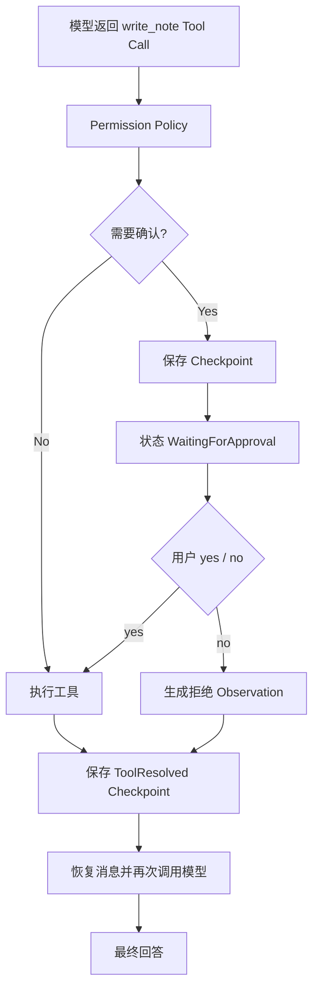
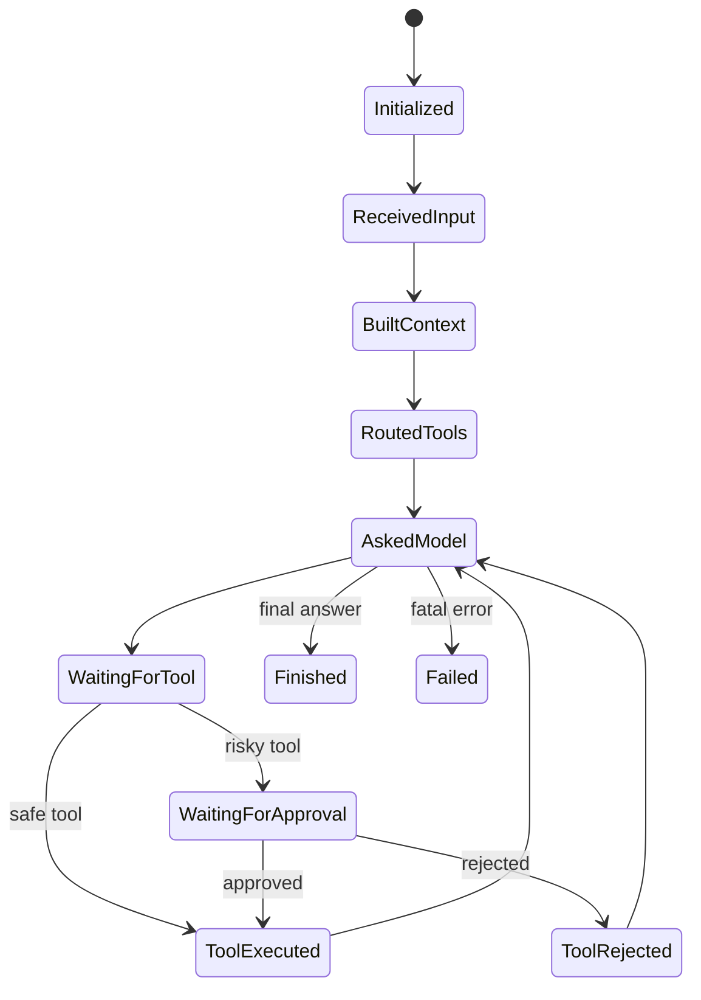
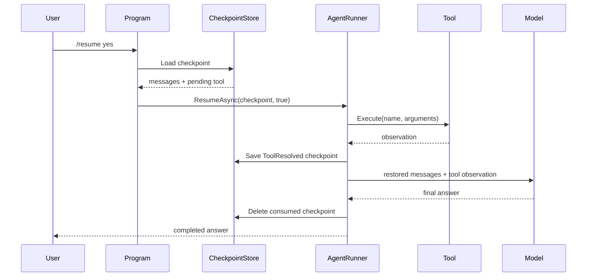

# 第 8 章：人工确认、状态机与可恢复 Agent

[上一章：AI Tool Router](07-tool-router.md) | [下一章：MCP](09-mcp.md)

## 本章起点与终点

| 项目 | 内容 |
|---|---|
| 起点 | 模型请求任何工具后，Harness 都会立即执行 |
| 终点 | 高风险工具暂停、持久化、`yes/no` 恢复且不会重复执行 |
| 自动化验收 | 88 tests |

## 8.1 为什么 Tool Call 之后不能总是立刻执行

读取时间和写文件的风险不同：

| Tool | 副作用 | 风险 | 是否确认 |
|---|---|---|---:|
| `get_current_time` | 无 | Low | 否 |
| `calculate` | 无 | Low | 否 |
| `write_note` | 修改文件 | Medium | 是 |

模型只能建议 `write_note`，不能替用户授权写文件。



## 8.2 风险信息属于 Skill

`IAgentSkill` 在这一阶段增加：

```csharp
AgentSkillRiskLevel RiskLevel { get; }

bool RequiresConfirmation { get; }
```

例如：

```csharp
public AgentSkillRiskLevel RiskLevel => AgentSkillRiskLevel.Medium;

public bool RequiresConfirmation => true;
```

Harness 的 `AgentToolPermissionPolicy` 再做统一判断。不要只把“需要审批”写在 Prompt 里，因为 Prompt 不具备强制力。

## 8.3 状态机解决什么

没有状态对象时，流程只能靠日志猜测。`AgentRunState` 显式保存：

```csharp
public AgentRunStatus Status { get; private set; }
public int ModelRequestCount { get; private set; }
public int ToolCallCount { get; private set; }
public string? LastToolName { get; private set; }
public bool WaitingForApproval { get; private set; }
public string? LastError { get; private set; }
```

状态路径：



Runner 不直接给 `Status` 赋值，而是调用：

```csharp
runState.MarkAskedModel();
runState.MarkToolRequested(toolName);
runState.MarkWaitingForApproval(toolName);
runState.MarkToolExecuted(toolName);
runState.MarkFinished();
```

对外只返回不可变 `AgentRunSnapshot`，避免 UI 修改内部状态。

## 8.4 暂停不是等待 Console.ReadLine

一种简单做法是在工具执行函数中：

```csharp
string answer = Console.ReadLine();
```

这会让 Runner 永远绑死在控制台，进程关闭就丢失现场，也无法由 Web API 在几小时后恢复。

真正可恢复的暂停是：

1. 把恢复所需数据保存到 Checkpoint。
2. 返回 `WaitingForApproval` 结果。
3. 当前调用结束，进程可以关闭。
4. 用户以后提交 `yes/no`，新调用从文件恢复。

## 8.5 PendingApproval 需要保存什么

```csharp
public sealed record PendingToolApproval(
    string ToolCallId,
    string ToolName,
    string Description,
    string ArgumentsJson,
    AgentSkillRiskLevel RiskLevel);
```

字段作用：

- `ToolCallId`：将后续 Tool Result 与模型请求关联。
- `ToolName`：找到执行实现。
- `ArgumentsJson`：恢复时使用模型当时给的原始参数。
- `Description`、`RiskLevel`：给确认 UI 展示。

但这些还不够，因为恢复后模型还需要看到暂停前的完整对话上下文。

## 8.6 Checkpoint 为什么保存全部消息快照

用户之前的理解是对的：Checkpoint 不是只存一个 Message ID，而是存恢复所需的消息内容。

```csharp
public sealed record AgentRunCheckpoint(
    string RunId,
    AgentCheckpointKind Kind,
    DateTimeOffset CreatedAt,
    AgentRunSnapshot State,
    IReadOnlyList<AgentCheckpointMessage> Messages,
    IReadOnlyList<string> SelectedToolNames,
    PendingToolApproval? PendingApproval,
    ResolvedToolCall? ResolvedTool);
```

`Messages` 中会保存：

```text
system: 角色与指令
user:   用户原问题
assistant: 模型返回的 tool_call + tool_call_id
```

恢复后再追加：

```text
tool: 执行结果或拒绝 Observation + 相同 tool_call_id
```

然后把整组消息发给模型。

## 8.7 SDK 类型为什么不能直接进 Checkpoint

OpenAI SDK 的 `ChatMessage` 适合发请求，不适合作为长期存储契约。课程定义自己的 DTO：

```csharp
public sealed record AgentCheckpointMessage(
    string Role,
    string? Content,
    string? ToolCallId,
    IReadOnlyList<AgentCheckpointToolCall> ToolCalls);
```

好处：

- JSON 格式由项目控制。
- 不依赖 SDK 私有序列化细节。
- 将来换 SDK 时 Checkpoint 不必全部失效。
- 测试可以构造简单对象。

## 8.8 Checkpoint JSON 示例

```json
{
  "run_id": "run_8b6f...",
  "kind": "pending_tool_approval",
  "created_at": "2026-07-16T01:00:00+00:00",
  "state": {
    "status": "waiting_for_approval",
    "model_request_count": 1,
    "tool_call_count": 1,
    "last_tool_name": "write_note",
    "waiting_for_approval": true,
    "last_error": null
  },
  "messages": [
    {
      "role": "system",
      "content": "You are Grimoire Router...",
      "tool_calls": []
    },
    {
      "role": "user",
      "content": "帮我记录：今天学会了 Checkpoint",
      "tool_calls": []
    },
    {
      "role": "assistant",
      "content": null,
      "tool_calls": [
        {
          "id": "call_note_1",
          "name": "write_note",
          "arguments_json": "{\"note\":\"今天学会了 Checkpoint\"}"
        }
      ]
    }
  ],
  "selected_tool_names": ["write_note"],
  "pending_approval": {
    "tool_call_id": "call_note_1",
    "tool_name": "write_note",
    "arguments_json": "{\"note\":\"今天学会了 Checkpoint\"}",
    "risk_level": "medium"
  },
  "resolved_tool": null
}
```

## 8.9 持久化 Store

```csharp
public static async Task SaveAsync(
    string filePath,
    AgentRunCheckpoint checkpoint,
    CancellationToken cancellationToken = default)
{
    string? directory = Path.GetDirectoryName(filePath);
    if (!string.IsNullOrWhiteSpace(directory))
    {
        Directory.CreateDirectory(directory);
    }

    await using FileStream stream = File.Create(filePath);
    await JsonSerializer.SerializeAsync(
        stream,
        checkpoint,
        JsonOptions,
        cancellationToken);
}
```

本地教学路径：

```text
memory/pending-approval-checkpoint.json
```

生产系统通常换成数据库或队列，但数据语义相同。

## 8.10 yes/no 到底确认了什么

模型已经把 Tool Call 发给客户端。`yes` 不会让模型重新决定参数，它表示：

> “客户端允许 Harness 按 Checkpoint 中的 `tool_name + arguments_json` 执行这次函数。”

`no` 表示不执行函数，但仍需给模型一条 Observation：

```text
[工具调用已被用户拒绝]
工具名称：write_note
请告诉用户该操作没有执行。
```

模型根据这个结果组织礼貌的最终回答。

## 8.11 Resume 的数据流



Runner 入口：

```csharp
public async Task<AgentRunResult> ResumeAsync(
    AgentRunCheckpoint checkpoint,
    bool approved)
```

`RunAsync` 处理新任务，`ResumeAsync` 处理旧任务的继续执行。两条路径最终进入同一个模型工具循环。

## 8.12 为什么要有 ToolResolved Checkpoint

危险窗口：

```text
write_note 已执行成功
-> 进程崩溃
-> 还没把结果发回模型
```

若只保存 PendingApproval，重启后再 `yes` 会第二次写文件。

所以执行后先保存：

```csharp
public sealed record ResolvedToolCall(
    string ToolCallId,
    string ToolName,
    bool Approved,
    bool ToolExecuted,
    string Observation);
```

恢复时发现 `Kind == ToolResolved`，直接复用 Observation，不再执行工具：

```csharp
if (checkpoint.Kind == AgentCheckpointKind.ToolResolved)
{
    return new AgentCheckpointResumeResult(
        checkpoint.RunId,
        resolvedTool.ToolCallId,
        resolvedTool.ToolName,
        resolvedTool.Approved,
        resolvedTool.ToolExecuted,
        resolvedTool.Observation);
}
```

## 8.13 幂等键解决什么

幂等的目标：同一个逻辑 Tool Call 即使因为重试执行两次，外部副作用仍只发生一次。

课程使用：

```text
IdempotencyKey = RunId + ToolCallId
```

- `RunId`：整个 Agent 任务的唯一 ID。
- `ToolCallId`：模型这一次工具请求的唯一 ID。

只用工具名不够，因为同一任务可能写两条不同笔记；只用参数也可能把用户有意重复的两次操作合并。

Checkpoint 防止 Harness 正常恢复时重复执行，工具内部幂等防止更底层的重试或崩溃窗口。两层不是重复，而是互补。

## 8.14 当前交互命令

初次运行触发确认：

```text
You> 帮我记录：今天理解了 Agent Harness
[State] WaitingForApproval
Tool: write_note
Arguments: {"note":"今天理解了 Agent Harness"}
Use /resume yes or /resume no.
```

稍后恢复：

```text
You> /resume yes
[Workflow] Resume checkpoint
[Workflow] Execute write_note
[Workflow] Ask model
Grimoire Router> 已经帮你记录好了。
```

## 8.15 运行与测试

```bash
dotnet test AgentLearning.sln
```


88 个测试覆盖：

- 风险等级与审批策略。
- 状态字段和转移结果。
- Checkpoint 保存、读取、删除。
- SDK 消息到 Checkpoint DTO 的转换。
- `yes` 执行与 `no` 拒绝。
- Pending 到 ToolResolved 的二阶段保存。
- Resume 后继续模型循环。
- 同一 Tool Call 只产生一次副作用。

<!-- BEGIN SELF-CONTAINED CODE -->
## 本章完整文件代码

这一节是本章的**完整代码依据**。前面的代码用于解释概念；真正动手时，请从上一章完成后的目录继续，并按下表逐项操作。`新建` 表示创建此前不存在的文件，`完整覆盖` 表示把旧文件全部替换成这里的内容。不要只复制局部片段。

> 下面已经包含本章所需的全部新增和变更文件，不需要再查找其他代码文件。

先在项目根目录执行下面的命令，确保本章需要的目录存在：

```bash
mkdir -p src/AgentLearning.App src/AgentLearning.Core src/AgentLearning.Core/Skills src/AgentLearning.Core/Workflow tests/AgentLearning.Core.Tests
```

### 文件操作清单

| 操作 | 文件 |
|---|---|
| 新建 | `src/AgentLearning.App/AgentRunOutcome.cs` |
| 新建 | `src/AgentLearning.App/IAgentChatClient.cs` |
| 新建 | `src/AgentLearning.App/OpenAIChatClientAdapter.cs` |
| 新建 | `src/AgentLearning.Core/AgentCheckpointKind.cs` |
| 新建 | `src/AgentLearning.Core/AgentCheckpointMessage.cs` |
| 新建 | `src/AgentLearning.Core/AgentCheckpointMessageBuilder.cs` |
| 新建 | `src/AgentLearning.Core/AgentCheckpointResumeResult.cs` |
| 新建 | `src/AgentLearning.Core/AgentCheckpointResumer.cs` |
| 新建 | `src/AgentLearning.Core/AgentCheckpointStore.cs` |
| 新建 | `src/AgentLearning.Core/AgentCheckpointToolCall.cs` |
| 新建 | `src/AgentLearning.Core/AgentRunCheckpoint.cs` |
| 新建 | `src/AgentLearning.Core/AgentToolApprovalObservation.cs` |
| 新建 | `src/AgentLearning.Core/AgentToolConfirmationRequest.cs` |
| 新建 | `src/AgentLearning.Core/AgentToolPermissionPolicy.cs` |
| 新建 | `src/AgentLearning.Core/PendingToolApproval.cs` |
| 新建 | `src/AgentLearning.Core/ResolvedToolCall.cs` |
| 新建 | `src/AgentLearning.Core/Skills/AgentSkillRiskLevel.cs` |
| 新建 | `src/AgentLearning.Core/Skills/WriteNoteSkill.cs` |
| 新建 | `src/AgentLearning.Core/Workflow/AgentRunSnapshot.cs` |
| 新建 | `src/AgentLearning.Core/Workflow/AgentRunState.cs` |
| 新建 | `src/AgentLearning.Core/Workflow/AgentRunStatus.cs` |
| 新建 | `tests/AgentLearning.Core.Tests/AgentCheckpointMessageBuilderTests.cs` |
| 新建 | `tests/AgentLearning.Core.Tests/AgentCheckpointResumerTests.cs` |
| 新建 | `tests/AgentLearning.Core.Tests/AgentCheckpointStoreTests.cs` |
| 新建 | `tests/AgentLearning.Core.Tests/AgentRunCheckpointTests.cs` |
| 新建 | `tests/AgentLearning.Core.Tests/AgentRunStateTests.cs` |
| 新建 | `tests/AgentLearning.Core.Tests/AgentRunnerPauseTests.cs` |
| 新建 | `tests/AgentLearning.Core.Tests/AgentRunnerResumeTests.cs` |
| 新建 | `tests/AgentLearning.Core.Tests/AgentToolApprovalObservationTests.cs` |
| 新建 | `tests/AgentLearning.Core.Tests/AgentToolPermissionPolicyTests.cs` |
| 新建 | `tests/AgentLearning.Core.Tests/WriteNoteSkillTests.cs` |
| 完整覆盖 | `src/AgentLearning.App/AgentRunResult.cs` |
| 完整覆盖 | `src/AgentLearning.App/AgentRunner.cs` |
| 完整覆盖 | `src/AgentLearning.App/Program.cs` |
| 完整覆盖 | `src/AgentLearning.Core/AgentToolCatalogBuilder.cs` |
| 完整覆盖 | `src/AgentLearning.Core/AgentToolCatalogItem.cs` |
| 完整覆盖 | `src/AgentLearning.Core/Skills/AgentSkillRegistry.cs` |
| 完整覆盖 | `src/AgentLearning.Core/Skills/CalculatorSkill.cs` |
| 完整覆盖 | `src/AgentLearning.Core/Skills/IAgentSkill.cs` |
| 完整覆盖 | `src/AgentLearning.Core/Skills/TimeSkill.cs` |
| 完整覆盖 | `src/AgentLearning.Core/Workflow/AgentWorkflowStepKind.cs` |
| 完整覆盖 | `tests/AgentLearning.Core.Tests/AgentLearning.Core.Tests.csproj` |
| 完整覆盖 | `tests/AgentLearning.Core.Tests/AgentSkillRegistryTests.cs` |
| 完整覆盖 | `tests/AgentLearning.Core.Tests/AgentToolRouterTests.cs` |

<!-- FILE: ADD src/AgentLearning.App/AgentRunOutcome.cs -->
<details>
<summary><strong>新建</strong> <code>src/AgentLearning.App/AgentRunOutcome.cs</code></summary>

`````csharp
namespace AgentLearning.App;

/// <summary>
/// Describes whether an agent run completed or paused for human approval.
/// </summary>
public enum AgentRunOutcome
{
    Completed,
    WaitingForApproval
}
`````

</details>
<!-- END FILE -->

<!-- FILE: ADD src/AgentLearning.App/IAgentChatClient.cs -->
<details>
<summary><strong>新建</strong> <code>src/AgentLearning.App/IAgentChatClient.cs</code></summary>

`````csharp
using OpenAI.Chat;

namespace AgentLearning.App;

/// <summary>
/// AgentRunner 使用的模型客户端接口。
/// 生产环境由 OpenAI SDK 适配器实现，测试环境可以用假客户端返回固定模型结果。
/// </summary>
public interface IAgentChatClient
{
    /// <summary>发送非流式 Chat Completions 请求。</summary>
    Task<ChatCompletion> CompleteChatAsync(
        IReadOnlyList<ChatMessage> messages,
        ChatCompletionOptions? options = null);

    /// <summary>发送流式 Chat Completions 请求。</summary>
    IAsyncEnumerable<StreamingChatCompletionUpdate> CompleteChatStreamingAsync(
        IReadOnlyList<ChatMessage> messages);
}
`````

</details>
<!-- END FILE -->

<!-- FILE: ADD src/AgentLearning.App/OpenAIChatClientAdapter.cs -->
<details>
<summary><strong>新建</strong> <code>src/AgentLearning.App/OpenAIChatClientAdapter.cs</code></summary>

`````csharp
using OpenAI.Chat;

namespace AgentLearning.App;

/// <summary>
/// 把 OpenAI SDK 的 ChatClient 包装成 AgentRunner 需要的模型客户端接口。
/// 这样 AgentRunner 不直接依赖不可替换的 SDK 客户端，测试时更容易控制模型返回。
/// </summary>
public sealed class OpenAIChatClientAdapter : IAgentChatClient
{
    private readonly ChatClient _client;

    public OpenAIChatClientAdapter(ChatClient client)
    {
        _client = client;
    }

    /// <inheritdoc />
    public async Task<ChatCompletion> CompleteChatAsync(
        IReadOnlyList<ChatMessage> messages,
        ChatCompletionOptions? options = null)
    {
        return await _client.CompleteChatAsync(messages, options);
    }

    /// <inheritdoc />
    public async IAsyncEnumerable<StreamingChatCompletionUpdate> CompleteChatStreamingAsync(
        IReadOnlyList<ChatMessage> messages)
    {
        await foreach (StreamingChatCompletionUpdate update in _client.CompleteChatStreamingAsync(messages))
        {
            yield return update;
        }
    }
}
`````

</details>
<!-- END FILE -->

<!-- FILE: ADD src/AgentLearning.Core/AgentCheckpointKind.cs -->
<details>
<summary><strong>新建</strong> <code>src/AgentLearning.Core/AgentCheckpointKind.cs</code></summary>

`````csharp
namespace AgentLearning.Core;

/// <summary>
/// Checkpoint kind.
/// </summary>
public enum AgentCheckpointKind
{
    /// <summary>The agent is paused while waiting for the user to approve a tool call.</summary>
    PendingToolApproval,

    /// <summary>The tool has already been resolved, but the final model answer is not completed yet.</summary>
    ToolResolved
}
`````

</details>
<!-- END FILE -->

<!-- FILE: ADD src/AgentLearning.Core/AgentCheckpointMessage.cs -->
<details>
<summary><strong>新建</strong> <code>src/AgentLearning.Core/AgentCheckpointMessage.cs</code></summary>

`````csharp
using System.Text.Json.Serialization;

namespace AgentLearning.Core;

/// <summary>
/// Checkpoint 里保存的聊天消息快照。
/// 真实恢复时会把它重新转换成 SDK 的 ChatMessage。
/// </summary>
public sealed record AgentCheckpointMessage(
    /// <summary>消息角色，例如 system、user、assistant、tool。</summary>
    [property: JsonPropertyName("role")]
    string Role,

    /// <summary>普通文本内容；assistant 工具调用消息可以为空。</summary>
    [property: JsonPropertyName("content")]
    string? Content,

    /// <summary>tool 消息对应的 tool_call_id，非 tool 消息通常为空。</summary>
    [property: JsonPropertyName("tool_call_id")]
    string? ToolCallId,

    /// <summary>assistant 消息里携带的工具调用列表。</summary>
    [property: JsonPropertyName("tool_calls")]
    IReadOnlyList<AgentCheckpointToolCall> ToolCalls)
{
    /// <summary>创建普通文本消息。</summary>
    public static AgentCheckpointMessage Text(string role, string content)
    {
        ArgumentException.ThrowIfNullOrWhiteSpace(role);
        ArgumentNullException.ThrowIfNull(content);

        return new AgentCheckpointMessage(role.Trim(), content, ToolCallId: null, ToolCalls: []);
    }

    /// <summary>创建 assistant 工具调用消息。</summary>
    public static AgentCheckpointMessage AssistantToolCalls(
        IReadOnlyList<AgentCheckpointToolCall> toolCalls)
    {
        ArgumentNullException.ThrowIfNull(toolCalls);
        if (toolCalls.Count == 0)
        {
            throw new ArgumentException("Assistant tool call message requires at least one tool call.", nameof(toolCalls));
        }

        return new AgentCheckpointMessage("assistant", Content: null, ToolCallId: null, ToolCalls: toolCalls);
    }

    /// <summary>创建工具观察消息。</summary>
    public static AgentCheckpointMessage Tool(string toolCallId, string content)
    {
        ArgumentException.ThrowIfNullOrWhiteSpace(toolCallId);
        ArgumentNullException.ThrowIfNull(content);

        return new AgentCheckpointMessage("tool", content, toolCallId.Trim(), ToolCalls: []);
    }
}
`````

</details>
<!-- END FILE -->

<!-- FILE: ADD src/AgentLearning.Core/AgentCheckpointMessageBuilder.cs -->
<details>
<summary><strong>新建</strong> <code>src/AgentLearning.Core/AgentCheckpointMessageBuilder.cs</code></summary>

`````csharp
using AgentLearning.Core.Diagnostics;

namespace AgentLearning.Core;

/// <summary>
/// 把调试消息转换成可持久化的 Checkpoint 消息。
/// 调试消息面向人类预览；Checkpoint 消息面向恢复运行。
/// </summary>
public static class AgentCheckpointMessageBuilder
{
    /// <summary>从当前请求消息快照创建 Checkpoint 消息列表。</summary>
    public static IReadOnlyList<AgentCheckpointMessage> FromDebugMessages(
        IReadOnlyList<AgentDebugMessage> debugMessages)
    {
        ArgumentNullException.ThrowIfNull(debugMessages);

        List<AgentCheckpointMessage> checkpointMessages = [];
        foreach (AgentDebugMessage message in debugMessages)
        {
            checkpointMessages.Add(ConvertMessage(message));
        }

        return checkpointMessages;
    }

    private static AgentCheckpointMessage ConvertMessage(AgentDebugMessage message)
    {
        return message.Role switch
        {
            "system" or "user" => AgentCheckpointMessage.Text(message.Role, message.Content ?? string.Empty),
            "assistant" when message.ToolCalls.Count > 0 => ConvertAssistantToolCallMessage(message),
            "assistant" => AgentCheckpointMessage.Text("assistant", message.Content ?? string.Empty),
            "tool" => AgentCheckpointMessage.Tool(
                RequireToolCallId(message),
                message.Content ?? string.Empty),
            _ => throw new InvalidOperationException($"Unsupported checkpoint message role: {message.Role}")
        };
    }

    private static AgentCheckpointMessage ConvertAssistantToolCallMessage(AgentDebugMessage message)
    {
        AgentCheckpointToolCall[] toolCalls = message.ToolCalls
            .Select(toolCall => new AgentCheckpointToolCall(
                toolCall.Id,
                toolCall.Name,
                toolCall.ArgumentsJson))
            .ToArray();

        return AgentCheckpointMessage.AssistantToolCalls(toolCalls);
    }

    private static string RequireToolCallId(AgentDebugMessage message)
    {
        if (string.IsNullOrWhiteSpace(message.ToolCallId))
        {
            throw new InvalidOperationException("Tool checkpoint message requires tool_call_id.");
        }

        return message.ToolCallId;
    }
}
`````

</details>
<!-- END FILE -->

<!-- FILE: ADD src/AgentLearning.Core/AgentCheckpointResumeResult.cs -->
<details>
<summary><strong>新建</strong> <code>src/AgentLearning.Core/AgentCheckpointResumeResult.cs</code></summary>

`````csharp
namespace AgentLearning.Core;

/// <summary>
/// 从 Checkpoint 恢复一次工具确认后的结果。
/// 第一版只恢复工具执行层，不负责继续请求模型生成最终回答。
/// </summary>
public sealed record AgentCheckpointResumeResult(
    /// <summary>被恢复的 Agent 运行 ID。</summary>
    string RunId,

    /// <summary>恢复的 tool_call_id。</summary>
    string ToolCallId,

    /// <summary>恢复的工具名。</summary>
    string ToolName,

    /// <summary>用户是否批准执行工具。</summary>
    bool Approved,

    /// <summary>工具是否真的被执行。</summary>
    bool ToolExecuted,

    /// <summary>工具执行结果，或者用户拒绝时发回模型的 observation。</summary>
    string Observation);
`````

</details>
<!-- END FILE -->

<!-- FILE: ADD src/AgentLearning.Core/AgentCheckpointResumer.cs -->
<details>
<summary><strong>新建</strong> <code>src/AgentLearning.Core/AgentCheckpointResumer.cs</code></summary>

`````csharp
using AgentLearning.Core.Skills;

namespace AgentLearning.Core;

/// <summary>
/// Resolves the tool step represented by a checkpoint.
/// </summary>
public static class AgentCheckpointResumer
{
    /// <summary>
    /// Execute a pending tool, reject it, or reuse an already resolved tool observation.
    /// </summary>
    public static async Task<AgentCheckpointResumeResult> ResumeAsync(
        AgentRunCheckpoint checkpoint,
        bool approved,
        AgentSkillRegistry skillRegistry,
        CancellationToken cancellationToken = default)
    {
        ArgumentNullException.ThrowIfNull(checkpoint);
        ArgumentNullException.ThrowIfNull(skillRegistry);

        if (checkpoint.Kind == AgentCheckpointKind.ToolResolved)
        {
            ResolvedToolCall resolvedTool = checkpoint.ResolvedTool
                ?? throw new InvalidOperationException("Checkpoint does not contain resolved tool data.");

            return new AgentCheckpointResumeResult(
                checkpoint.RunId,
                resolvedTool.ToolCallId,
                resolvedTool.ToolName,
                resolvedTool.Approved,
                resolvedTool.ToolExecuted,
                resolvedTool.Observation);
        }

        if (checkpoint.Kind != AgentCheckpointKind.PendingToolApproval)
        {
            throw new InvalidOperationException($"Unsupported checkpoint kind: {checkpoint.Kind}");
        }

        PendingToolApproval pendingApproval = checkpoint.PendingApproval
            ?? throw new InvalidOperationException("Checkpoint does not contain pending approval data.");

        if (!approved)
        {
            string rejectedObservation = AgentToolApprovalObservation.BuildRejected(pendingApproval.ToolName);
            return new AgentCheckpointResumeResult(
                checkpoint.RunId,
                pendingApproval.ToolCallId,
                pendingApproval.ToolName,
                Approved: false,
                ToolExecuted: false,
                Observation: rejectedObservation);
        }

        string toolResult = await skillRegistry.ExecuteAsync(
            pendingApproval.ToolName,
            pendingApproval.ArgumentsJson,
            cancellationToken);

        return new AgentCheckpointResumeResult(
            checkpoint.RunId,
            pendingApproval.ToolCallId,
            pendingApproval.ToolName,
            Approved: true,
            ToolExecuted: true,
            Observation: toolResult);
    }
}
`````

</details>
<!-- END FILE -->

<!-- FILE: ADD src/AgentLearning.Core/AgentCheckpointStore.cs -->
<details>
<summary><strong>新建</strong> <code>src/AgentLearning.Core/AgentCheckpointStore.cs</code></summary>

`````csharp
using System.Text.Encodings.Web;
using System.Text.Json;
using System.Text.Json.Serialization;

namespace AgentLearning.Core;

/// <summary>
/// 把 Agent Checkpoint 保存到本地 JSON 文件。
/// 这是教学版实现；真实系统里通常会换成数据库、Redis 或队列。
/// </summary>
public static class AgentCheckpointStore
{
    private static readonly JsonSerializerOptions JsonOptions = new()
    {
        WriteIndented = true,
        Encoder = JavaScriptEncoder.UnsafeRelaxedJsonEscaping,
        PropertyNamingPolicy = JsonNamingPolicy.SnakeCaseLower,
        Converters = { new JsonStringEnumConverter() }
    };

    /// <summary>从文件读取 Checkpoint。文件不存在时返回 null。</summary>
    public static async Task<AgentRunCheckpoint?> LoadAsync(
        string filePath,
        CancellationToken cancellationToken = default)
    {
        if (!File.Exists(filePath))
        {
            return null;
        }

        await using FileStream stream = File.OpenRead(filePath);
        return await JsonSerializer.DeserializeAsync<AgentRunCheckpoint>(
            stream,
            JsonOptions,
            cancellationToken);
    }

    /// <summary>把 Checkpoint 保存到文件，必要时自动创建目录。</summary>
    public static async Task SaveAsync(
        string filePath,
        AgentRunCheckpoint checkpoint,
        CancellationToken cancellationToken = default)
    {
        ArgumentNullException.ThrowIfNull(checkpoint);

        string? directory = Path.GetDirectoryName(filePath);
        if (!string.IsNullOrWhiteSpace(directory))
        {
            Directory.CreateDirectory(directory);
        }

        await using FileStream stream = File.Create(filePath);
        await JsonSerializer.SerializeAsync(stream, checkpoint, JsonOptions, cancellationToken);
    }

    /// <summary>删除 Checkpoint 文件。文件不存在时什么也不做。</summary>
    public static Task DeleteAsync(string filePath)
    {
        if (File.Exists(filePath))
        {
            File.Delete(filePath);
        }

        return Task.CompletedTask;
    }
}
`````

</details>
<!-- END FILE -->

<!-- FILE: ADD src/AgentLearning.Core/AgentCheckpointToolCall.cs -->
<details>
<summary><strong>新建</strong> <code>src/AgentLearning.Core/AgentCheckpointToolCall.cs</code></summary>

`````csharp
using System.Text.Json.Serialization;

namespace AgentLearning.Core;

/// <summary>
/// Checkpoint 里保存的工具调用快照。
/// 它只记录恢复模型上下文需要的最小字段，不绑定 OpenAI SDK 类型。
/// </summary>
public sealed record AgentCheckpointToolCall(
    /// <summary>模型生成的 tool_call_id，后续 tool 消息必须用它对上。</summary>
    [property: JsonPropertyName("id")]
    string Id,

    /// <summary>模型想调用的工具名。</summary>
    [property: JsonPropertyName("name")]
    string Name,

    /// <summary>模型传给工具的 JSON 参数。</summary>
    [property: JsonPropertyName("arguments_json")]
    string ArgumentsJson);
`````

</details>
<!-- END FILE -->

<!-- FILE: ADD src/AgentLearning.Core/AgentRunCheckpoint.cs -->
<details>
<summary><strong>新建</strong> <code>src/AgentLearning.Core/AgentRunCheckpoint.cs</code></summary>

`````csharp
using AgentLearning.Core.Workflow;
using System.Text.Json.Serialization;

namespace AgentLearning.Core;

/// <summary>
/// Durable snapshot used to resume an interrupted agent run.
/// </summary>
public sealed record AgentRunCheckpoint(
    /// <summary>The unique ID for one agent run.</summary>
    [property: JsonPropertyName("run_id")]
    string RunId,

    /// <summary>The checkpoint kind.</summary>
    [property: JsonPropertyName("kind")]
    AgentCheckpointKind Kind,

    /// <summary>When this checkpoint was created.</summary>
    [property: JsonPropertyName("created_at")]
    DateTimeOffset CreatedAt,

    /// <summary>The run state snapshot at the checkpoint moment.</summary>
    [property: JsonPropertyName("state")]
    AgentRunSnapshot State,

    /// <summary>The model message snapshot captured before pausing.</summary>
    [property: JsonPropertyName("messages")]
    IReadOnlyList<AgentCheckpointMessage> Messages,

    /// <summary>The tool names exposed to the main agent for this run.</summary>
    [property: JsonPropertyName("selected_tool_names")]
    IReadOnlyList<string> SelectedToolNames,

    /// <summary>The pending tool approval data, when the run is waiting for approval.</summary>
    [property: JsonPropertyName("pending_approval")]
    PendingToolApproval? PendingApproval,

    /// <summary>The resolved tool result, when the run already has an observation to send back.</summary>
    [property: JsonPropertyName("resolved_tool")]
    ResolvedToolCall? ResolvedTool)
{
    /// <summary>Create a checkpoint while waiting for tool approval.</summary>
    public static AgentRunCheckpoint CreatePendingApproval(
        string runId,
        DateTimeOffset createdAt,
        AgentToolConfirmationRequest request,
        AgentRunSnapshot state,
        IReadOnlyList<AgentCheckpointMessage> messages,
        IReadOnlyList<string> selectedToolNames)
    {
        ArgumentException.ThrowIfNullOrWhiteSpace(runId);
        ArgumentNullException.ThrowIfNull(request);
        ArgumentNullException.ThrowIfNull(state);
        ArgumentNullException.ThrowIfNull(messages);
        ArgumentNullException.ThrowIfNull(selectedToolNames);

        if (state.Status != AgentRunStatus.WaitingForApproval || !state.WaitingForApproval)
        {
            throw new InvalidOperationException("Pending approval checkpoint requires state WaitingForApproval.");
        }

        return new AgentRunCheckpoint(
            runId.Trim(),
            AgentCheckpointKind.PendingToolApproval,
            createdAt,
            state,
            messages.ToArray(),
            selectedToolNames.Select(toolName => toolName.Trim()).ToArray(),
            PendingToolApproval.FromConfirmationRequest(request),
            ResolvedTool: null);
    }

    /// <summary>Create a checkpoint after a tool has been resolved but before the model finishes.</summary>
    public static AgentRunCheckpoint CreateToolResolved(
        string runId,
        DateTimeOffset createdAt,
        AgentRunSnapshot state,
        IReadOnlyList<AgentCheckpointMessage> messages,
        IReadOnlyList<string> selectedToolNames,
        ResolvedToolCall resolvedTool)
    {
        ArgumentException.ThrowIfNullOrWhiteSpace(runId);
        ArgumentNullException.ThrowIfNull(state);
        ArgumentNullException.ThrowIfNull(messages);
        ArgumentNullException.ThrowIfNull(selectedToolNames);
        ArgumentNullException.ThrowIfNull(resolvedTool);

        if (state.Status is not AgentRunStatus.ToolExecuted and not AgentRunStatus.ToolRejected)
        {
            throw new InvalidOperationException("Tool resolved checkpoint requires state ToolExecuted or ToolRejected.");
        }

        return new AgentRunCheckpoint(
            runId.Trim(),
            AgentCheckpointKind.ToolResolved,
            createdAt,
            state,
            messages.ToArray(),
            selectedToolNames.Select(toolName => toolName.Trim()).ToArray(),
            PendingApproval: null,
            resolvedTool);
    }
}
`````

</details>
<!-- END FILE -->

<!-- FILE: ADD src/AgentLearning.Core/AgentToolApprovalObservation.cs -->
<details>
<summary><strong>新建</strong> <code>src/AgentLearning.Core/AgentToolApprovalObservation.cs</code></summary>

`````csharp
namespace AgentLearning.Core;

/// <summary>
/// 构建发回模型的工具审批观察消息。
/// 用户拒绝时，模型也需要知道工具没有执行，不能假装动作已经完成。
/// </summary>
public static class AgentToolApprovalObservation
{
    /// <summary>构建“用户拒绝执行工具”的观察消息。</summary>
    public static string BuildRejected(string toolName)
    {
        return $"Tool '{toolName}' was not executed because the user rejected the confirmation request.";
    }
}
`````

</details>
<!-- END FILE -->

<!-- FILE: ADD src/AgentLearning.Core/AgentToolConfirmationRequest.cs -->
<details>
<summary><strong>新建</strong> <code>src/AgentLearning.Core/AgentToolConfirmationRequest.cs</code></summary>

`````csharp
using AgentLearning.Core.Skills;

namespace AgentLearning.Core;

/// <summary>
/// Harness 请求用户确认工具调用时展示的信息。
/// 它只描述“模型想做什么”，不负责真正执行工具。
/// </summary>
public sealed record AgentToolConfirmationRequest(
    /// <summary>模型生成的 tool_call_id，恢复时要用它把工具结果回填给正确的调用。</summary>
    string ToolCallId,

    /// <summary>模型想调用的工具名。</summary>
    string ToolName,

    /// <summary>工具说明，帮助用户理解这个工具会做什么。</summary>
    string Description,

    /// <summary>模型传给工具的原始参数 JSON。</summary>
    string ArgumentsJson,

    /// <summary>工具风险等级。</summary>
    AgentSkillRiskLevel RiskLevel);
`````

</details>
<!-- END FILE -->

<!-- FILE: ADD src/AgentLearning.Core/AgentToolPermissionPolicy.cs -->
<details>
<summary><strong>新建</strong> <code>src/AgentLearning.Core/AgentToolPermissionPolicy.cs</code></summary>

`````csharp
using AgentLearning.Core.Skills;

namespace AgentLearning.Core;

/// <summary>
/// 工具权限策略。
/// 模型可以建议调用工具，但是否能直接执行由 Harness 按这里的规则判断。
/// </summary>
public static class AgentToolPermissionPolicy
{
    /// <summary>
    /// 判断一个技能在执行前是否需要用户确认。
    /// </summary>
    public static bool RequiresConfirmation(IAgentSkill skill)
    {
        return skill.RequiresConfirmation || skill.RiskLevel >= AgentSkillRiskLevel.Medium;
    }
}
`````

</details>
<!-- END FILE -->

<!-- FILE: ADD src/AgentLearning.Core/PendingToolApproval.cs -->
<details>
<summary><strong>新建</strong> <code>src/AgentLearning.Core/PendingToolApproval.cs</code></summary>

`````csharp
using AgentLearning.Core.Skills;
using System.Text.Json.Serialization;

namespace AgentLearning.Core;

/// <summary>
/// Checkpoint 里保存的待确认工具调用。
/// 这里保存的是恢复执行所需的最小信息，不依赖 OpenAI SDK 类型。
/// </summary>
public sealed record PendingToolApproval(
    /// <summary>模型生成的 tool_call_id，恢复时要和 tool result 对上。</summary>
    [property: JsonPropertyName("tool_call_id")]
    string ToolCallId,

    /// <summary>待执行工具名。</summary>
    [property: JsonPropertyName("tool_name")]
    string ToolName,

    /// <summary>工具说明，方便恢复界面展示给用户。</summary>
    [property: JsonPropertyName("description")]
    string Description,

    /// <summary>模型传给工具的原始参数 JSON。</summary>
    [property: JsonPropertyName("arguments_json")]
    string ArgumentsJson,

    /// <summary>工具风险等级。</summary>
    [property: JsonPropertyName("risk_level")]
    AgentSkillRiskLevel RiskLevel)
{
    /// <summary>从确认请求转换成 Checkpoint 里的待确认工具信息。</summary>
    public static PendingToolApproval FromConfirmationRequest(AgentToolConfirmationRequest request)
    {
        ArgumentNullException.ThrowIfNull(request);

        return new PendingToolApproval(
            request.ToolCallId,
            request.ToolName,
            request.Description,
            request.ArgumentsJson,
            request.RiskLevel);
    }
}
`````

</details>
<!-- END FILE -->

<!-- FILE: ADD src/AgentLearning.Core/ResolvedToolCall.cs -->
<details>
<summary><strong>新建</strong> <code>src/AgentLearning.Core/ResolvedToolCall.cs</code></summary>

`````csharp
using System.Text.Json.Serialization;

namespace AgentLearning.Core;

/// <summary>
/// A checkpoint-safe record of a tool call that has already been resolved.
/// Resume can reuse this observation without executing the same tool again.
/// </summary>
public sealed record ResolvedToolCall(
    /// <summary>The model-generated tool_call_id that the tool observation must match.</summary>
    [property: JsonPropertyName("tool_call_id")]
    string ToolCallId,

    /// <summary>The resolved tool name.</summary>
    [property: JsonPropertyName("tool_name")]
    string ToolName,

    /// <summary>Whether the user approved this tool call.</summary>
    [property: JsonPropertyName("approved")]
    bool Approved,

    /// <summary>Whether the local tool was actually executed.</summary>
    [property: JsonPropertyName("tool_executed")]
    bool ToolExecuted,

    /// <summary>The tool result or rejection observation that should be sent back to the model.</summary>
    [property: JsonPropertyName("observation")]
    string Observation)
{
    /// <summary>Create a resolved tool record from a resume result.</summary>
    public static ResolvedToolCall FromResumeResult(AgentCheckpointResumeResult result)
    {
        ArgumentNullException.ThrowIfNull(result);

        return new ResolvedToolCall(
            result.ToolCallId,
            result.ToolName,
            result.Approved,
            result.ToolExecuted,
            result.Observation);
    }
}
`````

</details>
<!-- END FILE -->

<!-- FILE: ADD src/AgentLearning.Core/Skills/AgentSkillRiskLevel.cs -->
<details>
<summary><strong>新建</strong> <code>src/AgentLearning.Core/Skills/AgentSkillRiskLevel.cs</code></summary>

`````csharp
namespace AgentLearning.Core.Skills;

/// <summary>
/// 技能的风险等级。
/// 等级越高，越不应该让模型在没有用户确认的情况下直接执行。
/// </summary>
public enum AgentSkillRiskLevel
{
    /// <summary>只读或纯计算，不会修改外部世界。</summary>
    Low,

    /// <summary>会写入本地文件、发送草稿、修改轻量状态等。</summary>
    Medium,

    /// <summary>可能删除数据、调用外部系统、影响用户资产或业务状态。</summary>
    High,

    /// <summary>付款、下单、批量删除等必须强确认的动作。</summary>
    Critical
}
`````

</details>
<!-- END FILE -->

<!-- FILE: ADD src/AgentLearning.Core/Skills/WriteNoteSkill.cs -->
<details>
<summary><strong>新建</strong> <code>src/AgentLearning.Core/Skills/WriteNoteSkill.cs</code></summary>

`````csharp
using System.Text.Json;

namespace AgentLearning.Core.Skills;

/// <summary>
/// 把一条笔记追加写入本地文件。
/// 它会修改文件系统，所以虽然示例很小，也必须经过用户确认。
/// </summary>
public sealed class WriteNoteSkill : IAgentSkill
{
    private readonly string _notesFilePath;
    private readonly Func<DateTimeOffset> _clock;

    public WriteNoteSkill(string notesFilePath)
        : this(notesFilePath, () => DateTimeOffset.Now)
    {
    }

    public WriteNoteSkill(string notesFilePath, Func<DateTimeOffset> clock)
    {
        if (string.IsNullOrWhiteSpace(notesFilePath))
        {
            throw new ArgumentException("Notes file path cannot be empty.", nameof(notesFilePath));
        }

        _notesFilePath = notesFilePath;
        _clock = clock;
    }

    public string Name => "write_note";

    public string Description => "Append a note to a local markdown notes file.";

    public string ParametersJson => """
        {
          "type": "object",
          "properties": {
            "note": {
              "type": "string",
              "description": "The note content to append to the local notes file."
            }
          },
          "required": ["note"],
          "additionalProperties": false
        }
        """;

    public AgentSkillRiskLevel RiskLevel => AgentSkillRiskLevel.Medium;

    public bool RequiresConfirmation => true;

    public async Task<string> ExecuteAsync(string argumentsJson, CancellationToken cancellationToken = default)
    {
        string note = ReadNote(argumentsJson);
        string? directory = Path.GetDirectoryName(_notesFilePath);
        if (!string.IsNullOrWhiteSpace(directory))
        {
            Directory.CreateDirectory(directory);
        }

        string entry = $"""
            - {_clock():O}
              {note}

            """;

        await File.AppendAllTextAsync(_notesFilePath, entry, cancellationToken);
        return $"Note saved to {_notesFilePath}.";
    }

    private static string ReadNote(string argumentsJson)
    {
        using JsonDocument document = JsonDocument.Parse(argumentsJson);

        if (!document.RootElement.TryGetProperty("note", out JsonElement noteElement))
        {
            throw new InvalidOperationException("Write note skill requires a non-empty 'note' argument.");
        }

        string? note = noteElement.GetString();
        if (string.IsNullOrWhiteSpace(note))
        {
            throw new InvalidOperationException("Write note skill requires a non-empty 'note' argument.");
        }

        return note.Trim();
    }
}
`````

</details>
<!-- END FILE -->

<!-- FILE: ADD src/AgentLearning.Core/Workflow/AgentRunSnapshot.cs -->
<details>
<summary><strong>新建</strong> <code>src/AgentLearning.Core/Workflow/AgentRunSnapshot.cs</code></summary>

`````csharp
namespace AgentLearning.Core.Workflow;

/// <summary>
/// Agent 运行状态的只读快照。
/// 对外暴露快照而不是可变对象，可以避免 UI 或调用方误改状态机内部数据。
/// </summary>
public sealed record AgentRunSnapshot(
    /// <summary>当前运行状态。</summary>
    AgentRunStatus Status,

    /// <summary>这一轮已经请求主模型多少次。</summary>
    int ModelRequestCount,

    /// <summary>这一轮已经收到多少个工具调用请求。</summary>
    int ToolCallCount,

    /// <summary>最近一次涉及的工具名。</summary>
    string? LastToolName,

    /// <summary>当前是否正在等待用户确认工具调用。</summary>
    bool WaitingForApproval,

    /// <summary>最近一次错误信息。</summary>
    string? LastError);
`````

</details>
<!-- END FILE -->

<!-- FILE: ADD src/AgentLearning.Core/Workflow/AgentRunState.cs -->
<details>
<summary><strong>新建</strong> <code>src/AgentLearning.Core/Workflow/AgentRunState.cs</code></summary>

`````csharp
namespace AgentLearning.Core.Workflow;

/// <summary>
/// 一次 Agent 运行中的可变状态机。
/// AgentRunner 在每个关键步骤调用 Mark 方法，把“流程走到哪里了”显式记录下来。
/// </summary>
public sealed class AgentRunState
{
    public AgentRunStatus Status { get; private set; } = AgentRunStatus.Initialized;

    public int ModelRequestCount { get; private set; }

    public int ToolCallCount { get; private set; }

    public string? LastToolName { get; private set; }

    public bool WaitingForApproval { get; private set; }

    public string? LastError { get; private set; }

    /// <summary>标记已经收到用户输入。</summary>
    public void MarkReceivedInput()
    {
        MoveTo(AgentRunStatus.ReceivedInput);
    }

    /// <summary>标记上下文窗口已经构建完成。</summary>
    public void MarkBuiltContext()
    {
        MoveTo(AgentRunStatus.BuiltContext);
    }

    /// <summary>标记工具路由已经完成或已经跳过。</summary>
    public void MarkRoutedTools()
    {
        MoveTo(AgentRunStatus.RoutedTools);
    }

    /// <summary>标记已经向主模型发起一次请求。</summary>
    public void MarkAskedModel()
    {
        ModelRequestCount++;
        MoveTo(AgentRunStatus.AskedModel);
    }

    /// <summary>标记模型请求了一个工具调用。</summary>
    public void MarkToolRequested(string toolName)
    {
        ToolCallCount++;
        LastToolName = NormalizeToolName(toolName);
        WaitingForApproval = false;
        MoveTo(AgentRunStatus.WaitingForTool);
    }

    /// <summary>标记工具需要人工确认，Agent 暂时等待用户选择。</summary>
    public void MarkWaitingForApproval(string toolName)
    {
        LastToolName = NormalizeToolName(toolName);
        WaitingForApproval = true;
        MoveTo(AgentRunStatus.WaitingForApproval);
    }

    /// <summary>标记用户拒绝了工具调用。</summary>
    public void MarkToolRejected(string toolName)
    {
        LastToolName = NormalizeToolName(toolName);
        WaitingForApproval = false;
        MoveTo(AgentRunStatus.ToolRejected);
    }

    /// <summary>标记工具已经执行完成。</summary>
    public void MarkToolExecuted(string toolName)
    {
        LastToolName = NormalizeToolName(toolName);
        WaitingForApproval = false;
        LastError = null;
        MoveTo(AgentRunStatus.ToolExecuted);
    }

    /// <summary>标记工具执行失败，保存最近错误信息。</summary>
    public void MarkToolFailed(string toolName, string error)
    {
        LastToolName = NormalizeToolName(toolName);
        WaitingForApproval = false;
        LastError = string.IsNullOrWhiteSpace(error)
            ? "Unknown tool error."
            : error.Trim();
        MoveTo(AgentRunStatus.ToolFailed);
    }

    /// <summary>标记一次运行已经完成。</summary>
    public void MarkFinished()
    {
        WaitingForApproval = false;
        MoveTo(AgentRunStatus.Finished);
    }

    /// <summary>标记一次运行出现不可恢复错误。</summary>
    public void MarkFailed(string error)
    {
        WaitingForApproval = false;
        LastError = string.IsNullOrWhiteSpace(error)
            ? "Unknown agent error."
            : error.Trim();
        MoveTo(AgentRunStatus.Failed);
    }

    /// <summary>生成对外只读快照。</summary>
    public AgentRunSnapshot ToSnapshot()
    {
        return new AgentRunSnapshot(
            Status,
            ModelRequestCount,
            ToolCallCount,
            LastToolName,
            WaitingForApproval,
            LastError);
    }

    private void MoveTo(AgentRunStatus status)
    {
        Status = status;
    }

    private static string NormalizeToolName(string toolName)
    {
        ArgumentException.ThrowIfNullOrWhiteSpace(toolName);
        return toolName.Trim();
    }
}
`````

</details>
<!-- END FILE -->

<!-- FILE: ADD src/AgentLearning.Core/Workflow/AgentRunStatus.cs -->
<details>
<summary><strong>新建</strong> <code>src/AgentLearning.Core/Workflow/AgentRunStatus.cs</code></summary>

`````csharp
namespace AgentLearning.Core.Workflow;

/// <summary>
/// 一次 Agent 运行当前所处的状态。
/// 状态回答的是“现在 Agent 正在第几阶段”，比日志更适合给 UI 或排障使用。
/// </summary>
public enum AgentRunStatus
{
    /// <summary>刚创建状态机，还没有处理用户输入。</summary>
    Initialized,

    /// <summary>已经收到用户输入。</summary>
    ReceivedInput,

    /// <summary>已经构建好要发送给模型的上下文窗口。</summary>
    BuiltContext,

    /// <summary>已经完成工具路由，知道本轮要暴露哪些工具。</summary>
    RoutedTools,

    /// <summary>已经向主模型发起请求。</summary>
    AskedModel,

    /// <summary>模型请求调用工具，Harness 正准备处理。</summary>
    WaitingForTool,

    /// <summary>工具需要人工确认，正在等待用户 yes/no。</summary>
    WaitingForApproval,

    /// <summary>工具已经执行完成。</summary>
    ToolExecuted,

    /// <summary>用户拒绝了工具执行。</summary>
    ToolRejected,

    /// <summary>工具执行失败，但失败信息已经被转换成模型可观察结果。</summary>
    ToolFailed,

    /// <summary>一次 Agent 运行已经产出最终回答。</summary>
    Finished,

    /// <summary>运行出现无法恢复的错误。</summary>
    Failed
}
`````

</details>
<!-- END FILE -->

<!-- FILE: ADD tests/AgentLearning.Core.Tests/AgentCheckpointMessageBuilderTests.cs -->
<details>
<summary><strong>新建</strong> <code>tests/AgentLearning.Core.Tests/AgentCheckpointMessageBuilderTests.cs</code></summary>

`````csharp
using AgentLearning.Core.Diagnostics;

namespace AgentLearning.Core.Tests;

public sealed class AgentCheckpointMessageBuilderTests
{
    [Fact]
    public void FromDebugMessages_captures_text_tool_calls_and_tool_observations()
    {
        AgentDebugMessage[] debugMessages =
        [
            new()
            {
                Role = "system",
                Content = "You are a teacher."
            },
            new()
            {
                Role = "user",
                Content = "save this note"
            },
            new()
            {
                Role = "assistant",
                ToolCalls =
                [
                    new AgentDebugToolCall(
                        Id: "call_123",
                        Name: "write_note",
                        ArgumentsJson: """{"note":"hello"}""")
                ]
            },
            new()
            {
                Role = "tool",
                ToolCallId = "call_123",
                Content = "Note saved."
            }
        ];

        IReadOnlyList<AgentCheckpointMessage> messages = AgentCheckpointMessageBuilder.FromDebugMessages(debugMessages);

        Assert.Equal(["system", "user", "assistant", "tool"], messages.Select(message => message.Role));
        Assert.Equal("You are a teacher.", messages[0].Content);
        Assert.Equal("save this note", messages[1].Content);
        Assert.Null(messages[2].Content);
        Assert.Equal("call_123", messages[2].ToolCalls[0].Id);
        Assert.Equal("write_note", messages[2].ToolCalls[0].Name);
        Assert.Equal("""{"note":"hello"}""", messages[2].ToolCalls[0].ArgumentsJson);
        Assert.Equal("call_123", messages[3].ToolCallId);
        Assert.Equal("Note saved.", messages[3].Content);
    }
}
`````

</details>
<!-- END FILE -->

<!-- FILE: ADD tests/AgentLearning.Core.Tests/AgentCheckpointResumerTests.cs -->
<details>
<summary><strong>新建</strong> <code>tests/AgentLearning.Core.Tests/AgentCheckpointResumerTests.cs</code></summary>

`````csharp
using AgentLearning.Core.Skills;
using AgentLearning.Core.Workflow;

namespace AgentLearning.Core.Tests;

public sealed class AgentCheckpointResumerTests
{
    [Fact]
    public async Task ResumeAsync_executes_pending_tool_when_approved()
    {
        string tempDirectory = CreateTempDirectory();
        string notesFile = Path.Combine(tempDirectory, "notes.md");
        AgentRunCheckpoint checkpoint = CreateCheckpoint("""{"note":"Resume 会执行保存的工具参数。"}""");
        AgentSkillRegistry skillRegistry = new([
            new WriteNoteSkill(notesFile)
        ]);

        try
        {
            AgentCheckpointResumeResult result = await AgentCheckpointResumer.ResumeAsync(
                checkpoint,
                approved: true,
                skillRegistry);

            string savedText = await File.ReadAllTextAsync(notesFile);
            Assert.True(result.Approved);
            Assert.True(result.ToolExecuted);
            Assert.Equal("run_resume", result.RunId);
            Assert.Equal("call_resume", result.ToolCallId);
            Assert.Equal("write_note", result.ToolName);
            Assert.Contains("Note saved to", result.Observation);
            Assert.Contains("Resume 会执行保存的工具参数。", savedText);
        }
        finally
        {
            Directory.Delete(tempDirectory, recursive: true);
        }
    }

    [Fact]
    public async Task ResumeAsync_returns_rejection_observation_without_executing_tool_when_rejected()
    {
        string tempDirectory = CreateTempDirectory();
        string notesFile = Path.Combine(tempDirectory, "notes.md");
        AgentRunCheckpoint checkpoint = CreateCheckpoint("""{"note":"这条不应该写入。"}""");
        AgentSkillRegistry skillRegistry = new([
            new WriteNoteSkill(notesFile)
        ]);

        try
        {
            AgentCheckpointResumeResult result = await AgentCheckpointResumer.ResumeAsync(
                checkpoint,
                approved: false,
                skillRegistry);

            Assert.False(result.Approved);
            Assert.False(result.ToolExecuted);
            Assert.Equal("run_resume", result.RunId);
            Assert.Equal("call_resume", result.ToolCallId);
            Assert.Equal("write_note", result.ToolName);
            Assert.Contains("user rejected", result.Observation);
            Assert.False(File.Exists(notesFile));
        }
        finally
        {
            Directory.Delete(tempDirectory, recursive: true);
        }
    }

    [Fact]
    public async Task ResumeAsync_rejects_checkpoint_without_pending_approval()
    {
        AgentRunSnapshot snapshot = new(
            Status: AgentRunStatus.WaitingForApproval,
            ModelRequestCount: 1,
            ToolCallCount: 1,
            LastToolName: "write_note",
            WaitingForApproval: true,
            LastError: null);

        AgentRunCheckpoint checkpoint = new(
            RunId: "run_resume",
            Kind: AgentCheckpointKind.PendingToolApproval,
            CreatedAt: DateTimeOffset.Now,
            State: snapshot,
            Messages: CreateCheckpointMessages("""{"note":"hello"}"""),
            SelectedToolNames: ["write_note"],
            PendingApproval: null,
            ResolvedTool: null);

        AgentSkillRegistry skillRegistry = new([
            new WriteNoteSkill(Path.Combine(Path.GetTempPath(), $"notes-{Guid.NewGuid():N}.md"))
        ]);

        InvalidOperationException exception = await Assert.ThrowsAsync<InvalidOperationException>(
            () => AgentCheckpointResumer.ResumeAsync(checkpoint, approved: true, skillRegistry));

        Assert.Contains("pending approval", exception.Message);
    }

    private static AgentRunCheckpoint CreateCheckpoint(string argumentsJson)
    {
        AgentRunSnapshot snapshot = new(
            Status: AgentRunStatus.WaitingForApproval,
            ModelRequestCount: 1,
            ToolCallCount: 1,
            LastToolName: "write_note",
            WaitingForApproval: true,
            LastError: null);

        AgentToolConfirmationRequest request = new(
            ToolCallId: "call_resume",
            ToolName: "write_note",
            Description: "Append a note.",
            ArgumentsJson: argumentsJson,
            RiskLevel: AgentSkillRiskLevel.Medium);

        return AgentRunCheckpoint.CreatePendingApproval(
            runId: "run_resume",
            createdAt: new DateTimeOffset(2026, 7, 9, 10, 0, 0, TimeSpan.FromHours(8)),
            request: request,
            state: snapshot,
            messages: CreateCheckpointMessages(argumentsJson),
            selectedToolNames: ["write_note"]);
    }

    private static AgentCheckpointMessage[] CreateCheckpointMessages(string argumentsJson)
    {
        return
        [
            AgentCheckpointMessage.Text("system", "You are a teacher."),
            AgentCheckpointMessage.Text("user", "please save a note"),
            AgentCheckpointMessage.AssistantToolCalls(
            [
                new AgentCheckpointToolCall(
                    Id: "call_resume",
                    Name: "write_note",
                    ArgumentsJson: argumentsJson)
            ])
        ];
    }

    private static string CreateTempDirectory()
    {
        string tempDirectory = Path.Combine(Path.GetTempPath(), $"agent-resume-{Guid.NewGuid():N}");
        Directory.CreateDirectory(tempDirectory);
        return tempDirectory;
    }
}
`````

</details>
<!-- END FILE -->

<!-- FILE: ADD tests/AgentLearning.Core.Tests/AgentCheckpointStoreTests.cs -->
<details>
<summary><strong>新建</strong> <code>tests/AgentLearning.Core.Tests/AgentCheckpointStoreTests.cs</code></summary>

`````csharp
using AgentLearning.Core.Skills;
using AgentLearning.Core.Workflow;

namespace AgentLearning.Core.Tests;

public sealed class AgentCheckpointStoreTests
{
    [Fact]
    public async Task LoadAsync_returns_null_when_checkpoint_file_does_not_exist()
    {
        string tempDirectory = CreateTempDirectory();
        string checkpointFile = Path.Combine(tempDirectory, "checkpoints", "pending.json");

        try
        {
            AgentRunCheckpoint? checkpoint = await AgentCheckpointStore.LoadAsync(checkpointFile);

            Assert.Null(checkpoint);
        }
        finally
        {
            Directory.Delete(tempDirectory, recursive: true);
        }
    }

    [Fact]
    public async Task SaveAsync_and_LoadAsync_round_trip_pending_approval_checkpoint()
    {
        string tempDirectory = CreateTempDirectory();
        string checkpointFile = Path.Combine(tempDirectory, "checkpoints", "pending.json");
        AgentRunCheckpoint checkpoint = CreateCheckpoint();

        try
        {
            await AgentCheckpointStore.SaveAsync(checkpointFile, checkpoint);

            Assert.True(File.Exists(checkpointFile));
            string savedJson = await File.ReadAllTextAsync(checkpointFile);
            Assert.Contains("\"kind\": \"PendingToolApproval\"", savedJson);
            Assert.Contains("\"status\": \"WaitingForApproval\"", savedJson);
            Assert.Contains("\"risk_level\": \"Medium\"", savedJson);
            Assert.Contains("\"messages\": [", savedJson);
            Assert.Contains("\"tool_calls\": [", savedJson);
            Assert.Contains("\"selected_tool_names\": [", savedJson);
            Assert.Contains("\"write_note\"", savedJson);

            AgentRunCheckpoint? loaded = await AgentCheckpointStore.LoadAsync(checkpointFile);

            Assert.NotNull(loaded);
            Assert.Equal("run_abc", loaded.RunId);
            Assert.Equal(AgentCheckpointKind.PendingToolApproval, loaded.Kind);
            Assert.Equal(AgentRunStatus.WaitingForApproval, loaded.State.Status);
            Assert.Equal(["system", "user", "assistant"], loaded.Messages.Select(message => message.Role));
            Assert.Equal("call_123", loaded.Messages[2].ToolCalls[0].Id);
            Assert.Equal("write_note", loaded.Messages[2].ToolCalls[0].Name);
            Assert.Equal("""{"note":"hello"}""", loaded.Messages[2].ToolCalls[0].ArgumentsJson);
            Assert.Equal(["write_note"], loaded.SelectedToolNames);
            Assert.NotNull(loaded.PendingApproval);
            Assert.Equal("call_123", loaded.PendingApproval.ToolCallId);
            Assert.Equal("""{"note":"hello"}""", loaded.PendingApproval.ArgumentsJson);
        }
        finally
        {
            Directory.Delete(tempDirectory, recursive: true);
        }
    }

    [Fact]
    public async Task SaveAsync_and_LoadAsync_round_trip_tool_resolved_checkpoint()
    {
        string tempDirectory = CreateTempDirectory();
        string checkpointFile = Path.Combine(tempDirectory, "checkpoints", "resolved.json");
        AgentRunCheckpoint checkpoint = CreateToolResolvedCheckpoint();

        try
        {
            await AgentCheckpointStore.SaveAsync(checkpointFile, checkpoint);

            string savedJson = await File.ReadAllTextAsync(checkpointFile);
            Assert.Contains("\"kind\": \"ToolResolved\"", savedJson);
            Assert.Contains("\"resolved_tool\": {", savedJson);
            Assert.Contains("\"observation\": \"Note saved.\"", savedJson);

            AgentRunCheckpoint? loaded = await AgentCheckpointStore.LoadAsync(checkpointFile);

            Assert.NotNull(loaded);
            Assert.Equal(AgentCheckpointKind.ToolResolved, loaded.Kind);
            Assert.Null(loaded.PendingApproval);
            Assert.NotNull(loaded.ResolvedTool);
            Assert.Equal("call_123", loaded.ResolvedTool.ToolCallId);
            Assert.Equal("write_note", loaded.ResolvedTool.ToolName);
            Assert.Equal("Note saved.", loaded.ResolvedTool.Observation);
            Assert.True(loaded.ResolvedTool.ToolExecuted);
        }
        finally
        {
            Directory.Delete(tempDirectory, recursive: true);
        }
    }

    [Fact]
    public async Task DeleteAsync_removes_checkpoint_file_and_ignores_missing_file()
    {
        string tempDirectory = CreateTempDirectory();
        string checkpointFile = Path.Combine(tempDirectory, "checkpoints", "pending.json");
        AgentRunCheckpoint checkpoint = CreateCheckpoint();

        try
        {
            await AgentCheckpointStore.SaveAsync(checkpointFile, checkpoint);

            await AgentCheckpointStore.DeleteAsync(checkpointFile);
            await AgentCheckpointStore.DeleteAsync(checkpointFile);

            Assert.False(File.Exists(checkpointFile));
        }
        finally
        {
            Directory.Delete(tempDirectory, recursive: true);
        }
    }

    private static AgentRunCheckpoint CreateCheckpoint()
    {
        AgentRunSnapshot snapshot = new(
            Status: AgentRunStatus.WaitingForApproval,
            ModelRequestCount: 1,
            ToolCallCount: 1,
            LastToolName: "write_note",
            WaitingForApproval: true,
            LastError: null);

        AgentToolConfirmationRequest request = new(
            ToolCallId: "call_123",
            ToolName: "write_note",
            Description: "Append a note.",
            ArgumentsJson: """{"note":"hello"}""",
            RiskLevel: AgentSkillRiskLevel.Medium);

        AgentCheckpointMessage[] messages =
        [
            AgentCheckpointMessage.Text("system", "You are a teacher."),
            AgentCheckpointMessage.Text("user", "please save a note"),
            AgentCheckpointMessage.AssistantToolCalls(
            [
                new AgentCheckpointToolCall(
                    Id: "call_123",
                    Name: "write_note",
                    ArgumentsJson: """{"note":"hello"}""")
            ])
        ];

        return AgentRunCheckpoint.CreatePendingApproval(
            runId: "run_abc",
            createdAt: new DateTimeOffset(2026, 7, 9, 9, 30, 0, TimeSpan.FromHours(8)),
            request: request,
            state: snapshot,
            messages: messages,
            selectedToolNames: ["write_note"]);
    }

    private static AgentRunCheckpoint CreateToolResolvedCheckpoint()
    {
        AgentRunSnapshot snapshot = new(
            Status: AgentRunStatus.ToolExecuted,
            ModelRequestCount: 1,
            ToolCallCount: 1,
            LastToolName: "write_note",
            WaitingForApproval: false,
            LastError: null);

        AgentCheckpointMessage[] messages =
        [
            AgentCheckpointMessage.Text("system", "You are a teacher."),
            AgentCheckpointMessage.Text("user", "please save a note"),
            AgentCheckpointMessage.AssistantToolCalls(
            [
                new AgentCheckpointToolCall(
                    Id: "call_123",
                    Name: "write_note",
                    ArgumentsJson: """{"note":"hello"}""")
            ])
        ];

        return AgentRunCheckpoint.CreateToolResolved(
            runId: "run_abc",
            createdAt: new DateTimeOffset(2026, 7, 10, 9, 30, 0, TimeSpan.FromHours(8)),
            state: snapshot,
            messages: messages,
            selectedToolNames: ["write_note"],
            resolvedTool: new ResolvedToolCall(
                ToolCallId: "call_123",
                ToolName: "write_note",
                Approved: true,
                ToolExecuted: true,
                Observation: "Note saved."));
    }

    private static string CreateTempDirectory()
    {
        string tempDirectory = Path.Combine(Path.GetTempPath(), $"agent-checkpoint-{Guid.NewGuid():N}");
        Directory.CreateDirectory(tempDirectory);
        return tempDirectory;
    }
}
`````

</details>
<!-- END FILE -->

<!-- FILE: ADD tests/AgentLearning.Core.Tests/AgentRunCheckpointTests.cs -->
<details>
<summary><strong>新建</strong> <code>tests/AgentLearning.Core.Tests/AgentRunCheckpointTests.cs</code></summary>

`````csharp
using AgentLearning.Core.Skills;
using AgentLearning.Core.Workflow;

namespace AgentLearning.Core.Tests;

public sealed class AgentRunCheckpointTests
{
    [Fact]
    public void CreatePendingApproval_captures_tool_request_state_messages_and_selected_tools()
    {
        AgentRunSnapshot snapshot = new(
            Status: AgentRunStatus.WaitingForApproval,
            ModelRequestCount: 1,
            ToolCallCount: 1,
            LastToolName: "write_note",
            WaitingForApproval: true,
            LastError: null);

        AgentToolConfirmationRequest request = new(
            ToolCallId: "call_123",
            ToolName: "write_note",
            Description: "Append a note.",
            ArgumentsJson: """{"note":"hello"}""",
            RiskLevel: AgentSkillRiskLevel.Medium);

        AgentCheckpointMessage[] messages =
        [
            AgentCheckpointMessage.Text("system", "You are a teacher."),
            AgentCheckpointMessage.Text("user", "please save a note"),
            AgentCheckpointMessage.AssistantToolCalls(
            [
                new AgentCheckpointToolCall(
                    Id: "call_123",
                    Name: "write_note",
                    ArgumentsJson: """{"note":"hello"}""")
            ])
        ];
        string[] selectedToolNames = ["write_note"];

        AgentRunCheckpoint checkpoint = AgentRunCheckpoint.CreatePendingApproval(
            runId: "run_abc",
            createdAt: new DateTimeOffset(2026, 7, 9, 9, 30, 0, TimeSpan.FromHours(8)),
            request: request,
            state: snapshot,
            messages: messages,
            selectedToolNames: selectedToolNames);

        Assert.Equal("run_abc", checkpoint.RunId);
        Assert.Equal(AgentCheckpointKind.PendingToolApproval, checkpoint.Kind);
        Assert.Equal(new DateTimeOffset(2026, 7, 9, 9, 30, 0, TimeSpan.FromHours(8)), checkpoint.CreatedAt);
        Assert.Equal(AgentRunStatus.WaitingForApproval, checkpoint.State.Status);
        Assert.Equal(["system", "user", "assistant"], checkpoint.Messages.Select(message => message.Role));
        Assert.Equal("You are a teacher.", checkpoint.Messages[0].Content);
        Assert.Equal("call_123", checkpoint.Messages[2].ToolCalls[0].Id);
        Assert.Equal("write_note", checkpoint.Messages[2].ToolCalls[0].Name);
        Assert.Equal("""{"note":"hello"}""", checkpoint.Messages[2].ToolCalls[0].ArgumentsJson);
        Assert.Equal(["write_note"], checkpoint.SelectedToolNames);
        Assert.NotNull(checkpoint.PendingApproval);
        Assert.Equal("call_123", checkpoint.PendingApproval.ToolCallId);
        Assert.Equal("write_note", checkpoint.PendingApproval.ToolName);
        Assert.Equal("""{"note":"hello"}""", checkpoint.PendingApproval.ArgumentsJson);
        Assert.Equal(AgentSkillRiskLevel.Medium, checkpoint.PendingApproval.RiskLevel);
    }

    [Fact]
    public void CreatePendingApproval_rejects_state_that_is_not_waiting_for_approval()
    {
        AgentRunSnapshot snapshot = new(
            Status: AgentRunStatus.AskedModel,
            ModelRequestCount: 1,
            ToolCallCount: 0,
            LastToolName: null,
            WaitingForApproval: false,
            LastError: null);

        AgentToolConfirmationRequest request = new(
            ToolCallId: "call_123",
            ToolName: "write_note",
            Description: "Append a note.",
            ArgumentsJson: """{"note":"hello"}""",
            RiskLevel: AgentSkillRiskLevel.Medium);

        InvalidOperationException exception = Assert.Throws<InvalidOperationException>(
            () => AgentRunCheckpoint.CreatePendingApproval(
                runId: "run_abc",
                createdAt: DateTimeOffset.Now,
                request: request,
                state: snapshot,
                messages: [],
                selectedToolNames: []));

        Assert.Contains("WaitingForApproval", exception.Message);
    }

    [Fact]
    public void CreateToolResolved_captures_tool_result_without_pending_approval()
    {
        AgentRunSnapshot snapshot = new(
            Status: AgentRunStatus.ToolExecuted,
            ModelRequestCount: 1,
            ToolCallCount: 1,
            LastToolName: "write_note",
            WaitingForApproval: false,
            LastError: null);

        AgentCheckpointMessage[] messages =
        [
            AgentCheckpointMessage.Text("system", "You are a teacher."),
            AgentCheckpointMessage.Text("user", "please save a note"),
            AgentCheckpointMessage.AssistantToolCalls(
            [
                new AgentCheckpointToolCall(
                    Id: "call_123",
                    Name: "write_note",
                    ArgumentsJson: """{"note":"hello"}""")
            ])
        ];

        ResolvedToolCall resolvedTool = new(
            ToolCallId: "call_123",
            ToolName: "write_note",
            Approved: true,
            ToolExecuted: true,
            Observation: "Note saved.");

        AgentRunCheckpoint checkpoint = AgentRunCheckpoint.CreateToolResolved(
            runId: "run_abc",
            createdAt: new DateTimeOffset(2026, 7, 10, 9, 30, 0, TimeSpan.FromHours(8)),
            state: snapshot,
            messages: messages,
            selectedToolNames: ["write_note"],
            resolvedTool: resolvedTool);

        Assert.Equal(AgentCheckpointKind.ToolResolved, checkpoint.Kind);
        Assert.Null(checkpoint.PendingApproval);
        Assert.NotNull(checkpoint.ResolvedTool);
        Assert.Equal("call_123", checkpoint.ResolvedTool.ToolCallId);
        Assert.Equal("write_note", checkpoint.ResolvedTool.ToolName);
        Assert.True(checkpoint.ResolvedTool.Approved);
        Assert.True(checkpoint.ResolvedTool.ToolExecuted);
        Assert.Equal("Note saved.", checkpoint.ResolvedTool.Observation);
    }
}
`````

</details>
<!-- END FILE -->

<!-- FILE: ADD tests/AgentLearning.Core.Tests/AgentRunStateTests.cs -->
<details>
<summary><strong>新建</strong> <code>tests/AgentLearning.Core.Tests/AgentRunStateTests.cs</code></summary>

`````csharp
using AgentLearning.Core.Workflow;

namespace AgentLearning.Core.Tests;

public sealed class AgentRunStateTests
{
    [Fact]
    public void New_state_starts_as_initialized()
    {
        AgentRunState state = new();

        AgentRunSnapshot snapshot = state.ToSnapshot();

        Assert.Equal(AgentRunStatus.Initialized, snapshot.Status);
        Assert.Equal(0, snapshot.ModelRequestCount);
        Assert.Equal(0, snapshot.ToolCallCount);
        Assert.False(snapshot.WaitingForApproval);
        Assert.Null(snapshot.LastToolName);
        Assert.Null(snapshot.LastError);
    }

    [Fact]
    public void State_tracks_basic_agent_progress()
    {
        AgentRunState state = new();

        state.MarkReceivedInput();
        state.MarkBuiltContext();
        state.MarkRoutedTools();
        state.MarkAskedModel();

        AgentRunSnapshot snapshot = state.ToSnapshot();

        Assert.Equal(AgentRunStatus.AskedModel, snapshot.Status);
        Assert.Equal(1, snapshot.ModelRequestCount);
        Assert.Equal(0, snapshot.ToolCallCount);
    }

    [Fact]
    public void State_tracks_tool_approval_rejection_and_second_model_request()
    {
        AgentRunState state = new();

        state.MarkAskedModel();
        state.MarkToolRequested("write_note");
        state.MarkWaitingForApproval("write_note");
        AgentRunSnapshot waitingSnapshot = state.ToSnapshot();

        state.MarkToolRejected("write_note");
        state.MarkAskedModel();
        AgentRunSnapshot rejectedSnapshot = state.ToSnapshot();

        Assert.Equal(AgentRunStatus.WaitingForApproval, waitingSnapshot.Status);
        Assert.True(waitingSnapshot.WaitingForApproval);
        Assert.Equal("write_note", waitingSnapshot.LastToolName);
        Assert.Equal(1, waitingSnapshot.ToolCallCount);

        Assert.Equal(AgentRunStatus.AskedModel, rejectedSnapshot.Status);
        Assert.False(rejectedSnapshot.WaitingForApproval);
        Assert.Equal("write_note", rejectedSnapshot.LastToolName);
        Assert.Equal(2, rejectedSnapshot.ModelRequestCount);
    }

    [Fact]
    public void State_tracks_tool_execution_and_finish()
    {
        AgentRunState state = new();

        state.MarkAskedModel();
        state.MarkToolRequested("calculate");
        state.MarkToolExecuted("calculate");
        state.MarkFinished();

        AgentRunSnapshot snapshot = state.ToSnapshot();

        Assert.Equal(AgentRunStatus.Finished, snapshot.Status);
        Assert.Equal(1, snapshot.ToolCallCount);
        Assert.Equal("calculate", snapshot.LastToolName);
        Assert.False(snapshot.WaitingForApproval);
        Assert.Null(snapshot.LastError);
    }

    [Fact]
    public void State_tracks_failures()
    {
        AgentRunState state = new();

        state.MarkToolFailed("calculate", "Division by zero is not allowed.");

        AgentRunSnapshot snapshot = state.ToSnapshot();

        Assert.Equal(AgentRunStatus.ToolFailed, snapshot.Status);
        Assert.Equal("calculate", snapshot.LastToolName);
        Assert.Equal("Division by zero is not allowed.", snapshot.LastError);
    }
}
`````

</details>
<!-- END FILE -->

<!-- FILE: ADD tests/AgentLearning.Core.Tests/AgentRunnerPauseTests.cs -->
<details>
<summary><strong>新建</strong> <code>tests/AgentLearning.Core.Tests/AgentRunnerPauseTests.cs</code></summary>

`````csharp
using AgentLearning.App;
using AgentLearning.Core.Skills;
using AgentLearning.Core.Workflow;
using OpenAI.Chat;

namespace AgentLearning.Core.Tests;

public sealed class AgentRunnerPauseTests
{
    [Fact]
    public async Task RunAsync_pauses_before_executing_tool_that_requires_approval()
    {
        string tempDirectory = CreateTempDirectory();
        string memoryPath = Path.Combine(tempDirectory, "memory.json");
        string notesPath = Path.Combine(tempDirectory, "notes.md");
        ChatMemory memory = new();
        FakeAgentChatClient chatClient = new(
            CreateToolCallCompletion(
                "call_write",
                "write_note",
                "{\"note\":\"Do not write before approval\"}"));

        AgentRunCheckpoint? savedCheckpoint = null;
        bool checkpointConsumed = false;
        AgentRunner runner = new(
            CreateProfile(),
            chatClient,
            memory,
            memoryPath,
            new AgentSkillRegistry([new WriteNoteSkill(notesPath)]));
        runner.CheckpointCreatedAsync = checkpoint =>
        {
            savedCheckpoint = checkpoint;
            return Task.CompletedTask;
        };
        runner.CheckpointConsumedAsync = _ =>
        {
            checkpointConsumed = true;
            return Task.CompletedTask;
        };

        AgentRunResult result = await runner.RunAsync("Save this note.");

        Assert.Equal(AgentRunOutcome.WaitingForApproval, result.Outcome);
        Assert.Null(result.AssistantReply);
        Assert.NotNull(result.PendingApproval);
        Assert.Equal("call_write", result.PendingApproval.ToolCallId);
        Assert.Equal("write_note", result.PendingApproval.ToolName);
        Assert.Equal(AgentRunStatus.WaitingForApproval, result.FinalState.Status);
        Assert.True(result.FinalState.WaitingForApproval);

        Assert.NotNull(savedCheckpoint);
        Assert.Equal(AgentCheckpointKind.PendingToolApproval, savedCheckpoint.Kind);
        Assert.Equal("call_write", savedCheckpoint.PendingApproval?.ToolCallId);
        Assert.False(checkpointConsumed);

        Assert.False(File.Exists(notesPath));
        Assert.False(File.Exists(memoryPath));
        Assert.Empty(memory.Turns);
        Assert.Single(chatClient.Requests);
        Assert.False(chatClient.Options.Single()?.AllowParallelToolCalls ?? true);
    }

    [Fact]
    public async Task RunAsync_does_not_execute_protected_tool_without_checkpoint_storage()
    {
        string tempDirectory = CreateTempDirectory();
        string notesPath = Path.Combine(tempDirectory, "notes.md");
        FakeAgentChatClient chatClient = new(
            CreateToolCallCompletion(
                "call_write",
                "write_note",
                "{\"note\":\"Never execute without a checkpoint\"}"));

        AgentRunner runner = new(
            CreateProfile(),
            chatClient,
            new ChatMemory(),
            Path.Combine(tempDirectory, "memory.json"),
            new AgentSkillRegistry([new WriteNoteSkill(notesPath)]));

        InvalidOperationException exception = await Assert.ThrowsAsync<InvalidOperationException>(
            () => runner.RunAsync("Save this note."));

        Assert.Contains("checkpoint persistence handler", exception.Message);
        Assert.False(File.Exists(notesPath));
    }

    private static AgentProfile CreateProfile()
    {
        return new AgentProfile(
            Name: "Test Agent",
            Model: "test-model",
            BaseUrl: "https://example.test/v1",
            EnvKey: "TEST_API_KEY",
            WireApi: "chat_completions",
            Stream: false,
            NativeToolCalling: true,
            ToolRouterEnabled: false,
            MaxToolsPerRequest: 4,
            ShowDebugRequests: false,
            ShowWorkflowTrace: false,
            MemoryFile: "memory.json",
            MaxMemoryTurns: 6,
            MaxMemoryContentChars: 2000,
            MaxToolIterations: 3,
            MaxToolResultChars: 1200,
            ToolTimeoutSeconds: 5,
            ApiKey: "test-key",
            Description: "Test agent.",
            Instructions: "Answer briefly.");
    }

    private static ChatCompletion CreateToolCallCompletion(
        string id,
        string toolName,
        string argumentsJson)
    {
        ChatToolCall toolCall = ChatToolCall.CreateFunctionToolCall(
            id,
            toolName,
            BinaryData.FromString(argumentsJson));

        return OpenAIChatModelFactory.ChatCompletion(
            $"chatcmpl_{Guid.NewGuid():N}",
            ChatFinishReason.ToolCalls,
            [],
            null,
            [toolCall],
            ChatMessageRole.Assistant,
            null,
            [],
            [],
            DateTimeOffset.Now,
            "test-model",
            null,
            null);
    }

    private static string CreateTempDirectory()
    {
        string tempDirectory = Path.Combine(Path.GetTempPath(), $"agent-runner-pause-{Guid.NewGuid():N}");
        Directory.CreateDirectory(tempDirectory);
        return tempDirectory;
    }

    private sealed class FakeAgentChatClient : IAgentChatClient
    {
        private readonly Queue<ChatCompletion> _responses;

        public FakeAgentChatClient(params ChatCompletion[] responses)
        {
            _responses = new Queue<ChatCompletion>(responses);
        }

        public List<IReadOnlyList<ChatMessage>> Requests { get; } = [];

        public List<ChatCompletionOptions?> Options { get; } = [];

        public Task<ChatCompletion> CompleteChatAsync(
            IReadOnlyList<ChatMessage> messages,
            ChatCompletionOptions? options = null)
        {
            Requests.Add(messages.ToArray());
            Options.Add(options);
            return Task.FromResult(_responses.Dequeue());
        }

        public IAsyncEnumerable<StreamingChatCompletionUpdate> CompleteChatStreamingAsync(
            IReadOnlyList<ChatMessage> messages)
        {
            throw new NotSupportedException("Streaming is not used by this test.");
        }
    }
}
`````

</details>
<!-- END FILE -->

<!-- FILE: ADD tests/AgentLearning.Core.Tests/AgentRunnerResumeTests.cs -->
<details>
<summary><strong>新建</strong> <code>tests/AgentLearning.Core.Tests/AgentRunnerResumeTests.cs</code></summary>

`````csharp
using AgentLearning.App;
using AgentLearning.Core.Skills;
using AgentLearning.Core.Workflow;
using OpenAI.Chat;

namespace AgentLearning.Core.Tests;

public sealed class AgentRunnerResumeTests
{
    [Fact]
    public async Task ResumeAsync_continues_full_tool_loop_when_resumed_model_requests_another_tool()
    {
        string tempDirectory = CreateTempDirectory();
        string memoryPath = Path.Combine(tempDirectory, "memory.json");
        string notesPath = Path.Combine(tempDirectory, "notes.md");
        AgentRunCheckpoint checkpoint = CreatePendingWriteNoteCheckpoint();

        FakeAgentChatClient chatClient = new(
            CreateToolCallCompletion(
                "call_time",
                "get_current_time",
                "{}"),
            CreateTextCompletion("笔记已保存，我又查了一次当前时间。"));
        AgentRunCheckpoint? savedResolvedCheckpoint = null;
        bool checkpointConsumed = false;
        chatClient.BeforeCompleteChatAsync = () =>
        {
            Assert.NotNull(savedResolvedCheckpoint);
            Assert.False(checkpointConsumed);
        };

        AgentRunner runner = new(
            CreateProfile(),
            chatClient,
            new ChatMemory(),
            memoryPath,
            new AgentSkillRegistry([
                new WriteNoteSkill(notesPath),
                new TimeSkill()
            ]));
        runner.CheckpointCreatedAsync = createdCheckpoint =>
        {
            savedResolvedCheckpoint = createdCheckpoint;
            return Task.CompletedTask;
        };
        runner.CheckpointConsumedAsync = consumedCheckpoint =>
        {
            Assert.Same(savedResolvedCheckpoint, consumedCheckpoint);
            checkpointConsumed = true;
            return Task.CompletedTask;
        };

        AgentRunResult result = await runner.ResumeAsync(checkpoint, approved: true);

        Assert.Equal(AgentRunOutcome.Completed, result.Outcome);
        Assert.NotNull(savedResolvedCheckpoint);
        Assert.Equal(AgentCheckpointKind.ToolResolved, savedResolvedCheckpoint.Kind);
        Assert.NotNull(savedResolvedCheckpoint.ResolvedTool);
        Assert.Equal("call_write", savedResolvedCheckpoint.ResolvedTool.ToolCallId);
        Assert.Equal("write_note", savedResolvedCheckpoint.ResolvedTool.ToolName);
        Assert.True(savedResolvedCheckpoint.ResolvedTool.ToolExecuted);
        Assert.Contains("Note saved to", savedResolvedCheckpoint.ResolvedTool.Observation);
        Assert.True(checkpointConsumed);
        Assert.Equal("笔记已保存，我又查了一次当前时间。", result.AssistantReply);
        Assert.Equal(AgentRunStatus.Finished, result.FinalState.Status);
        Assert.Equal(2, result.FinalState.ModelRequestCount);
        Assert.Equal(1, result.FinalState.ToolCallCount);
        Assert.Equal(2, chatClient.Requests.Count);
        Assert.Contains("ResumeAsync 第二轮测试", await File.ReadAllTextAsync(notesPath));
    }

    [Fact]
    public async Task ResumeAsync_uses_tool_resolved_checkpoint_without_executing_tool_again()
    {
        string tempDirectory = CreateTempDirectory();
        string memoryPath = Path.Combine(tempDirectory, "memory.json");
        string notesPath = Path.Combine(tempDirectory, "notes.md");
        AgentRunCheckpoint checkpoint = CreateToolResolvedCheckpoint();

        FakeAgentChatClient chatClient = new(CreateTextCompletion("继续完成回答。"));
        bool checkpointConsumed = false;

        AgentRunner runner = new(
            CreateProfile(),
            chatClient,
            new ChatMemory(),
            memoryPath,
            new AgentSkillRegistry([
                new WriteNoteSkill(notesPath),
                new TimeSkill()
            ]));
        runner.CheckpointCreatedAsync = _ => throw new InvalidOperationException("ToolResolved resume should not create another checkpoint.");
        runner.CheckpointConsumedAsync = consumedCheckpoint =>
        {
            Assert.Same(checkpoint, consumedCheckpoint);
            checkpointConsumed = true;
            return Task.CompletedTask;
        };

        AgentRunResult result = await runner.ResumeAsync(checkpoint, approved: true);

        Assert.Equal(AgentRunOutcome.Completed, result.Outcome);
        Assert.True(checkpointConsumed);
        Assert.Equal("继续完成回答。", result.AssistantReply);
        Assert.False(File.Exists(notesPath));
        Assert.Single(chatClient.Requests);
    }

    [Fact]
    public async Task ResumeAsync_pauses_again_when_model_requests_another_protected_tool()
    {
        string tempDirectory = CreateTempDirectory();
        string memoryPath = Path.Combine(tempDirectory, "memory.json");
        string notesPath = Path.Combine(tempDirectory, "notes.md");
        AgentRunCheckpoint checkpoint = CreatePendingWriteNoteCheckpoint();
        FakeAgentChatClient chatClient = new(
            CreateToolCallCompletion(
                "call_write_again",
                "write_note",
                "{\"note\":\"Second note must wait\"}"));

        List<AgentRunCheckpoint> savedCheckpoints = [];
        bool checkpointConsumed = false;
        AgentRunner runner = new(
            CreateProfile(),
            chatClient,
            new ChatMemory(),
            memoryPath,
            new AgentSkillRegistry([
                new WriteNoteSkill(notesPath),
                new TimeSkill()
            ]));
        runner.CheckpointCreatedAsync = createdCheckpoint =>
        {
            savedCheckpoints.Add(createdCheckpoint);
            return Task.CompletedTask;
        };
        runner.CheckpointConsumedAsync = _ =>
        {
            checkpointConsumed = true;
            return Task.CompletedTask;
        };

        AgentRunResult result = await runner.ResumeAsync(checkpoint, approved: true);

        Assert.Equal(AgentRunOutcome.WaitingForApproval, result.Outcome);
        Assert.Null(result.AssistantReply);
        Assert.Equal("call_write_again", result.PendingApproval?.ToolCallId);
        Assert.Equal(AgentRunStatus.WaitingForApproval, result.FinalState.Status);
        Assert.False(checkpointConsumed);

        Assert.Collection(
            savedCheckpoints,
            resolved => Assert.Equal(AgentCheckpointKind.ToolResolved, resolved.Kind),
            pending =>
            {
                Assert.Equal(AgentCheckpointKind.PendingToolApproval, pending.Kind);
                Assert.Equal("call_write_again", pending.PendingApproval?.ToolCallId);
            });

        string notes = await File.ReadAllTextAsync(notesPath);
        Assert.Contains("ResumeAsync 第二轮测试", notes);
        Assert.DoesNotContain("Second note must wait", notes);
        Assert.False(File.Exists(memoryPath));
        Assert.Single(chatClient.Requests);
    }

    private static AgentProfile CreateProfile()
    {
        return new AgentProfile(
            Name: "Test Agent",
            Model: "test-model",
            BaseUrl: "https://example.test/v1",
            EnvKey: "TEST_API_KEY",
            WireApi: "chat_completions",
            Stream: false,
            NativeToolCalling: true,
            ToolRouterEnabled: false,
            MaxToolsPerRequest: 4,
            ShowDebugRequests: false,
            ShowWorkflowTrace: false,
            MemoryFile: "memory.json",
            MaxMemoryTurns: 6,
            MaxMemoryContentChars: 2000,
            MaxToolIterations: 3,
            MaxToolResultChars: 1200,
            ToolTimeoutSeconds: 5,
            ApiKey: "test-key",
            Description: "Test agent.",
            Instructions: "Answer briefly.");
    }

    private static AgentRunCheckpoint CreatePendingWriteNoteCheckpoint()
    {
        AgentRunSnapshot snapshot = new(
            Status: AgentRunStatus.WaitingForApproval,
            ModelRequestCount: 1,
            ToolCallCount: 1,
            LastToolName: "write_note",
            WaitingForApproval: true,
            LastError: null);

        AgentToolConfirmationRequest request = new(
            ToolCallId: "call_write",
            ToolName: "write_note",
            Description: "Append a note.",
            ArgumentsJson: """{"note":"ResumeAsync 第二轮测试"}""",
            RiskLevel: AgentSkillRiskLevel.Medium);

        AgentCheckpointMessage[] messages =
        [
            AgentCheckpointMessage.Text("system", "You are a test agent."),
            AgentCheckpointMessage.Text("user", "保存笔记后再查时间"),
            AgentCheckpointMessage.AssistantToolCalls(
            [
                new AgentCheckpointToolCall(
                    Id: "call_write",
                    Name: "write_note",
                    ArgumentsJson: """{"note":"ResumeAsync 第二轮测试"}""")
            ])
        ];

        return AgentRunCheckpoint.CreatePendingApproval(
            runId: "run_resume_test",
            createdAt: new DateTimeOffset(2026, 7, 9, 10, 30, 0, TimeSpan.FromHours(8)),
            request: request,
            state: snapshot,
            messages: messages,
            selectedToolNames: ["write_note", "get_current_time"]);
    }

    private static AgentRunCheckpoint CreateToolResolvedCheckpoint()
    {
        AgentRunSnapshot snapshot = new(
            Status: AgentRunStatus.ToolExecuted,
            ModelRequestCount: 1,
            ToolCallCount: 1,
            LastToolName: "write_note",
            WaitingForApproval: false,
            LastError: null);

        return AgentRunCheckpoint.CreateToolResolved(
            runId: "run_resolved_test",
            createdAt: new DateTimeOffset(2026, 7, 10, 10, 30, 0, TimeSpan.FromHours(8)),
            state: snapshot,
            messages:
            [
                AgentCheckpointMessage.Text("system", "You are a test agent."),
                AgentCheckpointMessage.Text("user", "保存笔记"),
                AgentCheckpointMessage.AssistantToolCalls(
                [
                    new AgentCheckpointToolCall(
                        Id: "call_write",
                        Name: "write_note",
                        ArgumentsJson: """{"note":"Do not write again"}""")
                ])
            ],
            selectedToolNames: ["write_note"],
            resolvedTool: new ResolvedToolCall(
                ToolCallId: "call_write",
                ToolName: "write_note",
                Approved: true,
                ToolExecuted: true,
                Observation: "Note saved earlier."));
    }

    private static ChatCompletion CreateTextCompletion(string text)
    {
        return OpenAIChatModelFactory.ChatCompletion(
            $"chatcmpl_{Guid.NewGuid():N}",
            ChatFinishReason.Stop,
            [ChatMessageContentPart.CreateTextPart(text)],
            null,
            [],
            ChatMessageRole.Assistant,
            null,
            [],
            [],
            DateTimeOffset.Now,
            "test-model",
            null,
            null);
    }

    private static ChatCompletion CreateToolCallCompletion(
        string id,
        string toolName,
        string argumentsJson)
    {
        ChatToolCall toolCall = ChatToolCall.CreateFunctionToolCall(
            id,
            toolName,
            BinaryData.FromString(argumentsJson));

        return OpenAIChatModelFactory.ChatCompletion(
            $"chatcmpl_{Guid.NewGuid():N}",
            ChatFinishReason.ToolCalls,
            [],
            null,
            [toolCall],
            ChatMessageRole.Assistant,
            null,
            [],
            [],
            DateTimeOffset.Now,
            "test-model",
            null,
            null);
    }

    private static string CreateTempDirectory()
    {
        string tempDirectory = Path.Combine(Path.GetTempPath(), $"agent-runner-resume-{Guid.NewGuid():N}");
        Directory.CreateDirectory(tempDirectory);
        return tempDirectory;
    }

    private sealed class FakeAgentChatClient : IAgentChatClient
    {
        private readonly Queue<ChatCompletion> _responses;

        public FakeAgentChatClient(params ChatCompletion[] responses)
        {
            _responses = new Queue<ChatCompletion>(responses);
        }

        public List<IReadOnlyList<ChatMessage>> Requests { get; } = [];

        public Action? BeforeCompleteChatAsync { get; set; }

        public Task<ChatCompletion> CompleteChatAsync(
            IReadOnlyList<ChatMessage> messages,
            ChatCompletionOptions? options = null)
        {
            BeforeCompleteChatAsync?.Invoke();
            Requests.Add(messages.ToArray());
            return Task.FromResult(_responses.Dequeue());
        }

        public IAsyncEnumerable<StreamingChatCompletionUpdate> CompleteChatStreamingAsync(
            IReadOnlyList<ChatMessage> messages)
        {
            throw new NotSupportedException("Streaming is not used by this test.");
        }
    }
}
`````

</details>
<!-- END FILE -->

<!-- FILE: ADD tests/AgentLearning.Core.Tests/AgentToolApprovalObservationTests.cs -->
<details>
<summary><strong>新建</strong> <code>tests/AgentLearning.Core.Tests/AgentToolApprovalObservationTests.cs</code></summary>

`````csharp
using AgentLearning.Core.Skills;

namespace AgentLearning.Core.Tests;

public sealed class AgentToolApprovalObservationTests
{
    [Fact]
    public void BuildRejected_returns_model_visible_rejection_message()
    {
        string message = AgentToolApprovalObservation.BuildRejected("write_note");

        Assert.Contains("write_note", message);
        Assert.Contains("user rejected", message);
        Assert.Contains("was not executed", message);
    }

    [Fact]
    public void ConfirmationRequest_captures_tool_metadata()
    {
        AgentToolConfirmationRequest request = new(
            ToolCallId: "call_123",
            ToolName: "write_note",
            Description: "Append a note.",
            ArgumentsJson: """{"note":"hello"}""",
            RiskLevel: AgentSkillRiskLevel.Medium);

        Assert.Equal("call_123", request.ToolCallId);
        Assert.Equal("write_note", request.ToolName);
        Assert.Equal("Append a note.", request.Description);
        Assert.Equal("""{"note":"hello"}""", request.ArgumentsJson);
        Assert.Equal(AgentSkillRiskLevel.Medium, request.RiskLevel);
    }
}
`````

</details>
<!-- END FILE -->

<!-- FILE: ADD tests/AgentLearning.Core.Tests/AgentToolPermissionPolicyTests.cs -->
<details>
<summary><strong>新建</strong> <code>tests/AgentLearning.Core.Tests/AgentToolPermissionPolicyTests.cs</code></summary>

`````csharp
using AgentLearning.Core.Skills;

namespace AgentLearning.Core.Tests;

public sealed class AgentToolPermissionPolicyTests
{
    [Fact]
    public void RequiresConfirmation_returns_false_for_low_risk_safe_skills()
    {
        IAgentSkill skill = new CalculatorSkill();

        bool requiresConfirmation = AgentToolPermissionPolicy.RequiresConfirmation(skill);

        Assert.False(requiresConfirmation);
    }

    [Fact]
    public void RequiresConfirmation_returns_true_when_skill_declares_confirmation()
    {
        IAgentSkill skill = new WriteNoteSkill(
            Path.Combine(Path.GetTempPath(), $"notes-{Guid.NewGuid():N}.md"));

        bool requiresConfirmation = AgentToolPermissionPolicy.RequiresConfirmation(skill);

        Assert.True(requiresConfirmation);
    }

    [Fact]
    public void RequiresConfirmation_returns_true_for_medium_or_higher_risk()
    {
        IAgentSkill skill = new TestRiskOnlySkill();

        bool requiresConfirmation = AgentToolPermissionPolicy.RequiresConfirmation(skill);

        Assert.True(requiresConfirmation);
    }

    private sealed class TestRiskOnlySkill : IAgentSkill
    {
        public string Name => "test_risk_only";

        public string Description => "A test skill with risk metadata.";

        public string ParametersJson => """
            {
              "type": "object",
              "properties": {},
              "additionalProperties": false
            }
            """;

        public AgentSkillRiskLevel RiskLevel => AgentSkillRiskLevel.Medium;

        public bool RequiresConfirmation => false;

        public Task<string> ExecuteAsync(string argumentsJson, CancellationToken cancellationToken = default)
        {
            return Task.FromResult("ok");
        }
    }
}
`````

</details>
<!-- END FILE -->

<!-- FILE: ADD tests/AgentLearning.Core.Tests/WriteNoteSkillTests.cs -->
<details>
<summary><strong>新建</strong> <code>tests/AgentLearning.Core.Tests/WriteNoteSkillTests.cs</code></summary>

`````csharp
using AgentLearning.Core.Skills;

namespace AgentLearning.Core.Tests;

public sealed class WriteNoteSkillTests
{
    [Fact]
    public async Task ExecuteAsync_appends_note_to_configured_file()
    {
        string tempDirectory = Path.Combine(Path.GetTempPath(), $"agent-notes-{Guid.NewGuid():N}");
        string notesFile = Path.Combine(tempDirectory, "notes.md");
        DateTimeOffset fixedNow = new(2026, 7, 8, 10, 30, 0, TimeSpan.FromHours(8));
        WriteNoteSkill skill = new(notesFile, () => fixedNow);

        string result = await skill.ExecuteAsync("""{"note":"记住：Tool Calling 需要权限控制。"}""");

        string savedText = await File.ReadAllTextAsync(notesFile);
        Assert.Equal("write_note", skill.Name);
        Assert.Equal(AgentSkillRiskLevel.Medium, skill.RiskLevel);
        Assert.True(skill.RequiresConfirmation);
        Assert.Contains("Note saved to", result);
        Assert.Contains("2026-07-08T10:30:00.0000000+08:00", savedText);
        Assert.Contains("记住：Tool Calling 需要权限控制。", savedText);
    }

    [Fact]
    public async Task ExecuteAsync_rejects_empty_note()
    {
        string notesFile = Path.Combine(Path.GetTempPath(), $"notes-{Guid.NewGuid():N}.md");
        WriteNoteSkill skill = new(notesFile);

        InvalidOperationException exception = await Assert.ThrowsAsync<InvalidOperationException>(
            () => skill.ExecuteAsync("""{"note":" "}"""));

        Assert.Contains("note", exception.Message);
    }
}
`````

</details>
<!-- END FILE -->

<!-- FILE: REPLACE src/AgentLearning.App/AgentRunResult.cs -->
<details>
<summary><strong>完整覆盖</strong> <code>src/AgentLearning.App/AgentRunResult.cs</code></summary>

`````csharp
using AgentLearning.Core;
using AgentLearning.Core.Workflow;

namespace AgentLearning.App;

/// <summary>
/// The externally visible result of one agent run.
/// </summary>
public sealed record AgentRunResult(
    AgentRunOutcome Outcome,
    string? AssistantReply,
    AgentToolConfirmationRequest? PendingApproval,
    AgentWorkflowTrace WorkflowTrace,
    AgentRunSnapshot FinalState);
`````

</details>
<!-- END FILE -->

<!-- FILE: REPLACE src/AgentLearning.App/AgentRunner.cs -->
<details>
<summary><strong>完整覆盖</strong> <code>src/AgentLearning.App/AgentRunner.cs</code></summary>

`````csharp
using AgentLearning.Core;
using AgentLearning.Core.Diagnostics;
using AgentLearning.Core.Skills;
using AgentLearning.Core.Workflow;
using OpenAI.Chat;
using System.Text;

namespace AgentLearning.App;

/// <summary>
/// Agent 的运行骨架。
/// 它把“记忆、上下文、模型调用、工具调用、工具观察、最终回答”放进一个可控循环里。
/// </summary>
public sealed class AgentRunner
{
    private readonly AgentProfile _profile;
    private readonly IAgentChatClient _client;
    private readonly ChatMemory _memory;
    private readonly string _memoryPath;
    private readonly AgentSkillRegistry _skillRegistry;

    public AgentRunner(
        AgentProfile profile,
        ChatClient client,
        ChatMemory memory,
        string memoryPath,
        AgentSkillRegistry skillRegistry)
        : this(profile, new OpenAIChatClientAdapter(client), memory, memoryPath, skillRegistry)
    {
    }

    public AgentRunner(
        AgentProfile profile,
        IAgentChatClient client,
        ChatMemory memory,
        string memoryPath,
        AgentSkillRegistry skillRegistry)
    {
        _profile = profile;
        _client = client;
        _memory = memory;
        _memoryPath = memoryPath;
        _skillRegistry = skillRegistry;
    }

    /// <summary>创建工作流步骤时触发，Program.cs 可以选择打印到控制台。</summary>
    public event Action<AgentWorkflowStep>? WorkflowStepCreated;

    /// <summary>创建调试文本时触发，Program.cs 可以选择打印到控制台。</summary>
    public event Action<string>? DebugMessageCreated;

    /// <summary>Agent 运行状态变化时触发，Program.cs 可以选择展示给用户或 UI。</summary>
    public event Action<AgentRunSnapshot>? StateChanged;

    /// <summary>Raised when the runner creates or updates a checkpoint.</summary>
    public Func<AgentRunCheckpoint, Task>? CheckpointCreatedAsync { get; set; }

    /// <summary>Raised when a checkpoint is fully completed and can be removed.</summary>
    public Func<AgentRunCheckpoint, Task>? CheckpointConsumedAsync { get; set; }

    /// <summary>
    /// 运行一轮 Agent。
    /// 这里是 Harness 的核心：模型可以决定调用工具，但循环边界和记忆保存由代码控制。
    /// </summary>
    public async Task<AgentRunResult> RunAsync(string userInput)
    {
        if (string.IsNullOrWhiteSpace(userInput))
        {
            throw new ArgumentException("User input cannot be empty.", nameof(userInput));
        }

        AgentWorkflowTrace workflowTrace = new();
        AgentRunState runState = new();
        string runId = $"run_{Guid.NewGuid():N}";

        AgentMemoryWritePolicy memoryWritePolicy = new(_profile.MaxMemoryContentChars);
        bool shouldSaveUserInput = memoryWritePolicy.ShouldWrite(userInput);

        AddWorkflowStep(
            workflowTrace,
            runState,
            AgentWorkflowStepKind.ReceiveInput,
            "Receive user input",
            shouldSaveUserInput
                ? "User message is eligible for memory."
                : "User message will only be used in this turn.");

        IReadOnlyList<ChatTurn> contextTurns = ChatMemoryWindow.GetRecentTurns(_memory, _profile.MaxMemoryTurns);
        AddWorkflowStep(
            workflowTrace,
            runState,
            AgentWorkflowStepKind.BuildContext,
            "Build context window",
            $"Sending {contextTurns.Count} of {_memory.Turns.Count} saved memory turns plus current input.");

        List<ChatMessage> messages = BuildMessages(contextTurns);
        List<AgentDebugMessage> debugMessages = BuildDebugMessages(contextTurns);
        AddCurrentUserInput(messages, debugMessages, userInput);

        AgentLoopResult loopResult = _profile.Stream
            ? AgentLoopResult.Completed(await CompleteStreamingAsync(messages))
            : await CompleteOnceAsync(runId, userInput, messages, debugMessages, workflowTrace, runState);

        if (loopResult.PendingApproval is not null)
        {
            return new AgentRunResult(
                AgentRunOutcome.WaitingForApproval,
                AssistantReply: null,
                loopResult.PendingApproval,
                workflowTrace,
                runState.ToSnapshot());
        }

        string assistantReply = loopResult.AssistantReply
            ?? throw new InvalidOperationException("A completed agent run must contain an assistant reply.");

        if (string.IsNullOrWhiteSpace(assistantReply))
        {
            throw new InvalidOperationException("The model returned no text content.");
        }

        AddWorkflowStep(
            workflowTrace,
            runState,
            AgentWorkflowStepKind.Finish,
            "Finish",
            "Final answer was produced.");

        bool shouldSaveAssistantReply = memoryWritePolicy.ShouldWrite(assistantReply);
        if (shouldSaveUserInput && shouldSaveAssistantReply)
        {
            _memory.AddUserMessage(userInput);
            _memory.AddAssistantMessage(assistantReply);
            await ChatMemoryStore.SaveAsync(_memoryPath, _memory);
        }

        return new AgentRunResult(
            AgentRunOutcome.Completed,
            assistantReply,
            PendingApproval: null,
            workflowTrace,
            runState.ToSnapshot());
    }

    /// <summary>
    /// Resume a run from a checkpoint and continue through the normal model/tool loop.
    /// </summary>
    public async Task<AgentRunResult> ResumeAsync(AgentRunCheckpoint checkpoint, bool approved)
    {
        ArgumentNullException.ThrowIfNull(checkpoint);

        if (checkpoint.Kind == AgentCheckpointKind.PendingToolApproval && CheckpointCreatedAsync is null)
        {
            throw new InvalidOperationException(
                "A checkpoint persistence handler is required before a pending tool can be resumed.");
        }

        AgentWorkflowTrace workflowTrace = new();
        AgentRunState runState = new();

        AgentCheckpointResumeResult resumeResult = await AgentCheckpointResumer.ResumeAsync(
            checkpoint,
            approved,
            _skillRegistry);

        AddWorkflowStep(
            workflowTrace,
            runState,
            resumeResult.ToolExecuted
                ? AgentWorkflowStepKind.ToolExecuted
                : AgentWorkflowStepKind.ToolRejected,
            resumeResult.ToolExecuted ? "Resume approved tool" : "Resume rejected tool",
            resumeResult.Observation,
            toolName: resumeResult.ToolName);

        AgentRunCheckpoint checkpointToConsume = checkpoint;
        if (checkpoint.Kind == AgentCheckpointKind.PendingToolApproval)
        {
            checkpointToConsume = await SaveToolResolvedCheckpointAsync(
                checkpoint,
                resumeResult,
                runState);
        }

        List<ChatMessage> messages = BuildResumeMessages(checkpoint.Messages);
        List<AgentDebugMessage> debugMessages = BuildResumeDebugMessages(checkpoint.Messages);

        // The restored tool observation must match the assistant tool_call_id in the checkpoint.
        messages.Add(new ToolChatMessage(resumeResult.ToolCallId, resumeResult.Observation));
        debugMessages.Add(new AgentDebugMessage
        {
            Role = "tool",
            ToolCallId = resumeResult.ToolCallId,
            Content = resumeResult.Observation
        });

        IReadOnlyList<IAgentSkill> selectedSkills = ResolveSelectedSkills(checkpoint.SelectedToolNames);
        ChatCompletionOptions? options = selectedSkills.Count > 0
            ? BuildChatOptions(selectedSkills)
            : null;

        AgentLoopResult loopResult = await CompleteToolLoopAsync(
            checkpoint.RunId,
            messages,
            debugMessages,
            selectedSkills,
            options,
            workflowTrace,
            runState);

        if (loopResult.PendingApproval is not null)
        {
            return new AgentRunResult(
                AgentRunOutcome.WaitingForApproval,
                AssistantReply: null,
                loopResult.PendingApproval,
                workflowTrace,
                runState.ToSnapshot());
        }

        string assistantReply = loopResult.AssistantReply
            ?? throw new InvalidOperationException("A completed resumed run must contain an assistant reply.");

        AddWorkflowStep(
            workflowTrace,
            runState,
            AgentWorkflowStepKind.Finish,
            "Finish",
            "Final answer was produced after resume.");

        await TrySaveResumedMemoryAsync(checkpoint, assistantReply);

        if (CheckpointConsumedAsync is not null)
        {
            await CheckpointConsumedAsync(checkpointToConsume);
        }

        return new AgentRunResult(
            AgentRunOutcome.Completed,
            assistantReply,
            PendingApproval: null,
            workflowTrace,
            runState.ToSnapshot());
    }

    private async Task<AgentRunCheckpoint> SaveToolResolvedCheckpointAsync(
        AgentRunCheckpoint sourceCheckpoint,
        AgentCheckpointResumeResult resumeResult,
        AgentRunState runState)
    {
        AgentRunCheckpoint resolvedCheckpoint = AgentRunCheckpoint.CreateToolResolved(
            sourceCheckpoint.RunId,
            DateTimeOffset.Now,
            runState.ToSnapshot(),
            sourceCheckpoint.Messages,
            sourceCheckpoint.SelectedToolNames,
            ResolvedToolCall.FromResumeResult(resumeResult));

        Func<AgentRunCheckpoint, Task> checkpointHandler = CheckpointCreatedAsync
            ?? throw new InvalidOperationException("A checkpoint persistence handler is required during resume.");
        await checkpointHandler(resolvedCheckpoint);

        return resolvedCheckpoint;
    }

    private async Task<AgentLoopResult> CompleteOnceAsync(
        string runId,
        string userInput,
        List<ChatMessage> messages,
        List<AgentDebugMessage> debugMessages,
        AgentWorkflowTrace workflowTrace,
        AgentRunState runState)
    {
        // native_tool_calling 打开时，先让 AI Tool Router 从轻量目录里选工具。
        // 主 Agent 只会收到被选中的工具完整 Schema。
        IReadOnlyList<IAgentSkill> selectedSkills = await SelectSkillsForCurrentTurnAsync(userInput, workflowTrace, runState);
        ChatCompletionOptions? options = selectedSkills.Count > 0
            ? BuildChatOptions(selectedSkills)
            : null;

        return await CompleteToolLoopAsync(
            runId,
            messages,
            debugMessages,
            selectedSkills,
            options,
            workflowTrace,
            runState);
    }

    private async Task<AgentLoopResult> CompleteToolLoopAsync(
        string runId,
        List<ChatMessage> messages,
        List<AgentDebugMessage> debugMessages,
        IReadOnlyList<IAgentSkill> selectedSkills,
        ChatCompletionOptions? options,
        AgentWorkflowTrace workflowTrace,
        AgentRunState runState)
    {
        AgentToolIterationGuard toolIterationGuard = new(_profile.MaxToolIterations);
        AgentToolResultLimiter toolResultLimiter = new(_profile.MaxToolResultChars);
        AgentToolTimeoutRunner toolTimeoutRunner = new(_profile.ToolTimeoutSeconds);
        int requestNumber = 1;
        while (true)
        {
            AddWorkflowStep(
                workflowTrace,
                runState,
                AgentWorkflowStepKind.AskModel,
                "Ask model",
                $"Request #{requestNumber} sent to the model.");

            EmitChatRequestPreview(debugMessages, requestNumber, selectedSkills);
            ChatCompletion completion = await _client.CompleteChatAsync(messages, options);
            EmitChatResponsePreview(completion);

            // 有些 OpenAI-compatible Router 会返回 tool_calls，但 finish_reason 仍然是 stop。
            // 所以这里优先看 ToolCalls 本身，避免漏掉真正的工具调用请求。
            if (completion.ToolCalls.Count > 0)
            {
                if (!_profile.NativeToolCalling)
                {
                    throw new InvalidOperationException("The model returned tool calls, but native tool calling is disabled.");
                }

                if (completion.ToolCalls.Count > 1)
                {
                    throw new InvalidOperationException(
                        "The model returned multiple tool calls even though parallel tool calls are disabled.");
                }

                toolIterationGuard.RecordToolIteration();
                AgentToolConfirmationRequest? pendingApproval = await ResolveToolCallsAsync(
                    runId,
                    messages,
                    debugMessages,
                    selectedSkills,
                    completion,
                    workflowTrace,
                    runState,
                    toolResultLimiter,
                    toolTimeoutRunner);

                if (pendingApproval is not null)
                {
                    return AgentLoopResult.Paused(pendingApproval);
                }

                requestNumber++;
                continue;
            }

            switch (completion.FinishReason)
            {
                case ChatFinishReason.Stop:
                    return AgentLoopResult.Completed(ReadTextContent(completion));

                case ChatFinishReason.ToolCalls:
                    throw new InvalidOperationException(
                        "The model returned finish_reason 'tool_calls' without any tool calls.");

                case ChatFinishReason.Length:
                    throw new InvalidOperationException("Model output was cut off because it reached the token limit.");

                case ChatFinishReason.ContentFilter:
                    throw new InvalidOperationException("Model output was blocked by the content filter.");

                case ChatFinishReason.FunctionCall:
                    throw new InvalidOperationException("Deprecated function_call was returned. Use tool_calls instead.");

                default:
                    throw new InvalidOperationException($"Unsupported finish reason: {completion.FinishReason}");
            }
        }
    }

    private static string ReadTextContent(ChatCompletion completion)
    {
        return string.Concat(completion.Content.Select(part => part.Text));
    }

    private async Task<IReadOnlyList<IAgentSkill>> SelectSkillsForCurrentTurnAsync(
        string userInput,
        AgentWorkflowTrace workflowTrace,
        AgentRunState runState)
    {
        if (!_profile.NativeToolCalling || _skillRegistry.Skills.Count == 0)
        {
            return [];
        }

        if (!_profile.ToolRouterEnabled)
        {
            AddWorkflowStep(
                workflowTrace,
                runState,
                AgentWorkflowStepKind.RouteTools,
                "Route tools",
                $"Tool router is disabled. Sending all {_skillRegistry.Skills.Count} tools to the main agent.");

            return _skillRegistry.Skills.ToArray();
        }

        string catalogJson = AgentToolCatalogBuilder.BuildJson(_skillRegistry.Skills);
        AddWorkflowStep(
            workflowTrace,
            runState,
            AgentWorkflowStepKind.RouteTools,
            "Route tools",
            $"Sending lightweight catalog with {_skillRegistry.Skills.Count} tools to the AI Tool Router.");

        List<ChatMessage> routerMessages = BuildToolRouterMessages(userInput, catalogJson);
        EmitToolRouterRequestPreview(userInput, catalogJson);

        ChatCompletion completion = await _client.CompleteChatAsync(routerMessages);
        string routerJson = ReadRouterTextContent(completion);
        EmitToolRouterResponsePreview(completion, routerJson);

        AgentToolRoutingDecision decision = AgentToolRoutingDecisionParser.Parse(
            routerJson,
            _skillRegistry.Skills,
            _profile.MaxToolsPerRequest);

        IReadOnlyList<IAgentSkill> selectedSkills = ResolveSelectedSkills(decision.SelectedToolNames);
        string selectedToolText = selectedSkills.Count == 0
            ? "no tools"
            : string.Join(", ", selectedSkills.Select(skill => skill.Name));

        AddWorkflowStep(
            workflowTrace,
            runState,
            AgentWorkflowStepKind.RouteTools,
            "Route tools result",
            $"Router selected {selectedToolText}. Reason: {decision.Reason}");

        return selectedSkills;
    }

    private static List<ChatMessage> BuildToolRouterMessages(string userInput, string catalogJson)
    {
        return
        [
            new SystemChatMessage(BuildToolRouterSystemInstructions()),
            new UserChatMessage(BuildToolRouterUserMessage(userInput, catalogJson))
        ];
    }

    private static string BuildToolRouterSystemInstructions()
    {
        return """
        You are an AI Tool Router for an Agent Harness.
        Your job is to choose which tools should be exposed to the main agent for the current user message.

        Return only valid JSON. Do not wrap it in Markdown. Do not explain outside JSON.

        JSON shape:
        {
          "need_tools": true,
          "selected_tools": ["exact_tool_name"],
          "reason": "short reason"
        }

        Rules:
        - Use exact tool names from the tool catalog.
        - If no tool is needed, return need_tools=false and selected_tools=[].
        - Choose the smallest useful tool set.
        - You are only routing tools. You are not answering the user.
        """;
    }

    private static string BuildToolRouterUserMessage(string userInput, string catalogJson)
    {
        return $"""
        Current user message:
        {userInput}

        Lightweight tool catalog:
        {catalogJson}
        """;
    }

    private static string ReadRouterTextContent(ChatCompletion completion)
    {
        string text = string.Concat(completion.Content.Select(part => part.Text));
        if (string.IsNullOrWhiteSpace(text))
        {
            throw new AgentToolRoutingException("Tool router returned no JSON content.");
        }

        return text;
    }

    private IReadOnlyList<IAgentSkill> ResolveSelectedSkills(IReadOnlyList<string> selectedToolNames)
    {
        if (selectedToolNames.Count == 0)
        {
            return [];
        }

        Dictionary<string, IAgentSkill> skillsByName = _skillRegistry.Skills.ToDictionary(
            skill => skill.Name,
            StringComparer.Ordinal);

        return selectedToolNames
            .Select(toolName => skillsByName[toolName])
            .ToArray();
    }

    private async Task<string> CompleteStreamingAsync(List<ChatMessage> messages)
    {
        StringBuilder fullReply = new();

        await foreach (StreamingChatCompletionUpdate update in _client.CompleteChatStreamingAsync(messages))
        {
            if (update.ContentUpdate.Count == 0)
            {
                continue;
            }

            fullReply.Append(update.ContentUpdate[0].Text);
        }

        return fullReply.ToString();
    }

    private async Task<AgentToolConfirmationRequest?> ResolveToolCallsAsync(
        string runId,
        List<ChatMessage> messages,
        List<AgentDebugMessage> debugMessages,
        IReadOnlyList<IAgentSkill> selectedSkills,
        ChatCompletion completion,
        AgentWorkflowTrace workflowTrace,
        AgentRunState runState,
        AgentToolResultLimiter toolResultLimiter,
        AgentToolTimeoutRunner toolTimeoutRunner)
    {
        // 先把“模型要求调用工具”这条 assistant 消息加入上下文。
        // SDK 会保留 tool_call_id，下一条 ToolChatMessage 才能和它对上。
        messages.Add(new AssistantChatMessage(completion));
        debugMessages.Add(new AgentDebugMessage
        {
            Role = "assistant",
            ToolCalls = completion.ToolCalls
                .Select(toolCall => new AgentDebugToolCall(
                    toolCall.Id,
                    toolCall.FunctionName,
                    toolCall.FunctionArguments.ToString()))
                .ToArray()
        });

        foreach (ChatToolCall toolCall in completion.ToolCalls)
        {
            AddWorkflowStep(
                workflowTrace,
                runState,
                AgentWorkflowStepKind.ToolRequested,
                "Act",
                $"Model requested tool '{toolCall.FunctionName}'.",
                toolName: toolCall.FunctionName);

            IAgentSkill skill = _skillRegistry.GetRequiredSkill(toolCall.FunctionName);
            AgentToolConfirmationRequest? pendingApproval = await PauseForToolApprovalIfNeededAsync(
                runId,
                workflowTrace,
                runState,
                debugMessages,
                selectedSkills,
                skill,
                toolCall);
            if (pendingApproval is not null)
            {
                return pendingApproval;
            }

            string rawResult;
            bool toolFailed = false;
            try
            {
                rawResult = await toolTimeoutRunner.RunAsync(
                    toolCall.FunctionName,
                    cancellationToken => _skillRegistry.ExecuteAsync(
                        toolCall.FunctionName,
                        toolCall.FunctionArguments.ToString(),
                        cancellationToken));
            }
            catch (Exception exception) when (AgentToolErrorFormatter.IsRecoverable(exception))
            {
                toolFailed = true;
                rawResult = AgentToolErrorFormatter.FormatRecoverableError(
                    toolCall.FunctionName,
                    exception);

                AddWorkflowStep(
                    workflowTrace,
                    runState,
                    AgentWorkflowStepKind.ToolFailed,
                    "Observe tool error",
                    $"Tool '{toolCall.FunctionName}' failed: {exception.Message}",
                    toolName: toolCall.FunctionName,
                    error: exception.Message);
            }

            string result = toolResultLimiter.Limit(rawResult);

            if (!toolFailed)
            {
                AddWorkflowStep(
                    workflowTrace,
                    runState,
                    AgentWorkflowStepKind.ToolExecuted,
                    "Observe",
                    $"Tool '{toolCall.FunctionName}' returned: {result}",
                    toolName: toolCall.FunctionName);
            }

            EmitToolResultPreview(toolCall, result);

            // 这条消息相当于告诉模型：你刚才要的工具结果在这里。
            messages.Add(new ToolChatMessage(toolCall.Id, result));
            debugMessages.Add(new AgentDebugMessage
            {
                Role = "tool",
                ToolCallId = toolCall.Id,
                Content = result
            });
        }

        return null;
    }

    private async Task<AgentToolConfirmationRequest?> PauseForToolApprovalIfNeededAsync(
        string runId,
        AgentWorkflowTrace workflowTrace,
        AgentRunState runState,
        IReadOnlyList<AgentDebugMessage> debugMessages,
        IReadOnlyList<IAgentSkill> selectedSkills,
        IAgentSkill skill,
        ChatToolCall toolCall)
    {
        if (!AgentToolPermissionPolicy.RequiresConfirmation(skill))
        {
            return null;
        }

        AddWorkflowStep(
            workflowTrace,
            runState,
            AgentWorkflowStepKind.ToolApprovalRequested,
            "Request tool approval",
            $"Tool '{skill.Name}' requires confirmation. Risk: {skill.RiskLevel}.",
            toolName: skill.Name);

        AgentToolConfirmationRequest request = new(
            ToolCallId: toolCall.Id,
            ToolName: skill.Name,
            Description: skill.Description,
            ArgumentsJson: toolCall.FunctionArguments.ToString(),
            RiskLevel: skill.RiskLevel);

        await CreatePendingApprovalCheckpointAsync(runId, request, runState, debugMessages, selectedSkills);
        return request;
    }

    private async Task CreatePendingApprovalCheckpointAsync(
        string runId,
        AgentToolConfirmationRequest request,
        AgentRunState runState,
        IReadOnlyList<AgentDebugMessage> debugMessages,
        IReadOnlyList<IAgentSkill> selectedSkills)
    {
        Func<AgentRunCheckpoint, Task> checkpointHandler = CheckpointCreatedAsync
            ?? throw new InvalidOperationException(
                "A checkpoint persistence handler is required when a tool needs approval.");

        IReadOnlyList<AgentCheckpointMessage> checkpointMessages =
            AgentCheckpointMessageBuilder.FromDebugMessages(debugMessages);
        string[] selectedToolNames = selectedSkills
            .Select(skill => skill.Name)
            .ToArray();

        AgentRunCheckpoint checkpoint = AgentRunCheckpoint.CreatePendingApproval(
            runId,
            DateTimeOffset.Now,
            request,
            runState.ToSnapshot(),
            checkpointMessages,
            selectedToolNames);

        await checkpointHandler(checkpoint);
    }

    private List<ChatMessage> BuildMessages(IReadOnlyList<ChatTurn> contextTurns)
    {
        List<ChatMessage> messages =
        [
            // system message 是角色设定：它告诉模型“你是谁、该怎么回答”。
            new SystemChatMessage(BuildSystemInstructions())
        ];

        foreach (ChatTurn turn in contextTurns)
        {
            messages.Add(turn.Role switch
            {
                ChatRole.User => new UserChatMessage(turn.Content),
                ChatRole.Assistant => new AssistantChatMessage(turn.Content),
                _ => throw new InvalidOperationException($"Unsupported chat role: {turn.Role}")
            });
        }

        return messages;
    }

    private static List<ChatMessage> BuildResumeMessages(
        IReadOnlyList<AgentCheckpointMessage> checkpointMessages)
    {
        List<ChatMessage> messages = [];

        foreach (AgentCheckpointMessage checkpointMessage in checkpointMessages)
        {
            messages.Add(checkpointMessage.Role switch
            {
                "system" => new SystemChatMessage(checkpointMessage.Content ?? string.Empty),
                "user" => new UserChatMessage(checkpointMessage.Content ?? string.Empty),
                "assistant" when checkpointMessage.ToolCalls.Count > 0 =>
                    BuildAssistantToolCallMessage(checkpointMessage),
                "assistant" => new AssistantChatMessage(checkpointMessage.Content ?? string.Empty),
                "tool" => new ToolChatMessage(
                    RequireCheckpointToolCallId(checkpointMessage),
                    checkpointMessage.Content ?? string.Empty),
                _ => throw new InvalidOperationException(
                    $"Unsupported checkpoint message role: {checkpointMessage.Role}")
            });
        }

        return messages;
    }

    private static AssistantChatMessage BuildAssistantToolCallMessage(
        AgentCheckpointMessage checkpointMessage)
    {
        ChatToolCall[] toolCalls = checkpointMessage.ToolCalls
            .Select(toolCall => ChatToolCall.CreateFunctionToolCall(
                toolCall.Id,
                toolCall.Name,
                BinaryData.FromString(toolCall.ArgumentsJson)))
            .ToArray();

        return new AssistantChatMessage(toolCalls);
    }

    private static string RequireCheckpointToolCallId(AgentCheckpointMessage checkpointMessage)
    {
        if (string.IsNullOrWhiteSpace(checkpointMessage.ToolCallId))
        {
            throw new InvalidOperationException("Tool checkpoint message requires tool_call_id.");
        }

        return checkpointMessage.ToolCallId;
    }

    private static void AddCurrentUserInput(
        List<ChatMessage> messages,
        List<AgentDebugMessage> debugMessages,
        string userInput)
    {
        messages.Add(new UserChatMessage(userInput));
        debugMessages.Add(new AgentDebugMessage
        {
            Role = "user",
            Content = userInput
        });
    }

    private List<AgentDebugMessage> BuildDebugMessages(IReadOnlyList<ChatTurn> contextTurns)
    {
        List<AgentDebugMessage> messages =
        [
            new()
            {
                Role = "system",
                Content = BuildSystemInstructions()
            }
        ];

        foreach (ChatTurn turn in contextTurns)
        {
            messages.Add(turn.Role switch
            {
                ChatRole.User => new AgentDebugMessage
                {
                    Role = "user",
                    Content = turn.Content
                },
                ChatRole.Assistant => new AgentDebugMessage
                {
                    Role = "assistant",
                    Content = turn.Content
                },
                _ => throw new InvalidOperationException($"Unsupported chat role: {turn.Role}")
            });
        }

        return messages;
    }

    private static List<AgentDebugMessage> BuildResumeDebugMessages(
        IReadOnlyList<AgentCheckpointMessage> checkpointMessages)
    {
        List<AgentDebugMessage> messages = [];

        foreach (AgentCheckpointMessage checkpointMessage in checkpointMessages)
        {
            messages.Add(new AgentDebugMessage
            {
                Role = checkpointMessage.Role,
                Content = checkpointMessage.Content,
                ToolCallId = checkpointMessage.ToolCallId,
                ToolCalls = checkpointMessage.ToolCalls
                    .Select(toolCall => new AgentDebugToolCall(
                        toolCall.Id,
                        toolCall.Name,
                        toolCall.ArgumentsJson))
                    .ToArray()
            });
        }

        return messages;
    }

    private async Task TrySaveResumedMemoryAsync(
        AgentRunCheckpoint checkpoint,
        string assistantReply)
    {
        string? userInput = checkpoint.Messages
            .LastOrDefault(message => message.Role == "user")
            ?.Content;

        if (string.IsNullOrWhiteSpace(userInput))
        {
            return;
        }

        AgentMemoryWritePolicy memoryWritePolicy = new(_profile.MaxMemoryContentChars);
        if (!memoryWritePolicy.ShouldWrite(userInput) || !memoryWritePolicy.ShouldWrite(assistantReply))
        {
            return;
        }

        _memory.AddUserMessage(userInput);
        _memory.AddAssistantMessage(assistantReply);
        await ChatMemoryStore.SaveAsync(_memoryPath, _memory);
    }

    private ChatCompletionOptions BuildChatOptions(IEnumerable<IAgentSkill> selectedSkills)
    {
        ChatCompletionOptions options = new()
        {
            AllowParallelToolCalls = false
        };

        foreach (IAgentSkill skill in selectedSkills)
        {
            options.Tools.Add(ChatTool.CreateFunctionTool(
                functionName: skill.Name,
                functionDescription: skill.Description,
                functionParameters: BinaryData.FromString(skill.ParametersJson)));
        }

        return options;
    }

    private void AddWorkflowStep(
        AgentWorkflowTrace workflowTrace,
        AgentRunState runState,
        AgentWorkflowStepKind kind,
        string title,
        string detail,
        string? toolName = null,
        string? error = null)
    {
        AgentWorkflowStep step = workflowTrace.Add(kind, title, detail);
        ApplyStateTransition(runState, kind, toolName, error);
        WorkflowStepCreated?.Invoke(step);
        StateChanged?.Invoke(runState.ToSnapshot());
    }

    private static void ApplyStateTransition(
        AgentRunState runState,
        AgentWorkflowStepKind kind,
        string? toolName,
        string? error)
    {
        switch (kind)
        {
            case AgentWorkflowStepKind.ReceiveInput:
                runState.MarkReceivedInput();
                break;

            case AgentWorkflowStepKind.BuildContext:
                runState.MarkBuiltContext();
                break;

            case AgentWorkflowStepKind.RouteTools:
                runState.MarkRoutedTools();
                break;

            case AgentWorkflowStepKind.AskModel:
                runState.MarkAskedModel();
                break;

            case AgentWorkflowStepKind.ToolRequested:
                runState.MarkToolRequested(RequireToolName(toolName, kind));
                break;

            case AgentWorkflowStepKind.ToolApprovalRequested:
                runState.MarkWaitingForApproval(RequireToolName(toolName, kind));
                break;

            case AgentWorkflowStepKind.ToolRejected:
                runState.MarkToolRejected(RequireToolName(toolName, kind));
                break;

            case AgentWorkflowStepKind.ToolFailed:
                runState.MarkToolFailed(
                    RequireToolName(toolName, kind),
                    string.IsNullOrWhiteSpace(error) ? "Unknown tool error." : error);
                break;

            case AgentWorkflowStepKind.ToolExecuted:
                runState.MarkToolExecuted(RequireToolName(toolName, kind));
                break;

            case AgentWorkflowStepKind.Finish:
                runState.MarkFinished();
                break;

            default:
                throw new InvalidOperationException($"Unsupported workflow step kind: {kind}");
        }
    }

    private static string RequireToolName(string? toolName, AgentWorkflowStepKind kind)
    {
        if (string.IsNullOrWhiteSpace(toolName))
        {
            throw new InvalidOperationException($"Workflow step '{kind}' requires a tool name for state tracking.");
        }

        return toolName;
    }

    private void EmitChatRequestPreview(
        List<AgentDebugMessage> debugMessages,
        int requestNumber,
        IReadOnlyList<IAgentSkill> selectedSkills)
    {
        if (!_profile.ShowDebugRequests)
        {
            return;
        }

        StringBuilder builder = new();
        builder.AppendLine();
        builder.AppendLine($"--- Debug request body preview #{requestNumber} ---");
        builder.AppendLine(AgentDebugPreviewBuilder.BuildChatCompletionsRequestPreview(
            model: _profile.Model,
            stream: _profile.Stream,
            messages: debugMessages,
            skills: selectedSkills,
            includeTools: selectedSkills.Count > 0));
        builder.AppendLine("--- End debug request body preview ---");

        DebugMessageCreated?.Invoke(builder.ToString());
    }

    private void EmitToolRouterRequestPreview(string userInput, string catalogJson)
    {
        if (!_profile.ShowDebugRequests)
        {
            return;
        }

        AgentDebugMessage[] debugMessages =
        [
            new()
            {
                Role = "system",
                Content = BuildToolRouterSystemInstructions()
            },
            new()
            {
                Role = "user",
                Content = BuildToolRouterUserMessage(userInput, catalogJson)
            }
        ];

        StringBuilder builder = new();
        builder.AppendLine();
        builder.AppendLine("--- Debug tool router request body preview ---");
        builder.AppendLine(AgentDebugPreviewBuilder.BuildChatCompletionsRequestPreview(
            model: _profile.Model,
            stream: false,
            messages: debugMessages,
            skills: [],
            includeTools: false));
        builder.AppendLine("--- End debug tool router request body preview ---");

        DebugMessageCreated?.Invoke(builder.ToString());
    }

    private void EmitToolRouterResponsePreview(ChatCompletion completion, string routerJson)
    {
        if (!_profile.ShowDebugRequests)
        {
            return;
        }

        StringBuilder builder = new();
        builder.AppendLine("--- Debug tool router response preview ---");
        builder.AppendLine($"finish_reason: {completion.FinishReason}");
        builder.AppendLine($"content: {AgentDebugPreviewBuilder.RedactSensitiveValues(routerJson)}");
        builder.AppendLine("--- End debug tool router response preview ---");

        DebugMessageCreated?.Invoke(builder.ToString());
    }

    private void EmitChatResponsePreview(ChatCompletion completion)
    {
        if (!_profile.ShowDebugRequests)
        {
            return;
        }

        StringBuilder builder = new();
        builder.AppendLine("--- Debug model response preview ---");
        builder.AppendLine($"finish_reason: {completion.FinishReason}");

        if (completion.ToolCalls.Count > 0)
        {
            foreach (ChatToolCall toolCall in completion.ToolCalls)
            {
                builder.AppendLine($"tool_call_id: {toolCall.Id}");
                builder.AppendLine($"tool_name: {toolCall.FunctionName}");
                builder.AppendLine($"tool_arguments: {AgentDebugPreviewBuilder.RedactSensitiveValues(toolCall.FunctionArguments.ToString())}");
            }
        }
        else if (completion.Content.Count > 0)
        {
            builder.AppendLine($"content: {AgentDebugPreviewBuilder.RedactSensitiveValues(string.Concat(completion.Content.Select(part => part.Text)))}");
        }
        else
        {
            builder.AppendLine("content: <empty>");
        }

        builder.AppendLine("--- End debug model response preview ---");
        DebugMessageCreated?.Invoke(builder.ToString());
    }

    private void EmitToolResultPreview(ChatToolCall toolCall, string result)
    {
        if (!_profile.ShowDebugRequests)
        {
            return;
        }

        StringBuilder builder = new();
        builder.AppendLine("--- Debug local tool result ---");
        builder.AppendLine($"tool_call_id: {toolCall.Id}");
        builder.AppendLine($"tool_name: {toolCall.FunctionName}");
        builder.AppendLine($"result: {AgentDebugPreviewBuilder.RedactSensitiveValues(result)}");
        builder.AppendLine("--- End debug local tool result ---");
        DebugMessageCreated?.Invoke(builder.ToString());
    }

    private string BuildSystemInstructions()
    {
        return $"""
        You are {_profile.Name}.

        Description:
        {_profile.Description}

        Instructions:
        {_profile.Instructions}
        """;
    }

    private sealed record AgentLoopResult(
        string? AssistantReply,
        AgentToolConfirmationRequest? PendingApproval)
    {
        public static AgentLoopResult Completed(string assistantReply)
        {
            return new AgentLoopResult(assistantReply, PendingApproval: null);
        }

        public static AgentLoopResult Paused(AgentToolConfirmationRequest pendingApproval)
        {
            ArgumentNullException.ThrowIfNull(pendingApproval);
            return new AgentLoopResult(AssistantReply: null, pendingApproval);
        }
    }
}
`````

</details>
<!-- END FILE -->

<!-- FILE: REPLACE src/AgentLearning.App/Program.cs -->
<details>
<summary><strong>完整覆盖</strong> <code>src/AgentLearning.App/Program.cs</code></summary>

`````csharp
using AgentLearning.App;
using AgentLearning.Core;
using AgentLearning.Core.Diagnostics;
using AgentLearning.Core.Skills;
using AgentLearning.Core.Workflow;
using OpenAI;
using OpenAI.Chat;
using System.ClientModel;
using System.Text.Json;

// AppContext.BaseDirectory 指向编译后的运行目录。
// csproj 已经配置了复制 agent.json 和 agent.local.json，所以运行时能在这里找到配置文件。
string profilePath = Path.Combine(AppContext.BaseDirectory, "agent.json");
string localProfilePath = Path.Combine(AppContext.BaseDirectory, "agent.local.json");

// 读取 Agent 的角色设定、API 接线配置，以及本地私有密钥配置。
AgentProfile profile = await AgentProfileLoader.LoadFromFileAsync(profilePath, localProfilePath);

// 优先使用 agent.local.json 里的 api_key。
// 如果你临时不想写本地文件，也仍然可以用环境变量兜底。
string? apiKey = profile.ApiKey ?? Environment.GetEnvironmentVariable(profile.EnvKey);
if (string.IsNullOrWhiteSpace(apiKey))
{
    Console.WriteLine($"No API key was found in agent.local.json or {profile.EnvKey}.");
    Console.WriteLine("Set one of them, then run this app again:");
    Console.WriteLine("  agent.local.json: { \"api_key\": \"sk-...\" }");
    Console.WriteLine($"  export {profile.EnvKey}=\"sk-...\"");
    return 1;
}

// ChatClient 对应你给的 curl 路径：POST /v1/chat/completions。
// Endpoint 使用 https://router.hddev.top/v1，SDK 会在它后面拼接 /chat/completions。
ChatClient client = new(
    model: profile.Model,
    credential: new ApiKeyCredential(apiKey),
    options: new OpenAIClientOptions
    {
        Endpoint = new Uri(profile.BaseUrl)
    });

// memory_file 可以写相对路径；这里把它解析成真正使用的文件路径。
string memoryPath = AgentPathResolver.ResolveRuntimePath(AppContext.BaseDirectory, profile.MemoryFile);
string notesPath = AgentPathResolver.ResolveRuntimePath(AppContext.BaseDirectory, "memory/agent-notes.md");
string checkpointPath = AgentPathResolver.ResolveRuntimePath(AppContext.BaseDirectory, "memory/pending-approval-checkpoint.json");

// 现在记忆会从本地 JSON 文件恢复；文件不存在时得到一个空记忆。
ChatMemory memory = await ChatMemoryStore.LoadAsync(memoryPath);

// 注册当前 Agent 可以使用的技能。
// 这一步只是把 C# 函数准备好，真正什么时候调用由模型决定。
AgentSkillRegistry skillRegistry = new([
    new TimeSkill(),
    new CalculatorSkill(),
    new WriteNoteSkill(notesPath)
]);

AgentRunner agentRunner = new(profile, client, memory, memoryPath, skillRegistry);
agentRunner.CheckpointCreatedAsync = checkpoint => SaveCheckpointAsync(checkpointPath, checkpoint, profile);
agentRunner.CheckpointConsumedAsync = _ => AgentCheckpointStore.DeleteAsync(checkpointPath);
agentRunner.WorkflowStepCreated += step =>
{
    if (profile.ShowWorkflowTrace)
    {
        Console.WriteLine(AgentWorkflowStepFormatter.Format(step));
    }
};
agentRunner.DebugMessageCreated += Console.Write;

Console.WriteLine($"Loaded agent: {profile.Name}");
Console.WriteLine($"Wire API: {profile.WireApi}");
Console.WriteLine($"Base URL: {profile.BaseUrl}");
Console.WriteLine($"Stream: {profile.Stream}");
Console.WriteLine($"Native tool calling: {profile.NativeToolCalling}");
Console.WriteLine($"Tool router enabled: {profile.ToolRouterEnabled}");
Console.WriteLine($"Max tools per request: {profile.MaxToolsPerRequest}");
Console.WriteLine($"Show debug requests: {profile.ShowDebugRequests}");
Console.WriteLine($"Show workflow trace: {profile.ShowWorkflowTrace}");
Console.WriteLine($"Memory file: {memoryPath}");
Console.WriteLine($"Notes file: {notesPath}");
Console.WriteLine($"Checkpoint file: {checkpointPath}");
Console.WriteLine($"Loaded memory turns: {memory.Turns.Count}");
Console.WriteLine($"Max memory turns sent: {profile.MaxMemoryTurns}");
Console.WriteLine($"Max memory content chars: {profile.MaxMemoryContentChars}");
Console.WriteLine($"Max tool iterations: {profile.MaxToolIterations}");
Console.WriteLine($"Max tool result chars: {profile.MaxToolResultChars}");
Console.WriteLine($"Tool timeout seconds: {profile.ToolTimeoutSeconds}");
Console.WriteLine($"Skills: {string.Join(", ", skillRegistry.Skills.Select(skill => skill.Name))}");
Console.WriteLine("Type a message and press Enter. Type 'exit' to quit.");
Console.WriteLine("Local skill commands: /time, /calc <expression>");
Console.WriteLine();

if (profile.Stream && profile.NativeToolCalling)
{
    Console.WriteLine("Native tool calling is only implemented for non-streaming mode in this lesson.");
    return 1;
}

while (true)
{
    Console.Write("You> ");
    string? input = Console.ReadLine();

    // 输入 exit 就退出；这就是当前最简单的交互方式。
    if (input is null || input.Equals("exit", StringComparison.OrdinalIgnoreCase))
    {
        break;
    }

    // 空输入不调用模型，避免浪费一次请求。
    if (string.IsNullOrWhiteSpace(input))
    {
        continue;
    }

    if (await TryResumeCheckpointCommandAsync(input, checkpointPath, profile, agentRunner))
    {
        Console.WriteLine();
        continue;
    }

    if (await TryRunLocalSkillCommandAsync(input, profile, memory, memoryPath, skillRegistry))
    {
        Console.WriteLine();
        continue;
    }

    AgentRunCheckpoint? unfinishedCheckpoint = await AgentCheckpointStore.LoadAsync(checkpointPath);
    if (unfinishedCheckpoint is not null)
    {
        Console.WriteLine($"Run {unfinishedCheckpoint.RunId} is still waiting to be resumed.");
        Console.WriteLine("Use /resume yes to approve it or /resume no to reject it before starting another agent run.");
        Console.WriteLine();
        continue;
    }

    try
    {
        AgentRunResult result = await agentRunner.RunAsync(input);
        PrintAgentRunResult(result, profile, printCompletedReply: !profile.Stream);

        if (profile.ShowWorkflowTrace)
        {
            Console.WriteLine(
                $"[State] {result.FinalState.Status} | model requests: {result.FinalState.ModelRequestCount} | tool calls: {result.FinalState.ToolCallCount}");
        }

        Console.WriteLine();
    }
    catch (Exception exception)
    {
        Console.WriteLine($"Agent call failed: {exception.Message}");
        return 1;
    }
}

return 0;

static async Task<bool> TryRunLocalSkillCommandAsync(
    string input,
    AgentProfile profile,
    ChatMemory memory,
    string memoryPath,
    AgentSkillRegistry skillRegistry)
{
    if (input.Equals("/time", StringComparison.OrdinalIgnoreCase))
    {
        string result = await skillRegistry.ExecuteAsync("get_current_time", "{}");
        await TrySaveLocalSkillMemoryAsync(profile, memory, memoryPath, input, result);
        Console.WriteLine($"{profile.Name}> {result}");
        return true;
    }

    const string calculatorPrefix = "/calc ";
    if (input.StartsWith(calculatorPrefix, StringComparison.OrdinalIgnoreCase))
    {
        string expression = input[calculatorPrefix.Length..].Trim();
        string argumentsJson = JsonSerializer.Serialize(new { expression });
        string result = await skillRegistry.ExecuteAsync("calculate", argumentsJson);

        await TrySaveLocalSkillMemoryAsync(profile, memory, memoryPath, input, result);
        Console.WriteLine($"{profile.Name}> {result}");
        return true;
    }

    return false;
}

static async Task<bool> TryResumeCheckpointCommandAsync(
    string input,
    string checkpointPath,
    AgentProfile profile,
    AgentRunner agentRunner)
{
    const string resumeCommand = "/resume";
    if (!input.StartsWith(resumeCommand, StringComparison.OrdinalIgnoreCase))
    {
        return false;
    }

    string decision = input[resumeCommand.Length..].Trim();
    if (!decision.Equals("yes", StringComparison.OrdinalIgnoreCase) &&
        !decision.Equals("no", StringComparison.OrdinalIgnoreCase))
    {
        Console.WriteLine("Usage: /resume yes OR /resume no");
        return true;
    }

    AgentRunCheckpoint? checkpoint = await AgentCheckpointStore.LoadAsync(checkpointPath);
    if (checkpoint is null)
    {
        Console.WriteLine("No pending checkpoint was found.");
        return true;
    }

    bool approved = decision.Equals("yes", StringComparison.OrdinalIgnoreCase);
    AgentRunResult result;
    try
    {
        result = await agentRunner.ResumeAsync(checkpoint, approved);
    }
    catch (Exception exception)
    {
        Console.WriteLine($"Checkpoint resume failed: {exception.Message}");
        return true;
    }

    Console.WriteLine(approved
        ? "Checkpoint resumed with approval."
        : "Checkpoint resumed with rejection.");
    PrintAgentRunResult(result, profile, printCompletedReply: true);

    if (profile.ShowWorkflowTrace)
    {
        Console.WriteLine(
            $"[State] {result.FinalState.Status} | model requests: {result.FinalState.ModelRequestCount} | tool calls: {result.FinalState.ToolCallCount}");
    }

    return true;
}

static async Task TrySaveLocalSkillMemoryAsync(
    AgentProfile profile,
    ChatMemory memory,
    string memoryPath,
    string userInput,
    string assistantReply)
{
    AgentMemoryWritePolicy memoryWritePolicy = new(profile.MaxMemoryContentChars);
    if (!memoryWritePolicy.ShouldWrite(userInput) || !memoryWritePolicy.ShouldWrite(assistantReply))
    {
        return;
    }

    memory.AddUserMessage(userInput);
    memory.AddAssistantMessage(assistantReply);
    await ChatMemoryStore.SaveAsync(memoryPath, memory);
}

static async Task SaveCheckpointAsync(
    string checkpointPath,
    AgentRunCheckpoint checkpoint,
    AgentProfile profile)
{
    await AgentCheckpointStore.SaveAsync(checkpointPath, checkpoint);

    if (profile.ShowWorkflowTrace)
    {
        Console.WriteLine($"[Checkpoint] Saved {checkpoint.Kind} for run {checkpoint.RunId} to {checkpointPath}");
    }
}

static void PrintAgentRunResult(
    AgentRunResult result,
    AgentProfile profile,
    bool printCompletedReply)
{
    if (result.Outcome == AgentRunOutcome.WaitingForApproval)
    {
        AgentToolConfirmationRequest request = result.PendingApproval
            ?? throw new InvalidOperationException("A paused run must contain pending approval data.");

        Console.WriteLine("Agent paused for tool approval.");
        Console.WriteLine($"Tool: {request.ToolName}");
        Console.WriteLine($"Risk: {request.RiskLevel}");
        Console.WriteLine($"Description: {request.Description}");
        Console.WriteLine($"Arguments: {AgentDebugPreviewBuilder.RedactSensitiveValues(request.ArgumentsJson)}");
        Console.WriteLine("Use /resume yes to approve or /resume no to reject.");
        return;
    }

    if (printCompletedReply)
    {
        Console.WriteLine($"{profile.Name}> {result.AssistantReply}");
    }
}
`````

</details>
<!-- END FILE -->

<!-- FILE: REPLACE src/AgentLearning.Core/AgentToolCatalogBuilder.cs -->
<details>
<summary><strong>完整覆盖</strong> <code>src/AgentLearning.Core/AgentToolCatalogBuilder.cs</code></summary>

`````csharp
using AgentLearning.Core.Skills;
using System.Text.Encodings.Web;
using System.Text.Json;

namespace AgentLearning.Core;

/// <summary>
/// 把完整技能列表转换成轻量工具目录。
/// Tool Router 只需要知道“有什么工具、分别适合做什么”，不需要看到每个工具的完整参数定义。
/// </summary>
public static class AgentToolCatalogBuilder
{
    private static readonly JsonSerializerOptions JsonOptions = new()
    {
        WriteIndented = true,
        Encoder = JavaScriptEncoder.UnsafeRelaxedJsonEscaping
    };

    /// <summary>构建轻量目录对象，便于测试和后续扩展。</summary>
    public static IReadOnlyList<AgentToolCatalogItem> Build(IEnumerable<IAgentSkill> skills)
    {
        return skills
            .Select(skill => new AgentToolCatalogItem(
                skill.Name,
                skill.Description,
                skill.RiskLevel.ToString(),
                AgentToolPermissionPolicy.RequiresConfirmation(skill)))
            .ToArray();
    }

    /// <summary>构建发给模型看的轻量目录 JSON。</summary>
    public static string BuildJson(IEnumerable<IAgentSkill> skills)
    {
        return JsonSerializer.Serialize(Build(skills), JsonOptions);
    }
}
`````

</details>
<!-- END FILE -->

<!-- FILE: REPLACE src/AgentLearning.Core/AgentToolCatalogItem.cs -->
<details>
<summary><strong>完整覆盖</strong> <code>src/AgentLearning.Core/AgentToolCatalogItem.cs</code></summary>

`````csharp
using System.Text.Json.Serialization;

namespace AgentLearning.Core;

/// <summary>
/// 发给 Tool Router 的轻量工具目录项。
/// 它只包含工具名和短说明，不包含完整参数 Schema，这样工具变多时也不会把上下文撑大。
/// </summary>
public sealed record AgentToolCatalogItem(
    /// <summary>工具的真实函数名，Router 必须原样返回这个名字。</summary>
    [property: JsonPropertyName("name")]
    string Name,

    /// <summary>工具的短说明，帮助 Router 判断什么时候该选择它。</summary>
    [property: JsonPropertyName("description")]
    string Description,

    /// <summary>工具风险等级，让 Router 知道这个工具是不是会影响外部世界。</summary>
    [property: JsonPropertyName("risk_level")]
    string RiskLevel,

    /// <summary>这个工具执行前是否需要用户确认。</summary>
    [property: JsonPropertyName("requires_confirmation")]
    bool RequiresConfirmation);
`````

</details>
<!-- END FILE -->

<!-- FILE: REPLACE src/AgentLearning.Core/Skills/AgentSkillRegistry.cs -->
<details>
<summary><strong>完整覆盖</strong> <code>src/AgentLearning.Core/Skills/AgentSkillRegistry.cs</code></summary>

`````csharp
namespace AgentLearning.Core.Skills;

/// <summary>
/// 技能注册表。
/// 它负责按名字找到技能并执行，避免 Program.cs 里写一大堆 switch。
/// </summary>
public sealed class AgentSkillRegistry
{
    private readonly Dictionary<string, IAgentSkill> _skills;

    public AgentSkillRegistry(IEnumerable<IAgentSkill> skills)
    {
        _skills = skills.ToDictionary(skill => skill.Name, StringComparer.Ordinal);
    }

    /// <summary>所有可用技能。</summary>
    public IReadOnlyCollection<IAgentSkill> Skills => _skills.Values;

    /// <summary>按函数名取得技能元数据，找不到时抛出清晰错误。</summary>
    public IAgentSkill GetRequiredSkill(string skillName)
    {
        if (!_skills.TryGetValue(skillName, out IAgentSkill? skill))
        {
            throw new AgentUnknownSkillException(skillName);
        }

        return skill;
    }

    /// <summary>按函数名执行技能。</summary>
    public async Task<string> ExecuteAsync(
        string skillName,
        string argumentsJson,
        CancellationToken cancellationToken = default)
    {
        IAgentSkill skill = GetRequiredSkill(skillName);
        return await skill.ExecuteAsync(argumentsJson, cancellationToken);
    }
}
`````

</details>
<!-- END FILE -->

<!-- FILE: REPLACE src/AgentLearning.Core/Skills/CalculatorSkill.cs -->
<details>
<summary><strong>完整覆盖</strong> <code>src/AgentLearning.Core/Skills/CalculatorSkill.cs</code></summary>

`````csharp
using System.Globalization;
using System.Text.Json;

namespace AgentLearning.Core.Skills;

/// <summary>
/// 简单计算器技能。
/// 第一版只支持数字、括号、加减乘除，避免执行任意代码带来安全风险。
/// </summary>
public sealed class CalculatorSkill : IAgentSkill
{
    public string Name => "calculate";

    public string Description => "Calculate a basic math expression with numbers, parentheses, +, -, *, and /.";

    public string ParametersJson => """
        {
          "type": "object",
          "properties": {
            "expression": {
              "type": "string",
              "description": "A basic math expression, for example: (2 + 3) * 4"
            }
          },
          "required": ["expression"],
          "additionalProperties": false
        }
        """;

    public AgentSkillRiskLevel RiskLevel => AgentSkillRiskLevel.Low;

    public bool RequiresConfirmation => false;

    public Task<string> ExecuteAsync(string argumentsJson, CancellationToken cancellationToken = default)
    {
        string expression = ReadExpression(argumentsJson);
        double result = new ExpressionParser(expression).Parse();
        return Task.FromResult(FormatNumber(result));
    }

    private static string ReadExpression(string argumentsJson)
    {
        using JsonDocument document = JsonDocument.Parse(argumentsJson);

        if (!document.RootElement.TryGetProperty("expression", out JsonElement expressionElement))
        {
            throw new InvalidOperationException("Calculator skill requires a non-empty 'expression' argument.");
        }

        string? expression = expressionElement.GetString();
        if (string.IsNullOrWhiteSpace(expression))
        {
            throw new InvalidOperationException("Calculator skill requires a non-empty 'expression' argument.");
        }

        return expression;
    }

    private static string FormatNumber(double value)
    {
        return value.ToString("0.###############", CultureInfo.InvariantCulture);
    }

    private sealed class ExpressionParser
    {
        private readonly string _expression;
        private int _position;

        public ExpressionParser(string expression)
        {
            _expression = expression;
        }

        public double Parse()
        {
            double value = ParseExpression();
            SkipWhitespace();

            if (_position != _expression.Length)
            {
                throw new InvalidOperationException($"Unexpected character '{_expression[_position]}' in expression.");
            }

            return value;
        }

        private double ParseExpression()
        {
            double value = ParseTerm();

            while (true)
            {
                SkipWhitespace();

                if (Match('+'))
                {
                    value += ParseTerm();
                }
                else if (Match('-'))
                {
                    value -= ParseTerm();
                }
                else
                {
                    return value;
                }
            }
        }

        private double ParseTerm()
        {
            double value = ParseFactor();

            while (true)
            {
                SkipWhitespace();

                if (Match('*'))
                {
                    value *= ParseFactor();
                }
                else if (Match('/'))
                {
                    double divisor = ParseFactor();
                    if (divisor == 0)
                    {
                        throw new InvalidOperationException("Division by zero is not allowed.");
                    }

                    value /= divisor;
                }
                else
                {
                    return value;
                }
            }
        }

        private double ParseFactor()
        {
            SkipWhitespace();

            if (Match('('))
            {
                double value = ParseExpression();
                SkipWhitespace();

                if (!Match(')'))
                {
                    throw new InvalidOperationException("Missing closing parenthesis in expression.");
                }

                return value;
            }

            if (Match('-'))
            {
                return -ParseFactor();
            }

            return ParseNumber();
        }

        private double ParseNumber()
        {
            SkipWhitespace();
            int start = _position;

            while (_position < _expression.Length &&
                   (char.IsDigit(_expression[_position]) || _expression[_position] == '.'))
            {
                _position++;
            }

            if (start == _position)
            {
                throw new InvalidOperationException("Expected a number in expression.");
            }

            string token = _expression[start.._position];
            if (!double.TryParse(token, NumberStyles.Float, CultureInfo.InvariantCulture, out double value))
            {
                throw new InvalidOperationException($"Invalid number '{token}' in expression.");
            }

            return value;
        }

        private bool Match(char expected)
        {
            if (_position >= _expression.Length || _expression[_position] != expected)
            {
                return false;
            }

            _position++;
            return true;
        }

        private void SkipWhitespace()
        {
            while (_position < _expression.Length && char.IsWhiteSpace(_expression[_position]))
            {
                _position++;
            }
        }
    }
}
`````

</details>
<!-- END FILE -->

<!-- FILE: REPLACE src/AgentLearning.Core/Skills/IAgentSkill.cs -->
<details>
<summary><strong>完整覆盖</strong> <code>src/AgentLearning.Core/Skills/IAgentSkill.cs</code></summary>

`````csharp
namespace AgentLearning.Core.Skills;

/// <summary>
/// Agent 可以调用的一个技能。
/// 模型只负责“决定要不要调用”，真正执行动作的是这里的 C# 代码。
/// </summary>
public interface IAgentSkill
{
    /// <summary>模型调用工具时使用的函数名。</summary>
    string Name { get; }

    /// <summary>给模型看的技能说明，帮助模型判断什么时候该调用它。</summary>
    string Description { get; }

    /// <summary>给模型看的 JSON Schema，描述这个技能需要哪些参数。</summary>
    string ParametersJson { get; }

    /// <summary>技能的风险等级，Harness 会用它决定是否需要用户确认。</summary>
    AgentSkillRiskLevel RiskLevel { get; }

    /// <summary>是否无论风险等级如何，都必须先经过用户确认。</summary>
    bool RequiresConfirmation { get; }

    /// <summary>
    /// 执行技能。
    /// argumentsJson 是模型按 ParametersJson 生成的参数 JSON。
    /// </summary>
    Task<string> ExecuteAsync(string argumentsJson, CancellationToken cancellationToken = default);
}
`````

</details>
<!-- END FILE -->

<!-- FILE: REPLACE src/AgentLearning.Core/Skills/TimeSkill.cs -->
<details>
<summary><strong>完整覆盖</strong> <code>src/AgentLearning.Core/Skills/TimeSkill.cs</code></summary>

`````csharp
namespace AgentLearning.Core.Skills;

/// <summary>
/// 返回当前时间的技能。
/// 这是最容易理解的 Tool Calling 示例：模型问时间，C# 代码提供真实时间。
/// </summary>
public sealed class TimeSkill : IAgentSkill
{
    private readonly Func<DateTimeOffset> _clock;

    public TimeSkill()
        : this(() => DateTimeOffset.Now)
    {
    }

    public TimeSkill(Func<DateTimeOffset> clock)
    {
        _clock = clock;
    }

    public string Name => "get_current_time";

    public string Description => "Get the current local date and time.";

    public string ParametersJson => """
        {
          "type": "object",
          "properties": {},
          "additionalProperties": false
        }
        """;

    public AgentSkillRiskLevel RiskLevel => AgentSkillRiskLevel.Low;

    public bool RequiresConfirmation => false;

    public Task<string> ExecuteAsync(string argumentsJson, CancellationToken cancellationToken = default)
    {
        return Task.FromResult(_clock().ToString("O"));
    }
}
`````

</details>
<!-- END FILE -->

<!-- FILE: REPLACE src/AgentLearning.Core/Workflow/AgentWorkflowStepKind.cs -->
<details>
<summary><strong>完整覆盖</strong> <code>src/AgentLearning.Core/Workflow/AgentWorkflowStepKind.cs</code></summary>

`````csharp
namespace AgentLearning.Core.Workflow;

/// <summary>
/// Agent 工作流里可以被观察到的步骤类型。
/// 这里记录的是外部行为，不记录模型隐藏思考。
/// </summary>
public enum AgentWorkflowStepKind
{
    ReceiveInput,
    BuildContext,
    RouteTools,
    AskModel,
    ToolRequested,
    ToolApprovalRequested,
    ToolRejected,
    ToolFailed,
    ToolExecuted,
    Finish
}
`````

</details>
<!-- END FILE -->

<!-- FILE: REPLACE tests/AgentLearning.Core.Tests/AgentLearning.Core.Tests.csproj -->
<details>
<summary><strong>完整覆盖</strong> <code>tests/AgentLearning.Core.Tests/AgentLearning.Core.Tests.csproj</code></summary>

`````xml
<Project Sdk="Microsoft.NET.Sdk">

  <PropertyGroup>
    <TargetFramework>net8.0</TargetFramework>
    <ImplicitUsings>enable</ImplicitUsings>
    <Nullable>enable</Nullable>

    <IsPackable>false</IsPackable>
    <IsTestProject>true</IsTestProject>
  </PropertyGroup>

  <ItemGroup>
    <PackageReference Include="coverlet.collector" Version="6.0.0" />
    <PackageReference Include="Microsoft.NET.Test.Sdk" Version="17.8.0" />
    <PackageReference Include="xunit" Version="2.5.3" />
    <PackageReference Include="xunit.runner.visualstudio" Version="2.5.3" />
  </ItemGroup>

  <ItemGroup>
    <Using Include="Xunit" />
  </ItemGroup>

  <ItemGroup>
    <ProjectReference Include="..\..\src\AgentLearning.App\AgentLearning.App.csproj" />
    <ProjectReference Include="..\..\src\AgentLearning.Core\AgentLearning.Core.csproj" />
  </ItemGroup>

</Project>
`````

</details>
<!-- END FILE -->

<!-- FILE: REPLACE tests/AgentLearning.Core.Tests/AgentSkillRegistryTests.cs -->
<details>
<summary><strong>完整覆盖</strong> <code>tests/AgentLearning.Core.Tests/AgentSkillRegistryTests.cs</code></summary>

`````csharp
using AgentLearning.Core.Skills;

namespace AgentLearning.Core.Tests;

public sealed class AgentSkillRegistryTests
{
    [Fact]
    public async Task ExecuteAsync_runs_registered_skill_by_name()
    {
        AgentSkillRegistry registry = new([
            new CalculatorSkill()
        ]);

        string result = await registry.ExecuteAsync("calculate", """{"expression":"6 * 7"}""");

        Assert.Equal("42", result);
    }

    [Fact]
    public async Task ExecuteAsync_rejects_unknown_skill_name()
    {
        AgentSkillRegistry registry = new([
            new CalculatorSkill()
        ]);

        AgentUnknownSkillException exception = await Assert.ThrowsAsync<AgentUnknownSkillException>(
            () => registry.ExecuteAsync("missing_skill", "{}"));

        Assert.Equal("Unknown skill: missing_skill", exception.Message);
    }

    [Fact]
    public void GetRequiredSkill_returns_registered_skill_metadata()
    {
        AgentSkillRegistry registry = new([
            new WriteNoteSkill(Path.Combine(Path.GetTempPath(), $"notes-{Guid.NewGuid():N}.md"))
        ]);

        IAgentSkill skill = registry.GetRequiredSkill("write_note");

        Assert.Equal("write_note", skill.Name);
        Assert.Equal(AgentSkillRiskLevel.Medium, skill.RiskLevel);
        Assert.True(skill.RequiresConfirmation);
    }

    [Fact]
    public void GetRequiredSkill_rejects_unknown_skill_name()
    {
        AgentSkillRegistry registry = new([
            new CalculatorSkill()
        ]);

        AgentUnknownSkillException exception = Assert.Throws<AgentUnknownSkillException>(
            () => registry.GetRequiredSkill("missing_skill"));

        Assert.Equal("Unknown skill: missing_skill", exception.Message);
    }
}
`````

</details>
<!-- END FILE -->

<!-- FILE: REPLACE tests/AgentLearning.Core.Tests/AgentToolRouterTests.cs -->
<details>
<summary><strong>完整覆盖</strong> <code>tests/AgentLearning.Core.Tests/AgentToolRouterTests.cs</code></summary>

`````csharp
using AgentLearning.Core.Skills;

namespace AgentLearning.Core.Tests;

public sealed class AgentToolRouterTests
{
    [Fact]
    public void BuildJson_returns_lightweight_catalog_without_parameter_schemas()
    {
        AgentSkillRegistry registry = new([
            new CalculatorSkill(),
            new TimeSkill(),
            new WriteNoteSkill(Path.Combine(Path.GetTempPath(), $"notes-{Guid.NewGuid():N}.md"))
        ]);

        string catalogJson = AgentToolCatalogBuilder.BuildJson(registry.Skills);

        Assert.Contains("\"name\": \"calculate\"", catalogJson);
        Assert.Contains("\"name\": \"write_note\"", catalogJson);
        Assert.Contains("\"description\":", catalogJson);
        Assert.Contains("\"risk_level\": \"Medium\"", catalogJson);
        Assert.Contains("\"requires_confirmation\": true", catalogJson);
        Assert.DoesNotContain("parameters", catalogJson, StringComparison.OrdinalIgnoreCase);
        Assert.DoesNotContain("properties", catalogJson, StringComparison.OrdinalIgnoreCase);
        Assert.DoesNotContain("required", catalogJson, StringComparison.OrdinalIgnoreCase);
    }

    [Fact]
    public void Parse_returns_selected_tools_from_router_json()
    {
        AgentSkillRegistry registry = new([
            new CalculatorSkill(),
            new TimeSkill()
        ]);

        AgentToolRoutingDecision decision = AgentToolRoutingDecisionParser.Parse(
            """
            {
              "need_tools": true,
              "selected_tools": ["calculate"],
              "reason": "用户需要数学计算。"
            }
            """,
            registry.Skills,
            maxToolsPerRequest: 2);

        Assert.True(decision.NeedTools);
        Assert.Equal(new[] { "calculate" }, decision.SelectedToolNames);
        Assert.Equal("用户需要数学计算。", decision.Reason);
    }

    [Fact]
    public void Parse_returns_empty_selection_when_router_says_no_tool_is_needed()
    {
        AgentSkillRegistry registry = new([
            new CalculatorSkill(),
            new TimeSkill()
        ]);

        AgentToolRoutingDecision decision = AgentToolRoutingDecisionParser.Parse(
            """
            {
              "need_tools": false,
              "selected_tools": [],
              "reason": "普通聊天不需要工具。"
            }
            """,
            registry.Skills,
            maxToolsPerRequest: 2);

        Assert.False(decision.NeedTools);
        Assert.Empty(decision.SelectedToolNames);
    }

    [Fact]
    public void Parse_rejects_unknown_tool_names()
    {
        AgentSkillRegistry registry = new([
            new CalculatorSkill()
        ]);

        AgentToolRoutingException exception = Assert.Throws<AgentToolRoutingException>(
            () => AgentToolRoutingDecisionParser.Parse(
                """
                {
                  "need_tools": true,
                  "selected_tools": ["read_private_file"],
                  "reason": "模型选了一个不存在的工具。"
                }
                """,
                registry.Skills,
                maxToolsPerRequest: 2));

        Assert.Contains("read_private_file", exception.Message);
    }

    [Fact]
    public void Parse_rejects_too_many_selected_tools()
    {
        AgentSkillRegistry registry = new([
            new CalculatorSkill(),
            new TimeSkill()
        ]);

        AgentToolRoutingException exception = Assert.Throws<AgentToolRoutingException>(
            () => AgentToolRoutingDecisionParser.Parse(
                """
                {
                  "need_tools": true,
                  "selected_tools": ["calculate", "get_current_time"],
                  "reason": "模型一次选了过多工具。"
                }
                """,
                registry.Skills,
                maxToolsPerRequest: 1));

        Assert.Contains("max_tools_per_request", exception.Message);
    }

    [Fact]
    public void Parse_rejects_invalid_json()
    {
        AgentSkillRegistry registry = new([
            new CalculatorSkill()
        ]);

        AgentToolRoutingException exception = Assert.Throws<AgentToolRoutingException>(
            () => AgentToolRoutingDecisionParser.Parse(
                "我觉得可以用 calculate。",
                registry.Skills,
                maxToolsPerRequest: 1));

        Assert.Contains("valid JSON", exception.Message);
    }
}
`````

</details>
<!-- END FILE -->

### 编译与自动化验收

在项目根目录执行：

```bash
dotnet test AgentLearning.sln
```

应看到的关键结果（耗时会因电脑而不同）：

```text
Passed! - Failed: 0, Passed: 88, Skipped: 0, Total: 88
```

<!-- END SELF-CONTAINED CODE -->

## 本章验收

- [ ] 能解释 `yes` 只是授权客户端执行既定 Tool Call。
- [ ] 能说明 Checkpoint 保存的是消息内容，不只是 Message ID。
- [ ] 能用 `tool_call_id` 关联 Assistant Tool Call 与 Tool Result。
- [ ] 能解释 PendingApproval 与 ToolResolved 两种 Checkpoint。
- [ ] 能解释 `RunId + ToolCallId` 幂等键的作用。
- [ ] 能关闭程序后再从文件恢复。
- [ ] 88 个测试全部通过。

## 本章小结

Agent 已经能安全暂停和恢复，但工具仍作为同一应用中的 C# 类型注册。下一章用 MCP 把工具变成独立进程提供的标准能力。

[下一章：MCP Client / Server](09-mcp.md)
