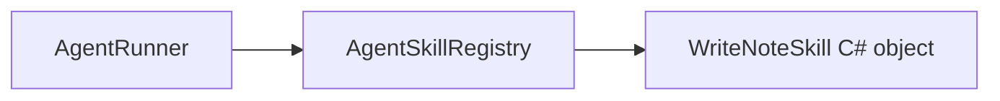
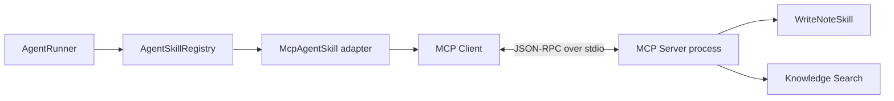

# 第 9 章：MCP，把工具变成独立服务

[上一章：审批与恢复](08-approval-and-checkpoint.md) | [下一章：RAG](10-rag.md)

## 本章起点与终点

| 项目 | 内容 |
|---|---|
| 起点 | 所有 Skill 都在 Agent 应用进程中直接 `new` |
| 终点 | Agent 通过 MCP 动态发现并调用独立进程中的工具 |
| 自动化验收 | 105 tests |

## 9.1 MCP 改变了什么

迁移前：



迁移后：



对 Runner 来说，仍然是 `IAgentSkill.ExecuteAsync`。MCP 被 Adapter 隔离在注册表后面，所以审批、超时、Checkpoint、幂等上下文都能继续复用。

## 9.2 MCP 是协议，不是 AI

MCP 主要标准化：

- Client 如何连接 Server。
- 如何列出 Tools。
- Tool 名称、描述和 JSON Schema 如何发布。
- 如何发送 Call Tool 请求。
- 如何返回文本、结构化结果或错误。

它不负责：

- 判断用户意图。
- 决定选哪个工具。
- 执行人工审批。
- 控制 Agent 循环。

这些仍属于模型与 Harness。

## 9.3 创建独立 MCP Server 项目

```text
src/
└── AgentLearning.McpServer/
    ├── AgentLearning.McpServer.csproj
    ├── Program.cs
    ├── LearningProgressTools.cs
    ├── NoteTools.cs
    ├── KnowledgeTools.cs
    └── LmStudioEmbeddingClient.cs
```

项目依赖：

```xml
<ItemGroup>
  <ProjectReference Include="..\AgentLearning.Core\AgentLearning.Core.csproj" />
</ItemGroup>

<ItemGroup>
  <PackageReference Include="Microsoft.Extensions.Hosting" Version="10.0.9" />
  <PackageReference Include="ModelContextProtocol" Version="1.4.1" />
</ItemGroup>
```

## 9.4 Server 启动代码

核心注册：

```csharp
HostApplicationBuilder builder = Host.CreateApplicationBuilder(args);

builder.Services.AddSingleton(new WriteNoteSkill(notesFilePath));
builder.Services.AddSingleton(knowledgeIndex);
builder.Services
    .AddMcpServer()
    .WithStdioServerTransport()
    .WithToolsFromAssembly();

await builder.Build().RunAsync();
```

`WithToolsFromAssembly` 扫描 `[McpServerToolType]` 与 `[McpServerTool]`，自动发布工具元数据。

## 9.5 stdio 的关键规则

使用 stdio transport 时：

```text
stdin  = Client 发来的 MCP JSON-RPC
stdout = Server 返回的 MCP JSON-RPC
stderr = 人类日志
```

所以 Server 不能随便：

```csharp
Console.WriteLine("server started");
```

这会污染协议流。日志必须写 `stderr`：

```csharp
Console.Error.WriteLine("Knowledge index loaded.");

builder.Logging.AddConsole(options =>
{
    options.LogToStandardErrorThreshold = LogLevel.Trace;
});
```

## 9.6 发布 write_note

```csharp
[McpServerToolType]
public static class NoteTools
{
    [McpServerTool(
        Name = "write_note",
        ReadOnly = false,
        Destructive = false,
        Idempotent = true,
        OpenWorld = false)]
    [Description("Appends a note to the learner's local Markdown notes file.")]
    public static Task<string> WriteNoteAsync(
        [Description("The note content to append.")] string note,
        WriteNoteSkill writeNoteSkill,
        RequestContext<CallToolRequestParams> requestContext,
        CancellationToken cancellationToken)
    {
        AgentToolExecutionContext executionContext =
            ReadExecutionContext(requestContext);

        string argumentsJson = JsonSerializer.Serialize(new { note });
        return writeNoteSkill.ExecuteAsync(
            argumentsJson,
            executionContext,
            cancellationToken);
    }
}
```

SDK 会从参数和 Attribute 生成 JSON Schema。`WriteNoteSkill` 由 DI 注入，不会作为模型参数公开。

## 9.7 幂等元数据如何跨协议传递

客户端发送 MCP `_meta`：

```json
{
  "io.grimoire/run-id": "run_123",
  "io.grimoire/tool-call-id": "call_456",
  "io.grimoire/idempotency-key": "run_123:call_456"
}
```

Server 重新构建：

```csharp
AgentToolExecutionContext executionContext = new(runId, toolCallId);

if (!string.Equals(
        receivedIdempotencyKey,
        executionContext.IdempotencyKey,
        StringComparison.Ordinal))
{
    throw new McpException(
        "The MCP idempotency metadata does not match the tool call identity.");
}
```

远程边界不能让客户端随意声明一个与身份不一致的幂等键。

## 9.8 Client 启动子进程并发现工具

```csharp
StdioClientTransport transport = new(new StdioClientTransportOptions
{
    Name = serverName.Trim(),
    Command = "dotnet",
    Arguments = [mcpServerAssemblyPath, "--notes-file", notesPath, ...]
});

McpClient client = await McpClient.CreateAsync(
    transport,
    cancellationToken: cancellationToken);

IList<McpClientTool> listedTools = await client.ListToolsAsync(
    cancellationToken: cancellationToken);
```

此时工具不是在代码里一个个 `new`，而是由 Server 在运行时发布。

## 9.9 动态工具如何变回 IAgentSkill

`McpAgentSkill` 是适配器：

```csharp
public string Name => _tool.Name;
public string Description { get; }
public string ParametersJson => _tool.JsonSchema.GetRawText();
public AgentSkillRiskLevel RiskLevel { get; }
public bool RequiresConfirmation { get; }
```

执行：

```csharp
public async Task<string> ExecuteAsync(
    string argumentsJson,
    AgentToolExecutionContext executionContext,
    CancellationToken cancellationToken = default)
{
    Dictionary<string, object?> arguments = ParseArguments(argumentsJson);

    RequestOptions requestOptions = new()
    {
        Meta = new JsonObject
        {
            ["io.grimoire/run-id"] = executionContext.RunId,
            ["io.grimoire/tool-call-id"] = executionContext.ToolCallId,
            ["io.grimoire/idempotency-key"] = executionContext.IdempotencyKey
        }
    };

    CallToolResult result = await _tool.CallAsync(
        arguments,
        options: requestOptions,
        cancellationToken: cancellationToken);

    return ReadResultText(result);
}
```

Harness 不需要知道这次工具调用跨了进程。

## 9.10 远程工具的安全策略必须在本地

Server 可以声明 Tool Annotations，但 Client 不能把远程描述直接当作安全授权。课程要求为每个发现的工具配置本地策略：

```csharp
Dictionary<string, McpToolPolicy> policies = new(StringComparer.Ordinal)
{
    ["get_learning_progress"] = new(AgentSkillRiskLevel.Low, false),
    ["search_knowledge"] = new(AgentSkillRiskLevel.Low, false),
    ["write_note"] = new(AgentSkillRiskLevel.Medium, true)
};
```

发现了未配置工具或配置了不存在的工具，启动直接失败。这样远端新增一个危险 Tool 时，不会自动获得执行权限。

## 9.11 注册本地与 MCP Skill

```csharp
AgentSkillRegistry skillRegistry = new([
    new TimeSkill(),
    new CalculatorSkill(),
    .. mcpSkillClient.Skills
]);
```

从这里往后：

```text
calculate        -> 本地 C# Skill
get_current_time -> 本地 C# Skill
write_note       -> MCP Tool Adapter
search_knowledge -> MCP Tool Adapter
```

它们对 Tool Router 和 AgentRunner 都是同一种 `IAgentSkill`。

## 9.12 A 电脑能否让 B 电脑写文件

概念上可以，但当前实现还不是：

- 当前 `stdio` Server 是 Agent 在同一台电脑启动的子进程。
- `write_note` 写的是启动 Server 那台电脑的路径。

若 MCP Server 部署在 B 电脑，并通过网络可达 transport 提供服务，那么 A 电脑的 MCP Client 调用 `write_note`，文件会写在 B 电脑。你还必须增加 TLS、认证、网络授权、目录限制和审计。

所以“本地函数改成远程调用”是正确方向，但是否远程取决于 transport 和部署位置，不是只看它叫 MCP。

## 9.13 本章为什么也出现 RAG 基础代码

真实提交 `ac0c387` 同时加入了：

- Markdown Loader 与 Chunk。
- Keyword Index。
- LM Studio Embedding Client。
- Vector Index 与缓存。
- `search_knowledge` MCP Tool。

本章先把它们当作 MCP Server 提供的第三个工具，下一章再完整拆解 RAG 算法，并在其上加入 Hybrid Search。

## 9.14 MCP 流程测试

测试真正启动独立 Server 子进程，并完成：

1. `ListToolsAsync` 发现三个工具。
2. 调用 `get_learning_progress`。
3. 调用 `search_knowledge`。
4. 两次调用相同 `write_note`，验证只写一次。
5. 验证风险策略与 JSON Schema。

```bash
dotnet test AgentLearning.sln
```

```text
Passed! - Failed: 0, Passed: 105, Skipped: 0, Total: 105
```

## 9.15 macOS `/tmp` 路径排错实例

课程重放时第一次把临时项目放在 `/tmp/...`，MCP 子进程报：

```text
Could not load file or assembly 'AgentLearning.Core'
```

文件其实存在。原因是 macOS 的 `/tmp` 是 `/private/tmp` 的别名，预览版 .NET 在同一构建中混用了两个规范化路径，生成的 `.deps.json` 漏掉 ProjectReference。改用真实 `/private/tmp/...` 后 105 个测试全部通过。

排查方法不是猜 MCP 协议，而是比较：

```bash
rg 'AgentLearning.Core' \
  src/AgentLearning.McpServer/bin/Debug/net8.0/AgentLearning.McpServer.deps.json
```

这个例子说明“程序集在目录中”不等于运行时依赖清单正确。

## 9.16 分四个小检查点完成

本章文件很多，是因为同时跨越 Core、MCP Server、MCP Client 和测试进程。按下面顺序实现。

### 检查点 A：知识与执行上下文基础

先加入 `Knowledge` 目录下的 Chunk、Loader、Keyword/Vector Index、Cache、Embedding Client 接口，以及 `AgentToolExecutionContext`；同时覆盖本章列出的 Core 配置和 Skill 文件：

```bash
dotnet build src/AgentLearning.Core/AgentLearning.Core.csproj
```

### 检查点 B：独立 MCP Server

创建 `AgentLearning.McpServer.csproj`、`Program.cs`、三个 Tool 类和 LM Studio Client：

```bash
dotnet build src/AgentLearning.McpServer/AgentLearning.McpServer.csproj
```

这一步只验证 Server 可编译，不要求 Agent App 已接入。

### 检查点 C：MCP Client 与 Adapter

加入 `McpSkillClient`、`McpAgentSkill`、`McpToolPolicy`，再覆盖 App 项目、Runner、Program 和配置：

```bash
dotnet build src/AgentLearning.App/AgentLearning.App.csproj
```

### 检查点 D：跨进程验收

最后加入测试文件并运行：

```bash
dotnet test AgentLearning.sln --filter McpSkillClientTests
dotnet test AgentLearning.sln
```

第一条只验证 MCP 跨进程链路，第二条完成 105 个测试总验收。

<!-- BEGIN INLINE RUNTIME IMAGE -->
## 本章实际运行效果图

下图直接嵌入当前 Markdown，不依赖外部图片文件；如果阅读器不显示 Data URI，请以图后的纯文本运行结果为准。

<img alt="第 9 章实际运行效果" src="data:image/png;base64,iVBORw0KGgoAAAANSUhEUgAABQAAAALQCAIAAABAH0oBAAAQAElEQVR4nOzdBUAU2xoH8KFDShQVVCQFwUBF7O7u7tZr1zOu3XHt7u7u7u5GEFEBJSWl8327B4dh2V2Wsvb/e/u4E2dmJ9f55jtzRj0kPJIDAAAAAAAA+NupcgAAAAAAAABKAAEwAAAAAAAAKAUEwAAAAAAAAKAUEAADAAAAAACAUkAADAAAAAAAAEoBATAAAAAAAAAoBQTAAAAAAAAAoBQQAAMAAAAAAIBSQAAMAAAAAAAASgEBMAAAAAAAACgFBMAAAAAAAACgFBAAAwAAAAAAgFJAAAwAAAAAAABKAQEwAAAAAAAAKAUEwAAAAAAAAKAUEAADAAAAAACAUkAADAAAAAAAAEoBATAAAAAAAAAoBQTAAAAAAAAAoBQQAAMAAAAAAIBSQAAMAAAAAAAASgEBMAAAAAAAACgFBMAAAAAAAACgFBAAAwAAAAAAgFJAAAwAAAAAAABKAQEwAAAAAAAAKAUEwAAAAAAAAKAUEAADAAAAAACAUkAADAAAAAAAAEoBATAAAAAAAAAoBQTAAAAAAAAAoBQQAAMAAAAAAIBSQAAMAAAAAAAASgEBMAAAAAAAACgFBMAAAAAAAACgFBAAAwAAAAAAgFJAAAwAAAAAAABKAQEwAAAAAAAAKAUEwAAAAAAAAKAUEAADAAAAAACAUkAADAAAAAAAAEoBATAAAAAAAAAoBQTA8CvFxsVzv0hKSkqWhueuuPh4+nAAAAAAAPATqXPwc3l+8lqzZXdJa8uh/brzA4+cOn/z3qMu7VpUd6koLBzxPfLMxWuZztOyRPGqlcpTR2h4xJu37tLLWBQvZlaEdT98+nLrnkPVXCr06do+Y8nHz18dPnk+KSlp6ZwpUmcVHBIaFBxKHR8+fj5x7jJ9dfXKztRbyKSAl8/X9dv2NqlXq13Lxpxcgd+CZy9eFZ+QuG7JLHV1hY7DyKio+09eZByuqqJav1ZVLosu37h7/OzFujWqdmrTjB/46q0b7R1ZWya3LF+37a27R6um9Vs1acABAAAAAMDP8lsEwImJiR8+en/08jItUtjG0lxfTy9jma++AckpyUVNC6uqqn756p/CpRQ1K6KqoiJ1hlFR0aFhEQHfvpmZFjYtZML9TiKjor9HRn0TB5C8oG8hMTGx8RlSghTyXbt9P9N5OoWGsQD4/YdPOw8ek1qmTbOGKpxKaHh4ieJmCQkJycnJFF3T8JjYWJ+vfsKS0TExIaFhnDhOzm9kIBxlaKBf2KTg9TsPLly9xQ+8//g5faijfcsmn7x8aM4Pnr7wCwxkY82LmbVsXJ928YVrtyQWiaV/9xw+WbBAfuFwO2tLW2vL3QdP3H7wWDi8fu1ql6/f4aTJagAcn5Bw+uLVhITEKzfvPnyaGlRTGO/m4UnLf+fBk3uPnvGFB/Xq4ly+TMaZUAr30+cvn7x98hsZWlkUL1SwgKyvW7p2i/eXtI1M25z+nrl4/erNdDt32IAedGeEAwAAAACAvPGLA+Do6JgN2/e5vv8gHFjSxmpo367CMDg2Nm7GohXUsWbxLOqeuXgldW9YOkdVRubw0MlzFNaw7pXzp+XLp8v9FJTIpcRp8aJmlEKUVYZynvRXQyPdkrPasGqqasKBFIl99v7aoE514cCHT15Q/FypQlmKRfmBevl0ff0CKNqnHCyNiouLp0wmDS/jYK+tpREWEWlkqE9x76kLV56+fDNsQE/hDCn6Xbxqk9RF3bzrgMQQ2jX/GzGwolOZuLi45GTOLzDo/YePZkUK2VpZqqpyFubFjp+9RMUofmYhNAkLi6AAmNb6xNnLUr+Fok2JIQ3rVKcAOD4hnrZAug2SlMSJN51TGYfUQSkpj5+/5rJuy66DdMeBE2/k8IjvbODlG7cTxHuHbrKwr9bW0hT1qkl5UuDqrXv7j54WDqldrXLnds01NTQyFo6OjqWgl18dVTHqiIqO5ofQ37g4VIoGAAAAAMhDvzIADgkLX7B8fWhYOHVTDs3CvGjgt2DK9FJM9b+ZixbNmGignxoDe3/5Sn8pT0gByWtXd9Ytq94shRmPnr3kex+/eFWnehXup2B50VIlreUGwKIgRyIAZlGxlpaWxMBtew9LncnjZ68khoSHf+/esbWlebHBvbseOnGOAuASxYoO7ddt0YqNAUFBQ/tOoI1558FTTgYKwCh85WSL+P6dz1rTt8xbupYf5esfSB/qcPP4SBs/n67u1HHDAr4Fr1i/zcrCfNTg3sJv6dCqCSfe9cZGhqJBKRwlpdXU1A3081Gfq/uHN+/es8L9unfs263D1j2HKBHduW0LyvF+9Qu4eut+QeP8PTq0PnzqPAXejerWfPx8MpdFvv4BL968o46JIwd98fPfe/gU3U1YNON/85ev9/7i26Z5w9rVXOgIpGD4n349HextMs7h/JWbR09foA7j/Ebly5Si1X/33vPmvYeUsRfWbGfCv0cO7tuVE1UdD6NUMG2EWZNHq4kj3kdPX544d5mS6qOG9GGFE5OS1NXUOAAAAAAAyAO/MgA+euoCi34rV3Qa2KszG3j55t2Dx85Q7HHr3qMWjes9ePLiwZPnLCiiAGzFhu3C7ro1qpQrXUpitm/dPFger1jRIl+++t++90QYAFO679zl689eucbHJ5Qv60BfvfvgcRrepV2Lso721PE9MvLs5Rtv370PCAq2KF60bGn7Zg3rsrrWi1ZtCg+PsLEqUcbB7vSFq/6B34zzG1JsVr6Mw/PXrodPnGNf4f7h05Q5/1WvUrF5w7oZ15pl+XR1dIQDY8V1YnV1tDKWp5jfuXzZ0FDRhtLS0qQgyuvL17o1KgcGhbACenr5+Eq8hFLBl67fpo7eXdtRNjK/kQGVX7Nl95QxQznZTIuYjB3aLz4hQVYBj4+f12/bKxxC8SfFzPcePXMqXSoiMurjZ2+/gCBOnNW8fOMObUbqbtW0AcXD/CS0/BSyUqB45cZd2todWjYpWND4n/HTdXS0Vy+cQQVUVFX5AFhFjP7LiSJnGqOqwqXWeI+Ni6e8MQuAuawzK1J4yezJy9ZtefDkJWvySltLa9+R0+bFzAKD6MgKO3H2ir6eHq3C3UdPixcrkrFO/u37orrZ+nr55k8dx27E7Nh/lBaJEuzuHz7a2VgJC2/fe5hfKU58g2bavGXCAgFB3+iAYd0z/zeKjlsOAAAAAADywK8MgD95+XDirGCvLm35gfVrVn389GVMbOxX/wDqvf/k+VtB8PAmfXetai4ZZ8sqP1NqrmGdGtv3HqHwj4JeVmE4KSl52fqtlGRmJSlief7KlVVDZQ/EUgS4ZPVmls8kH7186BMYFEzZSOr1+fKVQi/KhfIPiFK0tHbL7rVLZkVEfKf0NRtIEQ51B30L4aQJFtcNNjJM92wthbX094tvQBkHe4nylB1NSkpiT40mJCXp6mpTh76+npePLyuQP79h2jZx89i8U1RvmTLMB46fFUdzosiZotMbdx9IXR5WHVdLQ5OSk5+8v3AydGrTnIrxiWvq5hO/LJtKBvbqoqmpsWnnfvbcMmX1S9vbslE62lpj/+mvri7KbRoZUDY6H+Wo6dOtQyvht1QsW9q0cKFCBY25PGaorxccHMofCRSC0od1376X9uAx3Vlo2aSeRABMSVq2r82LF+WrIejqpt7R8PzsLREA165euaS1ReC3EIka3RLoRoaero6hoR4HAAAAAAB545cFwCxKpI7CJgW0NDX54RRZTRn7D99bo3JFx5I2h06KkqvdO7aiGGHjjn3UXbFcaWsLc4orJGabkJj47NVbcQHHco6pweSDx88b16/FiZ/bZDEPpRwb1a3hH/BNmDvlREnp8yyoq1+rWqXyZS5ev00RMoW75cs6lv/x3CnFwJbmxSjzfP3OA/b4KOWcHe1LDujZecvug9RbqGABynyaFS7ESRMUJFprYQCcnJLCgvDHz181bVCbH06535kTR6moqmzYtvdbSGr14/yGonDX86O3j29qo0o1q7nUq1FV30BPPNyLzYpy4O8/fKQ4s6SNFYVVtE2On7lsb2uVcXlsLEtsWj6POvYePpkkO0Kj7UlbjO8dPqDniXOXvb+kBuFWFuZN6tcq51jK3eOjSQFjtg0px05p/CqVylMimnK5DnY20TGxE2YsrFDWgdbr0bNXt+49NC9qKtod2tpsPpRRN/4Rz9My79x/jEX+R06dP3X+6sDeXbjc8++4YclJaW88ev76La2RQ0kbSumzIQtWrJP6liZ1NTW6n0K73vPjZ9raLMXt9t6TjQ0MCpYoT0cOfQaN+Vd+ANy6WYNm0qoMAAAAAABAbvllAXDAj3xpYZOCcopVKl82NjaOAmAKWevWqErdbPjAXp2lPgP84rUrCzMoZNXLl8+sSCEKxu48fMIC4A8fP7NiE4YPNC9mxoni8CRhK0pv3nlw4sq9Xdu35ESvFzIfPnEGBZNu7z/wATCF6BNGDqKgzs7GcpG4+aiXb95VKOtYsEB+FgAXMDaq4uwka40Cg0UrTsFz3RpVtLVFdZ5Z9WZO9Kizb2RUFC02X5i9uKhti8b+gUGXr9/5HhnF7hq8dRctJ6UWrSyKlyppk/o8Ld0vqOJsZlqIst8FjfNTxOjz1bdX5zZFCpkcOXWhQe3q+4+eyrg8tLkoUuXEbThzctHGV1NX01BXZ9V9OfHDwJQ0poCfMszrtu4pUayol/hpbYoJzUwLe3h+2nXw+MnzV/6bPVlcmVmUUae48eqt+9fvPGzesO6cKWOv3xHliksUN8v4dZT35tuIol0g/qTW0GbPUUttm0rowyevY2cu2VlbUmzJZXDszEVhhYKkJNFh4/r+w9xla9gQVpFeKkd7W7otQuHx9AUrnJ3K0Ebg7wXwe1Oq+rWqqmZ4xPfd+w9fvvpzAAAAAACQx35ZAMwymSQ0LEJWme+RkW4en1huLSU5mcIMiqnYqOev3xkbGVhblpCY5M6Pxp8pTKVwizJ1FAD7BQQFfQsxKWjs/VUUpWhoqLPolxPHyXwATCEQqwdLkwwYla5ppQ8fvflu0yImrKVfK4vUb2ftCSsiLj7e10+UHQ0JDVuzZde4YQMoMnwnaAT7+UvXmtUq8b0UYr1xdX/47AUlojlx01/5jYxaNq53//Gz+4+f37z78MOnz1GR0bQWJuJqwxR759PVSRY/1/re86N4xYMN9PWbNayjq6MtdZGev3aVeLhXjvxGhktmTaL0+ydvn16d2oaEhR84dqZurarFzUzdPDytLYqfv3q7TnWXUiWtab18/QJOnL9at0ZllR9vqyptb7ts7hTKRd+895ANcfcQ7dDiRaUEwHTvgz6bdx2kLD3dj6CcPB8lsixroQIF5C/tnsMnaBLKhFMynwJyibHv3D9QiEtJcnYnJYb2Ylw8HTbCGxBchpbJmG7tW3l+8qajRRzP3+PEOXC6C8CJX4bMyUbBPwcAAAAAAL/ILwuAtbU0WT1SitEkRlHAEx0TQ3EIBSQ79x9lA6lb2PLwqQ3bBwAAEABJREFUxh37qlYqLxEAU4qSf2B44YoNwlGUr6M0IAtcWa6PYclPJiExLePHv2SIPT+sJ3iRkrpq6kZTyywDmRFLUFMETtw8Ph46cbZz2xa37j1i30jf9ej5Sz4ApuzlucvXWTeFvs0b1TMtVHDx6s3L1m3t3K5FvVrVjp46L5rJyXP0odB05v9G5sun+++8pfx7fcjKjTtZx/qlc6Quko62NmWM+V72+iKaG0WtYeERrFVnLa3UOupFxOn6Mg529x49XfBjCx88dkY4Qwo4hb09O7XmxG9mnjRniXD45Ru3r9y6y+4dnLl47fKNtBf8VqtUvmv7VpxsrIq1iUkmAbCxkRGLmfX180mMivgeyao3808m032QU+evlC5VsmPrpsKSKdLqLVPq/t9xw548f0U55ITEJAd7G5qQNW1VXFypWxapGWC6x8HaDwMAAAAAgDz1KxvBKlG86Ku3bhSHUFqMAgM28IuvPyX9OFFu1sHBzsa0sAkfG0h0ly5lJzHDJy9kvhL2zsMnFABbmBej2ImCuqcv31AakzKllETly/AxOXvbLZddiUkyH/VkNYdrVa1UoVzpJas3X75x11Bf/6O4MbBx//Sfs3TNu/ee3l98WYK6qkt5WrwKTo5v33lERkYdPCZ66yyr4E0xZ+orakUvFmpKxco62rHXHVuaF2NbiWWzaY20xTlMPg0rgTby4pkTWTeFhWOnzqN5UpqXeucvX09ZzcG9u2Z8FZBDSVuaIyWfVdVUdcS55acv3tCylXW056NlhrV3nZScLHzJLX1FfEKi8JlY4diMG/DjZ58Pn/aXKWU3anAfSmXvEN8WuXj1FmVxxw7tn5ScxEkzsFfnJ89eW5YonrEZZ7bNyazFq4TDWdNcwiElihWdNmG4xOR0/MTGxenr6/3TvwcbcvzMJdZR1ExeG87IAAMAAAAA/EK/MgCuVc2FBRsHj5+JiYmh2Mk/MGjXgWNsbM0qlWhI3RpVx02bT0Hp5NFDKN87dPy0hIRESr5ZSntpLQsvyYr5U/mKrJt3HXj49GVoWLivX0D5so6sAef12/ba21p9Cwnl323LWFuYP3v1lnKYz1+7li/jQPnD5Ru2xcXFUcTavWNrLjMU11FQ99nbx8Pzk1mRwvkEeWPy1Tfgnbg6d40qlShPWL9WtXuPn7GneSmeNzMtXKdGlcvX72zYvm/uv2NpVqaFTFYumEZj9x89zarX8uITE1hrXpS8bVS3RrrmqQb2Yh0zFq2gMkP6dLW1tvyxeCryl//BE1GTYMXNpOcwT5y7TNngmlWcKf9JaWr6DBrzr6aG+prFs2jsmPdzv0dGUaCeIHiX0tC+3VnzyJREZ01tMXHx8XsOnbj/+DnbaE3r125cv5ZEJW3a+K7uHu/Fld5ZW2X2NlaUfHb/8JG/D5KYmEjBeVj4d+rI+Ew4JbeF9cmF9HR12CuUkpKSrt95wIfitD2dncqwbvqW165uWtpSqkA/fPKCtbXWrUOrapUqvHJ1O3/1Jid+MRJfu57H3rTUsXWzmNgYNiQgMJjWiG5hNKqX9hqnUiVtqKSs+xQAAAAAAJBzvzIAdipdqm2LRpQ6o/CDgiv68KMcSorqlHLiWs2sQm+xoqbUwdolklrLNDIq6sMnL07chJXwMU7KtVIAzIkfD+7UplntapXZA6huHqKauvyjm0ynNs0p6KKk9Notu1k0y4ZXdanAKaCwSQGKmmghF63aVKOKc5+u7flRFKGt3LSDE1dmZsvfsU2zoqaFd4nfQly/djX626BWdQqAA78FX7h6U9ggcNf2LX2++v23ZgsFexXLllZRVdl14DjbgAN6ZdIwMuVOP3l/9fzkZWdrNbB31/49O6upqt798aS0EIWaR06dp466NasIhydzqU0lP3v5hvLn9KXa0mLC5GRRMT6zylCalH8/UGqxlBRXN4+tew5RtEy9jna27zw8z16+TgFkw7o1mjWozb83+OL1WyxCpkCRdqJLRadSttY0/6Vrt3Lpd9zZS9du3ns0ekhfymZzirGxsrAoUfzFK9dDJ8/RXqZ9XdGp9ONnr+xsLOkgYWWOnb5IAbBe+uVnWjVpwALgfUdO0YcfPmZoP40McfiIiTOltiZNA0+dv8r3su6u7VvxtSEAAAAAACB3/coAmDRvWJdScHcePGWPnnLiFqooEdqpdTOWCvsiftlPfiNDLU3N9x9EycBCBQuoZ3iKkhPUf6ZgSTicQizWcf/xM4ptundqXdWl/IvXrvHxCWVLl6K4dM3mXZw4D8mJo9OJo4Zs33fE+4svi37pq3t3bW9Vojh1q4jLyMmjDujZeeeBY6xBYLX0C0lZbraOlBRlQyIjo/eLazXTzCks58RNWDWpX+vC1VvHzlyqVL6cieB1uJRjjImNpQiNPmxIqZLWwwb0lEgYUhD7zt1T/BbiYD9/UZr0sDim5cRvGIqNifX87EVb8pH4joCqeFpaTVf3D7fvP3768g0nqsFbuHrlimwSHXHd6eOnL0ZFUV430T/wm3g+RoGimae+Kjk+IfGl+D3ASUmiexO9u7SjZC+/PBS301QsLqXNQin6e4+esmiQNuzIQb3pXgDdubhw9fal67cvXr1F8X/dGlVaNK6rr6dX2bk85YRdKpSjWFf8QPL33YeOsyQ/3eOgXblwxQaaOWWtX7x5R2uhqanBKSYqKvrImQsPHj9n91NobkP6dPvs85Vt27uPnm7fe4QvbG1hnnEOxYoWmTZ++KpNO/nHremwbN2sYcb0L7G1tgqPSNfSW3RMzLfgUDrkimWoL20seKszAAAAAADkLpWQ8EjuN/A9MtLri1/hggWEUV+ue/z89cMnoqRi88b1LM2LUdREMQx7F87C6f+j6JcvmZiUFBj0zcjAQFdaAjBTSUnJEk1k7T184vqdh+1bNuHf9EsB4ewlqym9uWD6BP4hVQrIJ8xYSInTuVPGUTwsnAPFjU+ev7p17xGfZaUYkhZb+EWnL149ee4K32tooF/MtEixYqbFzUxLWlvQUk0WtERFMWSjujUp+8o/v1qpfJk+3Trwr2W+euve/qOnhctgWthkzpSxpy5cPXX+CqewLSsXBIeETZy1iPXq6+WrU71Ks0Z1hMnS6OgYSsay+NbGssSk0UMkZvK/mYvYHYTa1SvTZtTUUP9nwgw+RU/B5KoF06WmpjOiqSbNXkJzo+3Tim45VHOhAPveo2fb9h6uWql82+aNZixamZJMe1Cd7jJQGl/ObCks/+LnT2G8ob4ep7APn7woei9sUnDe1HEcAAAAAAD8LL9LAPxzfPUPmLFgBeumcDckNJxFUJT2nDVxNJeXklNSLly5IazYzIkfbc1vaFDSxko4kLK4lD2WmnhkQsMj7j54cvPeoxqVnSXecOsXEPjg8YtiRU2LmhYqbGKSsZ1qivFYw9e21hbVXSpSaEch99xlay1LFK9foxolNoWFKWB+/uqt+wdPce1mjha1ehVn+vvh42f2wmRFqKqpUpDJidus8gsMqlm1kpxV8/bxpRR6/54dzYpkeGvRe89zl69379i6SCETNsTXP4Cy1nFxCTo6WuVLO2R80ZEcXj5faTOWc7TnU+ivXd0PHDtTvUrFZg3qcHnMPzBo/5HTZqaFOrdtwQEAAAAAwM+iXAEwcXX7sHXvIb7mqoaGukuFchRWsTckAQAAAAAAwN9K6QJgJjpa9BCmgYG+kaE+BwAAAAAAAEpASQNgAAAAAAAAUDaqHAAAAAAAAIASQAAMAAAAAAAASgEBMAAAAAAAACgFBMAAAAAAAACgFBAAAwAAAAAAgFJAAAwAAAAAAABKAQEwAAAAAAAAKAUEwAAAAAAAAKAUEAADAAAAAACAUkAADAAAAAAAAEoBATAAAAAAAAAoBQTAAAAAAAAAoBQQAAMAAAAAAIBSQAAMAAAAAAAASgEBMAAAAAAAACgFBMAAAAAAAACgFBAAAwAAAAAAgFJAAAwAAAAAAABKQZ0DAMiuTdt2urt7uLq5U/f5k4e530liYuLBIyeaNq5vnD8/l5cuXbn2PTKqRbPGWpqaXK5av3nr+/eebu89NLU0jx/Yraoq5ZZlTGxs09YdS9pY29na1qtTo7xTOQ4AAAAAZEAADADZ9/LVm2s3brHuN2/flXYspfi08xb+d//RY1ljnStUmDppHM0/Pj6BU0ChwgWtLS353ti4uAmTp1+5dmPH7n0b1y6zsrAQFg4ODnnw6AmnmKJFTZ3KlpE19sPHT6PGT6aO5avWDh00oHuXDtTt4eGZkpLCKaZw4UKGhgZSR7m//3Dx8jXW/ejJ8youFTOW8fb2CQgIpM/tu/eNjAwUCYDd33uMmzSVy4EKTk6zp0/mAAAAAP40CID/bHQha2ZaRF9fnwPIA76+/kEhwXIKlHEsxQfAB44c65jSRk5hbU1Nu5K2fO9bt/eeHz/LKlysaNHo6Oge/QZziunRpeO/k8bzvZOnzqLolzq+fP3aqXvfDauWOVcsz499/vLV+MnTFJxz+7atZAXACQmJU6bNZt3BIaGPnz5lAXCrjt04hXXu0G7m1IlSR40cNpgPgI+dPCU1AKYInO+2s7PlFBAY9E3OlldEkcJFOAAAAIA/0K8MgKOiounaVDjEzNRUX19P/lR+/gERERF8r6qKqq2ttazCycnJr13f+fr6BfgH0uWpoaF+IRMTaytLRwd7WZN4efvExsYGBQd/+xZMM7cracOP0tDUMClQIIfRZnRMzKvXrpSw8fcPoC1QoICxiUnBcmVKFzUzlVo+MjLqq68v38tvIm+fL/+MGseuYseNGjagby/uD/T+/YcULjVRZm5eXEdbO9NJ/AMCnz5/ERT4LSQ01Dh//pK2NtbWloULmXCQB/YfOrplxy4FCx89foo+8su8eXpPTU2Ny3u9e3a9fe8+nWKc+KemZ/8hOzavq1ypIpertu7Y9fqtK987fvQILuuSkpP57vOXrixaulJqsdNnLzx68kw4ZGDf3hRve3p+5ofYWsv8MQQAAAAA7tcGwLfu3hv7v3+FQwb37zN6xFA5k6SkpPQbPPyzl7dw4JO71/Pl05UoGR4eceT4yQOHj0vE2Awll7p36UgfDQ3JLTBkxFiJ+UsoYJy/bauWXTu1NzPLWg6EZrv/8LGjx0+yi3IJ5Z3KDejTo16dWhLDb96+K0xVLZo7s1WLptSx9+ARPoezdOXaju3ayKpF+dv6FhzSulN3vnf/ri1yKpqSh4+fLlu17tXrNxlH0QHQsF7dkf8MNjUtzMGfhs7Hls2asO71m7eyjpI2WYvl1DU1hL10LB3dv2vA0FH8L0Cfgf/s3b6pQnlRDeH8RkYZfzRk0daS/mTvjVt3Vq7dyPfSb1exomZczsTExAYEBMoaKzHK18+PE2WzX/BD6OYd3cKTmEpHR6eQSUEZs+R69ehaXnDe0R26f2fMYd3VqrjQD4uw8MKlK+QsHgAAAMDv7/eqAr3nwKF/Bg/QTH8hK/X+Dc8AABAASURBVPT8xSv50Snj/t5j8Iixci7U6Jp40dIVx0+fWbZorvC5QUVQJplyYsdPnd65db3i01JiRyLal/D8xctho182aVh/9vTJiiSZvdJvh8DAoF8SAB84fDQoKLWKrLqG2tCB/RWf1u39e2GvjZWVrJJ042PB4mW79x+SVYDuKZw4fZY+m9evrFG1Cgd/FGsri5HDBlHHW1c3PgBu3aqZnp7elXMnFJxJ/vxGEkNKmBc/sGtLv6Ej3r//wIZMnDrr8tlj1FGxghPdOONy4PCxk9Nnz+d769auOaBPT76Xss3h4eEKzsrUNPvViSleffDoKd/bpFUHqcXevXgoaw4N6taqVLEC3xsREfHvjNRuB3v7Jo3qCwuv37INATAAAAD80X6vAJjCmFt37jaoV0dWAUrqcpmhPCGlejgF0GVx7/5DD+zelo28DYXBnXv0279ji5wK2Lwt23dRkpZTwIXLV8PCw9avXq6tpSW/ZMd2rSk5zLrLODooshh5Yc/+Q8KHCbMUALu+c+e7LUqY6+nlk1Vy9brNcqJfoYFDRx0/uMdesSch/z7Xb94+deY8dbRq0ZRCMi5X3bl6nnWkiFORRQoXkiiQmJTEOtTU1FQEw3fvO7hx6w5OAXSfiHWUdyrH7i7JejRAQQUKGG9eu7JTj760wAWM869fvZTLMbods27T1jXrN/NDKIO9cM50YdXubNe1trIsQSlZWWPptleJEuZ8b/lyZV68eM3lzJTpc00E+eHEhLQmx+hO39MXL4WF+VsJAAAAAH+o364RrENHT8gKgMPDI46fOit3alGZcROlJFodStmZFCzo9t5DIn1BceyQEWNOHNqrri59U1BuysjIKDk5xdfPT2JaCte79hlw7fxJAwN5qdcXr15LjX7pEl9XR+fFq1cSNaIpn/Pf8lVTJ03g5KpXp9aebRsvXbthXqxYi6aNuD8Qpfv4brqUl1Xsq68fnxXk1axe1dra8vv3yBcvX0k057Ns1dpNa1dwyoc21D+jUluBojspl88cK1asKJdL8uXTpWCSdR89cXrqzLnNmzYaMXQQZVn5Ms7V67KDecKYEf169+CH6+jq8N0qKiqyviIxMfHEqTOsu0PbVlwuKWRScMemteMmTV2yYLZEW9DZM3/R0j0H0l74RNHvri3r1dU1aLM0qFs7hxUxnMqWYQ8CUGq3fZdelSs59+vd3bx4MU5c43rXnv29SphPHDuSfx/S0hUK3VmT48vXr1KfE2Gepw+AAQAAAP50v10AfPvufbqOl5r2OX/pcqaTL1q6gmJa4ZDqVatMmzyev0wPCAyaNmsefQtfgMKncxcuswdrM9q/cwtfIZmi6w1bt+/YtY8fS5f7lLPq3KEdJ0NcfPyEyTMkBlJsMKhfb3ahTNmkN67vxv5vqvAadO+BIz27dRGGFhlRIFGxghN9uD/W02fP+W45r8+hvSPspVzx6uWLbaxSK5/TBjx89MSMuQv5ArRzQ8PC8hsZcUrm7IVLwt6TZ88PGzyAy22+vv4U/Yq+7vwl+nTp2H7IwL4SjZBFRkbLmlzOy4HuPXjEn7yN6tflcg8dM0f3pzbl9S045Nade1zWaWtrNWvckDq8fL7wA+kG2baNaynGnrtwCZ22tGUG9OnVt3e3nL95+MCho5+9vOlz8MixFUsWGBoYDB05joZTDPw9ImLuzKkUA9Mtg+OnTrPylN/m75rRwrAtWcWlYucO7dXUVDkAAAAAEPsdX4N04vRZqRfu+w8fkz8hhT0SKWK68F2+eJ6wZWm6Ul+38r9ps+bTt/AD9+w/JCsAFqKQdeLYUeFh4cJvuX7zjpwA+P6DRxLZFcqbUX6M76U4toyjw6G923r2GyzMZB49fmrsqGGcbBR4v/zRHBTNZPjggRKN+sTHJ9y4dfvS1eve3l8ofW1kZGhevLhLxQotmzfhU3mMn3/Azr37+d5a1apVq+ry5Onzw8dPUs48+FuwrY1VyZIlu3ZsZ/Gj+iWlp1av30TBjH/6rPjCpaLUq55uvuFDB3JyBX0LFt6qKGVXUlbJT58/C3sH9uvNR79s3Tt1aPvo6TMKxviBHzw/Ch9rzNLWIMtWro1PTK0IWqJ4sQ5t2+w7eJjmTxM6Vyw/duSwfYeO8IVNChToL3j4k9m8bVdwaAjfO3RAPz4xmItLQnGRsHAB43STF8wwt2ywt7dt07I5dWj9qJPv7uFBRxpfbeHA4aP0Gdi3F+0XWTOh9D6bCSc3A7zvYOpW7diujZ5evm59BoWGhnJZtGrpIjpc5RR489aVb+QpSyjCZAEwpXnZHbSa1asumjeTbrXcuf+Aol9WbMuOXQULGsfGxXFZoaaqKmzInX7K1m1Kq/XgXMHpe2Qkv9np90ffwGDy+NHCWwZtW7Xkn9dduXYDG161SmWJh3gzolPV1jpti4VHfOefba5bu2abls2EhecvWY5ngAEAAOCP9jsGwPsPHhncv49EneRXb1wzffzs2o3bEkNWLVuU8b1KNGe65hMGwK/fulJEp6ujwymgc8d2wgA4Y5urQvwzjQzli2ZPm5KxGF1DDx3Uf/yktNaenzzPpObh7Tv3hIvRp0c3YQBMazRi7EThpSpdEFOAff3m7UXLVlKmiL2tlAkMCtq5Oy0A1suXj66/hU1PBz96+uDRU0o9Ud6pfZuWnKit2hhhJpzH5kNLkmkA7OaergWskrYyn9qNiYkV9iYnJWYsM2LooMqVnPleCimFY7O0Ncjm7Wkv/invVI6iDr4SO4XWFJsJNxfp1L6NsN2y8PCIZavSKqbS1hg/anheLAmXXpOG9emuBJt54cKFmjdpzOVY8yaN6CMcQkHRjYtnjp44tXnbTj76ouWk80LWTFycK9KHk4vOI/6Z9nZtWtDf9x4eUttLly8+Pp4T16a+eOVaUmKSxNjKLs5cjtWsXo0TvaF30KB+fdTU1MLCwyf9O5MfO2bkP4+ePOPfjaw4YQC8YcsOft1HDRtMd0boQ6nmzj36soF0MlJA7vou7SECipBZR1JSEt9SYInixTP9XhfnChKNYPEBsLWlZaMG9YSF127aigAYAAAA/mi/YwBMV9WU2ahVo5pw4LETpzOdUOKik2IJYWZDqKiZafu2rW7cTAuYg4K+ya9yzCtcKF3bP0HfvskqmZyczFok4g0fMkhXV3qY3bBeXQqPw8JSW46Nio7isuv+g8f9hgyXU2DuwiV+/v7jR0svc+/B47UbtkgdNXXmXKdypbPabrZUwmt3WnE576SpWLH8hctX+d6FS1caGhrWr1ubfwySE7f3K2v35XBrUK5V4hFu4/z5a9eszkdr5MmzF8IWp54IqnaTti2bs7s5ub4kEmgbXjl7/M69B9Rdo1oVWY+1Z9uFS1cPHjk6uH+/KpWde/fo2q51i6Ur1x08IqqXMXnCmIIFC/AxW758Ct1LEjpyLPUFwhYlzMuVKc3lzFdfP+HtJN7W9asVf/uRLKamhU8d3c//tsyZv4S/EeBQyq5fr+6jxk/mcuDe/UcU37JuinJ7duvCusuWdti4Zvng4WNY7/JV64RTnTl/4d+J4zQ01AMD036RFPlNGzNhio6O9G1C2WzhqceJHxjmAAAAAP5kv1EATCHE9R8R6eFjJ4UBcGRkFLvOzlhS6Iuvr7DXzlZeU8BzZ8h7KZEc/gEBwt6MbeHywiMiJIbYyK6cqampcebYQS7HKB81YYrkpX+xokUlrly37thNYYzUNwbJb/Zm1dpNK/9bwOXYG0ELWE7lysop6Vw+3XPOFGWNHDeJAoOG9etVcCprb1fS0sJcVrCX860hNd9FSVFhAHzv/kNhAHz/4SNh4cYN6+fdkkig7VCnVg0uDwR9C546ay5t/AePnlar4jJ6xNAyjg4zp05s3KDeqbPnu3XuQDEnX9jaKsu3SPYfTq1CTHeIWDXprh07xMbGSBS7/+gx/6RAjy4dJcaqqqll2qI7ZTtfP7krHLJ63aZN23ay7iP7dtqVtOEyw6LflJSUVes2nbuY9oz6/FnTcnjfwc8vYOT4iXzvqOFDhRE7/SrOmzXt3xlz6J6Rmrq6sFIM7ZrHT55Vq+ri/SXtEWVF2rcXR+8yq5oj4gUAAIC/zG8UAHds15oPa69cuxEQGMS3rHPxyjW+GF0ONmpQV2oA/PVrugDYxjoXEpUZSVR/NZddyfBbcIjEEEVqJObQ3gOHhc/WUpSyculC0yKF4+LjKclGOUZ+1Ko1G2W9Mpc28oQxI8qVKfMtJHjJ8tXC6+y790UJxgLGxneunk+hKKXXAOEl8m3xm3LU1dW4zAjD7NIO9nJK2tpYVa9ahX0vj9aRPX3KlrZqZZcG9Wo3alBPR1tbWCxXtgahOVNOlW52sCRnnVrVhWNv3L7376S03ivX02oiUKBe3qls3i3JT7Nt1x7+G+89eESfxg3rDR86qGqVSvThxI1j8YUtLUpwWdSxfRtWqd71nfvtu/drVq86brSUZ+BpQ/EB8L+TxsuaG4XQwrhRYlsJY9To6Ji9B1ObdK7iUtFRfChSeVqGi5evNqhXp7mMJtZpx02fPV9YxWP40IF2JUU33ZYvnp+UnCR1qsNHTyxYspx1H9yzXeJx5fj4hNH/m8Ivbe2a1YWtYdN3Xb1xq2fXTquWLtTXN+g7SPJlb5euXqcA+O691DOFjj05rxYDAAAAUE6/UQBcsXw5ixLm/NNrdLU3sF/qQ3EHBc1f9ejSSVNTM+PkdO0ocZlrZZnLAXBg0Ld1G7dK1AmU89bikPTtUZcsaaOhkbcbnFJSJ06d43spBli78j+TggWoW0tTs3uXDp8+f+Jb63n91pW2toXgtaK8rRtW/6iGaluoQMHWnbrzo2gjh4dHGBoasBabtLQ0hBMq2PAS3d0QRoP2slvA4sQvlV2zYvGEydPptojUArRINIo+cxYsWb9qKf9AY25tjV49uk4eP1o4RF9fv0nD+vyRQLcAvH2+sHfVeHn7CFO1rVs2p+XPuyX5acaNHOZgZ7du01b+DL14+Rp9zp88zBb17bt3fOFsvLx3SP++FByyU5hSshTkszxwaFjY2QuXKePqYG8n8Tw/bdWXr9/QXrhw6eqS+bOED7LSvnhy9zrrjoiIqFyroazvPXnmLP+70bdX6qubFvy3/OhxUZXs569eN6xfV1NTQ2IqOgVGT5hEyXDhwPJlUysyiMtrSP064S+AtqamxP2axMREQ4PUh8kpfB35z+BLV67TjQY2ZOfe/XR34NKVa5SB37R2BV8RpnDhQuyQO3P+wpT/jT117gIrz6JxqcqWdty3Y5PUUeER31lz05y4xb7unTtILaanp88BAAAA/IF+owCYrne7d+00b+F/rJfSMv379FBVVXV/70EhAV+sbesWbwWPj/JUVSVbl42NizPkcqplh250JcqJK6BKvGCJE1+kNk7fSIyQRvrKkNFRMVwe8/MLEOZj9fT0QsT4IUVN01WJdHVzzxholXcqJ3wIk+Kem/XGAAAQAElEQVR2/gqbCQ4NyeHLTmmfCntL2mRS6VRbS2vZonmURD1++oycttAokunVfyjFwKwacK5sDfLPwH4ZBzZr0lB4K+TR4ycsAH70OF1Q1EgcveTpkvwclDVt2bwJrfW5C5dnzV/EgkYawi8nhWqsw6GUXTaqAYuaWB83mjW/ROc7JWDZQxC379znfxMunDoinCQxMalrr9Tm4q/dvC3R7rci6Cdi49bUys+0IhR1s266y8YCYDrsT509L/FSYsp1Dxo+SuLt07lCV1dnw+pl+w4dpVWe8e/EyTNm09Heo0vHieNHv/fwpOiXFbO0MKe7KgvnTG/ftU+lik5dOnVgjWPRTtm2czd/qtarU1ti/snJyQmJojbktHW0HRykv3js+/dIvrtgwQKyinHiHDj9VVVRzev7egAAAAC56Pe6cGnepCF/sUuXcQ8fPa1apdKxk2f4ApT6KGFeXGoATNfcFI4KY1RPz08SryfNBloMWc9eUli4e8t6OW3qSLzVhkKg6OgYWY1g5YqgkGBhLy15m0495JUPktKCV9kyDhJDalavduTYCS73SLSApcg2oYvsPj270sfjw8dLV6/df/j46bMXUktS/ura+VOmpoVzZWsUK1pUarRfvVq6Wsq37z3s0K4Nddx98JAfSEdIWUfRxszTJclT0TExiQkJwiG1a1Y7tHf7vIVL7z14NGzwgAjxg+4hoWH8XSozU9OIDE+/M6qqanIq5bZr3WLT1p3sTsHJ0+dYAHztZmp9cjq72S0GHh0SrVo0ZZWQz1+8MnHsKC6LDh87yZ/dA/v15ptVs7ez5fOrazZsbtW8qTAJvP/Q0byIfhlaBop4WzVrPHbiNHavZ8+Bw5+8fPjMMCd+4xH9NTAw2L5pjb6eHh0VdJeKFV65diNfrFmTBhIzf/nqdbc+gziF7dy9X+KJj4zoN3nrhtUcAAAAwB/i9wqA8xsZtWnZnH9B0ZHjJ8uVK330xCm+QKf2beVMTvGGMAD28PSsVtVFVmHKlsTEpr1fxzi/kbBV4UxRNLJz8zozsyJyytA8JYZ8/PS5tKPMjEpYeHjijxe3qKmp0tbgsig0JGvvTQ0P/55xoF4+yRBFW1N6fc5se/02rbpseScnLitsbazoQ6FXYmLiB89PDx4+3nvwiERTPc9evmxu2ihXtoaJSUGphXV1dNq2as6/ierSlWsJCYkqKtyde2nPKrdr1TK1Hm9eLkn6CSNYG9TOFcrnSrS8cMmKw7LvfTRpJaV+LKuOLmsSdm9C6ijKalavWpk1d3fzzt2UlBTKMV68nPr8f5NG9TO+Q7hR/bosAKY41sPD09bWmlMYRekr16xn3RRAtmreRDh2UP/eLACmOZ8+d4G9/YuhkG/LjtTXU2V8Oj1XUHBbtrQjP2fhV9CiOv54Zp5v46pLh7az5y8RzoGS89n4AQEAAAD46/12Vdc6tG3FB8DnLl4u7VBK8G4VXWFbuxnZWFvxtQQ5cUVKOYUHjxgjTCGeOrxPwatnugBt3bxpm1bNjfPnl19SX19fIin9zs1dVgBMl+NVa6c1t0Mryz/EqDhtbclUasYENW1PfqCOjjb3K1Amiu8u7WDHZQvl/ClTR58e3TqNnzyNj5QI7dnmTRrl9dZo2rih8FXMb96+VVFVFT6I3rhhXdbxc/YLZWubt+3Ejjc68C6dOZ6n1Q2yJy4+Ts7YsmUcWQBMW+OTl5evX1rDWrVqVM9YvmqVtDtcFDNnKQBesGQFv7OmThzHqm0nJyd/9vZ+9+79qzdv+ZK79h0QBsAVKzjRntLW0lq+ZL66mlpeBMCc+D3DBQvmn7PgP4nhXaW9b7lZ40YSAXD7Nq04AAAAAMjgtwuAK6RvCmvx8lX8KHHzV/JSkaI3sggaZT17/lKLpo2lvhWGYmOJCrTmJaS3z3zqyH6DH5UPNTTUjQwNs5QobtG8ibAO4aJlK6tVrSy1iaBjJ88Ke7P3KtSCBdNVuv6FbSbJ4Z/+aWp7e3kBcGhY2Mo1abU6K7tUbNpIsmInhS5dO3UQBsBe3j5c3m+NypWcKRDig6j7j56oClKUdBjzrRD9nP1y9dpNfsNSx4XLV9u1bsH9Uaws05qPdn//4angjcrOFctnLE95+GaNG7IXEV26cn1A316cYvYdPMzfaCNv3rw7eea8x4ePnh8/Zmxe+/37D29d3fi8K/0KTRo/pnbN6iYFC8h/Z1gOdevcsYBxgdET0r1VuJS084Wy/c2bNqJfPNZbrGjRStI2V2lHx3Ur/+OkefT0GWuFWyo6zufPmqahIeXn1+inV8sHAAAAyInfLgBWUVHp1qXj/EVLM45qm9nVvDAdxFBi8NiB3RKPDgaHhFDyRzjExbmClrSWpTnRa35NKJHLZVeThvWFATBdW4+ZMGXXtg2UPhIWo8T1mg3pGmV1rpi1isGMWZF0VbKfP3+ZkpIirDiakJAoTFiVdnRQsN1mBSUmJmbaAJKb+3thL3ulqiyqKqrCV0CfOX+hRtXKGffIW9d3wl5TU9F2yOutQYFQq+ZN9x86ynpv3r6nppb2/qdWLdKq1P6c/eKTvh64z5dceINrt84d6tWRV+1i976D9x6kvfe4TcvmjRrUzVhXmWdSUEpF7pCQ0FdvXFO4lENHjvMDE+IT+Jax69WpRbGu1Bk2rF+XBcB0Vysw6FshBSqKn71wSSKzKrzRJtWJU2ccBS/rkmgWK+84lSsjvMlCRo2fvH/HFolq5PSb9kRwR09LSyM+IUHiR4YT38KTWonm/oPHfPRLm/rajdTnrhvUq3P/4SP6dvqcvXB5wZzpsvYCAAAAwJ8iC8nMn6aFtBdvsuav5E+oo609cli6Jl7ouq3/kJEXLl1lDZaGhIbeuHWnfdfeEnkbxRNHWVW2tGMVl4rCIXSZPmzU+BevXiclJVEU9OWrLwV47bv2ksg7dWrXlss6XV0dCrmF37V+8zZhgY1btg8dOY7/+Pj4cDmjlf4i++WrN5lO4uqWVk29ZEkb+ZfUlNqidBbfS1upR/8hz56n7b7k5GTagEuWp2uGh6Vef8LWaNIobf6vXr8RHleNBM2D/5z90rxJuhOndYumXI7Z29nWqVVD1ofuZQijX0Jp1aUr14SEhlV2cZY6idRG42iDdO7Rt0uPfsIq5XzzV5woyq0jawkrC86v23fvcwqwMDfPtIy1lUXnDu0ozct6j58+Gx2T5624S/j+PXLQ8NESvwwBAYG9BgwVvmNcVGzYaGFbfZ4fP89dKD3TK4HuvKzZsLnfkOGst2IFp5lT015pTRtq1X+LWPelK9fad+klfMYEAAAA4E/0O76+Ir+REd+4K6+juIndTA3o0/v6jTvCp3+/fP065n9TOHEtvoyVGzlRE8dV6cPlDVVV1bkzpzVolm7hKWZgYYOsRRo3aliB7CZmu3RqL3w9z+p1m168fF3VpZK6psYNylEKwhWLEuZO5cpyOWNerJjwmnjqrHmUqLcwL95I9tuh3ghbwCqb+QL07dVVmK97//5D976DaNOVtLWNi4uVekXeqllq9jWvt0bF8k4Sj3kzFNhbp38N9U/YL3SHaO/2TQePipKondu3lfoipdzi5e2zYMnym7fvZhxF0de/M+bMX7y0X+8endq3VSSV7eJc4dGTZ8IhZRwd+ObERC8bE9w+kEA/Fw6l7NhhQKlL4cO6nPj+yLade/neDx8/VqvqUsq+pMSpR1/hUMre2trS2qKERYkSdiVtWC0DN3cPto5U+PrN2xK3GPJUfHzC6AmTpb70i37T+g8dsWvzero9FBMbO3Lc/zKeBUePn3KwL9mtc0c5X0FZ97kLlvC/lnSnadXSheqCWgyENteiuTMnTp1J3Z+9vOlWHd1k7N2jG1LBAAAA8If6Td/f2LFta2EALGr+Sm49TJ6GhvqSBbMHDB0l0SwwJ76EzVieLp2XLpzL5aWiZqbrVy2ltF7GUVIXiUL9/n16ctlVuVLF7l068HVHOXFaTGpmbN7MqXKqqirI1tZaGNfRJfLyVetof8kJgB89SXtTrmOpzFvA6tC2zZnzlyWS9rTpZD1+uXDuDL4B5LzeGmpqaq1bNt+2c4/E8NbNJbOvP2e/VChfjj5cXgoIDNp34PCmbTuFA6tVcaHv3b5rL39IUwcF+fTp3bPr4P595LdIrKOjwz/CSmFYt07to2Nj+MCsf++eOtryWgWrVaM6HwAL3zRG6c3J02fxT8ZyooavlsfHxw/o22vB7OkxMbFFihQqXIiYyJo/JcApFVzA2NilUkX+ie6fIDgkZNqs+cLbIv8M6m9lZTF+0jTWS4FxcGhIbFzcvzPmPniUdkJVcanI99JtIzNTU6mNINB5unLNBuGZS7dsNq1ZYZw/f8ZXWNHtSE1NTXYbkaxau2nv/sMTxo5s0bSxWvpoGQAAAOD39ztWgebENfGE+avunTvKekY3I8qDHdm3Q5GkbhsKXTas0dfX4/IYXYOePLRXWJVXFsr9Tp8yIYdx6YSxozp3aCe/zPLF83MlUuouaqcnv+Ll/fwChGG/vX3JTCfR1NTYtGY5XxlVDtrCR/btbN2imXBgXm+NRg2lhPqN6tfNOPBn7pdcl5KS8vTZi/GTp9Vp1EIi+u3ZtdPGNcuHDR5w68q5Gf/+r3DhQsKxO3fvb9i87Y7d+ylakzP/yePHXD57/NXju5fPHuvTq9v+g6l3CuhmSod2aQ/cJiYmZ5zWpWIFvvvh4yd899oNm4XRL7N05dqpM+damJtTXOfiXJF+LuRH12eOHdy5ZT2tnY2VJZdjtBkzLXPrzr3WHbqxlzAxtKjDhw6k/DP/ruOt61c/e/aiedtOwkfHp0wct33TupaC9znRfbf1m7dSGpz1Used+w+GjZ7QtHVHYfRL9y/2bN0o563pTRrV37x+JV99PTgkdNLUWS3adTl89MTPrxkOAAAAkBO/MgOskb61JFXVtGSCRFNY7dJXa1RTTZd2UFGVDBcpAbhh9bJHj58dPHJMeJ3Ho3QT5RUlns5NnbmaqqylyglKsJw8svfqtZv7Dx/LmLqkGLJ5syZdO7bLWG1VNf3yqKmr/Riuln4504rRzYKZUyfWrlmN8o0Z39HSpWP7oYP6CdsKktieEltANPP0e0pdLa2XNvWW9avnLvpPolVtWdzep2sBy0ZuC1g8Pb18tEPp2v34iTOubu58I+E8CrooPBgyoE/G9rGyujUkaKhncgCUdXSgbxc+gVm2TOlixaTc7MjrJckLlER99uLltZu3L16+KlxHhlZ82qTx9evWZr26Ojq0Fh3atr54+RrFXZ4fP7PhdMtj0dIVO/bsmzhuVJOG9aXe3xHW+acCs6ZNnjFnAQVavbp1VVNXv//gcf78RhS/3b3/MOO05cqlNplO2VpDg9Tk/8PHTzdu3cGXmTV10ubtu1nFkKMnTtOHTjpzc/NCJgVoselsoqOavldNLXXZkpNT6MOJQu4EUStQ0dGRUdHzZ03NasXyMykWhAAAEABJREFUx0+fBX0L1qPYUUcnKTn5zPnLcgonJibOX7yMb1aNcXGuMHv6FLbR6NZAWHg4dazbvFXijBs/ejjdiaCOmVMnuXt84OtOU8L29Zt3lPGmU3XQsDEZD7wR/wwa1K93pm3X1aha5dTh/WMm/vvqdepz/nQaTp+zYNGylauXLq5apRIHAAAA8CdQCQmP5P5qlKAIDAzyDwiKiYnW0tQqWMC4WPGiv/YBtvDwCIolAoKC6HqXQju69DcvVizTC9Dsoctl+q7wiAi6vi9evBitfs6rPUsVEhr6wfNjYkJSMpdsbJTfQUbd5rUbt6xZv5l1U5mj+3dxWRcXH+/t/cXP3z8pKcnI0KBggQLF0zf0LctP2xp/0JLI17pTd6mPoVJA179PDznPgtKuOXbiNEVHEvX8Kdz6Z1B/1t2tzyB2M4jS+3SDQ2IOdJqs37JtQJ9evn7+nXv0lRhL2X7KFfO9FG+XKe1YvUplthlpWv6VyGTdyv/q1q4ZGPRt4LBRUldHQQ9uXjZM/9YfWn5aC9ZNWdlqVaU0RJ8xC81cv3i6SPpsOf0gdO7ZT/hAL22ZRXNnSnzpoGGjJSrPU/QrfG7C2+dLt94DhI+m/7dwDt0hunbjFqV/+YEUzC+eP6uMo4NwVhEREZVrNWTdtPHHjR4mHBsfn7Bm/abN23cJZ3Joz/afUI8GAAAAIFf8ps8A5yK6QKdLtDxtECir6HKWPpQT5vKekaEhfbi8Z5w/v4tzxUyLvX6T1j5ZGUdHLlsolWprY0UfLot+2tbI1O+zJPKNGzls8PAxwiF0KvXr1b1Zk0ZS23PmqampdWzfpl7dWstXrz96/BQbSJO0b6PoC4ToHJk0TvS2ZKnBVZ2a1YS9Qwf2F/aqqqoWLVqURYBtWzVn7/6h7PqerRs2bt25dcduLuvofo1h1t95W75cOakBMG3GjFWO6S7YwtkzWnXsxnonjR/ds1vnjC8eHzdqGB8A042AJQtmOZUtIyxgXrzY4X07h4+ZwGLpmtWrNmssimnr1anF3nJEO2LMiGEd27WW/2b1jKj82FHDWjRtPHP+YnbzYs2KxYh+AQAA4A/y9wfA8PtISUl58uw53yt8sSr8nmrVqMaaZLe2smjSsEGtmtXLOJZSPFldwNh47ox/O7RtNWPuQkq9Thw7Ss6DprLQ/Y6KFZyENX7Fz8QOkjMJhWTbNqweOW7iy9dvxo4aLhiuT8nSwf17f/D86PPF1+fr12/fQuLiYuMTElKSU5KSKW+dTKQ+qVsns6fQM0aqpExph4wDq7hU/HeS9Ef9bW2tJ4wZsf/QseWL55V2LMVJY1fStl/vHtt27unepcPYkcP5Rr+ETIsU3r1t4/TZ82/cujNnxr/8d/37v3G0B7t36ZiT15vTzbs92zacPneBbntJtHYOAAAA8Jv7+6tAw+/jq6+f8I1QR/btRAz8+/v+/XtYWLiClcxlSUxMvH7zdv26tYVRovt7j+hoUQVpPX19W7lPg0fHxCQlJnLiR3MNDPQVjMBj4+LevXMr75SHjYpFRUV/+uzFiZ9btrezzdgqMoXToaFhaf0qnKGBgfznHWgSCsi1079hW0JkZBRtPbovwMlFkfzXr75Sn0iXhe4BfPnqy7rpPgKFuBwAAADAXwQBMPw8Eo8gPn94S/5VPgAAAAAAQC5CAAw/T3BIiLt7ahNEWlqameavAAAAAAAAchECYAAAAAAAAFAKqhwAAAAAAACAEkAADAAAAAAAAEoBATAAAAAAAAAoBQTAAAAAAAAAoBQQAAMAAAAAAIBSUOf+CikpKRwAAAAAAADkDRUVFe7P9ycFwIhyAQAAAAAAfgk54dgfFBv/vgEwwl0AAAAAAIDfX8bY7bcNiX+jABgRLwAAAAAAwF9AIrj7feLhXxwAI+gFAAAAAAD4uwnjvl8bDP+aAPgXxr0IuQEAAAAAAJifH47yEdkviYR/agCcR8EnYloAAAAAAIBsyFIwlbsh6y+JhH9SAJxbMSpiXQAAAAAAgF9CajiW8/CVzfbnhMF5GwDnPF5FxAsAAAAAAPDbyq32rn5OQjivAuCcBK55F/QinAYAAAAAABDKo4rN2Z5zniaE8yQAzkacmcPQFJEtAAAAAABANigYTGUjIs1JMEzT5kUMnMsBcFYD0Z8fKgMAAAAAAEBW5fAB4GzUcM6LVHCuBcB5F/rmesSLEBoAAAAAACC32q/K0gyzGtbmbhicOwFwrkezyAwDAAAAAADkKcVjKAXjT8XrPGc1IZxbNaJzIQDOxZj2F6aFAQAAAAAAQKqM8Vem4aiCIa7iCd5ciYFzFADnVuibu7FxzqcCAAAAAABQTtlI9sqfSpFIWMEwOOfVobMfAOdK1Cq/QJ7Vl/4Zb1gGAAAAAAD4vUmJpOSEV4pEuXKKZRq+Kh4GZzsGzmYAnMPoNydxr9yxCtUyl7qbAQAAAAAAlFNm8WRqAKVgRWj5Kd9ME8KKxLfZjoGzEwDnJK+bq6NUMpRBZAsAAAAAAJA1mYZ4GaJNKSFxxohUkUg4q6OEZbIRA2c5AM716Dcr5VXSj8rtlqJRMxoAAAAAAP4+8sMghd9dJHuqFE5uuCt/VLZTwdmIgbMWAGc7+s1S6Jt+uEqm5aUUkLUREOICAAAAAICykRsHpciKj/noSm5N5gwFUjKNhCWGy08F524MnIUAOHuP5ioe+kqNezPPD6tknEh2YQAAAAAAAMhAShj5Y0C6CDlFSmEZwbDMSDhLYbAiTWcpHgMrGgDnVvSrYOgrb4YqwoKyZpJrEDkDAAAAAMCfItvNI8sPfNJmK/5vWkicIjMY/jE8rXa0gmFwNlLBisfACgXA2Yh+FRwoGKIir4y0oDcnTyMDAAAAAAD8fXIlCJLzEK9kARWZwXCG+DZFwYhXTio45zFw9t8DzH+NIgMzDX3lxb0qMmciZ/5ySC2Mp4MBAAAAAOBvJf21OnJf2CunsPR4mA+GBZFwxoRwxvhW8VRwStZbvZKQeQCc81adJYZkDH1jY2M3b9v19PkLL2+f6JgYDgAAAAAAAP58ujo6FiXMK5YvN6h/H01NTflhcA5jYEXCY5WQ8Eg5o3MY/WYa+tLfM+cvzlv4X1x8nKqKqqqaKv2fAwAAAAAAgD9fcnIS/Y9oamlNnzyhWZNGXPrHg7kMuV/5vXIGZjqKkx8AZ/XR32xEv1t37N6+e29cXLyaGuJeAAAAAACAv1NSUpKWtuagvn16de/C5TgGziTKlT1WlcuW7Ea/tBwqKSmp+e7T5y5s37knMTEJ0S8AAAAAAMBfjIK+xISkTVt3XLxyjWN1oEVRoYrUNqHk93JZbARKSGYGOEuVn+UsnzDxKxweGxtbt0mrxMRERL8AAAAAAADKgPLAFADevnJOQ0ODDZGTCs5JHljWKOkZ4LyOfql7+579yUmIfgEAAAAAAJSFKABMSd6xex8fHgpSwam9fOGc5IFljcpaFehsRb8qktGvqFVs7tnzF4mJSRwAAAAAAAAojcSExMfPnqd7gXBq8CilOnSu14WWEgArPgvFol8uXXD/YyU9PT8h/QsAAAAAAKBUVNXUPnz4yLpTuBRhtCj+b5ZjYFmklsxCBljxRqFlRb8src1y3FHR0aoIgAEAAAAAAJQJhYEUDPJNI4tSwVmMgSVkKQmsmu2JZS1QptEvBwAAAAAAAEovezFwTpLAimaAFcw7Kxj9IgwGAAAAAABQWpKxoQIxsNTJpfbKoVAAnI2MM6JfAAAAAAAAkEWBGFh6eflzk081G9NkWvkZ0S8AAAAAAADIl1kMnAsVoSWKZZ4Bzmrl50yjX3FT0AiDAQAAAAAAlNWPRrCyGgNLzENOr1SqWSot6/uEtbTThsiIflU4AAAAAAAAUGoqwhSpWMYY+EfBHNUpFk6iqnhRRUalDZQb/SIBDAAAAAAAoLR+hLoyY+B0vZLTZi1KFcrCe4Az+3pB5WdOyjog+gUAAAAAAABGfgzMgkous4rQWU0Iqyo+mdwHjlVkpaT5XmH0m420NQAAAAAAAPwdfgS9om6V9AO5DL18DMxJK5mlYFZdkUJZKyOo/Jw2VrB6uRX9tihUoK5J/jIGetT9OiLyelDomcBgBadtWlGrdhnN0hYa1P3mc8LN1/Hnn8YpOG2BqsWNy5vqWRlTd+THkJDnfsH3fbjfW/Xq1WvXrj1//nwui5wrVqxRo8aKlSu535i+vkGhQiaenp4cAAAAAAD8IUR1hFVURI1HibPA4v/wA0V/ORXpkygyW1ljVULCIznFsslSc7wsFpdo+VmyZFowrMIHxjUbNMt00WUx09KcamdZzdhQYvi9kPC57p984+LlTGuaX3VSJ/0q9poSwx+4xS889N0vNFnOtJrGOpa9yxuVLiwxPOxNwKedz+NDYrhs+d+ECfXr1884fPv2HQcOHuByw8oVK+zt7bt17x4crOg9AmbkiBHNmjVr0rQpl10nT5xQU1Xt0q1bZGQkG1LOqdzihYvmz19w89ZNGqutrS0sf+PGjavXrs2ZPTvjrFxdXceMHSscUtqx9MwZM/QN9Kk7OTn56tWr/y1dygEAAAAAwG+M4sHbV86xeFD890fImjaES+1ISd/LpQtu04/iMg7POFCdy3amV2qErCI5lj36KxH9cjkzr5R1eSP9jMMpJJ7rYN3v+Ts5087qYVDOSiPjcAqJZ/bQH7w6XM601oMqGdgWyDicQmLrQc7vFt7msmXb9u0XL1+ijupVq7du3Wr9uvWfvD9T76ePn7hcQnFj/vz5sxr95hYNTc0lS5YMHTqU9aqmf/Lc54vP6jVr+F4/X9/v37//b9JE0YRq6vPmzbv/4MHxE8epNygwSDghHcELFi6IiowcPWZMgL9/ly5daet5e3sfOnyYAwAAAACA35sw2Zvxb2ohFcmMrtQEr+KZYXU5o+UPz9j2VcbKzylpLz3KtZcftSpSUGr0y1Qw1KcCp/y/SR3bwkVLavTLOFlpUoEzj6TXhS5Yw1xq9MsY2BakAt/ueHNZ902MOoqbFaW/bu5ubu7ubBQlYOvUqaurqxMYGLh0+bKXL17SwE0bN8bExBgZGRUuXHjzls3FixWvXqP661evK1euQmOPHD0cEx3bvUd3DXX1oKBvw0cMDw8PHzJ4SIMGDdq1b1elcuWpU6edOXu6SeMmlHoNCwv7d+o0T88PNGF5p/ITJ/6PZpuYmPTp08dx48bHJ8RzuSE2NtbK0rJTx45SQ9OoyCi2XkJsiKqqKFQODAjMWIDo6Ohoamhce/To3TvRLY9NmzdSAFyihAUHAAAAAAB/GBUu/cPAGStC/4hyU/hwV1bcKyceVqgV6GyniDM2fJXzJHATE+NsF2jopMXJJadAAedinFyZFsiqvn37NG/e3MfH+9Sp0wYGBnPnzDXOn5+GG+jr29vba2honDt37sWLV4aGhgb6BmXKlqE06feI8C6du/Tu3eva1au3bt8uVMhk4kRRKpWK6OiIaiD5w2wAABAASURBVBrr6OpoaKi3btX65q1bT589o3B30MCBnDjUnD1nNoXEJ06eePHiecmSJSdPnsTlEk9PTzc3t759+xYrWlRqARUBTmHR0dEfP36sX69+h/btq1WtunrVak4U/x/hAAAAAADg95YxPEyNEbPb1LOCMaZ6ztqSzjz9m7Hys0RN6ayy09PNdoGSReU1+iW/QD5zQ7mTZl4gq1q1auXt5T1q9GjqPn3m1JbNWyge3r1nD/XGx8X16NkzOTntieVhw4YFBgbdvn171cqV169fX75iBSd6RNaxhLl5xjkfPnx42/bt1LF+/XpHh1LUoa6mThO+ev06ICCAevfv20cxMJd7pvw75eD+A4sWL+7evbvEKArmL5w/z/fOnDXz/v0HCs521uw5mzduGCiO4cnp06c/fcq1euMAAAAAAJBXVDKpAi0/CZzp7GXVlFbnskJqO1icjJhWovJzuug3x48B//U0NTR1dXTNS5hv2bKZH+jo6Mg6AgIChdFvYmJSoPj52MDAQPpLeVE2PCoySl9fL+PMHz16zDreubpaWVpSR3xCvJu7W5/efSxKmOvq6hobGyfEy6z/3LZtuwH9+/O9p8+c3rBhAydXVFT0f8uWTp40eczo0Tdu3BSOCg4OPn36DN/r7ubOKUZf34CiX0peHzt2jFa/UeNGLVu2DA0L27t3LwcAAAAAAL8zcbPPGR76TVcROn1x6U8CK/L0r1DmAbDsbLAi6d90cxA2Cp1t7pHR1bQ05ReQNer918QqBmqyJxUVkDUqyjvcqIy2nGmpAJd7NMXrGJ+QEByU2nIV7dfnz5+zbik3ILIiLj71OefkHxOamZlt2riJOry8vb/6+RUxNU1Ikrkp3N3d79xJa/HrxY+lko/i3qaNmzZp0iQwKF1bVkFBQfsP7OeyrkWL5ppaWlOmTHn67Bn1Hj9x/MC+fW3atEYADAAAAADwB/hRWVgl3QuQRE1BZy8JrEgwnIUMsKz0r1QyW34WL2pKDmLgw76B1QoYyS8ga9Sxe7FVSsl7DJgKyBoVeOOTUZnCcqalAlzuiYyMpBzs+/ceE388i2trYxMSGsrljcaNG6mqqo4eM4Y1KHX48KGUZJn7yNX1LX24rJs+c8ahgwd79ezJ5QZdbR36G/H9Oz8kITFJS0ebAwAAAACA31taWJuS1puSsRXoTOeQxSSwqtQZcVkh7fHl1AaiJYvlRuXn68Fh94LDZI79Fnpd9tibb+IfvIuTNfbW6zgqIGts6Au/sNcBMsc+96UCXK568uxZ6dKOY8eOcXFxmTF9+po1a+rVrcvlja9fRQvfo3t3Z2fneXPnGugbcNmlpaV17NixuXPmZBwVFxe3YMECiYEFCxbs1LEj/7Gzs+MUc+bcWfq7ePGiFs2a0SaixS5UyOTFi1ccAAAAAAD8EcRBYoYINDWs5aSHmYrPW0p59WxMIzlK5tO/GRY0W8ud0ZIPXgfzG2iqSkbvUUlJCz285E+7/ETkbhtNTQ3JhY6OS15yNFL+tF4HXhnY11PVkKxEnRib8GlvLsRdrEIyv3VmzZq1YvnyRg0bNW7UmDbazVu3Dh85wmVI9mfcnimCIqwrOVlG9v5H77VrV1q3auksFvk9MiAwUFND5vui5KMAWEdbu6CJSYYvEXnw8OH9Bw+qVqnCD6EAuL/gieIbN24sWLiQk7E6QgEBAbPnzPnfhAkjRo4Uf0vKs2fP58yZzQEAAAAAwG8vNXMrrjjMSbz6SOqTwOlqQcudp2wqwWHfM04jp1vi9b8pgpBd6tO/KenbvuJbuK7TuGWWHlbOqEWhAnVN8pcxEDXy9Doi8npQ6JnAYAWnbVpRq3YZzdIWohjvzeeEm6/jzz+NU3DaAlWLG5c31bMSvWwp8mNIyHO/4Ps+XJ6hrVTUzMzXz0/Y6lUe0dXV1dfXZw1B54S6ulpiYhL3sxgYGBjnN/7s9ZkDAAAAAIDfHkWFNy6eZuGguCI0hZRcatz7492o4mFpA1P/pgiHpHDpCzCyulOHSATAslpXytDxIwDmMqSkf4S4GbLVqR2sVM4DYAAAAAAAAPjjsACYE0e5fPvPErEuP5iTCIM5KQGw1A6pvapcdqhkuj7CjpQfL0lKG67Ai5sAAAAAAADgr8SHhKlBoork87MKPDmbnXyqvAA40weApVSWltb8lWB4ztvAAgAAAAAAgL9BWngoJVBU4YfLfjJX6jzlxZxZywBLzktFykApgTvSvwAAAAAAACAgKwnMyYhy+WJSBipMoQBY1oPBMoqpSBbLkP7N6lICAAAAAADAXyMlYx1hKZWfVbjMw0/pvbJk4xngDPGt/KazkP4FAAAAAACADDJNAqeVlB5+Zvkx4Ow1giV9OVQyKSllEgAAAAAAAFBCKYo1FKUibZJsU5W6BFJJfQBYYqyUeF0YqXPSo3kAAAAAAABQHtLrCMt4C68ioWimX8SoKlguUz+WQUVO/We+G+//BQAAAAAAUFosJJRSsVmyFnR2Ykc5wWzmVaAzrXstL1SWltRG+hcAAAAAAEDJpQ8tM3alEUbLirRFJUdWnwGWF3/Lel45deCP1LYKYmAAAAAAAAAlRiEhH1tKbSlZfnQpkLUUcTYbwVIogpVR/xkAAAAAAACAk1ELOktTZYlqrsxO4g3AnKx0tng4wmAAAAAAAAAlJxEbyn5sVt7bgOXMXOpw1UxLSKcivS8l/VKndXLymu0CAAAAAAAAJSLRkjMnI5BMSZFWPGsRpTBKVbQKdMbwWOZ7j+TO4cfjyxwAAAAAAAAoJ2FlZwVjSU52M8yKZ3NVFfwmLm3xsvCepWy0ygUAAAAAAABKItO3DikwoYqCkxB1LgcLl16GWtEpbJIMcxCNEhU2ym/MAQAAAAAAgDIJDQkWRYwq4meAVYTh648+hWs8i1qTVslCfeisBcAKSo1yM2BBMR8Se3m+5wAAAAAAAECZGOQvwLFwV3Zom9XIVkHZeg1SFhcj42udUBcaAAAAAABAaUl5jpfLYpCYreg4m+8BFpLeDhae/gUAAAAAAAAFpGR4dDbjqFwJKnMUACveGhYn4xllAAAAAAAAUErSW1nOUpiZVbmQARaGs5kvK4JfAAAAAAAA4ETBpOLhbq6EkrkQAHMZ414VfjgHAAAAAAAAoAhZ9YZz66FahQLgXPmyH+84xvPAAAAAAAAAyi4lJTdDQwXnlTsZYDlfnOW2vAAAAAAAAEBp8LleieAxL1KnqorPWm6ZrNXHRhIYAAAAAABAaWU9JFTJyaz4MlnOAMuaO2JaAAAAAAAAyHW5GIRmswp0lr4pJXcrdwMAAAAAAMBfJKsxY7YDTNVcnJdwFtKHq3B4CTAAAAAAAACIqcgMEHMclkoNbHPaCBZSuwAAAAAAAPAT5Dz8VM3TuUvMDcEyAAAAAAAA8HL9Rbny55b7r0ECAAAAAAAA+A0pHgBn+UVHyPcCAAAAAABAlmQrJ6xouPqTMsBo+QoAAAAAAACk+mkBozqXVTlbNLwSCQAAAAAAAFhgqJKTADPr02Y/A4w4FgAAAAAAAH6ynISiWc8Ap4e6zQAAAAAAAPAT5Dz8zM1ngJETBgAAAAAAgFyUu2FmHjSChaQwAAAAAAAA5FAehJZ52wp0CoecMAAAAAAAACgkr0PIn/QaJAmoLA0AAAAAAKC0flVI+GsCYAAAAAAAAICfDAEwAAAAAAAAKAUEwAAAAAAAAKAUEAADAAAAAACAUkAADAAAAAAAAEoBATAAAAAAAAAoBQTAAAAAAAAAoBQQAAMAAAAAAIBSUOeUQLf/pl9etzPooxeXM+1njTcoVHD7P5O5X/TWZqWmoiL6+3tu+d952dJrNWm4fqGC+8bPTklO5n4nHWZPKGBelHX7vvM4vWgt97tSUVWtM6Br0VK2mjo6CXHxu0dNkyhQpXMrmyoVbmzZ/+Wtu3D4H7SOeUpNQ8PU3tqoSKFgb19/j4/CQ7GEk2P9Ib0+Pnl5Y8s++TOhkjV7d3S7/ejJsXPC4ZluZMX3Av3aFy9bKjwgyM/NMykhgQ0sXs6h2ZhBfJljM5cGffaROrm6tmaXBVNCvvqf+28D9zOxnyOp8C8XAACAkgTA5uUcDAsVzHkAbFmxrKaOtqqqanJSkoKTaOnqtJs5Ltjn66XV27m84dKxhXUlp+tb9vm//8hlS/MJQ/UK5D84aT6XN+hStVq3tu9u3H9x7iqXLVbO5bos+pc6PB+/yLvllEPOKtjXrtJu+tjY71HL2vTlfnsla7iIjmF19aT4eO53QjEJRUScCqemrq6m8Vv/Lg3ZuTK/WWHWnSItorCtVql4abvCNpYSAbAi65jzkyV7Oi+cQj8j1HF05lL32w/ZwNHHtuoa6tM6LmjQmcsVKip0C8axfg2VH0FacnKy58Pnh6cuYr0mViWK2FpSsUwDYDN7W/OyDkmJSRIBcKYbWZG94NS8QaPhfdU1NfiFvLfn2K2dh6g7n5GBaHJRGC+aVr+gsawAWEtbh5awkGWJvAiAZf3LMmzfWsPCJrKm+vTs9f4Jc7hcktf/cAAAAOSRvzwAplRDhVaN6GKratc2RUpaud96IOtiJY9oGehT2EyXwnkXAJeqU7WovS1dMWc7AC5Vp5qmthaXZ4qXdaCNkJSUnO1r+oqtG6fOqkwp7leQswoqKuLnCP6QhwmCvHwMCpmkKHwH56fZ2Gc0J06v9Vw2k/uNFbK2oOg3KSHx8LTFHx+/kFom8KMXlYkICpYYrsg65vxkyR51jdRgr1L75iwALmJnRdEvJzrCVbhc0nrKSMd61akjPOBbgOcnOhQLWZkXdSjJZV2Yf2BkSFjQJ8nf80w3cqYF6g3qQTl86gj56vft8xeKJwtZl6BUMBvrdvMBfahjyK6VxkVNOdkSExJoCSkDzOUBWf+y+L//RHuMdesZG1GUHh8bFxP+nQ0J8PjE5Z68/ocDAAAgj/zNAXCbaaPta1WhhC11U0KGPrV6d1zefkBMWAQHfxTz8o70NzY6WltXt6iD7VdXDw6yZeewfznIgcI2FvSXMm+yol9yceUW+nB/IEr2Fi1lo6KqmpKcXL1bOy63OdStRn/PLdv04uwVNoQymXa1qnBZ9+7GPfpwuU3bQM+lYwvquLFt/729x9lAgyKFitrbcFkUFxW9quMg7uc6OvM/vrv3mnlFS9m+u3n/7OJ1HAAAAPzw1wbAttUqOdSpRvfgj0xd1GHuxBNzV9DAyh1bJscnKD4TuhKq0b29tn4+uonuev1uxgJVu7Wt0rElFaALx+iwiIurtvK1B7v9N72wtYWKuij81jHQG3N8Gxv+6Ni5u7uPUEfBEkV7rpjj/+HTt88+ZRrX1s6XLyEu/s6eo/f3HefnTxnsdtPHUPinpaNDSSdKJhz8d2GEfyCNKlbGvuPs/1GHlp4u/W04vG/dgd2pIyE+fk3nIZwCavftXKGVKLPK7uLzS+j33vPAxHl8sVq9O1Vo3ZhWgdYxKizi3H/rPR9hAGcdAAAQAElEQVQ+l1hCS+dy6poaVIBWwef1O75S3MjDm9TU1TXE87esUJr/igOT5vu5f+AUQzk3Wv2YiEjPR89LN6jp3K75V9cVwgJtp4+xqVJRQ0uTytzefaR6tzbBX/z3jJ7OF7CpXL7xqIF6BYxoYWKjop4cPc9qM3IK7IVcWQXDIiYdZ08wLl6UthLN3+vF26Mz/uOfKqSjqEKLBnoF8tMX0V6Ojvh+Zd1OiYv7aj3aVW7f4sHh03r5DR3r1dA1MqCSdEyeXrRWkQOpTKPa9QZ1Z90pKdyaLkOF1fgrd2pZrWvbZ6cuFittT+k4WsiYiO/HZi2j5eTLiM6Fnu1p5nQuvLlyy8zOhhZ4dechij9LXKtPZ+f2TWlXUkaRHcwHJs39HhSiyLSKLGFeG7ZvraaOjrqWJnUXtCjOjoTExMTVP4IcHSODQVvSwo9zyzZ73Hus8OwVOtLkH0icOG3bdeHUr24f3l2/W7N3R8pe0lkZ7O27uf9YRZYhwNOriI1F2ca1X56/Tic1JTB19PUk6glr5dNtN3OcWSkb2pWi34TQ8Hv7jj85fp5G0Tc6t2n68sL1ktWdjUxFtcRDv/rv/9/ciMBvnLjuMe16moSPfklcdMyrC9dlLQ/9vPRcMSu/WRE6908tWM0G9tu4WL+AEet2vX7v8todXO5p9E8fumcaFRrGR7+EfnLZr66Cmk8YSr85rDvUN3DXyKkSBXLyi5TpvyyKyPRAsqtZudGIfvnyG4oe+UlOjgwOvbh6m8dd0fGs6D8cOTjfAQAA8tRf2wq0tYvoeTbvl64fxNFaYmyc280HO4f/S9dbCs6hSudWDYb0ouA25KtfbGSUU9N6mjrawgKNRw2o278rXYKE+QV+DwrWMzZqP3NcuaZ12djo8IiY79/jvkdx4rwKdbNPbEQkK6Ctp0fTWpQvXaldM1VVtcT4BArhaIYsxcSJL/5GHtpoW82ZriHCA4I4Fc7EotjQHSvoOlu0RvHxbIYskkmIiWW90Qrnt2Mio9gk7DlGfgmjQ8P5MnSxVaNXB11D/Zjw74lx8frGRp3nT7avnZaxaTJmIC2hiqrKN2/fQE8vWlXLimX5sWwj0ITUnZyUzH9FYlwcpzCX9s3pr8+bd8/FlUKtBPNnS1iqdlW6Rg/6/EVFTaXRsD758huZlCjGF6japU2n+ZMNCxdMSkyiC3q6oKQ1ajlxGBub6V7I+SpQTDJ092oK41XV1Wg/0vzp8nfIzrQY3rltUwpUoiMi/T98ToiP0y+Qv+200SwNxaMYgJbTpV1TWk4NHe3vwaE00KZKBUVWgdAFKA2nj66RIR2oKmpqwpkbFSlMc6jWvV0JJ8f46Bi63tUx0O+8YArfmg7Fn6JzIV++UN+AmPCICi0aFrG1FM1H4cqxtMoUP9ORHBEY7Ov2ITYykg7m/GamCk6e6RL+BJGhYbTfE2JF+51OutQjISztZKGDn21kLb18dBAamBTgsiLTIy3TA4no6uvThipexq7F//7RL2gcGRpOM6RNreCGen/3Mf0aVGzdxKqSE4U3GVOs+YwMRx3ZbFmhDEVugZ+8w/0D6V5M5R/Han5T0W6q0qklRb+UJI+PjS1Q3GzIzpVqmqK7Bt8DRXXC6Zip1r2tIgtDyWGa1szehrbMWcFjtPTTRxtZTUuTNjLdieByVRE7UabX/U4W7lxklBgnOgySk1NES/ijwS1ervwiyfmXRYF1zORAMrEq0W7GWPohonnS2Ur/utGxZFO5AhuryD8cOTzfAQAA8tRfmwEO9RU9eVXM0Y7+LeeypUbPDvT36sbdDw+dpo6Oc/5HkR4/ltIg5Vs0oI4Tc1ey5HDD4X0qtW1Wf3AvSp6Ihs8RXU8YFCk0fO+a2O9RG3qNkvotdDn46Oi5K+t2cD8eKqM0Nct1NB83mK6EosO/bxkwjq6TVNXUeq6cXbSUbdupo/eNn+3v/pHNs/faeUXtbW9s3Z/VhwYfHT5DH+oYf3Y3XexmXELKotN1GF3l7Bw+1ddNVOuYMjw1e3VsNm4wewqOlK5fg/7uGjmdT1KZl3Pk57BlwHjRluzVsVbvjl4vXQ9Nzk5zKSyX8vL8DZ+XrpTSp21C0SDbv5QtYUu4feikgA+fVVRVKU0nDDy0DfRq9e1EHdc377t/4AR1mNrZ9Fk7r3TDWpRyCfcPYsXk7IWcr0L7GeMoi0LTUnqEcix0/2LorpUU8Tq3a8ba77m1bf/Hxy+/f0vNjbBHEKt2bsX2jhBdTz89dYlVr6WVtRfUHZWzCpwoUXaXHaXjz+ySuI8jnMPusTNpI2tqa485sY1SQ3TJ++HBUxpFO50TVAptM220Q51qXFbUG9Kb/j45cf7ymh1sSJGSVqFZfDxSzhL+BKz2eIVWDZuMGujv8WnXCMm0Ht0kWttNFMb0XDmneGk7LosyPdIyPZB4FHhQdLpj+JTEWFE47VC3uoLN/ybFJ9B5RLFWdXGMen//iQotG6VbhjkTaLPTfZDNA8exmeubGJdpVFtYJuP5WG9QN9rvFA+zmdfp17Vat3a0Dd9dv0e/WsLEI4/WbvDWZRRdU/i0Y/i/wuVnW57CyLoDu3G5LZ/49iJF71wOXFy15eIq8c2Co5slRuX8F0nBf1nkyPRAKtekLi0A3VLkKw7QuugY6rHuTP/h4HLpfAcAAMgjf20A/OT4hWpd21CaaODmJdRbu19XI7MiT05cUPBC0LiYKcUJFG6x6JecW7pxlCAAtnQuS9cQFJ3yVaOvrNtFmRPKGOuI86Wcwm5sS23v1PPRc+O2pgaFUuM3m+qir/N59c7SuRwb8vnpKwqATe2tuZ/CpYMo9RoR+K2AuRl9OFHDM0GUfKOUBWX/KCanIQlxcZQLsq1SgQ+AvV/mZq1Ug0IF6SKYvtTj/hPqpSQzZYRcOrSgS0zqdawnCr+DPnrRhTV1pCQn39t3osmo/vzkZRvXYfWKI0NCUy/TVVSiQsNp+R1qV7t/8CRfUtZeyCG63mWNsr6/+4g9AEkLEODxmTKZFL6yy012x6SAedGCJYpp6+lGiZOKWvnyZZxbVGgY/3ApraxEgi6Hq0Azp9iSOihQCfnqTxkb2ukUXvLnAl8p9MLKLVkNgCODQwqam9G1PiUDWQPU2WizTdYSZjqhlXM5upsja+yVDbvKN69foHhRqWO/h4Tc23OM+9UUOZB4FILuHT+bBaic+PYHp7DHx8+3/N8/xcuIXv/DznEhM/GjsIf+XcjP/HtQiLC2MAn67MOfjw8Onmo0vK+1S/nL3A4aQqFs22mjrSuXp8DJvIw9fRr80+viyq0SN+/oLBi6e5W2ru7Pb/VdQ0dUrTcyOIzLG3/EL5KowpG4DS26u8EqLdOPUpSwskNmcuV8BwAAyCN/bQBMN7ZXdRpCWVnbqs76BfJT2oGuw+jW+5ZBExV5mquwjSX9jRFUKqN//umqhX8crpClKLHMnm1j6GovLjKKQm5TW6uPT15yiqFrev5SMuCD6EVNmjo6rFdL3GFX04U+wkko/cX9FOxtH3S1xFfP4xUpac0Cj1cXbrq0b1ajV4dqPdrRpdKbyzdv7Tyci++YrdSuGccSMuI7F+9u3qdLcNvqziwALlhCVAHym48vX97XPV37WKa2ov1Iey3jKphYmfPdcvZCDhUvndp4bMN/+kiMMixUkHVQgq7puEFa6b9RVV0t49z8PT5zMuR8Fb6+S9t04f4BFF5q5xM9Xl7E1ooTVbxMu6cTGxEpPBcUcWf3UcrVF3Mo+b9zu+n20OcXby6u2pql+0RyljBTZZvVpehC1th7+49V7dqGfiWkjo2PjfsdAmBFDiRe7PfIbDf19/rSzWZjB1GQ9uriDYlR+gWN6a4f3QoJ9paXIA32Tjsfv7iKXgSla2DAeuln+cj0JRRx0c9y2ca1bapUoC9qOnaQzxs34TzZL49oRSKydoTkHJ1E6hoaejIOhpz7I36Rnp64UHdANx0DvREHNsRGRwd6el9es43d1FBQrpzvAAAAeeRvbgWaLrYuLN9Mn0mXD9BVnZVLedEjrPMmKdIeDLu4lwjkUri07DF7RWRSYqKwAHscV03cTI6CEmU1yqWiwh6wPPTvIokxyem/NO+wjfD05CVKQUiM8nnlyjqurNvx8dHzOgO7FzQvali4YPUe7Su2a7qsZR8ul9jXqkx/TUoUp53I/Xgji0FB49Q0u/jBRjlJfXUtUT7H3+PTrR2HJEYFffbmuxOz0jRalmhqiw6G2KioU/PXSIyKDA0VF9BuMfEfuub2dfvw+dnrL2/c1LW12k2Xfoh+D5bZhEzOVyE+Svrj8alPjypWdUIW75dv1/cc2XhUf7NSNpTSpwRyqdpVtw2ZmKWrallLmKm7u45+eizznlRUSPiZxesMTIyljo1W+NHKPJXpgSQUFxXNZVtKyrVNe8xKlcxYA5810MVldiAkC342U5JE3ZJ3c1JSPO49po+ahsbo41vo1k/F1o0kXufjevNeqVpVHevXfH/vaV609ixLVHi4tn4+46JFuLzx+/8iceJ/yJa26lOzV4cyjevQjSFK1PffuPjG9gOK3wnKlfMdAAAgj/zl7wHmud968Pz0lT5r5+UvWliR8gGeopvurIFlRk1Tk39VJid6n+oXTlRJLF2iQEsvHz9tKvG1IHsVU9akpFDqSVNbK9TXX36+hV2PqgmWLXv4umq88MAgPWOjuOho+bVMKd3NMt621Su1mzZGW1fXsV71t9fSal2ytlLUpKU05dPKp8tq64X6BvAD9U2MaUdUatP01s5DweLcb4FiaW2rFLGxEs6B9oVdDReK4XL4pGi2V8FH/MYmdQ1NWQtQs08nWp3wgG87hk1hQyq1b8bJXg7upwvw/Ex/dQ0N+CG0XzKmfwvbWLSfOY517xk7S1g5gqEjmTUSW8jaovOCyXRhXaNnh6Mz/hOWiRdHbhpZuYWkiKDPPvJfAP5J4SobOSd/HWUdaZkeSOlnwuXE46PnOO5cxuEhX/xo8ejeH/3QxUVGyZrcqIgJ382agIqRcROB7lEGfvhcvEwp/YLp6vcGfvQ6MXtFaF8/uqHWatLwL2/dstp6cKYHkqwCdLQXKGZWsoYLZSw5uViMqpvfkMuK3PpFyva/LAoeSLRrbmzdTx8dI4M2U0ZaVizr3LqJ1AA44z8cjCLnOwAAwC/x17YCXYpuOad/TLGEk6hxpvjoWEUm//bZh7K7lJrgm3Sq2bO9sIDX8zecqHpwwYIlUh8dLN2wFkUySQmJwirWkeLWeimloKWb5QpsgeJAuvHI/sKBlDA0Sd/wKWv22dqlHJddieKGbSlqlRj+/q7osdsKLRqqChsNVlExs7fl+wwFF7sedx9//yZq6LVIyXRPKbNYqHDWWyOr0Fr0so3IkLD1PUfwH1Yzs5T46TUWZlPoZfwjBq7apbVwDm43RbmjwtYlCqRvi7Wogy2XFdleBToY4mNiKWaoJG7LmkfbLZ+R6NJZVU10DrK2vDgSJgAAEABJREFUhZlyTetxv5Nv3r4JcfG0Cs5tm7Ih9Yf2yliMLnCNTAuzj46BnsRY4XES6PmZ1SnInyHPRgki1lS1unYux8C/D/nrKOtIy/RA+jnY4rX+N127R8XK2At7i9ha8j93zuJHGAI8P7HeZuMG6xjq8yXpth37MfFPnxhMThZF8De3H6RDhW619Fo5l8uiTA8kWQUur9pOQT4dzMLtTFuY7u5JzOHDg2f0175mZS4rcusXKdv/sihyINFNRpUfoXVMWMRd8TPe2nqSrRLI+oeDU/h8BwAA+CX+3vcAV6lAEWnTcYMofUq3yVtOGq5jILrwuqPYmxJTkpPfXr1btnHtrov+pShLW1+3ZPpGdOhC0PuVq3lZh34bF7teu6ehrcma5H125pKwmOh1KRHf6atHHNro6/YhPjrm5cUb7G2KmTo287/hBzdYlC89bN9az8cvONHzY1ZFSlp5Pn4pbCHW4/5T26oVrStXGLJr5TevLxTh823/Ksjv/UdrF6emYwZWbN34e1Cw73tPdqf//r7jzm2a0LXg2JPb3999TCtS0KJ48dL2dP20ol1qWD5s79qIoGDvl67R4d/Ny5ai4IduHNzdly5R8PnpK7qm1DUyGHl4k7/Hp+TExMvrdvDtncpRuoGojSuv56+FA5+dukwxOUW8lHkI+uj19Z1H0VK2A7cs9XX3NDIrrG9sJCz8jcbfvF+qdtWBW5d6PnxOGeP8ZoUp46RrqD+/fidOYZmugpauLu0mial2j55Bx8n5ZRspYGj4T2+HutW+unrQVxd1KEmLcW7pxhfnrr67cb9Su2Z0G6Xv+oWU6bKs6FRQ3N5YblJRaT15OKciuqJlmduWk/5JSRLFGHQ6ZFK/gBPlE+/tP1G7T6dGw/uWbVyHIvZCWb8R0GfNPDUtTe8Xb0N8/OgYNi/nQANvbNmfseRX1/d0r2rciR1+Hh9TkpJOLlybpVew/kK1enfKL74Rw/agU7N6xcRtQbvfeci3ms7IWUc5R5r8A4n7KY7NWt533XwbFyf6tfn05LVWPh0r53IJcXGs+WtGTV192L51rjfu0Z0pOjdpdfhsqlOz+nR/J+iT9zefr/mLFDaxMqcDMjEh4dnpS1K/bveYmbQd6D4jrfjJeSs5cbhlU1XUOqCJpeg+IN0pYNH4N++vEm/BzfRAklogKiz82enLFVs1ou1MSxv4yZsS2qZ21j6v3kn8bj85dq5a1zYlq1eiE59Oc5837je2iJqtMrEqQcM5UY1xTfFfLbaEtCtPL1qbW79IOfmXJdMDie66WruU//LGnfLV+gWN2TsF6WiUmI+sfzi4rJzvAAAAP99fmwF+cPiMqIpXUoqpOBupra/3PTiULqGeHD+v4BzOLFn38clLuj6jMJiiX7pSiRff8E75Ub9w/8T5Pq/fUdaXCtAFjYqKyquLN/m3PvAOTl4Y9PkLXQZRKEtXSyV/NCWdnCTZUhR75JifP2U+tw6cQOGlYWETCvnoQ9dhlIv7/OyVcKoXZ6+8vnSTMs/GRU1pOR2k3Y+X7+SCVZ+eiYJM05JWtIROTeryozb1Ge310lVTR7t0g5oUp1lWKKOiquL14g1fgC7CDEwK0FiX9s0o80PXshdXbpV4I+X3byEXV22LjYrKl9/QpnJ5+grjYgrFeKxh3udnrwkHUj6BdgRt7TINa3GiNzBN+/z8tYqaavHSdlo62nf3HOVE2zbtMenjs5c/ElXp5Og2QZVOLe1quFB+MuSrHxub6V7IdBVSUkTlaXloN0l8WJV4uoFyYu5KWmYKBmgr0baia82o0LDAj6JH/r68dX9w6DR9HW38Sm2bFShuSquQnCxrqbiMMl0FugHkWL8mRQ70oeCEhjjUrsZ6i4hfLpqSkiSxyiniFBw/gEILWirKmNEupp3y5vKtBPa6WuHTnsJFSpZcUEoja+no0PFZpXMrOhFoc728cF1qJczTS9YHf/FVVVcr5lBSVDnW2FCRJfxpksU3DlKSpXxxxTaN2VZl99oo/GO9rK1yIanryMg50uQfSKmLl7rrs9wKHdu2mU7o5/5hz9hZMRGR9GtTsXUjWgbK6FJwKCxD8ZhmPp0KLRvSctLtsGOzlvEVmCmIoi+iGyh0BNKvGf140s/yvglz0prsYnv0x36Ni4o+Ol3UjD9tRtaOd+mGtdlWLWQpajKK7hSwXgpZJRZVzkaWX+Diyi2X1+2knzITi2KOdavRWtDAL2/cJCan3+fbuw7TiUBnOk1esnpqU4VUni0Su2dK/4KwXv5lUbnyi8TJ/pclbcL0G5OX6YEU6OlNGWC6O0BjS9WuQr//gR+9DvxPMg8v5x8Oxc93AACAn08lOEzUMGO6K8sf3ek7VFKvkDh2nZQi/MeV/vBDRAVSUvv4wvxovrNxy/YRocHcTzHp8oGjM5Z63FPo7rgEimEoxeHr5iErY6mlq2PuVDohNtbntZvUF1rmnFY+XfNyjpR5C/jwKczvF2TDVNXUipa2o0D322cf0RPO6a+o6AqY7jLQ9XqQl0+Ax+dcbAI6S2gr0eWyHUXiM8fT5dqWgRMkClBmprB1iXC/QL8PH/kWVn8mg0IFiznaxUZG+b33lGgQlQ4zSpLER0XT7YZf8qCvgthGpovjSZf2U2yzuEl3xaeljL2pnVV+08LhAd/83T3jYxV6GAEyknMg/TQ6RgYWTqXpYKA8Kt/mVqtJw0s3rEUZ1Asrt1hVLJuQkCCKjdMfz3TwFLIyL2heNC461v+9Z8Y3Lf0+aDsXLyt6HZSfm2de/Lb/zr9InPjNvQWKmWZ7N+F8BwAA+QzyF7h4+qhKKlHLtuL/pDYDrPKjj0sdyfElOS61jVYVQWEuta3clB8luIwdfLeyNIKV7agsLjJKfhukcdEx2Quts7AMUdF5/RXyJSclsfevSkVXTh/FNbR/CUpTJKek0OLRVtIvaFx3oCgk83oh5V3EQR+96MP9OhGB31wzNA3F0GGmYPXFX4I2rFWlci8v3KCNTNe1LSYMpZ+P0K8BWZpJUnz8l9du9OEgZ+QcSD8N5Wzl/TCmpMh6FRz9FAd8+PxHtAZM2/ntldtcnvmdf5E48Zt7c/LyXpzvAADw21KKADjA41NkSCgHf6PSjWqXa1wnPjYuPjpGT/wAcGx09NUNuznIPSYWxZuPH9pk1MDoiO+U6ldVVU1JSTm9aA0HAAAAAPBHUYoAePs/kzn4S7nfvG9qa2lQuKC2Xr7IkDA/tw8n561iL2SG3PLN+6vP63cFSxTT0deLj4oJ9fWn6PebV2atZ4GS+fbFNzosgn+cFQAAAOA3pBTPAAMAAAAAAMBv4hc+A/zXtgINAAAAAAAAIIQAGAAAAAAAAJQCAmAAAAAAAABQCgiAAQAAAAAAQCkgAAYAAAAAAAClgAAYAAAAAAAAlAICYAAAAAAAAFAKCIABAAAAAABAKSAABgAAAAAAAKWAABgAAAAAAACUAgJgAAAAAAAAUAoIgAEAAAAAAEApIAAGAAAAAAAApYAAGAAAAAAAAJQCAmAAAAAAAABQCgiAAQAAAAAAQCkgAAYAAAAAAAClgAAYAAAAAAAAlAICYAAAAAAAAFAKCIABAAAAAABAKSAABgAAAAAAAKWAABgAAAAAAACUAgJgAAAAAAAAUAoIgAEAAAAAAEApIAAGAAAAAAAApYAAGAAAAAAAAJQCAmAAAAAAAABQCgiAAQAAAAAAQCkgAAYAAAAAAAClgAAYAAAAAAAAlAICYAAAAAAAAFAKCIABAAAAAABAKSAABgAAAAAAAKWAABgAAAAAAACUAgJgAAAAAAAAUAoIgAEAAAAAAEApIAAGAAAAAAAApYAAWKSknV3jpk1tS9pJDFf5gQNQJgMGDtq5a085p/IcyJAvXz7aRLPnzss4qkfPnhs2bipbthwHAAAAAL8Zde5vdOHSFSMjo+Tk5Hp1asXGxtIQY+MCZ89foFDW39+/TasWfMmZs+Y0atxYVTX1RkBMbMz4sWOePnlC3Xv2H7CxtuFLxsfH+/v7LZg///mzpxxAFnXr3r1KlWrr1q52c3Pj8gDFYwsWLvby+rz0vyVcjlWuUtXO3t7a2urli+ecMvl32nQTE5PRI0dkWlJXV5c2kampWcZRNWvVKVeuHN1We/XqJQcAAAAAv5O/MwOsrqFBfyms7dixMxvSq08flsjVEI9iKIHTpGlTGu7u5nb79i3fr191tHVsbUuysaoqoo0TGRXl4+MdHh6uqalpbl5i/YaN5co5cQBZVL9BQ5fKle3sS3F5Q9/QkObfsFFjDnKgQcOGVapU5XLmw4cPwcHBAQEBHAAAAAD8Zv7ODDCTkpLSsnWr3bt3UnfDho2oV1iZuV79BpTAoSzx0CGD+TRX5cpVwiPChTM5cezYmtUrqcPc3Hz7rt35dPNN/ndal07tOQAAaZYsWkAfDgAAAAB+P39zAOzx/n1JOzt9ff38+fMXKFDgvbs79fJjR44cRX/v3LktrOT58OEDWXPz9va+eOFiu3btChcpxClGQ1Nz/oKFlV2qaGppUvgdGxf78sULidqVgwYNbteho6GhIRUICQmZP2/Ovbt3hQVOnTlHUfq40aNmzZlTwsJSXV09NDRk9KiRlSpV6t27381bN+bNmc0XrujsvGDB4o+fPg4ZNIANMTUzW7LkP3NzC1qGuNi4p0+fTJw4ISE+np+kT7/+3bp237t3t7GxcePGTYzy509ISLhy6dKsWTMyXUFHx9LLV6x68+Y15dXLOTnRX1q2eXPm3L17R5FVoD1CY01MTJavWGlewoJy7DGxMW9evZ4wfiyruM5r3LTp8OEjjYyM6Cvi4+PpG6dMnhQWGsrGVq9eY8LESQULFqQ5R0ZGHjqwf9Omjek28uAhnbp0zaerS3dAaO2++HwZNXJYYGCg4rtJPktLyzlz59Gq0eLRHCK/Rx45cmjjhvU0qpxT+SVLllKHnr4e/R07dvywYaI5x8bHtWrelE3eu0/ftm3bFTQxoeWnxQsLC1u5fPmVK5eEXyFnN61Zt6GkbUlVdTUqRgfSpcvX2CQHDu7ftmWzcB0rVKxId3DYFhgzdpS/ry8//3LlnObOX0DbMCkpyd3djVV/yBJai+7de+ob6NMWCA0N/W/JouvXUpdkydJl5co6LV225OL583z5YSNGtm7V5tSpk+wGE5eDc4EdSJmqW6/e2HET6KdAVVWV5vPt27f/liy+dfMGjRo8ZGj79h2pQ0dbh/7y2/Cdm+uoEcNZNx08c+ctqFGjppa2VkR4BO0LifnTTtm3/wDfu2D+/Nu3bgoL0PcuWLi4UmUXXR1d2gtfv/r+b/wY+mHhAAAAAOBn+ZsbwTp8+BAnapCmV+++/ajj2NEjwrEUb9DfvXv2cArT1dbmxIllBctPnDS5Zs1aqmqqnz97ffDwoAldXCoLC1Do0m/AQIrrwsPCKO6i8GPZ8pWUmhaWofiwcOHCG7dus7axjYqKioiIMDYu4EhvJMEAABAASURBVFDKgWIDA0MDioWEhfv2G0ADv3zxYb32pUodPXbCxrakuoa6n58fXbhXq1790OGjwkmKFStGk3Tu0qVzl646OrpBQUE0sFqNGpwCaMlpWppnJReXgAD/gIAAWraly1dQoKXIKnDiJ1ePHj9JS5iQmPDp4yc1VTWaFQ0RTj7l36mzZs2hmVBYRTc1KIyvUKGig4MDG9urVx/6xiJFitAcgoOD9fT0aJPOmDGLn5zC4379B1D0S4vn6vr2+/cISyvLYsWLcwrvpkxt2b6DrQJFYl5e3jq6Og0aNmSj4uJiwyPC6JOYmEi9MTHRrDcsJISfvGOnzkVMTSnupcnj4uJoTefOn9+te3fhV8jZTTQvmmFkRAQnPjjZ/OkTEZ5al4Gi37NnL9A6UvTr7+dHgRxtgcOHj1LAxgpYW1lv2LSZvpfCzq9fvzg4OJb6sXkVNGHi5KH/DKMl9P36NTAggIJMivRatmrNxtJeo1E9e/YSTkIxPw188vgR683JuaDIEtIk8xcsojnQZqHDgA4G6q5evTobS0cF22js7Oa3YWhw2m5au35D/QYNNDQ1Pn78qKahRusr8RU0bXxcPH309PRpwWhRJQrsP3iodp06mhqadKjHxsRaWJQ4cOhIoUKK3lADAAAAgJz7mzPAd+/coYvRxk2aUlBEiUE3t3f8KG1tbUofUYfnBw8F51alajV2OU6X+ApO0qSJKMU3aEB/uuBmQ4SRYc1atZ2dnemieUC/vm/fvuHETe/Sh+K9a1evCOfDGqLu0rmj1+fP1EvxSWTkd0ocUQqL4oRGjRpdunSJFStXTtTw7NYfeb+FCxdT0unZs6ejRo6grC8FPEeOHjc1Ne3Uueuhg/uFX0HX60ePHmX1NmmSevUacFmxYcP6Hdu2Use8+QspSJgwYVLXLh0zXQXqmPC/SZT4pWRsuzatKESkJTx58gyFT506dTl0SJRMo7iFxVFTp0zhk6IUHH4V7wUDQ8NBQ4ZQx7o1a3bt2sHmvHX7jibNmm3avNFPnOEcMWoM/T186OCypf+xye3t7b98+cIptpsyRXOjwJLy0o3q12NRLh1alBtnY93evevYvh110FLRwPXr1508cVxiDpQrfnD/HotpyfARo3r07Ek3bvbt3StRUupuoi1Df4uYmZ04cYpiQvZ1Qv9OmUqhJgXYPbp2/hYcTIu3YdOW0qVLUz5z+D+irTd56jTaPS+ePxsyeBD1NmveYvqMmZzC6Pxq27YtdUyfOoUdimPHje/UucvIkaNPnxLdy9i7Z3fffv2trW3ofgcFrjSkTJkyNFV0TPSDB/e5HJ8Liixky1ataEqKPPkjkzamoaEB66ZNzbb29Vu3KQmccRtSkp9uu9AS9uzW1fOjJ23DE6fO0NknLEOhe5vWLalj4+at7EwUonUsUcKCjpCOHdqxI3P/gcN0J2L6jFnDhw3lAAAAAOCn+Mtfg/To0QPKDdKl9k1xRUde0WKpCUAKjOXPoVOnzhcuXbl1596KlatYFdkZU6dyimH1eGsIsqnPnqa1IN21Wzf66+/vX8LCgkIO+lCSNjk5mZa2YIECErNaumQJu+InFKexapPnzp6lv527dmPDm7doqaGhQTNkl9cUHFJekTpu3bzZsGEjmj/lQt3FlUXr1a8vMf+QkGD+qUVaBon6t/IlJCSw6JcsWbKI/pawKJGxmNRVqOjszIkjdhY6hoWGXrx0QbyE9VjJTp06UdxC5YWLRLEKm1WLFi1YteFvwd/YNrS0sqI0Jk3SoH5qDvbbN1FgWcrBUVNTiw1xc3MT7nf5uylTlHbmxI2r8UEvrcvLly8UnwNFiRT90mFQt149ivZDQ0Uz1Munn7Fk9nZTjdq16e+L589dqlSlTdSocZPHjx5yom2S2iJXSXHDb0sWLWK9586eiRSHqQpyqVyFonEKsFn0S1YsX0aLp2+gb2hkRL0U9FJqnXZKl26pae0+4koZt2/eYr05Pxcy5efrR3/p3gqfcaWN+enTJ04xjcRVLeh+GUW/nHgX79m9i8uKxk1Ec3j06JHfj5rny5aK2uu2z2KyHQAAAABy4m/OAJNdO3fWqFmLOnZu36arq8sP9/uamgDkU1KyqGuo66rocimiOOfTx4/z5s3xEzw5Kd+ZM6e7dOnab8DAPv36U5Lz/LmzmzdtpMt6NtbMrCj9pXxsxmybfSmHO3duC4dcuXw54/x379rRs1evUqUcNDQ1KcHbuXMXGnj69Ck2lm+tevSYsRIT0k0BiSHu7u+57AoPT2s2jCJYCkcpGtTV0YmOieEyWwUDfVEKTvhmKdc3b1q1al2ocOoSWlpZiws846SxsxOFcPR1GbehtU3qK6y2bd1M2UVKOd68fYdydE+ePl6yeDF18CXl76ZMUez64YOHjY3txs1bKA/89cvX7ds286GgIiiHP3HKv5RGFg6kAy9jyeztpnziI79O3br0EQ7X1Uk9I+jODv1loR0TFBCoZ2XJKcZGvKkD/P35IbT1vn//bmhoWMq+FMvxHjiwf9r0GS1btNy6eRP1VqokqmS+dcsmVj7n50Kmjh45NGzYcMqEnzpzLlIckFP8qeDDw5yoDTzRPZ3PXl78kFcvs/aKo2JFi9Ffd0E9lBfiuyT5BL9LAAAAAJDX/vIA+NWrl8eOHYuPj6M0kb29PT+cYjO6Rqe0lZWV1evXr+XMgZKNfCM9WbVi2dIH9+79M2y4hYUlxZx9+/Xv2LlLg7q12Vj2QqajR47cv3dXYsLnz9PFe7SotAoZ508xBqWwaBU6dux44tgxG1tbSlDv35PaNo+ujuiJZUp1zpw+TWJCypdKDAkKCuSyS2qsqK2jKwyAZa2CiqqoXe54QaNc8QkJnLgWMevV0tSUKJDuW8RPZbu7uW1O3+oVJwjnKJ3boV3bCRMnUobWKH/+Bg0a1a/fsHevHnzwI383KaJHt66UtOzVu6+5eXFLK8vZc+e379Bx8KCBikxLdwqmTp+pqalJyczHjx5RWKWlrT1/wUKphbOxm1RYpWGOGz92jMQolnVnYyWebE9KTuQUxlLrCYnpJklKEvVqaqVm3SmrPGnylCKmppSALV2mLIXcdOOAT97m/FzIFK1s/fp1BgwYSHvKxMTEyclp1+69fNX9TGloipZQuJXiZByTsrA7GsKtlCg+1AEAAADgZ/rLA2CyeOF8qcMpo0vXwV26dn/9ehKXZyj9xTJgtWrXmTd/gV6+fI0bN7548SInqvDpV6BAgaioSIkEV5YcOXTwf5Mmt27TVlNLm73QmA87X4oDe00NTYXmr3DLXhnpG6RV1qVcNGsJOSQkWJFpo6OiKPazLWnn/yN/aGllxQkivc+fP9vRrQsZDR2993hfu04dWnH56/jliw9ry5e+aNnyFbTf+/cfOPF/4/kCcnaTgijAow/F7b369B00aHDZck4SlQvYBha+hpoZOHgIbQFa/X59erMhXX7UaZdCzm4S34ZQU1XLMEVKTGyMjraOzxcfvuawRAG6v0DLQHcH+Ia1jY2NOYV9+vSR/ko8EKunJzoqaAfx3/L06ZMqVar27tvfTtwYO20uvnCunAuZSoiPX79uLX1oTWfPnutSuXLHjp2kBsAU0kuE2d5eoljdxCStwSpbW1suK/z9/GxsbEuYpz0dYGUpOtRj49I1eD53/nyHUo7U8fjxowXz53EAAAAAkKv+8meAOdk2rF9Hfyl8cnBw5AeWKVOGYiQul5iamfHdt27eCBK/d4eP5W7dFL0ipW3b9ny2kxOn4/hHSRVx4sRxSm2VKGHRoYOoaZ99+9OaTfL39Y2OiaZUW+cu3SSWyti4AJd7KLiqUrUa6+7ZSxTFhYaGKDit50dR7NS7T19+SLNmzekvn5a/fEkUhVauXJnVkmUsLS1ZC8bXrohqw9qWLFnCwkI4W9qPfLdwL3i8d79//x51FC1eTGqBjLspU3p6egaGhqyb9sXuXTvpL+1H1sw4L0y8TapWrSoxuaqq6ByMjUmLglq0asVl3bdvoqw+3YygwFtilMd7UUtvE/6X7kYPZZ6txdXLOXH8SX8HDx7CeukUyNIR8vTJY05cr572CxvSpGkziqgTEhKEb1ratmUL/W3UsJGDgwPFw7Sh+FG5ci7IR5lntqk5cUX9HTu2UYe+nuSD1nHiHdGocWOJ4ezNXo6OjrTd2JCucu5TSPPkyRP6W7N2LX4dB//zD/fj4WReaccyZkWL0sdRcAwDAAAAQG75+zPAspw9c7pnrz4WFiW2bNvu6urq7+9rY13SwtJixfJlFCZxueH4iVOBgYHPnj4NCw8r71SeLmopNNq+fRsbu3PH9g4dO1E28tLVa7du3AwPD7Oysi5Xzomi1iaNFG2EOTk5+cXz586VKlH+jfJ4wveskkXz582aM2/M2LENGzV68+a1kaERRYZFixWjzFLGtohz4r+ly65cuqSppVW3nqjxqi2bNyk44YJ5c48cO166dOmdu/bQElavXoMygbQia9esZgUoJej27p19qVKHjhy9d/eun58vhbvly1cYN3Y09X769OnqlSv1GzTYf+DQvbt3vLy8ihUrXs7JycjIqIqLM5vD1m3bKT3+7OkTSuLRfCpUqEADN6xdyy+D/N2UqRo1a82YOcvT88PrV68oxKpavQZFOLQTJdKtd27fppLVqtc4fPQYLXZ0VPTMGaKq6bT8nbt0pQNvx87dr169dKlc1UJaE2KZomUODw83NDQ8fe6861tXSq2fOXOaveR2ysQJp86ed3Z2Pn7y9ANx/E8pddoU9+/fHzt6JPWuXL586fIVbdu1L1y4SHBIsMS7tTJF6esXz585la+wc/fey5cvaWtps1bWjh9L98ItWrvvEd9ZfYEPHzyE7ZDlyrkg3/j/TaxWrfrLly89PN4XMilUpZroToSbu5tEsXdubnSTYtLkKXRHiY4K13euLEX8/NlTPz8/U1PT46fOXLlypbSjo53gkQqGMv/FzM2pw0J8O6Z16zZlxW1B37h+/drVKwf27xswaLBevnwnT5+lIdY2Nk5Ooqf0Fy2YzwEAAADAz/KXBsDimqLJKemeTU3OUH20S6f28xcsopittBgNiYuN+yTOSfKTp3DZrxtMAQnlnZo0bcp6Ka5b+t+SCEGTUV06dViydFmFChX5MhTGPBVnigSrkskCbN++lQJg6njy+LHEqIsXL9Lkk6dO41eQEzd++8Ej7eVP7AnelBxUgQ4KCqKYp0mzZqz30MEDx46mi3zkzPzLF5/Jk/43a/ZcCidYRBERHjFyxD8JggcsB/TvO3P2nPr1G9SqnfpcbmRU1NcfL6P6d8qkoG/jOnXqTOFljZqpX+fjk9Yy8OfPnylgrlWrNr8wp0+fEla1zXQ3yRcYGBAfF29jY0sfNoQSjGPHjJYoRrl6iujqN2hYvLg5fWizswCYwsK9e3Z3696DIlL60OJt37ZVmBJnFNlNY0ePmjptBsXSzuK2tcMjwlkrXHV/AAAQAElEQVQA/C04uGe3rstXrab4jaJcVjgmNubJ44esm9KbG9avGzxkaDXxe3FplLe3l7l5ieQkRVsCGzlixOo1a8o5lW/evAUbcvbsGf69U7zr16+2at2GOg4eOCAxKlfOBTnomK9Ro2ZFsdQhHzxGj5B8l++M6VPnzVtQvkIFtjtsbGz4OtJ9+/TatXsvHSrt24u24d07t6vXqCn8fWjfsZPhj7oAnLhiAn040XPsWuxlTn169tiwaTPdq2rfoQNbwSWLF0k0GJ4iWFsOAAAAAHKbSnCY6C2awitLvjt9hwrrZRd8KWJsHPvDDxEVSEnt4wvzo/nOxi3bR4Qq9JjoT2Bvb1/C0pJCX8VbhVWQoZFRqVIOxsbGHz960sylthdFCcMyZcsVKlyIFsDj/fuUPLjwLVKkSNmyZSO+R7575ypsADmHKGFLmUMKljp1aG9b0o7iqwf372evjSJrK2sKIV++fu0vo5FtFRUVBwfHYubFP7i/F7ZXnDYHG1vi5+vr7u7G3mzE09TUKuXgULRoUX9/PzdXV4nmqTnFdpN8ZmZFS9qVVFfT8PjwXuqjtvLp6+uXr1AxKiqSEtEpeRb56Onp0beoq6u5u7n7+kq+zpqOw8qVq4SFhbE38WZDvnz5KlR0jo2JefHyRUIW24jilyFPzwXRmV6iRFRUtNs712/B2fn9MTUzc3Qo/eDBvUzfoCYLJbrLly/v7e3t5ubGAQAAACglg/wFLp4+qpKKU2Ets/5ovVXlRx+XOpLjS3LiHk7Q1CtfgGLNHyW4jB18NwJgyD5hAMwBAAAAAAAo4BcGwMrbCBYAAAAAAAAoFeVtBAtyLjQ0NCw09POnzxwAAAAAAMBvDwEwZJ+r69smjRtyAAAAAAAAfwJUgQYAAAAAAAClgAAYAAAAAAAAlAICYAAAAAAAAFAKCIABAAAAAABAKSAABgAAAAAAAKWAABgAAAAAAACUAgJgAAAAAAAAUAoIgAEAAAAAAEApIAAGAAAAAAAApaDO/aVUVFRkjUpJSeFyQ5++/Zo2a8a6Y2Nie/fqwUF6jRs37ta957FjR0+eOM5lS0Vn55EjRz98+GDd2jXcL3Lg0FEVldRj5tDBg0ePHOZyZtHi/woXLty3T6/cOhT/AouXLC1hUYJ1u755O2vWDO53RcfkwIGDrl27fujgfg6Ulba29oqVq7x9fObPncMBAADAn+PvDIBPnDxdxNRU1tjHjx6NGP4Pl2PFihc3MytKHRoaGohkpCpbrrydvX15p/LZDoCtrW1pDnQ74xcGwGZmprQA6urq9LeUgwOXY5Uqu+jq6KqpqSUmJnJ/kX+nTTcxMRk9cgSXdRT90tnEtrOGhib3G3N0KO1UvkJCQiICYGWmq5uPDgP6gZIaAHfr3r1KlWrr1q52c3Pjfku//xICAADkkb+zCjT9i+7/Q0JCAg2JiY3hh7i7u3O5Ye7sWTWrV6VPcnIyB3+vWjWq0V4+cfwYB3I1aNiwSpWqXLZ07tiBNvKI4cO4356vr29wcLDnR08OlFh8fJycw6B+g4YulSvb2Zfifle//xICAADkkb8zAzxp4gS+e8u2HaVLl7565QrFqxwAQM5cuXKJPhwot8jIyOZNG3MAAADwp/lrnwFWRKVKLtNmzDQ2NlZTU4uKijp54vjqVSuzVEA+DU3N+QsWVnapoqmlmZKSEhsX+/LFC4kKogULFNh74BB1RESEd2zfjsuiuvXqjR03oUCBAqqqqpSI/vbt239LFt+6eYMvYGpmtmTJf+bmFrQMcbFxT58+mThxQkJ8PBvbu0/ftm3bFTQxUVdXp1R5WFjYyuXLJS7uV6xa7VDKcdzYUYMGD3UsU1pXRzc6JnrNypXHjh1lBfT09BYsXOxQ2jGfbj5azZCQkJ3btx86dICfg6q62tr1G8uULkPLEB4ePmXyxKdPnnDZQpt046bNxYoWv3fv7swZ02jI8ZOnaeFpsUePHUvbITEx8dHDBxPGjxOm5Wk1u3fvqW+gT4sXGhr635JF169do+F79u4rVKhIu7at6FpW4ovWbdhoY207eFD/T58+KbJUtKMrVKxIW4A24xefL2PGjvL39eULdOvevW/fAbQAMbExly9JiZ3mzV9Yo0ZNLW2tiPCILVs29+nbx9vbZ8igAXyB6tVrTJg4qWDBgrSytLSHDuzftGkjl3vKli03b8FCmj9tQHd398+fP1WrVm3+3Ll37txmBeQcSIOHDG3fviN16Gjr0N9Ll6+xSd65uY4aMZzLJfI3Mi3etOkz7EuVomVQUVGJio5699Z1/LgxsbGx/Bxo7KpVa9+8fXPl8qUBAweZmprS8eD12atrF9HCK3Ig7dq9t6BJQdZN+3H5sqX8KEtLy42btrq7u3386Nm8RUs6KWgrbdu2ZeeO7XwZQyOjtWvXWVha0e9JQEDAiRPHO3XqdPHChZUrlnMKWL1mnZ2d/c6d23r27G2UP398XPzzF8/GjRktrEgvfx052eeC4kso/wch03Mh05+sTAtkm+Ln+6kz5+irx40eNWvOnBIWlnRghIaGjB418r249tC/06ZXr16dTfjly9dBA/rx8ynnVH7JEtFRoaevR3/Hjh0/bJjoBz82Pq5V86Z8sZyczoocaSYmJstXrDQvYaGpqUm/OW9evZ4wfiw7FxRcQvn/cAAAAPzRlLcV6GrVq69eu65QoUJ0Fejt7ZUvX77uPXouWvyf4gUyNXHS5Jo1a6mqqX7+7PXBw4OuOF1cKkuU0dTSNhQrUsSUyyJrG9v5CxbRtU5EeLir61u6YKVu/sqME18NHz12wsa2pLqGup+fH8VXtFKHDh/lC3Ts1LmIqSnFvXRhFxcXR5PPnT+fojXht5iblzAwNFi05L9KLi7JySnBwcEUY9SsXYeNNTYucO78JRqloa7xwfODn69v/vz5u6afQ8OGjSpWrBgdHUXXlLSmy5evktNEmRy0Cw4fOebg4BgaFjJvXupzdyZic+bNMzIy+h7xXUNDo3qNmkOGpj3jPWHi5KH/DKNV8P36NTAggC6sKVxv2ao1jaLVoeG1fqyLkJNTeQoSPn/+nOlS0RX/2bMXaEfTFb+/nx+tmqWV5eHDRylEYQV69Ow5ctQYmpuPj/f375GtWrWmmEE4hzXrNtRv0EBDU+PTx090tIwdN462qpWlFV+gV68+S5evKFKkSEJiAm1/uuTtN2DgjBm5VqNBdEm9eQttxvCwsK9fvjo6OrZo0ZKWoVDhQqyA/APp+3cK28Pow56EZ930CQ0O4XJJphvZ0aF0hQoV1VTU6FSlDx2izpUqnTp9TnikGRka0e4u51SOQmU6r2lL0j0pmg8rk+mBROLi4ynspHNWtIOsrIWj9PUNaOb0pZ27dKWdSMVoK9GBV9LOjhWgb2HbMCkxydPzAx2HQ4YMFc3H2lrBjVC8eHH6ihEjR+vo6NK5pqKqUrlylR27dgvLyF9HOeeC4kso5wch092U6U9WpgVyQvHznb60cOHCG7duo+WhW58RERG0HRxKpT7/TzuXPklJyTTQ0sJSOJ+4uFh28LO7EjEx0aw3LCTtXMjh6ZzpkUa/k0ePn6T9SPOnnxQ1VTXaUzRE8SXM9B8OAACAP5ryZoD/N3Ey/b129SolJKmDUhbr1m+sVbt2ETMzlq/ItECmmjQR3VAfNKA/XcmxITQTLve0bNWKLjHpEodP79AFmaGhAV9g4cLFlEV59uzpqJEj6OY9XYYeOXqckkKdOndl7fds3LD+wf17QUFBrPzwEaMoWuvRs9e+vXslvovmPHXKFJYcpvnYlUy92KLrYEoRfP3ypXu3LizDQJfdzZq3EE5LCzl0yODnz57q6uhcvHKNylMChE8tKoi+9MCBQ/SXNmb/vn0kWh3zeP9+QP9+dFk65d+prVq3adS4CWs0iy4u27ZtSx3Tp065JE69jh03vlPnLiNHjj596uTDRw/pqpGu7c6dPSOcm729PW03f39/Rdo2+3fKVLoepZsIPbp2/hYcTCmdDZu2lC5deu68BcP/GUIF6OqW/q5etWLvnj3UsWTpMooQ+Mkp+HR2dqYv6tO7J92GoO89ceoMbUO+gIGh4aAhovmsW7Nm164d1EG3ALZu39GkWbNNmzf6KXYoyjdl6nTaR69fvx7Yvy/11qvfgJJ4wgLyDyQ6WtgBc/3WbYqFslGRIVOZbmQ6KmbMmHbx/HlWnlbn5u27NEnTZs0ldi7FZhQ9Dujbhx2ujRo1Eu5lWQcSw7YPBTD/DJee2abvPXBg/wpxZvjw0WPFi5t369aDVVWg1CsdjZTua92yOcVUtIuPnThFK8JlUWRUVKtmTaJjYiiCOkJRio0tZe9fvXqZ6TrKPxeyuoRSfxAy3U2Z/mRlWiAnsnS+q4hwXTp39BJHxXTSRUZ+Z6OWLF64hN37u3BR4ivc3r1jxz+doY6OpdevXyfR/l9unc5yjrQJ/5tEid/AwMB2bVpRlEt75+TJM3Q7o1OnLocOHch0CTkF/uEAAAD4oylvBpguH+nvgvlzWe+zp08pK0JXFfXr1VOwQKbY1WeNGjX4ITQTiTIREeGPHtKF2UOKtLks8vP1o790ZcPHSyEhwXyVXbrSYk1h37p5k3KwFJRS2MkaAKtXvz4rQxe+FP2WsLCoW68eJYJCQ4NpoF4+/Yzfdfv2Lb5qdFho6MOHD1g3ZQs5UT260XxdU7rw2rF9m3BaWiqKfqmDrtq/+HzhxE3+clmhp69P1/p0Hfbgwf1+fXpnjEv37dtLQQt1nDh+nJVnw10qV6ErOboiv/Sj4vGK5csoEU3ZHkMjo0sXL4pXoTT97dCx04NHT7bv2MWJKmGKts+bN68UWbYatWvT3xfPn7tUqUobmUKmx48e0pBSDqLWZczNzSnfS4lDFv2SBfPmCSen8vTX84MHq11JyyasykhatGjBKqh/C/5G86ePpZVVSEgIHYoN6jfkcgOLXhbOSz3Ur129QildfqwiB1Jek7+ROVHDVF8p+qXcVzmn8s1btGzRslVQYCANt7CwkJgVHTzD/xnKH66X0tdIl3UgKW7DurWs4/69e5zoZ6Qw661bV/S7cfz4MYotOfFpkvHXQBGnT56g84g6KGCjDUIdzVu0kCgjdR3lnwtZXUKpPwiZ7ib5P1mKFMiJrJ7vS5cs8fqRE6Y7LN7e3lyO5eLpLOtIq+jsTH+3btnMcry0dy5eusCJzlaF/uX6Hc53AACAPKWkGeBixYpz4pps379/5wd6eXubFS1qKa7ZmGkBRZw5c7pLl66UAOzTrz9dTZ4/d3bzpo0STUZTvmXkiGy2fHv0yKFhw4ZTyuXUmXOUF/rg4bFs6ZL3P9q4LlfOiXWMHjNWYkIW23Pi1NDEKf9Svkg4Vl1DylFx97aUhK2JiQldUlN05yW3qvCbN2/4bl/fL5ZWlnp6WYsrzMzMWEd4WLjUAlevXmEdLNmuqa7Bem1sbOhvgL8/X5K2P+1TQ0PDUvalMk+LzgAAEABJREFUKJymK9HChUUXjg0bidqzsbG15USJetEV5I1rNzgF5NMV1WeuU7cufYTDWT3nkiXtRYsdnrbYdEFPX6qhkbqEluKqzp+9PvMF3r59I5yPnZ0oeKDy02fMlPhqa/Ha5RBdeVNOnjqE7dkGBwcb/Ei7KXIg5TX5G5kTV75dt35jmTJlJCbUzxDBRkREUEjAySDrQFIQ7Vw+7Hz//j391fmxhAUKih4edhXs3E+fPrpUrsxl0ds3b/luT88PzpUqFS1aTKKM1HXM9FzI0hJK/UHIdDfJ/8lSpEBO0E2mLJ3vVy5f5nJbbp3Oco40A33RmcvuOTKub960atW6UGGFztbf4XwHAADIU0oaAGtpa9PfpJQk4cDERNELkzQ1NRUpoIgVy5Y+uHfvn2HDLSws6dKhb7/+HTt3aVC3NpdL6AZ//fp1BgwYSDfpKRZ1cnLatXvvhg3rd2zbyokuOkWrQAH2zOnTJCak5IO4gM7U6TNpdeha//GjR69evqS1lqj7yvv69WvGgTo6okaPuMyqCUdHRnE5duXK5fr1GzRu0uT2rVsSzXRRvktW6yyamlr0NyH963aTkkS9mlqiUV+/fLWwtLC3t6cYgMJUCgaqVKlKORkadfPWDS4zKqyiJMeNHztGYhRLv7C7CRIpa4maluIhMr9CW3wouru5bc7QTE4uvolHTmXvTA+kvJbpRibLV6yi6DcmNubunTuUEKMAnuIo25Il1dTUJCaJytAAEk/OgaQgumUma9SPHZ3TF4YnJiXw3exumkaGXySp65jpuZClJcz4g6DIbpL/k6VIgRxS/HynbcvqAuSu3Dqd5R1pqqK9EC84kuPF7wJUsL79Lz/fAQAA8pqSBsCfxJca2lrarKFRNtBUfHvby8tLkQJCSUlJdEefLkMzXj1TXoU+1FGrdp158xfo5cvXuHHjixfTnhyjq9KevXuriJI237PxeBV94/p1a+ljlD//7NlzKV3TsWMndrH48vVr0fw1NGU9bTtw8BCKfv39/fv16c2GdOnaTdYXJadIedext7c3XS5T/pDybMJUea778MFj6pTJPkO86SbCjFmzXr16ESiu4JopSmHR34IFCwoHsvzzew9R2uTps6d0Qdyv/0Bai6VLl0ycNLljp060m0R52vR7k+VbDAzSPY5Iq09Bl462js8XH6lpcA8PD/qbTy8tx057XHgPxUuc+zUvbs4PsbezF86BlrN2nToUWmT61DTtPg11jaTkxIyPcMtBqyBu2EnT3Nycr+RpXMCYL5DpgSSBVjDbkUNUlChy09bWklhC+RuZlCktyv1Onzr19q2bbMjc+Quklsx5CJo9wd++FShQwM7O/sb162yIeQkLLussRK0upc7BzKwoJ6o2LPngqNR1zPRcyNISZvxBUGQ3cXJ/shQsQBo0aGQqrqZ74cI5vgkDRSh+vucQ2wN8RQ+e4qdztkVHRdEvjG1JO/8f2X4W4QcFBSqyhFk93wEAAP44SvoMMMW0kVFRdBXSq09fNsTYuIC1jag63APx81SZFhD69FF0ZZnx+SjTHxV3OdHzVDfYQ4n2P5oSZeh6dODAQQMGDhoxciSXRYUKFaL4nHWHhYbu2CF68lb/R+1if1/f6Jhous7r3KWbxFLRulAHmzY2Ju09MS1ateKyiF1jzZqT7rnWck7luVyVnCS62t64Yf0Hj/d0xbZpyzYFJ3z65DEnrrlnaZnaWGuTps3o6jAhIYG1ZHblsiiZXKt2bbp8P3fu7MePntVr1OREFUHfSszq1MkT3I8HCIU83otC3An/myQcSNl1a3FVebqTQkmtfLr5+PbP+g8YICzJ7oaUtLOj+JMN6dmrt7DAtSuiepiUzCyR/nHWjNV9R48ZO2zEiJGjJPNvmfoovt3DWn0jlBOjzBg/NtMDiRcnPpYaNc7+y1Hfu7tTNJ4/vzFLlPHkb2SiqiY6mMNCU1uypRQfRTXc74SFE+3ad2AJW0Mjo4rZahKvdZu2rIMSepUqu3Diu2yKTJjpuZDzJcx0N8n/yVKkADN6rOhQp09F50pcVih+vucQOxSrVq0qMVzx0znbPMX/HvX+8S8XadasOf19LY5sM11Cxc93AACAP5TytgK9fevmESNHDxky1NHRMTQkpEGjRqz1Uf4JzEwL8OhCigKYmTNn9+zRMyoq6vChw6yO7vETp1hDMmHhYeWdypsVLUqx0PbtigZvmRr/v4nVqlV/+fKlh8f7QiaFqlQTXcq4ubvxBRbNn0eh6ZixYxs2avTmzWsjQyO6zCparNiC+fNOnjh+9cqVzl26Uj5kx87dr169dKlc1SKLbVORfydP2rZjZ7Vq1Q4fPfbo4aN8+fJVqVIlJja2beuWXB4YMnjQ2XMX6SJ+9tx506f+m2l5cUNBz5zKV9i5e+/ly5copc/uUxz/8RLj58+e0s0Ouub28fGmFNCVK1dsxLc5bmd4xPHTp090T4RSZFeu3fD84BHx/fuEcaJn5KZMnHDq7HlnZ+fjJ08/uC+6OSKuX1nq/v37Y0ePpJlfvHihefMWK1etuXTpIqXKa9VKVweeZvXmzZvSpUvv3X/Q1dW1aNGiEjk6+l7aU/UbNNh/4NC9u3e8vLyKFStezsnJyMioioszlxvmz5+7c9ce50qVaBW+ffvGGjYTkn8g8cXeubnR9fSkyVM6dOhIR77rO9ds1Fx9/eY1xV2Xr153c3NLTkqcMXMGXZHL38ic6Pl8Lxtrm5Vr1t66fkNVXa1evdxvradx48bVxc13s9cC2dra0kFIHZ8/f962ZXOmk2/ZvKlLt250Z+H8hUt0H8euVCnFH6YQoszngYNHnj59QlGcro5uRHjEhfPnFJkw03Mh50uY6W7K9Ccr0wI5pPj5LgvdBu3dpw/3ozKzto42OwySEhJnzZrBF7tz+3aNmrWqVa9BP4x0CkdHRbMmmn/C6bxg3twjx47TTwqd1HS2Vq9eg3614uPj165ZLSwmawk5hc93AACAP9TfnwFmtQEz1gncu2fP3j27aXjNmrVatW5Dl5IfPngMGthP8QK8I4cPURImKSnJxrYkJT/LV0jNf4aHh1NCo0nTpl26dLWzt6dLkCWLF0WEp2vGKeXHE7TZqJn5wcODruQoWqD507UsW8LRgia1KLs4feqUmNgYuhiiMrQkdBETEhL8QVwvl4JetoJ0hdqpc5cSJcy3b9sq0UYXWzI5i+fq+vafoYPpKrx4cfP2HTrQV1Di6KW4cVpOlEhPkpg2We7cpEhfPjIycuL/xnOi5rsa16xVW/ZEafMfOWLEyxfP6VKeolC67qS7GGfPnlm2NO19ziyJfeP6Dfp77OgRNpBliiTQxqR9qqenR3u5atVqbOC34OCe3bpSvEeRSdt27elTysEhNi72yeOHrMDc2bMePnxAiWtaAIp+vbw+0x7hfjzAyYlelNXvyePHampq5cqV082nu10cNAof9fx3yqQDB0TV4+mCtXuPnrXr1KEoha7ghcvGqieQqOgsP3FNedcxo0fRtqVVoEOF0mKs2aHY2NSazPIPJN6M6VMfP3rEid8jSuFZq5ZZrlBA5syZ5e3tRelNuuam7WxSQJR0ynQjjx8zmpaHToEmzZrRsREREX7zxg0u/ZFAZygnozK/LMLJmzRrQXOmD0XanPjdP6y3ffsO/MyFhzXbv/wcqLdLxw6+X7/STSKKQilbfuGcKHCNz2LN20cPH9JNKzrXRO9tDg/v07uncKz8dZR/Lii6hLJP4Ux3U6Y/WZkWYPgnEd6kz2oqQpHzXc4PVJnSpdl+Z3ey6LxmvU2bNxcWO3Hi+PmzZxPiE+iHkUoKq0UocjrLkemR9uWLz+RJ/6O9Rv/otO/QsYipKf0+04+MRB1vOUuo4PkOAADwh1IJDhM9uin8957vTt+hkhpJcqlXP6ljUy+G0oaICqSk9vGF+dF8Z+OW7SPEL935tehiiy6yjYwMKQKR+hRrpgXko2iwVCkHY2NjFlRICS9zzN7evkSJElFR0W7vXOkCVGoZSpmWLVs24nvku3eu4WFhwlGUkyxfoWJUVCRlqnPyeCTFA84VK0VGRb55/SpSdjtDvwpd01eo6BwbE/Pi5YvcfdiPR4ExbUl1dTV3N3dfX8kmgmg7V65c9a3rGzmv+mRvYa1Tt+7CRUvour9Ht64SBSjKJTQHd3c3vg1YZsTIUXQxTR2rVi7P0jPAQro6OpS9p8Pg1JlzdO+me7eulKAWFpBzIP0c8jdySTs7SwuLp0+eyDoRfgf0k0IhKO2+OfPmN2zYaM/u3WtWr1RkwhMnT1MwM3jQQA93tyrVqn/66Jm99wNlei5kewl58ndTpj9Z8gvYlrTbvUd0hD979vSfIYO5P5ac0zl35m9F32Dz8vVr/+y+LfyXn+8AAPAXM8hf4OLpoyqpOBXWHuePNjVVfvRxqSM5viQn7uEEDXDyBSjW/FGCy9jBdyt7AAy/CgXMslqcZkJCQqZOmcwpgYrOzsnJKey1JZTWW7dhI+VkDh7Yv3zZUsVnsmf/AcpMfo/43rBBXS7rOnfpdvrkcfaC2eYtWk6bPiMhIaFWjWo5uSfC9Bsw0NlZXt3OfXv2KElzO82at3j+/Bm7A+Lg4Lh+wyYtba1BA/p7+3grci7wATBlcbm8IWsJX716yf02Ro0e07Vbdzoy27Ztne3Q7vc0d/58+c/ZTp0yhTKxHAAAwJ/vFwbAyvsMMPxa+Y2MKlSQ18ROfN7kaX9DTSnsaNEyJjYmOiq6gLjGb2RU1OpVWcu5mZqaUkiwft0aLltGjxlDn9DQEL18+uy1wFu3bsl59Evq1qlrW7KknAKub12VJAAeMHCQmZlZRHgE/fjqG4gadnr58iXFlpaWlr/JuSBrCbnfiWPpMnRk3rt75y+LfkmtWnXkP3ed39gYATAAAEAOIQCGX8PHx2fYP0PkFBA2T/13u371qr29fZEipvp6+sHBwa6ub2dM/Tcx/ftaM1W/Tm0uB65eveLkVJ4WIDE50c/Ld/PGTRIvW862qVOnSDTrJcHTM9feZvybO3XyRKtWrY2M86upqPn7+1++fGnt6lWcwufCp8+ftbW1IyMiuDwjawl/K4MG9OP+UkMHD9LW0ZZTwOtzdiq9AwAAgBCqQAMAAAAAAMDP8wurQCvpe4ABAAAAAABA2SAABgAAAAAAAKWAABgAAAAAAACUAgJgAAAAAAAAUAoIgAEAAAAAAEApIAAGAAAAAAAApYAAGAAAAAAAAJQCAmAAAAAAAABQCgiAAQAAAAAAQCmoc0qgSJEi5cqX9/fzd3V9mxAfz4Ey6dO3X9NmzVh3bExs7149JAosXrK0hEUJ1u365u2sWTO431u+fPnWrd/o5e01feq/XBbNnDm7UJHCw/8ZmpycLKfYgIGDatastWzZ0pcvnnPw0ym4m/5c2traK1au8vbxmT93jqwyrdu0rVe/vpGhEXXPnj3L84OHcGxFZ+eBAwddu3b90O8pOLkAABAASURBVMH9XA5Uq1598OChly9f3LN7NwcAAABK4C8PgNu0aTt23ARNLU3WS1eTO7Zt3bRpIwdKo1jx4mZmRalDQ0MjJSUlYwGKfqmAioqKurq6hoYm99vT1dW1s7c3NTXjsq5W3Tq6Orq0ovHxcXKKVa5Slb7C2trqtwqAKebp3bvv1atXTp44zuWNf6dNNzExGT1yBPdLydlN3bp3r1Kl2rq1q93c3Lg/lq5uPqfyFaytbWUFwFOmTmvVqjXfa2ZmJhEAOzqUpjkkJCTmMAAuWdKODvWw8DAEwAAAAEribw6Ah48Y1aNnT+rw8fH+9PGTqampja1tufIVOFAmc2fPog913HvwiKLcjAU6d+xAf8tXqLh+w99/Z+TTx4+FCxdJTk7i/kAU8LhUrpyYlJR3AXCDhg11tHW4X03ObqrfoKGjY2m6C/BHB8AU2AcHB/v4+Mgq0KRJU/q7Yvmyo0ePSK224+vrS3Pw/OjJAQAAAGTFXxsAGxgaUqqEOjasX7dj+zY2sIiZWWmH0hyAsurftw8Hv72/fjdFRkY2b9pY1li6UaWpqRkfH39g/z5ZZa5cuUQfDgAAACCL/toAeOyYcaqqqiEhwXz0S/x9fenD99qXKrVq1do3b99cuXxpwMBBlCJOSUnx+uzVtUtHVqBSJZdpM2YaGxurqalFRUVR3mn1qpXCbxk0eEinLl3z6erSFVtCQsIXny+jRg4LDAxkYzU0NecvWFjZpYqmlibNOTYu9uWLF4rXrqRF6tSpy+nTJ2vVrl20aDFOnMoeNWK4v79/Lq4CGTd+QqPGTfT19WmLRUVHXbt6dd6c2WnrOGhwuw4dDQ0Nac4hISHz5825d/cuPzbTdbS0tJwzd14JC0tWAznye+SRI4c2bljPZUXjpk2HDx9pZGREM6HL4jdvXk+ZPCksNJRG9e7Tt23bdgVNTNTV1WkXhIWFrVy+PHevjHO4CtWr1xg6bJh58RJsE0VERFw4f275sqV8geMnT9PC02KPHju2QIECiYmJjx4+mDB+HP/8Jx1dc+ctqFGjppa2VkR4xN69Wa6r2ax5i+EjUndKSgrXumVz+hZhgXLlnObOX1CwYMGkpCR3dzdVFcnm8UzNzJYs+c/c3ILWIi427unTJxMnTmCpuf+WLitXrnxAoL+1tQ0dY5S1Gzt+vK6O7qePn3r16s7KnD57Pikx8dKli+07dsynmy8yKuro4UPr163l50/H3oKFiytVdqEJaT9+/er7v/FjvL292diz5y9qqGtoa2tTt4uLy6XL19jw0aNGuLq+Zd3sUKxQsSLNn52MY8aO4s/3JbSQZZ3+W7Jw4OAhdDbRJvX29ho2ZPC34GAaO3jI0PbtRacMS//y83/n5kpnHJeZPXv3FSpUpF3bVhTXSYxat2GjjbXt4EH9P336RL0rVq12KOU4buyoQYOHOpYpTSsbHRO9ZuXKY8eOyt9N5ZzKL1kiOmb09PXo79ix44cNE5WMjY9r1bypIrspU3Qc6urqdurYPjwsjB+4cdNmS0vraVOnPHz4gA2R/4NATp05R4fuuNGjZs2ZQ2cNHduhoSGjR4187+7OiSuZV69enZX88uXroAH9hNOy3cRqalAMzO+ICePHvnz5gnXv2r23oElB1n350iXhqaTIEhoaGa1du44tWEBAwKNHDzkAAABQJn9tK9D2Do7098aNm3LKGBkaGRgalHMqN236jEKFCgUHB1P8ZmllyS6/qlWvvnrtOhoeGhpK18r58uXr3qPnosX/8ZNTYNOv/wCKfukqiq7Cv3+PoGmLFS/OF5g4aXLNmrVU1VQ/f/b64OFBV2MuLpU5hRUrWowWj76Urtc/f/4cHRNTooTFocPHNDW1cmsVyOGjxzp26mxgYPD16xeKWDTUNFq0aMmPXbNuQ78BAynypGtimjMFSMuWr6xXv4Hi67hl+w4b25IJiQl0+evl5a2jq9OgYUMuK6b8O3XWrDkmJia0Fh7v39NlfYUKFR0cHNhYWvgipqYU99L84+LiqNjc+fNZ8j+35HAVmrdoaWNjGxsb++GDx7dv3+i6vHOXrqvXrOMLmIjNmTePtvP3iO8UZlevUXPI0H/4AmvXb6jfoIGGpsbHjx/VNNSG/jOMy6JEioHiRJ/8+Y0pxlZVVROOtbay3rBpMy0DRQt0GDg4OJb6sXkZus9y9NgJ2gjqGup+fn4Uh9OhdejwUTa2uLm5voE+HZwxsTF6enpTp02ngRSC0nHYsmXqsURHDu2mXr37xMXG0qFCZw3duRgxchT/FfsPHqpdp46mhiYdhLExsRYWJQ4cOkKHLhsbGhYaHhFG+5e6kxKTqJt9aG6sAEW/Z89eoEORol9/Pz86/unbDx8+apQ/Pytgbm5OZ8qsOfOKFzenA4kK0AIvW7GKjaWTl82QPSXOzz80OIRTQHJyCs28Vu06GUc5OZWnjUPn74/FKEElFy35r5KLC01FJyyF3DV/TChnN8XFxbJFYiFxTEw06w0LCVFwN2WKznE6OHv16s0PKVigAAXeFHJTIM2GZPqDwImP58KFC2/cus3axpZuiNAdH2PjAg6lUo8otoJJSck00NLCUmIZQkNCRCsVLrq3RfsibUfHxaZtinjRHDS1tGkOVlbWEnOQv4S039kmSkxK9PzoSWOFTxoDAACAMvhrM8DG4gtfb6/PmZakK+YPnh8G9O0TK76YbtSoEbsI/t/EyfSX0qFTJk+kDsosrVu/kZKxRczMWFppxKgx9PfwoYPLlqaGlPb29l++fOHnzB5jGzSgP5+koplwWUQL06d3Twq9KEV24tQZCgkoR8R/Yw5XoU/ffhQP0NVkz57dvMTX6JQVGTY8NQdVs1ZtZ2dnmtWAfn3fvn3DiZPS9KGI9NrVK4qsI20QWja6Xm1Uvx67cKf5OzpmoRY6XUO3FF+hTp0yhc/rUnz79etX1k2Z2Af37wUFBbFe9uB3j5699u3dy+WGnK/CqVMn9+7ZzTYgKWlnRyksin8onxkbm3ZZT7H9gP796NKeNm+r1m0oJ79u7RpOnH+mgP//7N0HvBTVvQfwWZoCKlgwAkpRsIFSJDZQE0Uw0fiSYMOK2NOeGhM1RdEotphoihoxaiwxz55YEhUTewdrFAVR0ICiICBKUdh37s69c7feuxcuGpnv93PfvilnZ2d2V7K/+Z85Ez6FQw4cGX6yh1cPX4Pwwz1qintzwsQ/H3woVB2L1p76s5+HYPDcsxOPPeboKFeHPO30MfkNzj33/PD1mzhxwv/+4Psho4VUefMtt3Xu3Hm//UcmQxCd8uMfvfDC8/fd/6+wq+G9Gr7H18JJme222+HWW+oD2EsvvXTk6FFhYujQYeE8RTh5EYrA4V0N37QQR8PEvvt8e2bum3nDX24KCfa008/43nePC7MHjzwgPB5x1NFHHXX0hIkTTjz+B0WH8NOf/CwEy3Ae5OCR+4eibniXLrv8ir59+4bK+fe+c2zSLJRbDzpg/3feeWebQYN+f8llvTfdNF4evi3xF+ZfDz0cEum+I74dNcWTTz0ZPtaQNu++68785eHLE9638HJFo6+F5JZ8n8Obudmmm8XLG/iYJr3ySrxXf7zq6vD1u/TSS0ovhK7mY2rAn6+/9syzxoYPLukkcvgRR4bHF198Mf7mV/MPQixTIzpg/33jf1XCKZUFCz6MV11w/rkX5N6Bu/9xT+k+jD37rCj3n9gjjz0RzqeU/SCOOuLw8HjooaO+873i4nyje3jY4aPDOZpwmukbe30t/NfXpUvXm2+9LbxpEQCQGqvs//Cv3ramt+T7773faMvwa+l73zkuiSLxD9Aod/Ok8HjO2LPi2YkTJsz4z3/Cz7rddt01XvL++zWha4st+yQl2UmTJuX3gYy3OWTIkGRJ2EgyffyJP/zRj08p+xfiQdIsZJ646+CyZcuuu+aaMLHDjjs21yHsudde4fGaa66eVlehCr90L77o1/H0yAMPDI/h53v3Hj1CKAp/oawUdiP8ggyloWqOcXauf2koaSaJMWw/6cpYjf322y/scEjX+b2aQ1ZJdviOv/01pN+wh1/dddcQlT/4oOYV12i/ZtRMVvwQQj4Pv8XDO7b9DjuGPdxss83DGYewPCST/GZ//vP18ZC/t99WE2zWWLP2EEISDo+vT5kcj/cTXv26a6+JmtWmvWty4AXnnRfPhhS34KOPkrVrdeiwQW5XH3rwwd13Hxa+BoMHD3k1953cdbfdkmaTJ7/24Ycfhq/iJ0s+CTv5Vq73cnIUsfPPOyeeCJ9mCCFt2rTZul+/MDt8j5pjfOqpp2bW9Vj+1YUhJUWbFxaiGzBkl13C43PPPrvt9juEPQxv2tO5rq1bbLlFfrMJzzwTX0EQJkKNOny1wtFFK+zee2qyXPwN2Wff/Z546pmrrq75jL66a83789JLLxS1f/jhh5Lv89wPPkh6F6+IKj+mho7i3nvDiZ5wbiVUy+Mlu+UKp8n3rZp/EBIXXnBB8h9p+O836c2+UjW6h1/9ylfD4+1/vS3+h2vGjP88+6wbfQFAuqyyFeDFixaHn9frVlEomz9/fnw1ab4NN6zpyRyCSvhNnyycNn16l65de9Z1urvyj+NCtWGrrbZ68OFH5s2d+8yEpy84//z8y+fuvPOOAw4YOfrIo0aNPmLWrFl/v/uucZf/IbmwM6yqtEubbb558vt4+pvTkuUvvPh8VNPtee3mOoT4/XnwwfIdxeO7B4WcVlQPjGo6W275yCMPN3qMIZpOmTK5V6/efxh3Rfht/Z+3/3PVleOSfF6NeFefnTixUoNQ7j75Jz8NRdr8ha1aN9sXe8UPIRSxL/zVr+OTEfk6rr1OlLsuNHZ/XQ0trqW3adU6nu3WreYexW9Oy/saPP981Kzi+4TlD6j73ruz1ti4tntqv37944njTzix6In5B/Xxxx+Hx6VLl366rKZa+FFutm3uPFQiPpUTe//999dca81em/QOZ0w2zF3i/uqkV5K1z+VOMbRvV1ysriRu+ZWvhoDz1fzlRXXUf95/fzL90YIFoUbasUOH+fPmRStm8muvhjj9pS99KUzvPqxmbKdevXtHNb0hBoXHB/75QFH7Rx9+OGpuVX5MDXvqySeG7LTz6NFHjhlzWvjehvcnlGEffqj234dq/kFIjL/vvugz1+gerpOLwa+8/HKyPJxa2qbpHXMAgC+uVTYAfzB3Tvh53a3bRo22/Khk3JpgtdxwO0uzBbch+fTTT6Lc0CzxbPjhvs+3v/Wjk08OlZ/wSzGUbXfbbffDDj04+ZV/0a8ufOKxx77z3e/16NEz/AY9fPQR++5/wNCv7hKvHXP6aaGuWHaXpr5eH0WW5t0KJQ6WLVu3bK5DaNWi5guweNHCqJx49265+ebHH3u0aNWzz06s5hiDgw8cGeowhx52ePgsem7c88yzxo7YZ99jjj4qqs5quV1dUmEUn3Zt2/7stDHhcEJofPqpp0IyDEc99pzoo5RLAAAQAElEQVRzo2a1gofwh8vHhQLUrPfee/Thh5566smFCxeNPffcEMxatKi/J1OucFr+GFu3aR03SJYsrm5MoyrFl4sX9dFduqx+iKx2uRC7YMGCMaf9vOi578+u72GxbGntN612U3UnQRLFL5H7ZsbjWsUnLD7JG5fr008+iZpyCPFRnHTiCUWrisb6+nD+/GjlCGdGevTssfnmm2+x+Rbz5s3r0KHD9tvv0HPjjcOqBx96oLhxXQf+ZlTlx9SwK64YFwJwXE4/fHTN8FSPPvJIsraafxBi4V+qhm80vZI0uoctW7bI7V79v4pLljThmwYArAJW2QD82muvhdLZzrt85YLzz2u4ZdHv8tgbuWrY6qut3qJFi6Se2TlXSJmWV4t7++234kFie2+62a9+fVGnTp2OOOKok398UtLgiSceD39hIuzJ2WPPWaN9++HDh9+T6zD5j7/fHVWhc+cuyXTPHj3C4/x585vrEOZ8MCek1oEDtynbQfGdd2auu+66H320oKi2U6SBY4zdfded4a9Vq1aHjjr86KOP2bpf//bt23+U18m2AW+++eZmNamifFfYo445NqTfd955Z/So2pF7Dhh5YKVNheJk+H3cuk2bslEzHGZUk8dWK/vc5T6EUIcP6Te8/yP32yduv96665ZehduA6dNqPppOndZPlvTOVRebS/jyhPML4W0MJ3GSfgTrrLNO0uD5F18Mj21at2n4a9CokFHDfyDJ1dprd6zpyDA19y19Z+bMUGPvnqt1xzbuWRMdF+UNfRTVfc9bt2pVegihUNl29bZvvf1W0u12RbRps1pT89uEiRNCAB59xFGhnH7hhRecfMqp++63X/hvYc6c2aXft2XZZdHyiv9bLz131iwf06RXXonTe7/+Awbnrmv447jLk7VV/oPwOWp0D+fMmbPOOututGG3ZEm37t1Km501duyWW9QMo/j000+dM/bsCABYhayy1wD/6pe/DD+Lww/u/Q+oT0Thp0/ZkVpLhcSy4KOPwk/2EHiS527SqyZ4hIJnvKRzl/poOvm1Vx9/vGZ51402TBbmN3jowQfey90eqVKWq6RmEKb2tf17992/ptf0a6+9Ws0TqzmEZ3PX6x597LGt62rCwYCB29Ttc03Xx299a0SrvMgRNpg/BFTDxxiyX3KNZajFXXvNn8Jj2MJ6nTpF1bnv3pogvd1228WdG2M9e/aMR/eNR69ZtLA+Ju21996VNvXG1KlR5eshQ90+Hn03rkkmVvAQ4pvWhOy9cGFtmf2gQw6NmuLRR2tKcH369Anl7njJyMohf/mE2BAejzmmdrCocDYnfFXq186Y8fHCj0Ouy/9PKcp99PnNqnFs3fjV4RMMQSX8FxpfTf3MMzWDDO+0y87JN+2Y79QMgj1zxsz8p7+bu3y3bP6f/Nrk8PijH5+SvzC8Y5uUjBLcsMW579Kw4cOjJhp/X02v+J132SUc1N133xWC/eAhO4UlL//731GzmvtBzbDPO+ywQ9Hy5vqY4q7LY844M5xQmD179ht5vfSr+Qfh89XoHr7wQs1pgr2/WTvyc/h378vbblu6nb59turStWv467PVVhEAsGpZZSvAofBy6623jhgx4oQTT/zmN7815fXJoZS65ZZbPvvssyGnVbOFq/447vs/OP7YY48L2eODOXOGDhsWfki9MfWNZDjfP155VZvVVp844ZlQo9t8iy0GDhwYFl72+/pbm952+99mzZo1ccKEufPmDug/IPycCtnpqrz7ElejZtTfv9553/j7Nt100759+4af179srKZd/SGMPefsr+y2a/h9/Pd/3Pvwgw8uXLw47Gf3Ht133L7mR+Gfrr5qn333CycR7r3/nw898OC8eXM33niTfv36h9/ZewwbWs0xDtlp59PHnPH661NefOGFEFZ3GDwkHE54evVlulDJCVWp8PbeePMtjz366MyZM3pvuumAAQN/eOLxYfb+8eP3P2BkqLxd/adrX3jh+W2326FHj+6VNhViyaabbTZmzJmHHHxIKMbedONNRbcLfvGlF7fZZpv77v/XpEmTli399PQxp4dQsYKH8OqkSXF99dbb//boI49079590Je/HDXFsxMnzJw5s3Pnzrf97c7x48f37dMnlMSbtIXwoY854xeZXI/rUCEMj6eNGRN3CvjjFePCgVz8619f+OuLvvXtEV/60gaz58wenht2K995Y88+4xdnh/+Udh827KWXXuzYoeNWW23VdcMNQ3GsdCziBuy5517rrbfeu+++O3xYPOrVk/EF6n+54c9HHn1MqJf+9Y67HvjXvzbp1at//5orWs87Z2z+05968onw/Q/nPu76+z3hjQ3ftLDj8bhZPzn5R3+76++DBg267a93PJE7FZXrjLzF448/XjpkdANemTQpZMtTTv3JPvvsG77YL7/y8tVX/rGaJ4aPKbyl4Rvy1lvTQ8k3fFK9ciebHq76ct9GP6a42SMPPxy+kzsOHnLTLbeGdPrxRx+POb22z3OzfEzhH40R++wTj9D297sLeqlU8w9Cw8IJuMNGjYrqur6v3nb1M8+qqa8u/eTTM844vZotDB8+fPBOO4eJjTepObURzobEW3jzzTevvGJco3v4+99evPfee2+0UbfrbvjL8889/5WvfCW+8zMAkB6rbACOaka1PWf6tGnf/d73em7cs2duRJ/wa/KFvPF7l+auWqzUHfH6664LyfDAgw7eKfd7K5gyZfJxufvExMJPrpDEdt659nrX8NP8jjv+lt/1bt68eeuvv/4eX/taPBuC0IW/vKCpI+68/PK/w0/5b3+75nYg4Rf/z3/2k1m5KmuzHEL4pb7fiG9f/Nvfb7zxxl/bc8944bS8e0cdsN8+F1z4q4EDt0mOIuzDhGeeqfIYZ816N5RVQxKIw0CUG/P2xBOOj5riyCMOH3PmL3bbbejOu9S+1aGyHV9FGULv9dddGw4wRJ3wFz6Cq67842F1Fe8iN9904/Y77DBo0Jd75QY9njJlSlEA/sUvzvjNb34bfhxvlSv7dFp33RCAV/AQwi6d9vOfnvmLszfYYIOQK8KS5557bv1OncKZgrId1/OfmEwfPurQa669PrzP4YROVHNZ5sOhupiNslXuQ8uWLeNhlhNDh9bex/jRhx8KySoUmS+79JJjjj1ux8GDw8KFixZOnz6tW7fuy5bWfq/uueeesD+n/uznfXPiheEc05TJk0t3u/YS4Nx3Mv8own99ocy+3Xbbx7OvvPzyST+sH65p1CEHX3b5uBCP43cpfM0uOP+8otG233vvvV9ecP5x3/nuOuusE+/qLTffFAfg92fPPuTAkb/+zW9DcgtJPm4fDuSZp5+s3bHcoeS/afEeLltW8DaeftrPzj77nAEDB8bfqF69elUZgKPc4MNdunR54F8PhOlbb7k5nHiK6irD+W9QVOGahUY/pnj69ttvC4lut6G7hy9q+AvvahKAq/+YGhDeyf+8/XaIzVFufPiitY3+g1Dp6GJb9e07bFh9db1169bJbJUBeI+v75Vf/Q5nQ+IthGJ1CMCN7mE48/WD73/3oot+2yucZdmkV9jViRMnhMZFX4Ns3sFEAMCqJTN7bk0FJv8nSzJdOJGJZ+NfkNnkd27t77n6JTUNsrVzSeNkdTI5/Bsj5ufuWPMZCNmj34AB78x8J4TJT5o4gFAo6fTrP6Bjxw7PPP10/nDKsTZtVttiyy27du36zjszJ7388scLi0eT6tCx4xZbbBl+r0/N3c1o2bImXPsXapV7fP3roY4dknyIDYuXLHnu2YnZpv8ga/gQYqEg07//gHbt27/04gv5ATsWap5bbd1v/S+t/8bUqZNfe61oHxo9xi5dum662aatWraePOW15b5EM9THttyyz4bdNpry6mv54xUHa6655oCB23z00YJQiM6unB+sK3gIrdu0CaF6rbXWeuLxx/Pv/dsknbt06bNl3yeeeGxBuTHPVlz4lMPXbO7cuUkHgVLhP6Wtt956/ocLXnnl5fwBzxv1+JNPh49mx+23DdW5fv0GhNQRgllps7B2wIAB06dPD0X4aLmsscYa4cvQqlXLVye9OmNG84819YWw3B9TlRr+B+G/QaN72KdP37XXXvuxxx5t0r/JAEBzWWvtde+545ZMrSgTj8xaN7Jppm4uql0ZJS2j3EyUNwxq0iBkzboWUelEMp2KAPwFlQTg888dG8EXWRKAIwAAUu9zDMCr7CBYAAAAkG9Vvgb4i+7N6dPmfvDB229Ni+AL7t13301uFAwAAJ8XXaABAAD47OgCDQAAACuXAAwAAEAqCMAAAACkggAMAABAKgjAAAAApIIADAAAQCoIwAAAAKSCAAwAAEAqCMAAAACkggAMAABAKgjAAAAApIIADAAAQCoIwAAAAKSCAAwAAEAqCMAAAACkggAMAABAKgjAAAAApIIADAAAQCoIwAAAAKSCAAwAAEAqCMAAAACkggAMAABAKgjAAAAApIIADAAAQCoIwAAAAKSCAAwAAEAqCMAAAACkggAMAABAKgjAAAAApIIADAAAQCoIwAAAAKSCAAwAAEAqCMAAAACkggAMAABAKgjAAAAApIIADAAAQCq0ilZdmUym7PJsNhtVYcDAbU459dRk9icnn/z61NfzG4w6fPTXvv71eHrRwkWHHXpw9DlZffXVL7r4N9PfemvsWb+IvpjWXHPNTTfb7MUXXlyyZHHRqtLPscpP8Auqffv2l1z6h2nTp532s59GAABA81llA3DHtdf+xz33lS7/5JNPdhq8Q1SFtddeu0uXrmGidevW4bHT+usXBeANN9ooafD5RrJ27dr3HzBwk016lw3ABx500Pbb73jJ7387adKk6POw1zf2Pva476y33nrhXdphuy8XrQ2f1DXX/Xn9Tp3i2VcnTTpi9KhPP/00nv3dJZcNGjSo6CmXXXrJ1VddGa2i2rVrt9nmm3fu3CUCAACa1SobgFtkant3v/POO/nL58+bF1Xnn/ePD39h4qZbbt1oo26lDc4684zwFyYee+KpStXmz0aoms6ePfutt94qu3a3obv36dP3/vvHf/YBeMst+1z8m9+tudaa8WzZd+mmm24NDRYsWBB2b+uttg7Z7+o/XXPwQQfmP2XBRx8t+PDD5Clvv/V2BAAA0ESrchfoKNdX9pt77xWt6kJ63PNrw6P/Pn37bhXC7Zw5s6+4/PIfn3JqaYNv7P0/ocHCRQv/5xt7fvTRR9sMGvT7Sy7r1XvT7j16THvzzaTZlVdc/ufrr48AAABWwCoegBtw3vm/7Ne//w9POP7f/34pXnLZ5Vf06NHjkINGvvfee9FnonWbNmPPOXe7bbdvs1qbkNUXLV70/HPPHf+D78drDxh54KjDR9944/9decW4eMn3f/C/e+71jUsv+f1fb78tXvLTn582ePDgePrtt/9z9JGjk4336z/gggsuDBNrrLlGeDzxxJO++92aLS9asnjvPb+WDai7KgAAEABJREFUNBs8eMiPTj5lvfXWa9WqVQjSN/7lhssv/0P+Tq637rrX/+XGMDF//rx9R3w7aornnn/21FN+/K9//jNMlw3A+x9wQHh8+KGHQvoNEyeddHK8fPToI08/7WdRc7jjrr8v/fTTe++9Z8S++7Zv1z4Uk2+56cbwHiYNzho7dtCgbddaa60WLVosWbxkxowZp57yozfeeCNp0LNnz1+cdXb3Hj3jvu4LPlxw8803/uGyS6tv0LlLlwsu+GW3bj3CB7140eIJE545+eQffbJkSbw2VLnPOvucIUN2Wm311ebPm3/99ddGAADASrDqjwK94YYb5f+tvvrq8fIePXt0zEla9ujePcy2bds2+qycfMqpO+20c4uWLd58c9qUyZNDdtp22+2StRtt1C3sT7cNN0qWhHwelmywwQbJkhDYwt/SpcvWWWfdnj165m988eJF8+bPDX/x9bQLF34cz86dMydpc+ihoy789UVhg598+sns2bPXWGON0UcedfrpZ+Rvp81qq3fI2WCDzlETvfbqq3H6rWS99Wou/X3ogQfD4377HdBz457x3nbv3j2/2T777n/dn2/43e8vPfqYY0NQj5oiZPsNOnc+9LBRixctCu9z+3btDht1eDiVkDQYOnRYSL/vvvvulCmTo9wX4/ob/m+TXr2TBldcdXUoSoe3KBzOtGnT27ZrO3T33fNfouEGm2+xxS233h4atGrdaubMmSHl7jh48I033ZI0+P2ll+02dGjrNq2nTp3asnXL477z3QgAAFgJVvEKcKit3XzrbflLxo27/I/jLo/+O+yxR00l9ugjj3j55X/HSwZus01TNhBdcP65F0RRSL93/+OeolWTXnklLtj+8aqr+/Tpe+mllyR149haHTocfeyxYeKS3/3ummuujnKX7IbGe3z965eP+8PMGTOila9d23bhcebMGWFnvv+//7tkyZLrrr1m9BFH5p+YCLp0qR0RatCXv7z/yJGjRx2W30G6Gi+99NKRo0dFubgbSr777rd/KALHYfu3v7nophtvSkafDkm7V6/exx533I9+eGKY3XzzzUPdOOzYsN12jduHBB7ez2TLjTY499zzQ2154sQJ//uD74eqb8e11775lts6d+683/4jb/y/G0L1eODAbcK5j0MOHPn61NfDc2//250htEcAAEBzW/UrwC8U+vdLL0X/NRYtWhQehwwZkiyZOGFC9FnZa6+9Qtz65JNP3p/9/tf33Cv89dx44zlz5oSzBkN3qy9gzp8/76knnwx//7z//qi5haJoePzggw9+9euLW7dufd6554QaaVjStl27uMHTTz35p6uvOujAkeE0wf3jx4ecGdLmxRf/Nmqi8887J54YP/7eD+d/2KZNm6379YuXXH/ddcuWLQ05dvjw4d/Y+3/+8/Z/wsIvrf+leG0ojEe5gb6TTBtS7vPPP5dsueEGIdiH+nOYeOjBB3fffVh4kwcPHvLqq6+GJbvutlt4HDZ8j/D4+pTJ8Rjj4bnhFEAEAACsBKv+IFj5l8X+t7nzzjsOOGDk6COPGjX6iFmzZv397rvGXf6HZcuWRZ+JzTbbIsolt9NOH1O0apNevZLpBQsW/OD7K6tTbsh7IYt+a8SIvn37/vvfL9115x0HHnRQVNNhe2HcIP92Ry+88PzmW2xx9Z+uDZEy1FHnfvBBVLXXcpkz9v7776+51pq9Nukdn2444cQfjthn36Ke1W3b1faEf++996ZMmRxqwn8Yd0WI3yEeX3XluHvvvTdp2XCDfv36xxPHn3Bi0S7FXdm7davp7P3mtGn1h/n88xEAALASpHcQrFKZFp91PfyiX134xGOPfee73+vRo2eIQ4ePPmLf/Q8Y+tVdKrVv2ao5P6/4cuhXJ00aVzjqVVB0x+OVZ9HCRSEAH3LIoaEQfcLxNdflrrtuTe/fSnermvTKK4sXLV5t9dUGDtwmvklVNYru0rw0uzSqO/xtBg3a/4CR4aTDk08+8eQTj0+d+sZOO+8yYsSI5DZawcEHjgyV20MPO7xbt416btzzzLPGhsB8zNFHVdOgXduaVwknEcac9vOivQqF96hmILTWRXu4uG5wLAAAoHmlNwCHxBUeu3bdMJ5t02a1Dh06lG0ZB5JQcqy0qaVLl4Y6aus2bT5penR54onHw1+Y2HmXr5w99pw12rcfPnz4PffUXNC7aFFNFXTdvMtBe/feNGq6OFuFHSxa/trk13b5ylcymcwjjzzcwNPDO3PIYYdlavpCf3jj/90QNavZs2ev1WGtMPHrC38Zh95tthkU1YxoXf5Ov+E0QUi/YeL9pozUHY6xU6dOyeDea3es+Sin5kL+CT88KTzee889Y06vDaiHHHpY6RbuvuvO8BeqxIeOOvzoo4/Zul//9u3bxyNXN9zg+RdfDGvbtG5T6U2ePm16eOzUaf1kSe/evSMAAGAlWPWvAa5kzuyawZCH7LRTPLvXNyreLvixRx4Jj7vuululBm9MnRrVXdLZJJ3rxnaKaq4RfeC9WbOimkGDt4yXzMgNQ7XZZpvHsx06dlx33XWjppv7Qc2R7rDDDkXL/zn+vvDYe9Oam+7mL99qq63yZ9dbb72jjjr6yKOO/v4PfhA1t9tuuzXKdYS+++67wsT666+/6WabhYmrr67p+RzOKWy++eb57b+XG7051EtfeunFqCmOrRtauWfPnuFtDFuIL9NtmWkZHj/8cH68NiTYosNfY4011qo7MxL289pr/hQeQ6Jer1Onahq8M2PGxws/brNam/0PODB/s+GjX2edmk/z0Udrvl19+vRpVzf8+MiRB0YAAMBKkN4K8P33j992u+3C3zXXXt+iZYtevSqW3W78yw2HHjZq5112ue2vd8x6953nn3/+kt//Lr9BCG8hto0Zc+YhBx8Sin433XjT+PH3VrMPt93+t1mzZk2cMGHuvLkD+g/o0rVryE5X1V31+uC//nnSj34cCqR/u/Pu6dOnDxw4sOjpm/TqfdioUVFdb97V265+5llnh4mln3x6xhmnJ80eefjhITvtvOPgITfdcusbb7zx8Ucfx9XOMH3/+PG7DR16w19ufOzRR6ZNm7bhhhv169+/Y8eO2287KGom5//ywl6b1F9RfOttfw2PkydPPvnHNaXXm2/6v2O/c1y7tu1u/+sdEydO3G6H7Vu0aPHWW9PjS3Y37Nr16muum/vBB1PfmNoik9myT982bdrknnVjU6+U3nPPvUKSf/fdd4cPqxl06qmnnvzwww+jmgr8Yz037jlin3033KjbzJkzdx+6e/wSifDWnT7mjNdfn/LiCy+Efdth8JAQkkOmTYahbrTBeWPPPuMXZ59w4om7DxsWcnvHDh1Dxu664YbnjD37r7ff9uzECeF1O3fufNvf7hw/fnzfPn02K8z8AABAc1llA/CybCMBKWSP//nmN7fcsk9ccgyxtnu3bh3XXnvZsmxRy/dnz75i3OWHHHJY55wOHdcpCsAhj22/ww6DBn25V66L8pQpU6oMwPPmzQs1zz2+9rV4dsmSJRf+8oLk8tfwutdfd93Bhxyyfk7IgVNef33QoEHJ9aJb9e07bNjwZGutW7dOZvMD8O2339avX//dhu6+0Ubdwl+Ijkl335/+5JT33v/hfvvtH1LckFwtPGw85M/8ncxGtS9XdCVtlfr06ZtfuA4hP8qVduPZsDMHjjzgT3+6NrzzcQl9+vRphx58ULw2nE1Ykrtv0MC1t0na//n663/324ujpgjPCol6u+22j2dfefnlk35YOyTVby6+qO9WW4dEGlfIw8tdecW40UcelXx/Zs16d8niJeH8SHKKJHwQJ55wfLLxRhvcc8894a079Wc/75sTL5wzZ/aUyZPj6cNHHRrOwoSPeMSIEWH20UceHjxkp+RtBwAAmktm9tyaOlh+tkmmCycy8Wz8uzybE6+LH5IlNQ2ytXNJ42R1Mjn8GyPmfzA7+rx179Gjd69Nn3zy8bge+Nnr0LHjFltsuc4660yd+noIaaWFzRD/Bm3z5Zdf/veMGf+JVppQTA5mzpjx6quT4pszfcY22GCDvn23furpJ0uHv+rZs2fXrhuu1aHDq6++OvX1KU3N4Y8/+XR4yo7bb9upU6d+/QZMnDghhM/iV+/SZeu+fV8PJxgqjP7VpUvXTTfbtFXL1pOnvFb2FsSNNoiPceutt57/4YJXXnl53ty5RWs7d+nSZ8u+oSK9YMGCCAAAVl1rrb3uPXfckqkVZXKj9kTxTJium4tqV0ZJyyg3kyyJG8ezIWvWtYhKJ5LptAdgVnlJAI4AAID/Ap9jAE7vIFgAAACkivsAs4p79913ly1dGgEAAKknALOK++bee0UAAAC6QAMAAJASAjAAAACpIAADAACQCgIwAAAAqSAAAwAAkAoCMAAAAKkgAAMAAJAKAjAAAACpIAADAACQCgIwAAAAqSAAAwAAkAoCMAAAAKkgAAMAAJAKAjAAAACpIAADAACQCgIwAAAAqSAAAwAAkAoCMAAAAKkgAAMAAJAKAjAAAACpIAADAACQCgIwAAAAqSAAAwAAkAoCMAAAAKkgAAMAAJAKAjAAAACpIAADAACQCgIwAAAAqSAAAwAAkAoCMAAAAKkgAAMAAJAKAjAAAACpIAADAACQCgIwAAAAqSAAAwAAkAoCMAAAAKkgAAMAAJAKAjAAAACpIAADAACQCgIwAAAAqSAAAwAAkAoCMAAAAKkgAAMAAJAKAjAAAACpIAADAACQCgIwAAAAqSAAAwAAkAoCMAAAAKkgAAMAAJAKAjAAAACpIAADAACQCgIwAAAAqSAAAwAAkAoCMAAAAKkgAAMAAJAKAjAAAACpIAADAACQCgIwAAAAqSAAAwAAkAoCMAAAAKkgAAMAAJAKAjAAAACpIAADAACQCgIwAAAAqSAAAwAAkAoCMAAAAKkgAAMAAJAKAjAAAACpIAADAACQCgIwAAAAqSAAAwAAkAoCMAAAAKkgAAMAAJAKAjAAAACpIAADAACQCgIwAAAAqSAAAwAAkAoCMAAAAKkgAAMAAJAKAjAAAACpIAADAACQCgIwAAAAqSAAAwAAkAoCMAAAAKkgAAMAAJAKAjAAAACpIAADAACQCgIwAAAAqSAAAwAAkAoCMAAAAKkgAAMAAJAKAjAAAACpIAADAACQCgIwAAAAqSAAA0QAAKSBAAwAAEAqCMAAAACkggAMAABAKgjAAAAApIIADAAAQCoIwAAAAKSCAAwAAEAqCMAAAACkggAMAABAKgjAAAAApIIADAAAQCoIwAAAAKSCAAwAAEAqCMAAAACkggAMAABAKgjAAAAApIIADAAAQCoIwAAAAKSCAAwAAEAqCMAAAACkggAMAABAKgjAAAAApIIADAAAQCoIwAAAAKSCAAwAAEAqCMAAAACkggAMAABAKgjAAAAApIIADAAAQCoIwAAAAKSCAAwAAEAqCMAAAACkggAMAABAKgjAAAAApBzdLCcAABAASURBVIIADAAAQCoIwAAAAKSCAAwAAEAqCMAAAACkggAMAABAKgjAAAAApIIADAAAQCoIwAAAAKSCAAwAAEAqCMAAAACkggAMAABAKgjAAAAApIIADAAAQCoIwAAAAKSCAAwAAEAqCMAAAACkggAMAABAKgjAAAAApIIADAAAQCoIwAAAAKSCAAwAAEAqCMAAAACkggAMAABAKgjAAAAApIIADAAAQCoIwAAAAKSCAAwAAEAqCMAAAACkggAMAABAKgjAAAAApIIADAAAQCoIwAAAAKSCAAwAAEAqCMAAAACkggAMAABAKgjAAAAApIIADAAAQCoIwAAAAKSCAAwAAEAqCMAAAACkggAMAABAKgjAAAAApIIADAAAQCoIwAAAAKSCAAwAAEAqCMAAAACkggAMAABAKgjAAAAApIIADAAAQCoIwAAAAKSCAAwAAEAqCMAAAACkggAMAABAKgjAAAAApIIADAAAQCoIwAAAAKSCAAwAAEAqCMAAAACkggAMAABAKgjAAAAApIIADAAAQCoIwAAAAKSCAAwAAEAqCMAAAACkggAMAABAKgjAAAAApIIADAAAQCoIwAAAAKSCAAwAAEAqCMAAAACkggAMAABAKgjAAAAApIIADAAAQCoIwAAAAKSCAAwAAEAqCMAAAACkggAMAABAKgjAAAAApIIADAAAQCoIwAAAAKSCAAwAAEAqCMAAAACkggAMAABAKgjAAAAApIIADAAAQCoIwAAAAKSCAAwAAEAqCMAAAACkggAMAABAKgjAAAAApIIADAAAQCoIwAAAAKSCAAwAAEAqCMAAAACkggAMAABAKgjAAAAApIIADAAAQCoIwAAAAKSCAAwAAEAqCMAAAACkggAMAABAKgjAAAAApIIADAAAQCoIwAAAAKSCAAwAAEAqCMAAAACkggAMAABAKgjAAAAApIIADAAAQCoIwAAAAKSCAAwAAEAqCMAAAACkggAMAABAKgjAAAAApIIADAAAQCoIwAAAAKSCAAwAAEAqCMAAAACkggAMAABAKgjAAAAApEKr6POQyWQiAAAAUunzioQrtwKciQRdAAAAqrKyI+RKCMDZCAAAAFbISoiWzRmAdWwGAACgGTVvzFz+ABzvh3IvAAAAn4E4fq5IJDYKNAAAAKnQ9AC8YjXfTE4EAABAijVDNmx6OP2MKsB6SgMAAFDWZxYYqw/ATdslhV4AAACaKgTJpofJauPqZ3oNsEgMAABA4jMOiQ0F4Oat4aoIAwAAUOSzDJ4rWgEWawEAAPgMrHj8bLEyNlqxjJ2NjIcFAABATrZiQFzhWFo22C5nBbhJIdmtjwAAAKikqZlxuQNmkwNwpVcScQEAAGh2zRhCW1T/zAbbNPkmSREAAACp1Iw3OmpSmG3+2yAVvXwmqp117S8AAABFkqiYhMfa2ZVQN60qADfjCy/XTY0BAABYpTTvUFFVbqsZKsDZ0hfLJjsRAQAAQDXqI2S2aHmmWfoUN3MX6IZjd81aPaEBAACIalJu4xGyWa1QAG7SvmYqZXkAAABSpzYYVk6OZaxgJG6GCnCyBwW70pRjAAAAILWKA2PebPm8ubyWKwA3sYJbNJZXJA8DAACkWGkkLI2NjViujsXNfxukqHK+zdaujQAAAEizOBhmK65dKbmxkQDclN7Y2bJzJaXseBwslwEDAACkVrZ0BKzKw0ZVzI9Nun44amIFuPw1yg3sQdG0ns8AAAAkinJipemyT6ybbEJ5tdoAXKaLdm5J/JitukKd9IJu27atPAwAAJAqIQa2qwmDNdNVJtfkJsD5IbSoQVSdFsvxnBoV9rTSQND5FzTHvaC7d9uwRctWEQAAAKnRsmWr7t03Kur/XDACVjVF4KZcU5u/kRaNtmjKFrMlS+Lp0pZR/35btWzZMgIAACA1WrRsObB/v3i60diYk42WP6KWvHq0XKp6+Wxxy/zpQw86oF37NSIAAABSY/V27Q89aP9ktkxgrKK6u9yX0zY1AGer2Ymye5MUteMLhldr3fqkE77Xaf0vRQAAAKTAep3WP+Wk41u1bJlc1htF5e8A3HC6zNO0Gww1HoAbGFe6aByssk8u/P8FWxg2dNeR++/Tbo21IgAAAFZp7dfscMjBI4fuuks8W77/c7m4W2kErAayaiWZ2XM/rN9utiDGJrPxRN1spnY2yuavCjK1s5l4tm5t0qD+KbmZ2tsB33f/A+f/6jcLP1qwbGnwadE+AAAA8AUVQmnLlq3C/7Vt1z7UfkP6rS/s1t0AKZOLrnXxNZME3dxENq4V1zeue0rddP0VwpWKxgWZOT8AR4UZuCgAR3n5tnY6U5iNa6cLUnGUqZuKm0TJVLIss2TJkj9dd8Nzz784/e23Fy5cFAEAAPDF17Zt224bdR3Qb+tRhxzYqlWrmkAb1ebdqDbsxhN1C7MFWTcJxVF+ys3mJ95sae5tqEq8ggE4ykuydUXg8gE4ildFxRXjbG1wLthO0j6qi9mZwgZ1+5N7zKtFJ7tU9ohKZ5P3ocG1AAAAX0h5CTDb4Nri2fwhqQrrrgUN4ryarYumdRXcohxbl3LrbupbVP6NoooBOFv4QvEuLXcAXo478WaTDWXzp7O5F85mk9nyE1Hts5LGDbbPRknVO5vN3/W6ZnFArtlm7aXI2foKeP506Wz+wryDigAAAFYhBbk3k2loxKmC2WzBqtL0m6TQJKNGtX2SMxVCabZ4YZQpesVKabZCpm1y/bKqAJzk0rKzJbJRXYfsuqpsEoyjugWZuJgbx+D8+Fo6kdtafQbOT8K56XgqHoiraFXj0Tcj8gIAACnTSAyOg2iSdSsUfqOi9FsX3EoKv5naUm3SviDf1r98yZ10a6Nl5UPIFs42rmkV4OLom62tWNf3Sa5t07QicCYTlW3ccAYuTMu1peC63ShMwoUDa1cZfXWHBgAAvoiqTIMFzbJ5Bdjah/yia0H7atJv4Utkk7haffk3SctFzfLDXVMrmg0F4AYqvfUptHwv6JKk3mARuGzoLUnO9Rk43kpRy/qzFRWScJRE3/I3mqpvkBxRBAAA8EVWMddkCxNpYb237rnF28nkFYJL029Ry7ynZON822j5t3D/iuN0md2o/nhzluMa4KjhSnRUVwSO8nNy5SJwEpuzUbZsGK59yTgDJ7k3qh1dq7Rjc9kkHJWE4cIt1+15wcmECAAA4IsnW366IBAVTBaEn0y5Emv+RLagHlum9lv4rLzOz42Vf0tfrrqDrFZxAK5U9a1YDS7JwsmC4qdUKAJnkuV5GbVsV+eo7gxFfik4U/HK4Sg/CUclH2q25ApsAACAVUGm0fVlWmSKe/GWj74Fhd9MNin3RlHx5cFJ+s3fTqPl3/z0V7yXFfo/V8p0pcubXAHOJOMzJ7OlI1TVXZQbVSgCx+9D8sRs3vJstmIGzttOQRfoSjG49i3KqwnnLazcDRoAAGBVVzYzFiXGitE3r/AbleTeKD/9ZqLSzs8Ftz6KypZ/o0qbrdu15RywqZEAnGnsMuDal26wCJwpHA66qCN0SdyNinpBlx/4Kre50hhcpGwf6ajChw0AAJAqpSkqU3LBbZnoW1f4jRqKqYXpN5NJ0m/BC2UKBn+upvwbR+uousMp0qrsc5o0AHKlInDRPmfyxq+K6jpCl14MnBu0ufadrPSKlWJwVJiEK1wh3Mg7YvBnAABg1dBo/IkqZ+BsVHhL36qjb5nab+Glv0Wdn0t2IFupT3XUFGXbN6ELdKbynY1KFd0PqaBcXNDhuXZM5pIyb0NdoIu6OtddGByVJuEoL0Y3nH6TA2nq2woAAPBfruGYkx9yo7K5t6ZRcfSNmpJ+cxusT7/19eRy28lWLocWvXTUxATXeACunHLz9iobJTcEzpRcCVwcmPM6QmfKXSqc1IHLFJaT1y478FUSeMv2fK4/61C4vO4wIwAAgFVaQarKm8gUlg/zc2/dtb4Vo29UlH6jMum3rlnePhSWf+taFm88r+t16Y5XPLRKmjYIVqXabybvhsD5O5W/pwWl4MIMnD8gVrkMHCXHWrEIXFz7jfLCee0Olx5OfioGAABY5RV2SC5cEeX1Ti7MvVHl0mt+9I3qxnwuTb/FA1/lpd+8sJaNX7g0pBUFuuUr/watyhZ4M9VeBlzYt7l8Ebi4I3RpBo6i+gGxiuu9uTRbtghcpaSoXri09kUNBQ0AAKRItiTrxjJFowUXRdOG+h5nCrs9R0kn6sJLf6PK6bfhx2qGvypSNjmGhVVVgKvJw2WLwFFJR+iyGbj2GOKTBXn7WbYU3Gj5t2xP6Xx1JeKCHY0AAABWZfWjJ8WzhVmpfE21igycLe32nMkr/EaVez4XPtZuMSpRTR20ylppqwaeXzb0lvSCbqgIHJV0hC6QjUqvB26oFNxgDI6qTr/LUUYGAAD4gqs2W1adgQv6PEf51xI3mH7LKej83HD5tzSHN7z/+VpF1Rd4G+spXVfXLZjNFETcMiM5N5qBo8JScFQuBkfSLwAAQNMtVwauj75RVFD4jaqr/UaFFw+XFoRrZRvak4YXlm3TtEGwkmcWhuFsQVk4vyZc94SyFwPXPbt8HTj3xNz6vNSahN3cTPISmZWRfqu7ChoAAOC/S1PLflVn4Dj0ZZO720aFNdn86Bs1WPstk3jLBd2SgnPF3atSQwF4OSvD5TpCN3AxcFSuDhxFBaXgqMJ9j+rejPokHK1Y+i0qaEcAAABfZFXmmgYzcEHuLR7pqvDp+YXfqPHab/Glv2U7Pze8kxX2ubxWSaMmZd1Gi8Clz4p3vjQD17fJJGNiRUWl4AZicFSYhAtvbFSXrht7F9wNGAAAWLU1JT3W3yG4vvKal2AbiL5RUeE3ajz9Fl36W7IzjZR/m5SKl/M+wOUWlr+nUdIguYi3KANHeZf41r5p5UrBUbkYHNVVjzN104VvWNlIX9CkmngMAACwaijJPkXBMlu8LK/eWz/GVeGmiqJvVNTtOVu2P3Ne+i27NipOvw3WqKvVSABuoDKcaXhYrLyO0FGDGTh/bVTYHTqqKwVH5WJwVDkJ1y+Jyo09XbfBKIokXwAAIE3y7vebLbuyIFdlC+u9RWsrRt+ofOE3qi79Fo78XKyB0NtoHm6V37Spwz5lSm6JFOXF9HhE6AYzcGkFOCotBUflYnBUOQknS6K8kxPFqyJ3/gUAANKqJOjmLa7PpVFebiqbe6PK0bdSt+dkzOcG0m9RZbNMm6bIf0rjXaAzZe91VLFZ6ZW95Su9UV6359Lu0FFtTC0fg6PKSbhubcUhr4quEo4kYQAAIB2yJbOZyuGoNFKVzb1RFdE3Kkm/UeklxCXpt+HOz6XLq8nGmTnzFuTPlw23pQvzl5Sbrg/J2WzS5Thb3L5+SfGmiicyeY2KXzEq3rdKd1Z2WyMAAIASFRNmSbmwfO6N6qJv1ED0jfJ7UZdv01j6rTRdaUnpwqoGwWq4d3TDFwNXqgPHjfK7Qyel4KKnR/nV4KguKWk5AAAA2UlEQVS+IBwV1oSj5LLeqLSO39BpAwAAADJRpUJr0WymeF22uN9ypcJvtoGEnG2kn3PDga7KuFftKNBN7QhdJs2Wy8D53aGjKErGsSrsCJ0fg6OkX3RUeJBFYbhuYfKEJqtUSQYAAPhvtnwJqPa5mbILM2XaZctcS1yh8JspaldF+m3mzs+xVqUbqrKrcKbCbYGrz8BRfQ/n+lJwVC4Gl07XvYO181G5Yy4bicsqe8Qr8qUBAAD4r1J9j9iKeTKp90YVS75RcfStfUbZ6m716bfhzs9R1Qfy/wAAAP//+XMfjAAAAAZJREFUAwASykYb/AzGgwAAAABJRU5ErkJggg==" width="960">
<!-- END INLINE RUNTIME IMAGE -->

<!-- BEGIN SELF-CONTAINED CODE -->
## 本章完整文件代码

这一节是本章的**完整代码依据**。请从上一章完成后的目录继续操作。`新建` 表示创建文件，`完整覆盖` 表示先清空旧内容再粘贴完整文件，`删除` 表示移除文件。

> 本节包含本章所需的全部文件变化；API Key 使用占位符，必须替换成自己的有效密钥。

先确保目录存在：

```bash
mkdir -p src/AgentLearning.App src/AgentLearning.App/knowledge src/AgentLearning.Core src/AgentLearning.Core/Knowledge src/AgentLearning.Core/Skills src/AgentLearning.McpServer tests/AgentLearning.Core.Tests
```

### 文件操作清单

| 操作 | 文件 |
|---|---|
| 新建 | `src/AgentLearning.App/McpAgentSkill.cs` |
| 新建 | `src/AgentLearning.App/McpSkillClient.cs` |
| 新建 | `src/AgentLearning.App/McpToolPolicy.cs` |
| 新建 | `src/AgentLearning.App/knowledge/agent-harness.md` |
| 新建 | `src/AgentLearning.App/knowledge/memory-mcp-rag.md` |
| 新建 | `src/AgentLearning.Core/Knowledge/ITextEmbeddingClient.cs` |
| 新建 | `src/AgentLearning.Core/Knowledge/KeywordKnowledgeIndex.cs` |
| 新建 | `src/AgentLearning.Core/Knowledge/KnowledgeChunk.cs` |
| 新建 | `src/AgentLearning.Core/Knowledge/KnowledgeSearchResult.cs` |
| 新建 | `src/AgentLearning.Core/Knowledge/MarkdownKnowledgeLoader.cs` |
| 新建 | `src/AgentLearning.Core/Knowledge/VectorKnowledgeIndex.cs` |
| 新建 | `src/AgentLearning.Core/Knowledge/VectorKnowledgeIndexCacheStore.cs` |
| 新建 | `src/AgentLearning.Core/Skills/AgentToolExecutionContext.cs` |
| 新建 | `src/AgentLearning.McpServer/AgentLearning.McpServer.csproj` |
| 新建 | `src/AgentLearning.McpServer/KnowledgeTools.cs` |
| 新建 | `src/AgentLearning.McpServer/LearningProgressTools.cs` |
| 新建 | `src/AgentLearning.McpServer/LmStudioEmbeddingClient.cs` |
| 新建 | `src/AgentLearning.McpServer/NoteTools.cs` |
| 新建 | `src/AgentLearning.McpServer/Program.cs` |
| 新建 | `tests/AgentLearning.Core.Tests/AgentToolExecutionContextTests.cs` |
| 新建 | `tests/AgentLearning.Core.Tests/KeywordKnowledgeIndexTests.cs` |
| 新建 | `tests/AgentLearning.Core.Tests/McpSkillClientTests.cs` |
| 新建 | `tests/AgentLearning.Core.Tests/VectorKnowledgeIndexTests.cs` |
| 完整覆盖 | `AgentLearning.sln` |
| 完整覆盖 | `src/AgentLearning.App/AgentLearning.App.csproj` |
| 完整覆盖 | `src/AgentLearning.App/AgentRunner.cs` |
| 完整覆盖 | `src/AgentLearning.App/Program.cs` |
| 完整覆盖 | `src/AgentLearning.App/agent.json` |
| 完整覆盖 | `src/AgentLearning.Core/AgentCheckpointResumer.cs` |
| 完整覆盖 | `src/AgentLearning.Core/AgentProfile.cs` |
| 完整覆盖 | `src/AgentLearning.Core/AgentProfileLoader.cs` |
| 完整覆盖 | `src/AgentLearning.Core/Skills/AgentSkillRegistry.cs` |
| 完整覆盖 | `src/AgentLearning.Core/Skills/CalculatorSkill.cs` |
| 完整覆盖 | `src/AgentLearning.Core/Skills/IAgentSkill.cs` |
| 完整覆盖 | `src/AgentLearning.Core/Skills/TimeSkill.cs` |
| 完整覆盖 | `src/AgentLearning.Core/Skills/WriteNoteSkill.cs` |
| 完整覆盖 | `tests/AgentLearning.Core.Tests/AgentCheckpointResumerTests.cs` |
| 完整覆盖 | `tests/AgentLearning.Core.Tests/AgentProfileLoaderTests.cs` |
| 完整覆盖 | `tests/AgentLearning.Core.Tests/AgentRunnerPauseTests.cs` |
| 完整覆盖 | `tests/AgentLearning.Core.Tests/AgentRunnerResumeTests.cs` |
| 完整覆盖 | `tests/AgentLearning.Core.Tests/AgentRunnerTests.cs` |
| 完整覆盖 | `tests/AgentLearning.Core.Tests/AgentSkillRegistryTests.cs` |
| 完整覆盖 | `tests/AgentLearning.Core.Tests/AgentToolPermissionPolicyTests.cs` |
| 完整覆盖 | `tests/AgentLearning.Core.Tests/CalculatorSkillTests.cs` |
| 完整覆盖 | `tests/AgentLearning.Core.Tests/TimeSkillTests.cs` |
| 完整覆盖 | `tests/AgentLearning.Core.Tests/WriteNoteSkillTests.cs` |

<!-- FILE: ADD src/AgentLearning.App/McpAgentSkill.cs -->
<details>
<summary><strong>新建</strong> <code>src/AgentLearning.App/McpAgentSkill.cs</code></summary>

`````csharp
using AgentLearning.Core.Skills;
using ModelContextProtocol;
using ModelContextProtocol.Client;
using ModelContextProtocol.Protocol;
using System.Text.Json;
using System.Text.Json.Nodes;

namespace AgentLearning.App;

/// <summary>
/// Adapts one dynamically discovered MCP tool to the existing agent skill contract.
/// </summary>
public sealed class McpAgentSkill : IAgentSkill
{
    private readonly McpClientTool _tool;

    public McpAgentSkill(McpClientTool tool, McpToolPolicy policy)
    {
        ArgumentNullException.ThrowIfNull(tool);
        ArgumentNullException.ThrowIfNull(policy);

        if (string.IsNullOrWhiteSpace(tool.Description))
        {
            throw new InvalidOperationException($"MCP tool '{tool.Name}' must provide a description.");
        }

        _tool = tool;
        Description = tool.Description;
        RiskLevel = policy.RiskLevel;
        RequiresConfirmation = policy.RequiresConfirmation;
    }

    public string Name => _tool.Name;

    public string Description { get; }

    public string ParametersJson => _tool.JsonSchema.GetRawText();

    public AgentSkillRiskLevel RiskLevel { get; }

    public bool RequiresConfirmation { get; }

    public async Task<string> ExecuteAsync(
        string argumentsJson,
        AgentToolExecutionContext executionContext,
        CancellationToken cancellationToken = default)
    {
        ArgumentNullException.ThrowIfNull(executionContext);

        Dictionary<string, object?> arguments = ParseArguments(argumentsJson);
        RequestOptions requestOptions = new()
        {
            Meta = new JsonObject
            {
                ["io.grimoire/run-id"] = executionContext.RunId,
                ["io.grimoire/tool-call-id"] = executionContext.ToolCallId,
                ["io.grimoire/idempotency-key"] = executionContext.IdempotencyKey
            }
        };

        CallToolResult result = await _tool.CallAsync(
            arguments,
            options: requestOptions,
            cancellationToken: cancellationToken);
        string resultText = ReadResultText(result);

        if (result.IsError is true)
        {
            throw new InvalidOperationException($"MCP tool '{Name}' failed: {resultText}");
        }

        return resultText;
    }

    private static Dictionary<string, object?> ParseArguments(string argumentsJson)
    {
        using JsonDocument document = JsonDocument.Parse(argumentsJson);
        if (document.RootElement.ValueKind != JsonValueKind.Object)
        {
            throw new JsonException("MCP tool arguments must be a JSON object.");
        }

        return document.RootElement
            .EnumerateObject()
            .ToDictionary(
                property => property.Name,
                property => (object?)property.Value.Clone(),
                StringComparer.Ordinal);
    }

    private static string ReadResultText(CallToolResult result)
    {
        string text = string.Join(
            Environment.NewLine,
            result.Content
                .OfType<TextContentBlock>()
                .Select(content => content.Text));

        if (!string.IsNullOrWhiteSpace(text))
        {
            return text;
        }

        if (result.StructuredContent is JsonElement structuredContent)
        {
            return structuredContent.GetRawText();
        }

        throw new InvalidOperationException("MCP tool returned no text or structured content.");
    }
}
`````

</details>
<!-- END FILE -->

<!-- FILE: ADD src/AgentLearning.App/McpSkillClient.cs -->
<details>
<summary><strong>新建</strong> <code>src/AgentLearning.App/McpSkillClient.cs</code></summary>

`````csharp
using AgentLearning.Core.Skills;
using ModelContextProtocol.Client;

namespace AgentLearning.App;

/// <summary>
/// Owns one MCP client connection and the agent skills discovered through it.
/// </summary>
public sealed class McpSkillClient : IAsyncDisposable
{
    private readonly McpClient _client;

    private McpSkillClient(McpClient client, IReadOnlyList<IAgentSkill> skills)
    {
        _client = client;
        Skills = skills;
    }

    public IReadOnlyList<IAgentSkill> Skills { get; }

    public static async Task<McpSkillClient> ConnectStdioAsync(
        string serverName,
        string command,
        IReadOnlyList<string> arguments,
        IReadOnlyDictionary<string, McpToolPolicy> toolPolicies,
        CancellationToken cancellationToken = default)
    {
        ArgumentException.ThrowIfNullOrWhiteSpace(serverName);
        ArgumentException.ThrowIfNullOrWhiteSpace(command);
        ArgumentNullException.ThrowIfNull(arguments);
        ArgumentNullException.ThrowIfNull(toolPolicies);

        StdioClientTransport transport = new(new StdioClientTransportOptions
        {
            Name = serverName.Trim(),
            Command = command.Trim(),
            Arguments = arguments.ToArray()
        });

        McpClient client = await McpClient.CreateAsync(
            transport,
            cancellationToken: cancellationToken);

        try
        {
            IList<McpClientTool> listedTools = await client.ListToolsAsync(cancellationToken: cancellationToken);
            McpClientTool[] tools = listedTools.ToArray();
            ValidateToolPolicies(tools, toolPolicies);

            IAgentSkill[] skills = tools
                .Select(tool => new McpAgentSkill(tool, toolPolicies[tool.Name]))
                .ToArray();
            return new McpSkillClient(client, skills);
        }
        catch
        {
            await client.DisposeAsync();
            throw;
        }
    }

    public ValueTask DisposeAsync()
    {
        return _client.DisposeAsync();
    }

    private static void ValidateToolPolicies(
        IReadOnlyCollection<McpClientTool> tools,
        IReadOnlyDictionary<string, McpToolPolicy> toolPolicies)
    {
        string[] discoveredNames = tools
            .Select(tool => tool.Name)
            .ToArray();
        string[] toolsWithoutPolicy = discoveredNames
            .Except(toolPolicies.Keys, StringComparer.Ordinal)
            .ToArray();
        if (toolsWithoutPolicy.Length > 0)
        {
            throw new InvalidOperationException(
                $"MCP tools require local security policies: {string.Join(", ", toolsWithoutPolicy)}");
        }

        string[] missingTools = toolPolicies.Keys
            .Except(discoveredNames, StringComparer.Ordinal)
            .ToArray();
        if (missingTools.Length > 0)
        {
            throw new InvalidOperationException(
                $"Configured MCP tools were not discovered: {string.Join(", ", missingTools)}");
        }
    }
}
`````

</details>
<!-- END FILE -->

<!-- FILE: ADD src/AgentLearning.App/McpToolPolicy.cs -->
<details>
<summary><strong>新建</strong> <code>src/AgentLearning.App/McpToolPolicy.cs</code></summary>

`````csharp
using AgentLearning.Core.Skills;

namespace AgentLearning.App;

/// <summary>
/// Local security policy for one remotely discovered MCP tool.
/// </summary>
public sealed record McpToolPolicy(
    AgentSkillRiskLevel RiskLevel,
    bool RequiresConfirmation);
`````

</details>
<!-- END FILE -->

<!-- FILE: ADD src/AgentLearning.App/knowledge/agent-harness.md -->
<details>
<summary><strong>新建</strong> <code>src/AgentLearning.App/knowledge/agent-harness.md</code></summary>

`````markdown
# Agent Harness

Agent Harness 是运行和约束 Agent 的执行框架。模型可以提出工具调用建议，但 Harness 决定是否允许执行、何时停止，以及发生异常时如何处理。

当前项目中的 Harness 负责工具循环次数限制、工具超时、结果长度限制、风险判断、人工确认、Checkpoint 保存和恢复。高风险或有副作用的工具不能因为模型提出调用就立即执行。

当工具需要确认时，Harness 会保存模型消息、工具名称、参数、runId 和 toolCallId，然后暂停运行。用户输入 yes 后，程序从 Checkpoint 恢复并执行原来的工具调用；输入 no 时，程序把拒绝结果返回模型。

幂等键由 runId 和 toolCallId 计算得到。同一个逻辑工具调用即使因为重试或进程重启被执行多次，也应当只产生一次副作用。
`````

</details>
<!-- END FILE -->

<!-- FILE: ADD src/AgentLearning.App/knowledge/memory-mcp-rag.md -->
<details>
<summary><strong>新建</strong> <code>src/AgentLearning.App/knowledge/memory-mcp-rag.md</code></summary>

`````markdown
# Memory、MCP 与 RAG

Memory 用于保留对话历史，让 Agent 知道用户和模型之前聊过什么。聊天记录太多时，程序会按照窗口大小和字符限制筛选最近的对话。

MCP 是连接工具提供方和工具调用方的标准协议。当前项目使用 stdio 启动本机 MCP 子进程，客户端通过 tools/list 发现工具，通过 tools/call 执行工具。将来可以改为 HTTP，让 MCP Server 运行在另一台电脑上。

RAG 用于从外部文档中检索与问题相关的内容，再把检索结果和用户问题一起交给模型。它解决的是外部知识检索问题，不等同于聊天记忆，也不等同于 MCP。

当前 RAG 会加载 Markdown 文件并切成带重叠的 Chunk，再通过本机 LM Studio 的 Granite 多语言 Embedding 模型生成 768 维向量。用户提问时，程序为问题生成向量，使用余弦相似度返回最相关的三段，因此能够检索用词不同但语义接近的内容。

向量相似度低于阈值时，工具返回没有找到相关知识，避免把明显无关的文档交给模型。文档向量会保存到本地 JSON 索引；启动时模型、切块参数和文档指纹都没有变化，程序会直接加载缓存，只有知识文档变化时才重新生成向量。
`````

</details>
<!-- END FILE -->

<!-- FILE: ADD src/AgentLearning.Core/Knowledge/ITextEmbeddingClient.cs -->
<details>
<summary><strong>新建</strong> <code>src/AgentLearning.Core/Knowledge/ITextEmbeddingClient.cs</code></summary>

`````csharp
namespace AgentLearning.Core.Knowledge;

/// <summary>
/// Converts text inputs into numeric embedding vectors.
/// </summary>
public interface ITextEmbeddingClient
{
    Task<IReadOnlyList<float[]>> CreateEmbeddingsAsync(
        IReadOnlyList<string> inputs,
        CancellationToken cancellationToken = default);
}
`````

</details>
<!-- END FILE -->

<!-- FILE: ADD src/AgentLearning.Core/Knowledge/KeywordKnowledgeIndex.cs -->
<details>
<summary><strong>新建</strong> <code>src/AgentLearning.Core/Knowledge/KeywordKnowledgeIndex.cs</code></summary>

`````csharp
using System.Text;

namespace AgentLearning.Core.Knowledge;

/// <summary>
/// Loads Markdown documents, splits them into chunks, and performs keyword retrieval.
/// </summary>
public sealed class KeywordKnowledgeIndex
{
    private const int MaximumResultCount = 10;

    private readonly IReadOnlyList<KnowledgeChunk> _chunks;

    private KeywordKnowledgeIndex(IReadOnlyList<KnowledgeChunk> chunks)
    {
        _chunks = chunks;
    }

    public int ChunkCount => _chunks.Count;

    public static async Task<KeywordKnowledgeIndex> LoadFromDirectoryAsync(
        string directoryPath,
        int chunkSize = MarkdownKnowledgeLoader.DefaultChunkSize,
        int chunkOverlap = MarkdownKnowledgeLoader.DefaultChunkOverlap,
        CancellationToken cancellationToken = default)
    {
        IReadOnlyList<KnowledgeChunk> chunks = await MarkdownKnowledgeLoader.LoadFromDirectoryAsync(
            directoryPath,
            chunkSize,
            chunkOverlap,
            cancellationToken);
        return new KeywordKnowledgeIndex(chunks);
    }

    public IReadOnlyList<KnowledgeSearchResult> Search(string query, int maxResults = 3)
    {
        ArgumentException.ThrowIfNullOrWhiteSpace(query);
        if (maxResults is < 1 or > MaximumResultCount)
        {
            throw new ArgumentOutOfRangeException(
                nameof(maxResults),
                $"Result count must be between 1 and {MaximumResultCount}.");
        }

        HashSet<string> queryTokens = Tokenize(query);
        if (queryTokens.Count == 0)
        {
            throw new InvalidOperationException("The knowledge query contains no searchable words.");
        }

        string compactQuery = RemoveWhitespace(query);
        return _chunks
            .Select(chunk => CreateSearchResult(chunk, queryTokens, compactQuery))
            .Where(result => result.Score > 0)
            .OrderByDescending(result => result.Score)
            .ThenBy(result => result.Chunk.SourcePath, StringComparer.Ordinal)
            .ThenBy(result => result.Chunk.ChunkNumber)
            .Take(maxResults)
            .ToArray();
    }

    private static KnowledgeSearchResult CreateSearchResult(
        KnowledgeChunk chunk,
        IReadOnlySet<string> queryTokens,
        string compactQuery)
    {
        HashSet<string> chunkTokens = Tokenize($"{chunk.SourcePath}\n{chunk.Content}");
        int matchingTokenCount = queryTokens.Count(chunkTokens.Contains);
        if (matchingTokenCount == 0)
        {
            return new KnowledgeSearchResult(chunk, 0);
        }

        double coverageScore = matchingTokenCount / (double)queryTokens.Count;
        double exactPhraseBonus = RemoveWhitespace(chunk.Content)
            .Contains(compactQuery, StringComparison.OrdinalIgnoreCase)
            ? 1
            : 0;

        return new KnowledgeSearchResult(
            chunk,
            matchingTokenCount + coverageScore + exactPhraseBonus);
    }

    private static HashSet<string> Tokenize(string text)
    {
        HashSet<string> tokens = new(StringComparer.Ordinal);
        StringBuilder latinWord = new();
        StringBuilder chineseSequence = new();

        foreach (char character in text)
        {
            if (char.IsAsciiLetterOrDigit(character) || character == '_')
            {
                FlushChineseSequence(chineseSequence, tokens);
                latinWord.Append(char.ToLowerInvariant(character));
                continue;
            }

            FlushLatinWord(latinWord, tokens);
            if (IsChineseCharacter(character))
            {
                chineseSequence.Append(character);
            }
            else
            {
                FlushChineseSequence(chineseSequence, tokens);
            }
        }

        FlushLatinWord(latinWord, tokens);
        FlushChineseSequence(chineseSequence, tokens);
        return tokens;
    }

    private static void FlushLatinWord(StringBuilder word, ISet<string> tokens)
    {
        if (word.Length > 0)
        {
            tokens.Add(word.ToString());
            word.Clear();
        }
    }

    private static void FlushChineseSequence(StringBuilder sequence, ISet<string> tokens)
    {
        if (sequence.Length == 1)
        {
            tokens.Add(sequence.ToString());
        }
        else
        {
            for (int index = 0; index < sequence.Length - 1; index++)
            {
                tokens.Add(sequence.ToString(index, 2));
            }
        }

        sequence.Clear();
    }

    private static bool IsChineseCharacter(char character)
    {
        return character is >= '\u4e00' and <= '\u9fff';
    }

    private static string RemoveWhitespace(string text)
    {
        return string.Concat(text.Where(character => !char.IsWhiteSpace(character)));
    }

}
`````

</details>
<!-- END FILE -->

<!-- FILE: ADD src/AgentLearning.Core/Knowledge/KnowledgeChunk.cs -->
<details>
<summary><strong>新建</strong> <code>src/AgentLearning.Core/Knowledge/KnowledgeChunk.cs</code></summary>

`````csharp
namespace AgentLearning.Core.Knowledge;

/// <summary>
/// One searchable piece of a source document.
/// </summary>
public sealed record KnowledgeChunk(
    string SourcePath,
    int ChunkNumber,
    string Content);
`````

</details>
<!-- END FILE -->

<!-- FILE: ADD src/AgentLearning.Core/Knowledge/KnowledgeSearchResult.cs -->
<details>
<summary><strong>新建</strong> <code>src/AgentLearning.Core/Knowledge/KnowledgeSearchResult.cs</code></summary>

`````csharp
namespace AgentLearning.Core.Knowledge;

/// <summary>
/// A knowledge chunk and its relevance score for one query.
/// </summary>
public sealed record KnowledgeSearchResult(
    KnowledgeChunk Chunk,
    double Score);
`````

</details>
<!-- END FILE -->

<!-- FILE: ADD src/AgentLearning.Core/Knowledge/MarkdownKnowledgeLoader.cs -->
<details>
<summary><strong>新建</strong> <code>src/AgentLearning.Core/Knowledge/MarkdownKnowledgeLoader.cs</code></summary>

`````csharp
namespace AgentLearning.Core.Knowledge;

/// <summary>
/// Loads Markdown files and splits their text into overlapping chunks.
/// </summary>
public static class MarkdownKnowledgeLoader
{
    public const int DefaultChunkSize = 800;
    public const int DefaultChunkOverlap = 120;

    public static async Task<IReadOnlyList<KnowledgeChunk>> LoadFromDirectoryAsync(
        string directoryPath,
        int chunkSize = DefaultChunkSize,
        int chunkOverlap = DefaultChunkOverlap,
        CancellationToken cancellationToken = default)
    {
        ArgumentException.ThrowIfNullOrWhiteSpace(directoryPath);
        ValidateChunkSettings(chunkSize, chunkOverlap);

        string fullDirectoryPath = Path.GetFullPath(directoryPath.Trim());
        if (!Directory.Exists(fullDirectoryPath))
        {
            throw new DirectoryNotFoundException(
                $"Knowledge directory '{fullDirectoryPath}' was not found.");
        }

        string[] markdownFiles = Directory
            .EnumerateFiles(fullDirectoryPath, "*.md", SearchOption.AllDirectories)
            .OrderBy(path => path, StringComparer.Ordinal)
            .ToArray();
        if (markdownFiles.Length == 0)
        {
            throw new InvalidOperationException(
                $"Knowledge directory '{fullDirectoryPath}' contains no Markdown files.");
        }

        List<KnowledgeChunk> chunks = [];
        foreach (string filePath in markdownFiles)
        {
            cancellationToken.ThrowIfCancellationRequested();
            string content = await File.ReadAllTextAsync(filePath, cancellationToken);
            string sourcePath = Path
                .GetRelativePath(fullDirectoryPath, filePath)
                .Replace(Path.DirectorySeparatorChar, '/');
            chunks.AddRange(SplitIntoChunks(sourcePath, content, chunkSize, chunkOverlap));
        }

        if (chunks.Count == 0)
        {
            throw new InvalidOperationException(
                $"Knowledge directory '{fullDirectoryPath}' contains no searchable text.");
        }

        return chunks;
    }

    private static IReadOnlyList<KnowledgeChunk> SplitIntoChunks(
        string sourcePath,
        string content,
        int chunkSize,
        int chunkOverlap)
    {
        string normalizedContent = content
            .Replace("\r\n", "\n", StringComparison.Ordinal)
            .Trim();
        if (normalizedContent.Length == 0)
        {
            return [];
        }

        List<KnowledgeChunk> chunks = [];
        int stepSize = chunkSize - chunkOverlap;
        int chunkNumber = 1;
        for (int startIndex = 0; startIndex < normalizedContent.Length; startIndex += stepSize)
        {
            int length = Math.Min(chunkSize, normalizedContent.Length - startIndex);
            string chunkContent = normalizedContent.Substring(startIndex, length).Trim();
            if (chunkContent.Length > 0)
            {
                chunks.Add(new KnowledgeChunk(sourcePath, chunkNumber++, chunkContent));
            }

            if (startIndex + length >= normalizedContent.Length)
            {
                break;
            }
        }

        return chunks;
    }

    private static void ValidateChunkSettings(int chunkSize, int chunkOverlap)
    {
        if (chunkSize < 20)
        {
            throw new ArgumentOutOfRangeException(nameof(chunkSize), "Chunk size must be at least 20 characters.");
        }

        if (chunkOverlap < 0 || chunkOverlap >= chunkSize)
        {
            throw new ArgumentOutOfRangeException(
                nameof(chunkOverlap),
                "Chunk overlap must be non-negative and smaller than the chunk size.");
        }
    }
}
`````

</details>
<!-- END FILE -->

<!-- FILE: ADD src/AgentLearning.Core/Knowledge/VectorKnowledgeIndex.cs -->
<details>
<summary><strong>新建</strong> <code>src/AgentLearning.Core/Knowledge/VectorKnowledgeIndex.cs</code></summary>

`````csharp
namespace AgentLearning.Core.Knowledge;

/// <summary>
/// Retrieves Markdown chunks by comparing normalized embedding vectors.
/// </summary>
public sealed class VectorKnowledgeIndex
{
    private const int MaximumResultCount = 10;
    private const double DefaultMinimumSimilarity = 0.45;

    private readonly ITextEmbeddingClient _embeddingClient;
    private readonly IReadOnlyList<VectorKnowledgeChunk> _chunks;
    private readonly int _embeddingDimensions;

    private VectorKnowledgeIndex(
        ITextEmbeddingClient embeddingClient,
        IReadOnlyList<VectorKnowledgeChunk> chunks,
        int embeddingDimensions,
        bool loadedFromCache)
    {
        _embeddingClient = embeddingClient;
        _chunks = chunks;
        _embeddingDimensions = embeddingDimensions;
        LoadedFromCache = loadedFromCache;
    }

    public int ChunkCount => _chunks.Count;

    public int EmbeddingDimensions => _embeddingDimensions;

    public bool LoadedFromCache { get; }

    public static async Task<VectorKnowledgeIndex> LoadFromDirectoryAsync(
        string directoryPath,
        ITextEmbeddingClient embeddingClient,
        int chunkSize = MarkdownKnowledgeLoader.DefaultChunkSize,
        int chunkOverlap = MarkdownKnowledgeLoader.DefaultChunkOverlap,
        CancellationToken cancellationToken = default)
    {
        ArgumentNullException.ThrowIfNull(embeddingClient);

        IReadOnlyList<KnowledgeChunk> chunks = await MarkdownKnowledgeLoader.LoadFromDirectoryAsync(
            directoryPath,
            chunkSize,
            chunkOverlap,
            cancellationToken);
        return await CreateFromChunksAsync(
            chunks,
            embeddingClient,
            loadedFromCache: false,
            cancellationToken);
    }

    public static async Task<VectorKnowledgeIndex> LoadOrCreateAsync(
        string directoryPath,
        string cacheFilePath,
        string embeddingModel,
        ITextEmbeddingClient embeddingClient,
        int chunkSize = MarkdownKnowledgeLoader.DefaultChunkSize,
        int chunkOverlap = MarkdownKnowledgeLoader.DefaultChunkOverlap,
        CancellationToken cancellationToken = default)
    {
        ArgumentException.ThrowIfNullOrWhiteSpace(cacheFilePath);
        ArgumentException.ThrowIfNullOrWhiteSpace(embeddingModel);
        ArgumentNullException.ThrowIfNull(embeddingClient);

        IReadOnlyList<KnowledgeChunk> chunks = await MarkdownKnowledgeLoader.LoadFromDirectoryAsync(
            directoryPath,
            chunkSize,
            chunkOverlap,
            cancellationToken);
        string documentFingerprint = VectorKnowledgeIndexCacheStore.BuildDocumentFingerprint(chunks);
        VectorKnowledgeIndexCache? cache = await VectorKnowledgeIndexCacheStore.LoadAsync(
            cacheFilePath,
            cancellationToken);

        if (cache is not null && IsCurrentCache(
                cache,
                embeddingModel.Trim(),
                chunkSize,
                chunkOverlap,
                documentFingerprint))
        {
            return CreateFromCache(chunks, embeddingClient, cache);
        }

        VectorKnowledgeIndex index = await CreateFromChunksAsync(
            chunks,
            embeddingClient,
            loadedFromCache: false,
            cancellationToken);
        VectorKnowledgeIndexCache newCache = index.CreateCache(
            embeddingModel.Trim(),
            chunkSize,
            chunkOverlap,
            documentFingerprint);
        await VectorKnowledgeIndexCacheStore.SaveAsync(
            cacheFilePath,
            newCache,
            cancellationToken);

        return index;
    }

    private static async Task<VectorKnowledgeIndex> CreateFromChunksAsync(
        IReadOnlyList<KnowledgeChunk> chunks,
        ITextEmbeddingClient embeddingClient,
        bool loadedFromCache,
        CancellationToken cancellationToken)
    {
        string[] inputs = chunks.Select(chunk => chunk.Content).ToArray();
        IReadOnlyList<float[]> embeddings = await embeddingClient.CreateEmbeddingsAsync(
            inputs,
            cancellationToken);

        ValidateEmbeddingCount(embeddings, chunks.Count);
        int embeddingDimensions = embeddings[0].Length;
        VectorKnowledgeChunk[] vectorChunks = chunks
            .Select((chunk, index) => new VectorKnowledgeChunk(
                chunk,
                NormalizeEmbedding(embeddings[index], embeddingDimensions)))
            .ToArray();

        return new VectorKnowledgeIndex(
            embeddingClient,
            vectorChunks,
            embeddingDimensions,
            loadedFromCache);
    }

    public async Task<IReadOnlyList<KnowledgeSearchResult>> SearchAsync(
        string query,
        int maxResults = 3,
        double minimumSimilarity = DefaultMinimumSimilarity,
        CancellationToken cancellationToken = default)
    {
        ArgumentException.ThrowIfNullOrWhiteSpace(query);
        if (maxResults is < 1 or > MaximumResultCount)
        {
            throw new ArgumentOutOfRangeException(
                nameof(maxResults),
                $"Result count must be between 1 and {MaximumResultCount}.");
        }

        if (minimumSimilarity is < -1 or > 1)
        {
            throw new ArgumentOutOfRangeException(
                nameof(minimumSimilarity),
                "Minimum similarity must be between -1 and 1.");
        }

        IReadOnlyList<float[]> queryEmbeddings = await _embeddingClient.CreateEmbeddingsAsync(
            [query.Trim()],
            cancellationToken);
        ValidateEmbeddingCount(queryEmbeddings, expectedCount: 1);
        float[] normalizedQuery = NormalizeEmbedding(
            queryEmbeddings[0],
            _embeddingDimensions);

        return _chunks
            .Select(chunk => new KnowledgeSearchResult(
                chunk.Chunk,
                CalculateDotProduct(normalizedQuery, chunk.NormalizedEmbedding)))
            .Where(result => result.Score >= minimumSimilarity)
            .OrderByDescending(result => result.Score)
            .ThenBy(result => result.Chunk.SourcePath, StringComparer.Ordinal)
            .ThenBy(result => result.Chunk.ChunkNumber)
            .Take(maxResults)
            .ToArray();
    }

    private static void ValidateEmbeddingCount(
        IReadOnlyList<float[]> embeddings,
        int expectedCount)
    {
        if (embeddings.Count != expectedCount)
        {
            throw new InvalidOperationException(
                $"Embedding service returned {embeddings.Count} vectors for {expectedCount} inputs.");
        }

        if (embeddings.Any(embedding => embedding.Length == 0))
        {
            throw new InvalidOperationException("Embedding service returned an empty vector.");
        }
    }

    private static bool IsCurrentCache(
        VectorKnowledgeIndexCache cache,
        string embeddingModel,
        int chunkSize,
        int chunkOverlap,
        string documentFingerprint)
    {
        return cache.FormatVersion == VectorKnowledgeIndexCacheStore.CurrentFormatVersion
            && string.Equals(cache.EmbeddingModel, embeddingModel, StringComparison.Ordinal)
            && cache.ChunkSize == chunkSize
            && cache.ChunkOverlap == chunkOverlap
            && string.Equals(
                cache.DocumentFingerprint,
                documentFingerprint,
                StringComparison.Ordinal);
    }

    private static VectorKnowledgeIndex CreateFromCache(
        IReadOnlyList<KnowledgeChunk> currentChunks,
        ITextEmbeddingClient embeddingClient,
        VectorKnowledgeIndexCache cache)
    {
        if (cache.EmbeddingDimensions <= 0 || cache.Chunks is null)
        {
            throw new InvalidOperationException("Vector index cache metadata is invalid.");
        }

        if (cache.Chunks.Count != currentChunks.Count)
        {
            throw new InvalidOperationException("Vector index cache chunk count is invalid.");
        }

        VectorKnowledgeChunk[] vectorChunks = new VectorKnowledgeChunk[currentChunks.Count];
        for (int index = 0; index < currentChunks.Count; index++)
        {
            KnowledgeChunk currentChunk = currentChunks[index];
            VectorKnowledgeIndexCacheEntry cachedChunk = cache.Chunks[index];
            if (!string.Equals(cachedChunk.SourcePath, currentChunk.SourcePath, StringComparison.Ordinal)
                || cachedChunk.ChunkNumber != currentChunk.ChunkNumber
                || !string.Equals(cachedChunk.Content, currentChunk.Content, StringComparison.Ordinal)
                || cachedChunk.Embedding is null)
            {
                throw new InvalidOperationException(
                    $"Vector index cache chunk #{index + 1} does not match the current document content.");
            }

            vectorChunks[index] = new VectorKnowledgeChunk(
                currentChunk,
                NormalizeEmbedding(cachedChunk.Embedding, cache.EmbeddingDimensions));
        }

        return new VectorKnowledgeIndex(
            embeddingClient,
            vectorChunks,
            cache.EmbeddingDimensions,
            loadedFromCache: true);
    }

    private VectorKnowledgeIndexCache CreateCache(
        string embeddingModel,
        int chunkSize,
        int chunkOverlap,
        string documentFingerprint)
    {
        VectorKnowledgeIndexCacheEntry[] entries = _chunks
            .Select(chunk => new VectorKnowledgeIndexCacheEntry(
                chunk.Chunk.SourcePath,
                chunk.Chunk.ChunkNumber,
                chunk.Chunk.Content,
                chunk.NormalizedEmbedding))
            .ToArray();

        return new VectorKnowledgeIndexCache(
            VectorKnowledgeIndexCacheStore.CurrentFormatVersion,
            embeddingModel,
            chunkSize,
            chunkOverlap,
            documentFingerprint,
            _embeddingDimensions,
            entries);
    }

    private static float[] NormalizeEmbedding(float[] embedding, int expectedDimensions)
    {
        if (embedding.Length != expectedDimensions)
        {
            throw new InvalidOperationException(
                $"Embedding dimension changed from {expectedDimensions} to {embedding.Length}.");
        }

        double sumOfSquares = 0;
        foreach (float value in embedding)
        {
            sumOfSquares += value * value;
        }

        double length = Math.Sqrt(sumOfSquares);
        if (length == 0)
        {
            throw new InvalidOperationException("Embedding service returned a zero-length vector.");
        }

        return embedding.Select(value => (float)(value / length)).ToArray();
    }

    private static double CalculateDotProduct(
        IReadOnlyList<float> first,
        IReadOnlyList<float> second)
    {
        double sum = 0;
        for (int index = 0; index < first.Count; index++)
        {
            sum += first[index] * second[index];
        }

        return sum;
    }

    private sealed record VectorKnowledgeChunk(
        KnowledgeChunk Chunk,
        float[] NormalizedEmbedding);
}
`````

</details>
<!-- END FILE -->

<!-- FILE: ADD src/AgentLearning.Core/Knowledge/VectorKnowledgeIndexCacheStore.cs -->
<details>
<summary><strong>新建</strong> <code>src/AgentLearning.Core/Knowledge/VectorKnowledgeIndexCacheStore.cs</code></summary>

`````csharp
using System.Security.Cryptography;
using System.Text;
using System.Text.Json;

namespace AgentLearning.Core.Knowledge;

/// <summary>
/// Reads and atomically writes the persisted vector index cache.
/// </summary>
internal static class VectorKnowledgeIndexCacheStore
{
    public const int CurrentFormatVersion = 1;

    private static readonly JsonSerializerOptions JsonOptions = new()
    {
        PropertyNamingPolicy = JsonNamingPolicy.SnakeCaseLower,
        WriteIndented = true
    };

    public static async Task<VectorKnowledgeIndexCache?> LoadAsync(
        string cacheFilePath,
        CancellationToken cancellationToken)
    {
        string fullPath = Path.GetFullPath(cacheFilePath);
        if (!File.Exists(fullPath))
        {
            return null;
        }

        try
        {
            await using FileStream stream = File.OpenRead(fullPath);
            VectorKnowledgeIndexCache? cache = await JsonSerializer.DeserializeAsync<VectorKnowledgeIndexCache>(
                stream,
                JsonOptions,
                cancellationToken);
            return cache
                ?? throw new InvalidOperationException($"Vector index cache '{fullPath}' is empty.");
        }
        catch (JsonException exception)
        {
            throw new InvalidOperationException(
                $"Vector index cache '{fullPath}' contains invalid JSON.",
                exception);
        }
    }

    public static async Task SaveAsync(
        string cacheFilePath,
        VectorKnowledgeIndexCache cache,
        CancellationToken cancellationToken)
    {
        string fullPath = Path.GetFullPath(cacheFilePath);
        string directoryPath = Path.GetDirectoryName(fullPath)
            ?? throw new InvalidOperationException("Vector index cache file must have a parent directory.");
        Directory.CreateDirectory(directoryPath);

        string tempFilePath = $"{fullPath}.{Guid.NewGuid():N}.tmp";
        try
        {
            await using (FileStream stream = File.Create(tempFilePath))
            {
                await JsonSerializer.SerializeAsync(stream, cache, JsonOptions, cancellationToken);
            }

            File.Move(tempFilePath, fullPath, overwrite: true);
        }
        finally
        {
            if (File.Exists(tempFilePath))
            {
                File.Delete(tempFilePath);
            }
        }
    }

    public static string BuildDocumentFingerprint(IReadOnlyList<KnowledgeChunk> chunks)
    {
        StringBuilder canonicalText = new();
        foreach (KnowledgeChunk chunk in chunks)
        {
            AppendLengthPrefixed(canonicalText, chunk.SourcePath);
            canonicalText.Append(chunk.ChunkNumber).Append(':');
            AppendLengthPrefixed(canonicalText, chunk.Content);
        }

        return Convert.ToHexString(SHA256.HashData(Encoding.UTF8.GetBytes(canonicalText.ToString())));
    }

    private static void AppendLengthPrefixed(StringBuilder output, string value)
    {
        output.Append(value.Length).Append(':').Append(value).Append(';');
    }
}

internal sealed record VectorKnowledgeIndexCache(
    int FormatVersion,
    string? EmbeddingModel,
    int ChunkSize,
    int ChunkOverlap,
    string? DocumentFingerprint,
    int EmbeddingDimensions,
    IReadOnlyList<VectorKnowledgeIndexCacheEntry>? Chunks);

internal sealed record VectorKnowledgeIndexCacheEntry(
    string? SourcePath,
    int ChunkNumber,
    string? Content,
    float[]? Embedding);
`````

</details>
<!-- END FILE -->

<!-- FILE: ADD src/AgentLearning.Core/Skills/AgentToolExecutionContext.cs -->
<details>
<summary><strong>新建</strong> <code>src/AgentLearning.Core/Skills/AgentToolExecutionContext.cs</code></summary>

`````csharp
using System.Security.Cryptography;
using System.Text;

namespace AgentLearning.Core.Skills;

/// <summary>
/// Trusted metadata that identifies one logical tool call across retries.
/// </summary>
public sealed class AgentToolExecutionContext
{
    public AgentToolExecutionContext(string runId, string toolCallId)
    {
        ArgumentException.ThrowIfNullOrWhiteSpace(runId);
        ArgumentException.ThrowIfNullOrWhiteSpace(toolCallId);

        RunId = runId.Trim();
        ToolCallId = toolCallId.Trim();
        IdempotencyKey = BuildIdempotencyKey(RunId, ToolCallId);
    }

    public string RunId { get; }

    public string ToolCallId { get; }

    public string IdempotencyKey { get; }

    /// <summary>
    /// Creates a unique context for a local command that is not part of an agent run.
    /// </summary>
    public static AgentToolExecutionContext CreateLocalCommand()
    {
        string id = Guid.NewGuid().ToString("N");
        return new AgentToolExecutionContext($"local_{id}", $"call_{id}");
    }

    private static string BuildIdempotencyKey(string runId, string toolCallId)
    {
        byte[] source = Encoding.UTF8.GetBytes($"{runId}\n{toolCallId}");
        return Convert.ToHexString(SHA256.HashData(source));
    }
}
`````

</details>
<!-- END FILE -->

<!-- FILE: ADD src/AgentLearning.McpServer/AgentLearning.McpServer.csproj -->
<details>
<summary><strong>新建</strong> <code>src/AgentLearning.McpServer/AgentLearning.McpServer.csproj</code></summary>

`````xml
<Project Sdk="Microsoft.NET.Sdk">

  <PropertyGroup>
    <OutputType>Exe</OutputType>
    <TargetFramework>net8.0</TargetFramework>
    <ImplicitUsings>enable</ImplicitUsings>
    <Nullable>enable</Nullable>
  </PropertyGroup>

  <ItemGroup>
    <ProjectReference Include="..\AgentLearning.Core\AgentLearning.Core.csproj" />
  </ItemGroup>

  <ItemGroup>
    <PackageReference Include="Microsoft.Extensions.Hosting" Version="10.0.9" />
    <PackageReference Include="ModelContextProtocol" Version="1.4.1" />
  </ItemGroup>

</Project>
`````

</details>
<!-- END FILE -->

<!-- FILE: ADD src/AgentLearning.McpServer/KnowledgeTools.cs -->
<details>
<summary><strong>新建</strong> <code>src/AgentLearning.McpServer/KnowledgeTools.cs</code></summary>

`````csharp
using AgentLearning.Core.Knowledge;
using ModelContextProtocol;
using ModelContextProtocol.Server;
using System.ComponentModel;
using System.Text;

namespace AgentLearning.McpServer;

/// <summary>
/// Read-only tools for retrieving relevant chunks from the local knowledge base.
/// </summary>
[McpServerToolType]
public static class KnowledgeTools
{
    [McpServerTool(
        Name = "search_knowledge",
        ReadOnly = true,
        Destructive = false,
        Idempotent = true,
        OpenWorld = false)]
    [Description("Searches the learner's Markdown knowledge base and returns relevant source chunks.")]
    public static async Task<string> SearchKnowledgeAsync(
        [Description("The question or topic to search for.")] string query,
        VectorKnowledgeIndex knowledgeIndex,
        CancellationToken cancellationToken)
    {
        IReadOnlyList<KnowledgeSearchResult> results;
        try
        {
            results = await knowledgeIndex.SearchAsync(query, cancellationToken: cancellationToken);
        }
        catch (Exception exception) when (exception is ArgumentException or InvalidOperationException)
        {
            throw new McpException(exception.Message);
        }

        if (results.Count == 0)
        {
            return "No relevant knowledge was found.";
        }

        StringBuilder output = new("Knowledge search results:");
        for (int index = 0; index < results.Count; index++)
        {
            KnowledgeChunk chunk = results[index].Chunk;
            output.AppendLine();
            output.AppendLine();
            output.AppendLine($"[{index + 1}] Source: {chunk.SourcePath} (chunk {chunk.ChunkNumber})");
            output.Append(chunk.Content);
        }

        return output.ToString();
    }
}
`````

</details>
<!-- END FILE -->

<!-- FILE: ADD src/AgentLearning.McpServer/LearningProgressTools.cs -->
<details>
<summary><strong>新建</strong> <code>src/AgentLearning.McpServer/LearningProgressTools.cs</code></summary>

`````csharp
using ModelContextProtocol.Server;
using System.ComponentModel;

namespace AgentLearning.McpServer;

/// <summary>
/// Read-only learning tools exposed by the standalone MCP server.
/// </summary>
[McpServerToolType]
public static class LearningProgressTools
{
    [McpServerTool(Name = "get_learning_progress", ReadOnly = true)]
    [Description("Returns the learner's current C# Agent development progress and the next recommended topic.")]
    public static string GetLearningProgress()
    {
        return """
            Agent 学习进度：
            - 已完成：角色设定、记忆、原生 Tool Calling、Tool Router。
            - 已完成：Agent Harness、状态机、保护规则、人工确认、Checkpoint 恢复。
            - 已完成：工具幂等键与重复执行保护。
            - 已完成：通过 stdio 连接独立 MCP Server，并动态发现和调用工具。
            - 已完成：write_note 已迁移到 MCP，同时保留审批、恢复和幂等保护。
            - 已完成：第一版 RAG，包含 Markdown 加载、Chunk 切分和关键词检索。
            - 已完成：通过 LM Studio 生成 Embedding，并使用余弦相似度检索。
            - 当前学习：向量索引持久化与文档指纹校验。
            - 下一步：组合关键词与向量分数，实现混合检索。
            """;
    }
}
`````

</details>
<!-- END FILE -->

<!-- FILE: ADD src/AgentLearning.McpServer/LmStudioEmbeddingClient.cs -->
<details>
<summary><strong>新建</strong> <code>src/AgentLearning.McpServer/LmStudioEmbeddingClient.cs</code></summary>

`````csharp
using AgentLearning.Core.Knowledge;
using System.Net.Http.Json;
using System.Text.Json.Serialization;

namespace AgentLearning.McpServer;

/// <summary>
/// Calls an LM Studio OpenAI-compatible embeddings endpoint.
/// </summary>
public sealed class LmStudioEmbeddingClient : ITextEmbeddingClient, IDisposable
{
    private readonly HttpClient _httpClient;
    private readonly string _model;

    public LmStudioEmbeddingClient(string baseUrl, string model)
    {
        ArgumentException.ThrowIfNullOrWhiteSpace(baseUrl);
        ArgumentException.ThrowIfNullOrWhiteSpace(model);

        string normalizedBaseUrl = baseUrl.Trim().TrimEnd('/') + "/";
        _httpClient = new HttpClient
        {
            BaseAddress = new Uri(normalizedBaseUrl, UriKind.Absolute),
            Timeout = TimeSpan.FromSeconds(60)
        };
        _model = model.Trim();
    }

    public async Task<IReadOnlyList<float[]>> CreateEmbeddingsAsync(
        IReadOnlyList<string> inputs,
        CancellationToken cancellationToken = default)
    {
        ArgumentNullException.ThrowIfNull(inputs);
        if (inputs.Count == 0 || inputs.Any(string.IsNullOrWhiteSpace))
        {
            throw new ArgumentException("Embedding inputs must contain non-empty text.", nameof(inputs));
        }

        EmbeddingRequest request = new(_model, inputs);
        HttpResponseMessage response;
        try
        {
            response = await _httpClient.PostAsJsonAsync("embeddings", request, cancellationToken);
        }
        catch (HttpRequestException exception)
        {
            throw new InvalidOperationException(
                $"Could not connect to the LM Studio embeddings endpoint '{_httpClient.BaseAddress}'.",
                exception);
        }

        using (response)
        {
            if (!response.IsSuccessStatusCode)
            {
                string errorBody = await response.Content.ReadAsStringAsync(cancellationToken);
                throw new InvalidOperationException(
                    $"LM Studio embeddings request failed with HTTP {(int)response.StatusCode}: {errorBody}");
            }

            EmbeddingResponse? result = await response.Content.ReadFromJsonAsync<EmbeddingResponse>(
                cancellationToken: cancellationToken);
            if (result?.Data is null)
            {
                throw new InvalidOperationException("LM Studio returned an invalid embeddings response.");
            }

            EmbeddingData[] orderedData = result.Data
                .OrderBy(item => item.Index)
                .ToArray();
            if (orderedData.Length != inputs.Count)
            {
                throw new InvalidOperationException(
                    $"LM Studio returned {orderedData.Length} vectors for {inputs.Count} inputs.");
            }

            return orderedData.Select(item => item.Embedding).ToArray();
        }
    }

    public void Dispose()
    {
        _httpClient.Dispose();
    }

    private sealed record EmbeddingRequest(
        [property: JsonPropertyName("model")] string Model,
        [property: JsonPropertyName("input")] IReadOnlyList<string> Input);

    private sealed record EmbeddingResponse(
        [property: JsonPropertyName("data")] IReadOnlyList<EmbeddingData> Data);

    private sealed record EmbeddingData(
        [property: JsonPropertyName("index")] int Index,
        [property: JsonPropertyName("embedding")] float[] Embedding);
}
`````

</details>
<!-- END FILE -->

<!-- FILE: ADD src/AgentLearning.McpServer/NoteTools.cs -->
<details>
<summary><strong>新建</strong> <code>src/AgentLearning.McpServer/NoteTools.cs</code></summary>

`````csharp
using AgentLearning.Core.Skills;
using ModelContextProtocol;
using ModelContextProtocol.Protocol;
using ModelContextProtocol.Server;
using System.ComponentModel;
using System.Text.Json;
using System.Text.Json.Nodes;

namespace AgentLearning.McpServer;

/// <summary>
/// Note tools that modify the configured local Markdown file.
/// </summary>
[McpServerToolType]
public static class NoteTools
{
    private const string RunIdMetaKey = "io.grimoire/run-id";
    private const string ToolCallIdMetaKey = "io.grimoire/tool-call-id";
    private const string IdempotencyKeyMetaKey = "io.grimoire/idempotency-key";

    [McpServerTool(
        Name = "write_note",
        ReadOnly = false,
        Destructive = false,
        Idempotent = true,
        OpenWorld = false)]
    [Description("Appends a note to the learner's local Markdown notes file.")]
    public static Task<string> WriteNoteAsync(
        [Description("The note content to append.")] string note,
        WriteNoteSkill writeNoteSkill,
        RequestContext<CallToolRequestParams> requestContext,
        CancellationToken cancellationToken)
    {
        if (string.IsNullOrWhiteSpace(note))
        {
            throw new McpException("write_note requires a non-empty note.");
        }

        AgentToolExecutionContext executionContext = ReadExecutionContext(requestContext);
        string argumentsJson = JsonSerializer.Serialize(new { note });

        return writeNoteSkill.ExecuteAsync(argumentsJson, executionContext, cancellationToken);
    }

    private static AgentToolExecutionContext ReadExecutionContext(
        RequestContext<CallToolRequestParams> requestContext)
    {
        JsonObject? meta = requestContext.Params?.Meta;
        string runId = ReadRequiredMeta(meta, RunIdMetaKey);
        string toolCallId = ReadRequiredMeta(meta, ToolCallIdMetaKey);
        string receivedIdempotencyKey = ReadRequiredMeta(meta, IdempotencyKeyMetaKey);
        AgentToolExecutionContext executionContext = new(runId, toolCallId);

        if (!string.Equals(
                receivedIdempotencyKey,
                executionContext.IdempotencyKey,
                StringComparison.Ordinal))
        {
            throw new McpException("The MCP idempotency metadata does not match the tool call identity.");
        }

        return executionContext;
    }

    private static string ReadRequiredMeta(JsonObject? meta, string propertyName)
    {
        if (meta?[propertyName] is not JsonValue value
            || !value.TryGetValue(out string? text)
            || string.IsNullOrWhiteSpace(text))
        {
            throw new McpException($"Missing required MCP metadata '{propertyName}'.");
        }

        return text.Trim();
    }
}
`````

</details>
<!-- END FILE -->

<!-- FILE: ADD src/AgentLearning.McpServer/Program.cs -->
<details>
<summary><strong>新建</strong> <code>src/AgentLearning.McpServer/Program.cs</code></summary>

`````csharp
using AgentLearning.Core.Knowledge;
using AgentLearning.Core.Skills;
using AgentLearning.McpServer;
using Microsoft.Extensions.DependencyInjection;
using Microsoft.Extensions.Hosting;
using Microsoft.Extensions.Logging;
using ModelContextProtocol.Server;

HostApplicationBuilder builder = Host.CreateApplicationBuilder(args);

string notesFilePath = builder.Configuration["notes-file"]
    ?? throw new InvalidOperationException("The MCP server requires the --notes-file option.");
string knowledgeDirectoryPath = builder.Configuration["knowledge-directory"]
    ?? throw new InvalidOperationException("The MCP server requires the --knowledge-directory option.");
string knowledgeIndexFilePath = builder.Configuration["knowledge-index-file"]
    ?? throw new InvalidOperationException("The MCP server requires the --knowledge-index-file option.");
string embeddingBaseUrl = builder.Configuration["embedding-base-url"]
    ?? throw new InvalidOperationException("The MCP server requires the --embedding-base-url option.");
string embeddingModel = builder.Configuration["embedding-model"]
    ?? throw new InvalidOperationException("The MCP server requires the --embedding-model option.");
using LmStudioEmbeddingClient embeddingClient = new(embeddingBaseUrl, embeddingModel);
VectorKnowledgeIndex knowledgeIndex = await VectorKnowledgeIndex.LoadOrCreateAsync(
    knowledgeDirectoryPath,
    knowledgeIndexFilePath,
    embeddingModel,
    embeddingClient);
Console.Error.WriteLine(
    $"Knowledge vector index: {(knowledgeIndex.LoadedFromCache ? "loaded from cache" : "rebuilt")}, "
    + $"{knowledgeIndex.ChunkCount} chunks, {knowledgeIndex.EmbeddingDimensions} dimensions.");

// stdout is reserved for MCP JSON-RPC messages when using the stdio transport.
builder.Logging.AddConsole(options =>
{
    options.LogToStandardErrorThreshold = LogLevel.Trace;
});

builder.Services.AddSingleton(new WriteNoteSkill(notesFilePath));
builder.Services.AddSingleton(knowledgeIndex);
builder.Services
    .AddMcpServer()
    .WithStdioServerTransport()
    .WithToolsFromAssembly();

await builder.Build().RunAsync();
`````

</details>
<!-- END FILE -->

<!-- FILE: ADD tests/AgentLearning.Core.Tests/AgentToolExecutionContextTests.cs -->
<details>
<summary><strong>新建</strong> <code>tests/AgentLearning.Core.Tests/AgentToolExecutionContextTests.cs</code></summary>

`````csharp
using AgentLearning.Core.Skills;

namespace AgentLearning.Core.Tests;

public sealed class AgentToolExecutionContextTests
{
    [Fact]
    public void Constructor_builds_same_key_for_same_logical_tool_call()
    {
        AgentToolExecutionContext first = new("run_123", "call_456");
        AgentToolExecutionContext second = new("run_123", "call_456");

        Assert.Equal(first.IdempotencyKey, second.IdempotencyKey);
        Assert.Equal(64, first.IdempotencyKey.Length);
    }

    [Fact]
    public void Constructor_builds_different_key_for_different_tool_call()
    {
        AgentToolExecutionContext first = new("run_123", "call_456");
        AgentToolExecutionContext second = new("run_123", "call_789");

        Assert.NotEqual(first.IdempotencyKey, second.IdempotencyKey);
    }
}
`````

</details>
<!-- END FILE -->

<!-- FILE: ADD tests/AgentLearning.Core.Tests/KeywordKnowledgeIndexTests.cs -->
<details>
<summary><strong>新建</strong> <code>tests/AgentLearning.Core.Tests/KeywordKnowledgeIndexTests.cs</code></summary>

`````csharp
using AgentLearning.Core.Knowledge;

namespace AgentLearning.Core.Tests;

public sealed class KeywordKnowledgeIndexTests
{
    [Fact]
    public async Task Search_returns_the_most_relevant_markdown_chunk()
    {
        string directoryPath = CreateTempDirectory();
        try
        {
            await File.WriteAllTextAsync(
                Path.Combine(directoryPath, "refund-policy.md"),
                "购买超过七天后，退款请求需要人工审核。");
            await File.WriteAllTextAsync(
                Path.Combine(directoryPath, "office-hours.md"),
                "客服工作时间是工作日上午九点到下午五点。");
            KeywordKnowledgeIndex index = await KeywordKnowledgeIndex.LoadFromDirectoryAsync(
                directoryPath,
                chunkSize: 40,
                chunkOverlap: 10);

            IReadOnlyList<KnowledgeSearchResult> results = index.Search("超过七天退款怎么办");

            KnowledgeSearchResult firstResult = Assert.IsType<KnowledgeSearchResult>(results[0]);
            Assert.Equal("refund-policy.md", firstResult.Chunk.SourcePath);
            Assert.Contains("人工审核", firstResult.Chunk.Content);
            Assert.True(firstResult.Score > 0);
        }
        finally
        {
            Directory.Delete(directoryPath, recursive: true);
        }
    }

    [Fact]
    public async Task Search_returns_empty_when_no_keyword_matches()
    {
        string directoryPath = CreateTempDirectory();
        try
        {
            await File.WriteAllTextAsync(
                Path.Combine(directoryPath, "agent.md"),
                "Agent Harness controls tool execution and approval.");
            KeywordKnowledgeIndex index = await KeywordKnowledgeIndex.LoadFromDirectoryAsync(directoryPath);

            IReadOnlyList<KnowledgeSearchResult> results = index.Search("量子纠缠实验");

            Assert.Empty(results);
        }
        finally
        {
            Directory.Delete(directoryPath, recursive: true);
        }
    }

    [Fact]
    public async Task LoadFromDirectoryAsync_rejects_directory_without_markdown_files()
    {
        string directoryPath = CreateTempDirectory();
        try
        {
            InvalidOperationException exception = await Assert.ThrowsAsync<InvalidOperationException>(
                () => KeywordKnowledgeIndex.LoadFromDirectoryAsync(directoryPath));

            Assert.Contains("contains no Markdown files", exception.Message);
        }
        finally
        {
            Directory.Delete(directoryPath, recursive: true);
        }
    }

    private static string CreateTempDirectory()
    {
        string directoryPath = Path.Combine(
            Path.GetTempPath(),
            $"keyword-knowledge-{Guid.NewGuid():N}");
        Directory.CreateDirectory(directoryPath);
        return directoryPath;
    }
}
`````

</details>
<!-- END FILE -->

<!-- FILE: ADD tests/AgentLearning.Core.Tests/McpSkillClientTests.cs -->
<details>
<summary><strong>新建</strong> <code>tests/AgentLearning.Core.Tests/McpSkillClientTests.cs</code></summary>

`````csharp
using AgentLearning.App;
using AgentLearning.Core;
using AgentLearning.Core.Skills;
using System.Net;
using System.Net.Sockets;
using System.Text;
using System.Text.Json;

namespace AgentLearning.Core.Tests;

public sealed class McpSkillClientTests
{
    [Fact]
    public async Task ConnectStdioAsync_discovers_and_calls_registered_tools()
    {
        string serverAssemblyPath = ResolveMcpServerAssemblyPath();
        string tempDirectory = Path.Combine(Path.GetTempPath(), $"mcp-tools-{Guid.NewGuid():N}");
        string notesFilePath = Path.Combine(tempDirectory, "notes.md");
        string knowledgeDirectoryPath = Path.Combine(tempDirectory, "knowledge");
        string knowledgeIndexFilePath = Path.Combine(tempDirectory, "knowledge-vector-index.json");
        Directory.CreateDirectory(knowledgeDirectoryPath);
        await File.WriteAllTextAsync(
            Path.Combine(knowledgeDirectoryPath, "refund-policy.md"),
            "购买超过七天后，需要人工审核退款请求。");
        await using FakeEmbeddingHttpServer embeddingServer = FakeEmbeddingHttpServer.Start();
        using CancellationTokenSource timeout = new(TimeSpan.FromSeconds(20));
        Dictionary<string, McpToolPolicy> policies = new(StringComparer.Ordinal)
        {
            ["get_learning_progress"] = new(
                AgentSkillRiskLevel.Low,
                RequiresConfirmation: false),
            ["search_knowledge"] = new(
                AgentSkillRiskLevel.Low,
                RequiresConfirmation: false),
            ["write_note"] = new(
                AgentSkillRiskLevel.Medium,
                RequiresConfirmation: true)
        };

        await using McpSkillClient client = await McpSkillClient.ConnectStdioAsync(
            serverName: "test-learning-tools",
            command: "dotnet",
            arguments:
            [
                serverAssemblyPath,
                "--notes-file",
                notesFilePath,
                "--knowledge-directory",
                knowledgeDirectoryPath,
                "--knowledge-index-file",
                knowledgeIndexFilePath,
                "--embedding-base-url",
                embeddingServer.BaseUrl,
                "--embedding-model",
                "test-embedding-model"
            ],
            toolPolicies: policies,
            cancellationToken: timeout.Token);

        Assert.Equal(3, client.Skills.Count);

        IAgentSkill progressSkill = Assert.Single(
            client.Skills.Where(skill => skill.Name == "get_learning_progress"));
        Assert.Equal(AgentSkillRiskLevel.Low, progressSkill.RiskLevel);
        Assert.False(progressSkill.RequiresConfirmation);
        Assert.Contains("\"type\":\"object\"", progressSkill.ParametersJson);

        string progressResult = await progressSkill.ExecuteAsync(
            "{}",
            new AgentToolExecutionContext("run_mcp_test", "call_mcp_test"),
            timeout.Token);

        Assert.Contains("向量索引持久化", progressResult);
        Assert.Contains("实现混合检索", progressResult);

        IAgentSkill searchKnowledgeSkill = Assert.Single(
            client.Skills.Where(skill => skill.Name == "search_knowledge"));
        Assert.Equal(AgentSkillRiskLevel.Low, searchKnowledgeSkill.RiskLevel);
        Assert.False(searchKnowledgeSkill.RequiresConfirmation);
        Assert.Contains("\"query\"", searchKnowledgeSkill.ParametersJson);
        Assert.DoesNotContain("knowledgeIndex", searchKnowledgeSkill.ParametersJson);

        string searchResult = await searchKnowledgeSkill.ExecuteAsync(
            """{"query":"超过七天退款怎么办"}""",
            new AgentToolExecutionContext("run_mcp_search", "call_mcp_search"),
            timeout.Token);

        Assert.Contains("Source: refund-policy.md", searchResult);
        Assert.Contains("人工审核退款请求", searchResult);

        IAgentSkill writeNoteSkill = Assert.Single(
            client.Skills.Where(skill => skill.Name == "write_note"));
        Assert.Equal(AgentSkillRiskLevel.Medium, writeNoteSkill.RiskLevel);
        Assert.True(writeNoteSkill.RequiresConfirmation);
        Assert.Contains("\"note\"", writeNoteSkill.ParametersJson);
        Assert.DoesNotContain("writeNoteSkill", writeNoteSkill.ParametersJson);
        Assert.DoesNotContain("requestContext", writeNoteSkill.ParametersJson);
        Assert.DoesNotContain("cancellationToken", writeNoteSkill.ParametersJson);
        Assert.True(AgentToolPermissionPolicy.RequiresConfirmation(writeNoteSkill));

        AgentToolExecutionContext writeContext = new("run_mcp_note", "call_mcp_note");
        const string noteArguments = """{"note":"MCP writes this note exactly once."}""";
        string firstWriteResult = await writeNoteSkill.ExecuteAsync(
            noteArguments,
            writeContext,
            timeout.Token);
        string secondWriteResult = await writeNoteSkill.ExecuteAsync(
            noteArguments,
            writeContext,
            timeout.Token);

        string savedText = await File.ReadAllTextAsync(notesFilePath, timeout.Token);
        Assert.Equal(firstWriteResult, secondWriteResult);
        Assert.Contains("Note saved to", firstWriteResult);
        Assert.Equal(1, CountOccurrences(savedText, writeContext.IdempotencyKey));
        Assert.Equal(1, CountOccurrences(savedText, "MCP writes this note exactly once."));
    }

    private static string ResolveMcpServerAssemblyPath()
    {
        DirectoryInfo solutionDirectory = FindSolutionDirectory();
        string configuration = new DirectoryInfo(AppContext.BaseDirectory).Parent?.Name
            ?? throw new InvalidOperationException("Could not determine the test build configuration.");
        string assemblyPath = Path.Combine(
            solutionDirectory.FullName,
            "src",
            "AgentLearning.McpServer",
            "bin",
            configuration,
            "net8.0",
            "AgentLearning.McpServer.dll");

        if (!File.Exists(assemblyPath))
        {
            throw new FileNotFoundException("The MCP server test assembly was not found.", assemblyPath);
        }

        return assemblyPath;
    }

    private static DirectoryInfo FindSolutionDirectory()
    {
        DirectoryInfo? directory = new(AppContext.BaseDirectory);
        while (directory is not null)
        {
            if (File.Exists(Path.Combine(directory.FullName, "AgentLearning.sln")))
            {
                return directory;
            }

            directory = directory.Parent;
        }

        throw new InvalidOperationException("Could not locate AgentLearning.sln from the test output directory.");
    }

    private static int CountOccurrences(string text, string value)
    {
        int count = 0;
        int startIndex = 0;
        while ((startIndex = text.IndexOf(value, startIndex, StringComparison.Ordinal)) >= 0)
        {
            count++;
            startIndex += value.Length;
        }

        return count;
    }

    private sealed class FakeEmbeddingHttpServer : IAsyncDisposable
    {
        private readonly HttpListener _listener;
        private readonly CancellationTokenSource _stopping = new();
        private readonly Task _serverTask;

        private FakeEmbeddingHttpServer(int port)
        {
            BaseUrl = $"http://127.0.0.1:{port}/v1";
            _listener = new HttpListener();
            _listener.Prefixes.Add($"http://127.0.0.1:{port}/");
            _listener.Start();
            _serverTask = RunAsync();
        }

        public string BaseUrl { get; }

        public static FakeEmbeddingHttpServer Start()
        {
            TcpListener portFinder = new(IPAddress.Loopback, 0);
            portFinder.Start();
            int port = ((IPEndPoint)portFinder.LocalEndpoint).Port;
            portFinder.Stop();
            return new FakeEmbeddingHttpServer(port);
        }

        public async ValueTask DisposeAsync()
        {
            _stopping.Cancel();
            _listener.Stop();
            _listener.Close();

            try
            {
                await _serverTask;
            }
            catch (HttpListenerException) when (_stopping.IsCancellationRequested)
            {
            }

            _stopping.Dispose();
        }

        private async Task RunAsync()
        {
            while (!_stopping.IsCancellationRequested)
            {
                HttpListenerContext context;
                try
                {
                    context = await _listener.GetContextAsync().WaitAsync(_stopping.Token);
                }
                catch (OperationCanceledException) when (_stopping.IsCancellationRequested)
                {
                    return;
                }

                await WriteEmbeddingResponseAsync(context);
            }
        }

        private static async Task WriteEmbeddingResponseAsync(HttpListenerContext context)
        {
            using JsonDocument request = await JsonDocument.ParseAsync(context.Request.InputStream);
            JsonElement input = request.RootElement.GetProperty("input");
            string[] texts = input.ValueKind == JsonValueKind.Array
                ? input.EnumerateArray().Select(item => item.GetString() ?? string.Empty).ToArray()
                : [input.GetString() ?? string.Empty];
            object[] data = texts
                .Select((text, index) => new
                {
                    index,
                    embedding = text.Contains("退款", StringComparison.Ordinal)
                        || text.Contains("七天", StringComparison.Ordinal)
                        ? new[] { 1f, 0f }
                        : new[] { 0f, 1f }
                })
                .Cast<object>()
                .ToArray();
            byte[] responseBytes = Encoding.UTF8.GetBytes(JsonSerializer.Serialize(new { data }));

            context.Response.StatusCode = 200;
            context.Response.ContentType = "application/json";
            context.Response.ContentLength64 = responseBytes.Length;
            await context.Response.OutputStream.WriteAsync(responseBytes);
            context.Response.Close();
        }
    }
}
`````

</details>
<!-- END FILE -->

<!-- FILE: ADD tests/AgentLearning.Core.Tests/VectorKnowledgeIndexTests.cs -->
<details>
<summary><strong>新建</strong> <code>tests/AgentLearning.Core.Tests/VectorKnowledgeIndexTests.cs</code></summary>

`````csharp
using AgentLearning.Core.Knowledge;
using System.Text.Json;

namespace AgentLearning.Core.Tests;

public sealed class VectorKnowledgeIndexTests
{
    [Fact]
    public async Task SearchAsync_returns_chunk_with_highest_cosine_similarity()
    {
        string directoryPath = CreateTempDirectory();
        try
        {
            await File.WriteAllTextAsync(
                Path.Combine(directoryPath, "approval.md"),
                "Harness requires approval before risky tools execute.");
            await File.WriteAllTextAsync(
                Path.Combine(directoryPath, "weather.md"),
                "Sunny weather is suitable for walking outside.");
            QueueEmbeddingClient embeddingClient = new(
            [
                [[1, 0], [0, 1]],
                [[0.9f, 0.1f]]
            ]);
            VectorKnowledgeIndex index = await VectorKnowledgeIndex.LoadFromDirectoryAsync(
                directoryPath,
                embeddingClient);

            IReadOnlyList<KnowledgeSearchResult> results = await index.SearchAsync(
                "How are dangerous tools controlled?");

            KnowledgeSearchResult result = Assert.Single(results);
            Assert.Equal("approval.md", result.Chunk.SourcePath);
            Assert.True(result.Score > 0.9);
            Assert.Equal(2, index.EmbeddingDimensions);
        }
        finally
        {
            Directory.Delete(directoryPath, recursive: true);
        }
    }

    [Fact]
    public async Task SearchAsync_rejects_query_vector_with_changed_dimensions()
    {
        string directoryPath = CreateTempDirectory();
        try
        {
            await File.WriteAllTextAsync(Path.Combine(directoryPath, "agent.md"), "Agent knowledge.");
            QueueEmbeddingClient embeddingClient = new(
            [
                [[1, 0]],
                [[1, 0, 0]]
            ]);
            VectorKnowledgeIndex index = await VectorKnowledgeIndex.LoadFromDirectoryAsync(
                directoryPath,
                embeddingClient);

            InvalidOperationException exception = await Assert.ThrowsAsync<InvalidOperationException>(
                () => index.SearchAsync("Agent question"));

            Assert.Contains("dimension changed", exception.Message);
        }
        finally
        {
            Directory.Delete(directoryPath, recursive: true);
        }
    }

    [Fact]
    public async Task LoadOrCreateAsync_second_load_uses_persisted_vectors()
    {
        string directoryPath = CreateTempDirectory();
        string cacheFilePath = Path.Combine(directoryPath, "index.json");
        try
        {
            await File.WriteAllTextAsync(Path.Combine(directoryPath, "agent.md"), "Agent knowledge.");
            QueueEmbeddingClient firstClient = new([[[1, 0]]]);

            VectorKnowledgeIndex firstIndex = await VectorKnowledgeIndex.LoadOrCreateAsync(
                directoryPath,
                cacheFilePath,
                "embedding-model-v1",
                firstClient);
            QueueEmbeddingClient secondClient = new([]);
            VectorKnowledgeIndex secondIndex = await VectorKnowledgeIndex.LoadOrCreateAsync(
                directoryPath,
                cacheFilePath,
                "embedding-model-v1",
                secondClient);

            Assert.False(firstIndex.LoadedFromCache);
            Assert.True(secondIndex.LoadedFromCache);
            Assert.Equal(1, firstClient.CallCount);
            Assert.Equal(0, secondClient.CallCount);
            Assert.True(File.Exists(cacheFilePath));

            using JsonDocument cache = JsonDocument.Parse(await File.ReadAllTextAsync(cacheFilePath));
            Assert.Equal("embedding-model-v1", cache.RootElement.GetProperty("embedding_model").GetString());
            Assert.Equal(1, cache.RootElement.GetProperty("chunks").GetArrayLength());
        }
        finally
        {
            Directory.Delete(directoryPath, recursive: true);
        }
    }

    [Fact]
    public async Task LoadOrCreateAsync_document_change_rebuilds_cache()
    {
        string directoryPath = CreateTempDirectory();
        string documentPath = Path.Combine(directoryPath, "agent.md");
        string cacheFilePath = Path.Combine(directoryPath, "index.json");
        try
        {
            await File.WriteAllTextAsync(documentPath, "Original agent knowledge.");
            await VectorKnowledgeIndex.LoadOrCreateAsync(
                directoryPath,
                cacheFilePath,
                "embedding-model-v1",
                new QueueEmbeddingClient([[[1, 0]]]));
            await File.WriteAllTextAsync(documentPath, "Updated agent knowledge.");
            QueueEmbeddingClient updatedClient = new([[[0, 1]]]);

            VectorKnowledgeIndex updatedIndex = await VectorKnowledgeIndex.LoadOrCreateAsync(
                directoryPath,
                cacheFilePath,
                "embedding-model-v1",
                updatedClient);

            Assert.False(updatedIndex.LoadedFromCache);
            Assert.Equal(1, updatedClient.CallCount);
            Assert.Contains("Updated agent knowledge", await File.ReadAllTextAsync(cacheFilePath));
        }
        finally
        {
            Directory.Delete(directoryPath, recursive: true);
        }
    }

    [Fact]
    public async Task LoadOrCreateAsync_embedding_model_change_rebuilds_cache()
    {
        string directoryPath = CreateTempDirectory();
        string cacheFilePath = Path.Combine(directoryPath, "index.json");
        try
        {
            await File.WriteAllTextAsync(Path.Combine(directoryPath, "agent.md"), "Agent knowledge.");
            await VectorKnowledgeIndex.LoadOrCreateAsync(
                directoryPath,
                cacheFilePath,
                "embedding-model-v1",
                new QueueEmbeddingClient([[[1, 0]]]));
            QueueEmbeddingClient newModelClient = new([[[0, 1]]]);

            VectorKnowledgeIndex index = await VectorKnowledgeIndex.LoadOrCreateAsync(
                directoryPath,
                cacheFilePath,
                "embedding-model-v2",
                newModelClient);

            Assert.False(index.LoadedFromCache);
            Assert.Equal(1, newModelClient.CallCount);
            Assert.Contains("embedding-model-v2", await File.ReadAllTextAsync(cacheFilePath));
        }
        finally
        {
            Directory.Delete(directoryPath, recursive: true);
        }
    }

    [Fact]
    public async Task LoadOrCreateAsync_invalid_cache_json_fails_clearly()
    {
        string directoryPath = CreateTempDirectory();
        string cacheFilePath = Path.Combine(directoryPath, "index.json");
        try
        {
            await File.WriteAllTextAsync(Path.Combine(directoryPath, "agent.md"), "Agent knowledge.");
            await File.WriteAllTextAsync(cacheFilePath, "{invalid-json");

            InvalidOperationException exception = await Assert.ThrowsAsync<InvalidOperationException>(
                () => VectorKnowledgeIndex.LoadOrCreateAsync(
                    directoryPath,
                    cacheFilePath,
                    "embedding-model-v1",
                    new QueueEmbeddingClient([])));

            Assert.Contains("contains invalid JSON", exception.Message);
        }
        finally
        {
            Directory.Delete(directoryPath, recursive: true);
        }
    }

    private static string CreateTempDirectory()
    {
        string directoryPath = Path.Combine(
            Path.GetTempPath(),
            $"vector-knowledge-{Guid.NewGuid():N}");
        Directory.CreateDirectory(directoryPath);
        return directoryPath;
    }

    private sealed class QueueEmbeddingClient(
        IEnumerable<IReadOnlyList<float[]>> responses) : ITextEmbeddingClient
    {
        private readonly Queue<IReadOnlyList<float[]>> _responses = new(responses);

        public int CallCount { get; private set; }

        public Task<IReadOnlyList<float[]>> CreateEmbeddingsAsync(
            IReadOnlyList<string> inputs,
            CancellationToken cancellationToken = default)
        {
            cancellationToken.ThrowIfCancellationRequested();
            CallCount++;
            if (_responses.Count == 0)
            {
                throw new InvalidOperationException("Unexpected embedding request in test.");
            }

            return Task.FromResult(_responses.Dequeue());
        }
    }
}
`````

</details>
<!-- END FILE -->

<!-- FILE: REPLACE AgentLearning.sln -->
<details>
<summary><strong>完整覆盖</strong> <code>AgentLearning.sln</code></summary>

`````text

Microsoft Visual Studio Solution File, Format Version 12.00
# Visual Studio Version 17
VisualStudioVersion = 17.0.31903.59
MinimumVisualStudioVersion = 10.0.40219.1
Project("{2150E333-8FDC-42A3-9474-1A3956D46DE8}") = "src", "src", "{827E0CD3-B72D-47B6-A68D-7590B98EB39B}"
EndProject
Project("{FAE04EC0-301F-11D3-BF4B-00C04F79EFBC}") = "AgentLearning.App", "src\AgentLearning.App\AgentLearning.App.csproj", "{2879E30F-C422-4DDE-BF83-5E485002EC3B}"
EndProject
Project("{2150E333-8FDC-42A3-9474-1A3956D46DE8}") = "tests", "tests", "{0AB3BF05-4346-4AA6-1389-037BE0695223}"
EndProject
Project("{FAE04EC0-301F-11D3-BF4B-00C04F79EFBC}") = "AgentLearning.Core.Tests", "tests\AgentLearning.Core.Tests\AgentLearning.Core.Tests.csproj", "{36E36975-E72D-4819-B439-D6B61B749D83}"
EndProject
Project("{FAE04EC0-301F-11D3-BF4B-00C04F79EFBC}") = "AgentLearning.Core", "src\AgentLearning.Core\AgentLearning.Core.csproj", "{C4A85CBC-FD8B-4CF8-814F-1C7F511110EF}"
EndProject
Project("{FAE04EC0-301F-11D3-BF4B-00C04F79EFBC}") = "AgentLearning.McpServer", "src\AgentLearning.McpServer\AgentLearning.McpServer.csproj", "{662AF317-0A82-4F02-8076-5FDBA7B87C53}"
EndProject
Global
	GlobalSection(SolutionConfigurationPlatforms) = preSolution
		Debug|Any CPU = Debug|Any CPU
		Debug|x64 = Debug|x64
		Debug|x86 = Debug|x86
		Release|Any CPU = Release|Any CPU
		Release|x64 = Release|x64
		Release|x86 = Release|x86
	EndGlobalSection
	GlobalSection(ProjectConfigurationPlatforms) = postSolution
		{2879E30F-C422-4DDE-BF83-5E485002EC3B}.Debug|Any CPU.ActiveCfg = Debug|Any CPU
		{2879E30F-C422-4DDE-BF83-5E485002EC3B}.Debug|Any CPU.Build.0 = Debug|Any CPU
		{2879E30F-C422-4DDE-BF83-5E485002EC3B}.Debug|x64.ActiveCfg = Debug|Any CPU
		{2879E30F-C422-4DDE-BF83-5E485002EC3B}.Debug|x64.Build.0 = Debug|Any CPU
		{2879E30F-C422-4DDE-BF83-5E485002EC3B}.Debug|x86.ActiveCfg = Debug|Any CPU
		{2879E30F-C422-4DDE-BF83-5E485002EC3B}.Debug|x86.Build.0 = Debug|Any CPU
		{2879E30F-C422-4DDE-BF83-5E485002EC3B}.Release|Any CPU.ActiveCfg = Release|Any CPU
		{2879E30F-C422-4DDE-BF83-5E485002EC3B}.Release|Any CPU.Build.0 = Release|Any CPU
		{2879E30F-C422-4DDE-BF83-5E485002EC3B}.Release|x64.ActiveCfg = Release|Any CPU
		{2879E30F-C422-4DDE-BF83-5E485002EC3B}.Release|x64.Build.0 = Release|Any CPU
		{2879E30F-C422-4DDE-BF83-5E485002EC3B}.Release|x86.ActiveCfg = Release|Any CPU
		{2879E30F-C422-4DDE-BF83-5E485002EC3B}.Release|x86.Build.0 = Release|Any CPU
		{36E36975-E72D-4819-B439-D6B61B749D83}.Debug|Any CPU.ActiveCfg = Debug|Any CPU
		{36E36975-E72D-4819-B439-D6B61B749D83}.Debug|Any CPU.Build.0 = Debug|Any CPU
		{36E36975-E72D-4819-B439-D6B61B749D83}.Debug|x64.ActiveCfg = Debug|Any CPU
		{36E36975-E72D-4819-B439-D6B61B749D83}.Debug|x64.Build.0 = Debug|Any CPU
		{36E36975-E72D-4819-B439-D6B61B749D83}.Debug|x86.ActiveCfg = Debug|Any CPU
		{36E36975-E72D-4819-B439-D6B61B749D83}.Debug|x86.Build.0 = Debug|Any CPU
		{36E36975-E72D-4819-B439-D6B61B749D83}.Release|Any CPU.ActiveCfg = Release|Any CPU
		{36E36975-E72D-4819-B439-D6B61B749D83}.Release|Any CPU.Build.0 = Release|Any CPU
		{36E36975-E72D-4819-B439-D6B61B749D83}.Release|x64.ActiveCfg = Release|Any CPU
		{36E36975-E72D-4819-B439-D6B61B749D83}.Release|x64.Build.0 = Release|Any CPU
		{36E36975-E72D-4819-B439-D6B61B749D83}.Release|x86.ActiveCfg = Release|Any CPU
		{36E36975-E72D-4819-B439-D6B61B749D83}.Release|x86.Build.0 = Release|Any CPU
		{C4A85CBC-FD8B-4CF8-814F-1C7F511110EF}.Debug|Any CPU.ActiveCfg = Debug|Any CPU
		{C4A85CBC-FD8B-4CF8-814F-1C7F511110EF}.Debug|Any CPU.Build.0 = Debug|Any CPU
		{C4A85CBC-FD8B-4CF8-814F-1C7F511110EF}.Debug|x64.ActiveCfg = Debug|Any CPU
		{C4A85CBC-FD8B-4CF8-814F-1C7F511110EF}.Debug|x64.Build.0 = Debug|Any CPU
		{C4A85CBC-FD8B-4CF8-814F-1C7F511110EF}.Debug|x86.ActiveCfg = Debug|Any CPU
		{C4A85CBC-FD8B-4CF8-814F-1C7F511110EF}.Debug|x86.Build.0 = Debug|Any CPU
		{C4A85CBC-FD8B-4CF8-814F-1C7F511110EF}.Release|Any CPU.ActiveCfg = Release|Any CPU
		{C4A85CBC-FD8B-4CF8-814F-1C7F511110EF}.Release|Any CPU.Build.0 = Release|Any CPU
		{C4A85CBC-FD8B-4CF8-814F-1C7F511110EF}.Release|x64.ActiveCfg = Release|Any CPU
		{C4A85CBC-FD8B-4CF8-814F-1C7F511110EF}.Release|x64.Build.0 = Release|Any CPU
		{C4A85CBC-FD8B-4CF8-814F-1C7F511110EF}.Release|x86.ActiveCfg = Release|Any CPU
		{C4A85CBC-FD8B-4CF8-814F-1C7F511110EF}.Release|x86.Build.0 = Release|Any CPU
		{662AF317-0A82-4F02-8076-5FDBA7B87C53}.Debug|Any CPU.ActiveCfg = Debug|Any CPU
		{662AF317-0A82-4F02-8076-5FDBA7B87C53}.Debug|Any CPU.Build.0 = Debug|Any CPU
		{662AF317-0A82-4F02-8076-5FDBA7B87C53}.Debug|x64.ActiveCfg = Debug|Any CPU
		{662AF317-0A82-4F02-8076-5FDBA7B87C53}.Debug|x64.Build.0 = Debug|Any CPU
		{662AF317-0A82-4F02-8076-5FDBA7B87C53}.Debug|x86.ActiveCfg = Debug|Any CPU
		{662AF317-0A82-4F02-8076-5FDBA7B87C53}.Debug|x86.Build.0 = Debug|Any CPU
		{662AF317-0A82-4F02-8076-5FDBA7B87C53}.Release|Any CPU.ActiveCfg = Release|Any CPU
		{662AF317-0A82-4F02-8076-5FDBA7B87C53}.Release|Any CPU.Build.0 = Release|Any CPU
		{662AF317-0A82-4F02-8076-5FDBA7B87C53}.Release|x64.ActiveCfg = Release|Any CPU
		{662AF317-0A82-4F02-8076-5FDBA7B87C53}.Release|x64.Build.0 = Release|Any CPU
		{662AF317-0A82-4F02-8076-5FDBA7B87C53}.Release|x86.ActiveCfg = Release|Any CPU
		{662AF317-0A82-4F02-8076-5FDBA7B87C53}.Release|x86.Build.0 = Release|Any CPU
	EndGlobalSection
	GlobalSection(SolutionProperties) = preSolution
		HideSolutionNode = FALSE
	EndGlobalSection
	GlobalSection(NestedProjects) = preSolution
		{2879E30F-C422-4DDE-BF83-5E485002EC3B} = {827E0CD3-B72D-47B6-A68D-7590B98EB39B}
		{36E36975-E72D-4819-B439-D6B61B749D83} = {0AB3BF05-4346-4AA6-1389-037BE0695223}
		{C4A85CBC-FD8B-4CF8-814F-1C7F511110EF} = {827E0CD3-B72D-47B6-A68D-7590B98EB39B}
		{662AF317-0A82-4F02-8076-5FDBA7B87C53} = {827E0CD3-B72D-47B6-A68D-7590B98EB39B}
	EndGlobalSection
EndGlobal
`````

</details>
<!-- END FILE -->

<!-- FILE: REPLACE src/AgentLearning.App/AgentLearning.App.csproj -->
<details>
<summary><strong>完整覆盖</strong> <code>src/AgentLearning.App/AgentLearning.App.csproj</code></summary>

`````xml
<Project Sdk="Microsoft.NET.Sdk">

  <ItemGroup>
    <ProjectReference Include="..\AgentLearning.Core\AgentLearning.Core.csproj" />
    <ProjectReference Include="..\AgentLearning.McpServer\AgentLearning.McpServer.csproj" ReferenceOutputAssembly="false" />
  </ItemGroup>

  <ItemGroup>
    <PackageReference Include="ModelContextProtocol" Version="1.4.1" />
    <PackageReference Include="OpenAI" Version="2.12.0" />
  </ItemGroup>

  <ItemGroup>
    <None Update="agent.json">
      <CopyToOutputDirectory>PreserveNewest</CopyToOutputDirectory>
    </None>
    <None Update="agent.local.json">
      <CopyToOutputDirectory>PreserveNewest</CopyToOutputDirectory>
    </None>
    <None Update="knowledge/**/*.md">
      <CopyToOutputDirectory>PreserveNewest</CopyToOutputDirectory>
      <CopyToPublishDirectory>PreserveNewest</CopyToPublishDirectory>
    </None>
  </ItemGroup>

  <PropertyGroup>
    <OutputType>Exe</OutputType>
    <TargetFramework>net8.0</TargetFramework>
    <ImplicitUsings>enable</ImplicitUsings>
    <Nullable>enable</Nullable>
  </PropertyGroup>

  <Target Name="CopyMcpServerOutput" AfterTargets="Build">
    <ItemGroup>
      <McpServerOutput Include="$(MSBuildProjectDirectory)/../AgentLearning.McpServer/bin/$(Configuration)/net8.0/**/*" />
    </ItemGroup>
    <Copy
      SourceFiles="@(McpServerOutput)"
      DestinationFiles="@(McpServerOutput->'$(OutDir)mcp-server/%(RecursiveDir)%(Filename)%(Extension)')"
      SkipUnchangedFiles="true" />
  </Target>

</Project>
`````

</details>
<!-- END FILE -->

<!-- FILE: REPLACE src/AgentLearning.App/AgentRunner.cs -->
<details>
<summary><strong>完整覆盖</strong> <code>src/AgentLearning.App/AgentRunner.cs</code></summary>

`````csharp
using AgentLearning.Core;
using AgentLearning.Core.Diagnostics;
using AgentLearning.Core.Skills;
using AgentLearning.Core.Workflow;
using OpenAI.Chat;
using System.Text;

namespace AgentLearning.App;

/// <summary>
/// Implements the agent runtime harness.
/// It controls memory, context, model calls, tools, observations, and the final answer.
/// </summary>
public sealed class AgentRunner
{
    private readonly AgentProfile _profile;
    private readonly IAgentChatClient _client;
    private readonly ChatMemory _memory;
    private readonly string _memoryPath;
    private readonly AgentSkillRegistry _skillRegistry;

    public AgentRunner(
        AgentProfile profile,
        ChatClient client,
        ChatMemory memory,
        string memoryPath,
        AgentSkillRegistry skillRegistry)
        : this(profile, new OpenAIChatClientAdapter(client), memory, memoryPath, skillRegistry)
    {
    }

    public AgentRunner(
        AgentProfile profile,
        IAgentChatClient client,
        ChatMemory memory,
        string memoryPath,
        AgentSkillRegistry skillRegistry)
    {
        _profile = profile;
        _client = client;
        _memory = memory;
        _memoryPath = memoryPath;
        _skillRegistry = skillRegistry;
    }

    /// <summary>Raised for each workflow step so Program.cs can display it.</summary>
    public event Action<AgentWorkflowStep>? WorkflowStepCreated;

    /// <summary>Raised for diagnostic text so Program.cs can display it.</summary>
    public event Action<string>? DebugMessageCreated;

    /// <summary>Raised when run state changes so a console or UI can observe it.</summary>
    public event Action<AgentRunSnapshot>? StateChanged;

    /// <summary>Raised when the runner creates or updates a checkpoint.</summary>
    public Func<AgentRunCheckpoint, Task>? CheckpointCreatedAsync { get; set; }

    /// <summary>Raised when a checkpoint is fully completed and can be removed.</summary>
    public Func<AgentRunCheckpoint, Task>? CheckpointConsumedAsync { get; set; }

    /// <summary>
    /// Runs one agent turn.
    /// The model chooses tools, while the harness controls loop boundaries and persistence.
    /// </summary>
    public async Task<AgentRunResult> RunAsync(string userInput)
    {
        if (string.IsNullOrWhiteSpace(userInput))
        {
            throw new ArgumentException("User input cannot be empty.", nameof(userInput));
        }

        AgentWorkflowTrace workflowTrace = new();
        AgentRunState runState = new();
        string runId = $"run_{Guid.NewGuid():N}";

        AgentMemoryWritePolicy memoryWritePolicy = new(_profile.MaxMemoryContentChars);
        bool shouldSaveUserInput = memoryWritePolicy.ShouldWrite(userInput);

        AddWorkflowStep(
            workflowTrace,
            runState,
            AgentWorkflowStepKind.ReceiveInput,
            "Receive user input",
            shouldSaveUserInput
                ? "User message is eligible for memory."
                : "User message will only be used in this turn.");

        IReadOnlyList<ChatTurn> contextTurns = ChatMemoryWindow.GetRecentTurns(_memory, _profile.MaxMemoryTurns);
        AddWorkflowStep(
            workflowTrace,
            runState,
            AgentWorkflowStepKind.BuildContext,
            "Build context window",
            $"Sending {contextTurns.Count} of {_memory.Turns.Count} saved memory turns plus current input.");

        List<ChatMessage> messages = BuildMessages(contextTurns);
        List<AgentDebugMessage> debugMessages = BuildDebugMessages(contextTurns);
        AddCurrentUserInput(messages, debugMessages, userInput);

        AgentLoopResult loopResult = _profile.Stream
            ? AgentLoopResult.Completed(await CompleteStreamingAsync(messages))
            : await CompleteOnceAsync(runId, userInput, messages, debugMessages, workflowTrace, runState);

        if (loopResult.PendingApproval is not null)
        {
            return new AgentRunResult(
                AgentRunOutcome.WaitingForApproval,
                AssistantReply: null,
                loopResult.PendingApproval,
                workflowTrace,
                runState.ToSnapshot());
        }

        string assistantReply = loopResult.AssistantReply
            ?? throw new InvalidOperationException("A completed agent run must contain an assistant reply.");

        if (string.IsNullOrWhiteSpace(assistantReply))
        {
            throw new InvalidOperationException("The model returned no text content.");
        }

        AddWorkflowStep(
            workflowTrace,
            runState,
            AgentWorkflowStepKind.Finish,
            "Finish",
            "Final answer was produced.");

        bool shouldSaveAssistantReply = memoryWritePolicy.ShouldWrite(assistantReply);
        if (shouldSaveUserInput && shouldSaveAssistantReply)
        {
            _memory.AddUserMessage(userInput);
            _memory.AddAssistantMessage(assistantReply);
            await ChatMemoryStore.SaveAsync(_memoryPath, _memory);
        }

        return new AgentRunResult(
            AgentRunOutcome.Completed,
            assistantReply,
            PendingApproval: null,
            workflowTrace,
            runState.ToSnapshot());
    }

    /// <summary>
    /// Resume a run from a checkpoint and continue through the normal model/tool loop.
    /// </summary>
    public async Task<AgentRunResult> ResumeAsync(AgentRunCheckpoint checkpoint, bool approved)
    {
        ArgumentNullException.ThrowIfNull(checkpoint);

        if (checkpoint.Kind == AgentCheckpointKind.PendingToolApproval && CheckpointCreatedAsync is null)
        {
            throw new InvalidOperationException(
                "A checkpoint persistence handler is required before a pending tool can be resumed.");
        }

        AgentWorkflowTrace workflowTrace = new();
        AgentRunState runState = new();

        AgentCheckpointResumeResult resumeResult = await AgentCheckpointResumer.ResumeAsync(
            checkpoint,
            approved,
            _skillRegistry);

        AddWorkflowStep(
            workflowTrace,
            runState,
            resumeResult.ToolExecuted
                ? AgentWorkflowStepKind.ToolExecuted
                : AgentWorkflowStepKind.ToolRejected,
            resumeResult.ToolExecuted ? "Resume approved tool" : "Resume rejected tool",
            resumeResult.Observation,
            toolName: resumeResult.ToolName);

        AgentRunCheckpoint checkpointToConsume = checkpoint;
        if (checkpoint.Kind == AgentCheckpointKind.PendingToolApproval)
        {
            checkpointToConsume = await SaveToolResolvedCheckpointAsync(
                checkpoint,
                resumeResult,
                runState);
        }

        List<ChatMessage> messages = BuildResumeMessages(checkpoint.Messages);
        List<AgentDebugMessage> debugMessages = BuildResumeDebugMessages(checkpoint.Messages);

        // The restored tool observation must match the assistant tool_call_id in the checkpoint.
        messages.Add(new ToolChatMessage(resumeResult.ToolCallId, resumeResult.Observation));
        debugMessages.Add(new AgentDebugMessage
        {
            Role = "tool",
            ToolCallId = resumeResult.ToolCallId,
            Content = resumeResult.Observation
        });

        IReadOnlyList<IAgentSkill> selectedSkills = ResolveSelectedSkills(checkpoint.SelectedToolNames);
        ChatCompletionOptions? options = selectedSkills.Count > 0
            ? BuildChatOptions(selectedSkills)
            : null;

        AgentLoopResult loopResult = await CompleteToolLoopAsync(
            checkpoint.RunId,
            messages,
            debugMessages,
            selectedSkills,
            options,
            workflowTrace,
            runState);

        if (loopResult.PendingApproval is not null)
        {
            return new AgentRunResult(
                AgentRunOutcome.WaitingForApproval,
                AssistantReply: null,
                loopResult.PendingApproval,
                workflowTrace,
                runState.ToSnapshot());
        }

        string assistantReply = loopResult.AssistantReply
            ?? throw new InvalidOperationException("A completed resumed run must contain an assistant reply.");

        AddWorkflowStep(
            workflowTrace,
            runState,
            AgentWorkflowStepKind.Finish,
            "Finish",
            "Final answer was produced after resume.");

        await TrySaveResumedMemoryAsync(checkpoint, assistantReply);

        if (CheckpointConsumedAsync is not null)
        {
            await CheckpointConsumedAsync(checkpointToConsume);
        }

        return new AgentRunResult(
            AgentRunOutcome.Completed,
            assistantReply,
            PendingApproval: null,
            workflowTrace,
            runState.ToSnapshot());
    }

    private async Task<AgentRunCheckpoint> SaveToolResolvedCheckpointAsync(
        AgentRunCheckpoint sourceCheckpoint,
        AgentCheckpointResumeResult resumeResult,
        AgentRunState runState)
    {
        AgentRunCheckpoint resolvedCheckpoint = AgentRunCheckpoint.CreateToolResolved(
            sourceCheckpoint.RunId,
            DateTimeOffset.Now,
            runState.ToSnapshot(),
            sourceCheckpoint.Messages,
            sourceCheckpoint.SelectedToolNames,
            ResolvedToolCall.FromResumeResult(resumeResult));

        Func<AgentRunCheckpoint, Task> checkpointHandler = CheckpointCreatedAsync
            ?? throw new InvalidOperationException("A checkpoint persistence handler is required during resume.");
        await checkpointHandler(resolvedCheckpoint);

        return resolvedCheckpoint;
    }

    private async Task<AgentLoopResult> CompleteOnceAsync(
        string runId,
        string userInput,
        List<ChatMessage> messages,
        List<AgentDebugMessage> debugMessages,
        AgentWorkflowTrace workflowTrace,
        AgentRunState runState)
    {
        // When native tool calling is enabled, route over the lightweight catalog first.
        // The main agent receives full schemas only for selected tools.
        IReadOnlyList<IAgentSkill> selectedSkills = await SelectSkillsForCurrentTurnAsync(userInput, workflowTrace, runState);
        ChatCompletionOptions? options = selectedSkills.Count > 0
            ? BuildChatOptions(selectedSkills)
            : null;

        return await CompleteToolLoopAsync(
            runId,
            messages,
            debugMessages,
            selectedSkills,
            options,
            workflowTrace,
            runState);
    }

    private async Task<AgentLoopResult> CompleteToolLoopAsync(
        string runId,
        List<ChatMessage> messages,
        List<AgentDebugMessage> debugMessages,
        IReadOnlyList<IAgentSkill> selectedSkills,
        ChatCompletionOptions? options,
        AgentWorkflowTrace workflowTrace,
        AgentRunState runState)
    {
        AgentToolIterationGuard toolIterationGuard = new(_profile.MaxToolIterations);
        AgentToolResultLimiter toolResultLimiter = new(_profile.MaxToolResultChars);
        AgentToolTimeoutRunner toolTimeoutRunner = new(_profile.ToolTimeoutSeconds);
        int requestNumber = 1;
        while (true)
        {
            AddWorkflowStep(
                workflowTrace,
                runState,
                AgentWorkflowStepKind.AskModel,
                "Ask model",
                $"Request #{requestNumber} sent to the model.");

            EmitChatRequestPreview(debugMessages, requestNumber, selectedSkills);
            ChatCompletion completion = await _client.CompleteChatAsync(messages, options);
            EmitChatResponsePreview(completion);

            // Some compatible routers return tool_calls while finish_reason remains stop.
            // Inspect ToolCalls directly so genuine requests are not missed.
            if (completion.ToolCalls.Count > 0)
            {
                if (!_profile.NativeToolCalling)
                {
                    throw new InvalidOperationException("The model returned tool calls, but native tool calling is disabled.");
                }

                if (completion.ToolCalls.Count > 1)
                {
                    throw new InvalidOperationException(
                        "The model returned multiple tool calls even though parallel tool calls are disabled.");
                }

                toolIterationGuard.RecordToolIteration();
                AgentToolConfirmationRequest? pendingApproval = await ResolveToolCallsAsync(
                    runId,
                    messages,
                    debugMessages,
                    selectedSkills,
                    completion,
                    workflowTrace,
                    runState,
                    toolResultLimiter,
                    toolTimeoutRunner);

                if (pendingApproval is not null)
                {
                    return AgentLoopResult.Paused(pendingApproval);
                }

                requestNumber++;
                continue;
            }

            switch (completion.FinishReason)
            {
                case ChatFinishReason.Stop:
                    return AgentLoopResult.Completed(ReadTextContent(completion));

                case ChatFinishReason.ToolCalls:
                    throw new InvalidOperationException(
                        "The model returned finish_reason 'tool_calls' without any tool calls.");

                case ChatFinishReason.Length:
                    throw new InvalidOperationException("Model output was cut off because it reached the token limit.");

                case ChatFinishReason.ContentFilter:
                    throw new InvalidOperationException("Model output was blocked by the content filter.");

                case ChatFinishReason.FunctionCall:
                    throw new InvalidOperationException("Deprecated function_call was returned. Use tool_calls instead.");

                default:
                    throw new InvalidOperationException($"Unsupported finish reason: {completion.FinishReason}");
            }
        }
    }

    private static string ReadTextContent(ChatCompletion completion)
    {
        return string.Concat(completion.Content.Select(part => part.Text));
    }

    private async Task<IReadOnlyList<IAgentSkill>> SelectSkillsForCurrentTurnAsync(
        string userInput,
        AgentWorkflowTrace workflowTrace,
        AgentRunState runState)
    {
        if (!_profile.NativeToolCalling || _skillRegistry.Skills.Count == 0)
        {
            return [];
        }

        if (!_profile.ToolRouterEnabled)
        {
            AddWorkflowStep(
                workflowTrace,
                runState,
                AgentWorkflowStepKind.RouteTools,
                "Route tools",
                $"Tool router is disabled. Sending all {_skillRegistry.Skills.Count} tools to the main agent.");

            return _skillRegistry.Skills.ToArray();
        }

        string catalogJson = AgentToolCatalogBuilder.BuildJson(_skillRegistry.Skills);
        AddWorkflowStep(
            workflowTrace,
            runState,
            AgentWorkflowStepKind.RouteTools,
            "Route tools",
            $"Sending lightweight catalog with {_skillRegistry.Skills.Count} tools to the AI Tool Router.");

        List<ChatMessage> routerMessages = BuildToolRouterMessages(userInput, catalogJson);
        EmitToolRouterRequestPreview(userInput, catalogJson);

        ChatCompletion completion = await _client.CompleteChatAsync(routerMessages);
        string routerJson = ReadRouterTextContent(completion);
        EmitToolRouterResponsePreview(completion, routerJson);

        AgentToolRoutingDecision decision = AgentToolRoutingDecisionParser.Parse(
            routerJson,
            _skillRegistry.Skills,
            _profile.MaxToolsPerRequest);

        IReadOnlyList<IAgentSkill> selectedSkills = ResolveSelectedSkills(decision.SelectedToolNames);
        string selectedToolText = selectedSkills.Count == 0
            ? "no tools"
            : string.Join(", ", selectedSkills.Select(skill => skill.Name));

        AddWorkflowStep(
            workflowTrace,
            runState,
            AgentWorkflowStepKind.RouteTools,
            "Route tools result",
            $"Router selected {selectedToolText}. Reason: {decision.Reason}");

        return selectedSkills;
    }

    private static List<ChatMessage> BuildToolRouterMessages(string userInput, string catalogJson)
    {
        return
        [
            new SystemChatMessage(BuildToolRouterSystemInstructions()),
            new UserChatMessage(BuildToolRouterUserMessage(userInput, catalogJson))
        ];
    }

    private static string BuildToolRouterSystemInstructions()
    {
        return """
        You are an AI Tool Router for an Agent Harness.
        Your job is to choose which tools should be exposed to the main agent for the current user message.

        Return only valid JSON. Do not wrap it in Markdown. Do not explain outside JSON.

        JSON shape:
        {
          "need_tools": true,
          "selected_tools": ["exact_tool_name"],
          "reason": "short reason"
        }

        Rules:
        - Use exact tool names from the tool catalog.
        - If no tool is needed, return need_tools=false and selected_tools=[].
        - Choose the smallest useful tool set.
        - You are only routing tools. You are not answering the user.
        """;
    }

    private static string BuildToolRouterUserMessage(string userInput, string catalogJson)
    {
        return $"""
        Current user message:
        {userInput}

        Lightweight tool catalog:
        {catalogJson}
        """;
    }

    private static string ReadRouterTextContent(ChatCompletion completion)
    {
        string text = string.Concat(completion.Content.Select(part => part.Text));
        if (string.IsNullOrWhiteSpace(text))
        {
            throw new AgentToolRoutingException("Tool router returned no JSON content.");
        }

        return text;
    }

    private IReadOnlyList<IAgentSkill> ResolveSelectedSkills(IReadOnlyList<string> selectedToolNames)
    {
        if (selectedToolNames.Count == 0)
        {
            return [];
        }

        Dictionary<string, IAgentSkill> skillsByName = _skillRegistry.Skills.ToDictionary(
            skill => skill.Name,
            StringComparer.Ordinal);

        return selectedToolNames
            .Select(toolName => skillsByName[toolName])
            .ToArray();
    }

    private async Task<string> CompleteStreamingAsync(List<ChatMessage> messages)
    {
        StringBuilder fullReply = new();

        await foreach (StreamingChatCompletionUpdate update in _client.CompleteChatStreamingAsync(messages))
        {
            if (update.ContentUpdate.Count == 0)
            {
                continue;
            }

            fullReply.Append(update.ContentUpdate[0].Text);
        }

        return fullReply.ToString();
    }

    private async Task<AgentToolConfirmationRequest?> ResolveToolCallsAsync(
        string runId,
        List<ChatMessage> messages,
        List<AgentDebugMessage> debugMessages,
        IReadOnlyList<IAgentSkill> selectedSkills,
        ChatCompletion completion,
        AgentWorkflowTrace workflowTrace,
        AgentRunState runState,
        AgentToolResultLimiter toolResultLimiter,
        AgentToolTimeoutRunner toolTimeoutRunner)
    {
        // Add the assistant's tool request to context before the observation.
        // The SDK preserves tool_call_id so the following ToolChatMessage can match it.
        messages.Add(new AssistantChatMessage(completion));
        debugMessages.Add(new AgentDebugMessage
        {
            Role = "assistant",
            ToolCalls = completion.ToolCalls
                .Select(toolCall => new AgentDebugToolCall(
                    toolCall.Id,
                    toolCall.FunctionName,
                    toolCall.FunctionArguments.ToString()))
                .ToArray()
        });

        foreach (ChatToolCall toolCall in completion.ToolCalls)
        {
            AddWorkflowStep(
                workflowTrace,
                runState,
                AgentWorkflowStepKind.ToolRequested,
                "Act",
                $"Model requested tool '{toolCall.FunctionName}'.",
                toolName: toolCall.FunctionName);

            IAgentSkill skill = _skillRegistry.GetRequiredSkill(toolCall.FunctionName);
            AgentToolConfirmationRequest? pendingApproval = await PauseForToolApprovalIfNeededAsync(
                runId,
                workflowTrace,
                runState,
                debugMessages,
                selectedSkills,
                skill,
                toolCall);
            if (pendingApproval is not null)
            {
                return pendingApproval;
            }

            AgentToolExecutionContext executionContext = new(runId, toolCall.Id);
            string rawResult;
            bool toolFailed = false;
            try
            {
                rawResult = await toolTimeoutRunner.RunAsync(
                    toolCall.FunctionName,
                    cancellationToken => _skillRegistry.ExecuteAsync(
                        toolCall.FunctionName,
                        toolCall.FunctionArguments.ToString(),
                        executionContext,
                        cancellationToken));
            }
            catch (Exception exception) when (AgentToolErrorFormatter.IsRecoverable(exception))
            {
                toolFailed = true;
                rawResult = AgentToolErrorFormatter.FormatRecoverableError(
                    toolCall.FunctionName,
                    exception);

                AddWorkflowStep(
                    workflowTrace,
                    runState,
                    AgentWorkflowStepKind.ToolFailed,
                    "Observe tool error",
                    $"Tool '{toolCall.FunctionName}' failed: {exception.Message}",
                    toolName: toolCall.FunctionName,
                    error: exception.Message);
            }

            string result = toolResultLimiter.Limit(rawResult);

            if (!toolFailed)
            {
                AddWorkflowStep(
                    workflowTrace,
                    runState,
                    AgentWorkflowStepKind.ToolExecuted,
                    "Observe",
                    $"Tool '{toolCall.FunctionName}' returned: {result}",
                    toolName: toolCall.FunctionName);
            }

            EmitToolResultPreview(toolCall, result);

            // This message tells the model that the requested tool result is available.
            messages.Add(new ToolChatMessage(toolCall.Id, result));
            debugMessages.Add(new AgentDebugMessage
            {
                Role = "tool",
                ToolCallId = toolCall.Id,
                Content = result
            });
        }

        return null;
    }

    private async Task<AgentToolConfirmationRequest?> PauseForToolApprovalIfNeededAsync(
        string runId,
        AgentWorkflowTrace workflowTrace,
        AgentRunState runState,
        IReadOnlyList<AgentDebugMessage> debugMessages,
        IReadOnlyList<IAgentSkill> selectedSkills,
        IAgentSkill skill,
        ChatToolCall toolCall)
    {
        if (!AgentToolPermissionPolicy.RequiresConfirmation(skill))
        {
            return null;
        }

        AddWorkflowStep(
            workflowTrace,
            runState,
            AgentWorkflowStepKind.ToolApprovalRequested,
            "Request tool approval",
            $"Tool '{skill.Name}' requires confirmation. Risk: {skill.RiskLevel}.",
            toolName: skill.Name);

        AgentToolConfirmationRequest request = new(
            ToolCallId: toolCall.Id,
            ToolName: skill.Name,
            Description: skill.Description,
            ArgumentsJson: toolCall.FunctionArguments.ToString(),
            RiskLevel: skill.RiskLevel);

        await CreatePendingApprovalCheckpointAsync(runId, request, runState, debugMessages, selectedSkills);
        return request;
    }

    private async Task CreatePendingApprovalCheckpointAsync(
        string runId,
        AgentToolConfirmationRequest request,
        AgentRunState runState,
        IReadOnlyList<AgentDebugMessage> debugMessages,
        IReadOnlyList<IAgentSkill> selectedSkills)
    {
        Func<AgentRunCheckpoint, Task> checkpointHandler = CheckpointCreatedAsync
            ?? throw new InvalidOperationException(
                "A checkpoint persistence handler is required when a tool needs approval.");

        IReadOnlyList<AgentCheckpointMessage> checkpointMessages =
            AgentCheckpointMessageBuilder.FromDebugMessages(debugMessages);
        string[] selectedToolNames = selectedSkills
            .Select(skill => skill.Name)
            .ToArray();

        AgentRunCheckpoint checkpoint = AgentRunCheckpoint.CreatePendingApproval(
            runId,
            DateTimeOffset.Now,
            request,
            runState.ToSnapshot(),
            checkpointMessages,
            selectedToolNames);

        await checkpointHandler(checkpoint);
    }

    private List<ChatMessage> BuildMessages(IReadOnlyList<ChatTurn> contextTurns)
    {
        List<ChatMessage> messages =
        [
            // The system message defines who the agent is and how it should respond.
            new SystemChatMessage(BuildSystemInstructions())
        ];

        foreach (ChatTurn turn in contextTurns)
        {
            messages.Add(turn.Role switch
            {
                ChatRole.User => new UserChatMessage(turn.Content),
                ChatRole.Assistant => new AssistantChatMessage(turn.Content),
                _ => throw new InvalidOperationException($"Unsupported chat role: {turn.Role}")
            });
        }

        return messages;
    }

    private static List<ChatMessage> BuildResumeMessages(
        IReadOnlyList<AgentCheckpointMessage> checkpointMessages)
    {
        List<ChatMessage> messages = [];

        foreach (AgentCheckpointMessage checkpointMessage in checkpointMessages)
        {
            messages.Add(checkpointMessage.Role switch
            {
                "system" => new SystemChatMessage(checkpointMessage.Content ?? string.Empty),
                "user" => new UserChatMessage(checkpointMessage.Content ?? string.Empty),
                "assistant" when checkpointMessage.ToolCalls.Count > 0 =>
                    BuildAssistantToolCallMessage(checkpointMessage),
                "assistant" => new AssistantChatMessage(checkpointMessage.Content ?? string.Empty),
                "tool" => new ToolChatMessage(
                    RequireCheckpointToolCallId(checkpointMessage),
                    checkpointMessage.Content ?? string.Empty),
                _ => throw new InvalidOperationException(
                    $"Unsupported checkpoint message role: {checkpointMessage.Role}")
            });
        }

        return messages;
    }

    private static AssistantChatMessage BuildAssistantToolCallMessage(
        AgentCheckpointMessage checkpointMessage)
    {
        ChatToolCall[] toolCalls = checkpointMessage.ToolCalls
            .Select(toolCall => ChatToolCall.CreateFunctionToolCall(
                toolCall.Id,
                toolCall.Name,
                BinaryData.FromString(toolCall.ArgumentsJson)))
            .ToArray();

        return new AssistantChatMessage(toolCalls);
    }

    private static string RequireCheckpointToolCallId(AgentCheckpointMessage checkpointMessage)
    {
        if (string.IsNullOrWhiteSpace(checkpointMessage.ToolCallId))
        {
            throw new InvalidOperationException("Tool checkpoint message requires tool_call_id.");
        }

        return checkpointMessage.ToolCallId;
    }

    private static void AddCurrentUserInput(
        List<ChatMessage> messages,
        List<AgentDebugMessage> debugMessages,
        string userInput)
    {
        messages.Add(new UserChatMessage(userInput));
        debugMessages.Add(new AgentDebugMessage
        {
            Role = "user",
            Content = userInput
        });
    }

    private List<AgentDebugMessage> BuildDebugMessages(IReadOnlyList<ChatTurn> contextTurns)
    {
        List<AgentDebugMessage> messages =
        [
            new()
            {
                Role = "system",
                Content = BuildSystemInstructions()
            }
        ];

        foreach (ChatTurn turn in contextTurns)
        {
            messages.Add(turn.Role switch
            {
                ChatRole.User => new AgentDebugMessage
                {
                    Role = "user",
                    Content = turn.Content
                },
                ChatRole.Assistant => new AgentDebugMessage
                {
                    Role = "assistant",
                    Content = turn.Content
                },
                _ => throw new InvalidOperationException($"Unsupported chat role: {turn.Role}")
            });
        }

        return messages;
    }

    private static List<AgentDebugMessage> BuildResumeDebugMessages(
        IReadOnlyList<AgentCheckpointMessage> checkpointMessages)
    {
        List<AgentDebugMessage> messages = [];

        foreach (AgentCheckpointMessage checkpointMessage in checkpointMessages)
        {
            messages.Add(new AgentDebugMessage
            {
                Role = checkpointMessage.Role,
                Content = checkpointMessage.Content,
                ToolCallId = checkpointMessage.ToolCallId,
                ToolCalls = checkpointMessage.ToolCalls
                    .Select(toolCall => new AgentDebugToolCall(
                        toolCall.Id,
                        toolCall.Name,
                        toolCall.ArgumentsJson))
                    .ToArray()
            });
        }

        return messages;
    }

    private async Task TrySaveResumedMemoryAsync(
        AgentRunCheckpoint checkpoint,
        string assistantReply)
    {
        string? userInput = checkpoint.Messages
            .LastOrDefault(message => message.Role == "user")
            ?.Content;

        if (string.IsNullOrWhiteSpace(userInput))
        {
            return;
        }

        AgentMemoryWritePolicy memoryWritePolicy = new(_profile.MaxMemoryContentChars);
        if (!memoryWritePolicy.ShouldWrite(userInput) || !memoryWritePolicy.ShouldWrite(assistantReply))
        {
            return;
        }

        _memory.AddUserMessage(userInput);
        _memory.AddAssistantMessage(assistantReply);
        await ChatMemoryStore.SaveAsync(_memoryPath, _memory);
    }

    private ChatCompletionOptions BuildChatOptions(IEnumerable<IAgentSkill> selectedSkills)
    {
        ChatCompletionOptions options = new()
        {
            AllowParallelToolCalls = false
        };

        foreach (IAgentSkill skill in selectedSkills)
        {
            options.Tools.Add(ChatTool.CreateFunctionTool(
                functionName: skill.Name,
                functionDescription: skill.Description,
                functionParameters: BinaryData.FromString(skill.ParametersJson)));
        }

        return options;
    }

    private void AddWorkflowStep(
        AgentWorkflowTrace workflowTrace,
        AgentRunState runState,
        AgentWorkflowStepKind kind,
        string title,
        string detail,
        string? toolName = null,
        string? error = null)
    {
        AgentWorkflowStep step = workflowTrace.Add(kind, title, detail);
        ApplyStateTransition(runState, kind, toolName, error);
        WorkflowStepCreated?.Invoke(step);
        StateChanged?.Invoke(runState.ToSnapshot());
    }

    private static void ApplyStateTransition(
        AgentRunState runState,
        AgentWorkflowStepKind kind,
        string? toolName,
        string? error)
    {
        switch (kind)
        {
            case AgentWorkflowStepKind.ReceiveInput:
                runState.MarkReceivedInput();
                break;

            case AgentWorkflowStepKind.BuildContext:
                runState.MarkBuiltContext();
                break;

            case AgentWorkflowStepKind.RouteTools:
                runState.MarkRoutedTools();
                break;

            case AgentWorkflowStepKind.AskModel:
                runState.MarkAskedModel();
                break;

            case AgentWorkflowStepKind.ToolRequested:
                runState.MarkToolRequested(RequireToolName(toolName, kind));
                break;

            case AgentWorkflowStepKind.ToolApprovalRequested:
                runState.MarkWaitingForApproval(RequireToolName(toolName, kind));
                break;

            case AgentWorkflowStepKind.ToolRejected:
                runState.MarkToolRejected(RequireToolName(toolName, kind));
                break;

            case AgentWorkflowStepKind.ToolFailed:
                runState.MarkToolFailed(
                    RequireToolName(toolName, kind),
                    string.IsNullOrWhiteSpace(error) ? "Unknown tool error." : error);
                break;

            case AgentWorkflowStepKind.ToolExecuted:
                runState.MarkToolExecuted(RequireToolName(toolName, kind));
                break;

            case AgentWorkflowStepKind.Finish:
                runState.MarkFinished();
                break;

            default:
                throw new InvalidOperationException($"Unsupported workflow step kind: {kind}");
        }
    }

    private static string RequireToolName(string? toolName, AgentWorkflowStepKind kind)
    {
        if (string.IsNullOrWhiteSpace(toolName))
        {
            throw new InvalidOperationException($"Workflow step '{kind}' requires a tool name for state tracking.");
        }

        return toolName;
    }

    private void EmitChatRequestPreview(
        List<AgentDebugMessage> debugMessages,
        int requestNumber,
        IReadOnlyList<IAgentSkill> selectedSkills)
    {
        if (!_profile.ShowDebugRequests)
        {
            return;
        }

        StringBuilder builder = new();
        builder.AppendLine();
        builder.AppendLine($"--- Debug request body preview #{requestNumber} ---");
        builder.AppendLine(AgentDebugPreviewBuilder.BuildChatCompletionsRequestPreview(
            model: _profile.Model,
            stream: _profile.Stream,
            messages: debugMessages,
            skills: selectedSkills,
            includeTools: selectedSkills.Count > 0));
        builder.AppendLine("--- End debug request body preview ---");

        DebugMessageCreated?.Invoke(builder.ToString());
    }

    private void EmitToolRouterRequestPreview(string userInput, string catalogJson)
    {
        if (!_profile.ShowDebugRequests)
        {
            return;
        }

        AgentDebugMessage[] debugMessages =
        [
            new()
            {
                Role = "system",
                Content = BuildToolRouterSystemInstructions()
            },
            new()
            {
                Role = "user",
                Content = BuildToolRouterUserMessage(userInput, catalogJson)
            }
        ];

        StringBuilder builder = new();
        builder.AppendLine();
        builder.AppendLine("--- Debug tool router request body preview ---");
        builder.AppendLine(AgentDebugPreviewBuilder.BuildChatCompletionsRequestPreview(
            model: _profile.Model,
            stream: false,
            messages: debugMessages,
            skills: [],
            includeTools: false));
        builder.AppendLine("--- End debug tool router request body preview ---");

        DebugMessageCreated?.Invoke(builder.ToString());
    }

    private void EmitToolRouterResponsePreview(ChatCompletion completion, string routerJson)
    {
        if (!_profile.ShowDebugRequests)
        {
            return;
        }

        StringBuilder builder = new();
        builder.AppendLine("--- Debug tool router response preview ---");
        builder.AppendLine($"finish_reason: {completion.FinishReason}");
        builder.AppendLine($"content: {AgentDebugPreviewBuilder.RedactSensitiveValues(routerJson)}");
        builder.AppendLine("--- End debug tool router response preview ---");

        DebugMessageCreated?.Invoke(builder.ToString());
    }

    private void EmitChatResponsePreview(ChatCompletion completion)
    {
        if (!_profile.ShowDebugRequests)
        {
            return;
        }

        StringBuilder builder = new();
        builder.AppendLine("--- Debug model response preview ---");
        builder.AppendLine($"finish_reason: {completion.FinishReason}");

        if (completion.ToolCalls.Count > 0)
        {
            foreach (ChatToolCall toolCall in completion.ToolCalls)
            {
                builder.AppendLine($"tool_call_id: {toolCall.Id}");
                builder.AppendLine($"tool_name: {toolCall.FunctionName}");
                builder.AppendLine($"tool_arguments: {AgentDebugPreviewBuilder.RedactSensitiveValues(toolCall.FunctionArguments.ToString())}");
            }
        }
        else if (completion.Content.Count > 0)
        {
            builder.AppendLine($"content: {AgentDebugPreviewBuilder.RedactSensitiveValues(string.Concat(completion.Content.Select(part => part.Text)))}");
        }
        else
        {
            builder.AppendLine("content: <empty>");
        }

        builder.AppendLine("--- End debug model response preview ---");
        DebugMessageCreated?.Invoke(builder.ToString());
    }

    private void EmitToolResultPreview(ChatToolCall toolCall, string result)
    {
        if (!_profile.ShowDebugRequests)
        {
            return;
        }

        StringBuilder builder = new();
        builder.AppendLine("--- Debug local tool result ---");
        builder.AppendLine($"tool_call_id: {toolCall.Id}");
        builder.AppendLine($"tool_name: {toolCall.FunctionName}");
        builder.AppendLine($"result: {AgentDebugPreviewBuilder.RedactSensitiveValues(result)}");
        builder.AppendLine("--- End debug local tool result ---");
        DebugMessageCreated?.Invoke(builder.ToString());
    }

    private string BuildSystemInstructions()
    {
        return $"""
        You are {_profile.Name}.

        Description:
        {_profile.Description}

        Instructions:
        {_profile.Instructions}
        """;
    }

    private sealed record AgentLoopResult(
        string? AssistantReply,
        AgentToolConfirmationRequest? PendingApproval)
    {
        public static AgentLoopResult Completed(string assistantReply)
        {
            return new AgentLoopResult(assistantReply, PendingApproval: null);
        }

        public static AgentLoopResult Paused(AgentToolConfirmationRequest pendingApproval)
        {
            ArgumentNullException.ThrowIfNull(pendingApproval);
            return new AgentLoopResult(AssistantReply: null, pendingApproval);
        }
    }
}
`````

</details>
<!-- END FILE -->

<!-- FILE: REPLACE src/AgentLearning.App/Program.cs -->
<details>
<summary><strong>完整覆盖</strong> <code>src/AgentLearning.App/Program.cs</code></summary>

`````csharp
using AgentLearning.App;
using AgentLearning.Core;
using AgentLearning.Core.Diagnostics;
using AgentLearning.Core.Skills;
using AgentLearning.Core.Workflow;
using OpenAI;
using OpenAI.Chat;
using System.ClientModel;
using System.Text.Json;

// AppContext.BaseDirectory points to the compiled application directory.
// The project copies agent.json and agent.local.json there for runtime loading.
string profilePath = Path.Combine(AppContext.BaseDirectory, "agent.json");
string localProfilePath = Path.Combine(AppContext.BaseDirectory, "agent.local.json");

// Load the agent role, API connection, and private local credentials.
AgentProfile profile = await AgentProfileLoader.LoadFromFileAsync(profilePath, localProfilePath);

// Prefer api_key from agent.local.json.
// An environment variable remains available for temporary local use.
string? apiKey = profile.ApiKey ?? Environment.GetEnvironmentVariable(profile.EnvKey);
if (string.IsNullOrWhiteSpace(apiKey))
{
    Console.WriteLine($"No API key was found in agent.local.json or {profile.EnvKey}.");
    Console.WriteLine("Set one of them, then run this app again:");
    Console.WriteLine("  agent.local.json: { \"api_key\": \"sk-...\" }");
    Console.WriteLine($"  export {profile.EnvKey}=\"sk-...\"");
    return 1;
}

// ChatClient maps to the supplied curl route: POST /v1/chat/completions.
// The SDK appends /chat/completions to the configured endpoint.
ChatClient client = new(
    model: profile.Model,
    credential: new ApiKeyCredential(apiKey),
    options: new OpenAIClientOptions
    {
        Endpoint = new Uri(profile.BaseUrl)
    });

// Resolve a relative memory_file into the actual runtime path.
string memoryPath = AgentPathResolver.ResolveRuntimePath(AppContext.BaseDirectory, profile.MemoryFile);
string notesPath = AgentPathResolver.ResolveRuntimePath(AppContext.BaseDirectory, "memory/agent-notes.md");
string checkpointPath = AgentPathResolver.ResolveRuntimePath(AppContext.BaseDirectory, "memory/pending-approval-checkpoint.json");
string knowledgeIndexPath = AgentPathResolver.ResolveRuntimePath(
    AppContext.BaseDirectory,
    "memory/knowledge-vector-index.json");
string knowledgeDirectoryPath = Path.Combine(AppContext.BaseDirectory, "knowledge");

// Restore memory from local JSON, or start empty when the file is absent.
ChatMemory memory = await ChatMemoryStore.LoadAsync(memoryPath);

// The MCP client starts the standalone server as a child process over stdio.
string mcpServerAssemblyPath = Path.Combine(
    AppContext.BaseDirectory,
    "mcp-server",
    "AgentLearning.McpServer.dll");
if (!File.Exists(mcpServerAssemblyPath))
{
    throw new FileNotFoundException("The bundled MCP server assembly was not found.", mcpServerAssemblyPath);
}

Dictionary<string, McpToolPolicy> mcpToolPolicies = new(StringComparer.Ordinal)
{
    ["get_learning_progress"] = new(
        RiskLevel: AgentSkillRiskLevel.Low,
        RequiresConfirmation: false),
    ["search_knowledge"] = new(
        RiskLevel: AgentSkillRiskLevel.Low,
        RequiresConfirmation: false),
    ["write_note"] = new(
        RiskLevel: AgentSkillRiskLevel.Medium,
        RequiresConfirmation: true)
};
await using McpSkillClient mcpSkillClient = await McpSkillClient.ConnectStdioAsync(
    serverName: "agent-learning-tools",
    command: "dotnet",
    arguments:
    [
        mcpServerAssemblyPath,
        "--notes-file",
        notesPath,
        "--knowledge-directory",
        knowledgeDirectoryPath,
        "--knowledge-index-file",
        knowledgeIndexPath,
        "--embedding-base-url",
        profile.EmbeddingBaseUrl,
        "--embedding-model",
        profile.EmbeddingModel
    ],
    toolPolicies: mcpToolPolicies);

// Register the skills available to this agent.
// Registration prepares C# functions; the model decides when to request them.
AgentSkillRegistry skillRegistry = new([
    new TimeSkill(),
    new CalculatorSkill(),
    .. mcpSkillClient.Skills
]);

AgentRunner agentRunner = new(profile, client, memory, memoryPath, skillRegistry);
agentRunner.CheckpointCreatedAsync = checkpoint => SaveCheckpointAsync(checkpointPath, checkpoint, profile);
agentRunner.CheckpointConsumedAsync = _ => AgentCheckpointStore.DeleteAsync(checkpointPath);
agentRunner.WorkflowStepCreated += step =>
{
    if (profile.ShowWorkflowTrace)
    {
        Console.WriteLine(AgentWorkflowStepFormatter.Format(step));
    }
};
agentRunner.DebugMessageCreated += Console.Write;

Console.WriteLine($"Loaded agent: {profile.Name}");
Console.WriteLine($"Wire API: {profile.WireApi}");
Console.WriteLine($"Base URL: {profile.BaseUrl}");
Console.WriteLine($"Stream: {profile.Stream}");
Console.WriteLine($"Native tool calling: {profile.NativeToolCalling}");
Console.WriteLine($"Tool router enabled: {profile.ToolRouterEnabled}");
Console.WriteLine($"Max tools per request: {profile.MaxToolsPerRequest}");
Console.WriteLine($"Show debug requests: {profile.ShowDebugRequests}");
Console.WriteLine($"Show workflow trace: {profile.ShowWorkflowTrace}");
Console.WriteLine($"Memory file: {memoryPath}");
Console.WriteLine($"Notes file: {notesPath}");
Console.WriteLine($"Checkpoint file: {checkpointPath}");
Console.WriteLine($"Knowledge directory: {knowledgeDirectoryPath}");
Console.WriteLine($"Knowledge index file: {knowledgeIndexPath}");
Console.WriteLine($"Embedding base URL: {profile.EmbeddingBaseUrl}");
Console.WriteLine($"Embedding model: {profile.EmbeddingModel}");
Console.WriteLine($"MCP server: {mcpServerAssemblyPath}");
Console.WriteLine($"MCP skills: {string.Join(", ", mcpSkillClient.Skills.Select(skill => skill.Name))}");
Console.WriteLine($"Loaded memory turns: {memory.Turns.Count}");
Console.WriteLine($"Max memory turns sent: {profile.MaxMemoryTurns}");
Console.WriteLine($"Max memory content chars: {profile.MaxMemoryContentChars}");
Console.WriteLine($"Max tool iterations: {profile.MaxToolIterations}");
Console.WriteLine($"Max tool result chars: {profile.MaxToolResultChars}");
Console.WriteLine($"Tool timeout seconds: {profile.ToolTimeoutSeconds}");
Console.WriteLine($"Skills: {string.Join(", ", skillRegistry.Skills.Select(skill => skill.Name))}");
Console.WriteLine("Type a message and press Enter. Type 'exit' to quit.");
Console.WriteLine("Local skill commands: /time, /calc <expression>");
Console.WriteLine();

if (profile.Stream && profile.NativeToolCalling)
{
    Console.WriteLine("Native tool calling is only implemented for non-streaming mode in this lesson.");
    return 1;
}

while (true)
{
    Console.Write("You> ");
    string? input = Console.ReadLine();

    // Exit on the simplest supported console command.
    if (input is null || input.Equals("exit", StringComparison.OrdinalIgnoreCase))
    {
        break;
    }

    // Skip empty input so it does not consume a model request.
    if (string.IsNullOrWhiteSpace(input))
    {
        continue;
    }

    if (await TryResumeCheckpointCommandAsync(input, checkpointPath, profile, agentRunner))
    {
        Console.WriteLine();
        continue;
    }

    if (await TryRunLocalSkillCommandAsync(input, profile, memory, memoryPath, skillRegistry))
    {
        Console.WriteLine();
        continue;
    }

    AgentRunCheckpoint? unfinishedCheckpoint = await AgentCheckpointStore.LoadAsync(checkpointPath);
    if (unfinishedCheckpoint is not null)
    {
        Console.WriteLine($"Run {unfinishedCheckpoint.RunId} is still waiting to be resumed.");
        Console.WriteLine("Use /resume yes to approve it or /resume no to reject it before starting another agent run.");
        Console.WriteLine();
        continue;
    }

    try
    {
        AgentRunResult result = await agentRunner.RunAsync(input);
        PrintAgentRunResult(result, profile, printCompletedReply: !profile.Stream);

        if (profile.ShowWorkflowTrace)
        {
            Console.WriteLine(
                $"[State] {result.FinalState.Status} | model requests: {result.FinalState.ModelRequestCount} | tool calls: {result.FinalState.ToolCallCount}");
        }

        Console.WriteLine();
    }
    catch (Exception exception)
    {
        Console.WriteLine($"Agent call failed: {exception.Message}");
        return 1;
    }
}

return 0;

static async Task<bool> TryRunLocalSkillCommandAsync(
    string input,
    AgentProfile profile,
    ChatMemory memory,
    string memoryPath,
    AgentSkillRegistry skillRegistry)
{
    if (input.Equals("/time", StringComparison.OrdinalIgnoreCase))
    {
        string result = await skillRegistry.ExecuteAsync(
            "get_current_time",
            "{}",
            AgentToolExecutionContext.CreateLocalCommand());
        await TrySaveLocalSkillMemoryAsync(profile, memory, memoryPath, input, result);
        Console.WriteLine($"{profile.Name}> {result}");
        return true;
    }

    const string calculatorPrefix = "/calc ";
    if (input.StartsWith(calculatorPrefix, StringComparison.OrdinalIgnoreCase))
    {
        string expression = input[calculatorPrefix.Length..].Trim();
        string argumentsJson = JsonSerializer.Serialize(new { expression });
        string result = await skillRegistry.ExecuteAsync(
            "calculate",
            argumentsJson,
            AgentToolExecutionContext.CreateLocalCommand());

        await TrySaveLocalSkillMemoryAsync(profile, memory, memoryPath, input, result);
        Console.WriteLine($"{profile.Name}> {result}");
        return true;
    }

    return false;
}

static async Task<bool> TryResumeCheckpointCommandAsync(
    string input,
    string checkpointPath,
    AgentProfile profile,
    AgentRunner agentRunner)
{
    const string resumeCommand = "/resume";
    if (!input.StartsWith(resumeCommand, StringComparison.OrdinalIgnoreCase))
    {
        return false;
    }

    string decision = input[resumeCommand.Length..].Trim();
    if (!decision.Equals("yes", StringComparison.OrdinalIgnoreCase) &&
        !decision.Equals("no", StringComparison.OrdinalIgnoreCase))
    {
        Console.WriteLine("Usage: /resume yes OR /resume no");
        return true;
    }

    AgentRunCheckpoint? checkpoint = await AgentCheckpointStore.LoadAsync(checkpointPath);
    if (checkpoint is null)
    {
        Console.WriteLine("No pending checkpoint was found.");
        return true;
    }

    bool approved = decision.Equals("yes", StringComparison.OrdinalIgnoreCase);
    AgentRunResult result;
    try
    {
        result = await agentRunner.ResumeAsync(checkpoint, approved);
    }
    catch (Exception exception)
    {
        Console.WriteLine($"Checkpoint resume failed: {exception.Message}");
        return true;
    }

    Console.WriteLine(approved
        ? "Checkpoint resumed with approval."
        : "Checkpoint resumed with rejection.");
    PrintAgentRunResult(result, profile, printCompletedReply: true);

    if (profile.ShowWorkflowTrace)
    {
        Console.WriteLine(
            $"[State] {result.FinalState.Status} | model requests: {result.FinalState.ModelRequestCount} | tool calls: {result.FinalState.ToolCallCount}");
    }

    return true;
}

static async Task TrySaveLocalSkillMemoryAsync(
    AgentProfile profile,
    ChatMemory memory,
    string memoryPath,
    string userInput,
    string assistantReply)
{
    AgentMemoryWritePolicy memoryWritePolicy = new(profile.MaxMemoryContentChars);
    if (!memoryWritePolicy.ShouldWrite(userInput) || !memoryWritePolicy.ShouldWrite(assistantReply))
    {
        return;
    }

    memory.AddUserMessage(userInput);
    memory.AddAssistantMessage(assistantReply);
    await ChatMemoryStore.SaveAsync(memoryPath, memory);
}

static async Task SaveCheckpointAsync(
    string checkpointPath,
    AgentRunCheckpoint checkpoint,
    AgentProfile profile)
{
    await AgentCheckpointStore.SaveAsync(checkpointPath, checkpoint);

    if (profile.ShowWorkflowTrace)
    {
        Console.WriteLine($"[Checkpoint] Saved {checkpoint.Kind} for run {checkpoint.RunId} to {checkpointPath}");
    }
}

static void PrintAgentRunResult(
    AgentRunResult result,
    AgentProfile profile,
    bool printCompletedReply)
{
    if (result.Outcome == AgentRunOutcome.WaitingForApproval)
    {
        AgentToolConfirmationRequest request = result.PendingApproval
            ?? throw new InvalidOperationException("A paused run must contain pending approval data.");

        Console.WriteLine("Agent paused for tool approval.");
        Console.WriteLine($"Tool: {request.ToolName}");
        Console.WriteLine($"Risk: {request.RiskLevel}");
        Console.WriteLine($"Description: {request.Description}");
        Console.WriteLine($"Arguments: {AgentDebugPreviewBuilder.RedactSensitiveValues(request.ArgumentsJson)}");
        Console.WriteLine("Use /resume yes to approve or /resume no to reject.");
        return;
    }

    if (printCompletedReply)
    {
        Console.WriteLine($"{profile.Name}> {result.AssistantReply}");
    }
}
`````

</details>
<!-- END FILE -->

<!-- FILE: REPLACE src/AgentLearning.App/agent.json -->
<details>
<summary><strong>完整覆盖</strong> <code>src/AgentLearning.App/agent.json</code></summary>

`````json
{
  "name": "Grimoire Router",
  "model": "gpt-5.4",
  "base_url": "https://router.hddev.top/v1",
  "embedding_base_url": "http://127.0.0.1:1234/v1",
  "embedding_model": "text-embedding-granite-embedding-278m-multilingual",
  "env_key": "GRIMOIRE_API_KEY",
  "wire_api": "chat_completions",
  "stream": false,
  "native_tool_calling": true,
  "tool_router_enabled": true,
  "max_tools_per_request": 2,
  "show_debug_requests": true,
  "show_workflow_trace": true,
  "memory_file": "memory/chat-memory.json",
  "max_memory_turns": 6,
  "max_memory_content_chars": 2000,
  "max_tool_iterations": 3,
  "max_tool_result_chars": 1200,
  "tool_timeout_seconds": 5,
  "description": "A patient C# agent teacher for a beginner learning how agents work.",
  "instructions": "Teach one concept at a time. Prefer small examples. Explain why each piece exists before adding the next piece."
}
`````

</details>
<!-- END FILE -->

<!-- FILE: REPLACE src/AgentLearning.Core/AgentCheckpointResumer.cs -->
<details>
<summary><strong>完整覆盖</strong> <code>src/AgentLearning.Core/AgentCheckpointResumer.cs</code></summary>

`````csharp
using AgentLearning.Core.Skills;

namespace AgentLearning.Core;

/// <summary>
/// Resolves the tool step represented by a checkpoint.
/// </summary>
public static class AgentCheckpointResumer
{
    /// <summary>
    /// Execute a pending tool, reject it, or reuse an already resolved tool observation.
    /// </summary>
    public static async Task<AgentCheckpointResumeResult> ResumeAsync(
        AgentRunCheckpoint checkpoint,
        bool approved,
        AgentSkillRegistry skillRegistry,
        CancellationToken cancellationToken = default)
    {
        ArgumentNullException.ThrowIfNull(checkpoint);
        ArgumentNullException.ThrowIfNull(skillRegistry);

        if (checkpoint.Kind == AgentCheckpointKind.ToolResolved)
        {
            ResolvedToolCall resolvedTool = checkpoint.ResolvedTool
                ?? throw new InvalidOperationException("Checkpoint does not contain resolved tool data.");

            return new AgentCheckpointResumeResult(
                checkpoint.RunId,
                resolvedTool.ToolCallId,
                resolvedTool.ToolName,
                resolvedTool.Approved,
                resolvedTool.ToolExecuted,
                resolvedTool.Observation);
        }

        if (checkpoint.Kind != AgentCheckpointKind.PendingToolApproval)
        {
            throw new InvalidOperationException($"Unsupported checkpoint kind: {checkpoint.Kind}");
        }

        PendingToolApproval pendingApproval = checkpoint.PendingApproval
            ?? throw new InvalidOperationException("Checkpoint does not contain pending approval data.");

        if (!approved)
        {
            string rejectedObservation = AgentToolApprovalObservation.BuildRejected(pendingApproval.ToolName);
            return new AgentCheckpointResumeResult(
                checkpoint.RunId,
                pendingApproval.ToolCallId,
                pendingApproval.ToolName,
                Approved: false,
                ToolExecuted: false,
                Observation: rejectedObservation);
        }

        AgentToolExecutionContext executionContext = new(
            checkpoint.RunId,
            pendingApproval.ToolCallId);
        string toolResult = await skillRegistry.ExecuteAsync(
            pendingApproval.ToolName,
            pendingApproval.ArgumentsJson,
            executionContext,
            cancellationToken);

        return new AgentCheckpointResumeResult(
            checkpoint.RunId,
            pendingApproval.ToolCallId,
            pendingApproval.ToolName,
            Approved: true,
            ToolExecuted: true,
            Observation: toolResult);
    }
}
`````

</details>
<!-- END FILE -->

<!-- FILE: REPLACE src/AgentLearning.Core/AgentProfile.cs -->
<details>
<summary><strong>完整覆盖</strong> <code>src/AgentLearning.Core/AgentProfile.cs</code></summary>

`````csharp
using System.Text.Json.Serialization;

namespace AgentLearning.Core;

/// <summary>
/// Defines the agent role, model connection, and runtime safeguards.
/// </summary>
public sealed record AgentProfile(
    /// <summary>The agent display name.</summary>
    string Name,

    /// <summary>The model name supported by the configured router or server.</summary>
    string Model,

    /// <summary>The OpenAI-compatible base URL, such as https://router.hddev.top/v1.</summary>
    [property: JsonPropertyName("base_url")]
    string BaseUrl,

    /// <summary>The LM Studio OpenAI-compatible base URL used for local embeddings.</summary>
    [property: JsonPropertyName("embedding_base_url")]
    string EmbeddingBaseUrl,

    /// <summary>The local LM Studio embedding model identifier.</summary>
    [property: JsonPropertyName("embedding_model")]
    string EmbeddingModel,

    /// <summary>The environment variable that may provide the API key.</summary>
    [property: JsonPropertyName("env_key")]
    string EnvKey,

    /// <summary>The wire protocol; the supplied curl example uses chat_completions.</summary>
    [property: JsonPropertyName("wire_api")]
    string WireApi,

    /// <summary>Whether to stream responses; false matches "stream": false in curl.</summary>
    [property: JsonPropertyName("stream")]
    bool Stream,

    /// <summary>Whether to expose skills as native Chat Completions tools.</summary>
    [property: JsonPropertyName("native_tool_calling")]
    bool NativeToolCalling,

    /// <summary>Whether AI Tool Router selects tools from a lightweight catalog first.</summary>
    [property: JsonPropertyName("tool_router_enabled")]
    bool ToolRouterEnabled,

    /// <summary>The maximum tools AI Tool Router may select for one turn.</summary>
    [property: JsonPropertyName("max_tools_per_request")]
    int MaxToolsPerRequest,

    /// <summary>Whether to print request previews for learning and troubleshooting.</summary>
    [property: JsonPropertyName("show_debug_requests")]
    bool ShowDebugRequests,

    /// <summary>Whether to print workflow steps that expose the ReAct loop.</summary>
    [property: JsonPropertyName("show_workflow_trace")]
    bool ShowWorkflowTrace,

    /// <summary>Where chat memory is stored; relative paths use the working directory.</summary>
    [property: JsonPropertyName("memory_file")]
    string MemoryFile,

    /// <summary>The maximum historical messages sent in one request.</summary>
    [property: JsonPropertyName("max_memory_turns")]
    int MaxMemoryTurns,

    /// <summary>The maximum characters retained in one long-term memory entry.</summary>
    [property: JsonPropertyName("max_memory_content_chars")]
    int MaxMemoryContentChars,

    /// <summary>The maximum tool-call rounds allowed for one user request.</summary>
    [property: JsonPropertyName("max_tool_iterations")]
    int MaxToolIterations,

    /// <summary>The maximum tool-result characters returned to the model.</summary>
    [property: JsonPropertyName("max_tool_result_chars")]
    int MaxToolResultChars,

    /// <summary>The maximum execution time in seconds for each tool.</summary>
    [property: JsonPropertyName("tool_timeout_seconds")]
    int ToolTimeoutSeconds,

    /// <summary>The local API key, which belongs in agent.local.json rather than shared configuration.</summary>
    [property: JsonPropertyName("api_key")]
    string? ApiKey,

    /// <summary>A one-line description of the agent's purpose.</summary>
    string Description,

    /// <summary>System instructions that define role, tone, and boundaries.</summary>
    string Instructions);
`````

</details>
<!-- END FILE -->

<!-- FILE: REPLACE src/AgentLearning.Core/AgentProfileLoader.cs -->
<details>
<summary><strong>完整覆盖</strong> <code>src/AgentLearning.Core/AgentProfileLoader.cs</code></summary>

`````csharp
using System.Text.Json;

namespace AgentLearning.Core;

/// <summary>
/// Loads agent configuration from JSON and performs basic validation.
/// </summary>
public static class AgentProfileLoader
{
    // Allow case-insensitive property names such as name and model.
    // JsonPropertyName maps underscore-separated fields such as base_url and env_key.
    private static readonly JsonSerializerOptions JsonOptions = new()
    {
        PropertyNameCaseInsensitive = true
    };

    /// <summary>
    /// Loads agent configuration from the specified path.
    /// </summary>
    public static async Task<AgentProfile> LoadFromFileAsync(
        string filePath,
        CancellationToken cancellationToken = default)
    {
        return await LoadFromFileAsync(filePath, localFilePath: null, cancellationToken);
    }

    /// <summary>
    /// Loads agent configuration from shared and private local files.
    /// Shared settings belong in the main file; only api_key belongs in the local file.
    /// </summary>
    public static async Task<AgentProfile> LoadFromFileAsync(
        string filePath,
        string? localFilePath,
        CancellationToken cancellationToken = default)
    {
        if (!File.Exists(filePath))
        {
            throw new FileNotFoundException("Agent profile file was not found.", filePath);
        }

        await using FileStream stream = File.OpenRead(filePath);
        AgentProfile? profile = await JsonSerializer.DeserializeAsync<AgentProfile>(
            stream,
            JsonOptions,
            cancellationToken);

        if (profile is null)
        {
            throw new InvalidOperationException("Agent profile file is empty or invalid.");
        }

        AgentProfile mergedProfile = await MergeLocalProfileAsync(profile, localFilePath, cancellationToken);

        Validate(mergedProfile);
        return mergedProfile;
    }

    private static async Task<AgentProfile> MergeLocalProfileAsync(
        AgentProfile profile,
        string? localFilePath,
        CancellationToken cancellationToken)
    {
        if (string.IsNullOrWhiteSpace(localFilePath) || !File.Exists(localFilePath))
        {
            return NormalizeApiKey(profile);
        }

        await using FileStream stream = File.OpenRead(localFilePath);
        AgentLocalProfile? localProfile = await JsonSerializer.DeserializeAsync<AgentLocalProfile>(
            stream,
            JsonOptions,
            cancellationToken);

        if (localProfile is null || string.IsNullOrWhiteSpace(localProfile.ApiKey))
        {
            return NormalizeApiKey(profile);
        }

        return profile with { ApiKey = localProfile.ApiKey.Trim() };
    }

    private static AgentProfile NormalizeApiKey(AgentProfile profile)
    {
        return string.IsNullOrWhiteSpace(profile.ApiKey)
            ? profile with { ApiKey = null }
            : profile with { ApiKey = profile.ApiKey.Trim() };
    }

    // Missing required settings produce clear errors instead of hidden defaults.
    private static void Validate(AgentProfile profile)
    {
        RequireValue(profile.Name, "name");
        RequireValue(profile.Model, "model");
        RequireValue(profile.BaseUrl, "base_url");
        RequireValue(profile.EmbeddingBaseUrl, "embedding_base_url");
        RequireValue(profile.EmbeddingModel, "embedding_model");
        RequireValue(profile.EnvKey, "env_key");
        RequireValue(profile.WireApi, "wire_api");
        RequireValue(profile.MemoryFile, "memory_file");
        RequireValue(profile.Description, "description");
        RequireValue(profile.Instructions, "instructions");

        if (!Uri.TryCreate(profile.BaseUrl, UriKind.Absolute, out _))
        {
            throw new InvalidOperationException("Agent profile field 'base_url' must be an absolute URL.");
        }

        if (!Uri.TryCreate(profile.EmbeddingBaseUrl, UriKind.Absolute, out _))
        {
            throw new InvalidOperationException(
                "Agent profile field 'embedding_base_url' must be an absolute URL.");
        }

        if (profile.MaxMemoryTurns <= 0)
        {
            throw new InvalidOperationException("Agent profile field 'max_memory_turns' must be greater than zero.");
        }

        if (profile.MaxMemoryContentChars <= 0)
        {
            throw new InvalidOperationException("Agent profile field 'max_memory_content_chars' must be greater than zero.");
        }

        if (profile.MaxToolsPerRequest <= 0)
        {
            throw new InvalidOperationException("Agent profile field 'max_tools_per_request' must be greater than zero.");
        }

        if (profile.MaxToolIterations <= 0)
        {
            throw new InvalidOperationException("Agent profile field 'max_tool_iterations' must be greater than zero.");
        }

        if (profile.MaxToolResultChars <= 0)
        {
            throw new InvalidOperationException("Agent profile field 'max_tool_result_chars' must be greater than zero.");
        }

        if (profile.ToolTimeoutSeconds <= 0)
        {
            throw new InvalidOperationException("Agent profile field 'tool_timeout_seconds' must be greater than zero.");
        }

        if (!profile.WireApi.Equals("chat_completions", StringComparison.OrdinalIgnoreCase))
        {
            throw new InvalidOperationException("Only wire_api = 'chat_completions' is supported in this lesson.");
        }
    }

    private static void RequireValue(string? value, string fieldName)
    {
        if (string.IsNullOrWhiteSpace(value))
        {
            throw new InvalidOperationException($"Agent profile field '{fieldName}' is required.");
        }
    }

    private sealed record AgentLocalProfile(
        [property: System.Text.Json.Serialization.JsonPropertyName("api_key")]
        string? ApiKey);
}
`````

</details>
<!-- END FILE -->

<!-- FILE: REPLACE src/AgentLearning.Core/Skills/AgentSkillRegistry.cs -->
<details>
<summary><strong>完整覆盖</strong> <code>src/AgentLearning.Core/Skills/AgentSkillRegistry.cs</code></summary>

`````csharp
namespace AgentLearning.Core.Skills;

/// <summary>
/// Registry for all skills available to the agent.
/// It resolves and executes skills by name so Program.cs does not need a large switch.
/// </summary>
public sealed class AgentSkillRegistry
{
    private readonly Dictionary<string, IAgentSkill> _skills;

    public AgentSkillRegistry(IEnumerable<IAgentSkill> skills)
    {
        _skills = skills.ToDictionary(skill => skill.Name, StringComparer.Ordinal);
    }

    /// <summary>All registered skills.</summary>
    public IReadOnlyCollection<IAgentSkill> Skills => _skills.Values;

    /// <summary>Gets skill metadata by function name and throws a clear error when missing.</summary>
    public IAgentSkill GetRequiredSkill(string skillName)
    {
        if (!_skills.TryGetValue(skillName, out IAgentSkill? skill))
        {
            throw new AgentUnknownSkillException(skillName);
        }

        return skill;
    }

    /// <summary>Executes a skill by function name.</summary>
    public async Task<string> ExecuteAsync(
        string skillName,
        string argumentsJson,
        AgentToolExecutionContext executionContext,
        CancellationToken cancellationToken = default)
    {
        ArgumentNullException.ThrowIfNull(executionContext);

        IAgentSkill skill = GetRequiredSkill(skillName);
        return await skill.ExecuteAsync(argumentsJson, executionContext, cancellationToken);
    }
}
`````

</details>
<!-- END FILE -->

<!-- FILE: REPLACE src/AgentLearning.Core/Skills/CalculatorSkill.cs -->
<details>
<summary><strong>完整覆盖</strong> <code>src/AgentLearning.Core/Skills/CalculatorSkill.cs</code></summary>

`````csharp
using System.Globalization;
using System.Text.Json;

namespace AgentLearning.Core.Skills;

/// <summary>
/// Provides a small calculator skill.
/// It supports numbers, parentheses, and basic arithmetic without executing arbitrary code.
/// </summary>
public sealed class CalculatorSkill : IAgentSkill
{
    public string Name => "calculate";

    public string Description => "Calculate a basic math expression with numbers, parentheses, +, -, *, and /.";

    public string ParametersJson => """
        {
          "type": "object",
          "properties": {
            "expression": {
              "type": "string",
              "description": "A basic math expression, for example: (2 + 3) * 4"
            }
          },
          "required": ["expression"],
          "additionalProperties": false
        }
        """;

    public AgentSkillRiskLevel RiskLevel => AgentSkillRiskLevel.Low;

    public bool RequiresConfirmation => false;

    public Task<string> ExecuteAsync(
        string argumentsJson,
        AgentToolExecutionContext executionContext,
        CancellationToken cancellationToken = default)
    {
        string expression = ReadExpression(argumentsJson);
        double result = new ExpressionParser(expression).Parse();
        return Task.FromResult(FormatNumber(result));
    }

    private static string ReadExpression(string argumentsJson)
    {
        using JsonDocument document = JsonDocument.Parse(argumentsJson);

        if (!document.RootElement.TryGetProperty("expression", out JsonElement expressionElement))
        {
            throw new InvalidOperationException("Calculator skill requires a non-empty 'expression' argument.");
        }

        string? expression = expressionElement.GetString();
        if (string.IsNullOrWhiteSpace(expression))
        {
            throw new InvalidOperationException("Calculator skill requires a non-empty 'expression' argument.");
        }

        return expression;
    }

    private static string FormatNumber(double value)
    {
        return value.ToString("0.###############", CultureInfo.InvariantCulture);
    }

    private sealed class ExpressionParser
    {
        private readonly string _expression;
        private int _position;

        public ExpressionParser(string expression)
        {
            _expression = expression;
        }

        public double Parse()
        {
            double value = ParseExpression();
            SkipWhitespace();

            if (_position != _expression.Length)
            {
                throw new InvalidOperationException($"Unexpected character '{_expression[_position]}' in expression.");
            }

            return value;
        }

        private double ParseExpression()
        {
            double value = ParseTerm();

            while (true)
            {
                SkipWhitespace();

                if (Match('+'))
                {
                    value += ParseTerm();
                }
                else if (Match('-'))
                {
                    value -= ParseTerm();
                }
                else
                {
                    return value;
                }
            }
        }

        private double ParseTerm()
        {
            double value = ParseFactor();

            while (true)
            {
                SkipWhitespace();

                if (Match('*'))
                {
                    value *= ParseFactor();
                }
                else if (Match('/'))
                {
                    double divisor = ParseFactor();
                    if (divisor == 0)
                    {
                        throw new InvalidOperationException("Division by zero is not allowed.");
                    }

                    value /= divisor;
                }
                else
                {
                    return value;
                }
            }
        }

        private double ParseFactor()
        {
            SkipWhitespace();

            if (Match('('))
            {
                double value = ParseExpression();
                SkipWhitespace();

                if (!Match(')'))
                {
                    throw new InvalidOperationException("Missing closing parenthesis in expression.");
                }

                return value;
            }

            if (Match('-'))
            {
                return -ParseFactor();
            }

            return ParseNumber();
        }

        private double ParseNumber()
        {
            SkipWhitespace();
            int start = _position;

            while (_position < _expression.Length &&
                   (char.IsDigit(_expression[_position]) || _expression[_position] == '.'))
            {
                _position++;
            }

            if (start == _position)
            {
                throw new InvalidOperationException("Expected a number in expression.");
            }

            string token = _expression[start.._position];
            if (!double.TryParse(token, NumberStyles.Float, CultureInfo.InvariantCulture, out double value))
            {
                throw new InvalidOperationException($"Invalid number '{token}' in expression.");
            }

            return value;
        }

        private bool Match(char expected)
        {
            if (_position >= _expression.Length || _expression[_position] != expected)
            {
                return false;
            }

            _position++;
            return true;
        }

        private void SkipWhitespace()
        {
            while (_position < _expression.Length && char.IsWhiteSpace(_expression[_position]))
            {
                _position++;
            }
        }
    }
}
`````

</details>
<!-- END FILE -->

<!-- FILE: REPLACE src/AgentLearning.Core/Skills/IAgentSkill.cs -->
<details>
<summary><strong>完整覆盖</strong> <code>src/AgentLearning.Core/Skills/IAgentSkill.cs</code></summary>

`````csharp
namespace AgentLearning.Core.Skills;

/// <summary>
/// A skill that the agent can expose to the model and execute locally.
/// </summary>
public interface IAgentSkill
{
    /// <summary>The function name exposed to the model.</summary>
    string Name { get; }

    /// <summary>The description shown to the model.</summary>
    string Description { get; }

    /// <summary>The JSON Schema for model-generated arguments.</summary>
    string ParametersJson { get; }

    /// <summary>The risk level used by the harness permission policy.</summary>
    AgentSkillRiskLevel RiskLevel { get; }

    /// <summary>Whether this skill always requires human approval.</summary>
    bool RequiresConfirmation { get; }

    /// <summary>
    /// Executes the skill with model arguments and trusted harness metadata.
    /// </summary>
    Task<string> ExecuteAsync(
        string argumentsJson,
        AgentToolExecutionContext executionContext,
        CancellationToken cancellationToken = default);
}
`````

</details>
<!-- END FILE -->

<!-- FILE: REPLACE src/AgentLearning.Core/Skills/TimeSkill.cs -->
<details>
<summary><strong>完整覆盖</strong> <code>src/AgentLearning.Core/Skills/TimeSkill.cs</code></summary>

`````csharp
namespace AgentLearning.Core.Skills;

/// <summary>
/// Returns the current time.
/// This is a simple tool-calling example: the model asks, and C# supplies real data.
/// </summary>
public sealed class TimeSkill : IAgentSkill
{
    private readonly Func<DateTimeOffset> _clock;

    public TimeSkill()
        : this(() => DateTimeOffset.Now)
    {
    }

    public TimeSkill(Func<DateTimeOffset> clock)
    {
        _clock = clock;
    }

    public string Name => "get_current_time";

    public string Description => "Get the current local date and time.";

    public string ParametersJson => """
        {
          "type": "object",
          "properties": {},
          "additionalProperties": false
        }
        """;

    public AgentSkillRiskLevel RiskLevel => AgentSkillRiskLevel.Low;

    public bool RequiresConfirmation => false;

    public Task<string> ExecuteAsync(
        string argumentsJson,
        AgentToolExecutionContext executionContext,
        CancellationToken cancellationToken = default)
    {
        return Task.FromResult(_clock().ToString("O"));
    }
}
`````

</details>
<!-- END FILE -->

<!-- FILE: REPLACE src/AgentLearning.Core/Skills/WriteNoteSkill.cs -->
<details>
<summary><strong>完整覆盖</strong> <code>src/AgentLearning.Core/Skills/WriteNoteSkill.cs</code></summary>

`````csharp
using System.Text.Json;

namespace AgentLearning.Core.Skills;

/// <summary>
/// Appends notes to a local Markdown file without duplicating the same logical tool call.
/// </summary>
public sealed class WriteNoteSkill : IAgentSkill
{
    private const int LockAttemptCount = 100;
    private static readonly TimeSpan LockRetryDelay = TimeSpan.FromMilliseconds(50);

    private readonly string _notesFilePath;
    private readonly Func<DateTimeOffset> _clock;

    public WriteNoteSkill(string notesFilePath)
        : this(notesFilePath, () => DateTimeOffset.Now)
    {
    }

    public WriteNoteSkill(string notesFilePath, Func<DateTimeOffset> clock)
    {
        if (string.IsNullOrWhiteSpace(notesFilePath))
        {
            throw new ArgumentException("Notes file path cannot be empty.", nameof(notesFilePath));
        }

        ArgumentNullException.ThrowIfNull(clock);

        _notesFilePath = Path.GetFullPath(notesFilePath.Trim());
        _clock = clock;
    }

    public string Name => "write_note";

    public string Description => "Append a note to a local markdown notes file.";

    public string ParametersJson => """
        {
          "type": "object",
          "properties": {
            "note": {
              "type": "string",
              "description": "The note content to append to the local notes file."
            }
          },
          "required": ["note"],
          "additionalProperties": false
        }
        """;

    public AgentSkillRiskLevel RiskLevel => AgentSkillRiskLevel.Medium;

    public bool RequiresConfirmation => true;

    public async Task<string> ExecuteAsync(
        string argumentsJson,
        AgentToolExecutionContext executionContext,
        CancellationToken cancellationToken = default)
    {
        ArgumentNullException.ThrowIfNull(executionContext);

        string note = ReadNote(argumentsJson);
        string directory = Path.GetDirectoryName(_notesFilePath)
            ?? throw new InvalidOperationException("The notes file must have a parent directory.");
        Directory.CreateDirectory(directory);

        string operationMarker = BuildOperationMarker(executionContext.IdempotencyKey);
        string lockFilePath = $"{_notesFilePath}.lock";
        await using FileStream lockStream = await AcquireFileLockAsync(lockFilePath, cancellationToken);
        string existingContent = File.Exists(_notesFilePath)
            ? await File.ReadAllTextAsync(_notesFilePath, cancellationToken)
            : string.Empty;

        if (existingContent.Contains(operationMarker, StringComparison.Ordinal))
        {
            return BuildSuccessResult();
        }

        string entry = BuildEntry(operationMarker, note);
        string updatedContent = AppendEntry(existingContent, entry);
        await WriteAtomicallyAsync(updatedContent, cancellationToken);

        return BuildSuccessResult();
    }

    private string BuildEntry(string operationMarker, string note)
    {
        return $"""
            {operationMarker}
            - {_clock():O}
              {note}

            """;
    }

    private string BuildSuccessResult()
    {
        return $"Note saved to {_notesFilePath}.";
    }

    private async Task WriteAtomicallyAsync(string content, CancellationToken cancellationToken)
    {
        string tempFilePath = $"{_notesFilePath}.tmp";
        try
        {
            await File.WriteAllTextAsync(tempFilePath, content, cancellationToken);
            File.Move(tempFilePath, _notesFilePath, overwrite: true);
        }
        finally
        {
            if (File.Exists(tempFilePath))
            {
                File.Delete(tempFilePath);
            }
        }
    }

    private static async Task<FileStream> AcquireFileLockAsync(
        string lockFilePath,
        CancellationToken cancellationToken)
    {
        IOException? lastException = null;
        for (int attempt = 0; attempt < LockAttemptCount; attempt++)
        {
            cancellationToken.ThrowIfCancellationRequested();
            try
            {
                return new FileStream(
                    lockFilePath,
                    FileMode.OpenOrCreate,
                    FileAccess.ReadWrite,
                    FileShare.None,
                    bufferSize: 1,
                    FileOptions.Asynchronous);
            }
            catch (IOException exception)
            {
                lastException = exception;
            }

            await Task.Delay(LockRetryDelay, cancellationToken);
        }

        throw new IOException($"Timed out while locking notes file '{lockFilePath}'.", lastException);
    }

    private static string BuildOperationMarker(string idempotencyKey)
    {
        return $"<!-- grimoire-agent-operation:{idempotencyKey} -->";
    }

    private static string AppendEntry(string existingContent, string entry)
    {
        if (existingContent.Length == 0 || existingContent.EndsWith('\n'))
        {
            return existingContent + entry;
        }

        return existingContent + Environment.NewLine + entry;
    }

    private static string ReadNote(string argumentsJson)
    {
        using JsonDocument document = JsonDocument.Parse(argumentsJson);

        if (!document.RootElement.TryGetProperty("note", out JsonElement noteElement))
        {
            throw new InvalidOperationException("Write note skill requires a non-empty 'note' argument.");
        }

        string? note = noteElement.GetString();
        if (string.IsNullOrWhiteSpace(note))
        {
            throw new InvalidOperationException("Write note skill requires a non-empty 'note' argument.");
        }

        return note.Trim();
    }
}
`````

</details>
<!-- END FILE -->

<!-- FILE: REPLACE tests/AgentLearning.Core.Tests/AgentCheckpointResumerTests.cs -->
<details>
<summary><strong>完整覆盖</strong> <code>tests/AgentLearning.Core.Tests/AgentCheckpointResumerTests.cs</code></summary>

`````csharp
using AgentLearning.Core.Skills;
using AgentLearning.Core.Workflow;

namespace AgentLearning.Core.Tests;

public sealed class AgentCheckpointResumerTests
{
    [Fact]
    public async Task ResumeAsync_executes_pending_tool_when_approved()
    {
        string tempDirectory = CreateTempDirectory();
        string notesFile = Path.Combine(tempDirectory, "notes.md");
        AgentRunCheckpoint checkpoint = CreateCheckpoint("""{"note":"Resume 会执行保存的工具参数。"}""");
        AgentSkillRegistry skillRegistry = new([
            new WriteNoteSkill(notesFile)
        ]);

        try
        {
            AgentCheckpointResumeResult result = await AgentCheckpointResumer.ResumeAsync(
                checkpoint,
                approved: true,
                skillRegistry);

            string savedText = await File.ReadAllTextAsync(notesFile);
            Assert.True(result.Approved);
            Assert.True(result.ToolExecuted);
            Assert.Equal("run_resume", result.RunId);
            Assert.Equal("call_resume", result.ToolCallId);
            Assert.Equal("write_note", result.ToolName);
            Assert.Contains("Note saved to", result.Observation);
            Assert.Contains("Resume 会执行保存的工具参数。", savedText);
        }
        finally
        {
            Directory.Delete(tempDirectory, recursive: true);
        }
    }

    [Fact]
    public async Task ResumeAsync_returns_rejection_observation_without_executing_tool_when_rejected()
    {
        string tempDirectory = CreateTempDirectory();
        string notesFile = Path.Combine(tempDirectory, "notes.md");
        AgentRunCheckpoint checkpoint = CreateCheckpoint("""{"note":"这条不应该写入。"}""");
        AgentSkillRegistry skillRegistry = new([
            new WriteNoteSkill(notesFile)
        ]);

        try
        {
            AgentCheckpointResumeResult result = await AgentCheckpointResumer.ResumeAsync(
                checkpoint,
                approved: false,
                skillRegistry);

            Assert.False(result.Approved);
            Assert.False(result.ToolExecuted);
            Assert.Equal("run_resume", result.RunId);
            Assert.Equal("call_resume", result.ToolCallId);
            Assert.Equal("write_note", result.ToolName);
            Assert.Contains("user rejected", result.Observation);
            Assert.False(File.Exists(notesFile));
        }
        finally
        {
            Directory.Delete(tempDirectory, recursive: true);
        }
    }

    [Fact]
    public async Task ResumeAsync_same_pending_checkpoint_twice_writes_note_once()
    {
        string tempDirectory = CreateTempDirectory();
        string notesFile = Path.Combine(tempDirectory, "notes.md");
        const string note = "A retried checkpoint must not duplicate this note.";
        AgentRunCheckpoint checkpoint = CreateCheckpoint($"{{\"note\":\"{note}\"}}");
        AgentSkillRegistry firstProcessRegistry = new([new WriteNoteSkill(notesFile)]);
        AgentSkillRegistry restartedProcessRegistry = new([new WriteNoteSkill(notesFile)]);

        try
        {
            AgentCheckpointResumeResult first = await AgentCheckpointResumer.ResumeAsync(
                checkpoint,
                approved: true,
                firstProcessRegistry);
            AgentCheckpointResumeResult second = await AgentCheckpointResumer.ResumeAsync(
                checkpoint,
                approved: true,
                restartedProcessRegistry);

            string savedText = await File.ReadAllTextAsync(notesFile);
            Assert.Equal(first.Observation, second.Observation);
            Assert.Equal(1, savedText.Split(note, StringSplitOptions.None).Length - 1);
        }
        finally
        {
            Directory.Delete(tempDirectory, recursive: true);
        }
    }

    [Fact]
    public async Task ResumeAsync_rejects_checkpoint_without_pending_approval()
    {
        AgentRunSnapshot snapshot = new(
            Status: AgentRunStatus.WaitingForApproval,
            ModelRequestCount: 1,
            ToolCallCount: 1,
            LastToolName: "write_note",
            WaitingForApproval: true,
            LastError: null);

        AgentRunCheckpoint checkpoint = new(
            RunId: "run_resume",
            Kind: AgentCheckpointKind.PendingToolApproval,
            CreatedAt: DateTimeOffset.Now,
            State: snapshot,
            Messages: CreateCheckpointMessages("""{"note":"hello"}"""),
            SelectedToolNames: ["write_note"],
            PendingApproval: null,
            ResolvedTool: null);

        AgentSkillRegistry skillRegistry = new([
            new WriteNoteSkill(Path.Combine(Path.GetTempPath(), $"notes-{Guid.NewGuid():N}.md"))
        ]);

        InvalidOperationException exception = await Assert.ThrowsAsync<InvalidOperationException>(
            () => AgentCheckpointResumer.ResumeAsync(checkpoint, approved: true, skillRegistry));

        Assert.Contains("pending approval", exception.Message);
    }

    private static AgentRunCheckpoint CreateCheckpoint(string argumentsJson)
    {
        AgentRunSnapshot snapshot = new(
            Status: AgentRunStatus.WaitingForApproval,
            ModelRequestCount: 1,
            ToolCallCount: 1,
            LastToolName: "write_note",
            WaitingForApproval: true,
            LastError: null);

        AgentToolConfirmationRequest request = new(
            ToolCallId: "call_resume",
            ToolName: "write_note",
            Description: "Append a note.",
            ArgumentsJson: argumentsJson,
            RiskLevel: AgentSkillRiskLevel.Medium);

        return AgentRunCheckpoint.CreatePendingApproval(
            runId: "run_resume",
            createdAt: new DateTimeOffset(2026, 7, 9, 10, 0, 0, TimeSpan.FromHours(8)),
            request: request,
            state: snapshot,
            messages: CreateCheckpointMessages(argumentsJson),
            selectedToolNames: ["write_note"]);
    }

    private static AgentCheckpointMessage[] CreateCheckpointMessages(string argumentsJson)
    {
        return
        [
            AgentCheckpointMessage.Text("system", "You are a teacher."),
            AgentCheckpointMessage.Text("user", "please save a note"),
            AgentCheckpointMessage.AssistantToolCalls(
            [
                new AgentCheckpointToolCall(
                    Id: "call_resume",
                    Name: "write_note",
                    ArgumentsJson: argumentsJson)
            ])
        ];
    }

    private static string CreateTempDirectory()
    {
        string tempDirectory = Path.Combine(Path.GetTempPath(), $"agent-resume-{Guid.NewGuid():N}");
        Directory.CreateDirectory(tempDirectory);
        return tempDirectory;
    }
}
`````

</details>
<!-- END FILE -->

<!-- FILE: REPLACE tests/AgentLearning.Core.Tests/AgentProfileLoaderTests.cs -->
<details>
<summary><strong>完整覆盖</strong> <code>tests/AgentLearning.Core.Tests/AgentProfileLoaderTests.cs</code></summary>

`````csharp
using AgentLearning.Core;

namespace AgentLearning.Core.Tests;

public sealed class AgentProfileLoaderTests
{
    [Fact]
    public async Task LoadFromFileAsync_reads_agent_role_settings()
    {
        string tempFile = Path.Combine(Path.GetTempPath(), $"agent-{Guid.NewGuid():N}.json");
        await File.WriteAllTextAsync(
            tempFile,
            """
            {
              "name": "Grimoire Tutor",
              "model": "gpt-5.4",
              "base_url": "https://router.hddev.top/v1",
              "embedding_base_url": "http://127.0.0.1:1234/v1",
              "embedding_model": "test-embedding-model",
              "env_key": "GRIMOIRE_API_KEY",
              "wire_api": "chat_completions",
              "stream": false,
              "native_tool_calling": false,
              "tool_router_enabled": true,
              "max_tools_per_request": 2,
              "show_debug_requests": true,
              "show_workflow_trace": true,
              "memory_file": "memory/chat-memory.json",
              "max_memory_turns": 6,
              "max_memory_content_chars": 2000,
              "max_tool_iterations": 3,
              "max_tool_result_chars": 1200,
              "tool_timeout_seconds": 5,
              "api_key": null,
              "description": "A patient C# agent teacher.",
              "instructions": "Teach one concept at a time."
            }
            """);

        try
        {
            AgentProfile profile = await AgentProfileLoader.LoadFromFileAsync(tempFile);

            Assert.Equal("Grimoire Tutor", profile.Name);
            Assert.Equal("gpt-5.4", profile.Model);
            Assert.Equal("https://router.hddev.top/v1", profile.BaseUrl);
            Assert.Equal("http://127.0.0.1:1234/v1", profile.EmbeddingBaseUrl);
            Assert.Equal("test-embedding-model", profile.EmbeddingModel);
            Assert.Equal("GRIMOIRE_API_KEY", profile.EnvKey);
            Assert.Equal("chat_completions", profile.WireApi);
            Assert.False(profile.Stream);
            Assert.False(profile.NativeToolCalling);
            Assert.True(profile.ToolRouterEnabled);
            Assert.Equal(2, profile.MaxToolsPerRequest);
            Assert.True(profile.ShowDebugRequests);
            Assert.True(profile.ShowWorkflowTrace);
            Assert.Equal("memory/chat-memory.json", profile.MemoryFile);
            Assert.Equal(6, profile.MaxMemoryTurns);
            Assert.Equal(2000, profile.MaxMemoryContentChars);
            Assert.Equal(3, profile.MaxToolIterations);
            Assert.Equal(1200, profile.MaxToolResultChars);
            Assert.Equal(5, profile.ToolTimeoutSeconds);
            Assert.Null(profile.ApiKey);
            Assert.Equal("A patient C# agent teacher.", profile.Description);
            Assert.Equal("Teach one concept at a time.", profile.Instructions);
        }
        finally
        {
            File.Delete(tempFile);
        }
    }

    [Fact]
    public async Task LoadFromFileAsync_reads_api_key_from_local_profile_file()
    {
        string profileFile = Path.Combine(Path.GetTempPath(), $"agent-{Guid.NewGuid():N}.json");
        string localFile = Path.Combine(Path.GetTempPath(), $"agent-local-{Guid.NewGuid():N}.json");

        await File.WriteAllTextAsync(
            profileFile,
            """
            {
              "name": "Grimoire Tutor",
              "model": "gpt-5.4",
              "base_url": "https://router.hddev.top/v1",
              "embedding_base_url": "http://127.0.0.1:1234/v1",
              "embedding_model": "test-embedding-model",
              "env_key": "GRIMOIRE_API_KEY",
              "wire_api": "chat_completions",
              "stream": false,
              "native_tool_calling": false,
              "tool_router_enabled": true,
              "max_tools_per_request": 2,
              "show_debug_requests": false,
              "show_workflow_trace": false,
              "memory_file": "memory/chat-memory.json",
              "max_memory_turns": 6,
              "max_memory_content_chars": 2000,
              "max_tool_iterations": 3,
              "max_tool_result_chars": 1200,
              "tool_timeout_seconds": 5,
              "description": "A patient C# agent teacher.",
              "instructions": "Teach one concept at a time."
            }
            """);

        await File.WriteAllTextAsync(
            localFile,
            """
            {
              "api_key": "test-local-key"
            }
            """);

        try
        {
            AgentProfile profile = await AgentProfileLoader.LoadFromFileAsync(profileFile, localFile);

            Assert.Equal("test-local-key", profile.ApiKey);
        }
        finally
        {
            File.Delete(profileFile);
            File.Delete(localFile);
        }
    }

    [Fact]
    public async Task LoadFromFileAsync_rejects_non_positive_max_tool_iterations()
    {
        string tempFile = Path.Combine(Path.GetTempPath(), $"agent-{Guid.NewGuid():N}.json");
        await File.WriteAllTextAsync(
            tempFile,
            """
            {
              "name": "Grimoire Tutor",
              "model": "gpt-5.4",
              "base_url": "https://router.hddev.top/v1",
              "embedding_base_url": "http://127.0.0.1:1234/v1",
              "embedding_model": "test-embedding-model",
              "env_key": "GRIMOIRE_API_KEY",
              "wire_api": "chat_completions",
              "stream": false,
              "native_tool_calling": false,
              "tool_router_enabled": true,
              "max_tools_per_request": 2,
              "show_debug_requests": false,
              "show_workflow_trace": false,
              "memory_file": "memory/chat-memory.json",
              "max_memory_turns": 6,
              "max_memory_content_chars": 2000,
              "max_tool_iterations": 0,
              "max_tool_result_chars": 1200,
              "tool_timeout_seconds": 5,
              "description": "A patient C# agent teacher.",
              "instructions": "Teach one concept at a time."
            }
            """);

        try
        {
            InvalidOperationException error = await Assert.ThrowsAsync<InvalidOperationException>(
                () => AgentProfileLoader.LoadFromFileAsync(tempFile));

            Assert.Contains("max_tool_iterations", error.Message);
        }
        finally
        {
            File.Delete(tempFile);
        }
    }

    [Fact]
    public async Task LoadFromFileAsync_rejects_non_positive_max_tool_result_chars()
    {
        string tempFile = Path.Combine(Path.GetTempPath(), $"agent-{Guid.NewGuid():N}.json");
        await File.WriteAllTextAsync(
            tempFile,
            """
            {
              "name": "Grimoire Tutor",
              "model": "gpt-5.4",
              "base_url": "https://router.hddev.top/v1",
              "embedding_base_url": "http://127.0.0.1:1234/v1",
              "embedding_model": "test-embedding-model",
              "env_key": "GRIMOIRE_API_KEY",
              "wire_api": "chat_completions",
              "stream": false,
              "native_tool_calling": false,
              "tool_router_enabled": true,
              "max_tools_per_request": 2,
              "show_debug_requests": false,
              "show_workflow_trace": false,
              "memory_file": "memory/chat-memory.json",
              "max_memory_turns": 6,
              "max_memory_content_chars": 2000,
              "max_tool_iterations": 3,
              "max_tool_result_chars": 0,
              "tool_timeout_seconds": 5,
              "description": "A patient C# agent teacher.",
              "instructions": "Teach one concept at a time."
            }
            """);

        try
        {
            InvalidOperationException error = await Assert.ThrowsAsync<InvalidOperationException>(
                () => AgentProfileLoader.LoadFromFileAsync(tempFile));

            Assert.Contains("max_tool_result_chars", error.Message);
        }
        finally
        {
            File.Delete(tempFile);
        }
    }

    [Fact]
    public async Task LoadFromFileAsync_rejects_non_positive_tool_timeout_seconds()
    {
        string tempFile = Path.Combine(Path.GetTempPath(), $"agent-{Guid.NewGuid():N}.json");
        await File.WriteAllTextAsync(
            tempFile,
            """
            {
              "name": "Grimoire Tutor",
              "model": "gpt-5.4",
              "base_url": "https://router.hddev.top/v1",
              "embedding_base_url": "http://127.0.0.1:1234/v1",
              "embedding_model": "test-embedding-model",
              "env_key": "GRIMOIRE_API_KEY",
              "wire_api": "chat_completions",
              "stream": false,
              "native_tool_calling": false,
              "tool_router_enabled": true,
              "max_tools_per_request": 2,
              "show_debug_requests": false,
              "show_workflow_trace": false,
              "memory_file": "memory/chat-memory.json",
              "max_memory_turns": 6,
              "max_memory_content_chars": 2000,
              "max_tool_iterations": 3,
              "max_tool_result_chars": 1200,
              "tool_timeout_seconds": 0,
              "description": "A patient C# agent teacher.",
              "instructions": "Teach one concept at a time."
            }
            """);

        try
        {
            InvalidOperationException error = await Assert.ThrowsAsync<InvalidOperationException>(
                () => AgentProfileLoader.LoadFromFileAsync(tempFile));

            Assert.Contains("tool_timeout_seconds", error.Message);
        }
        finally
        {
            File.Delete(tempFile);
        }
    }

    [Fact]
    public async Task LoadFromFileAsync_rejects_non_positive_max_memory_content_chars()
    {
        string tempFile = Path.Combine(Path.GetTempPath(), $"agent-{Guid.NewGuid():N}.json");
        await File.WriteAllTextAsync(
            tempFile,
            """
            {
              "name": "Grimoire Tutor",
              "model": "gpt-5.4",
              "base_url": "https://router.hddev.top/v1",
              "embedding_base_url": "http://127.0.0.1:1234/v1",
              "embedding_model": "test-embedding-model",
              "env_key": "GRIMOIRE_API_KEY",
              "wire_api": "chat_completions",
              "stream": false,
              "native_tool_calling": false,
              "tool_router_enabled": true,
              "max_tools_per_request": 2,
              "show_debug_requests": false,
              "show_workflow_trace": false,
              "memory_file": "memory/chat-memory.json",
              "max_memory_turns": 6,
              "max_memory_content_chars": 0,
              "max_tool_iterations": 3,
              "max_tool_result_chars": 1200,
              "tool_timeout_seconds": 5,
              "description": "A patient C# agent teacher.",
              "instructions": "Teach one concept at a time."
            }
            """);

        try
        {
            InvalidOperationException error = await Assert.ThrowsAsync<InvalidOperationException>(
                () => AgentProfileLoader.LoadFromFileAsync(tempFile));

            Assert.Contains("max_memory_content_chars", error.Message);
        }
        finally
        {
            File.Delete(tempFile);
        }
    }

    [Fact]
    public async Task LoadFromFileAsync_rejects_non_positive_max_tools_per_request()
    {
        string tempFile = Path.Combine(Path.GetTempPath(), $"agent-{Guid.NewGuid():N}.json");
        await File.WriteAllTextAsync(
            tempFile,
            """
            {
              "name": "Grimoire Tutor",
              "model": "gpt-5.4",
              "base_url": "https://router.hddev.top/v1",
              "embedding_base_url": "http://127.0.0.1:1234/v1",
              "embedding_model": "test-embedding-model",
              "env_key": "GRIMOIRE_API_KEY",
              "wire_api": "chat_completions",
              "stream": false,
              "native_tool_calling": false,
              "tool_router_enabled": true,
              "max_tools_per_request": 0,
              "show_debug_requests": false,
              "show_workflow_trace": false,
              "memory_file": "memory/chat-memory.json",
              "max_memory_turns": 6,
              "max_memory_content_chars": 2000,
              "max_tool_iterations": 3,
              "max_tool_result_chars": 1200,
              "tool_timeout_seconds": 5,
              "description": "A patient C# agent teacher.",
              "instructions": "Teach one concept at a time."
            }
            """);

        try
        {
            InvalidOperationException error = await Assert.ThrowsAsync<InvalidOperationException>(
                () => AgentProfileLoader.LoadFromFileAsync(tempFile));

            Assert.Contains("max_tools_per_request", error.Message);
        }
        finally
        {
            File.Delete(tempFile);
        }
    }
}
`````

</details>
<!-- END FILE -->

<!-- FILE: REPLACE tests/AgentLearning.Core.Tests/AgentRunnerPauseTests.cs -->
<details>
<summary><strong>完整覆盖</strong> <code>tests/AgentLearning.Core.Tests/AgentRunnerPauseTests.cs</code></summary>

`````csharp
using AgentLearning.App;
using AgentLearning.Core.Skills;
using AgentLearning.Core.Workflow;
using OpenAI.Chat;

namespace AgentLearning.Core.Tests;

public sealed class AgentRunnerPauseTests
{
    [Fact]
    public async Task RunAsync_pauses_before_executing_tool_that_requires_approval()
    {
        string tempDirectory = CreateTempDirectory();
        string memoryPath = Path.Combine(tempDirectory, "memory.json");
        string notesPath = Path.Combine(tempDirectory, "notes.md");
        ChatMemory memory = new();
        FakeAgentChatClient chatClient = new(
            CreateToolCallCompletion(
                "call_write",
                "write_note",
                "{\"note\":\"Do not write before approval\"}"));

        AgentRunCheckpoint? savedCheckpoint = null;
        bool checkpointConsumed = false;
        AgentRunner runner = new(
            CreateProfile(),
            chatClient,
            memory,
            memoryPath,
            new AgentSkillRegistry([new WriteNoteSkill(notesPath)]));
        runner.CheckpointCreatedAsync = checkpoint =>
        {
            savedCheckpoint = checkpoint;
            return Task.CompletedTask;
        };
        runner.CheckpointConsumedAsync = _ =>
        {
            checkpointConsumed = true;
            return Task.CompletedTask;
        };

        AgentRunResult result = await runner.RunAsync("Save this note.");

        Assert.Equal(AgentRunOutcome.WaitingForApproval, result.Outcome);
        Assert.Null(result.AssistantReply);
        Assert.NotNull(result.PendingApproval);
        Assert.Equal("call_write", result.PendingApproval.ToolCallId);
        Assert.Equal("write_note", result.PendingApproval.ToolName);
        Assert.Equal(AgentRunStatus.WaitingForApproval, result.FinalState.Status);
        Assert.True(result.FinalState.WaitingForApproval);

        Assert.NotNull(savedCheckpoint);
        Assert.Equal(AgentCheckpointKind.PendingToolApproval, savedCheckpoint.Kind);
        Assert.Equal("call_write", savedCheckpoint.PendingApproval?.ToolCallId);
        Assert.False(checkpointConsumed);

        Assert.False(File.Exists(notesPath));
        Assert.False(File.Exists(memoryPath));
        Assert.Empty(memory.Turns);
        Assert.Single(chatClient.Requests);
        Assert.False(chatClient.Options.Single()?.AllowParallelToolCalls ?? true);
    }

    [Fact]
    public async Task RunAsync_does_not_execute_protected_tool_without_checkpoint_storage()
    {
        string tempDirectory = CreateTempDirectory();
        string notesPath = Path.Combine(tempDirectory, "notes.md");
        FakeAgentChatClient chatClient = new(
            CreateToolCallCompletion(
                "call_write",
                "write_note",
                "{\"note\":\"Never execute without a checkpoint\"}"));

        AgentRunner runner = new(
            CreateProfile(),
            chatClient,
            new ChatMemory(),
            Path.Combine(tempDirectory, "memory.json"),
            new AgentSkillRegistry([new WriteNoteSkill(notesPath)]));

        InvalidOperationException exception = await Assert.ThrowsAsync<InvalidOperationException>(
            () => runner.RunAsync("Save this note."));

        Assert.Contains("checkpoint persistence handler", exception.Message);
        Assert.False(File.Exists(notesPath));
    }

    private static AgentProfile CreateProfile()
    {
        return new AgentProfile(
            Name: "Test Agent",
            Model: "test-model",
            BaseUrl: "https://example.test/v1",
            EmbeddingBaseUrl: "http://127.0.0.1:1234/v1",
            EmbeddingModel: "test-embedding-model",
            EnvKey: "TEST_API_KEY",
            WireApi: "chat_completions",
            Stream: false,
            NativeToolCalling: true,
            ToolRouterEnabled: false,
            MaxToolsPerRequest: 4,
            ShowDebugRequests: false,
            ShowWorkflowTrace: false,
            MemoryFile: "memory.json",
            MaxMemoryTurns: 6,
            MaxMemoryContentChars: 2000,
            MaxToolIterations: 3,
            MaxToolResultChars: 1200,
            ToolTimeoutSeconds: 5,
            ApiKey: "test-key",
            Description: "Test agent.",
            Instructions: "Answer briefly.");
    }

    private static ChatCompletion CreateToolCallCompletion(
        string id,
        string toolName,
        string argumentsJson)
    {
        ChatToolCall toolCall = ChatToolCall.CreateFunctionToolCall(
            id,
            toolName,
            BinaryData.FromString(argumentsJson));

        return OpenAIChatModelFactory.ChatCompletion(
            $"chatcmpl_{Guid.NewGuid():N}",
            ChatFinishReason.ToolCalls,
            [],
            null,
            [toolCall],
            ChatMessageRole.Assistant,
            null,
            [],
            [],
            DateTimeOffset.Now,
            "test-model",
            null,
            null);
    }

    private static string CreateTempDirectory()
    {
        string tempDirectory = Path.Combine(Path.GetTempPath(), $"agent-runner-pause-{Guid.NewGuid():N}");
        Directory.CreateDirectory(tempDirectory);
        return tempDirectory;
    }

    private sealed class FakeAgentChatClient : IAgentChatClient
    {
        private readonly Queue<ChatCompletion> _responses;

        public FakeAgentChatClient(params ChatCompletion[] responses)
        {
            _responses = new Queue<ChatCompletion>(responses);
        }

        public List<IReadOnlyList<ChatMessage>> Requests { get; } = [];

        public List<ChatCompletionOptions?> Options { get; } = [];

        public Task<ChatCompletion> CompleteChatAsync(
            IReadOnlyList<ChatMessage> messages,
            ChatCompletionOptions? options = null)
        {
            Requests.Add(messages.ToArray());
            Options.Add(options);
            return Task.FromResult(_responses.Dequeue());
        }

        public IAsyncEnumerable<StreamingChatCompletionUpdate> CompleteChatStreamingAsync(
            IReadOnlyList<ChatMessage> messages)
        {
            throw new NotSupportedException("Streaming is not used by this test.");
        }
    }
}
`````

</details>
<!-- END FILE -->

<!-- FILE: REPLACE tests/AgentLearning.Core.Tests/AgentRunnerResumeTests.cs -->
<details>
<summary><strong>完整覆盖</strong> <code>tests/AgentLearning.Core.Tests/AgentRunnerResumeTests.cs</code></summary>

`````csharp
using AgentLearning.App;
using AgentLearning.Core.Skills;
using AgentLearning.Core.Workflow;
using OpenAI.Chat;

namespace AgentLearning.Core.Tests;

public sealed class AgentRunnerResumeTests
{
    [Fact]
    public async Task ResumeAsync_continues_full_tool_loop_when_resumed_model_requests_another_tool()
    {
        string tempDirectory = CreateTempDirectory();
        string memoryPath = Path.Combine(tempDirectory, "memory.json");
        string notesPath = Path.Combine(tempDirectory, "notes.md");
        AgentRunCheckpoint checkpoint = CreatePendingWriteNoteCheckpoint();

        FakeAgentChatClient chatClient = new(
            CreateToolCallCompletion(
                "call_time",
                "get_current_time",
                "{}"),
            CreateTextCompletion("笔记已保存，我又查了一次当前时间。"));
        AgentRunCheckpoint? savedResolvedCheckpoint = null;
        bool checkpointConsumed = false;
        chatClient.BeforeCompleteChatAsync = () =>
        {
            Assert.NotNull(savedResolvedCheckpoint);
            Assert.False(checkpointConsumed);
        };

        AgentRunner runner = new(
            CreateProfile(),
            chatClient,
            new ChatMemory(),
            memoryPath,
            new AgentSkillRegistry([
                new WriteNoteSkill(notesPath),
                new TimeSkill()
            ]));
        runner.CheckpointCreatedAsync = createdCheckpoint =>
        {
            savedResolvedCheckpoint = createdCheckpoint;
            return Task.CompletedTask;
        };
        runner.CheckpointConsumedAsync = consumedCheckpoint =>
        {
            Assert.Same(savedResolvedCheckpoint, consumedCheckpoint);
            checkpointConsumed = true;
            return Task.CompletedTask;
        };

        AgentRunResult result = await runner.ResumeAsync(checkpoint, approved: true);

        Assert.Equal(AgentRunOutcome.Completed, result.Outcome);
        Assert.NotNull(savedResolvedCheckpoint);
        Assert.Equal(AgentCheckpointKind.ToolResolved, savedResolvedCheckpoint.Kind);
        Assert.NotNull(savedResolvedCheckpoint.ResolvedTool);
        Assert.Equal("call_write", savedResolvedCheckpoint.ResolvedTool.ToolCallId);
        Assert.Equal("write_note", savedResolvedCheckpoint.ResolvedTool.ToolName);
        Assert.True(savedResolvedCheckpoint.ResolvedTool.ToolExecuted);
        Assert.Contains("Note saved to", savedResolvedCheckpoint.ResolvedTool.Observation);
        Assert.True(checkpointConsumed);
        Assert.Equal("笔记已保存，我又查了一次当前时间。", result.AssistantReply);
        Assert.Equal(AgentRunStatus.Finished, result.FinalState.Status);
        Assert.Equal(2, result.FinalState.ModelRequestCount);
        Assert.Equal(1, result.FinalState.ToolCallCount);
        Assert.Equal(2, chatClient.Requests.Count);
        Assert.Contains("ResumeAsync 第二轮测试", await File.ReadAllTextAsync(notesPath));
    }

    [Fact]
    public async Task ResumeAsync_uses_tool_resolved_checkpoint_without_executing_tool_again()
    {
        string tempDirectory = CreateTempDirectory();
        string memoryPath = Path.Combine(tempDirectory, "memory.json");
        string notesPath = Path.Combine(tempDirectory, "notes.md");
        AgentRunCheckpoint checkpoint = CreateToolResolvedCheckpoint();

        FakeAgentChatClient chatClient = new(CreateTextCompletion("继续完成回答。"));
        bool checkpointConsumed = false;

        AgentRunner runner = new(
            CreateProfile(),
            chatClient,
            new ChatMemory(),
            memoryPath,
            new AgentSkillRegistry([
                new WriteNoteSkill(notesPath),
                new TimeSkill()
            ]));
        runner.CheckpointCreatedAsync = _ => throw new InvalidOperationException("ToolResolved resume should not create another checkpoint.");
        runner.CheckpointConsumedAsync = consumedCheckpoint =>
        {
            Assert.Same(checkpoint, consumedCheckpoint);
            checkpointConsumed = true;
            return Task.CompletedTask;
        };

        AgentRunResult result = await runner.ResumeAsync(checkpoint, approved: true);

        Assert.Equal(AgentRunOutcome.Completed, result.Outcome);
        Assert.True(checkpointConsumed);
        Assert.Equal("继续完成回答。", result.AssistantReply);
        Assert.False(File.Exists(notesPath));
        Assert.Single(chatClient.Requests);
    }

    [Fact]
    public async Task ResumeAsync_pauses_again_when_model_requests_another_protected_tool()
    {
        string tempDirectory = CreateTempDirectory();
        string memoryPath = Path.Combine(tempDirectory, "memory.json");
        string notesPath = Path.Combine(tempDirectory, "notes.md");
        AgentRunCheckpoint checkpoint = CreatePendingWriteNoteCheckpoint();
        FakeAgentChatClient chatClient = new(
            CreateToolCallCompletion(
                "call_write_again",
                "write_note",
                "{\"note\":\"Second note must wait\"}"));

        List<AgentRunCheckpoint> savedCheckpoints = [];
        bool checkpointConsumed = false;
        AgentRunner runner = new(
            CreateProfile(),
            chatClient,
            new ChatMemory(),
            memoryPath,
            new AgentSkillRegistry([
                new WriteNoteSkill(notesPath),
                new TimeSkill()
            ]));
        runner.CheckpointCreatedAsync = createdCheckpoint =>
        {
            savedCheckpoints.Add(createdCheckpoint);
            return Task.CompletedTask;
        };
        runner.CheckpointConsumedAsync = _ =>
        {
            checkpointConsumed = true;
            return Task.CompletedTask;
        };

        AgentRunResult result = await runner.ResumeAsync(checkpoint, approved: true);

        Assert.Equal(AgentRunOutcome.WaitingForApproval, result.Outcome);
        Assert.Null(result.AssistantReply);
        Assert.Equal("call_write_again", result.PendingApproval?.ToolCallId);
        Assert.Equal(AgentRunStatus.WaitingForApproval, result.FinalState.Status);
        Assert.False(checkpointConsumed);

        Assert.Collection(
            savedCheckpoints,
            resolved => Assert.Equal(AgentCheckpointKind.ToolResolved, resolved.Kind),
            pending =>
            {
                Assert.Equal(AgentCheckpointKind.PendingToolApproval, pending.Kind);
                Assert.Equal("call_write_again", pending.PendingApproval?.ToolCallId);
            });

        string notes = await File.ReadAllTextAsync(notesPath);
        Assert.Contains("ResumeAsync 第二轮测试", notes);
        Assert.DoesNotContain("Second note must wait", notes);
        Assert.False(File.Exists(memoryPath));
        Assert.Single(chatClient.Requests);
    }

    private static AgentProfile CreateProfile()
    {
        return new AgentProfile(
            Name: "Test Agent",
            Model: "test-model",
            BaseUrl: "https://example.test/v1",
            EmbeddingBaseUrl: "http://127.0.0.1:1234/v1",
            EmbeddingModel: "test-embedding-model",
            EnvKey: "TEST_API_KEY",
            WireApi: "chat_completions",
            Stream: false,
            NativeToolCalling: true,
            ToolRouterEnabled: false,
            MaxToolsPerRequest: 4,
            ShowDebugRequests: false,
            ShowWorkflowTrace: false,
            MemoryFile: "memory.json",
            MaxMemoryTurns: 6,
            MaxMemoryContentChars: 2000,
            MaxToolIterations: 3,
            MaxToolResultChars: 1200,
            ToolTimeoutSeconds: 5,
            ApiKey: "test-key",
            Description: "Test agent.",
            Instructions: "Answer briefly.");
    }

    private static AgentRunCheckpoint CreatePendingWriteNoteCheckpoint()
    {
        AgentRunSnapshot snapshot = new(
            Status: AgentRunStatus.WaitingForApproval,
            ModelRequestCount: 1,
            ToolCallCount: 1,
            LastToolName: "write_note",
            WaitingForApproval: true,
            LastError: null);

        AgentToolConfirmationRequest request = new(
            ToolCallId: "call_write",
            ToolName: "write_note",
            Description: "Append a note.",
            ArgumentsJson: """{"note":"ResumeAsync 第二轮测试"}""",
            RiskLevel: AgentSkillRiskLevel.Medium);

        AgentCheckpointMessage[] messages =
        [
            AgentCheckpointMessage.Text("system", "You are a test agent."),
            AgentCheckpointMessage.Text("user", "保存笔记后再查时间"),
            AgentCheckpointMessage.AssistantToolCalls(
            [
                new AgentCheckpointToolCall(
                    Id: "call_write",
                    Name: "write_note",
                    ArgumentsJson: """{"note":"ResumeAsync 第二轮测试"}""")
            ])
        ];

        return AgentRunCheckpoint.CreatePendingApproval(
            runId: "run_resume_test",
            createdAt: new DateTimeOffset(2026, 7, 9, 10, 30, 0, TimeSpan.FromHours(8)),
            request: request,
            state: snapshot,
            messages: messages,
            selectedToolNames: ["write_note", "get_current_time"]);
    }

    private static AgentRunCheckpoint CreateToolResolvedCheckpoint()
    {
        AgentRunSnapshot snapshot = new(
            Status: AgentRunStatus.ToolExecuted,
            ModelRequestCount: 1,
            ToolCallCount: 1,
            LastToolName: "write_note",
            WaitingForApproval: false,
            LastError: null);

        return AgentRunCheckpoint.CreateToolResolved(
            runId: "run_resolved_test",
            createdAt: new DateTimeOffset(2026, 7, 10, 10, 30, 0, TimeSpan.FromHours(8)),
            state: snapshot,
            messages:
            [
                AgentCheckpointMessage.Text("system", "You are a test agent."),
                AgentCheckpointMessage.Text("user", "保存笔记"),
                AgentCheckpointMessage.AssistantToolCalls(
                [
                    new AgentCheckpointToolCall(
                        Id: "call_write",
                        Name: "write_note",
                        ArgumentsJson: """{"note":"Do not write again"}""")
                ])
            ],
            selectedToolNames: ["write_note"],
            resolvedTool: new ResolvedToolCall(
                ToolCallId: "call_write",
                ToolName: "write_note",
                Approved: true,
                ToolExecuted: true,
                Observation: "Note saved earlier."));
    }

    private static ChatCompletion CreateTextCompletion(string text)
    {
        return OpenAIChatModelFactory.ChatCompletion(
            $"chatcmpl_{Guid.NewGuid():N}",
            ChatFinishReason.Stop,
            [ChatMessageContentPart.CreateTextPart(text)],
            null,
            [],
            ChatMessageRole.Assistant,
            null,
            [],
            [],
            DateTimeOffset.Now,
            "test-model",
            null,
            null);
    }

    private static ChatCompletion CreateToolCallCompletion(
        string id,
        string toolName,
        string argumentsJson)
    {
        ChatToolCall toolCall = ChatToolCall.CreateFunctionToolCall(
            id,
            toolName,
            BinaryData.FromString(argumentsJson));

        return OpenAIChatModelFactory.ChatCompletion(
            $"chatcmpl_{Guid.NewGuid():N}",
            ChatFinishReason.ToolCalls,
            [],
            null,
            [toolCall],
            ChatMessageRole.Assistant,
            null,
            [],
            [],
            DateTimeOffset.Now,
            "test-model",
            null,
            null);
    }

    private static string CreateTempDirectory()
    {
        string tempDirectory = Path.Combine(Path.GetTempPath(), $"agent-runner-resume-{Guid.NewGuid():N}");
        Directory.CreateDirectory(tempDirectory);
        return tempDirectory;
    }

    private sealed class FakeAgentChatClient : IAgentChatClient
    {
        private readonly Queue<ChatCompletion> _responses;

        public FakeAgentChatClient(params ChatCompletion[] responses)
        {
            _responses = new Queue<ChatCompletion>(responses);
        }

        public List<IReadOnlyList<ChatMessage>> Requests { get; } = [];

        public Action? BeforeCompleteChatAsync { get; set; }

        public Task<ChatCompletion> CompleteChatAsync(
            IReadOnlyList<ChatMessage> messages,
            ChatCompletionOptions? options = null)
        {
            BeforeCompleteChatAsync?.Invoke();
            Requests.Add(messages.ToArray());
            return Task.FromResult(_responses.Dequeue());
        }

        public IAsyncEnumerable<StreamingChatCompletionUpdate> CompleteChatStreamingAsync(
            IReadOnlyList<ChatMessage> messages)
        {
            throw new NotSupportedException("Streaming is not used by this test.");
        }
    }
}
`````

</details>
<!-- END FILE -->

<!-- FILE: REPLACE tests/AgentLearning.Core.Tests/AgentRunnerTests.cs -->
<details>
<summary><strong>完整覆盖</strong> <code>tests/AgentLearning.Core.Tests/AgentRunnerTests.cs</code></summary>

`````csharp
using AgentLearning.App;
using AgentLearning.Core.Skills;
using AgentLearning.Core.Workflow;
using OpenAI.Chat;

namespace AgentLearning.Core.Tests;

public sealed class AgentRunnerTests
{
    [Fact]
    public async Task RunAsync_executes_tool_and_returns_final_answer()
    {
        string tempDirectory = Path.Combine(
            Path.GetTempPath(),
            $"agent-runner-{Guid.NewGuid():N}");
        Directory.CreateDirectory(tempDirectory);

        try
        {
            FakeAgentChatClient chatClient = new(
                CreateToolCallCompletion(),
                CreateTextCompletion("The result is 20."));
            AgentRunner runner = new(
                CreateProfile(),
                chatClient,
                new ChatMemory(),
                Path.Combine(tempDirectory, "memory.json"),
                new AgentSkillRegistry([new CalculatorSkill()]));
            List<AgentWorkflowStepKind> observedSteps = [];
            runner.WorkflowStepCreated += step => observedSteps.Add(step.Kind);

            AgentRunResult result = await runner.RunAsync("What is (2 + 3) * 4?");

            Assert.Equal("The result is 20.", result.AssistantReply);
            Assert.Equal(AgentRunStatus.Finished, result.FinalState.Status);
            Assert.Equal(2, result.FinalState.ModelRequestCount);
            Assert.Equal(1, result.FinalState.ToolCallCount);
            Assert.Contains(AgentWorkflowStepKind.RouteTools, observedSteps);
            Assert.Equal(2, observedSteps.Count(step => step == AgentWorkflowStepKind.AskModel));
            Assert.Contains(AgentWorkflowStepKind.ToolRequested, observedSteps);
            Assert.Contains(AgentWorkflowStepKind.ToolExecuted, observedSteps);
        }
        finally
        {
            Directory.Delete(tempDirectory, recursive: true);
        }
    }

    private static AgentProfile CreateProfile()
    {
        return new AgentProfile(
            Name: "Test Agent",
            Model: "test-model",
            BaseUrl: "https://example.test/v1",
            EmbeddingBaseUrl: "http://127.0.0.1:1234/v1",
            EmbeddingModel: "test-embedding-model",
            EnvKey: "TEST_API_KEY",
            WireApi: "chat_completions",
            Stream: false,
            NativeToolCalling: true,
            ToolRouterEnabled: false,
            MaxToolsPerRequest: 2,
            ShowDebugRequests: false,
            ShowWorkflowTrace: false,
            MemoryFile: "memory.json",
            MaxMemoryTurns: 6,
            MaxMemoryContentChars: 2000,
            MaxToolIterations: 3,
            MaxToolResultChars: 1200,
            ToolTimeoutSeconds: 5,
            ApiKey: "test-key",
            Description: "Test agent.",
            Instructions: "Answer briefly.");
    }

    private static ChatCompletion CreateToolCallCompletion()
    {
        ChatToolCall toolCall = ChatToolCall.CreateFunctionToolCall(
            "call_calculate",
            "calculate",
            BinaryData.FromString("{\"expression\":\"(2 + 3) * 4\"}"));

        return OpenAIChatModelFactory.ChatCompletion(
            "chatcmpl_tool",
            ChatFinishReason.ToolCalls,
            [],
            null,
            [toolCall],
            ChatMessageRole.Assistant,
            null,
            [],
            [],
            DateTimeOffset.UtcNow,
            "test-model",
            null,
            OpenAIChatModelFactory.ChatTokenUsage(3, 8, 11, null));
    }

    private static ChatCompletion CreateTextCompletion(string text)
    {
        return OpenAIChatModelFactory.ChatCompletion(
            "chatcmpl_answer",
            ChatFinishReason.Stop,
            [ChatMessageContentPart.CreateTextPart(text)],
            null,
            [],
            ChatMessageRole.Assistant,
            null,
            [],
            [],
            DateTimeOffset.UtcNow,
            "test-model",
            null,
            OpenAIChatModelFactory.ChatTokenUsage(4, 10, 14, null));
    }

    private sealed class FakeAgentChatClient(params ChatCompletion[] responses) : IAgentChatClient
    {
        private readonly Queue<ChatCompletion> _responses = new(responses);

        public Task<ChatCompletion> CompleteChatAsync(
            IReadOnlyList<ChatMessage> messages,
            ChatCompletionOptions? options = null)
        {
            return Task.FromResult(_responses.Dequeue());
        }

        public async IAsyncEnumerable<StreamingChatCompletionUpdate> CompleteChatStreamingAsync(
            IReadOnlyList<ChatMessage> messages)
        {
            await Task.CompletedTask;
            yield break;
        }
    }
}
`````

</details>
<!-- END FILE -->

<!-- FILE: REPLACE tests/AgentLearning.Core.Tests/AgentSkillRegistryTests.cs -->
<details>
<summary><strong>完整覆盖</strong> <code>tests/AgentLearning.Core.Tests/AgentSkillRegistryTests.cs</code></summary>

`````csharp
using AgentLearning.Core.Skills;

namespace AgentLearning.Core.Tests;

public sealed class AgentSkillRegistryTests
{
    [Fact]
    public async Task ExecuteAsync_runs_registered_skill_by_name()
    {
        AgentSkillRegistry registry = new([
            new CalculatorSkill()
        ]);

        string result = await registry.ExecuteAsync(
            "calculate",
            """{"expression":"6 * 7"}""",
            new AgentToolExecutionContext("run_registry", "call_calculate"));

        Assert.Equal("42", result);
    }

    [Fact]
    public async Task ExecuteAsync_rejects_unknown_skill_name()
    {
        AgentSkillRegistry registry = new([
            new CalculatorSkill()
        ]);

        AgentUnknownSkillException exception = await Assert.ThrowsAsync<AgentUnknownSkillException>(
            () => registry.ExecuteAsync(
                "missing_skill",
                "{}",
                new AgentToolExecutionContext("run_registry", "call_missing")));

        Assert.Equal("Unknown skill: missing_skill", exception.Message);
    }

    [Fact]
    public void GetRequiredSkill_returns_registered_skill_metadata()
    {
        AgentSkillRegistry registry = new([
            new WriteNoteSkill(Path.Combine(Path.GetTempPath(), $"notes-{Guid.NewGuid():N}.md"))
        ]);

        IAgentSkill skill = registry.GetRequiredSkill("write_note");

        Assert.Equal("write_note", skill.Name);
        Assert.Equal(AgentSkillRiskLevel.Medium, skill.RiskLevel);
        Assert.True(skill.RequiresConfirmation);
    }

    [Fact]
    public void GetRequiredSkill_rejects_unknown_skill_name()
    {
        AgentSkillRegistry registry = new([
            new CalculatorSkill()
        ]);

        AgentUnknownSkillException exception = Assert.Throws<AgentUnknownSkillException>(
            () => registry.GetRequiredSkill("missing_skill"));

        Assert.Equal("Unknown skill: missing_skill", exception.Message);
    }
}
`````

</details>
<!-- END FILE -->

<!-- FILE: REPLACE tests/AgentLearning.Core.Tests/AgentToolPermissionPolicyTests.cs -->
<details>
<summary><strong>完整覆盖</strong> <code>tests/AgentLearning.Core.Tests/AgentToolPermissionPolicyTests.cs</code></summary>

`````csharp
using AgentLearning.Core.Skills;

namespace AgentLearning.Core.Tests;

public sealed class AgentToolPermissionPolicyTests
{
    [Fact]
    public void RequiresConfirmation_returns_false_for_low_risk_safe_skills()
    {
        IAgentSkill skill = new CalculatorSkill();

        bool requiresConfirmation = AgentToolPermissionPolicy.RequiresConfirmation(skill);

        Assert.False(requiresConfirmation);
    }

    [Fact]
    public void RequiresConfirmation_returns_true_when_skill_declares_confirmation()
    {
        IAgentSkill skill = new WriteNoteSkill(
            Path.Combine(Path.GetTempPath(), $"notes-{Guid.NewGuid():N}.md"));

        bool requiresConfirmation = AgentToolPermissionPolicy.RequiresConfirmation(skill);

        Assert.True(requiresConfirmation);
    }

    [Fact]
    public void RequiresConfirmation_returns_true_for_medium_or_higher_risk()
    {
        IAgentSkill skill = new TestRiskOnlySkill();

        bool requiresConfirmation = AgentToolPermissionPolicy.RequiresConfirmation(skill);

        Assert.True(requiresConfirmation);
    }

    private sealed class TestRiskOnlySkill : IAgentSkill
    {
        public string Name => "test_risk_only";

        public string Description => "A test skill with risk metadata.";

        public string ParametersJson => """
            {
              "type": "object",
              "properties": {},
              "additionalProperties": false
            }
            """;

        public AgentSkillRiskLevel RiskLevel => AgentSkillRiskLevel.Medium;

        public bool RequiresConfirmation => false;

        public Task<string> ExecuteAsync(
            string argumentsJson,
            AgentToolExecutionContext executionContext,
            CancellationToken cancellationToken = default)
        {
            return Task.FromResult("ok");
        }
    }
}
`````

</details>
<!-- END FILE -->

<!-- FILE: REPLACE tests/AgentLearning.Core.Tests/CalculatorSkillTests.cs -->
<details>
<summary><strong>完整覆盖</strong> <code>tests/AgentLearning.Core.Tests/CalculatorSkillTests.cs</code></summary>

`````csharp
using AgentLearning.Core.Skills;

namespace AgentLearning.Core.Tests;

public sealed class CalculatorSkillTests
{
    [Theory]
    [InlineData("""{"expression":"2 + 3 * 4"}""", "14")]
    [InlineData("""{"expression":"(2 + 3) * 4"}""", "20")]
    [InlineData("""{"expression":"10 / 4"}""", "2.5")]
    public async Task ExecuteAsync_calculates_basic_math_expressions(string argumentsJson, string expected)
    {
        CalculatorSkill skill = new();

        string result = await skill.ExecuteAsync(
            argumentsJson,
            new AgentToolExecutionContext("run_calculator", "call_calculator"));

        Assert.Equal(expected, result);
    }

    [Fact]
    public async Task ExecuteAsync_rejects_missing_expression()
    {
        CalculatorSkill skill = new();

        InvalidOperationException exception = await Assert.ThrowsAsync<InvalidOperationException>(
            () => skill.ExecuteAsync(
                """{}""",
                new AgentToolExecutionContext("run_calculator", "call_calculator")));

        Assert.Equal("Calculator skill requires a non-empty 'expression' argument.", exception.Message);
    }
}
`````

</details>
<!-- END FILE -->

<!-- FILE: REPLACE tests/AgentLearning.Core.Tests/TimeSkillTests.cs -->
<details>
<summary><strong>完整覆盖</strong> <code>tests/AgentLearning.Core.Tests/TimeSkillTests.cs</code></summary>

`````csharp
using AgentLearning.Core.Skills;

namespace AgentLearning.Core.Tests;

public sealed class TimeSkillTests
{
    [Fact]
    public async Task ExecuteAsync_returns_current_time_from_clock()
    {
        DateTimeOffset fixedTime = new(2026, 7, 6, 9, 30, 0, TimeSpan.FromHours(8));
        TimeSkill skill = new(() => fixedTime);

        string result = await skill.ExecuteAsync(
            "{}",
            new AgentToolExecutionContext("run_time", "call_time"));

        Assert.Equal("2026-07-06T09:30:00.0000000+08:00", result);
    }
}
`````

</details>
<!-- END FILE -->

<!-- FILE: REPLACE tests/AgentLearning.Core.Tests/WriteNoteSkillTests.cs -->
<details>
<summary><strong>完整覆盖</strong> <code>tests/AgentLearning.Core.Tests/WriteNoteSkillTests.cs</code></summary>

`````csharp
using AgentLearning.Core.Skills;

namespace AgentLearning.Core.Tests;

public sealed class WriteNoteSkillTests
{
    [Fact]
    public async Task ExecuteAsync_appends_note_to_configured_file()
    {
        string tempDirectory = Path.Combine(Path.GetTempPath(), $"agent-notes-{Guid.NewGuid():N}");
        string notesFile = Path.Combine(tempDirectory, "notes.md");
        DateTimeOffset fixedNow = new(2026, 7, 8, 10, 30, 0, TimeSpan.FromHours(8));
        WriteNoteSkill skill = new(notesFile, () => fixedNow);
        AgentToolExecutionContext executionContext = new("run_note", "call_note");

        string result = await skill.ExecuteAsync(
            """{"note":"记住：Tool Calling 需要权限控制。"}""",
            executionContext);

        string savedText = await File.ReadAllTextAsync(notesFile);
        Assert.Equal("write_note", skill.Name);
        Assert.Equal(AgentSkillRiskLevel.Medium, skill.RiskLevel);
        Assert.True(skill.RequiresConfirmation);
        Assert.Contains("Note saved to", result);
        Assert.Contains(executionContext.IdempotencyKey, savedText);
        Assert.Contains("2026-07-08T10:30:00.0000000+08:00", savedText);
        Assert.Contains("记住：Tool Calling 需要权限控制。", savedText);
    }

    [Fact]
    public async Task ExecuteAsync_rejects_empty_note()
    {
        string notesFile = Path.Combine(Path.GetTempPath(), $"notes-{Guid.NewGuid():N}.md");
        WriteNoteSkill skill = new(notesFile);

        InvalidOperationException exception = await Assert.ThrowsAsync<InvalidOperationException>(
            () => skill.ExecuteAsync(
                """{"note":" "}""",
                new AgentToolExecutionContext("run_note", "call_empty")));

        Assert.Contains("note", exception.Message);
    }

    [Fact]
    public async Task ExecuteAsync_same_operation_twice_writes_note_once()
    {
        string tempDirectory = Path.Combine(Path.GetTempPath(), $"agent-notes-{Guid.NewGuid():N}");
        string notesFile = Path.Combine(tempDirectory, "notes.md");
        Func<DateTimeOffset> clock =
            () => new DateTimeOffset(2026, 7, 10, 9, 0, 0, TimeSpan.FromHours(8));
        WriteNoteSkill firstProcessSkill = new(
            notesFile,
            clock);
        WriteNoteSkill restartedProcessSkill = new(notesFile, clock);
        AgentToolExecutionContext executionContext = new("run_same", "call_same");
        const string argumentsJson = """{"note":"This operation must be written once."}""";

        string firstResult = await firstProcessSkill.ExecuteAsync(argumentsJson, executionContext);
        string secondResult = await restartedProcessSkill.ExecuteAsync(argumentsJson, executionContext);

        string savedText = await File.ReadAllTextAsync(notesFile);
        Assert.Equal(firstResult, secondResult);
        Assert.Equal(1, CountOccurrences(savedText, executionContext.IdempotencyKey));
        Assert.Equal(1, CountOccurrences(savedText, "This operation must be written once."));
        Assert.False(File.Exists($"{notesFile}.tmp"));
    }

    [Fact]
    public async Task ExecuteAsync_different_operations_can_write_the_same_note_twice()
    {
        string tempDirectory = Path.Combine(Path.GetTempPath(), $"agent-notes-{Guid.NewGuid():N}");
        string notesFile = Path.Combine(tempDirectory, "notes.md");
        WriteNoteSkill skill = new(notesFile);
        AgentToolExecutionContext firstContext = new("run_first", "call_note");
        AgentToolExecutionContext secondContext = new("run_second", "call_note");
        const string argumentsJson = """{"note":"The same text is intentional."}""";

        await skill.ExecuteAsync(argumentsJson, firstContext);
        await skill.ExecuteAsync(argumentsJson, secondContext);

        string savedText = await File.ReadAllTextAsync(notesFile);
        Assert.Equal(2, CountOccurrences(savedText, "The same text is intentional."));
        Assert.Contains(firstContext.IdempotencyKey, savedText);
        Assert.Contains(secondContext.IdempotencyKey, savedText);
    }

    [Fact]
    public async Task ExecuteAsync_concurrent_operations_preserve_every_note()
    {
        string tempDirectory = Path.Combine(Path.GetTempPath(), $"agent-notes-{Guid.NewGuid():N}");
        string notesFile = Path.Combine(tempDirectory, "notes.md");
        WriteNoteSkill skill = new(notesFile);

        Task<string>[] writes = Enumerable.Range(1, 8)
            .Select(index => skill.ExecuteAsync(
                $"{{\"note\":\"Concurrent note {index}\"}}",
                new AgentToolExecutionContext("run_concurrent", $"call_{index}")))
            .ToArray();

        await Task.WhenAll(writes);

        string savedText = await File.ReadAllTextAsync(notesFile);
        for (int index = 1; index <= writes.Length; index++)
        {
            Assert.Equal(1, CountOccurrences(savedText, $"Concurrent note {index}"));
        }
    }

    private static int CountOccurrences(string text, string value)
    {
        int count = 0;
        int startIndex = 0;
        while ((startIndex = text.IndexOf(value, startIndex, StringComparison.Ordinal)) >= 0)
        {
            count++;
            startIndex += value.Length;
        }

        return count;
    }
}
`````

</details>
<!-- END FILE -->

### 编译与自动化验收

```bash
dotnet test AgentLearning.sln
```

```text
Passed! - Failed: 0, Passed: 105, Skipped: 0, Total: 105
```

<!-- END SELF-CONTAINED CODE -->

## 本章验收

- [ ] 能解释 MCP 是工具协议，不是工具选择模型。
- [ ] 能说明 stdio 的 stdout 为什么不能打印普通日志。
- [ ] 能沿调用链找到 AgentRunner、Adapter、Client、Server、Tool。
- [ ] 明白本地安全策略不能完全信任远端声明。
- [ ] 能解释当前 stdio 与真正跨电脑远程部署的区别。
- [ ] 105 个测试全部通过。

## 本章小结

工具已经可以跨进程，并通过统一协议动态发现。下一章详细实现 `search_knowledge` 背后的 RAG：文档切块、Embedding、向量检索、关键词检索和 Hybrid Search。

[下一章：RAG、Embedding 与 Hybrid Search](10-rag.md)
