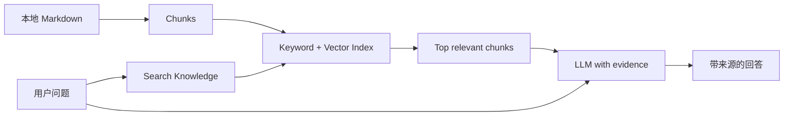
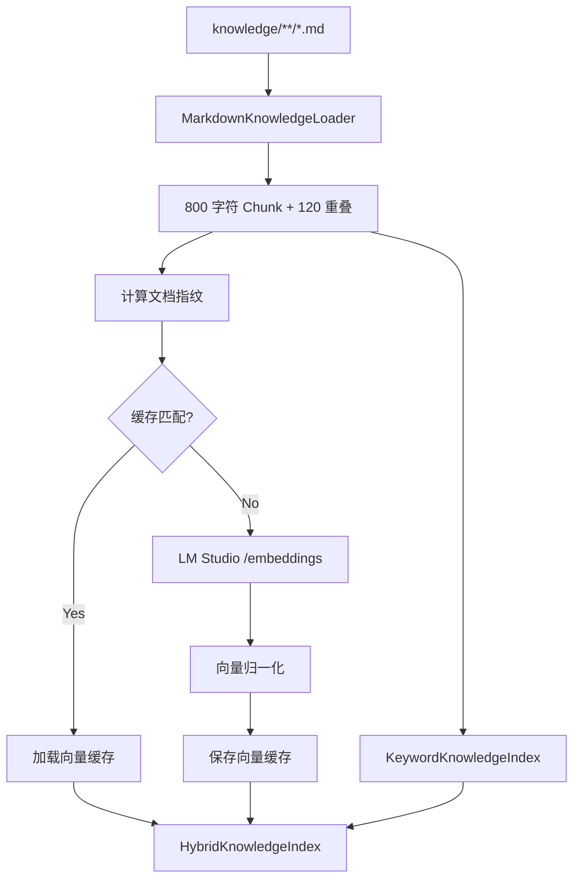
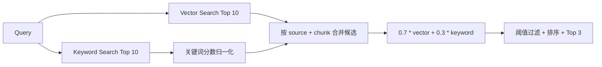

# 第 10 章：RAG、Embedding 与 Hybrid Search

[上一章：MCP](09-mcp.md) | [下一章：Grounding 与评测](11-rag-evaluation.md)

## 本章起点与终点

| 项目 | 内容 |
|---|---|
| 起点 | MCP 已发布 `search_knowledge`，需要理解并完善内部检索 |
| 终点 | Markdown 经过切块、向量与关键词检索，再按权重融合 |
| 自动化验收 | 107 tests |

## 10.1 RAG 解决什么问题

模型参数里不包含你的本地学习文档，而且模型知识可能过时。RAG 的做法不是重新训练模型，而是在回答前检索相关文档片段：



RAG = Retrieval-Augmented Generation：

```text
Retrieval  检索外部证据
Augmented  把证据加入模型上下文
Generation 模型基于问题与证据生成回答
```

## 10.2 RAG 与 Memory 不同

| Memory | RAG Knowledge |
|---|---|
| 保存用户与 Agent 对话 | 保存独立文档 |
| 按时间选最近消息 | 按相关性检索片段 |
| 回答“我们刚才聊了什么” | 回答“文档里规定了什么” |
| `messages` 历史角色明确 | 检索结果作为 Tool Observation |

## 10.3 为什么 Router 不提供 Embedding 也能做 RAG

Grimoire Router 当前不支持 `POST /v1/embeddings`，也不支持 `text-embedding-3-small`。所以分开接线：

```text
Chat / Tool Router -> https://router.hddev.top/v1
Embedding          -> http://127.0.0.1:1234/v1 (LM Studio)
```

配置：

```json
{
  "embedding_base_url": "http://127.0.0.1:1234/v1",
  "embedding_model": "text-embedding-granite-embedding-278m-multilingual"
}
```

模型名称必须与 LM Studio 实际加载并暴露的名称一致。

## 10.4 完整索引构建流程



## 10.5 Markdown 切块

默认设置：

```csharp
public const int DefaultChunkSize = 800;
public const int DefaultChunkOverlap = 120;
```

切块循环：

```csharp
int stepSize = chunkSize - chunkOverlap;
int chunkNumber = 1;

for (int startIndex = 0;
     startIndex < normalizedContent.Length;
     startIndex += stepSize)
{
    int length = Math.Min(
        chunkSize,
        normalizedContent.Length - startIndex);

    string chunkContent = normalizedContent
        .Substring(startIndex, length)
        .Trim();

    chunks.Add(new KnowledgeChunk(
        sourcePath,
        chunkNumber++,
        chunkContent));
}
```

为什么重叠 120：一句关键内容可能刚好跨越两个边界。重叠让相邻块都保留部分上下文。

当前按字符切分，易懂且稳定；生产系统可按标题、段落或 Token 切分。

## 10.6 Embedding 是什么

Embedding 把文本映射成一组浮点数：

```text
"Agent 如何暂停恢复" -> [0.12, -0.44, 0.09, ...]
"Checkpoint 怎样继续任务" -> [0.10, -0.40, 0.11, ...]
```

语义相近文本的向量方向通常更接近。它不是文本压缩，不能从向量直接还原原文。

LM Studio 请求体：

```json
{
  "model": "text-embedding-granite-embedding-278m-multilingual",
  "input": [
    "第一段知识文本",
    "第二段知识文本"
  ]
}
```

真正调用：

```csharp
HttpResponseMessage response = await _httpClient.PostAsJsonAsync(
    "embeddings",
    request,
    cancellationToken);
```

Base URL 已包含 `/v1/`，相对路径 `embeddings` 最终成为 `/v1/embeddings`。

## 10.7 向量索引创建

```csharp
string[] inputs = chunks
    .Select(chunk => chunk.Content)
    .ToArray();

IReadOnlyList<float[]> embeddings =
    await embeddingClient.CreateEmbeddingsAsync(
        inputs,
        cancellationToken);

VectorKnowledgeChunk[] vectorChunks = chunks
    .Select((chunk, index) => new VectorKnowledgeChunk(
        chunk,
        NormalizeEmbedding(
            embeddings[index],
            embeddingDimensions)))
    .ToArray();
```

必须检查：

- 返回向量数量与输入数量相同。
- 每个向量非空。
- 向量维度一致。
- 搜索时 Query Vector 维度与文档一致。

## 10.8 余弦相似度

数学公式：

```text
cosine(a, b) = dot(a, b) / (|a| * |b|)
```

代码先把每个向量归一化为长度 1，所以相似度可直接用点积：

```csharp
double score = CalculateDotProduct(
    normalizedQuery,
    chunk.NormalizedEmbedding);
```

搜索：

```csharp
return _chunks
    .Select(chunk => new KnowledgeSearchResult(
        chunk.Chunk,
        CalculateDotProduct(
            normalizedQuery,
            chunk.NormalizedEmbedding)))
    .Where(result => result.Score >= minimumSimilarity)
    .OrderByDescending(result => result.Score)
    .Take(maxResults)
    .ToArray();
```

默认最低相似度 `0.45`，不是通用真理，需要通过评测调优。

## 10.9 为什么要缓存向量

文档 Embedding 每次启动都重算会很慢。缓存保存：

- 格式版本。
- Embedding 模型名称。
- Chunk Size 与 Overlap。
- 文档指纹。
- 每个 Chunk 的内容和向量。

只有全部匹配才复用：

```csharp
return cache.FormatVersion == CurrentFormatVersion
    && cache.EmbeddingModel == embeddingModel
    && cache.ChunkSize == chunkSize
    && cache.ChunkOverlap == chunkOverlap
    && cache.DocumentFingerprint == documentFingerprint;
```

换模型、改文档或改切块参数都会重建，避免“旧向量配新文本”。

## 10.10 关键词检索

关键词索引不需要模型。它将：

- 英文和数字按完整词切分并转小写。
- 连续中文按双字 Bigram 切分。
- 同时考虑文档路径和正文。

评分：

```csharp
double coverageScore =
    matchingTokenCount / (double)queryTokens.Count;

double exactPhraseBonus = RemoveWhitespace(chunk.Content)
    .Contains(compactQuery, StringComparison.OrdinalIgnoreCase)
        ? 1
        : 0;

double score = matchingTokenCount
    + coverageScore
    + exactPhraseBonus;
```

它很适合精确命中类名、错误码、工具名和 API 路径，但不擅长同义表达。

## 10.11 Hybrid Search 不是一个工具包

Hybrid Search 是检索策略。我们自己写 `HybridKnowledgeIndex`，组合两个已有索引：

```csharp
public sealed class HybridKnowledgeIndex
{
    private const double VectorWeight = 0.70;
    private const double KeywordWeight = 0.30;

    private readonly KeywordKnowledgeIndex _keywordIndex;
    private readonly VectorKnowledgeIndex _vectorIndex;
}
```

流程：



## 10.12 Hybrid 核心代码

```csharp
IReadOnlyList<KnowledgeSearchResult> vectorResults =
    await _vectorIndex.SearchAsync(
        query,
        MaximumResultCount,
        cancellationToken: cancellationToken);

IReadOnlyList<KnowledgeSearchResult> keywordResults =
    _keywordIndex.Search(query, MaximumResultCount);

Dictionary<ChunkKey, HybridCandidate> candidates = new();

foreach (KnowledgeSearchResult result in vectorResults)
{
    HybridCandidate candidate = GetOrAddCandidate(
        candidates,
        result.Chunk);
    candidate.VectorScore = result.Score;
}

double maximumKeywordScore = keywordResults.Count == 0
    ? 1
    : keywordResults.Max(result => result.Score);

foreach (KnowledgeSearchResult result in keywordResults)
{
    HybridCandidate candidate = GetOrAddCandidate(
        candidates,
        result.Chunk);
    candidate.KeywordScore = result.Score / maximumKeywordScore;
}
```

融合：

```csharp
return candidates.Values
    .Select(candidate => new HybridKnowledgeSearchResult(
        candidate.Chunk,
        VectorWeight * candidate.VectorScore
            + KeywordWeight * candidate.KeywordScore,
        candidate.VectorScore,
        candidate.KeywordScore))
    .Where(result => result.Score >= _minimumCombinedScore)
    .OrderByDescending(result => result.Score)
    .Take(maxResults)
    .ToArray();
```

关键词原始分数可能大于 1，向量分数通常在 `-1..1`，必须先归一化才能合理加权。

## 10.13 search_knowledge Tool 输出

```text
Knowledge search results:

[1] Source: memory-mcp-rag.md (chunk 1)
Scores: combined=0.883, vector=0.833, keyword=1.000
Memory 保存对话历史，MCP 提供工具协议，RAG 检索外部知识……
```

返回来源、Chunk 编号和各分数，便于调试，也为下一章引用校验提供数据。

## 10.14 启动 LM Studio

1. 在 LM Studio 加载支持中文的 Embedding 模型。
2. 启动 Local Server，监听 `127.0.0.1:1234`。
3. 验证模型列表：

```bash
curl http://127.0.0.1:1234/v1/models
```

4. 验证 Embedding：

```bash
curl http://127.0.0.1:1234/v1/embeddings \
  -H 'Content-Type: application/json' \
  -d '{
    "model": "text-embedding-granite-embedding-278m-multilingual",
    "input": ["Agent Checkpoint 是什么"]
  }'
```

5. 再启动 Agent。

如果 LM Studio 未启动，MCP Server 会在构建向量索引时明确报连接失败；不会偷偷切换到无向量模式。

## 10.15 运行与测试

本章算法测试使用 Fake Embedding Client，不依赖 LM Studio：

```bash
dotnet test AgentLearning.sln
```


107 个测试覆盖：

- Markdown 读取、排序、切块和重叠。
- Keyword 中文与英文匹配。
- 向量归一化、相似度、维度错误。
- 缓存命中与文档指纹失效。
- Hybrid 合并、权重、阈值与稳定排序。
- MCP `search_knowledge` 端到端调用。

<!-- BEGIN SELF-CONTAINED CODE -->
## 本章完整文件代码

这一节是本章的**完整代码依据**。前面的代码用于解释概念；真正动手时，请从上一章完成后的目录继续，并按下表逐项操作。`新建` 表示创建此前不存在的文件，`完整覆盖` 表示把旧文件全部替换成这里的内容。不要只复制局部片段。

> 下面已经包含本章所需的全部新增和变更文件，不需要再查找其他代码文件。

先在项目根目录执行下面的命令，确保本章需要的目录存在：

```bash
mkdir -p src/AgentLearning.Core/Knowledge src/AgentLearning.McpServer tests/AgentLearning.Core.Tests
```

### 文件操作清单

| 操作 | 文件 |
|---|---|
| 新建 | `src/AgentLearning.Core/Knowledge/HybridKnowledgeIndex.cs` |
| 新建 | `src/AgentLearning.Core/Knowledge/HybridKnowledgeSearchResult.cs` |
| 新建 | `tests/AgentLearning.Core.Tests/HybridKnowledgeIndexTests.cs` |
| 完整覆盖 | `src/AgentLearning.McpServer/KnowledgeTools.cs` |
| 完整覆盖 | `src/AgentLearning.McpServer/LearningProgressTools.cs` |
| 完整覆盖 | `src/AgentLearning.McpServer/Program.cs` |
| 完整覆盖 | `tests/AgentLearning.Core.Tests/McpSkillClientTests.cs` |

<!-- FILE: ADD src/AgentLearning.Core/Knowledge/HybridKnowledgeIndex.cs -->
<details>
<summary><strong>新建</strong> <code>src/AgentLearning.Core/Knowledge/HybridKnowledgeIndex.cs</code></summary>

`````csharp
namespace AgentLearning.Core.Knowledge;

/// <summary>
/// Combines semantic vector retrieval with exact keyword retrieval.
/// </summary>
public sealed class HybridKnowledgeIndex
{
    private const int MaximumResultCount = 10;
    private const double DefaultMinimumCombinedScore = 0.50;
    private const double VectorWeight = 0.70;
    private const double KeywordWeight = 0.30;

    private readonly KeywordKnowledgeIndex _keywordIndex;
    private readonly double _minimumCombinedScore;
    private readonly VectorKnowledgeIndex _vectorIndex;

    public HybridKnowledgeIndex(
        KeywordKnowledgeIndex keywordIndex,
        VectorKnowledgeIndex vectorIndex,
        double minimumCombinedScore = DefaultMinimumCombinedScore)
    {
        ArgumentNullException.ThrowIfNull(keywordIndex);
        ArgumentNullException.ThrowIfNull(vectorIndex);
        if (minimumCombinedScore is < 0 or > 1)
        {
            throw new ArgumentOutOfRangeException(
                nameof(minimumCombinedScore),
                "Minimum combined score must be between 0 and 1.");
        }

        _keywordIndex = keywordIndex;
        _vectorIndex = vectorIndex;
        _minimumCombinedScore = minimumCombinedScore;
    }

    public async Task<IReadOnlyList<HybridKnowledgeSearchResult>> SearchAsync(
        string query,
        int maxResults = 3,
        CancellationToken cancellationToken = default)
    {
        ArgumentException.ThrowIfNullOrWhiteSpace(query);
        if (maxResults is < 1 or > MaximumResultCount)
        {
            throw new ArgumentOutOfRangeException(
                nameof(maxResults),
                $"Result count must be between 1 and {MaximumResultCount}.");
        }

        IReadOnlyList<KnowledgeSearchResult> vectorResults = await _vectorIndex.SearchAsync(
            query,
            MaximumResultCount,
            cancellationToken: cancellationToken);
        IReadOnlyList<KnowledgeSearchResult> keywordResults = _keywordIndex.Search(
            query,
            MaximumResultCount);
        Dictionary<ChunkKey, HybridCandidate> candidates = new();

        foreach (KnowledgeSearchResult result in vectorResults)
        {
            HybridCandidate candidate = GetOrAddCandidate(candidates, result.Chunk);
            candidate.VectorScore = result.Score;
        }

        double maximumKeywordScore = keywordResults.Count == 0
            ? 1
            : keywordResults.Max(result => result.Score);
        foreach (KnowledgeSearchResult result in keywordResults)
        {
            HybridCandidate candidate = GetOrAddCandidate(candidates, result.Chunk);
            candidate.KeywordScore = result.Score / maximumKeywordScore;
        }

        return candidates.Values
            .Select(candidate => new HybridKnowledgeSearchResult(
                candidate.Chunk,
                VectorWeight * candidate.VectorScore + KeywordWeight * candidate.KeywordScore,
                candidate.VectorScore,
                candidate.KeywordScore))
            .Where(result => result.Score >= _minimumCombinedScore)
            .OrderByDescending(result => result.Score)
            .ThenBy(result => result.Chunk.SourcePath, StringComparer.Ordinal)
            .ThenBy(result => result.Chunk.ChunkNumber)
            .Take(maxResults)
            .ToArray();
    }

    private static HybridCandidate GetOrAddCandidate(
        IDictionary<ChunkKey, HybridCandidate> candidates,
        KnowledgeChunk chunk)
    {
        ChunkKey key = new(chunk.SourcePath, chunk.ChunkNumber);
        if (!candidates.TryGetValue(key, out HybridCandidate? candidate))
        {
            candidate = new HybridCandidate(chunk);
            candidates.Add(key, candidate);
            return candidate;
        }

        if (!string.Equals(candidate.Chunk.Content, chunk.Content, StringComparison.Ordinal))
        {
            throw new InvalidOperationException(
                $"Knowledge retrievers returned different content for '{chunk.SourcePath}' chunk {chunk.ChunkNumber}.");
        }

        return candidate;
    }

    private readonly record struct ChunkKey(string SourcePath, int ChunkNumber);

    private sealed class HybridCandidate(KnowledgeChunk chunk)
    {
        public KnowledgeChunk Chunk { get; } = chunk;

        public double VectorScore { get; set; }

        public double KeywordScore { get; set; }
    }
}
`````

</details>
<!-- END FILE -->

<!-- FILE: ADD src/AgentLearning.Core/Knowledge/HybridKnowledgeSearchResult.cs -->
<details>
<summary><strong>新建</strong> <code>src/AgentLearning.Core/Knowledge/HybridKnowledgeSearchResult.cs</code></summary>

`````csharp
namespace AgentLearning.Core.Knowledge;

/// <summary>
/// One chunk with its combined, vector, and normalized keyword scores.
/// </summary>
public sealed record HybridKnowledgeSearchResult(
    KnowledgeChunk Chunk,
    double Score,
    double VectorScore,
    double KeywordScore);
`````

</details>
<!-- END FILE -->

<!-- FILE: ADD tests/AgentLearning.Core.Tests/HybridKnowledgeIndexTests.cs -->
<details>
<summary><strong>新建</strong> <code>tests/AgentLearning.Core.Tests/HybridKnowledgeIndexTests.cs</code></summary>

`````csharp
using AgentLearning.Core.Knowledge;

namespace AgentLearning.Core.Tests;

public sealed class HybridKnowledgeIndexTests
{
    [Fact]
    public async Task SearchAsync_uses_vector_score_for_semantically_related_text()
    {
        string directoryPath = await CreateKnowledgeDirectoryAsync();
        try
        {
            HybridKnowledgeIndex index = await CreateIndexAsync(
                directoryPath,
                documentEmbeddings: [[1, 0], [0, 1]],
                queryEmbedding: [0.95f, 0.05f]);

            IReadOnlyList<HybridKnowledgeSearchResult> results = await index.SearchAsync(
                "怎样避免系统擅自运行敏感功能？");

            Assert.Equal("approval.md", results[0].Chunk.SourcePath);
            Assert.True(results[0].VectorScore > 0.9);
        }
        finally
        {
            Directory.Delete(directoryPath, recursive: true);
        }
    }

    [Fact]
    public async Task SearchAsync_keyword_score_breaks_equal_vector_score_tie()
    {
        string directoryPath = await CreateKnowledgeDirectoryAsync();
        try
        {
            HybridKnowledgeIndex index = await CreateIndexAsync(
                directoryPath,
                documentEmbeddings: [[1, 0], [1, 0]],
                queryEmbedding: [1, 0]);

            IReadOnlyList<HybridKnowledgeSearchResult> results = await index.SearchAsync(
                "E401 怎么处理？");

            Assert.Equal("error.md", results[0].Chunk.SourcePath);
            Assert.Equal(1, results[0].KeywordScore);
            Assert.True(results[0].Score > results[1].Score);
        }
        finally
        {
            Directory.Delete(directoryPath, recursive: true);
        }
    }

    [Fact]
    public async Task SearchAsync_rejects_candidates_below_minimum_combined_score()
    {
        string directoryPath = await CreateKnowledgeDirectoryAsync();
        try
        {
            HybridKnowledgeIndex index = await CreateIndexAsync(
                directoryPath,
                documentEmbeddings: [[0.60f, 0.80f], [0.50f, 0.8660254f]],
                queryEmbedding: [1, 0]);

            IReadOnlyList<HybridKnowledgeSearchResult> results = await index.SearchAsync(
                "completely unrelated topic");

            Assert.Empty(results);
        }
        finally
        {
            Directory.Delete(directoryPath, recursive: true);
        }
    }

    private static async Task<HybridKnowledgeIndex> CreateIndexAsync(
        string directoryPath,
        IReadOnlyList<float[]> documentEmbeddings,
        float[] queryEmbedding)
    {
        KeywordKnowledgeIndex keywordIndex = await KeywordKnowledgeIndex.LoadFromDirectoryAsync(
            directoryPath);
        QueueEmbeddingClient embeddingClient = new(
        [
            documentEmbeddings,
            [queryEmbedding]
        ]);
        VectorKnowledgeIndex vectorIndex = await VectorKnowledgeIndex.LoadFromDirectoryAsync(
            directoryPath,
            embeddingClient);
        return new HybridKnowledgeIndex(keywordIndex, vectorIndex);
    }

    private static async Task<string> CreateKnowledgeDirectoryAsync()
    {
        string directoryPath = Path.Combine(
            Path.GetTempPath(),
            $"hybrid-knowledge-{Guid.NewGuid():N}");
        Directory.CreateDirectory(directoryPath);
        await File.WriteAllTextAsync(
            Path.Combine(directoryPath, "approval.md"),
            "人工确认用于阻止高风险工具直接执行。");
        await File.WriteAllTextAsync(
            Path.Combine(directoryPath, "error.md"),
            "错误码 E401 表示凭证已经失效。");
        return directoryPath;
    }

    private sealed class QueueEmbeddingClient(
        IEnumerable<IReadOnlyList<float[]>> responses) : ITextEmbeddingClient
    {
        private readonly Queue<IReadOnlyList<float[]>> _responses = new(responses);

        public Task<IReadOnlyList<float[]>> CreateEmbeddingsAsync(
            IReadOnlyList<string> inputs,
            CancellationToken cancellationToken = default)
        {
            cancellationToken.ThrowIfCancellationRequested();
            return Task.FromResult(_responses.Dequeue());
        }
    }
}
`````

</details>
<!-- END FILE -->

<!-- FILE: REPLACE src/AgentLearning.McpServer/KnowledgeTools.cs -->
<details>
<summary><strong>完整覆盖</strong> <code>src/AgentLearning.McpServer/KnowledgeTools.cs</code></summary>

`````csharp
using AgentLearning.Core.Knowledge;
using ModelContextProtocol;
using ModelContextProtocol.Server;
using System.ComponentModel;
using System.Text;

namespace AgentLearning.McpServer;

/// <summary>
/// Read-only tools for retrieving relevant chunks from the local knowledge base.
/// </summary>
[McpServerToolType]
public static class KnowledgeTools
{
    [McpServerTool(
        Name = "search_knowledge",
        ReadOnly = true,
        Destructive = false,
        Idempotent = true,
        OpenWorld = false)]
    [Description("Searches the learner's Markdown knowledge base with hybrid vector and keyword retrieval.")]
    public static async Task<string> SearchKnowledgeAsync(
        [Description("The question or topic to search for.")] string query,
        HybridKnowledgeIndex knowledgeIndex,
        CancellationToken cancellationToken)
    {
        IReadOnlyList<HybridKnowledgeSearchResult> results;
        try
        {
            results = await knowledgeIndex.SearchAsync(query, cancellationToken: cancellationToken);
        }
        catch (Exception exception) when (exception is ArgumentException or InvalidOperationException)
        {
            throw new McpException(exception.Message);
        }

        if (results.Count == 0)
        {
            return "No relevant knowledge was found.";
        }

        StringBuilder output = new("Knowledge search results:");
        for (int index = 0; index < results.Count; index++)
        {
            HybridKnowledgeSearchResult result = results[index];
            KnowledgeChunk chunk = result.Chunk;
            output.AppendLine();
            output.AppendLine();
            output.AppendLine($"[{index + 1}] Source: {chunk.SourcePath} (chunk {chunk.ChunkNumber})");
            output.AppendLine(FormattableString.Invariant(
                $"Scores: combined={result.Score:F3}, vector={result.VectorScore:F3}, keyword={result.KeywordScore:F3}"));
            output.Append(chunk.Content);
        }

        return output.ToString();
    }
}
`````

</details>
<!-- END FILE -->

<!-- FILE: REPLACE src/AgentLearning.McpServer/LearningProgressTools.cs -->
<details>
<summary><strong>完整覆盖</strong> <code>src/AgentLearning.McpServer/LearningProgressTools.cs</code></summary>

`````csharp
using ModelContextProtocol.Server;
using System.ComponentModel;

namespace AgentLearning.McpServer;

/// <summary>
/// Read-only learning tools exposed by the standalone MCP server.
/// </summary>
[McpServerToolType]
public static class LearningProgressTools
{
    [McpServerTool(Name = "get_learning_progress", ReadOnly = true)]
    [Description("Returns the learner's current C# Agent development progress and the next recommended topic.")]
    public static string GetLearningProgress()
    {
        return """
            Agent 学习进度：
            - 已完成：角色设定、记忆、原生 Tool Calling、Tool Router。
            - 已完成：Agent Harness、状态机、保护规则、人工确认、Checkpoint 恢复。
            - 已完成：工具幂等键与重复执行保护。
            - 已完成：通过 stdio 连接独立 MCP Server，并动态发现和调用工具。
            - 已完成：write_note 已迁移到 MCP，同时保留审批、恢复和幂等保护。
            - 已完成：第一版 RAG，包含 Markdown 加载、Chunk 切分和关键词检索。
            - 已完成：通过 LM Studio 生成 Embedding，并使用余弦相似度检索。
            - 已完成：向量索引持久化与文档指纹校验。
            - 已完成：按 70% 向量和 30% 关键词组合混合检索分数。
            - 当前学习：用 Top 1、Recall@3 和无答案准确率评测检索质量。
            - 下一步：根据评测结果调整阈值、权重和知识文档。
            """;
    }
}
`````

</details>
<!-- END FILE -->

<!-- FILE: REPLACE src/AgentLearning.McpServer/Program.cs -->
<details>
<summary><strong>完整覆盖</strong> <code>src/AgentLearning.McpServer/Program.cs</code></summary>

`````csharp
using AgentLearning.Core.Knowledge;
using AgentLearning.Core.Skills;
using AgentLearning.McpServer;
using Microsoft.Extensions.DependencyInjection;
using Microsoft.Extensions.Hosting;
using Microsoft.Extensions.Logging;
using ModelContextProtocol.Server;

HostApplicationBuilder builder = Host.CreateApplicationBuilder(args);

string notesFilePath = builder.Configuration["notes-file"]
    ?? throw new InvalidOperationException("The MCP server requires the --notes-file option.");
string knowledgeDirectoryPath = builder.Configuration["knowledge-directory"]
    ?? throw new InvalidOperationException("The MCP server requires the --knowledge-directory option.");
string knowledgeIndexFilePath = builder.Configuration["knowledge-index-file"]
    ?? throw new InvalidOperationException("The MCP server requires the --knowledge-index-file option.");
string embeddingBaseUrl = builder.Configuration["embedding-base-url"]
    ?? throw new InvalidOperationException("The MCP server requires the --embedding-base-url option.");
string embeddingModel = builder.Configuration["embedding-model"]
    ?? throw new InvalidOperationException("The MCP server requires the --embedding-model option.");
using LmStudioEmbeddingClient embeddingClient = new(embeddingBaseUrl, embeddingModel);
VectorKnowledgeIndex knowledgeIndex = await VectorKnowledgeIndex.LoadOrCreateAsync(
    knowledgeDirectoryPath,
    knowledgeIndexFilePath,
    embeddingModel,
    embeddingClient);
KeywordKnowledgeIndex keywordKnowledgeIndex = await KeywordKnowledgeIndex.LoadFromDirectoryAsync(
    knowledgeDirectoryPath);
HybridKnowledgeIndex hybridKnowledgeIndex = new(keywordKnowledgeIndex, knowledgeIndex);
Console.Error.WriteLine(
    $"Knowledge vector index: {(knowledgeIndex.LoadedFromCache ? "loaded from cache" : "rebuilt")}, "
    + $"{knowledgeIndex.ChunkCount} chunks, {knowledgeIndex.EmbeddingDimensions} dimensions.");

// stdout is reserved for MCP JSON-RPC messages when using the stdio transport.
builder.Logging.AddConsole(options =>
{
    options.LogToStandardErrorThreshold = LogLevel.Trace;
});

builder.Services.AddSingleton(new WriteNoteSkill(notesFilePath));
builder.Services.AddSingleton(hybridKnowledgeIndex);
builder.Services
    .AddMcpServer()
    .WithStdioServerTransport()
    .WithToolsFromAssembly();

await builder.Build().RunAsync();
`````

</details>
<!-- END FILE -->

<!-- FILE: REPLACE tests/AgentLearning.Core.Tests/McpSkillClientTests.cs -->
<details>
<summary><strong>完整覆盖</strong> <code>tests/AgentLearning.Core.Tests/McpSkillClientTests.cs</code></summary>

`````csharp
using AgentLearning.App;
using AgentLearning.Core;
using AgentLearning.Core.Skills;
using System.Net;
using System.Net.Sockets;
using System.Text;
using System.Text.Json;

namespace AgentLearning.Core.Tests;

public sealed class McpSkillClientTests
{
    [Fact]
    public async Task ConnectStdioAsync_discovers_and_calls_registered_tools()
    {
        string serverAssemblyPath = ResolveMcpServerAssemblyPath();
        string tempDirectory = Path.Combine(Path.GetTempPath(), $"mcp-tools-{Guid.NewGuid():N}");
        string notesFilePath = Path.Combine(tempDirectory, "notes.md");
        string knowledgeDirectoryPath = Path.Combine(tempDirectory, "knowledge");
        string knowledgeIndexFilePath = Path.Combine(tempDirectory, "knowledge-vector-index.json");
        Directory.CreateDirectory(knowledgeDirectoryPath);
        await File.WriteAllTextAsync(
            Path.Combine(knowledgeDirectoryPath, "refund-policy.md"),
            "购买超过七天后，需要人工审核退款请求。");
        await using FakeEmbeddingHttpServer embeddingServer = FakeEmbeddingHttpServer.Start();
        using CancellationTokenSource timeout = new(TimeSpan.FromSeconds(20));
        Dictionary<string, McpToolPolicy> policies = new(StringComparer.Ordinal)
        {
            ["get_learning_progress"] = new(
                AgentSkillRiskLevel.Low,
                RequiresConfirmation: false),
            ["search_knowledge"] = new(
                AgentSkillRiskLevel.Low,
                RequiresConfirmation: false),
            ["write_note"] = new(
                AgentSkillRiskLevel.Medium,
                RequiresConfirmation: true)
        };

        await using McpSkillClient client = await McpSkillClient.ConnectStdioAsync(
            serverName: "test-learning-tools",
            command: "dotnet",
            arguments:
            [
                serverAssemblyPath,
                "--notes-file",
                notesFilePath,
                "--knowledge-directory",
                knowledgeDirectoryPath,
                "--knowledge-index-file",
                knowledgeIndexFilePath,
                "--embedding-base-url",
                embeddingServer.BaseUrl,
                "--embedding-model",
                "test-embedding-model"
            ],
            toolPolicies: policies,
            cancellationToken: timeout.Token);

        Assert.Equal(3, client.Skills.Count);

        IAgentSkill progressSkill = Assert.Single(
            client.Skills.Where(skill => skill.Name == "get_learning_progress"));
        Assert.Equal(AgentSkillRiskLevel.Low, progressSkill.RiskLevel);
        Assert.False(progressSkill.RequiresConfirmation);
        Assert.Contains("\"type\":\"object\"", progressSkill.ParametersJson);

        string progressResult = await progressSkill.ExecuteAsync(
            "{}",
            new AgentToolExecutionContext("run_mcp_test", "call_mcp_test"),
            timeout.Token);

        Assert.Contains("Top 1、Recall@3", progressResult);
        Assert.Contains("调整阈值", progressResult);

        IAgentSkill searchKnowledgeSkill = Assert.Single(
            client.Skills.Where(skill => skill.Name == "search_knowledge"));
        Assert.Equal(AgentSkillRiskLevel.Low, searchKnowledgeSkill.RiskLevel);
        Assert.False(searchKnowledgeSkill.RequiresConfirmation);
        Assert.Contains("\"query\"", searchKnowledgeSkill.ParametersJson);
        Assert.DoesNotContain("knowledgeIndex", searchKnowledgeSkill.ParametersJson);

        string searchResult = await searchKnowledgeSkill.ExecuteAsync(
            """{"query":"超过七天退款怎么办"}""",
            new AgentToolExecutionContext("run_mcp_search", "call_mcp_search"),
            timeout.Token);

        Assert.Contains("Source: refund-policy.md", searchResult);
        Assert.Contains("Scores: combined=", searchResult);
        Assert.Contains("人工审核退款请求", searchResult);

        IAgentSkill writeNoteSkill = Assert.Single(
            client.Skills.Where(skill => skill.Name == "write_note"));
        Assert.Equal(AgentSkillRiskLevel.Medium, writeNoteSkill.RiskLevel);
        Assert.True(writeNoteSkill.RequiresConfirmation);
        Assert.Contains("\"note\"", writeNoteSkill.ParametersJson);
        Assert.DoesNotContain("writeNoteSkill", writeNoteSkill.ParametersJson);
        Assert.DoesNotContain("requestContext", writeNoteSkill.ParametersJson);
        Assert.DoesNotContain("cancellationToken", writeNoteSkill.ParametersJson);
        Assert.True(AgentToolPermissionPolicy.RequiresConfirmation(writeNoteSkill));

        AgentToolExecutionContext writeContext = new("run_mcp_note", "call_mcp_note");
        const string noteArguments = """{"note":"MCP writes this note exactly once."}""";
        string firstWriteResult = await writeNoteSkill.ExecuteAsync(
            noteArguments,
            writeContext,
            timeout.Token);
        string secondWriteResult = await writeNoteSkill.ExecuteAsync(
            noteArguments,
            writeContext,
            timeout.Token);

        string savedText = await File.ReadAllTextAsync(notesFilePath, timeout.Token);
        Assert.Equal(firstWriteResult, secondWriteResult);
        Assert.Contains("Note saved to", firstWriteResult);
        Assert.Equal(1, CountOccurrences(savedText, writeContext.IdempotencyKey));
        Assert.Equal(1, CountOccurrences(savedText, "MCP writes this note exactly once."));
    }

    private static string ResolveMcpServerAssemblyPath()
    {
        DirectoryInfo solutionDirectory = FindSolutionDirectory();
        string configuration = new DirectoryInfo(AppContext.BaseDirectory).Parent?.Name
            ?? throw new InvalidOperationException("Could not determine the test build configuration.");
        string assemblyPath = Path.Combine(
            solutionDirectory.FullName,
            "src",
            "AgentLearning.McpServer",
            "bin",
            configuration,
            "net8.0",
            "AgentLearning.McpServer.dll");

        if (!File.Exists(assemblyPath))
        {
            throw new FileNotFoundException("The MCP server test assembly was not found.", assemblyPath);
        }

        return assemblyPath;
    }

    private static DirectoryInfo FindSolutionDirectory()
    {
        DirectoryInfo? directory = new(AppContext.BaseDirectory);
        while (directory is not null)
        {
            if (File.Exists(Path.Combine(directory.FullName, "AgentLearning.sln")))
            {
                return directory;
            }

            directory = directory.Parent;
        }

        throw new InvalidOperationException("Could not locate AgentLearning.sln from the test output directory.");
    }

    private static int CountOccurrences(string text, string value)
    {
        int count = 0;
        int startIndex = 0;
        while ((startIndex = text.IndexOf(value, startIndex, StringComparison.Ordinal)) >= 0)
        {
            count++;
            startIndex += value.Length;
        }

        return count;
    }

    private sealed class FakeEmbeddingHttpServer : IAsyncDisposable
    {
        private readonly HttpListener _listener;
        private readonly CancellationTokenSource _stopping = new();
        private readonly Task _serverTask;

        private FakeEmbeddingHttpServer(int port)
        {
            BaseUrl = $"http://127.0.0.1:{port}/v1";
            _listener = new HttpListener();
            _listener.Prefixes.Add($"http://127.0.0.1:{port}/");
            _listener.Start();
            _serverTask = RunAsync();
        }

        public string BaseUrl { get; }

        public static FakeEmbeddingHttpServer Start()
        {
            TcpListener portFinder = new(IPAddress.Loopback, 0);
            portFinder.Start();
            int port = ((IPEndPoint)portFinder.LocalEndpoint).Port;
            portFinder.Stop();
            return new FakeEmbeddingHttpServer(port);
        }

        public async ValueTask DisposeAsync()
        {
            _stopping.Cancel();
            _listener.Stop();
            _listener.Close();

            try
            {
                await _serverTask;
            }
            catch (HttpListenerException) when (_stopping.IsCancellationRequested)
            {
            }

            _stopping.Dispose();
        }

        private async Task RunAsync()
        {
            while (!_stopping.IsCancellationRequested)
            {
                HttpListenerContext context;
                try
                {
                    context = await _listener.GetContextAsync().WaitAsync(_stopping.Token);
                }
                catch (OperationCanceledException) when (_stopping.IsCancellationRequested)
                {
                    return;
                }

                await WriteEmbeddingResponseAsync(context);
            }
        }

        private static async Task WriteEmbeddingResponseAsync(HttpListenerContext context)
        {
            using JsonDocument request = await JsonDocument.ParseAsync(context.Request.InputStream);
            JsonElement input = request.RootElement.GetProperty("input");
            string[] texts = input.ValueKind == JsonValueKind.Array
                ? input.EnumerateArray().Select(item => item.GetString() ?? string.Empty).ToArray()
                : [input.GetString() ?? string.Empty];
            object[] data = texts
                .Select((text, index) => new
                {
                    index,
                    embedding = text.Contains("退款", StringComparison.Ordinal)
                        || text.Contains("七天", StringComparison.Ordinal)
                        ? new[] { 1f, 0f }
                        : new[] { 0f, 1f }
                })
                .Cast<object>()
                .ToArray();
            byte[] responseBytes = Encoding.UTF8.GetBytes(JsonSerializer.Serialize(new { data }));

            context.Response.StatusCode = 200;
            context.Response.ContentType = "application/json";
            context.Response.ContentLength64 = responseBytes.Length;
            await context.Response.OutputStream.WriteAsync(responseBytes);
            context.Response.Close();
        }
    }
}
`````

</details>
<!-- END FILE -->

### 编译与自动化验收

在项目根目录执行：

```bash
dotnet test AgentLearning.sln
```

应看到的关键结果（耗时会因电脑而不同）：

```text
Passed! - Failed: 0, Passed: 107, Skipped: 0, Total: 107
```

<!-- END SELF-CONTAINED CODE -->

## 本章验收

- [ ] 能画出文档加载、切块、Embedding、索引、检索流程。
- [ ] 能解释余弦相似度与归一化向量。
- [ ] 能说明缓存在哪些变化后失效。
- [ ] 能解释关键词和向量检索各自擅长什么。
- [ ] 能指出 Hybrid Search 的 70/30 融合代码。
- [ ] 107 个测试全部通过。

## 本章小结

现在 Agent 能找到相关文档，但“检索到”不等于“回答一定忠于证据”。下一章加入引用校验、Grounding 修复、检索评测与端到端回归门禁。

[下一章：引用、Grounding 与 RAG 评测](11-rag-evaluation.md)
