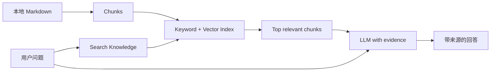
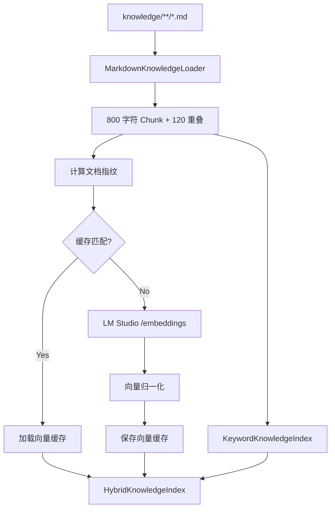
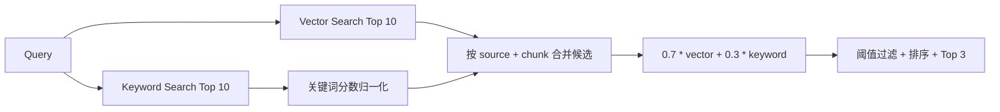

# 第 10 章：RAG、Embedding 与 Hybrid Search

[上一章：MCP](09-mcp.md) | [下一章：Grounding 与评测](11-rag-evaluation.md)

## 本章起点与终点

| 项目 | 内容 |
|---|---|
| 起点 | MCP 已发布 `search_knowledge`，需要理解并完善内部检索 |
| 终点 | Markdown 经过切块、向量与关键词检索，再按权重融合 |
| 自动化验收 | 108 tests |

## 10.1 RAG 解决什么问题

模型参数里不包含你的本地学习文档，而且模型知识可能过时。RAG 的做法不是重新训练模型，而是在回答前检索相关文档片段：



RAG = Retrieval-Augmented Generation：

```text
Retrieval  检索外部证据
Augmented  把证据加入模型上下文
Generation 模型基于问题与证据生成回答
```

## 10.2 RAG 与 Memory 不同

| Memory | RAG Knowledge |
|---|---|
| 保存用户与 Agent 对话 | 保存独立文档 |
| 按时间选最近消息 | 按相关性检索片段 |
| 回答“我们刚才聊了什么” | 回答“文档里规定了什么” |
| `messages` 历史角色明确 | 检索结果作为 Tool Observation |

## 10.3 为什么 Router 不提供 Embedding 也能做 RAG

Grimoire Router 当前不支持 `POST /v1/embeddings`，也不支持 `text-embedding-3-small`。所以分开接线：

```text
Chat / Tool Router -> https://router.hddev.top/v1
Embedding          -> http://127.0.0.1:1234/v1 (LM Studio)
```

配置：

```json
{
  "embedding_base_url": "http://127.0.0.1:1234/v1",
  "embedding_model": "text-embedding-granite-embedding-278m-multilingual"
}
```

模型名称必须与 LM Studio 实际加载并暴露的名称一致。

## 10.4 完整索引构建流程



## 10.5 Markdown 切块

默认设置：

```csharp
public const int DefaultChunkSize = 800;
public const int DefaultChunkOverlap = 120;
```

切块循环：

```csharp
int stepSize = chunkSize - chunkOverlap;
int chunkNumber = 1;

for (int startIndex = 0;
     startIndex < normalizedContent.Length;
     startIndex += stepSize)
{
    int length = Math.Min(
        chunkSize,
        normalizedContent.Length - startIndex);

    string chunkContent = normalizedContent
        .Substring(startIndex, length)
        .Trim();

    chunks.Add(new KnowledgeChunk(
        sourcePath,
        chunkNumber++,
        chunkContent));
}
```

为什么重叠 120：一句关键内容可能刚好跨越两个边界。重叠让相邻块都保留部分上下文。

当前按字符切分，易懂且稳定；生产系统可按标题、段落或 Token 切分。

## 10.6 Embedding 是什么

Embedding 把文本映射成一组浮点数：

```text
"Agent 如何暂停恢复" -> [0.12, -0.44, 0.09, ...]
"Checkpoint 怎样继续任务" -> [0.10, -0.40, 0.11, ...]
```

语义相近文本的向量方向通常更接近。它不是文本压缩，不能从向量直接还原原文。

LM Studio 请求体：

```json
{
  "model": "text-embedding-granite-embedding-278m-multilingual",
  "input": [
    "第一段知识文本",
    "第二段知识文本"
  ]
}
```

真正调用：

```csharp
HttpResponseMessage response = await _httpClient.PostAsJsonAsync(
    "embeddings",
    request,
    cancellationToken);
```

Base URL 已包含 `/v1/`，相对路径 `embeddings` 最终成为 `/v1/embeddings`。

## 10.7 向量索引创建

```csharp
string[] inputs = chunks
    .Select(chunk => chunk.Content)
    .ToArray();

IReadOnlyList<float[]> embeddings =
    await embeddingClient.CreateEmbeddingsAsync(
        inputs,
        cancellationToken);

VectorKnowledgeChunk[] vectorChunks = chunks
    .Select((chunk, index) => new VectorKnowledgeChunk(
        chunk,
        NormalizeEmbedding(
            embeddings[index],
            embeddingDimensions)))
    .ToArray();
```

必须检查：

- 返回向量数量与输入数量相同。
- 每个向量非空。
- 向量维度一致。
- 搜索时 Query Vector 维度与文档一致。

## 10.8 余弦相似度

数学公式：

```text
cosine(a, b) = dot(a, b) / (|a| * |b|)
```

代码先把每个向量归一化为长度 1，所以相似度可直接用点积：

```csharp
double score = CalculateDotProduct(
    normalizedQuery,
    chunk.NormalizedEmbedding);
```

搜索：

```csharp
return _chunks
    .Select(chunk => new KnowledgeSearchResult(
        chunk.Chunk,
        CalculateDotProduct(
            normalizedQuery,
            chunk.NormalizedEmbedding)))
    .Where(result => result.Score >= minimumSimilarity)
    .OrderByDescending(result => result.Score)
    .Take(maxResults)
    .ToArray();
```

默认最低相似度 `0.45`，不是通用真理，需要通过评测调优。

## 10.9 为什么要缓存向量

文档 Embedding 每次启动都重算会很慢。缓存保存：

- 格式版本。
- Embedding 模型名称。
- Chunk Size 与 Overlap。
- 文档指纹。
- 每个 Chunk 的内容和向量。

只有全部匹配才复用：

```csharp
return cache.FormatVersion == CurrentFormatVersion
    && cache.EmbeddingModel == embeddingModel
    && cache.ChunkSize == chunkSize
    && cache.ChunkOverlap == chunkOverlap
    && cache.DocumentFingerprint == documentFingerprint;
```

换模型、改文档或改切块参数都会重建，避免“旧向量配新文本”。

## 10.10 关键词检索

关键词索引不需要模型。它将：

- 英文和数字按完整词切分并转小写。
- 连续中文按双字 Bigram 切分。
- 同时考虑文档路径和正文。

评分：

```csharp
double coverageScore =
    matchingTokenCount / (double)queryTokens.Count;

double exactPhraseBonus = RemoveWhitespace(chunk.Content)
    .Contains(compactQuery, StringComparison.OrdinalIgnoreCase)
        ? 1
        : 0;

double score = matchingTokenCount
    + coverageScore
    + exactPhraseBonus;
```

它很适合精确命中类名、错误码、工具名和 API 路径，但不擅长同义表达。

## 10.11 Hybrid Search 不是一个工具包

Hybrid Search 是检索策略。我们自己写 `HybridKnowledgeIndex`，组合两个已有索引：

```csharp
public sealed class HybridKnowledgeIndex
{
    private const double VectorWeight = 0.70;
    private const double KeywordWeight = 0.30;

    private readonly KeywordKnowledgeIndex _keywordIndex;
    private readonly VectorKnowledgeIndex _vectorIndex;
}
```

流程：



## 10.12 Hybrid 核心代码

```csharp
IReadOnlyList<KnowledgeSearchResult> vectorResults =
    await _vectorIndex.SearchAsync(
        query,
        MaximumResultCount,
        cancellationToken: cancellationToken);

IReadOnlyList<KnowledgeSearchResult> keywordResults =
    _keywordIndex.Search(query, MaximumResultCount);

Dictionary<ChunkKey, HybridCandidate> candidates = new();

foreach (KnowledgeSearchResult result in vectorResults)
{
    HybridCandidate candidate = GetOrAddCandidate(
        candidates,
        result.Chunk);
    candidate.VectorScore = result.Score;
}

double maximumKeywordScore = keywordResults.Count == 0
    ? 1
    : keywordResults.Max(result => result.Score);

foreach (KnowledgeSearchResult result in keywordResults)
{
    HybridCandidate candidate = GetOrAddCandidate(
        candidates,
        result.Chunk);
    candidate.KeywordScore = result.Score / maximumKeywordScore;
}
```

融合：

```csharp
return candidates.Values
    .Select(candidate => new HybridKnowledgeSearchResult(
        candidate.Chunk,
        VectorWeight * candidate.VectorScore
            + KeywordWeight * candidate.KeywordScore,
        candidate.VectorScore,
        candidate.KeywordScore))
    .Where(result => result.Score >= _minimumCombinedScore)
    .OrderByDescending(result => result.Score)
    .Take(maxResults)
    .ToArray();
```

关键词原始分数可能大于 1，向量分数通常在 `-1..1`，必须先归一化才能合理加权。

## 10.13 search_knowledge Tool 输出

```text
Knowledge search results:

[1] Source: memory-mcp-rag.md (chunk 1)
Scores: combined=0.883, vector=0.833, keyword=1.000
Memory 保存对话历史，MCP 提供工具协议，RAG 检索外部知识……
```

返回来源、Chunk 编号和各分数，便于调试，也为下一章引用校验提供数据。

## 10.14 启动 LM Studio

1. 在 LM Studio 加载支持中文的 Embedding 模型。
2. 启动 Local Server，监听 `127.0.0.1:1234`。
3. 验证模型列表：

```bash
curl http://127.0.0.1:1234/v1/models
```

4. 验证 Embedding：

```bash
curl http://127.0.0.1:1234/v1/embeddings \
  -H 'Content-Type: application/json' \
  -d '{
    "model": "text-embedding-granite-embedding-278m-multilingual",
    "input": ["Agent Checkpoint 是什么"]
  }'
```

5. 再启动 Agent。

如果 LM Studio 未启动，MCP Server 会在构建向量索引时明确报连接失败；不会偷偷切换到无向量模式。

## 10.15 运行与测试

本章算法测试使用 Fake Embedding Client，不依赖 LM Studio：

```bash
dotnet test AgentLearning.sln
```

```text
Passed! - Failed: 0, Passed: 108, Skipped: 0, Total: 108
```

108 个测试覆盖：

- Markdown 读取、排序、切块和重叠。
- Keyword 中文与英文匹配。
- 向量归一化、相似度、维度错误。
- 缓存命中与文档指纹失效。
- Hybrid 合并、权重、阈值与稳定排序。
- MCP `search_knowledge` 端到端调用。

<!-- BEGIN INLINE RUNTIME IMAGE -->
## 本章实际运行效果图

下图直接嵌入当前 Markdown，不依赖外部图片文件；如果阅读器不显示 Data URI，请以图后的纯文本运行结果为准。

<img alt="第 10 章实际运行效果" src="data:image/png;base64,iVBORw0KGgoAAAANSUhEUgAABQAAAALQCAIAAABAH0oBAAAQAElEQVR4nOzdBUDb6hoG4OAuQzZs2MbGNubG3N3d3d3tzN3d3d3d3d0V2diGuzucrw2EUKNFZn2fy+WkaRrSNOny5vvzRz0kPIoBAAAAAAAA+NepMgAAAAAAAABKAAEYAAAAAAAAlAICMAAAAAAAACgFBGAAAAAAAABQCgjAAAAAAAAAoBQQgAEAAAAAAEApIAADAAAAAACAUkAABgAAAAAAAKWAAAwAAAAAAABKAQEYAAAAAAAAlAICMAAAAAAAACgFBGAAAAAAAABQCgjAAAAAAAAAoBQQgAEAAAAAAEApIAADAAAAAACAUkAABgAAAAAAAKWAAAwAAAAAAABKAQEYAAAAAAAAlAICMAAAAAAAACgFBGAAAAAAAABQCgjAAAAAAAAAoBQQgAEAAAAAAEApIAADAAAAAACAUkAABgAAAAAAAKWAAAwAAAAAAABKAQEYAAAAAAAAlAICMAAAAAAAACgFBGAAAAAAAABQCgjAAAAAAAAAoBQQgAEAAAAAAEApIAADAAAAAACAUkAABgAAAAAAAKWAAAwAAAAAAABKAQEYAAAAAAAAlAICMAAAAAAAACgFBGAAAAAAAABQCgjAAAAAAAAAoBQQgAEAAAAAAEApIAADAAAAAACAUkAABgAAAAAAAKWAAAwAAAAAAABKAQEYAAAAAAAAlAICMPxOcfEJzG+Smpqq0PhfIyUlJSYmlgEAAAAAgDygzsCv5fHVa922vUUKOQzp240beezMxdsPnnRu27xapfL8iSMio85dvpHlPB3sClapWJYGQsMj3r3/LHka+4I2Vhbs8OPnr7fvO1K1UrneXdqJT/n05Zujpy8mJycvn/ufxFkFh4QGBofSgLvnt1MXrtKfrla5Aj3Mb27q9cN74479jevWbNuiESNTQFDwnCVrEhKTNiydra4u13YYFR398Nkr8fGqKqr1alZhFHT11v2T5y/XqV6lY+um3Mg37z/RpyNtzeS1i9duHz97ydGu4H9jhzIAAAAAAJDb/ogAnJSU5O753dPLy9KiQGEHWwN9ffFpvH38U1JTrC0LqKqq/vT2S2VSra0sVFVUJM4wOjomNCzCPyjIyrKAZX5z5k8SFR0TGRUdJAyQnMCgkNjYuISEBLGJo2/cfZjlPMuEhrEB+Iv7192HT0icpnXTBiqMSmh4uF1Bq8TERKo0Urqm8bFxcT+8fflTxsTGhoSGMcKcnM/YkP+UkaFBAXOzm/ceXbp+hxv58OlL+qGBdi0af/X6QXN+9PyVb0AA+6ytjVWLRvXoI750447IIrHl331HT5uZ5uOPL1rIwamQw97Dp+4+esofX69W1as37zGSKBqAExITz16+npiYdO32/cfP00I1xfhPbh60/PcePXvw5AU38cCenSuULSk+k+TkFF8/wdvU0tI0NzPhP0VV3NfvP9EHWqZUCSMDfWmLcebS9eu3H/CWSrBCPL1+jJoylz9Zo7rVmzaowwAAAAAAQM785gBMOWHTzgMfvrjzRxYp7DikTxd+DI6Li5+5eBUNrFsym4ZnLVlNw5uWz1WVUjk8cvoCxRp2ePWC6Xp6uswvQYVcKpwWtLaiEqK0aajmSb81NDItebww+qqpqvFHUhL79t27fu1q/JGPn72i/FyxXCnKotxIfT1dH19/SvtUg6Wn4uMTqJJJ40sWd9bW0giLiDI2MqDce+bSteev3w3r34M/Q0q/S9ZskbioW/ccEhlDH83EEQPKlykZHx+fksL4BgR+cfe0ssjv5OigqsrY29qcPH+FJqP8zEZoEhYWQQGY3vWp81cl/hVKmyJjGtSuRgGY0iCtgUwrJDmZEa66MiWLp41KTX368i2juG17DtMZB0a4ksMjItmRV2/dTRR+OnSShf3T2lqagodqEq4UePfJbef+o+xrbawtZk0cxY6naL1+6973n93Yh3uPnKJnxw3tJ/G0Dn3udAKCXQz27xJGeFaCG0O/o4WLCgAAAAAAOfQ7A3BIWPjClRtDw8JpOJ+xkb2tdUBQMFV6KVNNnLV48cxJhumls+8/vek31QkpkLz98JkdltZulpLDkxevuYdPX72pXc2V+SXYumixIoVkBmBB1hUJwGwq1tLSEhm5Y/9RiTN5+uKNyJjw8MhuHVo52NoM6tXlyKkLFIDtbKyH9O26eNVm/8DAIX0m0Mq89+g5IwUFLYqvjHQRkZFc1Zr+yvzl67mnfPwCfISF0E9unrTy9XR1p40b5h8UvGrjDkd721GDevH/SvuWjRnhR29ibCQYlcpQUVpNTd3QQI8effjs/u7jF3bivt069Onafvu+I1SI7tSmOdV4vX39r995aGaSr3v7VkfPXKTg3bBOjacvpzAK8vHzf/XuIw1MGjnwp6/f/qNn6GzC4pkTF6zc+P2nT+tmDWpVrURbIIXhoX17FHcuLPJyKvyu2br7ffpy8iUlJ69Yv939qxcNlyjqRJXhF2/e//T2m79iw4zxI3R1dfgTU8qlP0Q/NDxz0Sr6c0P6drO2LCBYP6Hhy9ZtpYFZE0eqCzeVmNg4XR1tBgAAAAAAcuB3BuDjZy6x6bdy+TIDenZiR169ff/wiXMUBu48eNK8Ud1Hz149evaSDUUUwFZt2skfrlPdtbRLMZHZvv/kxtbxqPJG2ePug2f8AEwluwtXb7548yEhIbFsqeL0p/cePknjO7dtXqqEMw1ERkWdv3qL4o1/YLB9QetSLs5NG9Rh21ovXrMlPDyisKNdyeJFz1667hcQZJLPiLJZ2ZLFX779cPTUBfZPfHb/+t/cZdVcyzeT1Gw1XtjuV1cnUxaKE5YBdXW0xKenzF+hbKnQUMGKokAVHBLm9dO7TvXKAYEh7AT6+npcI15CpeArN+/SQK8ubTU1NPIZG9L067bt/W/MEEY6SwvzsUP6UvVS2gRunt827tjPH0P5kzLzgycvyrgUi4iK9vz23dc/kMZHx8RcvXWPViMNt2xSn/Iw9xJafoqstx88vnbrPq3t9i0am5mZDB0/Q0dHe+2imTSBiqoqF4BVhOi/jCA50zOqKkxai/e4+ASqG7MBmFGclUWBpXOmrNiw7dGz12yXV9paWgeOnbW1sQoIpC0r7NT5a1Swpbdw/8nzgjYWIsXbxMRENv12bd/ywLEz/Kfo7AybfiuUKTm4T1caOHXh6rnLN2imtD03rl+LP/G9x89pU+ePWb9tr8iizli0ih3o2Kppw7rZebMAAAAAAMD5nQH4q9cPRlgV7Nm5DTeyXo0qT5+/puKYt58/PXz47CW/1PYu83BNYfVMBNv42SSfcYPa1XfuP0bxj0Iv22CYancrNm6nIjM7JYWol28+UGBjhN1NMcL2q0vXbmXrmYzwakz6CQgMpmokPfzx05uiF9VCuQtEKdhQaFm/dHZERCSVr9mRVAWl4cCgEEaSYGHbYGOjTNfWUqyl3z99/EsWdxaZnqqjycnJbEPZxORkXV1BGdDAQN/rhw87Qb58Rhnr5JPb1t2CdstUYT508rwwzQmSM6XTW/cfSVwettmtlobm8vXbvn7/yUjRsXUzmowrXNMwV/hlq6lkQM/OmpoaW3YfZK9bpqq+i7MT+5SOttbYof3U1QVtvI0NqRqtRzVq+qEMyf8r5Uu5WBbInz/z9bR5wchAPzg4lNsS/AOD6Icdvvsg48JjOrPQonFd8dbLZqb5Rg3qTYsqEoC9ffzYAS6sNqxdne3G7Ef6U5yihRzaNm8YFh4ZFx/PSKelqUlnMYo6OTIAAAAAAJAzvy0AsymRBgqYm9IhPjeekhW/C9zqlcuXKFL4yGlBcbVbh5b6evqbdx2g4fKlXQrZ2xYpZC8y28SkpBdv3gsnKFG6RFqYfPT0ZaN6NWng+p0HbOahkmPDOtX9/IP4tVNGUJS+yIa6ejWrVixb8vLNu5SQKe6WLVWibPp1p5SBHWxtqPJ8894j9hJQqjmXcC7Sv0enbXsP08P8ZqZU+bQqkJ+RJDBQ8K75ATglNZUN4U9fvmnCKxJS7XfWpFEqqiqbduwPCklrfpzPSBB3PTy///BJ67mqRtVKdatXMTDUF473YmdFNfAv7p6UM4sUdtTX1aF1cvLcVWdJIaqwg92WlfNpYP/R08mZr7nlo/VJa4x7OLx/D6ptfv+ZFsId7W0b16tZukSxz26e5qYm7DqkGjuVPV0rlqVCNNVyixctHBMbN2HmonKlitP7evLizZ0Hj22tLQUfh3Za416qqJuk53la5t0HT7DJ/9iZi2cuXh/QqzOTe6aOG5aSnHHHo5dv39M7Kl6kMJX02TELV22QeJcmbW2tBdMnSOyA7Wd6yjVP79ZLV1eHvaL4p6+vyMRUcKafFeu3i1wDL4LWbbcOrRgAAAAAAMix3xaA/dPrpQXMzWRMVrFsqbi4eArAFFnrVK9Cw+z4AT07SbwG+NXbD2zvQRRZ9fX0rCzyUxi79/gZG4DdPb+xk00YPoCyByPI4cn8XpTefRT0XUSv6tKuBSO4vZDt8EkzKUx++uLOBWDKMxNGDqRQV7Sww2Jh91Gv330sV6oEVQXZAGxqYuxaoYy0dxQQLHjjFJ7rVHelKEXDbPNmRnCps09UdDQtNjcxe+OiNs0b+QUEXr15LzIqmj1rwPaxVKtaZUf7gsWKFE67npbOF7hWsLLMT9VvM5N8lBh/ePv07NTaIr/5sTOX6teqdvD4GfHlodVFSZUR9uHMyEQrX01dTUNdfdfB42zPVXQigIrGFPipwrxh+z47G2sv4dXaerq6VpYF3Dy+7jl88vTFa8vmTBE2ZhZU1OmUwfU7D2/ee9ysQZ25/429eU9QK7YraCX+56juzYZ5RpjnhT9pLbTZ66gl9k3F5/7V68S5K1RobdW0PiPmxLnL/AYFycmCzYay6LwV69gxbEN6iaR1P871fc0vGuvp6tAHF5y5328RJYo6WVkVEBlJL2HP5gAAAAAAQK74bQGYrWSS0LAIadNERkV9cvv66YsHDaempFDWokzFPvXy7UcTY8NCDnYiL7mX3vkzxVSKW0aGBhSAff0DA4NCzM1MvnsLKpYaGups+mWEOZkLwBSB2Haw9JL+ozJ1reTu+Z0btrQwp/TLCEpzaX89Vu5OeuMTEnx8BRkpJDRs3bY944b1p2T4kVcAfPn6Q42qFbmHVIF89+Hz4xevqBDNCFve5jM2btGo7sOnLx4+fXn7/mP3r9+io2LoXbC34aHsTXErRXhd6xcPT+EbDzY0MGjaoLa0LpRevv0gcnGvDPmMjZbOnkzl96/ff/Ts2CYkLPzQiXN1alYpaGX5yc2jkH3Bi9fv1q5WqViRQvS+fHz9T128Xqd6ZZX0uOji7LRi3n9Ui7794DE75rOb4AMtaC0hANO5D/rZuucwVenpfATV5H96p9VXA4RV9PymprKXdt/RU/QSqoRTMd/KUjRefvzsThGXiuTsmZRY+hTjE2iz4Z+AYMR6JpPN2MiIbWJAhWuurM22cNbX15PxQjqjk+LCkgAAEABJREFUwXUcDQAAAAAAeeS3BWBtLU1Kp1QPpIwm8hQFnpjYWMohFEh2HzzOjqRhfs/Dm3cdqFKxrEgAphIld8HwolWb+E89ePKCyoBscGVrfSy2+MlKTMqo+HE3GWKvH9bn3UhJXTVtpallVYEUxxaoKYGTT26eR06d79Sm+Z0HT9i/SH/rycvXXACm6uWFqzfZYYq+zRrWtcxvtmTt1hUbtndq27xuzarHz1wUzOT0BfqhaDpr4kg9Pd2p85dz9/UhqzfvZgc2Lp8rcZEop1HFmHvI3r6I5kapNSw8gu3VWUsrrY26hbBcX7J40QdPni9MX8MiPTlR4OQ/7NFR0Hw3Ojpm8tyl/PFXb929duc+e+7g3OUbV29l3OC3asWyXdq1ZKRjm1ibm2cRgE2MjdnMbGAgGj4jIqPY5s3clcl0HuTMxWsuxYp0aNWEP2Wq9Gbh4qhiz26BdGrA2kIQgJOSk9O6ZLO0kPFC+ruWFqJt5v38g95++MQAAAAAAEAu+Z2dYNkVtH7z/hPlkOt3HtarWYUd+dPHj4p+jKA2W7x40cKWBczZvoWJyLBLsaIiM3z2SuotYe89fkYB2N7WhrIThbrnr99RGZMqpVRE5abhMjl7t1smu5KSpUYmtuVwzSoVy5V2Wbp269Vb940MDDyFnYGNG9pv7vJ1H794fP/pwxaoq1QqS4tXrkyJ9x/doqKiD584y6TfMJYyZ9otagU3FmpCk5UqUZS93bGDrQ27lthqNr0jbWENU0VKq11ayUtmTWKHKRaOnTaf5kllXnq4YOVGz2/fB/XqIn4roOJFnGiOVHxWVVPVEdaWn796R8tWqoQzl5ZZbH/XySkp8bzraelPJCQm8W/zy39WfAV6fvvh/vVgyWJFRw3qTaXsXcLTIpev36Eq7tgh/ZJTkhlJBvTs9OzFWwe7guK9WLHrnMxesoY/nu2aiz/GzsZ6+oThjHyoEs4OPH/11rqxoOb84vU7doyNtaWMF777+OWdpPsqAQAAAABALvqdAbhm1Ups2Dh88lxsbCxlJ7+AwD2HTrDP1nCtSGPqVK8ybvoCCqVTRg+meu+Q8dOpnjZ13DAHSTetZeMlWbVgGteQdeueQ4+fvw4NC/fx9S9bqgTbgfPGHfudnRyDQkKDMl+ZWcje9sWb91TDfPn2Q9mSxal+uHLTjvj4eEqs8nRExHZ39O37DzePr1YWBfR4dWNG0EWw/0dhc+7qrhULWlvWq1n1wdMXbMNXyvNWlgVqV3e9evPepp0H5k0dS7OyzG++euF0evbg8bMURPmzSkhKZJvaUvG2YZ3qmbqnGtCTHZi5eBVNM7h3F6dCDumLpyJ7+R89E3QJxqU4EacuXKVqcA3XCtraWlSmpp+BY6ZqaqivWzKbnh3zZV5kVDQF9UTevZSG9OnG3vyWiuhsV1us+ISEfUdOPXz6kl1pTerValSvpkgjbVr5Hz67fRE2emf7KnMu7EjF58/untx5kKSkJArnYeGRNCB+TTgVt/ntyfn0dXXYWyglJyffvPeIi+K0PiuUKckO01+hAqyWtgJNoJ2dCrHbwMVrt2lpdXV1D588zz5VrmQJ8elTU1Nr13AtXCijIcOZi9fpd7MGddTU09oXFDA3p8mknb8AAAAAAAD5/c4AXMalWJvmDU+eu0KBgcIV/XBPFS9S2KVYEUbYqplt0EsFNBpgW5MWlFRMi4qOZm/BamWRn38ZJ9VaKQAzwsuDO7ZuWqtqZfYC1E9ugpa6jva2/GzZsXUzCl1UlF6/bS+bZNjxVSqVY+RQwNyUUhMt5OI1W6q7VujdpR33FCW01Vt2McLGzOzyd2jd1NqywB7hXYjr1apKv+vXrEYBOCAo+NL120159xDu0q7FD2/fZeu2UdgrX8pFRVVlz6GT7Ars3zOLjpGpdvr1u7fHV6+iTo4DenXp16OTmqrq/fQrpfkoah47c5EG6tRw5Y9PYdK6SqZiJtXP6Y9qS8qEKSmCybjKKisuPp4NwBmTpaZ++OS2fd8RSsuMsPOnj24e56/evHj9doM61ZvWr8XdN/jyzTtsQqZaN32IlcqXKeZUiOa/fP12JvMHd/7KjdsPnowe3Ieq2Yx8Cjva29sVfPXmw5HTF+hTps+6fBmXpy/eFC3sQBsJO82Js5cpAOtnXn7ZjI0M+vfouGX3IdoGlqzdyo1v2aS+rVhHX2u27BapNnPOpzd9Z9FJHDoZNHJgLwYAAAAAAHLgdwZgRljpohLcvUfP2UtPGWEPVVQI7diqKVvy+im82U8+YyMtTc0v7oJiYH4zU3U1NfFZce2fKSzxx1PEYgcePn1B2aZbx1ZVKpV99fZDQkJiKZdilEvXbd3DCOuQjDCdTho1eOeBY99/+rDpl/50ry7tHO0K0rCKcBoZddT+PTrtPnSCvTmQWuaFpCo3+x6pKMqOiYqKOShs1Uwzp1jOCLuwalyv5qXrd06cu1KxbGlz3u1w33z4FBsXRwmNftgxxYoUGta/h0hhkELsx88ewrsQB/v6CcqkR4WZlhHeYSguNs7jmxetySfCMwJsV8b0Nj98dr/78OlzYWNda6sC1SqXZ1+iI2w7ffLs5ehoqusm+QUECedjHCCYeVp3xwmJSa+F9wFOThacm+jVuS0Ve7nlodxOr2JzKa0WKtE/ePKcvfiWViwlOjoXQGcuLl2/e+Xm3cvX71D+r1PdtXmjOgb6+pUrlKWacKVypSnrCi9Ijtx75CRb5KdzHPRRLlq1iWZOVetX7z7Su9DU1GDkEx0dc+zcpUdPX7LnU2hug3t3/fbDm123958837n/GDdxIXtbGbNiz5KoqmRcDU4L7BcQeP32Q7YLa9qeXSuWbdGorvhr7W1twsJFe4BjNx4bawv+PBnpZXkAAAAAAJCfSkh4FPMHiIyK8vrpW8DMlJ/6ct3Tl28fPxMUFZs1qutga0PRhapw7LWXi2ZMNEu/dysj7LsoIDDI2NBQV5ECICc5OUWki6z9R0/dvPe4XYvG3J1+KerMWbqWypsLZ0zgLlKlQD5h5iIqnM77bxzlYf4cKDc+e/nmzoMnXJWVMiQtNv8Pnb18/fSFa9xDI0MDG0sLGxtLik9FCtnTUk3h9URFGbJhnRpUbKQiPDumYtmSvbu2527LfP3Og4PHz/KXwbKA+dz/xp65dP3MxWuM3LatXhgcEjZp9mL2oYG+Xu1qrk0b1tbgNVqOiYmlYiybbws72E0ePVhkJhNnLWbPINSqVplWo6aG+tAJM7kSPQXRNQtnaMvXXJleNXnOUpobrZ+WdMqhaiUK2A+evNix/2iVimXbNGs4c/Hq1BT6BNXpLAOV8bUVaQXN8fbxT0hKtC9orVDrZbb78Q3L5rAdtgEAAAAAQC76UwLwr+Ht5z9z4Sp2mOJuSGg4m6Co7Dl70mgmL6Wkpl66dovfsJkRXtqaz8iwSGFH/kiq4lL1WEbhMTQ84v6jZ7cfPKleuYLIHW59/QMePX1lY21pbZm/gLm5eD/VlPHYjq+dCtlXq1Seoh1F7nkr1jvYFaxXvSoVHvkTU2B++eb9Z3cPYetmhha1mmsF+u3u+Y29YbI8VNVUKWQywj6rfAMCa1SpKOOtff/hQyX0fj06WFmI3bXoi8eFqze7dWhlkd+cHePj509V6/j4RB0drbIuxcVvdCSD1w9vWo2lSzhz6fTth8+HTpyr5lq+af3azO+zccf+uLj4EYN6SWzmAAAAAAAAOaFcAZh8+OS+ff8R7kZBGhrqlcqVpliFghsAAAAAAMC/TekCMCsmJjYoONTQ0MDYyIABAAAAAAAAJaCkARgAAAAAAACUjSoDAAAAAAAAoAQQgAEAAAAAAEApIAADAAAAAACAUkAABgAAAAAAAKWAAAwAAAAAAABKAQEYAAAAAAAAlAICMAAAAAAAACgFBGAAAAAAAABQCgjAAAAAAAAAoBQQgAEAAAAAAEApIAADAAAAAACAUkAABgAAAAAAAKWAAAwAAAAAAABKAQEYAAAAAAAAlAICMAAAAAAAACgFBGAAAAAAAABQCgjAAAAAAAAAoBQQgAEAAAAAAEApqDOQZ6Kiopu366yvp2tuZtq+betmjRsyAKC44OCQPfsPuXl4fvj0uXaN6rOmTWL+JEHBIVeuXe/Yro26et5+o27buae4s3MV14oqKipM7vEPCNx/8MgXd49PX9wa1Kk1dfJ4iZM9ff7ivxnzShQvWsSpcMtmTWysrRgAAACAvw0CcB4KCAr09w/wZxgPz2/169ZlACBbdPV09x8+Gh0dQ8PnLl6aMnGMlqamnK9NSkrq1mdQdHSUtAn69urRoG7td+8/MvJxcipkZmrCPfT19e87ePg3r+937j1ctnCuvr4ef+IvX9wpt8s3Y6akS3HbgjbSnj119vzy1etpoHixouNHjaAYHBMb+/OHNyM3Bwd7DQ0J3/kGBvonTp8NDgml4X2Hjo4cNpjGiE/2xc3zp7c3/Vy+eqOqayV5AvCJ0+d27N7L5ECv7l07tG3FAAAAAOQSBOA8FBQUzA2bm5kwILeEhMTPbm7FihbJ65Ia/CEoKMYmxMuYoErlStdu3KIBisHHTpxxcSkmY2ITI6OC6UkyMSnpzdt3MiYODwt//vLVkJHjGPmsWrqwUYO081kUQbv07k/nuWj49t373foO3Lx2pUWB/NzEx8+c27PvoJxzXjxvlrQA7OPjN2/RMnb4w8fPX72+UQD++tWrfddejNyWLZorsR2Kro7O2FHDp86cyz68dPW6xMzp5u7BDRd2dGTk4OX1nU7/MTkQHh7OAAAAAOSe35ku6ECWignSntXW1jbJl09iIUIaqrSkJJOUL+7uFvkLmOc3LeTgIOdrU1JS3n746OPj6+8XQJUQfQM9czMzRwe7kiWKq6mpMdkSmCkAmzJ5QGQdmpkSqUnb4+vXpMQkdlhNXb2wo7wrR1xUVLS3jw/30MrSUqFPSrZbd+5NmzWPPgVTk3xL5s+pWqWSPK+iD96dV2rLly9ffnMzRj5+/gEUgQIDgkJCQ2mrK+JUuFAhhwL5zZl/jshaMjY2/kPe5pSZcyjXyTnxvEVLZU/gWqn8zi0bmLxH0XHogL4z5y1iH1KM79F38N4dm/gZOOfo22n6nPlsAZwUcrTv2K4No7iU5BRueOGyVZevXuceJiUmcsMz5ixYv3kb/4Vrli8u5VL84+cv7EN7O1uRQjcAAADA3+J3BuA79x+MnThV9jQUgZo1adS+TSunwlkUHKhC0rJdF5GRd69fNDPNovQaHh5x9MSpfYeOsmUc8QXo0bVT/z49sxGD+TPs2nsgoyA9Pd1zJw7LPpIWWYf9e/ccN3qYtImbt+nMf/jx1WMmu6jYNX7KdO4hVa5aNm/C5IbU1NRlq9ayrTHp9+oNm+UMwL6+fq07ducedmjbes6MKVm+6vHT5yvWbJBYIaT136BunZFDB1laFmD+Ff7+gfy11K5Ny3kzpzJKg4Jx2dJlaLYKtJgAABAASURBVMDb1+fMuYvsSDrZQQlT/ploamrwH3Zs3yZ/fnOugEwnpPoMHLZn+yb2nJeZiQltSIx81NQlfMnQHrFm/eYHj55wY2ZNnZzzlhER4RESv/FYIk8FBwfHxsVxuwmdXfL6/kP8VfmMjQwNDaXMUlB/VlPNeIPvP3zatmsPO9yzW+eypUtxT0XHxNApMAYAAAAgD/zp7UspAu3Zf4h+xowcOrCvrMZ+V67dEB957cbNzh3ayXgVFZ2Gjh4v40CQFmDVuk1Pn79asmAW1QYZRfgHBjE5QAUf+h+jZBITk/htJj08PSmcqKrmfnfllCsWLlmx9+ARaRPQ+j919jz9bN24unoVVwb+frWqV+/dsysN0FcKG4DpDFdV10oJiYnXLpyScyaWFqInRGrXrH54386+g4axRdpvXt83bN4+c+pEGh7Qtyf9MNmVlJQ0a/7i4yfPcGPGjx5eoXxZdriIU+G1KxbLn95LFC/GZNebt++54ZevXjdu2V58mob1665etlDaHBrVr8vP7draWtt2pQ1XqVyR1iH3VFh4+LRZDAAAAEBe+GsusFy5ZoOerl63zu2lTXDy3HnxkWfOX5YRgB8+etp38HBGDvcfPmrbuScda5YsUZyRm5+fPwMKovJaz+5duMsmu3fumBfpl6zdsFVG+uUbMGTUycP7nIs6MSBEqWz/oaMvXr3R09Xp06u7UyG5LgeVE8XRJfNns8NUdYxPiDc2NOJPkCpsyM0Oq2dulzFqwpTnL14xcjh97gI7QN8P6kK6OjpMDpRyKb5xzfKe/YbQcNkypceNGsbkWExM7NhJU2/fvc+NadqoQd9eGQV8DQ31+nVrM9lCmdPQSGq11svru52dLffQ2tLysqQzjCISee2oxXXtNUBdI6N4Hhoayg2PnzK9iFPG/pUkcz4AAAAAOfEHBWAqxbikx8vQsHAq/XHXvLHmLVraqEFdiU2aPb5+/fLFXXw8VSp+evtI7K00NCxswn/TxcdTxC1QIH9AYJBIs1iqEvcZOOz6hdNG0o8aRfj6+jHpb61Pz26M4hStOf8bxo4cWqaUy9NnL1wrVahdswaTB7x9fDdu3S4yska1KoUKOURGRr16/Uak554Va9ZvWb+KAaHLV28sWpa2Np4+f3XpzNFsXycvzsBAn7uOfdK0WVSnHTKgX6/unbn9zs3No2WHruzwwT3bypQqyb2W6xpaVVXW8rh7fuWuN27RrDGTSyqWL7dm+aLDx05RFVT+Zs/SxMTG9h4w9O37D9yYurVrzp8z3ev7j89f3GlYYn/O8mvZvAl72cLnL279Bo/o0a1zlw5t2QbMq9dvptS9okXTJg3rc9NPmTmHyRn+exFBX/X0Xc0AAAAA5L0/KAC3admCf/1qfELCrr0HVq3dyJ/m3PlLbAtGEZeuXJcyV0HTaH7NhENH8OyFppyG9etOHDvS2sqSfRgcEkJFwsPHTnAT0FHahq07powfzcjHx9eXHXAuWrRf7x4MyIdiDB158w++c92FS1f5D+3tbNeuXML1Cpaamnr0+CmuZyNy9/5DOmOSz9iYAcG9bc5ywz+9vSkDu1Yqz+S26zdvs62U6VTFngMHhw7s17ljO5E6bUx0rMTXpqQky5jzmbNp5d9KFcrZ2RZkck+DenXohx2mYPle7m69+AraWFGWpnMK/MRItd9F82alpKZQlZtO9tFJuoF9e+bKnYeXr14vuNBj7catO3afOrzv3MXLm7buoPFjJ06lb7z2bVoywjOM3CkDOk/UtlULRlCKT+U6IOjRpWO5smXk73YOAAAA4Hf5c5tAUwoa1K/3j5/e/Ovf3n2UcK9OiiunzlzgHtJBbWxsHHfsePr8RfEATOGW6wKHVbxY0UXzZupoa3NjTE1Mpk0e9/XbtyfPXnAjj588PWH0cHkOOhMSErmAbWGRm13C5qLk5OSVazcmJSdxY3p16yJyiaObu+fx0xkfgVOhQu1at5A4N1rnx0+e/fDxEyV/W1vbki7Fu3ZsJxIwjp084+6Z1guxupr66OGD7z14tPfAYUoLBgYGh/dupxoUHX+HRUSw05ibmoqcOwgPjzh28vTDx8+oFKalpVG8mHOdWjUUTcv0sfIfDujbi98ntoqKSsf2bZ48f3H+4hVupLuHJ8US/qvoI7515+6V6ze/f/9Jb9nY2Mi2YMFK5ctRUVFGX9xPn7+gLCFIR58+U36jDa9YUaeiRZyqVqkscm9bedYV+2xSUhI9RYVZrx+CJdFQ17CxtihTunSTBvWKFCnMZIUC1cGjJ95/+EivLV2qZFXXypUqlpPRsNksc5fmpia50E6hdo3qRQoLFrVEibTrVD99ceOepSS2dOXaHbv3jRo2uFTJEtJm0rB+nfzmgk6tHRzspE1DldUDR46xwxQgv//4OWj4GEZBuro6xw/ukT3N2QuXt+/Kzi1wW7doRlsabQwUei9cFpypGdCn58hhg+hrh2Iq29TF3z9g556DKam0ZhTrJsC2oA1/Z3n0+Bmd3GGHCzk6WltbFeLtCNNnzzc00Kczg6d5X7BdO7Vnr9cN4PVx0KRR/bJlSsv+0yuWzFfjXc7w4NFT7vTiwL69ShR35p6Kio7h7skEAAAAkLv+9GuA69WuyQ/APr4Srqp9/+ET/1ZADerXjYuN5QIwHS+6eXiKHM3fuHmH/1BPT3ft8iX89MuiI84lC+Y0a9ORa4xNAx8/f5HnSuDg4BBu2CL/HxqAqcr08PET/u1nCtnbd2jXmj/N5WvXd+/NuJHp8CEDJM5q7YYtG7ZkNCqm8P/y1es9+w5OnzK+a6cO3HgqyHMH3KR6FVeu+1x6SZLw2s59B49w5w5srK35AfjVm7f9h4zkt4338Px29vyl02cvjB0xlJEbnSLhP0zhnQLgjBgysHLFCtxDCrf8Z2kDGzF2Er/7NFpmWpibt+8uXrF62uQJ4terR0VFz120VOTMC226bP9tpUq6rFm+iH9TInnWFSPsyG3U+CkidxSjh4+ePKdTCeNHD5fd+oBWaZee/bmHN27doR8a2LhmOb9fIj6KQNy7oHSUZQ/t8hgxVLSb9GGD+rdp0Xz3gUPcBeH0rnfvP7hsodT+gTu1b0s/jEy0Vtnth/b6OrVr+Pj6ffP6zmQX7eb3H0roTb1p4wZMjtWtU/P2vftLF8yhUzyM8IKOzdt3cc8unjezWx+F+5bnny2i8yZLV63hnqJTe3TqhyrYtM/OXZh2z2HatLZuXM2dMmCEXTSzA1wLF2JjY8NkpUHd2vxTh5qamlwALlumlEgnWAwAAABA3vjTAzAdkPEfqqqqiE9z6Wqm9s+1qlWJi09Yvno9N+by1esiAfjmnXv8h507tLOysmAkoUBy6cxxfpnF0kLylCICgjPKI6fPXXzz7j2jiNYtm1H9h8l7bVq14Afg+48eiwTgO3cf8B82qFNbfCanz13g36aFj46k9fX0pd0kad7iLG7oykcnMvhRje/23fuJinScU758Wf5ms2j5aiMjo3p1avE73KLatbT2sVl2nzZv0VJfPz8Kn9wYSkrd+w6SkbXevH3XrnOPLetXU01Y8jwlrStKuX0Gykr+y1atoyWZPH6MxGYL3t7ew0dPkPhCCtuH9u0o7SKh3Fq6pMuTu9cp6jsIb5TN5LYVq9f7+PkNHzzA3s52yvjRXTu2mzprHtu71cK5M8PTWwcQXT2Fe66iEjo70LpF0xx2fEVu33sgsVZZv15tPb2czpyq4mePHWLvwkWhfeLU2dxTPbt3KVe2NJMzG7fs4PZ9CsZc59J0xiowKIRtCM0IO4Hjv+rSlevNGjdkhBfScyPluc95k1Yd+Q9jYzNOY9HGRqe6JD4FAAAAkLv+9AB86859/kNbG2uRCZKTk0+dOcc9LORoX7CgoBZBh1NcTez02YtUTeJn6e8/Mt3EUnYJy8zUJMubCYsLDAjkhmlJRAp0WapSqSKjOI+vX29lzvZZorLM/EXLuIf3HjyiuhAXlqgUw78QkQKJxCa10tIva87CJbVqVJPYeZhIX1OyLVq6UsazspdBRIWyZfgPKV2MHDfZ1CRfg3p1y5Up5Vy0iIO9rbSG7rROxLtP429vrO279rpWrsDdP+nshctZVhqpwjlv8fIDu7ZIfFZ8XYWGhY2fnPVdfPcfOmZmajp4QF/xpyg/y3jh4mWrpS2MgYF+bt35WcSDh0+27hS0Lj5/8QqVcwcP6EOnIXZv3UDVwqjoGMrbJ05n7O8OdnYKzfyLuzsX+bS0BC0+DA0MunfuID7lybPnuYYG4hPkk6PV9+D+fQf0yXTntq69BrB7ExWf71y9IHI/YQ73TUWTsZ1pRUZGjZk4ldvAaGMbNXQQkzN37j3gN9kYk7kBxcihAwMDA4+fOkvB+Mmz5/w2F9du3IqMjDQwMOC2ZzlPgsj+DlT0GxIAAAAge/7cAEwx7MDhY/w+qAiFE5HJnr98xe/Lqkl61bRxg3rbdqVdpEeHVm/ffyzlknGU5pf5xr+FHBz4D1NTU+MTEhgpNNTV5enzNiAwkMkBdSkHx7JRUY5+FHoJlbirulbi0iMd6b7/+IlKfOzDp7zrnxlBz7Gyuszt17tHjWpVQkPDTpw+y2+7S/OkInzH9m0kvoqOnps2bkhnLgICg/T09KTN3M3dUyTi0kt6du1MgfzFy9c7du8T6dJMNjrlUa2K6/2Hj/gjaQ6Hjh6nH0aYPapUrlS/bq2G9euKtI3ff+go/2/R8q9evsjSogBtM8dOnKHaL/fUmnWbuQB87GTGbWZp5hvXLC9dsmR8fNyV67emzcpo0/vy1WuqFUu7hFhkXW3buUfkXc+bNa1OrepBgcGUt7ntn2zbtbd3z27aWloSZztp7Ciq/kVERK5at5F/voMWJjExKYe9DStq8crV3DDt/vTTv3fPvr27cQ3pfdILj3TCQv4u2VmFHB2owM5mYNpm+vbqlt/cbOrk8eJT3nv4ODpaEPDq1q4pcQIWfRtwHT6L9FpPOZZ/DuXVm7fcuh3Qp6eurqA+7B8QePP2nWs37kyZOFrkW4hD0wwcPprfy/3cmVPZl794dJuRYuJ/MympMsKN7e71jFb3asL+sal4O3ZSxqmTCWNG8E8C0hkxVXX1Xj26VqpQPjIqWvwr5c79h1QEvp1+drJwIQcGAAAA4C/xBwXgk2fOunl4sMMRkVFf3NxEDijpSK5p40Yir7p4OVP759o10i4koxjADwAXr1zlAjAFFZE5O9hnqiM9e/GSvZ+nRGOoONK3F5OVok5OMm5BLFFIaOiV9Jttqqvlyc1vJWrRrDE/Wz568owLwA8fP+VPWb9uHWkz4V9rSpmhR7/B/PtI3bp7X2IALlum9LYNq9mjedlErrSkjWHzulVsl91lSpWkH4Wuh6RTGOtWLZkwZQYbEsTRFkJP0c/chUsprHLdX4n0uEaLsX71Mrb9p5amZrfO7b9++0oVV/ZZCjxUJaOyOVXwTE1M6Icd36UDvXvHAAAQAElEQVRje3aGVANs17rFkeOn+OuKzs5IDMAi60pkSci0yRPY/slM8uUbV6Sw57dv7NW87Nvx9PwmsXH12hWLuXvJlilTsmGzNvxQ7fn1a9Eiv/QGyHu2bjx07MTWHbu5nZR2ZPpyoBTHlkZfvUlbV8WLOTMKovg3bdK4rr3TNpXdew+OTb9hLyXM569elSxRoohTYZHaLH1jPHj4+NLV6/cfPLpy7iR/c6V9h7uR0q0797iLtMXt2nuAG27fthU70KlHX/Yy8i3bdy+eN0v8VW5uHn0GDRM5zVGqZNpXmXi3BRnvlPcFIj5ZfEJ8PuN87BqmM0HlypamfM7eUCo0LGzfoaM0sGffwdEjhrRv03Lrzt20kGzOZ19y6cr10i4luDxvby+1Dt+hXevaNatJfOrO/UdcK2v69hA/ucmykO+SEwAAAAA5/UEBmA7ybt+9L2OCeTOniSQlOjA9eyGjuEEVIe4Qv1TJEnTExh1Dnz13cdzIYWxBRkOsaWtiUqbLR5OTUxnpUlNSGDmUL1eGfhhF+Pj4cQFYQ/3XfTR1Mt9rl4q3g/r1Zodv8Io/VHiU1jMwPcXvapvyw5zpk1t3zBjz5JnkprYD+/aUJ/2SD58+8R+OGTGMu2EVoSP47p07sAfucqJy6IrF86mce/LsOYk3kWbRJkRnQ7geoXx9/fltNfX19UOEuDHWllaZF/szBWADA/3d2zaKzDkhITEqOioqKlo/8z1jkyT1yMWIrSsfXz/+ktDG37VTphMudKImJibj2vVESbOlV3Hpl+jq6HRo14aLJYzwlrm/OABTUZc2vx5dOlGFdv3mbezIUcOHsOk3IiKCq9tTUmUUR+cRKLKePX+Jhrfu3NOrexf2dMOeg4fZ/vZondy7cYn/ks9f3IeOSisCP376jO2SSiG0Gi9fTdu1u3Rsx50KGdCnF9tk4My5iwP79RIpAj96/Gz42AkiZ+tyhaO9/akj+xYuW3npyrXePbuwHcstmjezVfOm53g9n9sVLEiLun7l0vZde02bPD4sNHzxCkF9nk4MFeVdClGrelWR+SclJSULvyfNzc3MpdwbiZ/q7WwLFi9ejJGCbY+jpqqqrv6nX7MDAAAAf76/43iCouyMKRMbN6wnMv7hoyf8o0PXyhUjIiK5h5UrVuAqYHSw9fzl68oVBXcrVVVV5ZpBsih5GhsZMb9bMi+iqKpl56OhFVXIUer1zPwyIx9FjkYN6nIH6M9fvKKKJWU2r+8/+L0ct2gqtf1zuTJlRLorc8x8KE8fU3JysnjTceeiRRj58HvVJsWdRVNZKapaKxKAiYaGOiUt+nFz97xy/QaVu9melsRRZe/GxTOWlgUCQ4L542n98HO+uEDerWIo8d65d//J0+cPHj9R6OJnlsi6CgrOtCRUDhX5CCi47tyygZGJ6/eIY2OdKcAnJyUzvwRtcqmpmU4t9ezWqWKFcpOmzaLts2G9OhHCvq/4nQKYmZpG8DrE4tPQ1JRRHR01bDAbgBnh3YY7tm9DgY2iIDumRjXROOdS3JlSMRvYbty+l40AvHJNxgfRvWtGX1BtWjVbuXY9+yUmXgReumpNXqRfFn1XzJs5tW+vbj37Dmb/yuRpsz08vl5Mv6c6TVC7luCkT4nizscP7inmXITWABuAyfpNaecmSpYoLn6KZMee/fy3nKURYydlOY2cTW8AAAAAZPs7AvD2zesk9kZ7Mf2YlXX+4hX+jVtFJ758jQ3AjPBSQH4Apkoav3UoHezyj3G/fvPid19UoEBe3dOIX6PT0tJkFNelQ/txo4dJe7ZYmcrSnmrepBEXgMnL129qVq/6NHPZtkF9qe2fqQIsMoayJVU++euNSp3iV2waG8t73iEoJFMAFrkpESNoh2nLZJdTYUf6GTaoPwUhd4+vjx4/3X/4mEivPC9ev25m2TBUkSuNGcFdi9POyHz/8XP85On8K2wVJbKuQkPD+A8dHOwZxVEFW2SMtraWPC+kt/Px0xeqSFepXDFX6nIt2nfxz3xlPofGu9aS0CP64uWr6EfiS2ysra+eP8FIYW1lyXVa9uT5CwrAb9+956JmzRqiAZhOmTVr2pi9G9PFy1dmTZ0oTy8AnBcvX3Nn4np06UjVV+4pKrkPGdB32ap1jLAIPKh/b/6zdWrWYL+m2BNb0k5g5YRF/gJ06oS7Yp/tfozVqX1b7qJx9uvRzNSEf6aMJdJpPAAAAMAf7g8KwF06tmPvMZucnNKhW2/+0fDhI8fFA3BMTKzILVVlO3fx0pSJY7Q0BcHSIXNYOnbyTMP6dbmHlIU2rM7oGJlKGVt27OYeOki/4I1KpisUqXuwmjVuwP71uNh4bqShgQHzC1Wr6spvMU4lSgrA93iX3RYpUph/aC4iRFIsDAwK4j/U15fawZU8LAsU4DdUDg0PF7lQNiwsF+4dSlnOuagT/VCZbvyU6fxjfSoON2vcUFtbtMG2XuYGzIyw3M2N1NER1CF9ff0btVDsgvAsiTQdDwsLY36Vd+8/0h7KDtOmu3rZQuYPk+V9dCqWL8MG4EfCq9zv3M/oDq1q5Uri0zesW5sNwPTh0lkM9nJZedDX1NT0Ts5oqxg6OO0+XgkJiV/c3N9//Pji1Rtu4qMnTk8am3HPoZo1qq3fvK1USZeVi+efu3Q5LwIwbUXrVi6dPme++Hdp6+ZNxadv37aVSABu3KAeAwAAAPD3+IMCsJ6unkm+tJuLjB4+eMr0OdxTJ8+c7929q8gNeG7fu88ogo5cHz56wl7J6WifqYEuFUC4PmDEXbl+k//Q3lZqpTEyMoq7iFd+FhYF2AAcERnFjTT6tU2ydbS1Gzesz14DSW7fuT9+1PB7DzJSQXOx7sf4Pn7+IjImKDiE33qTDuIVKpqJcy7ixL9E3NPza2HHTB+im7uHnLMKDQtbvW4z97BypfJNGtYXmYaScJeO7fnH+nR2g36bmWVK3T27d5kyfjSTlTv3M22rJUsUp6qja8XyJiYmlEBWr9/Mv+xWTiL5/9MXN5EJaP3zu7kuX7aMqeJ385Lo8PGMHq1pg6c1I+2GyX8sRwd7diA4JNTPP4Br/+xaqbzEnqXLlC7JtYK+dfuenAGYUu7sBYu5dhB0CunA4WOeX7+5eXhKvOz86PFTo4cPYU/SMcKm1xPHjOzWpaNmtvqElxPNfOGcGWampjt27+OPt7axEp/YtWIFbj0wgjzc2sBAX3yytq1aSOsvYPvufdIuNGCE679nty4Sn7Kz+8u2MQAAAPgz/aFNoJs3abR+03Z+G9RV6zfxq7Lk3IXLIq9q1KCuyBiRYsW5i5fZAFy7VnWRG7dS3t64Zrm9XaZwm5KSsmb9Zn473mzceUV+4eEZNUwjw19aAWaEEZcLwPSWr964xU+wDerVlvFaOoPw+Ysb/1LAoydO8icoJve1vtI4ORXiPzx87GS9OrW4UB0VFU3VM0Y+qiqq/Ntrnbt4qXqVygZiJff3Hz7yH1paCnqjtcrcJ+3Ll69TU1P5F98mJibxY6dLieJmpiY3b2e6OfPShXP4ifHFS6l5QAbLzEtCgcrj61d+L0oHjxxbvno993D7xrVVq1RicsP375luaPzD2zvnAXjh7BnxCfHSnk1KShK5THT0iCFFpXeCpakh+QoCrx8/P312Cw0Nu3It46zW6zfvuH28Tq2aEl9IW1rjhvXY/r0vX7tBf52Rw4IlK/iVVSody24DT3scpWvue0xVVbVPr25M3qM/VKNaVZEAPHr8lLUrl3BpnPX+4yd57jdG27zEK6W37tjDpd+6tWtyLcPbtWnJfvk8evK8qqtr/z49RC5oBwAAAMgtf2gApvrb6BGDx0+ezo25efsuHTlx/SqHhYdzB0+sJ3eviWeY4OCQ6vWacA/PX7wye9oUPT1dOqqbOmks/54ldATcvmuvKRPGVipf1sbGmgIVJbr9h45euprpNkujhg1mpNPV06mWft9X+TmkVza8fXy4kb++U64K5cvwazvzF2WcbqDau8ipAXHDx0zatnE1BSHKKvTRrFm/hf9sESdHJmdE6r0PHj2hcxOD+vehCipVdGfPX8w/TyEbncLgn/6g1NG93+CZUyaWK1uaHUMnPo6eOLV05Vr+q9h4T3+ucYN63FZBeWbj1h1DB/bjJtu8bSfXdzE5sGsLhQGRJuKRvFI/rasnmW+2LCddHZ1mTRryL3ofO2nawd3baDwjuKzdZ9O2nfzpRc4g5ESbVs25ZS5QID9VBZkcq+JaUdpTMbGxE6bMEBm5au3GGtWq9O7elV4of1ji7vPMoW+DA4cz+k6rVaOatNfSrs0GYNrS2LtbMVlxdLDLcpqyZUqXL1P62s1b7AZ8/NQZ8RN5eY3OngwfI3qvYzqrNWnqzGUL53LXeLu5e/YbPII/zbETpyqUK91KUmNpESGhoTPnLuLuOta/d8/y5Upz3+H169SyyJ+f3XFWrFn/8vWbuTP+y60GCwAAAAB8f24nWBQzNm7Zzu8sd/maDft3bmYPdq/fzJR+6VDYQNJFs3QIRZmZ3+Lu9r37TRsJOtShUjAd7PJb1VIQmpZ+tZ5EdKhKlQoZEzja21MIZLLL3cOTHaCDcsNfXgGmw9wWzZvs2pN2t1J+nael9P6fOZQnG7dsT3FIcGMfsa5ry5dV7I5Q4uzt7fhXKZMtO3bTj0hXW3Lq07PL3IUZCZ8CQLc+A2n+RZyc4uPj+B2kcbiV0LljO/5pkbUbtrx6/bZKpYrqmhq3bt/l31GZlq1MacHdTatUrsgv/Q0fO7FFk8aWlvlfv32v0HXsIrp0aMcPwPQuatZvSht2YGCQSKimaht7s+Jc0axxIy0trZOnzxV1curQrlWe3pzm4aOncxYukfgRU0KjH+EtuHo0aVRfRrfPHJFdnhHcRLoUV7GvX7e2jFJ2uTKlueE79x6IBGA6qbHvYEaQ/vrVq0Rx5yquoiV3elURp8J0NocG6BcNsSVWC4sC7P2Q6B35+PhZWf26m9/6+vn3HTxcYnfTl6/eoPMp82ZNoxLxz5/efQYOFZ9s8rTZ9EZKligubf50Oolq5nRCjftKaVi/Lp3f5HreYg0d1I8mYE9P0OnOVh26Tpk4tknD+vSnGQAAAIDc8+ceW6ipqYmUW1++en3rTlpT0nMXMsWGhtIb6Dasl6nvYn5gmDZ5vMh1xbLNnj45747GEhOTuIuNS5Yo9ltaALKnBsQ1qFeHkY+/f4D4IXKbls1yfi9Zygn/TRwnPj4b6Ze0b9O6LC/PsGjJaRuTmH4XzZvJNX2vXLF8t87t+c/SofySlWsWLF7OT79k/qxp7OdYxTVT/9u0lrbt2kMJPCfplxHea7p3z65M5rdAW7hI+qXC/oQxI5jco6GhTslky/pV40YPsy1ow+SNz1/cRk+YQtmM/xF37tCuS8dM3YnRObKpM+fWqNeECrm0E8meZ8XyZWltsMOU2VYuWaCunnFpev++PWW8ljYAwa22hK7fvM1/Ge1anAAAEABJREFUyj8gsHu/Qfym7+279nrw8IlTIcdpkyesWDL/4J5tNy6defvs/sXTR1cvWzhi6MAWzRpTQuYaGNerU5POv9B5iv8mjdPRzTrJ55ZPn936DhrOP9tFHyutZO7hm3fvE5OS3rz70GfQCP5k/MQ7ZMRY9gp5cY8eP+vQrffYiVO517Zs3mTpgjniPQLQV+uM/yb07J52ATBNP37y9M49+r14+ZoBAAAAyD1/9Mn1enVq8e9ORJavXpeUlESHm4+eZLpDT43qUhsuirRpvHHrTmh6f7k21lZH9+0alt4vqww0k6vnTkjr1iXnwsMjZi9YzEXHojm+YjZ7XIoXs7G2FhlJH0GWIWfSuNFcrhBBmYGeZXJD6xZNRcIPn8g9VGXT1NTYsm6ljPauHFohxw7sFmnkOWHsqE7t28p+IYUrrk21a6Xy0q4apZp5lrOSYczwoT26dJQxAZ3iOXZwjzztdf8Q8QkJF69c69p7YOuO3UWu4aePeObUiTP+m3j76nmRW8LSvkMnFJq27igSTUWoqaod2rOdXv7+xcMj+3cWKVKIKwjTZ8Tvaj5J0g2Qa1RNu8CBTjFwXyP0jTRm4lTxTq36DRmxY/e++nVr0cmCMqVKWloUkFEqtyiQ/9n9m+tXLaVPM5+xMZP3kpOTt+/a26ZTd/75hTkz/qtRrcrUSWOpGM4IT52sWrZo5doNnbr34feYcGDXlu2b1nIbFYXVdl16UtmWmyAmNvbE6XM0ss+gYfwzSgP69Fw4Z4a0Pr3obNGU8aPHjsy4kdvb9x+69RlIlWcquVMlmQEAAADIsd/ZBFoj8+GguobowlBNYMSQgfwrdanaQ0dCYeER/MmoFlEgvzkjhZ1tQZFWso+ePON6/aVDseGDB9SuUX3XvgPvP3wSKSeybWJ7deucW1fl+fr6b96+y8zUxNDQgMpocbHxIaFhn93cRFoD1qqWdTBjZbkO+USaEIujA9AWTRtv3LqdP7JFEwntn1XVMp06MTc3PX3swPJV606eOc8fP6hf7wF9e/FvFCSSASQWutU1NHjTZ1SKaHuYPmVCceci6zZv598lizL23OlTRNrAa2pmsW3r6+ttWrvi3sNHJ0+d+/Dps3glmaJps8YNB/fvLd66ngp3s6ZNqlWj6v5Dx/h1PxYV0IYM7Jvf3Iw/klaFZYEC+w8f49/MhirJQwf15/fIxQhDGpP23rNeV7QBU82werUqBw4fE2ncS6udThmMGjaYv/xq6pkqb+pqEna6TAujnqO+u+UXGRn54NHTG7fvUIKV0IS+XJnpk8dz7Qho3Y4ZObRvr+5Hjp/avH0nNz2FtOFjJtLEE8eOKuUiuVGujU3GKZ6C1jY0n5XCW5cN6NPb18+f5mBsZOwfGCByF2hWpYrl1gu7D6eUmJCQyI7csmP3y1dpVcpCjvZdO7XnWtcvXbmWfugcipVlAXNzM00NDTV1DTVaxaoq9MNOk5ycSijdJSUlRsfE0nuhR1s3rFaosQnN4dLV6zRXPX1dPR2d8IhIfhfu4gICg8ZOmirSG/PgAX07tG3FCDe8xfNnTZk+p2SJYv2HjBS5P/PubRvY1hPrVi1p3qYzO5IWe+io8UMH9hs6qF9sbFztRs1FPkTaGin6ytOWZEDfnqVLleAXjel0J/3Q1/iurRtkfNUDAAAAyEMlJDyKgXSxcXFeXj/8/P3pcM3O1lYkw+QcVXpdazWQPQ1VXKnk+FuaQFMta8DQkSLV9esXTst/RWJMTKzn129R0TEmxkY2Ba3ZDplyHS3nT2+fwKAgyor29rbc3bNyggqP37//9PXzo8qYsZGhmalpQfka94aFh1NCCI+IoDBJL6GzG7I/u7j4+B8/venMhY21Ve5ePUtbF226tCRUKjM1zWdXsGCe3j4nFwUGBdesL7kjJToNMWHMiKaNGkhbq5GRURu2bueuXedQTqtUoTwj3KnLudZiR04aO0qk0Tjx/Pbt8LFTk8eN2r334OIVotfw0+kMKjuzw/TZUVpu37ol16PYqzdvu/RMa0JCXxpnjh6knYXy8IBho2WfbJKBvgGOH9wjMpJi9sr0e4w/f3hLZM+iAFyxel2Jf5Hi99XzJ0RGevv41m/amj+G0u/IoQP5K5mquPSh8OdJb3Dt8iX87spu3LozbPQE/nyunjtBpxgWLV9FK5MbWadWjVnTJot8nd66c487ublxzXK2f34ObRIz5y7kV5VbNGu8ZP5sBgAAACBn/txOsH4LHW1t56JO9MPkDSMjw6qulUSuFOVr07LZpHGjf3H6dXP3fPv+Q1xc7L0Hj0XSb/26tRXqj0dXV8elRDEmj1FupHJQ7jbrpaKuU2FH+mEUZGxkpFCX3dpaWnnUlp62rry7R1eeMjczHdCn59admVJftSqu3bt0oFqr7DtIGxjoU6xt07zZnEVLuZJmyRLF5e93zdHenr2ZMxUexZ91rZTRxzV9dlMmjOE/q6erxzWsmDZ5PLuzUIGUzmGtXrdJpA95OVWtXFnRl9A3RpXKlbg+lvlq1agiPpJK0nNm/DdjzgJG2M55yfw54rfIoow9fvTw2fOXsA/p45g3a6pFgfz8aerWrrl3+6bBI8eya2DcqGFsgX34oAHnzl+iEi6VxKkaX7N6VUZBtElsWL2MAvachUvpBFORIoUpQjMAAAAAOYYA/Kv16NopXz7jGEFbx2hGUFTR09fXs7MtWNjRsVLFcr/m8j8RT569YHugFTdy2CAGIO8NHtj34pXrP729K1Uo16B+3VrVqhRUpHstCkiUxM6evzRn4RIKY/NmTpUdmyUSufaekm3/3j0a1pfVapfOmFDW7T1wmJWlJf9CcTo7s3LpgskBgV+/ev30/vn9h3dEZFRsXGwySUpOZVKTk1NoUOI869auzsgk8QSZ4F5KYgG4XZuW0u7c1r5Ny+s3byclJS+aN9NMyg2HOrRtfeLUOTo7RjXwTu3bSvy7FcqXPXVk/7AxE+hcQO8eadV1+k6jUO0XENCyWeOcNHOggO1aqeLeA4eaNmqQR81JAAAAQNmgCTQw+w8dEw/A8l+zB5ArfH39tXW0cngOKDw84u2HD9V5t+NOSUl5/eYtO2xpaSlSwxQhvEVzqnBQhWrLjHx8/fwTEhJk3EIp5/wDAgMDg2hAR1e7kIOD+ARx8fHRUdHcQzV1NSNDwyxb42tqaMi+2Jjt3jnLt0YnHeLi4hS6cy+dBAwMCmKHzc3MdHWRbwEAAOBXQAAGCQGYCi/Tp0yQHRUAAAAAAAD+LgjAIOjGyd3dMyo6WkdHx9rSwkLm/VoAAAAAAAD+UgjAAAAAAAAAoBQUuNUkAAAAAAAAwN8LARgAAAAAAACUAgIwAAAAAAAAKAUEYAAAAAAAAFAKCMAAAAAAAACgFP6Ru92kpqYyAAAAAAAAkDdUVFSYv9/fFICRcgEAAAAAAH4LGXHsL8rGf24ARtwFAAAAAAD484lntz82Ev9BARiJFwAAAAAA4B8gEu7+nDz8mwMwQi8AAAAAAMC/jZ/7fm8Y/j0B+DfmXkRuAAAAAAAA1q+Po1wi+y1J+JcG4DwKn8i0AAAAAAAA2aBQmMrdyPpbkvAvCsC5lVGRdQEAAAAAAH4LiXEs5/GVne2vicF5G4BznleReAEAAAAAAP5YudXf1a8pCOdVAM5JcM270Is4DQAAAAAAwJdHDZuzPec8LQjnSQDORs7MYTRFsgUAAAAAAMgGOcNUNhJpTsIwvTYvMnAuB2BFg+ivj8oAAAAAAACgqBxeAJyNFs55UQrOtQCcd9E31xMvIjQAAAAAAEBu9V+l0AwVjbW5G4NzJwDneppFZRgAAAAAACBPyZ+h5Myf8rd5VrQgnFstonMhAOdipv2NZWEAAAAAAACQSDx/ZRlH5Yy48hd4cyUD5ygA51b0zd1snPNXAQAAAAAAKKdsFHtlv0qeJCxnDM55c+jsB+BcSa2yJ8iz9tK/4g7LAAAAAAAAfzYJSUpGvJIn5cqYLMv4Kn8MznYGzmYAzmH6zUnulfmsXK3MJX7MAAAAAAAAyimrPJkWoORsCC275JtlQViefJvtDJydAJyTum6uPqUiNg2SLQAAAAAAgGKyjHhiaVNCJBZPpPIkYUWf4k+TjQyscADO9fSryPQqmZ/K7Z6i0TIaAAAAAAD+PbJjkNz3LpL+qlRGZtyV/VS2S8HZyMCKBeBsp1+Fom/m8SpZTi9hAmkrAREXAAAAAACUjcwclCotH3PpSmZLZrEJUrNMwiLjZZeCczcDKxCAs3dprvzRV2Luzbo+rCL+IukTAwAAAAAAgBgJMTJ9RKaEnCphYilhWGoSVigGy9N1lvwZWN4AnFvpV87oK2uGKvwJpc0k1yA5AwAAAADA3yLb3SPLDj4ZsxX+NyMSp0oNw+njM1pHyxmDs1EKlj8DyxWAs5F+5RzJG6MiaxpJoTcnVyMDAAAAAAD8e3IlBMm4iFd0AhWpYVgs36bKmXhllIJznoGzfx9g7s/IMzLL6Csr96pInYmM+csgcWJcHQwAAAAAAP8qybfVkXnDXhkTS87DXBjmJWHxgrB4vpW/FJyqeK9XIrIOwDnv1VlkjHj0jYuL27pjz/OXr7y+/4iJjWUAAAAAAADg76ero2NvZ1u+bOmB/XpramrKjsE5zMDyxGOVkPAoGU/nMP1mGX3p97mLl+cvWhafEK+qoqqqpkr/ZwAAAAAAAODvl5KSTP8jmlpaM6ZMaNq4IZP58mBGrPYr+6GMkVk+xcgOwIpe+puN9Lt9196de/fHxyeoqSH3AgAAAAAA/JuSk5O1tDUH9unds1tnJscZOIuUK/1ZVSZbspt+aTlUUlPT6t1nL1zauXtfUlIy0i8AAAAAAMA/jEJfUmLylu27Ll+7wbBtoAWpUEVin1CyHzIKdgLFJ7UCrFDjZxnLxy/88sfHxcXVadwyKSkJ6RcAAAAAAEAZUB2YAuDdaxc0NDTYMTJKwTmpA0t7SnIFOK/TLw3v3HcwJRnpFwAAAAAAQFkIAmBqyq69B7h4yCsFpz3kJs5JHVjaU4o1gc5W+lURTb+CXrGZFy9fJSUlMwAAAAAAAKA0khKTnr54mekGwmnhUUJz6FxvCy0hAMs/C/nSL5Mp3Ke/SQ+Pryj/AgAAAAAAKBVVNTV3d092OJVJ5adF4X8VzsDSSJxSgQqw/J1CS0u/bFmbrXFHx8SoIgADAAAAAAAoE4qBFAa5rpEFpWAFM7AIhYrAqtl+sbQFyjL9MgAAAAAAAKD0speBc1IElrcCLGfdWc70ixgMAAAAAACgtESzoRwZWOLLJT6UQa4AnI2KM9IvAAAAAAAASCNHBpY8vey5yaaajddk2fgZ6RcAAAAAAABkyyoD50JDaJHJsq4AK9r4Ocv0K+wKGjEYAAAAAABAWaV3gqVoBhaZh4yHEqkqNLW0v8dvpZ0xRkr6VWEAAAAAAABAqanwS6RC4hk4fcIctSnmv0RV/knleSpjpMz0i9dXbiEAABAASURBVAIwAAAAAACA0kqPulIzcKaHoq9VLKXyKXAf4Kz+PK/xMyPhPSD9AgAAAAAAAEt2BmZDJZNVQ2hFC8Kq8r9M5gXHKtJK0txDfvrNRtkaAAAAAAAA/g3poVcwrJJ5JCP2kMvAjKQpFQqz6vJMpNg0vMbPGc/y3l5upd/m+U3rmOcraahPw28jom4Ghp4LCJbztU3Ka9Uqqelir0HD774l3n6bcPF5vJyvNa1S0KSspb6jCQ1HeYaEvPQNfviD+bNVq1atVq1aCxYsYBRUoXz56tWrr1q9mvmDGRgY5s9v7uHhwQAAAAAAwF9C0EZYRUXQeZSwCiz8DzdS8JtRkfwSeWYr7VmVkPAoRr5qssQaL5vFRXp+Fp0yIwyrcMG4Rv2mWS66NFZamtOKOlQ1MRIZ/yAkfN7nrz7xCTJea5lPdXJHA1dnTZHxjz4lLDoS6RuaIuO1miY6Dr3KGrsUEBkf9s7/6+6XCSGxTLZMnDChXr164uN37tx16PAhJjesXrXK2dm5a7duwcHyniNgjRwxomnTpo2bNGGy6/SpU2qqqp27do2KimLHlC5TesmixQsWLLx95zY9q62tzZ/+1q1b12/cmDtnjvisPnz4MGbsWP4YlxIus2bONDA0oOGUlJTr168vW76cAQAAAACAPxjlwbvXLrB5UPg7PbJmjGHSBlIzP2QyhdvMTzHi48VHqjPZrvRKTMgqos+yl/6KpF8mZ+YXK1TW2EB8PEXiecUL9X35UcZrZ3c3LO2oIT6eIvGs7gaD1obLeG2hgRUNnUzFx1MkLjSwwsdFd5ls2bFz5+WrV2igWpVqrVq13Lhh49fv3+jhV8+vTC6h3JgvXz5F029u0dDUXLp06ZAhQ9iHqpmvPP/x88fadeu4h74+PpGRkRMnTxK8UE19/vz5Dx89OnnqJD0MDAjkv5C24IWLFkZHRY0eM8bfz69z5y609r5//37k6FEGAAAAAAD+bPxir/jvtIlURCu6Egu88leG1WU8LXu8eN9X4o2fUzNuepRrNz9qaWEmMf2yyhkZ0ARn/IIkPtu8kpbE9Msq46hJE5x7IrkttFl1W4npl2XoZEYTBN37ziguSIgGClpZ0+9Pnz99+vyZfYoKsLVr19HV1QkICFi+csXrV69p5JbNm2NjY42NjQsUKLB129aCNgWrVa/29s3bypVd6dljx4/GxsR1695NQ109MDBo+Ijh4eHhgwcNrl+/ftt2bV0rV542bfq582cbN2pMpdewsLCp06Z7eLjTC8uWKTtp0kSabVJS8tevnuPGjU9ITGByQ1xcnKODQ8cOHSRG0+ioaPZ98bFjVFUFUTnAP0B8AqKjo6OpoXHjyZOPHwWnPLZs3UwB2M7OngEAAAAAgL+MCpP5YmDxhtDpKTeVi7vScq+MPCxXL9DZLhGLd3yV8yJwY3OTbE/QoIwWI5OMCUwr2DAyZTmBovr06d2sWbMfP76fOXPW0NBw3tx5Jvny0XhDAwNnZ2cNDY0LFy68evXGyMjI0MCwZKmSVCaNjAjv3Klzr149b1y/fufu3fz5zSdNEpRSaRIdHUFLYx1dHQ0N9VYtW92+c+f5ixcUdwcOGMAIo+acuXMoEp86ferVq5dFihSZMmUyk0s8PDw+ffrUp08fG2triROo8DByi4mJ8fT0rFe3Xvt27apWqbJ2zVpGkP+PMQAAAAAA8GcTj4dpGTG7XT3LmTHVc9aXdNblX/HGzyItpRVVVF832xMUsZbV6ZfsCfRsjWS+NOsJFNWyZcvvXt9HjR5Nw2fPndm2dRvl4b379tHDhPj47j16pKRkXLE8bNiwgIDAu3fvrlm9+ubNmytXrWIEl8iWsLO1FZ/z0aNHd+zcSQMbN24sUbwYDairqdML37x96+/vTw8PHjhAGZjJPf9N/e/wwUOLlyzp1q2byFMU5i9dvMg9nDV71sOHj+Sc7ew5c7du3jRAmOHJ2bNnv37NtXbjAAAAAACQV1SyaAItuwic5eyltZRWZxQhsR8sRkqmFWn8nCn95vgy4H+epoamro6urZ3ttm1buZElSpRgB/z9A/jpNykpOUB4fWxAQAD9prooOz46KtrAQF985k+ePGUHPn744OjgQAMJiQmfPn/q3au3vZ2trq6uiYlJYoLU9s9t2rTt368f9/DsubObNm1iZIqOjlm2YvmUyVPGjB5969Zt/lPBwcFnz57jHn7+9JmRj4GBIaVfKl6fOHGC3n7DRg1btGgRGha2f/9+BgAAAAAA/mTCbp/FLvrN1BA68+SSrwSW5+pfvqwDsPRqsDzl30xz4HcKnW2fo2KqamnKnkDaU1+8k1wN1aS/VDCBtKeiv4cbl9SW8VqagMk9msL3mJCYGByY1nMVfa4vX75khyWcgFBEfELadc4p6S+0srLasnkLDXh9/+7t62thaZmYLHVVfP78+d69jB6/XqUvlWyUe5s0atK4ceOAwEx9WQUGBh48dJBRXPPmzTS1tP7777/nL17Qw5OnTh46cKB161YIwAAAAAAAf4H0xsIqmW6AJOgKOntFYHnCsAIVYGnlX4mk9vwsXNTUHGTgoz4BVU2NZU8g7akTD+Jci8m6DJgmkPZUwK2vxiULyHgtTcDknqioKKrBfvniNin9WlynwoVDQkOZvNGoUUNVVdXRY8awHUodPXokNUXqZ/Thw3v6YRQ3Y9bMI4cP9+zRg8kNuto69DsiMpIbk5iUrKWjzQAAAAAAwJ8tI9amZjxMFe8FOss5KFgEVpU4I0YRki5fTusgWnSy3Gj8fDM47EFwmNRng0JvSn/29ruERx/jpT175208TSDt2dBXvmFv/aU++9KHJmBy1bMXL1xcSowdO6ZSpUozZ8xYt25d3Tp1mLzh7S1Y+O7dulWoUGH+vHmGBoZMdmlpaZ04cWLe3LniT8XHxy9cuFBkpJmZWccOHbifokWLMvI5d+E8/V6yZHHzpk1pFdFi589v/urVGwYAAAAAAP4KwpAolkDTYi0jOWbKP28J06tn4zWiT0m9+ldsQbO13OKWunsdzmeoqSqa3qOTkxe5ecl+7cpTUXsLa2pqiC50THzK0uNRsl/rdeiNoXNdVQ3RRtRJcYlf9+dC7mIbJHNrZ/bs2atWrmzYoGGjho1opd2+c+fosWOMWLFffH2m8iZhh1JSpFTv0x/euHGtVcsWFYSiIqP8AwI0NaTeL0o2CsA62tpm5uZif0Tg0ePHDx89quLqyo2hANyPd0XxrVu3Fi5axEh5O3z+/v5z5s6dOGHCiJEjhX8l9cWLl3PnzmEAAAAAAOCPl1a5FTYcZkRufSTxSuBMraBlzlM6leCwSPHXyBgWuf1vKi+yS7z6NzVz31dcD9e1G7VQ6GJlcc3zm9Yxz1fSUNDJ09uIqJuBoecCguV8bZPyWrVKarrYCzLeu2+Jt98mXHweL+drTasUNClrqe8ouNlSlGdIyEvf4Ic/mDxDa8naysrH15ff61Ue0dXVNTAwYDuCzgl1dbWkpGTmVzE0NDTJZ/LN6xsDAAAAAAB/PEqFty6fZeOgsCE0RUomLfem3xtVOC5jZNrvVP6YVCbzBCxpw2ljRAKwtN6VxAbSAzAjVpJOj7hi1eq0AXaqnAdgAAAAAAAA+OuwAZgRplyu/2eRrMuNZkRiMCMhAEsckPhQlckOlSzfD38gNf0mSRnj5bhxEwAAAAAAAPyTuEiYFhJVRK+flePK2ezUU2UF4CwvAJbQWFpS91e88TnvAwsAAAAAAAD+BRnxUEJQVOHGS78yV+I8ZWVOxSrAovNSkTBSQnBH+RcAAAAAAAB4pBWBGSkpl5tMwki5yRWApV0YLGUyFdHJxMq/ii4lAAAAAAAA/DNSxdsIS2j8rMJkHT8lP5QmG9cAi+Vb2V1nofwLAAAAAAAAYrIsAmdMKTl+KnwZcPY6wZK8HCpZTCnhJQAAAAAAAKCEUuXrKEpF0kuyTVXiEkgk8QJgkWcl5HV+Umckp3kAAAAAAABQHpLbCEu5C688UTTLP8RSlXO6LKUvg4qM9s/cMO7/CwAAAAAAoLTYSCihYbNoK+jsZEcZYTbrJtBZtr2WFZUlFbVR/gUAAAAAAFBymaOl+FAGflqWpy8qGRS9BlhW/pZ2vXLayPTStgoyMAAAAAAAgBKjSMhlS4k9JctOlzyKlYiz2QmWXAlWSvtnAAAAAAAAAEZKK2iFXqUQ1VyZncgdgBlp5WzheMRgAAAAAAAAJSeSDaVfNivrbsAyZi5xvGqWU0imIvlRaualzhhkZHXbBQAAAAAAAEpEpCdnRkqQTE2VNLliiZKfUuVtAi0ej6Xe90jmHNIvX2YAAAAAAABAOfEbO8uZJRnp3TDLX81VlfMvMRmLp8B9lrLRKxcAAAAAAAAoiSzvOiTHC1XkfAlRZ3KwcJmJtYpOZV8iNgfBU4KJjfOZMAAAAAAAAKBMQkOCBYlRRXgNsAo/vqY/krvFs6A3aRUF2kMrFoDllJZyxbChmIvEXh5fGAAAAAAAAFAmhvlMGTbuSo+2iiZbOWXrNkgKLob4bZ3QFhoAAAAAAEBpSbiOl1EwJGYrHWfzPsB8kvvBwtW/AAAAAAAAIIdUsUtnxZ/KlVCZowAsf29YjJRrlAEAAAAAAEApSe5lWaGYqahcqADz42zWy4rwCwAAAAAAAIwgTMofd3MlSuZCAGbEc68KN54BAAAAAAAAkIe0dsO5dVGtXAE4V/5Y+j2OcT0wAAAAAACAsktNzc1oKOe8cqcCLOMPK9yXFwAAAAAAACgNrtYrEh7zonSqKv+sZU6jWHtsFIEBAAAAAACUluKRUCUns+KmUbgCLG3uyLQAAAAAAACQ63IxhGazCbRCfyk1dxt3AwAAAAAAwD9E0cyY7YCpmovz4s9C8ngVBjcBBgAAAAAAACEVqQExx7FUYrDNaSdYKO0CAAAAAADAL5Dz+Kmap3MXmRvCMgAAAAAAAHBy/Ua5sueW+7dBAgAAAAAAAPgDyR+AFb7REeq9AAAAAAAAoJBs1YTljau/qAKMnq8AAAAAAABAol8WGNUZReVs0XBLJAAAAAAAAGCDoUpOAqbir81+BRg5FgAAAAAAAH6xnERRxSvAmaFtMwAAAAAAAPwCOY+fuXkNMGrCAAAAAAAAkItyN2bmQSdYKAoDAAAAAABADuVBtMzbXqBTGdSEAQAAAAAAQC55HSF/0W2QRKCxNAAAAAAAgNL6XZHw9wRgAAAAAAAAgF8MARgAAAAAAACUAgIwAAAAAAAAKAUEYAAAAAAAAFAKCMAAAAAAAACgFBCAAQAAAAAAQCkgAAMAAAAAAIBSQAAGAAAAAAAApaDOKIGuy2Zc3bA70NOLyZl2s8cb5jfbOXQK85vu2qzUVFQEv//MNf8nL1tmLScPN8hvdmD8nNSUFOZP0n7OBFNba3bY56Pb2cXrGQAAAACA3KYUAdi2dHGj/GY5D8AO5Utp6mirqqqmJCfL+RItXZ22s8YIi5s0AAAQAElEQVQF//C+snYnkzcqdWheqGKZm9sO+H3xZLKl2YQh+qb5Dk9ewOQNuzIlqnZt8/HWw1cXrjPZ4lihdOfFU2nA4+mrvFtOGWS8Bedarm1njI2LjF7Rug/zxytSvZJgG1ZXT05IYP4klH6NLfIzKoyaurqahlJ8LwEAAADAr/ePN4FW09Co2K6ZiopKlS6tq/fsYG5fkPm1tAwNKDYXr1OdyTPFalehP2FR2IHJrmK1q1KEZvJMwVLFaQmL1KjMZFf5Vo3SZlWyGPM7yHgLKirCnegv2ZMCvX5EhoSlyn0G55fZ3Hv04sZdD0ycxwAAAAAA5Jl/udLSevpo55quVLCl4YIuRemnZq8OK9v1jw2LYOCvYlu2BP2Oi4nR1tW1Lu7k/cGNgWzZPWwqAwAAAACgrP7ZAOxUtWLx2lWTEhOPTVvcft6kU/NW0cjKHVqkJCTKP5NKHZpX79ZO20AvIS7+w8374hNU6drGtUMLmiA1NTUmLOLymu2f7z5mn+q6bEaBQvYq6oL4rWOoP+bkDnb8kxMX7u89RgNmdtY9Vs31c/8a9O1HyUa1tPX0EuMT7u07/vDASW7+VMFuO2MMxT8tHZ3kxKQQb7/DUxdF+AXQUzYlnTvMmUgDWvq69LvB8D51BnSjgcSEhHWdBjNyqNWnU7mWgsqqprYW/eaW0PeLx6FJ87nJavbqWK5VI3oL9B6jwyIuLNvo8filyBI6VCitrqlBE9Bb+PH2I9dKeeTRLWrq6hrC+TuUc+H+xKHJC3w/uzPyyV/Int5+bESUx5OXLvVrVGjbzPvDKv4EbWaMKexaXkNLk6a5u/dYta6tg3/67Rs9g5ugcOWyjUYN0Dc1poWJi45+dvzind1H2Key/BRy5S0YWZh3mDPBpKA1rSWav9er98dnLktOTNsUaSsq17y+vmk++kP0KcdERF7bsPvjrQf8OVTt3rZyu+aPjp7Vz2dUom51XWNDmpK2ybOL18uzIZVsWKvuwG7scGoqs67zEH4z/sodW1Tt0ubFmcs2Ls7WxYvQQsZGRJ6YvYKWk5tGsC/0aEczp33h3bU7VkUL0wKv7TRY/muJa/buVKFdE/ooVVRU2I350OR5kYEh8rxWniUEAAAAAMjSP9sEulAlQZve768/uAvTWlJc/Kfbj3YPnxofEyvnHFw7taw/uCeF2xBv37io6DJN6mrqaPMnaDSqf51+XSgZhvkGRAYG65sYt5s1rnSTOuyzMeERsZGR8ZHRjCBypNIw+xMXEcVOoK2vT6+1L+tSsW1TVVW1pIREinA0wwKF7dkJKFuOPLLZqWoFygzh/oGMCmNubzNk1yodY0PBO0pIYGfIJpnE2Dj2YYzc9e3YqGj2JanC3pu4JYwJDeemoRhfvWd7XSOD2PDIpPgEAxPjTgumONdy5SZoPGYALaGKqkrQd58ADy96qw7lS3HPsiuBXkjDKckp3J9Iio9n5FapXTP6/ePdx5fC628defNnl7BYrSpqGuqB336qqKk0HNZbL5+xuZ0NN0GVzq07LphiVMAsOSk5KiSMIhy9oxaThrHPZvkp5PwtWBR1HLJ3LcV4VXU1+hxp/hTIB+/OyPAV2jQxKmAeExHl5/4tMSHewDRfm+mjKXDyZ5LPyoKWs1LbJrScGjrakcGhNLKwazl53gKhwEnj6UfX2Ig2VBU1Nf7MjS0K0ByqdmtrV6ZEQkxsSkqKjqFBp4X/pXXuJcyfgn1BTy/Uxz82PKJc8wYWTg6C+aRPkCV6y5SfaUuOCAj2+eQeFxVFG3M+K0s5X57lEgIAAAAAyOOfrQCH+vjRb5sSRc0d7Zhsqd6jPf2+vnnv4yNnaaDD3ImU9LhntfR0yzavTwOn5q1mi8MNhveu2KZpvUE9X1+8KRg/V5BwDC3yD9+/Li4yelPPURL/CkWIJ8cvXNuwi4YH71ltYm1JZeozC9fSw2bjBtFBf0x45Lb+4yi5qaqp9Vg9x7qYU5tpow+Mn+P32ZOdZ6/1862dnW5tP6hoF1NPjp6jHxoYf34vFYHFl5Cq6BSrKB7vHj7N55Og1XGNXh1q9OzQdNwgOpvATuNST3B5856RM7hyqG3pEtwctvUfL1iTPTvU7NXB6/WHI1Oy038VZSf6/frirR+vP1BJn9YJpUH286XiJ7uEO4dM9nf/pqKqOuzAekNzU+612ob6Nft0pIGbWw88PHSKBiyLFu69fr5Lg5pUBA73C2Qnk/Ep5PwttJs5TlVVlV5LdXWq+tL5iyF7VlPirdC26bMTF2iCOzsOej59HRmUVgutO7A7nXyp0qkl++nwUbZ/fubK5dXbBMusqupcM+NMhIy3QGgTZbfS8ef2iJzH4c9h79hZtJI1tbXHnNpBVdbClcu5P3pOT9GHTr9v7Tj4YL+gqtx6+ujitasyiqg7uBf9fnbq4tV1u9gxFkUcQ739FJqJjCUEAAAAAJDHP1sBfnbyUmxEJB3rD9i6lOJHrb5dqM4mf73IxMaSXktxi02/5MLyzfwJHCqUotlSOuWaRl/bsIcKU1Qx1jEyYBRxa8cBdsDjiaBYbZg/Lb8VribI2z/efHSoULpkw1ol6lX/9vwNjbF0LsT8EpXaC0qvEQFBprZWtAD0E+YXKHiPenpU/WOnSRQWQp2EpUjW99e52SrVML+ZrrEh/VG3h8/ooaDILFiwtOpoibqC+B3o6UXplwZSU1IeHDjFf3mpRrXZdsVRIaHsWzCzt4kODacoVbxWpggn7VPIIUrglHVp4Mv9J8XrVKUFoMzm7/aNxnDxlc6YUPo1tbUuWqNy6SZ1osMEFXgtPT3xuUWHhrHpl32zIs2kc/gWaOaULWkgIS4uRBhN6XNnePsCm37JpfRlkF9UsCDe09kHNU1NdozfF8/46BhF5iF1CQEAAAAA5PTPVoCp1Lam42CqyjpVqWBgmq9AYfuGw/tQMXDbwEnsNbSyFRB2qhyb3lyZUCyhHMXdoCW/g6CwTOGQm4ACSXxUtI6hgaWTo+ez14x86Jg+KS7thjT+7oJ0p6mjwz7UEg4UrVGJfvgvofIX80sIbkvDMJTfuAbDHIsihdjK25tLtyu1a1q9Z/uq3dtGBoa8u3r7zu6juXiP2Yptm9Lv4B/e7F12P95+aOVc2KlahctrBBnMzE7QrXfQDx9uep/PmfrHsnQSfI70qYm/BXNHW25YxqeQQwVd0rqtbjC0t8hTRvnN2IHidao1GTdQK/NfVFVXE5+bnzA5S5Tzt+D9MWPVhfv5m9vbaOsJLi+3cHJkBE3BI7ln4yKi+PuCPO7tPU61epviRSZe2BsbHvnt1bvLa7bH8uaZkyUEAAAAAJDTv9wLNGXgSyu30s/kq4feXrntWKms4BLW+ZO39hub5WvZg3uRIJfKpHLD6poagj+RlMSfgL0cV01Lk5FbkrROuVRU2Assj0xdLPJMSuY/mnfYlfD89BW2osj3480HduDahl2eT17WHtDNzNbaqIBZte7tyrdtsqJFbyaXONcU3HnI3K4gfYiMcK3Qb0MzEx3hZcmMsKKfmir15epags6r/Ny+3tl1ROSpwG/fueEkRbpGU4imtmBjiIuOPrNgnchTUaGhwgm0m08aqq6h4fPJ/duLtz/ffVLX1mo7Q/ImGhkstcuonL+FhGjJl8enNZuQsZbl8P31+409RjYa1c+qWGEq6RevXbVYrSo7Bk9iS/c5XEIAAAAAADn9ywGY7/OdRy/PXuu9fn4+6wLyTO8vbGrLdrDMUtPUpJTCPQz0+km/9U3y8V+lpa/HvTaNMEKzt2JSTGpqQly8prZWqI9f8HdvmVMKF4+3bNlDbzA5IYE/JjwgUN/EOD4mRvZlllTuZiveTtUqtp0+RltXt0Tdau9vZHSazXaypSappCmblp4u23441MefG2lgbkIfRMXWTe7sPhIsrP2a2mT0pWRR2JE/B/osilavRBkuh1eKZvst/BDesUldQ1PaAtTo3ZHeTrh/0K5h/7FjKrZrykhfDuaX8/f4Rr91jQy5MfS5iJd/CxS2bzdrHDu8b+xsfuMIFm3JbO/i+QvZd1o4xcA0X/Ue7Y/PXMafJkHYKFpDkVNIAAAAAADy+2evAS5GJabM/fTYlRF0zpQQEyfPy4O+/aDqrpaODtelU40e7fgTeL18xwiaB5uZ2VmzY1wa1KQkk5yYxG9iHSXsrVfbQE9LV+Emtez1ro1G9uOPpIKhuX1B/hi22+dClUoz2ZUUJ7iOl1KryPgv9wWX3ZZr3kCV32mwioqVsxP3yMjCnBt2u/80MiiYETaQ5s+HzUIFFO+NrFwrwV2aokLCNvYYwf28uXyLRharI/hw2ZhN0cskPQNX6dyKP4dPtwVXyRYoZGdqa80fb13ciVFEtt8CbQwJsXHqmhoVhX1Zc2i96Rkb0YCqmmAfTIzL6FO6dJO6zJ8k6LtPYnwCvQXBVfRC9Yb0FJ+MAq2xZQH2R8dQX+RZ/nYS4PGNbVOQz9pCZDIqCLNdVatrIwMDAAAAQO77d+8D7FqOEmmTcQOpfEoF2BaTh+sYCvqmuie8B2+WUlNS3l+/X6pRrS6Lp1LK0jbQLVK1In8CSkTf33ywLVW87+YlH2480NDWZPs0enHuCn+ylOTk2IhI+tMjjmz2+eSeEBP7+vItCoryLMOJWcuGH95kX9Zl2IH1Hk9fMYIrWh0tijh6PH3N74vY7eFzpyrlC1UuN3jP6iCvn5Twub5/5eT7xbNQpTJNxgwo36pRZGCwzxePB/tO0PiHB05WaN2Ygs3Y0zu/3H9Kb8TMvmBBF2dKdKvapsXyYfvXRwQGf3/9ISY80rZUMQo/dOLg/oET/Pl/e/6GKqi6xoYjj27xc/uakpR0dcMurgdmGVzqC/q48nr5lj/yxZmrlMkp8VLJOtDTy/ujm3UxpwHblvt89jC2KmCQ3jsXK4iev/2wWK0qA7Yv93j8kirG+awKFCxZTNfIYEG9jozcsnwLWrq69DGJvGrv6Jm0nVxcsbnV1FENhvYqXqeq9wc3+tPWxYvQYlxYvvnVhesfbz2s2LYpnUbps3HRz/efHMqXMcv1jp1UVFpNGc6oCJI2W7ltMXloarKgmEy7QxbtCxhB2fnBwVO1endsOLxPqUa1KbHnV/xEQO9189W0NL+/eh/yw5e2YdvSxWnkrW0Hxaf0/vCFzlWNO7XL180zNTn59KL18ly0DwAAAAAgj3+2Avzo6DlBo9PkVEthNVLbQD8yOPT0/NXPTl6Ucw7nlm7wfPaaAgPFYEq/lJ0ShGW61PRmqAcnLfjx9iNVfWkCilgqKipvLt/m7vLCOTxlUeC3nxraWhRli1SrWCT9XkopyaI9RbGXHHPzp8rn9gETKF4aFTCnyEc/lkULUS3u24s3/Fe9On/t7ZXbVHk2sbak5SwuVsjN0umFa76+EIRMyyKOtIRlGtfhntrSe7TX6w+aOtou9WtQTnMoV1JFVcXr1TtuAkrFhuam9Gyldk0tnBySuf7FyQAAEABJREFUEhMvr94ex+s8jEQGhVxesyMuOlovn1HhymXpT5jYyJXxTAsKyrYvz9/gj6T6IX0QtLZLNqjJCO7ANP3by7cqaqoFXYpq6Wjf33ecEazbjMukT85Z+eS44G5DdJrAtWOLotUrUX0yxNuXfTbLTyHLt5CaKpieloc+JpEftkk8nUA5NW81LTMFdVpLtK4o/UaHhgV4Ci5C/vn+86MjZ+nP0cqv2KapaUFLegspKdKWihGX5VugE0Al6tWgCj/9qKkLAnDxWlXZhxbCewWnpiaLvOXUlFT+n7u/9xgtFdVm6SOmD+Xd1TuJ7I2RecvJX7SUFNEFpTKylo4ObZ+unVrSjkCr6/WlmxKbhZ9dujH4p4+quppN8SJ0qsLAxEieJQQAAAAAkIdKcJigI9ZMR5bpw5kHVNiHbEdQqULsc+wvboxggtS0R9zE3NPcYKMW7SJCg5lfYvLVQ8dnLnd7IFfdVQRlGMcKpX0+uUmrWGrp6tiWcUmMi/vx9lNyYp70paSlp2tbugRV3vzdv4b5/oZqmKqamrVLUQq6Qd9+CK5wzhw7dIwM6CwDJcNArx/+bt9ysQtohdBaio+OKUpJfNb4AE+vbQMmiExg7mhXoJBduG+Ar7sn12Hyr2SY38ymRNG4qGjfLx4iHSDTZkZF0YToGDrd8CenOnYlq6iqTr5ykEr9Sxp3k/+1VLG3LOqYz7JAuH+Q32ePhDi5LkYAAAAAgH+PYT7Ty2ePq6QR9Gwr/E9aN8Aq6Y+YtCcZbkqGSeujVYU3MZPWV25q+hSM+AA3rCydYGU7lcVHRYvcbVV0gpjY7EVrBZYhOiav/4RsKcnJ7P1XJaIs5ylsof1b2JUpkZKaSotHa8nAzKTOAEEk83ol4V7EgZ5e9MP8PhEBQR/EuoZi0WYmZ8P434JWrGPF0q8v3aKVTDm2+YQh9PUR6u2v0EySExJ+vv1EPwwAAAAAwG+iFAHY3+1rVEgoA/8il4a1SjeqnRAXnxATqy+8ADguJub6pr0M5B5z+4LNxg9pPGpATEQklfpVVVVTU1PPLl7HAAAAAAD8VZQiAO8cOoWBf9Tn2w8tnRwMC5hp6+tFhYT5fnI/PX8Ne0NmyC1B371/vP1oZmejY6CfEB0b6uNH6TfIK6veswAAAAAA/jDK0gQa/lXuj1/SDwN5KSIgaO/omQwAAAAAwF/un+0FGgAAAAAAAIAPARgAAAAAAACUAgIwAAAAAAAAKAUEYAAAAAAAAFAKCMAAAAAAAACgFBCAAQAAAAAAQCkgAAMAAAAAAIBSQAAGAAAAAAAApYAADAAAAAAAAEoBARgAAAAAAACUAgIwAAAAAAAAKAUEYAAAAAAAAFAKCMAAAAAAAACgFBCAAQAAAAAAQCkgAAMAAAAAAIBSQAAGAAAAAAAApYAADAAAAAAAAEoBARgAAAAAAACUAgIwAAAAAAAAKAUEYAAAAAAAAFAKCMAAAAAAAACgFBCAAQAAAAAAQCkgAAMAAAAAAIBSQAAGAAAAAAAApYAADAAAAAAAAEoBARgAAAAAAACUAgIwAAAAAAAAKAUEYAAAAAAAAFAKCMAAAAAAAACgFBCAAQAAAAAAQCkgAAMAAAAAAIBSQAAGAAAAAAAApYAADAAAAAAAAEoBARgAAAAAAACUAgIwAAAAAAAAKAUEYAAAAAAAAFAKCMAAAAAAAACgFBCAs69X7z679+yrXaeOnNNXrVaNpu/eowfzl7CwsqIFnjj5PybPqKur79q9d8XK1VlOqa2tvWnzlv+mTWf+MPK/hb9I/wED6aMvXaYso6DyFSrQx9SxUxcmZ/66neUfQ2uePsdSpUozOZPtDenPoehbUJFCfEpnZ2cHBwf558kfY2FhUbNW7UaNGtnYFJT2KgMDA9ofNTW1mBxo1brN6rXraA3QT6HCTkxuy60t7U82a9acDZs2q6pKPdyirWvxkmX07wit5LZt24k8m1v/9unp6dH858ybzwAAKD115l906co1Y2PjlJSUurVrxsXF0RgTE9PzFy/RMYSfn1/rls2Z3FCxUuWizs7Fi5e4dfOmPNMXKVKUpg8LD9u3dy/zN8hvZk4LbGRkxOQZTQ0N52LFEuITspxSV1evTNlyhQo5LZg3l/mTyP8W/iKVXavQR1+okOPrVy8VemGJ4i70MSUmJh05fJDJgb9uZ8ktlFh69epz/fq106dOMr9PjZq1S5cuTR/CmzevmRzI9ob051DoLdBXAcUYiU/t2LZ1y5bN7PDAQYN79+nLJqKEhIQ5s2Zdu3ZF2jw7de46ZuxYX1/fNq1aMMJzQ4sWLdXU0uQmCA8Pnzl92qNHD7kxxvny7dl3IL+5Ofvw86dP/fr2TkpKYhREoatly1bcQysrKw93NyZX5daW9ierWae2ro6uurpGQkK8+LM1atZaumw595DC8IkTx/kT5Na/fbq6urQlW1paMQAASu/frACra2jQbzq86NChEzumZ+/e7Bl0DeFT8NehQ4fg4GAPTw8G/mA+Pj74mHKCjnQrVa5cq7a87UryiLu7O32O/v7+DCgiKjLKTwz71P3799mBzl269u3Xn/55+vTxo6enp6am5tz58+nEh7R59u3Xj35vXL+WfZjfPD+l34CAgFcvX3z48J7yM52jXLZipZWVNfeSo0dPUPqNiop69uwZnZuj2LNr9x5GcY0bN6Hfq1auqFG9qmulCnfv3GZymzJsaV89PYOCglJSkiU+O2jwYPr94MGDxo0a0EqeOWOayAT4tw8AINf9mxVgVmpqaotWLffu3U3DDRo0pIcS26HBX4EO5po1acTAn40KWTJqWfC3WLp4If0woKCfP3+ItDBq27bdxMlTwkJD379/x46h2i/93rt3z/q1a2jgxMnTVtbWw4aP6Nu7l/gMmzVvQfmWXn7lStpudenSxSuXL8XExrIP6R+123fvU4ru3KXLiuXLaEyLlq0MDA1i42JbtWgWHR1N0Xr9hk2FnYrY2dt7ffvGyI3mTLOlgH3o4AEmzyjDltavT28Zz5qZmtHv9evW0qcscQL82wcAkOv+5QDs9uVLkaJFDQwM8uXLZ2pq+uXzZ3rIPVutWvUhw4bZFrSjs+mUjSMiIi5dvLByxXL+HJyLFVuzZv279++uXb3Sf8BAS0tLmtLrm1eXzh3E/5yNTcENmzZra2mvX7+Wbb5oZGy8fv0GO3sHdXV1OsP95MljkZdQEWDhoiUVK1fS1dFNTEz09vaZOH7M9+/f9fT0Tp46GxDg171bV/E/dP7i5fj4+LatWy5dvqJ0qTLLli4aMGiwtbUNHa98/+41bPCgoOBgRhHjxk9o2KgxrShanuiY6BvXr8+fO4c/wZix4+g4TF9fPz4ufseObbt37WTHOzg4bNy89dOnj6NHjmDHuFapOmv2nEcPH86aKbhgqVv37r169T1+/Gip0mVKupSkVR0eHv7flEnPnz2TtjCTJk+pV68BnfDu2qUjrW0aM3X6jGrVqrHP/vzpPbB/X/70J0+fpdW7euXK0WPH0qeclJT05PGjCePHpaSkcNPMX7CoevUaWtpaEeER27Zt7d2n9/fvPwYP7M/kDfG3YGlltXTpMltbe1oDtA6fP382adKExARBq+l5CxZUqui6e/eO/fv2cXNo3brN0GEj3rx5FRIaWrtWHfqIucNfztBhw1u3brtr1/YD+/dL25D40585d4HWybjRo2bPnctuk6GhIaNHjaT9gp4tXbrMvAULzczMkpOTP3/+pKqicNuQPXv3m5mbscNXr1wR2ZWy/Jiy3Fk0NDUXLFxUrnx5PV09eo8/f/wcM3aUn48PI7wM+9iJUzo6OlMmT3zx/Dk7Pbvt/fT+ITFXKIrd15avWHr54kVu5LARI1u1bH3mzOl1a9OuAB84cFDb9h0osdDnHhISsmD+3AfpdT8W7UT0SRV3KUHvgp1m986dR44cYoT7tYa6hra2Ng1XqlTpytUb7EtGjxpBhT52uGLFStNnzjIxMVFTU6NsQ98za9dkuvhcoa8sccb58h04eIh7uHDBAn7Rj/b3zVu20+bh6ekh8QuBkWNDkrEvlCjhsmLV6tjY2O5dO9NBP3/NX716eemSxYwcaIeqUKGSoaEh7RRU/PTx8ZkyecLXr19z8S0opFt3wXXstJGwD52KFDU2NqYPZfPGDfSQtmdKvzRQrFhxWmD+txZryNBh9HvLlk3cGPaiHg7N6rvXN8q3+fMXYMd06tyZft+9c4e2EBoYP34SO75v3/7i1UWJ2HXOni+mDMxtihPGj339+hUNHD9xivbHls2bci+5dPlqaGgYfzMbOGhwx85d9HR1aT7sDjtq5DAqXLPPyt7SiLm5+cpVq23t7GkBKMy/e/OW/jr33rPxL4v4G8xyd6aDhAmTJtOWQN8wtEEeOXSQa8TOWrVmbfFiJcaNHTVw0JASJV3o6zcmNmbd6tVsG+amzZoPH5H2LyP9O0DnI/it0Nm3QAN0toJ+b966LSVJUCI+duzIls1pH7fsf/uyXEJa8/PmL+T+7du/X7kuJwEAkOFf7gTr6NEjjKCPjZ69hGfcTxw/xn+Wjn4KF3aif1Dd3d2CgoLomLVT5y5r123gT2NsZGxoZFi6TOnpM2bmz5+fIk1cfJyDo4N4JdnZ2fnAocM0ze07t9j0S9PQUQIdlyQlJ3l4etA/UfyLqVgHDx+pVbu2pobmV8+vcbFx9vZ2h44co5nQgQsdB9NrxfsvKV2mLOUHVeEC2Nra0uLNnju/YEHb0NBQ+ot2dvYrVq1hFFpLx0906NiJjhe9vX/SYmioaTRv3oI/QQELC1ozqmqCo0n6d5QOyLjzCAYGhnQwZ29nz01Mb5PGcD27WFnZ0BJSxaN8+fIxMdF0eEfreeXKNdJK8YuXLGvTtp2GlsbkyRPY6Ejo79JPcnKKiYmpg71onzHmQnPnz6e/GxkRqaGhUa16jcFDhnITrNuwqV79+hqaGvTu6F2MHTeO5uPo4MjkDfG3QJmE3RLUNdR9fX1pHVatVu3I0bSrvF48e06rqGu3TL099ezdh0a+ffuWagI00KBRY/E/VLtOHXqKsg0jfUPiT09rqUCBApu37yhU2Ik2MDrjQ+uheLHi9FQhx0KbtmylCSiP0WZQvHiJYsWLMwqiT4k+Jk0tbcHqdSwk8qzsjynLnYWOts+fv1SjRk3KjX6+vjQ97YZHjx6nw2h6lg4r6SwAbVrLV66i8zg0hjbR4SNG0ZHlurWK7Q7S0Nk0Wts9evTkj2zTpi2NfPb0CfuQtrS+/QfQGwwPC6MvCnoXK1aurluvPjc9rZkLF69UrFSJgq67h7uvjw+dm+vSrRv7bGhYaHhEGJ3bouHkpGQaZn/i0w/6abNZu34Dfay0s9OpLjpNRuGKtjf+Isn/lSURbbHs7qavb0BLSxsM/1na32nmFSpWlPaFkOWGJHtfoBopnY6xsLCgmbBjevToRR867U0bN6xn5FO/fkP6NgdIgFIAABAASURBVKNzKO7Cq1XtHez3HzzM9d6U87egEPqKtraxobW6a8d2dkxx4dzoXxzaaOlDWbRoKfstQcP8NsysmrVq01YUFR194vhxaX+CCrzsuzt69DA7xsxMcOnvnVuCPNmxY2f69NncZWdnx8gnNCSENrywcEFBkhYvY1OMT9sU6R8F8/QLjFm0J1pbZyw/BbO+/fpT+qUPgk7fREZG0GLYFMzor0v2lkbb9vGTp2k7SUxKpO80NVU12mtoDDeBov+yiJBnd+7Zszd9n9DWSMtA+xGdK6G9e+bM2fyX2Nra0UsWL11Gi5eSkkqT6Wjr1KhVm302KTGBfY/58pkI/tVWVeO/Nioqml2r7MPIiAj2IX0zc9PI/rcvyyVcvzHt3z5PT081DTX2ZAoAADD/dgC+f+8e/ePRqHGTWrVq08lRKlTyn6UTvf369G7YoG73rl1aNGvSs4fgMJT+GWMrMHx0zE0H5fXr1m7etHHdWjVnTPuPy2YsOou/bccuOlG9Z/durnZKqZv+QaJj/SYNG3Tv0rlj+3YiZ/dr1KxFeZUOTTq0b0snzhvUryNIaKqqM4T/gH3//o1+V69RQ2Rh6tStS79fv87oL4ROObdu2bxZk0bDhgouJXIqUoSRGx1AUHimtdS5U4cO7QSLUbdOTZEGb3RIcejQQXrjNWtU/fFDUFTs2rU7owiaw5DBgxo3ordYi0oBdLaeDo/EJ6P6OaU4WmMd27XlN9VbumRR61YtevWQ9UfpgKZu7Vr0aZ45fYoeNkxPjBTFK1SoQJ9X71496N01rF+XK0HkBYlvYdGiJfSxvnjxvFbN6m1ataD1QFsjlebYrpJPnjxB658OjygbsNPTcbCVlRVtGPv37WULFM7OxcT/lqWlFb2vhw8fyN6Q+NiuZOmzbtywfqMG9ag0SktF46dMm05PvHr5graiTh3az50zm1HcgH596GPas3OnjGmkfUxZ7ixT/5tGB5phYWHNmzSiv1K7ZvV3795Riqb6BjvBkcMHHzx4QEefm7dup9NGGzZupne0c8d2riCcQ/RZ0NouVKgwHZqzY0qWLEnLTHsf2/kQfQrslkbfKvQR0/6ybesWGv/f1IyaGx0o08bv/fMnbYf0Ntu2aUV7LtfZFY2hffCQsPOw5y+e0zD7w137N3HSFPp94/p1+r6ij4nd32vWqmVhJdqrTZZfWdJQdKfVSz8fP36UNo2ML4QsNyTZ+wIZM3pkSEgwnZocPXYcnVUcOnw4LfnoESO4gnCW1q5ZVbtmDZo5fbHTElIMpr84eMiQ3HoLChk6TFAAfP/+Pddi2Ur4YUVHCWqz/02bTlv1iRMnomMED8UD6ugxY+n33t27xOdMyfbCpct37z9cv2ETLfCTx4+54ifVIem3r6+PoZHRiFGj6MTUHuEc6NQMI58F8+cJ/jno1JGGqfrKbYqfPn2Scw4jRo2h30ePHKYtnL5nmjZu1Ltnd7axCUv2ljZh4mT695S+qxvVr0e7RcsWzahQT1+S9K75k8n5L4u4LHdnWnUDhZfmbli3rk7NGrQx0LuglzRu2tRSbHejdDrtv/9oGWiyJo0bHjqwnx1/5coV9j3SOhRfBtrx2bVK33v0kKq77EP+v78y/u3Lcgnp375y5crTmB5du3Tt3JHWJJ12YQAAQOgfvw3SkyeP6Pwo/cN2+/YtkacePXxABQczU1PXKlVbtGxVtKgz25EvHY2JTEn/hAwfOoRrfCXSGLV06dLr1m9UV1enA68N6f2UkDrCbmxOnT7JvtDHx/vly0ydiDZq3Fi4hE98hc04yYrlS+m3s7BE8PixoAlojeqCALxm7fpHT54NGiw4hisrvBvHrVs3uPnQcQ/bzwoN0EEAHRMYyt1vc7PmgsvV9uzZxaU1ylGrV60UmWxTevnl4YMHjOAOHAUYRdAR7Uth0KKjwJ8/ftKAnX3mQz0VZt/+A/SvNZ3GbtumZWBgIKOgAwf2sx1snjopiBP6wjIgkx6xPNzd2GMvilX8to65ScpboM/CQrhF3bl9u0GDhk2bNadDtM/Chalbrx4j3Lpu37lFA1w5lP2gnz17Sp8FxRg6fqUqEH2sRsbGtBncviNoUmtnb0/xL1DQsUqK7A1JxPKlS7nPmiozbDPpIk6CkyZLF6c1Mb1w/lyUsPFkrpP2MWW5s1SvVYt+v3r5spJrFVqH9LE+FbaRLlY849TA+LGj6QjP0dHxwuUrtMtT/ZxrSZhzVDN3d3OjT6Fz17SCLXsl593bd9iHXboKrlagPZE+GlpC+qEKJ306tCT0JcNOU6JECfo9duxo7suEDvF37dwh5zLQVxkjaCw6j31I2d7H25sWqZ7wpBif7K+snJP2hSB7Q8pyX2CE3z8D+/en3507d9m8ZTu9u82bN7HNbuW0f9++lJRkCs+NGjWiL3bvn940skD+ArnyFhRCwbtadUEeY0+FsEyEG0NsbAzVnJs3b0HfjUsXL0xMSGSErST4Lxe0jrayouy0R1IANjY2olo226cjfe1fuXKZe4qq6/Q7NDR0xcrVNMHiRQtpU6QxOrq6zK8SFCT4AixWvATXiInCs/xnMdguwbZv28rWrsNCQy9fucQItpNMm3rW/7JIkeXu3Lx5c/o3nVZsUHAQuzs7ODqGhITQS+rXayAyt7t373AdH9CiPn78iMl7WS4h928fewaN1uS+vdnpCA0A4J/0L18DTKgkW71GTRrYvXOHbuZ//gsVdlq+YiV7TMlnnM+ESb9gjBURESGtdwpG2CaZHfD3y1RaZA90Pn74wI2hf4rKly/PPbSxtmEEN6jIOP/9SnicpydczqtXr3Tr3sOlVEkaZn/XqVNv86aNBe1s6ej27p073KuoIsQNR0dFGefLZ2xkFBEezsjB1Exw0ebt27L69qSDDO5I+suXL/RbR0exAykq1nHDPj4/HRwd9PUN+BPQyf7CwuNO+uc8MjKSUdz169fYAfZqSU31tL6+HYRNnb95feOm5LqiyV3S3kLp0mXYAbaYw8dte+vXr6M8UKFCRTqgocOUmrUFYW/D+nXss3QET2usTNlyJV0Em4GWtlaJEi4VK1Wi4bfChgCyNyQR165elbDwwluq8HsZDfQP0HeU6w6lCpH2MWW5s7DvpXadOiK33dblbYqUNvv373vs2Al9PT0KLcOGDGZyFdUMp8+Y2aJ5i+3CPFOxYmVGcIyelm3Y9qt0+mzGzFkiL3QuVvzevbsUbwRXpSYkKNQREYe93SudpONvXV7fv1tZWzuINTiX/ZWVQzK+EGRvSPLsC4ywH6m5c2fPnj2XNvU3b95wjYflNGbsuHbtO9CuxB+po6uTK29BIe07dKL8SZsinWzlRoaFhQmXR2/5ilU0MHb0KCb9tgXBISH8l0+YMJl+Hz18RGL1fsuWzfRDG1XHzl26des+bfoMdTW1U8LWBPQdQl9Hbdq1c3Fxoa+78+fOdhU2s4+NjWV+lR3bt1aoUIHKqrfv3qNi77PnT5cuWRIeFibnyw0NDOk3G25ZH969a9myVf4Cmf69zvJfFhlk785FiwrOrNHHJ747FypcWGTM/bt3mV8uyyW0tRWcC/jm5cWNf/P6n73RFACAov7xAPzmzesTJ05Q0YkqXVQT4D+1ectWKs4EBAbev3vnyZPHsbFxCxYtouNpVVXRi4iiZZ63pqONBw/u16xZa+bs2W/evOJa2KqpCarr/DsfJAhP83PY8/SJvF4xkhIzJvj08SPN2cLC0sHBgZYqPDzc1s7WxMSUhtnrx7gpI3mXDClKXVWwDPFxsg6MFLrDraaku0zFRGVdQqFDGTp8oePg2XPmydlTC4cOENlOdMSxl4TJ1/wzpyS+BV0dQYt6Kn3MmjFdZHo6c88O+Pn4eHl9s7Oz79ipU4B/oI62DhWQueaCz549odnWql2biv8xsTH0LB3asvdyvC1sCCB7Q+KjiCh+I8r0VZRpHSWnKHzL0CzJ+Jhk7ywqbNNtQY13jMgLRW5tam1lpaYmuNBOS1PTxCQfdweaXEHFwMlT/qMaZv78+V1KlqKkRB8T19MYW4s7fuzYwwf3RV748uULRhCxhBksu5uilvDSjOTUTHdSSUoSrCVKOyITR8tdassGaV8IWW5I8uwLLLYMywiDMc02Ve4dmCqHnTp3oe2cqnCPHz309Pxao2atdu3aiXRkle23oJCuwkYBVy5f5o/09RFUpO2FhcozZ06zjYrZr82fPzJ6rXMuVoz2ejpdsmXzRhl/grbA9WvX2NnZ0T9Abdq2YwNwXGwcbRI9evSkk3FjhAHbVNjPsJxnRbNB5HQDI2ye0L5tmwmTJtHZOjonW79+w3r1GvTK3ApaBhXhv8IJvK+LBOF3msgfkudfFmlk787slVCfP33amrnXKybzyRGWt7c388tluYQamoKNir8xxyf8UzerBwDIiX88AJMlixaIj6RyCqVfOk7q0rE921WmmamprpTCpuzDr0MHD65bu3r3nn1FnZ23bNvB3QMjJCSE8mpBG1tuSkqw/Bf6+foWLuxkZ5vRZIvtmSkuvaMRb++fFIqGDB3OCNs9Llq8dOIkQU2A6xI250JCQ+gQs1y58iI9BsspVlhF0dPT58ZUdq3CKI4OdPr37V2qVOnNW7c1atyY6tu5dSsdL2Ht17Zgxpp3LuosccrOXbpqqGvQwe6B/fsZxUl7C6/fvmUEB7iaVAOU8fLdu3bRifwOHTuzpzOOCftvY1HNtkPHTuXKlnNwdHz65Im9vX3lyq5s5rkl7Ocmyw1JNkFvNAkJNEM6TuXKhiYmJswvJHtnoSWMjYul5P/j5w8Z5VMjY+MVK1ZThmHPJmzbsatl86Yi1xJTSapMmXKM4Cr6V3R2jFEELcbz589cXav06tOvqLDPJDqG5p718/M1NTWNjo6S9kHTLkZzoONsAwMDGc0c2G8bDbFE8VV4UKutpc3vK9hSWDj14hV5+DP5xbLckOTcF1yrVO3WvQe9x9DQUAon9L03aeJ4Rj5jxgmmpMzJ9kJPevRUoA/wXNwX6MQl295bJMF++ph2GS2VghfOF7Rmt7W1pb9If/rHjx/cZJMn/0e/z507J3KKRyJK0RSAbdNb/wYHBxsaCSqoK5cvY0Nv+fKCFsU/f/5kcgl9OpRFuS25XnoLdj6q5I8aIfjHy6lI0RUrV1Gxul+/AXJ+lDHR0bRO6IXcOSz69mMEgT/XenCQvTt/cftC5xzpy0T2tspKSU1hfrksl/C7l+DfdHPzjK4QnZycxCejf/g6duzECDvhk327JgCAf8k/fg0wI4W+gSCzJScnc63CumXuEFJ+bNlq6JBBdIxOYXLOvPns+DdvBEd7LVundWaroanJNlvlPBP2WVKjVk3urPagoYKrQH19fNmHbP89NWvVoqryrZs36ciMbf95+9YtJpe8FP6JgYMHa/CKSGXLlZfz5T++C468DQwNDNIv5ixTtiyTDcLDdQok+/YJ7tNAtXSRHozQKifjAAAQAElEQVSz7bKw/FKkaFE6ymTHSDsgHj1m7LARI0aOGsNkj5S3QNVdKttS7OnUOdMdrSytrCjycQ/p2Cs+Lt7S0pIWlQ4u9+/LuF8FRTUaQ+OpxkgVnps3b9ChJHtrULacm+WGlCUKb4JXDUprM0zHnfxl+wWy3Fncvgh69J0wcTJ/pK6OTiFe698dO3ZpaWs9evSwU4f2vr6+ZmZmy5aLXs3erXtP+pTpp3vP7OzvO7Zto98NGzQsXrw4HUDv3bObe+qO8DqCNm3a8YtUdHhKFTDuIXs0P3vufP48uWsoWP7CacQPVWkbiIqOphn27N2HHUOfEdv976MHD5g/g+wNSZ59gQaWLBX0a7182dJe3btSDZOO8tu2bcfIR01FUP+PjExrFEOfBZ3yYBSRW/vC8BEj6be7h7tIW3Q6fcleCnvn9i32PAXbUZaHhzuXde3s7akCTA/XrV4pPmeqcnNdN7Hat29Pv4PS+x04efIEI2wcceHCeRqgLyK2j+tdu+S92jxLVGRmeJ3YNc184wBG+Jlyw25fPj8UNgK3LmjDyMfD05N+90rf1AV/omkz+v1WeA4lt8jYnW9cE1wq4lREcPNk/ksU3ZzyTpZLeP/+PUbY74CuTlr7/y5dJNxVkc4IW1lb00+RIkUZAACl8e9XgCX6/OkTe6b/xKkz9+/ds7Ozq1CxIpMDVEYeP3bM+g2bGjZsdO/O7StXrqxfu7ply5YFC9ruO3jo9avXtWvXphIW/yWHDh7oP3CQvp7e6bPnKd8WKly4TBnBNXKLF6aVrK9du9pGeOR3757gX7IvX764uAgOpm+mX0iZcwsWzq9dry4d4V28dOXu7dux8fFly5S1s7er6lpJnpfHxcVRHcPY2Pj0ufOvXr4qX648JRAmB9avXVOlatXChQpztXQ6xO/VuzeT3uJLW0ebPcWQnJg0e/bMLGfo4e727t07Wm/7Dx7+8OGDtbW1mZkZk5fE38LiBfMp84wZO7ZBw4bv3r01NjKmYxRrG5uFC+ZzPQCTa9evNmsmmJ5OfIiUfXx9fGh6Gnn3zm03ty/snUU/pPeemuWGlKXVK1cuX7mKNrYCBSyCQ4IbSbrrkmyNGjWqJrzY3rGQIJFSfmM/pm/fvu3YtjXLl2e5s/w3acKZ8xcrVKhw8vRZ9opKZ+diFBIePnw4drQgacyaNYdWEW2NbDPpgf370q5dtVo1ylqHDx1gcgmd4IiMiGTv2+nu7sbv1Gf3rp3tO3SkcxNXrt+4c+t2eHiYo2Oh0qXLUORr3DDtTkhTp0zesWt31apVjx4/8eTxE4oxrq6usXFxbVpl5Icnjx/RsThVIM9fvExfU/Sh04fDdm+2c/vWESNHDx48hA5qQ0NC6jdsSHn4q+fXXLysfeDAQTbCU0X2wqPqVq1alypdmgZou7ohx9dOlhtSlvvC9p2C7vQfP350/NhRejhj+tSFi5aMnzjp9atX4k1PxT169MDB0aFd+w42BW3pJEiD+g3E24fn8C3Ig4I32xaGn6k4gh12wMAWLVtZWdvQlOzeumlDxh34Jk0WdPd9/dq1GElX7dKztKd8/+7l4+Nrbm5mL7x1No3flt4U9tjRw4OHDtHV0T11+uyLFy8qV3FVVVX98eO7nM2P5fHu/TvajMeMHVenTl17BwfxL9XtO3Zqamm/eP6M6pC0n5YrJ2h2sWl9xr2sZG9pVBs/duIkfW/v3rOPtpNq1aqbmprSP9nr161lco+M3fnr16+0/uvVr3/w0JEH9+95eXnZ2BQsXaYM/WPnWqmCPDOnfXPW7LlsW25NDcFGOGPWLLbtxvZtW+XpCED2v31ZLuHLF89pF6CTqifPnLt27ZpLiRJFnZ0ZAAAQ+kcrwMIz6yINk1J4zQLpEJMOregfVKrZtmvfntLvq1evfIRX8vBbD1KJmJHRwEk4JTsNI+yE+egRwZ0Yp8+cbWhkRJF45IhhCfEJlIXatWtnYmLC3nImJSVj/r17dA8KCqJ/2mkZ6DCIDnbpQJDr8pSCEPvv5XHhbC8KT+eHh4dzR0XscqXyLitkF5X/J2RLTEjo2K6tp6envr5+k2bN2rZtS4ePP9IvRWPfGn9e7PLwV9G8ObNpselgi46HVNVUT5w4wZ+ALY/zp2c/BRlNNIcOHkQrjT6XaTME+bakiwudU6CfmjUFXUNRFZR9SEvLSMefP2WhZ0+fqqmplS5dWldPd6ewT52k5ExXyXK3CWXvR5JDIm+BqtAzpv0XGxdLx3OdO3dp3KQJHfGHhAS7u7nxX8V1S7t50waRGb58JegS+aunJ70vykIR4YICF51n4SaQvSGxZKxzqhVs2riBJqDE2KJFy+SU5O/C2n5KsrxN+xo3bc5+LrS1M8KbgrIP27VrL+NV3CJlubMEBQf36NolICCAjuconNBPseLF4+Ljnj0V9AVdp27dxk0FrZ2HDBrAnjsIDAycKbzQdPSYMfwKiU16DeqNIh0L8928mdbn3OFDh0Se6tyxPS027Qv0EXfq3IWK2LRHcDenYYTVv6FDBtHHRwGGPimazMjY+HXm/q5pyZctXULH4rQS6OOoWasW14B//7597O1batSo2bJVa/pDdNQ+cEBf/suz+MrKSrsOHdkPzkjYkzzVl9iHbA7M8gshyw1J9r4wc+Zs+nzpK27cmNHs9Ddv3Lh4/jzlt42bsz6NQtasXkVFQpq+SpUq9G1G5+PY8y/cCsn5W5BH23aCXrji4+LZ25iJ2LZ1Cxvv6YQO7a20AIsWzOcastL3Rtmy5WgBlgv7chf36dMnetbOzp7eY+HCTvSH6CTLkkULL6dfbEwz7NqlM61G2g3r1qunp6tHb6FHt65M7lk4fy5txvSn6Z9O+tphv1T53zB05ktPV5e+tLv36EFvk9Lg2bNn+I11ZW9pP3/+mDJ5Iv0DTZmNTmdYWFrSn6Nvcq4TgWz8yyKRjN156n+TDx0S3JOseo2adM6xVu3atKg/fmS+Vkj6H6V/cRo1bsy+KfYMRf36DdiHzkUz1VrZf8FTU0Q3sCz/7ctyCfv07knfmTSSvlRpTd4Xrv/UzP0QcAv/W66bAAD4XVSCwwTX8KRmDoeSBtJ6Ikn7shZin2N/cWMEE6SmPeIm5p7mBhu1aBcRGsz8VhqamlR/MDQ0fPTwIdcpaK4rUcIlX758Dx7cT0mRfAhFVaOyZct+//5d/rss5jo6x1ymTFldPb13b98oeqdcem358hUiIyMVvajyF6OQT7midp06ixYvpeTQvWsX7qkRI0exZdU1q1dm7xpgedChbalSpSIioz5+/CDeIWqz5i2mz5gZFhrauFEDJltyuCEJylaVXamImkcdZcsjy52FPsSy5cqrq6t9/vTZx0fhvmfu3HtAJcGo6Oj6dWoxeUPQ7LZU6fwF8tMJC7cvXyQeVlIyqVC+YlR0FO1uUQp2WEXprnSZssbGRnRaJ3tdpuc1eTYk2ftCDllYWZVycfFw95CnaCzRL9gX6HOsVNk1Jjpa5GtzxcrVlL3v3b0zftxYGS+nc3a2tgXVVNU/ffpIcVHiNLSSXVxKPXn6OC+6v6JMW7JkKTqD8/DBfYkXKmtqatFZKmtraz8/308fPsRkqw/qQo70Rgu/fvvWL/0eb78eLQGhM4+fP3/Ku+OEnJC9hJZWViWKuzx69CAqL/vGAwDIBsN8ppfPHldJw6iwvVGmd32qkv6ISXuS4aZkhA8YXj+p3ASUNdOnYMQHuGGlDsCgDMpXqECFRPaOGhQRN2zaTPW3w4cOrlyxnJtm38FDVHuMjIhsUL8O8ztQIjp0+KixsTHVUjZv2shAHihStOievYKzGyuWLTty5BAD8OfZsWu3sZHxoIH9s3E7dAAAgL/IbwzASnoNMCiPJk2bNW/eIjYuNiY6xlR4v1kqAK5ds5o/jaWlJZ2U2bhhHfM7XL91W09X0KsNJfDt2+Rq6gnZUL1GTfqUQ0NDkH7hj9W3dy8GAAAA8hICMPzjbl6/7uzsbGFhaaBvEBwc/OHD+5nTpoq02atXO68axMojTpDOY93c3ObOniXPXU8ge3Zs27oD5xcAAAAAlBsCMPzj7t+/x94Q4o/VrEkjBgAAAAAA8p6S3gcYAAAAAAAAlA0CMAAAAAAAACgFBGAAAAAAAABQCgjAAAAAAAAAoBQQgAEAAAAAAEApIAADAAAAAACAUkAABgAAAAAAAKWAAAwAAAAAAABKAQEYAAAAAAAAlAICMAAAAAAAACgFBGAAAAAAAABQCgjAAAAAAAAAoBQQgAEAAAAAAEApIAADAAAAAACAUkAABgAAAAAAAKWAAAwAAAAAAABKAQEYAAAAAAAAlAICMAAAAAAAACgFBGAAAAAAAABQCgjAAAAAAAAAoBQQgAEAAAAAAEApIAADAAAAAACAUkAABgAAAAAAAKWAAAwAAAAAAABKAQEYAAAAAAAAlAICMAAAAAAAACgFBGAAAAAAAABQCgjAAAAAAAAAoBQQgAEAAAAAAEApIAADAAAAAACAUkAABgAAAAAAAKWAAAwAAAAAAABKAQEYAAAAAAAAlAICMAAAAAAAACgFBGAAAAAAAABQCgjAAAAAAAAAoBQQgAEAAAAAAEAp/NMBWIX38zcoUc1p8t7B9XtUk/Dcb3oLKlIwips1a86GTZtVVUU3uUNHjh8+eoz9ade+A5Mzenp6u/fsmzNvPpPbDAwMyleooKmpxeS2HK7Y32LxkmW7du/99Qss+1NQV1cvWbJk4yZNnYoUzaNlowWoXr1G/foN7eztRZ6at2ABbXvG+fJlOZPuPXps2rylVKnSzG/11+0sKjIxv0TZcuW57yv6KeRYiPlNaGsvV768tO3tF+wLAAAAfyl15h/VdnSjet2qcg+Tk5KjI2Ivbrt95+gT5k9lU8SioLNlVFj0tb33+eMb9KzeekSDYN+wGS1XMr/WtZu39HT1xMf37tn906dPjCJq1qmtq6Orrq6RkBDPH29lZUnHZ3S4Rr+LFS/O5Iyurm5RZ2dLSysm99Ah5p59B/Kbm7MPP3/61K9v76SkJCaX3Ln3QENDg3sYHxf/6dOH6dOmBgQEMH+qipUr0aeppqaWi+uBjtcnTJzsVKQIbQkzZ06/fPEi/9ksP4Xeffv17z+ANiT2YWxc7MJ5c69cucLkEjNT02UrVjkXK8aNSYhP2LZ1y549u9iHrq5V9fX18xkbh4WGyp5VjZq1S5cuXaRo0TdvXjO/z9+1s1SrVn35ylUyJqhds3pcXBwjB0r+Cxct8fL6tnzZUkZB+fLls7KypgF2nzXPn9/D04PJbbL3BbJ+4+Zy5cqxyTYsLKxv714+Pt7cs3m9LwAAAPzV/tkKMFtpTEpMCvgRHBYQoaauZmii32lis5bDGzB/G/Yo57ecxOcOsPwyi4iIZBT01dMzKCgoJSVZZHzN6lVrVKty6uQJ5k919OgJOqCPiop69uwZZR7KDLt272FyG8XdHz++U/rV0tYqYsXSmQAAEABJREFUXabs4WPHdXV0GOVAe+uRY8e3bt9JmZDd5DTUNUSmkf0p1K5TZ/DgIXTE7+fre/3aNYqgOto6s+fOt7W1ZXIDLdXOPfso/aakpLh7uN+7e4c+LE0tzTJlyzKKc3d3Dw4O9vf3Z/45ebezBIcEc98/9E3Cjsz4SvL1TU5JkXNWBkZGlSpXbtCwEaO4G9ev0fcV/dAGwOQBefaFdes3li9fnk4rvHjxnDZ1Y2Pjg4eOaGtrs8/m9b4AAADwt/tnK8Asf6+gBV020oCOgfboTX2oxFq/W5Uz664yoIi5s2fdv3+PyZl+fXozf6EWLVsZGBpQCaVVi2bR0dHlK1RYv2FTYacidvb2Xt++MblnzOhRHu5uNOBapeqq1WvomHXYiJFLlyxmlICmpqatrR3lpVOnTjRs2Ei8VWeWn0L79h3pt6+vb5tWLdiX3L5zn04ltGzVZt3a1UyOVala1dzcPDU1tWWzJkHBwexIShQFC2YnVCxdvJB+mH9Onu4snz5+bN2yOTucP3/+M+cu0MfBjflnZLkvGBkb04qlgeFDh7x+/YqC7p17D2hT796j57atW5i83xcAAAD+dv94AObERsYdWXp+7NZ+VAo2sTAK8Qt3qebUcnj9/AXNNLTU6UAqJiL2ycXXx5Zf4r+qTN1iHcY3MzTVo7PyVPkJD4o6suT8m9sZTX+bD65bu3NlbV0tOlVP1ebAH6HrRuyhgjM3QbNBdWq2r6RnpEN/IjIkev+80+/vu3HP6hnrjtrQq4C9GS1VqH/4pyeezN9m3oIFFSpUMjQ0pFVEB20+Pj5TJk/4+vUrN0HTZs2HjxjBDqemMnRkrGh7SEsrq6VLl9na2lPBjQqkz58/mzRpQmJCAvssrfl58xdWr16DjvAiwiP2798rcSYHDx01MTWhgT69evLbCmapU+fO9PvunTt0QE8D48dPYsf37dt/5oxpTB549PDB9+9edBBc1DmttW2v3n3atGlrZm5OB7uJiYlUkF+9cuW1axkNGjU0NRcsXFS5kiutItrS4uLjXr96NXrkCG4CBweHufPm29k7aGho0ARRkVHHjh3ZvGmjyBzKlS+vp6tHf+Lnj59jxo7y8/HhJujarVufPv3ZeHNVSlvKbK/khISE9WvX7tu3h5atbr364hNk+SloCctfXz5/5l5Cm6KDo4Oeni6TG8qXF0QOChVc+iXfhaS9pGHDhuMmTKKtffjQweweQWHmwMFD3AQLFyy4e+c297D/gIEdO3Y+e/Z0zVq1rK1taAzVGEeNGE7VTXaCtes2FC3qvHv3jh49etGsaHd7+erFuDGj+TtUzncWM1PT/YeO0EBERHiHdm0ZRfz6nUUcfREtXLSEbaJPW7K3t8/E8WO4j2ndhk1FnIqoqqvRsJGR0ZWrN9jxhw4f3LFtKyNcgdNnzKRSP52BotUVHRP98f2H8ePGyNm4mjNr9lw6aUID27duPXLkkPwvzHJfoE+fFiwgIIDSLz0cMXIU29ypeYuWbADO630BAADgb6dEvUDr6KX1yJKUJGiF69qirHVhi4S4RG93P0q2eka6dTpXGbG+Jze9VeEC/Rd1MjY3iAmP/fbhZ6h/BA27VC/CTUARukm/WpR+KbvSBDGRcZaO5uYFTbgJRm7s3bR/bX1j3eiwmIT4JCMzg6GrupetXyLtaRVm1slR1k4WyckpPh4B9GzVluWYP1IBiwI2NgW5H0MjI+6p+vUbUvr19/d3F1Yv7R3s9x88XKiwEzdBEh19xwt+8uUzMTU1VVVVYxRBR6LHT5yiIpK6hjrFDzpwr1qt2pGjx7kJ1m/cVK9+fQ1NDU9PTzUNtSFDh0mcj5WVlZGQvoE+owgzM8HVjHduCYIK5RM6jmTzhp2dHZNnNDU0GUHTx7TzUx06drKwtKTcSwe18fHxVIqk8w6USLnpJ02eUqNGTVU11W/fvNzd3OjQuVKlyvwZbtu5i9ZhYlIizcHL67uOrk79BhnXAlD6PX/+Es2B0q+fry8dXtPbPHr0OFd96t6jx8hRYyj9UiSLjIxq2bIVpQvxxc72SqazS3v37qbFljZBlp8C24Se63iJltzOXvDUwQP7mdzg7f2TfltaWpYo4SLP9O3ad5gzbwHtGmvWrOLOB9EbZPcFfX0DExPTAgUK8F9iY21jaGTYrXsPSr/fvn2LiY21s7M/cvQE15VUwYK06xmOGDlaR0fX3cNdRVWlcmXXXXsyQmyu7CyaWtrsh2hhYcko6LfsLCIOHj5Sq3Zt2oO+en6Ni42zt7c7dOQYVYzZZ8PCQsIjwqIiBOco6eOgYfYnIjycnaBEcZdy5cqrqajRSSj6oRhcoWLFM2cvKNqPFL1ldjVaWim2GrPcFxwLCbrdevvmjeCv2Nt37NSZXcn5jNP21rzeFwAAAP52ylIBtnA07zChGQ0kJSRFBEXRwIPTL67tffDt/U92ApuiFlP2DXGuVEhTWz0hTnA8QXGUDnp8PQPndVrHTmNgoq9nnHFZZpvRjen37SOPjy5L66GkYDHLoB9p/d+UrOlctIIDHccs67ON/StNB9ZpNqB216ktX157Tw8b96mpq69NleepzZbRXzS1zjfrxEjxTpIzSD0iynMTJ03hP3z//h3XnnntmlVHjxzl+rXad+Bg4cJOg4cMmTBuLDvmihAN3Lh9R2Jqkm3RoiW0Tl68eD5q5AiK0nQwd+z4ScohHTt1OXL4IBU26WiVVnKPrl08PD2oQHrqzDkzMzMm97DL7OvrQ7F/xKhRVJ/Zt3dP3379jY2NmTxAb6Ft2/YUd2mY3jU7kkq1VBYODAxkHw4fMYoSafcePQ/sTzuibdy4Cf0e2L/fhw/v2TFUy+Xm6ezsTMmWlrxhvbrssTL9FX6Qm/rfNEpWFLC7d+lEFU56dtOWbS4uLlQtpOolTdC3/wBG+Fnv37ePBpYuX0FpmfmFsvwULpw/V5Mqp7Vr3757LzwsjLYTChL79u6VUaFVyIXz50eNGkuRcvvOXWGhoR8+fDhz5tStmzclTkyra+DAQbQAVDl8cD+jQztasNbCVqmbt24vXVpyF9C0Mffu1YPOU9BmTxszJbfhI0asWL6MmyAqOrpl08YUjy0sLI5R3C3sVKpUabYzLWXbWcTVqFmLzhrQRt6hfVtfYfuFg4eOUg6fMXP28GFD6OG0//6j3xZWVqdOnYmIiBAvcdMexO90iv4JuH33Pu0dTZo2o22M+QOYmgjOsYaECFoirFy5mpZwzqwZdLaFav7sBHm9LwAAAPzt/vEAbOmYf/HVSeqaalSnZcec2XCNHfjw0J1+G5rp2zhZGJkb0HBifJKGlrqJVT4/T0HSCPYNE0xgqm+c35Bt1RwZEkU/3MzDgyIt7M1si1ura6pTrqYxPz76cs/W61aFfof4hRdwMKMfdoZ0IEKhl/4ohfAydQQ9Ht8//ZzN28Heoe4vvYqUdxB/F7FRgtZ3iQmKtRx2da1Ch4PSnl29aqVIb8wyeHl9Cw/PaNf94EHGMT0lIjqSpohFFQ+qHXn/9KYj8gL5CzC5gQ6j2Sh45/btBg0aMsLj0c+fP5cvX75uvXp0TN+wkeAchIe7G9sRKx340gH36DFjxWd17fpVc2F5KigwiFEEFdPod2ho6IqVqzU0NObOmc2epNDRzeX2hJu3bktKTGQbk9PDqKiojRs2sE+dPXOaEVZ7HB0dqXgYGio49tXXM+BeGxcXp6+vX716dS4Av3j+nHs2WNhqlxaeQi/bbJJWFDvAql5LsJ28evmykmsVdszTJ48pABcrLmiDbWtrS8GGwgybfsnC+fNrXJIQgLO9krOU5adAue7p0ydU8KRn2cJ1TEzMq5cvmFxCa7hN65bTps+oUrUqzZ/+EP1ERkSOGD5EpDv0IUOHU/pITEwcOnjg27dvGQXRlsw2XhWElj17xo4fL2hJuzxjgrOnT1H6ZYT9P9FHRvXJZs2bUwDOrZ0lIiL8yePHjHBtMwr6ZTuLNI0aC97jkydPfNNb769YvnTt+g3Ocncv7+PjTT96enpUSLexsaHlDwwIsLaxsRe765Vs169fjYwU9BT47OlTJlcZGAh2/MiIiN59+1lZW9+9e4fOMFIApo+bvVQnr/cFAACAv90/HoDpmEBbV3BePDo8hkLsydVXPj5Ou2WFVeECQ1Z2NbEQLU3oG+sxjCAA3z76uNWw+npGOvPPj4uNjvN28z+67MLPz37clBe33aIar2PJgqvuTYsOi/n8zPPwkgs0wD5raiWYs6mlcc+ZbUT+hG0x63d3PxuYCpqJen3IuMzSx91fYgAOFcbvmEjFLkJr3rJl/fpSu7zevWuH/HfZWbNqlbROsMaMHdeufQfufhssHd3c6b64dOky7ID4YTqVvxhBNhM07fvm5cWNf/Na8n1l5s6exWQL5QRNTc027dpRIKTS9/lzZ9m2x7HCEJKLtLW0UjQ04hPiKVY9evRwxbKl3BmKhg0bTvpvqsj9qNiwwTp37mznzl2o8EjHxPSxXrxwfuuWzSnpneJS6djd3Y1OTFDGphxLJyl27tjKvyeKnjCf1K5Th374f4It6BUp4ky/w9PbiDLC6hMFPP6tm1jZXslZyvJTGDJ0WK/efWLjYjdtXH/l8uWOnbt069Z92YqVE8aP419nmxP0rseOGUXxo169+i1atSpevISBocG6jZsb1K3Nb7Bas1baWafsdfL8/RtvY34r2JiNjTJ1g/T+3Xtu2MPDnQIwe8Fwbu0sdOZl5AjJ1xFk6ZftLNLYCFfF508fuTGvhCd69ORO4Bqamhs2bi5ZsqTIeDZ2yo8qrvTD5IGYGMH11QXt7Gg7jImN+W/KZHbZaCNkd/lfsC8AAAD81f7xAOzj4c/2Ai1uzNa+VIylVPz23udPjz0SYhP7Le6kraOpqpp2rVdKUsr4ugub9q9VuXlZY3ODwmXspuwbcnbj9Us77rATuD3/NrPN6s6Tmtm52Ojn0yvfoGS5+i6LemxiQzKbT+4cffJeWGrmc3/xjX6rqgn+UEpyxq07EhOSJS7q94/ez668+/DQjVHEzm3bHj96JO3ZkJAQJsfKV6jQqXMXOup6/PjR40cPPT2/Us25Xbt2qiq5c225ro6gNxc6Ip81Y7rIU0HBghqjhqYgg/HjR3x6fz+5JS42jo7pe/ToSZFvzOhRNMbUVFDPj+AFwlzRq2cPthdoEbo6OtNmzKJloOru0ydPKLRoaWsvWLiIP82qFcsfPXgwdNhwe3sHSjt9+vbr0Klz/ToZ9f/uXbs0bda8Z68+trYFHRwdqF5Epy0GDRQ0bFYRooHxY8eI/Om09tLCLVnkokQZ1yjmhSw/Bba8eezoUbZMvX7tmmLOxSgcdujQMXcP+qmsd+rUSfqhwviRYyf09fQoCVPY4yYICwujnYtq9Vu27chGH8XJvPuEsXlGTSPTZfNJyYkiE1BmY5RsZ5GG3VYTeb2CJSUmKjIDZuWqNZR+KT3ev3fv4dP0KWwAABAASURBVIMHwcHBw4YNdypSRE1Nsc4L8k5wSEhhhmGL/NP/+y8xIYH2ekbwz0faO/1l+wIAAMBfSlmuARZhZmNC6ZcOH+d2XBcXLaizGZrpU/oVmSwpIenMhuv0o59Pt/fc9sUqF6rVsTIXgEnQz5B1IwSn+a2LWAxd1Z1yctP+tbdMEPT5GewXZmiqTzOnYq/EZYgMiTI00c9f0JQbU8DWROKUEUFRO6ceZRTk4enBtnXMO2PGjaffVGSYNTPtmLtHz15MtrCdrBoaGvJHvha2INXU0Lx3767EV333ElzVZm6enxvj5OQkcUrKe/mErQEPHtjPdlErJzoCNjQSLNXK5cvY43i2Q+CfP3/yJzMzNW3SVJB2fH19+f0z59yAQYMpVPj5+fXtnbZuO3fpKj4ZFY3phxFUIGvPX7CQglmjRo0uX77MTXDh/Dn6oVp9z959Bg4cVKp0GT09PVoVlIjocF9HW+fHzx8S71Xj5iaI5Xr6GfVnTU0tTU1N8SmzvZKzlOWnwHYo9epFRjtPCqV00F+kaFH+fCjblCkj6Gru9etX7HWz2fb9+/fomGgqyzs4OvID8LChQ3y9f567dJnORMyeM0/R3o8tLa24YQdhs9sI3tUHRJh20q49trKypt9sc9/c2lnow+3Rq5eKoC105JHDBxlFyLmz5OKnIMLP17dwYSc724w+txwdHOl3XHzm5jPsmQVJHfKVdBHUfmdMm8ZlxXkLJN+wij19IH6bIla1atWLCdtd37592+2L5H8Csod20sqVXRnhLs82zKkjbLgREZm2nci5LwAAACgtJeoFmk/XQFAtoeprfGxaDaR+92oi0xjnN1RJrwZHhcZc3inIvTr62twEbCNnlvcXP7ZCS9GaHcPeLal62wqq6ryVrMLYl7BhBz1fCw4Kq7ZO6/lZXVO9aOVCjCTlG7h0mtis7ehGzB9GTUVwBBmZfuBF4Uq86aCczpw+Rb9Futj18/GJiY2htNWpc6bIZ2llZWIiOHHAHv+VKFGCyqTsU10khUMycuTo/gMG0o+1jQ2jiJPCLlWpFnrhwnlGeANS9jhy164d/MnKlS8/bMQI+hk7fhyTq9irKKm2xo1p3rKlyDS0QrjhO7dvBQobtzsXS7vuUV9fn+u4m97I3j276TdVfc3MzdmRbl8Em+6EiZP586RVWshRsEF+9fSg6SnpcR1r9evfn5Ek2ys5S1l+CjExgksPOnTqxL2Ebf8fFBTIn0+37j3Zj6l7z56MIpyKFB04aDC/jzr2llGMoE1ypgt9U5KTYmJjx40RlNMbNW5cv35DRhGCHsv00s41dOjUhX5/yRyfWrVOu6SCdreKlSsxwiDE5N7OYmZmNkD4IY4YOZJRkJw7S7Y/hSw9e/aMfteoVZO7KGPQ0KGM4ByBL3+yoCBBSdzA0IBb1RxVNcFHHBaa1kCGPg59sWlYD+4J1mfduvUkPsvuCPTTtGlTJlfR/ssO7Nm9ixG24GjZqjUNXErvuEvOfQEAAEBpKWkF+PsnH6ruUuacc3r0u7tfCtibFa3oKDJNp4lNS1Qr4vH6u/cXf+P8BsWqCqolPz5nHEiN3zlAQ0vd7dlX/+8htsWsnMoJyg5ULmafvbLzbq0OlakmvPTGlDe3PkaHx1g65i9U2o4i96QGi2mCU2uvVG1VlirA/x0c6vHqe5k6xbS0NSUubZ2uVRxcbKhSd2LVZeZP8ujRAwdHB6r72RS0pcpng/oNRAqDdHA2a/Zc9jwCe2ufGbNmse02t2/byq83fv36NSo62tTU9NqNWx7ubhGRkWw/0osXzJ89d/6YsWMbNGz47t1bYyNjytiUrxYumH/61MmXL57T37W0tDx55ty1a9dcSpQo6uzM5KpjRw8PHjpEV0f31OmzL168qFzFlVLQjx/f+bfZzFPXr13r1LmLvYP9rt17qVxWqXIVe3vRm8qcPHUmICDgxfPnYeFhZcuUtbK2phCyc2da6qheo+bMWbM9PNzfvnlDC1+lWnWKBxSWuPX/36QJZ85frFChwsnTZx89fMAIjvuLORcr9vDhw7GjR9LndfnypWbNmq9es+7KlcsGBgY1pXeulm29+/Rt2bIVDZgIO7kdMXJU3779EpMSO3Voz8jxKZw/d5bWkqtrlVNnztF2UqF8BbY0t1cYEnKOiop9+/Xv3qPnly9ffH19KBfZ2BRkhD1R8e96zaEtk8rgXbp2mzl79ps3r9jr7anwbmNrywiquPb0u1Wr1qWEfUHfunnzxvW0zvkEnTOfPnf12tUiRYq4uLgIupFfspg/Z9raDx0+9vz5s5q1atEKofrwpYsX2Kewsxw6eKD/wEEUWU+fPU9rtVDhwmXKCC6NXrxwAX8y2jvCw8ONjIzOXrj44f2HmOjoc+fO0pkjesrru1fhQoVXr1t/5+YtVXU1afmWHDl0sGev3vQp0F4T4O/3+vXrDevXMblB9r4QGBj47t072jZWrVpL5z6cihShcxaJiYk7d2xjX57X+wIAAMDf7p8NwGk9AEm7UDGV2THtWN957U0sjGt2EFRR3F95GZsbmlnn466R83YPcKlRtEh5B65jKm93v3XD93Dz8P8WVLisXalaxdJmmZr68MwLfoPnuR3WDl7R1amcfaUmabc8SU5K/vIs7XA5Ljp+7fA9w1b3sC5cgH7o5W4vvtHEKWLL/IuvtxT/06lS1uOa1atcSpaig+wqVQS9ByckJOzYtrVv/wEpqWkXNqupqbH9snK4frnu370j0uB2xrT/Zs6aQ0elpcuUTUq/iu/y5cu0DFOmTXcRYkeGhAS7u6VdLtund8//2bvTmMvuuoDj/zPztHTaWhYpbYcuYEobtoFidKiAECQKL4zYQaEbi0GMkcRC+sIYCEuMyq74hgACZYmGRN74yhgTIyAprbJJF0CEoRQklE7LDIWJ7fE8995z7tnvuc88s/4+n+B4l3PvPc8zMzDf5/c/53z0Y58oZk379u3bfNvPfPpZz35OPnzNqAdrB11PUfxBuubql91008eKf0Q+/9c2/zW8f/+3X37dta3NLrt88cfgO1u+1shD/TtWRO8nPv6xa669rijS4j/Fd+PDH/rbV7zyVfVtin/NF9+BF77oRfO7xW/Eu975jurAyx/84H8P/+zwpZc+4dLy+swH7r339a+7oXr5D++55/prrn7Pe/+mqKPfvmrf/MEHfvrArbfcPL/9Z299S/GP7L17n1lkcJqdFfwx552364xdDw3s87rf5MITn/ikoturu/NrqFZ3V/4uvOfd7zrr7LOL3Tt/pnikSIIPfuD99UXghQsvWoymv1w7CfYUxRi8aN3inet/Dm+77as3vn55xql89lf3wQcXB/H+9V+958orn1X85OJ97//gVS/eHNrv+53frX9RRboU/yluPOz0h1UBXLxn8dOHq67avDxP8bfgjW/409bJ6j5/882/vHdv8bZp9vv+qlcsh6jb8peluruF/9qZ+Jdly78Ly52c//dS3x6+8vrr3vf+DxR/XPe9ZDMXi+/hO97+ti91Puj1N/zxG974puLbWPzcp7h73/33zQP4xtfd8KGP3FTMzF84m9wW372vfPkrz33e87qfVfytKf6AXX/9Ky6YefgjHlUP4OrbuO1/F9LmBc9+78Mf+Wjx84v5GdcO/eTQa1796uqgg4l/FwAgrOyeA5uXaqj/r3t1u3kjq7dQPjN/bv5L9cjmBvniXrVx9XR18zd+c9/9s6u5HEfFBPjxT73wzHN23f65r8+vRdR10RMvOP/iRz/wk8P7b//u/ALCrXe45Em7H33ho370vQP7b7u7WlBdt2Njxy/sufiR553zvW/+4K6vfb+bZo978oVnP+qsr372a/lDx+9Sv0fg/N279zzlKf/9jaN7yHHxL7k9e/bc/+ODt99+230HDrSevWD37ic/6SnFRPrgwYPp6JjFz57P33Jz7xl95hdALm5c9eLfuvvu76btVsxdr3jGLx46dLAY8/b+u//hj3hE8e/mYmT0zdl1dLppunv3Yy+7/LKNnad9/Rtf6z3WN80WSxefsrGx88477ux+FcU+7N175Vdv+6/qGjPH3vjvwmmnn178kKCIh+KbUFRf95vwb5/599NPP/3goUP1M4RNt3l1nEufUMxUv//97915xx3be5zzm9/81iK6PvWpT73jbX9R/KzhZ4cPf/EL/1n/vS7GqudfcMEfvOb3v37nHc/8lWcVTd47fE4n/F+WI/xdmOLcc8+94oor9u/f37pI1USXXX754x/3uP+49dYf3nOc/0dqRPGnsfgJyx133H7XXd/pPrvy7wIAHF/nPPLn/+kf/yFbSNls6WgqT86alffS4slUbZlmd1LtTK7VBkVrlluk7o3qdugAhu3y6c9+7rTTTrv1llte+0d/mDghFVVTzD+LG+9+5zs/+cm/TyeYKoDf/pd/3rtBFcBf+uIX0knrBP9dAACOjeMYwEGPAYZtVAxXNzY2ihnLW9/ypsSJ6tnP+dXiR2/33vsj3XUc+V0AAI4vAQxH6u67v3vl3l9KnNg+9MEPFP9JJ6pv7f/2gXvvves73x7a4H++9a0zzjjj4P33p5PZCf67AACc8iyBBgAA4Ng5jkugg14HGAAAgGgEMAAAACEIYAAAAEIQwAAAAIQggAEAAAhBAAMAABCCAAYAACAEAQwAAEAIAhgAAIAQBDAAAAAhCGAAAABCEMAAAACEIIABAAAIQQADAAAQggAGAAAgBAEMAABACAIYAACAEAQwAAAAIQhgAAAAQhDAAAAAhCCAAQAACEEAAwAAEIIABgAAIAQBDAAAQAgCGAAAgBAEMAAAACEIYAAAAEIQwAAAAIQggAEAAAhBAAMAABCCAAYAACAEAQwAAEAIAhgAAIAQBDAAAAAhCGAAAABCEMAAAACEIIABAAAIQQADAAAQggAGAAAgBAEMAABACAIYAACAEAQwAAAAIQhgAAAAQhDAAAAAhCCAAQAACEEAAwAAEIIABgAAIAQBDAAAQAgCGAAAgBAEMAAAACEIYAAAAEIQwAAAAIQggAEAAAhBAAMAABCCAAYAACAEAQwAAEAIAhgAAIAQBDAAAAAhCGAAAABCEMAAAACEIIABAAAIQQADAAAQggAGAAAgBAEMAABACAIYAACAEAQwAAAAIQhgAAAAQhDAAAAAhCCAAQAACEEAAwAAEIIABgAAIAQBDAAAQAgCGAAAgBAEMAAAACEIYAAAAEIQwAAAAIQggAEAAAhBAAMAABCCAAYAACAEAQwAAEAIAhgAAIAQBDAAAAAhCGAAAABCEMAAAACEIIABAAAIQQADAAAQggAGAAAgBAEMAABACAIYAACAEAQwAAAAIQhgAAAAQhDAAAAAhCCAAQAACEEAAwAAEIIABgAAIAQBDAAAQAgCGAAAgBAEMAAAACEIYAAAAEIQwAAAAIQggAEAAAhBAAMAABCCAAYAACAEAQwAAEAIAhgAAIAQBDC3KkiZAAAQAElEQVQAAAAhCGAAAABCEMAAAACEIIABAAAIQQADAAAQggAGAAAgBAEMAABACAIYAACAEAQwAAAAIQhgAAAAQhDAAAAAhCCAAQAACEEAAwAAEIIABgAAIAQBDAAAQAgCGAAAgBAEMAAAACEIYAAAAEIQwAAAAIQggAEAAAhBAAMAABCCAAYAACAEAQwAAEAIAhgAAIAQBDAAAAAhCGAAAABCEMAAAACEIIABAAAIQQADAAAQggAGAAAgBAEMAABACAIYAACAEAQwAAAAIQhgAAAAQhDAAAAAhCCAAQAACEEAAwAAEIIABgAAIAQBDAAAQAgCGAAAgBAEMAAAACEIYAAAAEIQwAAAAIQggAEAAAhBAAMkAAAiEMAAAACEIIABAAAIQQADAAAQggAGAAAgBAEMAABACAIYAACAEAQwAAAAIQhgAAAAQhDAAAAAhCCAAQAACEEAAwAAEIIABgAAIAQBDAAAQAgCGAAAgBAEMAAAACEIYAAAAEIQwAAAAIQggAEAAAhBAAMAABCCAAYAACAEAQwAAEAIAhgAAIAQBDAAAAAhCGAAAABCEMAAAACEIIABAAAIQQADAAAQggAGAAAgBAEMAABACAIYAACAEAQwAAAAIQhgAAAAQhDAAAAAhCCAAQAACEEAAwAAEIIABgAAIAQBDAAAQAgCGAAAgBAEMAAAACEIYAAAAEIQwAAAAIQggAEAAAhBAAMAABCCAAYAACAEAQwAAEAIAhgAAIAQBDAAAAAhCGAAAABCEMAAAACEIIABAAAIQQADAAAQggAGAAAgBAEMAABACAIYAACAEAQwAAAAIQhgAAAAQhDAAAAAhCCAAQAACEEAAwAAEIIABgAAIAQBDAAAQAgCGAAAgBAEMAAAACEIYAAAAEIQwAAAAIQggAEAAAhBAAMAABCCAAYAACAEAQwAAEAIAhgAAIAQBDAAAAAhCGAAAABCEMAAAACEIIABAAAIQQADAAAQggAGAAAgBAEMAABACAIYAACAEAQwAAAAIQhgAAAAQhDAAAAAhCCAAQAACEEAAwAAEIIABgAAIAQBDAAAQAgCGAAAgBAEMAAAACEIYAAAAEIQwAAAAIQggAEAAAhBAAMAABCCAAYAACAEAQwAAEAIAhgAAIAQBDAAAAAhCGAAAABCEMAAAACEIIABAAAIQQADAAAQggAGAAAgBAEMAABACAIYAACAEAQwAAAAIQhgAAAAQhDAAAAAhCCAAQAACEEAAwAAEIIABgAAIAQBDAAAQAgCGAAAgBAEMAAAACEIYAAAAEIQwAAAAIQggAEAAAhBAAMAABCCAAYAACAEAQwAAEAIAhgAAIAQBDAAAAAhCGAAAABCEMAAAACEIIABAAAIQQADAAAQggAGAAAgBAEMAABACAIYAACAEAQwAAAAIQhgAAAAQhDAAAAAhCCAAQAACEEAAwAAEIIABgAAIAQBDAAAQAgCGAAAgBAEMAAAACEIYAAAAEIQwAAAAIQggAEAAAhBAAMAABCCAAYAACAEAQwAAEAIAhgAAIAQBDAAAAAhCGAAAABCEMAAAACEIIABAAAIQQADAAAQggAGAAAgBAEMAABACAIYAACAEAQwAAAAIQhgAAAAQhDAAAAAhCCAAQAACGEjHQ9ZliUAAABCOl5JeHQnwFkSugAAAExytBPyKARwngAAAOCIHIW03M4AtrAZAACAbbS9mbn1AJ7vh3EvAAAAx8A8P48kiZ0FGgAAgBDWD+Ajm/lmMwkAAIDAtqEN14/TYzQBtlIaAACAXscsGKcH8Hq7ZNALAADAuoqQXD8mp+bqMT0GWBIDAABQOcaROBbA2zvDNREGAACg5ViG55FOgGUtAAAAx8CR5+eOo/Gmg2PsPDkfFgAAADP5YCAecZb2hu0WJ8BrRbJLHwEAADBk3WbccmCuHcBDnyRxAQAA2HbbGKE7pr9ydJu1L5KUAAAACGkbL3S0Vsxu/2WQWh+fpcVdx/4CAADQUqViFY+Lu0dhbjopgLfxg7d0UWMAAABOKdt7qqiJ77UNE+C8+2F5tRMJAAAAplgmZN56PNuWNcXbvAR6PLs3n7USGgAAgLRZuasTclsdUQCvta/ZUMsDAAAQziIMh8uxxxEm8TZMgKs9aOzKOl8DAAAAYbWDsXa3vze3aksBvOYEt3Uur6SHAQAAAusmYTcbV9jSwuLtvwxSGu7bfPFsAgAAILJ5GOaDzx6VblwRwOusxs5773VG2fPzYDkMGAAAIKy8ewas4dNGDfbjWscPpzUnwP3HKI/sQeu2lc8AAABUWp04dLv3heXNNcarUwO4Z4n27JH5r/nkCXW1CnrXrl16GAAAIJQiA8/cjMHN2xPLtboIcD1CWxukaXZs4TWbBvZ06ETQ9QOa56ugL7n4wh07NxIAAABh7Ny5ccklF7XWPzfOgDVlCLzOMbX1N9mxcot13jHvPDK/3d0yPf1pT925c2cCAAAgjB07dz7j6U+b316ZjTN52nqidj49bcmkj8/bW9Zvv/zal5151tkJAACAMM4486yXX/vS6m5PME6Y7m75cNp1AzifshO9e1MNtecHDD/stNNufN1rz33MeQkAAIAAHn3uY/7kxhs2du6sDutNqf8KwON1WbPeBYZWB/DIeaVb58HqfXHz/zfe4ddf8PyrX/qSM88+JwEAAHBKO+vnHn79dVe/4PnPnd/tX//cl7tDZ8AaadUh2T0Hfrx837yRsdXd+Y3ybra4m/L6U4VscTeb3y2frTZYvmR2Z3E54H/+l399+7vf+8Chgw89WPi/1j4AAABwkiqidOfOjeL/dp15VjH7Lep3OdgtL4CUzdK1zNesCt3ZjXw+K15uXL6kvL08QnhoaNxo5noAp2YDtwI41fp2cTtrtvHidqOKU1bemm+SqlvVY9nhw4dv+vjfffFLX9l/110PPPDTBAAAwMlv165dF1/02CuetueV11+zsbGxGbRp0btpEbvzG+WDeaN1qyhO9crN68Wbd7t3bEp8hAGcaiVbDoH7AzjNn0rtiXG+COfG+1TbpzKzs+YG5f7Mfq3Noqtd6v2Kuner78PoswAAACelWgHmo8+279ZPSdWcuzY2mPdqXqZpOcFtdWxZueVFfVvj35QGAzhvftB8l7YcwFu4Em9evVFev53PPjjPq7v9N9LiVdXGo9vnqZp653l918vN5oG8+Z6LQ5Hz5QS8frt7t/5g7YtKAAAAp5BG92bZ2BmnGnfzxlPd+q0qtGrUtFiTnA1Ead5+MGWtTxyq2YGmXXt+OSmAqy7tvduRp3JBdjmVrcI4lQ9k82HuPIPr+dq9MXu3ZQPXS3h2e35rfiKu1lOr0zeTvAAAQDArMngeolXrDgx+U6t+y3DrDH6zxai22r7Rt8uP71xJd5GWw19C3ry72noT4Hb65ouJ9XJN8mKb9YbAWZZ6Nx5v4GYtL0bB5W40S7h5Yu2J6Ws5NAAAcDKaWIONzfLaAHbxS33o2th+Sv02PyKvcnX6+Leq5dZm9bhbd6I5FsAjk95lhfavgu6U+ugQuDd6O+W8bOD5u7S2XP60YqCEU5W+/ReaWm5QfUUJAADgZDbYNXmzSJvz3vK17ffJaoPgbv22tqy9JJ/37crxb3P/2jndsxvTv96ZLRwDnMYn0akcAqd6Jw8PgatszlPeG8OLj5w3cNW9aXF2re7C5t4STp0Ybr5zueeNHyYkAACAk0/ef7sRRI2bjfjJ+kas9Rt5Yx7bM/ttvqq2+HnV+Lf7cdO+yKnaATw09R2cBndauHqg/ZKBIXBWPV5r1N6lzqn8CUV9FJwNHjmc6iWcOr+peecIbAAAgFNBtvL5ni2y9ire/vRtDH6zvBr3ptQ+PLiq3/r7rBz/1uuvvZcD65+Hmq77+NoT4Kw6P3N1t3uGqvKg3DQwBJ5/H6oX5rXH83ywgWvv01gCPZTBi29RbSZce3B4GTQAAMCprrcZW8U4mL61wW/qdG+q12+WuoufG5c+Sr3j3zT0tuWubfGETSsCOFt1GPDio0eHwFnzdNCthdCd3E2tVdD9J76avV03g1t610ingd9sAACAULoVlXUOuO1J33Lwm8YytVm/WVbVb+ODssbJn6eMf+dpnaZ9OS0bva9Z6wTIQ0Pg1j5ntfNXpXIhdPdg4NlJmxffyaFPHMrg1CzhgSOEV3xHnPwZAAA4NazMnzTcwHlqXtJ3cvr2zH6bh/62Fj93diAfWlOd1tG7/RpLoLPhKxt1ta6H1BgXNxY8L87J3Bnzji2Bbi11Lg8MTt0STrWMHq/f6gtZ99sKAABwghvPnHrkpt7u3dyonb5pnfqdveGyfpfz5L73yYfHoa2PTmsW3OoAHq7c2l7lqbogcNY5ErgdzLWF0FnfocLVHLhnsFx9du+Jr6rg7V35vPypQ/Px8stMAAAAp7RGVdVuZM3xYb17y2N9B9M3teo39dRvuVltH5rj33LL9pvXll53d3zwSxuy3kmwhma/We2CwPWdqu9pYxTcbOD6CbH6GjhVX+vgELg9+021OF/scPfLqVcxAADAKa+5ILn5RKqtTm52bxoevdbTN5XnfO7Wb/vEV7X6rcVaPv/gbqS1gm5r49/CRu+AN5t6GHBzbXP/ELi9ELrbwCktT4jVnvfOarZ3CDxRNVRvPrr4UKeCBgAAAsk7rTuXtc4W3ErTsbXHWXPZc6oWUTcP/U3D9Tv+65TTX7X0lmPx4KQJ8JQe7h0Cp85C6N4GXnwN8x8W1PazdxS8cvzbu1K6rhwRN3Y0AQAAnMqWZ0+a3222Uv9MdUID591lz1lt8JuGVz43f128Y+qYMgedOCvdGHl9b/R2VkGPDYFTZyF0Q566xwOPjYJHMzhNrt8tjJEBAABOclPbcnIDN9Y8p/qxxKP126ex+Hl8/Nvt8PH9r9tI0we8q1ZKl3Pdxt2skbg9Z3Je2cCpOQpOfRmc1C8AAMD6ttTAy/RNqTH4TdNmv6l58HB3ILyQj+3J+IO926x3Eqzqlc0Yzhtj4fpMuHxB78HA5av758CzF86er1VrFbuzO9VHZEejfqcdBQ0AAHBiWXfsN7mB59GXV1e3Tc2ZbD190+jst6d4+0K3M3Ae3L2JxgJ4i5PhvoXQIwcDp745cEqNUXAauO5R+c1YlnA6svptDbQTAADAyWxi14w2cKN722e6ar68PvhNq2e/7UN/exc/j+/kwD7326g2Wqt1Vw6Bu6+a73y3gZfbZNU5sVJrFDySwalZws0LG5V1veq74GrAAADAqW2delxeIXg5ea0V7Ej6ptbgN62u39ahv52dWTH+XauKt3gd4L4H+69pVG1QHcTbauBUO8R38U3rGwWnvgxO5fQ4K283v2G9Sd/YZEoeAwAAnBo67dMKy7z9WG3euzzHVfOtWumbWsue8971zLX67X02tet3dEY91YoAHpkMZ+OnxaothE6jDVx/NjWXQ6dyFJz6MjgNl/DykdR37unyDVNKyhcAAIikdr3fvpzWkwAAAfJJREFUvPfJRlflzXlv69nB9E39g980rX6bZ35uG4nelT28Ud903dM+ZZ1LIqVaps/PCD3awN0JcOqOglNfBqfhEq4eSbUfTrSfSq78CwAARNUJ3drDyy5NtW7q7d40nL5Dy56rcz6P1G9rstmzzTrqL1m9BDrrvdbR4GbdI3v7J72ptuy5uxw6LTK1P4PTcAmXzw6e8qp1lHBSwgAAQAx55242HEfdpOrt3jQhfVOnflP3EOJO/Y4vfu4+PqWNsx/dd7B+vzduuw/WH+m7vYzkPK+WHOft7ZePtN+qfSOrbdT+xNTet6ErK7usEQAAQMdgYXbGhf3dm8r0TSPpm+qrqPu3WVW/Q7eHHuk+OOkkWOOro8cPBh6aA883qi+HrkbBrZen+jQ4LQfCqTkTTtVhvak7xx/7sQEAAABZGhq0tu5m7efy9rrlocFvPlLI+Yp1zuNBNzH3pp4Fet2F0D0129fA9eXQKaXqPFbNhdD1DE7VuujU/CJbMVw+WL1gbUOTZAAAgBPZ1gpo8dqs98GsZ7u851jigcFv1tpuQv1u8+LnuY3uG01cKpwNXBZ4egOn5Qrn5Sg49WVw93b5HVzcT31fc28S9+r9io/kDw0AAMAJZfqK2MGerOa9aXDkm9rpu3hF73R3ev2OL35Ok7+Q/wcAAP//oLUK1AAAAAZJREFUAwC6nuL05bj3AQAAAABJRU5ErkJggg==" width="960">
<!-- END INLINE RUNTIME IMAGE -->

<!-- BEGIN SELF-CONTAINED CODE -->
## 本章完整文件代码

这一节是本章的**完整代码依据**。请从上一章完成后的目录继续操作。`新建` 表示创建文件，`完整覆盖` 表示先清空旧内容再粘贴完整文件，`删除` 表示移除文件。

> 本节包含本章所需的全部文件变化；API Key 使用占位符，必须替换成自己的有效密钥。

先确保目录存在：

```bash
mkdir -p src/AgentLearning.Core/Knowledge src/AgentLearning.McpServer tests/AgentLearning.Core.Tests
```

### 文件操作清单

| 操作 | 文件 |
|---|---|
| 新建 | `src/AgentLearning.Core/Knowledge/HybridKnowledgeIndex.cs` |
| 新建 | `src/AgentLearning.Core/Knowledge/HybridKnowledgeSearchResult.cs` |
| 新建 | `tests/AgentLearning.Core.Tests/HybridKnowledgeIndexTests.cs` |
| 完整覆盖 | `src/AgentLearning.McpServer/KnowledgeTools.cs` |
| 完整覆盖 | `src/AgentLearning.McpServer/LearningProgressTools.cs` |
| 完整覆盖 | `src/AgentLearning.McpServer/Program.cs` |
| 完整覆盖 | `tests/AgentLearning.Core.Tests/McpSkillClientTests.cs` |

<!-- FILE: ADD src/AgentLearning.Core/Knowledge/HybridKnowledgeIndex.cs -->
<details>
<summary><strong>新建</strong> <code>src/AgentLearning.Core/Knowledge/HybridKnowledgeIndex.cs</code></summary>

`````csharp
namespace AgentLearning.Core.Knowledge;

/// <summary>
/// Combines semantic vector retrieval with exact keyword retrieval.
/// </summary>
public sealed class HybridKnowledgeIndex
{
    private const int MaximumResultCount = 10;
    private const double DefaultMinimumCombinedScore = 0.50;
    private const double VectorWeight = 0.70;
    private const double KeywordWeight = 0.30;

    private readonly KeywordKnowledgeIndex _keywordIndex;
    private readonly double _minimumCombinedScore;
    private readonly VectorKnowledgeIndex _vectorIndex;

    public HybridKnowledgeIndex(
        KeywordKnowledgeIndex keywordIndex,
        VectorKnowledgeIndex vectorIndex,
        double minimumCombinedScore = DefaultMinimumCombinedScore)
    {
        ArgumentNullException.ThrowIfNull(keywordIndex);
        ArgumentNullException.ThrowIfNull(vectorIndex);
        if (minimumCombinedScore is < 0 or > 1)
        {
            throw new ArgumentOutOfRangeException(
                nameof(minimumCombinedScore),
                "Minimum combined score must be between 0 and 1.");
        }

        _keywordIndex = keywordIndex;
        _vectorIndex = vectorIndex;
        _minimumCombinedScore = minimumCombinedScore;
    }

    public async Task<IReadOnlyList<HybridKnowledgeSearchResult>> SearchAsync(
        string query,
        int maxResults = 3,
        CancellationToken cancellationToken = default)
    {
        ArgumentException.ThrowIfNullOrWhiteSpace(query);
        if (maxResults is < 1 or > MaximumResultCount)
        {
            throw new ArgumentOutOfRangeException(
                nameof(maxResults),
                $"Result count must be between 1 and {MaximumResultCount}.");
        }

        IReadOnlyList<KnowledgeSearchResult> vectorResults = await _vectorIndex.SearchAsync(
            query,
            MaximumResultCount,
            cancellationToken: cancellationToken);
        IReadOnlyList<KnowledgeSearchResult> keywordResults = _keywordIndex.Search(
            query,
            MaximumResultCount);
        Dictionary<ChunkKey, HybridCandidate> candidates = new();

        foreach (KnowledgeSearchResult result in vectorResults)
        {
            HybridCandidate candidate = GetOrAddCandidate(candidates, result.Chunk);
            candidate.VectorScore = result.Score;
        }

        double maximumKeywordScore = keywordResults.Count == 0
            ? 1
            : keywordResults.Max(result => result.Score);
        foreach (KnowledgeSearchResult result in keywordResults)
        {
            HybridCandidate candidate = GetOrAddCandidate(candidates, result.Chunk);
            candidate.KeywordScore = result.Score / maximumKeywordScore;
        }

        return candidates.Values
            .Select(candidate => new HybridKnowledgeSearchResult(
                candidate.Chunk,
                VectorWeight * candidate.VectorScore + KeywordWeight * candidate.KeywordScore,
                candidate.VectorScore,
                candidate.KeywordScore))
            .Where(result => result.Score >= _minimumCombinedScore)
            .OrderByDescending(result => result.Score)
            .ThenBy(result => result.Chunk.SourcePath, StringComparer.Ordinal)
            .ThenBy(result => result.Chunk.ChunkNumber)
            .Take(maxResults)
            .ToArray();
    }

    private static HybridCandidate GetOrAddCandidate(
        IDictionary<ChunkKey, HybridCandidate> candidates,
        KnowledgeChunk chunk)
    {
        ChunkKey key = new(chunk.SourcePath, chunk.ChunkNumber);
        if (!candidates.TryGetValue(key, out HybridCandidate? candidate))
        {
            candidate = new HybridCandidate(chunk);
            candidates.Add(key, candidate);
            return candidate;
        }

        if (!string.Equals(candidate.Chunk.Content, chunk.Content, StringComparison.Ordinal))
        {
            throw new InvalidOperationException(
                $"Knowledge retrievers returned different content for '{chunk.SourcePath}' chunk {chunk.ChunkNumber}.");
        }

        return candidate;
    }

    private readonly record struct ChunkKey(string SourcePath, int ChunkNumber);

    private sealed class HybridCandidate(KnowledgeChunk chunk)
    {
        public KnowledgeChunk Chunk { get; } = chunk;

        public double VectorScore { get; set; }

        public double KeywordScore { get; set; }
    }
}
`````

</details>
<!-- END FILE -->

<!-- FILE: ADD src/AgentLearning.Core/Knowledge/HybridKnowledgeSearchResult.cs -->
<details>
<summary><strong>新建</strong> <code>src/AgentLearning.Core/Knowledge/HybridKnowledgeSearchResult.cs</code></summary>

`````csharp
namespace AgentLearning.Core.Knowledge;

/// <summary>
/// One chunk with its combined, vector, and normalized keyword scores.
/// </summary>
public sealed record HybridKnowledgeSearchResult(
    KnowledgeChunk Chunk,
    double Score,
    double VectorScore,
    double KeywordScore);
`````

</details>
<!-- END FILE -->

<!-- FILE: ADD tests/AgentLearning.Core.Tests/HybridKnowledgeIndexTests.cs -->
<details>
<summary><strong>新建</strong> <code>tests/AgentLearning.Core.Tests/HybridKnowledgeIndexTests.cs</code></summary>

`````csharp
using AgentLearning.Core.Knowledge;

namespace AgentLearning.Core.Tests;

public sealed class HybridKnowledgeIndexTests
{
    [Fact]
    public async Task SearchAsync_uses_vector_score_for_semantically_related_text()
    {
        string directoryPath = await CreateKnowledgeDirectoryAsync();
        try
        {
            HybridKnowledgeIndex index = await CreateIndexAsync(
                directoryPath,
                documentEmbeddings: [[1, 0], [0, 1]],
                queryEmbedding: [0.95f, 0.05f]);

            IReadOnlyList<HybridKnowledgeSearchResult> results = await index.SearchAsync(
                "怎样避免系统擅自运行敏感功能？");

            Assert.Equal("approval.md", results[0].Chunk.SourcePath);
            Assert.True(results[0].VectorScore > 0.9);
        }
        finally
        {
            Directory.Delete(directoryPath, recursive: true);
        }
    }

    [Fact]
    public async Task SearchAsync_keyword_score_breaks_equal_vector_score_tie()
    {
        string directoryPath = await CreateKnowledgeDirectoryAsync();
        try
        {
            HybridKnowledgeIndex index = await CreateIndexAsync(
                directoryPath,
                documentEmbeddings: [[1, 0], [1, 0]],
                queryEmbedding: [1, 0]);

            IReadOnlyList<HybridKnowledgeSearchResult> results = await index.SearchAsync(
                "E401 怎么处理？");

            Assert.Equal("error.md", results[0].Chunk.SourcePath);
            Assert.Equal(1, results[0].KeywordScore);
            Assert.True(results[0].Score > results[1].Score);
        }
        finally
        {
            Directory.Delete(directoryPath, recursive: true);
        }
    }

    [Fact]
    public async Task SearchAsync_rejects_candidates_below_minimum_combined_score()
    {
        string directoryPath = await CreateKnowledgeDirectoryAsync();
        try
        {
            HybridKnowledgeIndex index = await CreateIndexAsync(
                directoryPath,
                documentEmbeddings: [[0.60f, 0.80f], [0.50f, 0.8660254f]],
                queryEmbedding: [1, 0]);

            IReadOnlyList<HybridKnowledgeSearchResult> results = await index.SearchAsync(
                "completely unrelated topic");

            Assert.Empty(results);
        }
        finally
        {
            Directory.Delete(directoryPath, recursive: true);
        }
    }

    private static async Task<HybridKnowledgeIndex> CreateIndexAsync(
        string directoryPath,
        IReadOnlyList<float[]> documentEmbeddings,
        float[] queryEmbedding)
    {
        KeywordKnowledgeIndex keywordIndex = await KeywordKnowledgeIndex.LoadFromDirectoryAsync(
            directoryPath);
        QueueEmbeddingClient embeddingClient = new(
        [
            documentEmbeddings,
            [queryEmbedding]
        ]);
        VectorKnowledgeIndex vectorIndex = await VectorKnowledgeIndex.LoadFromDirectoryAsync(
            directoryPath,
            embeddingClient);
        return new HybridKnowledgeIndex(keywordIndex, vectorIndex);
    }

    private static async Task<string> CreateKnowledgeDirectoryAsync()
    {
        string directoryPath = Path.Combine(
            Path.GetTempPath(),
            $"hybrid-knowledge-{Guid.NewGuid():N}");
        Directory.CreateDirectory(directoryPath);
        await File.WriteAllTextAsync(
            Path.Combine(directoryPath, "approval.md"),
            "人工确认用于阻止高风险工具直接执行。");
        await File.WriteAllTextAsync(
            Path.Combine(directoryPath, "error.md"),
            "错误码 E401 表示凭证已经失效。");
        return directoryPath;
    }

    private sealed class QueueEmbeddingClient(
        IEnumerable<IReadOnlyList<float[]>> responses) : ITextEmbeddingClient
    {
        private readonly Queue<IReadOnlyList<float[]>> _responses = new(responses);

        public Task<IReadOnlyList<float[]>> CreateEmbeddingsAsync(
            IReadOnlyList<string> inputs,
            CancellationToken cancellationToken = default)
        {
            cancellationToken.ThrowIfCancellationRequested();
            return Task.FromResult(_responses.Dequeue());
        }
    }
}
`````

</details>
<!-- END FILE -->

<!-- FILE: REPLACE src/AgentLearning.McpServer/KnowledgeTools.cs -->
<details>
<summary><strong>完整覆盖</strong> <code>src/AgentLearning.McpServer/KnowledgeTools.cs</code></summary>

`````csharp
using AgentLearning.Core.Knowledge;
using ModelContextProtocol;
using ModelContextProtocol.Server;
using System.ComponentModel;
using System.Text;

namespace AgentLearning.McpServer;

/// <summary>
/// Read-only tools for retrieving relevant chunks from the local knowledge base.
/// </summary>
[McpServerToolType]
public static class KnowledgeTools
{
    [McpServerTool(
        Name = "search_knowledge",
        ReadOnly = true,
        Destructive = false,
        Idempotent = true,
        OpenWorld = false)]
    [Description("Searches the learner's Markdown knowledge base with hybrid vector and keyword retrieval.")]
    public static async Task<string> SearchKnowledgeAsync(
        [Description("The question or topic to search for.")] string query,
        HybridKnowledgeIndex knowledgeIndex,
        CancellationToken cancellationToken)
    {
        IReadOnlyList<HybridKnowledgeSearchResult> results;
        try
        {
            results = await knowledgeIndex.SearchAsync(query, cancellationToken: cancellationToken);
        }
        catch (Exception exception) when (exception is ArgumentException or InvalidOperationException)
        {
            throw new McpException(exception.Message);
        }

        if (results.Count == 0)
        {
            return "No relevant knowledge was found.";
        }

        StringBuilder output = new("Knowledge search results:");
        for (int index = 0; index < results.Count; index++)
        {
            HybridKnowledgeSearchResult result = results[index];
            KnowledgeChunk chunk = result.Chunk;
            output.AppendLine();
            output.AppendLine();
            output.AppendLine($"[{index + 1}] Source: {chunk.SourcePath} (chunk {chunk.ChunkNumber})");
            output.AppendLine(FormattableString.Invariant(
                $"Scores: combined={result.Score:F3}, vector={result.VectorScore:F3}, keyword={result.KeywordScore:F3}"));
            output.Append(chunk.Content);
        }

        return output.ToString();
    }
}
`````

</details>
<!-- END FILE -->

<!-- FILE: REPLACE src/AgentLearning.McpServer/LearningProgressTools.cs -->
<details>
<summary><strong>完整覆盖</strong> <code>src/AgentLearning.McpServer/LearningProgressTools.cs</code></summary>

`````csharp
using ModelContextProtocol.Server;
using System.ComponentModel;

namespace AgentLearning.McpServer;

/// <summary>
/// Read-only learning tools exposed by the standalone MCP server.
/// </summary>
[McpServerToolType]
public static class LearningProgressTools
{
    [McpServerTool(Name = "get_learning_progress", ReadOnly = true)]
    [Description("Returns the learner's current C# Agent development progress and the next recommended topic.")]
    public static string GetLearningProgress()
    {
        return """
            Agent 学习进度：
            - 已完成：角色设定、记忆、原生 Tool Calling、Tool Router。
            - 已完成：Agent Harness、状态机、保护规则、人工确认、Checkpoint 恢复。
            - 已完成：工具幂等键与重复执行保护。
            - 已完成：通过 stdio 连接独立 MCP Server，并动态发现和调用工具。
            - 已完成：write_note 已迁移到 MCP，同时保留审批、恢复和幂等保护。
            - 已完成：第一版 RAG，包含 Markdown 加载、Chunk 切分和关键词检索。
            - 已完成：通过 LM Studio 生成 Embedding，并使用余弦相似度检索。
            - 已完成：向量索引持久化与文档指纹校验。
            - 已完成：按 70% 向量和 30% 关键词组合混合检索分数。
            - 当前学习：用 Top 1、Recall@3 和无答案准确率评测检索质量。
            - 下一步：根据评测结果调整阈值、权重和知识文档。
            """;
    }
}
`````

</details>
<!-- END FILE -->

<!-- FILE: REPLACE src/AgentLearning.McpServer/Program.cs -->
<details>
<summary><strong>完整覆盖</strong> <code>src/AgentLearning.McpServer/Program.cs</code></summary>

`````csharp
using AgentLearning.Core.Knowledge;
using AgentLearning.Core.Skills;
using AgentLearning.McpServer;
using Microsoft.Extensions.DependencyInjection;
using Microsoft.Extensions.Hosting;
using Microsoft.Extensions.Logging;
using ModelContextProtocol.Server;

HostApplicationBuilder builder = Host.CreateApplicationBuilder(args);

string notesFilePath = builder.Configuration["notes-file"]
    ?? throw new InvalidOperationException("The MCP server requires the --notes-file option.");
string knowledgeDirectoryPath = builder.Configuration["knowledge-directory"]
    ?? throw new InvalidOperationException("The MCP server requires the --knowledge-directory option.");
string knowledgeIndexFilePath = builder.Configuration["knowledge-index-file"]
    ?? throw new InvalidOperationException("The MCP server requires the --knowledge-index-file option.");
string embeddingBaseUrl = builder.Configuration["embedding-base-url"]
    ?? throw new InvalidOperationException("The MCP server requires the --embedding-base-url option.");
string embeddingModel = builder.Configuration["embedding-model"]
    ?? throw new InvalidOperationException("The MCP server requires the --embedding-model option.");
using LmStudioEmbeddingClient embeddingClient = new(embeddingBaseUrl, embeddingModel);
VectorKnowledgeIndex knowledgeIndex = await VectorKnowledgeIndex.LoadOrCreateAsync(
    knowledgeDirectoryPath,
    knowledgeIndexFilePath,
    embeddingModel,
    embeddingClient);
KeywordKnowledgeIndex keywordKnowledgeIndex = await KeywordKnowledgeIndex.LoadFromDirectoryAsync(
    knowledgeDirectoryPath);
HybridKnowledgeIndex hybridKnowledgeIndex = new(keywordKnowledgeIndex, knowledgeIndex);
Console.Error.WriteLine(
    $"Knowledge vector index: {(knowledgeIndex.LoadedFromCache ? "loaded from cache" : "rebuilt")}, "
    + $"{knowledgeIndex.ChunkCount} chunks, {knowledgeIndex.EmbeddingDimensions} dimensions.");

// stdout is reserved for MCP JSON-RPC messages when using the stdio transport.
builder.Logging.AddConsole(options =>
{
    options.LogToStandardErrorThreshold = LogLevel.Trace;
});

builder.Services.AddSingleton(new WriteNoteSkill(notesFilePath));
builder.Services.AddSingleton(hybridKnowledgeIndex);
builder.Services
    .AddMcpServer()
    .WithStdioServerTransport()
    .WithToolsFromAssembly();

await builder.Build().RunAsync();
`````

</details>
<!-- END FILE -->

<!-- FILE: REPLACE tests/AgentLearning.Core.Tests/McpSkillClientTests.cs -->
<details>
<summary><strong>完整覆盖</strong> <code>tests/AgentLearning.Core.Tests/McpSkillClientTests.cs</code></summary>

`````csharp
using AgentLearning.App;
using AgentLearning.Core;
using AgentLearning.Core.Skills;
using System.Net;
using System.Net.Sockets;
using System.Text;
using System.Text.Json;

namespace AgentLearning.Core.Tests;

public sealed class McpSkillClientTests
{
    [Fact]
    public async Task ConnectStdioAsync_discovers_and_calls_registered_tools()
    {
        string serverAssemblyPath = ResolveMcpServerAssemblyPath();
        string tempDirectory = Path.Combine(Path.GetTempPath(), $"mcp-tools-{Guid.NewGuid():N}");
        string notesFilePath = Path.Combine(tempDirectory, "notes.md");
        string knowledgeDirectoryPath = Path.Combine(tempDirectory, "knowledge");
        string knowledgeIndexFilePath = Path.Combine(tempDirectory, "knowledge-vector-index.json");
        Directory.CreateDirectory(knowledgeDirectoryPath);
        await File.WriteAllTextAsync(
            Path.Combine(knowledgeDirectoryPath, "refund-policy.md"),
            "购买超过七天后，需要人工审核退款请求。");
        await using FakeEmbeddingHttpServer embeddingServer = FakeEmbeddingHttpServer.Start();
        using CancellationTokenSource timeout = new(TimeSpan.FromSeconds(20));
        Dictionary<string, McpToolPolicy> policies = new(StringComparer.Ordinal)
        {
            ["get_learning_progress"] = new(
                AgentSkillRiskLevel.Low,
                RequiresConfirmation: false),
            ["search_knowledge"] = new(
                AgentSkillRiskLevel.Low,
                RequiresConfirmation: false),
            ["write_note"] = new(
                AgentSkillRiskLevel.Medium,
                RequiresConfirmation: true)
        };

        await using McpSkillClient client = await McpSkillClient.ConnectStdioAsync(
            serverName: "test-learning-tools",
            command: "dotnet",
            arguments:
            [
                serverAssemblyPath,
                "--notes-file",
                notesFilePath,
                "--knowledge-directory",
                knowledgeDirectoryPath,
                "--knowledge-index-file",
                knowledgeIndexFilePath,
                "--embedding-base-url",
                embeddingServer.BaseUrl,
                "--embedding-model",
                "test-embedding-model"
            ],
            toolPolicies: policies,
            cancellationToken: timeout.Token);

        Assert.Equal(3, client.Skills.Count);

        IAgentSkill progressSkill = Assert.Single(
            client.Skills.Where(skill => skill.Name == "get_learning_progress"));
        Assert.Equal(AgentSkillRiskLevel.Low, progressSkill.RiskLevel);
        Assert.False(progressSkill.RequiresConfirmation);
        Assert.Contains("\"type\":\"object\"", progressSkill.ParametersJson);

        string progressResult = await progressSkill.ExecuteAsync(
            "{}",
            new AgentToolExecutionContext("run_mcp_test", "call_mcp_test"),
            timeout.Token);

        Assert.Contains("Top 1、Recall@3", progressResult);
        Assert.Contains("调整阈值", progressResult);

        IAgentSkill searchKnowledgeSkill = Assert.Single(
            client.Skills.Where(skill => skill.Name == "search_knowledge"));
        Assert.Equal(AgentSkillRiskLevel.Low, searchKnowledgeSkill.RiskLevel);
        Assert.False(searchKnowledgeSkill.RequiresConfirmation);
        Assert.Contains("\"query\"", searchKnowledgeSkill.ParametersJson);
        Assert.DoesNotContain("knowledgeIndex", searchKnowledgeSkill.ParametersJson);

        string searchResult = await searchKnowledgeSkill.ExecuteAsync(
            """{"query":"超过七天退款怎么办"}""",
            new AgentToolExecutionContext("run_mcp_search", "call_mcp_search"),
            timeout.Token);

        Assert.Contains("Source: refund-policy.md", searchResult);
        Assert.Contains("Scores: combined=", searchResult);
        Assert.Contains("人工审核退款请求", searchResult);

        IAgentSkill writeNoteSkill = Assert.Single(
            client.Skills.Where(skill => skill.Name == "write_note"));
        Assert.Equal(AgentSkillRiskLevel.Medium, writeNoteSkill.RiskLevel);
        Assert.True(writeNoteSkill.RequiresConfirmation);
        Assert.Contains("\"note\"", writeNoteSkill.ParametersJson);
        Assert.DoesNotContain("writeNoteSkill", writeNoteSkill.ParametersJson);
        Assert.DoesNotContain("requestContext", writeNoteSkill.ParametersJson);
        Assert.DoesNotContain("cancellationToken", writeNoteSkill.ParametersJson);
        Assert.True(AgentToolPermissionPolicy.RequiresConfirmation(writeNoteSkill));

        AgentToolExecutionContext writeContext = new("run_mcp_note", "call_mcp_note");
        const string noteArguments = """{"note":"MCP writes this note exactly once."}""";
        string firstWriteResult = await writeNoteSkill.ExecuteAsync(
            noteArguments,
            writeContext,
            timeout.Token);
        string secondWriteResult = await writeNoteSkill.ExecuteAsync(
            noteArguments,
            writeContext,
            timeout.Token);

        string savedText = await File.ReadAllTextAsync(notesFilePath, timeout.Token);
        Assert.Equal(firstWriteResult, secondWriteResult);
        Assert.Contains("Note saved to", firstWriteResult);
        Assert.Equal(1, CountOccurrences(savedText, writeContext.IdempotencyKey));
        Assert.Equal(1, CountOccurrences(savedText, "MCP writes this note exactly once."));
    }

    private static string ResolveMcpServerAssemblyPath()
    {
        DirectoryInfo solutionDirectory = FindSolutionDirectory();
        string configuration = new DirectoryInfo(AppContext.BaseDirectory).Parent?.Name
            ?? throw new InvalidOperationException("Could not determine the test build configuration.");
        string assemblyPath = Path.Combine(
            solutionDirectory.FullName,
            "src",
            "AgentLearning.McpServer",
            "bin",
            configuration,
            "net8.0",
            "AgentLearning.McpServer.dll");

        if (!File.Exists(assemblyPath))
        {
            throw new FileNotFoundException("The MCP server test assembly was not found.", assemblyPath);
        }

        return assemblyPath;
    }

    private static DirectoryInfo FindSolutionDirectory()
    {
        DirectoryInfo? directory = new(AppContext.BaseDirectory);
        while (directory is not null)
        {
            if (File.Exists(Path.Combine(directory.FullName, "AgentLearning.sln")))
            {
                return directory;
            }

            directory = directory.Parent;
        }

        throw new InvalidOperationException("Could not locate AgentLearning.sln from the test output directory.");
    }

    private static int CountOccurrences(string text, string value)
    {
        int count = 0;
        int startIndex = 0;
        while ((startIndex = text.IndexOf(value, startIndex, StringComparison.Ordinal)) >= 0)
        {
            count++;
            startIndex += value.Length;
        }

        return count;
    }

    private sealed class FakeEmbeddingHttpServer : IAsyncDisposable
    {
        private readonly HttpListener _listener;
        private readonly CancellationTokenSource _stopping = new();
        private readonly Task _serverTask;

        private FakeEmbeddingHttpServer(int port)
        {
            BaseUrl = $"http://127.0.0.1:{port}/v1";
            _listener = new HttpListener();
            _listener.Prefixes.Add($"http://127.0.0.1:{port}/");
            _listener.Start();
            _serverTask = RunAsync();
        }

        public string BaseUrl { get; }

        public static FakeEmbeddingHttpServer Start()
        {
            TcpListener portFinder = new(IPAddress.Loopback, 0);
            portFinder.Start();
            int port = ((IPEndPoint)portFinder.LocalEndpoint).Port;
            portFinder.Stop();
            return new FakeEmbeddingHttpServer(port);
        }

        public async ValueTask DisposeAsync()
        {
            _stopping.Cancel();
            _listener.Stop();
            _listener.Close();

            try
            {
                await _serverTask;
            }
            catch (HttpListenerException) when (_stopping.IsCancellationRequested)
            {
            }

            _stopping.Dispose();
        }

        private async Task RunAsync()
        {
            while (!_stopping.IsCancellationRequested)
            {
                HttpListenerContext context;
                try
                {
                    context = await _listener.GetContextAsync().WaitAsync(_stopping.Token);
                }
                catch (OperationCanceledException) when (_stopping.IsCancellationRequested)
                {
                    return;
                }

                await WriteEmbeddingResponseAsync(context);
            }
        }

        private static async Task WriteEmbeddingResponseAsync(HttpListenerContext context)
        {
            using JsonDocument request = await JsonDocument.ParseAsync(context.Request.InputStream);
            JsonElement input = request.RootElement.GetProperty("input");
            string[] texts = input.ValueKind == JsonValueKind.Array
                ? input.EnumerateArray().Select(item => item.GetString() ?? string.Empty).ToArray()
                : [input.GetString() ?? string.Empty];
            object[] data = texts
                .Select((text, index) => new
                {
                    index,
                    embedding = text.Contains("退款", StringComparison.Ordinal)
                        || text.Contains("七天", StringComparison.Ordinal)
                        ? new[] { 1f, 0f }
                        : new[] { 0f, 1f }
                })
                .Cast<object>()
                .ToArray();
            byte[] responseBytes = Encoding.UTF8.GetBytes(JsonSerializer.Serialize(new { data }));

            context.Response.StatusCode = 200;
            context.Response.ContentType = "application/json";
            context.Response.ContentLength64 = responseBytes.Length;
            await context.Response.OutputStream.WriteAsync(responseBytes);
            context.Response.Close();
        }
    }
}
`````

</details>
<!-- END FILE -->

### 编译与自动化验收

```bash
dotnet test AgentLearning.sln
```

```text
Passed! - Failed: 0, Passed: 108, Skipped: 0, Total: 108
```

<!-- END SELF-CONTAINED CODE -->

## 本章验收

- [ ] 能画出文档加载、切块、Embedding、索引、检索流程。
- [ ] 能解释余弦相似度与归一化向量。
- [ ] 能说明缓存在哪些变化后失效。
- [ ] 能解释关键词和向量检索各自擅长什么。
- [ ] 能指出 Hybrid Search 的 70/30 融合代码。
- [ ] 108 个测试全部通过。

## 本章小结

现在 Agent 能找到相关文档，但“检索到”不等于“回答一定忠于证据”。下一章加入引用校验、Grounding 修复、检索评测与端到端回归门禁。

[下一章：引用、Grounding 与 RAG 评测](11-rag-evaluation.md)
