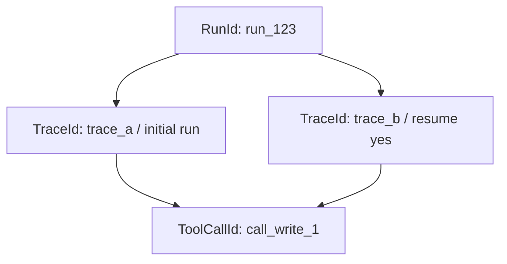

# 第 12 章：结构化 Trace 与可观察性

[上一章：RAG 评测](11-rag-evaluation.md)

## 本章起点与终点

| 项目 | 内容 |
|---|---|
| 起点 | Workflow 只能实时打印，程序退出后难以统计与查询 |
| 终点 | 每段 Run/Resume 都生成 JSONL Trace，记录模型、工具、Token、状态、耗时与错误 |
| 自动化验收 | 131 tests |

## 12.1 日志、Workflow、Trace、Metrics 的区别

| 层 | 回答的问题 | 当前实现 |
|---|---|---|
| Log | 此刻发生了什么文本事件 | Console Debug |
| Workflow | 一次运行经过哪些业务步骤 | `AgentWorkflowTrace` |
| Trace | 一次执行片段中各模型和工具调用如何关联 | `AgentExecutionTrace` |
| Metrics | 大量 Trace 的成功率、P95、费用趋势 | 下一阶段聚合 |

Workflow 不是没用的日志，它提供稳定业务事件；Trace 在此基础上增加执行身份、时间、Token、结果和持久化。

## 12.2 为什么不能只看 Console

控制台可以观察当前运行，却难以回答：

- 昨天有多少运行失败？
- Tool Router 和 Main Agent 各用了多久？
- 一个 Run 总共发了几次模型请求？
- 哪个工具失败最多？
- 暂停后 Resume 是否属于原任务？
- 401 发生在 Router 还是 Main Agent？

结构化数据才能可靠查询这些问题。

## 12.3 RunId、TraceId、ToolCallId

三个 ID 作用不同：

```text
RunId      = 一个完整用户任务，从首次运行贯穿所有 Resume
TraceId    = 一次实际执行片段，每次 Run 或 Resume 都不同
ToolCallId = 模型生成的一次工具请求，与 Tool Result 对应
```



首次运行暂停后，Resume 继续相同 `RunId`，创建新 `TraceId`，并继续处理原 `ToolCallId`。

## 12.4 Trace 完整数据结构

```csharp
public sealed record AgentExecutionTrace(
    int FormatVersion,
    string TraceId,
    string RunId,
    string Operation,
    DateTimeOffset StartedAtUtc,
    DateTimeOffset CompletedAtUtc,
    long DurationMilliseconds,
    string Model,
    int? UserInputLength,
    bool? ApprovalDecision,
    AgentRunOutcome? Outcome,
    AgentRunSnapshot FinalState,
    AgentTokenUsageTotals TokenUsage,
    IReadOnlyList<AgentModelCallTrace> ModelCalls,
    IReadOnlyList<AgentToolCallTrace> ToolCalls,
    IReadOnlyList<AgentWorkflowStepTrace> WorkflowSteps,
    string? Error);
```

`Operation` 为：

- `run`：新用户任务的第一次执行。
- `resume`：从 Checkpoint 恢复的一段执行。

`ApprovalDecision` 只在 Resume 有值。

## 12.5 为什么用 Builder 收集

运行过程中数据逐步产生，结束时才知道最终状态。`AgentExecutionTraceBuilder` 保存可变集合，最后生成不可变 Trace：

```csharp
AgentExecutionTraceBuilder executionTrace = new(
    runId,
    operation: "run",
    _profile.Model,
    userInputLength: userInput.Length);
```

结束：

```csharp
AgentExecutionTrace trace = executionTrace.Build(
    outcome,
    runState.ToSnapshot(),
    workflowTrace.Steps);
```

业务返回值与 Trace 分开：用户得到 `AgentRunResult`，可观察系统得到 `AgentExecutionTrace`。

## 12.6 模型调用统一计时

所有非流式模型请求经过：

```csharp
private async Task<ChatCompletion> CompleteChatWithTraceAsync(
    string stage,
    IReadOnlyList<ChatMessage> messages,
    ChatCompletionOptions? options,
    AgentExecutionTraceBuilder executionTrace)
{
    Stopwatch stopwatch = Stopwatch.StartNew();

    try
    {
        ChatCompletion completion = await _client.CompleteChatAsync(
            messages,
            options);

        executionTrace.RecordModelCall(
            stage,
            stopwatch.Elapsed,
            completion);

        return completion;
    }
    catch (Exception exception)
    {
        executionTrace.RecordModelCall(
            stage,
            stopwatch.Elapsed,
            completion: null,
            exception);

        throw;
    }
}
```

`stage` 区分：

```text
tool_router
main_agent
main_agent_stream
```

因此一次用户请求可以看到各跳耗时，而不是只有总时间。

## 12.7 模型调用记录

```csharp
public sealed record AgentModelCallTrace(
    int Sequence,
    string Stage,
    long DurationMilliseconds,
    bool Succeeded,
    string? FinishReason,
    int? InputTokens,
    int? OutputTokens,
    int? TotalTokens,
    string? Error);
```

Token 来自响应 Usage；某些兼容服务不返回 Usage，因此字段可空，不能把空当作 0 成本。

## 12.8 Token 汇总

```csharp
AgentModelCallTrace[] callsWithUsage = _modelCalls
    .Where(call => call.TotalTokens.HasValue)
    .ToArray();

AgentTokenUsageTotals tokenUsage = new(
    CallsWithUsage: callsWithUsage.Length,
    InputTokens: callsWithUsage.Sum(call => call.InputTokens ?? 0),
    OutputTokens: callsWithUsage.Sum(call => call.OutputTokens ?? 0),
    TotalTokens: callsWithUsage.Sum(call => call.TotalTokens ?? 0));
```

`CallsWithUsage` 让读者知道汇总覆盖了几次调用。

## 12.9 为什么状态计数和 Trace 计数不同

`FinalState.ModelRequestCount` 只统计主 Agent 请求，因为它描述业务状态机。

`Trace.ModelCalls` 记录真实网络模型请求，包括 Tool Router。

```text
State.ModelRequestCount = 2
Trace.ModelCalls.Count   = 3

1 次 Tool Router + 2 次 Main Agent
```

两个数字都正确，只是回答不同问题。不要为了“看起来一致”丢掉 Router 调用。

## 12.10 工具调用计时

每个 Tool Call 记录：

```csharp
public sealed record AgentToolCallTrace(
    int Sequence,
    string ToolName,
    long DurationMilliseconds,
    bool Succeeded,
    string? Error);
```

计时围绕实际 Registry 调用，而不是模型生成 Tool Call 的时间。MCP 工具的网络/进程通信时间也包含在内。

## 12.11 Workflow 只持久化安全字段

实时 Workflow Step 包含 `Detail`，可能含工具结果。持久 Trace 只保留：

```csharp
public sealed record AgentWorkflowStepTrace(
    int Number,
    AgentWorkflowStepKind Kind,
    string Title);
```

转换：

```csharp
WorkflowSteps: workflowSteps
    .Select(step => new AgentWorkflowStepTrace(
        step.Number,
        step.Kind,
        step.Title))
    .ToArray()
```

这就是数据最小化：为了分析路径，不需要保存 Tool Result 原文。

## 12.12 失败也必须发布 Trace

```csharp
try
{
    result = await RunCoreAsync(...);
}
catch (Exception exception)
{
    runState.MarkFailed(exception.Message);
    await PublishFailedExecutionTraceAsync(
        executionTrace,
        workflowTrace,
        runState,
        exception);
    throw;
}
```

若只在成功时落盘，最需要排查的失败运行反而不可见。

若 Agent 运行失败且 Trace Store 也失败，代码抛 `AggregateException`，同时保留两个错误，不用日志故障掩盖业务故障。

## 12.13 JSONL Store

```csharp
public async Task AppendAsync(AgentExecutionTrace trace)
{
    string? directory = Path.GetDirectoryName(_filePath);
    if (!string.IsNullOrWhiteSpace(directory))
    {
        Directory.CreateDirectory(directory);
    }

    string jsonLine = JsonSerializer.Serialize(trace, JsonOptions)
        + Environment.NewLine;

    await _writeLock.WaitAsync();
    try
    {
        await File.AppendAllTextAsync(_filePath, jsonLine);
    }
    finally
    {
        _writeLock.Release();
    }
}
```

`SemaphoreSlim` 防止同一进程内并发 Append 互相穿插。多进程同时写同一个文件仍需要文件锁或集中日志系统。

路径：

```text
memory/traces/agent-runs.jsonl
```

为什么 JSONL：

- 一行一个 Trace。
- 追加写简单。
- 某一行损坏不会让整个数组无法解析。
- `jq`、日志平台和数据管道都容易处理。

## 12.14 Program 只负责连接 Store

```csharp
AgentExecutionTraceStore executionTraceStore = new(executionTracePath);

agentRunner.ExecutionTraceCompletedAsync =
    executionTraceStore.AppendAsync;
```

Runner 不知道 Trace 最终写文件、数据库还是 OpenTelemetry Collector。

## 12.15 隐私边界

Trace 默认不保存：

- 用户消息原文，只保存 `UserInputLength`。
- 工具参数。
- 工具结果。
- System Prompt 原文。
- API Key。

保留：

- 模型名。
- 工具名。
- 状态、次数、耗时、Token。
- 错误信息。

错误信息仍可能包含上游返回的敏感内容。生产接入前还需统一错误清理策略。

## 12.16 真实失败 Trace

最近一次 Router 联调得到 `401 Unauthorized`：

```json
{
  "operation": "run",
  "outcome": null,
  "final_state": {
    "status": "failed",
    "model_request_count": 0
  },
  "model_calls": [
    {
      "stage": "tool_router",
      "succeeded": false,
      "error": "Status: 401 (Unauthorized)"
    }
  ]
}
```

`model_request_count = 0` 且 `stage = tool_router` 证明失败在 Router 第一跳，主 Agent 尚未请求。


## 12.17 确定性完整运行

```bash
dotnet run --project examples/AgentHarnessDemo/AgentHarnessDemo.csproj
```

固定模型响应包含 Usage：

```text
Request #1: 48 tokens, returns calculate Tool Call
Tool: calculate -> 20
Request #2: 58 tokens, returns final answer
Trace total: 106 tokens
```

因此示例同时验证 Workflow、状态、Tool Calling 与 Trace 汇总，无需 Router。

## 12.18 查询 JSONL

最后一行：

```bash
tail -n 1 memory/traces/agent-runs.jsonl | jq
```

只看失败：

```bash
jq -c 'select(.final_state.status == "failed")' \
  memory/traces/agent-runs.jsonl
```

按阶段显示模型耗时：

```bash
jq -r '.model_calls[] | [.stage, .duration_milliseconds, .succeeded] | @tsv' \
  memory/traces/agent-runs.jsonl
```

## 12.19 测试

```bash
dotnet test AgentLearning.sln
```

131 个测试，0 failures。本章新增测试验证：

- 正常运行有 2 次模型调用、1 次 Tool Call。
- Token Usage 汇总为 106。
- 模型异常时仍发布失败 Trace。
- JSONL 每次追加一行合法 JSON。
- Workflow 持久化不包含 `Detail`。
- Run/Resume 使用正确身份字段。

## 12.21 下一阶段

从 JSONL 可以进一步计算：

- Agent 成功率。
- P50 / P95 总耗时。
- Tool Router 与主模型耗时分布。
- Token 趋势与成本。
- 工具调用量和失败率。
- 暂停后恢复成功率。

这些聚合结果才是 Metrics；在此基础上才能配置告警。

<!-- BEGIN SELF-CONTAINED CODE -->
## 本章完整文件代码

这一节是本章的**完整代码依据**。前面的代码用于解释概念；真正动手时，请从上一章完成后的目录继续，并按下表逐项操作。`新建` 表示创建此前不存在的文件，`完整覆盖` 表示把旧文件全部替换成这里的内容。不要只复制局部片段。

> 下面已经包含本章所需的全部新增和变更文件，不需要再查找其他代码文件。

先在项目根目录执行下面的命令，确保本章需要的目录存在：

```bash
mkdir -p examples/AgentHarnessDemo src/AgentLearning.App tests/AgentLearning.Core.Tests
```

### 文件操作清单

| 操作 | 文件 |
|---|---|
| 新建 | `examples/AgentHarnessDemo/AgentHarnessDemo.csproj` |
| 新建 | `examples/AgentHarnessDemo/Program.cs` |
| 新建 | `src/AgentLearning.App/AgentExecutionTrace.cs` |
| 新建 | `src/AgentLearning.App/AgentExecutionTraceBuilder.cs` |
| 新建 | `src/AgentLearning.App/AgentExecutionTraceStore.cs` |
| 新建 | `tests/AgentLearning.Core.Tests/AgentExecutionTraceStoreTests.cs` |
| 新建 | `tests/AgentLearning.Core.Tests/AgentRunnerExecutionTraceTests.cs` |
| 完整覆盖 | `AgentLearning.sln` |
| 完整覆盖 | `src/AgentLearning.App/AgentRunResult.cs` |
| 完整覆盖 | `src/AgentLearning.App/AgentRunner.cs` |
| 完整覆盖 | `src/AgentLearning.App/Program.cs` |

<!-- FILE: ADD examples/AgentHarnessDemo/AgentHarnessDemo.csproj -->
<details>
<summary><strong>新建</strong> <code>examples/AgentHarnessDemo/AgentHarnessDemo.csproj</code></summary>

`````xml
<Project Sdk="Microsoft.NET.Sdk">
  <PropertyGroup>
    <OutputType>Exe</OutputType>
    <TargetFramework>net8.0</TargetFramework>
    <ImplicitUsings>enable</ImplicitUsings>
    <Nullable>enable</Nullable>
  </PropertyGroup>

  <ItemGroup>
    <ProjectReference Include="../../src/AgentLearning.App/AgentLearning.App.csproj" />
  </ItemGroup>
</Project>
`````

</details>
<!-- END FILE -->

<!-- FILE: ADD examples/AgentHarnessDemo/Program.cs -->
<details>
<summary><strong>新建</strong> <code>examples/AgentHarnessDemo/Program.cs</code></summary>

`````csharp
using AgentLearning.App;
using AgentLearning.Core;
using AgentLearning.Core.Skills;
using AgentLearning.Core.Workflow;
using OpenAI.Chat;

string tempDirectory = Path.Combine(
    Path.GetTempPath(),
    $"agent-harness-demo-{Guid.NewGuid():N}");
Directory.CreateDirectory(tempDirectory);

try
{
    AgentProfile profile = CreateProfile();
    DemoChatClient chatClient = new(
        CreateCalculatorToolCall(),
        CreateTextAnswer("The result is 20."));
    AgentRunner runner = new(
        profile,
        chatClient,
        new ChatMemory(),
        Path.Combine(tempDirectory, "memory.json"),
        new AgentSkillRegistry([new CalculatorSkill()]));

    AgentExecutionTrace? executionTrace = null;
    runner.WorkflowStepCreated += step =>
        Console.WriteLine(AgentWorkflowStepFormatter.Format(step));
    runner.ExecutionTraceCompletedAsync = trace =>
    {
        executionTrace = trace;
        return Task.CompletedTask;
    };

    const string userInput = "What is (2 + 3) * 4?";
    Console.WriteLine($"You> {userInput}");

    AgentRunResult result = await runner.RunAsync(userInput);

    Console.WriteLine($"Agent> {result.AssistantReply}");
    Console.WriteLine(
        $"State> {result.FinalState.Status}, "
        + $"model requests={result.FinalState.ModelRequestCount}, "
        + $"tool calls={result.FinalState.ToolCallCount}");
    Console.WriteLine(
        $"Trace> model calls={executionTrace?.ModelCalls.Count}, "
        + $"tool calls={executionTrace?.ToolCalls.Count}, "
        + $"tokens={executionTrace?.TokenUsage.TotalTokens}");
}
finally
{
    Directory.Delete(tempDirectory, recursive: true);
}

static AgentProfile CreateProfile()
{
    return new AgentProfile(
        Name: "Harness Demo",
        Model: "demo-model",
        BaseUrl: "https://example.invalid/v1",
        EmbeddingBaseUrl: "http://127.0.0.1:1234/v1",
        EmbeddingModel: "demo-embedding-model",
        EnvKey: "DEMO_API_KEY",
        WireApi: "chat_completions",
        Stream: false,
        NativeToolCalling: true,
        ToolRouterEnabled: false,
        MaxToolsPerRequest: 1,
        ShowDebugRequests: false,
        ShowWorkflowTrace: true,
        MemoryFile: "memory.json",
        MaxMemoryTurns: 6,
        MaxMemoryContentChars: 2000,
        MaxToolIterations: 3,
        MaxToolResultChars: 1200,
        ToolTimeoutSeconds: 5,
        ApiKey: null,
        Description: "A deterministic Agent Harness demo.",
        Instructions: "Use the calculator when arithmetic is required.");
}

static ChatCompletion CreateCalculatorToolCall()
{
    ChatToolCall toolCall = ChatToolCall.CreateFunctionToolCall(
        "call_calculate_1",
        "calculate",
        BinaryData.FromString("{\"expression\":\"(2 + 3) * 4\"}"));

    return OpenAIChatModelFactory.ChatCompletion(
        "completion_tool_call",
        ChatFinishReason.ToolCalls,
        [],
        null,
        [toolCall],
        ChatMessageRole.Assistant,
        null,
        [],
        [],
        DateTimeOffset.UtcNow,
        "demo-model",
        null,
        OpenAIChatModelFactory.ChatTokenUsage(8, 40, 48, null));
}

static ChatCompletion CreateTextAnswer(string text)
{
    return OpenAIChatModelFactory.ChatCompletion(
        "completion_final_answer",
        ChatFinishReason.Stop,
        [ChatMessageContentPart.CreateTextPart(text)],
        null,
        [],
        ChatMessageRole.Assistant,
        null,
        [],
        [],
        DateTimeOffset.UtcNow,
        "demo-model",
        null,
        OpenAIChatModelFactory.ChatTokenUsage(6, 52, 58, null));
}

sealed class DemoChatClient(params ChatCompletion[] responses) : IAgentChatClient
{
    private readonly Queue<ChatCompletion> _responses = new(responses);

    public Task<ChatCompletion> CompleteChatAsync(
        IReadOnlyList<ChatMessage> messages,
        ChatCompletionOptions? options = null)
    {
        if (_responses.Count == 0)
        {
            throw new InvalidOperationException("The demo has no model response left.");
        }

        return Task.FromResult(_responses.Dequeue());
    }

    public IAsyncEnumerable<StreamingChatCompletionUpdate> CompleteChatStreamingAsync(
        IReadOnlyList<ChatMessage> messages)
    {
        throw new NotSupportedException("The deterministic demo does not use streaming.");
    }
}
`````

</details>
<!-- END FILE -->

<!-- FILE: ADD src/AgentLearning.App/AgentExecutionTrace.cs -->
<details>
<summary><strong>新建</strong> <code>src/AgentLearning.App/AgentExecutionTrace.cs</code></summary>

`````csharp
using AgentLearning.Core.Workflow;

namespace AgentLearning.App;

/// <summary>
/// A structured record for one executable segment of an agent run.
/// A resumed run keeps the same RunId but receives a new TraceId.
/// </summary>
public sealed record AgentExecutionTrace(
    int FormatVersion,
    string TraceId,
    string RunId,
    string Operation,
    DateTimeOffset StartedAtUtc,
    DateTimeOffset CompletedAtUtc,
    long DurationMilliseconds,
    string Model,
    int? UserInputLength,
    bool? ApprovalDecision,
    AgentRunOutcome? Outcome,
    AgentRunSnapshot FinalState,
    AgentTokenUsageTotals TokenUsage,
    IReadOnlyList<AgentModelCallTrace> ModelCalls,
    IReadOnlyList<AgentToolCallTrace> ToolCalls,
    IReadOnlyList<AgentWorkflowStepTrace> WorkflowSteps,
    string? Error);

/// <summary>Token totals from model responses that included usage data.</summary>
public sealed record AgentTokenUsageTotals(
    int CallsWithUsage,
    int InputTokens,
    int OutputTokens,
    int TotalTokens);

/// <summary>Timing, outcome, and optional token usage for one model request.</summary>
public sealed record AgentModelCallTrace(
    int Sequence,
    string Stage,
    long DurationMilliseconds,
    bool Succeeded,
    string? FinishReason,
    int? InputTokens,
    int? OutputTokens,
    int? TotalTokens,
    string? Error);

/// <summary>Timing and outcome for one tool execution.</summary>
public sealed record AgentToolCallTrace(
    int Sequence,
    string ToolName,
    long DurationMilliseconds,
    bool Succeeded,
    string? Error);

/// <summary>A workflow step without message, argument, or tool-result content.</summary>
public sealed record AgentWorkflowStepTrace(
    int Number,
    AgentWorkflowStepKind Kind,
    string Title);
`````

</details>
<!-- END FILE -->

<!-- FILE: ADD src/AgentLearning.App/AgentExecutionTraceBuilder.cs -->
<details>
<summary><strong>新建</strong> <code>src/AgentLearning.App/AgentExecutionTraceBuilder.cs</code></summary>

`````csharp
using AgentLearning.Core.Workflow;
using OpenAI.Chat;
using System.Diagnostics;

namespace AgentLearning.App;

/// <summary>
/// Collects telemetry while AgentRunner is executing and creates one immutable trace at the end.
/// </summary>
internal sealed class AgentExecutionTraceBuilder
{
    private readonly Stopwatch _runStopwatch = Stopwatch.StartNew();
    private readonly List<AgentModelCallTrace> _modelCalls = [];
    private readonly List<AgentToolCallTrace> _toolCalls = [];

    public AgentExecutionTraceBuilder(
        string runId,
        string operation,
        string model,
        int? userInputLength = null,
        bool? approvalDecision = null)
    {
        RunId = runId;
        Operation = operation;
        Model = model;
        UserInputLength = userInputLength;
        ApprovalDecision = approvalDecision;
        TraceId = $"trace_{Guid.NewGuid():N}";
        StartedAtUtc = DateTimeOffset.UtcNow;
    }

    public string TraceId { get; }

    public string RunId { get; }

    public string Operation { get; }

    public string Model { get; }

    public int? UserInputLength { get; }

    public bool? ApprovalDecision { get; }

    public DateTimeOffset StartedAtUtc { get; }

    public void RecordModelCall(
        string stage,
        TimeSpan duration,
        ChatCompletion? completion,
        Exception? error = null)
    {
        ChatTokenUsage? usage = completion?.Usage;
        _modelCalls.Add(new AgentModelCallTrace(
            Sequence: _modelCalls.Count + 1,
            Stage: stage,
            DurationMilliseconds: ToMilliseconds(duration),
            Succeeded: error is null,
            FinishReason: completion?.FinishReason.ToString(),
            InputTokens: usage?.InputTokenCount,
            OutputTokens: usage?.OutputTokenCount,
            TotalTokens: usage?.TotalTokenCount,
            Error: error?.Message));
    }

    public void RecordToolCall(string toolName, TimeSpan duration, Exception? error = null)
    {
        _toolCalls.Add(new AgentToolCallTrace(
            Sequence: _toolCalls.Count + 1,
            ToolName: toolName,
            DurationMilliseconds: ToMilliseconds(duration),
            Succeeded: error is null,
            Error: error?.Message));
    }

    public AgentExecutionTrace Build(
        AgentRunOutcome? outcome,
        AgentRunSnapshot finalState,
        IReadOnlyList<AgentWorkflowStep> workflowSteps,
        Exception? error = null)
    {
        _runStopwatch.Stop();
        DateTimeOffset completedAtUtc = DateTimeOffset.UtcNow;
        AgentModelCallTrace[] callsWithUsage = _modelCalls
            .Where(call => call.TotalTokens.HasValue)
            .ToArray();

        AgentTokenUsageTotals tokenUsage = new(
            CallsWithUsage: callsWithUsage.Length,
            InputTokens: callsWithUsage.Sum(call => call.InputTokens ?? 0),
            OutputTokens: callsWithUsage.Sum(call => call.OutputTokens ?? 0),
            TotalTokens: callsWithUsage.Sum(call => call.TotalTokens ?? 0));

        return new AgentExecutionTrace(
            FormatVersion: 1,
            TraceId,
            RunId,
            Operation,
            StartedAtUtc,
            CompletedAtUtc: completedAtUtc,
            DurationMilliseconds: ToMilliseconds(_runStopwatch.Elapsed),
            Model,
            UserInputLength,
            ApprovalDecision,
            Outcome: outcome,
            FinalState: finalState,
            TokenUsage: tokenUsage,
            ModelCalls: _modelCalls.ToArray(),
            ToolCalls: _toolCalls.ToArray(),
            WorkflowSteps: workflowSteps
                .Select(step => new AgentWorkflowStepTrace(
                    step.Number,
                    step.Kind,
                    step.Title))
                .ToArray(),
            Error: error?.Message);
    }

    private static long ToMilliseconds(TimeSpan duration)
    {
        return Math.Max(0, (long)Math.Round(duration.TotalMilliseconds));
    }
}
`````

</details>
<!-- END FILE -->

<!-- FILE: ADD src/AgentLearning.App/AgentExecutionTraceStore.cs -->
<details>
<summary><strong>新建</strong> <code>src/AgentLearning.App/AgentExecutionTraceStore.cs</code></summary>

`````csharp
using System.Text.Encodings.Web;
using System.Text.Json;
using System.Text.Json.Serialization;

namespace AgentLearning.App;

/// <summary>Appends one compact JSON object per line to an agent trace file.</summary>
public sealed class AgentExecutionTraceStore
{
    private static readonly JsonSerializerOptions JsonOptions = new()
    {
        PropertyNamingPolicy = JsonNamingPolicy.SnakeCaseLower,
        Encoder = JavaScriptEncoder.UnsafeRelaxedJsonEscaping,
        Converters =
        {
            new JsonStringEnumConverter(JsonNamingPolicy.SnakeCaseLower)
        }
    };

    private readonly string _filePath;
    private readonly SemaphoreSlim _writeLock = new(1, 1);

    public AgentExecutionTraceStore(string filePath)
    {
        ArgumentException.ThrowIfNullOrWhiteSpace(filePath);
        _filePath = Path.GetFullPath(filePath);
    }

    public string FilePath => _filePath;

    public async Task AppendAsync(AgentExecutionTrace trace)
    {
        ArgumentNullException.ThrowIfNull(trace);

        string? directory = Path.GetDirectoryName(_filePath);
        if (!string.IsNullOrWhiteSpace(directory))
        {
            Directory.CreateDirectory(directory);
        }

        string jsonLine = JsonSerializer.Serialize(trace, JsonOptions) + Environment.NewLine;
        await _writeLock.WaitAsync();
        try
        {
            await File.AppendAllTextAsync(_filePath, jsonLine);
        }
        finally
        {
            _writeLock.Release();
        }
    }
}
`````

</details>
<!-- END FILE -->

<!-- FILE: ADD tests/AgentLearning.Core.Tests/AgentExecutionTraceStoreTests.cs -->
<details>
<summary><strong>新建</strong> <code>tests/AgentLearning.Core.Tests/AgentExecutionTraceStoreTests.cs</code></summary>

`````csharp
using AgentLearning.App;
using AgentLearning.Core.Workflow;
using System.Text.Json;

namespace AgentLearning.Core.Tests;

public sealed class AgentExecutionTraceStoreTests
{
    [Fact]
    public async Task AppendAsync_writes_one_compact_json_object_per_line()
    {
        string tempDirectory = Path.Combine(
            Path.GetTempPath(),
            $"agent-trace-store-{Guid.NewGuid():N}");
        string tracePath = Path.Combine(tempDirectory, "traces", "agent-runs.jsonl");
        AgentExecutionTraceStore store = new(tracePath);

        try
        {
            await store.AppendAsync(CreateTrace("trace_1", "run_1"));
            await store.AppendAsync(CreateTrace("trace_2", "run_2"));

            string[] lines = await File.ReadAllLinesAsync(tracePath);
            Assert.Equal(2, lines.Length);
            Assert.All(lines, line => Assert.DoesNotContain(Environment.NewLine, line));

            using JsonDocument first = JsonDocument.Parse(lines[0]);
            Assert.Equal("trace_1", first.RootElement.GetProperty("trace_id").GetString());
            Assert.Equal("run_1", first.RootElement.GetProperty("run_id").GetString());
            Assert.Equal("completed", first.RootElement.GetProperty("outcome").GetString());
            Assert.Equal("finished", first.RootElement
                .GetProperty("final_state")
                .GetProperty("status")
                .GetString());
            JsonElement workflowStep = first.RootElement
                .GetProperty("workflow_steps")[0];
            Assert.Equal("Ask model", workflowStep.GetProperty("title").GetString());
            Assert.False(workflowStep.TryGetProperty("detail", out _));
        }
        finally
        {
            if (Directory.Exists(tempDirectory))
            {
                Directory.Delete(tempDirectory, recursive: true);
            }
        }
    }

    private static AgentExecutionTrace CreateTrace(string traceId, string runId)
    {
        DateTimeOffset timestamp = DateTimeOffset.UtcNow;
        AgentRunSnapshot finalState = new(
            AgentRunStatus.Finished,
            ModelRequestCount: 1,
            ToolCallCount: 0,
            LastToolName: null,
            WaitingForApproval: false,
            LastError: null);

        return new AgentExecutionTrace(
            FormatVersion: 1,
            traceId,
            runId,
            Operation: "run",
            StartedAtUtc: timestamp,
            CompletedAtUtc: timestamp,
            DurationMilliseconds: 12,
            Model: "test-model",
            UserInputLength: 5,
            ApprovalDecision: null,
            Outcome: AgentRunOutcome.Completed,
            FinalState: finalState,
            TokenUsage: new AgentTokenUsageTotals(1, 8, 4, 12),
            ModelCalls: [],
            ToolCalls: [],
            WorkflowSteps:
            [
                new AgentWorkflowStepTrace(
                    Number: 1,
                    AgentWorkflowStepKind.AskModel,
                    Title: "Ask model")
            ],
            Error: null);
    }
}
`````

</details>
<!-- END FILE -->

<!-- FILE: ADD tests/AgentLearning.Core.Tests/AgentRunnerExecutionTraceTests.cs -->
<details>
<summary><strong>新建</strong> <code>tests/AgentLearning.Core.Tests/AgentRunnerExecutionTraceTests.cs</code></summary>

`````csharp
using AgentLearning.App;
using AgentLearning.Core.Skills;
using AgentLearning.Core.Workflow;
using OpenAI.Chat;

namespace AgentLearning.Core.Tests;

public sealed class AgentRunnerExecutionTraceTests
{
    [Fact]
    public async Task RunAsync_publishes_model_tool_and_token_telemetry()
    {
        string tempDirectory = CreateTempDirectory();
        FakeAgentChatClient chatClient = new(
            CreateToolCallCompletion(),
            CreateTextCompletion("The result is 4."));
        AgentRunner runner = new(
            CreateProfile(),
            chatClient,
            new ChatMemory(),
            Path.Combine(tempDirectory, "memory.json"),
            new AgentSkillRegistry([new CalculatorSkill()]));
        AgentExecutionTrace? capturedTrace = null;
        runner.ExecutionTraceCompletedAsync = trace =>
        {
            capturedTrace = trace;
            return Task.CompletedTask;
        };

        try
        {
            AgentRunResult result = await runner.RunAsync("What is 2 + 2?");

            AgentExecutionTrace trace = Assert.IsType<AgentExecutionTrace>(capturedTrace);
            Assert.Equal(result.RunId, trace.RunId);
            Assert.StartsWith("trace_", trace.TraceId, StringComparison.Ordinal);
            Assert.Equal("run", trace.Operation);
            Assert.Equal(AgentRunOutcome.Completed, trace.Outcome);
            Assert.Equal(AgentRunStatus.Finished, trace.FinalState.Status);
            Assert.Equal(2, trace.ModelCalls.Count);
            Assert.All(trace.ModelCalls, call => Assert.Equal("main_agent", call.Stage));
            Assert.All(trace.ModelCalls, call => Assert.True(call.Succeeded));
            Assert.Equal(2, trace.TokenUsage.CallsWithUsage);
            Assert.Equal(18, trace.TokenUsage.InputTokens);
            Assert.Equal(7, trace.TokenUsage.OutputTokens);
            Assert.Equal(25, trace.TokenUsage.TotalTokens);

            AgentToolCallTrace toolCall = Assert.Single(trace.ToolCalls);
            Assert.Equal("calculate", toolCall.ToolName);
            Assert.True(toolCall.Succeeded);
            Assert.Null(toolCall.Error);
            Assert.All(trace.WorkflowSteps, step => Assert.False(string.IsNullOrWhiteSpace(step.Title)));
        }
        finally
        {
            Directory.Delete(tempDirectory, recursive: true);
        }
    }

    [Fact]
    public async Task RunAsync_publishes_a_failed_trace_when_the_model_request_throws()
    {
        string tempDirectory = CreateTempDirectory();
        AgentRunner runner = new(
            CreateProfile(),
            new ThrowingAgentChatClient(),
            new ChatMemory(),
            Path.Combine(tempDirectory, "memory.json"),
            new AgentSkillRegistry([]));
        AgentExecutionTrace? capturedTrace = null;
        runner.ExecutionTraceCompletedAsync = trace =>
        {
            capturedTrace = trace;
            return Task.CompletedTask;
        };

        try
        {
            HttpRequestException exception = await Assert.ThrowsAsync<HttpRequestException>(
                () => runner.RunAsync("Hello"));

            Assert.Equal("Router unavailable.", exception.Message);
            AgentExecutionTrace trace = Assert.IsType<AgentExecutionTrace>(capturedTrace);
            Assert.Null(trace.Outcome);
            Assert.Equal(AgentRunStatus.Failed, trace.FinalState.Status);
            Assert.Equal("Router unavailable.", trace.Error);
            AgentModelCallTrace modelCall = Assert.Single(trace.ModelCalls);
            Assert.False(modelCall.Succeeded);
            Assert.Equal("Router unavailable.", modelCall.Error);
        }
        finally
        {
            Directory.Delete(tempDirectory, recursive: true);
        }
    }

    private static AgentProfile CreateProfile()
    {
        return new AgentProfile(
            Name: "Test Agent",
            Model: "test-model",
            BaseUrl: "https://example.test/v1",
            EmbeddingBaseUrl: "http://127.0.0.1:1234/v1",
            EmbeddingModel: "test-embedding-model",
            EnvKey: "TEST_API_KEY",
            WireApi: "chat_completions",
            Stream: false,
            NativeToolCalling: true,
            ToolRouterEnabled: false,
            MaxToolsPerRequest: 2,
            ShowDebugRequests: false,
            ShowWorkflowTrace: false,
            MemoryFile: "memory.json",
            MaxMemoryTurns: 6,
            MaxMemoryContentChars: 2000,
            MaxToolIterations: 3,
            MaxToolResultChars: 1200,
            ToolTimeoutSeconds: 5,
            ApiKey: "test-key",
            Description: "Test agent.",
            Instructions: "Answer briefly.");
    }

    private static ChatCompletion CreateToolCallCompletion()
    {
        ChatToolCall toolCall = ChatToolCall.CreateFunctionToolCall(
            "call_calculate",
            "calculate",
            BinaryData.FromString("{\"expression\":\"2 + 2\"}"));
        return OpenAIChatModelFactory.ChatCompletion(
            "chatcmpl_tool",
            ChatFinishReason.ToolCalls,
            [],
            null,
            [toolCall],
            ChatMessageRole.Assistant,
            null,
            [],
            [],
            DateTimeOffset.UtcNow,
            "test-model",
            null,
            OpenAIChatModelFactory.ChatTokenUsage(3, 8, 11, null));
    }

    private static ChatCompletion CreateTextCompletion(string text)
    {
        return OpenAIChatModelFactory.ChatCompletion(
            "chatcmpl_answer",
            ChatFinishReason.Stop,
            [ChatMessageContentPart.CreateTextPart(text)],
            null,
            [],
            ChatMessageRole.Assistant,
            null,
            [],
            [],
            DateTimeOffset.UtcNow,
            "test-model",
            null,
            OpenAIChatModelFactory.ChatTokenUsage(4, 10, 14, null));
    }

    private static string CreateTempDirectory()
    {
        string tempDirectory = Path.Combine(
            Path.GetTempPath(),
            $"agent-runner-trace-{Guid.NewGuid():N}");
        Directory.CreateDirectory(tempDirectory);
        return tempDirectory;
    }

    private sealed class FakeAgentChatClient(params ChatCompletion[] responses) : IAgentChatClient
    {
        private readonly Queue<ChatCompletion> _responses = new(responses);

        public Task<ChatCompletion> CompleteChatAsync(
            IReadOnlyList<ChatMessage> messages,
            ChatCompletionOptions? options = null)
        {
            return Task.FromResult(_responses.Dequeue());
        }

        public IAsyncEnumerable<StreamingChatCompletionUpdate> CompleteChatStreamingAsync(
            IReadOnlyList<ChatMessage> messages)
        {
            throw new NotSupportedException("Streaming is not used by this test.");
        }
    }

    private sealed class ThrowingAgentChatClient : IAgentChatClient
    {
        public Task<ChatCompletion> CompleteChatAsync(
            IReadOnlyList<ChatMessage> messages,
            ChatCompletionOptions? options = null)
        {
            throw new HttpRequestException("Router unavailable.");
        }

        public IAsyncEnumerable<StreamingChatCompletionUpdate> CompleteChatStreamingAsync(
            IReadOnlyList<ChatMessage> messages)
        {
            throw new NotSupportedException("Streaming is not used by this test.");
        }
    }
}
`````

</details>
<!-- END FILE -->

<!-- FILE: REPLACE AgentLearning.sln -->
<details>
<summary><strong>完整覆盖</strong> <code>AgentLearning.sln</code></summary>

`````text

Microsoft Visual Studio Solution File, Format Version 12.00
# Visual Studio Version 17
VisualStudioVersion = 17.0.31903.59
MinimumVisualStudioVersion = 10.0.40219.1
Project("{2150E333-8FDC-42A3-9474-1A3956D46DE8}") = "src", "src", "{827E0CD3-B72D-47B6-A68D-7590B98EB39B}"
EndProject
Project("{FAE04EC0-301F-11D3-BF4B-00C04F79EFBC}") = "AgentLearning.App", "src\AgentLearning.App\AgentLearning.App.csproj", "{2879E30F-C422-4DDE-BF83-5E485002EC3B}"
EndProject
Project("{2150E333-8FDC-42A3-9474-1A3956D46DE8}") = "tests", "tests", "{0AB3BF05-4346-4AA6-1389-037BE0695223}"
EndProject
Project("{FAE04EC0-301F-11D3-BF4B-00C04F79EFBC}") = "AgentLearning.Core.Tests", "tests\AgentLearning.Core.Tests\AgentLearning.Core.Tests.csproj", "{36E36975-E72D-4819-B439-D6B61B749D83}"
EndProject
Project("{FAE04EC0-301F-11D3-BF4B-00C04F79EFBC}") = "AgentLearning.Core", "src\AgentLearning.Core\AgentLearning.Core.csproj", "{C4A85CBC-FD8B-4CF8-814F-1C7F511110EF}"
EndProject
Project("{FAE04EC0-301F-11D3-BF4B-00C04F79EFBC}") = "AgentLearning.McpServer", "src\AgentLearning.McpServer\AgentLearning.McpServer.csproj", "{662AF317-0A82-4F02-8076-5FDBA7B87C53}"
EndProject
Project("{2150E333-8FDC-42A3-9474-1A3956D46DE8}") = "examples", "examples", "{B36A84DF-456D-A817-6EDD-3EC3E7F6E11F}"
EndProject
Project("{FAE04EC0-301F-11D3-BF4B-00C04F79EFBC}") = "AgentHarnessDemo", "examples\AgentHarnessDemo\AgentHarnessDemo.csproj", "{71EE1243-AA7A-48C3-93FA-21E83487FD10}"
EndProject
Global
	GlobalSection(SolutionConfigurationPlatforms) = preSolution
		Debug|Any CPU = Debug|Any CPU
		Debug|x64 = Debug|x64
		Debug|x86 = Debug|x86
		Release|Any CPU = Release|Any CPU
		Release|x64 = Release|x64
		Release|x86 = Release|x86
	EndGlobalSection
	GlobalSection(ProjectConfigurationPlatforms) = postSolution
		{2879E30F-C422-4DDE-BF83-5E485002EC3B}.Debug|Any CPU.ActiveCfg = Debug|Any CPU
		{2879E30F-C422-4DDE-BF83-5E485002EC3B}.Debug|Any CPU.Build.0 = Debug|Any CPU
		{2879E30F-C422-4DDE-BF83-5E485002EC3B}.Debug|x64.ActiveCfg = Debug|Any CPU
		{2879E30F-C422-4DDE-BF83-5E485002EC3B}.Debug|x64.Build.0 = Debug|Any CPU
		{2879E30F-C422-4DDE-BF83-5E485002EC3B}.Debug|x86.ActiveCfg = Debug|Any CPU
		{2879E30F-C422-4DDE-BF83-5E485002EC3B}.Debug|x86.Build.0 = Debug|Any CPU
		{2879E30F-C422-4DDE-BF83-5E485002EC3B}.Release|Any CPU.ActiveCfg = Release|Any CPU
		{2879E30F-C422-4DDE-BF83-5E485002EC3B}.Release|Any CPU.Build.0 = Release|Any CPU
		{2879E30F-C422-4DDE-BF83-5E485002EC3B}.Release|x64.ActiveCfg = Release|Any CPU
		{2879E30F-C422-4DDE-BF83-5E485002EC3B}.Release|x64.Build.0 = Release|Any CPU
		{2879E30F-C422-4DDE-BF83-5E485002EC3B}.Release|x86.ActiveCfg = Release|Any CPU
		{2879E30F-C422-4DDE-BF83-5E485002EC3B}.Release|x86.Build.0 = Release|Any CPU
		{36E36975-E72D-4819-B439-D6B61B749D83}.Debug|Any CPU.ActiveCfg = Debug|Any CPU
		{36E36975-E72D-4819-B439-D6B61B749D83}.Debug|Any CPU.Build.0 = Debug|Any CPU
		{36E36975-E72D-4819-B439-D6B61B749D83}.Debug|x64.ActiveCfg = Debug|Any CPU
		{36E36975-E72D-4819-B439-D6B61B749D83}.Debug|x64.Build.0 = Debug|Any CPU
		{36E36975-E72D-4819-B439-D6B61B749D83}.Debug|x86.ActiveCfg = Debug|Any CPU
		{36E36975-E72D-4819-B439-D6B61B749D83}.Debug|x86.Build.0 = Debug|Any CPU
		{36E36975-E72D-4819-B439-D6B61B749D83}.Release|Any CPU.ActiveCfg = Release|Any CPU
		{36E36975-E72D-4819-B439-D6B61B749D83}.Release|Any CPU.Build.0 = Release|Any CPU
		{36E36975-E72D-4819-B439-D6B61B749D83}.Release|x64.ActiveCfg = Release|Any CPU
		{36E36975-E72D-4819-B439-D6B61B749D83}.Release|x64.Build.0 = Release|Any CPU
		{36E36975-E72D-4819-B439-D6B61B749D83}.Release|x86.ActiveCfg = Release|Any CPU
		{36E36975-E72D-4819-B439-D6B61B749D83}.Release|x86.Build.0 = Release|Any CPU
		{C4A85CBC-FD8B-4CF8-814F-1C7F511110EF}.Debug|Any CPU.ActiveCfg = Debug|Any CPU
		{C4A85CBC-FD8B-4CF8-814F-1C7F511110EF}.Debug|Any CPU.Build.0 = Debug|Any CPU
		{C4A85CBC-FD8B-4CF8-814F-1C7F511110EF}.Debug|x64.ActiveCfg = Debug|Any CPU
		{C4A85CBC-FD8B-4CF8-814F-1C7F511110EF}.Debug|x64.Build.0 = Debug|Any CPU
		{C4A85CBC-FD8B-4CF8-814F-1C7F511110EF}.Debug|x86.ActiveCfg = Debug|Any CPU
		{C4A85CBC-FD8B-4CF8-814F-1C7F511110EF}.Debug|x86.Build.0 = Debug|Any CPU
		{C4A85CBC-FD8B-4CF8-814F-1C7F511110EF}.Release|Any CPU.ActiveCfg = Release|Any CPU
		{C4A85CBC-FD8B-4CF8-814F-1C7F511110EF}.Release|Any CPU.Build.0 = Release|Any CPU
		{C4A85CBC-FD8B-4CF8-814F-1C7F511110EF}.Release|x64.ActiveCfg = Release|Any CPU
		{C4A85CBC-FD8B-4CF8-814F-1C7F511110EF}.Release|x64.Build.0 = Release|Any CPU
		{C4A85CBC-FD8B-4CF8-814F-1C7F511110EF}.Release|x86.ActiveCfg = Release|Any CPU
		{C4A85CBC-FD8B-4CF8-814F-1C7F511110EF}.Release|x86.Build.0 = Release|Any CPU
		{662AF317-0A82-4F02-8076-5FDBA7B87C53}.Debug|Any CPU.ActiveCfg = Debug|Any CPU
		{662AF317-0A82-4F02-8076-5FDBA7B87C53}.Debug|Any CPU.Build.0 = Debug|Any CPU
		{662AF317-0A82-4F02-8076-5FDBA7B87C53}.Debug|x64.ActiveCfg = Debug|Any CPU
		{662AF317-0A82-4F02-8076-5FDBA7B87C53}.Debug|x64.Build.0 = Debug|Any CPU
		{662AF317-0A82-4F02-8076-5FDBA7B87C53}.Debug|x86.ActiveCfg = Debug|Any CPU
		{662AF317-0A82-4F02-8076-5FDBA7B87C53}.Debug|x86.Build.0 = Debug|Any CPU
		{662AF317-0A82-4F02-8076-5FDBA7B87C53}.Release|Any CPU.ActiveCfg = Release|Any CPU
		{662AF317-0A82-4F02-8076-5FDBA7B87C53}.Release|Any CPU.Build.0 = Release|Any CPU
		{662AF317-0A82-4F02-8076-5FDBA7B87C53}.Release|x64.ActiveCfg = Release|Any CPU
		{662AF317-0A82-4F02-8076-5FDBA7B87C53}.Release|x64.Build.0 = Release|Any CPU
		{662AF317-0A82-4F02-8076-5FDBA7B87C53}.Release|x86.ActiveCfg = Release|Any CPU
		{662AF317-0A82-4F02-8076-5FDBA7B87C53}.Release|x86.Build.0 = Release|Any CPU
		{71EE1243-AA7A-48C3-93FA-21E83487FD10}.Debug|Any CPU.ActiveCfg = Debug|Any CPU
		{71EE1243-AA7A-48C3-93FA-21E83487FD10}.Debug|Any CPU.Build.0 = Debug|Any CPU
		{71EE1243-AA7A-48C3-93FA-21E83487FD10}.Debug|x64.ActiveCfg = Debug|Any CPU
		{71EE1243-AA7A-48C3-93FA-21E83487FD10}.Debug|x64.Build.0 = Debug|Any CPU
		{71EE1243-AA7A-48C3-93FA-21E83487FD10}.Debug|x86.ActiveCfg = Debug|Any CPU
		{71EE1243-AA7A-48C3-93FA-21E83487FD10}.Debug|x86.Build.0 = Debug|Any CPU
		{71EE1243-AA7A-48C3-93FA-21E83487FD10}.Release|Any CPU.ActiveCfg = Release|Any CPU
		{71EE1243-AA7A-48C3-93FA-21E83487FD10}.Release|Any CPU.Build.0 = Release|Any CPU
		{71EE1243-AA7A-48C3-93FA-21E83487FD10}.Release|x64.ActiveCfg = Release|Any CPU
		{71EE1243-AA7A-48C3-93FA-21E83487FD10}.Release|x64.Build.0 = Release|Any CPU
		{71EE1243-AA7A-48C3-93FA-21E83487FD10}.Release|x86.ActiveCfg = Release|Any CPU
		{71EE1243-AA7A-48C3-93FA-21E83487FD10}.Release|x86.Build.0 = Release|Any CPU
	EndGlobalSection
	GlobalSection(SolutionProperties) = preSolution
		HideSolutionNode = FALSE
	EndGlobalSection
	GlobalSection(NestedProjects) = preSolution
		{2879E30F-C422-4DDE-BF83-5E485002EC3B} = {827E0CD3-B72D-47B6-A68D-7590B98EB39B}
		{36E36975-E72D-4819-B439-D6B61B749D83} = {0AB3BF05-4346-4AA6-1389-037BE0695223}
		{C4A85CBC-FD8B-4CF8-814F-1C7F511110EF} = {827E0CD3-B72D-47B6-A68D-7590B98EB39B}
		{662AF317-0A82-4F02-8076-5FDBA7B87C53} = {827E0CD3-B72D-47B6-A68D-7590B98EB39B}
		{71EE1243-AA7A-48C3-93FA-21E83487FD10} = {B36A84DF-456D-A817-6EDD-3EC3E7F6E11F}
	EndGlobalSection
EndGlobal
`````

</details>
<!-- END FILE -->

<!-- FILE: REPLACE src/AgentLearning.App/AgentRunResult.cs -->
<details>
<summary><strong>完整覆盖</strong> <code>src/AgentLearning.App/AgentRunResult.cs</code></summary>

`````csharp
using AgentLearning.Core;
using AgentLearning.Core.Workflow;

namespace AgentLearning.App;

/// <summary>
/// The externally visible result of one agent run.
/// </summary>
public sealed record AgentRunResult(
    string RunId,
    AgentRunOutcome Outcome,
    string? AssistantReply,
    AgentToolConfirmationRequest? PendingApproval,
    AgentWorkflowTrace WorkflowTrace,
    AgentRunSnapshot FinalState);
`````

</details>
<!-- END FILE -->

<!-- FILE: REPLACE src/AgentLearning.App/AgentRunner.cs -->
<details>
<summary><strong>完整覆盖</strong> <code>src/AgentLearning.App/AgentRunner.cs</code></summary>

`````csharp
using AgentLearning.Core;
using AgentLearning.Core.Diagnostics;
using AgentLearning.Core.Skills;
using AgentLearning.Core.Workflow;
using OpenAI.Chat;
using System.Diagnostics;
using System.Text;

namespace AgentLearning.App;

/// <summary>
/// Agent 的运行骨架。
/// 它把“记忆、上下文、模型调用、工具调用、工具观察、最终回答”放进一个可控循环里。
/// </summary>
public sealed class AgentRunner
{
    private const int MaximumCitationRepairAttempts = 1;

    private readonly AgentProfile _profile;
    private readonly IAgentChatClient _client;
    private readonly ChatMemory _memory;
    private readonly string _memoryPath;
    private readonly AgentSkillRegistry _skillRegistry;

    public AgentRunner(
        AgentProfile profile,
        ChatClient client,
        ChatMemory memory,
        string memoryPath,
        AgentSkillRegistry skillRegistry)
        : this(profile, new OpenAIChatClientAdapter(client), memory, memoryPath, skillRegistry)
    {
    }

    public AgentRunner(
        AgentProfile profile,
        IAgentChatClient client,
        ChatMemory memory,
        string memoryPath,
        AgentSkillRegistry skillRegistry)
    {
        _profile = profile;
        _client = client;
        _memory = memory;
        _memoryPath = memoryPath;
        _skillRegistry = skillRegistry;
    }

    /// <summary>创建工作流步骤时触发，Program.cs 可以选择打印到控制台。</summary>
    public event Action<AgentWorkflowStep>? WorkflowStepCreated;

    /// <summary>创建调试文本时触发，Program.cs 可以选择打印到控制台。</summary>
    public event Action<string>? DebugMessageCreated;

    /// <summary>Agent 运行状态变化时触发，Program.cs 可以选择展示给用户或 UI。</summary>
    public event Action<AgentRunSnapshot>? StateChanged;

    /// <summary>Raised when the runner creates or updates a checkpoint.</summary>
    public Func<AgentRunCheckpoint, Task>? CheckpointCreatedAsync { get; set; }

    /// <summary>Raised when a checkpoint is fully completed and can be removed.</summary>
    public Func<AgentRunCheckpoint, Task>? CheckpointConsumedAsync { get; set; }

    /// <summary>Raised once when a run or resume segment completes, pauses, or fails.</summary>
    public Func<AgentExecutionTrace, Task>? ExecutionTraceCompletedAsync { get; set; }

    /// <summary>
    /// 运行一轮 Agent。
    /// 这里是 Harness 的核心：模型可以决定调用工具，但循环边界和记忆保存由代码控制。
    /// </summary>
    public async Task<AgentRunResult> RunAsync(string userInput)
    {
        if (string.IsNullOrWhiteSpace(userInput))
        {
            throw new ArgumentException("User input cannot be empty.", nameof(userInput));
        }

        AgentWorkflowTrace workflowTrace = new();
        AgentRunState runState = new();
        string runId = $"run_{Guid.NewGuid():N}";
        AgentExecutionTraceBuilder executionTrace = new(
            runId,
            operation: "run",
            _profile.Model,
            userInputLength: userInput.Length);

        AgentRunResult result;
        try
        {
            result = await RunCoreAsync(
                runId,
                userInput,
                workflowTrace,
                runState,
                executionTrace);
        }
        catch (Exception exception)
        {
            runState.MarkFailed(exception.Message);
            await PublishFailedExecutionTraceAsync(executionTrace, workflowTrace, runState, exception);
            throw;
        }

        await PublishExecutionTraceAsync(executionTrace, result.Outcome, workflowTrace, runState);
        return result;
    }

    private async Task<AgentRunResult> RunCoreAsync(
        string runId,
        string userInput,
        AgentWorkflowTrace workflowTrace,
        AgentRunState runState,
        AgentExecutionTraceBuilder executionTrace)
    {

        AgentMemoryWritePolicy memoryWritePolicy = new(_profile.MaxMemoryContentChars);
        bool shouldSaveUserInput = memoryWritePolicy.ShouldWrite(userInput);

        AddWorkflowStep(
            workflowTrace,
            runState,
            AgentWorkflowStepKind.ReceiveInput,
            "Receive user input",
            shouldSaveUserInput
                ? "User message is eligible for memory."
                : "User message will only be used in this turn.");

        IReadOnlyList<ChatTurn> contextTurns = ChatMemoryWindow.GetRecentTurns(_memory, _profile.MaxMemoryTurns);
        AddWorkflowStep(
            workflowTrace,
            runState,
            AgentWorkflowStepKind.BuildContext,
            "Build context window",
            $"Sending {contextTurns.Count} of {_memory.Turns.Count} saved memory turns plus current input.");

        List<ChatMessage> messages = BuildMessages(contextTurns);
        List<AgentDebugMessage> debugMessages = BuildDebugMessages(contextTurns);
        AddCurrentUserInput(messages, debugMessages, userInput);

        AgentLoopResult loopResult = _profile.Stream
            ? AgentLoopResult.Completed(await CompleteStreamingAsync(messages, executionTrace))
            : await CompleteOnceAsync(
                runId,
                userInput,
                messages,
                debugMessages,
                workflowTrace,
                runState,
                executionTrace);

        if (loopResult.PendingApproval is not null)
        {
            return new AgentRunResult(
                runId,
                AgentRunOutcome.WaitingForApproval,
                AssistantReply: null,
                loopResult.PendingApproval,
                workflowTrace,
                runState.ToSnapshot());
        }

        string assistantReply = loopResult.AssistantReply
            ?? throw new InvalidOperationException("A completed agent run must contain an assistant reply.");

        if (string.IsNullOrWhiteSpace(assistantReply))
        {
            throw new InvalidOperationException("The model returned no text content.");
        }

        AddWorkflowStep(
            workflowTrace,
            runState,
            AgentWorkflowStepKind.Finish,
            "Finish",
            "Final answer was produced.");

        bool shouldSaveAssistantReply = memoryWritePolicy.ShouldWrite(assistantReply);
        if (shouldSaveUserInput && shouldSaveAssistantReply)
        {
            _memory.AddUserMessage(userInput);
            _memory.AddAssistantMessage(assistantReply);
            await ChatMemoryStore.SaveAsync(_memoryPath, _memory);
        }

        return new AgentRunResult(
            runId,
            AgentRunOutcome.Completed,
            assistantReply,
            PendingApproval: null,
            workflowTrace,
            runState.ToSnapshot());
    }

    /// <summary>
    /// Resume a run from a checkpoint and continue through the normal model/tool loop.
    /// </summary>
    public async Task<AgentRunResult> ResumeAsync(AgentRunCheckpoint checkpoint, bool approved)
    {
        ArgumentNullException.ThrowIfNull(checkpoint);

        if (checkpoint.Kind == AgentCheckpointKind.PendingToolApproval && CheckpointCreatedAsync is null)
        {
            throw new InvalidOperationException(
                "A checkpoint persistence handler is required before a pending tool can be resumed.");
        }

        AgentWorkflowTrace workflowTrace = new();
        AgentRunState runState = new();
        AgentExecutionTraceBuilder executionTrace = new(
            checkpoint.RunId,
            operation: "resume",
            _profile.Model,
            approvalDecision: approved);

        AgentRunResult result;
        try
        {
            result = await ResumeCoreAsync(
                checkpoint,
                approved,
                workflowTrace,
                runState,
                executionTrace);
        }
        catch (Exception exception)
        {
            runState.MarkFailed(exception.Message);
            await PublishFailedExecutionTraceAsync(executionTrace, workflowTrace, runState, exception);
            throw;
        }

        await PublishExecutionTraceAsync(executionTrace, result.Outcome, workflowTrace, runState);
        return result;
    }

    private async Task<AgentRunResult> ResumeCoreAsync(
        AgentRunCheckpoint checkpoint,
        bool approved,
        AgentWorkflowTrace workflowTrace,
        AgentRunState runState,
        AgentExecutionTraceBuilder executionTrace)
    {

        Stopwatch resumeToolStopwatch = Stopwatch.StartNew();
        AgentCheckpointResumeResult resumeResult;
        try
        {
            resumeResult = await AgentCheckpointResumer.ResumeAsync(
                checkpoint,
                approved,
                _skillRegistry);
            if (checkpoint.Kind == AgentCheckpointKind.PendingToolApproval
                && resumeResult.ToolExecuted)
            {
                executionTrace.RecordToolCall(
                    resumeResult.ToolName,
                    resumeToolStopwatch.Elapsed);
            }
        }
        catch (Exception exception)
        {
            string toolName = checkpoint.PendingApproval?.ToolName
                ?? checkpoint.ResolvedTool?.ToolName
                ?? "unknown";
            executionTrace.RecordToolCall(toolName, resumeToolStopwatch.Elapsed, exception);
            throw;
        }

        AddWorkflowStep(
            workflowTrace,
            runState,
            resumeResult.ToolExecuted
                ? AgentWorkflowStepKind.ToolExecuted
                : AgentWorkflowStepKind.ToolRejected,
            resumeResult.ToolExecuted ? "Resume approved tool" : "Resume rejected tool",
            resumeResult.Observation,
            toolName: resumeResult.ToolName);

        AgentRunCheckpoint checkpointToConsume = checkpoint;
        if (checkpoint.Kind == AgentCheckpointKind.PendingToolApproval)
        {
            checkpointToConsume = await SaveToolResolvedCheckpointAsync(
                checkpoint,
                resumeResult,
                runState);
        }

        List<ChatMessage> messages = BuildResumeMessages(checkpoint.Messages);
        List<AgentDebugMessage> debugMessages = BuildResumeDebugMessages(checkpoint.Messages);

        // The restored tool observation must match the assistant tool_call_id in the checkpoint.
        messages.Add(new ToolChatMessage(resumeResult.ToolCallId, resumeResult.Observation));
        debugMessages.Add(new AgentDebugMessage
        {
            Role = "tool",
            ToolCallId = resumeResult.ToolCallId,
            Content = resumeResult.Observation
        });

        IReadOnlyList<IAgentSkill> selectedSkills = ResolveSelectedSkills(checkpoint.SelectedToolNames);
        ChatCompletionOptions? options = selectedSkills.Count > 0
            ? BuildChatOptions(selectedSkills)
            : null;

        AgentLoopResult loopResult = await CompleteToolLoopAsync(
            checkpoint.RunId,
            messages,
            debugMessages,
            selectedSkills,
            options,
            workflowTrace,
            runState,
            executionTrace);

        if (loopResult.PendingApproval is not null)
        {
            return new AgentRunResult(
                checkpoint.RunId,
                AgentRunOutcome.WaitingForApproval,
                AssistantReply: null,
                loopResult.PendingApproval,
                workflowTrace,
                runState.ToSnapshot());
        }

        string assistantReply = loopResult.AssistantReply
            ?? throw new InvalidOperationException("A completed resumed run must contain an assistant reply.");

        AddWorkflowStep(
            workflowTrace,
            runState,
            AgentWorkflowStepKind.Finish,
            "Finish",
            "Final answer was produced after resume.");

        await TrySaveResumedMemoryAsync(checkpoint, assistantReply);

        if (CheckpointConsumedAsync is not null)
        {
            await CheckpointConsumedAsync(checkpointToConsume);
        }

        return new AgentRunResult(
            checkpoint.RunId,
            AgentRunOutcome.Completed,
            assistantReply,
            PendingApproval: null,
            workflowTrace,
            runState.ToSnapshot());
    }

    private async Task<AgentRunCheckpoint> SaveToolResolvedCheckpointAsync(
        AgentRunCheckpoint sourceCheckpoint,
        AgentCheckpointResumeResult resumeResult,
        AgentRunState runState)
    {
        AgentRunCheckpoint resolvedCheckpoint = AgentRunCheckpoint.CreateToolResolved(
            sourceCheckpoint.RunId,
            DateTimeOffset.Now,
            runState.ToSnapshot(),
            sourceCheckpoint.Messages,
            sourceCheckpoint.SelectedToolNames,
            ResolvedToolCall.FromResumeResult(resumeResult));

        Func<AgentRunCheckpoint, Task> checkpointHandler = CheckpointCreatedAsync
            ?? throw new InvalidOperationException("A checkpoint persistence handler is required during resume.");
        await checkpointHandler(resolvedCheckpoint);

        return resolvedCheckpoint;
    }

    private async Task<AgentLoopResult> CompleteOnceAsync(
        string runId,
        string userInput,
        List<ChatMessage> messages,
        List<AgentDebugMessage> debugMessages,
        AgentWorkflowTrace workflowTrace,
        AgentRunState runState,
        AgentExecutionTraceBuilder executionTrace)
    {
        // native_tool_calling 打开时，先让 AI Tool Router 从轻量目录里选工具。
        // 主 Agent 只会收到被选中的工具完整 Schema。
        IReadOnlyList<IAgentSkill> selectedSkills = await SelectSkillsForCurrentTurnAsync(
            userInput,
            workflowTrace,
            runState,
            executionTrace);
        ChatCompletionOptions? options = selectedSkills.Count > 0
            ? BuildChatOptions(selectedSkills)
            : null;

        return await CompleteToolLoopAsync(
            runId,
            messages,
            debugMessages,
            selectedSkills,
            options,
            workflowTrace,
            runState,
            executionTrace);
    }

    private async Task<AgentLoopResult> CompleteToolLoopAsync(
        string runId,
        List<ChatMessage> messages,
        List<AgentDebugMessage> debugMessages,
        IReadOnlyList<IAgentSkill> selectedSkills,
        ChatCompletionOptions? options,
        AgentWorkflowTrace workflowTrace,
        AgentRunState runState,
        AgentExecutionTraceBuilder executionTrace)
    {
        AgentToolIterationGuard toolIterationGuard = new(_profile.MaxToolIterations);
        AgentToolResultLimiter toolResultLimiter = new(_profile.MaxToolResultChars);
        AgentToolTimeoutRunner toolTimeoutRunner = new(_profile.ToolTimeoutSeconds);
        KnowledgeCitationValidator citationValidator = new();
        int citationRepairCount = 0;
        int requestNumber = 1;
        while (true)
        {
            AddWorkflowStep(
                workflowTrace,
                runState,
                AgentWorkflowStepKind.AskModel,
                "Ask model",
                $"Request #{requestNumber} sent to the model.");

            EmitChatRequestPreview(debugMessages, requestNumber, selectedSkills);
            ChatCompletion completion = await CompleteChatWithTraceAsync(
                "main_agent",
                messages,
                options,
                executionTrace);
            EmitChatResponsePreview(completion);

            // 有些 OpenAI-compatible Router 会返回 tool_calls，但 finish_reason 仍然是 stop。
            // 所以这里优先看 ToolCalls 本身，避免漏掉真正的工具调用请求。
            if (completion.ToolCalls.Count > 0)
            {
                if (!_profile.NativeToolCalling)
                {
                    throw new InvalidOperationException("The model returned tool calls, but native tool calling is disabled.");
                }

                if (completion.ToolCalls.Count > 1)
                {
                    throw new InvalidOperationException(
                        "The model returned multiple tool calls even though parallel tool calls are disabled.");
                }

                toolIterationGuard.RecordToolIteration();
                AgentToolConfirmationRequest? pendingApproval = await ResolveToolCallsAsync(
                    runId,
                    messages,
                    debugMessages,
                    selectedSkills,
                    completion,
                    workflowTrace,
                    runState,
                    toolResultLimiter,
                    toolTimeoutRunner,
                    citationValidator,
                    executionTrace);

                if (pendingApproval is not null)
                {
                    return AgentLoopResult.Paused(pendingApproval);
                }

                requestNumber++;
                continue;
            }

            switch (completion.FinishReason)
            {
                case ChatFinishReason.Stop:
                    string answer = ReadTextContent(completion);
                    KnowledgeCitationValidationResult validation = citationValidator.Validate(answer);
                    if (validation.IsValid)
                    {
                        return AgentLoopResult.Completed(answer);
                    }

                    if (citationRepairCount >= MaximumCitationRepairAttempts)
                    {
                        throw new InvalidOperationException(
                            $"Model answer failed citation validation after {MaximumCitationRepairAttempts} repair attempt(s): {validation.Error}");
                    }

                    citationRepairCount++;
                    AddWorkflowStep(
                        workflowTrace,
                        runState,
                        AgentWorkflowStepKind.AnswerRejected,
                        "Repair citations",
                        validation.Error ?? "Citation validation failed.");
                    AddCitationRepairMessages(
                        messages,
                        debugMessages,
                        completion,
                        answer,
                        citationValidator.BuildRepairInstruction(validation));
                    requestNumber++;
                    continue;

                case ChatFinishReason.ToolCalls:
                    throw new InvalidOperationException(
                        "The model returned finish_reason 'tool_calls' without any tool calls.");

                case ChatFinishReason.Length:
                    throw new InvalidOperationException("Model output was cut off because it reached the token limit.");

                case ChatFinishReason.ContentFilter:
                    throw new InvalidOperationException("Model output was blocked by the content filter.");

                case ChatFinishReason.FunctionCall:
                    throw new InvalidOperationException("Deprecated function_call was returned. Use tool_calls instead.");

                default:
                    throw new InvalidOperationException($"Unsupported finish reason: {completion.FinishReason}");
            }
        }
    }

    private static string ReadTextContent(ChatCompletion completion)
    {
        return string.Concat(completion.Content.Select(part => part.Text));
    }

    private async Task<ChatCompletion> CompleteChatWithTraceAsync(
        string stage,
        IReadOnlyList<ChatMessage> messages,
        ChatCompletionOptions? options,
        AgentExecutionTraceBuilder executionTrace)
    {
        Stopwatch stopwatch = Stopwatch.StartNew();
        try
        {
            ChatCompletion completion = await _client.CompleteChatAsync(messages, options);
            executionTrace.RecordModelCall(stage, stopwatch.Elapsed, completion);
            return completion;
        }
        catch (Exception exception)
        {
            executionTrace.RecordModelCall(
                stage,
                stopwatch.Elapsed,
                completion: null,
                exception);
            throw;
        }
    }

    private async Task<IReadOnlyList<IAgentSkill>> SelectSkillsForCurrentTurnAsync(
        string userInput,
        AgentWorkflowTrace workflowTrace,
        AgentRunState runState,
        AgentExecutionTraceBuilder executionTrace)
    {
        if (!_profile.NativeToolCalling || _skillRegistry.Skills.Count == 0)
        {
            return [];
        }

        if (!_profile.ToolRouterEnabled)
        {
            AddWorkflowStep(
                workflowTrace,
                runState,
                AgentWorkflowStepKind.RouteTools,
                "Route tools",
                $"Tool router is disabled. Sending all {_skillRegistry.Skills.Count} tools to the main agent.");

            return _skillRegistry.Skills.ToArray();
        }

        string catalogJson = AgentToolCatalogBuilder.BuildJson(_skillRegistry.Skills);
        AddWorkflowStep(
            workflowTrace,
            runState,
            AgentWorkflowStepKind.RouteTools,
            "Route tools",
            $"Sending lightweight catalog with {_skillRegistry.Skills.Count} tools to the AI Tool Router.");

        List<ChatMessage> routerMessages = BuildToolRouterMessages(userInput, catalogJson);
        EmitToolRouterRequestPreview(userInput, catalogJson);

        ChatCompletion completion = await CompleteChatWithTraceAsync(
            "tool_router",
            routerMessages,
            options: null,
            executionTrace);
        string routerJson = ReadRouterTextContent(completion);
        EmitToolRouterResponsePreview(completion, routerJson);

        AgentToolRoutingDecision decision = AgentToolRoutingDecisionParser.Parse(
            routerJson,
            _skillRegistry.Skills,
            _profile.MaxToolsPerRequest);

        IReadOnlyList<IAgentSkill> selectedSkills = ResolveSelectedSkills(decision.SelectedToolNames);
        string selectedToolText = selectedSkills.Count == 0
            ? "no tools"
            : string.Join(", ", selectedSkills.Select(skill => skill.Name));

        AddWorkflowStep(
            workflowTrace,
            runState,
            AgentWorkflowStepKind.RouteTools,
            "Route tools result",
            $"Router selected {selectedToolText}. Reason: {decision.Reason}");

        return selectedSkills;
    }

    private static List<ChatMessage> BuildToolRouterMessages(string userInput, string catalogJson)
    {
        return
        [
            new SystemChatMessage(BuildToolRouterSystemInstructions()),
            new UserChatMessage(BuildToolRouterUserMessage(userInput, catalogJson))
        ];
    }

    private static string BuildToolRouterSystemInstructions()
    {
        return """
        You are an AI Tool Router for an Agent Harness.
        Your job is to choose which tools should be exposed to the main agent for the current user message.

        Return only valid JSON. Do not wrap it in Markdown. Do not explain outside JSON.

        JSON shape:
        {
          "need_tools": true,
          "selected_tools": ["exact_tool_name"],
          "reason": "short reason"
        }

        Rules:
        - Use exact tool names from the tool catalog.
        - If no tool is needed, return need_tools=false and selected_tools=[].
        - Choose the smallest useful tool set.
        - You are only routing tools. You are not answering the user.
        """;
    }

    private static string BuildToolRouterUserMessage(string userInput, string catalogJson)
    {
        return $"""
        Current user message:
        {userInput}

        Lightweight tool catalog:
        {catalogJson}
        """;
    }

    private static string ReadRouterTextContent(ChatCompletion completion)
    {
        string text = string.Concat(completion.Content.Select(part => part.Text));
        if (string.IsNullOrWhiteSpace(text))
        {
            throw new AgentToolRoutingException("Tool router returned no JSON content.");
        }

        return text;
    }

    private IReadOnlyList<IAgentSkill> ResolveSelectedSkills(IReadOnlyList<string> selectedToolNames)
    {
        if (selectedToolNames.Count == 0)
        {
            return [];
        }

        Dictionary<string, IAgentSkill> skillsByName = _skillRegistry.Skills.ToDictionary(
            skill => skill.Name,
            StringComparer.Ordinal);

        return selectedToolNames
            .Select(toolName => skillsByName[toolName])
            .ToArray();
    }

    private async Task<string> CompleteStreamingAsync(
        List<ChatMessage> messages,
        AgentExecutionTraceBuilder executionTrace)
    {
        StringBuilder fullReply = new();
        Stopwatch stopwatch = Stopwatch.StartNew();
        try
        {
            await foreach (StreamingChatCompletionUpdate update in _client.CompleteChatStreamingAsync(messages))
            {
                if (update.ContentUpdate.Count == 0)
                {
                    continue;
                }

                fullReply.Append(update.ContentUpdate[0].Text);
            }

            executionTrace.RecordModelCall(
                "main_agent_stream",
                stopwatch.Elapsed,
                completion: null);
        }
        catch (Exception exception)
        {
            executionTrace.RecordModelCall(
                "main_agent_stream",
                stopwatch.Elapsed,
                completion: null,
                exception);
            throw;
        }

        return fullReply.ToString();
    }

    private async Task<AgentToolConfirmationRequest?> ResolveToolCallsAsync(
        string runId,
        List<ChatMessage> messages,
        List<AgentDebugMessage> debugMessages,
        IReadOnlyList<IAgentSkill> selectedSkills,
        ChatCompletion completion,
        AgentWorkflowTrace workflowTrace,
        AgentRunState runState,
        AgentToolResultLimiter toolResultLimiter,
        AgentToolTimeoutRunner toolTimeoutRunner,
        KnowledgeCitationValidator citationValidator,
        AgentExecutionTraceBuilder executionTrace)
    {
        // 先把“模型要求调用工具”这条 assistant 消息加入上下文。
        // SDK 会保留 tool_call_id，下一条 ToolChatMessage 才能和它对上。
        messages.Add(new AssistantChatMessage(completion));
        debugMessages.Add(new AgentDebugMessage
        {
            Role = "assistant",
            ToolCalls = completion.ToolCalls
                .Select(toolCall => new AgentDebugToolCall(
                    toolCall.Id,
                    toolCall.FunctionName,
                    toolCall.FunctionArguments.ToString()))
                .ToArray()
        });

        foreach (ChatToolCall toolCall in completion.ToolCalls)
        {
            AddWorkflowStep(
                workflowTrace,
                runState,
                AgentWorkflowStepKind.ToolRequested,
                "Act",
                $"Model requested tool '{toolCall.FunctionName}'.",
                toolName: toolCall.FunctionName);

            IAgentSkill skill = _skillRegistry.GetRequiredSkill(toolCall.FunctionName);
            AgentToolConfirmationRequest? pendingApproval = await PauseForToolApprovalIfNeededAsync(
                runId,
                workflowTrace,
                runState,
                debugMessages,
                selectedSkills,
                skill,
                toolCall);
            if (pendingApproval is not null)
            {
                return pendingApproval;
            }

            AgentToolExecutionContext executionContext = new(runId, toolCall.Id);
            string rawResult;
            bool toolFailed = false;
            Stopwatch toolStopwatch = Stopwatch.StartNew();
            try
            {
                rawResult = await toolTimeoutRunner.RunAsync(
                    toolCall.FunctionName,
                    cancellationToken => _skillRegistry.ExecuteAsync(
                        toolCall.FunctionName,
                        toolCall.FunctionArguments.ToString(),
                        executionContext,
                        cancellationToken));
                executionTrace.RecordToolCall(
                    toolCall.FunctionName,
                    toolStopwatch.Elapsed);
            }
            catch (Exception exception) when (AgentToolErrorFormatter.IsRecoverable(exception))
            {
                toolFailed = true;
                executionTrace.RecordToolCall(
                    toolCall.FunctionName,
                    toolStopwatch.Elapsed,
                    exception);
                rawResult = AgentToolErrorFormatter.FormatRecoverableError(
                    toolCall.FunctionName,
                    exception);

                AddWorkflowStep(
                    workflowTrace,
                    runState,
                    AgentWorkflowStepKind.ToolFailed,
                    "Observe tool error",
                    $"Tool '{toolCall.FunctionName}' failed: {exception.Message}",
                    toolName: toolCall.FunctionName,
                    error: exception.Message);
            }
            catch (Exception exception)
            {
                executionTrace.RecordToolCall(
                    toolCall.FunctionName,
                    toolStopwatch.Elapsed,
                    exception);
                throw;
            }

            if (!toolFailed
                && toolCall.FunctionName.Equals(
                    KnowledgeGroundingPolicy.SearchToolName,
                    StringComparison.Ordinal))
            {
                citationValidator.RecordSearchResult(rawResult);
            }

            string preparedResult = toolFailed
                ? rawResult
                : KnowledgeGroundingPolicy.PrepareToolResult(toolCall.FunctionName, rawResult);
            string result = toolResultLimiter.Limit(preparedResult);

            if (!toolFailed)
            {
                AddWorkflowStep(
                    workflowTrace,
                    runState,
                    AgentWorkflowStepKind.ToolExecuted,
                    "Observe",
                    $"Tool '{toolCall.FunctionName}' returned: {result}",
                    toolName: toolCall.FunctionName);
            }

            EmitToolResultPreview(toolCall, result);

            // 这条消息相当于告诉模型：你刚才要的工具结果在这里。
            messages.Add(new ToolChatMessage(toolCall.Id, result));
            debugMessages.Add(new AgentDebugMessage
            {
                Role = "tool",
                ToolCallId = toolCall.Id,
                Content = result
            });
        }

        return null;
    }

    private static void AddCitationRepairMessages(
        ICollection<ChatMessage> messages,
        ICollection<AgentDebugMessage> debugMessages,
        ChatCompletion rejectedCompletion,
        string rejectedAnswer,
        string repairInstruction)
    {
        messages.Add(new AssistantChatMessage(rejectedCompletion));
        messages.Add(new UserChatMessage(repairInstruction));
        debugMessages.Add(new AgentDebugMessage
        {
            Role = "assistant",
            Content = rejectedAnswer
        });
        debugMessages.Add(new AgentDebugMessage
        {
            Role = "user",
            Content = repairInstruction
        });
    }

    private async Task<AgentToolConfirmationRequest?> PauseForToolApprovalIfNeededAsync(
        string runId,
        AgentWorkflowTrace workflowTrace,
        AgentRunState runState,
        IReadOnlyList<AgentDebugMessage> debugMessages,
        IReadOnlyList<IAgentSkill> selectedSkills,
        IAgentSkill skill,
        ChatToolCall toolCall)
    {
        if (!AgentToolPermissionPolicy.RequiresConfirmation(skill))
        {
            return null;
        }

        AddWorkflowStep(
            workflowTrace,
            runState,
            AgentWorkflowStepKind.ToolApprovalRequested,
            "Request tool approval",
            $"Tool '{skill.Name}' requires confirmation. Risk: {skill.RiskLevel}.",
            toolName: skill.Name);

        AgentToolConfirmationRequest request = new(
            ToolCallId: toolCall.Id,
            ToolName: skill.Name,
            Description: skill.Description,
            ArgumentsJson: toolCall.FunctionArguments.ToString(),
            RiskLevel: skill.RiskLevel);

        await CreatePendingApprovalCheckpointAsync(runId, request, runState, debugMessages, selectedSkills);
        return request;
    }

    private async Task CreatePendingApprovalCheckpointAsync(
        string runId,
        AgentToolConfirmationRequest request,
        AgentRunState runState,
        IReadOnlyList<AgentDebugMessage> debugMessages,
        IReadOnlyList<IAgentSkill> selectedSkills)
    {
        Func<AgentRunCheckpoint, Task> checkpointHandler = CheckpointCreatedAsync
            ?? throw new InvalidOperationException(
                "A checkpoint persistence handler is required when a tool needs approval.");

        IReadOnlyList<AgentCheckpointMessage> checkpointMessages =
            AgentCheckpointMessageBuilder.FromDebugMessages(debugMessages);
        string[] selectedToolNames = selectedSkills
            .Select(skill => skill.Name)
            .ToArray();

        AgentRunCheckpoint checkpoint = AgentRunCheckpoint.CreatePendingApproval(
            runId,
            DateTimeOffset.Now,
            request,
            runState.ToSnapshot(),
            checkpointMessages,
            selectedToolNames);

        await checkpointHandler(checkpoint);
    }

    private List<ChatMessage> BuildMessages(IReadOnlyList<ChatTurn> contextTurns)
    {
        List<ChatMessage> messages =
        [
            // system message 是角色设定：它告诉模型“你是谁、该怎么回答”。
            new SystemChatMessage(BuildSystemInstructions())
        ];

        foreach (ChatTurn turn in contextTurns)
        {
            messages.Add(turn.Role switch
            {
                ChatRole.User => new UserChatMessage(turn.Content),
                ChatRole.Assistant => new AssistantChatMessage(turn.Content),
                _ => throw new InvalidOperationException($"Unsupported chat role: {turn.Role}")
            });
        }

        return messages;
    }

    private static List<ChatMessage> BuildResumeMessages(
        IReadOnlyList<AgentCheckpointMessage> checkpointMessages)
    {
        List<ChatMessage> messages = [];

        foreach (AgentCheckpointMessage checkpointMessage in checkpointMessages)
        {
            messages.Add(checkpointMessage.Role switch
            {
                "system" => new SystemChatMessage(checkpointMessage.Content ?? string.Empty),
                "user" => new UserChatMessage(checkpointMessage.Content ?? string.Empty),
                "assistant" when checkpointMessage.ToolCalls.Count > 0 =>
                    BuildAssistantToolCallMessage(checkpointMessage),
                "assistant" => new AssistantChatMessage(checkpointMessage.Content ?? string.Empty),
                "tool" => new ToolChatMessage(
                    RequireCheckpointToolCallId(checkpointMessage),
                    checkpointMessage.Content ?? string.Empty),
                _ => throw new InvalidOperationException(
                    $"Unsupported checkpoint message role: {checkpointMessage.Role}")
            });
        }

        return messages;
    }

    private static AssistantChatMessage BuildAssistantToolCallMessage(
        AgentCheckpointMessage checkpointMessage)
    {
        ChatToolCall[] toolCalls = checkpointMessage.ToolCalls
            .Select(toolCall => ChatToolCall.CreateFunctionToolCall(
                toolCall.Id,
                toolCall.Name,
                BinaryData.FromString(toolCall.ArgumentsJson)))
            .ToArray();

        return new AssistantChatMessage(toolCalls);
    }

    private static string RequireCheckpointToolCallId(AgentCheckpointMessage checkpointMessage)
    {
        if (string.IsNullOrWhiteSpace(checkpointMessage.ToolCallId))
        {
            throw new InvalidOperationException("Tool checkpoint message requires tool_call_id.");
        }

        return checkpointMessage.ToolCallId;
    }

    private static void AddCurrentUserInput(
        List<ChatMessage> messages,
        List<AgentDebugMessage> debugMessages,
        string userInput)
    {
        messages.Add(new UserChatMessage(userInput));
        debugMessages.Add(new AgentDebugMessage
        {
            Role = "user",
            Content = userInput
        });
    }

    private List<AgentDebugMessage> BuildDebugMessages(IReadOnlyList<ChatTurn> contextTurns)
    {
        List<AgentDebugMessage> messages =
        [
            new()
            {
                Role = "system",
                Content = BuildSystemInstructions()
            }
        ];

        foreach (ChatTurn turn in contextTurns)
        {
            messages.Add(turn.Role switch
            {
                ChatRole.User => new AgentDebugMessage
                {
                    Role = "user",
                    Content = turn.Content
                },
                ChatRole.Assistant => new AgentDebugMessage
                {
                    Role = "assistant",
                    Content = turn.Content
                },
                _ => throw new InvalidOperationException($"Unsupported chat role: {turn.Role}")
            });
        }

        return messages;
    }

    private static List<AgentDebugMessage> BuildResumeDebugMessages(
        IReadOnlyList<AgentCheckpointMessage> checkpointMessages)
    {
        List<AgentDebugMessage> messages = [];

        foreach (AgentCheckpointMessage checkpointMessage in checkpointMessages)
        {
            messages.Add(new AgentDebugMessage
            {
                Role = checkpointMessage.Role,
                Content = checkpointMessage.Content,
                ToolCallId = checkpointMessage.ToolCallId,
                ToolCalls = checkpointMessage.ToolCalls
                    .Select(toolCall => new AgentDebugToolCall(
                        toolCall.Id,
                        toolCall.Name,
                        toolCall.ArgumentsJson))
                    .ToArray()
            });
        }

        return messages;
    }

    private async Task TrySaveResumedMemoryAsync(
        AgentRunCheckpoint checkpoint,
        string assistantReply)
    {
        string? userInput = checkpoint.Messages
            .LastOrDefault(message => message.Role == "user")
            ?.Content;

        if (string.IsNullOrWhiteSpace(userInput))
        {
            return;
        }

        AgentMemoryWritePolicy memoryWritePolicy = new(_profile.MaxMemoryContentChars);
        if (!memoryWritePolicy.ShouldWrite(userInput) || !memoryWritePolicy.ShouldWrite(assistantReply))
        {
            return;
        }

        _memory.AddUserMessage(userInput);
        _memory.AddAssistantMessage(assistantReply);
        await ChatMemoryStore.SaveAsync(_memoryPath, _memory);
    }

    private ChatCompletionOptions BuildChatOptions(IEnumerable<IAgentSkill> selectedSkills)
    {
        ChatCompletionOptions options = new()
        {
            AllowParallelToolCalls = false
        };

        foreach (IAgentSkill skill in selectedSkills)
        {
            options.Tools.Add(ChatTool.CreateFunctionTool(
                functionName: skill.Name,
                functionDescription: skill.Description,
                functionParameters: BinaryData.FromString(skill.ParametersJson)));
        }

        return options;
    }

    private void AddWorkflowStep(
        AgentWorkflowTrace workflowTrace,
        AgentRunState runState,
        AgentWorkflowStepKind kind,
        string title,
        string detail,
        string? toolName = null,
        string? error = null)
    {
        AgentWorkflowStep step = workflowTrace.Add(kind, title, detail);
        ApplyStateTransition(runState, kind, toolName, error);
        WorkflowStepCreated?.Invoke(step);
        StateChanged?.Invoke(runState.ToSnapshot());
    }

    private static void ApplyStateTransition(
        AgentRunState runState,
        AgentWorkflowStepKind kind,
        string? toolName,
        string? error)
    {
        switch (kind)
        {
            case AgentWorkflowStepKind.ReceiveInput:
                runState.MarkReceivedInput();
                break;

            case AgentWorkflowStepKind.BuildContext:
                runState.MarkBuiltContext();
                break;

            case AgentWorkflowStepKind.RouteTools:
                runState.MarkRoutedTools();
                break;

            case AgentWorkflowStepKind.AskModel:
                runState.MarkAskedModel();
                break;

            case AgentWorkflowStepKind.ToolRequested:
                runState.MarkToolRequested(RequireToolName(toolName, kind));
                break;

            case AgentWorkflowStepKind.ToolApprovalRequested:
                runState.MarkWaitingForApproval(RequireToolName(toolName, kind));
                break;

            case AgentWorkflowStepKind.ToolRejected:
                runState.MarkToolRejected(RequireToolName(toolName, kind));
                break;

            case AgentWorkflowStepKind.ToolFailed:
                runState.MarkToolFailed(
                    RequireToolName(toolName, kind),
                    string.IsNullOrWhiteSpace(error) ? "Unknown tool error." : error);
                break;

            case AgentWorkflowStepKind.ToolExecuted:
                runState.MarkToolExecuted(RequireToolName(toolName, kind));
                break;

            case AgentWorkflowStepKind.AnswerRejected:
                runState.MarkRepairingAnswer();
                break;

            case AgentWorkflowStepKind.Finish:
                runState.MarkFinished();
                break;

            default:
                throw new InvalidOperationException($"Unsupported workflow step kind: {kind}");
        }
    }

    private static string RequireToolName(string? toolName, AgentWorkflowStepKind kind)
    {
        if (string.IsNullOrWhiteSpace(toolName))
        {
            throw new InvalidOperationException($"Workflow step '{kind}' requires a tool name for state tracking.");
        }

        return toolName;
    }

    private void EmitChatRequestPreview(
        List<AgentDebugMessage> debugMessages,
        int requestNumber,
        IReadOnlyList<IAgentSkill> selectedSkills)
    {
        if (!_profile.ShowDebugRequests)
        {
            return;
        }

        StringBuilder builder = new();
        builder.AppendLine();
        builder.AppendLine($"--- Debug request body preview #{requestNumber} ---");
        builder.AppendLine(AgentDebugPreviewBuilder.BuildChatCompletionsRequestPreview(
            model: _profile.Model,
            stream: _profile.Stream,
            messages: debugMessages,
            skills: selectedSkills,
            includeTools: selectedSkills.Count > 0));
        builder.AppendLine("--- End debug request body preview ---");

        DebugMessageCreated?.Invoke(builder.ToString());
    }

    private void EmitToolRouterRequestPreview(string userInput, string catalogJson)
    {
        if (!_profile.ShowDebugRequests)
        {
            return;
        }

        AgentDebugMessage[] debugMessages =
        [
            new()
            {
                Role = "system",
                Content = BuildToolRouterSystemInstructions()
            },
            new()
            {
                Role = "user",
                Content = BuildToolRouterUserMessage(userInput, catalogJson)
            }
        ];

        StringBuilder builder = new();
        builder.AppendLine();
        builder.AppendLine("--- Debug tool router request body preview ---");
        builder.AppendLine(AgentDebugPreviewBuilder.BuildChatCompletionsRequestPreview(
            model: _profile.Model,
            stream: false,
            messages: debugMessages,
            skills: [],
            includeTools: false));
        builder.AppendLine("--- End debug tool router request body preview ---");

        DebugMessageCreated?.Invoke(builder.ToString());
    }

    private void EmitToolRouterResponsePreview(ChatCompletion completion, string routerJson)
    {
        if (!_profile.ShowDebugRequests)
        {
            return;
        }

        StringBuilder builder = new();
        builder.AppendLine("--- Debug tool router response preview ---");
        builder.AppendLine($"finish_reason: {completion.FinishReason}");
        builder.AppendLine($"content: {AgentDebugPreviewBuilder.RedactSensitiveValues(routerJson)}");
        builder.AppendLine("--- End debug tool router response preview ---");

        DebugMessageCreated?.Invoke(builder.ToString());
    }

    private void EmitChatResponsePreview(ChatCompletion completion)
    {
        if (!_profile.ShowDebugRequests)
        {
            return;
        }

        StringBuilder builder = new();
        builder.AppendLine("--- Debug model response preview ---");
        builder.AppendLine($"finish_reason: {completion.FinishReason}");

        if (completion.ToolCalls.Count > 0)
        {
            foreach (ChatToolCall toolCall in completion.ToolCalls)
            {
                builder.AppendLine($"tool_call_id: {toolCall.Id}");
                builder.AppendLine($"tool_name: {toolCall.FunctionName}");
                builder.AppendLine($"tool_arguments: {AgentDebugPreviewBuilder.RedactSensitiveValues(toolCall.FunctionArguments.ToString())}");
            }
        }
        else if (completion.Content.Count > 0)
        {
            builder.AppendLine($"content: {AgentDebugPreviewBuilder.RedactSensitiveValues(string.Concat(completion.Content.Select(part => part.Text)))}");
        }
        else
        {
            builder.AppendLine("content: <empty>");
        }

        builder.AppendLine("--- End debug model response preview ---");
        DebugMessageCreated?.Invoke(builder.ToString());
    }

    private void EmitToolResultPreview(ChatToolCall toolCall, string result)
    {
        if (!_profile.ShowDebugRequests)
        {
            return;
        }

        StringBuilder builder = new();
        builder.AppendLine("--- Debug local tool result ---");
        builder.AppendLine($"tool_call_id: {toolCall.Id}");
        builder.AppendLine($"tool_name: {toolCall.FunctionName}");
        builder.AppendLine($"result: {AgentDebugPreviewBuilder.RedactSensitiveValues(result)}");
        builder.AppendLine("--- End debug local tool result ---");
        DebugMessageCreated?.Invoke(builder.ToString());
    }

    private async Task PublishExecutionTraceAsync(
        AgentExecutionTraceBuilder executionTrace,
        AgentRunOutcome outcome,
        AgentWorkflowTrace workflowTrace,
        AgentRunState runState)
    {
        if (ExecutionTraceCompletedAsync is null)
        {
            return;
        }

        AgentExecutionTrace trace = executionTrace.Build(
            outcome,
            runState.ToSnapshot(),
            workflowTrace.Steps);
        await ExecutionTraceCompletedAsync(trace);
    }

    private async Task PublishFailedExecutionTraceAsync(
        AgentExecutionTraceBuilder executionTrace,
        AgentWorkflowTrace workflowTrace,
        AgentRunState runState,
        Exception runException)
    {
        if (ExecutionTraceCompletedAsync is null)
        {
            return;
        }

        AgentExecutionTrace trace = executionTrace.Build(
            outcome: null,
            runState.ToSnapshot(),
            workflowTrace.Steps,
            runException);

        try
        {
            await ExecutionTraceCompletedAsync(trace);
        }
        catch (Exception traceException)
        {
            throw new AggregateException(
                "The agent run and execution trace persistence both failed.",
                runException,
                traceException);
        }
    }

    private string BuildSystemInstructions()
    {
        return $"""
        You are {_profile.Name}.

        Description:
        {_profile.Description}

        Instructions:
        {_profile.Instructions}

        Knowledge retrieval rules:
        - Use search_knowledge when the user asks about information that may be stored in the learning knowledge base.
        - When search_knowledge returns reference data, follow the grounding and citation requirements in the tool result.
        - When search_knowledge reports no relevant result, only say that the knowledge base does not contain the answer; do not guess or add outside recommendations.
        """;
    }

    private sealed record AgentLoopResult(
        string? AssistantReply,
        AgentToolConfirmationRequest? PendingApproval)
    {
        public static AgentLoopResult Completed(string assistantReply)
        {
            return new AgentLoopResult(assistantReply, PendingApproval: null);
        }

        public static AgentLoopResult Paused(AgentToolConfirmationRequest pendingApproval)
        {
            ArgumentNullException.ThrowIfNull(pendingApproval);
            return new AgentLoopResult(AssistantReply: null, pendingApproval);
        }
    }
}
`````

</details>
<!-- END FILE -->

<!-- FILE: REPLACE src/AgentLearning.App/Program.cs -->
<details>
<summary><strong>完整覆盖</strong> <code>src/AgentLearning.App/Program.cs</code></summary>

`````csharp
using AgentLearning.App;
using AgentLearning.Core;
using AgentLearning.Core.Diagnostics;
using AgentLearning.Core.Skills;
using AgentLearning.Core.Workflow;
using OpenAI;
using OpenAI.Chat;
using System.ClientModel;
using System.Text.Json;

// AppContext.BaseDirectory 指向编译后的运行目录。
// csproj 已经配置了复制 agent.json 和 agent.local.json，所以运行时能在这里找到配置文件。
string profilePath = Path.Combine(AppContext.BaseDirectory, "agent.json");
string localProfilePath = Path.Combine(AppContext.BaseDirectory, "agent.local.json");

// 读取 Agent 的角色设定、API 接线配置，以及本地私有密钥配置。
AgentProfile profile = await AgentProfileLoader.LoadFromFileAsync(profilePath, localProfilePath);

// 优先使用 agent.local.json 里的 api_key。
// 如果你临时不想写本地文件，也仍然可以用环境变量兜底。
string? apiKey = profile.ApiKey ?? Environment.GetEnvironmentVariable(profile.EnvKey);
if (string.IsNullOrWhiteSpace(apiKey))
{
    Console.WriteLine($"No API key was found in agent.local.json or {profile.EnvKey}.");
    Console.WriteLine("Set one of them, then run this app again:");
    Console.WriteLine("  agent.local.json: { \"api_key\": \"sk-...\" }");
    Console.WriteLine($"  export {profile.EnvKey}=\"sk-...\"");
    return 1;
}

// ChatClient 对应你给的 curl 路径：POST /v1/chat/completions。
// Endpoint 使用 https://router.hddev.top/v1，SDK 会在它后面拼接 /chat/completions。
ChatClient client = new(
    model: profile.Model,
    credential: new ApiKeyCredential(apiKey),
    options: new OpenAIClientOptions
    {
        Endpoint = new Uri(profile.BaseUrl)
    });

// memory_file 可以写相对路径；这里把它解析成真正使用的文件路径。
string memoryPath = AgentPathResolver.ResolveRuntimePath(AppContext.BaseDirectory, profile.MemoryFile);
string notesPath = AgentPathResolver.ResolveRuntimePath(AppContext.BaseDirectory, "memory/agent-notes.md");
string checkpointPath = AgentPathResolver.ResolveRuntimePath(AppContext.BaseDirectory, "memory/pending-approval-checkpoint.json");
string knowledgeIndexPath = AgentPathResolver.ResolveRuntimePath(
    AppContext.BaseDirectory,
    "memory/knowledge-vector-index.json");
string knowledgeDirectoryPath = Path.Combine(AppContext.BaseDirectory, "knowledge");
string ragEvaluationPath = Path.Combine(
    AppContext.BaseDirectory,
    "evaluation",
    "rag-evaluation.json");
string groundednessEvaluationPath = Path.Combine(
    AppContext.BaseDirectory,
    "evaluation",
    "groundedness-evaluation.json");
string endToEndRagEvaluationPath = Path.Combine(
    AppContext.BaseDirectory,
    "evaluation",
    "e2e-rag-evaluation.json");
string endToEndRagBaselinePath = Path.Combine(
    AppContext.BaseDirectory,
    "evaluation",
    "e2e-rag-baseline.json");
string endToEndRagArtifactPath = AgentPathResolver.ResolveRuntimePath(
    AppContext.BaseDirectory,
    "memory/evaluation/e2e-rag-latest.json");
string executionTracePath = AgentPathResolver.ResolveRuntimePath(
    AppContext.BaseDirectory,
    "memory/traces/agent-runs.jsonl");

// 现在记忆会从本地 JSON 文件恢复；文件不存在时得到一个空记忆。
ChatMemory memory = await ChatMemoryStore.LoadAsync(memoryPath);

// The MCP client starts the standalone server as a child process over stdio.
string mcpServerAssemblyPath = Path.Combine(
    AppContext.BaseDirectory,
    "mcp-server",
    "AgentLearning.McpServer.dll");
if (!File.Exists(mcpServerAssemblyPath))
{
    throw new FileNotFoundException("The bundled MCP server assembly was not found.", mcpServerAssemblyPath);
}

Dictionary<string, McpToolPolicy> mcpToolPolicies = new(StringComparer.Ordinal)
{
    ["get_learning_progress"] = new(
        RiskLevel: AgentSkillRiskLevel.Low,
        RequiresConfirmation: false),
    ["search_knowledge"] = new(
        RiskLevel: AgentSkillRiskLevel.Low,
        RequiresConfirmation: false),
    ["write_note"] = new(
        RiskLevel: AgentSkillRiskLevel.Medium,
        RequiresConfirmation: true)
};
await using McpSkillClient mcpSkillClient = await McpSkillClient.ConnectStdioAsync(
    serverName: "agent-learning-tools",
    command: "dotnet",
    arguments:
    [
        mcpServerAssemblyPath,
        "--notes-file",
        notesPath,
        "--knowledge-directory",
        knowledgeDirectoryPath,
        "--knowledge-index-file",
        knowledgeIndexPath,
        "--embedding-base-url",
        profile.EmbeddingBaseUrl,
        "--embedding-model",
        profile.EmbeddingModel
    ],
    toolPolicies: mcpToolPolicies);

// 注册当前 Agent 可以使用的技能。
// 这一步只是把 C# 函数准备好，真正什么时候调用由模型决定。
AgentSkillRegistry skillRegistry = new([
    new TimeSkill(),
    new CalculatorSkill(),
    .. mcpSkillClient.Skills
]);

IAgentChatClient evaluationClient = new OpenAIChatClientAdapter(client);
AgentRunner agentRunner = new(profile, evaluationClient, memory, memoryPath, skillRegistry);
AgentExecutionTraceStore executionTraceStore = new(executionTracePath);
EndToEndRagRegressionRunner endToEndRagRegressionRunner = new(
    new EndToEndRagEvaluator(skillRegistry, evaluationClient),
    endToEndRagEvaluationPath,
    endToEndRagBaselinePath,
    endToEndRagArtifactPath,
    profile.Model,
    profile.EmbeddingModel);
agentRunner.CheckpointCreatedAsync = checkpoint => SaveCheckpointAsync(checkpointPath, checkpoint, profile);
agentRunner.CheckpointConsumedAsync = _ => AgentCheckpointStore.DeleteAsync(checkpointPath);
agentRunner.ExecutionTraceCompletedAsync = executionTraceStore.AppendAsync;
agentRunner.WorkflowStepCreated += step =>
{
    if (profile.ShowWorkflowTrace)
    {
        Console.WriteLine(AgentWorkflowStepFormatter.Format(step));
    }
};
agentRunner.DebugMessageCreated += Console.Write;

Console.WriteLine($"Loaded agent: {profile.Name}");
Console.WriteLine($"Wire API: {profile.WireApi}");
Console.WriteLine($"Base URL: {profile.BaseUrl}");
Console.WriteLine($"Stream: {profile.Stream}");
Console.WriteLine($"Native tool calling: {profile.NativeToolCalling}");
Console.WriteLine($"Tool router enabled: {profile.ToolRouterEnabled}");
Console.WriteLine($"Max tools per request: {profile.MaxToolsPerRequest}");
Console.WriteLine($"Show debug requests: {profile.ShowDebugRequests}");
Console.WriteLine($"Show workflow trace: {profile.ShowWorkflowTrace}");
Console.WriteLine($"Memory file: {memoryPath}");
Console.WriteLine($"Notes file: {notesPath}");
Console.WriteLine($"Checkpoint file: {checkpointPath}");
Console.WriteLine($"Knowledge directory: {knowledgeDirectoryPath}");
Console.WriteLine($"Knowledge index file: {knowledgeIndexPath}");
Console.WriteLine($"RAG evaluation file: {ragEvaluationPath}");
Console.WriteLine($"Groundedness evaluation file: {groundednessEvaluationPath}");
Console.WriteLine($"End-to-end RAG evaluation file: {endToEndRagEvaluationPath}");
Console.WriteLine($"End-to-end RAG baseline file: {endToEndRagBaselinePath}");
Console.WriteLine($"End-to-end RAG latest artifact: {endToEndRagArtifactPath}");
Console.WriteLine($"Agent execution traces: {executionTraceStore.FilePath}");
Console.WriteLine($"Embedding base URL: {profile.EmbeddingBaseUrl}");
Console.WriteLine($"Embedding model: {profile.EmbeddingModel}");
Console.WriteLine($"MCP server: {mcpServerAssemblyPath}");
Console.WriteLine($"MCP skills: {string.Join(", ", mcpSkillClient.Skills.Select(skill => skill.Name))}");
Console.WriteLine($"Loaded memory turns: {memory.Turns.Count}");
Console.WriteLine($"Max memory turns sent: {profile.MaxMemoryTurns}");
Console.WriteLine($"Max memory content chars: {profile.MaxMemoryContentChars}");
Console.WriteLine($"Max tool iterations: {profile.MaxToolIterations}");
Console.WriteLine($"Max tool result chars: {profile.MaxToolResultChars}");
Console.WriteLine($"Tool timeout seconds: {profile.ToolTimeoutSeconds}");
Console.WriteLine($"Skills: {string.Join(", ", skillRegistry.Skills.Select(skill => skill.Name))}");
Console.WriteLine("Type a message and press Enter. Type 'exit' to quit.");
Console.WriteLine("Local commands: /time, /calc <expression>, /eval-rag, /eval-grounding, /eval-rag-e2e");
Console.WriteLine();

if (profile.Stream && profile.NativeToolCalling)
{
    Console.WriteLine("Native tool calling is only implemented for non-streaming mode in this lesson.");
    return 1;
}

if (args.Length > 0)
{
    if (args.Length != 1
        || !args[0].Equals("--eval-rag-e2e", StringComparison.OrdinalIgnoreCase))
    {
        Console.WriteLine("Unsupported arguments. Use --eval-rag-e2e for the CI regression gate.");
        return 1;
    }

    try
    {
        EndToEndRagRegressionRunResult regressionResult = await endToEndRagRegressionRunner.RunAsync();
        PrintEndToEndRagRegressionRunResult(regressionResult);
        return regressionResult.Gate.Passed ? 0 : 2;
    }
    catch (Exception exception)
    {
        Console.WriteLine($"End-to-end RAG regression gate failed to run: {exception.Message}");
        return 1;
    }
}

while (true)
{
    Console.Write("You> ");
    string? input = Console.ReadLine();

    // 输入 exit 就退出；这就是当前最简单的交互方式。
    if (input is null || input.Equals("exit", StringComparison.OrdinalIgnoreCase))
    {
        break;
    }

    // 空输入不调用模型，避免浪费一次请求。
    if (string.IsNullOrWhiteSpace(input))
    {
        continue;
    }

    if (await TryResumeCheckpointCommandAsync(input, checkpointPath, profile, agentRunner))
    {
        Console.WriteLine();
        continue;
    }

    if (await TryRunLocalSkillCommandAsync(
            input,
            profile,
            memory,
            memoryPath,
            ragEvaluationPath,
            groundednessEvaluationPath,
            skillRegistry,
            evaluationClient,
            endToEndRagRegressionRunner))
    {
        Console.WriteLine();
        continue;
    }

    AgentRunCheckpoint? unfinishedCheckpoint = await AgentCheckpointStore.LoadAsync(checkpointPath);
    if (unfinishedCheckpoint is not null)
    {
        Console.WriteLine($"Run {unfinishedCheckpoint.RunId} is still waiting to be resumed.");
        Console.WriteLine("Use /resume yes to approve it or /resume no to reject it before starting another agent run.");
        Console.WriteLine();
        continue;
    }

    try
    {
        AgentRunResult result = await agentRunner.RunAsync(input);
        PrintAgentRunResult(result, profile, printCompletedReply: !profile.Stream);

        if (profile.ShowWorkflowTrace)
        {
            Console.WriteLine(
                $"[State] {result.FinalState.Status} | model requests: {result.FinalState.ModelRequestCount} | tool calls: {result.FinalState.ToolCallCount}");
        }

        Console.WriteLine();
    }
    catch (Exception exception)
    {
        Console.WriteLine($"Agent call failed: {exception.Message}");
        return 1;
    }
}

return 0;

static async Task<bool> TryRunLocalSkillCommandAsync(
    string input,
    AgentProfile profile,
    ChatMemory memory,
    string memoryPath,
    string ragEvaluationPath,
    string groundednessEvaluationPath,
    AgentSkillRegistry skillRegistry,
    IAgentChatClient evaluationClient,
    EndToEndRagRegressionRunner endToEndRagRegressionRunner)
{
    if (input.Equals("/time", StringComparison.OrdinalIgnoreCase))
    {
        string result = await skillRegistry.ExecuteAsync(
            "get_current_time",
            "{}",
            AgentToolExecutionContext.CreateLocalCommand());
        await TrySaveLocalSkillMemoryAsync(profile, memory, memoryPath, input, result);
        Console.WriteLine($"{profile.Name}> {result}");
        return true;
    }

    const string calculatorPrefix = "/calc ";
    if (input.StartsWith(calculatorPrefix, StringComparison.OrdinalIgnoreCase))
    {
        string expression = input[calculatorPrefix.Length..].Trim();
        string argumentsJson = JsonSerializer.Serialize(new { expression });
        string result = await skillRegistry.ExecuteAsync(
            "calculate",
            argumentsJson,
            AgentToolExecutionContext.CreateLocalCommand());

        await TrySaveLocalSkillMemoryAsync(profile, memory, memoryPath, input, result);
        Console.WriteLine($"{profile.Name}> {result}");
        return true;
    }

    if (input.Equals("/eval-rag", StringComparison.OrdinalIgnoreCase))
    {
        try
        {
            KnowledgeRetrievalEvaluator evaluator = new(skillRegistry);
            KnowledgeRetrievalEvaluationReport report = await evaluator.EvaluateAsync(ragEvaluationPath);
            PrintKnowledgeRetrievalEvaluationReport(report);
        }
        catch (Exception exception)
        {
            Console.WriteLine($"RAG evaluation failed: {exception.Message}");
        }

        return true;
    }

    if (input.Equals("/eval-grounding", StringComparison.OrdinalIgnoreCase))
    {
        try
        {
            GroundednessEvaluator evaluator = new(evaluationClient);
            GroundednessEvaluationReport report = await evaluator.EvaluateAsync(
                groundednessEvaluationPath);
            PrintGroundednessEvaluationReport(report);
        }
        catch (Exception exception)
        {
            Console.WriteLine($"Groundedness evaluation failed: {exception.Message}");
        }

        return true;
    }

    if (input.Equals("/eval-rag-e2e", StringComparison.OrdinalIgnoreCase))
    {
        try
        {
            EndToEndRagRegressionRunResult regressionResult = await endToEndRagRegressionRunner.RunAsync();
            PrintEndToEndRagRegressionRunResult(regressionResult);
        }
        catch (Exception exception)
        {
            Console.WriteLine($"End-to-end RAG evaluation failed: {exception.Message}");
        }

        return true;
    }

    return false;
}

static void PrintEndToEndRagRegressionRunResult(EndToEndRagRegressionRunResult result)
{
    PrintEndToEndRagEvaluationReport(result.Report);
    Console.WriteLine($"Latest artifact: {result.ArtifactFilePath}");
    Console.WriteLine($"Regression gate: {(result.Gate.Passed ? "PASS" : "FAIL")}");
    foreach (string failure in result.Gate.Failures)
    {
        Console.WriteLine($"  - {failure}");
    }
}

static void PrintEndToEndRagEvaluationReport(EndToEndRagEvaluationReport report)
{
    foreach (EndToEndRagEvaluationResult result in report.Results)
    {
        string status = result.Passed ? "PASS" : "FAIL";
        string retrieved = result.RetrievedMatches.Count == 0
            ? "<none>"
            : string.Join(
                ", ",
                result.RetrievedMatches.Select(match =>
                    $"{match.SourcePath}#chunk-{match.ChunkNumber}"));
        Console.WriteLine($"[RAG E2E] {status} {result.Case.Id}");
        Console.WriteLine($"  retrieved: {retrieved}");
        Console.WriteLine($"  retrieval correct: {result.RetrievalCorrect}");
        Console.WriteLine($"  citation correct: {result.CitationCorrect}");
        Console.WriteLine($"  citation repair attempted: {result.CitationRepairAttempted}");
        Console.WriteLine($"  grounded: {result.Grounded}");
        Console.WriteLine(FormattableString.Invariant(
            $"  groundedness score: {result.GroundednessJudgment.Score:F2}"));
        Console.WriteLine($"  answer: {result.Answer.Replace(Environment.NewLine, " ")}");
        if (!result.CitationCorrect)
        {
            Console.WriteLine($"  citation error: {result.CitationValidation.Error}");
        }

        if (result.GroundednessJudgment.UnsupportedClaims.Count > 0)
        {
            Console.WriteLine(
                $"  unsupported: {string.Join(" | ", result.GroundednessJudgment.UnsupportedClaims)}");
        }
    }

    Console.WriteLine(
        $"Retrieval: {report.RetrievalCorrectCount}/{report.TotalCount} ({report.RetrievalAccuracy:P0})");
    Console.WriteLine(
        $"Citations: {report.CitationCorrectCount}/{report.TotalCount} ({report.CitationAccuracy:P0})");
    Console.WriteLine(
        $"Groundedness: {report.GroundedCount}/{report.TotalCount} ({report.GroundednessRate:P0})");
    Console.WriteLine(
        $"Citation repairs: {report.CitationRepairCount}/{report.TotalCount} ({report.CitationRepairRate:P0})");
    Console.WriteLine(
        $"End-to-end: {report.PassedCount}/{report.TotalCount} ({report.PassRate:P0})");
}

static void PrintGroundednessEvaluationReport(GroundednessEvaluationReport report)
{
    foreach (GroundednessEvaluationResult result in report.Results)
    {
        string status = result.IsCorrect ? "PASS" : "FAIL";
        Console.WriteLine($"[Groundedness Eval] {status} {result.Case.Id}");
        Console.WriteLine($"  expected grounded: {result.Case.ExpectedGrounded}");
        Console.WriteLine($"  judged grounded: {result.Judgment.Grounded}");
        Console.WriteLine(FormattableString.Invariant(
            $"  score: {result.Judgment.Score:F2}"));
        Console.WriteLine($"  reason: {result.Judgment.Reason}");
        if (result.Judgment.UnsupportedClaims.Count > 0)
        {
            Console.WriteLine(
                $"  unsupported: {string.Join(" | ", result.Judgment.UnsupportedClaims)}");
        }
    }

    Console.WriteLine(
        $"Accuracy: {report.CorrectCount}/{report.TotalCount} ({report.Accuracy:P0})");
    Console.WriteLine(
        $"Grounded acceptance: {report.AcceptedGroundedCount}/{report.GroundedCaseCount} ({report.GroundedAcceptanceRate:P0})");
    Console.WriteLine(
        $"Unsupported rejection: {report.RejectedUnsupportedCount}/{report.UnsupportedCaseCount} ({report.UnsupportedRejectionRate:P0})");
}

static void PrintKnowledgeRetrievalEvaluationReport(KnowledgeRetrievalEvaluationReport report)
{
    foreach (KnowledgeRetrievalEvaluationResult result in report.Results)
    {
        string expected = result.ExpectsNoAnswer
            ? "<no answer>"
            : result.Case.ExpectedSourcePath!;
        string status = result.ExpectsNoAnswer
            ? result.NoAnswerCorrect ? "PASS" : "FAIL"
            : result.RecallAt3Correct ? "PASS" : "FAIL";
        Console.WriteLine($"[RAG Eval] {status} {result.Case.Id}");
        Console.WriteLine($"  expected: {expected}");
        if (result.RetrievedMatches.Count == 0)
        {
            Console.WriteLine("  retrieved: <none>");
            continue;
        }

        Console.WriteLine("  retrieved:");
        foreach (KnowledgeRetrievalMatch match in result.RetrievedMatches)
        {
            Console.WriteLine(FormattableString.Invariant(
                $"    {match.Rank}. {match.SourcePath} (chunk {match.ChunkNumber}): combined={match.CombinedScore:F3}, vector={match.VectorScore:F3}, keyword={match.KeywordScore:F3}"));
        }
    }

    Console.WriteLine(
        $"Top 1: {report.Top1CorrectCount}/{report.AnswerCaseCount} ({report.Top1Accuracy:P0})");
    Console.WriteLine(
        $"Recall@3: {report.RecallAt3CorrectCount}/{report.AnswerCaseCount} ({report.RecallAt3:P0})");
    Console.WriteLine(
        $"No answer: {report.NoAnswerCorrectCount}/{report.NoAnswerCaseCount} ({report.NoAnswerAccuracy:P0})");
}

static async Task<bool> TryResumeCheckpointCommandAsync(
    string input,
    string checkpointPath,
    AgentProfile profile,
    AgentRunner agentRunner)
{
    const string resumeCommand = "/resume";
    if (!input.StartsWith(resumeCommand, StringComparison.OrdinalIgnoreCase))
    {
        return false;
    }

    string decision = input[resumeCommand.Length..].Trim();
    if (!decision.Equals("yes", StringComparison.OrdinalIgnoreCase) &&
        !decision.Equals("no", StringComparison.OrdinalIgnoreCase))
    {
        Console.WriteLine("Usage: /resume yes OR /resume no");
        return true;
    }

    AgentRunCheckpoint? checkpoint = await AgentCheckpointStore.LoadAsync(checkpointPath);
    if (checkpoint is null)
    {
        Console.WriteLine("No pending checkpoint was found.");
        return true;
    }

    bool approved = decision.Equals("yes", StringComparison.OrdinalIgnoreCase);
    AgentRunResult result;
    try
    {
        result = await agentRunner.ResumeAsync(checkpoint, approved);
    }
    catch (Exception exception)
    {
        Console.WriteLine($"Checkpoint resume failed: {exception.Message}");
        return true;
    }

    Console.WriteLine(approved
        ? "Checkpoint resumed with approval."
        : "Checkpoint resumed with rejection.");
    PrintAgentRunResult(result, profile, printCompletedReply: true);

    if (profile.ShowWorkflowTrace)
    {
        Console.WriteLine(
            $"[State] {result.FinalState.Status} | model requests: {result.FinalState.ModelRequestCount} | tool calls: {result.FinalState.ToolCallCount}");
    }

    return true;
}

static async Task TrySaveLocalSkillMemoryAsync(
    AgentProfile profile,
    ChatMemory memory,
    string memoryPath,
    string userInput,
    string assistantReply)
{
    AgentMemoryWritePolicy memoryWritePolicy = new(profile.MaxMemoryContentChars);
    if (!memoryWritePolicy.ShouldWrite(userInput) || !memoryWritePolicy.ShouldWrite(assistantReply))
    {
        return;
    }

    memory.AddUserMessage(userInput);
    memory.AddAssistantMessage(assistantReply);
    await ChatMemoryStore.SaveAsync(memoryPath, memory);
}

static async Task SaveCheckpointAsync(
    string checkpointPath,
    AgentRunCheckpoint checkpoint,
    AgentProfile profile)
{
    await AgentCheckpointStore.SaveAsync(checkpointPath, checkpoint);

    if (profile.ShowWorkflowTrace)
    {
        Console.WriteLine($"[Checkpoint] Saved {checkpoint.Kind} for run {checkpoint.RunId} to {checkpointPath}");
    }
}

static void PrintAgentRunResult(
    AgentRunResult result,
    AgentProfile profile,
    bool printCompletedReply)
{
    Console.WriteLine($"Run ID: {result.RunId}");

    if (result.Outcome == AgentRunOutcome.WaitingForApproval)
    {
        AgentToolConfirmationRequest request = result.PendingApproval
            ?? throw new InvalidOperationException("A paused run must contain pending approval data.");

        Console.WriteLine("Agent paused for tool approval.");
        Console.WriteLine($"Tool: {request.ToolName}");
        Console.WriteLine($"Risk: {request.RiskLevel}");
        Console.WriteLine($"Description: {request.Description}");
        Console.WriteLine($"Arguments: {AgentDebugPreviewBuilder.RedactSensitiveValues(request.ArgumentsJson)}");
        Console.WriteLine("Use /resume yes to approve or /resume no to reject.");
        return;
    }

    if (printCompletedReply)
    {
        Console.WriteLine($"{profile.Name}> {result.AssistantReply}");
    }
}
`````

</details>
<!-- END FILE -->

### 编译与自动化验收

在项目根目录执行：

```bash
dotnet test AgentLearning.sln
```

应看到的关键结果（耗时会因电脑而不同）：

```text
Passed! - Failed: 0, Passed: 131, Skipped: 0, Total: 131
```

再运行不访问 Router 的确定性 Harness 示例：

```bash
dotnet run --project examples/AgentHarnessDemo/AgentHarnessDemo.csproj
```

应看到：

```text
You> What is (2 + 3) * 4?
[Workflow 1] ReceiveInput: Received user input.
[Workflow 2] BuildContext: Built the model context.
[Workflow 3] SelectTools: Selected tools for this request.
[Workflow 4] RequestModel: Requested the model.
[Workflow 5] ModelRequestedTool: Model requested tool calculate.
[Workflow 6] ExecuteTool: Executed tool calculate.
[Workflow 7] ObserveToolResult: Added the tool result to the model context.
[Workflow 8] RequestModel: Requested the model.
[Workflow 9] Finish: Model returned a final answer.
Agent> The result is 20.
State> Finished, model requests=2, tool calls=1
Trace> model calls=2, tool calls=1, tokens=106
```

<!-- END SELF-CONTAINED CODE -->

## 本章验收

- [ ] 能区分 RunId、TraceId、ToolCallId。
- [ ] 能解释状态模型请求数与 Trace 模型调用数为什么不同。
- [ ] 能指出失败 Trace 在哪里发布。
- [ ] 能用 `jq` 查询最后一条 Trace。
- [ ] 知道 Trace 默认不保存哪些敏感正文。
- [ ] 能运行 Harness Demo 并看到 106 tokens。
- [ ] 131 个测试全部通过。

## 本章小结

至此，我们从一次 C# 模型请求开始，完成了一个有 Profile、Tools、Harness、Memory、Guardrails、AI Tool Router、状态、审批恢复、MCP、RAG、评测和 Trace 的完整 Agent。
